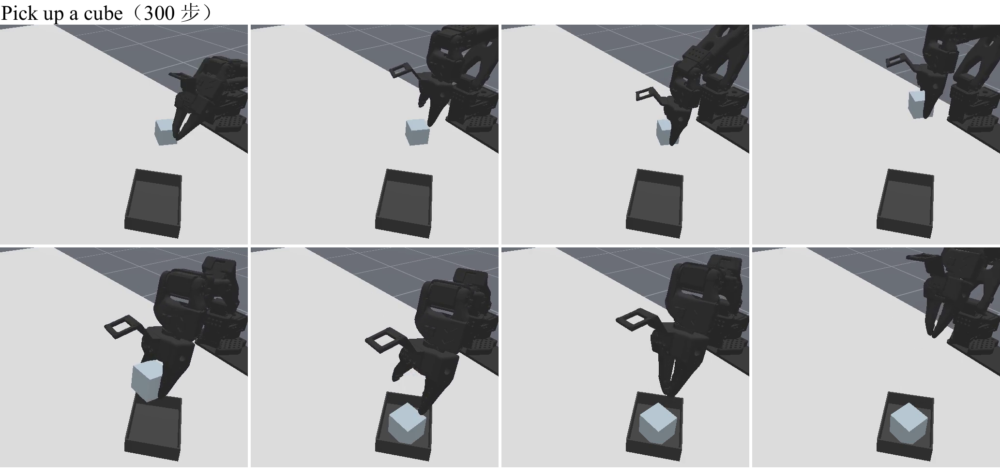
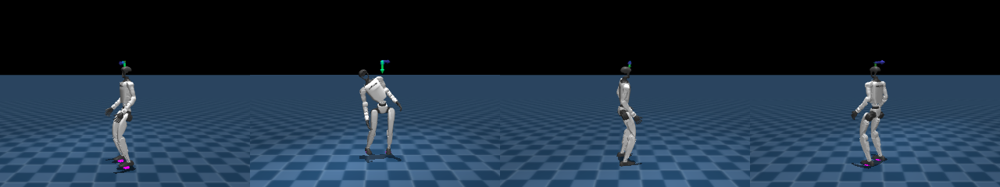
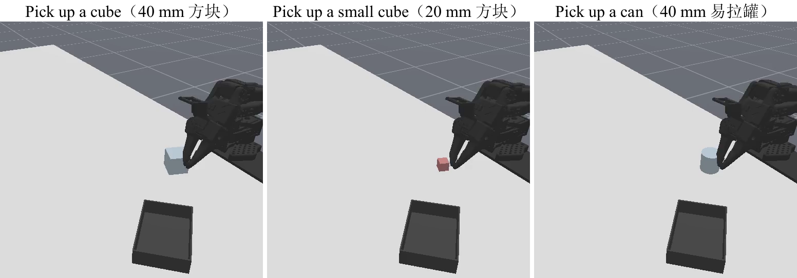
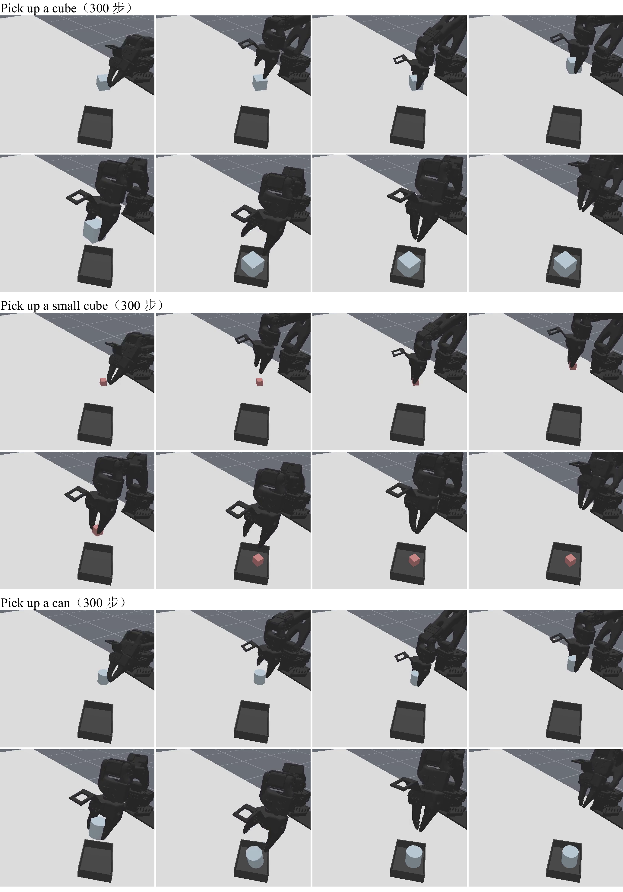
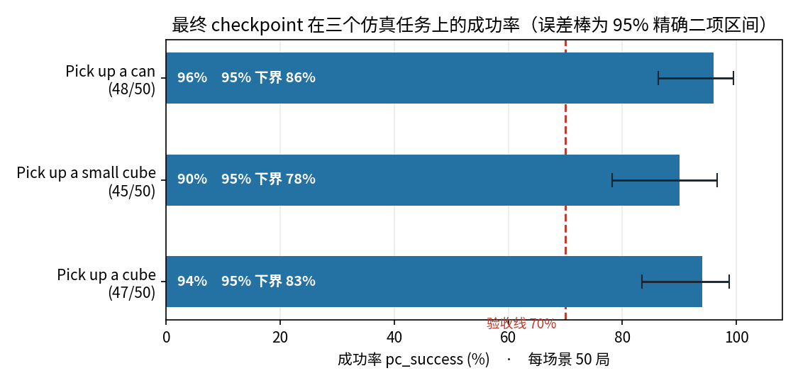

<div align="center">

  <pre style="font-family: 'Courier New', monospace; font-size: 13px; color: #1a1a2e; margin: 0; padding: 0; line-height: 1.2;">
  ██╗  ██╗██████╗  ██████╗ ████████╗██╗ ██████╗███████╗
  ╚██╗██╔╝██╔══██╗██╔═══██╗╚══██╔══╝██║██╔════╝██╔════╝
   ╚███╔╝ ██████╔╝██║   ██║   ██║   ██║██║     ███████╗
   ██╔██╗ ██╔══██╗██║   ██║   ██║   ██║██║     ╚════██║
  ██╔╝ ██╗██████╔╝╚██████╔╝   ██║   ██║╚██████╗███████║
  ╚═╝  ╚═╝╚═════╝  ╚═════╝    ╚═╝   ╚═╝ ╚═════╝╚══════╝
  </pre>

  # Xbotics 具身智能教程（21 讲）

  <p>
    <em>从机器人基础到具身前沿 · Agent / VLN / 世界模型 · 真机优先、仿真兜底</em>
  </p>

  <p>
    📌 <a href="#quick-start">快速开始</a>
    · 📚 <a href="#course-map">课程地图</a>
    · 🖼 <a href="#gallery">课堂实绩</a>
    · 👥 <a href="#team">团队分工</a>
    · 🤝 <a href="CONTRIBUTING.md">贡献指南</a>
  </p>

  <p>
    <a href="LICENSE"></a>
    <a href="https://github.com/Xbotics-Embodied-AI-club/Xbotics-Embodied-Guide"></a>
    
    
  </p>

</div>

| Isaac Lab · G1 崎岖地形 | ACT · 300 步抓放闭环 | SAC · G1 学会走路 |
|:---:|:---:|:---:|
|  |  |  |

大模型会「讲」怎么抓杯子，并不等于机器人能稳定抓住杯子。具身智能难的地方，往往不在某一个算法名词，而在**整条系统链路**：感知、控制、数据、训练、部署、失败回流——缺一环，热闹就停在 PPT 上。

《Xbotics 具身智能教程（21 讲）》是 [Xbotics 具身智能社区](https://github.com/Xbotics-Embodied-AI-club/Xbotics-Embodied-Guide) 出品的**系统实践课**：不是论文综述，也不是纯科普，而是一套围绕真实机器人任务、可跑通 Demo、可复盘失败的工程路径。

> **Guide 帮你看全局，本教程带你动手跑完整闭环。**  
> 仓库：[Xbotics-Embodied-AI-Handbook](https://github.com/Xbotics-Embodied-AI-club/Xbotics-Embodied-AI-Handbook) · 课程已从原「十八讲」扩展为 **二十一讲**。


*上图与 [Embodied-Guide](https://github.com/Xbotics-Embodied-AI-club/Xbotics-Embodied-Guide) 共用社区视觉素材；各讲专用配图见 [`assets/figures/`](./assets/figures/)。*

---

## 这门课在讲什么


| 你将带走的能力 | 怎么练出来 |
|----------------|------------|
| **画出系统闭环** | 身体、感知、状态、策略、控制、数据，缺一块都能定位 |
| **跑通真机 / 仿真双路径** | SO101、xLeRobot、Imeta-Y1、Unitree G1；没有硬件也能用 MuJoCo / ManiSkill / Isaac Lab 做完核心实验 |
| **完成数据 → 训练 → 部署 → 评测** | LeRobot 采数据，ACT / Diffusion / VLA 训练，真机或仿真 rollout |
| **会看失败，而不是只会展示成功** | 每讲都有失败复盘：视觉、动作、时机、位姿、数据覆盖 |

**一句话**：3 个月后，你不是「听说过 VLA」，而是能解释模型如何接入机器人、如何采一份能训练的数据、失败卡在哪一环。

---

<span id="quick-start"></span>

## 快速开始

```bash
git clone git@github.com:Xbotics-Embodied-AI-club/Xbotics-Embodied-AI-Handbook.git
cd Xbotics-Embodied-AI-Handbook
```

1. **读目录**：打开 [`docs/SUMMARY.md`](docs/SUMMARY.md)，从 [总定位](docs/00-preface/01-positioning.md) 建立系统地图。
2. **认领讲次**：在 [`meta/status.md`](meta/status.md) 更新负责讲次；分工见 [团队](#team)。
3. **写稿 + 跑 Demo**：文稿按 [`templates/lecture-template.md`](templates/lecture-template.md)；代码放 `code/lectureNN/`；配图放 `assets/figures/lectureNN/`。

**试跑第 1 讲 Demo（无硬件）：**

```bash
cd code/lecture01
python -m venv .venv && .venv\Scripts\activate   # Linux/macOS: source .venv/bin/activate
pip install -r requirements.txt
python simulation/minimal_reach.py
```

| 目录 | 说明 |
|------|------|
| [`docs/`](docs/) | 书稿正文（**六大部分** · 21 讲） |
| [`code/`](code/) | 每讲 Demo（`lecture01` … `lecture21`，以及 `code/vla/`、`code/rl/`） |
| [`assets/`](assets/) | 配图与演示视频 |
| [`references/`](references/) | 开源链接集中维护 |
| [`meta/`](meta/) | 大纲、进度、贡献者 |
| [`templates/`](templates/) | 单讲标准模板 |

---

<span id="course-map"></span>

## 课程地图

编号已连续：**L1–L16 → L17–L18 VLN → L19 Agent → L20 世界模型 → L21 答辩**。

```
底座（系统怎么转）→ 模块化视觉操作 → 端到端策略 / VLA
→ 强化学习 → VLN 导航 → Agent / 世界模型 → 综合答辩
```

| 部分 | 讲次 | 解决的核心问题 | 阶段项目 |
|------|------|----------------|----------|
| [Part 1 系统基础](#part-1) | L1–L4 | 机器人是闭环系统，不是一个模型 | 基础控制闭环 |
| [Part 2 视觉操作](#part-2) | L5–L7 | 看见、对准、抓住，并恢复失败 | 视觉定位与模块化抓取 |
| [Part 3 端到端](#part-3) | L8–L13 | 从 Pipeline 走到 Policy / VLA | 端到端操作策略学习 |
| [Part 4 强化学习](#part-4) | L14–L16 | 用交互优化：运控、后训练、真机 | 与策略 / 运控能力衔接 |
| [Part 5 VLN](#part-5) | L17–L18 | 语言如何驱动导航与评测 | 语言驱动导航评测 |
| [Part 6 前沿综合](#part-6) | L19–L21 | Agent、世界模型、拼成答辩 | 移动 + 操作综合答辩 |

完整目录：[docs/SUMMARY.md](docs/SUMMARY.md)

---

<span id="gallery"></span>

<span id="part-1"></span>

### 第一部分 · 机器人系统基础（第 1–4 讲）

**阶段项目**：机器人基础控制闭环 · [部分导言](docs/part1-system-basics/00-part-overview.md)

先把「身体」和「闭环」立住。很多课一上来就讲 VLA，学生却不知道动作如何被执行。


| 讲次 | 主题 | 文稿 · 代码 |
|------|------|-------------|
| L1 | 具身智能导论：从「说得对」到「做得成」 | [📖](docs/part1-system-basics/01-introduction.md) · [💻](code/lecture01/) |
| L2 | 机器人系统架构：硬件 / 软件 / ROS2 | [📖](docs/part1-system-basics/02-ros2-architecture.md) · [💻](code/lecture02/) |
| L3 | 机器人本体与控制基础：action 到底是什么 | [📖](docs/part1-system-basics/03-robot-body-control.md) · [💻](code/lecture03/) |
| L4 | 传感器、坐标系与相机模型 | [📖](docs/part1-system-basics/04-sensors-coordinates.md) · [💻](code/lecture04/) |

<span id="part-2"></span>

### 第二部分 · 机器人视觉操作（第 5–7 讲）

**阶段项目**：视觉目标定位与模块化抓取 · [部分导言](docs/part2-vision-manipulation/00-part-overview.md)

看见、对准、抓住，并把失败写成可恢复的状态机——坐标有了，动作还没有。


| 仿真：MuJoCo / Menagerie 中的 SO-101 | 真机：SO-101 主从遥操作 |
|:---:|:---:|
|  |  |

| 讲次 | 主题 | 文稿 · 代码 |
|------|------|-------------|
| L5 | 仿真环境与操作任务搭建：先写任务契约 | [📖](docs/part2-vision-manipulation/05-simulation.md) · [💻](code/lecture05/) |
| L6 | 机器人感知与位姿估计：从「看得到」到「抓得到」 | [📖](docs/part2-vision-manipulation/06-pose-estimation.md) · [💻](code/lecture06/) |
| L7 | 操作技能：抓取、放置与失败恢复 | [📖](docs/part2-vision-manipulation/07-manipulation-skills.md) · [💻](code/lecture07/) |

<span id="part-3"></span>

### 第三部分 · 端到端机器人操作（第 8–13 讲）

**阶段项目**：端到端操作策略学习 · [部分导言](docs/part3-end-to-end/00-part-overview.md)

从手写 pipeline 走到 policy：采一份能训练的数据，用 ACT / Diffusion / Flow Matching 生成动作，再把 OpenVLA、π₀、SmolVLA 微调上真机。


| 第 10 讲 · 方块 / 小方块 / 易拉罐 | 第 12 讲 · SmolVLA 微调后的仿真 rollout |
|:---:|:---:|
|  |  |



*最终 checkpoint：三个仿真任务成功率均过 70% 验收线（罐 96% · 小方块 90% · 方块 94%）*

| 讲次 | 主题 | 文稿 · PDF · 代码 |
|------|------|-------------------|
| L8 | 端到端策略导论：从 Pipeline 到 Policy | [📖](docs/part3-end-to-end/08-端到端策略导论.md) · [📄](docs/part3-end-to-end/pdf/第8讲_端到端策略导论.pdf) · [💻](code/vla/1_policy_rollout/) |
| L9 | 操作数据闭环：采一份能训练的数据集 | [📖](docs/part3-end-to-end/09-操作数据闭环.md) · [📄](docs/part3-end-to-end/pdf/第9讲_操作数据闭环.pdf) · [💻](code/vla/2_data_collection/) |
| L10 | 模仿学习实战：ACT、Diffusion 与 Flow Matching | [📖](docs/part3-end-to-end/10-模仿学习实战.md) · [📄](docs/part3-end-to-end/pdf/第10讲_模仿学习实战.pdf) · [💻](code/vla/3_imitation_learning/) |
| L11 | VLA 模型导览：从 OpenVLA 到 π₀ 家族 | [📖](docs/part3-end-to-end/11-VLA模型导览.md) · [📄](docs/part3-end-to-end/pdf/第11讲_VLA模型导览.pdf) · [💻](code/vla/4_vla_inference/) |
| L12 | VLA 微调实战：从全量 SFT 到 LoRA 上真机 | [📖](docs/part3-end-to-end/12-VLA微调实战.md) · [📄](docs/part3-end-to-end/pdf/第12讲_VLA微调实战.pdf) · [💻](code/vla/5_vla_finetune/) |
| L13 | VLA 前沿：跑得更快、记得更久、用上全身 | [📖](docs/part3-end-to-end/13-VLA前沿.md) · [📄](docs/part3-end-to-end/pdf/第13讲_VLA前沿.pdf) |

<span id="part-4"></span>

### 第四部分 · 强化学习（第 14–16 讲）

[部分导言](docs/part4-reinforcement-learning/00-part-overview.md)

模仿只能复现示教；要让机器人自己变好，就要用交互优化。从 REINFORCE / PPO 学走路，到 GRPO 后训练，再到 off-policy 上真机。


*第 14 讲 · G1 用策略梯度学会走路（仿真）*

| 讲次 | 主题 | 文稿 · PDF · 代码 |
|------|------|-------------------|
| L14 | 强化学习入门：从策略梯度到 PPO | [📖](docs/part4-reinforcement-learning/14-强化学习入门.md) · [📄](docs/part4-reinforcement-learning/pdf/第14讲_强化学习入门.pdf) · [💻](code/rl/1_rl_basics/) |
| L15 | GRPO 后训练：让 VLM 学会数数、让 VLA 自我提升 | [📖](docs/part4-reinforcement-learning/15-GRPO后训练.md) · [📄](docs/part4-reinforcement-learning/pdf/第15讲_GRPO后训练.pdf) · [💻](code/rl/2_grpo_posttraining/) |
| L16 | Off-policy 强化学习：从仿真提速到真机落地 | [📖](docs/part4-reinforcement-learning/16-真机强化学习.md) · [📄](docs/part4-reinforcement-learning/pdf/第16讲_真机强化学习.pdf) · [💻](code/rl/3_offpolicy/) |

<span id="part-5"></span>

### 第五部分 · 视觉语言导航 VLN（第 17–18 讲）

**阶段项目**：语言驱动导航评测 · [部分导言](docs/part5-vln/00-part-overview.md)

「上楼，走过钢琴，在挂着鹿角的墙边停下」——语言如何变成可评测的导航轨迹。


| 讲次 | 主题 | 文稿 · 代码 |
|------|------|-------------|
| L17 | 视觉语言导航：任务与基准 | [📖](docs/part5-vln/17-vln-theory.md) · [💻](code/lecture17/) |
| L18 | 视觉语言导航：方法与实践 | [📖](docs/part5-vln/18-vln-practice.md) · [💻](code/lecture18/) |

<span id="part-6"></span>

### 第六部分 · Agent、世界模型与前沿进展（第 19–21 讲）

**阶段项目**：移动 + 操作综合答辩 · [部分导言](docs/part6-agent-world-model/00-part-overview.md)

LLM 不直接拧电机。Agent 负责目标与规划，Harness 调度技能，VLA / 运动规划负责动作，世界模型负责「先想后果再动手」。


| 讲次 | 主题 | 文稿 · 代码 |
|------|------|-------------|
| L19 | Embodied Agent：从目标到可执行技能 | [📖](docs/part6-agent-world-model/19-embodied-agent.md) · [💻](code/lecture19/) |
| L20 | 世界模型与数据飞轮 · [Fast-WAM](https://github.com/yuantianyuan01/FastWAM) | [📖](docs/part6-agent-world-model/20-world-model.md) · [💻](code/lecture20/) |
| L21 | 前沿进展与综合答辩 | [📖](docs/part6-agent-world-model/21-frontier-progress.md) · [💻](code/lecture21/) |

### 附录

| 模块 | 链接 |
|------|------|
| 全书风格指南 | [📖](docs/style-guide.md) |
| 硬件与仿真环境配置 | [📖](docs/appendix/hardware-setup.md) |
| 教程实施原则 | [📖](docs/appendix/teaching-principles.md) |
| 最终学习成果 | [📖](docs/appendix/learning-outcomes.md) |
| 核心亮点 | [📖](docs/appendix/highlights.md) |

## 五个阶段项目

| 阶段 | 讲次 | 项目名称 |
|------|------|----------|
| 一 | 第 1–4 讲 | 机器人基础控制闭环 |
| 二 | 第 5–7 讲 | 视觉目标定位与模块化抓取 |
| 三 | 第 8–13 讲 | 端到端操作策略学习 |
| 四 | 第 17–18 讲 | 语言驱动导航评测（VLN） |
| 五 | 第 19、20–21 讲 | 移动 + 操作综合答辩 |

---

<span id="team"></span>

## 团队分工

| 角色 | 成员 | 负责范围 |
|------|------|----------|
| **第一部分负责人** | **丛林** | 第 1–4 讲及阶段项目一；协同：翼茗、锦丰 |
| **第二部分负责人** | **育帆** | 第 5–7 讲及阶段项目二；协同：昊旺、志凯、彤彤、宝华 |
| **第三 & 第四部分负责人** | **harry** | 第 8–16 讲及阶段项目三；协同：陈老师、诸老师、罗辑 |
| **第五部分负责人** | **新梦** | 第 17–18 讲（VLN）及阶段项目四；雨浩协同 |
| **第六部分负责人** | **雨浩** | 第 19、20–21 讲及阶段项目五；富平（L19）、煜恒（L20） |
| **大纲总控** | **丛林、木木** | 6 月 30 日整体大纲检查与编写规划 |
| **项目代码管理** | **志凯** | `code/` 结构、复现入口、跨讲依赖与 CI |
| **文稿校验** | **乙然** | 结构/术语/模板合规检查；进度提醒 |
| **进度跟踪** | **乙然** | 每周三 21:00 进度同步提醒 |

详细分工与认领表：[`meta/contributors.md`](meta/contributors.md) · 写作进度：[`meta/status.md`](meta/status.md)

---

<span id="schedule"></span>

## 时间安排

| 节点 | 日期 | 负责人 | 交付物 |
|------|------|--------|--------|
| 整体大纲检查 & 编写规划 | **6 月 30 日** | 丛林、木木 | 大纲定稿、分工确认、里程碑 |
| 各部分大纲完成 | **7 月 5 日前** | 丛林、育帆（Part 2）、**新梦（Part 5）**、harry、雨浩（Part 6） | 各 Part 细纲 |
| 第一版初稿 | **7 月 26 日前** | 全体 | 文稿 + Demo 骨架 + 配图清单 |
| 第一版修改版 | **8 月 2 日前** | 全体 | 根据校验与互审意见修订 |
| 例行进度同步 | **每周三 21:00** | 乙然提醒，各 Part 负责人汇报 | 进度更新 `meta/status.md` |

---

<span id="writing-style"></span>

## 课程内容风格

本课程**不是论文综述，也不是纯科普**，而是面向**高校学生、企业开发者和机器人初学者**的具身智能**工程实践**课程。

> **完整约定**（标题编号、配图、定稿检查清单、旧稿迁移优先级）：见 [`docs/style-guide.md`](docs/style-guide.md)。下文为摘要。

### 整体风格（四点）

| 原则 | 说明 |
|------|------|
| **简单直接** | 少用大词、少堆论文名；用真实机器人任务解释概念 |
| **任务驱动** | 每讲围绕具体任务，如「让机械臂到达目标点」「把碗放到盘子上」 |
| **讲清楚，再实验** | 概念讲到能解释「为何」和排错；不堆无关推导，也不为省篇幅砍必要直觉 |
| **重视失败复盘** | 不只展示成功 Demo，还要教怎么看失败、怎么归因、怎么改进 |

**推荐写法：**

```
提出问题 → 讲清概念 → 跑通 Demo → 分析失败 → 完成作业
```

### 每讲必备章节（10 模块）

写作请严格遵循 [`templates/lecture-template.md`](templates/lecture-template.md)：

| # | 模块 | 要求 |
|---|------|------|
| 1 | **本讲目标** | 学完后能回答什么、能完成什么（用问句列出） |
| 2 | **核心知识点** | 5–10 条，每条必须服务后面的实验，不堆概念 |
| 3 | **课堂任务 / 引入案例** | 用具体任务带出概念（如 LIBERO「把碗放到盘子上」） |
| 4 | **方法框架** | 把案例经验抽象为可复用框架（如训练效果分析三步法） |
| 5 | **有硬件版 Demo** | SO101 / xLeRobot / Imeta / G1 真机路径 |
| 6 | **无硬件仿真版 Demo** | MuJoCo / ManiSkill / Isaac Lab 等兜底 |
| 7 | **实验步骤** | 可逐步执行的操作清单 |
| 8 | **作业交付** | 明确产出物（代码、图、视频、表格） |
| 9 | **常见失败与复盘** | 失败现象 + 复盘问题 |
| 10 | **参考开源项目** | 链接汇总到 [`references/links.md`](references/links.md) |

**方法框架示例 — 训练效果分析三步法：**

1. 看 **loss**：模型是否学进数据
2. 看 **成功率**：任务是否做成
3. 看 **rollout 视频**：失败卡在哪里

**失败分析五类框架**：视觉 · 动作 · 时机 · 目标位姿 · 数据覆盖

### 文章与配图风格

| 维度 | 约定 |
|------|------|
| **语言** | 中文为主；术语与 [`meta/outline.yaml`](meta/outline.yaml) 及 [Embodied-Guide](https://github.com/Xbotics-Embodied-AI-club/Xbotics-Embodied-Guide) 保持一致 |
| **结构** | 层级清晰：`# 第 N 讲` → `## N.1 本讲目标`；大块之间用 `---` 分隔 |
| **代码** | 正文只放关键片段；完整代码在 `code/lectureNN/` |
| **配图命名** | `assets/figures/lectureNN/fig-NN-M-英文名.png` |
| **社区共用图** | 系统地图、学习路线等可与 Guide 共用；专用示意图放本仓库 `assets/` |
| **图标约定** | ⭐ 必看 · 🧪 实作 · 📦 代码/数据 · 📄 论文 · 🎥 视频（与 Guide 一致） |
| **双路径** | 每讲必须分别写清有硬件 / 无硬件方案 |

---

## 项目理念

- **系统地图清晰**：21 讲、六大部分，先全局再模块，最后拼成闭环
- **真机优先、仿真兜底**：没有硬件也能完成每讲核心实验
- **数据和失败同等重要**：成功 Demo 之外，必须有失败样本与回流路径
- **与社区联动**：路线查 [Embodied-Guide](https://github.com/Xbotics-Embodied-AI-club/Xbotics-Embodied-Guide)，求职查 [Embodied-AI-Job](https://github.com/Xbotics-Embodied-AI-club/Xbotics-Embodied-AI-Job)

## 相关仓库

| 仓库 | 关系 |
|------|------|
| [Xbotics-Embodied-Guide](https://github.com/Xbotics-Embodied-AI-club/Xbotics-Embodied-Guide) | 学习路线、资源导航、社区共用配图 |
| [Xbotics-Embodied-AI-Job](https://github.com/Xbotics-Embodied-AI-club/Xbotics-Embodied-AI-Job) | 具身智能求职信息 |
| [LeRobot](https://github.com/huggingface/lerobot) | 本教程主要数据采集与训练框架 |

---

## 参与贡献

欢迎 Xbotics 社区成员按分工提交 PR。完整流程见 [`CONTRIBUTING.md`](CONTRIBUTING.md)。

1. 只改你负责的 Part / 讲次（见 [团队分工](#team)）
2. 文稿必须符合 [写作风格](#writing-style)、[`docs/style-guide.md`](docs/style-guide.md) 与单讲模板
3. 合并前由 **乙然** 做结构/术语校验；**志凯** 审核代码可复现性
4. 进度每周三更新 [`meta/status.md`](meta/status.md)

---

## 加入社区


*扫码关注官方公众号 · 加入内测交流群*

---

## License

MIT — 书稿与代码以教程传播与教学为目的开放协作；与 [Embodied-Guide](https://github.com/Xbotics-Embodied-AI-club/Xbotics-Embodied-Guide) 共用配图时请保留社区出处说明。
