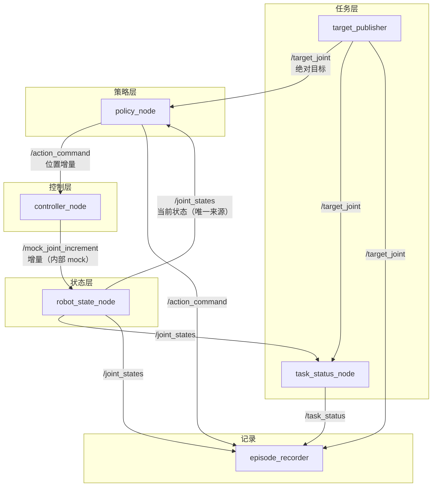

# Lecture 02 — 机器人系统架构：硬件、软件与 ROS2

> 对应文稿：见 `docs/` 中第 2 讲（2.5–2.8 节）

## 本讲 Demo

用最少模块展示一个完整的 ROS2 闭环：**让六关节机械臂从当前关节位置移动到目标关节位置，并记录完整过程**。

六个节点 + 四个核心 Topic 组成闭环：目标下发 → 策略生成增量 → 控制器校验执行 → 状态反馈 → 任务判定 → 过程记录。默认走 **mock 无硬件路径**（`controller_node` 只更新内存中的模拟关节值，不驱动电机），有 SO101 / LeRobot 兼容机械臂时再替换状态与控制两个边界。

## 目录结构

```
lecture02/
├── README.md                     # 本文件
├── requirements.txt              # Python 依赖（ROS2 环境外的额外依赖）
├── hardware/                     # 真机脚本（SO101 / xLeRobot / G1）
└── simulation/                   # 无硬件可运行路径（ROS2 mock）
    ├── example_episode.jsonl     # 本环境实测的 episode 记录样例
    └── robot_ws/                 # colcon 工作空间，可直接构建
        └── src/robot_demo/       # ament_python 包
            ├── package.xml
            ├── setup.py          # 6 个 console_scripts 入口
            ├── setup.cfg
            ├── resource/robot_demo
            ├── robot_demo/
            │   ├── common.py     # 共享常量（关节名/限位/阈值/频率）
            │   ├── target_publisher.py
            │   ├── robot_state_node.py
            │   ├── policy_node.py        # 含 build_action() 策略函数
            │   ├── controller_node.py
            │   ├── task_status_node.py
            │   └── episode_recorder.py
            └── launch/minimal_loop.launch.py
```

> 本包**未使用** `ros2 pkg create` 生成，而是按标准 `ament_python` 结构手工创建，额外加入共享常量模块 `robot_demo/common.py`（统一关节数量/名称顺序/限位/阈值，避免 6 个节点硬编码不一致），其余结构与 `ament_python` 模板一致。

## 系统架构

### 数据流图（四层结构）



**方向说明**：

- **指令下行**：`target_publisher → policy_node → controller_node → robot_state_node`（目标 → 策略 → 控制器 → 执行）。
- **状态上行**：`robot_state_node → policy_node / task_status_node / episode_recorder`（唯一状态源向上反馈）。
- **结果反馈**：`task_status_node → episode_recorder`（任务判定回写记录）。

### 节点职责表

| 节点 | 输入 | 输出 | 职责 | 接硬件时 |
| --- | --- | --- | --- | --- |
| `target_publisher` | 定时（1Hz） | `/target_joint` | 发布六关节绝对目标 | 通常保留 |
| `robot_state_node` | mock 或硬件反馈 | `/joint_states` | 读取并发布关节状态，**唯一发布者** | 替换读取逻辑，保留 Topic |
| `policy_node` | `/target_joint`、`/joint_states` | `/action_command` | 由目标误差生成关节增量 | 可保留或替换为学习策略 |
| `controller_node` | `/action_command` | `/mock_joint_increment`（内部） | 校验并执行动作，更新 mock | 必须适配验证过的驱动 |
| `task_status_node` | `/target_joint`、`/joint_states` | `/task_status` | 判断 running/reached/timeout/stale_state | 保留并增加硬件异常 |
| `episode_recorder` | 四个核心 Topic | episode 文件（JSONL） | 记录目标/状态/动作/结果 | 保留并扩展相机等数据 |

### Topic 契约表

| Topic | 消息类型 | 语义与单位 | 发布者 | 主要消费者 |
| --- | --- | --- | --- | --- |
| `/target_joint` | `std_msgs/Float64MultiArray` | 六关节**绝对目标**，弧度，顺序固定 | `target_publisher` | `policy_node`、`task_status_node`、记录器 |
| `/joint_states` | `sensor_msgs/JointState` | 关节名称、位置、速度、时间戳 | `robot_state_node`（**唯一**） | 策略/控制/判断/记录 |
| `/action_command` | `std_msgs/Float64MultiArray` | 本周期六关节**位置增量**，弧度 | `policy_node` | `controller_node`、记录器 |
| `/task_status` | `std_msgs/String` | `running`/`reached`/`timeout`/`stale_state` | `task_status_node` | 任务管理与记录器 |

> **最容易错的一处对齐**：`/target_joint` 是**绝对位置**，`/action_command` 是**位置增量**。两者语义不同、单位相同（弧度），千万别把增量当绝对目标下发。

> **内部 mock Topic**：`/mock_joint_increment`（`std_msgs/Float64MultiArray`，增量）是 mock 无硬件路径的实现细节，用于 `controller_node` 更新 `robot_state_node` 内部 mock 状态。接真实硬件时由 `controller_node` 的直接驱动命令替代，此 Topic 随之移除，四个核心 Topic 契约不变。

## 环境要求

| 项目 | 值 |
| --- | --- |
| 操作系统 | Ubuntu 22.04.5 LTS |
| ROS2 发行版 | Humble |
| Python 版本 | 3.10.12 |
| numpy | 1.21.5 |
| 构建工具 | colcon（`--symlink-install`） |
| 验证日期 | 2026-08-15 |

> 本讲不使用 `code/` 根的 uv 统一环境：ROS2 节点依赖系统 ROS2 发行版自带的 `rclpy`，请在 source 过 ROS2 环境的终端里构建与运行。

## 快速开始（仿真）

### 1. 构建

```bash
source /opt/ros/humble/setup.bash            # 换成你的 ROS2 发行版
cd code/lecture02/simulation/robot_ws
colcon build --symlink-install
source install/setup.bash
```

> 构建失败先看**最早**的错误：依赖名拼错、入口函数未声明、Python 文件不可导入、忘记 source 工作空间。

### 2. 运行闭环

```bash
# 终端 1：一键启动 6 个节点
ros2 launch robot_demo minimal_loop.launch.py

# 指定 episode 输出文件（默认 /tmp/episode.jsonl）
ros2 launch robot_demo minimal_loop.launch.py output_file:=~/episode.jsonl
```

单节点调试（替代 launch）：`ros2 run robot_demo <节点名>`，节点名为 `target_publisher`、`robot_state_node`、`policy_node`、`controller_node`、`task_status_node`、`episode_recorder`。

### 3. 验证（另开终端，先 source 工作空间）

```bash
source /opt/ros/humble/setup.bash
cd code/lecture02/simulation/robot_ws && source install/setup.bash

ros2 node list                     # 预期 6 个节点
ros2 topic list                    # 预期 4 个核心 Topic + /mock_joint_increment
ros2 topic info -v /joint_states   # 类型 sensor_msgs/JointState，仅 robot_state_node 发布
ros2 topic echo /task_status       # 观察 running → reached
ros2 topic echo /joint_states      # 状态逐渐接近目标
ros2 topic hz /joint_states        # 频率稳定（~20Hz）
```

也可以手动发布一次目标（默认 `target_publisher` 已周期发布，可跳过）：

```bash
ros2 topic pub --once /target_joint \
  std_msgs/msg/Float64MultiArray \
  "{data: [0.0, -0.4, 0.8, 0.0, 0.4, 0.0]}"
```

**通过标准（三项同时成立）**：

1. `/action_command` 受单步限幅（单步绝对值 ≤ 0.05 rad）；
2. `/joint_states` 逐渐接近目标；
3. `/task_status` 从 `running` 变为 `reached`。

只看到动作消息 ≠ 闭环工作。

## 关键约束（实现落点）

1. **`/joint_states` 唯一来源**：只有 `robot_state_node` 发布；`controller_node` 通过内部 Topic 更新 mock，绝不伪造第二路状态。
2. **动作维度一致**：六关节固定 `joint_1`~`joint_6` 顺序（定义于 `common.py`），`controller_node` 校验维度，不符即拒绝。
3. **动作单步限幅**：`policy_node` 内 `np.clip(gain * error, -max_step, max_step)`，`controller_node` 再做一次防御性 clip，确保不可绕过控制器。
4. **状态新鲜度检查**：`task_status_node` 以 10Hz 定时器检查状态年龄，超过 200ms 判 `stale_state`。用定时器而非回调，否则状态停止更新时根本不会触发回调。
5. **任务成功来自反馈**：最大关节误差 < 0.02 rad 判 `reached`，超过 15s 判 `timeout`；绝不以「命令已发送」代替成功。
6. **硬件替换只动两个边界**：`robot_state_node`（读状态）+ `controller_node`（发驱动命令）；`/action_command` 绝不能绕过厂商控制器直接连电机。

## 可调参数（单变量原则，一次改一个）

所有共享常量集中在 `robot_demo/common.py`，节点不得各自硬编码。改关节数 / 名称 / 限位只改这一个文件。

| 参数 | 位置 | 默认 | 调小/调大现象 |
| --- | --- | --- | --- |
| `GAIN` | `common.py` / `policy_node.build_action` | 0.5 | 过小→收敛慢；过大→可能振荡 |
| `MAX_STEP` | `common.py` | 0.05 | 过大→越界/振荡 |
| `STATE_RATE` | `common.py` | 20 Hz | 过低→控制迟缓、可能触发 `stale_state` |
| `REACH_TOLERANCE` | `common.py` | 0.02 | 过小→长期 `running`；过大→过早报成功 |
| `TASK_TIMEOUT` | `common.py` | 15 s | 过短→误报 `timeout` |

## 运行证据（本环境实测）

- `ros2 node list`：`/controller_node`、`/episode_recorder`、`/policy_node`、`/robot_state_node`、`/target_publisher`、`/task_status_node`（6 个，齐全）。
- `ros2 topic info -v /joint_states`：**Publisher count = 1**（仅 `robot_state_node`），订阅者 = `policy_node` / `task_status_node` / `episode_recorder`。
- `ros2 topic info -v /action_command`：发布者 = `policy_node`，订阅者 = `controller_node` / `episode_recorder`。
- `/task_status` 日志序列（去重后）：`running` ×9 → `reached` ×1。
- episode 状态序列：`running` ×47 → `reached` ×1，最终 `success=true, error=null`（完整记录见 [`simulation/example_episode.jsonl`](simulation/example_episode.jsonl)）。
- 单步限幅实测：`max |action_command| = 0.0500`（≤ 0.05 rad）。

最终状态精确收敛到目标：

```
joint_state:  [0.0, -0.4, 0.8, 0.0, 0.4, 0.0]
target_joint: [0.0, -0.4, 0.8, 0.0, 0.4, 0.0]   → reached
```

### episode 记录字段

```text
timestamp | joint_state | target_joint | action_command | task_status | success | error
```

样例（节选自 `simulation/example_episode.jsonl`）：

```json
{
  "timestamp": 1786727046.96,
  "joint_state": [0.0, -0.3999755859375, 0.79375, 0.0, 0.3999755859375, 0.0],
  "target_joint": [0.0, -0.4, 0.8, 0.0, 0.4, 0.0],
  "action_command": [0.0, -1.220703125e-05, 0.003125, 0.0, 1.220703125e-05, 0.0],
  "task_status": "reached",
  "success": true,
  "error": null
}
```

## 真机路径

见 [`hardware/README.md`](hardware/README.md)。核心原则：只替换 `robot_state_node`（读状态）与 `controller_node`（发驱动命令）两个边界，其余节点与 Topic 契约不变。

## 常见失败排查

| 现象 | 首要检查 |
| --- | --- |
| 预期节点没出现 | `ros2 node list` + Launch 终端最早报错 |
| Topic 存在但无数据 | 发布节点是否运行、回调是否触发 |
| 发布/订阅不通 | Topic 名称或消息类型是否一致 |
| 报 `stale_state` | 状态时间戳/频率 |
| 策略不发动作 | 目标缺失、状态为空、维度不一致 |
| 动作变但状态不变 | `controller_node` 是否订阅并更新 mock |
| 状态越界振荡 | 增益/单步上限过大、反馈延迟 |
| 长期 `running` | 到达阈值过小、噪声大、目标不可达 |

## 状态

- [x] 仿真 Demo 可运行（Ubuntu 22.04 + ROS2 Humble 实测，见「运行证据」）
- [ ] 真机 Demo 可运行
- [ ] 与文稿实验步骤一致
- [ ] 常见失败已写入文稿

## 贡献

修改本讲代码请开 PR，标题格式：`[Lecture 02] ...`
