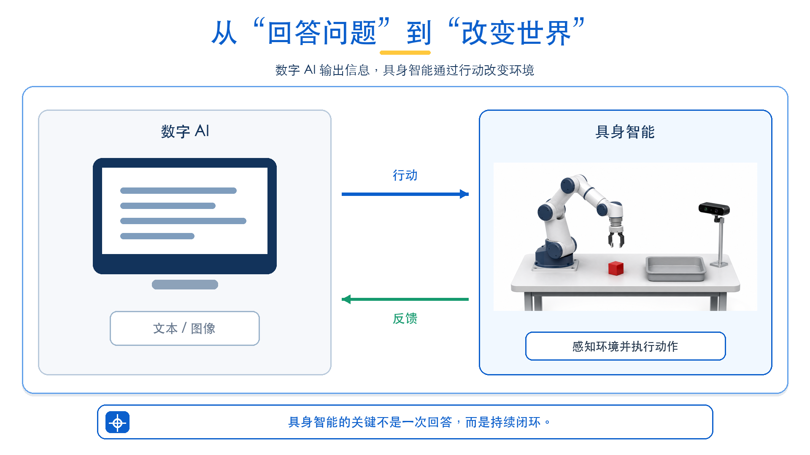
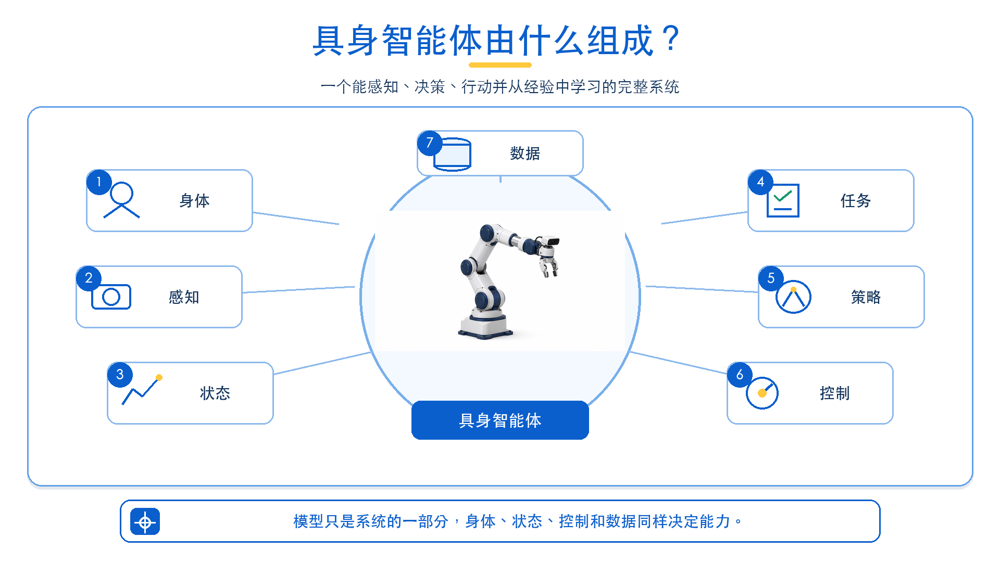
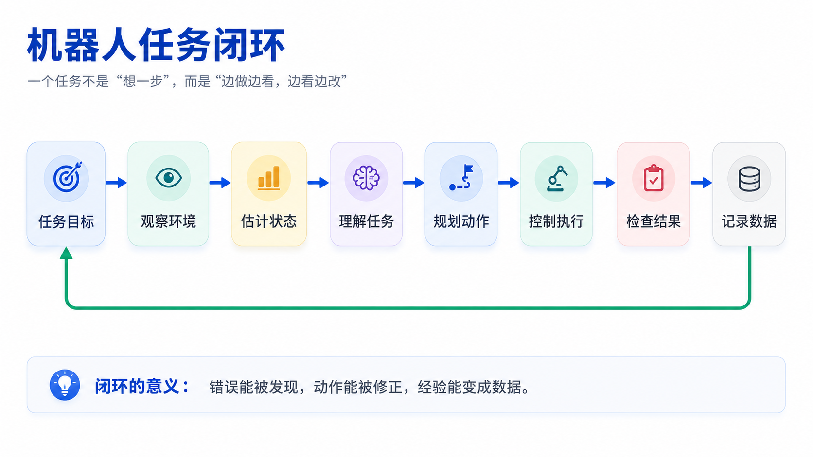
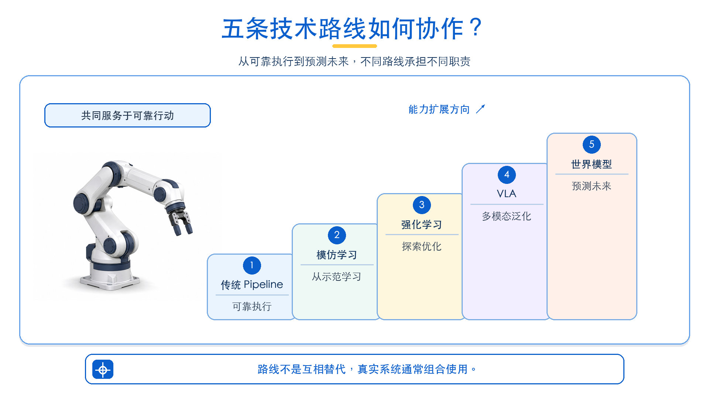
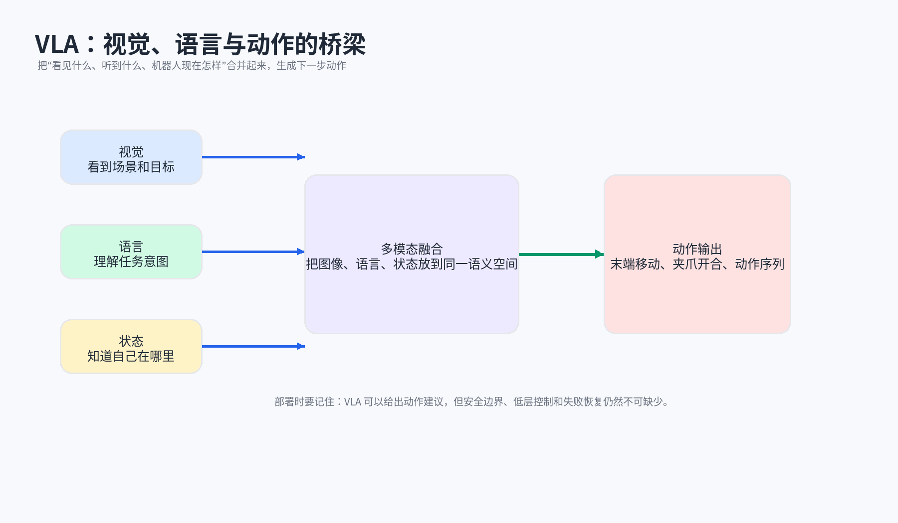
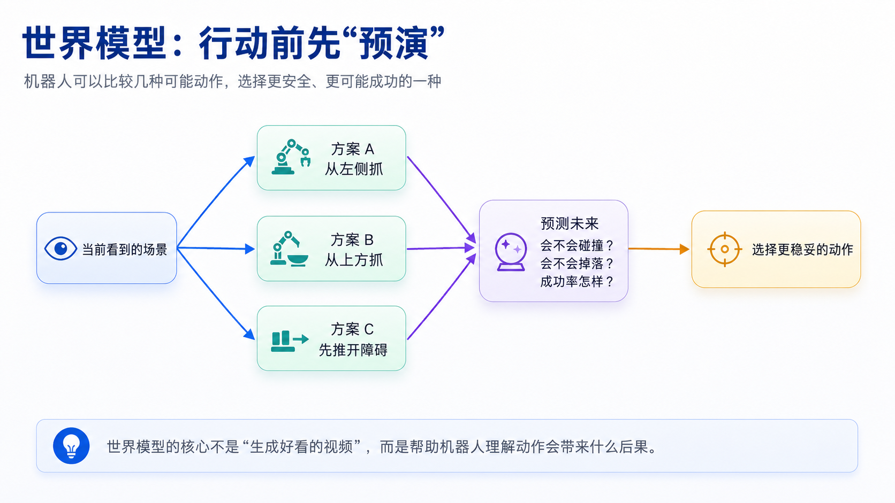
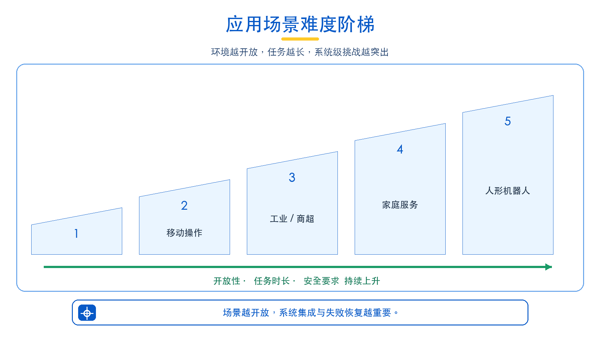
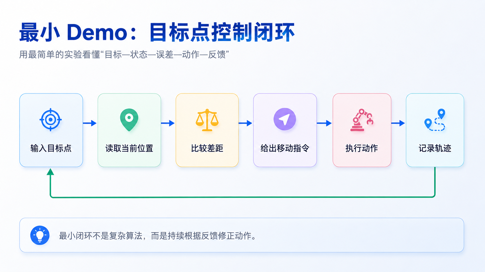
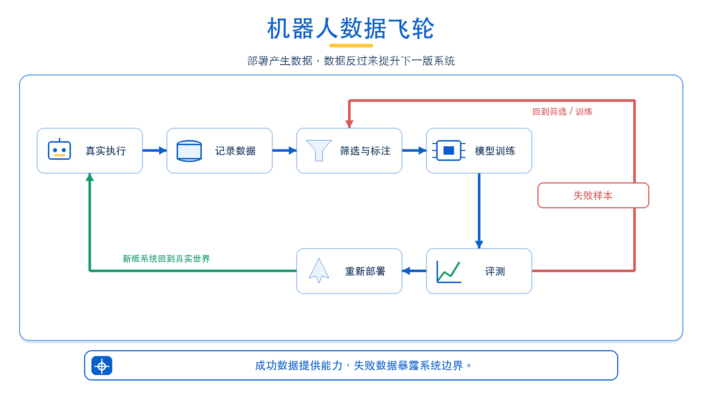

# 第 1 讲：具身智能导论：从大模型到物理世界智能体

课程讲义｜图文简明版

> 这一讲先不急着钻进算法。我们从一个更根本的问题出发：AI 已经能把“如何抓杯子”说得头头是道，为什么机器人真正伸出手时，仍可能抓偏、碰倒，甚至不知道自己失败了？

## 本讲提要



*图 1-1 从“回答问题”到“改变世界”*

具身智能讨论的，不是模型能不能给出一个看起来正确的答案，而是一个有身体的智能体能不能在真实世界中把任务可靠地做完。

在数字世界里，AI 通常完成一次输入输出：给一段文字，生成一段回答；给一张图片，输出一个类别；给一个提示词，生成一张图。

而机器人输出的却是动作。动作会改变杯子的位置、机器人的姿态，也会改变下一次传感器看到的世界。一次抓偏可能碰倒杯子，一次规划错误可能让后续步骤全部失效，严重时还会带来安全风险。

这正是本讲要建立的第一条主线：

```text
数字 AI：输入数据 → 模型推理 → 输出结果
具身智能：观察环境 → 决策动作 → 改变环境 → 获得反馈 → 持续修正
```

完成本讲后，读者应能够：

1. 说明具身智能与传统 AI、传统机器人、大模型应用之间的区别；
2. 画出具身智能系统的基本闭环；
3. 初步理解传统 Pipeline、模仿学习、强化学习、VLA、世界模型和人形机器人等路线；
4. 解释为什么机器人系统必须关注实时性、安全性、物理约束、失败恢复和数据回流；
5. 完成一个最小机器人闭环 Demo，并能说清楚其中的状态、动作、反馈和数据记录。

## 1.1 本讲导入：为什么 AI 进入物理世界后问题变了？

过去几年，AI 在文本、图像、视频和代码任务上快速进步。它可以解释“抓杯子”的步骤，也可以从图片里识别杯子。但把这两种能力接到机器人上，杯子并不会因此自动被抓起来。

问题出在哪里？

数字任务主要处理信息之间的关系；机器人任务还要面对身体、时间和物理后果。机器人必须看见环境、判断目标、移动身体、接触物体、发现失败，并在整个过程中保证安全。更关键的是，它的每一步动作都会改变世界，改变后的世界又会反过来影响下一步决策。

换句话说，AI 一旦进入物理世界，任务就从“给出答案”变成了“参与一个持续变化的过程”。

### 1.1.1 从静态推理到动态交互

普通 AI 更像是在回答一个问题：

```text
输入 → 模型 → 输出
```

机器人则是在参与一个过程：

```text
观察 → 决策 → 行动 → 环境变化 → 再观察 → 再决策
```

同样是“认错杯子”，后果完全不同。视觉模型识别错了，原图并不会改变；机器人抓错了，杯子可能被碰倒，桌面状态也随之变化。下一次感知面对的，已经不是刚才那个世界。

这就是闭环为什么重要：系统不能在起点做一次判断，然后一路执行到底。它必须边行动、边观察、边修正。

### 1.1.2 “说得对”与“做得成”的差距

如果我们问大语言模型“如何抓杯子”，它通常能给出一套合理步骤：定位杯子、规划路径、打开夹爪、靠近目标、闭合夹爪、抬起物体。

这段回答没有错，却远远不够。真实机器人还要回答另一组更具体的问题：

1. 杯子是否真的在相机视野中？
2. 杯子是否透明、反光或被遮挡？
3. 杯子的三维位置如何估计？
4. 相机坐标系如何转换到机器人坐标系？
5. 夹爪从哪个角度接近更稳定？
6. 机械臂路径是否会碰撞桌面或其他物体？
7. 夹爪力度是否合适？
8. 抓取失败后如何判断和重试？
9. 人突然靠近时是否需要停机？

这九个问题里，只有一小部分属于语言理解。其余问题分布在感知、几何、规划、控制、反馈、安全和数据系统中。

所以，“说得对”解决的是知识表达，“做得成”考验的是完整系统。具身智能真正困难的地方，恰恰在二者之间。

### 1.1.3 物理世界带来的四类约束

为什么不能把大模型生成的动作直接发给电机？因为物理世界至少加上了四类硬约束。

第一是**实时性**。机器人控制有频率要求，不能无限等待模型推理。移动机器人避障、人形机器人维持平衡、机械臂完成接触控制，都必须在有限时间内完成感知和反应。

第二是**安全性**。机器人有电机、关节和动能。错误动作不只是“答错了”，还可能造成碰撞、损坏物体，甚至伤害人。因此，任何模型输出都必须经过安全边界检查。

第三是**物理可行性**。机械臂关节不能超过角度范围，夹爪不能穿过物体，底盘不能瞬间移动，人形机器人也不能违反平衡条件。模型提出的动作，最终必须得到身体和物理规律的允许。

第四是**闭环反馈**。物体会滑动，人会进入工作区，目标会被遮挡。机器人不能只执行一条预先写好的轨迹，而要根据最新观察持续调整。

这四类约束共同说明：物理世界不会因为模型“理解了任务”就自动配合。

### 1.1.4 本节小结

从普通 AI 到具身智能，真正改变的不是模型名字，而是任务形态：

| 普通 AI | 具身智能 |
| --- | --- |
| 处理静态或离线数据 | 面对动态物理环境 |
| 输出文本、标签、图像 | 输出动作、轨迹、控制指令 |
| 错误多是信息错误 | 错误可能造成物理后果 |
| 单次推理即可完成很多任务 | 必须持续闭环执行 |
| 数据主要来自互联网 | 数据来自真实机器人交互和仿真 |

后续课程讨论数据采集、模仿学习、VLA、世界模型和部署，最终都要回到同一个检验标准：机器人能否在真实世界中稳定、可靠、可持续地完成任务。

## 1.2 第一张地图：什么是具身智能？



*图 1-2 具身智能体由什么组成*

说到“具身”，一个常见误解是把身体看成模型外面的一层硬件外壳。其实，身体不是容器，而是智能体获得信息、采取行动和承受后果的基础。

人类理解杯子，不只因为看过杯子的图片。我们还可以伸手拿起它，感受重量，判断里面是否有水，预测它会不会倾倒。对机器人来说，杯子也不只是一个视觉标签，而是一个可抓取、可推动、可避让、可放置或可使用的对象。

基于这个视角，可以给出本课程采用的定义：

> 具身智能是指智能体依托身体，在真实或仿真的物理环境中，通过感知、理解、规划、行动、反馈和学习，完成开放世界任务的能力。

### 1.2.1 具身智能体的七个组成部分

如果只看到模型，就会漏掉系统的大半。一个完整的具身智能体通常包含七个相互约束的部分：

| 组成部分 | 作用 | 例子 |
| --- | --- | --- |
| 身体 | 决定能做什么 | 机械臂、移动底盘、人形机器人、灵巧手 |
| 感知 | 决定能看到什么 | RGB 相机、深度相机、力觉、触觉、IMU |
| 状态 | 决定是否知道自己在哪里 | 关节角、末端位姿、夹爪状态、底盘位姿 |
| 任务 | 决定要做什么 | 抓杯子、搬箱子、整理桌面、补货 |
| 策略 | 决定下一步怎么做 | 规划器、模仿学习策略、VLA 策略 |
| 控制 | 决定动作能否稳定执行 | 位置控制、速度控制、力控、全身控制 |
| 数据 | 决定系统能否持续变好 | 示教数据、失败样本、部署日志、标签 |

这七部分不是简单拼装。身体改变，动作空间就会改变；传感器改变，系统能获得的信息也会改变；数据分布改变，同一种算法的效果也可能完全不同。

因此，讨论具身智能时，不能只问“用了什么模型”，还要继续问：它装在什么身体上，看到什么信息，输出什么动作，又怎样知道自己做对了。

### 1.2.2 身体不是容器，而是能力边界

身体首先决定智能体“能做什么”，也决定它“做不到什么”。

机械臂擅长桌面抓取和固定工位操作，但很难自己移动到另一个房间。移动底盘可以导航，但没有机械臂就无法操作物体。人形机器人理论上最适合进入人类环境，但它需要处理平衡、双臂协同和安全问题，复杂度也最高。

这意味着，具身智能不能脱离硬件本体来谈。一个算法是否有效，必须放回具体身体、具体传感器和具体任务中判断。

### 1.2.3 感知不是“看见”，而是获得可行动信息

感知也不只是“看见了什么”。对机器人来说，真正有用的是能够支持行动的信息。

例如桌面上有一个红色杯子。普通图像理解只要说出“这里有杯子”即可；机器人还需要知道杯子在哪里、离夹爪多远、从哪个方向抓更稳、周围是否有障碍、杯子是否可能滑动。

也就是说，识别出“这是杯子”只是起点。机器人通常还需要以下信息：

1. 目标类别；
2. 目标位置；
3. 目标姿态；
4. 可抓取区域；
5. 障碍物位置；
6. 接触状态；
7. 是否完成任务。

### 1.2.4 数据让系统形成长期学习能力

一个机器人完成任务，只解决了眼前的问题；一个机器人把过程记录下来，才有可能解决下一次的问题。

如果失败被忽略，系统很难知道自己为什么没有做好。相反，把成功和失败过程记录下来，经过筛选与标注，再用于训练和评测，机器人就可能逐步改进。

这些数据通常包括图像、深度、关节状态、动作、语言指令、任务结果、人工修正和失败原因。数据不是系统运行后的附属品，而是持续学习能力的一部分。

## 1.3 具身智能系统闭环：机器人到底如何完成一个任务？



*图 1-3 机器人任务闭环*

到这里，我们已经有了身体、感知、状态、任务、策略、控制和数据。问题是：这些部分怎样真正协作起来？

用一个简单任务把它们串起来：

> 把桌上的红色杯子放到托盘里。

对人来说，这句话几乎可以直接变成动作。对机器人来说，它却是一条由多个环节组成的链：理解任务、找到目标、估计位置、选择抓取方式、控制机械臂、检查是否抓住、移动到托盘、放下物体，再判断结果。

任何一环出错，任务都可能失败；而前一环的输出，又会成为后一环的输入。这就是系统闭环。

### 1.3.1 任务输入：从用户意图到机器可执行目标

用户说的是意图，机器人执行的却必须是明确目标。“把红色杯子放到托盘里”至少要被拆成：目标物是红色杯子，目标区域是托盘，任务类型是抓取并放置。

对于复杂任务，系统还要生成子目标。例如“整理桌面”可以拆成：识别桌面物体、判断哪些需要整理、逐个抓取、放到对应区域、检查桌面是否清空。

### 1.3.2 环境感知：识别目标和约束

目标明确以后，机器人要先确认真实世界是否与任务描述一致。它通过相机、深度传感器或其他传感器寻找杯子，同时识别托盘、桌面边缘、障碍物，以及所有可能影响抓取的因素。

在真实系统中，感知往往是最容易出问题的环节之一。光照变化、遮挡、反光、透明物体、堆叠场景都会让感知变得困难。

### 1.3.3 状态估计：知道自己和目标在哪里

看见目标还不够。机器人必须知道目标在哪里，也必须知道自己在哪里。

机械臂需要知道各个关节角度、末端位置、夹爪状态；移动机器人需要知道自己在地图中的位置；人形机器人还需要知道身体姿态、重心和平衡状态。

状态估计一旦偏差过大，后面的规划即使数学上正确，也可能把机器人带到错误位置。

### 1.3.4 策略与规划：决定下一步做什么

有了目标和状态，系统才轮到决定下一步。策略回答“做什么”，规划把目标转成可执行路径。

传统 Pipeline 往往显式生成抓取点和轨迹；模仿学习可能直接从图像和状态预测动作；VLA 则把视觉、语言和状态结合起来输出动作建议。

真正落地时，系统常采用混合方式：高层模型理解任务，规划器检查路径可行性，低层控制器稳定执行，安全模块负责兜底。不是每个问题都需要交给同一个模型解决。

### 1.3.5 控制执行：把决策变成稳定动作

策略给出的“下一步动作”仍不是电机可以直接执行的命令。控制层要把目标位置、速度或轨迹变成稳定、受限、符合硬件接口的控制信号。

可以用一句直观的话理解最小控制器：

> 当前位置离目标越远，移动指令越大；越接近目标，移动指令越小。

这就是很多基础控制器的核心思想。后续课程会再展开更完整的控制方法。

### 1.3.6 反馈检测与失败恢复

动作执行以后，系统还不能立刻宣布成功。它必须检查真实结果：

1. 是否抓住了杯子？
2. 杯子是否掉落？
3. 是否放到了托盘里？
4. 是否发生碰撞？
5. 是否需要重新抓取？

没有反馈，系统只能知道“命令发出去了”，却不知道“杯子是否真的进了托盘”。反馈检测正是从执行动作到完成任务之间的那道门槛。

### 1.3.7 数据记录与模型迭代

每完成一次任务，闭环还可以继续向外延伸：把过程变成数据。

成功数据说明哪些行为有效，失败数据暴露系统在哪些地方不可靠。真正有价值的记录，不只是最后的成功或失败，还包括任务指令、图像、状态、动作、时间戳、异常原因和人工修正。

这些记录会成为下一轮训练、评测和系统优化的原材料。于是，任务闭环进一步变成了学习闭环。

## 1.4 技术路线总览：从传统机器人到 VLA 与世界模型



*图 1-4 五条技术路线的关系*

闭环已经画出来了，但每一环该用什么方法实现？这正是不同技术路线分工的地方。

具身智能不是一条从旧方法通向新模型的单行道。传统机器人、模仿学习、强化学习、VLA 和世界模型解决的是不同问题，也承担不同风险。

### 1.4.1 传统机器人 Pipeline

传统机器人 Pipeline 的思路是“把复杂任务拆开”。感知、定位、规划、控制和安全分别完成边界明确的工作，再通过工程接口连接。

以工业抓取为例，流程通常是：相机拍照，检测物体，估计位置，生成抓取姿态，规划机械臂轨迹，控制夹爪执行，最后检测是否成功。

它的优势是可解释、易调试、工程边界清晰，尤其适合结构化工业场景。代价也很明确：当物体种类开放、遮挡复杂、任务变长时，规则和接口会越来越多，泛化与维护成本随之上升。

### 1.4.2 模仿学习

如果不想为每一步都手写规则，可以让机器人直接学习人类示范。模仿学习的核心就是：从示教数据中学习行为。

人类先通过遥操作、拖动示教或脚本控制完成任务，系统记录每一时刻的图像、状态和动作。模型训练后，学会在类似场景中输出类似动作。

它的优点是路径直接，尤其适合真实机器人操作任务；它的弱点也来自数据。训练数据没有覆盖的场景，部署时往往最容易失败。换句话说，模仿学习会学会“示范里有什么”，却不会自动补齐“示范里缺什么”。

### 1.4.3 强化学习与仿真训练

有些技能很难靠示范覆盖所有状态，例如保持平衡、连续接触或高速运动。这时可以让机器人通过试错学习策略，也就是强化学习。

但真实机器人上的试错昂贵且危险，因此许多任务会先在仿真中训练，再迁移到真机。

强化学习特别适合运动控制、灵巧手操作、高速动态任务和接触丰富任务。例如四足机器人行走、人形机器人平衡、灵巧手转动物体等。

强化学习擅长从反馈中寻找动作策略，却依赖可信的仿真、合理的奖励、大量算力和严格的真机验证。奖励写错，机器人可能把“指标做高”，却没有把真实任务做好。

### 1.4.4 VLA：视觉—语言—动作模型



*图 1-5 VLA：视觉、语言与动作的桥梁*

传统 Pipeline 擅长拆分问题，学习策略擅长从数据中获得动作能力。那么，能否让机器人同时理解场景、听懂指令并生成动作？这就是 VLA（Vision-Language-Action，视觉—语言—动作模型）试图连接的三件事。

例如，输入是桌面图像、语言指令“把红色积木放进盒子里”和当前机械臂状态；输出是下一段机械臂动作和夹爪动作。

VLA 的价值在于：语言降低任务定义成本，视觉提供环境信息，动作输出让模型直接参与决策。它为多任务、多物体和多场景泛化提供了可能。

但“模型能输出动作”不等于“机器人可以安全执行”。真实部署仍需要低层控制器、安全约束、失败检测、数据回流和工程监控。VLA 是策略能力的重要入口，不是整个机器人系统的替代品。

### 1.4.5 世界模型与 World Action Model



*图 1-6 世界模型：行动前先“预演”*

如果说 VLA 关注“下一步做什么”，世界模型进一步追问：机器人能不能在行动前预测“做完会怎样”？

比如机器人有三个候选动作：从左侧抓、从上方抓、先推开障碍再抓。世界模型可以帮助系统估计每种动作可能带来的后果：是否会碰撞，是否会掉落，是否更可能成功。

它的价值不在于生成一段好看的未来视频，而在于帮助机器人理解动作与后果。对于长时序或高风险任务，能否在行动前预演并比较候选方案，往往比更快地产生一个动作更重要。

### 1.4.6 路线不是互斥的

把这些路线放在一起，会得到一个重要结论：它们不是非此即彼的替代关系。真实机器人通常采用混合架构：

1. 传统 Pipeline 提供可解释和稳定的工程基础；
2. 模仿学习从真实示教中获得操作能力；
3. 强化学习适合在仿真中学习运动和接触技能；
4. VLA 提供语言理解和多任务泛化能力；
5. 世界模型帮助机器人预判未来后果；
6. 安全系统和低层控制器为所有路线提供兜底。

真正的问题从来不是“哪条路线最先进”，而是“在具体任务里，哪种能力应该放在哪一层，又由什么机制保证它可靠”。

## 1.5 应用场景与课程硬件体系



*图 1-8 应用场景难度阶梯*

技术路线回答“怎样获得能力”，身体和场景则决定“这些能力到底用在哪里”。具身智能最终必须落到具体任务、具体硬件和具体约束中。

同样是“抓取”，桌面上的积木、流水线上的零件和家庭里的玻璃杯，对精度、速度、安全和泛化的要求完全不同。离开场景谈能力，很容易得到一个看似强大、实际无法验收的系统。

### 1.5.1 典型应用场景

| 场景 | 典型任务 | 主要难点 |
| --- | --- | --- |
| 桌面抓取 | 抓杯子、积木、工具 | 目标定位、抓取点、夹爪控制 |
| 移动操作 | 移动到桌边并抓取 | 导航与操作协同、坐标统一 |
| 工业分拣 | 多品类识别和抓取 | 成功率、节拍、异常处理 |
| 商超零售 | 货架识别、补货、拣货 | 商品种类多、摆放变化大 |
| 家庭服务 | 整理桌面、倒水、开门 | 环境开放、安全要求高 |
| 实验室自动化 | 移液、试管抓取、样本分拣 | 高精度、小物体、流程追踪 |
| 人形机器人 | 行走、搬箱、双臂操作 | 全身控制、平衡、人机共处 |

这张表背后是一条难度阶梯：先在固定桌面上学会操作，再让机器人边移动边操作；随后进入节拍明确的工业和商超场景，最后面对开放的家庭环境与人形机器人任务。场景越开放，系统越需要处理变化、失败和安全。

### 1.5.2 机器人本体与本课程硬件体系

本课程采用“双路径”：仿真要能跑，真机要能落地。有硬件的学员可以验证真实系统，没有硬件的学员也能通过仿真完成核心 Demo。两条路径关注的是同一套概念，而不是两门不同的课程。

这里要分清两个容易混淆的维度。机械臂、移动机器人和人形机器人描述“智能运行在什么身体上”；传统 Pipeline、模仿学习、强化学习、VLA 和世界模型描述“系统怎样获得或组织能力”。同一条技术路线可以进入不同本体，同一种本体也可以组合多条路线。

人形机器人受到关注，一个重要原因是门把手、楼梯、桌椅和工具本来就按照人的尺度设计。但适配人类环境的外形，也带来了更复杂的系统问题：行走与平衡、双臂协同、全身控制、环境感知、任务规划、安全约束和人机共处必须同时成立。

所以，人形机器人不是“把 VLA 装进人形身体”这么简单。它更像是对整套软硬件闭环的一次综合考试。

| 硬件平台 | 定位 | 适合学习内容 |
| --- | --- | --- |
| SO101 教学机械臂 | 入门级桌面操作平台 | 机械臂控制、数据采集、简单抓取 |
| xLeRobot 移动操作套件 | 移动底盘 + 教学机械臂 | 导航与操作结合、移动抓取 |
| Imeta-Y1 科研机械臂 | 更接近工程应用 | 工业分拣、复杂抓取、VLA 部署 |
| Unitree G1 人形机器人 | 前沿人形平台 | 全身控制、人形操作、遥操作数据 |

这些硬件平台不是简单的教学道具，而是不同复杂度的载体。身体形态一变，动作空间、控制方式和安全要求都会跟着变化。

## 1.6 本讲体验 Demo：从目标到动作



*图 1-9 最小 Demo：目标点控制闭环*

概念讲到这里，最容易出现一种错觉：闭环图已经看懂，也就等于理解了闭环。真正运行一次，才会发现目标、状态、动作和反馈必须在时间上连续衔接。

因此，本讲 Demo 不追求复杂算法，只做一件事：让学生亲眼看到一个最小闭环怎样转起来——输入目标、读取状态、计算差距、给出动作、执行，再用新状态继续修正。

### 1.6.1 Demo 目标

即使只是让一个受控点接近目标，也已经包含具身智能系统的基本骨架：目标从哪里来，当前状态怎样获得，动作怎样生成，系统又如何判断该继续还是停止。

最小闭环包括：

```text
目标点 → 当前状态 → 差距判断 → 控制指令 → 机器人动作 → 轨迹记录 → 结果判断
```

其中，“差距判断”可以直观理解为：当前位置离目标越远，移动指令越明显；越接近目标，动作越小，直到误差进入允许范围。这里没有复杂策略，却已经具备反馈修正。

### 1.6.2 有硬件版本

硬件可选 SO101 教学机械臂或 Imeta-Y1 科研机械臂。

任务很简单：给定一个目标末端位置，让机械臂移动到目标附近。但要证明它真的完成了，系统不能只展示一段运动视频，还要输出当前关节状态、当前末端位置、目标位置、控制指令、执行轨迹和到达判定。

学生观察重点包括：

1. 机器人是否接近目标；
2. 是否出现过冲或震荡；
3. 速度是否过快；
4. 目标点是否超出工作空间；
5. 坐标系方向是否理解正确；
6. 停止误差是否可接受。

### 1.6.3 无硬件版本：二维闭环示意

没有硬件，也可以观察同一套闭环。本仓库默认提供一个纯 Python 的二维 reaching 示例：把二维点看成“被控制的末端位置”，持续计算当前位置与目标点的差距，再以受限步长逐步接近目标。

需要明确边界：这个示例用于解释闭环思想，不包含机械臂运动学、动力学、碰撞或传感器仿真，不能把它描述成完整机械臂仿真。

运行方式：

```bash
cd code/lecture01
python -m venv .venv
source .venv/bin/activate  # Windows: .venv\Scripts\activate
pip install -r requirements.txt
python simulation/minimal_reach.py
```

程序会在 `simulation/outputs/` 下生成 `result.json` 和 `trajectory.png`。不要只看“程序有没有跑完”，还要检查最终误差、到达状态、执行步数和运动轨迹。随后修改 `target_eef`、`step_size`、`threshold`，观察系统行为怎样变化。

若希望进一步接近真实机器人，可以在后续实验中把二维点替换为 MuJoCo、ManiSkill、Isaac Lab 或 ROS2 mock robot 中的机械臂。不过，这些平台不属于本讲默认 Demo 的必要条件。

观察重点仍然是闭环本身：轨迹是否平滑，目标改变后系统怎样响应，控制参数变化是否影响收敛速度与稳定性。

### 1.6.4 Demo 复盘问题

Demo 的价值不在于代码行数，而在于能否把运行现象重新映射到系统图。完成后，请回答：

1. 输入目标点属于哪个模块？
2. 当前状态从哪里来？
3. 为什么需要比较当前位置和目标位置？
4. 控制器为什么不能让机器人一次性跳到目标？
5. 如果没有反馈，系统如何知道是否完成？
6. 如果记录这次执行数据，后续可以怎样用于训练？

如果能把这六个问题讲清楚，就不再只是“跑过一个脚本”，而是开始理解一套最小具身系统。

## 1.7 作业、讨论与复盘

怎样判断自己是真的理解，而不是记住了几个术语？最直接的方式，是能画出系统、跑通闭环，并解释失败为什么发生。

### 1.7.1 作业交付

必做三项，每一项对应一种证据：

1. 一张“具身智能系统总图”；
2. 运行最小闭环 Demo，提交 `result.json`、轨迹图以及一次参数修改前后的结果对比；
3. 一段 300 字以内说明：“为什么具身智能不能只讲大模型？”

选做两项：

1. 一张“传统 Pipeline、模仿学习、强化学习、VLA 对比图”；
2. 一段 30 秒以内的硬件 Demo 或扩展仿真录屏。

### 1.7.2 课堂讨论题

课堂讨论不追求统一答案，重点是能否说明判断依据。建议围绕五个问题展开：

1. 为什么 ChatGPT 能回答“怎么抓杯子”，但不能直接让机器人稳定抓住杯子？
2. 为什么机器人必须有状态反馈？
3. 为什么仿真中成功的策略到真实机器人上可能失败？
4. 为什么 VLA 很重要，但不能替代所有机器人模块？
5. 如果让机器人完成“整理桌面”，你会如何拆解系统模块？

### 1.7.3 常见误区与复盘

| 常见误区 | 正确认识 |
| --- | --- |
| 具身智能就是大模型控制机器人 | 大模型只负责部分理解和推理，机器人还需要感知、控制、安全和数据系统 |
| 端到端模型一定比传统 Pipeline 好 | 真实系统常常是混合架构，不同模块各有价值 |
| 仿真成功就等于真机成功 | 真机存在摩擦、延迟、传感器噪声、接触误差和安全约束 |
| 只要数据多，机器人就一定能学会 | 数据还要覆盖关键场景、失败情况、恢复动作和边界条件 |
| 人形机器人只是换了一个外形 | 人形涉及全身平衡、双臂协同、接触控制和人机共处 |

### 1.7.4 作业评价标准

| 评价维度 | 说明 |
| --- | --- |
| 系统理解 | 是否能画出完整的感知—决策—执行—反馈闭环 |
| 技术区分 | 是否能区分 Pipeline、模仿学习、强化学习、VLA 的基本差异 |
| Demo 完成度 | 是否能完成最小控制任务并记录结果 |
| 反思深度 | 是否能说明为什么具身智能不能只讲大模型 |

## 1.8 推荐学习资源与本讲小结



*图 1-7 数据飞轮：机器人怎样越用越好*

### 1.8.1 推荐学习资源

第一讲的目标是建立地图，而不是一次记住所有路线。建议先看汇总型资源和主流开源框架，弄清楚每个方向解决什么问题，再深入具体论文或代码。

| 类型 | 推荐资源 | 用途 |
| --- | --- | --- |
| 具身智能总览 | Xbotics-Embodied-Guide | 建立中文学习路线和知识地图 |
| 前沿论文与项目 | Awesome-Embodied-Robotics-and-Agent | 跟踪 VLM、LLM、VLA 和具身 Agent |
| LLM/VLM + Robotics | Awesome-LLM-Robotics | 理解大模型如何用于任务规划和语言 grounding |
| 世界模型 | Awesome-World-Models | 学习预测未来和行动规划相关路线 |
| 真实机器人学习 | LeRobot | 学习数据采集、数据格式和模仿学习训练 |
| VLA 模型 | OpenVLA | 理解视觉—语言—动作模型结构和微调方式 |
| 仿真训练 | Isaac Lab | 学习强化学习、人形机器人和 Sim2Real 实验 |
| 操作 Benchmark | ManiSkill | 学习桌面操作、移动操作和机器人学习评测 |
| 人形机器人 | Awesome-Humanoid-Robot-Learning | 跟踪人形运动控制和全身操作前沿 |

### 1.8.2 本讲需要记住的五件事

如果把整讲压缩成五个判断，需要记住的是：

第一，具身智能是 AI 进入物理世界后的系统问题，不是单个模型问题。

第二，闭环是它的基本结构。机器人必须观察、行动、获得反馈，再修正行为。

第三，大模型、VLA 和世界模型很重要，但它们不能脱离身体、传感器、控制、安全和数据独立工作。

第四，真正可落地的系统通常采用混合架构：高层理解、策略生成、低层控制、安全约束和数据回流各自承担职责。

第五，本讲只是地图的起点。后续课程会沿着这张地图进入工程系统和学习算法：

```text
系统架构 → 本体与控制 → 传感器与坐标系 → 仿真与操作
→ 数据采集 → 模仿学习与生成式策略 → VLA → 强化学习
→ Embodied Agent 与 VLN → 世界模型 → 综合部署与复盘
```

下一讲首先回答最现实的工程问题：这套闭环分别运行在哪些硬件和软件上？模块之间怎样通信、同步和排错？

### 1.8.3 本讲一句话总结

> 具身智能不是让机器人把任务说清楚，而是让它在真实世界中把任务可靠地做成。

## 术语表

| 术语 | 简明解释 |
| --- | --- |
| 具身智能 | 有身体的智能体在物理环境中感知、行动和学习的能力 |
| 闭环 | 根据反馈不断修正行为的过程 |
| 状态 | 机器人自身和环境中与任务相关的信息 |
| 动作 | 机器人发出的控制意图，例如移动、抓取、开合夹爪 |
| 模仿学习 | 从人类或专家示教数据中学习行为 |
| 强化学习 | 通过试错和奖励学习策略 |
| VLA | 视觉—语言—动作模型，把图像、指令和动作连接起来 |
| 世界模型 | 预测动作可能带来的未来变化 |
| Sim2Real | 从仿真迁移到真实机器人 |
| 数据飞轮 | 通过执行、记录、训练和再部署持续提升系统 |
