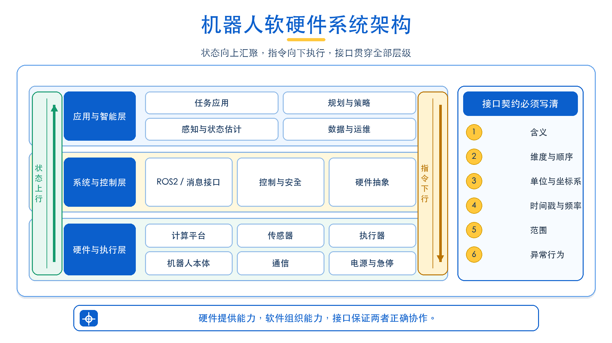
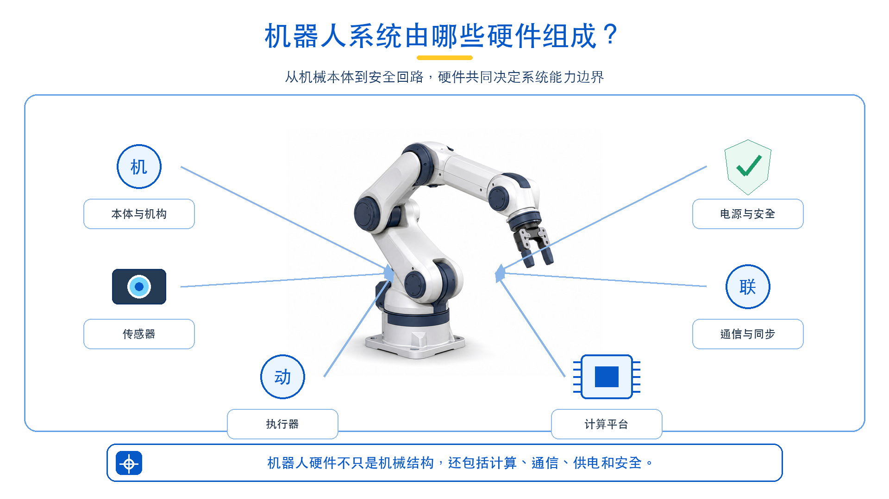
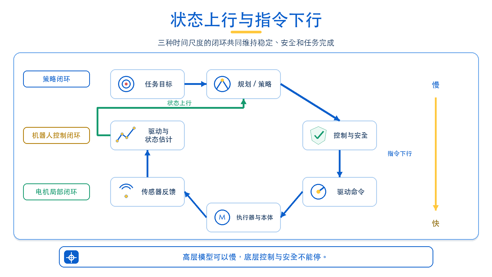
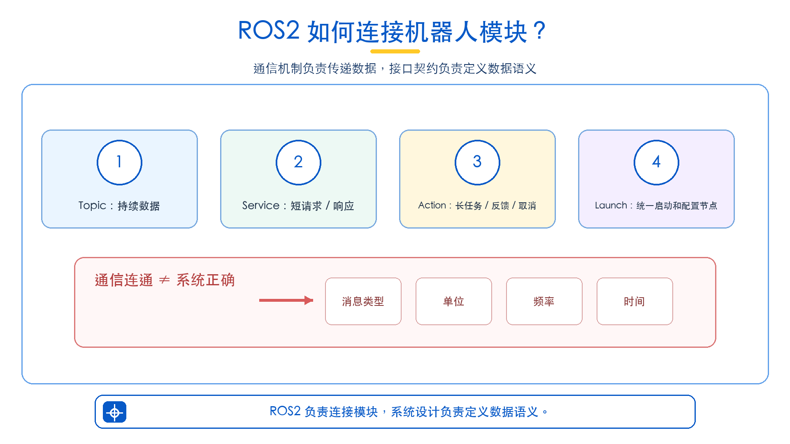
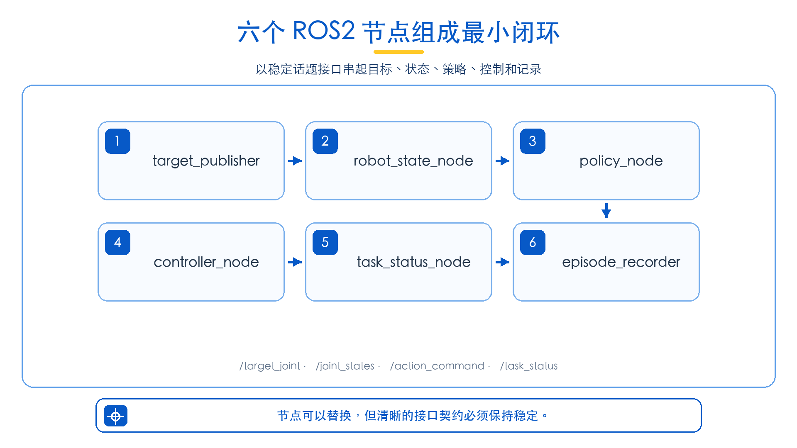

# 第 2 讲：机器人系统架构：硬件、软件与 ROS2

## 2.1 本讲主线：从“单个模型”到“机器人系统”

### 2.1.1 为什么这一讲很重要？

假设策略模型已经算出了机械臂的下一步动作：六个关节分别该往哪里移动。机器人是不是就能顺利动起来？

答案是否定的。

动作数组可能排错了关节顺序，模型使用角度而驱动要求弧度，也可能给出超过关节限位的目标。即使数值本身没有问题，系统仍要与硬件通信、持续读取状态、按稳定频率执行，并在碰撞、超时或急停触发时立刻停止。任务结束后，还要判断是否成功，把观测、动作和结果记录下来。

这就是本讲的核心判断：**模型会预测动作，不等于机器人系统能可靠执行动作。**

具身智能不是“给机器人装上一个模型”，而是把本体、传感器、通信、策略、控制、安全和数据组织成持续运行的闭环。视觉—语言—动作模型（Vision-Language-Action，VLA）、世界模型、模仿学习和强化学习都很重要，但通常只承担其中一部分职责。

可以把两种理解方式放在一起比较：

| 只看单个模型 | 观察完整机器人系统 |
| --- | --- |
| 关注输入能否映射为动作 | 关注观测、决策、执行和反馈能否持续闭环 |
| 默认输入数据已经准备好 | 追问图像、状态和目标由谁产生、是否同步 |
| 默认动作可以直接执行 | 检查单位、维度、限位、频率和安全条件 |
| 以一次推理结束为终点 | 以任务完成、失败恢复和数据记录为终点 |

第一讲已经画出“任务—感知—决策—控制—反馈—数据”的概念闭环。本讲不再重复定义具身智能，而是追问它如何真正运行：各环节落在哪些硬件和软件上？软硬件通过什么接口连接？状态与动作怎样流动？出错时又该从哪里查起？

### 2.1.2 本讲学习目标

学完本讲后，学生应能够：

1. 画出一套机器人系统的硬件组成图和软件栈，并解释每个部分的职责；
2. 区分物理部署视图与本体层、控制层、感知层、策略层等功能视图；
3. 说明传感器、计算平台、通信链路、执行器、驱动、控制器和策略之间的数据流；
4. 理解 ROS2 中 Node、Topic、Service、Action 和 Launch 的基本作用；
5. 判断 VLA、世界模型、模仿学习和强化学习在系统中的位置与接口边界；
6. 根据接口、时间、单位和安全条件检查一个最小机器人闭环是否完整。

### 2.1.3 本讲整体逻辑

```text
硬件系统：本体 · 传感器 · 执行器 · 计算平台 · 通信 · 电源与安全
                           ↕ 驱动与接口
软件系统：固件/驱动 · 中间件 · 控制 · 感知 · 规划/策略 · 应用与数据
                           ↕
               状态上行 · 指令下行 · 反馈闭环
```

读这张图，先抓住两股方向相反的信息流。传感器数据和机器人状态向上走，回答“现在发生了什么”；目标和控制指令向下走，回答“下一步要做什么”。动作改变机器人和环境，新状态再返回系统，闭环由此持续运行。

如果只看到指令下行，没有状态上行，这不是一个完整系统，而是一条无法确认结果的开环命令链。

### 2.1.4 贯穿本讲的机械臂任务

为了不让 Node、Topic、控制器和记录器变成一串孤立名词，本讲只使用一个贯穿案例：让六关节机械臂从当前位置移动到目标关节位置，并记录完整过程。

系统使用四个核心 Topic（话题）传递信息：

```text
目标发布：/target_joint
          ↓
当前状态：/joint_states → 策略节点 → /action_command
                                      ↓
                               控制与机器人本体
                                      ↓
任务反馈：                         /task_status
                                      ↓
                                episode 记录
```

`/target_joint` 表示目标关节位置，`/joint_states` 表示机器人当前关节状态，`/action_command` 表示策略产生并等待控制层处理的动作，`/task_status` 表示运行中、到达、超时或异常等任务状态。

真实机械臂可能使用不同的 Topic 和消息类型。本讲统一这组名称，是为了把关系讲清楚，不是规定所有硬件都必须照搬同一接口。

### 2.1.5 本节小结

机器人任务的基本单位，不是一次模型推理，而是一次包含状态、决策、控制、反馈和记录的闭环执行。只有先看懂完整系统，后续算法才知道应该放在哪里、接收什么、输出什么，又由谁为结果负责。

## 2.2 机器人系统架构：硬件、软件与接口

一张架构图，往往不够回答机器人系统的全部问题。

至少要看两张图。**物理部署图**回答：有哪些硬件，软件跑在哪块计算设备上，设备怎样连接。**功能分层图**回答：谁负责感知、决策、控制和数据。前者讲“在哪里运行”，后者讲“承担什么职责”，二者不能相互替代。



图 2-2 把系统分成应用与智能、系统与控制、硬件与执行三层。绿色箭头表示状态上行，橙色箭头表示指令下行；右侧列出接口契约中必须写清的内容。

### 2.2.1 硬件系统：机器人由哪些物理部件组成？

提到机器人硬件，很多人先想到机械臂外形。但一套能持续运行的系统，至少要同时考虑以下六类部分：

| 硬件部分 | 主要职责 | 机械臂案例 | 设计时要确认 |
| --- | --- | --- | --- |
| 本体与机构 | 提供自由度、工作空间和承载能力 | 六关节机械臂、连杆、底座、夹爪 | 自由度、负载、工作空间、机械限位 |
| 传感器 | 测量机器人自身与外部环境 | 编码器、RGB-D 相机、力传感器 | 量程、精度、频率、时延、坐标系 |
| 执行器 | 把电信号转化为运动或力 | 电机、减速器、夹爪驱动 | 位置/速度/力矩模式、额定能力、温度 |
| 计算平台 | 运行控制、感知、策略和日志 | MCU、工控机、CPU/GPU 主机 | 算力、实时性、功耗、散热、系统版本 |
| 通信与同步 | 连接传感器、控制器和计算机 | CAN、EtherCAT、USB、串口、以太网 | 带宽、周期、丢包、时钟和时间戳 |
| 电源与安全 | 供电并在异常时限制风险 | 电源、保险、急停、限位开关、制动器 | 电压电流、上电顺序、急停链路、故障状态 |



这六类硬件共同决定系统的能力上限。再强的策略也补偿不了失真的编码器，再清晰的相机也不能让超出负载的机械臂安全搬起物体。

所以，硬件选型的起点不是“哪个传感器最贵、哪个模型最大”，而是任务需要机器人看见什么、承受什么、以多快速度完成什么动作。

本章六关节任务至少涉及三条物理链路：编码器测量关节状态，计算平台根据目标生成动作，电机驱动机械臂运动。真实抓取任务还会加入相机、夹爪和可能的力传感器。

### 2.2.2 计算平台为什么常常不止一台？

为什么机器人里常常不只一台计算机？因为不同任务生活在不同的时间尺度上。

电机电流环、位置环要求稳定、快速、可预测；视觉模型和 VLA 推理需要更强算力，但单次耗时通常更长；日志、界面和远程管理则没有那么强的实时要求。把它们全部塞进同一个计算节奏，反而会让关键控制受到非关键任务影响。因此，工程系统常采用分级计算。

| 计算位置 | 典型任务 | 时间特点 | 常见形态 |
| --- | --- | --- | --- |
| 电机或关节内部 | 电流、速度、位置闭环与保护 | 高频、强实时 | MCU、驱动器固件 |
| 机器人控制器 | 轨迹插值、状态汇总、安全联锁 | 稳定周期、低抖动 | 实时控制器、工业控制器 |
| 机载/边缘计算机 | ROS2、感知、规划、策略与记录 | 中等频率、多进程 | CPU/GPU 主机、嵌入式计算平台 |
| 远程工作站或云端 | 训练、离线评测、数据管理 | 非实时、大算力 | GPU 服务器、训练集群 |

关键不在于用了几块计算板，而在于责任不能混在一起。高层策略即使暂停几百毫秒，底层安全控制仍要继续工作；网络一旦断开，机器人也应进入定义明确的安全状态，而不是一直保持最后一条可能危险的命令。

### 2.2.3 软件系统：从固件到任务应用

如果说硬件提供能力，软件栈的任务就是把这些能力组织成可调用、可观察、可维护的系统。可以从下到上分成六层：

| 软件层 | 主要职责 | 典型内容 | 本章案例 |
| --- | --- | --- | --- |
| 固件与驱动 | 访问设备、执行底层协议 | 电机固件、相机驱动、CAN/串口驱动 | 读取编码器、发送电机目标 |
| 硬件抽象与中间件 | 统一接口并连接模块 | ROS2、消息定义、设备适配器 | 发布 `/joint_states` |
| 控制与安全 | 轨迹、限幅、稳定执行、异常停机 | 位置/速度/力控、看门狗、急停处理 | 校验并执行 `/action_command` |
| 感知与状态估计 | 将原始信号变成可行动状态 | 标定、滤波、检测、位姿估计、融合 | 获得当前关节状态 |
| 规划与策略 | 决定下一步目标或动作 | 规划器、规则策略、模仿学习、VLA | 由误差生成动作增量 |
| 应用、数据与运维 | 组织任务、交互、记录和诊断 | 任务管理、UI、日志、episode、监控 | 发布目标、判断结果、记录过程 |

这张表描述的是职责，不是强制的软件目录。每一层不必对应一个进程，软件也不必只运行在一台计算机上。简单功能可以合并，复杂感知或控制也可以继续拆分。

判断拆分是否合理，不看节点数量，而看三个问题：接口是否清楚，故障能否隔离，频率与算力是否满足要求。

### 2.2.4 软硬件接口：系统最容易出错的边界

系统最容易出错的地方，往往不是某个模块内部，而是两个模块交接的边界。

软件必须通过接口读取硬件状态，再下发硬件能够理解的命令。接口绝不只是一个 Topic 名称，它至少是一组完整契约：

| 契约项 | 需要回答的问题 | 错误后果 |
| --- | --- | --- |
| 数据含义 | 是绝对位置、位置增量、速度还是力矩？ | 动作方向或幅值错误 |
| 维度与顺序 | 有几个关节，数组顺序如何对应关节？ | 命令发给错误关节 |
| 单位与坐标系 | 角度还是弧度，相机系还是基座系？ | 运动尺度或方向错误 |
| 时间语义 | 时间戳是什么，数据多旧算过期？ | 用旧状态生成新动作 |
| 更新频率 | 状态和命令以多少 Hz 更新？ | 控制迟缓、速度失控或振荡 |
| 有效范围 | 关节、速度、力和工作空间限制是什么？ | 越界、碰撞或硬件损坏 |
| 异常行为 | 丢包、超时、断电或急停时怎样处理？ | 系统保持危险动作 |

所以，“消息已经发出去”不等于“硬件正确执行”。一条动作要经过语义校验、边界检查和驱动适配；一份状态也要检查来源、时间戳、单位和有效性。接口写得含糊，错误就会沿着闭环一路放大。

### 2.2.5 状态上行、指令下行与局部闭环

现在把硬件、软件和接口放回同一条链路。机器人系统同时存在向上的状态流和向下的指令流：

```text
任务应用：移动到目标关节位置
        ↓ 目标
规划/策略：计算下一步动作
        ↓ 动作意图
控制与安全：插值、限幅、超时与急停检查
        ↓ 驱动命令
执行器与本体：产生真实运动
        ↑ 编码器、力、温度和错误码
驱动与状态估计：形成可信状态
        └────────── 反馈给控制和策略 ──────────┘
```

这里不只有一个闭环。电机驱动可能在最高频率下闭环，机器人控制器以较低频率更新轨迹，策略模型再以更低频率生成目标。每层都要知道自己的频率、职责和安全边界。

这也是为什么高层模型不应绕过底层控制直接连接电机：它既不具备相同的实时保证，也不该承担底层安全职责。



### 2.2.6 功能视图：本体、控制、感知与策略

物理部署图讲清了“在哪里”，接下来用四层功能视图回答“谁负责什么”：

| 功能层 | 核心问题 | 可能包含的硬件 | 可能包含的软件 | 本章案例 |
| --- | --- | --- | --- | --- |
| 本体层 | 系统能感知和作用什么 | 机构、传感器、执行器 | 固件、基础驱动 | 机械臂运动并产生编码器反馈 |
| 控制层 | 动作怎样稳定安全地执行 | 控制器、驱动器、安全设备 | 轨迹、限幅、看门狗、控制算法 | 检查并执行 `/action_command` |
| 感知层 | 机器人和环境现在怎样 | 相机、编码器、力觉、IMU | 标定、滤波、检测、状态估计 | 形成 `/joint_states` |
| 策略层 | 下一步做什么 | 通常运行在计算平台 | 规划器、规则、模仿学习、VLA | 由目标误差生成动作 |

例如，相机属于硬件系统，图像驱动属于软件栈的驱动层，目标检测属于感知功能层。三者紧密相关，却不是同一个模块。混淆部署位置和功能职责，是架构图看似完整、实际无法实施的常见原因。

### 2.2.7 用六关节机械臂读一遍完整架构

回到本章的六关节任务。编码器和电机位于机械臂本体，机器人控制器负责底层关节控制，主机运行 ROS2 节点、简单策略和记录器。`robot_state_node` 读取关节状态，`policy_node` 根据目标生成动作增量，`controller_node` 检查动作并调用控制接口，`task_status_node` 判断是否到达，`episode_recorder` 保存全过程。

一条动作就这样从目标出发，经过策略与控制到达本体，再由编码器带回新状态。

读一张系统架构图时，可以连续追问：

1. 传感器和执行器分别是什么？
2. 每个软件模块运行在哪块计算设备上？
3. 状态与动作通过什么接口传递？
4. 各条链路的单位、坐标系、频率和时间戳是什么？
5. 哪一层负责限幅、超时、急停和故障恢复？
6. 网络、驱动或模型失效时，机器人进入什么状态？
7. 哪些数据被记录，能否复原一次任务过程？

如果这些问题没有明确答案，架构图就还只是模块名称列表，不是一套可实现、可验证的系统设计。

### 2.2.8 本节小结

机器人系统不是硬件清单，也不是软件框图。硬件提供身体、感知、执行、计算、通信和安全基础；软件把这些能力组织成驱动、控制、感知、策略、应用与数据服务；接口负责定义状态和动作的语义、时间与边界。三者必须一起成立。

## 2.3 ROS2 基础：机器人模块如何通信？

### 2.3.1 ROS2 在机器人系统中的作用

模块已经拆开，新的问题随之出现：它们怎样找到彼此、交换数据，又怎样被统一启动和观察？

ROS2 是 Robot Operating System 2 的简称。虽然名字里有“操作系统”，它并不是 Linux 或 Windows 那样直接管理硬件的操作系统，而是一套面向机器人软件的通信机制、工具和工程组织方式。

它让相机、状态读取、策略、控制和数据记录保持相对独立，再通过标准消息协作。直接好处有三个：模块可以单独启动和调试；相同接口可以替换不同实现；系统运行时可以观察节点、消息和数据频率，而不必把所有逻辑塞进一个大程序。

一个最小 ROS2 工程通常涉及三个基本概念：

- **工作空间（workspace）**：存放一个或多个 ROS2 Package，并用于统一构建；
- **功能包（Package）**：组织某一组相关节点、配置、Launch 文件和依赖；
- **节点（Node）**：真正运行并承担一项功能的进程内单元。

可以把工作空间看作课程工程目录，Package 是其中一组相关功能，Node 则是真正运行并承担职责的单元。Node 之间主要通过 Topic、Service 和 Action 通信，Launch 负责把整套系统按统一配置启动起来。

### 2.3.2 Node

Node（节点）是 ROS2 的基本运行单元。理解它不必先背定义，只要先问：这项职责能否单独启动、观察和替换？读取相机、发布状态、运行策略、记录数据，都可以成为边界清楚的节点。节点既能运行在同一台计算机，也能通过网络分布在不同计算设备上。

本章 Demo 使用以下节点：

| 节点 | 主要职责 |
| --- | --- |
| `target_publisher` | 发布目标关节位置 |
| `robot_state_node` | 从 mock 对象或硬件读取状态，并发布 `/joint_states` |
| `policy_node` | 根据目标和当前状态生成 `/action_command` |
| `controller_node` | 在 mock 环境中更新模拟对象，或适配真实硬件控制接口 |
| `task_status_node` | 判断任务处于运行、到达、超时还是异常状态 |
| `episode_recorder` | 记录目标、状态、动作、时间戳和任务结果 |

“一个节点负责一个清晰功能”是设计建议，而不是强制规则。简单 Demo 可以把多个功能写在一个节点中；大型系统也可能把一个复杂功能拆成多个节点。关键是输入、输出和故障边界要容易理解。

启动系统后，可以查看当前发现的节点：

```bash
ros2 node list
```

如果预期节点没有出现，问题首先是“这个功能是否成功运行”，还轮不到怀疑算法效果。

### 2.3.3 Topic

关节状态和相机图像会持续产生，不能每来一帧都做一次同步函数调用。Topic（话题）正适合这种持续或事件式数据流：发布者发送消息，订阅者接收消息，双方不必直接调用，也不必写在同一个程序里。

相机图像、关节状态、目标位置、动作指令和任务状态都适合通过 Topic 传递。本章使用：

- `/target_joint`：目标关节位置；
- `/joint_states`：当前关节名称、位置、速度和力矩等状态；
- `/action_command`：策略节点生成的动作；
- `/task_status`：任务的当前状态。

下面的片段展示 `target_publisher` 如何创建发布者并发送一个六关节目标。队列深度 `10` 表示通信层最多保留一定数量尚未处理的消息；真实系统还要根据数据的重要性和实时性配置服务质量（Quality of Service，QoS）。

```python
from std_msgs.msg import Float64MultiArray

self.target_pub = self.create_publisher(
    Float64MultiArray, "/target_joint", 10
)

msg = Float64MultiArray()
msg.data = [0.0, -0.4, 0.8, 0.0, 0.4, 0.0]
self.target_pub.publish(msg)
```

调试 Topic 时，常用命令包括：

```bash
ros2 topic list
ros2 topic echo /joint_states
ros2 topic hz /joint_states
```

第一条确认 Topic 是否存在，第二条查看消息内容，第三条测量发布频率。这里要避免一个常见误判：看到 Topic 名称，只能证明“通道被发现了”，不能证明消息类型、内容、单位和频率都正确。

### 2.3.4 Service

有些操作不是持续数据，而是“请立即做一次，并告诉我结果”。Service（服务）适合这类短请求：客户端发出请求，服务端处理后返回一次响应。

例如，复位系统、查询一次设备状态、切换控制模式或保存当前配置都可以使用 Service。调用者通常希望很快获得明确结果：操作成功、失败，或返回某个查询值。

Service 的边界同样重要：它不适合持续发布相机图像，也不适合需要几十秒、还要报告进度的机械臂轨迹。前者应使用 Topic，后者更适合 Action。本章的最小闭环主要使用 Topic；若增加“一次性保存当前 episode”，则可以设计 `/save_episode` Service。

### 2.3.5 Action

如果任务需要几秒甚至几分钟，调用者通常还希望看到进度，并能中途取消。Action（动作接口）就是为这类长任务设计的，例如导航到目标位置、执行一段轨迹或完成一次抓取。

假设机械臂移动到目标位置需要 5 秒。如果使用 Service，调用者通常只能等待最终响应，很难获得中途进度或安全取消；使用 Action，则可以持续报告“已完成 40%”或“当前误差为 0.08 弧度”，并在发现障碍时取消任务。

本章为了把底层数据流展开，使用 Topic 和 `/task_status` 展示闭环。工程中也可以把完整的“移动到目标关节位置”封装为 Action；但 Action 内部仍然需要状态 Topic、控制器和安全检查。换一种通信方式，不会让底层闭环消失。

### 2.3.6 Launch

节点一多，逐个开终端不仅麻烦，还容易漏启动或参数不一致。Launch 用于统一描述和启动多个节点，同时设置参数、命名空间、重映射规则、条件和启动方式。

本章 Demo 包含六个节点。如果逐个手动启动，很容易漏掉 `episode_recorder`，也不利于复现实验。Launch 文件可以把状态、目标、策略、控制、任务判断和记录节点组织成一套系统。读者只需执行一次 Launch 命令，就能得到一致的启动配置。

但 Launch 只回答“怎样启动”，不保证数据语义自动正确。Topic 名称、消息类型、单位和频率仍然要单独设计与验证。

### 2.3.7 Topic / Service / Action 对比表

| 通信方式 | 交互形式 | 是否持续 | 过程反馈 | 能否取消 | 典型机器人场景 |
| --- | --- | --- | --- | --- | --- |
| Topic | 发布—订阅 | 可以持续 | 由消息流本身提供 | 不适用 | 图像、关节状态、动作指令 |
| Service | 一次请求—一次响应 | 通常很短 | 通常没有 | 通常不支持 | 复位、查询状态、切换模式 |
| Action | 发送目标—反馈—结果 | 可以持续较长时间 | 支持 | 支持 | 导航、轨迹、抓取任务 |

选择通信方式时，不必死记定义，先问三个问题：数据是否持续产生？调用者是否必须等待明确响应？任务是否需要进度和取消？连续数据优先 Topic，短请求优先 Service，长任务优先 Action。



### 2.3.8 ROS2 通信的边界

ROS2 解决模块发现、消息传输和工程组织，却不会自动修正感知误差、稳定控制器或提升模型泛化。即使所有 Topic 都有数据，机器人仍可能因为单位错误、时间不同步或动作越界而失败。

所以，通信“连通”只是第一步；语义正确、时间一致和执行安全才决定系统是否真的可用。

### 2.3.9 本节小结

Node 负责划分职责，Topic 承载持续数据，Service 处理短请求，Action 管理长任务，Launch 统一启动。真正需要掌握的不是名词，而是判断：面对一种数据或任务，为什么应该选择这种通信方式？

## 2.4 学习模型如何接入机器人系统

有了系统分层和通信机制，模型终于可以接进来了。但“接入模型”不是把权重文件加载成功，而是回答四个工程问题：它读取什么、输出什么、运行在哪里、由谁检查结果。

判断一个模型在系统中的位置，不能只看名字，而要看接口和时间尺度。

| 模型或方法 | 主要位置 | 典型输入 | 典型输出 | 接入系统时还需要什么 |
| --- | --- | --- | --- | --- |
| VLM / 检测 / 分割 | 感知层 | 图像、文本 | 类别、框、mask、语义 | 深度、标定、位姿估计与坐标变换 |
| VLA | 策略层 | 语言、图像、状态 | 单步动作、动作序列或子目标 | 动作空间映射、限幅、控制器与安全检查 |
| ACT / Diffusion Policy | 策略层 | 观测、状态 | action chunk | 时序队列、重规划频率、反馈与超时 |
| 强化学习 | 策略层或控制层 | 状态、观测 | 高层动作或低层控制量 | 仿真评测、实时部署与真机保护 |
| 世界模型 | 预测与规划模块 | 历史状态、观测、动作 | 未来预测或候选轨迹 | 规划器、策略以及真实反馈校正 |

表中的“主要位置”表示典型职责，不是固定部署方式。VLA 可以替换本章简单的 `policy_node`，强化学习策略也可能输出更低层的控制量。但模型输出越接近电机，系统对实时性、稳定性和安全的要求就越高。

“端到端”描述的是模型输入输出形式，不是绕过状态检查、动作边界和急停链路的许可证。

数据飞轮也不是软件栈里单独的一层，而是一条贯穿系统的回路：

```text
任务执行 → 记录状态、动作与结果 → 筛选成功和失败数据
    ↑                                      ↓
重新部署 ← 模型评测 ← 模型训练 ← 清洗、标注与样本构建
```

最终，模型接入系统必须回答四个问题：输入由谁产生，输出由谁消费，异常由谁处理，效果由什么真实反馈判断。如果答不清，模型就还只是一个离线能力，而不是可部署的系统模块。

## 2.5 机器人系统闭环：从状态读取到数据记录

### 2.5.1 最小机器人闭环

前面已经拆开了硬件、软件、接口和通信方式。现在把它们重新连起来，看看一次动作怎样走完整个系统。

最小闭环的关键不在节点数量，而在数据关系：每次动作都必须基于当前状态生成，执行后的新状态又必须回到下一次判断。

```text
读取 /joint_states
        ↓
接收 /target_joint
        ↓
策略生成 /action_command
        ↓
检查维度、限位、频率和状态新鲜度
        ↓
控制器更新 mock 对象或下发硬件命令
        ↓
读取新的 /joint_states
        ↓
发布 /task_status
        ↓
记录 episode，并进入下一控制周期
```

判断它是不是闭环，只要问一句：动作执行后，系统有没有读取新状态并据此修正下一步？没有，就是开环；有，闭环才真正转起来。

本章四个教学 Topic 的接口契约如下。真实硬件可以使用不同名称和消息类型，但这些语义不能缺失。

| Topic | 教学消息类型 | 语义与单位 | 发布者 | 主要消费者 | 有效性要求 |
| --- | --- | --- | --- | --- | --- |
| `/target_joint` | `Float64MultiArray` | 六关节绝对目标，弧度，顺序固定 | `target_publisher` | `policy_node`、状态判断与记录 | 维度正确、位于关节限位内 |
| `/joint_states` | `JointState` | 关节名称、位置、速度和时间戳 | `robot_state_node` | 策略、控制、状态判断与记录 | 名称/顺序一致，状态足够新 |
| `/action_command` | `Float64MultiArray` | 本控制周期的六关节位置增量，弧度 | `policy_node` | `controller_node`、记录器 | 维度正确、单步限幅、不可绕过控制器 |
| `/task_status` | `String` | `running`、`reached`、`timeout` 或异常原因 | `task_status_node` | 任务管理与记录器 | 必须由反馈判断，不能以“命令已发送”代替成功 |

### 2.5.2 状态读取

闭环的第一步不是生成动作，而是获得可信状态。机器人状态回答“系统此刻到底怎样”。机械臂通常要报告关节名称、位置、速度和力矩；操作任务还可能需要末端位姿、夹爪状态、相机图像、深度图和接触信息。

但有数值不等于状态可信，时间同样重要。策略在 10:00:01 收到的关节位置，到 10:00:03 可能已经过期。系统若继续基于旧状态生成新动作，就可能振荡甚至碰撞。因此，状态消费者至少要检查：

1. 消息是否收到；
2. 关节名称和数量是否符合预期；
3. 数值是否有限且位于合理范围；
4. 时间戳是否足够新；
5. 实际发布频率是否满足控制需求。

本章使用标准 `sensor_msgs/msg/JointState` 表示 `/joint_states`。真实机械臂还可能通过厂商消息提供温度、错误码或电机状态，这些信息同样可以进入安全判断。

### 2.5.3 动作生成

状态可信以后，才轮到动作生成。动作可以来自手写规则、比例策略、传统规划器、模仿学习、VLA、强化学习或世界模型辅助规划。

来源可以不同，但接口不能含糊。策略节点必须明确动作空间：输出的是绝对关节目标、关节增量、末端位姿、速度，还是力矩？

本章 Demo 使用“关节增量”作为 `/action_command`。策略计算目标关节位置与当前关节位置的误差，再取其中一小部分作为本周期动作。这样动作会随着机器人接近目标而逐渐减小，便于观察闭环如何收敛。

动作维度必须与状态一致。六关节机械臂不能接收五个或七个关节值；关节顺序也必须一致，否则本想移动肩关节的命令，可能会被送到肘关节。

### 2.5.4 动作执行

动作一旦进入执行环节，就会产生真实后果，因此这里是整条链路风险最高的边界。控制器收到 `/action_command` 后，至少要检查动作维度、单步最大变化、关节限位、速度限制、状态新鲜度、通信超时和急停状态。涉及空间运动时，还要检查自碰撞、环境碰撞和工作空间边界。

教学 mock 控制器只更新内存中的模拟关节值，不会驱动真实电机。它适合验证数据流，却不能证明真机安全。接入硬件时，必须使用经过验证的驱动或控制器，并在低速、限幅、空载、有人监护且急停可用的条件下测试。

控制频率也属于动作语义的一部分。同样的“每步移动 0.02 弧度”，以 10 Hz 执行和以 100 Hz 执行会产生完全不同的速度。真实接口应优先使用带时间含义的目标、速度或轨迹，而不是依赖不明确的循环频率。

### 2.5.5 任务反馈

命令已经发出，任务结束了吗？还不能下结论。任务反馈必须根据真实状态回答“执行结果怎样”。

对本章的到达任务，可以用所有关节的最大绝对误差判断是否到达目标：误差小于阈值时发布 `reached`，到达之前发布 `running`，状态过旧时发布 `stale_state`，超过最大执行时间则发布 `timeout`。

更复杂的抓取任务还要判断夹爪是否闭合、物体是否被提起、是否发生碰撞、目标是否丢失，以及是否需要重试。所有成功条件都应来自可测量状态，不能用“动作已经发送”代替“任务已经完成”。

`/task_status` 让记录器和上层任务模块不用理解控制细节，也能知道当前任务是否继续、结束或失败。

### 2.5.6 Episode 数据记录

如果任务失败，系统能否回答“从哪一步开始出错”？这取决于是否留下了完整记录。

Episode 是一次任务从开始到结束的时序记录。它不只用于回放，也用于排错、评测和后续训练。一个最小记录应包含：

| 字段 | 含义 | 为什么需要 |
| --- | --- | --- |
| `timestamp` | 当前记录时刻 | 对齐不同数据并计算频率 |
| `joint_state` | 当前关节状态 | 知道动作从什么状态出发 |
| `target_joint` | 当前任务目标 | 判断策略是否朝正确目标运动 |
| `action_command` | 本周期策略动作 | 分析策略实际输出 |
| `task_status` | 运行、到达、超时或异常 | 确定任务阶段和结束原因 |
| `success` | 最终成功标签 | 用于评测和筛选数据 |
| `error` | 异常信息 | 定位失败原因 |

下面是一条教学记录，用于说明字段关系，并不规定 LeRobot 数据集唯一的存储格式：

```json
{
  "timestamp": 1721102401.42,
  "joint_state": [0.00, -0.31, 0.62, 0.00, 0.28, 0.00],
  "target_joint": [0.00, -0.40, 0.80, 0.00, 0.40, 0.00],
  "action_command": [0.00, -0.045, 0.05, 0.00, 0.05, 0.00],
  "task_status": "running",
  "success": false,
  "error": null
}
```

生产系统还要处理图像与状态同步、掉帧、压缩格式、episode 边界和元数据版本。但最重要的原则不变：记录必须能够回答“机器人看到了什么、处于什么状态、执行了什么、结果怎样”。

### 2.5.7 本节小结

闭环不是箭头围成的圆，而是一组可以逐项验证的数据关系：状态要及时，动作要有明确语义，执行要受安全约束，结果要来自反馈，数据要足以复盘。ROS2 负责传输，系统设计负责让这些信息彼此一致。

## 2.6 Demo 设计：基于 ROS2 的 LeRobot / SO101 最小闭环

### 2.6.1 Demo 目标

接下来不再只看框图，而是把这条链路装进一套最小 Demo。

Demo 不追求实现完整机械臂驱动，只用最少模块展示 ROS2 闭环。默认路径使用 mock 对象，没有硬件也能观察数据流；有 SO101 或 LeRobot 兼容机械臂时，再替换状态和控制接口。

```text
target_publisher 发布 /target_joint
                    ↓
robot_state_node 发布 /joint_states
                    ↓
policy_node 生成 /action_command
                    ↓
controller_node 更新 mock 对象或调用硬件控制器
                    ↓
robot_state_node 发布新状态
                    ↓
task_status_node 发布 /task_status
                    ↓
episode_recorder 保存过程数据
```



这里有一个看似细小、实际关键的约束：`robot_state_node` 是 `/joint_states` 的唯一发布者。`controller_node` 负责改变 mock 对象或调用硬件控制接口，不再伪造第二路关节状态。否则，同一 Topic 出现多个来源，读者将无法判断哪一份才是真实反馈。

### 2.6.2 节点与接口设计

| 节点 | 输入 | 输出 | 对应知识点 | 接入硬件时如何处理 |
| --- | --- | --- | --- | --- |
| `target_publisher` | 用户输入或定时目标 | `/target_joint` | Publisher、目标输入 | 通常保留 |
| `robot_state_node` | mock 对象或硬件反馈 | `/joint_states` | 状态读取、反馈 | 替换读取逻辑，保留统一 Topic |
| `policy_node` | `/target_joint`、`/joint_states` | `/action_command` | Subscriber、策略生成 | 可以保留或替换为学习策略 |
| `controller_node` | `/action_command` | mock 更新或硬件控制指令 | 限幅、控制执行 | 必须适配经过验证的驱动 |
| `task_status_node` | `/target_joint`、`/joint_states` | `/task_status` | 误差判断、超时 | 通常保留并增加硬件异常 |
| `episode_recorder` | 四个核心 Topic | episode 文件 | 多 Topic 记录、数据闭环 | 通常保留并扩展相机等数据 |

这组接口体现了一个重要工程原则：模块可以替换，契约尽量稳定。例如把简单比例策略替换为 ACT，`policy_node` 的内部实现会改变；只要它仍然消费定义明确的状态与目标，并输出定义明确的动作，其他节点就不必跟着全部重写。

### 2.6.3 关键代码一：根据误差生成动作

先看策略节点。下面的核心函数根据当前关节位置和目标位置计算动作：`gain` 决定每次修正多少误差，`max_step` 限制单个周期的最大动作。

```python
import numpy as np
from sensor_msgs.msg import JointState
from std_msgs.msg import Float64MultiArray


def build_action(current, target, gain=0.5, max_step=0.05):
    current = np.asarray(current, dtype=float)
    target = np.asarray(target, dtype=float)
    if current.shape != target.shape:
        raise ValueError("current and target must have the same shape")

    error = target - current
    return np.clip(gain * error, -max_step, max_step)


def on_joint_state(self, msg: JointState):
    if not msg.position or self.target is None:
        return

    action = build_action(msg.position, self.target)
    command = Float64MultiArray()
    command.data = action.tolist()
    self.action_pub.publish(command)
```

这段代码不复杂，但体现了四个不可省略的设计点：

1. 当前状态和目标都会转换为数值数组；
2. 两者形状不一致时立即报错，避免错误关节映射；
3. 比例策略让动作随误差减小；
4. `np.clip` 对单步动作限幅。

需要再次强调：它只是策略片段，不是硬件控制器。真实系统仍要检查关节限位、速度、工作空间、碰撞和急停条件。

### 2.6.4 关键代码二：拒绝过期状态并判断任务结果

数值合法还不够，状态也可能已经过期。下面的片段要求关节状态不超过 200 毫秒，并把最大关节误差小于 0.02 弧度作为到达条件：

```python
state_age = self.get_clock().now() - self.last_state_time
if state_age.nanoseconds > 200_000_000:
    self.publish_status("stale_state")
    return

reached = max(
    abs(target - current)
    for target, current in zip(self.target, self.current)
) < 0.02

self.publish_status("reached" if reached else "running")
```

200 毫秒和 0.02 弧度只是教学参数，不是通用安全标准。真实阈值取决于控制频率、任务精度、编码器噪声和机械结构。系统还必须在规定时间内未到达目标时发布 `timeout`，而不是无限运行。

### 2.6.5 关键代码三：统一启动节点

节点逻辑齐全以后，还要保证每次都以同一配置启动。Launch 文件把它们组织成可重复运行的系统：

```python
from launch import LaunchDescription
from launch_ros.actions import Node


def generate_launch_description():
    return LaunchDescription([
        Node(package="robot_demo", executable="robot_state_node"),
        Node(package="robot_demo", executable="target_publisher"),
        Node(package="robot_demo", executable="policy_node"),
        Node(package="robot_demo", executable="controller_node"),
        Node(package="robot_demo", executable="task_status_node"),
        Node(package="robot_demo", executable="episode_recorder"),
    ])
```

片段省略了参数、命名空间、输出日志和启动条件。它展示的是 Launch 如何描述节点集合，并不是可以直接构建的完整 Package。

### 2.6.6 无硬件 mock 路径

没有机械臂时，让 `controller_node` 把 `/action_command` 加到模拟关节位置上，再由 `robot_state_node` 以固定频率发布更新后的 `/joint_states`。这个最小 mock 已足以观察三个关键现象：误差逐渐减小，任务状态从 `running` 变为 `reached`，episode 留下完整记录。

如果已有 MuJoCo、ManiSkill 或 Isaac Lab 环境，也可以把 mock 对象替换为仿真机械臂。替换时仍要统一关节名称、顺序、单位和控制周期。

### 2.6.7 SO101 / LeRobot 兼容硬件路径

接入硬件，不是把 mock 开关改成 `false` 就结束了。真正需要替换的是两个系统边界：

1. `robot_state_node` 从真实驱动读取关节状态，并统一发布 `/joint_states`；
2. `controller_node` 把经过验证的动作转换为驱动支持的目标、速度或轨迹接口。

首次接入前，必须确认关节名称与顺序、弧度或角度单位、控制模式、关节限位、速度限制、状态频率和急停是否有效。先做无负载、低速、小范围测试，再逐步扩大动作范围。示例 `/action_command` 绝不能绕过厂商控制器直接连接电机。

### 2.6.8 Demo 融入的知识点

| Demo 环节 | 对应知识点 | 可观察证据 |
| --- | --- | --- |
| 发布目标 | Node、Publisher、Topic | `/target_joint` 出现目标数组 |
| 发布状态 | 硬件抽象、反馈、消息类型 | `/joint_states` 持续更新 |
| 生成动作 | 策略层、Subscriber、动作空间 | `/action_command` 随误差变化 |
| 执行动作 | 控制层、限幅、安全边界 | mock 状态逐步接近目标 |
| 判断结果 | 闭环反馈、阈值、超时 | `/task_status` 从 `running` 变为 `reached` |
| 记录数据 | episode、时间戳、数据飞轮 | 记录中包含目标、状态、动作和结果 |

### 2.6.9 本节小结

Demo 的价值不在比例策略，而在模块边界：状态只有一个可信来源，策略输出要经过控制与安全处理，任务成功要由反馈判断，执行过程要留下可复盘数据。

## 2.7 实验步骤

实验要验证的是系统数据流，不是完成厂商级机械臂驱动。正文给出关键代码和 Package 组装步骤，但当前仓库尚未提供可直接启动的完整 `robot_demo` Package。因此，下面的 Launch 命令代表实验完成后的目标状态，不是仓库现成入口。

课堂使用前，应由教师补齐并复验教学 Package，或明确把“组装 Package”列为学生任务。无论哪种方式，都应先跑通无硬件 mock，再接入真实机械臂。

### 2.7.1 环境准备

实验前应准备一个已正确配置的 ROS2 环境。课程发布时必须在 README 中写明经过验证的操作系统、ROS2 发行版、Python 版本和验证日期；正文中的概念适用于常见 ROS2 发行版，但安装、依赖和命令细节以课程实际测试环境为准。

创建工作空间和 Python Package：

```bash
mkdir -p ~/robot_ws/src
cd ~/robot_ws/src
ros2 pkg create robot_demo \
  --build-type ament_python \
  --dependencies rclpy sensor_msgs std_msgs
```

策略片段还使用了 NumPy。应确认当前 Python 环境可以导入 `numpy`，并在 Package 的运行依赖中声明系统或发行版对应的 NumPy 依赖。将本节关键逻辑分别整理为状态、目标、策略、控制、任务判断和记录节点，并在 `setup.py` 中声明可执行入口。然后在工作空间根目录构建并加载环境：

```bash
cd ~/robot_ws
colcon build --symlink-install
source install/setup.bash
```

如果构建失败，先看最早出现的错误，不要被后续连锁报错带偏。常见原因包括依赖名拼写错误、入口函数未声明、Python 文件不可导入，或忘记加载当前工作空间。

### 2.7.2 启动无硬件 mock 闭环

先启动包含六个节点的 Launch 文件：

```bash
ros2 launch robot_demo minimal_loop.launch.py
```

新开一个已经执行 `source ~/robot_ws/install/setup.bash` 的终端，检查节点：

```bash
ros2 node list
```

预期至少能看到：

```text
/robot_state_node
/target_publisher
/policy_node
/controller_node
/task_status_node
/episode_recorder
```

如果节点名称不同，以实际命名空间为准；如果节点缺失，先查看启动终端异常，不要在系统不完整时继续发布目标。

### 2.7.3 检查 Topic 与消息类型

列出 Topic 并检查详细接口：

```bash
ros2 topic list
ros2 topic info -v /joint_states
ros2 topic info -v /action_command
```

`/joint_states` 应使用 `sensor_msgs/msg/JointState`，并且只有 `robot_state_node` 负责发布。`/action_command` 应由 `policy_node` 发布、由 `controller_node` 订阅。

继续观察状态内容和频率：

```bash
ros2 topic echo /joint_states
ros2 topic hz /joint_states
```

只有 Topic 名称、消息类型、发布者和频率都符合预期，状态链路才算通过。频率明显偏低或时间戳长时间不更新时，后续策略结果都不可信。

### 2.7.4 发布目标并观察闭环

使用命令行发布一次六关节目标：

```bash
ros2 topic pub --once /target_joint \
  std_msgs/msg/Float64MultiArray \
  "{data: [0.0, -0.4, 0.8, 0.0, 0.4, 0.0]}"
```

分别观察动作和任务状态：

```bash
ros2 topic echo /action_command
ros2 topic echo /task_status
```

正常情况下，应同时看到三项证据：`/action_command` 受到单步限幅，`/joint_states` 逐渐接近目标，`/task_status` 从 `running` 变为 `reached`。

如果动作始终为零，检查目标是否已经等于当前状态；如果动作达到限幅但状态不变，检查 `controller_node` 是否收到消息并更新 mock 对象。只看到动作消息，不代表闭环已经工作。

### 2.7.5 使用 rqt_graph 查看连接关系

运行：

```bash
rqt_graph
```

节点图应能显示目标、状态、策略、控制、任务判断和记录之间的连接。重点检查：

1. `policy_node` 是否同时订阅目标和状态；
2. `controller_node` 是否订阅动作；
3. `robot_state_node` 是否是 `/joint_states` 的唯一发布者；
4. `episode_recorder` 是否订阅需要记录的 Topic。

节点图连通不代表数据语义正确，但可以快速发现 Topic 名称不一致或订阅关系缺失。它是一张连接证据，不是系统成功证明。

### 2.7.6 检查 episode

任务结束后，打开记录文件，至少检查以下字段：

```text
timestamp
joint_state
target_joint
action_command
task_status
success
error
```

任选三个时间点，确认状态确实向目标变化、动作与误差方向一致、最终状态与 `success` 标签一致。只有动作而没有执行后的状态，就无法判断动作是否生效；没有失败原因，也很难形成有效的数据飞轮。

### 2.7.7 调整参数并观察系统行为

在 mock 环境中，可以逐项修改比例增益、单步限幅、发布频率和到达阈值，并记录现象：

- 增益过小：动作平稳，但到达时间变长；
- 增益或单步上限过大：到达更快，但可能出现越过目标或振荡；
- 状态频率过低：控制反应迟缓，过期状态检查可能触发；
- 到达阈值过小：系统可能长时间保持 `running`；
- 到达阈值过大：系统可能过早报告成功。

每次只改一个参数，并保留修改前后的记录。否则，即使现象发生变化，也无法判断原因。

### 2.7.8 替换为真实机械臂

只有 mock 闭环稳定后，才进入硬件路径。这里不是为了增加流程，而是先把软件数据流问题与硬件风险分开。替换前逐项确认：

1. 驱动报告的关节名称、顺序和数量；
2. 位置使用弧度还是角度，速度与时间单位是什么；
3. 当前控制模式接受位置、增量、速度还是轨迹；
4. 关节限位、速度限制和工作空间限制是否生效；
5. `/joint_states` 频率能否满足策略和控制需要；
6. 急停是否可用，测试人员是否能随时停止系统；
7. 首次测试是否为空载、低速、小范围且有人监护。

不要把教学示例中的 `/action_command` 直接连接到电机。`controller_node` 必须完成消息校验、动作空间转换和驱动适配，同时保留厂商控制器提供的底层保护。

### 2.7.9 实验完成标准

完成实验后，读者应能展示：

- 节点和 Topic 列表；
- `/joint_states` 的内容与频率；
- 目标改变后动作与状态的变化；
- `/task_status` 从运行到结束的过程；
- `rqt_graph` 节点连接图；
- 包含目标、状态、动作、时间戳和结果的 episode 样例。

## 2.8 作业交付与失败复盘

### 2.8.1 作业交付

“程序能运行”只说明没有在眼前崩溃，不能证明闭环正确。本讲作业要求提交一组相互印证的材料：

| 交付物 | 最低要求 | 验收重点 |
| --- | --- | --- |
| ROS2 Package 源码 | 包含状态、目标、策略、控制、任务判断和记录节点 | 节点职责与接口清晰，不要求厂商级完整驱动 |
| `rqt_graph` 截图 | 显示核心节点和 Topic 连接 | `policy_node` 同时接收目标与状态，记录器接入完整 |
| Topic / Service / Action 说明 | 各举一个适用场景并解释选择原因 | 不是只背定义，而是根据通信特征选择 |
| 机械臂数据流图 | 标明四层结构和四个核心 Topic | 状态上行、动作下行、反馈闭环方向正确 |
| 闭环运行视频 | 展示目标改变、状态变化和任务结束 | 能看到 `/task_status` 或等价结果证据 |
| episode 样例 | 包含目标、状态、动作、时间戳和结果 | 数据能复原一次任务过程 |
| 模型位置说明 | 说明 VLA、世界模型和控制器的位置与接口 | 明确模型输出不能绕过控制和安全模块 |

无硬件读者提交 mock 闭环即可；使用真实机械臂不会自动获得更高评价。真正的评估重点是：系统解释是否正确，证据是否完整，安全边界是否清楚。

### 2.8.2 常见失败排查表

机器人系统一出问题，人们很容易先怀疑模型。但更有效的顺序是从可观察证据开始：先确认节点是否存在，再确认 Topic 是否连接，然后检查消息内容和频率，最后才分析策略与控制逻辑。

| 现象 | 可能原因 | 检查方法 | 修复方向 |
| --- | --- | --- | --- |
| 预期节点没有出现 | 节点启动失败、入口未注册、环境未加载 | `ros2 node list`；查看 Launch 终端最早的报错 | 修正入口或依赖，重新构建并 `source` 环境 |
| Topic 存在但没有数据 | 发布节点未运行、回调未触发 | `ros2 topic info -v /joint_states`、`ros2 topic echo /joint_states` | 确认发布者数量和状态读取逻辑 |
| 发布者与订阅者无法通信 | Topic 名称或消息类型不同 | `ros2 topic info -v <topic>` | 统一名称、命名空间和消息类型 |
| 状态频率明显偏低 | 计时器配置、驱动或计算阻塞 | `ros2 topic hz /joint_states` | 调整发布周期，移除回调中的阻塞操作 |
| 系统报告 `stale_state` | 状态时间戳过旧或发布中断 | 查看消息 header 与当前时间，检查频率 | 修正时间源，恢复状态发布，过期时停止动作 |
| 策略没有发布动作 | 目标缺失、状态为空或维度不一致 | 查看 `/target_joint`、`/joint_states` 和策略日志 | 补齐目标，统一关节数量与顺序 |
| 动作始终达到上限 | 目标过远、增益过大或单位错误 | 查看 `/action_command`，核对弧度与角度 | 降低增益和单步上限，统一单位 |
| 动作在变化但状态不变 | 控制节点未订阅、mock 对象未更新或驱动拒绝命令 | `ros2 topic info -v /action_command`；查看控制日志 | 修复订阅与控制适配，检查驱动错误码 |
| 状态越过目标并振荡 | 增益或单步上限过大、反馈延迟 | 对比连续状态和动作，测量状态频率 | 降低参数，提高反馈频率并增加平滑 |
| 长时间保持 `running` | 到达阈值过小、状态噪声大或目标不可达 | 计算最大关节误差，检查是否触发超时 | 设置合理阈值与超时，报告不可达原因 |
| 真实机械臂运动方向异常 | 关节顺序、正方向或单位映射错误 | 逐关节低速小范围测试 | 修正映射；验证前停止批量动作 |
| episode 无法复盘 | 缺少目标、状态、动作、时间戳或结果 | 检查记录字段和样例时间序列 | 在同一时序记录中补齐字段和结束原因 |
| `rqt_graph` 连通但任务失败 | 数据语义、单位、时间或控制逻辑错误 | 继续检查消息内容、频率和任务状态 | 不把“通信连通”误判为“系统正确” |

排查同样要遵守单变量原则：一次只改变一个因素，并保存修改前后的日志。否则，即使问题消失，也很难知道真正原因。

### 2.8.3 复盘问题

完成实验后，请结合自己的节点图和 episode 回答：

1. 为什么机器人任务需要持续反馈，而不能只在开始时计算一次动作？
2. `/joint_states` 为什么适合 Topic？“保存当前 episode”为什么可以设计为 Service？
3. 如果把“移动到目标”封装成长任务，Action 相比 Service 提供了哪些能力？
4. 为什么 episode 不能只记录动作，还要记录动作之前和之后的状态？
5. VLA 已经输出动作后，为什么仍然需要控制器、限幅和急停？
6. 如果 `rqt_graph` 显示所有节点已经连接，任务仍然失败，还应检查哪些证据？
7. 世界模型预测的未来为什么不能替代真实传感器反馈？
8. 失败样本怎样帮助团队区分感知、策略、控制和硬件问题？

### 2.8.4 本讲总结

回到开头的问题：模型已经输出动作，为什么机器人仍不一定能动起来？

因为动作只是闭环中的一段。本体和传感器提供真实状态，感知层形成可行动信息，策略层决定下一步，控制层保证动作稳定安全地执行；ROS2 用 Node 和不同通信机制连接模块；反馈与 episode 记录则让系统判断结果、排查失败并持续改进。

判断一个具身智能系统是否完整，可以连续追问六个问题：

```text
观测从哪里来？
目标怎样表达？
策略输出什么？
动作由谁检查和执行？
系统怎样判断成功或失败？
过程数据是否足以复盘？
```

只要其中一个问题没有明确答案，系统就还没有形成可靠闭环。真正可靠的从来不是某个孤立模型，而是一个可观察、可验证、可停止、也可复盘的完整系统。

## 2.9 参考开源项目

以下资料用于继续学习。ROS2 与 LeRobot 官方资料适合查阅概念和主线功能；社区机械臂项目的接口和维护状态可能变化，接入真实硬件前应重新核对代码、许可证和安全说明。

### 2.9.1 ROS2 官方资料

- [ROS 2 Documentation](https://docs.ros.org/)：查询 ROS2 概念、安装说明和各发行版文档。
- [ROS 2 Tutorials](https://docs.ros.org/en/rolling/Tutorials.html)：学习节点、Topic、Service、Action 和 Launch。
- [ROS 2 Examples](https://github.com/ros2/examples)：查看 ROS2 客户端库的基础示例。
- [ROS 2 Demos](https://github.com/ros2/demos)：查看通信、组件和工具相关演示。

### 2.9.2 LeRobot 资料

- [LeRobot GitHub](https://github.com/huggingface/lerobot)：查看机器人数据、策略训练和设备支持代码。
- [LeRobot on Hugging Face](https://huggingface.co/lerobot)：浏览 LeRobot 相关数据集、模型和项目资源。

### 2.9.3 社区 ROS 项目

- [LeRobot ROS](https://github.com/ycheng517/lerobot-ros)：社区维护的 LeRobot 与 ROS 集成示例。
- [SO101 ROS2](https://github.com/msf4-0/so101_ros2)：社区 SO101 ROS2 项目。
- [SO101 ROS Physical AI](https://github.com/legalaspro/so101-ros-physical-ai)：社区 SO101 与 ROS 相关实践项目。

这些项目可以帮助读者比较不同接口设计。但本章使用的 `/target_joint`、`/action_command` 和节点名称只是教学契约，不代表上述项目采用完全相同的消息定义。
