# 第 3 讲：机器人本体与控制基础：从硬件结构到动作空间

本讲作者：邵羿茗

## 3.1 本讲主线：从机器人身体到 action 含义

### 3.1.1 为什么这一讲很重要？

具身智能系统的动作闭环，是指系统依据观测形成策略输出，经由动作表示和控制接口转换为执行器命令，再利用执行结果产生的新观测修正后续命令的过程。该定义包含两个层次：其一，策略输出是对任务意图的数值表示；其二，执行器命令必须满足具体机器人在坐标系、单位、频率和安全范围上的约束。只有这两个层次能够在同一条时间链路中正确衔接，动作才具有可执行的工程含义。

为避免混淆，需要区分观测、动作表示、控制命令和执行器命令。观测（observation）是系统在某一时刻取得的图像、关节状态、力/力矩、姿态或其他测量量；策略输出是在这些观测条件下计算得到的动作（action）；动作表示规定该动作对应的控制对象、维度、单位、参考坐标系、数值范围和更新频率；控制命令则是适配层提交给控制器的目标位置、目标速度、目标力矩或末端增量；执行器命令最终由驱动器转换为电流、电压、使能状态或其他硬件可接受的控制量。上述对象处于不同层级，不能因其均以数值形式出现而互换使用。

以固定基座机械臂为例，策略可以输出末端执行器相对增量（end-effector delta, eef delta）。这一增量只有在明确参考坐标系后才有意义：若它表示基坐标系中的 x 方向位移，适配层需要根据当前关节状态、运动学模型和关节限位求得可行的关节目标；若它表示末端坐标系中的前向位移，转换结果则随当前姿态而改变。随后，控制器还要在给定的控制周期内完成轨迹插值、速度限制和反馈跟踪。因此，末端增量位于策略层与控制层之间的一种约定。

训练与部署之间的失配通常首先出现在三个位置。第一，坐标系失配会使正确的相对位移沿错误方向执行。例如，训练数据将位移定义在相机坐标系，而部署端按基坐标系解释，同一正数可能对应完全不同的空间方向。第二，尺度失配会改变动作的物理幅度。若训练时动作已归一化到固定区间，部署端却遗漏反归一化步骤，控制器接收到的数值将不再对应训练时的位移或速度。第三，频率与执行约束失配会破坏动作的时间语义：策略以较低频率更新目标，驱动器以较高频率维持闭环，两者之间必须由保持、插值或重新采样机制连接；同时，任何超过关节限位、速度上限或碰撞约束的候选命令都必须被拒绝或裁剪。

因此，本讲的讨论边界应说明动作如何获得物理含义。后续关于机器人本体、控制模式、正逆运动学、动作空间、动作尺度和控制频率的内容，均服务于同一个工程问题：如何使策略输出经过明确的接口和约束，成为可复现的机器人运动。

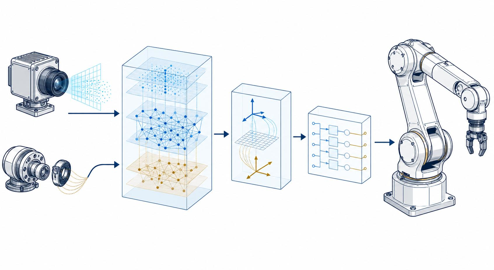

*图3-1 机器人动作的观测、策略与执行接口*

### 3.1.2 机器人本体如何影响智能系统？

机器人本体（robot embodiment）是由机械结构、驱动方式、传感配置、计算资源和控制接口共同构成的物理系统。它不仅限定机器人能够施加的运动和接触，还决定系统可获得哪些状态、可下发哪些命令，以及训练数据应如何组织。对具身智能而言，本体参数是连接任务、数据、动作空间和部署结果的起点。

本体首先决定可控量与任务边界。固定基座机械臂通常以关节位置、关节速度和夹爪开度为主要可控量，其任务前提是基座相对环境保持固定，因而适合桌面范围内的抓取、放置和简单装配。移动操作机器人在机械臂之外增加了底盘位姿、线速度和角速度等状态与命令，任务可延伸至较大空间，但机械臂操作与底盘运动必须共享时间基准和坐标变换。人形机器人还需要处理腿部关节、躯干姿态、惯性测量单元（inertial measurement unit, IMU）数据以及足端接触状态；上肢动作是否可行，不再仅由手臂可达性决定，还受支撑状态、姿态和全身碰撞约束影响。

这种差异会连续传递到观测与数据字段。桌面机械臂的示教样本可由 RGB 或 RGB-D 图像、关节状态、夹爪状态和动作标签组成；移动操作样本还需要底盘状态、导航参考系以及相机与机械臂之间的外参；人形操作样本则往往需要记录 IMU、足端接触、关节状态、躯干姿态和安全状态。数据字段增加并不只意味着存储量增加，还意味着标定、时间同步和缺失数据处理的复杂度上升。若图像、关节状态和动作标签并非来自同一时间窗口，学习到的映射就会把不同时刻的因果关系错误地对应起来。

在训练和部署阶段，本体差异还表现为不同的失效模式。固定基座机械臂常见的失效包括末端位置偏差、夹持不足、碰撞或关节到达限位；移动操作系统还可能出现定位漂移、底盘与机械臂不同步、运动过程中的视角变化；人形系统则需要额外防止接触切换异常、姿态恢复不足和全身耦合导致的稳定性下降。将失败简单归因为“模型没有学会”会掩盖这些物理与接口条件。更合理的诊断顺序是：先检查观测是否反映真实状态，再检查动作定义是否与控制接口一致，最后检查本体约束是否使该动作在当前姿态下不可行。

由此可形成一条明确的因果链：本体参数决定可观测量和可控量，可观测量和可控量决定数据字段与动作空间，数据表示进一步影响训练目标和部署适配，最终由本体的运动、接触与安全约束检验策略是否可执行。具身智能的迁移应重新确认这条链上的每一个接口是否仍然成立。

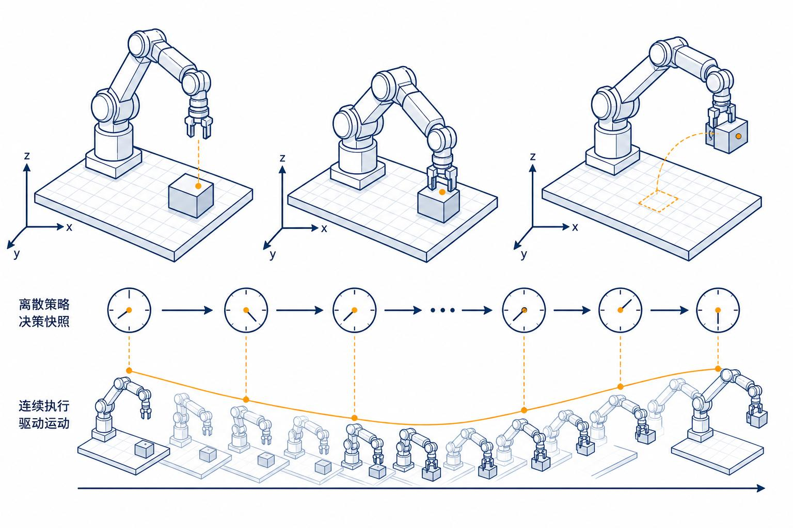

*图3-2 坐标系、动作尺度与时间基准的衔接*

### 3.1.3 本讲整体逻辑

本讲围绕“策略输出如何获得可执行的物理含义”组织内容。该问题的输入是由传感器和状态接口提供的观测，输出是受驱动能力、运动学关系、控制周期和安全约束限制的实际运动。为使这种关系可分析、可实现和可诊断，章节顺序按本体、运动结构、控制、运动学、动作表示、时间尺度和全身约束逐层展开。

第3.2节首先界定机器人本体的组成，包括机械结构、驱动系统、传感系统、控制系统和计算系统，并以分层数据流说明状态如何上行、命令如何下行。该部分给出系统层的输入输出边界：传感器与硬件接口产生状态，控制器和驱动器接收命令，计算系统在二者之间执行估计、策略、通信与记录。第3.3节随后将系统层的机械对象细化为自由度、关节、连杆、末端执行器、关节空间和任务空间，使后续的坐标、位姿和状态变量具有统一含义。

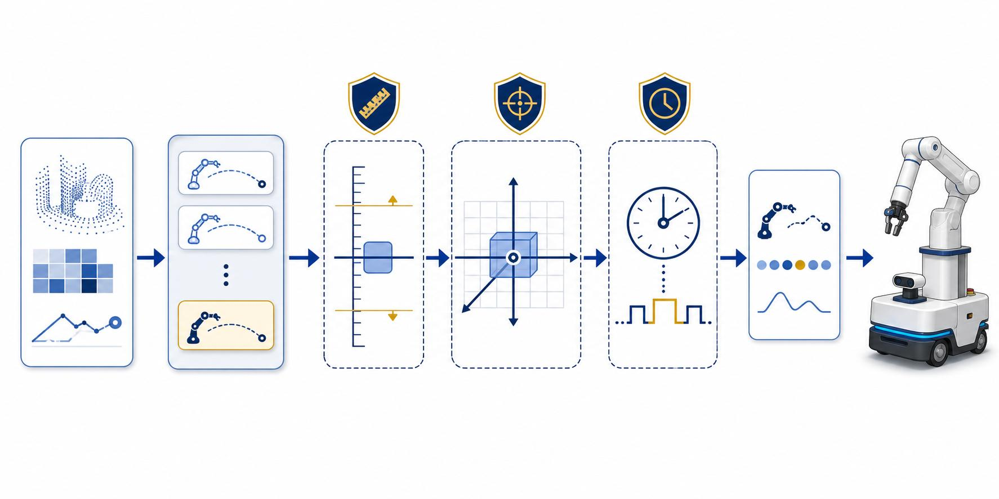

*图3-3 候选动作进入硬件接口前的约束检查*

**表3-1 动作闭环中的主要信息层次**

**表注：动作含义由控制对象、单位、坐标系、数值范围和时间基准共同确定；各层变量不得直接互换。依据［1，2］整理。**

| 层次 | 典型内容 | 主要作用 | 教学检查点 |
| --- | --- | --- | --- |
| 观测层 | 图像、关节状态、力/力矩、姿态 | 描述当前机器人与环境状态 | 来源、坐标系与时间戳 |
| 策略层 | action 或任务级子目标 | 给出候选动作 | 控制对象、维度与数值范围 |
| 适配层 | 坐标变换、反归一化、约束过滤 | 将动作解释为控制参考 | 单位、限幅与异常处理 |
| 控制与驱动层 | 位置、速度或力矩参考及反馈 | 完成实时跟踪与保护 | 周期、反馈有效性与安全状态 |

## 3.2 机器人本体的基本组成

### 3.2.1 机械结构

机器人机械结构的工程意义，重点在于它能否以确定的运动关系、承载能力和碰撞边界完成任务。对于串联机械臂、移动操作平台和人形机器人而言，结构均可由连杆、关节、末端执行器、支撑部件和连接件构成；差异在于这些部件形成的运动链、受力路径和接触条件。机械结构是动作的物理载体，任何控制命令最终都要通过它转换为关节转动、线性位移或与环境的接触。

运动链由连杆和关节按确定的拓扑关系连接而成。连杆通常被建模为具有长度、质量、质心和转动惯量的刚体；关节规定相邻连杆之间允许的相对运动，如绕某一轴线转动的转动关节或沿某一轴线平移的移动关节。关节轴的位置和方向、连杆的尺寸以及关节限位共同决定末端的几何可达范围。对于固定基座机械臂，运动链通常从基座延伸至腕部和末端执行器；对于人形机器人，双腿、腰部、双臂和头部构成多条通过躯干耦合的运动链，足端与地面的接触又会改变系统的约束条件。

工作空间（workspace）是指在给定关节限位和机构几何条件下，末端理论上可能到达的位置或位姿集合。它不等同于任务可达空间。后者还必须考虑末端的目标姿态、负载方向、自碰撞、外部障碍物、线缆干涉、关节速度限制以及当前支撑状态。例如，末端能够在无障碍模型中到达某一点，并不表示夹爪能够以所需朝向接近该点，更不表示在夹持载荷后仍可保持关节力矩和姿态安全。规划系统因此需要在运动学可达性之外使用碰撞模型和约束条件筛选可执行路径。

为使软件能够使用结构信息，需要区分 CAD、URDF 和碰撞模型。CAD 模型主要服务于机械设计、制造和装配，通常保留较细的几何细节；统一机器人描述格式（Unified Robot Description Format, URDF）将连杆、关节、质量、惯性、视觉几何和碰撞几何组织为软件可读取的结构树，用于状态发布、可视化和运动学计算；碰撞模型则针对规划效率采用较简单的形状近似，并不追求完整外观。三者可以相互校核，但不能互相替代：将高精度 CAD 直接用于实时碰撞检测可能造成不必要的计算负担，而只依据简化碰撞模型又不足以完成机械制造和装配验证。

在部署前还应核对模型参数与实物的一致性。工具更换、负载变化、维修后的零位偏移或线缆重新布置，都可能使原有的质量参数、碰撞边界或工具中心点不再适用；这些变化应进入配置和验收流程，而不能依赖操作者凭经验补偿。

### 3.2.2 驱动系统

驱动系统承担将控制器输出转换为关节机械运动的任务。其典型链路为电源向驱动器供电，驱动器根据控制指令调节电机电流，电机经减速器或其他传动机构向关节输出力矩，编码器和电流、温度等传感器再将状态返回控制器。该链路中的每个环节都会改变命令与实际运动之间的关系，因此驱动系统是动作能否被稳定、重复地执行的必要条件。

电机是动力源，常见机器人关节可采用永磁同步电机、伺服电机、无框力矩电机或其他电机形式。电机输出的直接物理量与电磁转矩相关，但关节最终可用的力矩还受驱动电流、传动比、效率、摩擦、温升和保护策略影响。减速器、齿轮、同步带、丝杠、腱绳等传动机构的作用并不只是提高关节输出力矩；它们同时改变速度范围、反向间隙、等效刚度、摩擦特性和可回驱性。直接驱动关节减少了部分传动环节，却可能对电机尺寸、散热和控制性能提出更高要求。因而，讨论某个关节“有力”或“响应快”时，必须说明所指对象是电机轴、减速器输出端还是关节端，并注明相应工况。

驱动器是连接软件命令与电机功率级的控制装置。它通常接收目标位置、目标速度、目标力矩或电流等命令，并利用编码器、电流传感器等反馈生成对电机的实际驱动。许多伺服系统采用由内向外的级联结构：电流环负责快速调节电机电流，速度环根据速度误差给出相应的电流或力矩请求，位置环再根据位置误差产生速度或力矩参考。不同设备的实现方式和带宽并不完全相同，但层次关系说明了一个关键边界：高层策略通常不直接闭合电流环，而是通过规定的命令接口向已具备保护和实时能力的驱动层提出目标。

保护机制应被视为动作执行链中的主动约束，而不是故障发生后的附加措施。驱动器或上层控制器可对位置、速度、加速度、电流、力矩和温度设置限制，并在通信异常、传感器失效或急停触发时进入安全状态。保护动作可能包括限幅、降额、减速、保持、去使能或制动。高层策略输出的命令只是候选命令；当它超出硬件能力或安全约束时，执行层有责任修改或拒绝该命令。由此产生的动作裁剪也必须被记录，否则训练时的 action 与实际执行的 action 将不再一致。

驱动系统的物理特性会直接影响具身策略的部署效果。若低速摩擦、死区或背隙没有得到适当补偿，策略给出的细小修正可能无法转化为可辨认的关节运动；若命令变化过快，限流、限速或热保护可能使实际轨迹落后于目标；若末端负载超出设计工况，位置控制器即使保持稳定，也可能无法满足所需加速度或精度。因此，在分析抖动、过冲、响应迟缓或接触不稳定时，应同时检查策略输出、控制器参数和驱动链状态，不能将所有现象归因于高层模型。

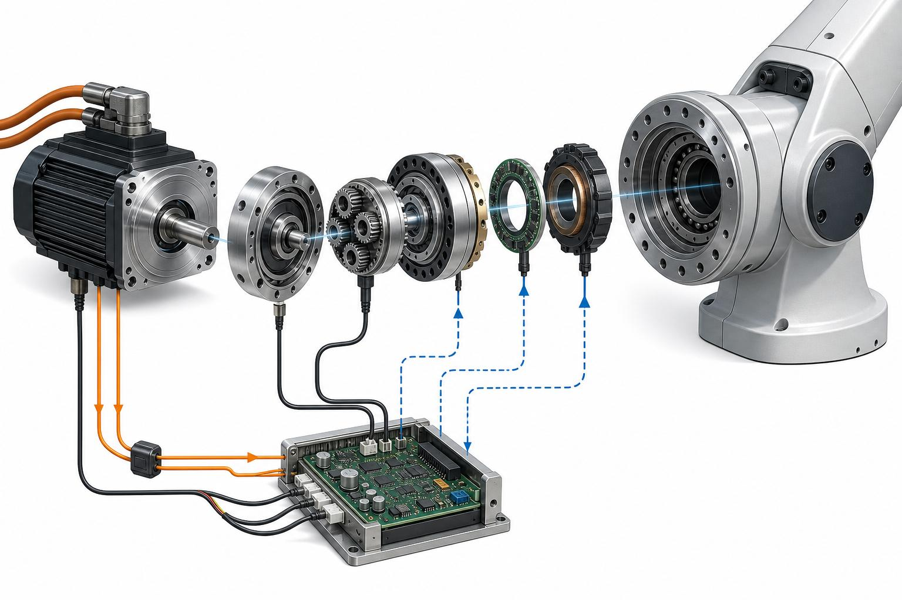

*图3-4 关节驱动、反馈与执行链*

### 3.2.3 传感系统

传感系统向机器人提供本体状态、环境状态和接触状态，是闭环控制与策略观测的共同基础。传感器的价值重点在于以明确的测量对象、坐标系、时间戳和误差模型，为控制器或策略提供可用于决策的状态估计。若测量量的来源、参考系或采样时刻不清楚，即使数值本身看似合理，也不能直接用于运动学计算、动作规划或安全判断。

本体状态传感首先包括编码器。编码器测量电机轴或关节输出端的角度，经过差分、滤波或状态估计后可得到角速度等量，是关节状态（joint state）的主要来源。编码器安装在电机端时，能够较直接地反映电机转子运动，但未必完整包含减速器弹性、背隙或传动误差；安装在输出端时，更接近实际关节角，却可能受到机构布置限制。对多关节机器人而言，关节位置、速度、effort 等字段应与明确的关节名称、单位和时间戳一同发布，不能以无标签数组替代状态定义。

惯性测量单元（inertial measurement unit, IMU）通常输出角速度和比力等原始量，经过融合后可用于姿态、速度或运动状态估计。IMU 并不直接“测得姿态”，姿态估计需要结合坐标变换、重力方向、积分过程以及可能的视觉、磁场或接触信息。其偏置和噪声会随时间积累为漂移，因此移动机器人、四足和人形机器人不能只依靠单一 IMU 输出判断长期位置或稳定性。对于固定基座机械臂，IMU 的作用可能较小；对于存在底座运动和支撑切换的系统，IMU 的时间同步和坐标安装关系则直接影响全身控制的可靠性。

在具身系统中，观测（observation）是经选择、标定和同步后供算法使用的状态集合，不等同于某一路图像。一个观测包可以包含图像、关节位置、夹爪状态、IMU、力/力矩、上一时刻动作和任务条件；其中不同传感器具有不同采样频率、传输延迟和有效范围。若相机帧与关节状态来自不同时刻，视觉到机械臂坐标的映射会与真实姿态不一致；若接触信号到达过迟，控制器可能在接触后仍继续施加原有命令。时间同步因而是闭环因果关系的一部分。

传感器失效、遮挡和缺失数据必须进入系统设计。相机可能受遮挡、反光、低照度或运动模糊影响，深度设备可能在透明、强反射或超量程表面出现无效值，编码器可能受通信中断或零位配置错误影响，IMU 和力传感器可能存在偏置漂移。可靠系统应记录数据有效标志、时间戳和诊断状态，并在关键观测失效时采取降级、保持或安全停止策略。使用多个传感器并不自动提高准确性；只有在坐标标定、时钟同步、噪声处理和融合逻辑均经过验证时，多源观测才可能提高状态估计的鲁棒性。

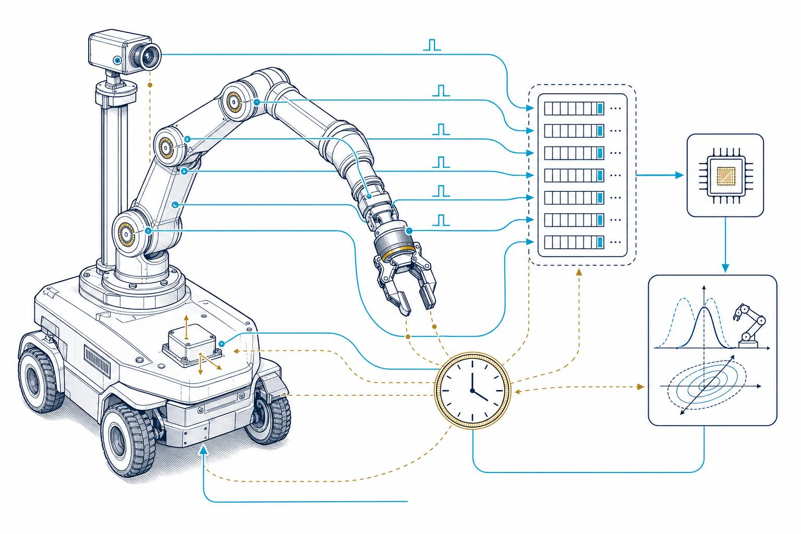

*图3-5 多模态传感状态的同步与融合*

### 3.2.4 控制系统

控制系统负责把任务级目标转化为机器人可稳定执行的命令，并在执行过程中利用状态反馈维持约束。它不等同于高层策略，也不等同于电机驱动器，而是由多个具有明确时间尺度和接口边界的层次组成。高层策略可以根据图像、语言或状态输出候选动作；控制系统则必须判断该动作在当前关节状态、动力能力、碰撞边界和安全规则下是否可行，并将其转换为适合具体执行器的参考量。

在典型分层结构中，任务或策略层先给出目标，例如物体的目标位姿、末端执行器相对增量、期望关节配置或底盘速度。运动学、规划或轨迹层再依据机器人模型把目标转化为连续且满足约束的参考轨迹。对于末端位姿目标，这一过程可能包含逆运动学求解、关节限位检查、碰撞检查和时间参数化；对于底盘速度目标，则可能包含速度限幅、加速度约束和路径跟踪。该层的输出仍是可由下一级控制器跟踪的关节位置、速度或力矩参考。

关节控制器以关节状态接口（state interface）提供的测量值为反馈，并通过命令接口（command interface）向硬件发送控制量。状态接口可包括位置、速度、effort、温度或诊断状态；命令接口则可能允许位置、速度、力矩或其他模式。接口名称相近并不意味着语义相同。位置命令要求下级系统把关节移动到给定参考位置，速度命令要求其跟踪给定速度，力矩命令要求其输出给定关节力矩或相应电流参考。三种模式依赖的反馈、限幅策略、稳定性条件和适用任务均不同，不能将同一数值在不同模式下直接复用。

实时性是控制系统的基本约束。控制循环需要在规定周期内完成状态采集、误差计算、命令更新和故障检查；若通信、计算或调度导致周期抖动过大，控制器看到的状态和下发的命令可能不再属于同一动态过程。高层视觉或语言模型的推理时间通常远长于低层伺服周期，因此二者之间需要明确的动作保持、插值、队列和安全检查机制。让低频策略直接承担高频关节闭环，既会削弱对扰动的响应，也会模糊故障发生的层级。

安全逻辑贯穿各控制层。关节限位、速度和力矩上限、碰撞区、通信看门狗、传感器诊断和急停机制会对候选命令施加约束。若状态不可用、命令超限或控制器切换失败，系统应进入预先定义的降级、保持、减速或停止状态，而不是继续执行旧命令。高层策略产生的 action 因而只是控制系统的输入之一；能否实际执行由硬件状态、控制模式和安全规则共同决定。

### 3.2.5 计算系统

计算系统为机器人上的感知、状态估计、规划、策略推理、通信和日志服务提供运行环境。它既包括机载计算模块、工控机、GPU 或边缘设备，也包括操作系统、运行时、中间件、消息总线和数据存储机制。计算系统不直接产生关节力矩，却决定信息能否以正确的顺序、足够的时效性和可追溯的方式抵达控制系统，因此是连接学习算法与物理执行的重要层。

不同计算任务对资源的要求并不相同。视觉编码、语言理解和视觉语言动作模型往往需要较大的 GPU 内存与并行计算能力，适合在 GPU 工作站或具备加速器的机载设备上运行；状态估计、通信桥接、控制器管理和安全监测更关注确定性、接口可靠性与长期稳定运行；数据采集和回放则要求持续记录图像、状态、动作、时间戳与诊断信息。训练环境可以使用远程服务器或高性能工作站，部署环境则受到功耗、散热、重量、供电和设备接口的限制。因此，训练阶段可运行的模型并不自动满足机载部署条件。

计算系统中的通信总线负责把传感器、策略、控制器和硬件接口连接为可追踪的数据通路。每条关键消息应包含数据值、单位、坐标系或帧标识、时间戳和有效状态；若系统跨越相机、IMU、机械臂、底盘与多个进程，还应定义统一时钟或时钟转换方法。消息能够传输并不等于其可用于控制：队列堆积、丢帧、网络抖动、序列化开销和时钟偏差都会改变观测与动作之间的实际延迟。对于依赖视觉反馈的操作任务，旧图像配合新关节状态可能使策略在错误的相对几何关系上作出判断。

因此，计算平台选型必须同时核对算力、接口、时钟、供电、散热和故障恢复机制，而不能只比较峰值推理指标。

安全监测也依赖计算系统，但不应只依赖非实时的高层进程。软件可检查通信存活、消息时延、状态合理性和策略输出范围，并发出降级或停止请求；驱动器和低层控制仍需保留独立的限位、限流和急停能力，以应对上层计算失效。由此，计算系统的工程目标是在资源受限条件下维持可验证的数据流、明确的时间边界和分层的安全责任。

### 3.2.6 机器人分层数据流

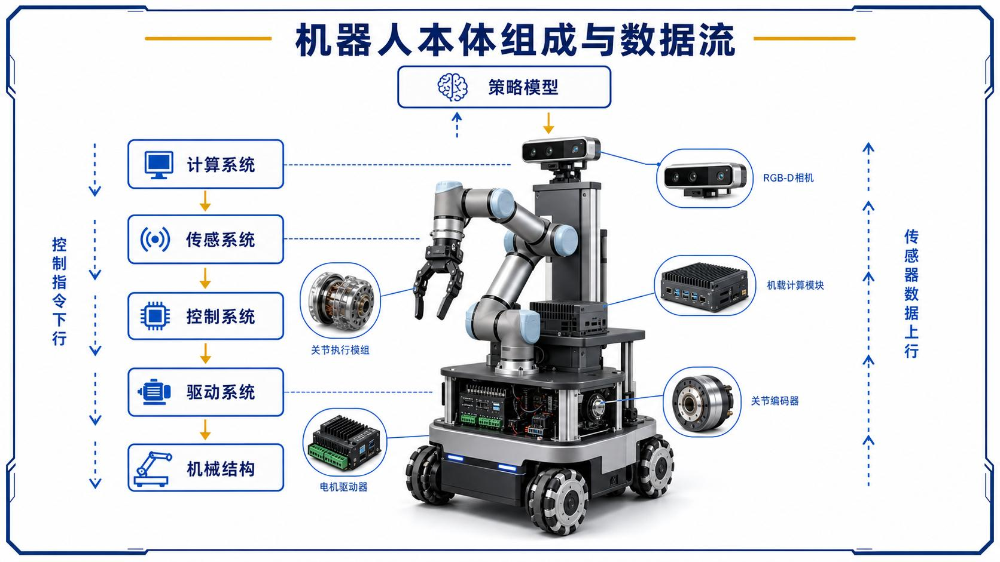

*图3-6 机器人本体组成与数据流（依据［1-3］绘制）*

机器人在运行时形成持续闭合的数据流：物理世界与本体状态产生测量值，测量值经估计和融合形成观测，策略根据观测产生候选动作，适配与控制层将该动作转换为硬件命令，执行结果再通过传感器返回系统。将这条链路分层的目的，是使任何关键量都能回答五个问题：它由谁产生，在什么坐标系和单位下表达，何时产生，被谁使用，以及失效时会以何种现象暴露。

上行链路从硬件状态开始。编码器、电流传感器、IMU、相机、力/力矩传感器和安全模块分别产生原始测量；硬件接口将其组织为关节状态、诊断状态或传感消息；状态估计与坐标变换再把这些数据转换为控制器或策略可使用的变量。以机械臂末端位姿为例，它是由关节状态、运动学模型和参考坐标系共同确定；以物体相对末端的位置为例，则还需要相机内外参、手眼变换和图像时间戳。上行数据若没有统一帧标识和时间基准，就不能安全地拼接为同一时刻的系统状态。

观测融合层负责选择和同步策略所需的信息。观测可能包括图像、深度、关节位置与速度、夹爪状态、IMU、接触信息、历史动作和任务条件，但不同字段不应因位于同一消息中而被视为同样可靠。融合过程需要处理采样频率不一致、延迟、缺失值、坐标变换和有效标志；例如，低频视觉帧可与高频关节状态结合，但必须知道该图像对应的采集时刻，并在需要时使用插值或延迟补偿。策略消费的是具有明确时间语义的观测，而不是任意时刻拼接的数据集合。

数据流中最常见的故障包括坐标错配、单位错配、时间错配和约束触发。坐标错配会使空间方向被错误解释；单位错配会使归一化数值、弧度、米或速度量级发生错误转换；时间错配会使观测与动作对应不同的物理状态；约束触发则说明候选命令被限位、限速、碰撞检查或安全模块裁剪。诊断时应沿数据流回溯：先比较原始观测与估计状态，再检查策略输出与适配后命令，最后检查控制器和驱动器实际报告的执行结果。只有记录每层输入输出，才能判断错误发生在感知、策略、接口还是硬件。

为保持这种可观测性，系统应在数据记录中保留消息来源、序号、时间戳、坐标帧、单位、有效标志和裁剪原因。仅保存最终视频或最终关节轨迹，不能证明策略实际接收了什么观测，也无法解释命令为何未按预期执行。对于训练数据，这些元数据同样决定样本能否在另一套软件或硬件配置中被正确重放。

| 模块 | 主要对象 | 典型状态或命令 | 教学关注点 |
| --- | --- | --- | --- |
| 机械结构 | 连杆、关节、末端 | 位姿、限位、负载 | 运动范围 |
| 驱动系统 | 电机与减速器 | 电流、转速、力矩 | 执行能力 |
| 传感系统 | 相机、编码器、IMU | 图像、角度、姿态 | 观测质量 |
| 控制与计算 | 控制器、计算节点 | 参考、反馈、时间戳 | 接口与时序 |

## 3.3 运动结构基础

### 3.3.1 自由度

自由度（degrees of freedom, DoF）是确定机器人构型所需的独立变量数量。对串联机械臂，它常与独立单自由度关节数相同，但不能普遍等同于关节数。一个关节可贡献一个或多个自由度，而闭链、耦合和外部约束都可降低独立变量数。

在三维空间中，一个不受约束的刚体通常具有六个自由度：沿三个相互独立方向的平移，以及绕三个相互独立轴的转动。平面运动的刚体通常具有三个自由度，即平面内两个平移和一个转动。这些是刚体相对于参考坐标系的运动自由度，并不等同于机械臂拥有的关节数。机械臂末端若需要同时指定三维位置和姿态，任务描述通常涉及六个分量；若任务只要求从上方到达某个平面位置而不要求绕工具轴的朝向，所需的任务自由度会相应减少。

关节自由度由机构中的独立关节变量决定。转动关节通常以一个角度表示，移动关节通常以一个线位移表示；多个串联关节的变量共同构成关节空间。电机数量与关节自由度在简单主动机构中可能相同，但并非必然相同：一个电机可以通过传动同时驱动多个关节，多个电机也可共同作用于一个输出自由度；闭链机构、差动机构和被动关节还会引入额外约束。因此，描述平台时应优先说明可独立控制的关节变量及其约束，而不是仅列出执行器数量。

自由度还受外部约束改变。固定在桌面的机械臂以基座为已知约束，关节变量即可描述其主要构型；移动底盘与地面接触后，平面运动和轮胎非完整约束会限制瞬时可实现速度；人形机器人在双脚、单脚或腾空状态下又具有不同的接触约束。故而，同一台机器人并不存在脱离接触状态的唯一“有效自由度”。控制器和规划器必须将当前支撑、接触和任务约束作为条件，而不是仅依据产品参数表中的关节数量生成动作。

在软件接口中，自由度通常表现为关节状态向量、命令向量或任务变量的维数，但向量长度本身不足以说明语义。每个分量还需绑定关节名称、排列顺序、单位、范围和参考时间；否则两个维数相同的动作向量仍可能控制完全不同的机构。该要求为后续的关节空间、任务空间和动作空间定义提供了统一的检查基础。

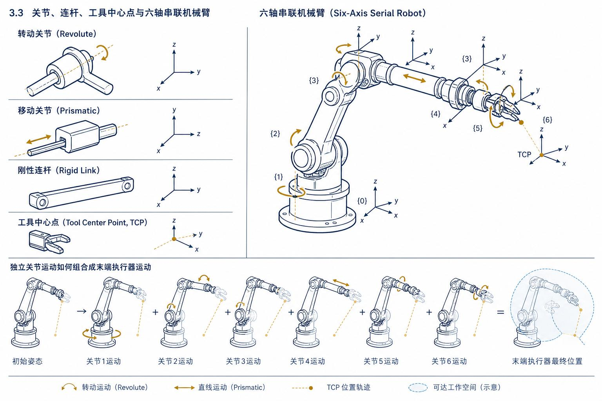

*图3-7 自由度、关节与末端运动的关系*

### 3.3.2 关节

关节是连接相邻连杆并规定相对运动方式的机构单元。对软件和控制系统而言，关节不仅是一个机械位置，更是状态、命令、限位和坐标关系的共同载体。只有明确关节类型、关节轴、变量单位、有效范围和驱动方式，关节状态向量和控制命令才具有可解释的物理含义。

常见的关节类型包括转动关节和移动关节。转动关节围绕规定轴线改变相对角度，变量通常以弧度表示；移动关节沿规定轴线改变相对位置，变量通常以米表示。连续转动关节可在几何上跨越完整旋转范围，但仍可能受到线缆、传动或软件限制；固定关节不提供独立运动变量，却在坐标变换链中确定两个连杆之间的刚性关系。关节轴必须相对于明确的父连杆坐标系定义，轴方向或零位配置错误会使同一正命令产生错误的空间运动。

主动关节由执行器直接或经传动获得可控输入，被动关节的运动则由机构约束、重力、接触或其他主动关节带动。两者都可能出现在运动学模型中，但不应在控制接口中被同样处理。闭链、差动或腱绳机构中，一个执行器的变化可能影响多个关节变量，或一个关节变量由多个执行器共同形成；此时命令空间与关节空间之间需要额外映射，不能简单按数组索引逐项下发。

关节配置应在模型、控制器和硬件之间保持同源：名称、顺序、轴方向、单位、限位与控制模式的任一差异都会造成命令解释错误。上线前的检查应包括低速单关节运动、限位接近时的减速行为、状态反馈方向以及急停后的恢复前提；这些检查只验证接口一致性，不以突破硬件限位来验证动作范围。

在发布或读取关节接口时，还应区分物理关节、传动关节和软件暴露的控制变量。某些机构为便于控制会以耦合变量表示多个关节，另一些机构则把被动关节保留在模型中但不提供命令接口。接口文档应明确这种差异，避免把模型中的每一个关节都误认为可直接驱动的执行器对象。

### 3.3.3 连杆

连杆是由关节连接的结构刚体，是机器人运动链中传递几何关系、载荷和惯性的基本单元。描述连杆时至少要区分三类信息：几何信息说明其形状、尺寸和与相邻关节的相对位置；质量属性说明质量、质心和转动惯量；刚度与装配属性说明真实结构相对于理想刚体模型可能产生的形变和误差。三类信息面向不同计算对象，不能以同一外观模型相互替代。

连杆长度和关节轴位置共同决定末端位姿的几何映射。若标称长度或安装偏置存在误差，关节角即使被精确测量，末端计算位置仍会产生系统偏差；误差通常沿运动链传播，并可能在远离基座的末端被放大。几何模型因此需要以明确参考坐标系记录，而工具更换、法兰安装或末端附件变动也会改变模型中的固定变换。对操作任务而言，几何校准的目标是使模型给出的坐标关系足以支持定位、规划和控制。

质量、质心和惯性属于动力学属性。质量决定重力负载，质心位置决定重力对各关节产生的力臂，惯性张量描述连杆围绕不同轴加速时的阻抗。它们影响驱动器所需输出、重力补偿、轨迹跟踪和碰撞后的响应。仅知道连杆长度不能推断其动力学负担：相同长度的实心金属杆、空心管和带有远端工具的复合结构，质量分布可能完全不同。模型中的惯性参数应以选定连杆坐标系表达，并与真实质量分布保持可验证的一致性。

连杆参数的更新也应纳入配置管理。更换工具、增加相机支架、修改线缆走向或维修连接件，可能同时改变末端固定变换、质量分布和碰撞边界；若模型未同步更新，仿真、规划和真机控制将引用不同的结构假设。上线前应至少检查工具中心点、负载参数、碰撞几何与关节零位是否对应当前硬件状态。

模型校验应从可观测结果开始：在安全速度下比较若干已知关节构型的预测末端位姿与实测位姿，检查负载变化前后的重力补偿与跟踪误差，并确认碰撞模型既不遗漏关键部件，也不过度扩大安全边界。发现系统偏差时，应区分几何标定、质量参数、传动弹性和传感误差，而不是只修改轨迹终点。

### 3.3.4 末端执行器

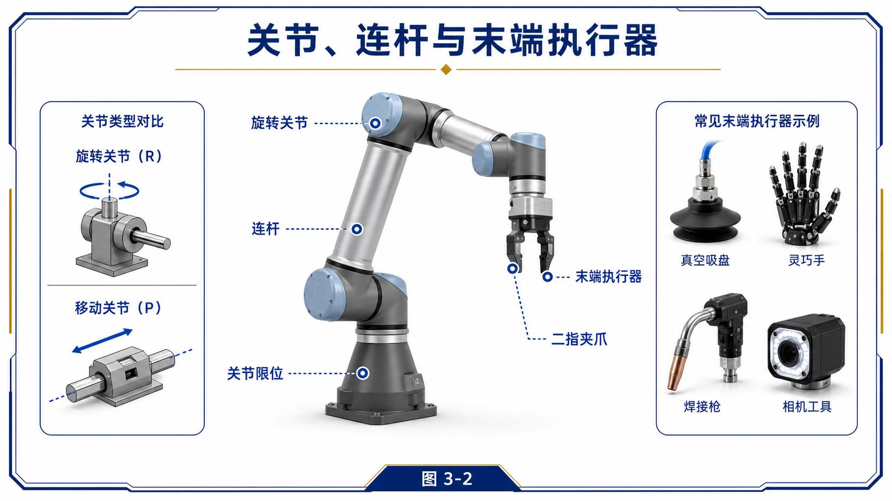

*图3-8 关节、连杆与末端执行器（依据［1，4］绘制）*

末端执行器（end-effector）是机器人运动链中直接与任务对象、工具或环境发生作用的部分。对机械臂而言，它可以是二指夹爪、吸盘、灵巧手、焊枪、螺丝刀、打磨工具或专用夹具；对移动操作和人形机器人而言，手部、工具快换装置以及附着在手部的器具都可能构成任务末端。末端执行器决定机器人以何种接触方式完成动作，因此既影响任务能力，也影响状态观测、控制接口和动作空间的定义。

二指夹爪通过两指相对运动形成夹持，适用于具有可夹持边缘或平行接触面的物体；吸盘依赖密封、压力差和接触表面条件，适用于相对平整且气密性足够的对象；灵巧手以多个手指和关节提供更丰富的接触构型，可支持捏取、转动和在手操作，但同时增加了状态维度、接触不确定性和控制难度。工具端的任务能力还取决于工具几何、刚度、安装方式和传感配置。因而，“装上手”不等同于具备通用操作能力，末端形式必须与对象形状、材料、接触力、精度和安全约束相匹配。

工具中心点（tool center point, TCP）是为描述工具工作位置和姿态而选定的参考点或参考坐标系。对于夹爪，TCP 可以位于两指之间的预期抓取中心；对于吸盘，TCP 通常与吸附面法向和接触中心相关；对于螺丝刀等工具，TCP 应对应真正参与作业的尖端或轴线。TCP 是在工具坐标系中显式配置的工程约定。运动学、轨迹规划和视觉引导若引用不同的 TCP，机械臂即使准确执行关节命令，实际工具作用点仍会产生系统偏移。

末端任务的评价也应对应具体接触机制。二指夹爪可检查接触位置、闭合后物体相对位姿和是否发生滑移；吸盘可检查真空状态、密封持续性与载荷方向；工具端则需检查尖端位置、轴线姿态、接触力或工艺过程状态。视觉可提供接近和对象定位信息，力/力矩与触觉反馈可用于确认接触和调整作用力，但任一传感器都不能替代工具模型。对人机共存或易损物体任务，还必须将工具边缘、夹持力和意外释放作为独立安全约束。

在部署前，末端更换应触发一组固定核验：确认工具识别和 TCP 配置正确，检查质量与碰撞模型是否更新，以低速无负载动作验证可达范围，再在受控条件下验证接触与释放过程。未经这些步骤，策略在旧工具上学习到的动作不能直接迁移到新工具；即便两者的法兰接口相同，其接触几何和控制语义也可能不同。

### 3.3.5 关节空间与末端空间

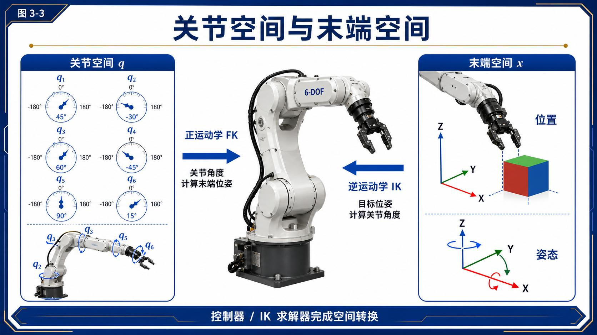

*图3-9 关节空间与末端空间（依据［1，3］绘制）*

关节空间（joint space）以机器人各独立关节变量组成的向量描述构型。例如，具有 n 个受控关节的机械臂可用关节向量 q 表示其位置构型；若同时考虑关节速度和加速度，则还可使用相应的导数向量。关节空间的每个分量必须对应具体关节名称、单位、零位和限位，因此它直接适合控制器、编码器反馈和驱动接口使用。关节空间中的两组数值即使维数相同，若关节顺序或单位不同，也不能互相解释。

末端空间通常指任务空间（task space）中末端执行器位姿的描述。位姿同时包含位置和朝向：位置可在指定坐标系中以三个平移分量表示，朝向可用旋转矩阵、欧拉角、轴角或四元数等方式表示。不同姿态表示具有不同的参数约束和数值特性，因而在接口中必须固定约定，不能在同一数据链路中混用。工具中心点、基坐标系和目标参考坐标系共同决定末端位姿的物理含义；若任一坐标系未定义，所谓“末端到达目标”就没有可验证的参照。

关节空间和末端空间描述的是同一机构的不同层次。关节空间便于表达驱动变量和限位，末端空间便于表达抓取、插接、搬运等任务目标。二者之间通过机构几何、关节轴和坐标变换链建立映射：给定关节状态可计算末端位姿，给定目标末端位姿则需在约束下寻找可行关节构型。前者称为正运动学，后者称为逆运动学，其具体求解方法将在第3.7节讨论。本节只要求明确输入、输出与坐标系，避免把末端空间误写成一个独立于关节和机构的抽象世界。

任务可达性的核验应按几何、约束和执行顺序进行：先确认目标在正确参考坐标系中，再检查机构几何和关节限位是否允许该位姿，随后检查碰撞、工具姿态、负载和路径连续性，最后才将结果交给控制器跟踪。若任何一层未通过，不应将任务空间目标强行转换为关节命令。该顺序也说明，末端目标误差可能源于视觉外参、TCP 配置、运动学模型或控制跟踪，不能只通过修改关节目标补偿。

空间转换的验证还应覆盖时间关系。关节状态、末端位姿和外部观测若来自不同时间点，即使坐标变换正确，也可能因运动过程而产生表观误差。任务空间接口应随位姿记录时间戳、有效性、状态和来源，在高速运动、接触或视觉延迟较大时尤其不能将异步数据直接作为同一状态比较。

| 对象 | 描述变量 | 对任务的影响 | 常见检查 |
| --- | --- | --- | --- |
| 自由度 | 独立运动变量 | 决定动作维数 | 变量是否独立 |
| 关节 | 位置、速度、力矩 | 决定局部运动 | 限位与方向 |
| 连杆 | 长度、质量、惯量 | 决定可达范围 | 模型参数 |
| 末端执行器 | TCP、接触状态 | 决定作业方式 | 工具配置 |

## 3.4 常见机器人形态与课程平台

### 3.4.1 常见机器人形态

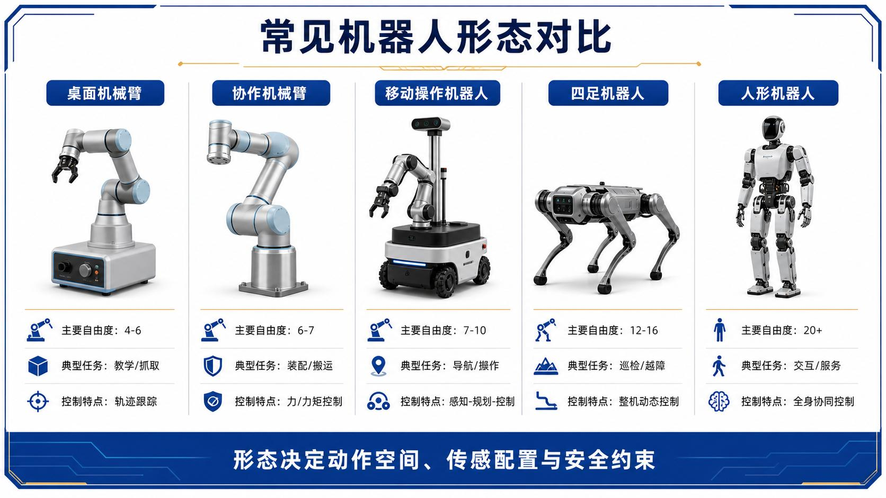

*图3-10 常见机器人形态对比（依据［5，7，10-11］绘制）*

机器人形态决定任务与控制的基本边界。比较不同平台时，不应只按外观或自由度数量分类，而应同时考察其支撑条件、可控对象、观测来源、动作空间和典型失效模式。固定机械臂、移动底盘、移动操作机器人、双臂系统、灵巧手、四足机器人和人形机器人并非复杂度单调递增的同一产品序列；它们面对的是不同的接触、运动和安全问题。

固定基座机械臂以稳定基座为前提，主要控制关节和末端执行器。其工作空间相对确定，适合桌面抓取、搬运、分拣、装配和工具操作；任务风险多集中于末端碰撞、关节限位、夹持失败和工具姿态误差。移动底盘则以平面运动为核心，可控量通常包括线速度和角速度，主要问题是定位、路径、避障与地面条件。底盘本身缺乏操作末端时，并不能完成需要精细接触的任务。

移动操作机器人将底盘、机械臂和感知系统组合在一起，使任务范围从固定工作台扩展至更大环境，但也引入底盘与手臂之间的坐标变换、时序同步、底座扰动和视角变化。双臂系统可在搬运、稳定抓持和装配中提供相对位姿约束与载荷分配能力，同时必须处理臂间自碰撞、时序协调和对象约束。灵巧手进一步增加手指关节和接触点，可完成复杂在手操作，却需要更高维状态、触觉或力反馈以及更细致的接触控制。

典型失效模式也应按形态区分。固定机械臂容易发生姿态不可达、夹持失败和工具碰撞；移动操作可能发生定位漂移、底座扰动和手眼坐标不一致；双臂系统可能因相对位姿失配或臂间碰撞而失败；灵巧手常受接触不确定性和观测不足限制；腿式系统则必须面对摩擦变化、接触切换和姿态恢复。将这些风险提前写入平台选择和动作定义，有助于避免在真机测试阶段才发现任务条件与本体能力不匹配。

平台选型还应考虑可维护性和验证成本。增加传感器、自由度或接触点不仅扩大能力范围，也增加标定、同步、模型更新和安全检查的对象。课程中的比较因此以任务所需的最小可控量和可观测量为起点，避免把不必要的系统复杂度误当作能力优势。

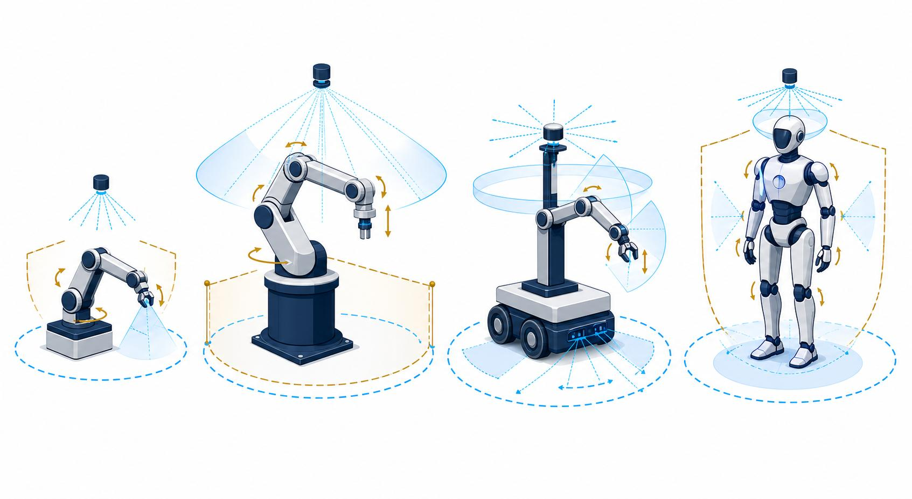

*图3-11 不同机器人平台的状态、动作与约束边界*

### 3.4.2 SO101 教学机械臂

SO101 是 LeRobot 生态中面向学习、示教和基础操作实验的公开机械臂平台。将其用于课程的价值重点在于它以相对清晰的串联运动链、关节状态、夹爪动作和视觉采集链路，提供了观察“观测—动作—执行—反馈”闭环的可控对象。课程讨论应以官方文档、公开代码和实际配置为依据，不把不同版本、不同装配方式或社区改造方案的规格混为同一平台事实。

该类教学机械臂通常由基座、多个转动关节、连杆、末端夹爪和控制电子部件组成。固定基座使任务空间相对稳定，关节状态和夹爪开度可直接作为示教或策略的状态字段；相机可提供任务对象和工作台面的视觉观测。入门任务可选择物体抓取、放置、轨迹回放和视觉引导接近，用于验证关节命令、末端运动、夹爪接触与数据记录之间的对应关系。它不适合作为高速、高负载或复杂接触控制能力的代表，课程应明确其教学边界。

在数据采集环节，关键是同步记录图像、关节位置、夹爪状态、动作命令、时间戳和任务结果。若采用示教方式，需说明主从机械臂或其他输入设备产生的动作如何映射到被控机械臂的关节或末端；若采用策略控制，需说明 action 的参考对象、单位、范围和控制周期。关节顺序、零位、限位和夹爪语义应与所加载的模型配置一致，否则演示数据即使可回放，也可能无法用于可靠训练或真机部署。

一个完整的教学实验可按低风险顺序组织。先在无工具或空载条件下读取关节状态，验证每个关节的名称、方向、零位和限位；再执行低速单关节与末端小范围运动，比较命令、状态反馈和实际观察结果；随后加入夹爪开合和简单对象抓取，记录图像、关节状态、夹爪状态、时间戳与任务结果；最后才将同一数据链用于轨迹回放或策略推理。该过程能够把“动作是否正确”拆为接口配置、视觉观测、动作转换、控制跟踪和接触结果等可检查环节。

若出现末端偏移，应先检查工具中心点、相机外参和关节零位；若出现夹持不稳，应区分对象几何、夹爪命令、接触位置和传动状态；若回放动作与示教不一致，则应检查关节顺序、单位、时间同步和命令裁剪记录。上述检查并不要求平台承担复杂任务，却能建立真机数据的可追溯性。只有在这种可解释的基础上，教学机械臂采集的数据才适合扩展到模仿学习或视觉语言动作策略实验。

### 3.4.3 xLeRobot 移动操作套件

xLeRobot 类移动操作套件将移动底盘、机械臂、相机、计算与控制接口组合为同一任务系统。与固定基座机械臂相比，其核心变化不只是增加了可移动底座，而是使任务坐标系、观测视角和执行器状态同时随底盘运动改变。平台能否完成“移动到目标附近后再操作”的任务，取决于底盘定位、相机标定、机械臂可达性和控制时序是否一致。

移动操作的坐标链至少涉及世界或地图坐标系、底盘坐标系、机械臂基座坐标系、相机坐标系、末端 TCP 与目标对象坐标系。底盘移动后，机械臂基座和相机相对于环境的位置都会改变；若坐标变换未更新或不同模块引用了不同时间的变换，视觉估计的目标位置将无法被正确用于机械臂规划。相机安装在底盘、机械臂或外部环境时，外参的含义和误差传播方式也不同，不能将固定桌面实验的手眼标定配置直接移植到移动平台。

该平台的观测通常需要同时包含底盘位姿或速度、机械臂关节状态、相机图像、末端状态和必要的任务条件；动作则可能包含底盘线速度与角速度、关节目标、末端增量或夹爪命令。任务执行应明确底盘与手臂是顺序工作还是并行工作：在精细抓取阶段，底盘运动可能改变相机视角和末端相对目标的位置；在行驶阶段，手臂姿态又可能影响碰撞外廓和稳定性。因此，策略和控制器必须知道动作的参考系、更新时间以及在何种状态下允许底盘和手臂同时运动。

当底盘和机械臂需要并行运动时，状态估计和安全模型必须同时覆盖两类运动。底盘加减速会改变相机图像的运动模糊、机械臂基座的瞬时状态和工具相对环境的速度；机械臂伸展又可能扩大整机碰撞外廓并改变可接受的行驶速度。控制策略可采用阶段切换、速度耦合限制或共享轨迹约束，但无论采用何种方式，都应记录底盘命令、关节命令、状态时间戳和安全裁剪结果。若无法保证观测与执行的时序一致，应优先降低运动速度或将移动与精细操作分离。

移动任务开始前的核验应包括定位参考系是否有效、相机与机械臂变换是否可查询、底盘速度是否受环境和手臂姿态约束、紧急停止是否同时覆盖底盘和机械臂。到达操作区域后，还需重新检查目标在当前坐标系中的位置和末端可达性；不能假定导航阶段估计到的位置在底盘停止后仍保持精确。该流程使平台从“能移动的机械臂”转变为具有统一闭环条件的移动操作系统。

### 3.4.4 Imeta-Y1 科研机械臂

Imeta-Y1 可作为研究级操作平台的案例，用于说明机械臂本体、视觉感知、运动学规划和控制接口如何服务于可重复实验。正文对该平台的描述应限制在厂商公开页面、正式手册、开发接口和实际锁定的硬件版本所能证实的范围内。未确认的负载、精度、自由度、控制频率或传感器配置不得被写成平台固有性能，更不能由宣传图或演示视频推导控制结论。

研究操作平台与教学机械臂的差别，通常不只在结构尺度或价格，而在于是否具备较稳定的状态接口、可复现的控制模式、明确的工具配置和适合实验记录的软件边界。研究任务可能要求视觉伺服、轨迹跟踪、受约束接触、双臂协同或策略部署，因此需要将相机坐标系、末端 TCP、关节状态、控制器模式和安全限制写入同一实验配置。平台可否承担某项实验，应由实际模型、控制接口和任务条件共同决定。

以视觉引导操作为例，系统需要从相机观测中估计目标，再经相机到机器人基座的变换获得任务空间目标；运动学与规划层检查该目标的可达性、姿态和碰撞约束；控制器将轨迹转换为关节命令并利用状态反馈跟踪。任一环节的标定、时间同步或接口语义错误，都会使“视觉伺服误差”混入几何、控制或通信问题。科研平台的意义在于允许这些变量被明确记录和分别验证，而不是保证视觉任务自动成功。

为获得可比较的结果，实验应固定任务对象、参考坐标系、工具、控制模式、初始构型、速度与安全边界，并说明哪些因素允许变化。重复试验前后需检查相机与机器人坐标关系、关节零位、日志时钟和软件版本；若出现失败，按观测、标定、规划、接口、控制和接触六个层次记录原因。这样的复现要求并不限制研究创新，而是防止把偶然的环境变化、未记录的工具改动或安全裁剪误认为算法性能差异。

在未锁定具体硬件版本前，本节仅将该案例用于说明研究平台应如何组织实验变量，不把厂商页面的外观或应用展示转化为性能指标。任何用于比较的实测结果都必须附带版本、工具、任务和控制条件。

### 3.4.5 Unitree G1 人形机器人

Unitree G1 可作为人形机器人本体的公开案例，用于说明上肢操作为何不能脱离腿部支撑、躯干姿态和全身状态单独讨论。课程对其结构与开发接口的叙述应以官方页面、开发者资料和经核实的公开文档为限；不同版本、选配模块或宣传场景中的自由度、速度、负载和感知能力，不应在未核对型号与条件时写成统一结论。

人形机器人由腿、足端、腰部、躯干、双臂、手部、头部/相机、IMU、关节驱动和机载计算共同构成。腿与足端提供支撑和移动能力，腰部与躯干提供姿态调整和上肢可达范围，双臂和手部执行操作，IMU 与关节状态参与姿态和运动估计。与固定基座机械臂不同，手部目标的位置和姿态会随躯干、支撑脚和身体运动变化；上肢加速、负载变化或工具接触也可能反过来影响全身平衡和碰撞约束。

全身状态至少需要区分关节状态、躯干姿态、角速度、支撑/接触状态、足端位置、手部状态和安全诊断。高层任务动作可能表达为手部目标、末端增量或全身子目标，但在进入驱动器之前，需要经过全身可达性、关节限位、自碰撞、支撑条件和安全限制的检查。将手臂 action 直接解释为独立关节命令，会遗漏腰、腿和接触约束对可执行动作集合的影响。

课程中使用此类平台的目的，是理解动作从上肢目标扩展为全身可执行命令时新增的状态、约束和安全责任，而不是复现具体厂商的展示动作。任何平台规格、开发接口或模式切换细节，都必须以所使用硬件版本的官方手册为准。

开发过程中还应区分厂商公开的结构信息与实际可用的软件接口。某个部位在外观上存在，并不证明高层程序可以直接读取其状态或向其下发独立命令；接口可用性、控制模式和安全限制均应以当前硬件版本的开发文档和受控测试确认。

### 3.4.6 本节要点

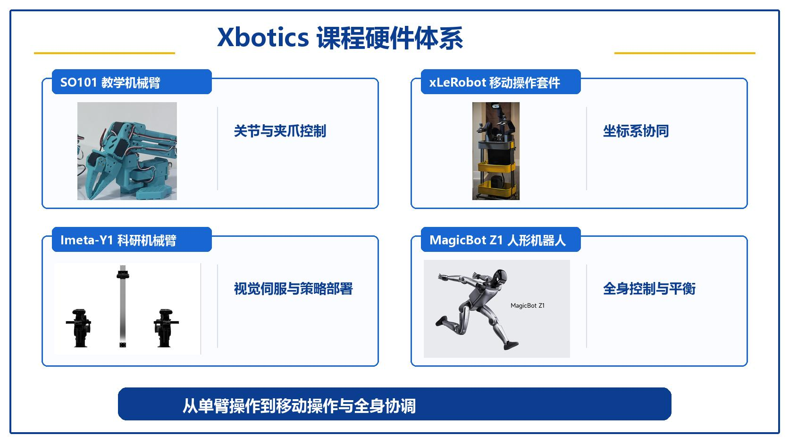

*图3-12 Xbotics 课程硬件体系（实物图来源：［7-10］）*

| 平台类别 | 主要状态 | 主要动作 | 突出约束 |
| --- | --- | --- | --- |
| 桌面机械臂 | 关节与夹爪 | 关节位置、夹爪开合 | 关节限位 |
| 科研机械臂 | 视觉、末端状态 | 末端位姿、接触 | 标定与碰撞 |
| 移动操作平台 | 底盘、相机、机械臂 | 底盘速度、末端动作 | 坐标与时序 |
| 人形机器人 | 全身与接触状态 | 全身关节参考 | 平衡与接触 |

## 3.5 控制基础：从开环到关节控制

### 3.5.1 开环控制

开环控制是指控制输入按照预定命令、时间表或逻辑条件发出，而不利用被控对象的实时输出修正当前命令的控制方式。开环并不意味着系统没有任何传感器，也不意味着动作没有计划；关键在于某一控制环节的输入不根据该环节实际结果形成闭环误差。定时输送、固定步数执行、预设开合或在已验证环境中的简单轨迹回放，均可能采用开环或近似开环方式。

开环能够成立需要若干条件：对象初始状态可控，负载和环境扰动较小，执行器输出与命令之间的关系足够稳定，任务对最终误差不敏感，且失效后果可接受。例如，在无障碍、负载恒定的教学演示中，可按预定时长使某个机构完成重复动作；但若摩擦、负载、电源状态或接触条件变化，实际位移将逐步偏离预期。开环不能自行识别这种偏差，因此不适用于需要精确到位、接触安全、动态平衡或环境变化显著的任务。

时间驱动与状态驱动需要区分。时间驱动开环以持续时间、脉冲数或预设序列作为动作依据；状态驱动逻辑可根据外部事件切换下一步，但若该状态未用于纠正当前被控变量的误差，仍不构成该变量的闭环控制。比如，系统收到“到达下一工位”的高层信号后开始一段固定动作，并不表示关节位置已经被实时反馈控制。只有将目标值与测量值比较并据此调整输入，才形成该对象的闭环。

开环任务的可观测性要求并不低。系统至少应记录命令发送时间、执行持续时间、驱动或控制模式、保护触发状态以及任务结果，使偏差能够被事后识别。若任务失败后无法判断命令是否真正下发、执行器是否受限、环境是否改变，就不能确认开环假设是否仍成立。对可能造成碰撞、夹伤、跌落或设备损坏的动作，开环只能作为经过验证的局部环节，并应设置人工接管、超时退出和安全停止条件。

当开环轨迹被用作标定、示教或诊断基准时，应在每次硬件、负载或环境变化后重新验证。固定时间回放可用于检查重复性，却不能替代对状态误差的测量；若偏差超过任务允许范围，正确的处理是增加反馈、改进状态估计或缩小任务条件，而不是继续累积经验时间参数。这样，开环控制可以作为简单系统中的工具，而不会被误用为对真实执行状态的假设。

### 3.5.2 闭环控制

闭环控制以目标值与测量值之间的误差为依据持续修正控制输入。最小闭环包含参考值、被控对象、传感测量、误差计算和控制器：参考值描述期望状态或行为，被控对象是关节、底盘、末端或其他实际系统，传感器提供当前状态，控制器根据误差生成新的命令。闭环的关键应测量结果被用于改变后续输入，使系统能够抵抗一定范围内的扰动和模型误差。

以关节位置控制为例，目标角度与编码器测得的实际角度相减得到位置误差；控制器根据误差和设计规则产生速度、力矩或电流相关的参考量；驱动器执行后，新的关节位置再次被测量。若负载增加、摩擦变化或外部接触使关节落后于目标，闭环会在误差存在时继续调整输入。闭环并不保证任何目标都能实现：执行器能力、关节限位、通信延迟、传感精度和稳定性条件仍会限制其可达到的效果。

反馈延迟会改变控制器看到的系统状态。若测量、传输、计算和执行之间的总延迟不可忽略，控制器根据的是较早时刻的误差，过高增益可能使系统对已经改变的状态继续过度修正，从而产生过冲或振荡。传感噪声同样会进入误差计算，特别是在对速度或误差变化率敏感的环节，噪声可能被放大为高频命令抖动。因此，闭环设计需要同时考虑控制周期、滤波、带宽、执行器响应和安全限幅，而不能只通过提高反馈频率或增益获得更好性能。

执行器饱和是闭环中必须显式处理的限制。位置、速度、力矩、电流和加速度均有实际范围；当控制器所需输出超过该范围时，实际输入会被裁剪，误差不再按理想模型减小。持续饱和可能造成积分累积、过冲、温升或保护触发，也会使高层策略观察到的实际动作与其候选命令不同。诊断时应同时查看参考值、测量值、未裁剪控制量、裁剪后命令和驱动器状态，不能只通过最终误差判断控制器是否稳定。

闭环稳定性应在明确工况下验证。低速空载稳定不代表带负载、高速、接触或通信延迟条件下同样稳定；更高反馈增益也不必然改善跟踪，可能放大噪声或激发机构柔性。实验应从受限速度和小范围动作开始，逐步改变负载、轨迹和反馈条件，并保留保护触发与异常恢复记录。这样，闭环控制才能被理解为受模型、测量和执行能力共同限制的反馈机制。

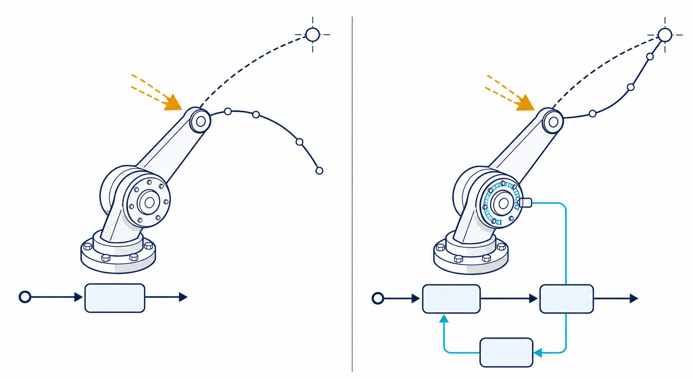

*图3-13 扰动条件下开环与闭环控制的差异*

### 3.5.3 最小闭环结构

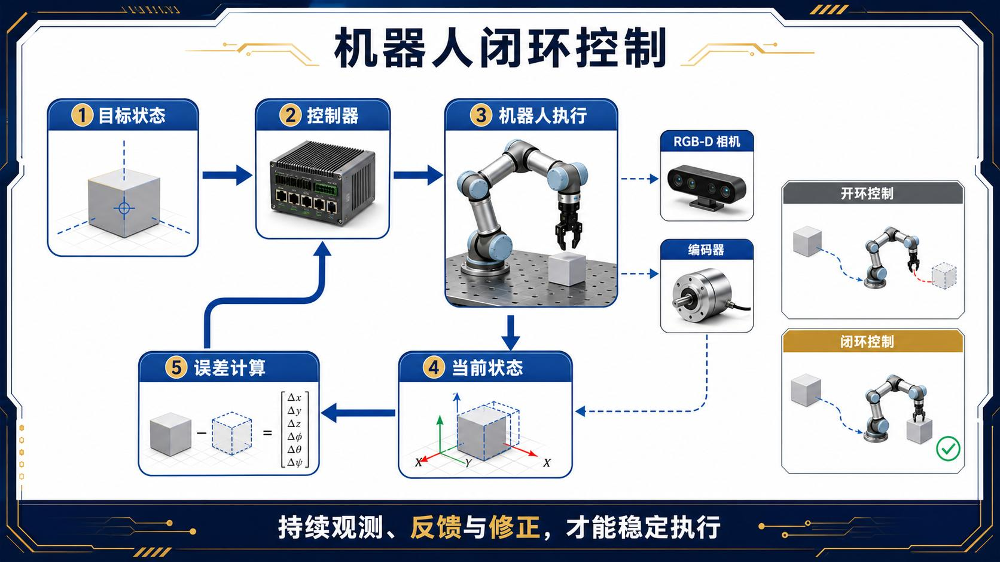

*图3-14 机器人闭环控制（依据［2，6］绘制）*

以单个机械臂关节为例，最小闭环结构可以清楚显示动作如何从目标变成受反馈约束的实际运动。系统首先给出目标关节角度，编码器测得当前关节位置，两者相减形成位置误差；控制器依据误差和控制周期计算命令，驱动器将命令转换为电机输出，关节运动后新的编码器状态再次返回控制器。该链路中的每个对象都应有明确的单位、时间戳和接口边界，缺少任何一项都无法判断误差来自哪里。

参考值并不一定由高层策略直接产生。它可以来自人工示教、轨迹生成器、逆运动学求解器或安全模块调整后的目标；无论来源如何，进入关节控制器前都应已满足关节限位、速度和连续性要求。测量值通常来自编码器或经状态估计得到的关节位置，必须说明其位于电机端还是输出端、是否已经完成零位和单位换算。误差应在同一物理量和同一参考时刻上计算，不能将末端位置误差直接与关节角度相减。

控制器的输出可表现为位置、速度、力矩或电流相关的参考，取决于控制架构和硬件接口。驱动器负责执行更靠近电机的控制和保护，但其内部细节不改变上层闭环的基本责任：目标、状态、误差、命令和执行结果必须可追踪。若控制器输出达到速度、力矩或电流限制，系统应记录裁剪状态并调整任务或轨迹，而不是假设目标仍能按原计划实现。

控制器接口应明确声明所需状态与可写命令。例如，位置控制器需要可用的位置反馈和位置或下级参考命令，力矩控制器还需要适合的执行器接口与保护能力。接口缺失、控制模式切换失败或硬件返回无效状态时，不能继续沿用上一周期的普通命令；系统应按照预设策略保持安全姿态、平滑减速或去使能，并记录触发原因。恢复运行前，应确认状态重新有效、误差处于允许范围且人工或自动安全条件已满足。

最小闭环的验证可从单关节低速运动开始：给定有限幅度的参考轨迹，检查编码器状态是否随命令同向变化，比较误差是否在允许时间内收敛，再逐步引入负载、速度变化和外部扰动。若观察到持续误差、过冲或抖动，应分别检查参考轨迹、状态测量、控制周期、限幅与驱动器状态，而不是直接修改高层动作。该验证为后续位置、速度、力矩控制和 PID 调参提供了共同基线。

### 3.5.4 位置控制

位置控制以关节或末端位置为参考目标，接口直观且常用于入门任务。它并非天然更安全：伺服增益过高、目标跳变过大、缺少限速限加速度、碰撞检测或工作空间约束时，同样可能产生较大接触力。部署时需结合轨迹生成、速度与加速度限制、碰撞与接触检测、柔顺性、约束过滤共同评估安全性。

位置命令不应被理解为瞬时跳变。若参考角度或末端目标在一个控制周期内发生大幅变化，控制器可能要求过高的速度、加速度或力矩，导致过冲、限幅、振动或保护触发。轨迹生成器通常将离散目标转换为连续参考，并根据关节限位、速度、加速度、加加速度和碰撞约束安排时间参数。对于接触任务，还需考虑接近方向和接触后是否应切换到力/柔顺控制，不能仅依赖位置误差收敛判断任务成功。

跟踪误差应按参考值、测量值、时间和接口状态共同解释。误差可能来自目标不可达、模型或零位错误、负载变化、传动柔性、驱动器饱和、反馈延迟或控制器参数不合适。若误差在接近关节限位时增大，应先检查软限位和轨迹是否已预留减速空间；若误差只在带工具时出现，应检查工具质量、质心和重力补偿；若误差表现为周期性振荡，则需检查控制周期、增益、机械刚度和测量噪声。

时间参数化决定位置轨迹在多长时间内完成以及每一时刻的速度和加速度。相同起止位置在不同时间约束下对驱动器、负载和安全半径的要求不同；若时间过短，控制器可能持续饱和，若时间过长，则动态任务可能因环境变化失效。轨迹应根据关节和末端约束生成，并在执行中监测实际跟踪状态。对移动或接触任务，位置轨迹还需与底盘、工具、环境和其他执行器的动作保持协调。

保护动作触发后，恢复不应从原参考轨迹的任意位置直接继续。系统需先确认关节状态、控制器模式、工具与环境关系、错误原因和人工/自动许可均已恢复；必要时重新规划从当前状态到安全姿态或任务目标的轨迹。记录保护前后的目标、实际位置、限幅和状态标志，才能判断故障来自目标不可达、执行器饱和、反馈异常还是外部扰动。

### 3.5.5 速度控制

速度控制以期望变化率而非目标位置作为主要参考。关节速度描述某一关节变量每单位时间的变化，通常以弧度每秒或米每秒表示；末端速度描述工具在任务空间中的线速度和角速度；移动底盘的速度命令通常包含机体坐标系或地图坐标系中的线速度与角速度。三者的控制对象、单位和参考坐标系不同，不能将一个速度向量不经转换地用于另一个接口。

关节速度控制适合连续扫描、柔和接近、匀速传送或作为级联控制中的中间层。末端速度控制常用于视觉伺服、手动引导或沿路径连续调整，但需要通过雅可比或运动学关系转换为关节速度，并处理奇异、限位与自碰撞。底盘线速度和角速度则受轮式或腿式运动学、地面接触和安全区域限制。速度命令需要同时说明速度方向、坐标系、更新时间和最大允许范围，否则相同数值无法体现相同物理运动。

速度控制不直接保证最终位置到达。若速度存在偏置、执行器响应不一致或传感反馈有误差，位置误差会随时间累积；在底盘上，这种现象表现为里程或航向漂移，在机械臂上则可能表现为末端缓慢偏离目标。因此，需要到达指定位置的任务通常还要叠加位置反馈、外部定位或阶段性校正。将速度控制误写为“更平滑的位置控制”会忽略其积分特性和对状态估计的依赖。

速度反馈可来自编码器差分、驱动器估计、IMU 或外部定位，但不同来源的噪声、延迟和有效范围不同。差分速度容易受位置量化和噪声影响，视觉或定位速度可能具有较大时延，接触状态变化也会使期望速度不再适用。控制器可使用滤波和加速度限制改善命令平滑性，但必须避免用滤波掩盖状态失效；反馈超时、速度异常或碰撞风险增大时，应优先降低参考速度、保持或停止。

动态安全限速应将人、障碍物、负载、工具形状、支撑状态和任务阶段纳入判断。空载远离环境时允许的速度，不代表接近物体、夹持载荷、双臂协同或人形单脚支撑时同样安全。速度模式的验证应从低速、短距离、单执行器开始，逐步增加任务复杂度，并检查速度命令、实际反馈、加速度、限幅和安全事件是否一致。这样，速度控制才能服务于连续运动，而不会成为绕过位置、接触和安全约束的接口。

### 3.5.6 力矩控制

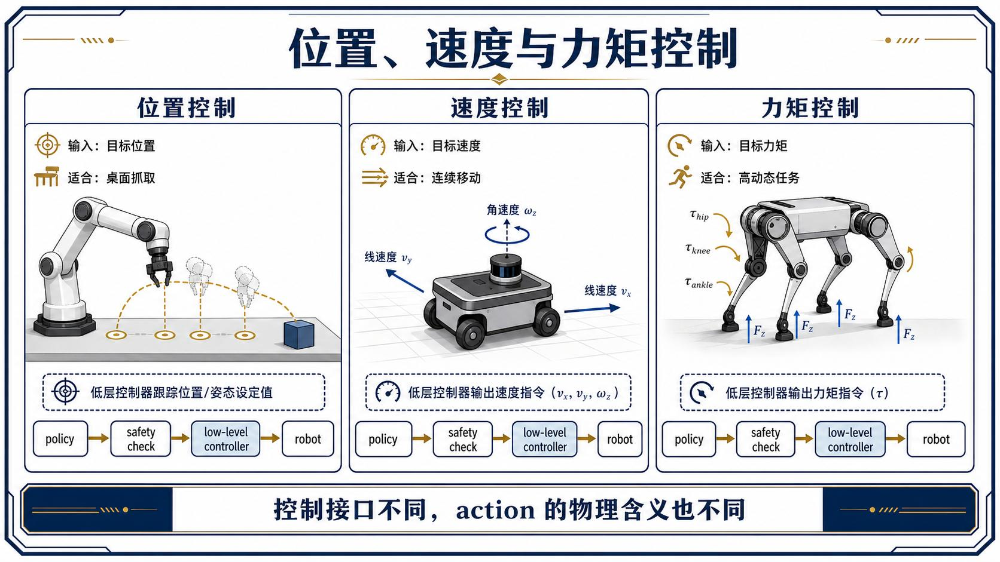

*图3-15 位置、速度与力矩控制（依据［2，6］绘制）*

力矩控制以关节输出力矩或与其对应的电流参考为主要控制对象，用于处理需要调节作用力、接触柔顺性或动态响应的任务。关节力矩以牛顿米表示，电流以安培表示，末端接触力以牛顿表示；三者相关但不相同。电流可在特定电机和驱动条件下与电磁转矩建立关系，关节力矩经传动受到效率、摩擦和柔性影响，末端力还取决于机构姿态、雅可比映射和接触几何。因此，不能把电流命令或关节额定力矩直接解释为末端施加的力。

力矩模式的硬件前提比位置模式更严格。执行器、驱动器和状态接口必须支持稳定、可验证的力矩或电流控制，控制周期、传感反馈、热管理和保护逻辑需满足任务要求；若设备实际只提供内部位置伺服，不应在软件层把普通位置接口命名为“力矩控制”。在存在减速器、背隙或柔性传动的机构中，电机端电流估计与输出端关节力矩可能存在显著差异，接触任务需要结合力/力矩传感、模型估计或校准结果判断实际作用。

力矩控制适用于重力补偿、柔顺接触、碰撞响应、动态动作和某些全身控制问题。以插接任务为例，位置控制可将工具移动到接近位置，但接触后若继续刚性追踪位置，可能产生过大接触力；合适的力矩、阻抗或导纳策略可在明确安全边界内调节相互作用。此处的柔顺应以位置、速度、力或其组合的误差关系决定输出，使系统在接触中具有受约束的响应。

接触任务通常需要明确模式切换条件。系统可在自由空间使用位置或速度参考接近目标，在接触确认后转入受限的力矩、阻抗或混合控制，并在接触力异常、工具滑移、目标脱离或状态超时时退出。切换前后应保证参考值连续，避免位置控制器的残余误差在切换后形成突发力矩；切换事件、接触状态、命令和实际反馈均需写入日志。若硬件不具备可信的力矩/接触反馈，任务应采用更保守的速度、位置和机械限位方案，而不是在软件中假设柔顺性。

异常恢复应先消除危险输出，再确认状态。发生过流、过温、碰撞、通信中断或姿态异常时，驱动器和控制器应进入预定义安全状态；恢复前需检查关节位置、工具与环境关系、传感器有效性、保护触发原因及人工许可。重新开始任务时，应从当前安全构型重新生成参考，而不是直接重放中断前的力矩命令。这样，力矩控制才能为接触与动态任务提供能力，而不会成为绕过硬件保护的路径。

| 控制模式 | 主要输入 | 关键反馈 | 典型任务 |
| --- | --- | --- | --- |
| 位置控制 | 目标位置或位姿 | 位置误差 | 点到点操作 |
| 速度控制 | 速度参考 | 速度与姿态 | 连续移动 |
| 力矩控制 | 力矩参考 | 电流、力或接触 | 柔顺接触 |
| 闭环控制 | 参考状态 | 测量状态 | 抗扰执行 |

## 3.6 PID 与模型 action 的执行边界

### 3.6.1 PID 的基本思想

PID 控制器通过比例、积分和微分项利用跟踪误差及其变化。P 项提供主要纠正作用，I 项用于减小稳态误差，D 项可增加阻尼并改善瞬态响应。D 项对测量噪声敏感，工程上通常配合低通滤波。过冲、震荡和稳定性应结合 P/I/D、采样周期、时延与被控对象动力学共同分析。

比例项根据当前误差立即产生修正。误差较大时，比例项通常给出较大的控制作用，可提高响应速度；但比例增益过大时，系统可能出现过冲、振荡或因执行器限幅而无法按理想关系工作。比例项不能单独消除所有稳态偏差，例如重力、摩擦或恒定外扰可能使系统在存在小误差时达到平衡。

积分项累计历史误差，可用于消除持续偏差。若关节因摩擦、重力补偿不足或小负载而长期未达到目标，积分项会逐步增加输出以补偿这种偏差；但当执行器已饱和或目标不可达时，积分仍可能继续累积，形成积分饱和（integral windup）。恢复可行状态后，过大的积分量会导致明显过冲或反向修正。因此，工程实现通常需要积分限幅、积分分离、条件积分或在输出饱和时进行抗饱和处理。

增益整定应从受限工况开始。先在低速、空载、小范围参考下观察响应，再逐步检查负载、摩擦、速度和接触变化；每一步记录上升过程、稳态误差、过冲、振荡、输出饱和和温度/保护状态。比例项过小可能响应迟缓，比例项过大可能过冲；积分项有助于消除持续偏差但可能导致饱和；微分项可增加阻尼却可能放大噪声。具体数值必须绑定被控对象、控制周期、驱动器和测试条件，不能作为通用经验值写入正文。

抗饱和机制应与执行器限制一致。当控制器输出被速度、力矩、电流或位置范围裁剪时，积分状态需要被限制、回算或暂停累计，防止错误持续积累；参考突变、模式切换和安全停机后，也应处理积分状态与滤波器状态，避免恢复时产生脉冲输出。PID 调参不应绕过软硬限位、急停或驱动保护。若系统需在复杂接触或人形全身约束下运行，PID 仅是低层组件，仍需由上层规划、状态估计和安全逻辑限定其参考范围。

### 3.6.2 PID 与机器人动作表现

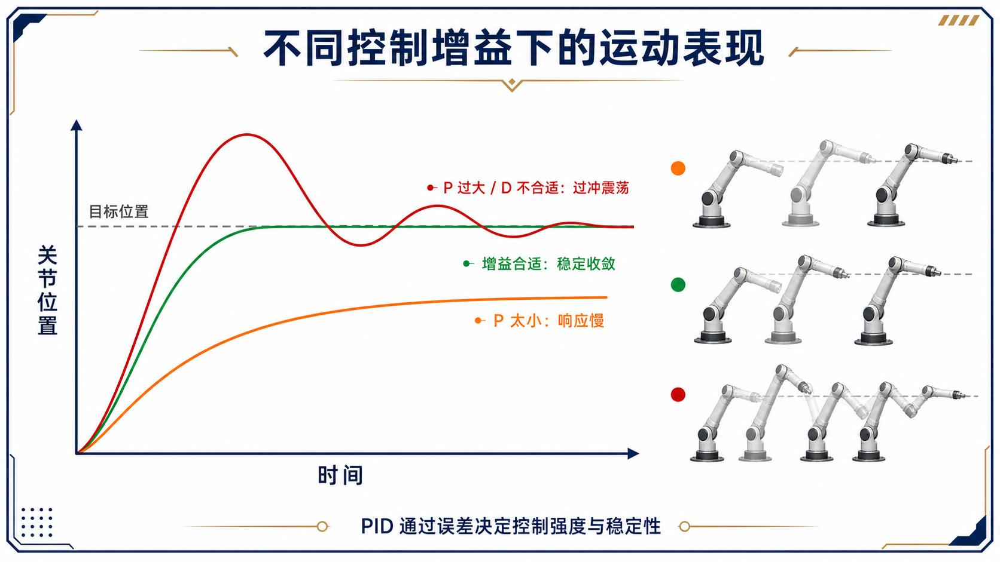

*图3-16 不同控制增益下的运动表现（依据［6］绘制）*

PID 参数的作用最终会表现为可观察的机器人运动：响应速度、稳态误差、过冲、振荡、抖动、温升和接触冲击等。调参不能只观察某个曲线是否“好看”，而应把增益设置、参考轨迹、负载、控制周期、传感状态和执行器保护联系起来。相同的动作现象可能有多种原因，PID 是诊断链中的一环，而非所有问题的唯一解释。

比例增益较低时，关节通常对目标变化反应缓慢，受到恒定负载或摩擦影响时可能保留明显稳态误差；提高比例增益可增强误差修正，但若超过机构、采样和驱动器所能支持的范围，常会产生过冲或持续振荡。过冲表现为关节越过目标后再反向修正，可能增加接触冲击和碰撞风险；振荡表现为目标附近持续来回运动，可能来自过高增益、延迟、机械柔性、传动背隙或测量噪声，而不能仅通过降低一个参数简单归因。

积分增益有助于消除持续偏差，但其作用通常较慢。若关节在重力或摩擦影响下始终停在目标一侧，适当积分可逐步增加补偿；若目标不可达、输出长期饱和或接触已阻挡运动，积分会继续累积并在条件恢复后造成突然过冲。观察到“先缓慢顶住，随后猛然冲出”的现象时，应检查积分状态、输出裁剪和目标可达性，而不是只判断驱动器故障。

标准调试可以按“固定条件—单一改动—记录响应—判断边界”执行。先固定关节初始构型、负载、参考轨迹、控制周期、滤波和安全限幅，记录基线响应曲线；随后一次只改变一个增益或明确的实现选项，并比较上升时间、稳态误差、峰值过冲、振荡持续时间、输出裁剪和温升。若改变比例增益后响应变快但过冲增加，应同时观察驱动器是否接近限幅；若增加积分后偏差减小但接触后出现突发运动，应检查积分状态与抗饱和；若提高微分后高频噪声加剧，应检查差分信号、滤波和编码器质量。

响应曲线必须与实际关节或末端现象相互验证。慢响应可能使抓取时错过移动目标，稳态偏差可能造成插接位置持续偏离，过冲可能导致工具撞击或越过接触点，低频振荡会降低轨迹重复性，高频抖动会增加磨损、噪声、发热和安全风险。曲线改善但任务结果未改善时，应检查任务空间标定、TCP、视觉/接触观测和高层参考，而不是继续追求单一关节误差最小化。

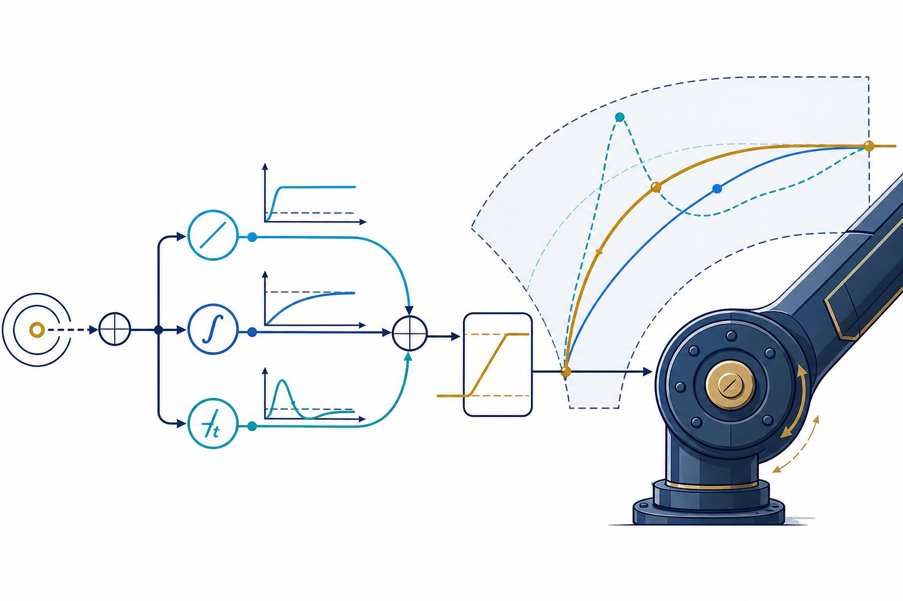

*图3-17 PID 调节、执行器饱和与安全边界*

### 3.6.3 模型 action 与低层控制器

高层模型输出的动作（action）通常是需要经由适配层解释的候选参考。它可以表示关节位置、关节速度、末端相对增量、夹爪开度、底盘速度或任务级子目标；其物理含义由控制对象、维度、单位、参考坐标系、数值范围和更新频率共同决定。低层控制器则根据实际状态在更短周期内跟踪参考并执行保护，两者之间不能被省略为一次简单数值传递。

动作适配层首先验证语义一致性。若模型输出末端相对增量，系统需明确其位于基坐标系、工具坐标系还是相机坐标系，完成反归一化和单位转换，再结合当前关节状态、TCP、逆运动学和碰撞模型得到可执行关节参考；若模型输出关节目标，适配层仍需确认关节顺序、零位、限位和控制模式；若输出底盘速度，则需检查坐标系、底盘运动学、速度边界和环境安全区。训练时定义与部署时接口不一致，会使离线正确的 action 产生错误物理动作。

限幅、滤波和插值承担不同职责。限幅限制位置、速度、加速度、力矩或动作范围，防止候选命令超出硬件与安全边界；滤波抑制高频噪声或不连续变化，但可能引入延迟并改变策略的时间语义；插值或保持机制将较低频率的模型输出转换为控制器所需的连续参考。它们都可能使实际执行命令不同于模型原始输出，因此应记录裁剪量、滤波状态、插值方式和更新时间，供训练数据分析与部署诊断使用。

实际执行命令必须与模型原始输出分开记录。日志至少应包含原始 action、适配后的目标、滤波/插值后的参考、控制器实际接收命令、硬件反馈、裁剪或拒绝原因、时间戳和相关坐标系。比较这些记录可区分三类问题：原始 action 本身不合理，适配层改变了 action 语义，或低层因状态/安全约束未能执行参考。仅记录最终视频或最终关节轨迹，无法判断模型、接口和控制器分别承担了什么后果。

当安全拒绝持续发生时，诊断顺序应为：核对状态是否可信，再核对 action 单位、坐标系、范围与频率，检查关节/碰撞/支撑约束，最后检查模型训练分布和任务条件。不得为了提高表面成功率关闭限位、减小日志记录或绕过安全层；正确做法是调整动作空间、训练数据、参考轨迹或任务场景，使候选命令在物理边界内具有可执行性。这样，安全拒绝既是保护机制，也是改进策略与接口设计的可观测信号。

| 环节 | 主要作用 | 过强时的表现 | 调节依据 |
| --- | --- | --- | --- |
| 比例项 | 加快误差响应 | 过冲或振荡 | 当前误差 |
| 积分项 | 减小稳态偏差 | 积累与饱和 | 长期误差 |
| 微分项 | 抑制变化过快 | 噪声敏感 | 误差变化率 |

## 3.7 运动学：从关节状态到末端动作

### 3.7.1 正运动学

正运动学（forward kinematics, FK）描述在机器人机构模型和关节状态已知时，如何计算末端执行器相对于指定参考坐标系的位姿。其输入通常包括关节变量、关节轴与连杆几何、各连杆之间的固定变换、基坐标系和工具中心点；输出是末端位置与姿态。正运动学是将编码器状态与结构模型通过坐标变换链组合得到的几何计算。

对于串联机械臂，沿运动链依次组合每个关节和连杆的变换，即可从基座坐标系得到末端或 TCP 坐标系。关节位置变化会改变相应变换，固定连杆和法兰变换保持不变；工具更换后，TCP 相对法兰的固定变换需要更新。末端位姿应明确表达在何种坐标系中，例如基坐标系、世界坐标系或相机坐标系；同一物理末端在不同参考系中的数值不同，不能不经变换直接比较。

FK 的输入质量决定输出可信度。关节角需有正确的名称、顺序、单位和零位，连杆长度、关节轴方向、安装偏置和工具变换需与当前实物一致。若编码器零位偏移、连杆参数错误、法兰工具未更新或坐标系定义混乱，计算得到的末端位姿会产生系统性偏差，即使控制器报告的关节跟踪误差很小。对于柔性传动、显著负载或接触任务，输出端真实姿态还可能受弹性形变、背隙和装配误差影响，理想刚体 FK 需结合标定和反馈使用。

任务级误差诊断应区分 FK 计算误差与其他环节误差。末端未到目标可能源自目标本身在错误坐标系、视觉外参不准、逆运动学选择不合适、轨迹跟踪误差、工具接触或 FK 模型不一致。日志需保存关节状态、模型版本、TCP 配置、参考坐标系、FK 输出、目标位姿和实际反馈，才能比较误差在哪一层产生。结构、工具或软件配置变化后，FK 验证需要重新执行，保证后续 action、IK 和控制器使用同一物理模型。

在多传感器系统中，FK 结果还常作为坐标对齐的中间量。只有将其模型版本、TCP 和时间戳一并保存，视觉、接触或规划模块才能判断同一末端位姿是否来自可比较的物理状态。

### 3.7.2 逆运动学

逆运动学（inverse kinematics, IK）在目标末端位姿、结构模型和约束已知时，求取可行的关节构型或关节速度候选。它的输出不等同于可直接执行的关节命令：还需选择连续且满足限位、奇异和碰撞约束的解，由运动规划生成带时间参数的参考轨迹，再由控制器转化为执行指令。

同一目标位姿可能对应多个关节解。机械臂可通过不同肘部姿态、腕部旋转或冗余关节配置到达同一末端位姿；选择哪一个解需要考虑与当前构型的距离、关节限位、碰撞距离、姿态偏好、工具方向和后续轨迹连续性。若只根据单次 IK 输出下发关节目标，可能出现关节突变、绕远路或接近奇异区域。工程系统通常以当前关节状态作为种子或参考，优先选择连续、可控且满足约束的解。

解析 IK 利用特定机构的几何结构得到封闭形式解，计算快且可枚举部分多解，但依赖机构构型和模型假设；数值 IK 通过迭代最小化末端误差或约束代价，可适用于更一般的机构与冗余条件，却依赖初值、步长、终止条件和计算时间。两类方法都不能自动保证避障、轨迹平滑或动态可执行性。求解完成后仍需检查关节限位、自碰撞、环境碰撞、速度/加速度、工具姿态和控制器可跟踪性。

无解或未收敛是应被显式返回的结果，而不是通过放宽约束、重复命令或强制关节运动掩盖的问题。诊断时先核对目标坐标系、TCP、单位和姿态表示，再检查几何可达性、关节限位、碰撞、初始值和迭代停止条件；若问题来自任务本身，应改变目标、接近方向或任务顺序。日志应保存目标位姿、初值、候选解、残差、约束状态和失败原因，为后续动作空间设计和策略训练提供依据。

对于连续任务，IK 求解的时间预算也应被监测。若求解时长超过控制或规划周期，系统需要选择保持当前安全目标、降低更新率或请求重新规划，而不能让迟到的候选解在状态已经改变后直接进入执行链。

### 3.7.3 逆运动学的常见问题

逆运动学在真实机器人上常出现多解、不可达、奇异位形、关节限位、碰撞和数值不收敛等问题。这些应目标位姿、机构几何、当前构型、环境约束与求解设置共同作用的结果。正确的处理方式是把每类问题与具体外在表现、日志证据和可调整边界对应起来，而不是反复向求解器提交同一目标。

多解指同一末端位姿可以由多个关节构型实现。外在表现可能是机械臂从不同肘部姿态或腕部姿态到达同一点，或相邻目标间关节突然跳到另一分支。处理时应以当前关节状态、轨迹连续性、限位余量、碰撞距离和任务偏好选择解；对冗余机构还可使用姿态或避障等二级目标。若不保留种子状态和分支选择规则，重复执行同一任务可能得到不同关节路径，影响数据采集和安全验证。

不可达指目标位置、姿态或二者组合超出当前机构与约束允许的范围。外在表现可能是求解器返回无解、残差无法降低，或求得的关节状态持续贴近限位。首先应核对目标坐标系、TCP、单位和姿态表示，再检查工作空间、关节限位、工具长度、环境障碍和接近方向。修改目标位置、放宽不必要姿态要求、选择不同接近方向或重新布置本体，通常比强制关节越限更合理。

种子状态管理有助于保持求解连续。在线执行时优先使用当前实测关节状态或上一可行轨迹点作为初值，并在多解分支切换、关节接近限位或残差异常时记录原因；离线规划可使用多个有界初值搜索，但必须对所有候选解做相同的碰撞、限位和速度检查。对冗余、人形或移动操作系统，种子还应包含底座、腰部、支撑和工具状态，不能只以手臂局部角度代表当前构型。

全身约束复核尤其适用于人形与移动平台。即使手臂 IK 有解，底座位置、支撑脚、躯干姿态、腿部限位、自碰撞、环境接触和可用速度仍可能使该解不可执行。系统应在全身模型中检查候选构型，并在约束冲突时返回清晰失败码，例如目标不可达、姿态约束冲突、碰撞、限位、状态无效或求解超时。失败码与残差、种子、目标和约束快照共同构成后续任务规划、动作空间设计和模型训练的依据。

### 3.7.4 为什么很多策略输出 eef delta？

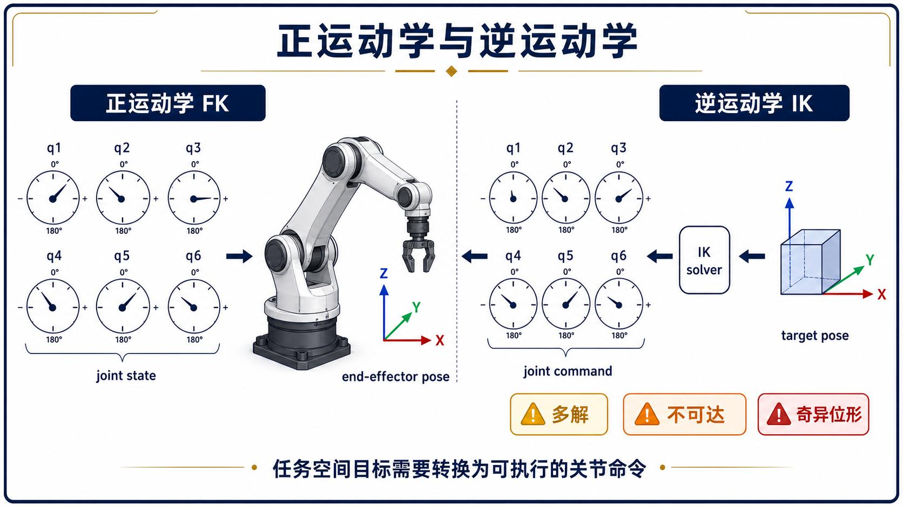

*图3-18 正运动学与逆运动学（依据［1，3］绘制）*

末端执行器相对增量（end-effector delta, eef delta）是以当前末端位姿为基准，描述下一控制区间内位置和姿态小幅变化的动作表示。它通常由平移增量、旋转增量以及夹爪或工具状态组成，但具体维度、单位、姿态参数化、参考坐标系、尺度和更新频率必须在接口中固定。eef delta 并不直接驱动电机；它需要经过坐标变换、尺度还原、IK、轨迹和低层控制，才能成为实际关节运动。

许多策略采用增量表示，是因为它将动作表达为“从当前状态向目标方向作小步修正”，而不是要求模型一次预测完整的绝对关节构型或绝对末端位姿。对于视觉闭环任务，观测中的对象相对位置发生变化时，增量命令可在每次新观测后重新计算；对于不同初始构型，局部增量通常比绝对目标更容易与当前状态衔接。增量表示也有助于限制单步动作幅度，使高层策略输出能够在低层闭环和安全过滤的约束下逐步执行。

参考坐标系决定 eef delta 的物理方向。若平移增量在基坐标系中定义，正 x 方向在机器人工作台上保持固定；若在末端工具坐标系中定义，“向前”会随工具姿态改变；若在相机坐标系中定义，则需依赖手眼变换和相机姿态解释。相同的数值在不同参考系中可能使末端沿完全不同方向运动。姿态增量也需说明采用轴角、欧拉角、小旋转向量或其他形式，并避免在大角度或奇异区域将近似增量错误解释为全局姿态。

限幅会影响增量动作的累计结果。单个 action 若在位置、速度、加速度、碰撞或支撑约束处被裁剪，实际执行的末端变化可能小于策略期望；连续多步裁剪还可能使策略观察到的状态与其内部假设逐渐偏离。系统应记录裁剪前后值、触发约束和实际反馈，并在需要时由高层重新观测和规划，而不是机械重复同一增量。训练数据若已包含裁剪或安全过滤，其配置也必须随数据一同保存。

跨平台迁移时，应分别重新核对 TCP、基坐标系、相机外参、关节限位、工作空间、IK 求解器、控制频率和动作归一化范围。末端增量本身不能消除不同臂长、工具、机械刚度、底座运动或支撑状态带来的差异；它只提供了一个可配置的任务空间接口。若目标平台不能稳定执行训练动作的尺度或频率，应调整动作定义、适配器或任务条件，而不能把不一致隐藏为模型泛化失败。

| 问题 | 已知量 | 求解结果 | 主要约束 |
| --- | --- | --- | --- |
| 正运动学 | 关节状态与机构参数 | 末端位姿 | 模型一致性 |
| 逆运动学 | 目标末端位姿 | 候选关节构型 | 限位、碰撞、可达性 |
| 轨迹生成 | 起止构型与约束 | 连续参考轨迹 | 速度、加速度 |

## 3.8 动作空间：模型输出如何进入机器人接口

### 3.8.1 为什么动作空间很重要？

动作空间（action space）是策略输出与机器人执行接口之间的约定集合。它不仅规定输出向量有多少维，还必须规定每一维控制什么对象、采用什么单位、在哪个坐标系中解释、允许的数值范围、更新频率、归一化方式以及经过何种适配层进入控制器。离开这些约定，数值向量没有确定的物理含义，也无法判断模型输出是否可在真机上安全执行。

同一维度的 action 可以具有完全不同的语义。七维向量可能表示六维末端位姿增量加夹爪开度，也可能表示若干关节目标加一个离散模式；两个三维速度向量可能分别位于世界坐标系、机体坐标系或工具坐标系。即使数值范围相同，若单位、参考系或更新周期不同，物理运动也会不同。因此，动作空间设计不能仅依据“模型方便输出什么”，而应从任务目标、本体可控量、可获得状态、低层接口和安全边界共同确定。

动作空间影响训练数据的可学习性。关节位置动作与特定机构的关节顺序、零位和限位紧密绑定，适合结构固定、接口明确的平台；末端位姿或 eef delta 更贴近任务空间意图，但依赖坐标变换、TCP、IK 和可行性检查；底盘速度适合连续移动，却需要定位、运动学和速度安全区支持；全身动作需要同时考虑支撑、接触和姿态。选择不匹配的动作表示，会使示教数据难以解释，或把本应由控制器处理的约束错误交给高层模型。

平台迁移时，动作空间的差异尤为突出。两个机械臂即使都具有六个可控关节，也可能具有不同的关节轴方向、零位定义、关节范围、末端工具和控制周期；同名的“末端增量”也可能采用不同的参考坐标系。因而，不能将训练于一种本体的动作向量直接发送到另一种本体。迁移前应重新核对机器人描述、TCP、状态观测、动作尺度和安全配置；需要复用高层任务表达时，应通过明确的映射、可行性验证和受控试验完成，而不能将维度相同视为接口兼容。

动作空间也决定部署时的故障模式。若范围过大，单步命令可能导致 IK 不可达、碰撞、速度/力矩饱和或安全裁剪；若范围过小，动作可能被摩擦、死区或传感噪声淹没；若训练和部署的归一化统计不同，相同模型输出会对应错误尺度；若频率不匹配，策略意图可能被保持、插值或延迟改变。安全层可以限制危险命令，但频繁裁剪会改变实际执行分布，说明动作空间、训练数据或接口适配需要重审。

### 3.8.2 常见 action 类型

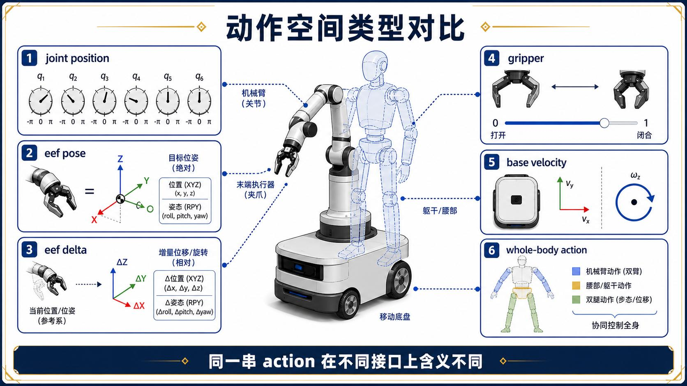

*图3-19 动作空间类型对比（依据［5，12-13］绘制）*

动作类型应按其直接描述的受控对象分类，而不宜只按张量是否连续或是否离散分类。对于任何一类 action，至少要回答五个问题：它作用于关节、末端、夹爪、底盘还是全身；每个分量采用何种表示；数值具有何种单位和参考坐标系；从策略输出到硬件命令还需经过哪些转换；当转换或执行失败时，系统以何种方式限制动作。表3-1列出教学与研究系统中常见的八类动作表示。表中的维度仅表示常见构成，并非不同平台必须使用的固定长度。

**表3-8 常见动作表示及其接口条件**

**表注：动作维度、单位、坐标系、范围与更新频率均应写入接口配置；表中维度仅表示常见构成。依据［2，12，13］整理。**

| 动作类型 | 直接对象与常见表示 | 单位、坐标系与适配 | 适用条件与主要风险 |
| --- | --- | --- | --- |
| 关节位置 | 各主动关节的目标位置 | 转动关节通常以 rad 表示；按机器人模型的关节顺序映射到位置命令 | 适合关节控制接口明确的机械臂；零位、关节顺序或限位错误会产生错误姿态 |
| 关节速度 | 各主动关节的目标速度 | 转动关节通常以 rad/s 表示；需受速度、加速度和位置边界约束 | 适合连续扫掠或伺服任务；积分漂移、保持过久或限位接近时风险增大 |
| 末端位姿 | TCP 的目标位置与姿态 | 位置常用 m，姿态需明确表示法和参考坐标系；经 IK、轨迹生成后下发 | 适合目标可用任务空间描述的操作；可能出现不可达、多解、奇异或碰撞 |
| 末端增量 | TCP 相邻时刻的平移和旋转增量 | 必须指定基坐标系、工具坐标系或相机坐标系，并定义尺度和姿态增量表示 | 适合示教和闭环微调；坐标系误用会使运动方向整体偏离 |
| 夹爪动作 | 开度、目标位置、速度或开闭状态 | 可为归一化开度或设备单位，需映射至实际行程、限位和夹持模式 | 适合抓取任务；对象尺寸、力限制和接触状态未被考虑时易夹空或过夹 |
| 底盘速度 | 移动底盘的线速度和角速度 | 常以机体坐标系中的 m/s 与 rad/s 表示；需经底盘运动学转换 | 适合移动操作；定位误差、制动距离和障碍物会改变可执行速度 |
| 全身动作 | 腿、躯干、双臂等多部位的协调目标 | 可为关节、任务空间或接触相关目标；需由全身控制与接触约束处理 | 适合人形或腿式平台；支撑转换、摩擦和自碰撞使耦合约束显著增加 |
| action chunk | 连续多个控制时刻的动作片段 | 每个时间步仍需定义对象、单位、坐标系和采样间隔；执行端按时间基准解包 | 适合以片段预测降低逐步决策负担的策略；模型与执行端时钟不一致会造成错时或陈旧命令 |

关节位置动作直接对应机械臂的构型，因而最容易与关节状态和位置控制器建立一一对应关系。它的代价是可迁移性较弱：同一组关节角在不同机构上通常不具有相同的末端位置或避障意义。关节速度动作描述的是状态变化率，适合需要连续调整的任务，但控制系统必须在策略更新间隔内决定保持、插值还是减速，并持续检查位置限位。无论采用位置还是速度，关节名称、顺序、零位、方向和允许范围都属于动作定义的一部分；这些字段不能仅靠训练样本的列顺序隐含表达。

末端位姿和末端执行器相对增量（end-effector delta，eef delta）将动作组织在任务空间中。前者给出期望的 TCP 位姿，后者给出相邻控制时刻的相对变化。二者都需要将任务空间目标转换为可行的关节目标，因此运动学模型、TCP 定义、关节限位、碰撞几何和轨迹连续性均会参与执行。末端增量常便于把局部操作表达为小幅修正，但其方向必须依赖已声明的参考系；同一数值在世界坐标系和工具坐标系中可指向不同方向。若姿态分量没有说明采用何种参数化，旋转幅值和组合顺序同样无法确定。

夹爪动作与底盘速度常被视为附属分量，实际上二者都具有独立的控制边界。夹爪开度只描述几何位置，并不自动保证接触力或抓取稳定性；若任务需要柔顺接触，还须由末端机构和底层力或电流保护共同处理。底盘的线速度与角速度则描述机体运动，而非机械臂任一关节的速度。对于移动操作，底盘命令需结合里程计、局部地图、制动能力和机械臂姿态，避免在上肢伸展时仅按平面速度指令判断风险。

全身动作将多个肢体、躯干和接触状态纳入同一输出，适用于需要维持支撑并完成操作的人形或腿式系统。该类表示并不意味着策略必须直接生成每个执行器的最终命令，更常见的做法是输出任务目标、姿态参考或受约束的关节目标，再由全身控制器协调关节、接触力和稳定性。action chunk 则沿时间轴扩展单步动作：模型一次给出一段动作序列，执行端按预先约定的采样周期取用。它可减少高层策略的更新压力，却要求明确片段长度、丢弃条件、抢占规则和重新规划时机；否则旧片段可能在环境变化后继续执行。

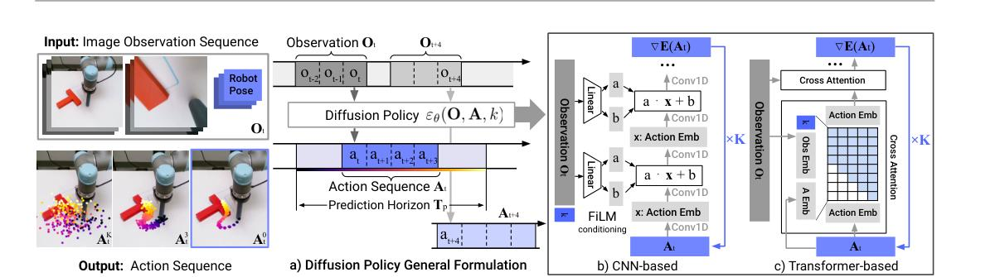

*图3-20 扩散策略中的观测条件与动作序列结构（引自［12］）*

### 3.8.3 action 与机器人接口

策略产生的 action 是动作接口链的起点。接口链的作用，是在保持任务意图可追溯的前提下，将抽象动作转换为设备支持的命令，并在转换过程中检查其物理可行性和安全性。一个完整的链路可表示为：策略 action、字段与数值检查、单位和坐标变换、约束过滤、运动学或轨迹处理、命令接口、关节控制器、驱动器与机器人状态反馈。链路中的每一项都应有明确输入、输出和失败处理；任何一步含义不明，后续命令即使能够发送，也无法判定其是否正确。

第一步是对策略输出进行结构检查。适配层应确认动作向量的维度、字段顺序、数据类型和时间戳符合当前配置，并拒绝空值、非有限数值、过期观测对应的动作或不匹配的模型版本。随后进行语义变换：归一化输出需要按训练时保存的统计量恢复量纲；末端增量需要依据指定参考系转换；关节动作需要按目标机器人模型的关节名称和顺序重排；夹爪开度需要转换为设备允许的行程或模式。该步骤产生的仍是候选命令，因为数值在语义上正确并不等于当前姿态下能够执行。

约束过滤位于候选命令进入运动学和控制器之前。对于关节目标，过滤器检查位置、速度、加速度和力矩相关边界；对于末端目标，除检查位置和姿态范围外，还要检查工作空间、关节限位、自碰撞和环境碰撞；对于移动底盘或全身目标，还需结合障碍物、支撑状态、接触状态和姿态限制。过滤的结果不应只包含“通过”或“失败”。工程上至少应区分原样接受、按规则裁剪、降低速度后接受、请求重新规划和直接拒绝五种结果，并将触发的约束、输入值和输出值记录下来。否则，策略失效与安全层介入会在日志中被混为一类现象。

通过运动学与轨迹处理的结果，才可作为命令接口的输入。命令接口应明确受控变量，例如位置、速度或力矩；状态接口则返回关节位置、速度、测量力矩、模式、温度、保护状态或通信状态等可用反馈。控制器将目标与反馈比较，并在其自身控制周期内向驱动器发送低层控制量。这里的反馈并非只用于记录成功与否：若控制模式不一致、状态超时、保护触发或跟踪误差持续扩大，控制器或硬件保护可以暂停、拒绝或停止执行。高层策略不能绕过这些边界，也不应把硬件拒绝解释为新的任务动作。

以“末端沿工具前向移动一个小增量，并略微闭合夹爪”为例，策略输出首先要声明平移增量的单位、工具坐标系和姿态表示，以及夹爪开度的编码方式。适配层把增量变换至运动学计算所需的坐标系，结合当前 TCP 位姿形成候选目标，随后检查工作空间、碰撞和夹爪行程；逆运动学求得关节目标后，轨迹层再生成满足速度和加速度约束的指令。执行过程中，关节状态、夹爪状态、控制模式、约束裁剪和时间戳均应写入日志。若工具前方存在碰撞风险或逆运动学无解，系统应返回可解释的拒绝状态，而不是将错误方向的关节运动作为替代。

## 3.9 动作尺度、归一化与控制频率

### 3.9.1 动作尺度

动作尺度是将动作数值与实际物理变化相联系的规则。它至少包含量纲、数值范围、参考坐标系、单次更新幅度和控制器可接受范围。尺度并不等同于向量的最大绝对值：同一条动作向量中的关节角、末端平移、姿态旋转、夹爪开度和底盘速度可以具有不同量纲、不同安全边界和不同的统计分布。只有分别定义每个分量，才能判断一个数值是合理的小幅修正，还是超过设备或任务条件的候选命令。

对于转动关节，位置通常以弧度（rad）表示，速度以弧度每秒（rad/s）表示；它们的有效范围由关节机械限位、软限位、当前控制模式和轨迹条件共同确定。关节角的零位、正方向和关节顺序同样属于尺度解释的一部分。对于末端动作，平移量通常以米（m）表示，旋转量则必须同时说明使用的姿态参数化和参考坐标系。以位置分量为例，数值 0.01 只有在明确单位为米、并说明它相对于基坐标系、工具坐标系还是相机坐标系解释时，才可理解为确定的空间位移；若单位或参考系改变，该数字的物理含义也随之改变。

夹爪开度常以实际行程、设备位置单位或归一化比例表示。三种形式可以互相映射，但映射关系取决于末端机构、零位、行程、传动和安全限制，因此不应把归一化的开度直接当作通用长度。底盘动作通常以机体坐标系中的线速度（m/s）和角速度（rad/s）描述；其允许范围还受轮式或足式运动学、地面条件、制动能力、载荷和上肢姿态影响。关节动作、夹爪动作和底盘动作即使在同一时刻输出，也不能共用一个未加说明的比例系数。

训练数据中的尺度需要通过每个动作维度的统计量或明确的物理边界保存。常用统计量包括最小值、最大值、均值、标准差、分位数和有效样本数；其作用是描述某一版本数据集内动作的分布，而不是替代设备的硬件极限。不同维度通常应分别统计。例如，平移、旋转和夹爪开度的数值范围、噪声特征和任务重要性不同，采用单一全局缩放因子容易使某些分量在模型输入中被放大，另一些分量被压缩。统计范围还应说明是否排除了无效帧、急停帧、超限动作或示教异常。

尺度配置还必须区分训练范围、在线裁剪范围和控制器接受范围。训练范围用于定义模型看到的动作分布；在线裁剪范围用于限制模型输出中的明显异常值；控制器接受范围则由当前机器人状态、命令模式和保护规则决定。三者可以重合，但不能默认相同。若在线裁剪持续把输出压到边界，可能意味着训练数据覆盖不足、归一化统计错配或坐标解释错误；若控制器再一次拒绝已经裁剪的命令，则需要回查机器人模型、限位配置和状态时效。每次裁剪的原始值、裁剪后值、触发规则和时间戳均应进入日志。

### 3.9.2 动作归一化

动作归一化（action normalization）是训练数据预处理与模型接口的一项数值变换，其目的在于使不同量级的动作分量以较为稳定的数值范围进入学习过程。它不改变机器人动作原有的物理单位，也不改变控制器最终接收的物理命令。关节角仍以弧度解释，末端平移仍以米解释，底盘速度仍以米每秒或弧度每秒解释；归一化只是在训练和推理的模型侧建立一个与这些物理量对应的数值坐标。将归一化值直接发送给硬件，或将物理量误当作已归一化值，都会破坏动作语义。

归一化首先依赖于明确的数据统计范围。对于每一个动作维度，应确定采用的训练集版本、有效样本筛选规则、单位、坐标系、均值和标准差，或最小值和最大值等统计量。以均值和标准差为例，可将物理动作值 x 映射为 (x-μ)/σ；以最小值和最大值为例，则可将动作映射到预定的无量纲区间。两类方法分别适用于不同分布与模型设计，但都要求统计量来自同一语义定义的数据。若把基坐标系中的位移与工具坐标系中的位移混入同一统计集合，或将不同夹爪编码方式的记录直接合并，计算出的范围并不能代表单一可解释的动作变量。

训练阶段需要把统计量与数据集版本和动作模式绑定保存。除均值、标准差或边界值外，记录还应包含动作字段顺序、各维单位、坐标系、姿态表示、异常值处理、缺失值处理和计算样本数，统计过程还应能够重复执行。模型的输入输出维度即使没有变化，统计量不同也会使同一无量纲输出恢复为不同的物理动作。因此，模型检查点、预处理程序和统计文件不能被视为可任意替换的独立文件；它们共同构成动作接口的一部分。

在部署时，模型输出首先仍处于归一化坐标中。适配层应使用与训练一致的统计量进行反归一化，再按照机器人接口的单位、关节顺序和坐标系生成候选命令。反归一化后，系统还必须执行运行期检查：判断数值是否有限、是否落在配置的在线裁剪范围内、当前机器人状态是否允许该命令，以及后续运动学或控制器是否接受该动作。在线裁剪的目的是限制异常输出，并不意味着被裁剪后的动作一定满足所有碰撞、接触或控制模式约束；因此裁剪之后仍要经过完整的约束过滤。

归一化配置与控制器保护具有不同职责。统计量描述训练数据常见的数值分布，在线裁剪限制模型侧的异常值，控制器和硬件保护则针对当前设备状态执行最终限制。将训练最小值或最大值直接设为关节软限位，可能会错误地把数据覆盖范围当作机械安全范围；反过来，仅依靠硬件限位也不能修复训练和部署之间的尺度错配。系统应分别记录原始模型输出、反归一化结果、裁剪结果、最终下发命令以及拒绝原因，以便区分模型分布外输出、适配错误和硬件约束介入。

### 3.9.3 动作尺度带来的部署问题

动作尺度失配是训练结果无法按预期落到真机上的常见原因，但其表现并不只是一种“动作不准确”。诊断时应区分策略输出本身是否异常、适配过程中是否改变了动作语义，以及硬件或控制器是否未能跟踪已接受的命令。尺度相关问题至少包括四类：单步幅度过大、单步幅度过小、训练与部署统计或坐标定义错配，以及仿真与真机在动作传递链上的差异。每一类都需要由时间戳、原始输出、变换结果、裁剪记录和状态反馈共同判断。

第一类是尺度过大。其症状可以是末端单步跳跃、关节目标接近限位、轨迹规划频繁失败、速度或加速度保护持续触发，或者控制器不断将候选命令裁剪到边界。日志中应检查原始模型输出、反归一化后的各维数值、裁剪比例、逆运动学求解状态、碰撞检查结果和跟踪误差。根因可能来自训练数据的动作范围过宽、归一化统计使用错误、输出解码重复放大，或策略在未覆盖状态下产生异常值。缓解措施包括分别核对每维单位和反归一化公式，以受控方式缩小在线范围，重新检查训练数据中的异常片段，并在安全环境内验证动作与实际位移的对应关系。仅靠增大控制器刚度或放宽限位不能修复动作语义错误。

第二类是尺度过小。此时策略输出在数值上可能稳定，却不足以克服摩擦、背隙、量化误差、执行器死区或环境扰动，表现为末端几乎不移动、夹爪未产生有效闭合、底盘命令被静摩擦抵消，或任务长时间停留在相同状态。应同时查看候选命令、实际关节变化、驱动器状态、控制误差和传感噪声幅度。若命令变化始终低于可观察的执行阈值，问题可能在动作范围或反归一化配置；若命令已进入合理范围而状态仍无响应，则应进一步检查控制模式、传动、接触条件和保护状态。缓解时不能简单整体放大所有维度，因为平移、旋转、夹爪和底盘速度的有效尺度不同，应按对象分别调整并重新验证安全边界。

第三类是统计量或坐标系错配。统计错配常表现为某些维度始终饱和、不同动作分量的幅度比例异常，或同一模型在重新部署后突然产生明显偏移；坐标错配则常表现为运动方向系统性错误，例如目标在视觉上位于右侧，末端却沿与预期不一致的方向移动。排查时应核对模型版本对应的统计文件、字段顺序、单位、姿态表示、参考坐标系、外参和时间基准。此类问题有时不会触发机械限位或控制器报错，因此仅根据“硬件没有报警”不能判定接口正确。缓解措施是以已知的小幅测试动作分别验证每个轴和每个关节，确认变换链后再恢复任务级动作。

第四类是仿真到真机差异。仿真中使用的关节范围、速度限制、执行延迟、摩擦、背隙、相机外参、工具中心点和控制模式，可能与真实设备不一致。策略在仿真中看到的动作效果因此不能直接作为真机尺度的证据。其症状包括仿真中轨迹连续而真机出现跟踪滞后、接触后偏移、抓取失败或频繁裁剪。诊断需要比较同一输入 action 在仿真与真机中的适配结果、实际状态变化和端到端时间戳，并分离机器人模型误差、感知误差、适配误差与执行误差。缓解应从校准机器人描述、TCP 和传感坐标开始，再逐步验证控制范围和延迟，而不是把全部差异归因于模型训练不足。

### 3.9.4 控制频率

控制频率是控制器读取状态、计算控制量并更新命令的节奏，其倒数为控制周期。频率本身不能单独判断连续性或安全性：低频参考可由高频伺服保持、插值或重新规划，而盲目升频在抖动、时延或噪声存在时反而可能恶化性能。应区分策略推理频率、参考更新频率和电机伺服频率，并报告实际周期、最坏时延与抖动。

采样与保持定义了离散命令如何作用于连续运动对象。控制器在一个周期开始时读取状态并计算新命令；在下一次更新之前，执行端可能保持上一次目标、按轨迹插补，或运行独立的低层闭环。若状态采样已经陈旧，控制器计算的是对过去状态的响应；若命令保持时间过长，快速变化的任务目标或外部扰动可能无法及时修正。对于位置控制，保持的目标可能由驱动器持续跟踪；对于速度或力矩控制，保持的命令还会受到电机、传动、负载和保护逻辑的影响。因此，采样频率必须与状态观测、命令模式和对象动态共同分析。

频率过低通常会扩大离散更新之间的误差。快速运动、接触变化或外界扰动发生在两个控制周期之间时，控制器只能在下一次状态更新后作出响应，可能表现为跟踪滞后、路径折线化、接触冲击增大或保护触发延迟。频率过高也不必然更好：如果传感器、通信总线、计算线程或驱动器不能在规定周期内稳定完成更新，系统会出现队列积压、丢帧、抖动或使用旧状态的情况。高频率还会放大传感噪声和数值微分带来的波动，并增加处理器和总线负载。应以有效、可预测的更新周期，而不是仅以名义频率评价控制链。

频率配置还应考虑端到端延迟和故障处理。若一个命令在生成后经队列等待、网络传输和适配处理才到达控制器，实际作用时间可能跨越多个控制周期；若状态消息超时，继续使用旧状态可能比降低频率更危险。系统应记录计划更新时刻、状态采样时刻、命令发送时刻、驱动器确认时刻和实际状态变化，以识别平均延迟、最坏延迟和周期抖动。对于发生超时、通信中断、状态无效或保护触发的情形，应由独立的安全逻辑决定保持、减速、停止或进入已知安全状态，而不是等待下一次策略输出。

频率选型宜按验证顺序完成：先读取机器人、驱动器、传感器和总线的官方接口限制，再根据任务速度、接触敏感度和允许误差提出初始配置，随后在受控条件下测量实际周期、抖动、跟踪误差和保护触发情况。只有在状态采样、命令执行和日志时间戳能够对应时，名义频率才具有可比较性。若提高更新率没有改善跟踪，或反而增加队列与抖动，应优先查明瓶颈所在层级，而不应继续以更高频率掩盖接口和时序问题。

### 3.9.5 模型推理频率

模型推理频率是策略在单位时间内完成一次有效观测处理并产生可供适配层使用的动作输出的次数。它不同于模型在离线基准中能够处理多少样本的吞吐率，也不同于关节控制器更新命令的频率。推理吞吐率通常描述在特定批量、硬件和输入形状下的平均处理能力；输出更新率描述实际部署中连续任务流获得新动作的节奏；控制频率则描述控制器读取状态和更新命令的节奏。三者可能相同，也可能因排队、批处理、同步等待或安全检查而明显不同。

一次端到端推理从观测产生开始。相机帧、关节状态、力或触觉状态等数据被采集后，需要经过时间对齐、格式转换、坐标处理、裁剪、缩放或其他预处理，才能构成模型输入。观测时间戳与输入构造完成时间之间的差值属于输入延迟；若不同传感器来自不同时间窗口，即使模型计算很快，输出也可能针对已经变化的场景。部署时应记录各个观测的原始时间戳、融合时间戳、预处理开始与结束时间，以区分感知采集迟滞和计算处理迟滞。

模型推理本身还可能受到队列和资源调度影响。平均推理时间反映长期性能，但不能说明某一次输出是否在任务需要的期限内产生；最坏推理时间和周期抖动对于动态操作更重要。若新的观测到达时上一轮推理尚未结束，系统需要明确采取何种策略：排队等待、丢弃旧帧、取消旧任务、复用最近结果或合并多帧。不同策略会改变观测时效、输出顺序和延迟分布。因而，不能仅以设备标称的每秒帧数判断实际输出是否足够及时。

模型输出形成后，仍需经过动作解码、反归一化、坐标变换、约束过滤、运动学或轨迹处理以及通信发送。适配层的开始与结束时间、控制器接收时间和命令生效时间共同决定输出从“已推理”到“已作用于机器人”的延迟。若模型每次都按时完成，但动作适配或通信队列积压，策略输出更新率可能高于实际命令更新率。反之，低层控制器可以在没有新策略输出的期间继续跟踪最近的有效目标，因此控制频率可以高于策略推理频率。

延迟预算应按阶段而非按单一频率建立。设观测时间为 t0，输入准备完成为 t1，模型输出为 t2，适配完成为 t3，控制器接收为 t4，则从 t0 到 t4 的差值构成该动作的端到端命令延迟；实际机械响应还需结合状态反馈时间进一步确认。平均延迟描述长期表现，最坏延迟描述最不利时刻，周期抖动描述相邻更新间隔的变化。它们分别影响任务效率、风险边界和控制稳定性，不能以单个平均帧率代替。

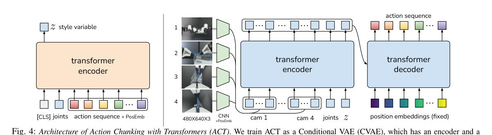

*图3-21 动作分块与时间集成的策略结构（引自［13］）*

### 3.9.6 推理频率与控制频率的衔接

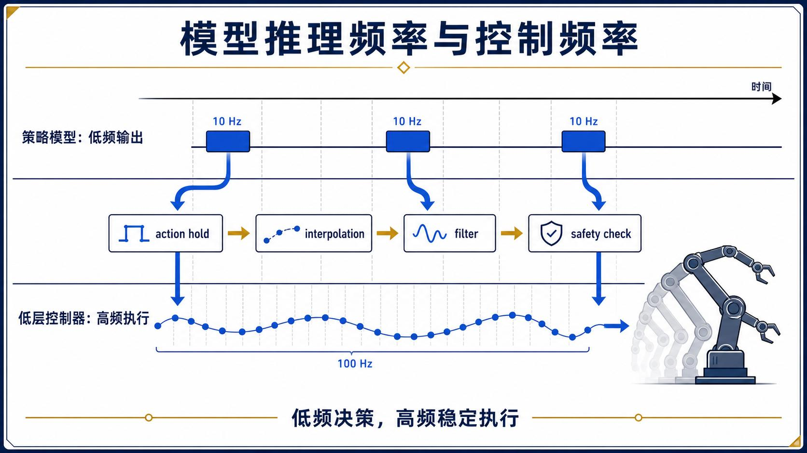

*图3-22 模型推理频率与控制频率（依据［2，14］绘制）*

当策略推理频率低于低层控制频率时，二者之间需要动作桥接层。桥接层接收带有时间戳和语义定义的策略 action，将其转换为在多个控制子周期内可执行、可监测且可被安全约束的目标序列。它的职责是明确在新策略输出尚未到达、状态发生变化或安全条件改变时，控制器应追踪什么目标、如何修改目标以及何时拒绝继续执行。桥接层必须与动作尺度、坐标系、控制模式和状态时效共同配置。

最基本的桥接方式是动作保持。若策略在时刻产生一个通过检查的目标，低层控制器可在下一次策略更新前持续跟踪该目标，或在规定期限内保持最近有效命令。保持不会改变目标的数值，却会改变它在时间上的作用长度；对于位置目标，较长保持时间可能仍可维持稳定跟踪，对于速度或力矩目标，长期保持则可能在环境变化后造成累积位移、接触力增加或接近限位。因此，保持策略必须规定命令有效期、状态超时条件、最大连续保持时长和在失效时转入的安全状态。过期命令不应因为数值尚在范围内而继续执行。

重采样与插值用于使高层动作序列适应控制器的更新节奏。重采样决定在一个控制周期内选取或生成哪一个策略动作；插值则在相邻有效目标之间生成连续中间目标，以降低位置、速度或姿态的突变。插值可以改善轨迹连续性，但它本身会改变中间时刻的命令，并可能在接近关节限位、碰撞区或接触边界时产生不可接受的路径。因此，插值后的每个目标仍应经过范围、速度、加速度、运动学和碰撞检查。对于离散模式切换、夹爪接触或安全状态等不适合连续插值的变量，应明确采用保持、状态机转换或其他受控规则，而不能按数值平均处理。

安全过滤应在命令进入硬件接口之前运行，并独立于策略是否更新。它根据当前关节状态、速度、碰撞距离、接触状态、姿态、通信健康度和急停状态判断候选目标能否执行。过滤结果可以是接受、裁剪、降速、保持最近安全目标、请求重新规划或直接停止；每种结果都可能改变动作幅度或引入额外延迟。低层控制器在策略未更新时仍可执行自己的反馈闭环，但不得以继续闭环为理由忽略状态超时、保护触发或命令有效期结束。高层策略负责提出候选意图，低层控制与安全逻辑负责保证当前时刻的可执行性。

以下为仅用于说明时序关系的例子：策略每 50 ms 产生一次末端增量，控制器每 5 ms 读取关节状态并更新位置目标。在相邻两次策略输出之间，桥接层先检查当前目标是否仍有效，再按照已声明的规则保持或插值出控制子步目标；每个子步经速度、限位和碰撞检查后送入控制器。若第 20 ms 时检测到状态超时或碰撞距离不足，后续子步不再继续使用原 action，而由安全逻辑执行降速、保持或停止。该例的数字仅用于说明十个控制子周期可对应一次策略更新，不能作为设备配置建议。

| 项目 | 需要记录的内容 | 不一致的后果 |
| --- | --- | --- |
| 单位与范围 | 每维物理单位、上下限 | 命令幅度失真 |
| 归一化参数 | 统计量与版本 | 训练部署偏差 |
| 控制周期 | 采样、更新时间、延迟 | 动作不连续 |
| 坐标系 | 参考系与 TCP | 方向或姿态错误 |

## 3.10 人形机器人为什么更复杂？

### 3.10.1 从机械臂到人形机器人的复杂度变化

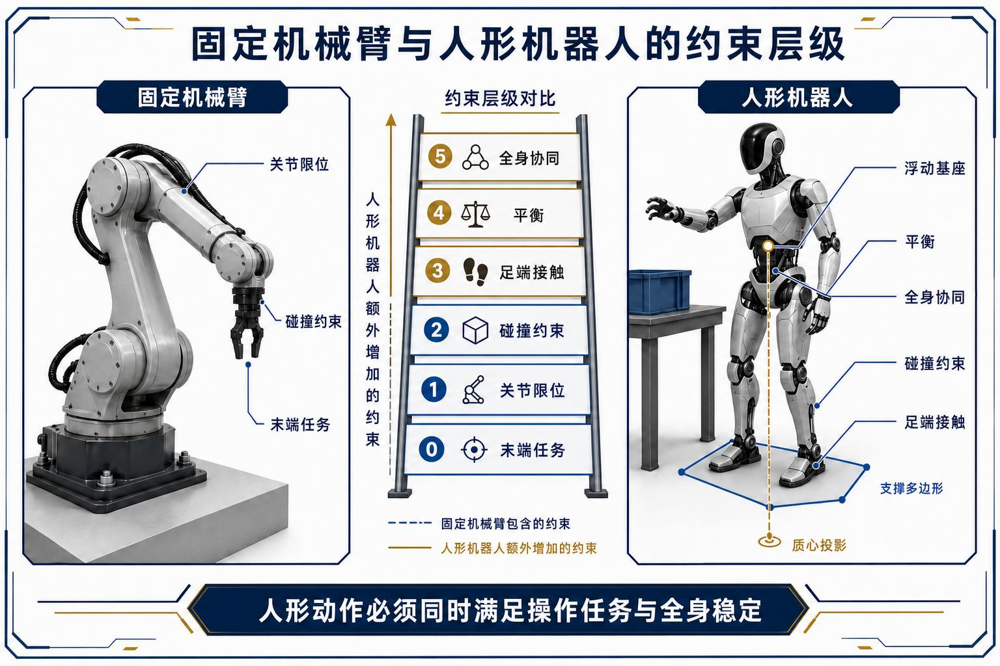

*图3-23 固定机械臂与人形机器人的约束层级（依据［1，11］绘制）*

固定基座机械臂与人形机器人最根本的差异，重点在于二者的基座和支撑条件不同。固定机械臂的基座通常被牢固安装，其位置和姿态可在任务过程中近似视为不变；机械臂主要在关节限位、末端可达性、碰撞和负载等约束下完成操作。人形机器人的躯干则通过双足或单足与地面接触，基座位姿会随站立、行走、转向、接触和外部扰动变化。上肢任务的执行必须同时满足身体姿态和支撑条件，因此不能把人形操作理解为在机械臂下方简单增加若干关节。

人形系统的状态描述也相应扩大。除各关节位置和速度外，控制系统通常还需处理躯干姿态、线速度与角速度、惯性测量、足端接触、接触力或接触估计、支撑相以及周围碰撞信息。这些状态并不是独立附加项：躯干姿态会改变上肢末端的参考系，足端接触决定地面对身体可施加的约束，关节运动又会改变全身质量分布和角动量。较多的自由度能够提供姿态调整和避障余量，但也使状态估计、动作选择和约束验证需要在更大的耦合空间内进行。

支撑和接触使约束具有时变性。双足站立时，两个足端的接触共同提供支撑；进入单足支撑时，另一只脚成为摆动腿，允许的身体和上肢动作范围随之改变；抓住物体、扶住环境或受到外力时，又会增加新的接触关系。每一种接触并非只增加一个测量值，而会改变力、力矩、摩擦、运动范围和安全恢复的可行集合。固定机械臂也可能涉及末端接触，但其基座通常不需要依靠接触维持整体姿态；人形机器人则必须在完成操作的同时保持支撑约束不被破坏。

人形平台的安全半径和恢复难度也更高。固定机械臂的危险区域通常围绕其工作空间、末端工具和可能的碰撞路径定义；人形机器人在移动和转向时，其身体、摆动腿、双臂、载荷和跌倒方向均可能扩大风险区域。失去平衡后的后果不仅是任务失败，还可能导致本体、环境或人员受到碰撞。因此，状态超时、接触异常、姿态偏离、通信中断和碰撞预警都需要与减速、停止、支撑调整或人工监护等机制相连。安全恢复本身也是受约束的过程，不能假定系统可在任何姿态下立即返回正常操作。

任务约束会沿全身链路传递。例如，双手共同保持一个物体的相对位姿时，手臂关节、腰部姿态、躯干朝向和足端支撑不再能够独立选择；任一部分为避免限位或碰撞作出的调整，都可能改变其他部分的可行空间。全身系统因此需要在任务目标、姿态目标、接触条件和安全余量之间分配优先级，并持续检查当前状态是否仍满足该分配。这里的“协调”是对多个目标和约束同时进行验证与更新。

### 3.10.2 站立和平衡

站立平衡讨论的是机器人在地面接触条件下维持可接受姿态和位置状态的能力。为进行初步分析，通常以系统质心及其在地面上的投影描述全身质量分布，以足端与地面的接触区域描述支撑条件。质心是将全身质量分布等效为一个点的概念；质心投影则是沿重力方向将该点映射到支撑平面上的位置。它们用于说明重力载荷与支撑关系，而不是机器人身体中实际存在的单一机械部件。

双足稳定站立时，两个足端接触区域的外包范围可构成简化的支撑区域。若在静态或缓慢变化的近似条件下，质心投影位于该区域的合理范围内，地面接触力存在维持平衡的可能；若投影明显偏离支撑区域，则仅靠当前接触通常难以抵抗重力造成的倾覆趋势。接触力不仅有竖直分量，还受到摩擦、足底形状、接触面、载荷和姿态的限制。支撑区域因此不能被理解为保证平衡的绝对边界，而是帮助分析站立姿态和重力作用的一种几何工具。

上肢运动会改变全身状态。手臂前伸、抬举载荷或双臂向一侧移动时，身体各部分的质量位置和运动速度发生变化，可能使质心投影向支撑边界移动，并改变躯干和下肢需要承担的力矩。为了保持姿态，机器人可以在允许范围内调整踝、膝、髋、腰或躯干姿态，也可以限制手臂加速度、改变末端路径或调整接触策略。补偿动作必须考虑关节限位、足端摩擦、上肢任务精度和碰撞约束；单纯把手臂目标锁定而忽略下肢补偿，容易使局部操作与全身稳定要求冲突。

质心投影与支撑区域的分析具有明确局限。动态行走、快速转向、跳跃或受到冲击时，身体速度、角动量、摆动腿运动、接触转换和地面柔顺性都会影响稳定性；此时不能仅凭投影是否位于支撑区域内判断系统是否安全。接触力还受摩擦条件限制，地面坡度、表面材料和足端接触不完整均可能改变可用支撑。因而，本节的静态近似用于解释站立时的基本力学关系，不能替代动态全身控制、步态规划或接触动力学的完整分析。

支撑判断还依赖测量和模型的可信度。足端接触传感、关节编码器、惯性测量和机器人质量参数均可能存在噪声、偏置、延迟或版本误差；若接触状态被误判为稳定，或工具与载荷质量没有纳入模型，质心和支撑关系的估计就可能偏离实际情况。工程实践中应将估计置信度、接触有效性和模型版本随状态一并记录，并在可信度下降时收紧动作范围或转入更保守的控制与监护状态。

### 3.10.3 行走和转向

行走是足端接触状态不断切换的过程。为便于说明，可将一个步态周期分为双支撑相和单支撑相：双支撑相中两只脚同时与地面接触，身体重量和接触力可由两个足端共同承担；单支撑相中一只脚承担主要支撑，另一只脚作为摆动腿向下一落脚位置移动。实际系统还需结合接触检测、足端速度、地面条件和控制器状态确认相位，不能只根据预定时间表假设接触已经发生或已经解除。

双支撑与单支撑的约束不同。双支撑期间，两个接触点为身体姿态和接触力分配提供更多约束，但两足之间的相对位置也限制了躯干和关节的可调范围；进入单支撑后，支撑区域缩小，摆动腿运动、躯干姿态和上肢动作对平衡的影响更为明显。接触转换并非瞬时无代价的事件：落脚、抬脚和载荷转移均可能带来冲击、滑移或状态估计变化。因此，控制系统需要在转换前后持续检查足端接触是否与预期一致，并在不一致时调整或中止后续动作。

摆动腿的落脚目标通常包含位置、方向、时机和接触条件。落脚位置受可达范围、关节限位、障碍物、地形高度、支撑脚状态和转向意图共同限制；落脚方向还会影响下一阶段躯干朝向和可用支撑。一个小的落脚误差可形成明确的风险链：足端实际接触点偏离预期，支撑区域和接触力分布随之改变，质心与姿态的可用调整空间缩小，若控制器不能及时估计并补偿，躯干偏差和滑移风险会进一步扩大。该链条说明落脚误差是会通过接触条件传递到全身稳定性。

在任务执行中，转向还会与上肢操作相互影响。若双臂携带物体或末端正处于接触任务，躯干转动和脚步调整会改变末端参考系、载荷分布和碰撞关系；为保持对象姿态，系统可能需要降低转向幅度、分阶段调整脚步，或重新规划上肢与躯干的相对运动。这里的协调并不要求一次性求出所有未来关节角，而是要求每一次接触相切换之前，当前任务目标、可用支撑、末端约束和安全边界都已被重新评估。

接触相与转向过程的日志应保存计划落脚点、实际接触时刻、接触有效性、躯干姿态、支撑脚状态、滑移或保护事件及恢复动作。通过这些记录，才能判断异常源于落脚规划、地面条件、状态估计还是执行接口，而不将所有偏差归为步态本身的问题。

### 3.10.4 腰部、上身与手臂协调

人形操作的任务目标通常首先以末端执行器在任务空间中的位置、姿态、速度或接触要求描述，但实现该目标并非只依靠肩、肘和腕关节。躯干、腰部、髋部、膝部、踝部和支撑脚共同决定身体参考系、末端可达范围、全身质量分布和碰撞关系。对于固定基座机械臂，基座位姿可以近似保持不变；对于人形机器人，躯干相对于地面的姿态和位置本身就是可调且受约束的变量，末端目标必须在这一变化的参考系中解释。

腰部首先能够扩大有效可达空间。手臂单独无法到达或需要接近关节限位的目标，有时可通过适度转动或弯曲腰部改变躯干与目标的相对关系，从而为上肢提供更合适的关节构型。这里扩大的是在关节限位、碰撞、支撑和任务姿态要求共同作用下的有效可达空间，而非没有边界的几何工作空间。腰部调整也会改变手臂与躯干、双臂之间的距离和方向，因此每一次增加可达性的动作都需要同时检查自碰撞、环境碰撞和工具路径。

腰部与躯干还提供姿态冗余和重心调节能力。当手臂搬运载荷、伸向侧方或执行精细接触时，躯干姿态可能影响末端方向、视觉视角和身体质量分布。腰部的补偿运动可以使手臂在不改变末端目标的情况下调整关节构型，或在保持任务精度的前提下配合下肢改变身体姿态。但腰部不是独立的“补偿关节”：较大的躯干运动可能使质心向支撑边界移动、改变足端接触力，并使上肢或载荷进入新的碰撞区域。因此，姿态补偿必须与支撑状态和当前任务阶段一起评估。

全身运动学和全身控制提供了任务分配的框架。其基本思想是同时处理末端目标、躯干姿态、关节姿态、足端接触、质心或身体状态、碰撞距离和关节限位等对象，并按任务优先级或约束关系生成可执行的关节与控制目标。末端任务通常需要满足位置或姿态误差要求，足端接触和安全限位则属于不可被任意牺牲的约束，腰部和冗余关节可用于改善姿态、可达性或避障。具体算法和控制器实现会因平台而异，但正文中的关键边界不变：全身协调必须说明哪些目标是硬约束，哪些目标可在冲突时降低优先级，以及冲突如何被记录和处理。

每次任务分配应保留末端误差、姿态误差、接触状态、约束激活、被降低优先级的目标和最终关节命令等记录。若系统为避免碰撞或维持支撑而修改末端动作，修改原因应能回溯到具体约束与状态，而不能仅以“全身协调”概括。

### 3.10.5 双臂协同

双臂协同的对象是由两个末端、共同操作对象和环境接触共同组成的任务系统。其约束可分为两类：相对位姿约束规定两只手之间或手与物体之间的位置和方向关系；对象约束规定物体相对于环境的目标位置、姿态、接触状态或运动路径。二者相关但不相同。双手共同搬运时，保持物体的整体姿态和两个抓持点之间的几何关系通常是主要目标；双手装配时，一只手可能固定或对准部件，另一只手执行插入、旋转或扣合，任务更强调相对运动、接触顺序和局部力的变化。

共同搬运要求在物体几何、抓持稳定性和载荷分配之间保持一致。若两个末端都与同一刚性物体接触，一个末端的运动会通过物体影响另一个末端的接触状态；两臂若各自仅追踪独立目标，可能对物体施加相互矛盾的位移或力。系统需要根据对象质量、抓持位置、姿态、接触条件和任务路径，规划或控制两末端的相对关系，并限制可能导致滑移、过大夹持力、扭转或碰撞的动作。载荷如何分配还取决于末端机构、接触质量和当前姿态，不能根据左右手名称预先假定固定比例。

双手装配与共同搬运的约束不同。装配任务可能要求一只手将工件稳定在指定姿态，另一只手沿特定方向接近、插入或旋转；此时两末端相对位姿的精度和接触时序比整体物体的运输路径更重要。视觉、力或触觉反馈可以用于判断对准和接触状态，但这些观测必须与两臂关节状态和工具中心点使用同一时间与坐标定义。若一个末端已经接触环境，另一个末端继续按无接触轨迹快速运动，可能造成卡滞、碰撞或对象脱离；因此，接触事件应能改变另一只手的目标、速度或停止条件。

坐标标定和对象状态估计决定相对位姿约束能否正确落地。两臂各自的基坐标系、末端工具中心点、相机或外部传感器与机器人之间的变换关系，必须在同一坐标链中维护；若任一工具更换、零位漂移或外参更新，原有的两手相对目标可能不再对应真实空间关系。对象位姿还可能因抓持滑移、遮挡或接触变形而变化。因此，系统在接触敏感阶段应将相对位姿误差与对象观测、力或触觉信号共同解释，并在估计可信度下降时降低速度、保持安全姿态或请求重新观测。

双臂系统还面临更复杂的自碰撞和失败恢复问题。两个手臂、工具、载荷和躯干同时运动会扩大碰撞组合；一个末端因限位、接触异常或通信延迟停止后，另一末端若继续追踪原目标，可能使对象受力异常或进入危险姿态。安全链需要分别检查单臂限位、双臂相互距离、对象接触状态、载荷变化和全身支撑条件。失败后应先保持或降低两臂动作、确认对象是否仍受控，再根据接触和姿态状态执行撤离、重新对准或人工干预；不能只重启其中一臂的轨迹而忽略共同对象。

### 3.10.6 安全约束

人形机器人的安全约束应构成从高层候选动作到执行器和急停装置的分层链路。高层策略输出只表示任务意图下的候选命令，不能越过动作适配、约束过滤、控制器、驱动器保护和人工监护直接成为实际运动。每一层需要明确四项内容：何种状态或命令触发检查，检查由哪一软件或硬件层执行，触发后采取何种响应，以及恢复运动前必须重新满足哪些条件。缺少其中任一项，安全机制就无法被可靠验证或追溯。

范围、速度和力矩相关限制是最接近动作接口的约束。关节位置与软限位限制可达构型，速度和加速度限制约束运动变化率，力矩、电流或接触相关限制用于约束驱动与交互风险。候选动作经过单位转换、反归一化和运动学处理后，仍须与当前关节状态、控制模式、工具配置和负载条件共同检查。触发范围或速度限制时，系统可按规则裁剪、降速、拒绝动作或进入保持状态；若达到硬件保护条件，则由驱动器或更低层保护执行限制。具体阈值必须来自目标设备、末端工具和任务的正式文档或验证记录，不能在通用教材叙述中用无条件数值替代。

碰撞、接触与跌倒相关风险需要在不同层级处理。规划或适配层可基于机器人模型、环境模型和当前状态检查自碰撞、环境碰撞、工作空间和轨迹可行性；控制层可结合关节状态、接触检测、姿态、跟踪误差和通信状态发现执行过程中的异常；硬件层则可能通过驱动器保护、制动或急停电路响应严重条件。对于人形平台，足端接触丢失、滑移迹象、躯干姿态持续偏离或支撑状态不确定，均可能要求限制上肢和移动动作。检测结果必须说明其可信度和时间戳，避免以陈旧或失效状态决定安全动作。

人工监护是其外部边界。初始部署、参数变更、工具更换、接触任务、移动操作和异常恢复均应根据风险条件安排可执行急停和观察的人员流程。监护人员需要能够了解当前控制状态、候选动作是否被裁剪、是否出现接触或姿态异常，以及系统是否已进入不可自动恢复的保护状态。任何不具备可验证状态、急停路径或恢复流程的运行，都不应被视为可进入常规任务的部署状态。

安全机制还需要在受控条件下逐项验证。范围、超时、状态无效、碰撞预警、接触异常和急停等触发条件应有对应的测试记录，测试中应确认触发层级、实际响应、日志完整性和恢复前提是否与配置一致。模型、数据、控制参数、硬件固件、工具或环境模型发生变更时，相关安全测试应重新执行。未通过验证的保护规则不能仅因代码存在而视为有效。

**表3-10 人形机器人操作中的主要安全约束**

**表注：具体阈值必须由机器人、任务和场地条件确定，本表不提供通用数值。依据［2，4，11］整理。**

| 约束类别 | 关联状态 | 可能风险 | 基本处理 |
| --- | --- | --- | --- |
| 支撑与平衡 | 接触、姿态、质心 | 失稳或跌倒 | 减速或停止 |
| 关节与碰撞 | 限位、距离、速度 | 干涉或超限 | 裁剪与重新规划 |
| 接触与力 | 力、力矩、滑移 | 碰撞或挤压 | 限力与退出 |
| 通信与保护 | 状态时效、急停 | 失去控制 | 保持或安全停机 |

## 参考文献

［1］Lynch K M, Park F C. Modern Robotics: Mechanics, Planning, and Control. Cambridge University Press, 2017. https://modernrobotics.northwestern.edu/.

［2］Open Robotics. ros2_control Hardware Interface Types. ROS 2 Documentation, 2026. https://docs.ros.org/en/rolling/p/hardware_interface/doc/hardware_interface_types_userdoc.html.

［3］PickNik Robotics. Kinematics. MoveIt Documentation, 2026. https://moveit.picknik.ai/main/doc/concepts/kinematics.html.

［4］Siciliano B, Sciavicco L, Villani L, Oriolo G. Robotics: Modelling, Planning and Control. Springer, 2009.

［5］Hugging Face. LeRobot Documentation. https://huggingface.co/docs/lerobot/.

［6］Spong M W, Hutchinson S, Vidyasagar M. Robot Modeling and Control. Wiley, 2006.

［7］Hugging Face. SO-101. LeRobot Documentation. https://huggingface.co/docs/lerobot/main/en/so101.

［8］Vector-Wangel. XLeRobot Documentation. https://xlerobot.readthedocs.io/zh-cn/latest/.

［9］Imeta Robotics. Imeta-Y1 产品资料（图像素材来自原始课程文档）。

［10］MagicLab. MagicBot Z1. https://www.magiclab.top/z1.

［11］Unitree Robotics. Unitree G1. https://www.unitree.com/g1.

［12］Chi C, Feng S, Du Y, et al. Diffusion Policy: Visuomotor Policy Learning via Action Diffusion. RSS, 2023. https://arxiv.org/abs/2303.04137.

［13］Zhao T Z, Kumar V, Levine S, Finn C. Learning Fine-Grained Bimanual Manipulation with Low-Cost Hardware. RSS, 2023. https://arxiv.org/abs/2304.13705.

［14］Isaac Lab Contributors. Isaac Lab Documentation. https://isaac-sim.github.io/IsaacLab/main/.
