# 第 4 讲：传感器与感知基础

机器人能够拍到图像，不等于机器人知道物体在哪里；算法能够输出检测框，也不等于机械臂能够准确到达目标。真实机器人必须回答三个更具体的问题：这条测量发生在什么时间、它表达在哪个坐标系、它的不确定性有多大。

本讲围绕一条贯穿全章的工程链路展开：

```text
真实世界
  ↓ 传感器采样
带时间戳和坐标系的原始数据
  ↓ 驱动、ROS 2 消息与同步
同一时刻的彩色图像 / 深度图 / 关节状态 / 坐标变换
  ↓ 相机模型与反投影
相机坐标系下的三维点 point_camera
  ↓ 外参与 TF
机器人基座坐标系下的三维点 point_base
  ↓ 可达性、安全与任务约束
规划和控制可使用的 target_pose_base
```

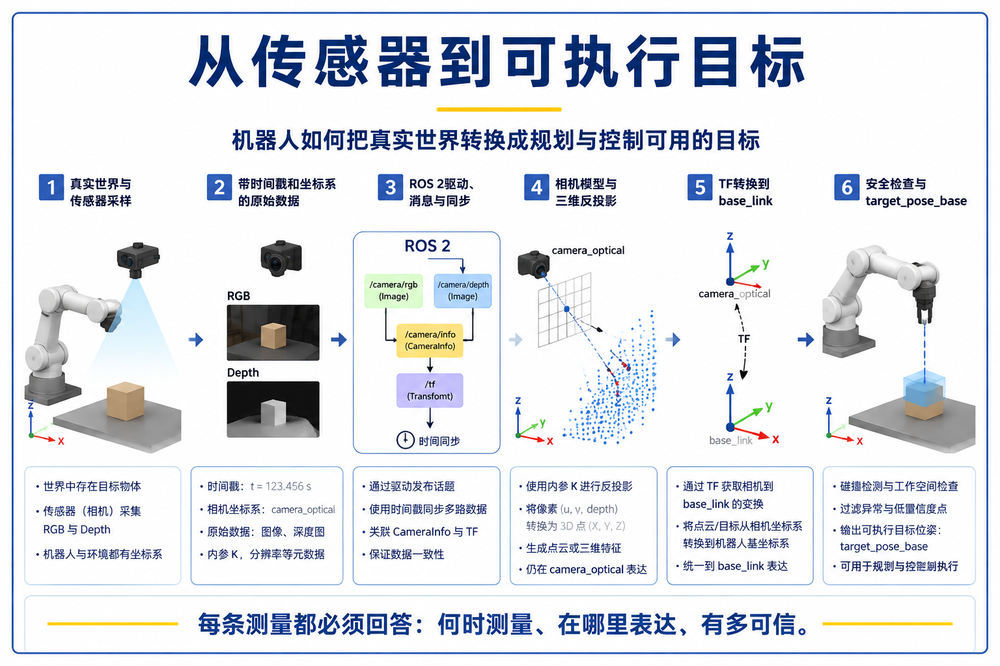

*图 4-1　从物理测量到机器人可执行目标的完整数据链路。*

本讲重点是传感器测量、时空对齐和工程验证。目标检测、实例分割、6D（六自由度，即三维位置加三维旋转）物体位姿估计和抓取位姿生成将在第 6、7 讲深入展开。

**本讲常用缩写**


| 简称        | 英文全称                                                 | 中文含义                       |
| ----------- | -------------------------------------------------------- | ------------------------------ |
| RGB / RGB-D | Red, Green and Blue / RGB and Depth                      | 彩色图像 / 彩色与深度图像      |
| LiDAR       | Light Detection and Ranging                              | 激光探测与测距，即激光雷达     |
| IMU         | Inertial Measurement Unit                                | 惯性测量单元                   |
| ToF         | Time of Flight                                           | 飞行时间测距                   |
| ROS 2       | Robot Operating System 2                                 | 机器人操作系统 2               |
| TF / TF2    | Transform / Transform Library 2                          | ROS 坐标变换系统及其第二代实现 |
| QoS / DDS   | Quality of Service / Data Distribution Service           | 服务质量策略 / 数据分发服务    |
| SLAM        | Simultaneous Localization and Mapping                    | 同时定位与建图                 |
| URDF        | Unified Robot Description Format                         | 统一机器人描述格式             |
| GNSS        | Global Navigation Satellite System                       | 全球卫星导航系统               |
| FPS         | Frames Per Second                                        | 每秒帧数                       |
| REP / SI    | ROS Enhancement Proposal / International System of Units | ROS 增强提案 / 国际单位制      |

---

## 本讲目标

学完本讲后，可以：

1. 理解机器人为什么需要传感器，以及不同传感器分别获取什么信息；
2. 根据任务需求选择合适传感器，并理解传感器参数对任务效果的影响；
3. 理解传感器数据如何进入机器人系统，并转化为目标位置、目标姿态、障碍物、接触状态等任务信息；
4. 掌握 RGB-D 相机反投影和 camera 到 base 坐标转换的基本流程；
5. 理解标定、坐标系、TF、多传感器对齐和感知误差对机器人真实执行效果的影响。

---

## 4.1 本讲主线：从“看到”到“能执行”

### 4.1.1 为什么需要传感器？

机器人控制器只能处理数值状态。真实世界中的物体、光照、接触和运动，必须先通过传感器转换成可以计算的数据。

传感器输入可以分成三类：


| 类别                     | 回答的问题                       | 典型传感器                  |
| ------------------------ | -------------------------------- | --------------------------- |
| 外感知 exteroception     | 环境中有什么、在哪里、是否可通行 | RGB、RGB-D、LiDAR、麦克风   |
| 本体感知 proprioception  | 机器人自身处于什么状态           | 编码器、IMU、电流、温度     |
| 接触感知 contact sensing | 是否接触、接触多大、是否滑动     | 六维力/力矩、触觉、夹爪电流 |

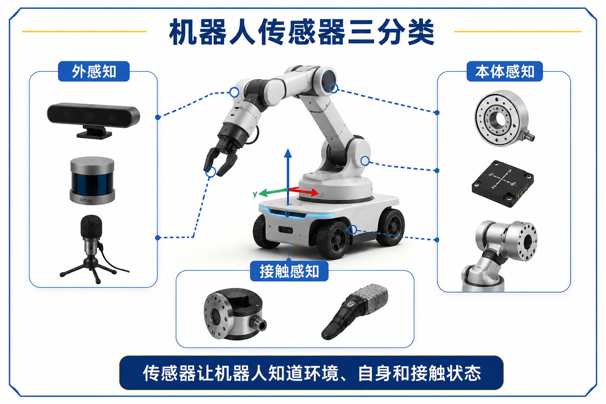

*图 4-2　外感知、本体感知和接触感知分别回答环境、自身与接触状态问题。*

机器人需要的不是“更多传感器”，而是完成任务所需的最小充分信息。例如桌面抓取通常需要目标语义、三维位置、机械臂状态和抓取反馈；室内导航通常需要障碍物、局部运动、自身位姿和地图约束。

概括来说，机器人需要传感器有四个直接原因：获取外部环境信息，获取自身状态信息，根据环境变化调整动作，以及为感知、决策和控制持续提供输入。没有传感器反馈，机器人只能执行预先设定的开环动作，无法判断目标是否移动、路径是否出现障碍、物体是否抓稳。

### 4.1.2 传感器信息如何获取？

不同传感器把不同物理现象转换成数字测量：

- 视觉传感器获取图像、深度和点云；
- 激光雷达获取距离、反射强度和环境结构；
- 编码器获取关节角度、速度和轮速；
- IMU 获取加速度、角速度和姿态变化；
- 力觉/触觉传感器获取接触力、压力分布和滑动信息；
- 麦克风获取语音、声源方向和声音事件。

传感器不会直接给出“杯子位于机器人前方 0.42 m”。它只产生某种测量：像素亮度、双目视差、光飞行时间、角速度、编码器计数或电桥电压。机器人系统需要进一步完成：

```text
物理量
→ 传感器响应
→ 数字采样
→ 标定与单位转换
→ 去噪和时间对齐
→ 坐标转换
→ 状态估计
→ 任务变量
```

因此必须区分：

- **原始测量**：图像、深度、点云、角速度、关节读数；
- **估计状态**：机器人位姿、目标三维点、速度、接触状态；
- **任务目标**：抓取位姿、导航航点、插入方向、安全距离。

### 4.1.3 传感器信息如何使用？

传感器数据进入机器人系统后，需要从原始数据中提取任务相关信息，将二维或局部测量转换为空间信息，把不同传感器统一到机器人坐标系，再提供给规划和控制模块。最终输出通常不是“某个像素”或“一帧点云”，而是目标位置、目标姿态、障碍物区域、接触状态或动作指令。

**贯穿案例：点击图像，让机械臂到达目标上方。**

本讲 Demo 的输入是对齐后的 RGB 图、深度图、相机内参和相机外参。用户在图像中点击像素 `(u, v)`，系统输出 `base_link` 坐标系下的目标点：

```text
pixel(u, v)
  ↓ 读取鲁棒深度 Z
point_camera(X, Y, Z)
  ↓ T_base_camera
point_base(x, y, z)
  ↓ 加安全偏移和姿态
target_pose_base
```

这个案例足够简单，却包含真实机器人感知最常见的五类问题：深度是否有效、内参是否匹配、外参方向是否正确、时间是否同步、目标是否可达。

为了理解这五类问题为什么会同时出现，可以想象下面一次看似普通的抓取：相机安装在机械臂侧上方，方块位于桌面上，用户点击方块中心。检测框完全正确，但机械臂最终仍抓到了方块后方。逐层检查后可能发现，彩色图像是当前帧，深度图却因缓存晚了两帧；机械臂在这两帧之间已经移动，相机视角也发生了变化。即使像素和深度分别都“看起来正确”，它们组合出的三维点已经不属于同一物理时刻。

另一种失败更加隐蔽：系统在相机坐标系中计算出的点是 `[0.05, -0.02, 0.60] m`，数值合理、点云显示也正确，但外参文件保存的是 `T_camera_base`，代码却按 `T_base_camera` 使用。结果不是产生一个明显的程序异常，而是生成一个数学上合法、物理上错误的目标点。这说明机器人感知的困难往往不在公式本身，而在公式两端的数据契约是否一致。

本讲后续每一节都会回到这个贯穿案例：传感器章节解释深度从哪里来，ROS 2 章节解释数据如何携带时间和 frame，相机章节计算 `point_camera`，标定和 TF 章节得到 `point_base`，误差章节则解释为什么每一步都需要独立验证。

### 4.1.4 本讲整体逻辑

```text
传感器采集数据
↓
理解数据含义
↓
提取任务信息
↓
坐标转换与标定
↓
生成可执行目标
↓
规划与控制执行
```

这条主线可以进一步归纳为五个检查问题。面对任何传感器问题，都按以下五问展开：

1. **测量什么**：数据对应哪个物理量？单位是什么？
2. **何时测量**：时间戳代表采集、发布还是接收时刻？
3. **在哪里表达**：`frame_id` 是什么？坐标轴方向是什么？
4. **有多可信**：是否存在噪声、偏差、延迟、缺失或低置信度？
5. **如何服务任务**：最终要转成位置、姿态、速度、力还是语义？

后文会反复使用三个概念。`frame` 表示数据所在的坐标系，`stamp` 表示测量发生的时间，`T_A_B` 表示把 B 坐标系中的量转换到 A 坐标系。例如，`T_base_camera` 用于把相机坐标系中的点转换到机器人 base 坐标系。

本讲采用 ROS 常见坐标轴：`base_link` 通常是 x 向前、y 向左、z 向上；`camera_optical_frame` 通常是 z 沿镜头向前、x 向图像右方、y 向图像下方。同一个目标在不同坐标系中的数值不同，因此三维点和位姿都要同时说明坐标系、单位和时间。

---

## 4.2 机器人常用传感器：特点、参数与任务选型

### 4.2.1 视觉传感器

**介绍：**

机器人视觉传感器主要包括：

- **RGB 相机**：输出彩色图像；
- **RGB-D 相机 / 深度相机**：输出深度图，RGB-D 相机还同时输出彩色图像；
- **双目相机**：使用左右两台相机形成视差，并据此估计深度。

这里需要区分两个容易混淆的概念：RGB-D 描述的是“输出同时包含颜色和深度”，双目、结构光和 ToF 描述的是“深度如何测出来”。一台 RGB-D 相机可以采用双目、结构光或 ToF 原理；一套双目相机也可能只输出左右图像，把深度计算交给上层算法。

**主要特点：**

- RGB 相机适合目标识别、目标检测、实例分割、关键点检测和人机交互。它能提供颜色、纹理和语义信息，但单目 RGB 图像通常不能直接给出带绝对尺度的三维位置；
- RGB-D 相机把颜色与深度结合起来，适合三维定位、点云生成、目标尺寸估计和近距离抓取。它降低了从二维像素恢复三维位置的门槛，但深度仍可能受到材质、光照、量程和对齐误差影响；
- 双目相机通过左右图像的像素差异估计深度，不依赖单目尺度猜测，常用于导航、避障和三维重建。它的效果依赖纹理匹配，在低纹理、重复纹理、遮挡边界和强反光区域容易产生错误深度。

**RGB 相机如何工作？**

RGB（Red, Green and Blue）相机通过镜头把光投影到二维成像平面，每个像素记录颜色或亮度。相机只能看到二维投影：图像中两个物体大小相同，可能是物体尺寸相同，也可能是远处的大物体与近处的小物体。因此，目标检测框的中心像素不能直接作为机械臂的三维目标点，还需要深度、相机内参和外参。

RGB 图像常见失效包括逆光、低照度、反光、运动模糊、目标遮挡、自动曝光跳变和镜头污损。用于机器人闭环时，画面“看起来清楚”不是唯一标准，还要检查采集时间、端到端延迟和高速运动时的几何失真。

全局快门会同时曝光全部像素，卷帘快门则逐行曝光。相机或目标快速运动时，卷帘快门可能把直线拍成倾斜或弯曲形状，使检测、三维重建和视觉伺服产生系统偏差。

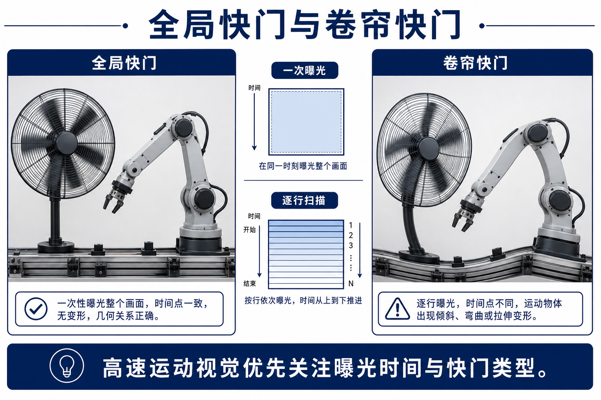

*图 4-3　高速运动场景下，全局快门与卷帘快门会产生不同的几何表现。*

**深度相机如何工作？**

深度图为像素记录距离信息。设备输出的 depth 可能表示沿相机光轴的深度 `Z`，也可能表示沿像素视线到表面的距离，使用前必须查阅设备和驱动定义。常见深度测量原理包括：

1. **双目视觉**：左右相机观察同一目标，通过视差恢复深度。它不主动发光，室外适应性通常较好，但依赖场景纹理和可靠匹配；
2. **结构光**：主动投射已知光学图案，通过图案形变计算深度。它适合室内近距离操作，但强阳光、多台设备相互干扰以及透明、反光材料会降低质量；
3. **ToF（Time of Flight，飞行时间）**：通过光的传播时间或调制相位差估计距离。理想的脉冲式测距关系为：

```math
r=\frac{c\Delta t}{2}
```

其中 `r` 是测量距离，`c` 是光速，`\Delta t` 是光往返传播时间，除以 2 是因为光经历了“发射到目标”和“目标返回传感器”两个路程。这里使用 `r`，避免与双目公式中表示视差的 `d` 混淆。真实 ToF 相机还会受到多径反射、环境光、边缘飞点和物体反射率影响。

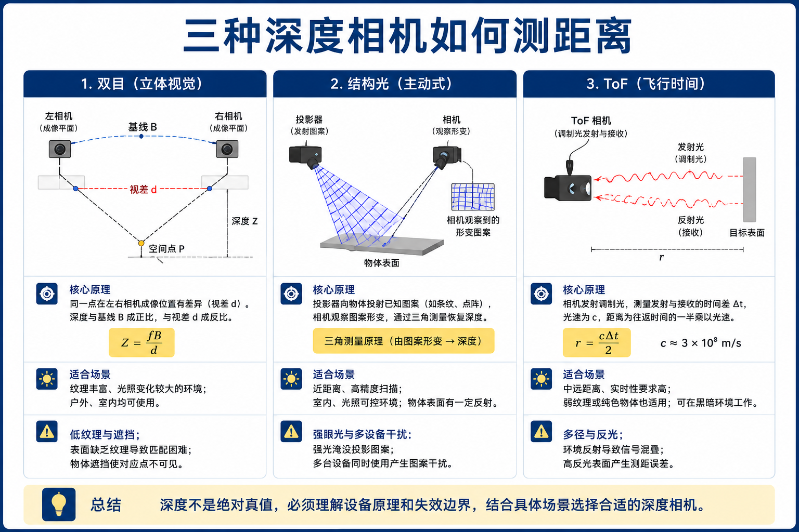

*图 4-4　三类常见深度相机的测量原理、适用场景与典型失效。*

**双目深度为什么在远处更容易产生大误差？**

校正后的理想平行双目相机满足：

```math
Z=\frac{fB}{d}
```

其中 `Z` 是目标深度，`f` 是以像素为单位的焦距，`B` 是左右相机光心之间的基线长度，`d` 是同一空间点在左右图像中的横向视差。目标越远，视差越小；当视差已经很小时，1 px 的匹配误差会占据很大的相对比例。

假设 `f=600 px`、`B=0.05 m`：

- 目标在 `1 m` 处时，理论视差为 `d=600×0.05/1=30 px`。如果视差估计存在 `±1 px` 误差，则 `d` 落在 `29–31 px`，估计深度约为 `0.968–1.034 m`，即约 `-3.2 cm/+3.4 cm`；
- 目标在 `3 m` 处时，理论视差只有 `d=10 px`。同样的 `±1 px` 误差会使估计深度变为 `2.727–3.333 m`，即约 `-27.3 cm/+33.3 cm`。

两种距离下都只错了 1 px，但远距离误差从厘米级放大到了几十厘米。增大基线 `B` 或焦距 `f` 可以增大远距离视差，却也可能增加设备尺寸、左右图遮挡差异并提高最近可测距离。因此，“短基线更适合近距离、长基线更有利于远距离”只是基本趋势，实际选型还要结合视场、工作距离、遮挡和匹配算法。

**关键参数：**

- **分辨率**：决定目标和边缘能占据多少像素。分辨率提高有利于识别小目标，但会增加传输带宽、内存和推理延迟；
- **帧率**：表示每秒获取多少帧。更高帧率有利于高速运动，但通常需要更短曝光，低照度下可能增加噪声；
- **视场角**：决定相机一次能观察多大范围。广角相机覆盖更大，但单位角度对应的像素更少，边缘畸变也更明显；
- **深度范围**：包括最近工作距离和最远有效距离。目标超出范围时，深度可能为 0、NaN 或明显错误；
- **深度精度**：不能只看单一标称值，还要区分系统偏差、随机噪声、空洞率、边缘飞点和不同材质下的稳定性；
- **RGB-depth 对齐**：彩色像素和深度像素是否表示同一条视线。未经对齐就按相同 `(u,v)` 读取深度，目标边缘尤其容易读到背景；
- **相机内参**：包括 `fx、fy、cx、cy` 和畸变参数，用于描述三维点如何投影到图像，以及像素如何反投影为空间射线；
- **相机外参**：描述相机相对于机器人基座、末端或其他传感器的位置和方向，用于把相机坐标转换到机器人任务坐标系；
- **曝光、动态范围和快门类型**：决定相机在暗光、逆光和高速运动中的成像稳定性；
- **时间戳与端到端延迟**：决定感知结果描述的是当前场景还是过去场景。即使空间标定准确，延迟也会在运动中转化为空间误差。

例如机械臂末端以 `0.2 m/s` 横向运动，视觉链路总延迟为 `100 ms`，仅延迟就可能造成：

```math
\Delta x=v\Delta t=0.2\times0.1=0.02\;m
```

即约 2 cm 的位置偏差。因此，一个 4K、60 FPS 但端到端延迟为 300 ms 的相机，不一定比 720p、30 FPS、延迟 50 ms 的相机更适合实时闭环。

**适配任务：**

- **目标识别**：使用颜色和纹理判断“这是什么”，通常以 RGB 图像为主要输入；
- **目标检测**：输出目标类别和二维检测框，为后续深度读取和三维定位提供图像区域；
- **三维定位**：将像素、深度、内参和外参组合，得到机器人坐标系下的三维目标点；
- **抓取点估计**：从深度图或目标点云计算物体表面、中心、法向和可抓取区域；
- **场景理解**：结合 RGB 语义和深度几何，识别桌面、容器、障碍物、可通行区域及物体之间的空间关系；
- **人机交互**：识别人脸、人体、手势和人与机器人的相对距离，用于指令理解和安全约束；
- **导航与三维重建**：双目或 RGB-D 相机可提供稠密或半稠密几何，用于视觉里程计、避障、地图构建和场景重建。

视觉传感器选型不能只比较分辨率或标称精度。应先写清任务工作距离、目标尺寸、运动速度、材质、光照、允许延迟和容错范围，再决定使用单目 RGB、双目、结构光、ToF，还是多种视觉传感器组合。

### 4.2.2 测距与导航传感器

**介绍：**

LiDAR（Light Detection and Ranging，激光探测与测距）发射激光并测量返回信号，输出传感器到物体的距离。2D LiDAR 在一个平面内扫描，通常输出 `LaserScan`；3D LiDAR 在多个方向采样，通常输出点云。它们主要服务于导航、建图、定位和障碍物感知。

**主要特点：**

- 2D LiDAR 结构简单、数据量小，适合平面导航和室内避障，但看不到扫描平面之外的台阶、悬空桌面和伸出障碍物；
- 3D LiDAR 能观察立体结构，适合复杂环境和大范围感知，但数据量、算力和标定复杂度更高；
- 旋转式 LiDAR 一帧点云不是同一时刻采集的，机器人运动时会产生运动畸变，需要结合 IMU 或里程计进行补偿；
- 雨雾、玻璃、黑色吸光材料、多径反射和动态物体都会影响测量；
- 点云更稠密不等于结果更准确。如果时间补偿或 LiDAR 到 `base_link` 的外参错误，稠密点云也可能形成错误地图。

**关键参数：**

- **测距范围和近距盲区**：决定最近和最远可用距离；
- **测距精度和重复性**：分别反映系统偏差与多次测量的波动；
- **角分辨率和视场角**：决定能否分辨窄障碍物以及一次覆盖多大区域；
- **扫描频率和每秒点数**：影响运动场景中的数据新鲜度与计算量；
- **线数、垂直分辨率和回波数量**：主要用于评价 3D LiDAR 的立体覆盖和透明/遮挡场景表现；
- **反射强度和每点时间**：反射强度可辅助区分材质，每点时间可用于运动去畸变；
- **时间同步和外参**：需要确认设备时钟、`lidar` 到 `base_link` 的变换以及是否提供硬件触发。

**适配任务：**

- **室内导航**：2D LiDAR 提供平面障碍物和局部定位信息；
- **平面避障**：根据扫描平面内的距离判断减速、绕行或停车；
- **三维建图与定位**：3D LiDAR 提供墙面、地面和立体结构；
- **动态障碍检测**：结合连续点云判断行人、车辆或机械臂的运动；
- **移动操作**：在底盘导航之外检查桌沿、悬空障碍物和机械臂工作空间；
- **大范围环境理解**：为自动驾驶、园区巡检和室外机器人提供远距离几何信息。

选择 2D 还是 3D LiDAR 时，先写清机器人实际包络、障碍物高度、工作距离、运动速度和允许延迟，不能只保证激光扫描平面本身不碰撞。

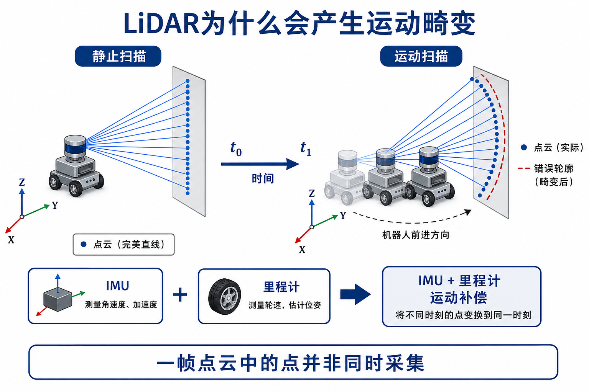

*图 4-5　机器人在单帧扫描期间运动，会使不同采样时刻的点落入错误空间位置。*

### 4.2.3 本体状态传感器

**介绍：**

本体状态传感器主要包括编码器和 IMU。编码器用于获取关节角度、关节速度和轮速；IMU 用于获取加速度、角速度和姿态变化。二者常与机器人运动学模型结合，用于关节控制、里程计、姿态估计和多传感器定位融合。

**主要特点：**

- 编码器直接反映关节或轮子的相对运动，是机械臂控制和移动底盘里程计的基础；
- IMU 以较高频率提供角速度和比力，能补充短时间运动变化，但积分会产生漂移；
- 编码器和 IMU 都主要描述机器人自身状态，不能单独判断外部物体的位置；
- 电机轴读数不一定等于末端真实位置，机械回差、柔性、负载形变和安装偏置都会影响绝对精度。

**关键参数：**

- 编码器：分辨率、类型（增量或绝对）、减速比、零位、关节方向、回差和速度计算方式；
- IMU：采样率、量程、噪声、零偏、温漂、饱和、安装方向和时间戳；
- 共同参数：数据单位、消息频率、时间同步和驱动是否提供有效的速度、力或姿态字段。

**适配任务：**

- 机械臂关节位置控制和运动学计算；
- 移动机器人轮速里程计和短时间运动估计；
- 机器人姿态估计、运动状态监测和跌倒检测；
- 视觉、LiDAR、轮速和本体状态融合；
- 关节异常、回差、温漂和机械安装状态诊断。

**编码器与关节状态**

编码器把关节或轮子的运动转换成计数。增量编码器提供相对变化，绝对编码器可以直接给出绝对位置。

工程上需要关注：

- 分辨率和量化误差；
- 齿轮减速比和关节侧换算；
- 机械回差、柔性和负载形变；
- 零位、关节方向和安装偏置；
- 速度是硬件直接测量，还是对位置差分得到；
- 电机编码器位置不一定等于末端真实位置。

ROS 2 中常用 `sensor_msgs/JointState` 表达关节名称、位置、速度和 effort。对于旋转关节，effort 通常表示力矩；对于移动关节，通常表示力。部分驱动不会提供有效的 velocity 或 effort，因此使用前还要检查数组长度和驱动文档。数组必须通过关节名称对应，不能假设不同节点中的数组顺序永远一致。

编码器读数还需要与机械现实区分。电机轴安装编码器时，控制器知道电机转过了多少，却不一定知道减速器输出端、连杆和末端真实位姿。齿轮回差会使正向接近和反向接近同一个角度时产生不同末端位置；柔性连杆会在负载变化时发生形变；夹爪电机电流上升可能表示抓住了物体，也可能表示夹爪卡住。

因此“关节状态正确”通常只能说明控制接口内部自洽。要验证机械臂的绝对定位能力，还需要外部视觉、测量治具或高精度跟踪设备。

**IMU（Inertial Measurement Unit，惯性测量单元）**

IMU 通常包含三轴陀螺仪和三轴加速度计，有些设备还包含磁力计。陀螺仪测量绕各轴旋转的角速度，加速度计测量比力；IMU 不会直接给出机器人在世界坐标系中的位置。角速度积分可以估计姿态变化；加速度计测得的比力经过姿态变换、重力补偿和偏置校正后，才能积分估计速度与位移。积分过程中仍会不断累积噪声和残余偏差，因此通常需要结合视觉、LiDAR、轮速或 GNSS（Global Navigation Satellite System，全球卫星导航系统）。

关键指标包括采样率、量程、噪声密度、随机游走、零偏稳定性、温漂、饱和和时间戳质量。安装方向写错或重力处理错误，会导致姿态和速度估计迅速发散。

理解 IMU 的一个简单方法是观察静止数据。机器人静止在水平桌面时，理想陀螺仪输出接近零，而加速度计不会三个轴都为零，它通常会测到与重力相关的约 `9.81 m/s²` 比力。具体正负方向取决于消息定义和传感器安装方向。如果静止时加速度模长远离 `9.81 m/s²`，应先检查单位、量程和标定，而不是直接调滤波器参数。

再让机器人绕某一轴缓慢旋转，可以检查陀螺仪轴方向是否符合 REP-103 的右手规则。很多系统“能运行但越走越偏”，根因是 IMU frame 配错、角速度单位混用或把含重力的加速度当成世界坐标系线加速度。

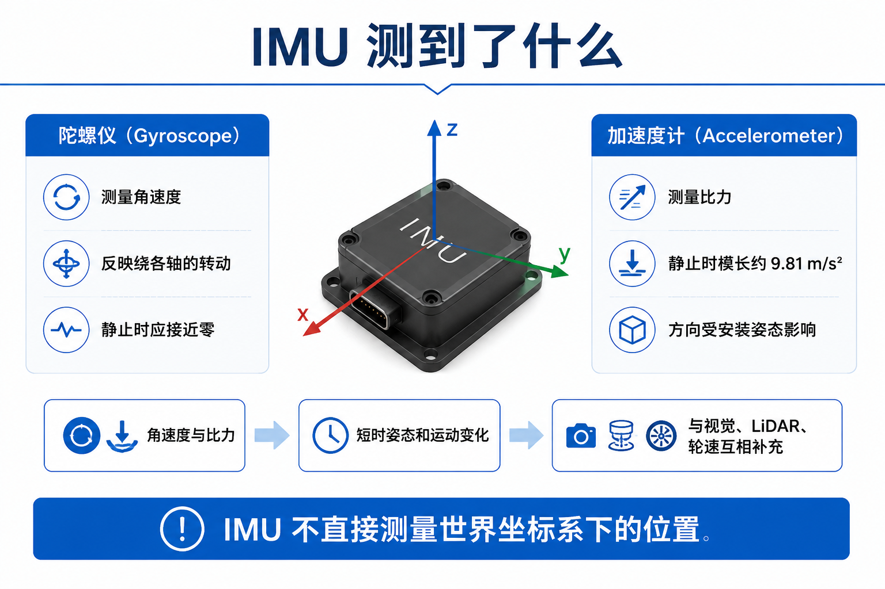

*图 4-6　IMU 分别通过陀螺仪和加速度计测量角速度与比力，并与其他传感器互相补充。*

### 4.2.4 接触传感器

**介绍：**

接触传感器主要包括六维力/力矩传感器和触觉传感器。六维力/力矩传感器输出三轴力与三轴力矩组成的六维测量（wrench）；触觉传感器测量局部压力、接触位置、形变和滑动。它们补充视觉无法直接判断的接触状态。

**主要特点：**

- 六维力/力矩传感器通常安装在腕部或工具接口，适合测量工具与环境的整体作用力；
- 指尖和夹爪触觉更接近局部接触，可判断接触区域、压力分布和物体是否滑动；
- 视觉适合接触前定位，力觉和触觉适合接触后的闭环调整与成功判断；
- 接触测量会受到工具重力、安装预紧力、材料老化、线缆弯折、温漂和表面污染影响；
- 单一力阈值不能区分“抓住物体”和“夹爪卡住”，通常还要结合夹爪开度、视觉和动作阶段。

**关键参数：**

- 六维力/力矩：力量程、力矩量程、分辨率、采样频率、零点漂移、过载能力和安装坐标系；
- 触觉：压力范围、触觉单元（taxel）密度、覆盖面积、采样频率、响应延迟和安装预紧力；
- 共同参数：噪声、温漂、标定方式、耐久性和与控制周期的同步关系。

量程过小会在碰撞或快速插入时饱和，量程过大又会牺牲小力分辨率；触觉密度很高但延迟过大时，也可能在检测到滑动之前已经掉落物体。

**适配任务：**

- 插拔、插孔搜索和精密装配；
- 柔顺控制、打磨和表面跟随；
- 抓取成功判断、滑动检测和抓力调整；
- 碰撞检测、接触安全和人机协作；
- 物体硬度、形状和局部接触状态识别。

运行前先完成空载置零、工具质量和重心补偿，确认传感器坐标系、力/力矩单位、过载保护和滤波参数。

以插头插入插座为例，视觉可以把插头移动到插孔附近，但毫米级位置误差和角度误差仍可能导致插头顶在面板上。此时继续执行预设轨迹会快速增大接触力。更合理的策略是：视觉负责粗定位，接触后切换为低速柔顺控制，利用横向力判断偏差方向，通过小范围搜索找到插孔，再根据轴向力和插入深度判断是否成功。

触觉同样不能只依赖单一阈值。夹爪力增大可能表示抓住物体，也可能是两个指尖互相碰到；压力分布稳定但物体正在缓慢滑动时，单帧触觉图像也可能误判成功。可靠判断通常组合夹爪开度、驱动电流、压力分布变化、视觉跟踪和抬升后的物体运动。

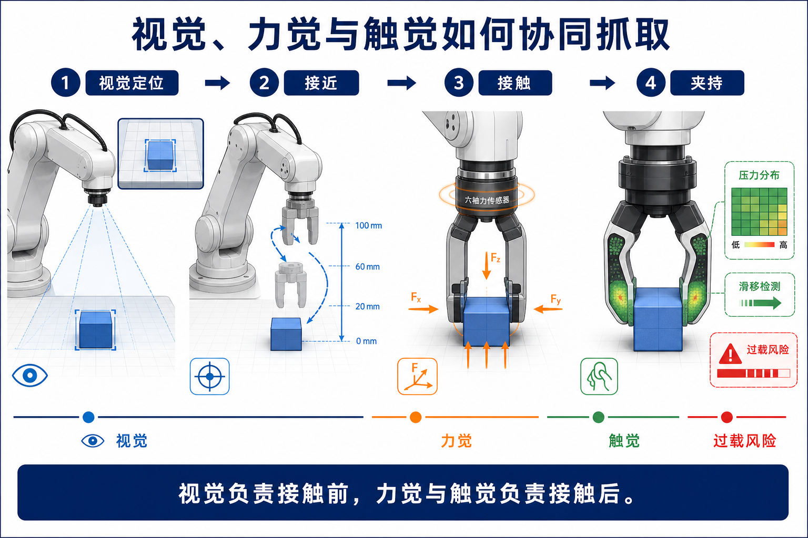

*图 4-7　视觉主要服务接触前定位，力觉和触觉服务接触后的状态确认。*

### 4.2.5 交互传感器

**介绍：**

交互传感器主要包括单麦克风和麦克风阵列。它们把声音转换为音频数据，为语音指令、声源定位、异常声音检测和设备状态监测提供输入。

**主要特点：**

- 单麦克风结构简单，适合采集语音和环境声音，但难以直接判断声音来自哪个方向；
- 麦克风阵列利用多个阵元之间的时间差估计声源方向，可配合视觉完成多模态交互；
- 远场语音容易受到背景噪声、混响、机器人电机声和扬声器回声影响；
- 从唤醒、识别到指令确认存在端到端延迟，不能把一次低置信度结果直接转换为危险动作。

**关键参数：**

- 采样率、位深、通道数和频带范围；
- 信噪比、灵敏度、动态范围和最大声压级；
- 阵元数量、阵元间距和阵列几何；
- 有效拾音距离、声源定位角度误差和混响适应性；
- 音频采集、识别和指令确认的总延迟。

阵元数量增加通常能改善方向估计，但也会提高数据量和计算量；阵元间距过大可能产生空间混叠，过小则会降低低频方向分辨率。

**适配任务：**

- 语音唤醒、语音指令和自然语言交互；
- 声源方向估计和说话人位置提示；
- 碰撞声、报警声和设备异响检测；
- 视觉与语音联合的人机交互；
- 电机、风扇和机械结构的运行状态监测。

### 4.2.6 传感器任务选型表


| 任务     | 主传感器    | 辅助传感器            | 重点参数             | 主要失效         | 降级方案                        |
| -------- | ----------- | --------------------- | -------------------- | ---------------- | ------------------------------- |
| 桌面抓取 | RGB-D       | 编码器、夹爪电流/触觉 | 近距深度、对齐、外参 | 透明反光、遮挡   | mask 邻域深度、顶部抓取、重感知 |
| 精密插接 | RGB/深度    | 六维力、触觉          | 外参、力分辨率、延迟 | 孔位偏差、卡滞   | 视觉粗定位 + 力控搜索           |
| 室内导航 | 2D/3D LiDAR | IMU、轮速、RGB        | 扫频、视场、同步     | 玻璃、动态障碍   | 多模态融合、减速停车            |
| 人形行走 | 编码器、IMU | 足底力、深度/LiDAR    | 高频率、低延迟、饱和 | 冲击、漂移、遮挡 | 本体状态闭环、安全姿态          |
| 人机交互 | RGB、麦克风 | 深度、阵列麦克风      | 动态范围、音频延迟   | 逆光、噪声、遮挡 | 多模态确认、保守动作            |
| 移动操作 | LiDAR/RGB-D | IMU、轮速、关节编码器 | 全局外参、统一时钟   | 底盘运动造成错位 | 时空标定、运动补偿              |

选型时优先从任务的空间范围、精度、速度、材质、光照、安全和预算约束出发，而不是从设备型号出发。

一个可操作的选型过程是先写“任务失败条件”，再选择传感器。例如目标是把随机摆放的纸盒放入周转箱，失败条件包括看不到纸盒、三维位置误差过大、抓取后滑落和箱内空间不足。由此可以推导：RGB 提供目标语义，Depth 提供三维位置，编码器提供机械臂状态，夹爪电流或触觉确认是否抓住；如果现场存在透明包装，还应准备基于桌面平面、双视角或固定抓取高度的降级方案。

这种从失败条件反推观测需求的方法，比先购买设备再寻找用途更符合工程实践。最终选型文档还应写明“哪些状态当前无法观测”，因为不可观测状态往往就是系统部署后的主要风险。

完成传感器选型后，下一步不是立即控制机器人，而是确认这些设备的数据怎样经过驱动和中间件进入系统。

---

## 4.3 传感器数据如何进入机器人系统？

### 4.3.1 从物理世界到数据流

```text
真实世界
↓
传感器采样
↓
驱动程序
↓
机器人中间件消息
↓
感知算法处理
↓
任务相关信息
↓
规划与控制模块
```

这条链路表达了一个基本事实：规划器和控制器通常不直接读取传感器的电信号，而是接收经过采样、驱动、通信和算法处理后的结构化结果。每一层解决不同问题，也可能引入新的误差。


| 环节             | 主要工作                                 | 常见问题                                     |
| ---------------- | ---------------------------------------- | -------------------------------------------- |
| 真实世界         | 产生光、声音、距离、运动和接触等物理现象 | 光照变化、遮挡、反光、冲击、环境噪声         |
| 传感器采样       | 把物理量转换为电信号和数字数据           | 量化误差、噪声、饱和、空洞、温漂             |
| 驱动程序         | 配置设备并把厂商数据转换为统一接口       | 单位换算错误、时间戳来源不清、缓存和格式转换 |
| 机器人中间件消息 | 在进程或计算机之间传输数据               | QoS 不兼容、带宽不足、丢帧、排队延迟         |
| 感知算法处理     | 从图像、点云等数据提取目标和状态         | 检测错误、深度异常、坐标系或同步错误         |
| 任务相关信息     | 生成目标点、目标位姿、障碍物或接触状态   | 信息不完整、置信度不足、数据已经过期         |
| 规划与控制       | 检查可达性与安全约束并生成动作           | 目标不可达、碰撞、过冲、继续使用旧目标       |

传感器采样阶段还可以进一步分为模拟前端、模数转换、固件处理和设备时间戳。例如相机先完成曝光和像素读出，深度相机还可能在设备内部计算视差、滤波和对齐；IMU 则以较高频率采样陀螺仪和加速度计。设备最终输出的已经不是原始物理现象，而是经过硬件测量模型处理的数字结果。

以深度相机为例，硬件完成曝光和深度计算后，驱动可能还要执行对齐、滤波和格式转换，然后才把消息发布到 ROS 2（Robot Operating System 2）。订阅节点收到消息时，墙钟时间可能已经比采集时刻晚几十毫秒。如果开发者在回调中用 `now()` 重新打时间戳，原始采集时刻就永久丢失，后续 TF 查询也只能使用错误时间。

ROS 2 中，驱动通常作为 publisher（发布者）发送消息，算法节点作为 subscriber（订阅者）接收消息；需要组合 RGB、Depth、IMU 等数据时，还会使用 `message_filters` 按时间戳同步。ROS 2 通常通过 DDS（Data Distribution Service，数据分发服务）传输数据，并使用 QoS（Quality of Service，服务质量）决定可靠性、队列长度和历史消息策略。

所以调试传感器链路时，不应只运行 `ros2 topic echo` 看数值，而应同时回答：

- 这个时间戳由设备、驱动还是应用节点生成？
- 多台计算机的系统时钟是否同步？
- 驱动是否在发布前缓存了若干帧？
- 图像转换、神经网络推理和消息传输各用了多久？
- 下游使用的是最新一帧，还是队列中较旧的帧？

这些问题决定系统看到的是“现在的世界”还是“几十到几百毫秒前的世界”。

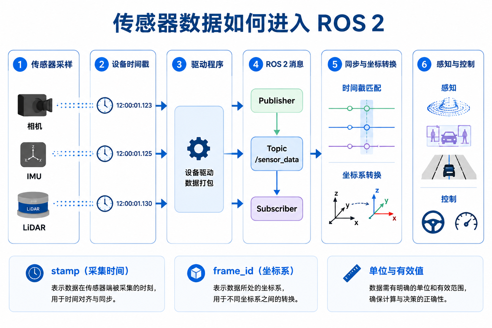

*图 4-8　从传感器采样、设备时间戳到 ROS 2 消息、同步、坐标转换和控制的数据流。*

### 4.3.2 常见数据形式

机器人系统中最常见的传感器数据包括：

- **RGB 图像**：记录颜色和纹理，用于识别、检测、分割和人机交互；
- **深度图**：记录每个像素对应的深度，用于三维反投影和点云生成；
- **点云**：由大量带坐标的三维点组成，可附带颜色、反射强度、法向和时间等属性；
- **LaserScan**：二维激光扫描序列，记录不同扫描角度上的距离；
- **JointState**：关节名称、位置、速度和力矩/力等机器人本体状态；
- **IMU**：角速度、线加速度以及设备可能提供的姿态估计；
- **Force / Torque**：三轴力和三轴力矩，用于接触检测、力控和装配；
- **Audio**：麦克风采集的音频采样或编码音频流；
- **TF**：坐标系之间随时间变化的平移和旋转关系。

在 ROS 2 中，这些数据通常使用标准消息表达：


| 数据       | 常见消息                      | 必查字段                                                                                                       |
| ---------- | ----------------------------- | -------------------------------------------------------------------------------------------------------------- |
| RGB/深度图 | `sensor_msgs/Image`           | 时间戳与坐标系（`header`）、图像高度（`height`）、图像宽度（`width`）、编码格式（`encoding`）、每行字节数（`step`） |
| 相机参数   | `sensor_msgs/CameraInfo`      | 时间戳与坐标系（`header`）、分辨率（`height/width`）、畸变系数（`D`）、内参矩阵（`K`）、校正旋转（`R`）、投影矩阵（`P`） |
| 点云       | `sensor_msgs/PointCloud2`     | 时间戳与坐标系（`header`）、字段布局（`fields`）、每点字节数（`point_step`）、每行字节数（`row_step`）、是否稠密（`is_dense`） |
| 激光扫描   | `sensor_msgs/LaserScan`       | 时间戳与坐标系（`header`）、距离数组（`ranges`）、反射强度（`intensities`，可选）、扫描角度（`angle_min/angle_max`）、角分辨率（`angle_increment`）、有效量程（`range_min/range_max`）、时间增量（`time_increment`）、扫描周期（`scan_time`） |
| IMU        | `sensor_msgs/Imu`             | 时间戳与坐标系（`header`）、姿态（`orientation`）、角速度（`angular_velocity`）、线加速度（`linear_acceleration`）、姿态协方差（`orientation_covariance`）、角速度协方差（`angular_velocity_covariance`）、线加速度协方差（`linear_acceleration_covariance`） |
| 关节状态   | `sensor_msgs/JointState`      | 时间戳（`header.stamp`）、关节名称（`name`）、位置（`position`）、速度（`velocity`）、力或力矩（`effort`）      |
| 力/力矩    | `geometry_msgs/WrenchStamped` | 时间戳与坐标系（`header`）、三轴力（`wrench.force`）、三轴力矩（`wrench.torque`）                              |
| 音频       | 驱动定义的 Audio 消息或字节流 | 采样率、通道数、采样格式、时间戳和每段音频的样本数量                                                          |
| 坐标变换   | `tf2_msgs/TFMessage`          | 变换数组（`transforms[]`）中每项的父坐标系（`header.frame_id`）、子坐标系（`child_frame_id`）、平移（`transform.translation`）、旋转（`transform.rotation`）、时间戳（`header.stamp`） |
| 三维点     | `geometry_msgs/PointStamped`  | 时间戳与坐标系（`header`）、三维坐标（`point.x/y/z`）                                                         |
| 位姿       | `geometry_msgs/PoseStamped`   | 时间戳与坐标系（`header`）、位置（`pose.position`）、方向四元数（`pose.orientation`）                         |

### 4.3.3 原始数据为什么不能直接控制机器人？

原始传感器数据与控制器需要的目标之间存在明显差距：

- **RGB 图像只有像素，没有真实距离**：检测框只能说明目标位于图像哪个区域，不能直接说明目标距离相机多远，更不能直接给出机器人基座坐标系下的位置；
- **深度图需要结合相机内参才能变成三维点**：单独的深度值只给出距离，还需要像素坐标和 `fx、fy、cx、cy` 才能完成反投影；
- **点云通常仍在相机或雷达坐标系下**：规划器需要 `base_link`、`map` 或其他任务坐标系中的目标，因此必须使用外参和 TF 做坐标转换；
- **传感器数据可能存在噪声、延迟、缺失和单位错误**：单像素深度可能是空洞，图像可能已经过期，毫米可能被误当成米，错误数据不能直接进入控制回路；
- **控制器需要结构化任务信息**：控制器通常接收目标位姿、关节位置、速度、力或轨迹，而不是一整张图像或未经筛选的点云。

以“点击图像让机械臂到达目标上方”为例，原始输入必须经过：

```text
RGB 图像中的目标像素 (u, v)
↓ 读取并过滤邻域深度
相机坐标系三维点 point_camera
↓ 外参 / TF 坐标转换
机器人基座坐标系三维点 point_base
↓ 姿态、偏移、可达性和碰撞检查
可执行目标位姿 target_pose_base
↓ 轨迹规划和安全限制
机械臂运动
```

这条链路中的任何一步失败，都不应该继续向下执行。例如目标深度无效，应请求重新感知；TF 在图像时间戳处不可用，应等待或丢弃该帧；目标超出工作空间，应拒绝规划，而不是把数值强行截断后继续运动。

**每条数据都需要上下文。**

**时间戳**用于回答“测量发生在何时”。不要用回调函数中的当前系统时间替代传感器采集时间，否则高速运动时会产生位置错位。

**frame_id**用于回答“数据在哪个坐标系表达”。一个三维点只有数值而没有 frame，就无法安全地交给规划模块。

测量还应说明可信程度和有效状态。例如轮速在干燥地面短时间内稳定，在光滑地面急加速时却可能打滑；视觉定位在纹理丰富区域可靠，在白墙前可能失效。系统需要结合传感器状态、重复测量和任务阈值决定接受、降级还是拒绝这条数据。

除了时间戳、坐标系和不确定性，还应明确单位、编码、有效范围和无效值。例如深度图编码可能是 `16UC1`，以毫米或设备刻度存储；也可能是 `32FC1`，以米存储。只有结合驱动说明和深度 scale 才能正确解释数值。

工程上需要关注：

- reliability：`best_effort` 或 `reliable`；
- history/depth：缓存多少条历史消息；
- durability：新订阅者是否需要历史数据；
- deadline/liveliness：是否监控更新周期和节点存活；
- 图像是否通过 `image_transport` 压缩；
- 压缩是否引入不可接受的延迟或深度精度损失。

**原始数据必须能够记录和复现。**

一次可复现实验至少应记录：

- rosbag2（ROS 2 数据录包）或等价原始数据；
- 相机内参 YAML；
- 静态和动态 TF；
- 软件版本、参数和启动命令；
- 图像分辨率、帧率、曝光和深度尺度；
- 机器人 URDF、关节零位和末端工具配置；
- 标定时间、安装状态和验证误差。

仅保存最终截图无法重现感知问题。原始数据、时间戳和 TF 才是后续复盘的证据。

因此，传感器结果进入控制器前至少要通过五项检查：数据是否有效、时间是否新鲜、单位是否统一、坐标系是否明确、目标是否满足任务与安全约束。任意一项不满足，都应停止执行、记录原因并触发重新感知或降级策略。

明确数据形式和接口上下文后，才能进一步讨论感知算法应输出哪些任务变量。

---

## 4.4 感知结果如何服务机器人任务？

### 4.4.1 常见感知输出

感知算法不是简单地把图像换成一个“答案”，而是从原始数据中逐层提取语义、几何、状态和不确定性。机器人任务中最常见的输出包括：

- **目标类别**：例如杯子、螺丝、行人或可回收物，用于决定后续使用哪种动作策略；
- **bounding box（目标检测框）**：用 `[x_min, y_min, x_max, y_max]` 描述目标在图像中的二维范围，适合快速定位，但不能准确表示物体轮廓；
- **segmentation mask（分割掩码）**：逐像素标出目标区域，可进一步统计目标深度、生成点云和排除背景；
- **目标中心点/关键点**：包括检测框中心、质心、抓取候选点、物体角点或人体关节关键点；
- **目标深度**：目标中心或目标区域的距离值，必须同时注明深度单位、来源 frame 和有效像素比例；
- **目标点云**：从 mask 或检测区域中过滤背景后得到的三维点集合，可计算中心、法向、尺寸和表面形状；
- **目标位姿**：物体或机器人在指定坐标系中的位置与方向，通常表示为 `PoseStamped`、齐次变换矩阵或位置加四元数；
- **可抓取区域**：目标表面上适合夹爪、吸盘或手指接触的区域，并可附带抓取方向、夹爪宽度和质量评分；
- **障碍物区域**：障碍物检测框、分割区域、点云体素或局部代价地图，用于碰撞检查和路径规划；
- **接触状态**：是否接触、接触力大小、是否滑动、夹爪是否夹住物体以及装配是否到位；
- **运动状态**：目标速度、机器人自身位姿、可通行区域和局部地图等时变信息；
- **不确定性**：置信度、协方差、有效性标志、遮挡比例和数据年龄，用于决定是否接受或拒绝该结果。

这些输出可以按四个层级理解：语义回答“是什么”，二维几何回答“在图像哪里”，三维几何回答“在空间哪里”，任务状态回答“现在是否可以执行”。第 6、7 讲会进一步介绍检测、分割、点云处理和 6D 位姿估计；本讲重点是这些输出怎样满足机器人系统的时间、坐标和质量约束。

### 4.4.2 感知输出与任务输入

感知输出通常不能直接作为规划器输入，中间还需要深度读取、坐标变换、滤波、姿态补偿、可达性检查和任务规则。可以用下表理解从“感知结果”到“可执行变量”的转换：


| 感知输出          | 还需要补充或处理                        | 最终任务输入                | 典型任务           |
| ----------------- | --------------------------------------- | --------------------------- | ------------------ |
| 目标类别          | 类别到动作策略的映射、置信度阈值        | 任务对象 ID 和动作类型      | 分类后抓取或分拣   |
| bounding box      | 深度、相机内参、外参、目标可见性        | 粗略三维目标点              | 点击到达、粗抓取   |
| segmentation mask | mask 内有效深度统计、背景剔除、点云滤波 | 目标点云、三维中心和尺寸    | 桌面抓取、物体测量 |
| 关键点            | 关键点排序、尺度恢复、姿态求解          | 目标方向或相对位姿          | 插孔定位、人体姿态 |
| object pose       | 抓取偏移、工具姿态、可达性和碰撞检查    | `grasp_pose` 或装配目标位姿 | 姿态相关抓取、装配 |
| LaserScan / 点云  | 传感器外参、定位、地图匹配和膨胀半径    | 局部代价地图、障碍物集合    | 导航和避障         |
| IMU + 轮速        | 时间同步、运动模型、滤波和协方差        | `odom` / `base_link` 位姿   | 移动机器人定位     |
| wrench / 触觉     | 零点、重力补偿、阈值和接触坐标系        | 接触、滑动或装配状态        | 插拔、精细操作     |
| 语音和人体检测    | 语义解析、指令确认、身份和安全距离      | 任务指令与交互状态          | 人机交互           |

感知模块输出给规划和控制模块时，必须明确一份接口契约：

1. 数据类型和单位；
2. `stamp` 和 `frame_id`；
3. 位置和旋转的表示方式；
4. 有效范围、置信度和无效值处理；
5. 更新频率、最大允许延迟和数据过期时间；
6. 目标不可达、感知失败或传感器缺失时的降级行为。

例如 `target_pose_base` 不能只约定“七个数”，还要明确单位为米、四元数顺序为 `x,y,z,w`、坐标系为 `base_link`、时间戳对应哪一帧图像，以及目标多久后视为过期：

```yaml
message: geometry_msgs/PoseStamped
frame_id: base_link
position_unit: meter
quaternion_order: [x, y, z, w]
source_stamp: synchronized_rgbd_stamp
max_age_ms: 150
valid_workspace:
  x: [0.10, 0.45]
  y: [-0.30, 0.30]
  z: [0.02, 0.40]
on_invalid: stop_and_request_reperception
```

这种契约把隐含假设变成可以测试的条件。控制器收到目标后先检查 frame、时间、单位、工作空间和碰撞约束，而不是默认上游永远正确。对于真实机器人，拒绝一条不完整或过期的目标，通常比“尽量执行”更加安全。

### 4.4.3 不同任务对感知结果的要求

不同机器人任务需要的不是同一种“高精度感知”，而是与动作决策直接相关的变量：

- **抓取任务**：需要目标位置、目标中心或抓取点、抓取姿态、夹爪宽度、目标表面法向和可达性。粗抓取可以接受厘米级位置误差，精细抓取还要检查遮挡、物体边缘、夹爪碰撞和抓取后的滑动；
- **导航任务**：需要障碍物位置、障碍物高度和范围、局部地图、机器人自身位姿、速度以及可通行区域。导航不仅关心“看到了障碍物”，还关心障碍物是否处于机器人当前运动轨迹以及地图和里程计是否连续；
- **装配任务**：需要零件之间的相对位置、插入方向、旋转误差、接触力、插入深度和装配成功状态。视觉通常负责粗定位，接触后还要结合力觉或触觉进行柔顺搜索和失败判断；
- **人机交互任务**：需要语音指令、人体位置、手势、身份或目标对象、安全距离和交互状态。系统还要处理噪声、遮挡、多人同时出现和指令确认，不能把一次低置信度识别直接转成危险动作；
- **场景理解任务**：需要物体类别、空间关系、桌面和容器区域、障碍物以及不确定性，便于规划“先拿哪个、从哪里接近、是否有碰撞风险”；
- **移动操作任务**：同时需要底盘位姿、机械臂状态、相机或 LiDAR 的环境几何，以及目标相对于 `base_link` 和末端的位姿，任何一个 frame 或时间不同步都可能造成操作偏差。

评估感知系统时，应使用任务指标而不是只看算法指标。例如检测 mAP（mean Average Precision，平均精度均值）很高，不代表抓取点位置足够准确；深度平均误差很小，也不代表透明物体和目标边缘处没有危险离群值。最终验收应回答：输出是否在规定时间内到达、坐标是否正确、误差是否小于动作容错、失败时是否能够停止或降级。

当单一传感器无法稳定提供这些任务变量时，就需要进一步处理多传感器之间的时间、空间和语义一致性。

---

## 4.5 多传感器数据对齐与融合

### 4.5.1 为什么需要多传感器融合？

单一传感器通常只观察世界的一部分：相机提供纹理和语义但受光照影响；LiDAR 提供几何但语义较弱；IMU 高频但会漂移；编码器稳定但无法观察外部打滑；力觉能确认接触但只有接触后才产生信号。

融合的目标不是简单拼接数据，而是在统一的时间和坐标系下，利用不同传感器的互补性得到更稳定的状态估计。

### 4.5.2 时间对齐

必须区分：

- 采集时刻：物理测量真正发生的时间；
- 发布时间：驱动发布消息的时间；
- 到达时刻：订阅节点收到消息的时间；
- 处理完成时刻：算法产生输出的时间。

时间同步方式包括：

- 硬件触发：多个设备共享触发信号；
- PTP（Precision Time Protocol，精确时间协议，也称 IEEE 1588）：在支持的网络设备间高精度同步时钟；
- NTP（Network Time Protocol，网络时间协议）：适合一般计算机时钟同步，精度受网络延迟影响；
- 软件匹配：根据时间戳做 ExactTime 或 ApproximateTime；
- 插值：把高频 IMU、JointState 插值到图像或 LiDAR 时刻。

考虑一个移动机器人以 `0.5 m/s` 横向运动。RGB 和 Depth 时间相差 `80 ms` 时，仅由时间差产生的空间错位约为：

```math
\Delta x=0.5\times0.08=0.04\;m
```

即 4 cm。静态拍摄标定板时很难发现这一问题，但在动态障碍、视觉伺服或移动抓取中会直接破坏几何一致性。

同步还需要区分“频率相同”和“时刻相同”。两路相机都标称 30 FPS，并不保证它们同时曝光；它们可能有固定相位差，甚至时钟速率略有不同而逐渐漂移。严格的多相机三维重建或高速操作应优先使用硬件触发；软件近似同步更适合无法硬同步、且运动速度较低的场景。

对于 200 Hz IMU 和 30 Hz 图像，不应简单取离图像最近的一条 IMU。视觉惯性系统通常需要图像间隔内的整段 IMU 测量进行积分。

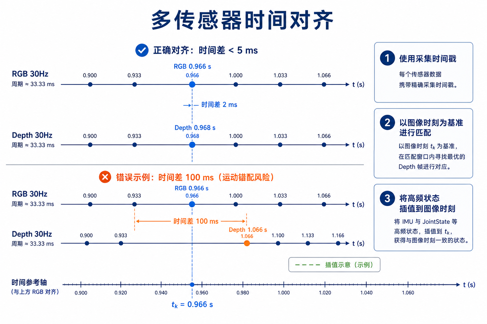

*图 4-9　不同频率的数据需要按采集时间匹配或插值到共同参考时刻。*

### 4.5.3 空间对齐

每个传感器都有自己的 frame。空间对齐需要已知外参，例如：

```text
T_base_camera
T_base_lidar
T_base_imu
T_wrist_ft
```

外参既包括平移，也包括旋转。只测量安装位置而忽略姿态，或把 `T_A_B` 当成 `T_B_A`，都会造成明显错误。

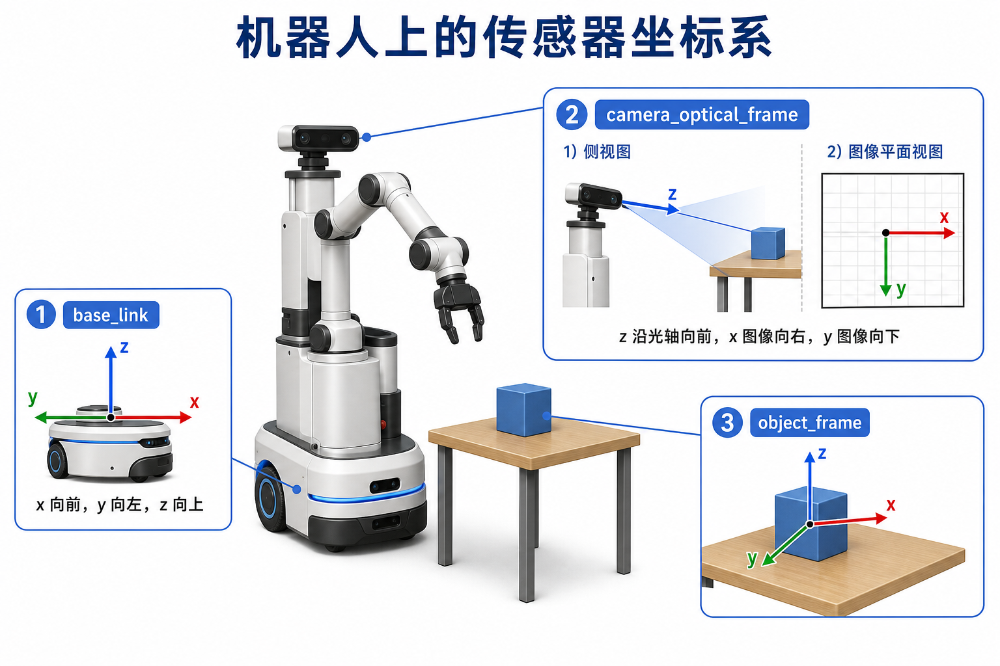

*图 4-10　移动操作机器人上的传感器、机体和末端坐标系及其连接关系。*

### 4.5.4 语义对齐

空间和时间对齐后，还必须明确不同数据在任务中的含义，否则“把数据放到一起”仍然不能形成有效融合：

- RGB 表示颜色和纹理，主要回答“是什么、外观如何”；
- depth 表示距离或轴向深度，主要回答“离传感器多远”；
- LiDAR 表示稀疏或稠密几何，主要回答“环境结构和障碍物在哪里”；
- force/torque 表示接触力和力矩，主要回答“是否接触、受力多大”；
- tactile 表示局部压力、接触位置和滑动，主要回答“夹住后是否稳定”；
- IMU 和编码器表示机器人自身运动，主要回答“机器人如何移动、当前处于什么状态”。

融合前需要写清每种传感器负责回答什么问题。以“轮速 + IMU + 视觉定位”为例，轮速提供连续的平面移动，IMU 补充高频转动，视觉提供环境中的位置参考。视觉暂时丢失时，系统仍可依靠轮速和 IMU 短期运行；视觉恢复后，再用环境参考修正逐渐积累的漂移。

但融合不是把三个有问题的传感器自动变成一个正确结果。若轮速和视觉来自同一里程计源，却被当成两条独立观测重复融合，滤波器会高估信息量；若 IMU 外参方向错误，融合器会稳定地得到错误姿态；若全局定位会发生跳变，却被直接用于要求连续的底层控制，机器人可能突然产生大速度指令。

因此，融合前先列出每个观测的来源、frame、频率和延迟，再确认它们是否真正提供了相互补充的信息。

### 4.5.5 常见融合组合


| 组合                   | 互补关系                | 典型输出             |
| ---------------------- | ----------------------- | -------------------- |
| RGB + Depth            | 语义/纹理 + 三维距离    | 目标点云、三维中心   |
| Camera + IMU           | 环境参考 + 高频运动     | 连续位姿估计         |
| LiDAR + IMU            | 环境几何 + 高频运动     | 去畸变点云、连续位姿 |
| Wheel odom + IMU       | 平面位移 + 姿态变化     | 连续 odom            |
| Camera + LiDAR         | 语义/纹理 + 稀疏、准确、远距几何 | 三维检测和语义地图   |
| Vision + Force/Tactile | 接近前观察 + 接触后反馈 | 抓取、插接成功状态   |

融合输出仍然要说明时间、frame、有效状态和可信程度。对齐错误不会因为加入更多传感器自动消失，反而可能形成更稳定但错误的结果。至此，多源数据已经具备共同解释基础，下一节聚焦本讲任务所需的相机几何链路。

---

## 4.6 相机原理与坐标转换

### 4.6.1 为什么重点讲相机？

相机是机器人最常用的外感知传感器之一，目标识别、检测、分割和视觉抓取通常都从图像开始。但图像中的像素只表示二维投影，不能直接作为机器人目标点。要得到真实空间位置，必须联合使用深度、相机内参、相机外参和坐标转换。

本节选择 RGB-D 相机作为贯穿例子，是因为它能把“图像像素→相机三维点→机器人基座目标点”的链路完整展示出来。同样的时间、坐标和标定原则也适用于双目、LiDAR 和其他三维传感器。

下面先定义图像坐标和相机内参，再写出投影与反投影公式，避免只记公式却不知道每个量属于哪个空间。

### 4.6.2 图像坐标系

图像中的像素点写作 `[u,v]`：`u` 表示横向坐标，向图像右侧增大；`v` 表示纵向坐标，向图像下方增大；原点通常位于左上角。访问数组时常写作 `image[v,u]`，因为数组索引顺序是“行、列”，这与数学表达 `(u,v)` 相反，是常见错误来源。

图像坐标系只说明像素位于哪一行、哪一列，不包含真实长度单位。两个相邻像素在空间中相距多少，取决于焦距、目标深度和成像分辨率。

### 4.6.3 相机内参

相机内参描述相机坐标系中的光线如何投影到像素平面，主要包括：

- `fx`：x 方向以像素为单位的焦距；
- `fy`：y 方向以像素为单位的焦距；
- `cx`：主点的横向像素坐标；
- `cy`：主点的纵向像素坐标；
- 畸变参数：描述真实镜头偏离理想针孔模型的程度。

内参矩阵写为：

```math
K=
\begin{bmatrix}
f_x & 0 & c_x\\
0 & f_y & c_y\\
0 & 0 & 1
\end{bmatrix}
```

内参与图像分辨率绑定。图像缩放、裁剪或更换相机 stream 后，必须读取匹配当前图像的 `CameraInfo`，不能直接复用旧分辨率的参数。

**针孔相机模型**

设相机坐标系下三维点为 `P_c=[X,Y,Z]^T`。针孔模型先做透视除法：

```math
x = X/Z, \qquad y = Y/Z
```

再通过内参矩阵投影到像素：

```math
\begin{bmatrix}u\\v\\1\end{bmatrix}
=K
\begin{bmatrix}x\\y\\1\end{bmatrix}
```

这里的“焦距以像素为单位”容易让初学者困惑。镜头物理焦距通常以毫米表示，而 `fx、fy` 已经结合了传感器像元尺寸和图像采样，是投影方程直接使用的参数。更换输出分辨率时，物理镜头没有变化，但像素坐标尺度改变，因此 `fx、fy、cx、cy` 也要相应缩放或重新从 `CameraInfo` 读取。

以 `640×480` 图像为例，假设 `fx=fy=600`、`cx=320`、`cy=240`。像素 `(320,240)` 位于主点附近，对应相机 z 轴方向；像素 `(420,240)` 比主点向右 100 px。若深度为 `0.6 m`，后者在相机 x 方向的位置为：

```math
X=(420-320)\times0.6/600=0.1\;m
```

也就是相机光轴右侧约 10 cm。这个计算把像素偏移、焦距、深度和真实空间距离联系起来。

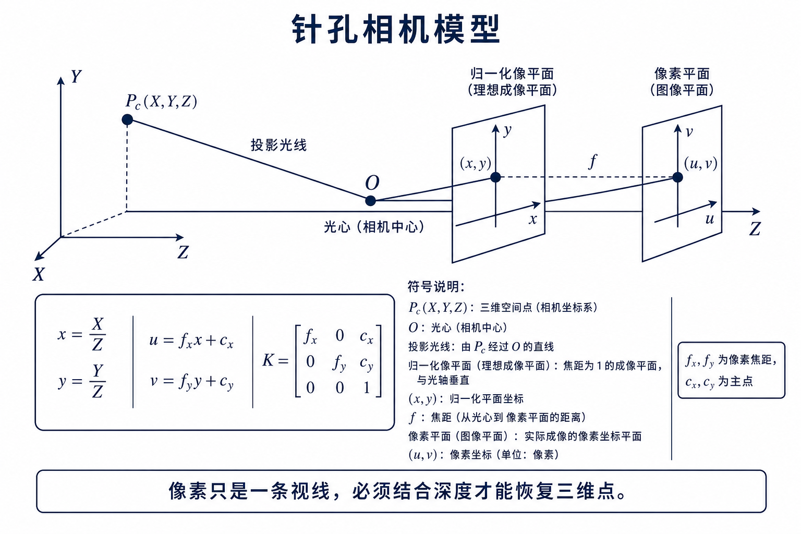

*图 4-11　三维点经过透视投影和相机内参映射到像素平面。*

**镜头畸变与图像校正**

真实镜头不完全符合针孔模型。常见针孔相机使用径向和切向畸变模型；鱼眼相机常使用 equidistant 模型。必须区分：

- raw image（原始图像）：带镜头畸变，通常结合 `K` 和畸变参数 `D` 使用；
- rectified image（校正图像）：已根据标定参数校正，通常使用投影矩阵 `P` 中的有效焦距和主点；
- 不能对已校正像素重复去畸变，也不能给 raw 像素直接套用 rectified 参数。

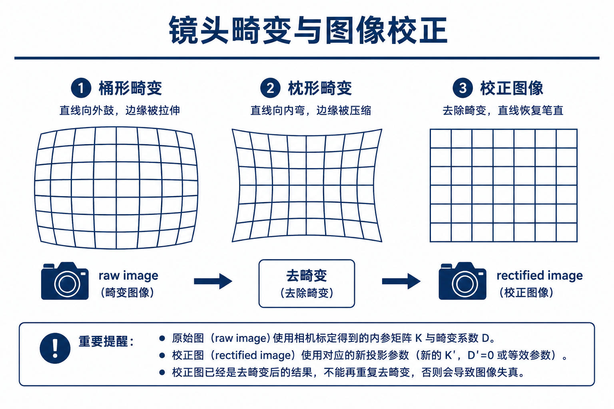

*图 4-12　桶形、枕形畸变与校正后图像的几何差异。*

### 4.6.4 深度 Z

深度 `Z` 用于恢复某个像素对应的三维位置。使用前必须明确：

- depth 的单位是米、毫米还是设备定义的 depth unit；
- `0`、NaN 或 Inf 是否表示无效深度；
- depth 表示沿相机 z 轴的轴向深度，还是沿像素视线的距离；
- RGB 与 depth 是否已完成空间对齐和时间同步；
- 透明、反光、黑色或强吸光物体是否产生空洞和飞点。

目标像素处没有有效深度时，不应返回零坐标或继续执行。更稳妥的方法是在目标 mask 或邻域内过滤无效值，再取中位数或局部表面点。

### 4.6.5 RGB-D 反投影

对于已经去畸变或与内参匹配的像素 `(u,v)`，若深度 `Z` 表示相机 z 轴方向深度，则：

这里的“匹配”必须具体到图像流：若 depth 已重投影到彩色图，应使用对齐后彩色图对应的有效内参；若使用原始 depth 图，应使用深度相机自己的内参。不能用彩色图像的 `(u,v)` 直接索引未对齐的深度图，也不能把 raw 图的 `K` 与 rectified 像素混用。

```math
X = (u-c_x)Z/f_x
```

```math
Y = (v-c_y)Z/f_y
```

```math
P_c=[X,Y,Z]^T
```

*深度读取的鲁棒处理**

不要直接相信单个像素。检测框中心可能落在空洞、背景或反光区域。推荐顺序是：

1. 在目标 mask 内采样；
2. 剔除 0、NaN、Inf 和范围外深度；
3. 使用中位数或截断均值；
4. 对局部点云做离群点过滤；
5. 必要时拟合局部平面或选择可见表面点；
6. 无有效深度时返回失败，而不是输出零坐标。

还要确认深度尺度。例如 `uint16` 深度图常以毫米或设备 depth unit 表示，必须转换为米。

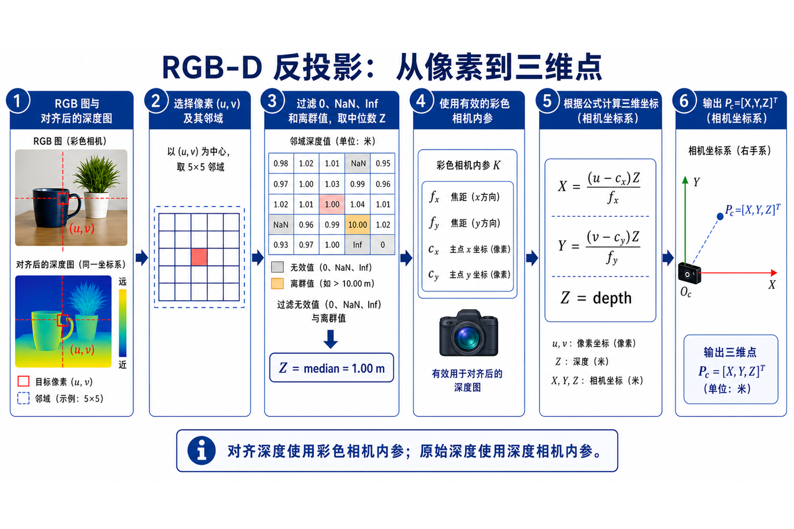

*图 4-13　从目标像素、邻域深度统计到相机坐标系三维点的完整反投影流程。*

### 4.6.6 从 camera 坐标系到 base 坐标系

反投影得到的是相机坐标系中的 `point_camera`，而机器人规划和控制通常需要基座坐标系中的 `point_base`。两者之间依赖相机外参：

```math
\bar p_{base}=T_{base\_camera}\bar p_{camera}
```

其中点使用齐次坐标 `[X,Y,Z,1]^T`。下面先说明齐次变换，再给出完整计算。

**齐次变换**

刚体变换由旋转 `R` 和平移 `t` 组成：

```math
T_{A\_B}=
\begin{bmatrix}
R_{A\_B} & t_{A\_B}\\
0 & 1
\end{bmatrix}
```

本文统一采用记号 `T_A_B`：它把 B frame 中的量转换到 A frame。部分教材也写作 `{}^A T_B`，二者在本文中含义相同；全文不再使用容易产生上下标方向歧义的 `T_A^B`。

```math
\bar p_A=T_{A\_B}\bar p_B
```

```math
T_{A\_C}=T_{A\_B}T_{B\_C}
```

逆变换为：

```math
T_{B\_A}=
\begin{bmatrix}
R^T & -R^Tt\\
0 & 1
\end{bmatrix}
```

下面使用符合 ROS 常见轴向约定的例子。相机光学坐标系 x 向右、y 向下、z 向前；`base_link` 的 x 向前、y 向左、z 向上。忽略相机自身倾角时，从 optical frame 到 base 的旋转可写为：

```math
R_{base\_optical}=
\begin{bmatrix}
0 & 0 & 1\\
-1 & 0 & 0\\
0 & -1 & 0
\end{bmatrix}
```

若相机光心位于 base 前方 `0.20 m`、左侧 `0.05 m`、上方 `0.40 m`，相机测得 `p_camera=[0.10,-0.02,0.60] m`，则：

```math
p_{base}=R_{base\_optical}p_{camera}+t_{base\_optical}
=[0.80,-0.05,0.42]^T\;m
```

这个结果表示目标位于 base 前方 0.80 m、右侧 0.05 m、上方 0.42 m。真实安装还可能包含俯仰、偏航和滚转，不能只套用上述固定轴变换。若转换后发现所有目标的 base z 坐标都随相机深度大幅增长，应优先怀疑 optical frame 旋转没有包含在变换中。

矩阵链调试建议从一个已知方向开始：在相机正前方放置目标，理论上 `point_camera` 应接近 `[0,0,Z]`；转换到 base 后，点应该落在机器人前方，而不是地下、背后或远高于相机。一个直观的已知点测试往往比打印整块矩阵更容易发现方向错误。

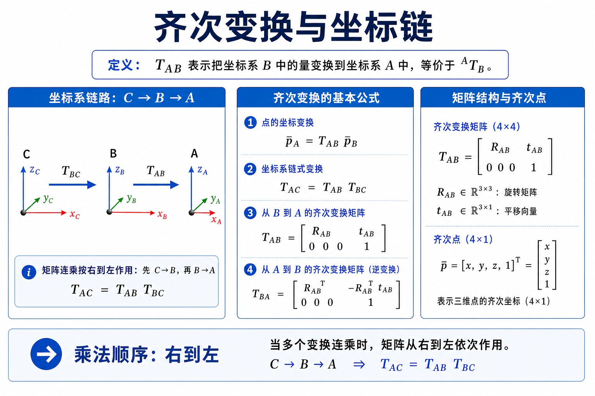

*图 4-14　齐次变换的方向定义、矩阵结构、坐标链组合、求逆和乘法顺序。*

常见错误包括：

- 把 `T_camera_base` 当成 `T_base_camera`；
- 使用行向量代码却套用列向量公式；
- 齐次坐标最后一维写错；
- 平移使用毫米、点坐标使用米；
- 使用 `camera_link` 外参处理 optical frame 数据；
- 图像和 TF 不是同一时刻。

### 4.6.7 从三维点到可执行目标

坐标转换得到的 `point_base=[x,y,z]` 只回答“目标点在哪里”，还不能直接作为机械臂指令。机械臂末端需要一个完整位姿：位置决定末端到哪里，旋转决定夹爪以什么方向接近目标。完整目标通常写成：

```text
target_pose_base = [x, y, z, qx, qy, qz, qw]
```

其中前三项是 `base_link` 坐标系下的位置，后四项是表示末端方向的单位四元数。把三维点变成可执行目标，可以按下面的过程完成。

**第一步：确定任务点。**

反投影点可能位于物体表面、检测框中心或点击位置，并不一定就是末端最终到达的位置。到达演示通常在目标点上方增加安全偏移：

```math
p_{pre}=p_{base}+\Delta p_{safe}
```

例如桌面目标上方保留 `5 cm`，可以设置 `\Delta p_{safe}=[0,0,0.05]^T m`。抓取任务还要根据夹爪长度、目标尺寸和抓取点位置计算工具中心点，而不是让末端坐标系原点直接落到物体表面。

**第二步：生成末端姿态。**

姿态可以来自任务固定方向、物体位姿、表面法向或抓取算法。桌面到达任务可以使用固定的“夹爪朝下”姿态；侧面抓取则需要让夹爪接近方向对准物体侧面。表面法向只能确定一个接近轴，还要指定夹爪在表面切平面内的方向，才能得到完整旋转。`base_link` 坐标系下的位置 `p_{base\_target}` 与旋转 `R_{base\_target}` 组合成目标变换：

```math
T_{base\_target}=
\begin{bmatrix}
R_{base\_target} & p_{base\_target}\\
0 & 1
\end{bmatrix}
```

再将旋转矩阵转换为控制接口要求的四元数，就得到 `target_pose_base`。

**第三步：检查感知结果。**

发送目标前检查深度是否有效、时间戳是否过期、`frame_id` 是否正确、位置单位是否为米，以及目标点是否仍对应当前场景。任何一项失效，都重新感知，不继续使用旧目标。

**第四步：检查机器人是否能够到达。**

运动规划模块根据目标位姿求解逆运动学，并检查工作空间、关节限位、自碰撞、环境碰撞和末端工具尺寸。三维点位于机械臂附近，不代表带有指定姿态的末端一定可达；位置可达但姿态不可达时，也需要更换接近方向或安全偏移。

**第五步：生成并执行运动。**

规划通常不是从当前位置直接冲向目标点，而是生成“当前位姿 → 预目标位姿 → 任务位姿 → 撤离位姿”的轨迹，并加入速度、加速度和力限制。本讲 Demo 停在预目标位姿：先显示 `point_base` 和 `target_pose_base`，安全检查通过后，再低速移动到目标上方，不直接执行抓取。

完整链路可以写成：

```text
point_base
→ 加入工具偏移和安全高度
→ 确定末端旋转
→ target_pose_base
→ 数据有效性检查
→ 逆运动学与碰撞检查
→ 轨迹规划
→ 低速执行或拒绝目标
```

相机几何给出了理想计算链路，但真实任务的误差会从图像、深度、时间和外参逐层传播，下一节将按层分析这些失败来源。

---

## 4.7 感知误差与任务失败

### 4.7.1 图像层误差

图像层常见误差包括图像模糊、曝光异常、光照变化、目标遮挡、检测框偏移和 segmentation mask 分割不准。它们会使后续深度读取落到背景、边缘或错误物体上。即使深度和外参完全正确，错误像素仍会生成错误三维点。

排查图像层问题时，应保存原始图像、检测框、mask 和置信度，检查失败最早出现在哪一帧、哪个区域，而不是只观察机械臂最终是否抓到。

**先区分误差性质**

传感器系统常同时存在：

- 随机噪声：多次测量围绕真实值波动；
- 系统偏差：测量长期偏向某一方向；
- 量化误差：有限分辨率带来的离散化；
- 漂移：偏差随时间和温度变化；
- 延迟：数据描述的是过去状态；
- 离群值：偶发的严重错误；
- 缺失值：无深度、丢帧、TF 不可用。

这些误差需要不同处理方法。简单低通滤波可以减小随机噪声，却不能修复错误外参；过强滤波还会增加延迟。

### 4.7.2 深度层误差

深度层常见问题包括随机噪声、单位或 scale 错误、无效空洞、边缘飞点、RGB-depth 未对齐，以及透明、反光和黑色材质导致的异常测量。单个像素的错误可能达到背景距离，因此应优先使用 mask 内或邻域内的鲁棒统计。

单位错误通常产生数量级异常，例如把 `600 mm` 当成 `600 m`；RGB-depth 未对齐则更容易产生与目标边界相关的方向性偏差。两类问题现象不同，不能都用低通滤波处理。

### 4.7.3 坐标转换层误差

坐标转换层常见问题包括内参不匹配、外参不准确、`T_base_camera` 与 `T_camera_base` 写反、坐标轴方向理解错误、齐次矩阵乘法顺序错误，以及把 `camera_link` 数据误当成 `camera_optical_frame` 数据。

这类错误往往不会触发程序异常，因为错误矩阵仍能输出合法数字。应使用相机正前方、桌面已知点等可预测位置验证方向，并在 RViz/Open3D 中同时显示 camera、base 和目标点。

### 4.7.4 系统层误差

系统层误差来自多个正确模块之间的错误组合，包括时间戳不同步、TF 树断裂、frame 名称不一致、QoS 队列积压、传感器安装松动、目标不可达、夹爪姿态不合理和运动规划碰撞。

典型现象是静态目标定位正确，机器人运动后误差快速增大。这时应优先检查图像、关节状态与 TF 的采集时间，而不是重新拟合一个静态外参补偿量。

### 4.7.5 误差传递链路

```text
图像和检测误差
→ 深度误差
→ 反投影误差
→ 时间不同步误差
→ 外参和 TF 误差
→ target_pose 误差
→ 运动学与机械误差
→ 抓偏、抓空、碰撞或损坏物体
```

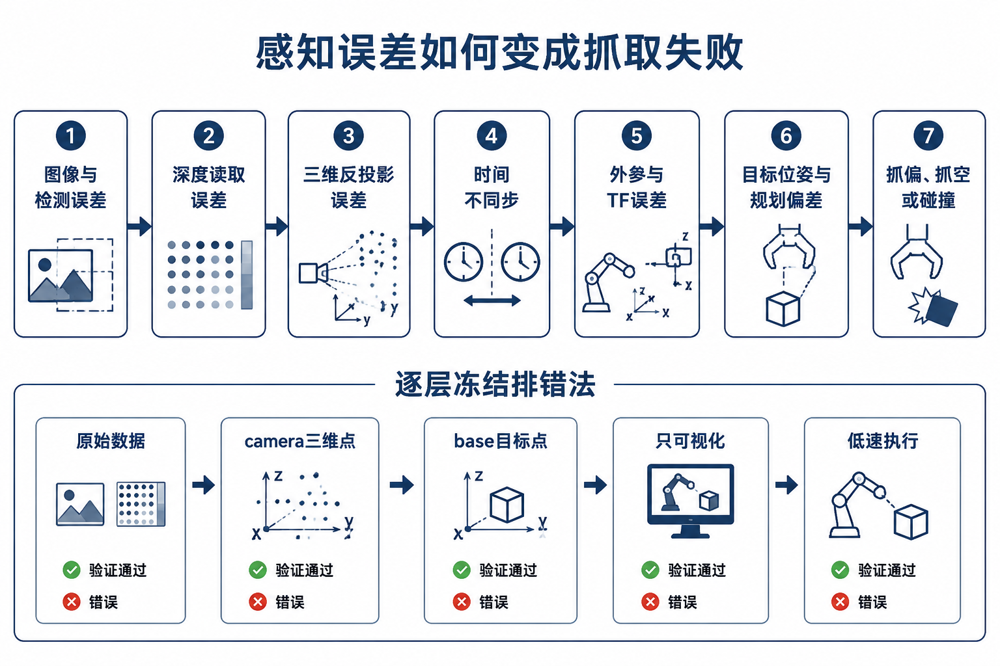

*图 4-15　上游测量、同步和坐标误差会逐层传播为最终执行失败。*

**定量误差预算**


| 层级   | 示例指标                   | 验证方法            |
| ------ | -------------------------- | ------------------- |
| 图像   | 清晰度、曝光、检测中心偏差 | 固定场景重复采集    |
| 深度   | 中位误差、标准差、空洞率   | 已知距离平面/标定板 |
| 内参   | 重投影误差、边缘残差       | 独立标定图像        |
| 外参   | 三维点误差、旋转误差       | 多位置已知目标      |
| 时间   | 消息时间差、端到端延迟     | 运动目标/时间日志   |
| TF     | 查询成功率、变换连续性     | tf2 工具和 RViz     |
| 机器人 | 末端重复定位和绝对定位误差 | 测量治具/标记点     |
| 任务   | 成功率、最大误差、失败类型 | 多位置多次任务运行  |

**逐层冻结排错法**

1. 冻结机器人，只检查原始图像和深度；
2. 固定目标，只检查相机坐标系三维点；
3. 固定外参，只检查 base 坐标系目标点；
4. 只做 RViz/Open3D 可视化，不发送动作；
5. 低速移动到安全预目标点；
6. 最后才加入抓取、碰撞和反馈逻辑。

如果一开始就运行完整抓取，视觉、TF、规划和控制错误会混在一起，难以定位。

下面给出三个常见现象与定位过程。

**现象一：目标点在相机点云中正确，但转换到 base 后整体偏移固定距离。** 这通常指向外参平移、单位或工具安装变化。先在多个位置比较偏差，如果偏差方向和大小基本固定，不要优先调整检测模型。

**现象二：静态目标正确，机器人一运动目标就漂移。** 这通常指向时间同步、动态 TF 时间戳或机械臂状态延迟。记录图像 stamp、TF stamp 和关节状态 stamp，比较运动速度越高时误差是否越大。

**现象三：工作空间中心准确，越靠边缘误差越大。** 这可能来自镜头畸变未正确处理、内参分辨率不匹配、标定姿态覆盖不足或外参旋转误差。此时只用中心点重新计算固定偏移无法解决问题。

排错的目标不是找到一组“能让这次抓取成功”的补偿量，而是找到误差所在层，并使修复能推广到整个工作空间。

误差定位之后，才能判断哪些系统参数需要通过标定重新估计，哪些问题应由同步、滤波或机械结构处理。

---

## 4.8 标定：让传感器和真实空间对齐

### 4.8.1 什么是标定？

标定不是“生成一个 YAML 文件”，而是估计测量模型参数，并证明这些参数在任务范围内可信。


| 标定类型       | 主要输出                      | 解决的问题                     |
| -------------- | ----------------------------- | ------------------------------ |
| 相机内参       | `fx,fy,cx,cy,D`               | 像素如何对应光线               |
| 双目/RGB-depth | 两相机间外参、校正参数        | 左右图或 RGB-depth 如何对齐    |
| 相机外参       | `T_base_camera`               | 相机三维点如何进入机器人坐标系 |
| 手眼标定       | camera、tool、base 之间的变换 | 相机与机械臂运动链如何关联     |
| Camera-IMU     | 空间外参和时间偏移            | 视觉与惯性如何联合估计         |
| LiDAR 外参     | LiDAR-camera/IMU/base 变换    | 点云如何对齐和去畸变           |
| 力传感器       | 零点、重力、质心、轴方向      | wrench 如何对应真实接触        |

### 4.8.2 相机内参标定

常用标定物包括棋盘格、ChArUco 和 AprilGrid。采集数据时应覆盖：

- 图像中心和四角；
- 近、中、远多个距离；
- 不同俯仰、偏航和滚转角；
- 实际工作分辨率和对焦状态；
- 清晰、不过曝的图像。

不要只在画面中心平移标定板。缺少姿态和视场覆盖会使参数欠约束，重投影误差可能看起来不高，但边缘和实际工作距离表现很差。

一次完整内参标定可以按以下流程组织：

1. 固定相机分辨率、对焦、曝光模式和镜头；
2. 准确测量标定板格长，并确认打印比例没有缩放；
3. 采集覆盖视场和工作距离的图像；
4. 剔除严重模糊、过曝和角点提取错误的样本；
5. 求解内参和畸变参数；
6. 查看每张图的重投影残差，而不只看总体均值；
7. 使用未参与求解的图像运行校正检查；
8. 在真实工作距离放置已知尺寸目标，验证三维结果。

如果不断增加畸变参数能降低训练图像重投影误差，却使独立图像边缘变差，就可能发生过拟合。标定的目标是得到可泛化的成像模型，而不是让求解报告中的单一数字最小。

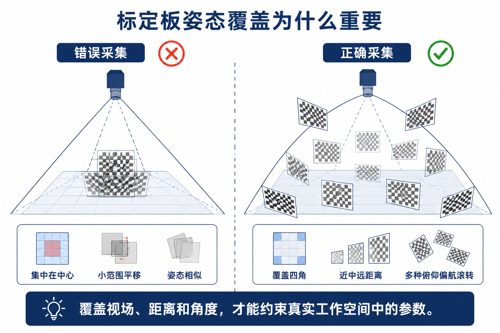

*图 4-16　标定数据需要覆盖视场、距离和旋转，不能只在图像中心小范围移动。*

### 4.8.3 相机外参标定

相机外参描述相机相对于机器人 base、末端或其他参考坐标系的位置和方向。用于固定外部相机时，常见输出为 `T_base_camera` 或其逆变换 `T_camera_base`。前者把 camera 中的点转换到 base，后者把 base 中的点转换到 camera，两者不能只凭文件名猜测。

外参标定需要已知同一目标在相机和机器人坐标系中的对应关系。求解后应在工作空间多个位置验证，而不是只在标定板原位置查看误差。

### 4.8.4 手眼标定

Eye-to-hand 表示相机固定在机器人外部；Eye-in-hand 表示相机安装在末端。经典手眼标定常写为：

```math
AX=XB
```

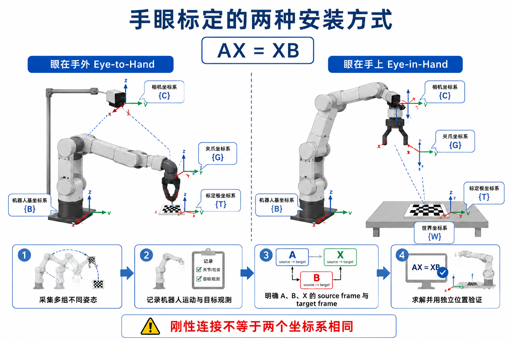

*图 4-17　Eye-to-Hand 与 Eye-in-Hand 中 base、gripper、camera 和 target frame 的安装关系及 `AX=XB` 流程。*

其中 `A、B` 来自机器人和视觉观测的相对运动，`X` 是待求的固定变换。采样必须包含足够多、足够不同的旋转和平移；姿态变化过小会使问题病态。

`AX=XB` 是关系形式，不是可以脱离 frame 直接代入的固定矩阵命名。常见构造中，`A` 表示机器人在两次采样之间的相对运动，`B` 表示标定目标在相机观测中的相对运动，`X` 表示待求的固定手眼变换；具体是 `T_gripper_camera` 还是其逆，取决于 Eye-in-hand/Eye-to-hand 配置和求解器接口。使用工具前应先写出每个矩阵的 source/target frame，再按文档提供数据。

外参验证不能只看求解器输出。应把标定板或已知目标放在工作空间多个位置，比较视觉估计和真实位置，并让机器人低速指向目标上方进行独立验证。

手眼标定采样时，机械臂应改变末端的位置和三个旋转自由度。若所有姿态都保持标定板正对相机，仅在小范围平移，某些旋转参数会缺乏充分约束。另一方面，姿态变化过大导致标定板离开视场或严重倾斜，也会降低角点检测质量。合适的采样是在可稳定观测的前提下尽量增加运动多样性。

验证阶段应与求解阶段分离。例如用 20 组姿态求解外参，再选 5 个未参与求解的位置作为测试点。若测试误差明显大于训练误差，应检查采样覆盖、机械臂重复定位、相机内参和安装刚度，而不是只重新运行同一组数据。

### 4.8.5 LiDAR 标定

LiDAR 标定主要包括 lidar 到 base、lidar 到 camera、lidar 到 IMU，以及多 LiDAR 之间的外参。外参错误会使点云重影、地图弯曲、地面倾斜或障碍物落入错误位置。

LiDAR-camera 标定通常利用共同观察到的平面、边缘或标定板；LiDAR-IMU 标定除空间旋转和平移外，还要关注时间偏移和扫描运动畸变。旋转式 LiDAR 一帧内的点不是同时采集的，缺少每点时间和运动补偿时，即使静态外参正确，运动场景中的点云仍可能错位。

高动态系统中，空间外参正确但时间偏移错误，仍会产生明显误差。LiDAR-camera/IMU 标定还需要检查：

- 两个设备是否处于同一时钟域；
- 数据是否有足够运动和环境结构；
- 点云是否已经做运动补偿；
- 外参对应的 frame 和方向是否与运行时一致。

### 4.8.6 IMU 标定

IMU 标定至少包括加速度计零偏、陀螺仪零偏、噪声密度、随机游走、安装方向、IMU 到 base 的外参和时间同步。静止时可检查角速度是否接近零、加速度模长是否接近重力；多姿态静置数据可用于估计各轴偏置和尺度误差。

只做一次开机置零不能消除温漂和长期漂移。高精度视觉惯性系统还应联合估计 camera-IMU 外参和时间偏移，并保证数据包含足够的转动和加减速来约束参数。Kalibr 等工具可以联合求解相机内参、多相机外参、camera-IMU 空间变换和时间偏移，使用时应根据实际配置选择相应标定模型。

### 4.8.7 力传感器标定

六维力/力矩传感器需要完成零点标定、工具重力补偿、工具质心估计、安装坐标系标定，以及力和力矩方向校正。更换夹爪或工具后，质量和质心变化会使旧补偿失效。

验证时可在不同末端姿态下保持工具不接触环境，检查重力补偿后的输出是否接近零；再沿已知轴施加已知方向的力，确认符号、轴方向和量程正确。力传感器异常时必须优先停止接触动作，不能用提高阈值掩盖零漂或轴方向错误。

### 4.8.8 标定后的工程验证

标定文件生成并不代表标定完成。应在已知位置放置标定物，计算视觉估计位置，与真实测量位置比较，并在多个未参与求解的位置重复测试。至少记录平均误差、95% 分位和最大误差；真机验证时先可视化目标点，再让机器人低速移动到目标上方的安全位置。

**建议报告的标定质量指标**

至少报告：

- 使用了多少帧、覆盖哪些距离和角度；
- 重投影误差的均值、分布和边缘表现；
- 独立验证集上的三维位置误差；
- 工作空间多个点的平均、95% 分位和最大误差；
- 标定日期、设备序列号、安装状态和软件版本；
- 重新标定或重新验证的触发条件。

标定支架松动、相机重新对焦、分辨率变化、末端工具更换和机械碰撞，都可能使旧标定失效。

标定得到的是坐标系之间的参数；运行时还需要 TF 对这些静态和动态关系进行统一管理。

---

## 4.9 坐标系、位姿表示与 ROS 2 TF

### 4.9.1 为什么需要坐标系？

相机、LiDAR、IMU、机器人 base、机械臂末端、夹爪和目标物都有自己的坐标系。同一个三维数组在不同 frame 下表示完全不同的位置，机器人必须把这些信息统一到任务需要的坐标系中。控制指令通常在 `base_link`、末端或 `map` 下表达，因此任何点和位姿都必须携带明确的 frame。

**ROS 坐标系约定**

REP-103 规定 ROS 使用 SI（International System of Units，国际单位制）和右手坐标系。机器人机体坐标通常约定 x 向前、y 向左、z 向上；相机光学坐标通常约定 z 向前、x 向右、y 向下。两者都是右手系，但轴的用途不同。

机器人各部件的安装关系通常写在 URDF（Unified Robot Description Format，统一机器人描述格式）中，再由 ROS 节点发布为 TF。常见 frame 及其职责集中列在 4.9.2。

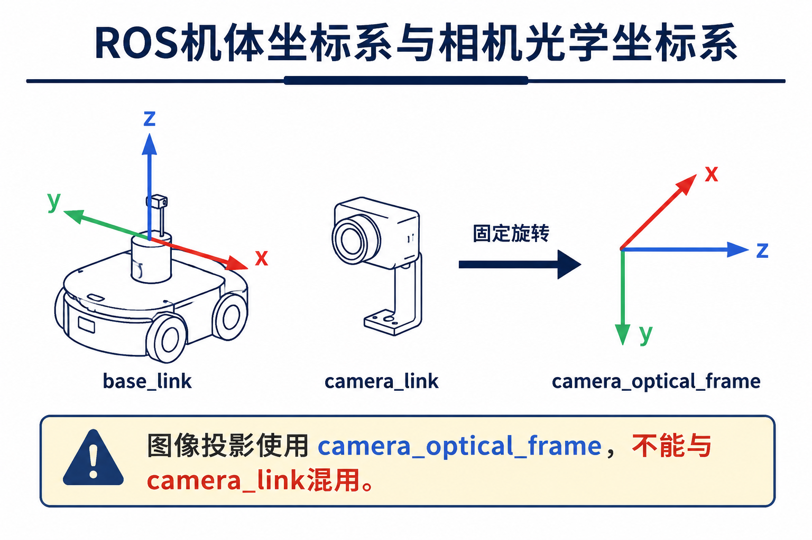

*图 4-18　`base_link` 与 `camera_optical_frame` 使用不同但明确的右手坐标约定。*

`camera_link` 和 `camera_optical_frame` 不能混用。图像投影通常基于 optical frame，而 URDF 安装关系可能连接在 camera link 上。

这两个 frame 的区别来自使用目的。`camera_link` 通常方便在机器人 URDF 中描述相机外壳如何安装；`camera_optical_frame` 则遵循图像几何约定，让相机前方对应正 z，图像右方对应正 x，图像下方对应正 y。驱动往往通过一条固定 TF 把两者连接起来。

如果深度反投影得到的是 optical frame 点，却直接套用 `T_base_camera_link`，会少乘这段固定旋转。数值仍是三个浮点数，程序通常不会报错，但空间方向完全错误。因此代码应尽量读取消息自己的 `header.frame_id`，让 TF2 查找完整变换链，而不是把源 frame 名称硬编码为开发者猜测的 frame。

### 4.9.2 常见坐标系

机器人系统中常见的坐标系包括项目或仿真定义的 `world`、REP-105 定义的全局定位坐标系 `map`、连续局部坐标系 `odom`、机器人本体坐标系 `base_link`、机械臂基座 `arm_base`、末端执行器 `tool0/ee_link`、相机安装坐标系 `camera_link`、相机光学坐标系 `camera_optical_frame`、LiDAR 坐标系和物体坐标系。`world` 与 `map` 可能在某些项目中重合，但它们不是 ROS 规范中的天然同义词，必须查看具体系统的 TF 定义。


| 坐标系                 | 主要用途                 | 常见注意事项                                     |
| ---------------------- | ------------------------ | ------------------------------------------------ |
| `world`                | 仿真或项目定义的固定参考 | 含义由具体平台定义，不一定等于`map`              |
| `map`                  | 全局定位和任务规划       | 全局一致性取决于地图与定位系统，重定位时可能跳变 |
| `odom`                 | 连续局部运动和底层控制   | 连续但会长期漂移                                 |
| `base_link`            | 机器人本体参考           | 通常 x 前、y 左、z 上                            |
| `arm_base`             | 机械臂运动学链根节点     | 移动操作机器人中可能不等于`base_link`            |
| `tool0` / `ee_link`    | 末端工具和抓取位姿       | 更换工具后需更新 TCP（工具中心点）/外参          |
| `camera_link`          | 相机外壳安装关系         | 不等同于光学坐标系                               |
| `camera_optical_frame` | 图像投影和深度反投影     | 通常 z 前、x 右、y 下                            |
| `lidar_link`           | LiDAR 测量或安装参考     | 轴方向和每点时间需核对                           |
| `imu_link`             | IMU 测量参考             | 安装方向错误会破坏融合                           |
| `object`               | 目标物位姿和抓取偏移     | 原点和轴方向由任务定义                           |

### 4.9.3 位姿表示

- 平移向量：只表达位置；
- 旋转矩阵：无奇异、便于组合，但有 9 个数和正交约束；
- 欧拉角：直观，但旋转顺序易混淆并存在万向节锁；
- 四元数：紧凑、适合插值，但必须归一化，`q` 与 `-q` 表示同一旋转；
- 齐次变换矩阵：统一表达旋转和平移，适合坐标链组合。

ROS `geometry_msgs/Quaternion` 字段顺序是 `x,y,z,w`。不同数学库可能使用 `w,x,y,z`，跨库转换时必须显式检查。

### 4.9.4 点、向量和位姿的变换

点的变换同时受旋转和平移影响：

```math
\bar p_{base}=T_{base\_camera}\bar p_{camera}
```

方向向量只表示方向，不应叠加平移；位姿则通过变换链组合：

```math
v_A=R_{A\_B}v_B
```

```math
T_{base\_object}=T_{base\_camera}T_{camera\_object}
```

矩阵相乘的顺序不能交换。本文约定 `T_A_B` 把 B frame 中的量转换到 A frame；若已知的是反方向变换，必须先求逆。

### 4.9.5 ROS 2 TF 解决什么问题？

TF2（Transform Library 2）是 ROS 2 中管理坐标系关系的工具。它负责描述 frame 之间的关系、查询任意两个连通 frame 的变换、管理静态和动态变换，并让感知、规划和控制模块使用统一的空间表达。

**TF2 的主要职责**

TF2 维护一棵随时间变化的坐标变换树。它提供：

- 静态和动态变换广播；
- 一段时间历史的 transform buffer；
- 任意连通 frame 间的变换查询；
- 在指定测量时刻转换 Point、Pose、Vector 等带 frame 数据。

静态安装外参通常发布到 `/tf_static`，机器人关节运动产生的变换通过 `/tf` 动态发布。不要让多个节点重复发布同一父子 frame 关系。

### 4.9.6 TF 树

TF 以父子关系组织为一棵树。每条边包含 parent frame、child frame、平移、旋转和时间戳。固定安装关系使用 static transform 发布到 `/tf_static`，随关节或机器人运动变化的关系使用 dynamic transform 发布到 `/tf`。transform broadcaster 负责发布，transform listener 和 TF buffer 负责缓存与查询。

一棵合法 TF 树中，每个 child frame 只能有一个直接 parent。树出现断裂、重复父节点或同一关系被多个节点发布时，坐标查询会失败或产生跳变。

### 4.9.7 常见 TF 链路

常见系统可以写成下列连接链。这里的箭头表示 TF 树中的父子连接顺序，不表示代码中矩阵一定按箭头方向直接相乘；实际转换方向仍由 source frame、target frame 和 `T_A_B` 约定决定。

```text
移动机器人：map → odom → base_link → lidar
机械臂视觉抓取：base → camera → object
Eye-in-hand：base → end_effector → camera → object
移动操作机器人：map → odom → base → arm_base → end_effector → camera → object
```

**map、odom 与 base_link**

REP-105 对移动机器人给出的典型链路是：

```text
map → odom → base_link → sensors
```

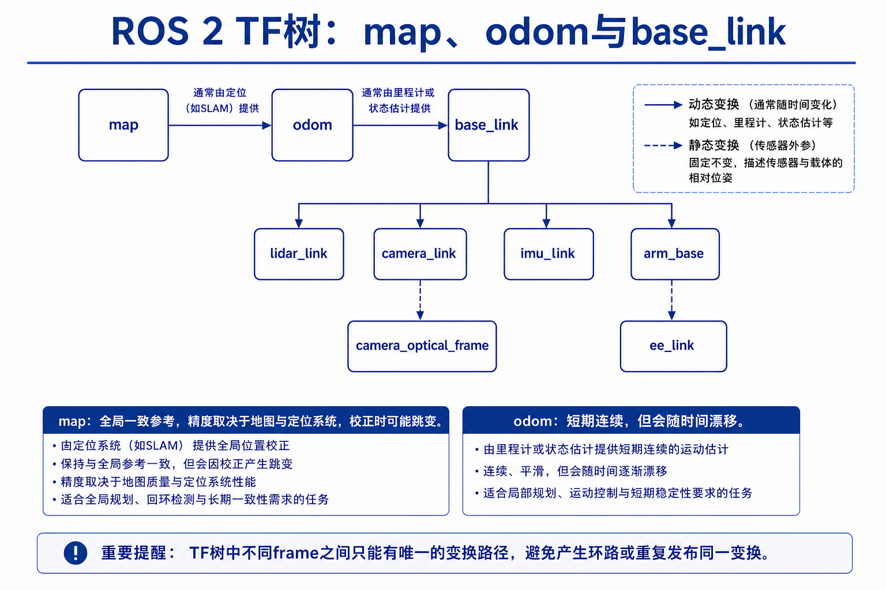

*图 4-19　移动操作机器人常见的 TF 主链、传感器分支和静态/动态变换。*

- `odom` 连续、适合局部控制，但会积累漂移；
- `map` 提供全局一致的参考，但实际精度取决于地图质量和定位算法，重定位或闭环优化时可能跳变；
- `base_link` 固连在机器人本体；
- 局部控制通常依赖连续的 odom，不能直接把 map 跳变引入底层控制。

可以用机器人在走廊行驶的例子理解二者。轮速和 IMU 积分产生 `odom→base_link`，轨迹短时间连续，即使存在缓慢漂移也适合速度控制。定位系统根据地图识别到一个已知位置后，会修正 `map→odom`。这个修正可能使机器人在 map 中的位置瞬间变化，但不会破坏 odom 中连续的局部运动。

如果直接让定位节点同时发布 `map→base_link`，底盘里程计又发布 `odom→base_link`，TF 树就可能出现多个父节点或重复发布关系。正确的树不仅是命名规范，也是不同时间尺度估计之间的系统接口。

### 4.9.8 TF 常见问题

常见问题包括 frame 名称不一致、TF 树断裂、外参方向写反、static transform 发布错误、dynamic transform 时间戳不同步、base/world/map 混用、查询时间不存在，以及 `camera_link` 与 `camera_optical_frame` 混淆。

**在正确时间查询 TF**

感知数据必须使用它的采集时间查询 TF：

```python
transform = tf_buffer.lookup_transform(
    "base_link",                 # target frame
    msg.header.frame_id,          # source frame
    msg.header.stamp,
)
```

`target=base_link, source=camera_optical_frame` 得到的变换用于把 camera 中的数据转到 base。查询“最新 TF”可能暂时绕过报错，但机器人运动时会把不同时刻的数据错误组合。

TF 查询失败不一定意味着树永久断裂，也可能是数据到达顺序造成的。图像消息先到，而对应时刻的关节状态和动态 TF 稍后才进入 buffer，立即查询会产生 extrapolation 错误。合理做法是使用 TF message filter、短暂等待或按时间组织回调，而不是把时间改成零值查询最新变换。

同时也不能无限等待：控制系统必须设定最大可接受延迟。超过期限后，这条感知结果已经过期，应记录原因并请求重新感知，而不是等到 TF 最终到达后执行一个旧目标。

**TF 排错工具**

建议使用：

- `tf2_echo` 检查指定 frame 对；
- `view_frames` 检查整棵树和更新时间；
- RViz TF 显示检查轴方向；
- `ros2 topic hz/delay` 或自定义日志检查频率和延迟；
- 静态已知点验证变换方向。

建议按固定顺序排查：先核对 frame 拼写和唯一父节点，再检查变换是否覆盖消息时间戳，随后在 RViz 中检查轴方向和四元数，最后用已知静态点验证完整变换链。这样可以避免同时修改多个 broadcaster 或外参文件。

至此，传感器、时间、坐标、标定和误差链已经闭合，下一节用同一套约定完成仿真与真机 Demo。

---

## 4.10 Demo 设计、作业交付与工程实战建议

### 4.10.1 Demo 目标

```text
选择目标像素
→ 读取邻域有效深度
→ 反投影到 camera optical frame
→ 转换到 base_link
→ 显示点云、坐标轴和目标点
→ 扰动参数并观察误差
→ 通过安全检查后低速到达预目标点
```

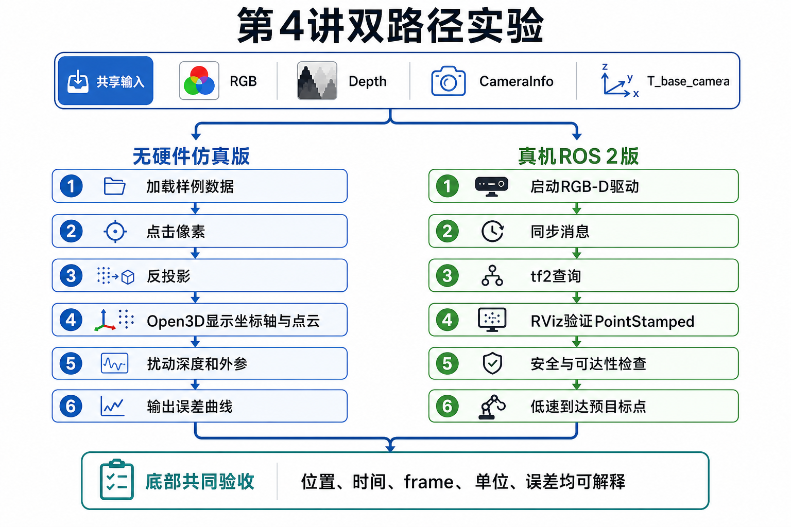

*图 4-20　无硬件仿真与真机 ROS 2 路径共享同一数学和验收标准。*

验收不是“代码不报错”，而是输出的三维点、frame、单位、时间和误差均可解释。

Demo 先运行一次正确结果，再故意把深度毫米值当成米，观察目标点飞到极远位置；恢复深度尺度后，再把 `T_base_camera` 换成逆矩阵，观察目标点落到机器人背后。最后恢复正确外参，并记录每种现象对应的原因。

这组对照把成功结果和失败现象放在同一条链路中，排错时直接检查数值量级、坐标轴方向和数据时间，而不是把所有失败都归结为“模型不准”。

完整代码、样例数据和运行界面由配套 Demo 提供。正文关注输入数据的含义、坐标计算过程、结果验收和失败复盘。

### 4.10.2 有硬件版 Demo

建议设备：SO101 或其他机械臂、RGB-D 相机、ROS 2、RViz/Open3D。

实验步骤：

1. 固定相机和机械臂，设置急停、速度限制和工作空间；
2. 启动 RGB-D 驱动，确认 RGB、Depth、CameraInfo 的 frame 和时间戳；
3. 检查 QoS、话题频率、图像延迟和深度尺度；
4. 确认 RGB-depth 已对齐，或显式执行重投影；
5. 同步 RGB、Depth 和 CameraInfo；
6. 选择像素并计算 `point_camera`；
7. 使用图像时间戳查询 `T_base_camera`；
8. 在 RViz 中显示目标点和坐标轴；
9. 用已知位置标记物验证 base 坐标点；
10. 完成工作空间、关节限位、碰撞和数据新鲜度检查；
11. 默认只可视化；安全检查全部通过后，再低速移动到目标上方安全距离。

观察重点包括目标点是否落在正确物体表面、camera/base 坐标轴方向是否合理、机械臂运动是否平滑，以及误差是否随目标距离或运动速度增大。安全上必须设置急停、速度限制、工作空间、关节限位和碰撞检查；首次运行只发布可视化结果，不发送运动命令。

### 4.10.3 无硬件仿真版 Demo

输入包括样例 RGB、深度图、相机内参 `camera_info.yaml`、虚拟 `T_base_camera`，以及 Open3D 或 pytransform3d 可视化环境。无硬件版本不需要配置真机驱动，直接使用配套的云平台、Notebook、容器镜像或本地样例数据完成同一条计算链路。

实验步骤：

1. 加载 RGB 和 depth，打印尺寸、dtype 和深度范围；
2. 检查内参与当前分辨率一致；
3. 点击目标像素或从命令行输入 `(u,v)`；
4. 在邻域内过滤无效深度并取中位数；
5. 反投影得到 `point_camera`；
6. 设置虚拟外参，用 `T_base_camera` 得到 `point_base`；
7. 使用 Open3D 显示点云、camera/base 坐标轴和目标点；
8. 将深度增加 10 mm，记录目标点变化；
9. 将外参旋转扰动 1°，观察远距离误差放大；
10. 将 `T_base_camera` 换成其逆矩阵，识别典型错误现象；
11. 保存目标点数值、可视化截图和失败现象记录。

### 4.10.4 实验步骤与验收

无论使用仿真还是实体设备，都按同一条主流程完成实验：

1. **确认输入**：检查 RGB、depth、`CameraInfo`、TF 和关节状态是否存在，记录分辨率、编码、单位、频率和时间戳；
2. **选择目标**：点击像素或提供目标 mask，记录目标区域和有效深度比例；
3. **计算三维点**：用邻域中位数或 mask 点云中心代替单个异常像素，得到 `point_camera`；
4. **转换坐标**：在图像采集时刻查询 TF，得到 `point_base`，并在 RViz/Open3D 中显示坐标轴；
5. **验证结果**：用已知标记物、尺子或多个重复位置检查绝对误差和重复性；
6. **扰动参数**：分别改变深度尺度、外参旋转、时间戳和目标像素，观察误差如何传递；
7. **安全执行**：只有在目标有效、数据新鲜、目标可达且无碰撞风险时，才允许机器人低速移动到目标上方。

重点观察三类证据：数值量级是否合理，坐标轴方向是否正确，失败最早出现在哪个环节。不要只记录“成功/失败”，还要保留截图、日志和误差统计。

**Demo 步骤与知识点对应表**


| Demo 步骤    | 对应知识点                           | 验收证据     |
| ------------ | ------------------------------------ | ------------ |
| 检查消息     | encoding、单位、stamp、frame_id、QoS | 终端记录     |
| 深度过滤     | 无效值、邻域鲁棒统计                 | 深度分布图   |
| 反投影       | 内参、针孔模型                       | point_camera |
| camera→base | 坐标变换、外参方向                   | point_base   |
| RViz/Open3D  | TF、坐标轴约定                       | 可视化截图   |
| 参数扰动     | 误差传播                             | 敏感性曲线   |
| 低速到达     | 安全、可达性、数据新鲜度             | 视频和误差表 |

### 4.10.5 常见失败与复盘


| 失败现象                       | 优先检查                         | 复盘问题                                       |
| ------------------------------ | -------------------------------- | ---------------------------------------------- |
| 目标点飞到极远位置             | 深度单位和 scale                 | 毫米是否被当成米？                             |
| 目标点落在机器人背后或地下     | 外参方向、光学坐标轴             | 是否把`T_camera_base` 当成了 `T_base_camera`？ |
| 静止时准确，机器人运动后偏移   | 图像、深度、关节状态和 TF 时间戳 | 使用的数据是否来自同一时刻？                   |
| 方块中心正确，边缘位置误差增大 | RGB-depth 对齐、内参和镜头畸变   | 当前图像是否匹配这组内参？                     |
| 点位正确但机械臂无法到达       | 工作空间、姿态、碰撞和工具配置   | 问题出在感知结果还是执行条件？                 |

复盘时从最早出现异常的一层开始记录证据：原始图像和深度、`point_camera`、`point_base`、TF 查询结果、规划结果。每次只修改一个因素，再重新运行同一输入进行比较。

### 4.10.6 工程实战建议

- 先检查单位和数值量级，再检查算法；深度、力、角度和速度必须明确单位与缩放因子；
- 先可视化，再控制机器人；确认点云、坐标轴、目标点和末端姿态一致后，才允许低速运动；
- 明确外参方向和命名约定，统一记录 `T_A_B` 的含义、乘法顺序以及输入点所属 frame；
- 不要只使用单个像素深度；对目标邻域做有效性过滤，使用中位数或 mask 点云中心，并记录有效样本数；
- 确认 RGB 与 depth 真正对齐，同时检查图像时间戳、`CameraInfo`、TF 时间和设备时钟；
- 标定后必须在多个未参与求解的位置做独立验证，并报告平均、95% 分位和最大误差；
- 传感器、支架、镜头、分辨率或末端工具发生变化后，应重新标定或执行回归验证；
- 抓不准时按“感知→深度→坐标变换→规划→执行”逐层冻结排查，不要一次修改多个环节；
- 对过期数据、TF 查询失败、目标不可达、碰撞风险和急停状态设置拒绝执行逻辑；
- 记录设备序列号、软件版本、参数文件、时间同步方式和实验输出，使结果能够复现。

### 4.10.7 常见排错 checklist

1. RGB 和 Depth 的尺寸、时间戳、frame 是否匹配？
2. depth 的单位和 scale 是否正确？
3. 当前像素使用 raw 内参还是 rectified 投影矩阵？
4. 图像是否缩放或裁剪过？
5. `(u,v)` 是否被误写为数组的 `(row,column)`？
6. 目标邻域是否有足够有效深度？
7. RGB-depth 是否真正完成对齐？
8. `T_base_camera` 的定义和代码方向是否一致？
9. 输入点属于 `camera_link` 还是 `camera_optical_frame`？
10. 旋转矩阵和四元数是否合法、已归一化？
11. TF 是否在消息时间戳处可用？
12. 多台计算机和传感器是否处于同步时钟？
13. QoS 是否兼容，是否存在缓存和丢帧？
14. 外参文件是否对应当前设备、支架和分辨率？
15. 相机或机械结构是否在标定后移动过？
16. 目标是否位于机械臂可达空间？
17. 末端工具和 URDF 是否匹配？
18. 是否先可视化验证，再允许机器人运动？
19. 数据是否已经过期，系统是否仍在复用旧目标？
20. 失败究竟来自感知、变换、规划还是机械执行？

## 4.11 参考开源项目

### 4.11.1 点云与三维可视化

- [Open3D](https://github.com/isl-org/Open3D)：点云读写、滤波、配准、坐标轴和三维结果可视化；
- [pytransform3d](https://github.com/dfki-ric/pytransform3d)：齐次变换、旋转表示、坐标系关系和轨迹可视化；
- [OpenCV calib3d](https://docs.opencv.org/4.x/d9/d0c/group__calib3d.html)：相机模型、内参标定、立体视觉、PnP 和三维重建基础。

### 4.11.2 ROS 2 与坐标变换

- [ROS 2 examples](https://github.com/ros2/examples)：publisher、subscriber、service 等 ROS 2 基础示例；
- [geometry2 / tf2](https://github.com/ros2/geometry2)：TF 坐标变换的核心实现；
- [ROS 2 tf2 教程](https://docs.ros.org/en/lyrical/Tutorials/Intermediate/Tf2/Introduction-To-Tf2.html)：坐标广播、监听、时间查询和调试；
- [robot_state_publisher](https://github.com/ros/robot_state_publisher)：根据 URDF 和关节状态发布机器人 TF；
- [REP-103](https://www.ros.org/reps/rep-0103.html) 与 [REP-105](https://www.ros.org/reps/rep-0105.html)：ROS 单位、坐标轴以及移动机器人 frame 约定；

### 4.11.3 传感器驱动

- [realsense-ros](https://github.com/IntelRealSense/realsense-ros)：Intel RealSense RGB-D 相机的 ROS 2 驱动和对齐接口；
- [Intel RealSense SDK](https://github.com/IntelRealSense/librealsense)：设备配置、深度尺度、对齐和点云生成；
- [livox_ros_driver2](https://github.com/Livox-SDK/livox_ros_driver2)：Livox 激光雷达驱动；
- [image_transport_plugins](https://github.com/ros-perception/image_transport_plugins)：ROS 图像压缩和传输插件。

### 4.11.4 标定

- [ROS image_pipeline / camera_calibration](https://github.com/ros-perception/image_pipeline)：相机内参标定和图像校正；
- [Kalibr](https://github.com/ethz-asl/kalibr)：相机、IMU 以及 camera-IMU 时空标定；

### 4.11.5 仿真与机器人学习

- [ManiSkill](https://github.com/haosulab/ManiSkill)：机器人操作任务、传感器观测和策略学习仿真平台；
- [Isaac Lab](https://github.com/isaac-sim/IsaacLab)：大规模机器人仿真、传感器建模和强化学习平台。

学习这些项目时，应先复现最小示例，再修改单个参数并记录变化，不要一次把驱动、标定、融合和控制全部替换。开源项目是验证本讲概念的工具，不是跳过时间、坐标、单位和误差检查的捷径。

本仓库统一维护的讲次链接见 [`references/links.md`](../../references/links.md#lecture-04)。
