# 第 5 讲：仿真环境与任务搭建——从真实任务到可复盘闭环
## 1 仿真里的机器人动了，为什么还不算任务搭好

SO-101 在仿真窗口里碰到了目标点，终端也没有报错。任务搭好了吗？

还没有。

我们还不知道目标怎样定义、动作怎样施加、换一个初始姿态是否仍然成功，也无法解释这次运动为什么成功。因为机器人“动起来”只是一个 Demo（演示）；目标明确、条件可控、结果可测、失败可查，才构成一个仿真实验。

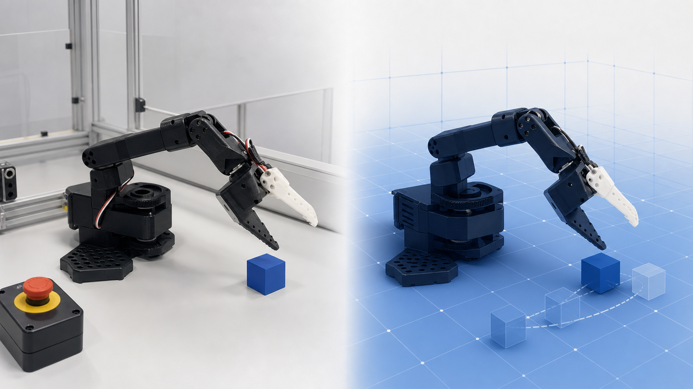

图 5-1　真机试错与仿真实验
### 1.1 仿真最重要的价值，是让问题变得可见

让机械臂抓起方块，或者让人形机器人稳定地向前走，看起来都是一句话就能说明的任务。但直接在真实硬件上探索，会同时遇到四类约束：

- **安全边界有限**：错误的目标、单位或关节映射可能造成碰撞；人形机器人摔倒还会扩大人员与设备风险。
- **复位代价真实存在**：物体要重新摆放，机器人要回到安全姿态，电机与电池状态也会变化。
- **实验条件难以完全重现**：物体位置、表面状态、温度、标定和通信延迟都可能漂移。
- **内部状态不容易完整观察**：真机通常只能记录有限传感器数据，无法直接读取每个接触点、精确质量和状态真值。

仿真并不会自动解决算法问题，却能把这些变量放到一个可控制的实验台上。我们可以固定随机种子（seed），重置到同一初态，只改变摩擦或控制周期；也可以在失败前后检查关节速度、接触力、末端误差和机身姿态。

因此，本讲把仿真理解为一种**实验方法**，而不只是一个三维动画工具：

> 仿真的目标不是替代真机，而是把一次不可解释的运动，变成可控制、可测量、可重复、可复盘的实验。

还要注意，“可重复”通常是指相同条件下能够重现相同趋势和结论，不保证不同电脑上的每一个小数位都完全一致。计算精度、并行顺序、驱动和硬件都可能带来很小的数值差异。

### 1.2 两类贯穿任务与一条学习路线

为了让问题具体下来，本讲用两类任务贯穿：**机械臂操作**和 **G1 locomotion（移动控制）**。

机械臂操作是基础主线。本讲以 **SO-101** 为核心机器人，在 MuJoCo 中逐步完成：

```text
position reach
→ 从抓取就绪状态开始的 pick-place
→ 质量、摩擦、目标与控制周期实验
→ Sim2Real 假设审查
```

SO-101 是一个真实的五关节手臂加单关节夹爪系统。选择它，是为了让同一套模型、控制接口和实验记录可以一路延伸到可选的真机对照。

随后，本讲会提到 Isaac Lab 的官方 Franka Reach 与 G1 速度跟踪任务。这里不是另起炉灶：

- Franka Reach 用来观察标准环境接口和并行评测；
- G1 用来检验同一套任务拆解方法能否迁移到浮动基座、人形结构和持续接触；

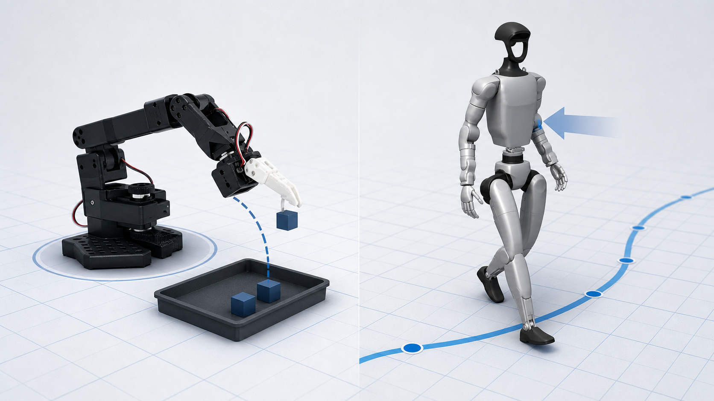

图 5-2　SO-101 操作是核心实验，G1 locomotion 是对同一方法的迁移验证

### 1.3 阅读前提、软件基线与本讲边界

本讲只假定读者能够阅读基础 Python，例如变量、函数、循环和列表。更高阶的三维向量、坐标系、关节角、末端位置、Jacobian（雅可比矩阵）、阻尼最小二乘、reward（奖励）和 termination（终止条件）都会在使用时解释。

如果暂时看不懂公式，可以先读公式前后的输入、输出和物理含义，再回到公式本身。完成基础复现并不要求先掌握完整的动力学推导。

为避免软件更新造成“同一段代码今天能跑、明天找不到接口”，正文锁定以下基线：

| 组件 | 本讲基线 | 用途 |
|---|---|---|
| Python（MuJoCo） | ≥ 3.10 | SO-101 核心实验 |
| Python（Isaac Lab） | 3.11 | Isaac Lab 2.3.2 环境 |
| MuJoCo | 3.10.0 | SO-101 核心实验 |
| SO-101 资产 | MuJoCo Menagerie commit `71f066a…` | 官方维护的操作友好 MJCF |
| Isaac Lab | 2.3.2 | 环境接口与并行评测 |
| Isaac Sim | 5.1.0 | Isaac Lab 2.3.2 的对应基线 |
| Isaac Lab commit | `37ddf62…` | 固定官方配置与图片 |

核验日期为 **2026-07-25**。稳定概念不依赖这些版本号，但命令、配置文件路径和图片都应按此基线阅读。Isaac Lab 3.0 在本讲核验时仍处于 beta，包含 Python、数据接口和四元数约定等迁移变化，因此不作为本版教材基线。

本讲把实验分成两层：

1. **基础复现**：按第 3 节取得官方 SO-101 资产，把三个代码片段按顺序放入同一文件，运行位置到达闭环并生成 `reach.csv`。这是第一次学习时应优先完成的完整流程。
2. **进阶探索**：在基础结果之上，任选 pick-place、参数扰动、Isaac Lab 并行环境、G1 工况或真机对照。进阶任务用于训练自主分析，不要求所有读者一次做完。

没有运行条件的读者可以使用正文中的基线输出、流程图和记录表走完“任务定义—结果判断—失败复盘”流程；有条件的读者再进行复现和扩展。

## 2 先写任务契约：把真实任务翻译成七个约定

两类任务确定后，下一步不是直接打开 MuJoCo 或 Isaac Lab 跑 Demo，而是先把任务拆成仿真环境中的必要模块。要把一次运动变成实验，不从软件菜单开始，而是先写清任务中的七项约定。

### 2.1 什么是“仿真任务契约”

本讲把以下七项约定统称为**仿真任务契约**：

1. **目标**：机器人究竟要完成什么。
2. **模型**：机器人身体、关节、执行器和传感器是什么。
3. **场景**：世界里有哪些物体、边界和光照。
4. **观测**：控制器或策略能够读取什么信息。
5. **动作**：控制输出以什么物理口径进入机器人。
6. **物理与控制**：世界怎样推进，控制器多久更新一次。
7. **判定**：怎样区分成功、失败、超时和仍在进行。

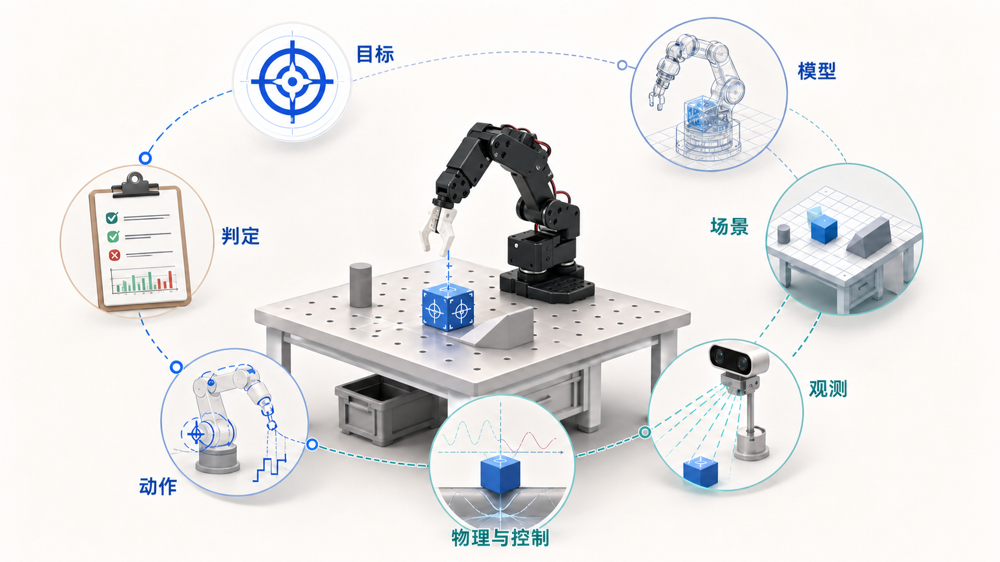
图 5-3　七项任务契约。它不是某个平台的 API，而是一种读任务、写任务和查失败的方法。

“契约”不是法律术语，也不是 MuJoCo 或 Isaac Lab 的类名。它强调的是：代码的每个关键行为都应有明确约定，约定改变时，实验记录也必须改变。

如果只说“让机械臂到达目标”，至少有这些歧义：

- 到达目标**位置**，还是同时对齐目标**姿态**？
- 目标在世界坐标系、基座坐标系，还是相机坐标系？
- 控制器输出关节位置、关节速度、力矩，还是末端位移？
- 到达一次就算成功，还是需要保持若干控制周期？
- 不可达、关节越限和超时分别怎样记录？

把这些问题写清楚，任务才从自然语言变成可执行实验。

### 2.2 先理解 SO-101 的 position reach

本讲的第一个任务只控制末端**位置**，不宣称同时完成任意 6D 位姿控制。这里的 6D 位姿是“三维位置 + 三维朝向”。SO-101 的手臂部分只有五个运动关节，任务中还存在关节限位，因此完整 6D 位姿并非处处可达。

| 契约项 | 本讲 SO-101 reach 的约定 | 代码或资产落点 |
|---|---|---|
| 目标 | `gripperframe` 到达世界坐标下目标位置 | `target` |
| 模型 | Menagerie SO-101；五个手臂关节、一个夹爪关节 | `so101.xml` |
| 场景 | 地面、固定基座机器人、目标 site | `scene.xml` + 运行时 site |
| 观测 | 关节角、关节速度、末端位置 | `qpos`、`qvel`、`site_xpos` |
| 动作 | 位置执行器的关节目标 | `data.ctrl` |
| 物理与控制 | 5 ms 物理步长；20 ms 外层 IK 更新 | `timestep`、`DECIMATION=4` |
| 判定 | 位置误差小于 5 mm，并连续保持 8 个控制周期；5 s 超时 | `move_to()` |

这里的 5 mm 和 8 个周期是**本实验的判据**，不是所有 reach 任务的通用标准。换成更长的机械臂、更嘈杂的观测或不同执行器后，应重新说明阈值依据。

### 2.3 从 reach 到 pick-place：不是只多了一个方块

Reach 只问末端到了没有。方块加入后，位置误差已经不足以定义成功，七项契约中至少五项同时改变：

| 契约项 | Reach | Pick-place 新增内容 |
|---|---|---|
| 场景 | 地面与目标 | 自由方块、支撑面、放置目标 |
| 观测 | 关节与末端 | 方块位姿、夹爪状态、接触 |
| 动作 | 手臂关节目标 | 增加夹爪开合 |
| 物理与控制 | 机器人自身动力学 | 方块质量、双指接触、摩擦、闭合与抬升速度 |
| 判定 | 末端位置误差 | 双侧接触、物体随动、释放、落点与稳定时间 |

一个完整的阶段链是：

```text
预抓取 → 下探 → 闭合 → 确认抓取 → 抬升
→ 搬运 → 下放 → 释放 → 稳定性检查
```

为了把代码控制在一本书可读的体量内，本讲的 pick-place 使用官方 `scene_box.xml` 中的 `pickup` 关键帧，从“抓取就绪”开始，重点隔离接触、抬升、搬运、下降和释放。抓取前的空间到达能力已经在 reach 实验中单独验证。这样的拆分不是逃避任务，而是遵守单变量实验原则：先验证手臂能到，再验证接触链是否成立。

### 2.4 任务契约决定工具，而不是工具决定任务

同一份任务契约可以落到不同平台：

- MuJoCo 让我们直接看见模型、接触、执行器和逐步控制；
- Isaac Lab 把场景、观测、动作、指令、奖励与终止组织成可复用环境，并支持批量推进；
- 真机实验则要求把仿真中的真值观测和理想执行器换成真实感知、通信和安全接口。

因此，平台不是七项契约中的第八项。平台是实现契约的工具。先写契约，可以避免“因为某个 Demo 恰好这么写，所以我的任务也只能这么定义”的倒置。

> **契约回看**
> 在继续之前，应能回答：SO-101 reach 的目标坐标系是什么？策略或控制器下发的是末端位置还是关节位置？物理步长与控制周期是否相同？一次小于阈值为什么还不能马上宣布成功？

## 3 在 MuJoCo 中第一次兑现契约：SO-101

七项约定明确以后，下一步才是平台选择。本讲同时使用 MuJoCo 和 Isaac Lab，不是重复做同一件事：MuJoCo 先帮助我们看清单个任务的模型、控制和物理；Isaac Lab 随后把同样的问题组织成可批量运行的机器人学习环境。

平台分工清楚后，先从 MuJoCo 开始。任务契约告诉我们必须说明什么；MuJoCo 接下来告诉我们，这些说明分别落在模型文件和控制循环的哪里。

### 3.1 为什么从 MuJoCo 和 SO-101 开始

MuJoCo 的原生引擎提供 C API，并有官方 Python 绑定。它可以在不依赖 GPU 的情况下运行本讲的机械臂实验。MJCF（MuJoCo 的 XML 模型格式）把机器人连杆、关节、惯量、碰撞几何和执行器写在可读文本中，初学者可以直接查到“机器人由什么组成、动作写到哪里”。

本讲不使用虚构的 `robot_arm.xml`，也不把任意社区模型称为官方资产。核心实验采用 **MuJoCo Menagerie 的 `robotstudio_so101`**：


图 5-4　MuJoCo 中的 SO-101。来源：Google DeepMind MuJoCo Menagerie，commit `71f066a…`，Apache License 2.0。

Menagerie 版本源自 TheRobotStudio 的 SO-101，并为仿真操作补充了简化碰撞体、夹爪接触参数和带方块的 `scene_box.xml`。这使它比仅有视觉网格的模型更适合接触实验。

软件与资产取得命令如下：

```bash
python -m pip install "mujoco==3.10.0"

git clone --filter=blob:none --sparse --no-checkout \
  https://github.com/google-deepmind/mujoco_menagerie.git

git -C mujoco_menagerie sparse-checkout set robotstudio_so101
git -C mujoco_menagerie checkout \
  71f066ad0be9cd271f7ed58c030243ef157af9f4
```

先只查看官方场景：

```bash
python -m mujoco.viewer \
  --mjcf=mujoco_menagerie/robotstudio_so101/scene.xml
```

目录中与本讲有关的文件是：

| 文件 | 作用 |
|---|---|
| `so101.xml` | 机器人本体、关节、碰撞体与位置执行器 |
| `scene.xml` | 地面与基础灯光，用于 reach |
| `scene_box.xml` | 自由方块和 `pickup` 关键帧，用于 pick-place |
| `assets/*.stl` | 视觉与碰撞网格 |
| `LICENSE` | 模型目录的 Apache-2.0 许可证 |

### 3.2 七项契约分别写在 MJCF 和 Python 的哪里

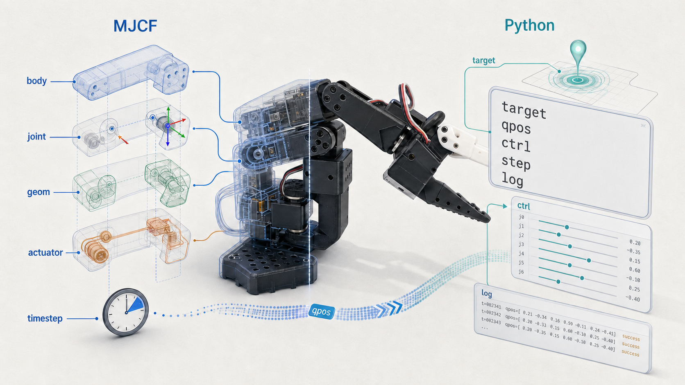

图 5-5　MJCF 负责描述世界与执行器，Python 负责目标、闭环、时序、判定和记录。

读 MJCF 时，不必先背完全部 XML 标签。可以沿着任务契约问六个问题：

| 要回答的问题 | MJCF / Python 落点 |
|---|---|
| 机器人由什么组成 | `body`、`joint`、`geom`、`inertial` |
| 世界里有什么 | `worldbody`、自由物体的 `freejoint` |
| 怎样读取末端和传感器 | `site`、`sensor`、`qpos`、`qvel` |
| 怎样施加动作 | `actuator`、`data.ctrl` |
| 物理规则是什么 | `option/timestep`、`friction`、`damping`、接触求解参数 |
| 怎样判定结果 | Python 中的误差、保持时间、超时和安全检查 |

#### `body`、`joint` 与运动学树

`body` 表示刚体连杆，嵌套关系形成运动学树。`joint` 定义子 body 相对父 body 可以怎样运动。常见类型包括：

- `hinge`：单轴转动；
- `slide`：单轴平移；
- `ball`：三自由度旋转；
- `free`：三维平移加三维旋转，常用于浮动基座或自由物体。

SO-101 的手臂关节名是：

```text
shoulder_pan
shoulder_lift
elbow_flex
wrist_flex
wrist_roll
```

另有 `gripper` 夹爪关节。名称是代码与资产之间的接口，程序启动时应显式检查，而不是假定“前五个关节一定是手臂”。

#### `geom`：视觉几何不等于碰撞几何

`geom` 可以参与渲染、碰撞或两者兼有。高精度视觉网格用于“看起来像”，简化盒体、胶囊体或凸包用于“算得稳定”。两类几何若不分离，接触计算会变慢，也可能因为细小网格缺陷产生异常接触。

MuJoCo 中 `friction="a b c"` 的三个值依次表示：

1. sliding friction；
2. torsional friction；
3. rolling friction。

它们不是“静摩擦、动摩擦、另一个方向摩擦”。接触两侧的参数还会按 `priority`、`solmix` 等规则合并，因此只改方块自身的摩擦，并不保证夹爪—方块接触使用该数值。Menagerie 的夹爪碰撞体设置了更高优先级；做“夹爪变滑”实验时，应修改相应夹爪碰撞体，而不是只改方块。

#### `site`：没有质量，却可以参与计算

`site` 是附着在 body 上的参考坐标系或小几何标记。它自身没有质量，也不直接充当碰撞体，但可以被 Jacobian、传感器、执行器、肌腱或约束引用。因此，准确的说法不是“site 不参与物理计算”，而是：

> site 不贡献刚体质量和碰撞几何，但可以作为物理与控制计算的参考对象。

本讲用 `gripperframe` 读取末端位置并计算 Jacobian。

#### `actuator`：先认清控制输入的物理口径

Menagerie SO-101 使用 `<position>` 执行器。`data.ctrl` 中写入的是**目标关节位置**，内部位置反馈计算实际作用力。

需要区分：

- `ctrlrange`：控制输入允许范围；对本模型而言是目标关节位置范围；
- `forcerange`：执行器输出力的限制；
- `gear`：执行器与关节之间的传动映射。

所以，不能把任意 `<motor ctrlrange>` 直接解释成“关节力矩上限”，也不能把仿真中的夹爪弧度指令原样发送到真机。TheRobotStudio 的真机控制栈还涉及 0–100 的线性夹爪标定，两侧接口需要显式换算。

#### 接触不是一个“弹性系数”就能说明

MuJoCo 通过约束求解处理接触，`solref` 和 `solimp` 等参数控制软约束的时间尺度、阻尼和阻抗形状。它不是一个只有恢复系数的刚体碰撞模型。本讲不要求读者立即调这些高级参数，但要求在接触弹飞或穿透时，知道问题可能位于求解参数、闭合速度、几何和 timestep 的组合，而不只是一项“摩擦系数”。

### 3.3 SO-101 position reach：把闭环真正跑起来

目标位置不会自动变成电机动作。每个控制周期需要完成：

```text
读取末端位置
→ 计算位置误差
→ 计算末端位置 Jacobian
→ 用阻尼最小二乘求关节增量
→ 限幅并写入位置执行器
→ 推进若干物理步
→ 再读新状态
```

位置 Jacobian \(J\) 描述“小关节变化如何造成小末端位置变化”：

$$
\Delta x \approx J(q)\Delta q
$$

当机器人接近奇异姿态时，直接求逆容易放大数值误差。本讲采用阻尼最小二乘：

$$
\Delta q =
J^\top
\left(JJ^\top+\lambda^2 I\right)^{-1}
\Delta x
$$

其中 $\lambda$ 是阻尼系数。本讲只控制三维位置，因此 J 取位置 Jacobian 的三行；关节增量还要限幅，避免一次控制更新跨得过大。

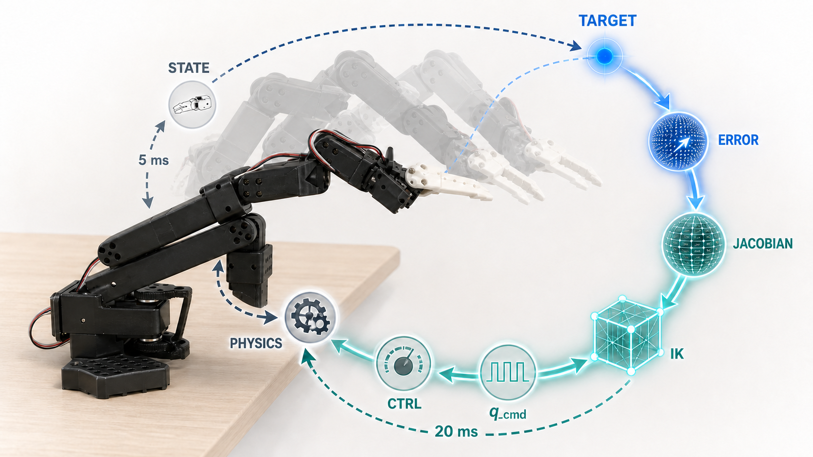
图 5-6　SO-101 position reach 闭环。目标、控制更新与物理步进是不同层次。

第一次复现不需要先加入图形界面、复杂命令行参数或完整 pick-place 调度。这些附加功能会让实现细节遮住本节真正要观察的三件事：

1. 模型中的关节、末端 site 与执行器怎样映射到 Python；
2. 末端误差怎样经过阻尼最小二乘变成关节位置目标；
3. 控制更新、物理步进与连续保持判定怎样组成闭环。

以下三个片段按顺序构成可运行的最小 reach 闭环。它们保留关键计算和证据，不承担一个通用应用程序的全部工程职责。

#### 片段一：加载模型并固定接口

先把资产路径、关节名称和两个时钟写成显式常量。目标 site 在运行时加入，不修改官方 XML。

~~~python
from pathlib import Path
import csv

import mujoco
import numpy as np


MODEL_ROOT = Path("mujoco_menagerie/robotstudio_so101")
ARM_JOINTS = [
    "shoulder_pan",
    "shoulder_lift",
    "elbow_flex",
    "wrist_flex",
    "wrist_roll",
]
GRIPPER = "gripper"
EE_SITE = "gripperframe"
PHYSICS_DT = 0.005
CONTROL_DT = 0.020
DECIMATION = round(CONTROL_DT / PHYSICS_DT)


def load_model(target: np.ndarray) -> mujoco.MjModel:
    scene = MODEL_ROOT / "scene.xml"
    if not scene.exists():
        raise FileNotFoundError(scene)

    spec = mujoco.MjSpec.from_file(str(scene))
    spec.worldbody.add_site(
        name="book_target",
        type=mujoco.mjtGeom.mjGEOM_SPHERE,
        pos=target,
        size=[0.012, 0.012, 0.012],
        rgba=[0.10, 0.75, 0.95, 0.9],
    )
    model = spec.compile()
    if not np.isclose(model.opt.timestep, PHYSICS_DT):
        raise ValueError(
            f"Expected timestep {PHYSICS_DT}, "
            f"got {model.opt.timestep}"
        )
    return model
~~~

这里故意按名称查找接口，而不是假定“前五个关节”或“前五个执行器”恰好属于手臂。资产版本一旦改变，名称检查能更早暴露不兼容。

#### 片段二：从末端误差得到关节位置目标

控制器只负责一次外层 IK 更新。它不推进物理，也不负责宣布任务成功。

~~~python
class ReachController:
    def __init__(
        self,
        model: mujoco.MjModel,
        data: mujoco.MjData,
    ):
        self.model = model
        self.data = data
        self.site_id = model.site(EE_SITE).id
        self.joint_ids = np.array(
            [model.joint(name).id for name in ARM_JOINTS]
        )
        self.qpos_ids = model.jnt_qposadr[self.joint_ids]
        self.dof_ids = model.jnt_dofadr[self.joint_ids]
        self.act_ids = np.array(
            [model.actuator(name).id for name in ARM_JOINTS]
        )
        self.gripper_id = model.actuator(GRIPPER).id
        self.jacp = np.zeros((3, model.nv))
        self.jacr = np.zeros((3, model.nv))

    def command(
        self,
        target: np.ndarray,
        damping: float = 0.02,
    ) -> float:
        error = target - self.data.site_xpos[self.site_id]
        mujoco.mj_jacSite(
            self.model,
            self.data,
            self.jacp,
            self.jacr,
            self.site_id,
        )
        J = self.jacp[:, self.dof_ids]
        dq = J.T @ np.linalg.solve(
            J @ J.T + damping**2 * np.eye(3),
            0.5 * error,
        )

        norm = np.linalg.norm(dq)
        if norm > 0.04:
            dq *= 0.04 / norm

        q_cmd = self.data.qpos[self.qpos_ids] + dq
        low, high = self.model.actuator_ctrlrange[
            self.act_ids
        ].T
        self.data.ctrl[self.act_ids] = np.clip(
            q_cmd, low, high
        )
        return float(np.linalg.norm(error))
~~~

这一片段对应图 5-6 的 target → error → Jacobian → IK → 关节目标。0.5 是外层 IK 步长增益，0.04 rad 是单次更新限幅；它们都不是 MJCF 位置执行器的比例增益。

#### 片段三：用两个时钟推进，并留下判定证据

外层控制每 20 ms 更新一次，物理世界仍按 5 ms 推进。成功要求误差连续 8 个控制周期低于阈值，而不是某一帧偶然进入目标球。

~~~python
def move_to(
    controller: ReachController,
    target: np.ndarray,
    tolerance: float = 0.005,
    timeout_s: float = 5.0,
) -> tuple[bool, list[list[float]]]:
    model, data = controller.model, controller.data
    consecutive = 0
    error = float("inf")
    records: list[list[float]] = []

    for step in range(int(timeout_s / PHYSICS_DT)):
        if step % DECIMATION == 0:
            error = controller.command(target)
            consecutive = (
                consecutive + 1 if error < tolerance else 0
            )

        mujoco.mj_step(model, data)
        ee = data.site(EE_SITE).xpos.copy()
        records.append(
            [float(data.time), *ee.tolist(), error]
        )

        if consecutive >= 8:
            return True, records

    return False, records


target = np.array([0.30, 0.10, 0.20])
model = load_model(target)
data = mujoco.MjData(model)
mujoco.mj_forward(model, data)
controller = ReachController(model, data)

success, records = move_to(controller, target)
with Path("reach.csv").open(
    "w", newline="", encoding="utf-8"
) as file:
    writer = csv.writer(file)
    writer.writerow(["time_s", "ee_x", "ee_y", "ee_z", "error_m"])
    writer.writerows(records)

final_error = np.linalg.norm(
    target - data.site(EE_SITE).xpos
)
print(
    f"reach success={success}, "
    f"final_error={final_error:.4f} m"
)
~~~

这三个片段没有实现 viewer、命令行参数和通用任务框架，但已经完整展示本讲要讨论的关键闭环。运行时，将 MODEL_ROOT 改为本机 Menagerie SO-101 目录即可。MuJoCo 的被动 viewer、实时墙钟节流和 pick-place 阶段调度属于应用层职责，不再整段占用正文。

本书在固定版本、默认初态和无界面模式下核验得到：

~~~text
reach success=True, final_error=0.0005 m
~~~

这是本次基线验证结果，不是跨操作系统、资产版本或参数改动的性能保证。读者应保留自己的 CSV、版本号和运行条件。

#### 第一次完整复现的五个步骤

1. 按 3.1 节安装 MuJoCo，并检出固定版本的 Menagerie SO-101 资产；
2. 在 `mujoco_menagerie` 同级目录新建 `reach.py`，依次粘贴片段一、二、三；
3. 确认 `MODEL_ROOT` 指向本机的 `robotstudio_so101` 目录；
4. 运行 `python reach.py`，检查终端是否输出 `reach success=True`；
5. 打开 `reach.csv`，确认包含时间、末端位置和误差，并把软件版本、目标位置与最终误差写入实验记录表。

如果运行失败，先按顺序检查：文件路径是否正确、MuJoCo 版本是否一致、资产提交是否一致、关节和 site 名称是否存在。不要一开始就同时修改控制器和模型参数。

### 3.4 拿着契约检查这次 reach

现在逐项回看，代码中没有“魔法地带”：

| 契约项 | 实际落点 | 容易犯的错 |
|---|---|---|
| 目标 | `target = [0.30, 0.10, 0.20]` | 忘记说明世界坐标系与单位 |
| 模型 | 固定 commit 的 `scene.xml` | 用不存在的关节或 site 名 |
| 场景 | 地面、机器人、运行时目标 site | 把视觉标记误当碰撞物 |
| 观测 | `site_xpos`、`qpos` | 保存视图而不 `.copy()`，历史值被覆盖 |
| 动作 | 关节位置目标写入 `data.ctrl` | 把 IK 增量直接当力矩 |
| 物理与控制 | 5 ms 物理步；每 4 步更新 IK | 改了循环 sleep 却以为改了物理 |
| 判定 | 误差连续 8 次达标；超时 5 s | 只看某一帧或只看视频 |

`ReachController.command()` 中的 0.5 是外层 IK 步长增益，不是 MJCF 位置执行器的 `kp`。前者决定每次目标关节位置走多远，后者决定位置执行器如何产生作用力；二者混为一谈会导致错误调参。

还要注意不可达目标。阻尼 IK 可以给出“减小当前误差”的方向，却不保证任意目标都可达。遇到超时时，应同时检查：

- 目标是否超出工作空间；
- 关节是否已被 `ctrlrange` 限幅；
- Jacobian 是否接近奇异；
- 当前初态是否把机械臂带入局部困难区域。

### 3.5 从 reach 到 pick-place：接触必须用证据确认

Pick-place 的阶段判定不能把“接触数大于等于 2”当作抓稳。两个 contact 可能都来自同一根夹指，也可能只是短暂碰撞。

本讲至少使用四类证据：

1. 方块分别与固定指、活动指接触；
2. `mj_contactForce()` 读到两侧法向接触力；
3. 抬升后方块高度确实增加；
4. 方块相对夹爪的位置没有出现明显漂移。

最终放置还要检查：

- 方块已离开夹爪；
- 平面位置误差小于本实验阈值；
- 方块高度接近支撑面；
- 等待稳定后线速度足够小。

这些条件共同回答“抓起—搬运—释放—稳定”是否发生，而不是只回答“夹爪附近出现过碰撞”。

### 3.6 看症状找断点

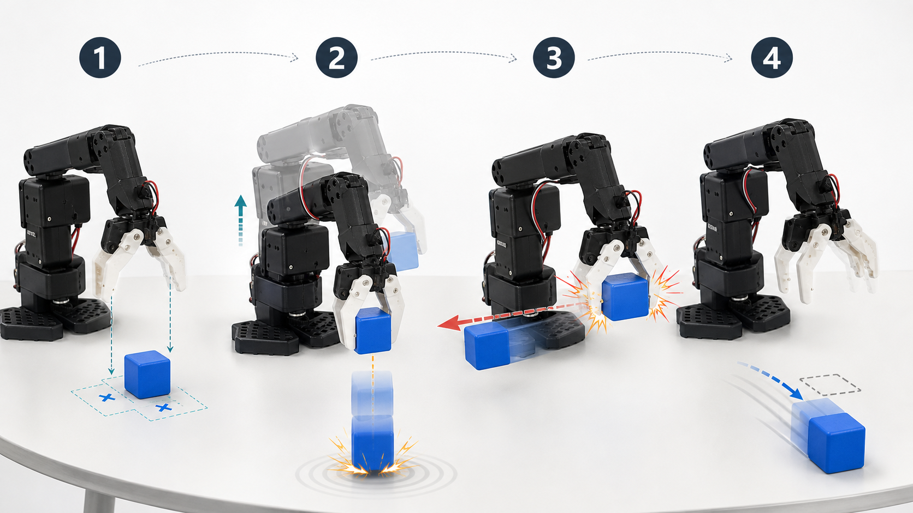

图 5-7　四类外观相近、机制不同的 pick-place 失败。

| 症状 | 优先检查的契约项 | 最小验证实验 |
|---|---|---|
| 末端不动 | 动作、actuator、控制周期 | 打印 `data.ctrl` 与关节响应 |
| 末端振荡 | 外层 IK 步长、执行器、timestep | 只降低 IK 增量上限 |
| 双指闭合却没抓住 | 预抓取位姿、碰撞几何、双侧接触 | 按 geom 身份分别统计接触 |
| 抬升时滑落 | 摩擦、法向力、物体质量、抬升加速度 | 固定其他项，只降低抬升速度 |
| 接触瞬间被弹走 | 闭合速度、几何穿插、接触求解参数 | 固定其他项，只延长闭合时间 |
| 释放后继续滑 | 桌面接触、释放高度、剩余速度 | 记录释放瞬间速度与最终稳定速度 |

“振荡”也不能只归因于比例增益。它可能来自外层 IK 更新过大、内层位置执行器过硬、控制更新过慢、模型阻尼不足或接触切换。一次只改一个变量，才能让结论可证伪。

### 3.7 四个单变量实验

每个实验都按同一格式记录：

```text
固定基线
→ 写下单一改动
→ 运行前预测
→ 选择指标
→ 重复运行
→ 判断观察是否支持预测
```

#### 实验一：目标位置与工作空间

- **基线**：`[0.30, 0.10, 0.20]`。
- **改动**：每次只改变 \(x\)、\(y\) 或 \(z\) 中一项。
- **预测**：越接近关节限位或奇异姿态，收敛时间可能增加；超出工作空间时会超时或停在最近状态。
- **指标**：最终误差、达到阈值所需时间、是否触发限幅、最小奇异值。

不要只记录“到/没到”。不可达实验的价值正在于观察误差从何时不再下降。

#### 实验二：方块质量

- **基线**：保留 `scene_box.xml` 默认方块参数。
- **改动**：在 `robotstudio_so101` 目录内复制为 `scene_box_mass.xml`，给方块 geom 显式加入质量，例如 `mass="0.20"`：

```xml
<geom type="box" name="box" size="0.02 0.02 0.03"
      mass="0.20" condim="3" friction="1 .03 .003"
      rgba="0 1 0 1" contype="2" conaffinity="1"
      solref="0.01 1"/>
```

在自己的 pick-place 阶段调度中，将场景文件切换为这个副本即可运行新场景。复制文件应留在同一目录，以便其中的相对 `<include file="so101.xml"/>` 仍能解析。

- **预测**：质量增加会提高抬升和加速阶段的负载，可能扩大相对漂移或导致滑脱。
- **指标**：双侧法向力、抬升高度、方块—末端相对漂移、是否完成放置。

不要先写“质量增加必然抓不住”。位置执行器、夹爪力限幅和接触参数共同决定结果。

#### 实验三：摩擦

先分清要研究哪一个界面：

- 夹爪—方块；
- 方块—桌面；
- 机器人其他几何—环境。

因为接触参数会合并，只修改方块的 `friction` 可能无法改变高优先级夹爪接触。实验应检查实际接触 pair 和参数来源，必要时复制资产后修改对应夹爪碰撞类。

指标可以包括：

- 闭合后双侧接触力；
- 抬升阶段相对漂移；
- 释放后滑动距离；
- 重复多次后的成功比例。

#### 实验四：控制周期

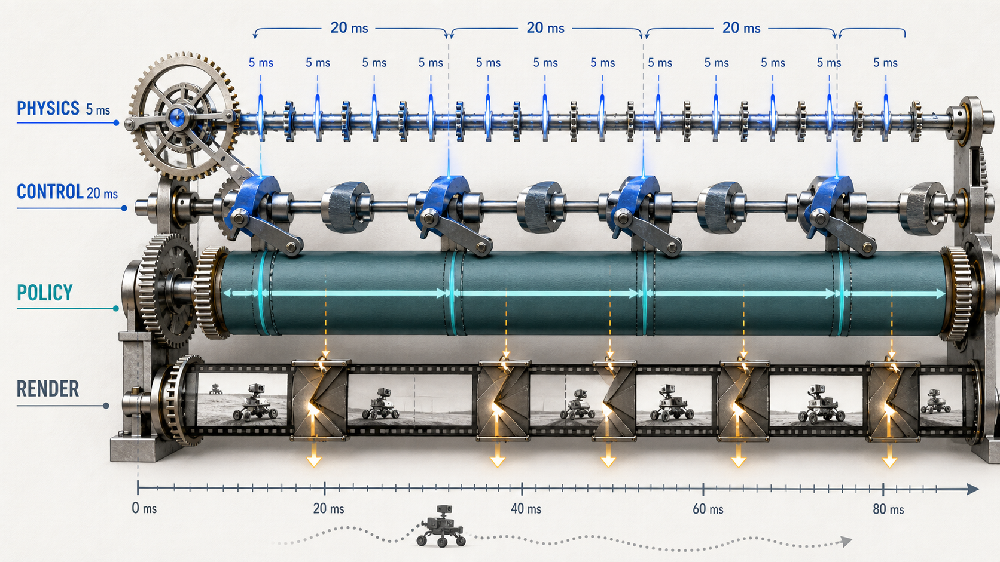

图 5-8　仿真中的四个时钟。只说“频率”不足以复现实验。

本讲基线是：

- physics timestep：5 ms，即 200 Hz；
- 外层 IK control period：20 ms，即 50 Hz；
- decimation：4 个物理步更新一次关节目标；
- render / viewer sync：每个物理步同步，但它可以独立降低。

若要把外层 IK 从 50 Hz 降到 25 Hz，应把 `CONTROL_DT` 改为 0.040，并令 `DECIMATION=8`，不要顺手修改 `model.opt.timestep`。这样才能研究“控制命令保持更久”的影响，而不同时改变物理积分误差。

可记录：

- 末端路径长度；
- 最终误差；
- 最大过冲；
- 控制目标的阶梯变化；
- 模拟时间与墙钟时间。

> **契约回看**
> MuJoCo 部分真正兑现了七项契约：资产来源明确，目标和观测有名字，动作口径与执行器一致，两个时钟被区分，成功与超时有程序化判定，CSV 为结论留下证据。接下来要问的不是“它能不能成功一次”，而是“换一组条件后还能不能成功”。

## 4 从一次运行到一套环境：Isaac Lab

SO-101 reach 已经成功一次。但把目标左移、初始姿态换一组、摩擦降低，它还会成功吗？

只看一段录像无法回答。单次运行只能得到一次成功或失败；**成功率**必须来自多个 episode（从复位到结束的一次回合）、随机种子或初始条件的统计。机器人学习环境要管理的，不再是一条轨迹，而是一组条件分布。

### 4.1 为什么此处换用官方 Franka Reach

Isaac Lab 2.3.2 没有官方 SO-101 资产或任务。如果为了保持机器人名称一致而临时拼出一个 SO-101 工程，读者会得到一套无法向官方文档追溯的接口。

本节因此明确换用官方任务：

```text
Isaac-Reach-Franka-v0
Isaac-Reach-Franka-Play-v0
```

机器人资产改变了，但阅读任务的方法没有变：仍然寻找目标、模型、场景、观测、动作、物理与控制、终止与评测。

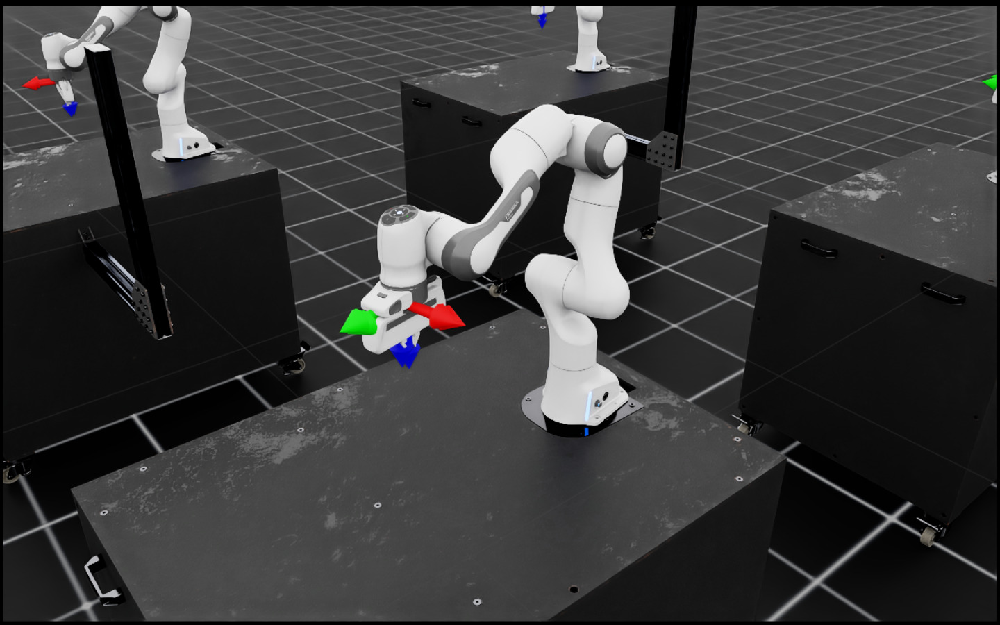

图 5-9　Isaac Lab 官方 Franka Reach。来源：NVIDIA Isaac Lab `v2.3.2`，BSD 3-Clause。

本节采用的环境入口和配置文件是：

| 内容 | Isaac Lab 2.3.2 中的位置 |
|---|---|
| Reach 基础任务 | `manager_based/manipulation/reach/reach_env_cfg.py` |
| Franka 关节位置配置 | `manager_based/manipulation/reach/config/franka/joint_pos_env_cfg.py` |
| 环境注册名 | `Isaac-Reach-Franka-v0` |
| 轻量演示配置 | `Isaac-Reach-Franka-Play-v0` |

Isaac Lab 与 Isaac Sim 的安装牵涉 GPU 驱动、操作系统和包来源，正文不复制一份容易过期的长安装步骤。应按固定版本的[官方安装页](https://isaac-sim.github.io/IsaacLab/v2.3.2/source/setup/installation/index.html)完成安装，再在 Isaac Lab 仓库根目录运行本节命令。

### 4.2 从底层物理步到环境协议

在 MuJoCo 脚本中，我们直接管理：

```text
data.ctrl → mj_step → qpos / site_xpos → success
```

Isaac Lab 则把任务分成两个相互连接的层次：

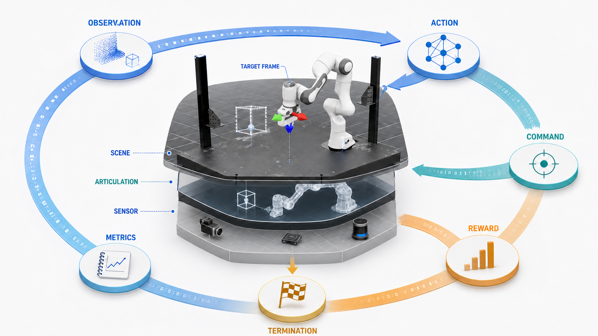{width=96%}

图 5-10　Isaac Lab 把场景、资产和传感器组织到环境协议下。

场景与资产层回答：

- 世界中有哪些 `Asset`；
- 哪些资产是有关节系统的 `Articulation`；
- 传感器、地形、碰撞和复制环境怎样配置。

环境任务层回答：

- Observation：控制器或策略读到什么；
- Action：策略输出怎样映射到执行器；
- Command：当前任务条件是什么；
- Reward：训练时鼓励什么；
- Termination：episode 何时结束；
- Metrics：实验怎样统计。

Isaac Lab 有不同工作流。`ManagerBasedEnv` 面向可组合的 sense-act 环境；`ManagerBasedRLEnv` 在此基础上增加 reward、termination、command 和 curriculum 等强化学习管理器。Direct 工作流则在环境类中更直接地实现这些逻辑。

因此，“所有任务都必须实现五个固定 API”并不准确。上面六项是阅读任务时要寻找的**概念问题**，它们在不同工作流中的代码落点不同。

### 4.3 五个容易混淆的接口问题

#### Observation：真值能否在现实中获得

典型观测包括关节位置、关节速度、末端相对目标的位置以及上一时刻动作。Isaac Lab 的 manager-based 配置通常用：

- `ObservationTermCfg` 描述一项观测；
- `ObservationGroupCfg` 组合一组观测；
- 任务自己的 `ObservationsCfg` 容器组织 policy、critic 等组。

如果 critic 使用额外真值，而部署时 policy 看不到这些信息，应在契约中明确标为 privileged observation。否则读者会误以为真机也能直接读取无噪声的物体位姿和接触真值。

#### Action：归一化值不是执行器单位

策略输出经常位于 \([-1,1]\)，但执行器可能接收关节位置、关节位置增量、速度或力矩。需要沿配置继续追踪：

```text
policy tensor
→ action term
→ scale / offset / joint selection
→ articulation target
→ actuator
```

只看 action 张量的维度，无法知道它的物理含义。

#### Reward：框架组织方式，不是物理引擎专属概念

MuJoCo 完全可以承载强化学习 reward；它只是没有规定任务必须怎样组织。Isaac Lab 的优势是把 reward term、权重和其他任务逻辑放入可组合配置。

Reward 可以稀疏、稠密或混合，不要求连续。一个 reach 训练目标可能同时包含：

- 位置误差项；
- 姿态误差项；
- 动作变化惩罚；
- 关节速度惩罚。

但 reward 高，不自动等于“任务成功”。策略可能利用权重漏洞获得高分，却没有满足真正的交付条件。

#### `terminated` 与 `truncated`

采用 Gymnasium 语义时：

```python
obs, reward, terminated, truncated, info = env.step(action)
done = terminated | truncated
```

- `terminated` 表示到达 MDP 内定义的终态，可能是成功，也可能是失败或摔倒；
- `truncated` 通常表示时间上限等 MDP 外截断。

所以，“terminated 说明策略做了坏事”是错误的。下游只有在需要统一复位信号时才合并二者；学习算法在估计回报时可能需要保留区别。

#### Success predicate 与 evaluation metrics

`success metric` 不是所有 Isaac Lab 环境强制返回的标准字段。它是本讲加入任务契约的评测约定。

例如，本讲可以独立定义 reach 成功：

```text
末端位置误差 < εp，并连续保持 K 个控制周期
```

同时记录连续指标：

- 最终位置误差；
- 达标时间；
- episode 内最小误差；
- 动作平滑度；
- 多初态的成功比例与误差分布。

官方 Franka Reach 2.3.2 配置主要使用 timeout termination，并没有替本书定义上述 success termination。不要把教材判据冒充成官方任务行为。

### 4.4 三种经过核验的运行方式

#### 方式一：检查环境、观测和动作形状

```bash
./isaaclab.sh -p scripts/environments/random_agent.py \
  --task Isaac-Reach-Franka-v0 \
  --num_envs 32
```

随机动作只能证明环境能够创建、step 和 reset，不能证明策略已经学会 reach。运行时重点记录：

- observation 的字典键与张量形状；
- action 维数和范围；
- 环境数量；
- episode 何时被重置；
- 目标怎样随机化。

#### 方式二：观察不依赖 RL 训练的差分 IK

```bash
./isaaclab.sh -p \
  scripts/tutorials/05_controllers/run_diff_ik.py \
  --robot franka_panda \
  --num_envs 128
```

这个脚本适合比较 MuJoCo 中的 Jacobian IK 与 Isaac Lab 控制器接口，但它不是 `Isaac-Reach-Franka-v0` 的 RL reward 示例。两者回答的问题不同，不能互相代替。

#### 方式三：运行官方 RL 训练入口

```bash
./isaaclab.sh -p \
  scripts/reinforcement_learning/rsl_rl/train.py \
  --task Isaac-Reach-Franka-v0 \
  --headless
```

若已经有与当前任务和版本匹配的 checkpoint，可运行：

```bash
./isaaclab.sh -p \
  scripts/reinforcement_learning/rsl_rl/play.py \
  --task Isaac-Reach-Franka-Play-v0 \
  --num_envs 32 \
  --checkpoint /ABSOLUTE/PATH/TO/model.pt
```

官方脚本提供 checkpoint 获取机制，但并非每个任务、每个 runner 都保证存在可下载的预训练权重。正文因此不承诺一个不存在的下载地址。没有 checkpoint 时，方式一和方式二仍然足以完成本节的环境阅读实验。

### 4.5 多环境并行：从 Demo 走向统计实验

并行的价值不只是“更快”。它让初始条件分布成为实验的一部分。

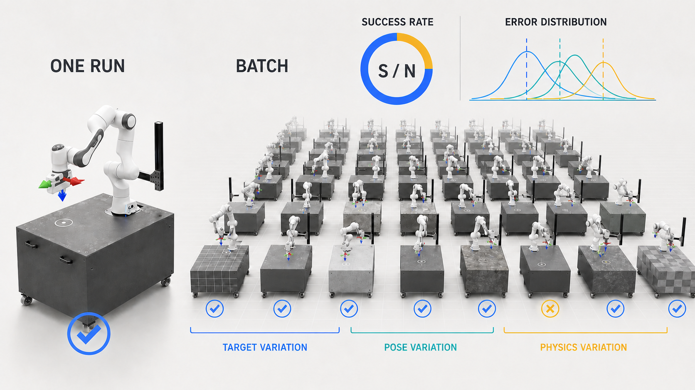
图 5-11　单次运行只回答一次成败；条件矩阵才能形成成功比例和误差分布。图中 S/N 表示成功 episode 数与总 episode 数之比，曲线仅示意统计对象，不代表本讲实测结果。

一个最小评测矩阵可以是：

| 变量 | 档位示例 | 说明 |
|---|---|---|
| 目标偏移 | 左、中、右 | 检查工作空间与方向偏差 |
| 初始关节姿态 | 3 组 | 检查局部收敛与初态敏感性 |
| 摩擦或模型参数 | 低、基线、高 | 检查物理鲁棒性 |
| 随机种子 | 每个组合多个 | 区分偶然结果与稳定趋势 |

每个环境维护独立物理状态，策略一次处理一个 batch 的观测并输出一批动作。并行可以提高数据收集吞吐并缩短墙钟时间，但可并行数量取决于 GPU、传感器、场景复杂度、物理设置和显存。它不会神奇地减少算法在统计意义上需要的数据量。

报告至少应给出：

- 环境数量和硬件；
- 每个条件运行的 episode 数；
- 成功比例及置信或离散程度；
- 误差均值、标准差与分布；
- 失败最集中的条件组合。

### 4.6 平台生态：从任务需求反推工具

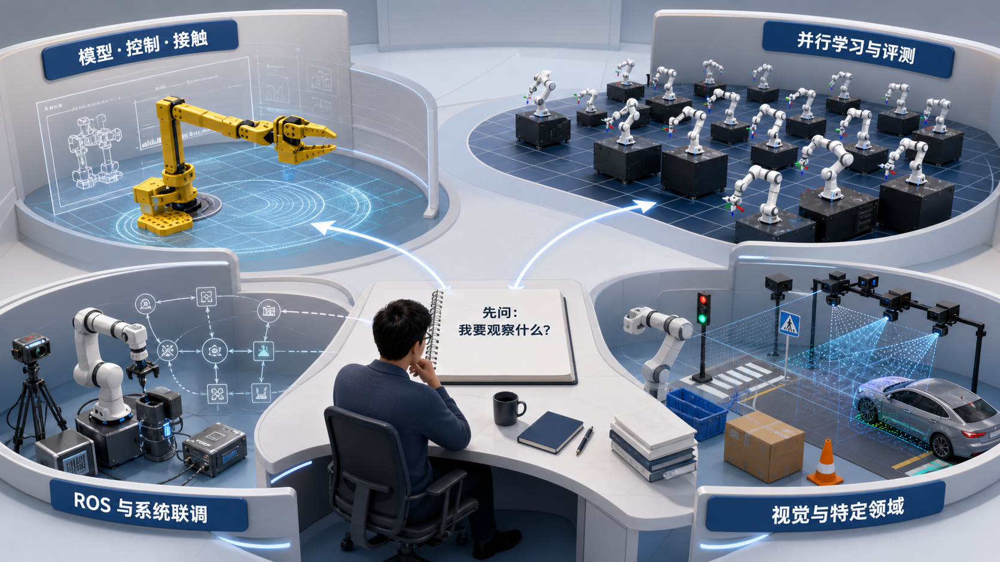

图 5-12　平台不是排名题，同一项目也可能在不同阶段组合使用多个工具。

理解 MuJoCo 与 Isaac Lab 的分工后，读者自然会问：仿真生态中还有哪些工具？下面的表不是软件排行榜，而是一张“任务需求—候选工具”索引。第一次学习只需知道类别和定位，不必逐个平台安装。

下面的全景表保留常见平台，但不把快速变化的性能数字写成永久结论：

| 需求 | 可关注的平台 | 典型理由 |
|---|---|---|
| 轻量多体、控制与接触原型 | MuJoCo、PyBullet | Python 接口直接，适合快速读模型和改参数 |
| 控制、优化与系统分析 | Drake | 强调多体系统、控制与数学规划 |
| 颗粒、车辆与复杂多体 | Project Chrono | 面向车辆、颗粒和特殊动力学问题 |
| ROS 2 与系统联调 | Gazebo | 传感器、机器人中间件和系统集成 |
| 图形界面教学与多机器人 | Webots、CoppeliaSim | 交互式场景和多种控制接口 |
| GPU 并行学习 | Isaac Lab、Genesis、Brax | 批量环境、张量计算或自动微分路线 |
| 操作任务与 benchmark | SAPIEN、ManiSkill、robosuite | 机械臂、物体交互和标准任务 |
| 自动驾驶 | CARLA | 道路、交通、车辆与传感器场景 |
| 高保真视觉或游戏引擎工作流 | Unity + ML-Agents、Unreal Engine | 渲染、交互场景与视觉感知 |
| 无人机/车辆的经典 Unreal 仿真 | AirSim | 使用前应核验当前维护状态与替代项目 |
| 新兴可微分物理 | Newton 等 | API 和成熟度变化快，宜先看官方版本状态 |

选择时依次问：

1. 任务的主要不确定性在接触、视觉、控制，还是大规模采样？
2. 是否必须接入 ROS、特定传感器或现有资产格式？
3. 需要单次可解释调试，还是批量训练与统计？
4. 团队能否长期维护该平台的驱动、资产与版本？

平台的宣传性能只能在明确硬件、模型、传感器和 solver 配置下比较。脱离条件的 FPS、环境数量和“训练加速倍数”不适合作为教材中的通用定律。

> **契约回看**
> Isaac Lab 改变了环境组织和实验规模，没有改变七项契约。Franka 替换了 SO-101 资产，但目标、观测、动作、时钟和评测仍然可以逐项定位。现在把固定基座机械臂换成人形机器人，检验这套方法是否还能成立。

## 5 换成 G1：任务契约经得住人形机器人吗

前面的机械臂任务主要围绕末端和物体：末端到哪里、夹爪是否接触、物体是否被稳定放下。接下来换成 G1，人形机器人任务要处理的是全身姿态、速度指令和平衡。

固定基座机械臂的受控关节相对明确，末端运动不会带着基座一起移动。G1 则有浮动基座，也就是机身没有被固定在世界中的某个位置；它还有二十余个或更多可控关节，具体数量取决于资产和手部配置。两只脚需要持续建立、切换和失去接触。

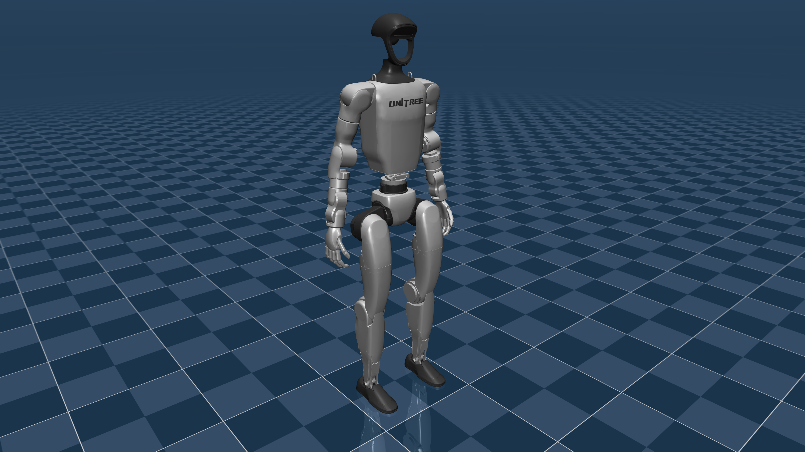

图 5-13　Unitree G1 仿真资产。来源：Unitree Robotics / MuJoCo Menagerie，commit `71f066a…`，BSD 3-Clause。

### 5.1 先纠正一个接口混淆：command 不是 action

速度跟踪任务常写用户指令：

$$
c_t = \left(v_x^{\ast},\,v_y^{\ast},\,\omega_z^{\ast}\right)
$$

这里的 $c_t$ 是**任务条件或用户意图**，不是策略直接施加到关节的动作。完整链条是：

```text
速度指令 command
→ 与机器人状态一起进入策略
→ 策略输出 action
→ action 经过缩放与偏置
→ 形成关节目标或力矩
→ 执行器作用于机器人
```

三种量必须在记录表中分开：

| 层次 | 示例 | 物理含义 |
|---|---|---|
| Command | 目标前进速度、横向速度、yaw 角速度 | 任务希望机器人怎样移动 |
| Policy action | 关节位置偏移向量 | 策略决定身体怎样动作 |
| Actuator input | 实际关节位置目标或力矩 | 底层执行器接收到的量 |

把 base velocity command 写成 action，会掩盖策略和执行器之间最关键的一层。

### 5.2 固定基座与浮动基座的契约差分

| 契约项 | SO-101 | G1 速度跟踪 |
|---|---|---|
| 目标 | 末端到达、物体放置 | 跟踪平面线速度与 yaw 角速度 |
| 模型 | 固定基座，五个手臂关节加夹爪 | 浮动 base、全身关节、双足 |
| 场景 | 地面、方块、目标 | 平地或地形、重力、扰动 |
| 观测 | 关节、末端、物体、接触 | base 速度/姿态、关节、重力投影、指令、足底接触 |
| 动作 | 关节位置目标 | 策略输出的全身关节目标或力矩 |
| 物理与控制 | 抓取接触与阶段切换 | 持续足地接触、浮动基座与全身耦合 |
| 判定 | reach / place 成功 | 速度误差、存活、摔倒、足滑与恢复 |

“机械臂完全驱动”只适用于本讲这种固定基座、受控关节的语境。G1 的 base 没有一个直接把它钉到目标位置的执行器；它必须通过关节动作和地面接触产生整体运动。

### 5.3 官方 G1 任务与运行边界

Isaac Lab 2.3.2 注册了：

```text
Isaac-Velocity-Flat-G1-v0
Isaac-Velocity-Flat-G1-Play-v0
Isaac-Velocity-Rough-G1-v0
Isaac-Velocity-Rough-G1-Play-v0
```

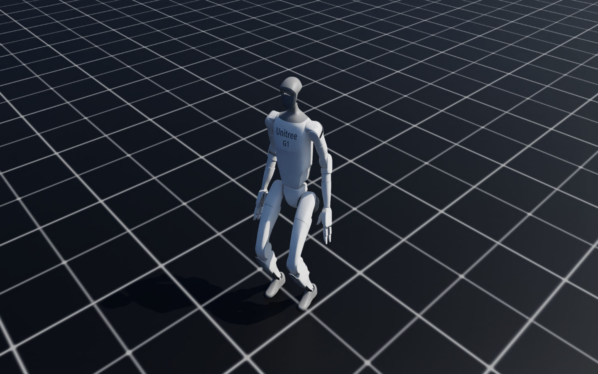
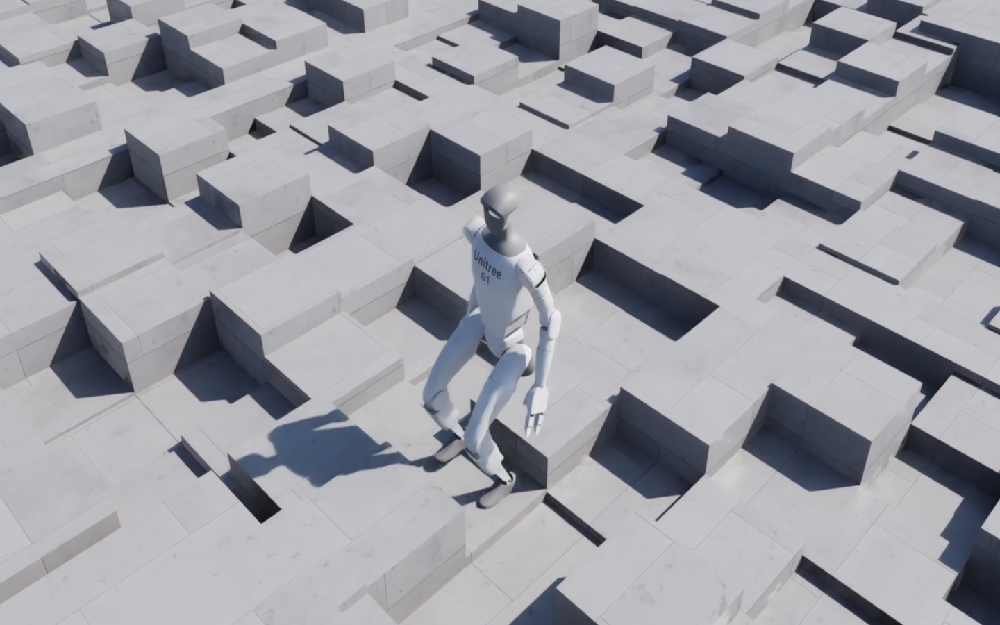

图 5-14　同一类速度跟踪任务在平地与崎岖地形中的两种配置。来源：NVIDIA Isaac Lab `v2.3.2`；Isaac Lab 与 G1 资产均采用相应 BSD 3-Clause 许可。

训练与播放命令是：

```bash
./isaaclab.sh -p \
  scripts/reinforcement_learning/rsl_rl/train.py \
  --task Isaac-Velocity-Flat-G1-v0 \
  --headless

./isaaclab.sh -p \
  scripts/reinforcement_learning/rsl_rl/play.py \
  --task Isaac-Velocity-Flat-G1-Play-v0 \
  --num_envs 32 \
  --checkpoint /ABSOLUTE/PATH/TO/model.pt
```

本讲不会把训练时间或 checkpoint 可用性写成保证。没有经过训练且匹配当前配置的策略时，不能仅靠启动环境得到稳定步态。

Standing、Walking 和 Turning 不是三个独立注册任务，而是同一个 velocity-tracking 环境的不同指令工况：

- **Standing**：令 $v_x^{\ast}=v_y^{\ast}=\omega_z^{\ast}=0$；
- **Walking**：给出非零平面线速度；
- **Turning**：给出非零 yaw 角速度，可同时带有前进速度。

这一修正很重要：任务资产、观测和动作不变，改变的是 command 分布。这样才可以做可控对比。

### 5.4 Standing：不动不等于没有控制

零速度指令下，策略仍需要持续：

- 抵消小扰动和模型误差；
- 保持躯干姿态；
- 调节双足接触；
- 避免关节高频抖动和动作饱和。

建议记录：

- base roll / pitch 的均方根；
- base 线速度与角速度；
- 两足接触序列；
- 动作变化率；
- 固定评测时域内的摔倒与存活时间。

不要把“roll/pitch 必须小于某个固定角度”写成所有 G1 模型的正常标准。若实验需要阈值，应注明它是本次资产、策略和安全需求下的判据。

### 5.5 Walking：速度指令怎样变成步态

给定 $c_t=\left(v_x^{\ast},v_y^{\ast},\omega_z^{\ast}\right)$ 后，最直接的连续指标是速度跟踪误差：

$$
\mathrm{RMSE}_v =
\sqrt{
\frac{1}{T}
\sum_{t=1}^{T}
\left\|
v_t-v_t^{\ast}
\right\|_2^2
}
$$

还应同时观察：

- base 高度和姿态是否逐步漂移；
- 足底接触是否形成合理的交替；
- 足部在接触阶段是否出现滑动；
- 动作是否出现高频跳变；
- episode 是因摔倒终止，还是因时间上限截断。

“速度误差低于 10%–20% 就算好”没有跨任务通用性。低速命令下百分比误差尤其容易被放大，应同时报告绝对误差与指令范围。

### 5.6 Turning：同一个接口为何产生不对称运动

对比两组工况：

```text
A：vx* > 0，vy* = 0，ωz* = 0
B：vx* > 0，vy* = 0，ωz* ≠ 0
```

转向时，内外侧腿的步幅、触地时刻和关节动作会出现不对称。检查：

- base 轨迹是否形成连续弧线；
- 实际 yaw rate 是否跟踪 command；
- 内外侧足是否频繁交叉或自碰撞；
- 髋、膝、踝是否接近关节限位；
- 转向时的速度误差是否与足滑同时增大。

若只观察视频，身体倾斜可能被误判为“自然转弯”。时间序列可以区分策略主动倾斜与失稳前兆。

### 5.7 Disturbance recovery：先说明扰动是什么

扰动至少有两类：

1. **力或力矩扰动**：在一段时间内对刚体施加外力，冲量可由力与持续时间计算；
2. **状态扰动**：直接修改 base 位置、姿态或速度，用于测试策略从异常状态恢复的能力。

瞬间改变 base 位姿或速度不是现实推力的等价模拟。它跳过了接触和力作用过程，应明确称为状态扰动。

Isaac Lab 2.3.2 的官方 G1 配置并未启用自动推搡训练：`push_robot` 被关闭，相关外力设置也为零。因此，扰动恢复是本讲建议的**扩展评测**，不是该内置任务默认完成的“第四个任务”。

Unitree 官方 `unitree_rl_lab` 提供 G1-29DoF velocity 任务，并按周期通过设置 base 速度注入状态扰动。它固定于不同的 Isaac Lab 组合，适合作为扩展阅读，不应声称已在本讲 2.3.2 基线上得到官方兼容保证。

恢复策略也没有绝对优劣顺序：

- 小扰动可能通过踝、髋和躯干协调恢复；
- 较大扰动可能需要迈步扩大支撑域；
- 具体选择取决于扰动大小、方向、当前步态相位和控制目标。

建议报告扰动配置、最早异常时间、恢复时间、最大姿态偏差、是否迈步与是否摔倒，而不是只问“多大力能推倒”。

### 5.8 摔倒不是结论：寻找最早异常信号

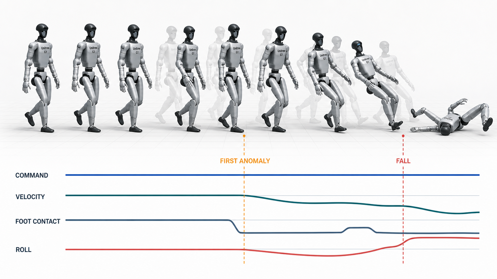

图 5-15　摔倒诊断示意。虚线前的足底接触或速度误差，可能比最终躯干倾斜更早出现。

一次摔倒应按以下链条复盘：

```text
最终症状：躯干触地
→ 向前寻找最早异常时刻
→ command / action / contact / model 哪一项先异常
→ 列出至少两个候选原因
→ 设计只改一个变量的验证实验
```

| 最早信号 | 候选原因 | 验证方式 |
|---|---|---|
| command 突然超出训练范围 | 指令分布外推 | 固定策略，只缩小 command |
| 足底接触消失或滑动 | 摩擦、地形、脚部几何 | 固定指令，只改接触条件 |
| action 出现尖峰 | 策略、缩放、观测异常 | 记录 raw action 与映射后目标 |
| 实际速度持续落后 | 执行器、策略能力或负载 | 固定条件，对比目标与实际关节响应 |
| 姿态先漂移后摔倒 | 状态估计、模型或恢复不足 | 比较 base 姿态、重力投影和足底时序 |

> **契约回看**
> 对 G1 而言，速度 command 只是目标条件，policy action 才是控制输出；Standing、Walking、Turning 是同一官方任务的不同工况；扰动恢复还必须注明外力扰动还是状态扰动。契约没有因机器人更复杂而失效，反而更需要被写清楚。

## 6 仿真成功为什么不等于真机成功

机械臂操作、Isaac Lab 环境和 G1 工况都看过以后，需要回到真实世界：这些仿真结果为什么不一定能直接迁移到真机？

这个问题通常称为 **Sim2Real（从仿真到真实）**。当 SO-101 和 G1 都在仿真中成功，问题便从仿真内部转向边界：这些成功依赖的假设，在真实世界仍然成立吗？

一份任务契约可以在仿真内部写得完整，却把现实写错。模型质量、传感器读数、摩擦和执行器响应，只要有一项被理想化，仿真与真机就可能走出不同轨迹。

### 6.1 Sim2Real gap 不是一个单独参数

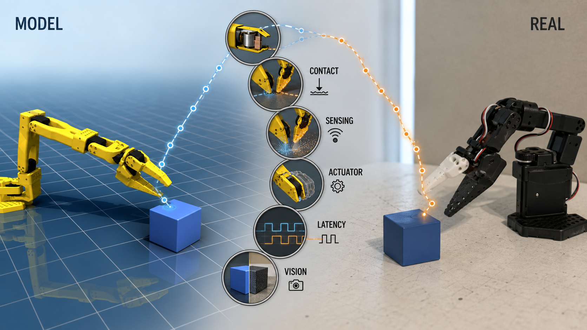

图 5-16　把差距挂回契约，才能把“仿真不准”改写成可测假设。

| 契约项 | 仿真中常见理想化 | 真机表现 | 可测量的量 |
|---|---|---|---|
| 模型 | 质量、惯量、几何准确 | 加速、制动和重力响应偏差 | 关节/末端阶跃响应 |
| 场景与物理 | 摩擦均匀、接触几何稳定 | 滑脱、反弹、足滑 | 接触事件、滑动距离 |
| 观测 | 无噪声真值 | 抖动、偏置、丢帧 | 噪声谱、漂移、采样间隔 |
| 动作与执行器 | 指令即时、线性执行 | 滞后、齿隙、饱和 | 上升时间、超调、死区 |
| 控制链 | 通信零时延 | 闭环相位滞后、失稳 | 端到端延迟与抖动 |
| 视觉域 | 光照、纹理和深度理想 | 检测和位姿估计误差 | 像素、深度、6D 位姿误差 |

#### 接触模型差异

真实接触发生在有粗糙度、形变、污染和磨损的表面。MuJoCo 使用可计算的软约束与摩擦锥近似。它可以很好地支持控制与学习实验，却不应被描述成真实材料微观接触的完整复制。

#### 参数与几何差异

CAD 可能不包含电缆、紧固件和制造偏差；碰撞几何又常被有意简化。误差并不总是“大模型不够精细”，还可能是质量中心、惯量或关节零位偏了一点。

#### 执行器差异

仿真位置执行器可以拥有明确增益和力限幅。真实舵机还会受到通信、温度、供电、齿隙、摩擦、速度—力矩关系和内部固件控制影响。仿真的 `data.ctrl` 也不能越过标定层直接成为真机指令。

#### 传感器与通信差异

真机读数带有噪声、偏置、丢帧与时间戳误差；从传感器采样到控制计算，再到总线下发和电机响应，每个环节都贡献延迟。具体量级必须测量，不能把一个通用的毫秒范围当作所有系统事实。

#### 视觉域差异

真实相机存在曝光、运动模糊、镜头畸变和深度空洞。即使控制器完全相同，目标位姿误差也会先通过感知进入任务链。这正是下一讲要继续解决的问题。

### 6.2 SO-101 Sim2Real 对照应是一套测量协议

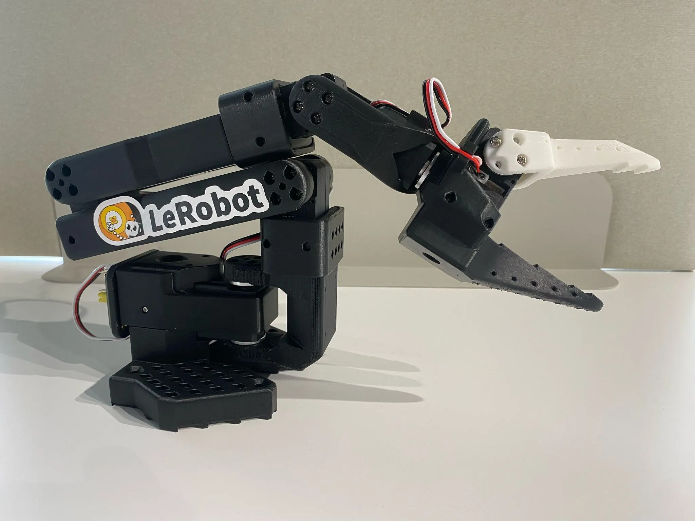

图 5-17　SO-101 follower 实物。来源：TheRobotStudio/SO-ARM100，commit `fda892c…`，Apache License 2.0。

没有真实实验记录时，不应在表格里填写看似精确的“仿真 2 mm、真机 3–8 mm、重复率 95%”之类结果。正确做法是先规定同口径测量：

| 指标 | 仿真测量 | 真机测量 | 差值 | 候选原因 |
|---|---:|---:|---:|---|
| 最终位置误差 | 读者测量 | 可选硬件实验 | 计算值 | 标定、齿隙、控制 |
| 上升时间 | 读者测量 | 可选硬件实验 | 计算值 | 延迟、速度限制 |
| 最大超调 | 读者测量 | 可选硬件实验 | 计算值 | 增益、传动弹性 |
| 重复实验方差 | 多次 seed / 初态 | 多次真机复位 | 计算值 | 噪声、温度、初态 |
| 轨迹 RMSE | CSV 轨迹 | 同频率时间戳轨迹 | 计算值 | 时间对齐、模型误差 |

对照前要统一：

- 坐标系与单位；
- 目标位置和初始关节姿态；
- 采样频率与时间戳；
- 关节、夹爪的标定映射；
- 速度、加速度和工作空间限制；
- 误差计算与滤波方式。

没有硬件的读者仍可完成主实验：在仿真中加入参数偏差、观测噪声和动作延迟，把“理想仿真”当作参考系统，把“扰动仿真”当作待迁移系统。

### 6.3 无硬件的延迟与噪声注入实验

下面的通道类可以接入 3.3 节的第二、第三个代码片段，用来延迟关节目标并给末端观测加入高斯噪声。它不是在模拟某台真机，而是在检验控制闭环对两类明确错误假设的敏感性。

```python
from collections import deque


class DelayedNoisyChannel:
    def __init__(
        self,
        initial_ctrl: np.ndarray,
        delay_updates: int,
        position_noise_std: float,
        seed: int,
    ):
        if delay_updates < 0:
            raise ValueError("delay_updates must be non-negative")
        self.queue = deque(
            [initial_ctrl.copy() for _ in range(delay_updates)]
        )
        self.position_noise_std = position_noise_std
        self.rng = np.random.default_rng(seed)

    def observe_position(self, true_position: np.ndarray) -> np.ndarray:
        noise = self.rng.normal(
            loc=0.0,
            scale=self.position_noise_std,
            size=3,
        )
        return true_position + noise

    def delayed_ctrl(self, new_ctrl: np.ndarray) -> np.ndarray:
        self.queue.append(new_ctrl.copy())
        return self.queue.popleft()
```

在 `ReachController` 中，把真实末端位置：

```python
error = target - self.data.site_xpos[self.site_id]
```

替换为：

```python
measured_ee = self.channel.observe_position(
    self.data.site_xpos[self.site_id]
)
error = target - measured_ee
```

把写入执行器的两行：

```python
low, high = self.model.actuator_ctrlrange[self.act_ids].T
self.data.ctrl[self.act_ids] = np.clip(q_cmd, low, high)
```

替换为：

```python
low, high = self.model.actuator_ctrlrange[self.act_ids].T
new_ctrl = np.clip(q_cmd, low, high)
self.data.ctrl[self.act_ids] = self.channel.delayed_ctrl(new_ctrl)
```

创建控制器后加入：

```python
controller.channel = DelayedNoisyChannel(
    initial_ctrl=data.ctrl[controller.act_ids],
    delay_updates=2,
    position_noise_std=0.002,
    seed=7,
)
```

`delay_updates=2` 表示延迟两个 20 ms 的控制更新，而不是两个 5 ms 的物理步。实验矩阵可以是：

| 延迟更新数 | 位置噪声标准差 | 重复 seed | 指标 |
|---:|---:|---|---|
| 0 | 0 mm | 5 组 | 基线误差、达标时间 |
| 1 | 0 mm | 5 组 | 延迟敏感性 |
| 2 | 0 mm | 5 组 | 延迟敏感性 |
| 0 | 1 mm | 5 组 | 抖动与保持判定 |
| 0 | 2 mm | 5 组 | 抖动与保持判定 |
| 2 | 2 mm | 5 组 | 组合效应 |

在 noisy observation 下，成功判定也要说明使用“带噪观测”还是仿真真值。前者更接近部署接口，后者适合独立评测；两者都记录，最能揭示观测误差与真实任务误差的区别。

### 6.4 缩小 gap：方法必须对应错误假设

#### System identification

通过阶跃响应、自由衰减、负载实验或专用测量，估计质量、惯量、阻尼、摩擦、延迟和执行器响应。优点是让模型更贴近已测系统；局限是参数会随工况变化，且某些参数难以独立辨识。

#### Domain randomization

在合理区间内随机化质量、摩擦、延迟、噪声、光照和纹理，让控制器或策略不过分依赖单一理想模型。区间太窄无法覆盖现实，太宽又可能显著增加学习难度。随机化范围应由测量或工程容差约束。

#### Domain adaptation

使用真实数据调整视觉特征、状态估计或策略，使仿真与真实数据分布更接近。它需要真实数据与部署流程，不能用“少量数据”概括所有任务成本。

#### Progressive training

从较稳定的仿真开始，逐步增加噪声、随机化、地形和延迟。这有助于学习过程，但课程顺序本身也会改变策略，需要记录每一阶段的参数。

#### Interface-aligned design

从一开始就让仿真和真机共享：

- 相同的观测定义和时间戳语义；
- 相同的动作口径与限幅；
- 相同的坐标系约定；
- 可测的延迟和复位逻辑。

接口对齐往往比追求视觉上“完全一样”更直接地降低迁移风险。

没有一种方法对所有 gap 都“最有效”。方法的选择应写成：

```text
观察到的差异
→ 怀疑哪项契约假设
→ 选择对应测量或干预
→ 重复对照
```

### 6.5 可选真机实验的安全边界

真机 SO-101 对照不是完成本讲的必需条件。若具备硬件，首次运行至少遵守：

- 使用低速、小范围、远离自碰撞和环境边界的目标；
- 验证关节、夹爪的真机标定与仿真弧度映射；
- 对位置、速度、加速度和指令变化率限幅；
- 由人检查完整轨迹，并保持急停可达；
- 先空载，再轻载；先单关节，再组合运动；
- 未经仿真、日志检查和人工审查的生成代码不得直接部署；
- 记录软件、固件、校准、供电和负载状态。

安全规则不是“建议读者更小心”的一句话，而是动作契约的一部分。真实硬件上的成功判定还必须包含人员与设备安全条件。

> **契约回看**
> 七项契约不仅告诉我们仿真该配置什么，也告诉我们从仿真走向现实时，应从哪里查错误假设。Sim2Real 不是一句“仿真不够真实”，而是一组可以测量、注入和验证的差异。

## 7 把失败变成下一次实验

仿真和真机都可能失败。知道可能有哪些 gap（差异）还不够，最后还要学会如何记录、复盘，并把失败变成下一次实验。只有把候选原因改写成单变量实验，它才会成为可以验证或否定的解释。

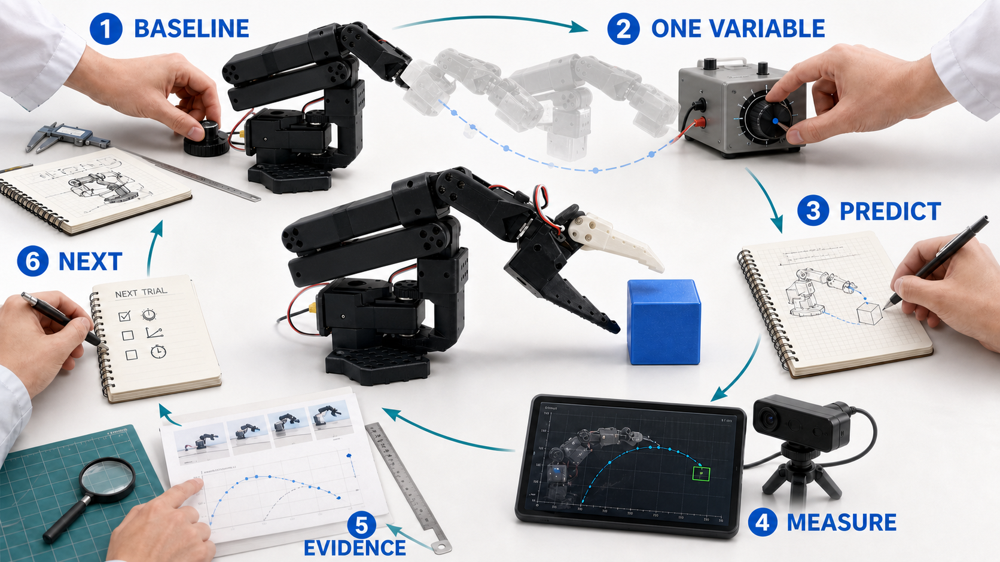

图 5-18　实验闭环。失败不是终点，而是下一次实验的输入。

### 7.1 一次完整实验的六个动作

1. **确定基线**：固定软件、资产、seed、初态和时钟。
2. **只改一个变量**：明确自变量，其他条件不动。
3. **运行前写下预测**：说明预期方向和机制。
4. **记录客观指标**：保存日志、轨迹、接触和终止原因。
5. **判断证据**：支持、否定，或证据不足。
6. **决定下一步**：复现、扩大样本，或设计新的区分实验。

若同时改变摩擦、控制周期和目标位置，即使任务成功，也不知道是哪一项造成变化。

### 7.2 统一实验记录表

| 字段 | 说明 | SO-101 reach 示例 |
|---|---|---|
| 实验 ID | 唯一编号 | `L05-R-007` |
| 任务 | reach / pick-place / velocity tracking | reach |
| 平台与版本 | 软件版本 | MuJoCo 3.10.0 |
| 资产与提交 | 模型固定版本 | Menagerie `71f066a…` |
| 随机种子 | 随机过程入口 | 7 |
| 初始状态 | keyframe 或关节值 | 默认零位 |
| 观测 | 名称、维数、单位 | `qpos`、`qvel`、`site_xpos` |
| 动作 | 物理口径与限幅 | 五关节位置目标 |
| physics timestep | 物理积分步长 | 5 ms |
| control period | 外层控制周期 | 20 ms |
| decimation | 每个动作保持的物理步数 | 4 |
| 改动变量 | 原值与新值 | 目标 \(y:0.10\to0.15\) m |
| 运行前预测 | 方向与原因 | 收敛时间增加 |
| 成功判定 | 谓词与保持时间 | 误差 < 5 mm，连续 8 次 |
| 连续指标 | 误差、时间、平滑性 | 终值、达标时间、路径长度 |
| 重复次数 | 同条件 episode 数 | 5 |
| 结果统计 | 均值、方差、失败数 | 由日志计算 |
| 最早异常 | 时间与信号 | 关节限幅后误差不再下降 |
| 下一步 | 新验证实验 | 只降低目标 \(z\) |

成功实验也要记录。没有基线成功日志，失败实验就缺少对照。

### 7.3 失败复盘五步法

#### 第一步：现象

只写可观察事实：

- 不写“抓取不好”，写“抬升 6 cm 后方块从活动指一侧滑出”；
- 不写“G1 不稳定”，写“右脚接触消失后 0.35 s，roll 持续增加并触地”。

#### 第二步：位置

沿时间线向前找第一个异常信号。最终摔倒和最终掉落通常晚于真正断点。

#### 第三步：候选原因

至少提出两个能够被区分的原因。例如，SO-101 滑脱可能来自：

- 夹爪—方块摩擦不足；
- 双指法向力不足；
- 抬升加速度过大；
- 预抓取偏心导致受力不对称。

#### 第四步：单变量验证

每次只改变一项：

- 固定质量和轨迹，只改夹爪摩擦；
- 固定摩擦和夹持指令，只减小抬升速度；
- 固定 command 和策略，只改 G1 地面接触条件。

#### 第五步：改进

改进应与证据一致。如果降低抬升速度消除了滑脱，下一步可以测量不同速度下的相对漂移；不能直接跳到“更换整套控制算法”。

三个贯穿案例可以这样回到契约：

| 案例 | 最早异常 | 契约断点 | 验证 |
|---|---|---|---|
| Reach 过冲 | 关节目标更新过大 | 动作与控制 | 降低 `dq` 限幅 |
| Pick-place 滑脱 | 双侧力不对称、相对漂移增长 | 物理与阶段判定 | 单独改摩擦或抬升速度 |
| G1 摔倒 | 足滑先于 roll 增长 | 场景接触 | 固定策略，改变地面条件 |

### 7.4 AI 的角色：提出假设，不提供证据

AI 可以帮助：

- 解释 MJCF、配置字段和报错；
- 把日志整理成实验表；
- 提出多个候选原因；
- 生成绘图或批量运行脚本初稿；
- 检查单位、名称映射和遗漏的边界条件。

AI 不能替代：

- 实际运行与重复实验；
- 对日志、轨迹和视频的测量；
- 真机安全审查；
- 对软件版本和官方示例的核验；
- 结论中的因果证据。

合格记录应写成：

> AI 提出“控制更新过慢”是候选原因。固定物理 timestep、增益和目标后，我只把 control period 从 20 ms 改为 40 ms；五次重复中最大误差均增大，因此该观察支持这一假设。

“AI 说可能是增益问题”还不是实验结论。

### 7.5 分层实践：先完整复现，再进阶探索

本讲作业不要求初学者一次完成所有平台。先根据条件选择一条起点：

| 层级 | 是否运行环境 | 要完成什么 |
|---|---|---|
| 入门理解 | 否 | 根据正文基线填写 SO-101 reach 任务契约，并用五步法分析一个给定失败现象 |
| 基础复现 | 是，普通电脑即可 | 完整运行 SO-101 reach，生成 CSV，并完成一次单变量目标位置实验 |
| 进阶探索 | 是，按条件任选 | 从 pick-place、Isaac Lab、G1、噪声与延迟、真机对照中任选一项 |

基础复现的目标是先把一个闭环做完整；进阶探索的目标是学习自己提出问题，而不是增加截图数量。

#### 基础必做：SO-101 reach

- 按 3.3 节三个关键片段组成最小 reach 闭环；
- 保留软件、资产版本和 CSV；
- 改变一个目标坐标分量；
- 给出预测、最终误差、达标时间和一次失败分析。

#### 进阶任选一：SO-101 pick-place

- 从官方 `pickup` 关键帧实现闭合、抬升、搬运、释放和稳定性检查；
- 记录双侧法向力、相对漂移、落点误差；
- 在质量、摩擦或控制周期中只改一项；
- 对比 baseline 与改动结果。

#### 进阶任选二：Isaac Lab 环境阅读

- 运行 Franka random-agent 或差分 IK 官方脚本；
- 标出 Scene、Articulation、Observation、Action、Termination 的代码位置；
- 解释为什么 random agent 运行成功不等于 reach 策略成功。

#### 进阶任选三：G1 工况比较

- 使用同一 velocity-tracking 任务；
- 比较零指令、直行、转向三个 command 工况；
- 记录速度 RMSE、存活时间、足底接触和姿态；
- 说明 command、policy action 与 actuator input 的区别。

#### 进阶任选四：无硬件 Sim2Real

- 在 SO-101 reach 中注入延迟或观测噪声；
- 至少运行三个档位、多个 seed；
- 说明成功判定使用带噪观测还是真值；
- 给出误差分布与最早异常。

#### 有硬件可选：SO-101 真机对照

- 在低速、小范围和人工看护下运行；
- 完成仿真—真机坐标、标定和时间戳对齐；
- 填写 6.2 节测量表；
- 不把一次真机成功写成成功率。

交付的核心不是截图数量，而是证据链是否完整：

```text
任务契约
→ 版本与基线
→ 单变量改动
→ 日志和指标
→ 原因判断
→ 下一次实验
```

## 8 本讲小结：从任务契约走向真实感知

回到开篇：SO-101 在窗口里碰到目标点，为什么还不算任务搭好？

现在答案已经清楚。只有当：

- 目标、模型、场景、观测、动作、物理与控制、判定都有明确落点；
- 代码真正完成从误差到执行器再到新观测的闭环；
- 换初态和参数后的表现能够统计；
- 失败能够沿时间和契约找到最早异常；
- 仿真对现实作出的假设能够被测量和挑战；

这次运动才从 Demo 变成一个可复盘的仿真实验。

本讲建立了三个层次：

1. **MuJoCo + SO-101**：看清模型、执行器、接触和控制时钟；
2. **Isaac Lab + Franka/G1**：看清环境协议、条件分布与迁移后的接口；
3. **Sim2Real + 实验闭环**：看清仿真假设怎样在现实边界失效。

整讲最重要的不是记住两个平台的命令，而是形成一种阅读和搭建任务的习惯：

> 先写任务契约，再兑现接口；先保留证据，再解释失败。

本讲解决的是“机器人任务如何进入仿真，并形成可记录、可判断、可复盘的闭环”。但仿真中的目标位置是直接给出的，真实机器人并不会自动知道物体在哪里。

下一讲会追问一个本讲故意固定的问题：`target_pos` 从哪里来？

在仿真里，我们直接写下世界坐标。真机上，机器人需要从相机像素、深度和坐标变换中估计目标位置与 6D 位姿。感知误差随后会进入本讲已经建立的控制与评测闭环。

## 参考资料

1. Google DeepMind, [MuJoCo 3.10.0 release](https://github.com/google-deepmind/mujoco/releases/tag/3.10.0).
2. MuJoCo Documentation, [Python bindings](https://mujoco.readthedocs.io/en/stable/python.html).
3. MuJoCo Documentation, [XML Reference](https://mujoco.readthedocs.io/en/stable/XMLreference.html).
4. MuJoCo Documentation, [Modeling](https://mujoco.readthedocs.io/en/stable/modeling.html).
5. Google DeepMind, [MuJoCo Menagerie: `robotstudio_so101` at commit `71f066a…`](https://github.com/google-deepmind/mujoco_menagerie/tree/71f066ad0be9cd271f7ed58c030243ef157af9f4/robotstudio_so101).
6. TheRobotStudio, [SO-ARM100 / SO-101 simulation assets at commit `fda892c…`](https://github.com/TheRobotStudio/SO-ARM100/tree/fda892cba81032c46c40976a48c9ceadbf40a9ca/Simulation/SO101).
7. NVIDIA, [Isaac Lab 2.3.2 installation](https://isaac-sim.github.io/IsaacLab/v2.3.2/source/setup/installation/index.html).
8. NVIDIA, [Isaac Lab v2.3.2 release](https://github.com/isaac-sim/IsaacLab/releases/tag/v2.3.2).
9. NVIDIA, [Isaac Lab available environments](https://isaac-sim.github.io/IsaacLab/v2.3.2/source/overview/environments.html).
10. NVIDIA, [Franka Reach base configuration](https://github.com/isaac-sim/IsaacLab/blob/v2.3.2/source/isaaclab_tasks/isaaclab_tasks/manager_based/manipulation/reach/reach_env_cfg.py).
11. NVIDIA, [Franka joint-position Reach configuration](https://github.com/isaac-sim/IsaacLab/blob/v2.3.2/source/isaaclab_tasks/isaaclab_tasks/manager_based/manipulation/reach/config/franka/joint_pos_env_cfg.py).
12. NVIDIA, [G1 velocity task registration](https://github.com/isaac-sim/IsaacLab/blob/v2.3.2/source/isaaclab_tasks/isaaclab_tasks/manager_based/locomotion/velocity/config/g1/__init__.py).
13. NVIDIA, [G1 flat configuration](https://github.com/isaac-sim/IsaacLab/blob/v2.3.2/source/isaaclab_tasks/isaaclab_tasks/manager_based/locomotion/velocity/config/g1/flat_env_cfg.py).
14. NVIDIA, [G1 rough configuration](https://github.com/isaac-sim/IsaacLab/blob/v2.3.2/source/isaaclab_tasks/isaaclab_tasks/manager_based/locomotion/velocity/config/g1/rough_env_cfg.py).
15. NVIDIA, [Isaac Lab `TerminationManager`](https://github.com/isaac-sim/IsaacLab/blob/v2.3.2/source/isaaclab/isaaclab/managers/termination_manager.py).
16. NVIDIA, [Isaac Lab reinforcement-learning scripts](https://isaac-sim.github.io/IsaacLab/v2.3.2/source/overview/reinforcement-learning/rl_existing_scripts.html).
17. NVIDIA, [Isaac Lab performance benchmarks](https://isaac-sim.github.io/IsaacLab/v2.3.2/source/overview/reinforcement-learning/performance_benchmarks.html).
18. Unitree Robotics, [`unitree_rl_lab` at commit `4960b84…`](https://github.com/unitreerobotics/unitree_rl_lab/tree/4960b84732b0c2ec593dccbfe963fda1bcd7b1e3).
19. Farama Foundation, [Gymnasium step API](https://gymnasium.farama.org/api/env/).
