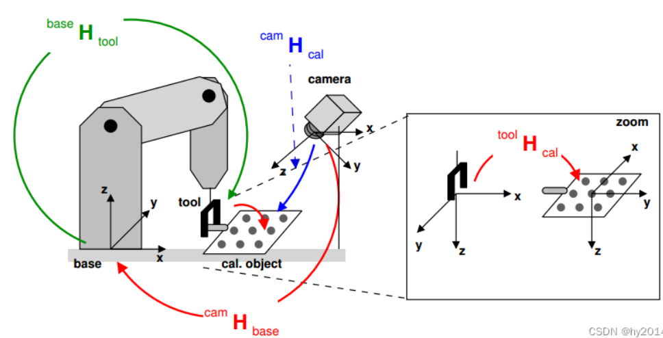

# 第6讲 机器人感知与位姿估计
（问题：本章内容详细，建议做适当拆分。更多增加图表和各知识点的结构框图，少一些概念性的解释。让读者结合ai学习）
（问题：建议实验单独拆分，不然一章显得很臃肿）
# 目录

1 从 “看得到” 到 “抓得到”：位姿估计在机器人操作中的定位

1\.1 背景与动机：为什么机器人不能只靠检测框抓取

1\.1\.1 检测框的本质：二维投影，信息严重缺失

1\.1\.2 从2D到3D：维度跃迁带来的根本性挑战

1\.1\.3 为什么位姿估计是不可避免的中间环节

本节小结

1\.2 机器人感知的三层目标：识别 \- 定位 \- 定姿

1\.2\.1 第一层：识别（Recognition）——解决“是什么”的问题

1\.2\.2 第二层：定位（Localization）——解决“大致在哪里”的问题

1\.2\.3 第三层：定姿（Pose Estimation）——解决“朝哪个方向”的问题

本节小结

1\.3 两条技术路线：模块化感知 vs 端到端感知

1\.3\.1 模块化感知：经典的分层流水线架构

1\.3\.2 端到端感知：直接映射的数据驱动范式

1\.3\.3 深度对比与综合权衡

本节小结

1\.4 本讲核心内容与学习路径

1\.4\.1 本讲定位：服务机器人场景下的全链路视角

1\.4\.2 从输入到执行：七步闭环学习主线

1\.4\.3 章节内容编排与学习节奏建议

1\.4\.4 为什么这条链路值得深入掌握

本节小结

2 机器人感知任务体系与标准抓取流水线 

2\.1 机器人感知任务分类图谱 

2\.1\.1 按任务目标划分：语义、几何与属性三大类 

2\.1\.2 按输入模态划分：从单目到多传感器融合 

本节小结 

2\.2 位姿驱动抓取的完整流水线 

2\.2\.1 标准 8 步流程：从图像采集到机械臂执行 

2\.2\.2 各环节失效的误差传导效应 本节小结 

2\.3 核心概念辨析：bbox /mask/center point /object pose /grasp pose 

2\.3\.1 五类感知输出的定义与维度对比 

2\.3\.2 用途场景与精度要求差异 

本节小结 

2\.4 不同硬件平台的感知需求差异 

2\.4\.1 SO101 桌面机械臂：固定视角下的精准定位 

2\.4\.2 xLeRobot 移动操作：多坐标系与动态场景适配 

2\.4\.3 Imeta\-Y1 科研机械臂：精密操作的高位姿精度要求

2\.4\.4 Unitree G1 人形机器人：全身感知与多视角协同 

本节小结

3 视觉感知前端：目标检测分割与点云提取 

3\.1 输入模态：RGB\-D 数据与多相机配置

3\.1\.1 RGB相机：语义纹理的提供者

3\.1\.2 深度相机：三维几何的感知核心

3\.1\.3 多相机配置：从单一视角到系统级视觉

3\.1\.4 关键参数：选型的量化依据

本节小结

3\.2 目标检测：从边界框到目标粗定位

3\.2\.1核心作用：缩小搜索空间，为后续处理“划重点”

3\.2\.2 YOLO系列——实时检测的工业标准

3\.2\.3 Grounded\-SAM——开放词汇检测的新范式

3\.2\.4 输出形式：边界框、类别与置信度

3\.2\.5 核心局限：二维信息不足以支撑抓取

本节小结

3\.3 实例分割：从像素级掩码到目标区域提取

3\.3\.1 核心作用：从“矩形框”到“精确轮廓”

3\.3\.2 经典实例分割模型

3\.3\.3 SAM系列——通用分割的基础模型

3\.3\.4 SAM\-6D：实例分割与6D位姿估计的端到端融合

3\.3\.5 核心局限：仍为2D感知，需与深度图配合

本节小结

3\.4 点云生成与滤波：从深度图到三维目标点云

3\.4\.1 像素反投影：从深度图到三维点云的核心公式

3\.4\.2 点云预处理：从“原始点云”到“干净点云”

3\.4\.3 目标点云提取：用掩膜“筛选”深度图

3\.4\.4 全链路回顾及demo讲解

本节小结

3\.5 常用开源工具与模型选型

3\.5\.1 检测分割工具

3\.5\.2 点云处理工具

3\.5\.3 选型建议：三维度决策框架

3\.5\.4 综合选型决策树

3\.5\.5 工具链组合的典型实践

本节小结

5 抓取位姿生成：从物体位姿到机器人可执行目标

5\.1 为什么 object pose 不等于 grasp pose

5\.1\.1 抓取点选择：物体中心 ≠ 最佳接触点

5\.1\.2 接近方向：物体朝向 ≠ 夹爪接近方向

5\.1\.3 夹爪开合尺度：物体尺寸 ≠ 夹爪开口宽度

5\.1\.4 安全余量：物体表面 ≠ 夹爪目标位置

本节小结

4 6D 物体位姿估计：原理与主流技术方案 

4\.1 什么是 6D 位姿：平移与旋转的数学表示 

4\.1\.1 平移自由度：物体三维空间位置的量化描述

4\.1\.2 旋转自由度：三种主流旋转表示方法对比 

4\.1\.3 齐次变换矩阵：位姿的统一工程表达形式 本节小结 

4\.2 位姿估计的三类技术路线 

4\.2\.1 传统几何法：基于点云配准的 ICP 系列 

4\.2\.2 模板匹配法：基于三维模型的姿态对齐 

4\.2\.3 深度学习法：从两阶段方案到端到端范式 本节小结 

4\.3 典型开源方案对比：FoundationPose / SAM\-6D / YOLO\-6D 

4\.3\.1 三类方案的核心维度横向对比 

4\.3\.2 不同场景下的选型决策建议 

本节小结 

4\.4 位姿估计的精度评价指标 

4\.4\.1 ADD 与 ADD\-S：位姿精度的核心综合指标 

4\.4\.2 分项误差指标：平移误差与旋转误差 

本节小结

5\.2 抓取位姿的核心要素：接近方向、开合尺度、安全偏移 、姿态匹配

5\.2\.1 接近方向（Approach Direction）：夹爪从哪个方向来

5\.2\.2 开合尺度（Gripper Opening Width）：夹爪张多大

5\.2\.3 安全偏移（Safety Offset）：夹爪停在哪儿

5\.2\.4 姿态匹配（Orientation Alignment）：夹爪方向与物体姿态对齐

5\.2\.5 总结：四个要素的协同关系

本节小结

5\.3 典型抓取场景的位姿生成逻辑（顶部垂直接近 vs 侧面姿态匹配） 

5\.3\.1 桌面顶部抓取：垂直接近范式 

5\.3\.2 侧面抓取：水平接近与姿态匹配

5\.3\.3 预抓取位姿与安全接近路径设计

本节小结

5\.4 坐标系转换链路：从相机坐标系到机器人基座坐标系

5\.4\.1 完整的坐标转换依赖关系

5\.4\.2 眼在手上（Eye\-in\-Hand）与眼在手外（Eye\-to\-Hand）的物理拓扑差异。

5\.4\.3 手眼标定的数学本质：求解 AX = XB 方程（获取齐次变换矩阵）。

5\.4\.4 真机部署中的标定误差排查（为什么位姿估计很准，但抓取总是偏几厘米？）

本节小结

5\.5 可达性校验：抓取位姿的机械臂可行性判断

5\.5\.1 工作空间判断：抓取位姿是否在“够得着”的范围内

5\.5\.2 逆运动学校验：是否存在可行的关节解

5\.5\.3 碰撞检测：接近路径是否与环境碰撞

5\.5\.4 三层校验的递进逻辑与实践建议

本节小结

5\.6 感知降级策略：当 6D Pose 失效时，退回到“基于 3D 中心的顶部垂直抓取”。

5\.6\.1 为什么需要降级策略？——6D Pose失效的典型场景

5\.6\.2 降级策略的核心：基于3D中心的顶部垂直抓取

5\.6\.3 降级策略的触发条件与实施流程

本节小结

6 感知失败分析与鲁棒性优化 

6\.1 典型感知失败场景与成因 

6\.1\.1 视觉类失败：遮挡、反光、低纹理与光照剧变 

6\.1\.2 几何类失败：深度空洞、外参偏差与坐标系错误 

6\.1\.3 位姿类失败：位姿跳变、方向翻转与目标不可达 

本节小结 

6\.2 感知误差对抓取成功率的影响量化 

6\.2\.1 平移误差：从毫米级偏差到厘米级失效 

6\.2\.2 旋转误差：角度偏差的空间放大效应 

6\.2\.3 深度误差：接近方向的致命影响 

本节小结 

6\.3 三类优化方向 

6\.3\.1 视觉层面：光照、反光、透明物体的处理 

6\.3\.2 位姿层面：多帧融合与时序平滑 

6\.3\.3 系统层面：失败检测与重感知机制 

本节小结 

6\.4 真机部署中的感知调试流程 

6\.4\.1 基础校验：标定与坐标系正确性验证 

6\.4\.2 单步验证：检测分割效果与静态位姿精度测试 

6\.4\.3 全链路验证：动态抓取评测与迭代优化 
（问题：继续完善6\.4\.3 之后的内容）

本节小结

7 位姿估计抓取实战实验与作业解析 

7\.1 有硬件版与无硬件仿真版实验流程 

7\.1\.1 有硬件版（SO101）：真机全流程操作步骤 

7\.1\.2 无硬件仿真版：Open3D 与 ManiSkill 离线实验 

本节小结 
（问题：代码解析参考10-模仿学习实战.md 3.3 代码解析：LeRobot 源码逐层拆解。对关键代码进行备注说明，帮助理解）

7\.2 核心代码逐行解析：从 YOLO 检测到抓取生成 

7\.2\.1 检测分割模块：YOLO 检测与 SAM 分割的调用逻辑 

7\.2\.2 点云处理模块：滤波预处理与目标点云提取 

7\.2\.3 位姿生成模块：6D 位姿解算与抓取位姿生成 本节小结 

7\.3 可视化输出规范：多维度结果的 Open3D 展示 

7\.3\.1 前端感知结果可视化：边界框与实例掩膜 

7\.3\.2 几何结果可视化：点云与物体 6D 位姿 

7\.3\.3 抓取结果可视化：夹爪模型与接近路径 

本节小结 

7\.4 作业交付标准与评分细则 

7\.4\.1 8 项交付物清单与要求 

7\.4\.2 评分维度与量化细则 

本节小结

8 本讲小结 

8\.1 两条技术主线回顾 

8\.1\.1 模块化感知路线：工程落地的主流范式 

8\.1\.2 端到端感知路线：前沿发展的未来方向 

本节小结 

8\.2 感知 \- 位姿 \- 抓取的完整链路梳理 

8\.2\.1 从像素输入到抓取指令的全链路映射 

8\.2\.2 机器人感知的核心目标：生成可执行操作指令 本节小结 

8\.3 通向下一讲：从感知结果到抓取动作执行 

8\.3\.1 本讲的能力边界与遗留问题 

8\.3\.2 第 7 讲核心内容预告 

本节小结

# 各节详细写作框架

一、本讲目录与跨页导航

本讲承接第 5 讲“任务如何进入仿真”，重点解决真实物理世界中“目标从哪里来”的问题。文章不按算法罗列的综述形式写，而是以“机械臂如何成功抓起一个真实物体”为物理主线，倒推感知系统必须提供的信息。

1\.1 跨页主流程图

```Plain Text
**从像素到抓取的全链路流程** 传感器数据输入（RGB 图像 + 深度图） 
↓ 
第一层：识别（解决“是什么”） 
↓ 
第二层：定位（解决“大致在哪里”） 
↓ 
第三层：定姿（解决“朝哪个方向”） 
↓ 
系统架构抉择（模块化流水线 vs 端到端网络） 
↓ 
坐标系转换与手眼标定（从相机空间到机器人空间） 
↓ 
物理执行与鲁棒抓取规划
```

## 1 从 “看得到” 到 “抓得到”：位姿估计在机器人操作中的定位

### 1\.1 背景与动机：为什么机器人不能只靠检测框抓取

在机器人视觉抓取系统中，目标检测（Object Detection）通常被认为是感知的第一站。现代深度学习检测器（如YOLO、Faster R\-CNN等）能够以极高的精度给出物体的2D边界框（Bounding Box），告诉机器人“什么物体在图像的什么位置”。然而，一个常见的误区是：将“检测到物体”等同于“可以抓取物体”。但从“看得到”到“抓得到”之间，存在一道检测框无法跨越的鸿沟。

#### 1\.1\.1 检测框的本质：二维投影，信息严重缺失

检测框本质上是一个二维矩形，它仅描述了物体在图像平面上的大致范围。对于抓取任务而言，检测框至少丢失了三类关键信息：

（1）深度信息缺失。 检测框是2D的，不包含物体距离相机的距离。仅凭单目RGB图像中的检测框，机器人无法知道物体是近在咫尺还是远在天边。虽然可以通过相机内参将检测框中心反投影到3D空间，但这种方法仅在物体平放且相机正对时勉强可行；一旦物体有高度或相机有俯角，反投影得到的只是一个位于物体表面某点的3D坐标，而非物体可抓取部位（如质心）的坐标。

（2）旋转姿态（朝向）缺失。 检测框通常是与图像坐标轴对齐的（Axis\-Aligned），它不提供物体在三维空间中的旋转信息。一个水平放置的杯子和一个倾斜45°的杯子，在检测框中可能看起来几乎相同，但机械臂抓取前者可能需要垂直向下夹取，抓取后者则需要调整末端执行器的姿态。缺少6D姿态（6D Pose，即三维位置\+三维旋转） ，机器人就不知道从哪个方向去接近物体。

（3）物体形状与抓取点信息缺失。 检测框是一个粗糙的矩形包围盒，无法区分物体的哪一部分是可抓取的、哪一部分是易碎或不可接触的。对于形状不规则的物体，检测框中心可能落在物体的空心区域或边缘之外，直接以检测框中心作为抓取目标，极易导致抓取失败甚至损坏物体。

#### 1\.1\.2 从2D到3D：维度跃迁带来的根本性挑战

即使通过RGB\-D相机获取了深度图，将2D检测框简单地映射到3D空间仍然面临诸多困难：

（1）2D检测框到3D点云的映射误差。 从检测框内提取的点云并非直接对应物体的完整3D形状——检测框可能包含背景点云、相邻物体的点云，或因物体表面反光、透明等原因导致深度缺失。这些噪声会直接污染后续的抓取位姿计算。

（2）遮挡与截断问题。 在真实场景中，目标物体常常被其他物体部分遮挡，或位于场景边缘而被图像边界截断。检测框可能只覆盖了物体的可见部分，而机器人需要抓取的可能是被遮挡的那一侧。仅凭检测框，机器人无法推断出被遮挡部分的几何信息，更无法规划出稳定的抓取策略。

（3）物体形态变化与类别不均衡。 现实环境中的物体存在形态变化（如变形、不同规格）、表面纹理差异以及类别分布不均衡等问题。检测框只能告诉你“这里有一个物体”，却无法适应物体在形状上的细微差异来调整抓取策略。

#### 1\.1\.3 为什么位姿估计是不可避免的中间环节

抓取检测（Grasp Detection）的核心任务是确定机器人夹持器的位姿（位置\+方向） ，以便机械臂能够准确地夹取和移动物体。这要求系统输出的不是一个矩形框，而是一个完整的6D抓取位姿——包括抓取点的三维坐标和夹持器的三维朝向。

从信息论的角度看，检测框提供的信息量（\~4个自由度：x\_min, y\_min, x\_max, y\_max）远不足以支撑抓取任务所需的控制精度（6个自由度：x, y, z, roll, pitch, yaw）。检测框解决的是“物体在哪里”的识别问题，而抓取需要解决的是“手以什么姿态、从什么方向、去触碰物体的哪个部位”的操作问题——后者对空间精度的要求远高于前者。

正因如此，现代机器人抓取系统普遍将6D位姿估计作为从视觉感知到物理操作的核心桥梁。从2D检测框出发，融合深度信息、进行点云分割、估计物体6D姿态、最后生成抓取位姿——这条完整的感知链路，正是本章将要系统展开的核心内容

### 1\.2 机器人感知的三层目标：识别 \- 定位 \- 定姿

在1\.1节中我们指出，仅靠2D检测框无法满足抓取需求。那么，机器人感知系统究竟需要从图像中提取哪些信息，才能支撑一次成功的抓取操作？我们可以将这一过程抽象为层层递进的三层目标架构：识别（Recognition）→ 定位（Localization）→ 定姿（Pose Estimation）。这三层并非简单的并列关系，而是一条信息粒度不断细化、几何精度不断攀升的感知流水线。

#### 1\.2\.1 第一层：识别（Recognition）——解决“是什么”的问题

识别是感知的起点，也是最基础的语义层。它的目标是回答：场景中有什么类别的物体？

- 输入：RGB图像或点云数据。

- 输出：物体的类别标签（如“杯子”“手机”“螺丝刀”）以及粗略的2D感兴趣区域（检测框或实例分割掩膜）。

- 核心技术：基于深度卷积神经网络的2D目标检测（如YOLO、Faster R\-CNN）和实例分割（如Mask R\-CNN）。

- 任务边界：识别层只关心“是什么”和“大致在图像的哪个区域”，不关心物体距相机多远，也不关心物体朝哪个方向。它本质上完成的是从像素到语义的映射。

- 局限性：识别层输出的检测框具有“尺度不确定性”——同样一个200×200像素的检测框，可能对应一个近处的小物体，也可能对应一个远处的大物体。因此，识别结果无法直接驱动机械臂运动，但它是后续所有几何推理的前提：机器人在抓取之前，至少需要知道自己面对的是什么物体，因为不同类别的物体往往对应不同的抓取策略（例如，抓取杯子可能用夹持器卡入杯口内壁，而抓取手机则需要夹持两侧）。

#### 1\.2\.2 第二层：定位（Localization）——解决“大致在哪里”的问题

在知道“是什么”之后，机器人需要知道物体在三维空间中的具体位置。定位层回答的是：物体在机器人坐标系下的三维坐标（x, y, z）是多少？

- 输入：识别层输出的2D感兴趣区域 \+ 对齐的深度图（或点云）。

- 输出：物体在三维空间中的位置向量（Translation），通常表示为物体质心或几何中心的3D坐标。

- 核心技术：利用相机内参和深度图，将2D检测框内的像素反投影到三维空间，再通过点云聚类、滤波和质心计算，得到稳健的3D位置估计。

- 关键挑战：

    - 深度数据噪声：RGB\-D相机在物体边缘、反光表面、透明材质和远距离处会产生严重的深度缺失或噪声，直接反投影会导致位置估计大幅偏差。

    - 背景干扰：检测框内通常包含部分背景点云，需要通过分割算法（如基于距离的欧式聚类或基于深度学习的点云分割）将目标物体点云与背景剥离。

    - 可见性偏差：对于部分被遮挡的物体，可见点云的质心可能与完整物体的真实质心存在偏移，需要引入形状先验或对称假设进行补偿。

定位与识别的本质区别：识别给出的是图像平面上的2D区域（像素单位），而定位给出的是物理空间中的3D坐标（米制单位）。只有完成从“像素坐标”到“米制坐标”的转换，机械臂才能进行运动学逆解并规划接近路径。

#### 1\.2\.3 第三层：定姿（Pose Estimation）——解决“朝哪个方向”的问题

这是三层目标中精度要求最高、技术难度最大的一层。定姿回答的是：物体在三维空间中的完整朝向（Orientation）是怎样的？ 结合第二层的三维位置，即构成完整的6D物体位姿（6D Object Pose） ——包括3个平移自由度（x, y, z）和3个旋转自由度（roll, pitch, yaw，或等价的旋转矩阵/四元数）。

- 输入：识别结果 \+ 三维点云（或RGB图像序列）。

- 输出：物体坐标系相对于机器人基坐标系（或相机坐标系）的完整刚体变换矩阵 **T**∈*SE*\(3\)。

- 核心技术：主流方法可分为三类——

    1. 基于对应关系的方法：提取物体的2D关键点或3D特征点，与CAD模型中的对应点进行匹配（如PnP求解），代表方法有PVNet、YOLO\-6D。

    2. 基于模板匹配的方法：将物体不同视角下的渲染模板与观测图像进行匹配，找到最相似的姿态，代表方法有LINEMOD及其深度学习变体。

    3. 基于直接回归的方法：利用深度学习端到端地回归旋转参数（如轴角表示或四元数），代表方法有PoseCNN、DenseFusion（RGB\-D融合）。

- 为什么“定姿”对抓取至关重要？

    - 决定接近方向：对于长条形物体（如螺丝刀），夹持器必须沿物体的径向方向接近并夹持中部；对于平板状物体（如手机），则需要从上下两个面夹持。如果姿态估计错误10°，在远离机器人基座的长臂末端可能会造成数厘米的位置偏差，导致夹持器与物体碰撞。

    - 决定抓取策略：一个碗是正放、侧放还是倒扣，对应的抓取点位姿截然不同。没有姿态信息，机器人无法判断是应该从上方“舀”取，还是从侧面“捧”取。

    - 应对物体对称性：对于旋转对称物体（如圆柱体），其绕中心轴的旋转角（yaw）是退化的，此时的“定姿”需要降维处理；而对于完全不对称的物体，则必须精确估计全部6个自由度。定姿算法需要显式处理这种对称性歧义。

三层目标的递进逻辑与整体关联

三者之间形成严格的前馈依赖关系：识别结果为定位和定姿提供了ROI约束（缩小搜索空间）；定位结果为定姿提供了平移初始值（解决旋转估计中的尺度歧义）；而定姿结果最终与定位结果融合，输出完整的6D位姿，直接输入至机器人运动规划模块（Motion Planner）生成无碰撞抓取轨迹。

值得注意的是，“定位”与“定姿”在工程实现中往往耦合进行——许多6D位姿估计算法同时输出平移和旋转，并不严格分步执行。但从认知逻辑和系统设计的角度，将两者解耦有助于厘清误差来源（定位误差影响抓取到达率，定姿误差影响抓取成功率），也便于针对不同环节进行独立的精度优化。

从“识别”到“定位”再到“定姿”，机器人感知完成了从“语义理解”到“几何测量”再到“空间定向”的认知跃迁。跨越这三层阶梯之后，感知系统输出的不再是像素或标签，而是机械臂可以直接执行的空间位姿指令——这正是下一节即将讨论的核心问题：如何通过模块化或端到端的感知架构，将这三层目标串联为一条从像素到抓取位姿的完整工程链路。

### 1\.3 两条技术路线：模块化感知 vs 端到端感知

在明确了机器人感知需要完成“识别—定位—定姿”三层目标之后，一个根本性的架构问题随之浮现：如何将这三层目标组织为一套可工程实现的感知系统？ 纵观当前机器人视觉抓取领域的研究与产业实践，主流的解决方案形成了两条截然不同的技术路线——模块化感知（Modular Perception）与端到端感知（End\-to\-End Perception）。这两条路线并非简单的“传统 vs 现代”之争，而是体现了两种不同的系统哲学：前者强调“分而治之、逐层求精”，后者追求“全局优化、直抵目标”。理解两者的本质差异、优劣边界与适用场景，是设计机器人感知系统时最为关键的架构决策之一。

#### 1\.3\.1 模块化感知：经典的分层流水线架构

模块化感知沿用了计算机视觉与机器人学中经典的流水线（Pipeline）设计范式。它将“从原始传感器数据到最终抓取位姿”的完整过程，拆解为多个独立、串行、可独立维护的模块，每个模块完成一个明确的功能子任务，并以标准化的数据接口（如检测框、点云、位姿矩阵）与上下游模块通信。

（1）典型流程拆解：

一个标准的模块化抓取感知流水线通常包含以下环节：

- 传感器采集：同步获取RGB图像与深度图（或点云）。

- 2D目标检测/实例分割：利用预训练的检测器（如YOLOv8、Mask R\-CNN）在RGB图像中定位目标物体的2D区域，输出检测框或语义掩膜。

- 点云分割与提取：利用相机内参将检测框/掩膜内的像素映射到深度图，提取对应的三维点云簇，并进行离群点滤波与背景剔除。

- 6D位姿估计：在分割出的目标点云上，运行位姿估计算法（如PointPairFeatures、DenseFusion或基于CAD模型配准的ICP），输出物体的6D位姿。

- 抓取位姿生成：将物体的6D位姿与预先定义的抓取策略（如从物体正上方夹持、从两侧夹持或抓取特定把手区域）相结合，通过抓取规划算法（如GraspIt\!或基于力闭合分析的解析方法），生成最终机械臂末端执行器的抓取位姿。

（2）核心优势：

- 可解释性与透明性：每个模块的输出都是人类可理解的中间表示（检测框、点云、位姿矩阵）。当抓取失败时，工程师可以精准定位是哪个环节出了问题——是检测器漏检了物体，还是点云分割引入了噪声，还是位姿估计的旋转角发生了漂移。这种“白盒”特性对于工业场景的故障排查和系统迭代至关重要。

- 数据效率高：每个模块可以利用各自领域的专用标注数据进行独立训练或调参。例如，2D检测器可以在海量公开的2D图像数据集（如COCO）上预训练，而6D位姿估计模块只需在相对少量的CAD模型渲染数据上微调。这种解耦极大降低了对“抓取位姿真值”这种昂贵标注数据的依赖。

- 灵活性：模块之间接口标准化，允许对单个模块进行“即插即用”式的替换与升级。当一款新的、性能更好的6D位姿估计算法问世时，只需替换对应模块，而无需重新训练整个系统。

- 便于引入几何先验与物理约束：模块化流水线可以在位姿估计后显式地加入几何一致性校验（如检查物体是否与桌面穿透）或动力学可行性校验，确保输出的位姿满足刚体运动的物理规律。

（3）固有缺陷：

- 误差累积（Error Accumulation）：这是模块化架构最为人诟病的弱点。误差沿着流水线逐级向下传播——如果2D检测器的检测框偏移了5个像素，映射到3D空间可能导致点云质心偏差数厘米；该偏差再输入到位姿估计算法，又可能引发旋转估计的连锁误差。正如“木桶效应”，整个系统的最终精度受限于精度最差的模块。

- 工程复杂度高：需要为每个模块设计精细的接口协议和数据格式，同时要维护多个独立的训练流程和推理引擎，系统部署和联调的成本较高。

- 模块间信息丢失：每一级模块的输出都是对上游信息的“有损压缩”。例如，实例分割掩膜丢弃了像素级的纹理信息，而后续的位姿估计算法仅能从残留的几何点云中恢复姿态，原始图像中丰富的纹理线索（如商标、文字、划痕）可能未被充分利用。

#### 1\.3\.2 端到端感知：直接映射的数据驱动范式

随着深度学习的快速发展，端到端感知路线试图颠覆上述“分步走”的经典范式。其核心理念是：构建一个统一的深度神经网络，将原始传感器数据（RGB图像和/或深度图）作为输入，直接输出机器人所需的最终结果——抓取位姿或等效的抓取动作参数，从而跳过中间的人工定义特征和显式的6D物体位姿表示。

（1）两种主流实现形态：

- 直接抓取位姿回归：以抓取检测网络（如GraspNet、GG\-CNN）为代表，网络直接输出每个像素点或每个候选抓取点的抓取质量分数、抓取角度和夹持器宽度。这类方法不再显式估计物体位姿，而是直接在场景中生成密集的候选抓取姿态。

- 隐式位姿表示与可微渲染：部分方法（如基于NeRF或可微渲染的框架）虽然不直接输出位姿矩阵，但通过可微渲染将姿态估计问题建模为图像重建优化问题，网络在反向传播中隐式地学习位姿特征，本质上仍属于端到端的优化回路。

（2）核心优势：

- 全局联合优化：网络可以在训练过程中根据最终的抓取成功/失败信号（奖励）来反向传播梯度，自动调整浅层特征提取器和深层决策模块，实现特征表达与最终任务目标的“对齐”。这种联合优化能够挖掘中间表示中人工难以显式编码的复杂相关性。

- 绕过显式位姿表示：对于某些高度非结构化或具有复杂对称性的物体，定义和标注一个唯一的6D位姿本身就是病态的（例如，一个完全球体的旋转是无穷多解的）。端到端方法可以直接输出“抓取这个区域”的动作指令，而不必强迫系统去解决一个歧义性的中间问题。

- 应对纹理丰富场景：网络能够充分利用图像中的高维纹理信息（如颜色、边缘、纹理梯度）来辅助抓取决策，而不必将信息降维为稀疏的点云几何特征。

（3）固有缺陷：

- “黑盒”特性与可解释性差：当端到端模型在某个场景下输出错误的抓取位姿时，工程师几乎无法追溯到是哪个视觉线索误导了网络。这种不可解释性在安全敏感的工业场景中是巨大的隐忧——工程师无法提供形式化的安全保证。

- 数据饥渴且泛化性不足：端到端模型通常需要海量的、带有精确抓取位姿标注的真实或仿真训练数据。由于现实世界中获取抓取真值的成本极高（通常需要昂贵的动捕系统或人工示教），模型训练高度依赖仿真合成数据，而仿真与真实环境之间的“Sim\-to\-Real”域差距往往导致模型在新场景中性能急剧下降。

- 难以融入物理知识与几何约束：神经网络本质上是数据驱动的统计模型，不内嵌刚体运动学或动力学约束。在分布外（Out\-of\-Distribution）场景下，网络可能输出物理上不合理的位姿（如物体嵌入桌面或悬在半空），而这类错误在纯数据驱动框架中极难防范。

- 计算资源开销大：端到端网络往往体积庞大（亿级参数量），在机器人机载计算平台上的推理延迟可能达到数百毫秒，难以满足高频实时控制的需求。

#### 1\.3\.3 深度对比与综合权衡

需要强调的是，上述两条路线在现实中并非截然对立。越来越多的研究实践表明，最有前景的方向并非非此即彼，而是两者的有机融合。例如，“模块化\+深度学习增强”的混合架构已成为工业界的事实标准——前端使用基于深度学习的2D检测器进行目标定位，后端则使用基于几何优化的ICP或PnP算法进行精确位姿配准，在保持可解释性的同时大幅提升了感知鲁棒性。此外，一些前沿工作尝试在端到端网络中嵌入几何模块（如可微点云配准层或空间变换网络），以“可微模块”的形式在神经网络内部引入显式的几何计算，试图兼取两者之长。

最终选择哪条路线，本质上是一个工程权衡（Trade\-off）问题——取决于任务场景对可靠性、可调试性、数据成本、实时性和泛化能力的不同优先级排序。在下一节（1\.4）中，我们将基于这两条路线的优劣分析，给出本章内容的学习路径规划，帮助读者在后续章节中系统地掌握从像素输入到抓取位姿输出的完整工程知识图谱。

### 1\.4 本讲核心内容与学习路径

在前三节中，我们已经厘清了三个关键命题：为什么检测框不足以支撑抓取（1\.1）、机器人感知需要达成什么目标（1\.2）、以及系统架构层面如何组织这些目标（1\.3）。然而，从认知到实践之间还差临门一脚——当一位学习者或工程师真正站在代码和机器人面前时，面对的是从相机数据流到机械臂关节指令之间那段漫长而复杂的数据通路。这一节的目标，就是为这条通路绘制一张完整的工程路线图，明确本讲在整个课程中的独特定位与学习进阶策略。

#### 1\.4\.1 本讲定位：服务机器人场景下的全链路视角

在学术论文中，视觉感知任务往往被拆解为独立的研究问题（如2D检测精度、6D姿态估计召回率）进行“刷榜”式优化。但在真实的服务机器人应用场景中（如家庭整理、餐厅收盘、医疗辅助取物），机器人面对的是非结构化环境、多种类物体、光照变化和与人共融的复杂条件。此时，单一模块的SOTA（State\-of\-the\-Art）性能，远不如整条链路的稳定性与实时性来得重要。

因此，本讲及后续章节的讲述逻辑遵循一个核心原则：以终为始。我们从机械臂末端执行器“需要抓取”这个最终物理动作倒推，明确每一级感知模块必须提供什么样的信息、达到什么样的精度、以及需要在多长时间内完成计算。本讲不追求视觉算法的数学推导面面俱到，而是聚焦于各个环节之间如何无缝衔接、数据如何流动、误差如何逐级传递与控制

#### 1\.4\.2 从输入到执行：七步闭环学习主线

本讲内容将严格遵循以下七步感知与操作闭环主线展开教学。这七个步骤构成了从原始传感器数据到机械臂物理动作的完整信息流，也是读者后续进行工程实践时必须逐一打通的关键节点：

（问题：图片字体不清晰）

#### 1\.4\.3 章节内容编排与学习节奏建议

基于上述七步主线，本讲将内容整合为五个紧密衔接的知识单元，建议读者按以下顺序循序渐进地学习：

第一单元：传感器数据获取与预处理（对应步骤①）

内容涵盖RGB\-D相机的工作原理（结构光 vs 飞行时间）、内参标定、RGB图与深度图的像素级对齐技术。重点讲解在服务机器人移动底盘上，相机抖动和光照变化对深度质量的影响及工程应对策略。

第二单元：基于深度学习的2D目标感知（对应步骤②）

聚焦如何在服务机器人的算力约束下（如NVIDIA Jetson Orin级别），部署轻量级的目标检测与实例分割网络。本单元不会深入网络结构设计，而是重点讲解检测置信度阈值如何影响后续点云提取质量、以及分割掩膜边缘误差对3D映射的放大效应。

第三单元：从2D到3D的点云处理与姿态初始估计（对应步骤③④前半部分）

这是从“图像”跃迁到“空间”的核心环节。将详细讲解如何利用相机内参将检测框/掩膜反投影为3D点云，以及如何通过滤波（体素滤波、统计滤波）和分割（欧式聚类、RANSAC平面分割）获取干净的目标点云。同时引入基于点云配准（如ICP）的初始姿态估计方法。

第四单元：6D位姿精估计与抓取位姿合成（对应步骤④⑤）

本单元是全讲的技术难点。将对比介绍主流的6D位姿估计方法（基于对应关系、基于模板、基于直接回归），并重点讲解如何从物体位姿推导出夹持器的抓取位姿——包括抓取点采样策略、夹持器接近方向（Approach Direction）的选择、以及针对服务场景中常见物品（碗、杯、瓶、工具）的抓取策略库构建。

第五单元：手眼标定与运动执行（对应步骤⑥⑦）

打通视觉与动作的“最后一公里”。详细推导手眼标定方程（AX=XB）的求解方法，讲解抓取位姿从相机坐标系到机器人基座标系的齐次变换过程。最后简要介绍基于MoveIt或底层API的运动规划与执行流程，并讨论抓取失败后的重试与闭环反馈机制。

#### 1\.4\.4 为什么这条链路值得深入掌握

在机器人学中，有一个广为流传的比喻：视觉感知是机器人的“眼睛”，而运动控制是机器人的“双手”。然而，在真实的系统工程中，最棘手的问题往往不是“眼睛看不看得见”或“手动得准不准”，而是“眼睛看到的信息，能否精准无误地传递给双手”——这正是从像素到抓取位姿的完整链路所要解决的核心矛盾。

本讲的目标，就是为您建立起一座横跨计算机视觉、三维几何、机器人运动学与系统工程之间的认知桥梁。在后续的具体章节中，我们将逐一拆解上述五个单元的工程技术细节，帮助您真正实现让机器人从“看见”到“抓住”的能力跨越。

## 2 机器人感知任务体系与标准抓取流水线

### 2\.1 机器人感知任务分类图谱

机器人视觉感知是一个庞大的任务集合，不同任务对应不同的输出形式、技术路线与应用场景。建立清晰的分类体系，有助于精准定位位姿估计在整个领域中的位置，理解各任务之间的依赖与递进关系。

#### 2\.1\.1 按任务目标划分：语义、几何与属性三大类

按照任务的核心输出目标，机器人感知可分为语义类、几何类、属性类三大分支，三者从 “看懂是什么” 到 “量清在哪里” 再到 “知道怎么用” 逐级深化。

1. 语义类任务：核心解决 “是什么” 的问题，输出语义标签与区域信息

    - 图像分类：判断整张图像的主体类别，是最基础的语义任务；

    - 目标检测：定位图像中所有目标的类别与矩形边界框，兼顾语义与粗定位；

    - 实例分割：像素级区分每个独立物体的轮廓，实现目标与背景的精确分离；

    - 语义分割：像素级区分场景的类别区域（如桌面、地面、墙壁），用于环境整体理解。

2. 几何类任务：核心解决 “在哪里、朝哪” 的问题，输出空间几何信息

    - 3D 中心点估计：输出物体三维质心坐标，是最低粒度的几何输出；

    - 6D 物体位姿估计：输出物体完整的三维位置与旋转姿态，是抓取操作的核心中间表示；

    - 抓取位姿估计：直接输出夹爪的可执行位姿，是几何感知的最终操作目标；

    - 深度估计：从单张 RGB 图像预测场景深度图，实现单目到三维的映射。

3. 属性与 Affordance 类任务：核心解决 “能怎么用” 的问题，输出物体的操作属性

    - 物理属性估计：尺寸、重量、材质、重心等物理特性的感知；

    - Affordance 感知：判断物体的可操作区域（如杯柄、瓶盖、按钮）与可执行动作；

    - 力觉触觉感知：通过接触传感器感知交互状态，用于抓取过程中的闭环反馈。

#### 2\.1\.2 按输入模态划分：从单目到多传感器融合

输入模态决定了感知的信息上限，按照传感器配置可分为四类，信息丰富度与系统复杂度逐级提升。

1. 单 RGB 模态：仅依靠彩色相机输入，硬件成本最低，但缺乏直接的几何深度信息，三维感知依赖算法推理，精度有限。

2. RGB\-D 模态：彩色图像与深度图同步输入，同时提供语义纹理与几何距离信息，是当前机器人抓取感知的主流标准配置。

3. 多相机模态：多台相机从不同视角协同观测，减少遮挡盲区，提升位姿估计精度，适用于精密操作与复杂场景。

4. 多传感器融合：融合视觉、激光雷达、力觉、IMU 等多种传感器信息，适配动态、非结构化的复杂真实场景，是高阶人形机器人与移动操作机器人的发展方向。

本节小结 机器人感知可从任务目标与输入模态两个维度建立分类体系：语义、几何、属性三类任务逐级深化，共同支撑机器人的操作能力；从单 RGB 到多传感器融合的模态升级，不断提升感知的信息上限与环境适应性。位姿估计与抓取位姿生成是连接语义感知与物理操作的核心几何任务。

### 2\.2 位姿驱动抓取的完整流水线

位姿驱动是当前工业与服务机器人抓取领域最成熟、落地最广泛的技术范式。它以 6D 物体位姿为核心中间表示，串联起从图像输入到机械臂执行的完整流程，是工程实践中必须掌握的标准流水线。

#### 2\.2\.1 标准 8 步流程：从图像采集到机械臂执行

完整的位姿驱动抓取包含 8 个串行环节，前序环节的输出是后序环节的输入，形成严格的依赖链路。

1. RGB\-D 图像采集：通过深度相机同步获取时间对齐、像素对齐的彩色图像与深度图，是整个感知系统的数据源头。采集质量直接决定了后续所有环节的性能上限。

2. 目标检测：在 RGB 图像中运行目标检测器，输出目标物体的类别、边界框与置信度，快速缩小后续处理的空间范围。

3. 实例分割：基于检测框或文本提示生成像素级实例掩膜，精确分离目标物体与背景像素，消除背景噪声对后续几何计算的干扰。

4. 目标点云提取：用实例掩膜过滤深度图，通过像素反投影生成目标物体的三维点云，并完成滤波、去噪、降采样等预处理。

5. 6D 位姿估计：基于目标点云与 RGB 特征，结合物体先验模型，计算物体在相机坐标系下的完整 6D 位姿矩阵。

6. 抓取位姿生成：结合物体位姿、几何尺寸与抓取策略，计算夹爪的接近方向、开合尺度、安全偏移与姿态匹配关系，生成可执行的抓取位姿与预抓取位姿。

7. 基座坐标转换：通过手眼标定得到的外参矩阵，将相机坐标系下的抓取位姿转换为机器人基座标系下的位姿，完成视觉空间到机器人空间的映射。

8. 机械臂执行：运动规划器基于目标抓取位姿生成无碰撞运动轨迹，驱动机械臂完成接近、抓取、抬升的完整动作。

#### 2\.2\.2 各环节失效的误差传导效应

流水线的误差具有逐级传导与放大的特性，任一环节的失效都会对最终抓取结果产生不同程度的影响。

- 检测漏检 / 误检：导致后续所有环节无法正确启动或定位到错误目标，抓取直接失败；

- 分割轮廓偏差：背景点云混入目标点云，导致位姿估计出现系统性偏移；

- 点云质量差：深度空洞、噪声过多，导致位姿估计收敛失败或输出错误结果；

- 位姿估计偏差：平移与旋转误差直接导致抓取姿态错位，出现夹偏、撞物或抓空；

- 标定误差：产生全场景的系统性偏移，所有抓取结果出现固定方向的偏差。

理解误差传导规律，是真机调试时快速定位故障根源的核心基础。

本节小结 位姿驱动抓取包含 8 步标准流水线，从数据采集到机械臂执行形成完整的前馈依赖链路。各环节的误差具有逐级传导放大的特性，前端感知数据质量决定了系统的性能上限，标定误差则会带来系统性的全局偏差。

### 2\.3 核心概念辨析：bbox /mask/center point /object pose /grasp pose

初学者在入门机器人视觉抓取时，最容易混淆不同层级的感知输出概念。清晰区分五类核心输出的定义、维度、用途与精度要求，是建立正确认知的前提。

#### 2\.3\.1 五类感知输出的定义与维度对比

表格

五类输出的信息粒度逐级提升：从最粗糙的矩形区域，到像素级轮廓，再到三维点、完整物体姿态，最终落脚到可驱动机械臂的抓取指令。

#### 2\.3\.2 用途场景与精度要求差异

不同输出对应不同的任务阶段，对精度的要求差异显著，越靠近执行端精度要求越高。

表格

核心结论：检测和分割都是中间手段，生成可执行的 grasp pose 才是机器人感知的最终目标。所有前端感知算法的性能优劣，最终都要以抓取成功率这一物理指标作为评判标准。

本节小结 bbox、mask、center point、object pose、grasp pose 五类输出信息粒度逐级提升，分别对应不同的任务阶段与精度要求。感知的终点不是物体识别，也不是位姿估计，而是生成机械臂可直接执行的抓取位姿。所有前端算法的价值，最终都要通过抓取成功率来验证。

### 2\.4 不同硬件平台的感知需求差异

不同形态的机器人硬件，在自由度、安装方式、操作场景上存在显著差异，对感知系统的需求侧重点也各不相同。不存在放之四海而皆准的感知方案，必须结合硬件特性与应用场景做针对性设计。

#### 2\.4\.1 SO101 桌面机械臂：固定视角下的精准定位

SO101 类小型桌面机械臂通常为 6 自由度固定基座配置，搭配单台固定深度相机，面向桌面分拣、简单抓取等场景。

- 核心需求：单目标、固定视角，核心诉求是高重复定位精度与稳定性；

- 技术特点：相机与基座相对位置固定，一次标定可长期使用；场景简单，物体种类有限；

- 选型建议：优先采用模块化流水线，使用 YOLO 做检测、ICP 做位姿精配准，追求稳定可靠。

#### 2\.4\.2 xLeRobot 移动操作：多坐标系与动态场景适配

xLeRobot 类移动操作机器人由移动底盘 \+ 机械臂组成，相机分布在头部与腕部，面向动态室内环境的移动抓取任务。

- 核心需求：多坐标系统一、动态场景目标跟踪、底盘晃动补偿、全局搜索与近距离精抓结合；

- 技术特点：需要同时处理眼在手外（头部相机）与眼在手上（腕部相机）两套标定关系；底盘运动带来的视角变化要求感知具备跟踪能力；

- 选型建议：采用 “全局粗定位 \+ 局部精定位” 的两级感知架构，兼顾搜索效率与抓取精度。

#### 2\.4\.3 Imeta\-Y1 科研机械臂：精密操作的高位姿精度要求

Imeta\-Y1 类高精度科研机械臂面向精密插拔、微装配等复杂操作任务，对位姿精度要求极高。

- 核心需求：亚毫米级的 6D 位姿精度、小部件精细分割、多视角融合观测；

- 技术特点：任务对旋转角度误差极其敏感，对位姿估计的鲁棒性与精度上限要求远高于普通抓取场景；

- 选型建议：采用多相机阵列 \+ 高精度 ICP 配准的方案，配合力控末端做接触式补偿。

#### 2\.4\.4 Unitree G1 人形机器人：全身感知与多视角协同

Unitree G1 类人形机器人具备全身自由度，多相机分布在头部、手部等位置，面向非结构化家庭与服务场景。

- 核心需求：全身感知空间统一、多视角快速切换、目标与双手相对位姿匹配、开放类别泛化能力；

- 技术特点：场景高度非结构化，物体类别多变，要求感知系统具备强泛化性与快速适配能力；

- 选型建议：采用模块化与端到端混合架构，基础通用任务用开放词汇模型，精密操作任务切换几何精配准。

本节小结 不同硬件平台的感知需求差异显著：桌面机械臂追求固定场景下的稳定精度，移动操作机器人侧重多坐标系统一与动态适配，科研机械臂要求极致的位姿精度，人形机器人则更看重泛化性与全身协同。感知方案需结合硬件特性与场景需求针对性设计。

## 3 视觉感知前端：目标检测分割与点云提取 

（问题：图片字体不清晰）

<!--  -->

### 3\.1 输入模态：RGB\-D 数据与多相机配置

在机器人感知系统中，传感器选型与配置是决定后续所有算法性能上限的“第一公里”。如果说2D检测框是“盲人摸象”式的局部感知，那么RGB\-D相机就是为机器人装上了一双能够同时感知“颜色”与“距离”的眼睛。本节将从单传感器模态和多传感器系统配置两个维度，系统梳理机器人抓取感知的输入数据基础。

#### 3\.1\.1 RGB相机：语义纹理的提供者

RGB相机是机器人感知系统中最为经典的传感器。它通过CMOS或CCD图像传感器捕获场景的红、绿、蓝三通道光强信息，输出的是二维彩色图像。在机器人抓取任务中，RGB相机的核心价值在于语义理解——它提供了物体表面的纹理、颜色、边缘、图案等丰富的视觉特征，这些特征是深度学习模型进行目标检测与实例分割的主要依据。

RGB相机在抓取感知链路中的具体作用包括：

- 目标识别与分类：通过2D目标检测器（如YOLO、Faster R\-CNN）在RGB图像中定位物体并判断其类别。这是整个感知链路的起点——机器人需要先知道“这是什么”，才能调用对应的抓取策略。

- 实例分割：通过实例分割网络（如Mask R\-CNN）生成像素级的物体掩膜，为后续的3D点云提取提供精确的2D ROI（感兴趣区域）约束。

- 纹理辅助定位：对于缺乏明显几何特征的物体（如纯色、无纹理物体），RGB图像中的纹理信息可以作为点云配准时的补充线索。

然而，RGB相机存在一个根本性局限：它只能提供二维投影信息，不包含场景的深度（距离） 。单凭RGB图像，机器人无法知道物体距相机多远，也无法重建物体的三维几何结构。这正是RGB\-D相机登场的根本原因。

#### 3\.1\.2 深度相机：三维几何的感知核心

深度相机（Depth Camera / 3D Camera）是一种能够实时获取场景深度信息的传感器。它输出的“深度图”本质上是一个距离矩阵——每个像素的值代表该点与相机之间的物理距离（通常以毫米为单位）。深度相机与RGB相机相结合，便构成了RGB\-D相机，同时输出“彩色图（RGB）\+ 深度图（D）”。

根据测距原理的不同，主流的深度相机可分为以下三种类型：

（1）双目立体视觉相机（Stereo Vision）

双目相机模拟人类的双眼视觉机制，使用两个（或多个）平行放置的相机从不同角度拍摄同一场景。通过匹配左右图像中的对应点，计算视差（Disparity），再利用三角测量原理推算深度。其深度计算公式为：

$Z=df/b$

其中 *f* 为相机焦距，*b* 为基线距离（两相机光心间距），*d* 为视差。

- 优点：依赖自然光，室内外均可使用，无需主动发射光源。

- 缺点：在弱纹理区域（如白墙、纯色表面）匹配困难，导致深度估计不准；对光照变化敏感

（2）结构光相机（Structured Light）

结构光相机通过投影器向场景投射已知的编码图案（如条纹、网格或随机点阵），然后由相机捕获被物体表面调制后的变形图案。通过分析图案的变形程度，利用光学三角测量原理计算每个像素的深度值。

- 优点：近距离精度高，技术成熟。

- 缺点：易受强光干扰，有效距离通常较短（几米内）。

代表产品包括奥比中光Astra系列、英特尔RealSense SR系列等。

（3）飞行时间相机（Time\-of\-Flight, ToF）

ToF相机通过发射调制后的红外光脉冲，测量光线从发射到经物体反射返回传感器的时间差（“飞行时间”），在光速已知的前提下计算距离。ToF技术又可细分为直接飞行时间（dToF，脉冲调制）和间接飞行时间（iToF，连续波调制）。

- 优点：测量距离远，抗干扰性强，精度不随距离剧烈变化。

- 缺点：传统方案成本较高，分辨率通常较低；功耗较大。

代表产品包括微软Azure Kinect、部分奥比中光Femto系列等。

三种技术的选型权衡：结构光适合近距离精细操作（如桌面抓取），ToF适用于远距离导航与场景感知，主动双目则在抗干扰性上表现突出。实际选型需根据机器人的工作距离、环境光照和精度要求综合判断。

#### 3\.1\.3 多相机配置：从单一视角到系统级视觉

在真实的机器人抓取系统中，单台RGB\-D相机往往不足以覆盖所有操作需求。根据相机在系统中的安装位置与功能定位，主流的多相机配置方案可分为以下三种。

（1）第三人称全局视角（Eye\-to\-Hand / 眼在手外）

在这种配置中，相机被固定安装在机器人工作空间之外（如工作台上方或支架上），从全局视角俯视机器人的操作区域。

- 优势：相机视野覆盖整个工作空间，可同时观察多个物体；图像采集可与机器人运动并行进行，有利于缩短循环周期；相机远离操作区域，不易与机械臂发生碰撞。

- 劣势：视角固定，无法随任务需求灵活调整；机械臂在运动过程中可能遮挡相机对目标物体的观察；距离物体较远时测量精度受限。

全局视角适用于结构化场景（如流水线分拣、托盘取物），其中物体位置相对固定，机器人的运动轨迹可预先规划。

（2）腕部随动视角（Eye\-in\-Hand / 眼在手上）

在这种配置中，相机被刚性安装在机械臂的末端执行器（夹持器）附近，随机械臂一同运动。

- 优势：灵活性极高——机械臂可以将相机移动到任意角度对目标进行多视角观测，甚至实现物体360°全方位建模；相机距离目标物体近，测量精度高；不存在机器人本体遮挡目标的问题。

- 劣势：相机增加了末端执行器的重量，降低了可用负载；图像采集需要机械臂先运动到合适位置并停止，增加了循环时间；需要精心的碰撞规避规划。

腕部视角适用于精细化操作场景（如零件装配、精密抓取），其中对位姿精度要求极高。近年来，专为腕部设计的超小型3D相机不断涌现——例如奥比中光Gemini 305，体积仅42mm×42mm×23mm、重68克，最小成像距离仅4厘米，可在15厘米处实现亚毫米级深度精度。欧菲光也推出了集成RGB\+ToF的腕部视觉感知系统，专为人形机器人手部抓取等精细化操作场景设计。

（3）双目立体视觉配置

与前两种“单RGB\-D相机”的配置不同，双目立体视觉配置特指使用两台（或多台）标准RGB相机，通过软件算法计算视差来获取深度信息。这种配置在硬件成本上可能低于集成式的RGB\-D相机，但对算法和计算资源的要求更高。

- 优势：硬件选择灵活，可使用高分辨率工业相机；不依赖主动红外投射，在户外强光环境下表现更好。

- 劣势：依赖纹理特征，在弱纹理或重复纹理区域效果差；立体匹配算法计算量大，实时性受限。

在实际工程中，三种配置往往不是互斥的，而是互补的。一个典型的服务机器人抓取系统可能同时部署多台相机：头部安装全局相机用于场景理解与目标搜索，腕部安装高精度小型RGB\-D相机用于近距离位姿精估计。多相机协同可实现360°无盲区环境感知，通过内置AI算法实现场景细节补全还原。

#### 3\.1\.4 关键参数：选型的量化依据

选择或配置RGB\-D相机时，以下五个关键参数决定了系统的感知能力上限：

（1）分辨率（Resolution）

分辨率决定了图像中像素的精细程度，直接影响检测分割的精度和点云的密度。RGB分辨率通常用“宽×高”像素数表示（如1920×1080），深度分辨率则往往低于RGB分辨率（如640×480）。

在抓取任务中，深度分辨率比RGB分辨率更为关键——因为点云的密度直接由深度图的分辨率决定。更高的深度分辨率意味着更密集的3D点云，有利于捕捉物体的细微几何特征。例如，欧菲光腕部系统的深度相机原生分辨率为640×480，可通过超分算法处理后输出1280×960。

（2）帧率（Frame Rate）

帧率决定了相机每秒能够采集的图像帧数，单位为fps（frames per second）。帧率直接影响系统对动态场景的响应能力。

对于静态抓取场景（物体静止在桌面上），15\-25fps已足够。但对于动态场景（如传送带上的物体或移动机器人平台上的抓取），则需要更高的帧率——例如环视RGB相机支持60fps以快速响应动态场景变化。需要注意的是，分辨率和帧率往往呈反比关系——更高分辨率通常意味着更低的最大帧率。

（3）视场角（Field of View, FOV）

视场角决定了相机一次成像能覆盖的空间范围，通常用水平（H）×垂直（V）角度表示。

- 宽视场角有利于大范围场景感知，减少相机数量或机械臂的搜索运动，但边缘区域的测量精度通常低于中心区域。

- 窄视场角有利于聚焦局部细节，提高测量精度，但需要更多的搜索运动来覆盖整个工作空间。

在腕部相机选型中，每一度视野的提升都能让机器人更灵敏。例如Gemini 305的视场角为88°×65°，在20厘米处可清晰识别8\.6cm×5\.4cm的物体。

（4）深度量程（Depth Range）

深度量程指相机能够有效测量深度的距离范围，通常以“最小距离\~最大距离”表示。

- 最小工作距离（盲区）决定了相机能多近地观察物体。对于腕部精细操作，较小的最小距离至关重要——Gemini 305将最小成像距离推进到4厘米，感知盲区比主流产品减少了43%。

- 最大工作距离决定了相机的有效感知范围。Intel RealSense D435的深度距离范围为0\.1m\~10m，而Azure Kinect在远距离系统误差和分辨率方面表现更优。

（5）噪声水平（Noise Level）

深度相机的测量值并非完全精确，而是包含系统性误差（Systematic Error）和非系统性噪声（Non\-systematic Noise）。噪声来源包括：

- 距离相关噪声：测量距离越远，信噪比越低，深度值波动越大。

- 角度相关噪声：传感器与测量表面之间的夹角越大，反射信号越弱，噪声越大。

- 材质相关噪声：反光表面（金属、玻璃）和透明材质会导致深度缺失或飞点。

- 随机噪声、系统性偏差、深度分辨率误差和图像分辨率误差是RGB\-D传感器误差的四个主要组成部分。

在系统设计中，必须通过滤波算法（如中值滤波、双边滤波）和点云预处理（如统计离群点剔除）来抑制深度噪声对后续位姿估计的影响。

#### 本节小结

RGB\-D相机为机器人抓取感知提供了两种互补的模态——RGB负责“看懂”场景的语义，深度负责“量出”场景的几何。而多相机配置则进一步将单点的视觉能力扩展为系统级的空间感知能力。无论是选择全局视角还是腕部视角，无论是采用结构光、ToF还是双目立体视觉，最终的选型决策都必须服务于一个核心目标：为后续的目标检测、点云提取和6D位姿估计提供高质量、高可靠的输入数据。这正是下一节（3\.2）将要展开的内容——如何从RGB\-D数据中精准地提取出目标物体的点云。

### 3\.2 目标检测：从边界框到目标粗定位

在3\.1节中，我们了解了RGB\-D相机如何同时提供“语义纹理”和“几何距离”两种模态的信息。然而，原始图像数据是庞大而冗余的——一张1920×1080的RGB图像包含超过200万个像素，如果让后续的位姿估计算法对每一个像素都进行精细化处理，计算量将不可接受。目标检测要解决的，正是“如何快速从海量像素中锁定目标物体所在区域”的问题。

#### 3\.2\.1核心作用：缩小搜索空间，为后续处理“划重点”

如果把机器人抓取感知的全链路比作一次“大海捞针”，那么目标检测就是那个先画出“针大概在哪片区域”的圈——它不负责精确捞起，但负责把搜索范围从整片海洋缩小到一个可控的局部。

具体来说，目标检测在感知链路中承担了三个关键功能：

（1）空间范围约束。检测器输出一个2D边界框（Bounding Box），告诉后续模块“目标物体在这个矩形区域内”。这个框将后续点云提取的操作范围从全图缩小到框内区域，大幅降低了计算复杂度。

（2）语义类别告知。检测器输出物体的类别标签（如“杯子”“螺丝刀”），为后续的抓取策略选择提供依据——不同类别的物体需要不同的抓取方式。

（3）多目标分离。在场景中存在多个物体时，检测器为每个物体输出独立的检测框，使得系统能够逐一处理，避免“把A物体当B物体”的混淆。

YOLO系列模型因其实时处理速度和高精度，已成为机器人视觉系统中目标检测的关键组件。

#### 3\.2\.2 YOLO系列——实时检测的工业标准

YOLO（You Only Look Once）是当前机器人抓取领域应用最为广泛的目标检测器。其核心思想是将目标检测建模为一个端到端的回归问题——将输入图像划分为网格，每个网格直接预测边界框坐标、类别概率和置信度。这种“一次前向传播即完成检测”的设计，使其在实时性上具有显著优势。

（1）YOLOv8：当前应用最广泛的版本

YOLOv8是目前工业界和学术界应用最为成熟的版本之一。在机器人抓取场景中，YOLOv8已被广泛应用于：

- 散乱工件定位与分拣：针对复杂外界环境、工件形态多样性和空间位置不确定性问题，研究者利用YOLOv8算法训练模型，精确检测工件位置并获取其像素坐标，再通过相机标定技术建立像素坐标与物理坐标的映射关系。

- 铁路货运抓取：在高密度堆叠、多层摆放和复杂背景条件下，改进的YOLOv8模型能够有效完成货物识别与定位任务。

- 机械零件智能识别：结合单目相机和激光测距模块构建深度视觉检测装置，实现工业零件的快速识别与抓取。

YOLOv8还支持实例分割功能，可输出像素级掩膜而非仅仅是矩形框，这为后续更精细的点云提取提供了可能。

（2）YOLOv9：精度与速度的进一步优化

YOLOv9在保持实时性（≥51 FPS）的同时实现了更高的检测精度。在机器人抓取相关任务中，YOLOv9\-pose模型已被用于草莓果梗姿态检测，Box\_mAP50达到0\.962，Pose\_mAP50达到0\.914。YOLOv9凭借其实时处理速度和高精度，被认为是推进机器人操作的理想候选方案。

（3）YOLOv10及后续版本：持续演进

YOLOv10在保持YOLO系列实时性优势的同时，进一步优化了模型架构。YOLOv11则在YOLOv8基础上引入了C3K2和C2PSA模块，在保持速度的同时增强了检测性能。整个YOLO家族的持续迭代，为机器人抓取提供了越来越丰富的“检测武器库”。

YOLO的选型建议：对于大多数服务机器人抓取场景，YOLOv8提供了足够的精度和成熟的生态支持，是“最稳妥”的选择；若对精度有更高要求且计算资源充裕，可考虑YOLOv9或YOLOv11；若需要在边缘设备上部署，则可选择YOLOv8n等轻量版本。

#### 3\.2\.3 Grounded\-SAM——开放词汇检测的新范式

传统的YOLO系列检测器有一个根本限制：它只能识别训练数据中见过的物体类别。如果训练集中没有“保温杯”这个类别，模型就永远无法检测出保温杯。这在服务机器人场景中是一个严重的问题——家庭环境中的物品种类远超任何训练数据集的覆盖范围。

Grounded\-SAM（以及升级版Grounded\-SAM2）正是为解决这一问题而生。它结合了SAM（Segment Anything Model） 的强大的通用分割能力和Grounding DINO的开放词汇检测能力，实现了通过自然语言文本提示来检测任意物体。

在机器人操作中，Grounded\-SAM2已被用于：

- 桌面清理任务：处理RGB\-D观测数据，输出实例掩膜、边界框和检测物体的语义标签，为后续操作规划提供结构化的场景理解。

- 开放词汇视觉抓取：通过视觉语言模型指导Grounded\-SAM等开放集目标检测器，在真实桌面场景中实现了90\.33%的视觉接地精度。

- 单次技能泛化：通过视觉语言模型进行语义定位，再由Grounded\-SAM在新场景中定位目标，实现技能的功能一致性泛化。

YOLO vs Grounded\-SAM：如何选择？

在工程实践中，两者并非互斥——YOLO适合已知物体的快速检测，Grounded\-SAM适合未知物体的灵活识别。一个典型的混合方案是：先用YOLO检测已知物体，对于YOLO无法识别的物体，再调用Grounded\-SAM进行开放词汇检测。

#### 3\.2\.4 输出形式：边界框、类别与置信度

无论采用哪种检测器，目标检测的标准输出格式都包含三个核心要素：

（1）边界框坐标（Bounding Box） 。通常表示为`(x_min, y_min, x_max, y_max)`或`(x_center, y_center, width, height)`，以像素为单位，描述物体在图像中的矩形区域。

（2）类别标签（Class Label） 。物体所属的语义类别，如“cup”“bottle”等。对于YOLO，类别来自预定义的类别列表；对于Grounded\-SAM，类别来自用户的文本提示。

（3）置信度分数（Confidence Score） 。介于0到1之间的数值，表示检测结果的可信程度。置信度阈值的选择直接影响后续处理质量——阈值设得太低会引入大量误检（False Positive），污染后续点云；阈值设得太高则可能导致漏检（False Negative），错过目标物体。

#### 3\.2\.5 核心局限：二维信息不足以支撑抓取

目标检测虽然高效，但它只能给出物体的二维大致位置，无法提供深度和姿态信息。这是由检测任务本身的定义决定的——检测框是图像平面上的二维矩形，它不编码任何三维几何信息。

具体来说，检测框存在以下根本性局限：

（1）无深度信息。检测框只告诉你“物体在图像的哪个区域”，不告诉你“物体离相机有多远”。同一个200×200像素的检测框，可能对应一个近处的小物体，也可能对应一个远处的大物体。

（2）无姿态信息。检测框是与图像坐标轴对齐的矩形，不提供物体的三维朝向。一个水平放置的杯子和一个倾斜45°的杯子，在检测框层面可能几乎无法区分。

（3）尺度不确定性。检测框的像素尺寸无法直接换算为物体的物理尺寸——同样大小的检测框，可能对应不同物理大小的物体在不同距离下的投影。

（4）对遮挡敏感。当物体被部分遮挡时，检测框只能覆盖可见部分，无法反映物体的完整几何范围。

这正是为什么目标检测在整个感知链路中只能扮演“前端粗定位”的角色——它高效地回答了“物体大致在图像的哪里”，但无法回答“物体在三维空间中的精确位置和朝向” 。后续的点云提取和6D位姿估计，正是为了补上检测框缺失的这些关键信息。

#### 本节小结

目标检测是机器人抓取感知链路中的“第一道筛子”——它从海量像素中快速锁定目标区域，输出边界框、类别和置信度，为后续的点云提取和位姿估计大幅缩小了搜索空间。YOLO系列以其实时性和高精度成为工业标准，Grounded\-SAM则以开放词汇检测能力拓展了未知物体的识别边界。

但我们必须清醒地认识到：检测框只是“二维粗定位”，它无法提供抓取所需的深度和姿态信息。从检测框到可执行的抓取位姿，还需要经过点云提取（3\.3节）、6D位姿估计（3\.4节）和抓取位姿生成（3\.5节）三个关键环节。目标检测的价值，恰恰在于它为这些后续环节“铺好了路”——没有它，后续模块将面对整张图像的巨大搜索空间；有了它，后续模块只需要在框内“精雕细琢”。

### 3\.3 实例分割：从像素级掩码到目标区域提取

在3\.2节中，我们讨论了目标检测如何用边界框（Bounding Box）快速锁定目标物体的粗略区域。边界框高效、实时，但它有一个根本性的缺陷：它是一个矩形——必然包含不属于物体的背景像素。对于后续的点云提取和6D位姿估计来说，这些“混进来的背景点云”会成为致命的噪声源。实例分割要解决的，正是“如何精确到像素级分离目标与背景”的问题。

#### 3\.3\.1 核心作用：从“矩形框”到“精确轮廓”

目标检测输出的边界框是一个与图像坐标轴对齐的矩形。当物体形状不规则、倾斜摆放或与背景颜色相近时，矩形框内会不可避免地混入大量背景像素。这些背景像素在后续反投影到3D空间时，会转化为不属于目标物体的背景点云，直接污染位姿估计的输入数据。

实例分割的输出则完全不同——它是一个像素级掩膜（Mask） ，精确标记出图像中属于目标物体的每一个像素。掩膜的边界贴合物体的实际轮廓，只保留物体本身的像素，排除所有背景干扰。

从边界框到掩膜的递进效果可以直观理解为：

在工程实践中，实例分割已被广泛应用于机器人抓取流程：先通过分割得到物体的掩膜信息，再结合对应的深度图像计算点云，为后续位姿估计提供纯净的几何输入。

#### 3\.3\.2 经典实例分割模型

在SAM出现之前，实例分割领域已有多个成熟方案，其中最具代表性的是Mask R\-CNN及其变体。

Mask R\-CNN是在Faster R\-CNN目标检测框架的基础上，增加了一个并行的掩膜预测分支。它首先通过区域提议网络（RPN）生成候选区域，然后对每个候选区域同时进行分类、边界框回归和像素级掩膜预测。这种“检测\+分割”的并行设计，使Mask R\-CNN能够同时输出边界框和精确掩膜。

在机器人抓取场景中，Mask R\-CNN及其改进模型已被广泛使用。例如，在堆叠废旧智能手机的回收场景中，研究者将改进的Mask R\-CNN与ICP点云配准技术相结合，实现了对堆叠手机的准确分割与位姿估计。在农业采摘机器人领域，改进的Mask R\-CNN模型也展现出良好的分割精度。

此外，YOLACT（You Only Look At CoefficienTs）作为一类实时实例分割模型，能够在保持较高帧率的同时完成像素级分割，适合对实时性要求较高的抓取场景。

经典方案的局限：Mask R\-CNN和YOLACT等模型属于闭集分割——它们只能识别训练数据中出现过的物体类别。如果部署到一个新环境中遇到从未见过的物体，这些模型将无法有效分割。这一局限催生了以SAM为代表的开放词汇/零样本分割新范式。

#### 3\.3\.3 SAM系列——通用分割的基础模型

Segment Anything Model（SAM） 是由Meta AI提出的视觉基础模型，它的目标是“分割一切”——能够对任意图像中的任意物体进行零样本（Zero\-Shot）分割。SAM的核心能力在于提示驱动（Prompt\-driven） ：用户可以通过点、边界框或文本等提示，引导模型分割出目标物体。

SAM2作为SAM的升级版本，在多个方面实现了显著提升。SAM2在包含3550万个掩膜、5\.09万个视频的大规模数据集上训练，展现出强大的零样本分割性能。更重要的是，SAM2将分割能力从静态图像扩展到了视频序列，能够跨帧传播和跟踪分割掩膜。

SAM2在机器人抓取中的典型应用：

- 物体中心抓取：研究者提出基于SAM2的物体中心方法，利用SAM2作为感知骨干网络，将操作朝向信息融入模型，显著提升了移动机械臂在不同接近角度下的抓取泛化能力。

- 手术室物流自动化：卡内基梅隆大学提出的ORB（Operating Room Bot）系统，构建了YOLOv7 \+ SAM2 \+ Grounded DINO的实时物体识别流水线，在手术室物资取用任务中实现了80%的成功率和96%的补货成功率。

- 语言驱动的抓取检测：RoG\-SAM框架基于SAM构建，利用开放词汇提示进行物体定位和抓取位姿预测，在单物体数据集上达到91\.2%的实例级精度，在杂乱数据集上达到90\.1%。

- 提示响应式操作：研究者将SAM2作为感知骨干，结合强化学习，使机器人能够根据用户提示从杂乱场景中抓取目标物体。

- 柔性线缆插入：在工业柔性线缆的自动化插接任务中，研究者使用SAM2结合视觉语言模型自动生成分割提示，实现了无需人工干预的物体分割。

SAM3（最新版本）进一步引入了语言驱动的分割和3D感知能力，支持点、边界框和语言等多种提示的零样本分割。

SAM系列的选型建议：

#### 3\.3\.4 SAM\-6D：实例分割与6D位姿估计的端到端融合

在机器人抓取中，实例分割和6D位姿估计往往是紧密耦合的两个任务。SAM\-6D正是这样一个端到端框架——它将SAM的实例分割能力与6D位姿估计相结合，实现了从图像直接预测物体6D位姿。

研究者进一步提出了多项增强SAM\-6D性能的方法：

- 深度融合交并比方法（Merging Intersection\-Based Method） ：引入深度信息来细化实例掩膜——通过处理深度图像、评估掩膜交并比、合并过度分割区域，使平均交并比（mIoU）提升了0\.75%。

- 可见模板点云对齐方法（Visible Template Point Cloud Alignment, VPTA） ：仅将渲染物体模型的可见表面对齐到分割后的点云，而非整个模型，从而提升姿态精化效果。

两种方法结合后，ADD/ADD\-S误差降低了20\.8%，AUC提升了2\.14%。这一数据直观说明了更精准的实例分割直接转化为更可靠的位姿估计。

### 为什么掩膜比边界框更优？

在机器人抓取感知链路中，实例分割相比目标检测的核心优势体现在三个层面：

（1）排除背景点云污染

这是最直接的价值。边界框必然包含物体周围的部分背景区域——当这些背景像素映射到3D空间时，会生成不属于目标物体的“飞点”或“离群点”。这些噪声点云在后续的点云配准和位姿估计中会造成严重干扰。实例分割的掩膜精确贴合物体轮廓，只保留目标物体的像素，从根本上杜绝了背景污染。

（2）支持遮挡场景下的精细分离

在物体堆叠或相互遮挡的场景中，边界框往往将多个物体“框在一起”，无法区分彼此。实例分割则能为每个物体独立生成掩膜，实现实例级别的分离。这对于“从一堆物体中抓取特定一个”的任务至关重要。

（3）为点云提取提供精准ROI

掩膜可以直接作为2D ROI（感兴趣区域） ，约束深度图向3D点云的映射范围——只有掩膜内的像素才会被反投影为点云。这种“掩膜引导的点云提取”方式，确保了输入到位姿估计模块的点云数据“纯净且完整”。

#### 3\.3\.5 核心局限：仍为2D感知，需与深度图配合

实例分割虽然比边界框更精准，但它本质上仍然是2D图像空间的像素级分类——掩膜告诉你“哪些像素属于物体”，但不告诉你这些像素对应的3D坐标是多少。

要获得物体的3D点云，实例分割必须与深度图配合使用：将掩膜作为“筛子”，只允许掩膜内的深度像素通过，再通过相机内参将这些像素反投影到三维空间。这个过程称为 “2D掩膜到3D点云的投影” 。此外，SAM等模型在处理边界模糊、掩膜空洞和过度分割等问题时仍存在一定局限，需要引入局部空间特征增强等策略来改善

#### 本节小结

实例分割是连接“2D目标检测”与“3D点云提取”的关键桥梁。它用像素级掩膜替代了粗糙的边界框，精确分离目标与背景，为后续的点云提取和6D位姿估计提供了纯净的输入数据。从经典的Mask R\-CNN到通用的SAM/SAM2，再到端到端的SAM\-6D，实例分割技术正在从“闭集、需训练”向“开放词汇、零样本”持续演进，为服务机器人面对千变万化的真实环境提供了越来越强大的感知能力。

但需要清醒认识到：实例分割解决的仍然是“2D哪里是物体”的问题。要得到机械臂可以执行的抓取位姿，还需要将2D掩膜与深度图结合，提取出目标物体的3D点云——这正是下一节（3\.4）的核心内容。

### 3\.4 点云生成与滤波：从深度图到三维目标点云

在3\.3节中，我们通过实例分割得到了目标物体的像素级掩膜（Mask）——它精确地告诉我们“哪些像素属于目标物体”。但掩膜本身仍然是2D的——它只标记了图像平面上的位置，没有告诉机器人“这些像素对应的3D坐标是多少”。

点云生成要解决的，正是“如何将2D深度图中的每个像素，转换为三维空间中的一个点”。而点云滤波则是在生成之后，去除噪声、精简数据，为后续的6D位姿估计提供高质量的输入。

#### 3\.4\.1 像素反投影：从深度图到三维点云的核心公式

深度图（Depth Map）本质上是一个二维矩阵——每个像素的值代表该点与相机之间的物理距离（通常以毫米或米为单位）。深度图本身不包含显式的三维结构信息，仅记录沿相机光轴方向的距离标量。要将深度图转换为三维点云，需要通过针孔相机模型的逆向建模——即“反投影”（Back\-Projection）。

（1）相机内参矩阵

反投影的前提是已知相机的内参矩阵（Intrinsic Matrix） ：


其中，*fx*、*fy*为相机在x和y方向的焦距（以像素为单位），\(*cx*,*cy*\)为图像主点（光轴与图像平面的交点，通常接近图像中心）。这些参数通过相机标定（如使用棋盘格标定板）获得，其精度直接影响后续三维坐标的计算精度。

（2）反投影公式

对于深度图中位置为\(*u*,*v*\)的像素，其深度值为*d*\(*u*,*v*\)，则该像素在相机坐标系下的三维坐标\(*X*,*Y*,*Z*\)可由以下公式精确计算得出：


这一公式的几何含义非常直观：深度值*Z*直接作为该点的三维空间深度坐标，而*X*和*Y*则由像素坐标相对于主点的偏移量，乘以深度值再除以焦距得到。本质上，它是将每个像素“从图像平面沿着光路投射回三维空间”。

（3）两种实现思路

在实际编程实现中，反投影有两种常见方式：

- 矩阵法：建立与图像同尺寸的像素坐标矩阵，利用内参矩阵的逆矩阵一次性完成所有像素的坐标转换。代码简洁，但涉及矩阵求逆和乘法，运算速度较慢。

- 逐元素法：直接使用上述三个标量公式，遍历每个像素逐一计算。代码稍长，但避免了矩阵运算，速度更快。

无论采用哪种方式，最终输出的都是一个N×3的点云矩阵——每一行代表一个三维点的\(*X*,*Y*,*Z*\)坐标。

#### 3\.4\.2 点云预处理：从“原始点云”到“干净点云”

原始深度图直接反投影生成的点云，往往包含大量噪声和冗余数据。这些问题的来源包括：

- 传感器噪声：红外散斑干扰、多路径反射、运动模糊

- 材质影响：反光表面（金属）和透明材质导致深度缺失或飞点

- 环境干扰：光照变化、温度影响

- 数据冗余：高分辨率相机采集的点云过于密集，增加后续计算负担

因此，点云预处理是连接“点云生成”与“位姿估计”之间的关键环节。预处理的目标是：去除噪声点、精简数据量、保留物体的几何结构特征。以下介绍三种最常用的预处理方法。

（1）直通滤波（Pass\-Through Filter）——快速裁剪空间范围

直通滤波是最简单、最直观的滤波方法。它的原理是：在指定的坐标轴方向（如X、Y或Z）上设定一个取值范围，保留范围内的点，剔除范围外的点。

在机器人抓取场景中，直通滤波的典型应用包括：

- Z轴裁剪：剔除桌面以下（Z\<0）和超出相机量程（Z\>最大深度）的点

- X/Y轴裁剪：仅保留检测框或掩膜对应空间范围内的点，快速排除远处的背景物体

直通滤波的优点是计算量极小、执行速度极快，适合作为预处理的第一步。但它只能做“硬截断”，无法处理分布在有效范围内的噪声点。

（2）统计滤波（Statistical Outlier Removal）——剔除离群噪声点

统计滤波是去除离群点（Outlier） 最常用的方法之一。其核心思想基于一个假设：点云中每个点到其最近k个邻域点的平均距离，应服从高斯分布。

具体步骤如下：

1. 对于点云中的每一个点，计算它到其最近的k个邻居点的平均距离

2. 计算所有点平均距离的均值μ*μ* 和标准差σ*σ*

3. 设定一个阈值（通常为μ±3σ*μ*±3*σ*，即3倍标准差）

4. 剔除平均距离超出阈值的点——这些点被视为离群点

统计滤波的优点是能够自适应地识别和剔除稀疏的噪声点，而不会误删密集区域的有效点。在机器人抓取中，它常用于去除因深度传感器在物体边缘产生的“飞点”。

（3）体素降采样（Voxel Grid Downsampling）——精简数据量

当点云过于密集时，后续的位姿估计和配准算法会面临巨大的计算压力。体素降采样的作用是在保持物体几何结构特征的前提下，大幅减少点的数量。

其原理是：

1. 计算一个能够完全包裹点云的最小立方体

2. 按照设定的体素尺寸（Leaf Size） ，将立方体划分为若干小立方体网格

3. 对于每个小立方体内的所有点，计算它们的质心（Centroid）

4. 用质心点代替该立方体内的所有点

体素降采样的效果由体素尺寸控制——尺寸越大，点的数量越少，但几何细节损失也越多。在实际工程中，需要根据后续位姿估计算法的精度要求和计算资源进行权衡。

三种滤波方法的组合使用策略：

在实际的机器人抓取系统中，这三种方法通常串联使用：

1. 第一步：直通滤波——快速裁剪空间范围，剔除明显不属于工作区域的点

2. 第二步：统计滤波——去除离群噪声点和飞点

3. 第三步：体素降采样——精简点云密度，平衡精度与计算效率

#### 3\.4\.3 目标点云提取：用掩膜“筛选”深度图

在3\.3节中，我们通过实例分割得到了目标物体的2D掩膜。现在，这个掩膜要发挥它的核心价值——作为“筛子”，从整张深度图中筛选出只属于目标物体的深度像素。

操作流程：

1. 掩膜与深度图对齐：确保实例分割输出的掩膜与深度图在像素坐标上完全对应（这要求RGB图像与深度图已经过像素级对齐——参见3\.1节）

2. 逐像素筛选：遍历深度图的每一个像素\(*u*,*v*\)，仅当掩膜在该像素位置的值为“1”（属于目标物体）时，保留该像素的深度值*d*\(*u*,*v*\)；否则丢弃

3. 反投影：对筛选出的深度像素，应用反投影公式，生成目标物体的三维点云

这一过程可以用一个简单的类比来理解：掩膜是一张镂空的模板，把它盖在深度图上——只有模板镂空部分的深度信息能“透过去”变成点云。

为什么这一步至关重要？

如果没有掩膜的筛选，直接对整张深度图进行反投影，生成的点云将包含桌面、背景墙壁、其他物体等所有场景元素。这些“背景点云”会严重干扰后续的6D位姿估计算法——位姿估计将无法区分“哪些点属于目标物体”。

而通过掩膜提取的目标点云，只包含目标物体本身的几何信息，为位姿估计提供了“纯净”的输入。正如3\.3节所述：更精准的实例分割，直接转化为更可靠的位姿估计。

#### 3\.4\.4 全链路回顾及demo讲解

至此，我们已经走通了“从2D图像到3D目标点云”的完整路径：

1. 本讲目标

    本讲结束后，学生应能够回答：

    1. 怎么把一张 2D 的深度图，变成 3D 空间里的点云？

    2. 为什么刚生成的原始点云不能直接喂给算法？

    3. 如何使用上一节得到的掩膜（Mask），“抠”出纯净的目标物体点云？

2. 核心知识点

    1. **相机内参 \(Intrinsic Matrix\)**：图像像素与真实物理世界的换算比例尺。

    2. **反投影 \(Back\-Projection\)**：利用公式将 $(u, v, d)$ 还原为 $(X, Y, Z)$ 的过程。

    3. **直通滤波 \(Pass\-Through\)**：用大刀阔斧的方式砍掉工作台以外的背景点。

    4. **统计滤波 \(Statistical Outlier Removal\)**：剔除边缘“飞点”和离群噪声。

    5. **体素降采样 \(Voxel Downsampling\)**：把密集的点云“打马赛克”，精简数据量提速。

    6. 目标点云提取：用掩膜“筛选”深度图

3. 课堂任务 / 引入案例

上一讲我们已经用 SAM 分割出了红色水杯的 2D 像素区域（Mask），本讲我们要把这块区域内的深度信息变成 3D 点云，并把它清洗干净。课堂**任务是：从杂乱的桌面深度图中，提取出“干净、轻量、可用于抓取计算的红色水杯点云”。**

1. 方法框架

    1. 目标点云提取与净化四步法：

    2. **掩膜筛选**：用 Mask 把深度图里非目标的像素全部变成 0。

    3. **反投影生成**：利用相机内参矩阵 $K$，将过滤后的深度图映射为 3D 坐标 $(X, Y, Z)$。

        1. 反投影核心公式：

        2. $X = \frac{(u - c_x) \cdot Z}{f_x}$,$Y = \frac{(v - c_y) \cdot Z}{f_y}$ 

    4. **空间粗裁（直通滤波）**：切除 $Z < 0$（桌面以下）或距离过远的无效空间。

    5. **精洗去噪（统计 \+ 体素）**：算平均距离剔除孤立飞点，然后按网格合并相近点，完成瘦身。

    6. 目标点云提取:

2. 有硬件版 Demo

    1. **使用硬件**：Intel RealSense D435i 等深度相机（如 Walker S2 头部或手腕搭载的相机），桌面放置一个水杯。

    2. **任务目标**：实时采集对齐的 RGB\-D 图像，一键提取水杯点云。

    3. **输入输出**：输入实时 `/camera/aligned_depth_to_color` 话题与水杯的二维 Mask；输出平滑去噪后的点云（`.pcd` 格式）。

    4. **观察重点**：将手放在水杯后面，观察掩膜机制是否成功排除了手的点云；观察不同光照下杯子边缘的“飞点”数量。

3. 无硬件 / 云平台 / 仿真 Demo

    1. 无硬件的学生，推荐使用 **Open3D** 结合预先准备好的 RGB\-D 图像运行。

    2. 学生无需配置复杂的 ROS 或相机驱动，直接打开 Jupyter Notebook 或云平台容器。

    3. 运行基于 Python 的 `Open3D_PointCloud_Pipeline.py` 脚本。

    4. 直接读取助教提供的一对 RGB 图片和 16\-bit 深度图（含相机参数 `.json`），在浏览器内拖拽查看 3D 点云的生成与滤波变化。

4. 实验步骤

    1. 打开云平台环境，导入 `open3d` 和 `numpy`。

    2. 读取 RGB 图、深度图和上节课保存的 Mask 掩膜。

    3. **掩膜运算**：将深度图与 Mask 相乘，得到 `masked_depth`。

    4. **反投影**：调用 `o3d.geometry.PointCloud.create_from_depth_image` 并传入相机内参，生成原始点云。

    5. **直通滤波**：使用 numpy 数组切片，移除 Z 轴大于 1\.5 米的点。

    6. **体素降采样**：调用 `pcd.voxel_down_sample(voxel_size=0.005)`，观察点数从 30 万降到几千。

    7. **统计滤波去噪**：调用 `pcd.remove_statistical_outlier(nb_neighbors=20, std_ratio=2.0)`，剔除离群点。

    8. 导出最终点云用于下一讲的位姿估计。

5. 常见失败与复盘

    **常见失败：**

    1. **点云变形/被拉长**：杯子变成了一根“柱子”。

    2. **出现巨大黑洞**：杯子表面缺失了一大块点云数据。

    3. **物体边缘拖尾**：杯子边缘有一串连到背景上的“飞点”。

    4. **降采样后物体无法辨认**：杯子的形状变成了几个稀疏的方块。

    **复盘问题：**

    1. 点云拉伸是相机内参（焦距 $f_x, f_y$）配错导致的，还是反投影公式写反了？

    2. 黑洞是因为物体的材质（透明/高反光玻璃）导致红外相机无法获取深度吗？

    3. 边缘飞点应该调大还是调小统计滤波中的 `std_ratio` 阈值？

    4. 你的体素尺寸（Voxel Size）是不是设得太大了？

6. 课堂反思

    1. 为什么用深度图生成点云必须要有“相机内参”？如果没有会怎样？

    2. Open3D 里的 `voxel_down_sample`（体素降采样）和直接随机抽样（Random Sampling）相比，好在哪里？

    3. 对于机械臂抓取来说，过滤掉“飞点”为什么这么重要？

    4. 如果一个物体一半是金属反光面，一半是哑光面，生成的点云会是什么样？如何通过算法弥补？

7. Vibe Coding 技巧

请让 AI 帮你写一个 Open3D 的点云处理流水线。

**推荐 Prompt：**

> 请帮我写一个基于 Python 和 Open3D 的点云滤波脚本。
> 
> 要求：
> 
> 1. 读取本地的 "cup\_raw\.pcd" 文件。
> 
> 2. 先做一次直通滤波，砍掉 Z 轴大于 1 米的点。
> 
> 3. 再做体素尺寸为 0\.01 的体素降采样。
> 
> 4. 最后做统计滤波（邻居数 20，标准差 2\.0）。
> 
> 5. 打印出每一步处理前后的“点云数量（Points count）”。
> 
> 

#### 本节小结

点云生成与滤波是连接“2D图像感知”与“3D位姿估计”的关键桥梁。反投影公式将深度图中的每个像素“投射”回三维空间，完成了从2D到3D的维度跃迁；直通滤波、统计滤波和体素降采样三者串联，去除了噪声、精简了数据；而掩膜引导的目标点云提取则确保了只有目标物体的几何信息进入后续的位姿估计模块。

经过这一节的处理，我们手中拥有的不再是像素、不再是检测框、不再是掩膜，而是一簇干净的三维点云——它精确地描述了目标物体在相机坐标系下的三维几何形状。这正是下一节（3\.5）6D位姿估计所需要的输入数据。

### 3\.5 常用开源工具与模型选型

在走通了“RGB\-D采集 → 目标检测 → 实例分割 → 点云生成与滤波”的完整前端流程后，一个现实问题摆在面前：这些环节都有哪些成熟的开源工具可以直接使用？面对不同的任务需求，应该如何选型？

本节将系统梳理检测分割和点云处理两个环节的主流开源工具，并给出面向不同场景的选型建议。

#### 3\.5\.1 检测分割工具

1. Ultralytics YOLO：实时检测的工业标准

    YOLO（You Only Look Once）是目前机器人抓取领域应用最广泛的目标检测器。Ultralytics 维护的 YOLO 系列（YOLOv5 至 YOLO11、YOLO26）提供了开箱即用的训练和推理接口，是工业界和学术界的事实标准。

    YOLO 在机器人抓取中的典型应用：

    - 在传送带动态抓取任务中，研究者使用 YOLO 检测目标物体的2D位置，再转换为3D坐标进行位姿估计和抓取控制

    - 在四足机器人的自主取物任务中，YOLOv8n 模型实现了 95% 的 mAP@0\.50 实时检测精度

    - YOLO11 的实时检测能力使机器人能够即时识别并定位视野内的物体，辅助避障、动态路径规划和自主导航

    最新进展——YOLO26：2025年9月发布的 YOLO26 是 YOLO 家族的最新成员，专为边缘及低功耗设备设计。其关键改进包括：消除 NMS（非极大值抑制）的原生端到端预测器、移除 DFL（分布焦点损失）以简化推理、引入 MuSGD 优化器实现稳定快速收敛，以及 CPU 推理速度提升最高达 43%。对于需要在 Jetson 等边缘设备上部署的服务机器人，YOLO26 是极具吸引力的选择。

    核心能力：边界框检测 \+ 类别分类 \+ 置信度输出。部分版本（如 YOLOv8\-seg）支持实例分割。

2. Segment Anything \(SAM\)：通用分割的基础模型

    SAM（Segment Anything Model） 是 Meta AI 提出的视觉基础模型，能够对任意图像中的任意物体进行零样本分割。SAM2 进一步将分割能力从静态图像扩展到了视频序列。2025年11月发布的 SAM3 引入了语言驱动的分割和3D感知能力。

    SAM 在机器人抓取中的典型应用：

    - RoG\-SAM：基于 SAM 构建的语言驱动抓取检测框架，利用开放词汇提示进行物体定位和抓取位姿预测，在单物体数据集上达到 91\.2% 的实例级精度，在杂乱数据集上达到 90\.1%

    - ZISVFM：利用 SAM 的零样本能力解决室内机器人环境中的未知物体实例分割问题

    - SAMIR：使用 SAM 修正的分割先验进行零部件检测与操作的迭代位姿精化

    核心能力：零样本实例分割，提示驱动（点、框、文本），SAM2 支持视频跟踪，SAM3 支持语言驱动 \+ 3D 感知。

3. Grounded\-SAM：开放词汇检测与分割的融合方案

    Grounded\-SAM 结合了 Grounding DINO（开放词汇检测器，根据文本提示检测边界框）和 SAM（可提示分割模型）两大模型的能力。其升级版 Grounded\-SAM2 实现了开放词汇的检测与分割。

    Grounded\-SAM 在机器人抓取中的典型应用：

    - 在桌面清理任务中，Grounded\-SAM2 处理 RGB\-D 观测数据，输出实例掩膜、边界框和语义标签，为后续操作规划提供结构化的场景理解

    - 在开放词汇视觉抓取中，通过视觉语言模型指导 Grounded\-SAM 等开放集目标检测器，在真实桌面场景中实现了 90\.33% 的视觉接地精度

    核心能力：开放词汇检测 \+ 分割，文本提示驱动，可识别任意类别的物体。

    SAM vs Grounded\-SAM 的区别：SAM 需要用户提供提示（点、框）来分割，而 Grounded\-SAM 可以直接根据文本描述（如“抓取那个红色的杯子”）自动完成检测和分割，更适合需要自然语言交互的服务机器人场景。

#### 3\.5\.2 点云处理工具

Open3D 是当前机器人抓取领域最流行的点云处理开源库之一。相比更庞大的 PCL（Point Cloud Library），Open3D 的 Python 接口极其友好，对于点云的可视化、滤波、配准和采样等操作，几行代码就能完成，极大降低了三维数据处理的门槛。

Open3D 在机器人抓取中的典型应用：

- 配合 RealSense 等 RGB\-D 相机，Open3D 可用于桌面抓取、目标定位、候选抓取位姿筛选等机器人感知任务

- 在抓取位姿评估中，使用 Open3D 的 alpha\-shape 算法从点云重建凸包网格，通过射线投射评估候选抓取位姿的遮挡程度，剔除高碰撞风险的位姿

Open3D 的核心功能模块：

Open3D 的工程优势：Open3D 与 OpenCV、NumPy 等 Python 生态工具无缝集成。在典型的视觉抓取流程中，可以使用 OpenCV 进行图像预处理，Open3D 进行点云滤波、配准和可视化，PyTorch 运行深度学习模型。

关于 ROS：对于最终需要与真实机器人（如 UR、Franka）通信的项目，ROS 几乎是必选项。但对于纯算法仿真和流程学习，初期可以暂缓引入 ROS，避免增加不必要的复杂度。

#### 3\.5\.3 选型建议：三维度决策框架

在实际项目中，如何从上述工具中做出选择？建议从实时性、词汇开放性、精度要求三个维度进行权衡。

维度一：实时性要求

对于需要在 Jetson 等边缘设备上实时运行的服务机器人，YOLO26 是当前的最优选择——其 CPU 推理速度提升最高达 43%，且消除了 NMS 开销。

维度二：词汇开放性

维度三：精度要求

#### 3\.5\.4 综合选型决策树

```Plain Text
开始
  │
  ├─ 物体类别是否固定？
  │   ├─ 是 → 是否需要像素级掩膜？
  │   │   ├─ 否 → 【YOLO 检测】（最快）
  │   │   └─ 是 → 【YOLO + SAM】或【YOLOv8-seg】
  │   └─ 否（开放词汇）→ 是否实时？
  │       ├─ 是 → 【YOLO World】或轻量级开放词汇检测器
  │       └─ 否 → 【Grounded-SAM / SAM3】（精度最高）
  │
  └─ 点云处理 → 【Open3D】（滤波、配准、可视化）
```

#### 3\.5\.5 工具链组合的典型实践

在实际工程中，上述工具往往不是孤立使用的，而是组合成一个完整的工作流。

方案一：实时检测 \+ 几何配准（工业场景主流）

```Plain Text
RGB-D 采集 → YOLO 检测 → 检测框引导点云提取 → Open3D ICP 配准 → 6D 位姿
```

这是当前工业界最常用的方案——前端用 YOLO 快速锁定目标，后端用 Open3D 进行精确的几何配准。可解释性强、计算效率高，适合结构化场景。

方案二：开放词汇感知 \+ 灵活抓取（服务机器人场景）

```Plain Text
RGB-D 采集 → Grounded-SAM2 检测+分割 → Open3D 点云处理 → 抓取位姿生成
```

例如卡内基梅隆大学提出的桌面清理系统，使用 Grounded\-SAM2 进行开放词汇检测，输出实例掩膜和语义标签，再通过点云分析构建场景图，最终生成抓取轨迹。泛化能力强、支持自然语言交互，适合家庭等非结构化环境。

方案三：混合架构（YOLO \+ SAM 协同）

在工业机器人分拣场景中，YOLOv7\-SAM 联合模型通过结合目标检测与语义分割能力，实现亚像素级定位精度，使机械臂抓取成功率从 89% 提升至 97%，同时将路径规划时间缩短至 80ms。这种“检测粗定位 \+ 分割精提取”的混合架构，正在成为越来越多工程实践的选择。

#### 本节小结

本节梳理了机器人抓取感知前端最核心的开源工具：

- 检测分割：Ultralytics YOLO（实时检测的工业标准）、SAM/SAM2/SAM3（通用零样本分割）、Grounded\-SAM（开放词汇检测\+分割）

- 点云处理：Open3D（轻量高效的 Python 点云库）

选型的核心原则可以概括为三句话：固定类别用 YOLO，开放词汇用 Grounded\-SAM，点云处理用 Open3D。实时性优先选轻量方案，精度优先选 SAM 系列，两者兼顾则采用混合架构。

完成工具选型后，下一节（3\.6）将把这些工具串联起来，进入整个感知链路的最终输出环节——6D 位姿估计：如何从目标点云中计算出物体在三维空间中的完整位置和朝向。

## 4 6D 物体位姿估计：原理与主流技术方案

### 4\.1 什么是 6D 位姿：平移与旋转的数学表示

6D 位姿（6 Degree\-of\-Freedom Pose）是描述刚体在三维空间中完整状态的标准表示，包含 3 个平移自由度与 3 个旋转自由度，是连接视觉感知与机器人操作的核心中间量。清晰理解其数学表示，是掌握位姿估计算法的基础。

#### 4\.1\.1 平移自由度：物体三维空间位置的量化描述

平移描述物体坐标系原点在参考坐标系（相机坐标系或机器人基座坐标系）中的三维空间位置，用三维向量 $\boldsymbol{t} = [x, y, z]^T$ 表示，单位通常为米或毫米。

- x、y 对应物体在垂直于相机光轴平面内的水平与垂直位置；

- z 对应物体沿相机光轴方向的深度距离。

平移分量决定了物体 “在空间哪里”，是机械臂能够到达目标区域的基础前提。在工程中，平移量通常通过像素反投影结合深度图初步获得，再通过位姿估计算法进一步精化。

#### 4\.1\.2 旋转自由度：三种主流旋转表示方法对比

旋转描述物体坐标系相对于参考坐标系的空间朝向，共有 3 个独立自由度。工程中常用三种表示方式，各有优劣与适用场景。

1. 欧拉角

    - 表示方法：用 roll（绕 X 轴旋转）、pitch（绕 Y 轴旋转）、yaw（绕 Z 轴旋转）三个角度描述旋转；

    - 优势：直观易懂，便于人类理解与调试；

    - 劣势：存在万向锁（Gimbal Lock）问题，特定角度下自由度退化；插值与求导不便，不适合算法计算。

2. 四元数

    - 表示方法：用四维单位向量 \\\(\\boldsymbol\{q\} = \[w, x, y, z\]^T\\\) 描述旋转，满足 \\\(w^2\+x^2\+y^2\+z^2=1\\\)；

    - 优势：无万向锁、计算高效、插值平滑、存储空间小；

    - 劣势：直观性差，不便于人工解读。

    - 地位：是机器人控制系统与位姿估计算法中最常用的旋转表示形式。

3. 旋转矩阵

    - 表示方法：用 3×3 的正交矩阵 R 描述旋转，矩阵的三个列向量分别对应物体坐标系三个轴在参考坐标系下的方向；

    - 优势：数学性质严谨，可直接用于点坐标变换，是几何推导的标准形式；

    - 劣势：参数冗余（9 个参数描述 3 个自由度）、存在正交性约束，不适合直接作为网络回归目标。

#### 4\.1\.3 齐次变换矩阵：位姿的统一工程表达形式

工程实践中，通常将平移向量与旋转矩阵整合为 4×4 的齐次变换矩阵 $T \in SE(3)$，作为位姿的标准输出与交换格式：

$T = \begin{bmatrix} R & \boldsymbol{t} \ \boldsymbol{0}^T & 1 \end{bmatrix}$

该矩阵可以直接完成不同坐标系之间的点坐标变换：对于任意一点在物体坐标系下的坐标 $\boldsymbol{p}_{obj}$，其在相机坐标系下的坐标 $\boldsymbol{p}_{cam}$ 可通过左乘变换矩阵得到：$\boldsymbol{p}_{cam} = T \cdot \boldsymbol{p}_{obj}$。

齐次变换矩阵的优势在于可以通过矩阵乘法方便地实现多级坐标系的级联变换，是手眼标定、坐标转换链路中的标准数据结构。

本节小结 6D 位姿由 3 个平移自由度与 3 个旋转自由度组成，分别描述物体的空间位置与朝向。旋转有欧拉角、四元数、旋转矩阵三种主流表示方式，其中四元数适合算法计算，旋转矩阵适合几何推导，欧拉角适合人工调试。齐次变换矩阵是工程中位姿的统一表达形式，支持级联坐标变换，是全链路数据交互的标准格式。

### 4\.2 位姿估计的三类技术路线

6D 位姿估计经过多年发展，形成了三类技术路线清晰、适用场景各异的方法体系：传统几何法、模板匹配法与深度学习法。三者并非简单的替代关系，而是在不同场景下各有最优解。

#### 4\.2\.1 传统几何法：基于点云配准的 ICP 系列

- 核心思想：将观测得到的目标点云与物体的 CAD 模型点云进行迭代配准，寻找使两组点云最优对齐的刚体变换矩阵。

- 代表算法：ICP（迭代最近点）及其众多变体，包括点到点 ICP、点到平面 ICP、截断 ICP 等。

- 算法流程： 

    1. 给定初始位姿、观测目标点云与模型参考点云；

    2. 为每个观测点在模型点云中寻找最近对应点；

    3. 求解使对应点距离总和最小的刚体变换；

    4. 更新位姿，重复迭代直到误差收敛。

- 优势：精度高，收敛后可达亚毫米级；无需训练，纯几何驱动，可解释性强；有成熟的开源实现。

- 劣势：对初始位姿要求高，初始偏差过大易陷入局部最优；对遮挡、离群点敏感；无纹理、对称物体匹配难度大。

- 适用场景：已知物体精确三维模型、初始位姿偏差较小的工业场景，常用作深度学习粗估计后的位姿精化环节。

#### 4\.2\.2 模板匹配法：基于三维模型的姿态对齐

- 核心思想：离线预先渲染物体在不同视角、不同姿态下的二维 / 三维模板，构建模板库；在线将输入图像 / 点云与模板库进行特征匹配，找到最相似模板对应的姿态。

- 代表方案：经典 LINEMOD 算法及其深度学习增强变体。

- 算法流程： 

    1. 离线阶段：对物体 CAD 模型进行全视角采样渲染，提取梯度、深度等鲁棒特征，构建模板库；

    2. 在线阶段：提取输入图像的对应特征，与模板库快速匹配，输出相似度最高的模板对应的位姿。

- 优势：推理速度快，适合实时场景；对低纹理、无纹理物体友好；对硬件算力要求低。

- 劣势：姿态精度有限，通常为粗估计；模板库占用存储空间大；新物体需要重新建库，泛化能力差。

- 适用场景：结构化工业分拣场景、固定物体模型、对实时性要求高但精度要求适中的任务。

#### 4\.2\.3 深度学习法：从两阶段方案到端到端范式

深度学习方法利用神经网络从数据中学习位姿特征，根据架构设计可分为两阶段与端到端两大类，是当前位姿估计领域的研究主流。

1. 两阶段方案

    - 核心逻辑：第一阶段完成目标检测与实例分割，第二阶段单独进行 6D 位姿回归；

    - 典型代表：SAM\-6D，以 SAM 的分割结果为基础，后续接位姿估计头；

    - 特点：任务解耦清晰，便于分模块调试；分割精度直接决定位姿上限；可复用成熟的检测分割模型。

2. 端到端方案

    - 直接回归型：网络输入原始图像 / 点云，直接输出完整的旋转与平移参数。代表为 FoundationPose，通过几何重构与优化实现强泛化性； 

        - 优势：泛化能力强，对遮挡场景鲁棒，可适配未知类别物体；

        - 劣势：模型参数量大，推理速度慢，训练数据依赖度高。

    - 检测驱动型：基于 YOLO 等目标检测架构扩展，单次前向传播同步预测类别、检测框与 3D 包围盒角点的 2D 投影，再通过 PnP 几何算法求解 6D 位姿。代表为 YOLO\-6D； 

        - 优势：推理速度快，模型轻量化，支持实时部署；

        - 劣势：泛化能力有限，依赖已知物体 3D 模型，遮挡与对称场景精度下降明显。

三类技术路线对比：

表格

本节小结 6D 位姿估计形成了三类成熟的技术路线：传统几何法精度最高但依赖初始值，模板匹配法速度最快但泛化性差，深度学习法泛化性强但算力需求高。工程实践中常采用 “深度学习粗估计 \+ ICP 精配准” 的混合方案，兼顾速度、泛化性与精度，是当前落地最广泛的组合模式。

### 4\.3 典型开源方案对比：FoundationPose / SAM\-6D / YOLO\-6D

FoundationPose、SAM\-6D 与 YOLO\-6D 是当前工程与科研领域最具代表性的三类开源位姿估计方案，分别对应端到端通用型、两阶段融合型、检测驱动实时型三条技术路径。

#### 4\.3\.1 三类方案的核心维度横向对比

表格

三类方案的定位差异显著：FoundationPose 偏向科研前沿与通用场景，SAM\-6D 偏向服务机器人开放场景，YOLO\-6D 偏向工业结构化实时场景。

#### 4\.3\.2 不同场景下的选型决策建议

1. 工业结构化场景，固定物体、追求实时性 优先选择 YOLO\-6D\+ICP 精化的方案：前端用 YOLO\-6D 快速输出粗位姿，后端用 ICP 做几何精配准，兼顾实时性与精度，是工业分拣、装配场景的最优解。

2. 服务机器人场景，物体类别多变、追求泛化性 优先选择 SAM\-6D 方案：依托 SAM 的零样本分割能力，适配家庭、办公等开放场景下的多种常见物体，平衡泛化性与推理速度。

3. 科研前沿场景，未知物体、追求通用能力 优先选择 FoundationPose 方案：其强零样本泛化能力适合探索未知物体操作、通用抓取等前沿方向，是当前通用位姿估计的标杆方案。

选型核心原则：优先匹配场景需求，不盲目追求 SOTA。在满足任务要求的前提下，优先选择部署简单、维护成本低、调试方便的方案。

本节小结 三类主流开源方案各有定位：YOLO\-6D 胜在速度与轻量化，适合工业实时场景；SAM\-6D 胜在开放泛化，适合服务机器人场景；FoundationPose 胜在通用能力，适合科研前沿探索。选型需结合场景的物体种类、精度要求、硬件条件综合判断，混合架构往往能取得最优性价比。

### 4\.4 位姿估计的精度评价指标

位姿估计的性能需要量化指标进行客观评估，不同指标从不同维度衡量精度。掌握评价指标是算法选型、效果评测与故障排查的基础。

#### 4\.4\.1 ADD 与 ADD\-S：位姿精度的核心综合指标

1. ADD（Average Distance）指标

    - 计算方式：将物体模型上的所有点，通过估计位姿变换后，与真值位姿变换后的对应点计算欧氏距离，取所有点距离的平均值；

    - 物理含义：衡量估计位姿与真值位姿之间的整体偏差，距离越小精度越高；

    - 合格阈值：通常以物体直径的 10% 作为合格判定阈值，平均距离小于阈值则判定为位姿估计正确。

2. ADD\-S 指标

    - 提出背景：ADD 指标对于对称物体存在评估歧义 —— 对称物体旋转后点的对应关系不唯一，直接计算会误判为错误；

    - 计算方式：对于每个估计位姿变换后的点，不匹配固定对应点，而是匹配模型点云中最近的点，再计算平均距离；

    - 适用场景：专门用于旋转对称物体的位姿精度评估，是位姿估计数据集的标准评价指标之一。

3. AUC（Area Under Curve）

    - 计算方式：绘制不同误差阈值下的位姿准确率曲线，计算曲线下的面积；

    - 优势：比单一阈值更全面地反映算法在不同精度要求下的整体性能，是学术论文中最常用的综合对比指标。

#### 4\.4\.2 分项误差指标：平移误差与旋转误差

综合指标便于整体对比，但故障排查时需要分项指标定位误差来源。

1. 平移误差

    - 计算方式：估计位姿的平移向量与真值平移向量之间的欧氏距离，单位通常为毫米；

    - 意义：直接反映物体位置估计的准确程度，对应抓取的左右上下偏差；

    - 典型合格标准：桌面抓取场景通常要求平移误差小于 5mm。

2. 旋转误差

    - 计算方式：估计旋转与真值旋转之间的测地线角度差，单位为度；

    - 意义：反映物体朝向估计的准确程度，偏差会在长臂展处被放大，是抓取姿态错误的主要诱因；

    - 典型合格标准：桌面抓取场景通常要求旋转误差小于 5°。

分项误差可以帮助快速定位问题：平移误差大通常源于深度质量差或标定偏差，旋转误差大通常源于点云特征不足或对称歧义。

本节小结 位姿估计的核心评价指标包括综合指标与分项指标两类。ADD/ADD\-S 与 AUC 是综合评估位姿精度的标准指标，用于算法整体性能对比；平移误差与旋转误差分项指标则用于误差溯源与调试。实际评测中需结合使用，既看整体准确率，也分析分项误差的分布规律。

## 5 抓取位姿生成：从物体位姿到机器人可执行目标

### 5\.1 为什么 object pose 不等于 grasp pose

在机器人抓取系统中，一个常见的认知误区是：只要估计出了物体的6D位姿（6D Object Pose），就等于知道了怎么抓取。这个直觉听起来很合理——既然知道了物体在哪、朝什么方向，把手伸过去夹住不就行了？

但真实情况远没有那么简单。物体位姿（Object Pose）和抓取位姿（Grasp Pose）是两个完全不同的概念，它们回答的是两个不同的问题：

- 物体位姿回答的是：“物体在哪里、朝什么方向？ ”——描述的是物体本身在空间中的状态。

- 抓取位姿回答的是：“夹爪应该以什么位置、什么姿态、张开多大、从哪个方向接近物体？ ”——描述的是末端执行器为了成功抓取所需要达到的状态。

从物体位姿到抓取位姿，需要经过一个复杂的“翻译”过程——把“物体在哪里”翻译成“手应该怎么放”。以下从四个维度拆解两者的核心差异。

#### 5\.1\.1 抓取点选择：物体中心 ≠ 最佳接触点

物体位姿通常定义在物体的几何中心或质心——这是描述物体空间位置最自然的方式。但最佳抓取点几乎从来不在物体的几何中心。

以一把螺丝刀为例：它的几何中心在杆的中间，但如果夹爪夹在正中间，重心虽然平衡了，但力臂太短，拧螺丝时力矩不足。更合理的抓取点是靠近手柄的位置——那里更粗、更符合人体工学、也更容易施力。

再比如一个杯子：物体位姿的原点在杯子的几何中心（大概在杯身中部），但抓取点可能在杯口外沿（从上方“卡”住杯口内壁）或在杯身两侧（从侧面夹持）。抓取点的选择取决于物体的几何形状、重心分布、任务需求（是拿起还是拧开）以及夹爪的物理限制。总的来说：**物体位姿告诉你“物体在哪”，但不告诉你“抓哪里最稳” 。**

#### 5\.1\.2 接近方向：物体朝向 ≠ 夹爪接近方向

物体位姿包含了物体的三维朝向（由旋转矩阵或四元数描述），但这不等于夹爪的接近方向（Approach Direction） 。

接近方向是指夹爪从哪个方向移向物体——是从正上方垂直下来，还是从侧面水平插入，还是从斜前方45°接近。这个方向的选择取决于：

- 物体的稳定摆放姿态：一个平放在桌面上的碗，最佳接近方向是正上方（垂直向下）；但如果碗是侧放的，则需要从侧面接近。

- 环境约束：如果物体上方有障碍物，就不能垂直接近，必须绕行。

- 夹爪的物理限制：平行夹爪的接近方向必须与夹爪的开口方向垂直——夹爪是水平张开的，就必须从垂直方向接近；夹爪是上下张开的，就必须从水平方向接近。

总之，**物体位姿告诉你“物体朝哪”，但不告诉你“手从哪个方向来” 。**

#### 5\.1\.3 夹爪开合尺度：物体尺寸 ≠ 夹爪开口宽度

这是一个经常被忽略的差异。物体位姿描述的是物体本身，不包含任何关于“怎么抓”的操作信息。

而抓取位姿必须明确夹爪应该张开多大（Gripper Opening Width） 。开口太小会夹不到物体或夹不紧；开口太大会在接近过程中撞到旁边的物体或桌面。

夹爪的开口宽度取决于：

- 物体在被抓取部位的局部尺寸（不是物体的整体尺寸——抓杯身和抓杯口的宽度完全不同）

- 夹爪的行程范围（开口不能超过夹爪的物理极限）

- 安全余量（通常会在物体尺寸上额外增加几毫米的余量，避免夹爪边缘刮蹭物体表面）

所以，**物体位姿告诉你“物体多大”，但不告诉你“手张开多少” 。**

#### 5\.1\.4 安全余量：物体表面 ≠ 夹爪目标位置

最后一个容易被忽视的差异是安全偏移（Safety Offset） 。物体位姿描述的是物体的表面或中心，但抓取位姿描述的是夹爪应该到达的位置——这两者之间必须保持一个安全距离。

具体来说：

- 预抓取位姿（Pre\-grasp Pose） ：夹爪在接近物体之前的“等待位置”——通常在物体表面之外几厘米处，确保夹爪在张开状态下不会与物体发生碰撞。

- 抓取位姿（Grasp Pose） ：夹爪闭合后夹住物体的最终位置——夹爪的内表面恰好贴合物体的被抓取部位。

从预抓取位姿到抓取位姿，夹爪需要沿着接近方向平移一段距离（通常等于夹爪的开口宽度的一半，加上物体局部尺寸的一半）。这个“平移量”完全不在物体位姿的编码范围之内——物体位姿只描述了物体本身，没有描述“手应该在物体外面多远等着”。

也就是说，**物体位姿告诉你“物体表面在哪”，但不告诉你“手在接近前应该停在哪儿”**

为了更直观地理解两者的区别，可以想象以下场景：

物体位姿（Object Pose）描述的是：一个杯子以什么样的位置和姿态放在桌面上——比如杯子的中心在桌面上的\(x,y,z\)\(*x*,*y*,*z*\)坐标，杯口朝上（绕X轴0°、绕Y轴0°、绕Z轴任意）。

抓取位姿（Grasp Pose）描述的是：平行夹爪的两个手指应该以什么位置和姿态去夹这个杯子——比如夹爪从正上方垂直接近（接近方向为−Z−*Z*），在杯口外沿向下5mm处停止，夹爪张开45mm（杯口外径40mm \+ 5mm余量），两个手指分别从杯口的两侧夹紧。

可以看到，抓取位姿包含了大量物体位姿中没有的信息：接近方向（垂直还是水平）、夹爪开口宽度（45mm）、预抓取偏移量（在杯口上方5mm）、夹爪的局部坐标系朝向（手指的张开方向）等。

为什么要区分这两个概念？

从物体位姿到抓取位姿的转换，本质上是一个“从描述物体到描述操作”的语义跃迁——它把“物体是什么状态”翻译成了“手应该怎么做”。这个翻译过程涉及抓取点选择、接近方向规划、夹爪开合计算和安全余量设计等多个决策环节，每一个环节的失误都可能导致抓取失败。

#### 本节小结

物体位姿是感知的输出，抓取位姿是操作的输入——两者之间隔着一整个“抓取规划”的工程问题。接下来的5\.2节，我们将详细拆解抓取位姿的四个核心要素：接近方向、夹爪开合尺度、安全偏移和抓取点位置，看看一个完整的抓取位姿到底由哪些部分组成。

### 5\.2 抓取位姿的核心要素：接近方向、开合尺度、安全偏移 、姿态匹配

在5\.1节中，我们明确了物体位姿不等于抓取位姿——从“物体在哪”到“手怎么放”，中间需要经过一个完整的“翻译”过程。那么，一个完整的抓取位姿到底由哪些部分构成？

一个可执行的抓取位姿（Grasp Pose），本质上是对末端执行器（夹爪）在抓取瞬间及其前后状态的完整描述。它至少包含四个核心要素：**接近方向（从哪来）、开合尺度（张多大）、安全偏移（停在哪）、姿态匹配（怎么对齐）**。这四个要素缺一不可，任何一个环节的失误都可能导致抓取失败。

#### 5\.2\.1 接近方向（Approach Direction）：夹爪从哪个方向来

接近方向是指夹爪在接触物体之前的最后一段直线运动方向——即夹爪从“预抓取位置”移向“抓取位置”的平移方向。

为什么接近方向如此重要？

- 决定能否绕过障碍：如果物体上方有遮挡（如架子、其他物体），垂直接近就不可能实现，必须从侧面或斜向接近。

- 决定夹爪的受力方式：接近方向决定了夹爪与物体的接触角度，直接影响抓取的稳定性。例如，从正上方抓取一个碗，夹爪只需要克服重力；而从侧面抓取，夹爪还需要提供足够的摩擦力防止物体滑落。

- 受夹爪机械结构约束：平行夹爪的接近方向必须与夹爪的开合方向垂直——夹爪是水平张开的（左右夹），就必须从垂直方向接近（上下动）；夹爪是上下张开的，就必须从水平方向接近。

如何确定接近方向？

接近方向的确定通常遵循以下优先级：

- 环境约束优先：首先检查物体周围是否存在障碍物，排除被阻挡的接近方向。

- 物体姿态决定：物体平放在桌面上时，垂直接近（沿桌面法线方向）是最自然的选择；物体竖立或悬挂时，则需要沿其主轴方向接近。

- 夹爪特性匹配：根据夹爪的开合方向，选择与之垂直的接近方向。

工程经验：接近方向的偏差容忍度通常较小。一项针对柔性夹爪抓取的研究表明，接近方向偏差在15°以内时抓取仍能保持稳定；一旦超过这个范围，接触应力分布会发生显著变化，导致物体滑移或损坏。

#### 5\.2\.2 开合尺度（Gripper Opening Width）：夹爪张多大

开合尺度是指夹爪在抓取物体时两个手指之间的张开宽度。这是抓取位姿中最容易被忽视、但失败率最高的要素之一。

为什么开合尺度如此关键？

- 开得太小：夹爪根本碰不到物体，或者碰到了但夹不紧，物体在移动过程中滑落。

- 开得太大：夹爪在接近过程中可能与周围物体或桌面发生碰撞；即使没有碰撞，过大的开口也会导致夹爪闭合时间过长，影响节拍。

如何确定开合尺度？

开合尺度的确定遵循一个简单的公式：

$Wgrasp=Dobject+Δsafety$

其中：

- $Dobject$是物体在被抓取部位的局部尺寸（注意：不是物体的整体尺寸——抓杯口和抓杯身需要的开口宽度完全不同）

- $Δsafety$是安全余量（通常为1\-5mm，视夹爪的定位精度而定）

工程经验：在料箱拣选（Bin Picking）等场景中，物体的尺寸往往存在变化，夹爪的开合宽度需要能够自适应调整。一种常见做法是：在抓取规划阶段，根据物体的点云尺寸动态计算开合宽度，而非使用固定值。

#### 5\.2\.3 安全偏移（Safety Offset）：夹爪停在哪儿

安全偏移是指预抓取位姿（Pre\-grasp Pose） 相对于最终抓取位姿（Grasp Pose） 的偏移量。通俗地说：夹爪不能直接冲到物体表面才停下来，而是在物体外面一段距离先“候着”，然后再慢慢靠近。

为什么需要安全偏移？

- 避免碰撞：夹爪在高速运动过程中，如果直接冲向物体表面，一旦定位有误差（哪怕只有几毫米），就可能撞上物体，导致物体移位或损坏。

- 给夹爪“留出操作空间” ：夹爪需要在张开状态下接近物体——如果在物体表面才张开，手指可能直接撞到物体侧面。

- 补偿定位误差：预抓取位姿为系统提供了一个“缓冲地带”——即使物体位姿估计有少量偏差，夹爪在预抓取位置仍有调整的余地。

一个标准的抓取流程包含两个关键位姿：

从预抓取位姿到抓取位姿，夹爪沿着接近方向平移安全偏移距离，同时完成从“张开”到“闭合”的动作。

如何确定安全偏移量？

安全偏移量通常取夹爪最大开口宽度的一半 \+ 额外余量。例如，如果夹爪最大开口为80mm，安全偏移通常设为40\-50mm。在MoveIt Pro等工具中，工程师可以通过遥控操作夹爪绕物体运动，然后用`tf2_echo`工具测量检测位姿与抓取位姿之间的偏移量，将其保存为配置文件。

#### 5\.2\.4 姿态匹配（Orientation Alignment）：夹爪方向与物体姿态对齐

姿态匹配是指**夹爪的局部坐标系与物体的局部坐标系之间的旋转对齐关系**。简单说：夹爪的手指应该朝哪个方向张开，才能正好夹住物体的目标部位？

为什么姿态匹配如此重要？

- 决定夹爪能否“贴合”物体：平行夹爪的两个手指是在一个平面上张开的。如果这个张开平面与物体的被抓取面不平行，夹爪就无法形成有效的面接触，抓取稳定性会大幅下降。

- 影响力闭合的可行性：抓取的稳定性要求夹爪施加的力能够形成力闭合（Force Closure） ——即夹爪的接触力能够平衡物体在所有方向上的外力。如果夹爪的朝向不对，即使夹住了，物体也很容易滑脱。

如何实现姿态匹配？

姿态匹配的核心是将夹爪的开合方向与物体的被抓取部位的法线方向对齐。具体做法通常分为两步：

- 建立局部坐标系：在物体的被抓取部位建立一个局部坐标系——通常以该部位的中心为原点，以该部位的法线方向（即夹爪的接近方向）为Z轴，以夹爪开合方向（即两个手指的连线方向）为X轴。

- 对齐夹爪坐标系：将夹爪的坐标系（TCP，工具中心点）旋转到与上述局部坐标系一致。

在基于点云的抓取规划中，常用PCA（主成分分析） 方法在抓取点周围建立局部坐标系。对于规则形状的物体（如圆柱体、长方体），姿态匹配可以简化为将夹爪的开合方向与物体的某一主轴对齐。

工程经验：姿态匹配是抓取位姿生成中最容易出问题的环节。一个常见的失败模式是：物体位姿估计的旋转角误差只有5°，但到了远离机器人基座的末端，这个5°的误差可能转化为几厘米的位置偏差——夹爪的手指直接戳到了物体的侧面而非正面。这正是为什么姿态匹配需要与接近方向、安全偏移统筹考虑，而不是孤立处理。

#### 5\.2\.5 总结：四个要素的协同关系

接近方向、开合尺度、安全偏移和姿态匹配不是孤立的四个参数，而是一个相互耦合的整体：

- 接近方向决定了夹爪从哪个方向来，也决定了姿态匹配中的Z轴方向

- 开合尺度决定了夹爪在预抓取位姿时需要张开多大，也影响了安全偏移的计算（偏移量至少要大于开合尺度的一半）

- 安全偏移决定了预抓取位姿的位置，而姿态匹配决定了预抓取位姿的朝向

- 姿态匹配中的夹爪开合方向，直接决定了夹爪在抓取位姿时是否能与物体的被抓取部位形成有效的面接触

在ROS的MoveIt框架中，这四个要素被统一封装在`Grasp`消息类型中——包含预抓取姿态（`pre_grasp_posture`）、抓取姿态（`grasp_posture`）、抓取位姿（`grasp_pose`）和接近方向（`pre_grasp_approach`）等字段。

#### 本节小结

一个完整的抓取位姿包含四个核心要素——**接近方向告诉夹爪从哪条路来，开合尺度告诉夹爪张多大，安全偏移告诉夹爪停在哪儿等，姿态匹配告诉夹爪怎么转。**四个要素环环相扣，共同决定了夹爪能否安全、稳定地完成抓取。在接下来的5\.3节中，我们将把这些要素应用到具体的抓取场景中，看看在桌面顶部抓取和侧面抓取两种典型场景下，这四个要素分别应该如何配置。

### 5\.3 典型抓取场景的位姿生成逻辑（顶部垂直接近 vs 侧面姿态匹配） 

在5\.2节中，我们抽象出了抓取位姿的四个核心要素：接近方向、开合尺度、安全偏移和姿态匹配。但在实际物理世界中，这些要素如何组合，完全取决于物体如何摆放以及环境如何约束。

不存在一种放之四海而皆准的抓取范式。本节将深入讲解两种最基本、最典型的抓取场景——桌面顶部抓取与侧面抓取——并在此基础上，给出贯穿整个抓取动作的三段式安全路径设计（预抓取→抓取→抬升）。这是任何工业或服务机器人抓取系统都必须掌握的“标准动作库”。

#### 5\.3\.1 桌面顶部抓取：垂直接近范式 

1. 范式定义

桌面顶部抓取是最常见、最稳定的抓取方式。其核心逻辑是：夹爪沿着世界坐标系（或桌面法线方向）垂直向下运动，从物体的正上方接近并夹取。

在这种范式中，接近方向固定为垂直向下（通常为机器人基座标系或相机坐标系的 −*Z* 方向）。夹爪的姿态要求是：手指的开合方向在水平面内，且尽可能与物体的长轴方向对齐。

2. 抓取点选择

在垂直接近范式中，抓取点的选择相对直观。对于桌面上的规则块状物体（如立方体、圆柱体、手机、包装盒），最佳抓取点通常位于物体几何中心的正上方，且略高于物体上表面。

- X、Y坐标：取物体2D投影（或3D点云投影到桌面）的几何中心。

- Z坐标：取物体上表面最高点的高度，再加上一个微小的安全偏移（如\+2mm），确保夹爪手指的底面不会刮蹭物体顶部。

为什么选择几何中心？ 在垂直接近时，夹爪的重力方向与物体的支撑力方向共线。如果抓取点偏离质心，物体在上升过程中会因重力产生偏转力矩，导致倾斜甚至滑脱。抓取几何中心能最大程度保证重力平衡。

3. 适用场景

垂直接近范式几乎适用于所有平放在开阔桌面上的刚性物体，特别是高度较低、顶部平坦或有足够操作空间的物体。例如：

- 物流分拣线上的纸箱、信封；

- 家庭场景中的书本、手机、遥控器；

- 工业生产中的小型金属块、PCB板。

4. 工程优势与局限

垂直接近的最大优势在于避开了复杂的姿态匹配。因为机械臂只需要保持末端水平（通常为默认姿态），仅通过平移（X、Y、Z）来完成动作，极大地简化了逆运动学求解，降低了碰撞风险。然而，当物体高度很高（如一个细长的水瓶）或上方空间受限（如物体被架子遮挡）时，垂直接近就失效了——这正是侧面抓取登场的时刻。

#### 5\.3\.2 侧面抓取：水平接近与姿态匹配

1. 范式定义

当无法从顶部接近时，机器人必须选择水平接近范式。此时，夹爪沿着水平方向（如X轴或Y轴）移向物体的侧面，夹持物体的侧表面。

侧面抓取的核心难点在于：接近方向与姿态匹配必须深度耦合。夹爪不仅要平移到物体旁边，还必须精确旋转，使得夹爪的手指开合平面恰好平行于被抓取的侧面，同时接近方向垂直于该侧面。

2. 抓取点选择

侧面抓取的抓取点通常选在物体侧面的稳定区域，即该区域的表面法线方向明确，且靠近物体的质心高度。

- 位置：取物体点云在某一高度层（通常为质心高度）的侧面投影中心。

- 姿态：将夹爪坐标系的Z轴指向该侧面的法线方向（即接近方向），将夹爪的开合方向（X轴）对齐于该侧面的长轴方向。

3. 适用场景

侧面抓取专治各种“垂直方向行不通”的疑难杂症：

- 高细物体：如保温杯、喷雾罐。从顶部抓取会导致力臂过长，夹爪难以施力，且容易遮挡视觉；侧面夹持更稳定。

- 抽屉或货架内物体：上方被抽屉面板或上层隔板遮挡，只能从正面水平伸手进去夹取。

- 贴墙或靠边的物体：当物体紧贴墙壁或料箱边缘，上方空间无法进入机械臂时。

4. 关键工程挑战：姿态匹配的精度

在侧面抓取中，姿态匹配的误差会被急剧放大。以一个30cm长的夹爪为例，如果姿态估计（旋转角）偏差5°，在夹爪指尖处会累积产生 300×tan⁡\(5∘\)≈26mm300×tan\(5∘\)≈26mm 的横向偏差。这意味着夹爪的指尖不是“夹”住物体，而是“戳”向物体侧面，导致物体被推开甚至损坏。

工程经验：在侧面抓取中，必须利用物体的完整点云进行精细的姿态精化（如ICP配准），确保旋转角的误差控制在 2∘∼3∘2∘∼3∘ 以内。

#### 5\.3\.3 预抓取位姿与安全接近路径设计

无论是垂直接近还是侧面接近，物理世界中的抓取动作从来不是一个“点到点”的直接直线运动。如果夹爪直接以全速冲向物体表面的最终抓取点，99%的情况都会发生碰撞。工业机器人（如ABB、KUKA）和主流ROS框架（MoveIt）为此定义了一个标准的三段式抓取动作序列。

1. 三个关键位姿的定义

在完整的抓取动作中，末端执行器需要依次经过三个关键空间点，我们称之为 “三点三段式” 抓取路径：

- 位置1：预抓取位姿（Pre\-grasp Pose）

    - 位置：位于物体外部，沿接近方向向后（向外）偏移安全距离（通常为夹爪开口宽度 \+ 30\~50mm）。

    - 夹爪状态：完全张开（按5\.2节计算的开合宽度提前张开）。

    - 作用：安全等待点。在这个位置，夹爪和机械臂距离物体和环境障碍物都有足够的安全余量。系统在到达此点前完成所有高速运动，进入低速精细调整阶段。

- 位置2：抓取位姿（Grasp Pose）

    - 位置：夹爪表面恰好贴合物体被抓取部位的位置。

    - 夹爪状态：闭合（夹紧物体）。

    - 作用：最终接触点。机械臂沿接近方向从位置1匀速移动到位置2，在此期间触觉/力控传感器开始介入监测。

- 位置3：抬升/撤离位姿（Lift / Retreat Pose）

    - 位置：沿接近方向的反方向（或垂直向上方向）偏移一定距离（通常为物体高度的一半或100mm以上）。

    - 夹爪状态：保持闭合。

    - 作用：抓取验证与撤离。这个动作有两个关键功能：第一，利用重力或惯性验证物体是否被真正抓起（如果物体掉落，末端负载会突变）；第二，将物体提升到安全高度，为后续的移动或放置操作清空路径障碍。

2. 两种场景下的路径对比

工程经验提醒：对于侧面抓取，抬升位姿（Lift）不能直接垂直向上！如果物体在抽屉或架子内，垂直向上会导致物体撞击抽屉上方的隔板。正确的做法是：先沿接近方向的反方向水平撤离（Retreat），回到开阔空间后，再进行垂直抬升。

#### 本节小结

抓取姿态的生成必须“因地制宜”。桌面开阔处，优先使用垂直接近范式，追求速度与简洁；空间受限或物体过高时，必须采用侧面抓取范式，并严格把控姿态匹配的精度。而不论哪种范式，`Pre-grasp → Grasp → Lift `这个三段式运动路径都是防止碰撞、验证成功率的“黄金标准”。从下一节（5\.4）开始，我们将解决一个致命的问题：这些精心计算的抓取位姿，到底是在哪个坐标系下算的？又如何准确无误地告诉机械臂的控制器？

### 5\.4 坐标系转换链路：从相机坐标系到机器人基座坐标系、

在前三节中，我们完成了抓取位姿的生成——我们知道了夹爪应该以什么姿态、什么开合度、从什么方向去接近物体。但有一个致命的问题还没有解决：这个抓取位姿是在哪个坐标系下计算的？答案是：**相机坐标系。**

我们在3\.4节中通过反投影公式计算出的三维点云，是在相机坐标系下的坐标；我们在5\.3节中规划的抓取位姿（Pre\-grasp、Grasp、Lift），也是基于相机坐标系描述的。但机械臂的控制器只认机器人基座坐标系——它所有的运动学计算、关节角度解算，都以基座标系为参考。

从相机坐标系到机器人基座坐标系的转换，就是5\.4节要解决的核心问题。 这个转换依赖于手眼标定（Hand\-Eye Calibration） ——它是连接“视觉感知”与“机器人运动”的最后一公里。如果这最后一公里出了问题，前面所有的检测、分割、位姿估计、抓取规划都将前功尽弃。

#### 5\.4\.1 完整的坐标转换依赖关系

要将图像上的一个点变成机械臂抓取时末端执行器（Gripper）的空间位姿，信息需要经过一条高密度的变换链路。

**1\.像素坐标系 → 相机坐标系    **核心依赖：相机内参 Matrix\.

利用相机的内参矩阵（Camera Intrinsics），将 2D 图像上的像素点（$u, v$）结合其深度值（$d$），通过反投影算法还原为相机坐标系下的 3D 点（$X_c, Y_c, Z_c$）。

**2\.相机坐标系 → 机器人基座坐标系     **核心依赖：手眼标定外参矩阵\.

这是跨越“眼”与“手”的关键桥梁。通过手眼标定获得的齐次变换矩阵，将物体在相机空间下的坐标无缝转换到机械臂能够理解的基座坐标系（Base Frame）空间中。

**3\.机器人基座坐标系 → 末端执行器坐标系     **核心依赖：机器人正运动学 \(FK\)\.

机械臂控制器根据各关节编码器读取的角度，通过正运动学（Forward Kinematics）实时计算出机器人末端法兰盘（Flange）相对于基座中心的实时位姿。

**4\.末端执行器坐标系 → 工具中心点 \(TCP\)     **核心依赖：工具外参工具偏置 \(Tool Offset\)\.

从法兰盘中心到夹爪的实际控制中心（例如双指夹爪的中心闭合点），存在一段固定的物理距离和角度偏差。必须加上这段 TCP 偏置，才能确保夹爪精准包裹住目标物体。

#### 5\.4\.2 眼在手上（Eye\-in\-Hand）与眼在手外（Eye\-to\-Hand）的物理拓扑差异。

在开始标定之前，首先要搞清楚一个问题：相机装在哪儿？ 相机的安装位置决定了手眼标定的数学模型和操作流程。根据安装方式的不同，手眼系统分为两种基本拓扑：

1. 眼在手外（Eye\-to\-Hand）：相机固定，全局俯视
在这种配置中，相机固定安装在机器人工作空间之外——如工作台上方的支架、天花板或专用的相机立柱上。相机的位置在整个工作过程中保持不变，从全局视角俯视机器人的操作区域。



物理拓扑关系：

在Eye\-to\-Hand系统中，我们需要标定的变换关系是：相机坐标系 → 机器人基座坐标系。即：相机看到物体在相机坐标系下的位置\(Xc,Yc,Zc\)\(*Xc*,*Yc*,*Zc*\)，通过一个固定的变换矩阵Tbasecamera*Tbasecamera*，将其转换为机器人基座坐标系下的位置。

这个变换矩阵是固定不变的——因为相机不动，机器人基座也不动。

标定特点：

- 标定过程中，相机和机器人基座的位置关系保持不变

- 通常使用固定在机器人末端的标定板，通过移动机械臂采集多组位姿数据

- 标定一次，长期有效（只要相机和基座没有发生物理位移）

适用场景：流水线监控、大范围工作空间、多个机器人共享同一视觉系统

2. 眼在手上（Eye\-in\-Hand）：相机随动，近距离观测

在这种配置中，相机刚性安装在机械臂的末端执行器（夹爪）附近，随机械臂一同运动。相机“看到”的场景会随着机械臂的移动而变化。


物理拓扑关系：

在Eye\-in\-Hand系统中，我们需要标定的变换关系更为复杂：相机坐标系 → 机械臂末端坐标系。即：相机看到物体在相机坐标系下的位置，通过变换矩阵Tendcamera*Tendcamera*转换到机械臂末端坐标系下，再结合机械臂的正运动学（末端在基座标系下的位姿），最终转换到机器人基座标系。

标定特点：

- 标定过程中，相机随机械臂运动到不同位置拍摄标定板

- 需要同时记录每个位姿下的机械臂关节角度（用于计算末端在基座标系下的位姿）和相机拍摄的标定板图像

- 标定算法更为复杂，但相机可以近距离观测目标，精度更高

适用场景：精密装配、零件抓取、需要近距离高精度观测的操作

两种架构的对比总结：

#### 5\.4\.3 手眼标定的数学本质：求解 AX = XB 方程（获取齐次变换矩阵）。

无论相机是装在手上还是装在手外，手眼标定的数学本质是同一个问题：**从多组“机器人的运动”和“相机的观测”数据中，求解出相机与机器人之间的固定变换关系。**

这个问题的数学表达是一个经典方程：$AX=XB$

1. AX = XB 中每个字母的含义

    - A：机器人在两个不同位姿之间的相对运动变换（从位姿1到位姿2，机器人末端/基座的位姿变化）

    - B：相机在这两个位姿之间观测到的标定板的相对运动变换（从位姿1到位姿2，标定板在相机坐标系下的位姿变化）

    - X：待求的手眼变换矩阵——即相机与机器人之间的固定坐标变换关系

直觉理解：想象你手里拿着一个相机，面前放着一个标定板。你移动相机到位置1拍一张，再移动到位置2拍一张。A描述的是“你的手（机器人末端）动了多少”，B描述的是“你看到的标定板在相机里动了多少”。由于相机和手的相对关系是固定的，A和B之间必须满足*AX*=*XB*这个约束——X就是相机相对于手的固定位姿。

2. 两种架构下的AX=XB具体形式

虽然两种架构都遵循AX=XB的数学形式，但A和B的具体含义略有不同：

3. 如何求解 AX = XB

求解AX=XB方程，最经典的算法是Tsai\-Lenz两步法：

1. 先解旋转：从方程中分离出旋转部分，利用多组数据求解旋转矩阵R

2. 再解平移：将求得的旋转矩阵代入原方程，求解平移向量t

Tsai\-Lenz算法的核心思想是引入旋转轴\-旋转角系统来描述旋转运动，将非线性问题转化为线性问题进行求解。其优势在于理论成熟、实现相对简单、工程应用广泛。在OpenCV等开源库中，Tsai\-Lenz算法有现成的实现可供调用。

除了Tsai\-Lenz，还有对偶四元数法（将旋转和平移统一到一个框架下处理，数学表达更紧凑）和基于无迹卡尔曼滤波（UKF）的方法（适合在线估计和动态更新，对噪声处理能力更强）等求解方法。对于大多数工程项目，Tsai\-Lenz已经足够。

4. 标定的实操步骤

无论采用哪种算法，手眼标定的实操流程大致相同：

1. 准备标定板：使用棋盘格或Aruco码板，确保标定板平整、特征点清晰

2. 采集数据：移动机械臂到多个不同位姿（通常10\-20个），在每个位姿下记录机械臂的关节角度（或末端位姿）和相机拍摄的标定板图像

3. 提取特征点：从每张图像中提取标定板的角点坐标

4. 求解手眼矩阵：将多组数据输入AX=XB求解器，计算出手眼变换矩阵

5. 验证标定结果：在多个位置验证转换精度，确保误差在可接受范围内

关键工程提醒：标定时机器人的位姿变化要充分覆盖实际工作空间，不能只在同一个区域附近采集数据。标定样本点分布不均匀会导致部分工作空间里的精度远差于标定区域

#### 5\.4\.4 真机部署中的标定误差排查（为什么位姿估计很准，但抓取总是偏几厘米？）

这是整个感知链路中最令人沮丧的一类问题：位姿估计明明很准（在仿真或离线测试中误差很小），但一到真机上抓取，总是偏几厘米。为什么会出现这种情况？以下从三个层面拆解原因，并给出排查思路。

1. 误差来源分析

手眼标定的误差并非来自单一环节，而是一条误差积累链路：

每个环节的误差在最终执行时叠加，总精度是所有环节误差的均方根叠加。这就是为什么“每个环节看起来都还行，但加起来就偏了几厘米”。

2. 旋转误差的空间放大效应

一个经常被忽视的误差来源是旋转角的微小偏差。想象一下，你用手电筒照墙上的一个点，手电筒本身偏转1°，光斑在墙上可能偏移好几厘米。同理，在机器人抓取中，如果手眼标定的旋转矩阵存在1°的误差，在远离机器人基座的末端（比如臂展1米处），这个1°的误差会导致末端位置偏移：

**偏移量≈1000mm×sin⁡\(1∘\)≈17\.5mm**

这就是为什么位姿估计的平移误差只有几毫米，但最终抓取却偏了几厘米——问题往往出在旋转标定上，而不是平移标定上。

3. 系统性排查方法

当遇到“位姿估计准但抓取偏”的问题时，建议按以下顺序逐级排查：

- 第一步：验证手眼标定结果本身

    - 使用标定工具提供的误差评估功能（如“外参精度验证工具”、“查看误差点云”），查看每个标定位姿上标定板特征点的真实值与计算值之间的偏差

    - 如果误差超出正常范围，说明标定数据本身有问题——可能是标定板特征点提取精度不足，或者标定位姿变化不够充分

- 第二步：验证转换链路的中间环节

    - 在相机坐标系下选择一个已知点（如标定板的某个角点），通过手眼变换矩阵转换到机器人基座标系

    - 手动将机械臂移动到该位置，用肉眼或接触式传感器验证实际位置与理论位置是否一致

    - 如果偏差很大，问题出在手眼标定矩阵本身；如果偏差在可接受范围，问题可能出在后续环节

- 第三步：检查机器人运动学精度

    - 让机械臂重复执行同一个点位多次，观察末端位置的重复性

    - 如果重复定位误差本身就很大（比如超过2mm），那么手眼标定再准也无济于事

    - 检查机器人是否完成了工具坐标系（Tool Center Point, TCP）标定——如果夹爪的TCP没有精确标定，所有基于末端位姿的计算都会产生系统性偏差

还可能的原因有：相机安装刚性、温度与时间漂移、标定的维护与再标定触发条件等等。

#### 本节小结

坐标系转换链路是连接“视觉感知”与“机器人执行”的桥梁。相机坐标系下的抓取位姿，必须经过手眼标定矩阵的转换，才能变成机器人基座标系下可执行的指令。这条转换链路的核心是手眼标定方程AX=XB——通过采集多组机械臂运动数据（A）和相机观测数据（B），求解出相机与机器人之间的固定变换关系（X）。无论是Eye\-in\-Hand还是Eye\-to\-Hand架构，都遵循同一个数学原理。

完成坐标系转换后，我们得到的抓取位姿已经是机器人基座标系下的可执行目标。但“可执行”不等于“能成功执行”——机械臂是否能到达这个位姿而不发生碰撞或超出关节极限？这就是5\.5节“可达性校验”要解决的问题。

### 5\.5 可达性校验：抓取位姿的机械臂可行性判断

在5\.4节中，我们通过手眼标定将抓取位姿从相机坐标系转换到了机器人基座标系。现在，我们手里有了一个“机器人基座标系下的抓取位姿”——从数学上看，这个位姿是有效的。但数学有效 ≠ 工程可行。

机械臂是一台受物理约束的机器——每个关节有角度限制、每根连杆有长度限制、每个电机有扭矩限制。一个在数学上“存在”的位姿，机械臂不一定能到达。可达性校验（Reachability Check） 要回答的正是三个层层递进的问题：

1. 能不能到？ ——抓取位姿是否在机械臂的工作空间内？（工作空间判断）

2. 怎么到？ ——是否存在一组关节角度能让末端到达该位姿？（逆运动学校验）

3. 安全地到？ ——在到达过程中会不会撞到什么东西？（碰撞检测）

这三个问题必须按顺序逐一回答，任何一个环节不通过，这个抓取位姿就是不可执行的，需要重新规划或放弃。

#### 5\.5\.1 工作空间判断：抓取位姿是否在“够得着”的范围内

工作空间（Workspace） 是机械臂末端执行器能够到达的所有位置的集合。它是机械臂运动学能力的“物理边界”——超出这个边界的任何位姿，无论逆运动学算法多么先进，都不可能找到解。

1. 工作空间的两种类型

机械臂的工作空间可以细分为两种：

- 可达工作空间（Reachable Workspace） ：末端执行器至少能以某一种姿态到达的所有位置的集合。通俗地说：“只要手能摸到就算”。

- 灵巧工作空间（Dexterous Workspace） ：末端执行器能以任意姿态到达的所有位置的集合。通俗地说：“手不仅能摸到，还能以任何角度摸到”。

对于抓取任务来说，灵巧工作空间才是真正有意义的指标——因为抓取不仅要求末端到达某个位置，还要求夹爪以特定的姿态（接近方向、开合方向）到达该位置。

2. 如何判断一个位姿是否在工作空间内？

最直接的方法是正向运动学枚举：在机械臂的关节空间中随机采样大量关节配置（如使用蒙特卡洛方法），计算每个配置对应的末端位置，从而构建出工作空间的“点云模型”。然后，判断目标位姿的位置是否落在这个点云范围内。但这种方法有一个局限：它只能判断位置是否可达，无法判断特定姿态是否可达。对于抓取来说，位置可达但姿态不可达，同样是无效的。

更精确的方法是可达性地图（Reachability Map） ——将机器人工作空间所在的6D空间（三维位置\+三维旋转）进行离散化，对每个单元格预先计算并存储其是否可达。在在线阶段，给定一个末端位姿，只需查找它落在哪个单元格，即可直接读取可达性结果。虽然构建6D可达性地图的计算量很大，但近年来已有研究通过降维（如将6D降至4D）大幅提升了构建效率。

在实际工程中，多数开发者不会从头构建可达性地图。更常见的做法是：依赖逆运动学求解器的返回值：直接调用IK求解器尝试求解——如果求解成功，说明位姿在工作空间内；如果求解失败，说明位姿不可达。

#### 5\.5\.2 逆运动学校验：是否存在可行的关节解

工作空间判断回答了“位置能不能到”，但逆运动学（Inverse Kinematics, IK） 要回答的是更具体的问题：“用哪一组关节角度能到？ ”

1. 逆运动学问题的本质

逆运动学是已知末端执行器的目标位姿（位置\+姿态），反求各关节角度的过程。对于6自由度机械臂，目标位姿有6个自由度，关节也有6个，理论上存在有限个解；对于7自由度（冗余）机械臂，解有无数个。

逆运动学求解面临三个核心挑战：

- 存在性：目标位姿是否在工作空间内？

- 多解性：存在多个关节配置时，选哪一个（考虑能耗、避障、平滑性）？

- 唯一性：对于某些特殊位姿（如奇异位姿），解可能不存在或无穷多。

（2）常用IK求解器对比

在ROS/MoveIt生态中，最常用的IK求解器有以下几种：

TRAC\-IK被广泛认为是KDL的“直接替代品”——求解成功率更高、速度更快。对于低自由度机械臂（如4\-DOF），如果遇到IK求解失败，可以考虑在Kinematics\.yaml中只考虑位置约束、忽略姿态约束，或更换为TRAC\-IK求解器。

3. 抓取中的IK校验流程

在抓取位姿生成后，标准的IK校验流程如下：

1. 将抓取位姿（6D）输入IK求解器

2. 求解器尝试计算一组或多组关节角度

3. 如果找到解 → 继续下一步（碰撞检测）

4. 如果找不到解 → 标记该抓取位姿为不可达，尝试其他抓取点或调整抓取姿态

在MoveIt的Pick and Place流水线中，IK校验是“规划失败”的最常见原因之一。如果一个抓取位姿连IK解都找不到，它连进入碰撞检测的资格都没有。

#### 5\.5\.3 碰撞检测：接近路径是否与环境碰撞

工作空间判断和IK校验只解决了“能不能到”的问题，但“路上会不会撞” 是另一个维度的问题。一个位姿即使在工作空间内且有IK解，如果机械臂在前往该位姿的途中会撞到桌子、墙壁、其他物体甚至自己的身体，这个位姿仍然是不可执行的。

1. 碰撞检测的核心对象

在机器人抓取中，碰撞检测需要考虑三类对象：

- 自碰撞（Self\-Collision） ：机械臂的不同连杆之间相互碰撞。例如，前臂撞到大臂，或夹爪撞到腕部。

- 环境碰撞（Environment Collision） ：机械臂与工作环境中的静态障碍物（桌面、墙壁、料箱）碰撞。

- 目标物体碰撞：机械臂在接近过程中与目标物体本身发生非预期碰撞（例如，夹爪在未张开到足够宽度时撞到物体侧面）。

2. 碰撞检测的工程实现

在ROS/MoveIt中，碰撞检测通过Planning Scene（规划场景）来管理。Planning Scene包含了：

- 机器人的当前状态（各关节角度）

- 机器人自身的几何模型（URDF/SRDF）

- 环境中的障碍物（通过点云或占用网格添加）

- 碰撞检测规则（如某些连杆之间允许碰撞）

MoveIt的碰撞检测主要基于FCL（Flexible Collision Library） 库实现。FCL使用高效的几何算法（如GJK、EPA）来检测两个网格或形状之间是否发生干涉。

3. 抓取路径上的三段式碰撞检测

结合5\.3\.3节的三段式抓取路径（Pre\-grasp → Grasp → Lift），碰撞检测需要在每一段路径上分别进行：

- Pre\-grasp阶段：机械臂从当前位置运动到预抓取位姿——这段路径最长，碰撞风险最高。需要检查整条轨迹是否与环境中的障碍物发生干涉。

- Grasp阶段：从预抓取位姿到抓取位姿——这段路径短但精度要求高。除了环境碰撞，还需要特别注意夹爪与目标物体之间的碰撞（如夹爪是否在张开状态下安全接近）。

- Lift阶段：从抓取位姿抬升——需要检查抬升路径上是否有障碍物（如上方架子、其他物体）。

4. 碰撞检测的优化策略

完全的碰撞检测（对整条轨迹的每一个配置进行检测）计算量很大。以下策略可以提升效率：

- 可达性感知的抓取筛选：在进入完整运动规划之前，先用量化的可达性指标快速筛选不可达的抓取位姿。例如，使用符号距离场（Signed Distance Field）快速判断位姿是否在可达空间内。

- 碰撞免检矩阵（Allowed Collision Matrix, ACM） ：在MoveIt中配置ACM，让规划器跳过那些“理论上可能碰撞但实际上不会”的连杆对。例如，相隔较远的连杆之间可以免检，大幅减少碰撞检测的计算量。

- 分层规划：先在低分辨率下做粗略的碰撞检测，筛选出候选路径，再在高分辨率下做精细检测。

#### 5\.5\.4 三层校验的递进逻辑与实践建议

1. 三层校验的递进关系

这三层校验必须按顺序执行——工作空间判断不通过，IK校验没有必要执行；IK校验不通过，碰撞检测没有必要执行。每一层都是下一层的“前置过滤器”。

2. 实战排查思路

当你发现“位姿估计很准、手眼标定也没问题，但机械臂就是到不了抓取位姿”时，按以下顺序排查：

- 第一步：检查是否超出工作空间

    - 在Rviz中显示机械臂的工作空间点云，看目标位姿是否落在边界之外。

    - 尝试手动拖拽机械臂到目标位置附近——如果物理上够不着，那就是工作空间问题

- 第二步：检查IK求解器配置

    - 确认Kinematics\.yaml中配置的求解器是否适合你的机械臂自由度

    - 对于低自由度机械臂（\<6DOF），尝试在配置中只考虑位置约束

    - 将KDL替换为TRAC\-IK，观察求解成功率是否有提升

- 第三步：检查碰撞环境

    - 在MoveIt的Planning Scene中可视化所有障碍物——是否有遗漏或错误添加的障碍物？

    - 检查机械臂的本体模型（URDF）是否精确——碰撞模型的精度直接影响检测结果

    - 尝试暂时禁用碰撞检测，看规划是否能成功——如果能成功，说明问题在碰撞检测配置上

- 第四步：检查关节限位

    - 确认URDF/SRDF中配置的关节角度限制是否与实际硬件一致

    - IK求解器找到的解可能超出了关节物理限位——这种情况会被规划器拒绝，但日志中可能不会明确提示

#### 本节小结

可达性校验是连接“抓取位姿生成”与“运动规划执行”之间的安全过滤器。它通过三层递进的校验——**工作空间判断（能不能到）、逆运动学校验（怎么到）、碰撞检测（安全地到）**——确保只有物理上可行、运动学上可解、路径上无碰撞的抓取位姿才会被送入执行阶段。

这三层校验中，任何一层不通过，这个抓取位姿都是不可执行的。在实际工程中，IK求解失败和碰撞检测不通过是“规划失败”最常见的原因。熟练掌握这三层校验的排查方法，是每一位机器人抓取工程师的必备技能。

完成可达性校验后，如果所有抓取候选位姿均被判定为不可达，系统必须有一种“兜底策略”——而不是直接报错退出。这正是5\.6节“感知降级策略”要讨论的内容：当6D Pose失效时，如何退回到“基于3D中心的顶部垂直抓取” ，保证系统在最坏情况下仍能完成基本任务。

### 5\.6 感知降级策略：当 6D Pose 失效时，退回到“基于 3D 中心的顶部垂直抓取”。

在前五节中，我们建立了一条完整的感知链路：从RGB\-D图像采集、目标检测、实例分割、点云生成与滤波，到6D位姿估计、抓取位姿生成、坐标系转换，最后通过可达性校验确认机械臂可以安全执行。这是一条“理想路径”——在实验室的标准数据集上，6D姿态估计模型可能轻松达到95%的准确率。

但真实世界从来不是理想路径。遮挡、反光、弱纹理、光照变化、传感器噪声——这些在实验室里被“过滤掉”的干扰因素，在真实部署中会频繁导致6D位姿估计失效。当6D Pose失效时，整个抓取任务不应该直接崩溃。感知降级策略（Perception Degradation Strategy） 要解决的，正是“在最好的感知失效时，系统如何用次优但可靠的方案继续完成任务”的问题。

#### 5\.6\.1 为什么需要降级策略？——6D Pose失效的典型场景

6D位姿估计在以下场景中极易失效：

（1）无纹理或对称物体。纯色杯子、金属球、圆柱体——这些物体缺乏足够的纹理特征或几何特征供位姿估计算法进行匹配。对于旋转对称物体（如圆柱），绕中心轴的旋转角本身是退化的，任何算法都无法给出“唯一正确”的6D位姿。

（2）反光与透明材质。金属表面、玻璃瓶、塑料包装——深度传感器在这些材质上会产生严重的深度缺失或“飞点”。没有可靠的深度数据，基于点云的位姿估计就失去了根基。

（3）严重遮挡。在料箱拣选或堆叠场景中，目标物体可能被其他物体遮挡了30%\-50%的表面。位姿估计算法只能看到物体的“残片”，难以恢复完整的6D位姿。

（4）光照剧变。从实验室的均匀光照切换到工厂的阴影、反光环境，位姿估计的ADD\-S误差可能增加300%\-500%。

（5）传感器噪声与退化。在粉尘、烟雾等恶劣环境中，RGB和深度传感器会经历相关退化。

在这些场景下，与其输出一个“错误但看起来很精确”的6D位姿，不如主动降级——用一个“粗糙但可靠”的方案替代。正如一篇关于位姿估计失败恢复的论文所指出的：将位姿估计分解为失败检测、误差归因和针对性恢复三个步骤，可以显著提升系统的鲁棒性。

#### 5\.6\.2 降级策略的核心：基于3D中心的顶部垂直抓取

当6D位姿估计不可靠或完全失效时，最可靠的降级方案是：**放弃姿态估计，仅利用物体的3D中心点，执行顶部垂直抓取。**

1. 什么是“顶部垂直抓取”？

顶部垂直抓取是信息需求最低的抓取方式：

- 它不需要物体的旋转姿态——夹爪只需要垂直向下，姿态固定

- 它不需要精确的抓取点选择——抓取点就是物体中心的正上方

- 它对姿态估计误差最不敏感——即使物体的朝向有一定偏差，垂直下爪仍有可能夹住物体

在机器人抓取的工程实践中，垂直接近范式是所有抓取策略中最稳健的基线（Baseline） 。当所有更复杂的策略都失效时，回到这个基线，至少能保证系统“还有一试之力”。

2. 从“6D位姿”降级到“3D中心”

降级策略的核心转变是：

3. 降级模式下的抓取位姿生成

    在降级模式下，抓取位姿的生成逻辑大幅简化：

    1. 获取3D中心点：从目标点云中计算物体的几何中心（或从检测框的中心反投影得到3D坐标）

    2. 设定接近方向：固定为垂直向下（即机器人基座标系的\-Z方向，或桌面法线方向）

    3. 设定夹爪姿态：夹爪保持水平，开合方向与物体长轴对齐（如无法判断长轴，则取默认方向）

    4. 设定预抓取偏移：在中心点正上方设定安全偏移量（如50mm）作为预抓取位姿

    5. 执行三段式抓取：预抓取→垂直下降→闭合夹爪→抬升

4. 降级模式的成功率预期

需要实事求是地说明：降级模式的成功率通常低于完整的6D位姿抓取。对于形状规则的物体（如立方体、圆柱体），顶部垂直抓取的成功率可达70%\-85%；但对于形状不规则或重心偏心的物体，成功率可能降至50%以下。

但降级模式的价值不在于“高成功率”，而在于“在6D Pose失效时，仍然有机会完成任务”——而不是直接放弃。

#### 5\.6\.3 降级策略的触发条件与实施流程

1. 何时触发降级？

降级策略不应随意启用，而应在以下条件满足时触发：

- 位姿估计置信度低于阈值：许多6D位姿估计算法（如基于ICP的配准）会输出一个“配准误差”或“置信度分数”。当该分数低于预设阈值时，触发降级。

- 位姿估计求解失败：位姿估计算法直接返回“无解”或超时。

- 迭代次数超限：在多次尝试后仍无法获得稳定的位姿估计。

- 深度数据质量过低：目标区域的有效深度像素占比低于阈值（如\<30%）。

2. 降级策略的完整实施流程

```Plain Text
步骤1：尝试6D位姿估计
    ↓
步骤2：检查位姿估计是否成功？
    ├─ 成功 → 进入正常抓取流程（5.2-5.5）
    └─ 失败 → 触发降级策略
         ↓
步骤3：从目标点云中计算3D几何中心
    ↓
步骤4：在中心正上方设定预抓取位姿（固定垂直向下）
    ↓
步骤5：执行可达性校验（5.5节）——仅校验位置，不校验姿态
    ↓
步骤6：执行顶部垂直抓取
    ↓
步骤7：通过力/扭矩传感器或视觉反馈验证抓取是否成功
    ├─ 成功 → 任务完成
    └─ 失败 → 记录失败，尝试下一个物体或上报异常
```

在降级模式下，5\.5节的可达性校验需要相应简化：

- 工作空间判断：只判断3D中心点是否在机械臂的工作空间内（不要求特定姿态）

- 逆运动学校验：只求解位置约束（位置可达即可），姿态约束放宽为“尽量接近垂直”

- 碰撞检测：仍然需要执行——即使降级，也不能让机械臂撞上障碍物

#### 本节小结

感知降级策略是机器人抓取系统的“安全网” 。当6D位姿估计因遮挡、反光、无纹理、传感器噪声等原因失效时，降级策略不让系统直接崩溃，而是退回到信息需求更低的“基于3D中心的顶部垂直抓取” ，用次优但可靠的方案继续完成任务。

降级策略的核心价值不在于“提高成功率”，而在于“提高系统的生存能力” ——在最好的感知失效时，系统仍然能以一种“笨但可靠”的方式尝试完成任务。

从“完整6D位姿抓取”到“3D中心顶部垂直抓取”，我们完成了从精确到鲁棒的工程权衡。这一权衡的本质是：当精度不可保证时，用鲁棒性来弥补。在真实的机器人部署中，这种“先尝试最优方案，失败则降级到次优方案”的分层策略，远比“只追求单一方案的极致精度”要可靠得多——因为真实世界永远不会完美。

# 6 感知失败分析与鲁棒性优化

在实验室理想环境下，6D 位姿估计算法往往能达到很高的精度指标，但部署到真实物理场景后，遮挡、反光、标定误差、环境扰动等因素都会导致感知失效，直接拉低抓取成功率。感知失败并非单一环节的问题，而是贯穿从输入采集到位姿输出的全链路。本章系统梳理典型感知失败的场景与成因，量化不同误差对抓取结果的影响，并给出从视觉输入到位姿计算再到系统机制的三层优化方案，最终形成一套可落地的真机调试流程。

## 6\.1 典型感知失败场景与成因

感知失败按照产生的环节可分为三大类：视觉类失败发生在数据输入前端，源于传感器与环境的不匹配；几何类失败发生在 2D\-3D 转换与坐标变换环节，源于标定误差与坐标系定义问题；位姿类失败发生在输出端，源于算法本身的歧义性与运动学约束。

### 6\.1\.1 视觉类失败：遮挡、反光、低纹理与光照剧变

视觉类失败是最常见的前端失效，直接导致后续所有几何计算的输入质量下降。

1. 遮挡与堆叠

    - 现象：目标物体被其他物体遮挡 30% 以上，或处于多层堆叠状态，仅部分表面可见。

    - 成因：料箱拣选、桌面杂乱堆放等场景中，物体相互遮挡，完整几何特征不可见。

    - 影响：点云不完整，位姿估计算法缺少足够的匹配特征，导致位姿漂移、旋转角错误，甚至完全求解失败。

2. 反光与透明材质

    - 现象：金属零件、玻璃容器、塑料包装等物体表面出现大面积高光，深度图对应区域出现空洞、飞点或随机噪声。

    - 成因：主动光深度相机的红外光线被镜面反射穿透，无法返回有效测距信号；RGB 图像出现过曝，丢失纹理特征。

    - 影响：目标点云残缺不全，配准算法失去有效对应点，位姿估计结果严重偏离真值。

3. 低纹理 / 无纹理物体

    - 现象：纯色陶瓷、哑光塑料、光滑金属等物体表面缺少明显纹理特征。

    - 成因：基于特征点匹配的算法无法提取足够多的稳定关键点，模板匹配也缺少区分度。

    - 影响：位姿估计出现旋转歧义，姿态结果随机跳动，重复定位精度大幅下降。

4. 光照剧变

    - 现象：强光直射、逆光、强阴影导致 RGB 图像过曝或过暗，目标与背景对比度急剧下降。

    - 成因：环境光照超出传感器动态范围，目标检测器的特征提取失效。

    - 影响：目标检测漏检、误检，实例分割轮廓偏移，后续所有环节连锁失效。

### 6\.1\.2 几何类失败：深度空洞、外参偏差与坐标系错误

几何类失败本质是 “空间换算出错”，即使视觉检测完全正确，最终输出的位姿也会偏离真实位置。

1. 深度缺失与点云空洞

    - 现象：目标物体的点云存在大面积空缺，尤其是边缘、斜面和高反光区域。

    - 成因：物体表面法线与相机光轴夹角过大，或材质导致深度无返回值；大角度斜面的深度信噪比急剧下降。

    - 影响：点云无法完整描述物体形状，ICP 配准易陷入局部最优，位姿平移与旋转均出现偏差。

2. 手眼外参偏差

    - 现象：所有抓取结果都呈现固定方向、固定大小的系统性偏移，偏差量不随物体位置改变。

    - 成因：手眼标定样本分布不均、标定板精度不足、相机安装发生松动，导致标定矩阵存在固定误差。

    - 影响：这是最隐蔽的系统性误差 —— 单看位姿估计本身结果稳定，但转换到机器人坐标系后全部偏位。

3. 坐标系方向定义错误

    - 现象：抓取位姿出现镜像翻转、坐标轴方向颠倒，物体姿态完全相反。

    - 成因：不同库的坐标系约定不一致（如相机 Z 轴朝前 / 朝后、机器人基座 Z 轴向上 / 向下），变换矩阵乘法顺序错误，单位（毫米 / 米）不统一。

    - 影响：位姿结果完全不可用，直接导致撞机或抓空，属于必须优先排除的基础错误。

### 6\.1\.3 位姿类失败：位姿跳变、方向翻转与目标不可达

位姿类失败发生在输出环节，算法本身给出了结果，但结果不稳定或不可执行。

1. 位姿跳变

    - 现象：连续采集的多帧图像中，估计出的位姿没有平滑变化，而是出现无规律的突变跳动。

    - 成因：单帧点云噪声大、特征不稳定，算法每次收敛到不同局部最优解；低纹理物体缺少约束。

    - 影响：机械臂末端跟随位姿剧烈抖动，无法平稳接近物体，甚至在运动中碰撞环境。

2. 方向翻转（对称歧义）

    - 现象：旋转对称物体（如圆柱体、立方体）的位姿出现 180° 或 90° 的随机翻转，平移正确但朝向完全错误。

    - 成因：物体本身存在旋转对称性，几何上多个姿态等价，算法无法区分，输出随机合法解。

    - 影响：夹爪开合方向与物体长轴错位，无法形成有效夹持，抓取成功率骤降。

3. 目标不可达

    - 现象：位姿估计本身正确，但生成的抓取位姿超出机械臂工作范围，或存在碰撞，运动规划直接报错。

    - 成因：位姿估计未考虑机械臂运动约束，抓取点选在工作空间边缘；接近方向被障碍物阻挡。

    - 影响：感知输出的位姿无法被执行，感知与规划环节脱节。

### 本节小结

三类失败分别对应感知链路的不同阶段：视觉类失败是 “输入坏了”，发生在最前端；几何类失败是 “换算错了”，发生在坐标变换中间环节；位姿类失败是 “输出不稳 / 不可用”，发生在最终结果端。真机排查时可按 “前端输入→几何转换→输出结果” 的顺序逐级定位，能快速锁定问题根源。

## 6\.2 感知误差对抓取成功率的影响量化

不同类型的感知误差对抓取结果的破坏程度并不相同。量化误差与成功率的对应关系，有助于设定合理的精度指标、判断误差来源，以及评估优化效果。

### 6\.2\.1 平移误差：从毫米级偏差到厘米级失效

平移误差指估计出的物体位置与真实位置的欧氏距离偏差，是最直观的误差形式，主要影响夹爪与物体的横向对准。

按照误差量级可分为四个等级：

1. 1\-3mm 轻微偏差：对平行夹爪抓取几乎无影响，夹持位置略有偏移但仍能形成稳定夹持，成功率接近 100%。

2. 3\-5mm 中度偏差：夹持位置偏离最佳受力点，物体受力不均，抓取成功率下降至 70%\-90%；表面光滑的物体易滑落。

3. 5\-10mm 较大偏差：夹爪仅能夹住物体边缘，或部分手指落空，抓取成功率降至 30%\-50%；易碰倒物体。

4. 10mm 以上（厘米级）严重偏差：夹爪大概率完全错过物体，直接抓空，或撞击物体导致其移位，抓取成功率低于 20%，基本失效。

平移误差的来源通常是点云提取偏差、标定误差与深度噪声，它是抓取系统最基础的精度指标。

### 6\.2\.2 旋转误差：角度偏差的空间放大效应

旋转误差指估计姿态与真实姿态的角度差，其最核心的特点是误差会随操作距离被空间放大—— 离机器人基座越远，同样的角度偏差造成的末端位置偏移越大。

放大效应的近似计算公式为：$\text{末端位置偏移} = \text{末端到基座的距离} \times \tan(\text{旋转误差角度})$

例如在 1 米臂展处，1° 的旋转误差会带来约 17\.5mm 的位置偏移；5° 的旋转误差则会带来约 87mm 的偏移，足以让夹爪完全错过物体。

按照误差量级的影响分级：

1. 2° 以内：平行夹爪可完全容忍，夹持面仍能有效接触物体，抓取稳定性不受明显影响。

2. 2°\-5°：夹爪与物体的接触面积减小，摩擦力下降，抓取成功率降至 60%\-80%；提升物体时易倾斜滑落。

3. 5°\-15°：夹爪以侧面接触物体，无法形成有效夹持面，抓取力大幅衰减，成功率通常低于 30%。

4. 15° 以上：夹爪端面直接撞向物体侧面，无法形成夹持动作，抓取基本失败，甚至可能损坏物体或夹爪。

正因旋转误差存在放大效应，位姿估计的旋转精度往往比平移精度更重要，也是真机调试的重点优化对象。

### 6\.2\.3 深度误差：接近方向的致命影响

深度误差是沿夹爪接近方向的平移误差，它比平面内的平移误差更致命 —— 夹爪在接近方向上几乎没有容错空间，偏差直接决定 “抓不到” 还是 “撞上去”。

按照误差量级的影响分级：

1. 1\-2mm 轻微偏差：无明显影响，夹爪闭合后仍能稳定夹持。

2. 3\-5mm 中度偏差：夹持深度不足，物体仅被夹住前端一小部分，搬运过程中易脱落；或夹爪深入过多，顶推物体移位。

3. 5\-10mm 较大偏差：要么夹爪没够到物体、完全抓空，要么夹爪撞击物体表面，将物体推走。

4. 10mm 以上 严重偏差：100% 出现抓空或撞物，抓取完全失败，甚至存在撞坏传感器的风险。

深度误差的特殊性在于：它沿接近方向作用，没有侧向的容错余量，因此是三类误差中最容易直接导致抓取失败的类型。

### 本节小结

三类误差对抓取的影响各有特点：平移误差影响横向对准，误差与成功率近似线性下降；旋转误差存在空间放大效应，长臂展场景下危害远大于平移误差；深度误差沿接近方向作用，容错空间最小，最为致命。其中标定误差带来的是系统性偏差，决定了整个系统的精度上限；单帧位姿的随机误差决定了单次抓取的波动范围。

## 6\.3 三类优化方向

针对上述失败场景与误差来源，可从视觉输入层、位姿计算层、系统机制层三个维度分层优化，实现从 “单次准确” 到 “长期稳定” 的鲁棒性提升。

### 6\.3\.1 视觉层面：光照、反光、透明物体的处理

视觉层面的优化目标是提升输入数据质量，从源头减少噪声与缺失，是所有优化的基础。

1. 光照环境标准化

    - 采用漫射环形补光方案，避免点光源直射，减少物体表面高光与硬阴影；

    - 针对高反光物体，搭配偏振镜头或多角度斜向补光，削弱镜面反射，提升深度成像质量；

    - 封闭工作空间，隔绝环境光干扰，保证光照条件稳定，避免检测分割精度波动。

2. 多模态数据互补

    - 融合 RGB、深度、红外三个通道的信息，单一模态失效时其他模态兜底；例如反光物体 RGB 过曝，但红外通道仍能提供有效轮廓。

    - 针对透明物体，补充红外成像或线激光模组，替代普通结构光深度相机，获取稳定的深度数据。

3. 图像与深度后处理

    - 对实例分割掩膜做形态学开运算与平滑处理，减少边缘锯齿，降低点云边缘噪声；

    - 对深度图做空洞补全（双边滤波、邻域插值、深度学习补全），修复小范围深度缺失，提升点云完整性；

    - 增加边缘深度滤波，剔除物体边缘的飞点与拖尾噪声。

### 6\.3\.2 位姿层面：多帧融合与时序平滑

位姿层面的优化目标是抑制单帧波动、提升绝对精度，让输出的位姿既准又稳。

1. 时序滤波平滑

    - 引入卡尔曼滤波或滑动窗口平均，对连续多帧的位姿结果做时序滤波，抑制单帧跳变，输出平稳的位姿序列；

    - 设置位姿变化阈值，单帧位姿突变超过阈值时判定为异常，丢弃该帧并沿用历史平滑结果，避免机械臂抖动。

2. 粗到精的两阶段位姿精修

    - 第一阶段：用深度学习网络输出粗位姿，提供较好的初始值，兼顾泛化性与速度；

    - 第二阶段：用 ICP（点到面 ICP）做几何精配准，在粗位姿基础上迭代优化，提升位姿绝对精度；

    - 这是当前工业界的主流方案，兼顾了深度学习的泛化性与几何方法的高精度。

3. 多视角融合

    - 针对遮挡严重的场景，控制机械臂带动腕部相机移动到 2\-3 个不同角度观测物体；

    - 融合多视角的位姿估计结果，取置信度最高的解或做多视角配准，大幅降低遮挡带来的误差。

### 6\.3\.3 系统层面：失败检测与重感知机制

系统层面的优化目标是建立容错兜底机制，即使感知出错，也能避免无效抓取，通过重试提升整体成功率。

1. 前置失败检测 抓取执行前设置三重校验门槛，任一不达标则判定为感知失败，不执行抓取：

    - 点云有效率校验：目标点云的有效点数占比低于阈值（如 \< 40%），判定为点云质量不足；

    - 位姿置信度校验：配准误差、重投影误差超过阈值，判定为位姿不可信；

    - 可达性校验：抓取位姿不在工作空间内或存在碰撞，判定为不可执行。

2. 重感知重试机制

    - 单次感知失败后，系统自动调整策略重新采集：轻微失败则重新采集一帧计算；持续失败则调整相机角度或补光参数，多视角重试；

    - 通常设置 2\-3 次重试机会，可在不增加硬件成本的前提下，将整体抓取成功率提升 10%\-20%。

3. 失败样本闭环回流

    - 自动记录所有失败场景的原始数据（RGB、深度图、位姿结果、失败类型），形成失败样本库；

    - 定期将样本标注后用于模型微调或参数优化，形成 “部署 \- 失败 \- 优化” 的闭环迭代，让系统越用越稳定。

### 本节小结

三个层面的优化各有侧重：视觉层面是 “治本”，提升输入质量，从源头减少错误；位姿层面是 “求精”，提升输出精度与平滑度，让结果更可靠；系统层面是 “兜底”，建立容错与重试机制，保证极端情况下仍能正常工作。三者结合，才能实现从实验室精度到真机鲁棒性的跨越。

## 6\.4 真机部署中的感知调试流程

真机调试切忌一上来就跑全链路抓取，否则出现失败时无法定位是哪个环节出了问题。正确的调试路径遵循先基础后上层、先单步后全链路的原则，逐级验证、逐级排查。

### 6\.4\.1 基础校验：标定与坐标系正确性验证

标定与坐标系是所有感知的基础，基础错了，上层算法再准也没用。调试第一步必须先排除系统性误差。

1. 校验内容

    - 相机内参：确认重投影误差小于 0\.5 像素，畸变校正正确；

    - 手眼外参：确认标定矩阵的平移与旋转精度，排除固定偏移；

    - TCP 工具标定：确认夹爪工具中心点标定准确，无偏心偏差；

    - 坐标系约定：确认像素坐标系、相机坐标系、机器人基座坐标系的轴方向与单位统一。

2. 验证方法 固定高精度标定板，控制机械臂移动到 5\-8 个不同位姿，分别对比 “视觉计算的标定板位姿” 与 “机器人正运动学计算的位姿”。合格标准为：平移误差整体小于 2mm，旋转误差整体小于 1°。

3. 常见问题排查

    - 固定方向的系统性偏移：优先检查手眼标定与 TCP 标定；

    - 镜像 / 翻转错误：优先检查坐标系方向与变换矩阵乘法顺序；

    - 误差随位置变化：优先检查标定样本分布是否覆盖了工作空间。

### 6\.4\.2 单步验证：检测分割效果与静态位姿精度测试

基础校验通过后，逐个验证每个感知模块的输出质量，确保单模块性能达标。

1. 检测分割验证

    - 固定目标物体，连续采集 20 帧 RGB 图像，统计目标检测的召回率与准确率，要求目标无漏检、无误检；

    - 对比实例分割掩膜与物体真实轮廓，要求边缘平均误差小于 2 像素，无大面积空洞或溢出；

    - 改变光照、角度、背景，验证检测分割的鲁棒性。

2. 静态位姿精度验证

    - 使用标准立方体、标定球等已知尺寸的高精度物体作为真值；

    - 连续采集 10 帧数据，对比感知输出的位姿与真值，分别统计平移误差与旋转误差；

    - 合格标准：平移误差小于 3mm，旋转误差小于 2°（根据抓取精度要求可调整）。

3. 点云质量验证

    - 可视化目标点云，观察完整性、边缘平滑度；

    - 调整滤波参数（体素尺寸、统计滤波阈值），在保留几何细节与去除噪声之间找到平衡点。

### 6\.4\.3 全链路验证：动态抓取评测与迭代优化

单模块全部达标后，再打通完整抓取链路，进行成功率评测与问题迭代。

1. 固定场景基准测试

    - 同一物体、同一摆放位置，重复执行 10\-20 次完整抓取，统计基准成功率；

    - 对每一次失败进行归因分类：检测失败、分割失败、位姿失败、标定误差、运动规划失败、执行失败；

    - 找到占比最高的失败原因，针对性优先优化。

2. 泛化场景压力测试

    - 改变物体的摆放角度、位置、堆叠状态，调整光照条件，测试不同工况下的抓取成功率；

    - 评估系统的鲁棒性边界，找出最容易失效的场景，作为后续优化重点。

3. 闭环迭代优化

    - 针对占比最高的失败类型，对应优化对应模块：反光失败多就优化补光，位姿跳变就加时序滤波，标定不准就重新标定；

    - 每轮优化后重新测试成功率，验证优化效果，直到达到目标指标。

### 本节小结

真机感知调试的核心逻辑是 “逐级验证、逐级排查”：先搞定标定与坐标系这个基础，排除系统性误差；再逐个验证检测、分割、位姿等单模块性能；最后做全链路的成功率评测与迭代优化。遵循这个流程，可以避免盲目调参，高效定位并解决问题，快速将系统从 “能跑” 优化到 “稳定好用”。
