# 第6讲 机器人感知与位姿估计：从像素到抓取位姿的完整链路

## 1 位姿估计在机器人操作中的功能定位

在机器人操作任务中，视觉系统的输出并不直接等同于控制系统的输入。目标检测、实例分割与三维重建所提供的，是关于目标物体的语义与几何表征；而机器人执行模块所需要的，则是基座坐标系下的可执行抓取目标。因此，位姿估计的功能，不在于孤立地产生一个 6D 数值结果，而在于在感知表征与操作表征之间建立稳定、可计算的映射关系。

若以坐标变换形式表示，抓取任务的核心关系可写为：

$$
{}^{B}T_{G} = {}^{B}T_{C} \, {}^{C}T_{O} \, {}^{O}T_{G}
$$

其中，\({}^{C}T_{O}\) 表示物体在相机坐标系下的位姿，\({}^{O}T_{G}\) 表示在物体坐标系中定义的抓取模板，而 \({}^{B}T_{G}\) 表示最终提交给机器人控制器的基座系抓取目标。由此可见，检测、分割、点云提取、位姿估计与抓取位姿生成并非彼此分离的功能模块，而是同一条表征传递链中的连续环节。

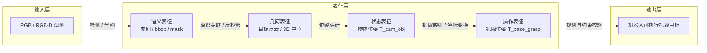

### 1.1 检测结果与抓取目标的输出空间差异

目标检测与实例分割解决的是目标在图像中的语义归属与区域归属问题，而抓取控制解决的是末端执行器应以何种位姿接近、接触并约束物体的问题。二者之间的差异，并不主要体现为精度差异，而体现为**输出空间的差异**：前者属于图像平面表征，后者属于刚体状态与接触动作表征。

| 表示层级 | 典型输出 | 信息维度 | 可支撑的下游任务 | 尚不能确定的信息 |
|---|---|---:|---|---|
| 检测框（bbox） | `(x_min, y_min, x_max, y_max)` | 4 | 目标粗定位、ROI 裁剪 | 深度、姿态、接近方向 |
| 实例掩膜（mask） | 目标像素集合 | 图像域 | 前景分离、深度筛选 | 三维位置、物体朝向、夹爪开合 |
| 三维中心 | `(x, y, z)` | 3 | 粗定位、垂直接近 | 旋转姿态、局部可抓区域 |
| 物体位姿 | `T_cam_obj` 或 `T_base_obj` | 6 | 刚体状态描述、位姿驱动操作 | 抓取点、夹爪姿态、避碰偏置 |
| 抓取位姿 | `T_base_grasp + width + approach` | 6+ | 机器人执行 | 仍需 IK 与碰撞校验 |

从这一表可以看出，若系统仅提供 bbox，则抓取点仍可能落在桌面、背景或物体边缘；若仅提供 mask，则目标虽已与背景分离，但尚未完成三维定位；若仅提供三维中心，则末端执行器虽可到达目标附近，但仍难以为细长、倾斜或具有显著方向性的物体构造稳定夹持姿态；即使已获得 object pose，也仍需完成从物体状态到夹爪动作的进一步映射。因此，抓取任务要求的并非单一检测结果，而是逐层丰富的表征体系。

### 1.2 机器人感知的三层目标：识别、定位与定姿

机器人操作中的视觉感知，可归纳为三个递进层级：**识别（Recognition）—定位（Localization）—定姿（Pose Estimation）**。三者共同构成从语义理解到几何恢复再到刚体状态估计的基本链条。

| 层级 | 核心问题 | 主要输入 | 主要输出 | 典型方法 | 对抓取的作用 |
|---|---|---|---|---|---|
| 识别 | 目标是什么 | RGB 图像 | 类别、bbox、mask | YOLO、Mask R-CNN、SAM | 约束处理对象与感兴趣区域 |
| 定位 | 目标在哪里 | mask + depth | 3D 中心、目标点云 | 反投影、聚类、滤波 | 提供空间位置与几何载体 |
| 定姿 | 目标朝向如何 | 目标点云 / RGB-D / CAD | 6D object pose | PnP、配准、回归 | 为抓取姿态对齐提供依据 |

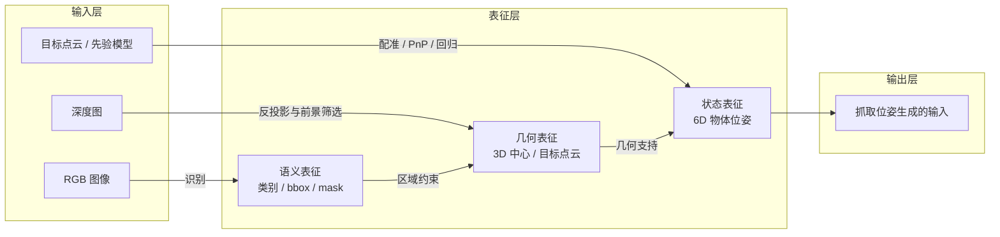

需要指出的是，在具体算法实现中，定位与定姿往往可以由同一方法联合输出；但在系统分析上，将两者区分仍然是必要的。定位误差主要影响末端执行器能否到达目标区域，定姿误差则主要影响夹持方向与接触稳定性。因而，在调试过程中，应分别分析深度尺度、前景分割、几何完整性与姿态歧义等不同误差来源。

### 1.3 两类系统结构：模块化感知与端到端感知

按照中间表征是否被显式构造，机器人抓取系统可划分为两类典型体系结构：**模块化感知**与**端到端感知**。前者通过一系列显式中间表征逐步逼近抓取目标，后者则尝试由原始观测直接映射到动作候选或抓取评分。

| 比较维度 | 模块化感知 | 端到端感知 |
|---|---|---|
| 基本范式 | 检测 → 分割 → 点云 → 位姿 → 抓取 | 图像 / 点云直接输出抓取动作或抓取评分 |
| 中间表征 | 显式、可检查 | 隐式、弱可解释 |
| 误差特征 | 易出现级联误差 | 难定位局部失效来源 |
| 数据需求 | 可分模块训练，标签成本较低 | 依赖大量抓取样本或高质量仿真 |
| 工程维护 | 联调复杂，但便于替换单模块 | 部署统一，但调参与诊断困难 |
| 适用场景 | 工业抓取、教学实验、可靠性优先 | 开放类别、策略多样、研究探索 |

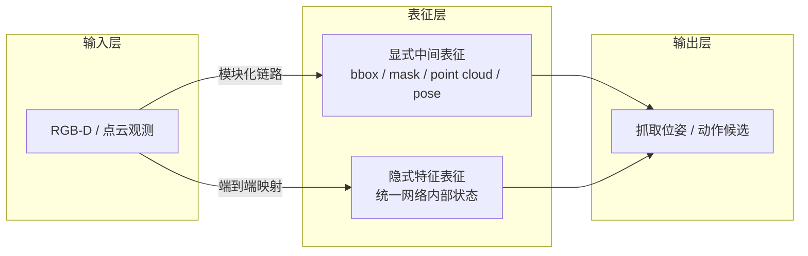

本讲采用模块化路线作为主线。其原因不在于端到端方法缺乏研究价值，而在于模块化路线更适合建立清晰的知识结构，并便于将误差分别归因于语义、几何、状态估计与动作生成等不同阶段。

### 1.4 本讲学习路径

本讲后续内容按照“二维感知 → 三维重建 → 位姿估计 → 抓取执行”的顺序展开，其核心在于说明：前一阶段所形成的表征，如何成为后一阶段的输入约束。

| 步骤 | 功能模块 | 核心输出 | 对应章节 |
|---|---|---|---|
| 1 | RGB-D 采集与标定 | RGB、Depth、内参 | 3.1 |
| 2 | 目标检测与实例分割 | bbox、mask | 3.2、3.3 |
| 3 | 目标点云提取与预处理 | target point cloud | 3.4 |
| 4 | 6D 位姿估计 | object pose | 第 4 节 |
| 5 | 抓取位姿生成 | grasp / pre-grasp / width | 5.1–5.3 |
| 6 | 手眼标定与坐标转换 | `T_base_grasp` | 5.4 |
| 7 | 可达性校验与动作执行 | 关节轨迹与抓取动作 | 5.5–5.6、6 节 |

**本节小结：** 在机器人抓取任务中，视觉系统所提供的最终有效输出，并非检测框，也非物体位姿本身，而是机器人基座坐标系下满足执行约束的抓取目标。第 3 节负责构造高质量目标点云，第 4 节负责恢复物体 6D 位姿，第 5 节则负责将物体状态进一步转化为满足坐标变换与机械约束的操作表征。

## 2 机器人感知任务体系与标准抓取流水线

### 2.1 机器人感知任务分类图谱

机器人视觉感知是一个庞大的任务集合，不同任务对应不同的输出形式、技术路线与应用场景。建立清晰的分类体系，有助于精准定位位姿估计在整个领域中的位置，理解各任务之间的依赖与递进关系。

#### 2.1.1 按任务目标划分：语义、几何与属性三大类

按照任务的核心输出目标，机器人感知可分为语义类、几何类、属性类三大分支，三者从"看懂是什么"到"量清在哪里"再到"知道怎么用"逐级深化。

**语义类任务：** 核心解决"是什么"的问题，输出语义标签与区域信息

- 图像分类：判断整张图像的主体类别，是最基础的语义任务；
- 目标检测：定位图像中所有目标的类别与矩形边界框，兼顾语义与粗定位；
- 实例分割：像素级区分每个独立物体的轮廓，实现目标与背景的精确分离；
- 语义分割：像素级区分场景的类别区域（如桌面、地面、墙壁），用于环境整体理解。

**几何类任务：** 核心解决"在哪里、朝哪"的问题，输出空间几何信息

- 3D中心点估计：输出物体三维质心坐标，是最低粒度的几何输出；
- 6D物体位姿估计：输出物体完整的三维位置与旋转姿态，是抓取操作的核心中间表示；
- 抓取位姿估计：直接输出夹爪的可执行位姿，是几何感知的最终操作目标；
- 深度估计：从单张RGB图像预测场景深度图，实现单目到三维的映射。

**属性与Affordance类任务：** 核心解决"能怎么用"的问题，输出物体的操作属性

- 物理属性估计：尺寸、重量、材质、重心等物理特性的感知；
- Affordance感知：判断物体的可操作区域（如杯柄、瓶盖、按钮）与可执行动作；
- 力觉触觉感知：通过接触传感器感知交互状态，用于抓取过程中的闭环反馈。

#### 2.1.2 按输入模态划分：从单目到多传感器融合

输入模态决定了感知的信息上限，按照传感器配置可分为四类，信息丰富度与系统复杂度逐级提升。

- **单RGB模态：** 仅依靠彩色相机输入，硬件成本最低，但缺乏直接的几何深度信息，三维感知依赖算法推理，精度有限。
- **RGB‑D模态：** 彩色图像与深度图同步输入，同时提供语义纹理与几何距离信息，是当前机器人抓取感知的主流标准配置。
- **多相机模态：** 多台相机从不同视角协同观测，减少遮挡盲区，提升位姿估计精度，适用于精密操作与复杂场景。
- **多传感器融合：** 融合视觉、激光雷达、力觉、IMU等多种传感器信息，适配动态、非结构化的复杂真实场景，是高阶人形机器人与移动操作机器人的发展方向。

**本节小结：** 机器人感知可从任务目标与输入模态两个维度建立分类体系：语义、几何、属性三类任务逐级深化，共同支撑机器人的操作能力；从单RGB到多传感器融合的模态升级，不断提升感知的信息上限与环境适应性。位姿估计与抓取位姿生成是连接语义感知与物理操作的核心几何任务。

### 2.2 位姿驱动抓取的完整流水线

位姿驱动是当前工业与服务机器人抓取领域最成熟、落地最广泛的技术范式。它以6D物体位姿为核心中间表示，串联起从图像输入到机械臂执行的完整流程，是工程实践中必须掌握的标准流水线。

#### 2.2.1 标准8步流程：从图像采集到机械臂执行

完整的位姿驱动抓取包含8个串行环节，前序环节的输出是后序环节的输入，形成严格的依赖链路。

1. **RGB‑D图像采集：** 通过深度相机同步获取时间对齐、像素对齐的彩色图像与深度图，是整个感知系统的数据源头。采集质量直接决定了后续所有环节的性能上限。
2. **目标检测：** 在RGB图像中运行目标检测器，输出目标物体的类别、边界框与置信度，快速缩小后续处理的空间范围。
3. **实例分割：** 基于检测框或文本提示生成像素级实例掩膜，精确分离目标物体与背景像素，消除背景噪声对后续几何计算的干扰。
4. **目标点云提取：** 用实例掩膜过滤深度图，通过像素反投影生成目标物体的三维点云，并完成滤波、去噪、降采样等预处理。
5. **6D位姿估计：** 基于目标点云与RGB特征，结合物体先验模型，计算物体在相机坐标系下的完整6D位姿矩阵。
6. **抓取位姿生成：** 结合物体位姿、几何尺寸与抓取策略，计算夹爪的接近方向、开合尺度、安全偏移与姿态匹配关系，生成可执行的抓取位姿与预抓取位姿。
7. **基座坐标转换：** 通过手眼标定得到的外参矩阵，将相机坐标系下的抓取位姿转换为机器人基座系下的位姿，完成视觉空间到机器人空间的映射。
8. **机械臂执行：** 运动规划器基于目标抓取位姿生成无碰撞运动轨迹，驱动机械臂完成接近、抓取、抬升的完整动作。

#### 2.2.2 各环节失效的误差传导效应

流水线的误差具有逐级传导与放大的特性，任一环节的失效都会对最终抓取结果产生不同程度的影响。

- **检测漏检/误检：** 导致后续所有环节无法正确启动或定位到错误目标，抓取直接失败；
- **分割轮廓偏差：** 背景点云混入目标点云，导致位姿估计出现系统性偏移；
- **点云质量差：** 深度空洞、噪声过多，导致位姿估计收敛失败或输出错误结果；
- **位姿估计偏差：** 平移与旋转误差直接导致抓取姿态错位，出现夹偏、撞物或抓空；
- **标定误差：** 产生全场景的系统性偏移，所有抓取结果出现固定方向的偏差。

理解误差传导规律，是真机调试时快速定位故障根源的核心基础。

### 2.3 核心概念辨析：bbox / mask / center point / object pose / grasp pose

初学者在入门机器人视觉抓取时，最容易混淆不同层级的感知输出概念。清晰区分五类核心输出的定义、维度、用途与精度要求，是建立正确认知的前提。

| 概念 | 定义 | 维度 | 用途 | 精度要求 |
|------|------|------|------|----------|
| bbox（边界框） | 图像平面上的2D矩形 | 4参数 $(x,y,w,h)$ | 目标粗定位，缩小搜索范围 | 像素级（通常容忍几个像素偏差） |
| mask（实例掩膜） | 像素级二值轮廓 | 图像尺寸 | 精确分离目标与背景 | 亚像素级边缘精度 |
| center point（3D中心点） | 物体三维质心坐标 | 3D $(x,y,z)$ | 确定物体位置，用于垂直接近 | 毫米级（<5mm） |
| object pose（6D物体位姿） | 位置+朝向（旋转矩阵/四元数） | 6D $(x,y,z,\text{roll},\text{pitch},\text{yaw})$ | 描述物体完整空间状态 | 平移<3mm，旋转<2° |
| grasp pose（抓取位姿） | 夹爪的位置、姿态、开合度、接近方向等 | 6D+附加参数 | 直接驱动机械臂执行 | 最高，需满足力封闭与避碰 |

**核心结论：** 检测和分割都是中间手段，生成可执行的grasp pose才是机器人感知的最终目标。所有前端感知算法的性能优劣，最终都要以抓取成功率这一物理指标作为评判标准。

### 2.4 不同硬件平台的感知需求差异

不同形态的机器人硬件，在自由度、安装方式、操作场景上存在显著差异，对感知系统的需求侧重点也各不相同。不存在放之四海而皆准的感知方案，必须结合硬件特性与应用场景做针对性设计。

#### 2.4.1 SO101桌面机械臂：固定视角下的精准定位

SO101类小型桌面机械臂通常为6自由度固定基座配置，搭配单台固定深度相机，面向桌面分拣、简单抓取等场景。

- **核心需求：** 单目标、固定视角，核心诉求是高重复定位精度与稳定性；
- **技术特点：** 相机与基座相对位置固定，一次标定可长期使用；场景简单，物体种类有限；
- **选型建议：** 优先采用模块化流水线，使用YOLO做检测、ICP做位姿精配准，追求稳定可靠。

#### 2.4.2 xLeRobot移动操作：多坐标系与动态场景适配

xLeRobot类移动操作机器人由移动底盘 + 机械臂组成，相机分布在头部与腕部，面向动态室内环境的移动抓取任务。

- **核心需求：** 多坐标系统一、动态场景目标跟踪、底盘晃动补偿、全局搜索与近距离精抓结合；
- **技术特点：** 需要同时处理眼在手外（头部相机）与眼在手上（腕部相机）两套标定关系；底盘运动带来的视角变化要求感知具备跟踪能力；
- **选型建议：** 采用"全局粗定位 + 局部精定位"的两级感知架构，兼顾搜索效率与抓取精度。

#### 2.4.3 Imeta‑Y1科研机械臂：精密操作的高位姿精度要求

Imeta‑Y1类高精度科研机械臂面向精密插拔、微装配等复杂操作任务，对位姿精度要求极高。

- **核心需求：** 亚毫米级的6D位姿精度、小部件精细分割、多视角融合观测；
- **技术特点：** 任务对旋转角度误差极其敏感，对位姿估计的鲁棒性与精度上限要求远高于普通抓取场景；
- **选型建议：** 采用多相机阵列 + 高精度ICP配准的方案，配合力控末端做接触式补偿。

#### 2.4.4 Unitree G1人形机器人：全身感知与多视角协同

Unitree G1类人形机器人具备全身自由度，多相机分布在头部、手部等位置，面向非结构化家庭与服务场景。

- **核心需求：** 全身感知空间统一、多视角快速切换、目标与双手相对位姿匹配、开放类别泛化能力；
- **技术特点：** 场景高度非结构化，物体类别多变，要求感知系统具备强泛化性与快速适配能力；
- **选型建议：** 采用模块化与端到端混合架构，基础通用任务用开放词汇模型，精密操作任务切换几何精配准。

## 3 视觉感知前端：目标检测、实例分割与目标点云表示构造

视觉感知前端的任务，是把原始 RGB-D 观测转化为**可用于位姿估计的目标点云表示**。该过程并非简单的图像裁剪，而是由二维语义约束、深度几何恢复与点云整形三个阶段构成。其输出质量直接决定后续 6D 位姿估计与抓取位姿生成的可靠性。

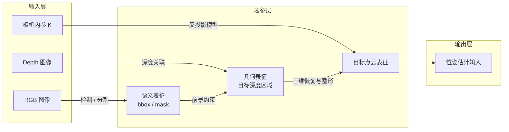

### 3.1 输入模态：RGB-D 数据与相机拓扑

RGB-D 观测为前端提供了两类互补信息：RGB 图像提供语义可分性线索，深度图提供像素到空间的测距量，内外参则共同确定从像素域到机器人空间的映射关系。

| 输入项 | 提供的信息 | 典型用途 | 主要误差来源 |
|---|---|---|---|
| RGB 图像 | 颜色、纹理、边缘 | 检测、分割、类别识别 | 光照变化、遮挡、反光 |
| Depth 图像 | 像素深度值 | 反投影、点云恢复、3D 定位 | 深度空洞、飞点、量程误差 |
| 相机内参 `K` | `f_x, f_y, c_x, c_y` | 像素到相机坐标变换 | 标定偏差、尺度错误 |
| 手眼外参 | 相机与机器人位姿关系 | 相机系到基座系转换 | 外参漂移、坐标系方向混淆 |

从系统布置角度看，常见观测拓扑可分为三类：

| 拓扑形式 | 相机位置 | 优势 | 局限 | 典型场景 |
|---|---|---|---|---|
| Eye-to-Hand | 固定于工作空间外 | 视野完整、布置稳定 | 遮挡敏感、远距离精度下降 | 桌面分拣、上下料 |
| Eye-in-Hand | 固定于末端执行器 | 近距离精度高、局部复检能力强 | 负载增加、采样速度受机械臂限制 | 精细抓取、装配 |
| 多相机协同 | 顶视 / 头部 / 腕部组合 | 视角互补、减少盲区 | 标定与融合复杂 | 移动操作、人形系统 |

### 3.2 目标检测：二维候选区域的建立

目标检测的功能，是在整幅图像中建立受约束的候选区域，从而缩小后续分割与几何恢复的处理范围。检测结果本身并不直接给出抓取点，而是为后续表征构造提供语义先验与区域先验。

| 输出项 | 含义 | 在后续链路中的作用 |
|---|---|---|
| `class` | 目标类别 | 关联抓取策略库、任务约束 |
| `bbox` | 二维边界框 | 限定分割与深度关联范围 |
| `score` | 检测置信度 | 过滤误检、排序候选目标 |

常见方法可按任务条件划分为以下几类：

| 方法类别 | 代表实现 | 特点 | 适用场景 |
|---|---|---|---|
| 闭集检测 | YOLO 系列 | 实时性高、部署成熟 | 已知类别、边缘设备、教学实验 |
| 开放词汇检测 | Grounding DINO / Grounded-SAM | 文本提示驱动、类别开放 | 开放类别、语言交互任务 |
| 时序稳定检测 | 检测 + 跟踪 | 利于视频流稳定输出 | 动态目标、移动平台 |

在系统分析中，检测阈值不应只依据 mAP 进行设置，还应结合其对后续点云纯净度的影响：误检会将背景深度引入几何恢复模块，漏检则会使整个感知链无法启动。

### 3.3 实例分割：由候选区域到目标前景

若仅依据 bbox 对深度图进行裁剪，则矩形区域通常同时包含目标、桌面及邻近物体，进而在反投影后形成明显的背景混入。因此，实例分割在本链路中的功能，不是“更精细的检测”，而是对深度恢复域施加前景约束，使后续三维恢复聚焦于目标对象本身。

| 表示形式 | 保留对象 | 背景混入风险 | 对三维恢复的影响 |
|---|---|---|---|
| 整幅图像 | 场景全部像素 | 最高 | 反投影得到完整场景点云 |
| bbox 裁剪 | 矩形区域像素 | 中等 | 桌面和邻物易混入目标点云 |
| mask 筛选 | 目标前景像素 | 最低 | 更利于恢复目标专属点云 |

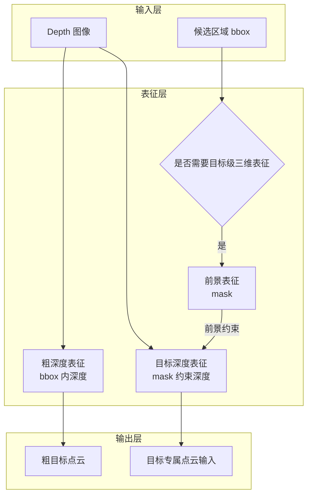

从误差传播角度看，实例分割通常带来三类典型误差：其一，边界漏分会导致目标尺寸被系统性低估；其二，背景混入会导致点云质心与主方向偏移；其三，遮挡粘连会使多个物体错误合并，从而使后续位姿估计与抓取规划建立在错误的几何对象上。

### 3.4 目标点云生成与预处理

目标点云的生成可理解为从像素域表征到欧氏空间表征的映射过程。其第一步是利用前景 mask 筛选有效深度像素，第二步是基于相机内参将这些像素反投影至相机坐标系。之后还需通过若干整形操作，使点云成为适于位姿估计的稳定几何表示。

#### 3.4.1 像素反投影模型

设相机内参矩阵为：

$$
K = \begin{bmatrix}
 f_x & 0 & c_x \\
 0 & f_y & c_y \\
 0 & 0 & 1
\end{bmatrix}
$$

对于深度像素 $(u,v,d)$，其在相机坐标系下的三维点 $\mathbf{p}_c = (X,Y,Z)^T$ 可表示为：

$$
X = \frac{(u - c_x) \cdot d}{f_x}, \qquad
Y = \frac{(v - c_y) \cdot d}{f_y}, \qquad
Z = d
$$

该映射给出的是**相机坐标系下的观测点估计**，而非机器人基座坐标系下的控制量。因此，第 3 节的输出仍属于视觉几何表征，尚未完成机器人控制坐标系转换。

#### 3.4.2 点云预处理流程

| 处理步骤 | 目的 | 典型参数 | 处理结果 |
|---|---|---|---|
| 前景筛选 | 去除非目标深度 | `mask > 0` | 目标深度图 |
| 反投影 | 像素恢复为三维点 | `K, depth_scale` | 原始目标点云 |
| 直通滤波 | 裁剪工作空间外点 | `z_min, z_max` | 有效空间范围 |
| 统计滤波 | 剔除离群飞点 | `nb_neighbors, std_ratio` | 点云更平滑稳定 |
| 体素降采样 | 降低点数与计算量 | `voxel_size` | 配准效率提升 |
| 导出存储 | 供位姿估计模块调用 | `.pcd / .ply` | 标准化目标点云 |

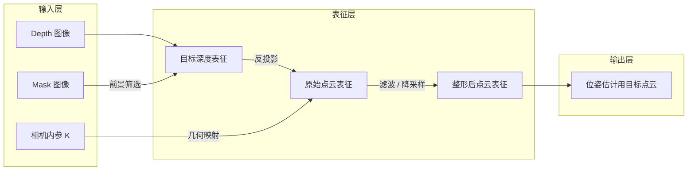

#### 3.4.3 典型误差现象与修正路径

| 现象 | 优先检查项 | 处理建议 |
|---|---|---|
| 点云整体倾斜或尺度异常 | 内参、深度尺度 | 核对 `f_x, f_y, c_x, c_y` 与 `depth_scale` |
| 边缘出现大量飞点 | 深度边界、反光区域、mask 边界 | 先修正分割，再调整统计滤波参数 |
| 目标被截断 | `z_min / z_max` 设置过窄、mask 漏分 | 放宽空间阈值或改善前景提取 |
| 点数过多导致配准缓慢 | 点云过密 | 增大 `voxel_size`，但避免过度降采样 |
| 多物体粘连 | 分割失败或遮挡严重 | 重做实例分割，必要时做连通域拆分 |

这些现象分别对应不同层级的模型假设失配：尺度异常通常源于内参或深度尺度错误，飞点与空洞对应测距噪声和边界不连续，粘连则对应前景约束失败。将现象与表征假设对应起来，是理解误差传播机制的关键。

#### 3.4.4 实验索引与代码入口

本讲正文仅保留实验入口与代码索引，详细实操过程建议单独组织为实验讲义。与本节对应的代码位于：[Visual Perception 目录](../../code/lecture06/Visual%20Perception/)。

| 项目 | 说明 |
|---|---|
| 主流程脚本 | [`pipeline_from_syllabus.py`](../../code/lecture06/Visual%20Perception/pipeline_from_syllabus.py) |
| 交互式流程脚本 | [`interactive_depth_pipeline.py`](../../code/lecture06/Visual%20Perception/interactive_depth_pipeline.py) |
| 典型输入 | `rgb.png`、`depth.png`、`mask.png`、`intrinsics.json` |
| 典型输出 | `masked_target_clean.pcd`、阶段可视化结果、点数统计 |
| 教学目标 | 完成“二维前景 → 三维目标点云”的前端闭环 |

建议课堂展示时按照“深度图 → mask → 原始点云 → 清洗后点云”的顺序观察结果，而不是直接展示最终 `.pcd` 文件，以便说明前端误差如何逐级传递至后续位姿估计模块。

### 3.5 方法选型小结

| 任务 | 推荐工具 | 选择理由 |
|---|---|---|
| 固定类别实时检测 | YOLO / YOLO-seg | 实时性好、部署成熟、边缘设备友好 |
| 开放词汇目标定位 | Grounded-SAM / Grounded-SAM2 | 支持文本提示，适配开放类别物体 |
| 通用实例分割 | SAM / SAM2 | 提示灵活，便于快速获得目标 mask |
| 点云处理 | Open3D | 提供滤波、配准、可视化等完整工具链 |
| 真机 RGB-D 数据采集 | RealSense SDK 或相机厂商 SDK | 便于获得对齐 RGB、Depth 与内参 |

**本节小结：** 第 3 节的核心输出不是 bbox，也不是 mask，而是经过前景约束、反投影与几何整形后形成的目标点云表征。该表征既是第 4 节 6D 位姿估计的直接输入，也是第 5 节抓取位姿生成的几何基础。

## 4 6D物体位姿估计：原理与主流技术方案

### 4.1 什么是6D位姿：平移与旋转的数学表示

6D位姿（6 Degree‑of‑Freedom Pose）是描述刚体在三维空间中完整状态的标准表示，包含3个平移自由度与3个旋转自由度，是连接视觉感知与机器人操作的核心中间量。清晰理解其数学表示，是掌握位姿估计算法的基础。

#### 4.1.1 平移自由度：物体三维空间位置的量化描述

平移描述物体坐标系原点在参考坐标系（相机坐标系或机器人基座坐标系）中的三维空间位置，用三维向量 $\mathbf{t} = [x, y, z]^T$ 表示，单位通常为米或毫米。

- $x, y$ 对应物体在垂直于相机光轴平面内的水平与垂直位置；
- $z$ 对应物体沿相机光轴方向的深度距离。

平移分量决定了物体"在空间哪里"，是机械臂能够到达目标区域的基础前提。

#### 4.1.2 旋转自由度：三种主流旋转表示方法对比

旋转描述物体坐标系相对于参考坐标系的空间朝向，共有3个独立自由度。工程中常用三种表示方式，各有优劣与适用场景。

- **欧拉角：** 用roll（绕X轴）、pitch（绕Y轴）、yaw（绕Z轴）三个角度描述旋转。优势是直观易懂，便于人类理解与调试；劣势是存在万向锁（Gimbal Lock）问题，特定角度下自由度退化，插值与求导不便。
- **四元数：** 用四维单位向量 $\mathbf{q} = [w, x, y, z]^T$ 描述旋转，满足 $w^2 + x^2 + y^2 + z^2 = 1$。优势是无万向锁、计算高效、插值平滑；劣势是直观性差，不便于人工解读。四元数是机器人控制系统与位姿估计算法中最常用的旋转表示形式。
- **旋转矩阵：** 用 $3 \times 3$ 的正交矩阵 $R$ 描述旋转，三个列向量分别对应物体坐标系三个轴在参考坐标系下的方向。优势是数学性质严谨，可直接用于点坐标变换；劣势是参数冗余（9个参数描述3个自由度），不适合直接作为网络回归目标。

#### 4.1.3 齐次变换矩阵：位姿的统一工程表达形式

工程实践中，通常将平移向量与旋转矩阵整合为 $4 \times 4$ 的齐次变换矩阵 $T \in SE(3)$，作为位姿的标准输出与交换格式：

$$T = \begin{bmatrix} \mathbf{R} & \mathbf{t} \\ \mathbf{0}^{\mathsf{T}} & 1 \end{bmatrix}$$

该矩阵可以直接完成不同坐标系之间的点坐标变换：对于任意一点在物体坐标系下的坐标 $P_{\text{obj}}$，其在相机坐标系下的坐标 $P_{\text{cam}}$ 可通过左乘变换矩阵得到：

$$P_{\text{cam}} = T \cdot P_{\text{obj}}$$

齐次变换矩阵的优势在于可以通过矩阵乘法方便地实现多级坐标系的级联变换，是手眼标定、坐标转换链路中的标准数据结构。

### 4.2 位姿估计的三类技术路线

6D位姿估计经过多年发展，形成了三类技术路线清晰、适用场景各异的方法体系：传统几何法、模板匹配法与深度学习法。三者并非简单的替代关系，而是在不同场景下各有最优解。

#### 4.2.1 传统几何法：基于点云配准的ICP系列

- **核心思想：** 将观测得到的目标点云与物体的CAD模型点云进行迭代配准，寻找使两组点云最优对齐的刚体变换矩阵。
- **代表算法：** ICP（迭代最近点）及其众多变体，包括点到点ICP、点到平面ICP、截断ICP等。
- **算法流程：** 给定初始位姿、观测目标点云与模型参考点云；为每个观测点在模型点云中寻找最近对应点；求解使对应点距离总和最小的刚体变换；更新位姿，重复迭代直到误差收敛。
- **优势：** 精度高，收敛后可达亚毫米级；无需训练，纯几何驱动，可解释性强；有成熟的开源实现。
- **劣势：** 对初始位姿要求高，初始偏差过大易陷入局部最优；对遮挡、离群点敏感；无纹理、对称物体匹配难度大。
- **适用场景：** 已知物体精确三维模型、初始位姿偏差较小的工业场景，常用作深度学习粗估计后的位姿精化环节。

#### 4.2.2 模板匹配法：基于三维模型的姿态对齐

- **核心思想：** 离线预先渲染物体在不同视角、不同姿态下的二维/三维模板，构建模板库；在线将输入图像/点云与模板库进行特征匹配，找到最相似模板对应的姿态。
- **代表方案：** 经典LINEMOD算法及其深度学习增强变体。
- **算法流程：** 离线阶段对物体CAD模型进行全视角采样渲染，提取梯度、深度等鲁棒特征，构建模板库；在线阶段提取输入图像的对应特征，与模板库快速匹配，输出相似度最高的模板对应的位姿。
- **优势：** 推理速度快，适合实时场景；对低纹理、无纹理物体友好；对硬件算力要求低。
- **劣势：** 姿态精度有限，通常为粗估计；模板库占用存储空间大；新物体需要重新建库，泛化能力差。
- **适用场景：** 结构化工业分拣场景、固定物体模型、对实时性要求高但精度要求适中的任务。

#### 4.2.3 深度学习法：从两阶段方案到端到端范式

深度学习方法利用神经网络从数据中学习位姿特征，根据架构设计可分为两阶段与端到端两大类，是当前位姿估计领域的研究主流。

**1. 两阶段方案**

- **核心逻辑：** 第一阶段完成目标检测与实例分割，第二阶段单独进行6D位姿回归；
- **典型代表：** SAM‑6D，以SAM的分割结果为基础，后续接位姿估计头；
- **特点：** 任务解耦清晰，便于分模块调试；分割精度直接决定位姿上限；可复用成熟的检测分割模型。

**2. 端到端方案**

- **直接回归型：** 网络输入原始图像/点云，直接输出完整的旋转与平移参数。代表为FoundationPose，通过几何重构与优化实现强泛化性。优势是泛化能力强，对遮挡场景鲁棒，可适配未知类别物体；劣势是模型参数量大，推理速度慢，训练数据依赖度高。
- **检测驱动型：** 基于YOLO等目标检测架构扩展，单次前向传播同步预测类别、检测框与3D包围盒角点的2D投影，再通过PnP几何算法求解6D位姿。代表为YOLO‑6D。优势是推理速度快，模型轻量化，支持实时部署；劣势是泛化能力有限，依赖已知物体3D模型，遮挡与对称场景精度下降明显。

**三类技术路线对比：**

| 技术路线 | 代表算法 | 核心优势 | 核心劣势 | 适用场景 |
|----------|----------|----------|----------|----------|
| 传统几何法 | ICP | 精度高、可解释、无需训练 | 依赖初始值、对遮挡敏感 | 工业精配准、位姿精化 |
| 模板匹配法 | LINEMOD | 速度快、低纹理友好 | 姿态精度有限、泛化差 | 工业分拣、固定物体 |
| 深度学习‑两阶段 | SAM‑6D | 解耦清晰、泛化较好 | 流程较长 | 通用服务机器人 |
| 深度学习‑端到端 | FoundationPose | 泛化强、遮挡鲁棒 | 参数量大、速度慢 | 非结构化未知物体 |
| 深度学习‑检测驱动 | YOLO‑6D | 速度快、轻量化 | 泛化有限、依赖模型 | 实时结构化场景 |

工程实践中常采用"深度学习粗估计+ICP精配准"的混合方案，兼顾速度、泛化性与精度，是当前落地最广泛的组合模式。

### 4.3 典型开源方案对比：FoundationPose / SAM‑6D / YOLO‑6D

FoundationPose、SAM‑6D与YOLO‑6D是当前工程与科研领域最具代表性的三类开源位姿估计方案，分别对应端到端通用型、两阶段融合型、检测驱动实时型三条技术路径。

| 对比维度 | FoundationPose | SAM‑6D | YOLO‑6D |
|----------|---------------|--------|----------|
| 技术路线 | 端到端（直接回归） | 两阶段（分割+位姿） | 检测驱动（PnP求解） |
| 输入 | RGB‑D图像 | RGB‑D图像 | RGB图像 |
| 是否需要CAD模型 | 否（零样本） | 是（可选） | 是（需要3D模型） |
| 推理速度 | 较慢（>1s） | 中等（0.5‑1s） | 极快（<50ms） |
| 泛化能力 | 强（未知物体） | 中等（已知类别） | 弱（固定物体） |
| 精度 | 高 | 高 | 中等 |
| 适用场景 | 科研、通用抓取 | 服务机器人 | 工业实时结构化 |

**选型决策建议：**

- **工业结构化场景，固定物体、追求实时性：** 优先选择YOLO‑6D+ICP精化的方案，兼顾实时性与精度。
- **服务机器人场景，物体类别多变、追求泛化性：** 优先选择SAM‑6D方案，依托SAM的零样本分割能力，适配家庭、办公等开放场景。
- **科研前沿场景，未知物体、追求通用能力：** 优先选择FoundationPose方案，其强零样本泛化能力适合探索未知物体操作。

**选型核心原则：** 优先匹配场景需求，不盲目追求SOTA。在满足任务要求的前提下，优先选择部署简单、维护成本低、调试方便的方案。

### 4.4 位姿估计的精度评价指标

位姿估计的性能需要量化指标进行客观评估，不同指标从不同维度衡量精度。掌握评价指标是算法选型、效果评测与故障排查的基础。

#### 4.4.1 ADD 与 ADD‑S：位姿精度的核心综合指标

- **ADD（Average Distance）指标：** 将物体模型上的所有点，通过估计位姿变换后，与真值位姿变换后的对应点计算欧氏距离，取所有点距离的平均值。物理含义是衡量估计位姿与真值位姿之间的整体偏差，距离越小精度越高。合格阈值通常以物体直径的10%作为判定标准。
- **ADD‑S 指标：** 针对对称物体提出，因为对称物体旋转后点的对应关系不唯一。对于每个估计位姿变换后的点，不匹配固定对应点，而是匹配模型点云中最近的点，再计算平均距离。专门用于旋转对称物体的位姿精度评估。
- **AUC（Area Under Curve）：** 绘制不同误差阈值下的位姿准确率曲线，计算曲线下的面积。比单一阈值更全面地反映算法在不同精度要求下的整体性能。

#### 4.4.2 分项误差指标：平移误差与旋转误差

综合指标便于整体对比，但故障排查时需要分项指标定位误差来源。

- **平移误差：** 估计位姿的平移向量与真值平移向量之间的欧氏距离，单位通常为毫米。直接反映物体位置估计的准确程度。典型合格标准：桌面抓取场景通常要求平移误差小于5mm。
- **旋转误差：** 估计旋转与真值旋转之间的测地线角度差，单位为度。反映物体朝向估计的准确程度，偏差会在长臂展处被放大。典型合格标准：桌面抓取场景通常要求旋转误差小于5°。

分项误差可以帮助快速定位问题：平移误差大通常源于深度质量差或标定偏差，旋转误差大通常源于点云特征不足或对称歧义。

## 5 抓取位姿生成：由物体位姿到机器人可执行目标

第 4 节输出的 `object pose` 描述的是物体在空间中的刚体状态，而机器人控制系统所需要的，则是末端执行器在机器人基座坐标系下的**可执行抓取目标**。因此，抓取位姿生成的任务，并不是简单地“选一个抓取点”，而是将物体状态表征转化为满足几何、运动学与碰撞约束的动作表征。

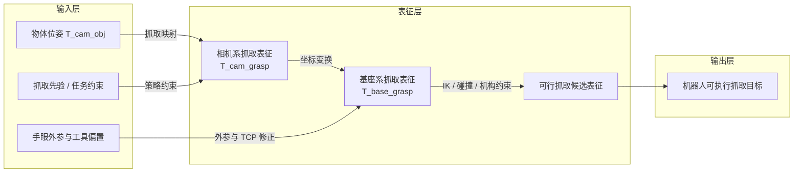

### 5.1 object pose 与 grasp pose 的区别

物体位姿 `object pose` 与抓取位姿 `grasp pose` 分别对应两类不同的表征对象：前者描述物体坐标系相对于参考坐标系的刚体变换，后者描述夹爪工具中心点（TCP）相对于机器人基座坐标系的目标变换。二者虽相互关联，但并不等价。

| 概念 | 描述对象 | 典型形式 | 回答的问题 | 尚未包含的信息 |
|---|---|---|---|---|
| object pose | 物体坐标系 | `T_cam_obj` / `T_base_obj` | 物体在哪里、朝向如何 | 抓取点、接近方向、夹爪开口 |
| grasp pose | 夹爪 TCP 坐标系 | `T_base_grasp + width` | 夹爪应到哪里、如何对齐 | 仍需 IK、碰撞与执行校验 |

若在物体坐标系下预定义抓取模板 \({}^{O}T_{G}\)，则 Eye-to-Hand 情形下有：

$$
{}^{B}T_{G} = {}^{B}T_{C} \, {}^{C}T_{O} \, {}^{O}T_{G}
$$

在 Eye-in-Hand 情形下，由于相机固定于末端，还需联合当前末端位姿：

$$
{}^{B}T_{G} = {}^{B}T_{E} \, {}^{E}T_{C} \, {}^{C}T_{O} \, {}^{O}T_{G}
$$

因此，从 object pose 到 grasp pose 的计算，本质上是将**物体状态表征**映射为**动作构型表征**。该映射同时受物体几何、夹爪结构和任务约束三方面的共同限制。

### 5.2 抓取位姿的参数化构成

抓取位姿不是单一的空间点，而是由抓取点、接近方向、姿态对齐、开合宽度与安全偏移共同定义的参数组。它们共同决定夹爪如何接近目标、如何完成接触以及如何保持稳定约束。

| 要素 | 物理含义 | 典型确定方式 | 误差后果 |
|---|---|---|---|
| 抓取点 $\mathbf{p}_{g}$ | 夹爪中心应到达的位置 | 质心、局部平面中心、策略关键点 | 夹空、夹边、接触不稳定 |
| 接近方向 $\mathbf{a}$ | 夹爪进入目标的方向 | 桌面法线、表面法线、主轴约束 | 提前碰撞、接近受阻 |
| 姿态矩阵 $R_g$ | 夹爪局部坐标系与目标的对齐关系 | 由接近方向与开合方向构造 | 手指不贴合、姿态偏转 |
| 开合宽度 $w_g$ | 夹爪闭合前所需开口 | 局部尺寸 + 安全余量 | 无法闭合或压碰邻物 |
| 安全偏移 $d_{safe}$ | 预抓取位姿到抓取位姿的间距 | 沿接近方向反向偏移 | 高速接近时发生碰撞 |

对应的两个常用计算式为：

$$
w_g = d_{\text{local}} + \Delta_{\text{safe}}
$$

$$
\mathbf{p}_{\text{pre}} = \mathbf{p}_{g} - d_{\text{safe}} \mathbf{a}
$$

其中，$d_{\text{local}}$ 表示被夹持部位的局部几何尺度，$\Delta_{\text{safe}}$ 表示用于补偿定位误差、夹爪重复精度和物体形变的安全裕量。

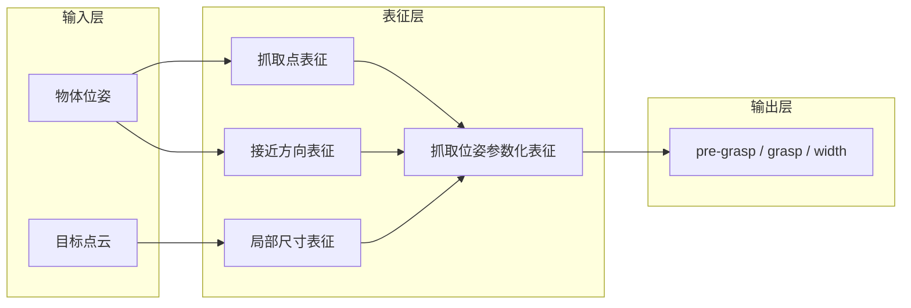

### 5.3 两类基本抓取构型

按照接近方向的定义，桌面抓取中最常见的两类基本构型为顶部抓取（top grasp）与侧向抓取（side grasp）。二者的差异主要体现在接近方向、姿态约束与环境碰撞条件上。

| 构型 | 接近方向 | 姿态约束 | 适合对象 | 主要风险 |
|---|---|---|---|---|
| 顶部抓取 | 沿桌面法线负方向 | 夹爪开合方向通常与物体长轴对齐 | 盒体、书本、手机、低矮工件 | 上方空间不足、薄物体难夹 |
| 侧向抓取 | 沿物体侧面法线 | 夹爪开合平面贴合目标侧面 | 杯、瓶、细高物体、货架物体 | 易撞桌面或隔板、姿态误差放大 |

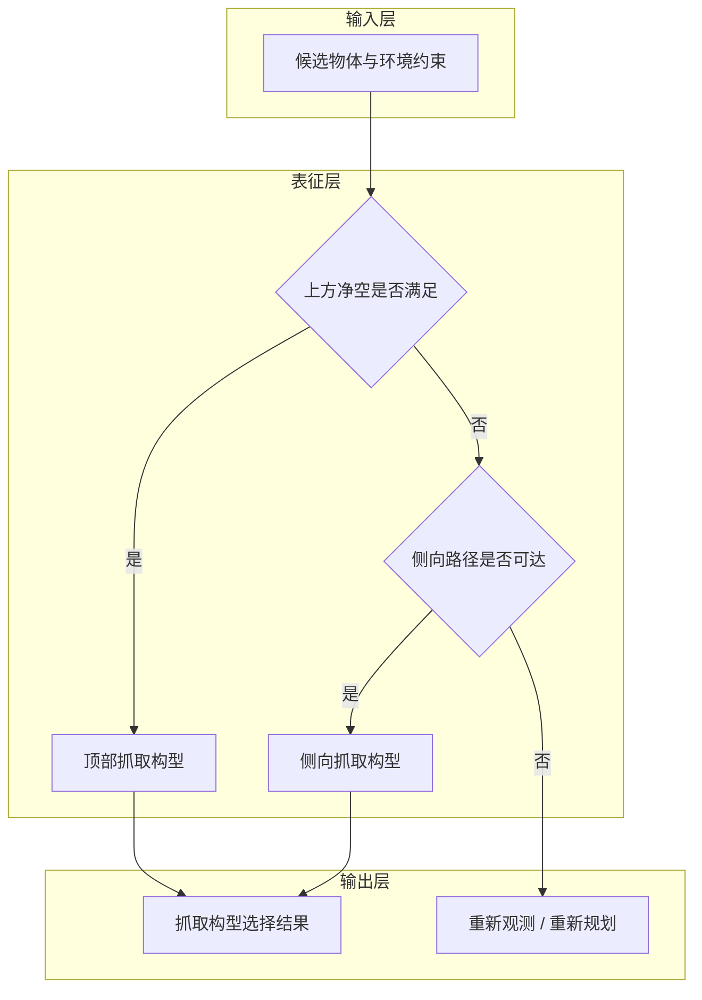

在执行层面，通常将动作进一步分解为 `pre-grasp → grasp → retreat / lift` 三个阶段。其意义在于将“到达误差”“接触误差”与“退出误差”分离分析，从而提高调试与验证的可解释性。

### 5.4 坐标系转换链路：由视觉表征到机器人表征

视觉模块通常输出相机坐标系下的点、点云或物体位姿，而运动控制模块需要机器人基座坐标系下的夹爪目标。因此，抓取位姿生成必须显式经过坐标变换链。

#### 5.4.1 完整变换链路

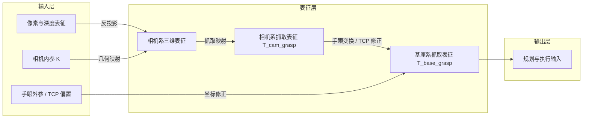

关键变换如下：

| 变换项 | 来源 | 用途 |
|---|---|---|
| `K` | 相机内参标定 | 像素与深度到相机三维点的恢复 |
| `T_end_camera` | Eye-in-Hand 手眼标定 | 相机系到末端系变换 |
| `T_base_camera` | Eye-to-Hand 手眼标定 | 相机系到基座系变换 |
| `T_base_end` | 机器人正运动学 | 末端系到基座系变换 |
| `T_end_tcp` | 工具标定 | 法兰 / 末端到夹爪 TCP 的偏置 |

#### 5.4.2 Eye-in-Hand 与 Eye-to-Hand 拓扑

| 拓扑 | 固定对象 | 运动对象 | 待求外参 | 运行时变换公式 |
|---|---|---|---|---|
| Eye-in-Hand | 标定板位于环境中 | 相机随末端运动 | `T_end_camera` | `T_base_grasp = T_base_end · T_end_camera · T_camera_grasp` |
| Eye-to-Hand | 相机固定于工作区外 | 标定板随末端运动 | `T_base_camera` | `T_base_grasp = T_base_camera · T_camera_grasp` |

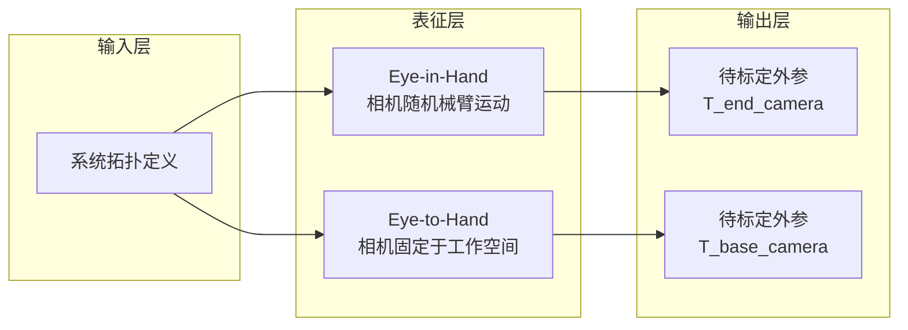

#### 5.4.3 手眼标定的数学本质：$AX=XB$

手眼标定的目标，是基于多组机器人运动与相机观测求解一个固定外参矩阵 $X$：

$$
AX = XB
$$

| 符号 | 含义 |
|---|---|
| $A$ | 机器人侧相邻两次采样之间的相对运动 |
| $B$ | 相机侧相邻两次观测之间的相对运动 |
| $X$ | 待求的固定手眼外参 |

需要特别强调的是，手眼标定所依赖的是**相对运动关系**，而非单次绝对位姿值。因此，采样过程是否具有足够的平移与旋转激励，以及矩阵方向记号是否保持一致，往往比求解公式本身更能决定最终结果的可靠性。

#### 5.4.4 Eye-in-Hand 实操入口与代码索引

与眼在手上标定相关的示例代码位于：[Hand-eye calibration 目录](../../code/lecture06/Hand-eye%20calibration/)。本讲正文仅保留代码入口与实验目标，详细采集流程建议单独组织为实验说明文档。

| 项目 | 说明 |
|---|---|
| 标定目标 | 求解 `T_end_camera` |
| 相机侧位姿生成 | [`estimate_board_pose_aruco.py`](../../code/lecture06/Hand-eye%20calibration/estimate_board_pose_aruco.py) |
| 主脚本 | [`calibrate_eye_in_hand.py`](../../code/lecture06/Hand-eye%20calibration/calibrate_eye_in_hand.py) |
| 验证脚本 | [`validate_hand_eye.py`](../../code/lecture06/Hand-eye%20calibration/validate_hand_eye.py) |
| 采样要求 | 建议 15–30 组，覆盖平移与旋转变化 |
| 观测对象 | ArUco / 棋盘格等刚性标定板 |

#### 5.4.5 Eye-to-Hand 实操入口与代码索引

眼在手外标定的核心是求解 `T_base_camera`，即相机坐标系到机器人基座坐标系的固定变换。对应代码同样位于：[Hand-eye calibration 目录](../../code/lecture06/Hand-eye%20calibration/)。

| 项目 | 说明 |
|---|---|
| 标定目标 | 求解 `T_base_camera` |
| 相机侧位姿生成 | [`estimate_board_pose_aruco.py`](../../code/lecture06/Hand-eye%20calibration/estimate_board_pose_aruco.py) |
| 主脚本 | [`calibrate_eye_to_hand.py`](../../code/lecture06/Hand-eye%20calibration/calibrate_eye_to_hand.py) |
| 验证脚本 | [`validate_hand_eye.py`](../../code/lecture06/Hand-eye%20calibration/validate_hand_eye.py) |
| 物理布置 | 相机固定，标定板随机械臂末端运动 |
| 采样要求 | 覆盖工作空间多个位置与姿态，避免遮挡 |

#### 5.4.6 标定误差与坐标链路分析

| 误差来源 | 典型表现 | 优先检查项 |
|---|---|---|
| 相机内参偏差 | 点云尺度异常、边缘畸变明显 | `f_x, f_y, c_x, c_y`、畸变模型 |
| 深度尺度错误 | Z 向整体放大或缩小 | `depth_scale`、单位换算 |
| 手眼旋转误差 | 距离越远偏差越大 | 姿态激励是否充分、矩阵方向是否统一 |
| 机器人位姿解析错误 | 标定矩阵数值正常但复现失败 | 欧拉角顺序、四元数顺序、单位 |
| TCP 偏置遗漏 | 末端到位但夹爪中心不对 | `T_end_tcp`、工具坐标设定 |

需要注意的是，旋转误差在长臂展条件下会被显著放大。以 1 m 臂展为例，1° 的角误差将带来约 17.5 mm 的横向偏差。因此，手眼标定的验证不仅要关注平移残差，还应结合旋转残差与实际点位复现测试。

### 5.5 可达性校验：由几何可行到机械可行

即使 `T_base_grasp` 已经计算完成，也不能直接下发执行，因为几何上合理的抓取目标并不必然满足机械系统约束。抓取候选仍需通过逆运动学、关节限位、碰撞约束与夹爪行程等多重筛选。

| 检查项 | 目的 | 失败时的典型处理 |
|---|---|---|
| IK 可解性 | 判断目标位姿是否可达 | 更换抓取方向或调整 pre-grasp |
| 关节限位 | 防止超出机构工作范围 | 丢弃该候选或切换另一策略 |
| 碰撞检查 | 避免撞击桌面、环境或本体 | 修改接近方向、提高中间过渡点 |
| 夹爪开口约束 | 判断局部尺寸是否落在夹爪行程内 | 更换抓取部位或放弃抓取 |
| 路径连续性 | 确保 pre-grasp → grasp → retreat 可顺序执行 | 分段规划或插入中间姿态 |

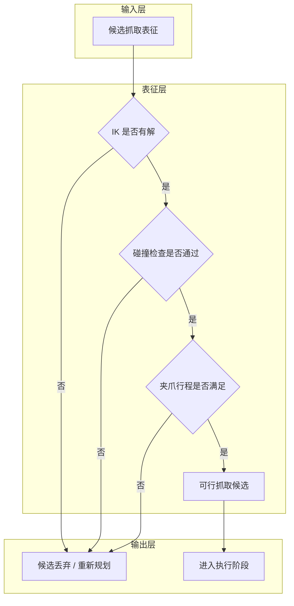

### 5.6 观测退化下的策略降级

真实系统中，6D 位姿估计可能因遮挡、反光、透明材质或点云过稀而失效。在这种情况下，应依据当前观测信息的充分程度，选择与之匹配的策略集合，而不应继续沿用高置信度姿态假设。

| 当前可用信息 | 建议策略 | 适用条件 |
|---|---|---|
| 6D pose 可靠 | 姿态匹配抓取 | 已知物体、点云完整 |
| 3D 中心可靠 | 顶部垂直接近 | 桌面开阔、目标低矮 |
| 仅 bbox / mask 可靠 | 重新观测、近距离复检或再分割 | 深度质量不足、遮挡较重 |
| 多次复检仍失败 | 放弃执行或请求人工确认 | 以安全为优先 |

**本节小结：** 抓取位姿生成是从物体状态表征到机器人动作表征的转换层。它不仅要求从物体位姿推导夹爪的抓取点、接近方向与开合宽度，还要求通过手眼标定与坐标变换将视觉结果映射到机器人基座系，并进一步经过逆运动学、碰撞与机构约束筛选，最终形成可在真实机器人上执行的抓取目标。

## 6 感知失败分析与鲁棒性优化

在实验室理想环境下，6D位姿估计算法往往能达到很高的精度指标，但部署到真实物理场景后，遮挡、反光、标定误差、环境扰动等因素都会导致感知失效，直接拉低抓取成功率。感知失败并非单一环节的问题，而是贯穿从输入采集到位姿输出的全链路。本章系统梳理典型感知失败的场景与成因，量化不同误差对抓取结果的影响，并给出从视觉输入到位姿计算再到系统机制的三层优化方案，最终形成一套可落地的真机调试流程。

### 6.1 典型感知失败场景与成因

感知失败按照产生的环节可分为三大类：视觉类失败发生在数据输入前端，源于传感器与环境的不匹配；几何类失败发生在2D‑3D转换与坐标变换环节，源于标定误差与坐标系定义问题；位姿类失败发生在输出端，源于算法本身的歧义性与运动学约束。

#### 6.1.1 视觉类失败：遮挡、反光、低纹理与光照剧变

- **遮挡与堆叠：** 目标物体被遮挡30%以上，点云不完整，位姿估计算法缺少匹配特征，导致位姿漂移或求解失败。
- **反光与透明材质：** 金属、玻璃表面出现高光，深度图出现空洞、飞点，目标点云残缺不全。
- **低纹理/无纹理物体：** 纯色、哑光表面缺少特征点，位姿估计出现旋转歧义，姿态随机跳动。
- **光照剧变：** 强光直射或逆光导致RGB过曝或过暗，目标检测漏检、误检，后续环节连锁失效。

#### 6.1.2 几何类失败：深度空洞、外参偏差与坐标系错误

- **深度缺失与点云空洞：** 物体表面法线与光轴夹角过大或材质原因，点云大面积空缺，ICP配准易陷入局部最优。
- **手眼外参偏差：** 所有抓取结果呈现固定方向、固定大小的系统性偏移。这是最隐蔽的系统性误差——单看位姿估计本身结果稳定，但转换到机器人坐标系后全部偏位。
- **坐标系方向定义错误：** 抓取位姿出现镜像翻转、坐标轴方向颠倒，直接导致撞机或抓空。

#### 6.1.3 位姿类失败：位姿跳变、方向翻转与目标不可达

- **位姿跳变：** 连续多帧估计出的位姿无规律突变，机械臂末端抖动，无法平稳接近。
- **方向翻转（对称歧义）：** 旋转对称物体（如圆柱体、立方体）的位姿出现180°或90°随机翻转，夹爪开合方向与物体长轴错位。
- **目标不可达：** 位姿估计正确，但生成的抓取位姿超出工作范围或存在碰撞，运动规划报错。

### 6.2 感知误差对抓取成功率的影响量化

不同类型的感知误差对抓取结果的破坏程度并不相同。量化误差与成功率的对应关系，有助于设定合理的精度指标、判断误差来源，以及评估优化效果。

#### 6.2.1 平移误差：从毫米级偏差到厘米级失效

平移误差指估计位置与真实位置的欧氏距离偏差。

| 误差量级 | 影响 | 成功率 |
|----------|------|--------|
| 1‑3mm | 轻微偏差，几乎无影响 | 接近100% |
| 3‑5mm | 中度偏差，夹持位置偏离最佳受力点 | 70%‑90% |
| 5‑10mm | 较大偏差，夹爪仅能夹住边缘 | 30%‑50% |
| 10mm以上 | 严重偏差，大概率抓空或撞物 | <20% |

#### 6.2.2 旋转误差：角度偏差的空间放大效应

旋转误差最核心的特点是误差会随操作距离被空间放大——离机器人基座越远，同样的角度偏差造成的末端位置偏移越大。近似计算公式：$\text{末端偏移} \approx \text{臂展} \times \tan(\text{旋转误差})$。

| 误差量级 | 影响 | 成功率 |
|----------|------|--------|
| <2° | 可完全容忍 | 基本不受影响 |
| 2°‑5° | 接触面积减小，摩擦力下降 | 60%‑80% |
| 5°‑15° | 无法形成有效夹持面 | <30% |
| >15° | 夹爪端面撞向物体侧面 | 基本失败 |

旋转误差存在放大效应，因此旋转精度往往比平移精度更重要。

#### 6.2.3 深度误差：接近方向的致命影响

深度误差是沿夹爪接近方向的平移误差，它比平面内的平移误差更致命——夹爪在接近方向上几乎没有容错空间。

| 误差量级 | 影响 |
|----------|------|
| 1‑2mm | 无明显影响 |
| 3‑5mm | 夹持深度不足或顶推物体移位 |
| 5‑10mm | 抓空或撞物 |
| 10mm以上 | 100%失败，甚至损坏传感器 |

深度误差沿接近方向作用，没有侧向容错余量，是三类误差中最容易直接导致抓取失败的类型。

### 6.3 三类优化方向

针对上述失败场景与误差来源，可从视觉输入层、位姿计算层、系统机制层三个维度分层优化，实现从"单次准确"到"长期稳定"的鲁棒性提升。

#### 6.3.1 视觉层面：光照、反光、透明物体的处理

- **光照环境标准化：** 采用漫射环形补光，避免点光源直射；搭配偏振镜头或多角度斜向补光；封闭工作空间，隔绝环境光干扰。
- **多模态数据互补：** 融合RGB、深度、红外三个通道；针对透明物体补充红外成像或线激光模组。
- **图像与深度后处理：** 对实例分割掩膜做形态学开运算与平滑处理；对深度图做空洞补全（双边滤波、邻域插值、深度学习补全）；增加边缘深度滤波，剔除飞点。

#### 6.3.2 位姿层面：多帧融合与时序平滑

- **时序滤波平滑：** 引入卡尔曼滤波或滑动窗口平均，抑制单帧跳变；设置位姿变化阈值，丢弃突变帧并沿用历史平滑结果。
- **粗到精的两阶段位姿精修：** 第一阶段用深度学习输出粗位姿，第二阶段用ICP做几何精配准，兼顾泛化性与精度。
- **多视角融合：** 控制机械臂带动腕部相机移动到2‑3个不同角度观测物体，融合多视角结果，大幅降低遮挡误差。

#### 6.3.3 系统层面：失败检测与重感知机制

- **前置失败检测：** 设置三重校验——点云有效率校验（有效点数占比<40%则不执行）、位姿置信度校验（配准误差超阈值则不执行）、可达性校验（位姿不可达则不执行）。
- **重感知重试机制：** 单次感知失败后自动调整策略重新采集；持续失败则调整相机角度或补光参数；设置2‑3次重试机会，可将整体成功率提升10%‑20%。
- **失败样本闭环回流：** 自动记录所有失败场景的原始数据，定期标注后用于模型微调，形成"部署‑失败‑优化"闭环迭代。

### 6.4 真机部署中的感知调试流程

真机调试切忌一上来就跑全链路抓取，否则出现失败时无法定位是哪个环节出了问题。正确的调试路径遵循先基础后上层、先单步后全链路的原则，逐级验证、逐级排查。

#### 6.4.1 基础校验：标定与坐标系正确性验证

**校验内容：**

- 相机内参：重投影误差<0.5像素，畸变校正正确。
- 手眼外参：标定矩阵平移与旋转精度合格，排除固定偏移。
- TCP工具标定：夹爪工具中心点标定准确，无偏心。
- 坐标系约定：像素、相机、机器人基座坐标系的轴方向与单位统一。

**验证方法：** 固定高精度标定板，控制机械臂移动到5‑8个不同位姿，对比"视觉计算的标定板位姿"与"机器人正运动学计算的位姿"。合格标准：平移误差<2mm，旋转误差<1°。

**常见问题排查：**

- 固定方向的系统性偏移 → 优先检查手眼标定与TCP标定。
- 镜像/翻转错误 → 优先检查坐标系方向与变换矩阵乘法顺序。
- 误差随位置变化 → 优先检查标定样本分布是否覆盖工作空间。

#### 6.4.2 单步验证：检测分割效果与静态位姿精度测试

- **检测分割验证：** 固定目标物体，连续采集20帧，统计召回率与准确率（要求无漏检、无误检）；对比掩膜与真实轮廓，边缘平均误差<2像素；改变光照、角度、背景测试鲁棒性。
- **静态位姿精度验证：** 使用标准立方体、标定球等已知尺寸物体，连续采集10帧，对比感知输出与真值，合格标准：平移误差<3mm，旋转误差<2°。
- **点云质量验证：** 可视化目标点云，调整滤波参数，在保留几何细节与去除噪声之间找平衡。

#### 6.4.3 全链路验证：动态抓取评测与迭代优化

- **固定场景基准测试：** 同一物体、同一摆放位置，重复10‑20次完整抓取，统计基准成功率；对每次失败进行归因分类（检测、分割、位姿、标定、运动规划、执行），找到占比最高的失败原因。
- **泛化场景压力测试：** 改变物体角度、位置、堆叠状态，调整光照条件，评估系统鲁棒性边界。
- **闭环迭代优化：** 针对占比最高的失败类型优化对应模块，每轮优化后重新测试，直到达到目标指标。

**调试核心逻辑：** 先搞定标定与坐标系这个基础，排除系统性误差；再逐个验证单模块性能；最后做全链路成功率评测与迭代优化。遵循这个流程，可以避免盲目调参，高效定位并解决问题，快速将系统从"能跑"优化到"稳定好用"。
