# 第6讲 机器人感知与位姿估计：从像素到抓取位姿的完整链路

## 1 从"看得到"到"抓得到"：位姿估计在机器人操作中的定位

本讲的核心目标不是“让机器人在图像里找到物体”，而是让机器人把视觉结果转成**可执行的抓取目标**。这条链路可以压缩成一句话：

> 2D 检测只回答“图像里哪里有物体”；机器人抓取需要回答“夹爪在机器人基座坐标系下，以什么姿态、从哪里接近、张开多大”。

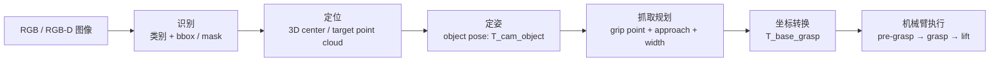

### 1.1 为什么检测框不能直接用于抓取

检测框是感知链路的起点，但不是机械臂的目标。它的问题不在于“不准”，而在于**输出类型不够**。

| 输出 | 回答的问题 | 典型形式 | 能否直接抓取 | 缺失信息 |
|---|---|---|---|---|
| bbox | 图像中大概在哪 | `(x_min, y_min, x_max, y_max)` | 不能 | 深度、姿态、轮廓、接近方向 |
| mask | 哪些像素属于目标 | 二值掩膜 | 不能 | 3D 坐标、物体朝向、夹爪宽度 |
| center point | 目标大致三维位置 | `(x, y, z)` | 仅可做粗抓 | 旋转姿态、可抓区域、避碰策略 |
| object pose | 物体在空间中的位姿 | `T_camera_object` 或 `T_base_object` | 仍不能直接抓 | 抓取点、夹爪姿态、安全偏移 |
| grasp pose | 夹爪可执行目标 | `T_base_grasp + width + approach` | 可以 | 需再做可达性和碰撞检查 |

抓取失败常见原因也能对应到这张表：

- **只有 bbox**：点到桌面、背景或物体边缘，机械臂“看到了但抓空”。
- **只有 mask**：分割很准，但还没有深度和坐标系，机械臂不知道物体离自己多远。
- **只有 3D 中心**：能靠近物体，但对长条、杯子、倾斜物体容易夹偏。
- **只有 object pose**：知道物体状态，但还没决定“从哪抓、怎么抓、张多大”。

### 1.2 机器人感知的三层目标：识别 – 定位 – 定姿

机器人操作中的视觉输出可以分成三层。每一层都比上一层更接近“动作”。

| 层级 | 核心问题 | 输入 | 输出 | 对抓取的作用 |
|---|---|---|---|---|
| 识别 Recognition | 这是什么？ | RGB 图像 | 类别、bbox、mask | 决定目标和策略库 |
| 定位 Localization | 它在哪？ | mask + depth / point cloud | 3D 中心、目标点云 | 决定机械臂到哪里 |
| 定姿 Pose Estimation | 它朝哪？ | 目标点云 / RGB-D / CAD | 6D object pose | 决定夹爪怎么对齐 |

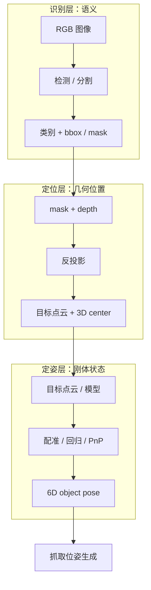

工程上，“定位”和“定姿”经常被同一个算法同时输出；但在调试时建议拆开看：

- 平移误差大：优先检查深度图、内参、mask 边界、手眼标定平移。
- 旋转误差大：优先检查点云形状、CAD 对齐、对称物体处理、采样视角。
- 抓取仍失败：再检查 object pose 到 grasp pose 的转换逻辑，而不要把所有问题都归因于检测器。

### 1.3 两条技术路线：模块化感知 vs 端到端感知

从系统架构看，抓取感知大致有两条路线。

| 维度 | 模块化感知 | 端到端感知 |
|---|---|---|
| 基本思路 | 检测 → 分割 → 点云 → 位姿 → 抓取 | 从图像 / 点云直接输出抓取动作 |
| 中间结果 | bbox、mask、point cloud、pose 都可检查 | 多数中间特征不可解释 |
| 数据需求 | 每个模块可分别训练 / 调参 | 需要大量抓取标签或仿真数据 |
| 调试方式 | 能定位到具体失效环节 | 主要依赖整体成功率 |
| 工程落地 | 工业和教学中最常用 | 研究和开放场景中更常见 |
| 适合任务 | 固定工位、可解释、高可靠 | 类别开放、形状复杂、策略多变 |

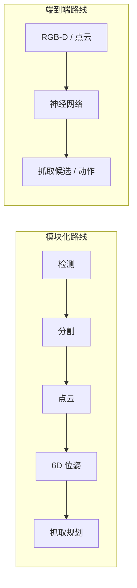

本讲采用**模块化路线**作为主线：它更适合课堂拆解，也更适合真机调试。端到端方法在开放物体抓取中很有价值，但部署时仍常与几何模块、碰撞检查、手眼标定配合使用。

### 1.4 本讲学习路径

本讲按“视觉输入 → 3D 几何 → 抓取执行”的顺序展开。

| 步骤 | 模块 | 输出 | 对应章节 |
|---|---|---|---|
| 1 | RGB-D 采集 | RGB、depth、内参 | 3.1 |
| 2 | 检测与分割 | bbox、mask | 3.2、3.3 |
| 3 | 点云提取 | target point cloud | 3.4 |
| 4 | 6D 位姿估计 | object pose | 第 4 节 |
| 5 | 抓取位姿生成 | grasp / pre-grasp / lift | 5.1~5.3 |
| 6 | 手眼坐标转换 | `T_base_grasp` | 5.4 |
| 7 | 机械臂执行与验证 | 真实抓取动作 | 5.5~5.6、6 节 |

**本节小结：** 机器人抓取不是“检测框中心点抓取”，而是一条从像素到机器人基座坐标系的转换链路。第 3 节负责把 2D 感知变成目标点云，第 4 节负责估计物体 6D 位姿，第 5 节负责把物体位姿翻译成夹爪可执行目标。

## 2 机器人感知任务体系与标准抓取流水线

### 2.1 机器人感知任务分类图谱

机器人视觉感知是一个庞大的任务集合，不同任务对应不同的输出形式、技术路线与应用场景。建立清晰的分类体系，有助于精准定位位姿估计在整个领域中的位置，理解各任务之间的依赖与递进关系。

#### 2.1.1 按任务目标划分：语义、几何与属性三大类

按照任务的核心输出目标，机器人感知可分为语义类、几何类、属性类三大分支，三者从"看懂是什么"到"量清在哪里"再到"知道怎么用"逐级深化。

**语义类任务：** 核心解决"是什么"的问题，输出语义标签与区域信息

- 图像分类：判断整张图像的主体类别，是最基础的语义任务；
- 目标检测：定位图像中所有目标的类别与矩形边界框，兼顾语义与粗定位；
- 实例分割：像素级区分每个独立物体的轮廓，实现目标与背景的精确分离；
- 语义分割：像素级区分场景的类别区域（如桌面、地面、墙壁），用于环境整体理解。

**几何类任务：** 核心解决"在哪里、朝哪"的问题，输出空间几何信息

- 3D中心点估计：输出物体三维质心坐标，是最低粒度的几何输出；
- 6D物体位姿估计：输出物体完整的三维位置与旋转姿态，是抓取操作的核心中间表示；
- 抓取位姿估计：直接输出夹爪的可执行位姿，是几何感知的最终操作目标；
- 深度估计：从单张RGB图像预测场景深度图，实现单目到三维的映射。

**属性与Affordance类任务：** 核心解决"能怎么用"的问题，输出物体的操作属性

- 物理属性估计：尺寸、重量、材质、重心等物理特性的感知；
- Affordance感知：判断物体的可操作区域（如杯柄、瓶盖、按钮）与可执行动作；
- 力觉触觉感知：通过接触传感器感知交互状态，用于抓取过程中的闭环反馈。

#### 2.1.2 按输入模态划分：从单目到多传感器融合

输入模态决定了感知的信息上限，按照传感器配置可分为四类，信息丰富度与系统复杂度逐级提升。

- **单RGB模态：** 仅依靠彩色相机输入，硬件成本最低，但缺乏直接的几何深度信息，三维感知依赖算法推理，精度有限。
- **RGB‑D模态：** 彩色图像与深度图同步输入，同时提供语义纹理与几何距离信息，是当前机器人抓取感知的主流标准配置。
- **多相机模态：** 多台相机从不同视角协同观测，减少遮挡盲区，提升位姿估计精度，适用于精密操作与复杂场景。
- **多传感器融合：** 融合视觉、激光雷达、力觉、IMU等多种传感器信息，适配动态、非结构化的复杂真实场景，是高阶人形机器人与移动操作机器人的发展方向。

**本节小结：** 机器人感知可从任务目标与输入模态两个维度建立分类体系：语义、几何、属性三类任务逐级深化，共同支撑机器人的操作能力；从单RGB到多传感器融合的模态升级，不断提升感知的信息上限与环境适应性。位姿估计与抓取位姿生成是连接语义感知与物理操作的核心几何任务。

### 2.2 位姿驱动抓取的完整流水线

位姿驱动是当前工业与服务机器人抓取领域最成熟、落地最广泛的技术范式。它以6D物体位姿为核心中间表示，串联起从图像输入到机械臂执行的完整流程，是工程实践中必须掌握的标准流水线。

#### 2.2.1 标准8步流程：从图像采集到机械臂执行

完整的位姿驱动抓取包含8个串行环节，前序环节的输出是后序环节的输入，形成严格的依赖链路。

1. **RGB‑D图像采集：** 通过深度相机同步获取时间对齐、像素对齐的彩色图像与深度图，是整个感知系统的数据源头。采集质量直接决定了后续所有环节的性能上限。
2. **目标检测：** 在RGB图像中运行目标检测器，输出目标物体的类别、边界框与置信度，快速缩小后续处理的空间范围。
3. **实例分割：** 基于检测框或文本提示生成像素级实例掩膜，精确分离目标物体与背景像素，消除背景噪声对后续几何计算的干扰。
4. **目标点云提取：** 用实例掩膜过滤深度图，通过像素反投影生成目标物体的三维点云，并完成滤波、去噪、降采样等预处理。
5. **6D位姿估计：** 基于目标点云与RGB特征，结合物体先验模型，计算物体在相机坐标系下的完整6D位姿矩阵。
6. **抓取位姿生成：** 结合物体位姿、几何尺寸与抓取策略，计算夹爪的接近方向、开合尺度、安全偏移与姿态匹配关系，生成可执行的抓取位姿与预抓取位姿。
7. **基座坐标转换：** 通过手眼标定得到的外参矩阵，将相机坐标系下的抓取位姿转换为机器人基座系下的位姿，完成视觉空间到机器人空间的映射。
8. **机械臂执行：** 运动规划器基于目标抓取位姿生成无碰撞运动轨迹，驱动机械臂完成接近、抓取、抬升的完整动作。

#### 2.2.2 各环节失效的误差传导效应

流水线的误差具有逐级传导与放大的特性，任一环节的失效都会对最终抓取结果产生不同程度的影响。

- **检测漏检/误检：** 导致后续所有环节无法正确启动或定位到错误目标，抓取直接失败；
- **分割轮廓偏差：** 背景点云混入目标点云，导致位姿估计出现系统性偏移；
- **点云质量差：** 深度空洞、噪声过多，导致位姿估计收敛失败或输出错误结果；
- **位姿估计偏差：** 平移与旋转误差直接导致抓取姿态错位，出现夹偏、撞物或抓空；
- **标定误差：** 产生全场景的系统性偏移，所有抓取结果出现固定方向的偏差。

理解误差传导规律，是真机调试时快速定位故障根源的核心基础。

### 2.3 核心概念辨析：bbox / mask / center point / object pose / grasp pose

初学者在入门机器人视觉抓取时，最容易混淆不同层级的感知输出概念。清晰区分五类核心输出的定义、维度、用途与精度要求，是建立正确认知的前提。

| 概念 | 定义 | 维度 | 用途 | 精度要求 |
|------|------|------|------|----------|
| bbox（边界框） | 图像平面上的2D矩形 | 4参数 $(x,y,w,h)$ | 目标粗定位，缩小搜索范围 | 像素级（通常容忍几个像素偏差） |
| mask（实例掩膜） | 像素级二值轮廓 | 图像尺寸 | 精确分离目标与背景 | 亚像素级边缘精度 |
| center point（3D中心点） | 物体三维质心坐标 | 3D $(x,y,z)$ | 确定物体位置，用于垂直接近 | 毫米级（<5mm） |
| object pose（6D物体位姿） | 位置+朝向（旋转矩阵/四元数） | 6D $(x,y,z,\text{roll},\text{pitch},\text{yaw})$ | 描述物体完整空间状态 | 平移<3mm，旋转<2° |
| grasp pose（抓取位姿） | 夹爪的位置、姿态、开合度、接近方向等 | 6D+附加参数 | 直接驱动机械臂执行 | 最高，需满足力封闭与避碰 |

**核心结论：** 检测和分割都是中间手段，生成可执行的grasp pose才是机器人感知的最终目标。所有前端感知算法的性能优劣，最终都要以抓取成功率这一物理指标作为评判标准。

### 2.4 不同硬件平台的感知需求差异

不同形态的机器人硬件，在自由度、安装方式、操作场景上存在显著差异，对感知系统的需求侧重点也各不相同。不存在放之四海而皆准的感知方案，必须结合硬件特性与应用场景做针对性设计。

#### 2.4.1 SO101桌面机械臂：固定视角下的精准定位

SO101类小型桌面机械臂通常为6自由度固定基座配置，搭配单台固定深度相机，面向桌面分拣、简单抓取等场景。

- **核心需求：** 单目标、固定视角，核心诉求是高重复定位精度与稳定性；
- **技术特点：** 相机与基座相对位置固定，一次标定可长期使用；场景简单，物体种类有限；
- **选型建议：** 优先采用模块化流水线，使用YOLO做检测、ICP做位姿精配准，追求稳定可靠。

#### 2.4.2 xLeRobot移动操作：多坐标系与动态场景适配

xLeRobot类移动操作机器人由移动底盘 + 机械臂组成，相机分布在头部与腕部，面向动态室内环境的移动抓取任务。

- **核心需求：** 多坐标系统一、动态场景目标跟踪、底盘晃动补偿、全局搜索与近距离精抓结合；
- **技术特点：** 需要同时处理眼在手外（头部相机）与眼在手上（腕部相机）两套标定关系；底盘运动带来的视角变化要求感知具备跟踪能力；
- **选型建议：** 采用"全局粗定位 + 局部精定位"的两级感知架构，兼顾搜索效率与抓取精度。

#### 2.4.3 Imeta‑Y1科研机械臂：精密操作的高位姿精度要求

Imeta‑Y1类高精度科研机械臂面向精密插拔、微装配等复杂操作任务，对位姿精度要求极高。

- **核心需求：** 亚毫米级的6D位姿精度、小部件精细分割、多视角融合观测；
- **技术特点：** 任务对旋转角度误差极其敏感，对位姿估计的鲁棒性与精度上限要求远高于普通抓取场景；
- **选型建议：** 采用多相机阵列 + 高精度ICP配准的方案，配合力控末端做接触式补偿。

#### 2.4.4 Unitree G1人形机器人：全身感知与多视角协同

Unitree G1类人形机器人具备全身自由度，多相机分布在头部、手部等位置，面向非结构化家庭与服务场景。

- **核心需求：** 全身感知空间统一、多视角快速切换、目标与双手相对位姿匹配、开放类别泛化能力；
- **技术特点：** 场景高度非结构化，物体类别多变，要求感知系统具备强泛化性与快速适配能力；
- **选型建议：** 采用模块化与端到端混合架构，基础通用任务用开放词汇模型，精密操作任务切换几何精配准。

## 3 视觉感知前端：目标检测分割与点云提取

视觉前端的任务是把原始 RGB-D 数据变成一个“干净、只包含目标物体”的点云。后续 6D 位姿估计和抓取规划都依赖这个输入质量。

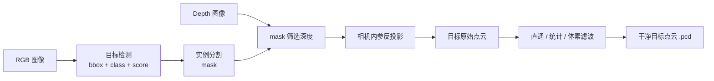

### 3.1 输入模态：RGB-D 数据与多相机配置

RGB-D 相机同时提供语义和几何信息：

| 模态 | 提供的信息 | 典型用途 | 主要风险 |
|---|---|---|---|
| RGB | 颜色、纹理、边缘 | 检测、分割、类别识别 | 光照变化、反光、遮挡 |
| Depth | 每个像素到相机的距离 | 反投影、点云、3D 定位 | 空洞、飞点、量程限制 |
| Camera intrinsics | `fx, fy, cx, cy` | 像素到 3D 坐标转换 | 标定不准会造成系统性偏差 |
| Extrinsics / hand-eye | 相机与机器人坐标关系 | 相机坐标 → 基座坐标 | 旋转误差会被臂展放大 |

常见相机拓扑如下：

| 配置 | 相机位置 | 优点 | 局限 | 适合场景 |
|---|---|---|---|---|
| Eye-to-Hand | 固定在工作空间外 | 全局视野大、布线简单 | 远距离精度受限、易被机械臂遮挡 | 分拣、上下料、桌面全局定位 |
| Eye-in-Hand | 固定在末端 | 近距离精度高、视角灵活 | 末端负载增加、运动采集更慢 | 精密抓取、装配、局部复检 |
| 多相机 | 头部 / 顶部 / 腕部组合 | 减少遮挡、覆盖范围大 | 标定和融合复杂 | 移动操作、人形机器人 |

选型时先回答三个问题：工作距离多远、是否需要近距离复检、目标是否会被手臂遮挡。

### 3.2 目标检测：从整图到候选区域

目标检测负责快速缩小搜索空间。它输出的是“图像区域”，不是抓取点。

| 输出项 | 含义 | 下游用途 |
|---|---|---|
| `class` | 目标类别 | 选择抓取策略或提示词 |
| `bbox` | 2D 边界框 | 限制分割和点云提取范围 |
| `score` | 置信度 | 过滤误检，排序多个候选 |

常用方案：

| 方法 | 特点 | 推荐使用场景 |
|---|---|---|
| YOLO 系列 | 实时、部署成熟、固定类别效果好 | 工业分拣、已知物体、边缘设备 |
| Grounded-SAM / Grounding DINO + SAM | 文本提示驱动、开放词汇 | 家庭服务、未知物体、语言指令 |
| 检测 + 跟踪 | 连续帧稳定输出 | 移动机器人、视频流、动态目标 |

工程建议：检测阈值不要只看 mAP，要看“后续点云是否被污染”。误检会把背景点云送入位姿估计，漏检则让整条链路无法启动。

### 3.3 实例分割：从矩形框到像素级轮廓

bbox 会包含背景，mask 才能把深度图中的目标像素筛出来。

| 阶段 | 输出 | 背景污染 | 对点云的影响 |
|---|---|---|---|
| 原图 | 全图像素 | 最高 | 反投影会得到完整场景点云 |
| bbox | 矩形 ROI | 中等 | 背景、桌面、邻近物体会混入 |
| mask | 目标像素 | 最低 | 只保留目标区域深度，更适合位姿估计 |

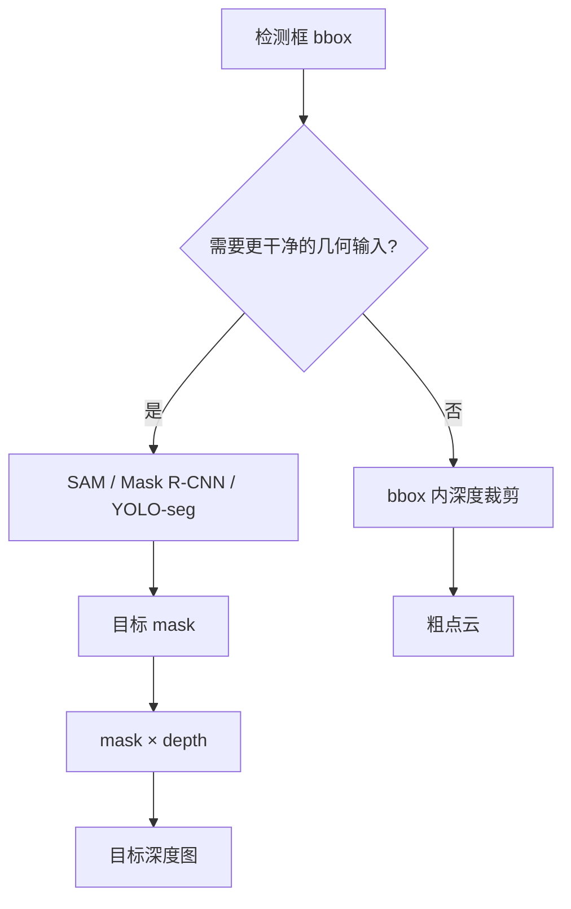

分割结果需要重点检查三类问题：

- **边界漏分**：目标边缘缺失，点云尺寸变小。
- **背景混入**：桌面或邻物混入，位姿估计偏移。
- **遮挡实例粘连**：多个物体被当成一个实例，抓取点落在错误区域。

### 3.4 点云生成与滤波：从深度图到三维目标点云

点云生成分两步：先用 mask 筛深度，再用相机内参反投影。

#### 3.4.1 反投影公式

相机内参矩阵为：

$$
K = \begin{bmatrix} f_x & 0 & c_x \\ 0 & f_y & c_y \\ 0 & 0 & 1 \end{bmatrix}
$$

深度像素 $(u,v,d)$ 在相机坐标系下的 3D 坐标为：

$$
X = \frac{u - c_x}{f_x} d, \qquad
Y = \frac{v - c_y}{f_y} d, \qquad
Z = d
$$

这一步得到的是**相机坐标系**下的点云，不是机器人基座坐标系下的点。

#### 3.4.2 点云预处理流水线

| 步骤 | 目的 | 常用参数 | 结果 |
|---|---|---|---|
| mask 筛选 | 去掉非目标深度 | `mask > 0` | 目标深度图 |
| 反投影 | 像素转 3D | `fx, fy, cx, cy, depth_scale` | 目标原始点云 |
| 直通滤波 | 裁掉工作区外点 | `z_min / z_max` | 空间范围正确 |
| 统计滤波 | 剔除飞点 | `nb_neighbors, std_ratio` | 离群点减少 |
| 体素降采样 | 降低点数 | `voxel_size` | 计算更快 |
| 导出 | 供位姿估计使用 | `.pcd / .ply` | 干净目标点云 |

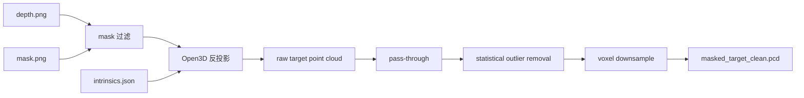

#### 3.4.3 常见问题与调参入口

| 现象 | 优先检查 | 处理建议 |
|---|---|---|
| 点云整体偏斜 | 相机内参、深度尺度 | 核对 `fx/fy/cx/cy` 和 `depth_scale` |
| 点云有大量飞点 | 深度边缘、反光表面 | 增大 `std_ratio` 前先检查 mask 边界 |
| 目标被削掉一部分 | mask 漏分、`z_min/z_max` 过窄 | 放宽直通范围或优化分割 |
| 点数太多导致配准慢 | 点云过密 | 增大 `voxel_size`，但抓取建议不要过大 |
| 多个物体粘在一起 | 实例分割失败 | 重新提示分割或做连通域过滤 |

### 3.4.4 实验：全链路 demo 实例讲解

本实验对应代码目录：[Visual Perception 目录](../../code/lecture06/Visual%20Perception/)。

**课堂目标：** 从一组对齐的 `rgb.png / depth.png / mask.png / intrinsics.json` 中，生成可供第 4 节位姿估计使用的目标点云。

| 项目 | 内容 |
|---|---|
| 主脚本 | [`pipeline_from_syllabus.py`](../../code/lecture06/Visual%20Perception/pipeline_from_syllabus.py) |
| 输入 | `depth.png`、`mask.png`、`intrinsics.json`、可选 `rgb.png` |
| 输出 | `masked_target_clean.pcd`、阶段截图、点数统计 |
| 依赖 | `numpy`、`open3d`、`Pillow`，USB 模式额外需要 `pyrealsense2` |

运行示例：

```bash
cd "code/lecture06/Visual Perception"
python pipeline_from_syllabus.py --demo-dir data/clutter_depth_demo --no-vis
```

如果想使用交互式分割入口：

```bash
cd "code/lecture06/Visual Perception"
python interactive_depth_pipeline.py --source file --input-dir data/clutter_depth_demo --output-dir data/clutter_depth_demo
```

课堂讲解时建议按下面顺序观察输出，而不是直接看最终 `.pcd`：

1. `depth.png`：确认深度单位和有效范围。
2. `mask.png`：确认目标区域是否漏分 / 粘连。
3. `masked_target_raw.pcd`：确认反投影是否得到目标形状。
4. `masked_target_clean.pcd`：确认滤波后是否仍保留主要几何结构。
5. 点数变化日志：判断每一步是否过度过滤。

> 注意：示例命令假设 `data/clutter_depth_demo` 已存在；如果使用自己的数据，只需保持同名文件和内参 JSON 格式一致。

### 3.5 工具链选型小结

| 任务 | 推荐工具 | 选择理由 |
|---|---|---|
| 固定类别实时检测 | YOLO / YOLO-seg | 快、易部署、适合 Jetson 等边缘设备 |
| 开放词汇目标定位 | Grounded-SAM / Grounded-SAM2 | 支持文本提示，适合未知物体 |
| 通用交互分割 | SAM / SAM2 | 点提示或框提示即可出 mask |
| 点云处理 | Open3D | Python 友好，滤波、配准、可视化完整 |
| 真机 RGB-D | RealSense SDK / 相机厂商 SDK | 获取对齐 RGB、Depth、内参和深度尺度 |

**本节小结：** 第 3 节的输出不是 bbox，也不是 mask，而是“相机坐标系下的干净目标点云”。它是第 4 节位姿估计的输入，也是第 5 节生成抓取目标的几何基础。

## 4 6D物体位姿估计：原理与主流技术方案

### 4.1 什么是6D位姿：平移与旋转的数学表示

6D位姿（6 Degree‑of‑Freedom Pose）是描述刚体在三维空间中完整状态的标准表示，包含3个平移自由度与3个旋转自由度，是连接视觉感知与机器人操作的核心中间量。清晰理解其数学表示，是掌握位姿估计算法的基础。

#### 4.1.1 平移自由度：物体三维空间位置的量化描述

平移描述物体坐标系原点在参考坐标系（相机坐标系或机器人基座坐标系）中的三维空间位置，用三维向量 $\mathbf{t} = [x, y, z]^T$ 表示，单位通常为米或毫米。

- $x, y$ 对应物体在垂直于相机光轴平面内的水平与垂直位置；
- $z$ 对应物体沿相机光轴方向的深度距离。

平移分量决定了物体"在空间哪里"，是机械臂能够到达目标区域的基础前提。

#### 4.1.2 旋转自由度：三种主流旋转表示方法对比

旋转描述物体坐标系相对于参考坐标系的空间朝向，共有3个独立自由度。工程中常用三种表示方式，各有优劣与适用场景。

- **欧拉角：** 用roll（绕X轴）、pitch（绕Y轴）、yaw（绕Z轴）三个角度描述旋转。优势是直观易懂，便于人类理解与调试；劣势是存在万向锁（Gimbal Lock）问题，特定角度下自由度退化，插值与求导不便。
- **四元数：** 用四维单位向量 $\mathbf{q} = [w, x, y, z]^T$ 描述旋转，满足 $w^2 + x^2 + y^2 + z^2 = 1$。优势是无万向锁、计算高效、插值平滑；劣势是直观性差，不便于人工解读。四元数是机器人控制系统与位姿估计算法中最常用的旋转表示形式。
- **旋转矩阵：** 用 $3 \times 3$ 的正交矩阵 $R$ 描述旋转，三个列向量分别对应物体坐标系三个轴在参考坐标系下的方向。优势是数学性质严谨，可直接用于点坐标变换；劣势是参数冗余（9个参数描述3个自由度），不适合直接作为网络回归目标。

#### 4.1.3 齐次变换矩阵：位姿的统一工程表达形式

工程实践中，通常将平移向量与旋转矩阵整合为 $4 \times 4$ 的齐次变换矩阵 $T \in SE(3)$，作为位姿的标准输出与交换格式：

$$T = \begin{bmatrix} R & t \\ 0^T & 1 \end{bmatrix}$$

该矩阵可以直接完成不同坐标系之间的点坐标变换：对于任意一点在物体坐标系下的坐标 $P_{\text{obj}}$，其在相机坐标系下的坐标 $P_{\text{cam}}$ 可通过左乘变换矩阵得到：

$$P_{\text{cam}} = T \cdot P_{\text{obj}}$$

齐次变换矩阵的优势在于可以通过矩阵乘法方便地实现多级坐标系的级联变换，是手眼标定、坐标转换链路中的标准数据结构。

### 4.2 位姿估计的三类技术路线

6D位姿估计经过多年发展，形成了三类技术路线清晰、适用场景各异的方法体系：传统几何法、模板匹配法与深度学习法。三者并非简单的替代关系，而是在不同场景下各有最优解。

#### 4.2.1 传统几何法：基于点云配准的ICP系列

- **核心思想：** 将观测得到的目标点云与物体的CAD模型点云进行迭代配准，寻找使两组点云最优对齐的刚体变换矩阵。
- **代表算法：** ICP（迭代最近点）及其众多变体，包括点到点ICP、点到平面ICP、截断ICP等。
- **算法流程：** 给定初始位姿、观测目标点云与模型参考点云；为每个观测点在模型点云中寻找最近对应点；求解使对应点距离总和最小的刚体变换；更新位姿，重复迭代直到误差收敛。
- **优势：** 精度高，收敛后可达亚毫米级；无需训练，纯几何驱动，可解释性强；有成熟的开源实现。
- **劣势：** 对初始位姿要求高，初始偏差过大易陷入局部最优；对遮挡、离群点敏感；无纹理、对称物体匹配难度大。
- **适用场景：** 已知物体精确三维模型、初始位姿偏差较小的工业场景，常用作深度学习粗估计后的位姿精化环节。

#### 4.2.2 模板匹配法：基于三维模型的姿态对齐

- **核心思想：** 离线预先渲染物体在不同视角、不同姿态下的二维/三维模板，构建模板库；在线将输入图像/点云与模板库进行特征匹配，找到最相似模板对应的姿态。
- **代表方案：** 经典LINEMOD算法及其深度学习增强变体。
- **算法流程：** 离线阶段对物体CAD模型进行全视角采样渲染，提取梯度、深度等鲁棒特征，构建模板库；在线阶段提取输入图像的对应特征，与模板库快速匹配，输出相似度最高的模板对应的位姿。
- **优势：** 推理速度快，适合实时场景；对低纹理、无纹理物体友好；对硬件算力要求低。
- **劣势：** 姿态精度有限，通常为粗估计；模板库占用存储空间大；新物体需要重新建库，泛化能力差。
- **适用场景：** 结构化工业分拣场景、固定物体模型、对实时性要求高但精度要求适中的任务。

#### 4.2.3 深度学习法：从两阶段方案到端到端范式

深度学习方法利用神经网络从数据中学习位姿特征，根据架构设计可分为两阶段与端到端两大类，是当前位姿估计领域的研究主流。

**1. 两阶段方案**

- **核心逻辑：** 第一阶段完成目标检测与实例分割，第二阶段单独进行6D位姿回归；
- **典型代表：** SAM‑6D，以SAM的分割结果为基础，后续接位姿估计头；
- **特点：** 任务解耦清晰，便于分模块调试；分割精度直接决定位姿上限；可复用成熟的检测分割模型。

**2. 端到端方案**

- **直接回归型：** 网络输入原始图像/点云，直接输出完整的旋转与平移参数。代表为FoundationPose，通过几何重构与优化实现强泛化性。优势是泛化能力强，对遮挡场景鲁棒，可适配未知类别物体；劣势是模型参数量大，推理速度慢，训练数据依赖度高。
- **检测驱动型：** 基于YOLO等目标检测架构扩展，单次前向传播同步预测类别、检测框与3D包围盒角点的2D投影，再通过PnP几何算法求解6D位姿。代表为YOLO‑6D。优势是推理速度快，模型轻量化，支持实时部署；劣势是泛化能力有限，依赖已知物体3D模型，遮挡与对称场景精度下降明显。

**三类技术路线对比：**

| 技术路线 | 代表算法 | 核心优势 | 核心劣势 | 适用场景 |
|----------|----------|----------|----------|----------|
| 传统几何法 | ICP | 精度高、可解释、无需训练 | 依赖初始值、对遮挡敏感 | 工业精配准、位姿精化 |
| 模板匹配法 | LINEMOD | 速度快、低纹理友好 | 姿态精度有限、泛化差 | 工业分拣、固定物体 |
| 深度学习‑两阶段 | SAM‑6D | 解耦清晰、泛化较好 | 流程较长 | 通用服务机器人 |
| 深度学习‑端到端 | FoundationPose | 泛化强、遮挡鲁棒 | 参数量大、速度慢 | 非结构化未知物体 |
| 深度学习‑检测驱动 | YOLO‑6D | 速度快、轻量化 | 泛化有限、依赖模型 | 实时结构化场景 |

工程实践中常采用"深度学习粗估计+ICP精配准"的混合方案，兼顾速度、泛化性与精度，是当前落地最广泛的组合模式。

### 4.3 典型开源方案对比：FoundationPose / SAM‑6D / YOLO‑6D

FoundationPose、SAM‑6D与YOLO‑6D是当前工程与科研领域最具代表性的三类开源位姿估计方案，分别对应端到端通用型、两阶段融合型、检测驱动实时型三条技术路径。

| 对比维度 | FoundationPose | SAM‑6D | YOLO‑6D |
|----------|---------------|--------|----------|
| 技术路线 | 端到端（直接回归） | 两阶段（分割+位姿） | 检测驱动（PnP求解） |
| 输入 | RGB‑D图像 | RGB‑D图像 | RGB图像 |
| 是否需要CAD模型 | 否（零样本） | 是（可选） | 是（需要3D模型） |
| 推理速度 | 较慢（>1s） | 中等（0.5‑1s） | 极快（<50ms） |
| 泛化能力 | 强（未知物体） | 中等（已知类别） | 弱（固定物体） |
| 精度 | 高 | 高 | 中等 |
| 适用场景 | 科研、通用抓取 | 服务机器人 | 工业实时结构化 |

**选型决策建议：**

- **工业结构化场景，固定物体、追求实时性：** 优先选择YOLO‑6D+ICP精化的方案，兼顾实时性与精度。
- **服务机器人场景，物体类别多变、追求泛化性：** 优先选择SAM‑6D方案，依托SAM的零样本分割能力，适配家庭、办公等开放场景。
- **科研前沿场景，未知物体、追求通用能力：** 优先选择FoundationPose方案，其强零样本泛化能力适合探索未知物体操作。

**选型核心原则：** 优先匹配场景需求，不盲目追求SOTA。在满足任务要求的前提下，优先选择部署简单、维护成本低、调试方便的方案。

### 4.4 位姿估计的精度评价指标

位姿估计的性能需要量化指标进行客观评估，不同指标从不同维度衡量精度。掌握评价指标是算法选型、效果评测与故障排查的基础。

#### 4.4.1 ADD 与 ADD‑S：位姿精度的核心综合指标

- **ADD（Average Distance）指标：** 将物体模型上的所有点，通过估计位姿变换后，与真值位姿变换后的对应点计算欧氏距离，取所有点距离的平均值。物理含义是衡量估计位姿与真值位姿之间的整体偏差，距离越小精度越高。合格阈值通常以物体直径的10%作为判定标准。
- **ADD‑S 指标：** 针对对称物体提出，因为对称物体旋转后点的对应关系不唯一。对于每个估计位姿变换后的点，不匹配固定对应点，而是匹配模型点云中最近的点，再计算平均距离。专门用于旋转对称物体的位姿精度评估。
- **AUC（Area Under Curve）：** 绘制不同误差阈值下的位姿准确率曲线，计算曲线下的面积。比单一阈值更全面地反映算法在不同精度要求下的整体性能。

#### 4.4.2 分项误差指标：平移误差与旋转误差

综合指标便于整体对比，但故障排查时需要分项指标定位误差来源。

- **平移误差：** 估计位姿的平移向量与真值平移向量之间的欧氏距离，单位通常为毫米。直接反映物体位置估计的准确程度。典型合格标准：桌面抓取场景通常要求平移误差小于5mm。
- **旋转误差：** 估计旋转与真值旋转之间的测地线角度差，单位为度。反映物体朝向估计的准确程度，偏差会在长臂展处被放大。典型合格标准：桌面抓取场景通常要求旋转误差小于5°。

分项误差可以帮助快速定位问题：平移误差大通常源于深度质量差或标定偏差，旋转误差大通常源于点云特征不足或对称歧义。

## 5 抓取位姿生成：从物体位姿到机器人可执行目标

第 4 节得到的是物体位姿 `object pose`。机械臂真正需要的是夹爪目标 `grasp pose`。二者之间还要经过抓取规划、坐标转换和可达性检查。

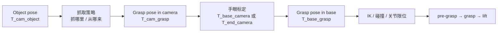

### 5.1 为什么 object pose 不等于 grasp pose

物体位姿描述的是“物体本身”；抓取位姿描述的是“夹爪应该怎么放”。

| 概念 | 描述对象 | 典型形式 | 回答的问题 | 不能回答的问题 |
|---|---|---|---|---|
| object pose | 物体坐标系 | `T_camera_object` / `T_base_object` | 物体在哪里、朝哪 | 抓哪里、张多大、从哪接近 |
| grasp pose | 夹爪 TCP 坐标系 | `T_base_grasp + width` | 夹爪到哪里、怎么转、怎么闭合 | 还需检查 IK、碰撞、力闭合 |

从 object pose 到 grasp pose，本质是把“几何状态”翻译成“操作动作”。翻译规则通常来自三类信息：

1. **物体几何**：长轴、宽度、高度、可接触面。
2. **夹爪结构**：最大开口、手指长度、TCP 偏置。
3. **任务约束**：从顶部拿、从侧面拿、避开障碍、抓后要放到哪里。

### 5.2 抓取位姿的四个核心要素

| 要素 | 决定什么 | 常见计算方式 | 失败表现 |
|---|---|---|---|
| 抓取点 `p_grasp` | 夹爪中心到哪里 | 点云质心、表面中心、策略库关键点 | 夹空、夹边、碰撞 |
| 接近方向 `a` | 夹爪从哪条路径进入 | 桌面法线、物体表面法线、主轴方向 | 戳到物体、被障碍挡住 |
| 开合宽度 `w` | 夹爪张多大 | 局部尺寸 + 安全余量 | 夹不住或撞到邻物 |
| 姿态匹配 `R_grasp` | 夹爪坐标系怎么对齐 | 接近方向 + 开合方向构造旋转矩阵 | 手指不贴合、滑脱 |
| 安全偏移 `d_safe` | 预抓取点离物体多远 | 沿接近方向反向偏移 | 高速接近时碰撞 |

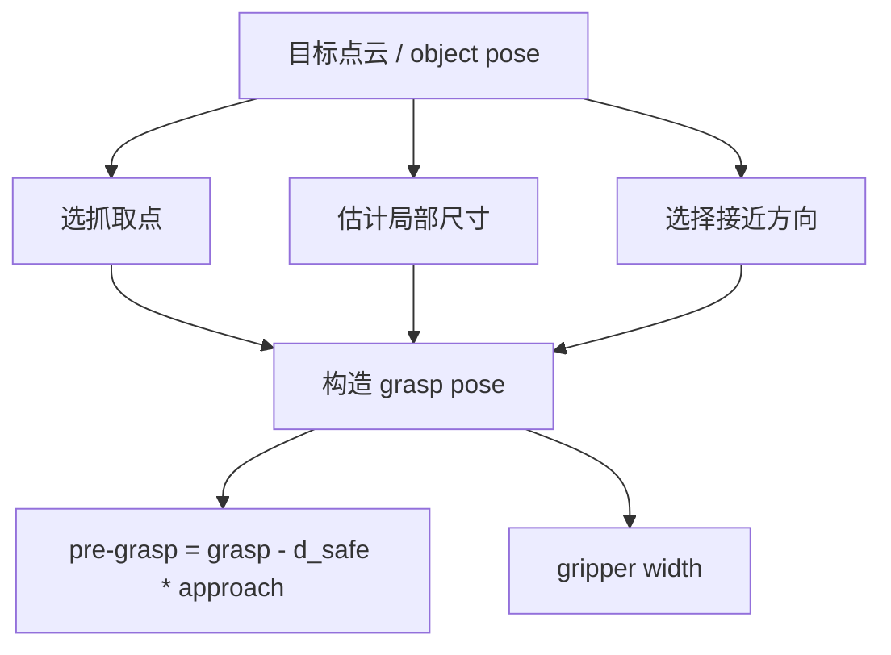

一个常用的开合宽度估计为：

$$
w_{grasp} = d_{local} + \Delta_{safe}
$$

其中 `d_local` 是被夹部位的局部尺寸，`Δ_safe` 通常取 1~5 mm，具体取决于夹爪重复定位误差和物体材质。

### 5.3 典型抓取场景：顶部抓取 vs 侧面抓取

| 场景 | 接近方向 | 姿态要求 | 适合物体 | 主要风险 |
|---|---|---|---|---|
| 顶部垂直接近 | 沿桌面法线向下 | 手指开合方向对齐物体长轴 | 盒子、手机、书本、低矮工件 | 上方空间不足、抓取薄物体困难 |
| 侧面水平接近 | 沿物体侧面法线 | 夹爪开合平面贴合侧面 | 杯子、瓶子、高细物体、货架内物体 | 姿态误差放大、容易撞桌面/隔板 |

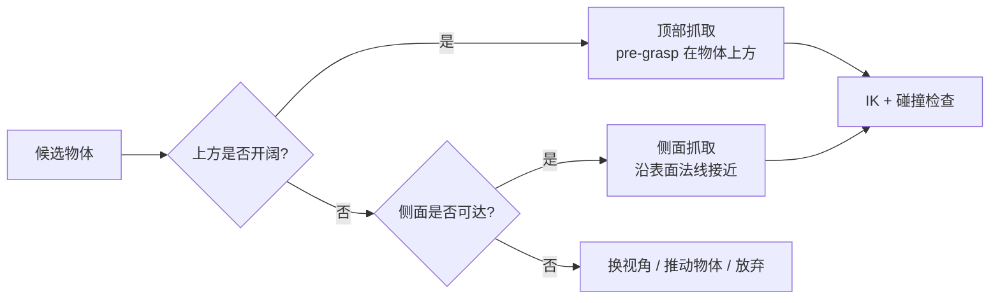

标准执行动作建议拆成三段：

| 阶段 | 作用 | 典型动作 |
|---|---|---|
| Pre-grasp | 安全到达目标附近 | 夹爪张开，停在抓取点外 30~80 mm |
| Grasp | 低速接触并闭合 | 沿接近方向移动，闭合夹爪 |
| Lift / Retreat | 验证并撤离 | 先退出障碍区，再抬升到安全高度 |

### 5.4 坐标系转换链路：从相机坐标系到机器人基座坐标系

视觉前端和位姿估计通常输出相机坐标系下的点或位姿；机器人控制器需要基座坐标系下的目标。

#### 5.4.1 完整转换链路

```mermaid
flowchart LR
    A[像素坐标\n(u,v,d)] -->|相机内参 K| B[相机坐标\np_camera]
    B -->|目标点云 / 位姿估计| C[相机系抓取位姿\nT_cam_grasp]
    C -->|手眼标定| D[基座系抓取位姿\nT_base_grasp]
    D -->|工具偏置 TCP| E[真实夹爪目标]
    E -->|IK / 规划| F[关节轨迹]
```

关键变换：

| 变换 | 来源 | 用途 |
|---|---|---|
| `K` | 相机内参标定 | 像素 + 深度 → 相机 3D 点 |
| `T_end_camera` | Eye-in-Hand 手眼标定 | 相机点 → 末端坐标系 |
| `T_base_camera` | Eye-to-Hand 手眼标定 | 相机点 → 基座坐标系 |
| `T_base_end` | 机器人正运动学 | 末端坐标系 → 基座坐标系 |
| `T_end_tcp` | 工具标定 | 法兰 / 末端 → 夹爪 TCP |

#### 5.4.2 Eye-in-Hand 与 Eye-to-Hand 拓扑

| 拓扑 | 谁固定 | 谁在动 | 求解外参 | 运行时转换 |
|---|---|---|---|---|
| Eye-in-Hand | 标定板固定在环境中 | 相机随末端运动 | `T_end_camera` | `T_base_grasp = T_base_end · T_end_camera · T_camera_grasp` |
| Eye-to-Hand | 相机固定在工作空间外 | 标定板随末端运动 | `T_base_camera` | `T_base_grasp = T_base_camera · T_camera_grasp` |

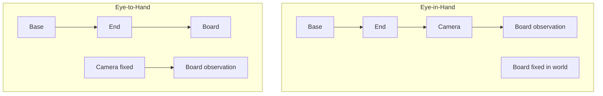

#### 5.4.3 手眼标定的数学本质：`AX = XB`

手眼标定通过多组机器人运动和相机观测，求一个固定外参 `X`。

$$
AX = XB
$$

| 符号 | 含义 |
|---|---|
| `A` | 机器人侧两次采样之间的相对运动 |
| `B` | 相机侧两次观测之间的相对运动 |
| `X` | 要求的固定手眼外参 |

工程上最重要的不是背公式，而是确认三件事：

1. **谁固定、谁在动**：这决定 `X` 是 `T_end_camera` 还是 `T_base_camera`。
2. **矩阵方向是否一致**：`T_a_b` 表示“把 b 坐标系下的点变到 a 坐标系”。
3. **样本是否足够多样**：只平移或只绕一个轴转都会导致退化。

### 5.4.4 实验：Eye-in-Hand 眼在手上标定

配套代码目录：[Hand-eye calibration 目录](../../code/lecture06/Hand-eye%20calibration/)。

**目标：** 求 `T_end_camera`，即“相机坐标系 → 末端坐标系”的固定变换。

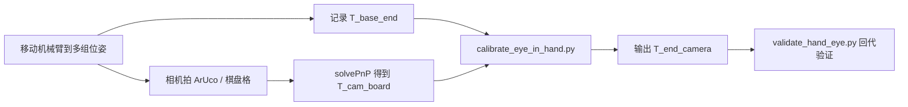

**物理布置：**

| 项目 | 要求 |
|---|---|
| 相机 | 刚性固定在末端或夹爪支架上 |
| 标定板 | 固定在桌面 / 立柱上，采样期间不能移动 |
| 样本数 | 建议 15~30 组 |
| 位姿分布 | 同时包含平移和旋转变化，覆盖近 / 中 / 远距离 |

输入 JSON 示例：

```json
{
  "poses": [
    {
      "id": "sample_001",
      "T_base_end": [[1,0,0,0.30],[0,1,0,0.00],[0,0,1,0.25],[0,0,0,1]]
    }
  ]
}
```

相机侧文件使用同样的 `id`，矩阵字段为 `T_cam_board`。

运行命令：

```bash
python "code/lecture06/Hand-eye calibration/calibrate_eye_in_hand.py" \
  --robot-poses data/robot_poses.json \
  --camera-poses data/camera_poses.json \
  --output outputs/eye_in_hand.json
```

验证命令：

```bash
python "code/lecture06/Hand-eye calibration/validate_hand_eye.py" \
  --transform outputs/eye_in_hand.json \
  --robot-poses data/robot_poses.json \
  --camera-poses data/camera_poses.json \
  --report outputs/eye_in_hand_validation.json
```

建议从外部 ArUco 参考代码中借鉴的采集检查：

- ArUco / 棋盘格角点重投影误差过滤。
- 深度值与 PnP 的 `Z` 值交叉验证。
- 相邻样本位姿变化过小时拒绝采样。
- 明确所有长度单位使用米，Marker 尺寸不要把 `40 mm` 写成 `0.4 m`。

Eye-in-Hand 的运行时转换为：

$$
T_{base}^{grasp} = T_{base}^{end} \; T_{end}^{camera} \; T_{camera}^{grasp}
$$

### 5.4.5 实验：Eye-to-Hand 眼在手外标定

**目标：** 求 `T_base_camera`，即“相机坐标系 → 机器人基座坐标系”的固定变换。

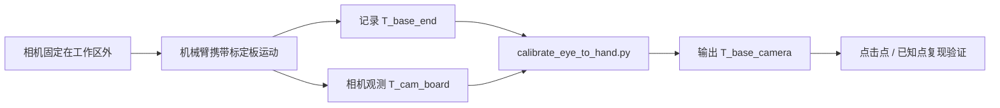

**物理布置：**

| 项目 | 要求 |
|---|---|
| 相机 | 固定在工作台外、顶部或侧方支架上，采样后不能移动 |
| 标定板 | 刚性固定在末端 / 法兰 / 夹爪治具上 |
| 采样动作 | 让标定板覆盖工作空间多个位置和角度 |
| 遮挡控制 | 避免机械臂本体挡住标定板 |

运行命令：

```bash
python "code/lecture06/Hand-eye calibration/calibrate_eye_to_hand.py" \
  --robot-poses data/robot_poses.json \
  --camera-poses data/camera_poses.json \
  --output outputs/eye_to_hand.json
```

验证命令：

```bash
python "code/lecture06/Hand-eye calibration/validate_hand_eye.py" \
  --transform outputs/eye_to_hand.json \
  --robot-poses data/robot_poses.json \
  --camera-poses data/camera_poses.json \
  --report outputs/eye_to_hand_validation.json
```

Eye-to-Hand 的运行时转换更直接：

$$
T_{base}^{grasp} = T_{base}^{camera} \; T_{camera}^{grasp}
$$

常见错误：

| 错误 | 表现 | 排查方式 |
|---|---|---|
| 相机支架被碰动 | 所有点出现固定方向偏差 | 重新采集并标定 |
| 标定板相对末端不刚性 | 残差忽大忽小 | 检查夹具和螺丝 |
| Eye-in-Hand 公式照搬 | 矩阵方向明显不对 | 重新确认 `X = T_base_camera` |
| 工具坐标系混淆 | 视觉点对，夹爪中心不对 | 补 `T_end_tcp` 或重新设 TCP |

### 5.4.6 标定误差排查

| 误差来源 | 典型表现 | 优先检查 |
|---|---|---|
| 相机内参错误 | 点云尺度不对、边缘偏差大 | `fx/fy/cx/cy`、畸变参数 |
| 深度尺度错误 | Z 方向整体放大 / 缩小 | `depth_scale`、单位 |
| 手眼旋转误差 | 离相机 / 基座越远偏差越大 | 采样姿态多样性、矩阵方向 |
| 机器人位姿解析错误 | 标定矩阵看似正常但复现失败 | 欧拉角顺序、四元数顺序、单位 |
| TCP 偏置遗漏 | 末端到位但夹爪中心偏 | `T_end_tcp` / 工具标定 |

一个 1° 的旋转误差，在 1 m 臂展处会造成约 17.5 mm 的横向偏差；因此手眼标定不要只看平移残差，也必须看旋转残差和点位复现。

### 5.5 可达性校验：抓取位姿的机械臂可行性判断

生成 `T_base_grasp` 后，还需要确认机械臂真的能执行。

| 检查项 | 目的 | 失败处理 |
|---|---|---|
| IK 是否有解 | 关节能否到达目标 | 换抓取方向或增加预抓取点 |
| 关节限位 | 避免超出机械结构范围 | 选择另一候选 grasp |
| 碰撞检查 | 避免撞桌面、物体、自己 | 改接近方向或路径 |
| 夹爪开口 | 物体是否在行程范围内 | 换夹持部位或放弃 |
| 路径连续性 | pre-grasp → grasp → lift 是否可连贯执行 | 分段规划或加入中间点 |

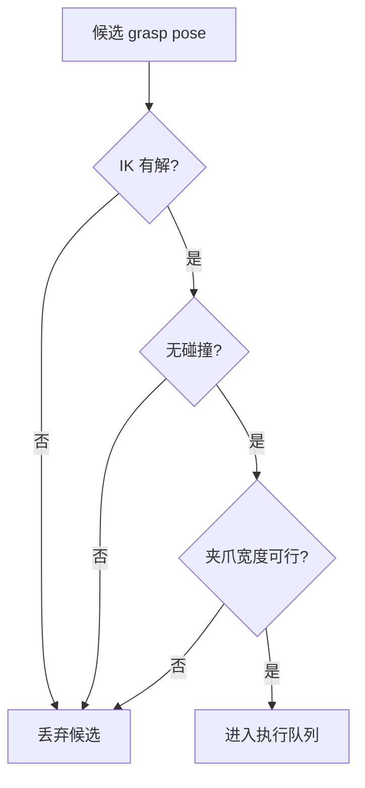

### 5.6 感知降级策略：当 6D Pose 失效时怎么办

真实系统中，6D pose 可能因为遮挡、反光、透明物体或点云太少而失败。此时不要让机器人盲目执行错误姿态，而应降级。

| 感知状态 | 推荐策略 | 适用条件 |
|---|---|---|
| 6D pose 可靠 | 姿态匹配抓取 | 已知物体、点云完整 |
| 只有目标点云中心可靠 | 顶部垂直抓取 | 桌面开阔、物体低矮 |
| 只有 bbox / mask 可靠 | 移动相机复检或重新分割 | 当前深度质量差 |
| 多次失败 | 放弃或请求人工确认 | 安全优先 |

**本节小结：** 抓取位姿生成是从“物体状态”到“机器人动作”的翻译层。它不仅要决定抓取点、接近方向、夹爪宽度和安全偏移，还要通过手眼标定把相机坐标系下的结果变成机器人基座坐标系下的可执行目标。最后，任何候选抓取都必须经过 IK、碰撞和夹爪约束校验后，才能进入真机执行。

## 6 感知失败分析与鲁棒性优化

在实验室理想环境下，6D位姿估计算法往往能达到很高的精度指标，但部署到真实物理场景后，遮挡、反光、标定误差、环境扰动等因素都会导致感知失效，直接拉低抓取成功率。感知失败并非单一环节的问题，而是贯穿从输入采集到位姿输出的全链路。本章系统梳理典型感知失败的场景与成因，量化不同误差对抓取结果的影响，并给出从视觉输入到位姿计算再到系统机制的三层优化方案，最终形成一套可落地的真机调试流程。

### 6.1 典型感知失败场景与成因

感知失败按照产生的环节可分为三大类：视觉类失败发生在数据输入前端，源于传感器与环境的不匹配；几何类失败发生在2D‑3D转换与坐标变换环节，源于标定误差与坐标系定义问题；位姿类失败发生在输出端，源于算法本身的歧义性与运动学约束。

#### 6.1.1 视觉类失败：遮挡、反光、低纹理与光照剧变

- **遮挡与堆叠：** 目标物体被遮挡30%以上，点云不完整，位姿估计算法缺少匹配特征，导致位姿漂移或求解失败。
- **反光与透明材质：** 金属、玻璃表面出现高光，深度图出现空洞、飞点，目标点云残缺不全。
- **低纹理/无纹理物体：** 纯色、哑光表面缺少特征点，位姿估计出现旋转歧义，姿态随机跳动。
- **光照剧变：** 强光直射或逆光导致RGB过曝或过暗，目标检测漏检、误检，后续环节连锁失效。

#### 6.1.2 几何类失败：深度空洞、外参偏差与坐标系错误

- **深度缺失与点云空洞：** 物体表面法线与光轴夹角过大或材质原因，点云大面积空缺，ICP配准易陷入局部最优。
- **手眼外参偏差：** 所有抓取结果呈现固定方向、固定大小的系统性偏移。这是最隐蔽的系统性误差——单看位姿估计本身结果稳定，但转换到机器人坐标系后全部偏位。
- **坐标系方向定义错误：** 抓取位姿出现镜像翻转、坐标轴方向颠倒，直接导致撞机或抓空。

#### 6.1.3 位姿类失败：位姿跳变、方向翻转与目标不可达

- **位姿跳变：** 连续多帧估计出的位姿无规律突变，机械臂末端抖动，无法平稳接近。
- **方向翻转（对称歧义）：** 旋转对称物体（如圆柱体、立方体）的位姿出现180°或90°随机翻转，夹爪开合方向与物体长轴错位。
- **目标不可达：** 位姿估计正确，但生成的抓取位姿超出工作范围或存在碰撞，运动规划报错。

### 6.2 感知误差对抓取成功率的影响量化

不同类型的感知误差对抓取结果的破坏程度并不相同。量化误差与成功率的对应关系，有助于设定合理的精度指标、判断误差来源，以及评估优化效果。

#### 6.2.1 平移误差：从毫米级偏差到厘米级失效

平移误差指估计位置与真实位置的欧氏距离偏差。

| 误差量级 | 影响 | 成功率 |
|----------|------|--------|
| 1‑3mm | 轻微偏差，几乎无影响 | 接近100% |
| 3‑5mm | 中度偏差，夹持位置偏离最佳受力点 | 70%‑90% |
| 5‑10mm | 较大偏差，夹爪仅能夹住边缘 | 30%‑50% |
| 10mm以上 | 严重偏差，大概率抓空或撞物 | <20% |

#### 6.2.2 旋转误差：角度偏差的空间放大效应

旋转误差最核心的特点是误差会随操作距离被空间放大——离机器人基座越远，同样的角度偏差造成的末端位置偏移越大。近似计算公式：末端偏移 ≈ 臂展 × tan(旋转误差)。

| 误差量级 | 影响 | 成功率 |
|----------|------|--------|
| <2° | 可完全容忍 | 基本不受影响 |
| 2°‑5° | 接触面积减小，摩擦力下降 | 60%‑80% |
| 5°‑15° | 无法形成有效夹持面 | <30% |
| >15° | 夹爪端面撞向物体侧面 | 基本失败 |

旋转误差存在放大效应，因此旋转精度往往比平移精度更重要。

#### 6.2.3 深度误差：接近方向的致命影响

深度误差是沿夹爪接近方向的平移误差，它比平面内的平移误差更致命——夹爪在接近方向上几乎没有容错空间。

| 误差量级 | 影响 |
|----------|------|
| 1‑2mm | 无明显影响 |
| 3‑5mm | 夹持深度不足或顶推物体移位 |
| 5‑10mm | 抓空或撞物 |
| 10mm以上 | 100%失败，甚至损坏传感器 |

深度误差沿接近方向作用，没有侧向容错余量，是三类误差中最容易直接导致抓取失败的类型。

### 6.3 三类优化方向

针对上述失败场景与误差来源，可从视觉输入层、位姿计算层、系统机制层三个维度分层优化，实现从"单次准确"到"长期稳定"的鲁棒性提升。

#### 6.3.1 视觉层面：光照、反光、透明物体的处理

- **光照环境标准化：** 采用漫射环形补光，避免点光源直射；搭配偏振镜头或多角度斜向补光；封闭工作空间，隔绝环境光干扰。
- **多模态数据互补：** 融合RGB、深度、红外三个通道；针对透明物体补充红外成像或线激光模组。
- **图像与深度后处理：** 对实例分割掩膜做形态学开运算与平滑处理；对深度图做空洞补全（双边滤波、邻域插值、深度学习补全）；增加边缘深度滤波，剔除飞点。

#### 6.3.2 位姿层面：多帧融合与时序平滑

- **时序滤波平滑：** 引入卡尔曼滤波或滑动窗口平均，抑制单帧跳变；设置位姿变化阈值，丢弃突变帧并沿用历史平滑结果。
- **粗到精的两阶段位姿精修：** 第一阶段用深度学习输出粗位姿，第二阶段用ICP做几何精配准，兼顾泛化性与精度。
- **多视角融合：** 控制机械臂带动腕部相机移动到2‑3个不同角度观测物体，融合多视角结果，大幅降低遮挡误差。

#### 6.3.3 系统层面：失败检测与重感知机制

- **前置失败检测：** 设置三重校验——点云有效率校验（有效点数占比<40%则不执行）、位姿置信度校验（配准误差超阈值则不执行）、可达性校验（位姿不可达则不执行）。
- **重感知重试机制：** 单次感知失败后自动调整策略重新采集；持续失败则调整相机角度或补光参数；设置2‑3次重试机会，可将整体成功率提升10%‑20%。
- **失败样本闭环回流：** 自动记录所有失败场景的原始数据，定期标注后用于模型微调，形成"部署‑失败‑优化"闭环迭代。

### 6.4 真机部署中的感知调试流程

真机调试切忌一上来就跑全链路抓取，否则出现失败时无法定位是哪个环节出了问题。正确的调试路径遵循先基础后上层、先单步后全链路的原则，逐级验证、逐级排查。

#### 6.4.1 基础校验：标定与坐标系正确性验证

**校验内容：**

- 相机内参：重投影误差<0.5像素，畸变校正正确。
- 手眼外参：标定矩阵平移与旋转精度合格，排除固定偏移。
- TCP工具标定：夹爪工具中心点标定准确，无偏心。
- 坐标系约定：像素、相机、机器人基座坐标系的轴方向与单位统一。

**验证方法：** 固定高精度标定板，控制机械臂移动到5‑8个不同位姿，对比"视觉计算的标定板位姿"与"机器人正运动学计算的位姿"。合格标准：平移误差<2mm，旋转误差<1°。

**常见问题排查：**

- 固定方向的系统性偏移 → 优先检查手眼标定与TCP标定。
- 镜像/翻转错误 → 优先检查坐标系方向与变换矩阵乘法顺序。
- 误差随位置变化 → 优先检查标定样本分布是否覆盖工作空间。

#### 6.4.2 单步验证：检测分割效果与静态位姿精度测试

- **检测分割验证：** 固定目标物体，连续采集20帧，统计召回率与准确率（要求无漏检、无误检）；对比掩膜与真实轮廓，边缘平均误差<2像素；改变光照、角度、背景测试鲁棒性。
- **静态位姿精度验证：** 使用标准立方体、标定球等已知尺寸物体，连续采集10帧，对比感知输出与真值，合格标准：平移误差<3mm，旋转误差<2°。
- **点云质量验证：** 可视化目标点云，调整滤波参数，在保留几何细节与去除噪声之间找平衡。

#### 6.4.3 全链路验证：动态抓取评测与迭代优化

- **固定场景基准测试：** 同一物体、同一摆放位置，重复10‑20次完整抓取，统计基准成功率；对每次失败进行归因分类（检测、分割、位姿、标定、运动规划、执行），找到占比最高的失败原因。
- **泛化场景压力测试：** 改变物体角度、位置、堆叠状态，调整光照条件，评估系统鲁棒性边界。
- **闭环迭代优化：** 针对占比最高的失败类型优化对应模块，每轮优化后重新测试，直到达到目标指标。

**调试核心逻辑：** 先搞定标定与坐标系这个基础，排除系统性误差；再逐个验证单模块性能；最后做全链路成功率评测与迭代优化。遵循这个流程，可以避免盲目调参，高效定位并解决问题，快速将系统从"能跑"优化到"稳定好用"。
