# 第6讲 机器人感知与位姿估计：从像素到抓取位姿的完整链路

## 1 从"看得到"到"抓得到"：位姿估计在机器人操作中的定位

机器人操作任务中的视觉输出，不能直接等同于控制输入。目标检测给出的是图像区域，实例分割给出的是前景像素，点云恢复给出的是相机坐标系下的几何观测；而机械臂最终需要的是基座坐标系下、满足夹爪结构与运动学约束的抓取目标。位姿估计的功能，正是在这些不同表征之间建立可计算、可验证、可执行的转换关系。

可以先从一个最普通的桌面抓取场景说起：相机看到桌面上有一个杯子，检测器给出了一个框，分割模型也把杯身轮廓描了出来。到这一步，人很容易觉得“机器人已经看见杯子了”。但对机械臂来说，问题才刚刚开始：杯子离相机多远？杯口朝上还是倾斜？夹爪应该抓杯身、杯口，还是杯柄附近？这些问题都不在检测框里，也不在二维 mask 里。位姿估计正是在这里进入链路，把“图像里有一个目标”继续推进为“空间中有一个可操作的刚体对象”。

换句话说，本讲关心的不是单个视觉模型能否在图像上画出漂亮结果，而是机器人如何把一次观测转化为动作决策。这个过程可以分成三类表征：图像域的观测表征、三维空间中的物体状态表征，以及机器人控制器可消费的动作表征。位姿估计位于中间层，既承接前端视觉，又约束后端抓取。

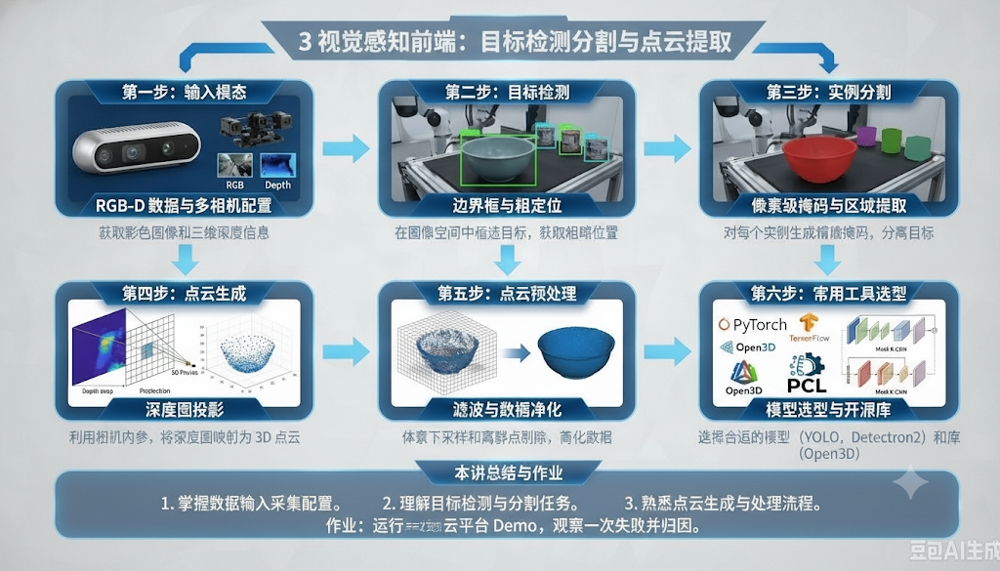{width=90%}

图 6.1 可以看作本讲的主线：左侧是机器人获得的 RGB-D 观测，右侧是机械臂真实执行的抓取动作，中间则依次经过检测、分割、点云、位姿、抓取映射和坐标转换。每一步都在回答一个更具体的问题：先问“目标在哪个图像区域”，再问“这个区域对应哪些三维点”，再问“这些点组成的物体在空间里如何摆放”，最后才问“夹爪应该以什么姿态去接触它”。

### 1.1 背景与动机：为什么机器人不能只靠检测抓取

#### 1.1.1 检测框的本质：二维投影，信息严重缺失

目标检测与实例分割解决的是图像域中的语义归属问题；抓取控制解决的是三维空间中的接触与约束问题。二者的关键差异不是“精度高低”，而是**输出空间不同**：检测框属于二维投影表征，抓取位姿属于刚体位姿与动作表征。

这也是初学者最容易形成的误解：把“检测到了”误认为“可以抓了”。检测框只告诉我们物体在画面里的大致范围，它没有深度、没有旋转，也不知道夹爪从哪一侧接近更安全。对人来说，这些信息可以凭常识补全；对机器人来说，它们必须被显式计算出来。

| 表示层级 | 典型输出 | 表征空间 | 可支撑的下游任务 | 仍缺失的信息 |
|---|---|---|---|---|
| 检测框 bbox | $(x_{min},y_{min},x_{max},y_{max})$ | 图像平面 | 目标粗定位、ROI 裁剪 | 深度、姿态、接触区域 |
| 实例掩膜 mask | 目标前景像素集合 | 图像平面 | 前景分离、深度筛选 | 三维位置、物体朝向 |
| 三维中心 | $(x,y,z)$ | 相机 / 基座坐标系 | 粗定位、顶部接近 | 旋转姿态、夹爪对齐方式 |
| 物体位姿 object pose | $\,{}^{C}T_{O}$ 或 $\,{}^{B}T_{O}$ | $SE(3)$ | 描述物体刚体状态 | 抓取点、开合宽度、避碰偏置 |
| 抓取位姿 grasp pose | $\,{}^{B}T_{G}$ + width + approach | 机器人操作空间 | 运动规划与执行 | 仍需 IK、碰撞与力控校验 |

若系统仅输出 bbox，抓取点可能落在背景、桌面或物体边缘；若仅输出 mask，目标虽然已与背景分离，但尚未进入米制三维空间；若仅输出三维中心，机械臂可以到达目标附近，却无法确定夹爪应如何旋转。即使获得 object pose，也仍需结合物体几何、夹爪结构和任务约束，进一步生成 grasp pose。因此，位姿估计必须放在“感知表征逐步转化为操作表征”的链路中理解。

#### 1.1.2 从 2D 到 3D：维度跃迁带来的根本性挑战

从信息闭合的角度看，抓取任务至少要求系统回答四类问题：目标是否存在，目标在三维空间中的位置，目标相对于夹爪的朝向，以及夹爪能否沿某条无碰撞路径完成接触。检测框只回答第一类和一小部分第二类问题；mask 进一步改善前景分离，但仍停留在图像域；object pose 才开始描述物体的刚体状态；grasp pose 则把物体状态与末端执行器结构联系起来。也就是说，位姿估计不是为了“多输出几个自由度”，而是为了补齐从视觉判断到物理执行之间缺失的空间约束。

从控制系统视角看，这一步也是变量空间的切换：像素坐标 $(u,v)$ 没有物理单位，深度点 $(X,Y,Z)$ 进入相机坐标系但缺少刚体朝向，6D 位姿 $T \in SE(3)$ 才同时包含位置和旋转。机器人抓取所需的不是“图像上哪里亮”，而是“某个刚体相对于机器人在哪里、如何摆放、能否被当前夹爪稳定接触”。这正是 2D 感知和 3D 操作之间最本质的差距。

#### 1.1.3 为什么位姿估计是不可避免的环节

对于位姿驱动抓取，一条最基本的变换链可写为：

$$
{}^{B}T_{G} = {}^{B}T_{C} \, {}^{C}T_{O} \, {}^{O}T_{G}
$$

其中，$\,{}^{C}T_{O}$ 表示物体坐标系相对于相机坐标系的 6D 位姿，$\,{}^{O}T_{G}$ 表示在物体坐标系中定义的抓取模板，$\,{}^{B}T_{C}$ 来自手眼标定，$\,{}^{B}T_{G}$ 则是提交给运动规划器的基座系抓取目标。由此可见，6D 位姿并不是链路终点，而是连接视觉几何与抓取动作的中间状态。

一个实用判断是：如果任务只要求“指向一个区域”，bbox 或 3D 中心可能已经足够；如果任务要求“沿某个方向接近、避开桌面、夹住局部结构”，就必须引入位姿、抓取模板和坐标转换。位姿估计不是为了让输出看起来更完整，而是为了让后端规划器有足够的信息做可执行决策。

**本节小结：** 检测框和实例掩膜让机器人“看见”目标，但它们仍然停留在图像投影层面，无法直接回答目标的深度、朝向、接触位置和执行坐标系问题。抓取真正需要的是一个经过深度恢复、刚体姿态估计、抓取模板映射和手眼标定共同闭合后的操作目标。位姿估计的作用，正是把二维视觉线索推进为三维刚体状态，再把这个状态交给后续抓取生成模块继续使用。理解这一点之后，6D 位姿就不再是“多预测几个自由度”的算法输出，而是机器人从“看得到”走向“抓得到”的关键中间桥梁。

### 1.2 机器人感知的三层目标：识别、定位与定姿

机器人操作中的视觉感知可归纳为三个递进目标：**识别（Recognition）—定位（Localization）—定姿（Pose Estimation）**。三者分别回答“是什么”“在哪里”“朝向如何”，共同构成从语义理解到几何恢复再到刚体状态估计的基本链条。

这三个问题可以按机器人逐步接近动作执行的顺序理解。识别阶段确定目标身份：场景里哪个是杯子，哪个是盒子。定位阶段开始测量空间位置：目标在相机前方多少米、相对机器人基座处于什么位置。定姿阶段则进入操作细节：杯子是否倾斜、盒子的长边朝向哪里、夹爪开合方向是否应与物体长轴对齐。只有走完这三步，视觉结果才逐渐接近控制系统能够使用的形式。

#### 1.2.1 第一层：识别（Recognition）——解决"是什么"的问题

识别层负责确定任务目标和语义类别，是整条链路的入口。它通常输出类别、检测框或初始 mask，帮助系统从复杂场景中选出需要继续处理的对象。

在机器人抓取中，识别并不只是给图像打标签，而是决定后续几何计算应该围绕哪个目标展开。桌面上可能同时存在杯子、盒子、工具和杂物，如果系统没有先确认任务对象，后续的点云提取和位姿估计就可能处理到错误物体。对于“拿起红色杯子”这类任务，识别层还要结合类别、颜色、位置或语言指令，在多个候选目标之间完成选择。

识别结果通常不直接进入控制器，而是作为空间裁剪和语义过滤的依据。检测框可以限制分割模型的搜索范围，类别信息可以决定是否调用某个 CAD 模型或抓取模板，置信度则可以作为是否继续执行的门槛。若识别阶段漏检，整条链路无法启动；若误检，把背景或相邻物体当成目标，后续几何算法即使计算得很精确，也只是在精确地处理错误对象。

#### 1.2.2 第二层：定位（Localization）——解决"大致在哪里"的问题

定位层把二维候选区域与深度观测结合起来，恢复目标在三维空间中的位置。它不一定要求完整旋转姿态，但至少要给出可用于接近的空间坐标或目标点云。

这一层完成的是从图像平面到物理空间的关键过渡。检测框和 mask 只说明目标投影在哪些像素上，定位层需要利用深度图、相机内参和前景掩膜，把这些像素反投影成相机坐标系下的三维点。此时系统开始获得米制尺度的信息，例如物体中心离相机多远、位于桌面左侧还是右侧、是否在机械臂可达范围内。

定位结果可以有不同粒度。最简单的是一个 3D 中心点，适合顶部抓取、点击、靠近观察等对姿态要求较低的动作；更完整的是目标点云，它保留了物体局部形状和表面分布，可作为后续 6D 位姿估计、主轴提取或抓取候选生成的输入。定位误差通常会表现为抓空、偏抓或接近路径偏离目标，因此真机调试时要重点检查深度尺度、相机内参、mask 是否混入背景点，以及手眼标定是否带来系统偏移。

#### 1.2.3 第三层：定姿（Pose Estimation）——解决"朝哪个方向"的问题

定姿层进一步恢复物体坐标系的朝向，使夹爪能够根据物体长轴、局部平面、孔洞或把手等几何结构调整自身姿态。对侧向抓取、插拔、装配等任务而言，这一层往往决定操作能否稳定完成。

与定位只关心“到哪里”不同，定姿关心的是物体坐标系相对于相机或机器人坐标系如何旋转。对于规则盒子，夹爪可能需要与长边对齐；对于杯子，杯柄方向会影响可抓区域；对于插拔和装配任务，几度的姿态偏差就可能导致顶撞或无法插入。因此，6D 位姿中的旋转部分并不是附加信息，而是把视觉几何转化为可执行接触动作的核心约束。

定姿方法通常会利用 RGB 纹理、点云几何、关键点、CAD 模型或学习得到的特征来估计刚体变换。工程上还要处理对称物体带来的多解问题：圆柱体绕自身轴旋转可能在视觉上等价，但夹爪、标签朝向或任务约束未必等价。定姿失败时，机器人往往不是够不到目标，而是以错误角度接近目标，表现为夹爪斜撞、夹偏、碰到桌面或无法沿预期方向插入。因而，定姿层是从“空间定位”走向“动作对齐”的关键一步。

| 层级 | 核心问题 | 主要输入 | 主要输出 | 典型方法 | 对抓取的作用 |
|---|---|---|---|---|---|
| 识别 | 目标是什么 | RGB 图像 | 类别、bbox、mask | YOLO、Mask R-CNN、SAM | 确定操作对象与感兴趣区域 |
| 定位 | 目标在哪里 | mask + depth | 3D 中心、目标点云 | 反投影、聚类、滤波 | 提供空间位置与几何载体 |
| 定姿 | 目标朝向如何 | RGB-D、点云、CAD / 先验模型 | 6D object pose | PnP、ICP、模板匹配、位姿回归 | 支撑夹爪姿态对齐与抓取模板映射 |

这三个层级在工程实现中并不一定严格分步。例如，部分 6D 位姿网络会同时输出平移和旋转，部分抓取检测网络会绕过显式 object pose 直接输出 grasp pose。但在系统分析和调试中，将三者区分仍然重要：定位误差主要影响“能否到达目标附近”，定姿误差主要影响“夹爪能否以正确方向接触物体”。前者通常表现为抓空或偏位，后者更容易表现为夹偏、顶撞或滑脱。

这种区分在真机调试中尤其重要。若机器人每次都偏向同一侧，问题往往在深度尺度、手眼外参或 TCP 偏置；若机器人位置基本正确但夹爪总是斜着撞向物体，问题更可能来自旋转估计、物体对称性处理或抓取模板定义。把“识别、定位、定姿”拆开分析，可以避免把所有失败都笼统归因于“模型不准”。

**本节小结：** 识别、定位和定姿分别回答“是什么”“在哪里”和“朝向如何”，三者不是并列的孤立任务，而是一条逐步逼近操作执行的感知阶梯。识别层决定系统应该处理哪个对象，定位层把目标从像素区域推进到米制三维空间，定姿层则进一步恢复物体坐标系，使夹爪可以按正确方向接触目标。工程调试中，把这三层拆开分析非常重要：漏检、深度偏移和姿态翻转会导致完全不同的失败表现。后续的点云提取、6D 位姿估计和抓取生成，正是在这三层信息逐渐闭合的基础上展开。

### 1.3 两条技术路线：模块化感知 vs 端到端感知

按照是否显式构造中间表征，机器人抓取系统可分为两类：**模块化感知**与**端到端感知**。前者将检测、分割、点云、位姿、抓取规划拆成可检查的模块；后者尝试由原始观测直接生成抓取动作或动作评分。

如果把抓取系统看成一条生产线，模块化方法会在每个工位留下可检查的半成品：bbox、mask、点云、位姿矩阵、抓取候选。端到端方法则更像一个整体策略网络，输入图像和状态，直接给出动作。前者调试成本低、链路更长；后者形式简洁、数据要求更高。两者没有绝对优劣，关键取决于任务是否需要可解释、可验证和可逐步排错。

#### 1.3.1 模块化感知：经典的分层流水线架构

模块化路线强调显式中间结果。每一步输出都可以被保存、可视化和单独评估，因此特别适合教学实验、工业部署和需要追责排错的真实机器人系统。

#### 1.3.2 端到端感知：直接映射的数据驱动范式

端到端路线试图减少人工设计的中间步骤，让模型直接从图像、点云或状态输入中预测动作。它的优势是形式统一、可吸收大规模数据；难点在于数据成本、泛化边界和失败解释。

| 比较维度 | 模块化感知 | 端到端感知 |
|---|---|---|
| 基本范式 | 检测 → 分割 → 点云 → 6D 位姿 → 抓取 | 图像 / 点云 → 抓取动作或动作分布 |
| 中间表征 | 显式，可视化和单步验证方便 | 隐式，依赖网络内部特征 |
| 误差诊断 | 可定位到检测、深度、配准、标定等环节 | 失败归因困难 |
| 数据需求 | 可复用检测、分割、CAD、点云等分任务数据 | 依赖大量示教、仿真或真实抓取数据 |
| 几何约束 | 易嵌入坐标变换、ICP、碰撞检查 | 需通过网络结构或训练数据隐式学习 |
| 典型场景 | 工业抓取、教学实验、可靠性优先系统 | 开放类别操作、策略学习、研究探索 |

#### 1.3.3 深度对比与综合权衡

本讲采用模块化路线作为主线。原因并不是端到端路线不重要，而是模块化路线更适合建立清晰的机器人感知知识结构：每一级表征都有明确的数据类型、坐标系和误差来源，便于将视觉算法与运动规划、手眼标定和真机调试连接起来。

实际系统中，两条路线也常常是混合的。例如，前端可以使用开放词汇检测和通用分割模型获得目标 mask，后端仍然使用点云滤波、ICP、手眼标定和运动规划保证几何一致性；也可以用学习方法生成多个抓取候选，再用 IK 与碰撞检测筛掉不可执行的结果。这样的混合架构既利用了深度模型的泛化能力，又保留了机器人系统中必要的几何校验。

**本节小结：** 模块化路线把检测、分割、点云、位姿和抓取拆成可观察的中间环节，优势是数据类型清晰、误差来源可追踪、单模块验证方便；端到端路线则试图用数据直接学习从观测到动作的整体映射，优势是接口简洁、表达能力强、适合开放场景策略学习。两条路线的差别，本质上是可靠性、可解释性、数据成本和泛化能力之间的工程权衡。真实机器人系统通常不会极端地选择其中一边，而是在前端吸收大模型的开放能力，在后端保留点云几何、手眼标定、IK 和碰撞检测等硬约束。这样的折中也解释了本讲为什么以模块化链路为主线，同时保留对学习式方法的讨论。

### 1.4 本讲核心内容与学习路径

本讲后续内容按照“二维感知 → 三维点云 → 6D 位姿 → 抓取执行”的顺序展开。核心问题不是单个算法如何刷高指标，而是前一阶段输出如何成为后一阶段的输入约束。

因此，阅读本讲时可以始终抓住一条线：机器人不是为了“看懂图像”而看图像，而是为了最后能安全地动手。第 3 节关注如何把二维前景变成干净点云；第 4 节关注如何从点云和图像中恢复物体姿态；第 5 节关注如何把物体姿态进一步翻译成夹爪动作。这样看，后续每个技术模块就不是孤立知识点，而是同一条抓取链路上的连续环节。

#### 1.4.1 本讲定位：服务机器人场景下的全链路视角

本讲不把位姿估计孤立为一个视觉算法，而是把它放在机器人操作闭环中讨论。这样处理的好处是，读者可以同时看到模型输出、坐标变换、抓取模板和执行校验之间的依赖关系。

#### 1.4.2 从输入到执行：七步闭环学习主线

| 步骤 | 功能模块 | 核心输出 | 对应章节 |
|---|---|---|---|
| 1 | RGB-D 采集与标定 | RGB、Depth、相机内参 | 3.1 |
| 2 | 目标检测与实例分割 | bbox、mask | 3.2、3.3 |
| 3 | 目标点云提取与预处理 | target point cloud | 3.4 |
| 4 | 6D 物体位姿估计 | object pose | 第 4 节 |
| 5 | 抓取位姿生成 | grasp、pre-grasp、width | 5.1–5.3 |
| 6 | 手眼标定与坐标转换 | $\,{}^{B}T_{G}$ | 5.4 |
| 7 | 可达性校验与执行 | 关节轨迹、夹爪动作 | 5.5–5.6、6 节 |

**本节小结：** 本讲的核心不是孤立讲一个位姿估计算法，而是建立从 RGB-D 观测到机器人执行目标的完整链路视角。位姿估计的价值不在于单独输出一个 6D 数值，而在于把图像域的语义线索与深度几何观测转化为机器人可继续使用的中间状态。沿着这条主线，第 3 节先构造高质量目标点云，第 4 节恢复物体刚体状态，第 5 节再把物体状态映射为满足坐标、机构和安全约束的抓取位姿。读后续内容时，应始终追问“这个输出如何被下一环使用、它的误差会如何传导、它能否被真机验证”，这样整条链路才会从概念变成可部署的工程流程。

## 2 机器人感知任务体系与标准抓取流水线

### 2.1 机器人感知任务分类图谱

机器人视觉感知是一个庞大的任务集合，不同任务对应不同的输出形式、技术路线与应用场景。建立清晰的分类体系，有助于精准定位位姿估计在整个领域中的位置，理解各任务之间的依赖与递进关系。

#### 2.1.1 按任务目标划分：语义、几何与属性三大类

按照任务的核心输出目标，机器人感知可分为语义类、几何类、属性类三大分支，三者从"看懂是什么"到"量清在哪里"再到"知道怎么用"逐级深化。

**语义类任务：** 核心解决"是什么"的问题，输出语义标签与区域信息

- 图像分类：判断整张图像的主体类别，是最基础的语义任务；
- 目标检测：定位图像中所有目标的类别与矩形边界框，兼顾语义与粗定位；
- 实例分割：像素级区分每个独立物体的轮廓，实现目标与背景的精确分离；
- 语义分割：像素级区分场景的类别区域（如桌面、地面、墙壁），用于环境整体理解。

**几何类任务：** 核心解决"在哪里、朝哪"的问题，输出空间几何信息

- 3D中心点估计：输出物体三维质心坐标，是最低粒度的几何输出；
- 6D物体位姿估计：输出物体完整的三维位置与旋转姿态，是抓取操作的核心中间表示；
- 抓取位姿估计：直接输出夹爪的可执行位姿，是几何感知的最终操作目标；
- 深度估计：从单张RGB图像预测场景深度图，实现单目到三维的映射。

**属性与Affordance类任务：** 核心解决"能怎么用"的问题，输出物体的操作属性

- 物理属性估计：尺寸、重量、材质、重心等物理特性的感知；
- Affordance感知：判断物体的可操作区域（如杯柄、瓶盖、按钮）与可执行动作；
- 力觉触觉感知：通过接触传感器感知交互状态，用于抓取过程中的闭环反馈。

#### 2.1.2 按输入模态划分：从单目到多传感器融合

输入模态决定了感知的信息上限，按照传感器配置可分为四类，信息丰富度与系统复杂度逐级提升。

- **单RGB模态：** 仅依靠彩色相机输入，硬件成本最低，但缺乏直接的几何深度信息，三维感知依赖算法推理，精度有限。
- **RGB‑D模态：** 彩色图像与深度图同步输入，同时提供语义纹理与几何距离信息，是当前机器人抓取感知的主流标准配置。
- **多相机模态：** 多台相机从不同视角协同观测，减少遮挡盲区，提升位姿估计精度，适用于精密操作与复杂场景。
- **多传感器融合：** 融合视觉、激光雷达、力觉、IMU等多种传感器信息，适配动态、非结构化的复杂真实场景，是高阶人形机器人与移动操作机器人的发展方向。

**本节小结：** 机器人感知可以从任务目标和输入模态两个维度来理解：语义任务回答“是什么”，几何任务回答“在哪里、怎么摆”，属性与 Affordance 任务则进一步影响接触方式和操作策略。输入模态决定了系统能观测到多少信息：单 RGB 依赖视觉推理，RGB-D 提供直接深度，多相机和多传感器融合则提升遮挡处理与场景覆盖能力。位姿估计与抓取位姿生成正处在语义感知和物理操作的交界处，既需要识别目标，也需要恢复几何状态。对机器人系统而言，感知任务分类不是为了罗列算法名称，而是为了明确每类输出能支撑什么动作、还缺哪些约束、应该接到链路中的哪一环。

### 2.2 位姿驱动抓取的完整流水线

位姿驱动是当前工业与服务机器人抓取领域最成熟、落地最广泛的技术范式。它以6D物体位姿为核心中间表示，串联起从图像输入到机械臂执行的完整流程，是工程实践中必须掌握的标准流水线。

#### 2.2.1 标准8步流程：从图像采集到机械臂执行

完整的位姿驱动抓取包含8个串行环节，前序环节的输出是后序环节的输入，形成严格的依赖链路。

1. **RGB‑D图像采集：** 通过深度相机同步获取时间对齐、像素对齐的彩色图像与深度图，是整个感知系统的数据源头。采集质量直接决定了后续所有环节的性能上限。
2. **目标检测：** 在RGB图像中运行目标检测器，输出目标物体的类别、边界框与置信度，快速缩小后续处理的空间范围。
3. **实例分割：** 基于检测框或文本提示生成像素级实例掩膜，精确分离目标物体与背景像素，消除背景噪声对后续几何计算的干扰。
4. **目标点云提取：** 用实例掩膜过滤深度图，通过像素反投影生成目标物体的三维点云，并完成滤波、去噪、降采样等预处理。
5. **6D位姿估计：** 基于目标点云与RGB特征，结合物体先验模型，计算物体在相机坐标系下的完整6D位姿矩阵。
6. **抓取位姿生成：** 结合物体位姿、几何尺寸与抓取策略，计算夹爪的接近方向、开合尺度、安全偏移与姿态匹配关系，生成可执行的抓取位姿与预抓取位姿。
7. **基座坐标转换：** 通过手眼标定得到的外参矩阵，将相机坐标系下的抓取位姿转换为机器人基座系下的位姿，完成视觉空间到机器人空间的映射。
8. **机械臂执行：** 运动规划器基于目标抓取位姿生成无碰撞运动轨迹，驱动机械臂完成接近、抓取、抬升的完整动作。

#### 2.2.2 各环节失效的误差传导效应

流水线的误差具有逐级传导与放大的特性，任一环节的失效都会对最终抓取结果产生不同程度的影响。

- **检测漏检/误检：** 导致后续所有环节无法正确启动或定位到错误目标，抓取直接失败；
- **分割轮廓偏差：** 背景点云混入目标点云，导致位姿估计出现系统性偏移；
- **点云质量差：** 深度空洞、噪声过多，导致位姿估计收敛失败或输出错误结果；
- **位姿估计偏差：** 平移与旋转误差直接导致抓取姿态错位，出现夹偏、撞物或抓空；
- **标定误差：** 产生全场景的系统性偏移，所有抓取结果出现固定方向的偏差。

理解误差传导规律，是真机调试时快速定位故障根源的核心基础。

**本节小结：** 位姿驱动抓取是一条串行依赖很强的工程流水线：检测框会影响 mask，mask 会影响点云，点云会影响位姿，位姿和手眼标定又共同决定末端目标。它的难点不在于某一步单独是否“准确”，而在于每一步的误差都会被后续模块继承、变形甚至放大。检测漏检会让链路无法启动，分割混入背景会污染点云，位姿偏差会改变夹爪姿态，标定错误则会造成全局系统偏移。因而，理解这条误差传导链，比单独追求某个模型指标更有助于真机调试，也更接近真实机器人部署中的问题结构。

### 2.3 核心概念辨析：bbox / mask / center point / object pose / grasp pose

初学者在入门机器人视觉抓取时，最容易混淆不同层级的感知输出概念。清晰区分五类核心输出的定义、维度、用途与精度要求，是建立正确认知的前提。

| 概念 | 定义 | 维度 | 用途 | 精度要求 |
|------|------|------|------|----------|
| bbox（边界框） | 图像平面上的2D矩形 | 4参数 $(x,y,w,h)$ | 目标粗定位，缩小搜索范围 | 像素级（通常容忍几个像素偏差） |
| mask（实例掩膜） | 像素级二值轮廓 | 图像尺寸 | 精确分离目标与背景 | 亚像素级边缘精度 |
| center point（3D中心点） | 物体三维质心坐标 | 3D $(x,y,z)$ | 确定物体位置，用于垂直接近 | 毫米级（<5mm） |
| object pose（6D物体位姿） | 位置+朝向（旋转矩阵/四元数） | 6D $(x,y,z,\text{roll},\text{pitch},\text{yaw})$ | 描述物体完整空间状态 | 平移<3mm，旋转<2° |
| grasp pose（抓取位姿） | 夹爪的位置、姿态、开合度、接近方向等 | 6D+附加参数 | 直接驱动机械臂执行 | 最高，需满足力封闭与避碰 |

**核心结论：** 检测和分割都是中间手段，生成可执行的grasp pose才是机器人感知的最终目标。所有前端感知算法的性能优劣，最终都要以抓取成功率这一物理指标作为评判标准。

**本节小结：** bbox、mask、3D center、object pose 和 grasp pose 分别处在不同的信息层级，不能因为它们都指向同一个物体，就把它们视为等价输出。bbox 和 mask 仍主要属于图像域，只能为后续处理缩小范围；3D center 把目标推进到空间定位层面，但仍缺少旋转和接触约束；object pose 描述物体刚体状态，而 grasp pose 才真正面向夹爪执行。区分这些概念，可以避免把“看见目标”“定位目标”和“真正可抓”混为一谈，也能帮助调试者判断某次失败到底发生在视觉入口、三维恢复、位姿估计还是抓取规划阶段。

### 2.4 不同硬件平台的感知需求差异

不同形态的机器人硬件，在自由度、安装方式、操作场景上存在显著差异，对感知系统的需求侧重点也各不相同。不存在放之四海而皆准的感知方案，必须结合硬件特性与应用场景做针对性设计。

#### 2.4.1 SO101桌面机械臂：固定视角下的精准定位

SO101类小型桌面机械臂通常为6自由度固定基座配置，搭配单台固定深度相机，面向桌面分拣、简单抓取等场景。

- **核心需求：** 单目标、固定视角，核心诉求是高重复定位精度与稳定性；
- **技术特点：** 相机与基座相对位置固定，一次标定可长期使用；场景简单，物体种类有限；
- **选型建议：** 优先采用模块化流水线，使用YOLO做检测、ICP做位姿精配准，追求稳定可靠。

#### 2.4.2 xLeRobot移动操作：多坐标系与动态场景适配

xLeRobot类移动操作机器人由移动底盘 + 机械臂组成，相机分布在头部与腕部，面向动态室内环境的移动抓取任务。

- **核心需求：** 多坐标系统一、动态场景目标跟踪、底盘晃动补偿、全局搜索与近距离精抓结合；
- **技术特点：** 需要同时处理眼在手外（头部相机）与眼在手上（腕部相机）两套标定关系；底盘运动带来的视角变化要求感知具备跟踪能力；
- **选型建议：** 采用"全局粗定位 + 局部精定位"的两级感知架构，兼顾搜索效率与抓取精度。

#### 2.4.3 Imeta‑Y1科研机械臂：精密操作的高位姿精度要求

Imeta‑Y1类高精度科研机械臂面向精密插拔、微装配等复杂操作任务，对位姿精度要求极高。

- **核心需求：** 亚毫米级的6D位姿精度、小部件精细分割、多视角融合观测；
- **技术特点：** 任务对旋转角度误差极其敏感，对位姿估计的鲁棒性与精度上限要求远高于普通抓取场景；
- **选型建议：** 采用多相机阵列 + 高精度ICP配准的方案，配合力控末端做接触式补偿。

#### 2.4.4 Unitree G1人形机器人：全身感知与多视角协同

Unitree G1类人形机器人具备全身自由度，多相机分布在头部、手部等位置，面向非结构化家庭与服务场景。

- **核心需求：** 全身感知空间统一、多视角快速切换、目标与双手相对位姿匹配、开放类别泛化能力；
- **技术特点：** 场景高度非结构化，物体类别多变，要求感知系统具备强泛化性与快速适配能力；
- **选型建议：** 采用模块化与端到端混合架构，基础通用任务用开放词汇模型，精密操作任务切换几何精配准。

**本节小结：** 感知方案必须服务具体硬件和任务，而不能只按论文指标或模型热度选型。桌面机械臂更强调固定相机标定、重复定位和局部点云质量；移动操作平台需要处理底盘、相机、机械臂和环境地图之间的多坐标系统一；人形机器人则更依赖多视角协同、动态场景理解和开放物体泛化。算法选型如果脱离平台约束，很容易在离线评测中成立、在真机执行中失效。因此，本讲讨论的每个模块都应放回具体机器人形态、传感器拓扑、任务速度和安全边界中理解。

## 3 视觉感知前端：目标检测分割与点云提取

视觉感知前端的任务，是将原始 RGB-D 观测转化为可供 6D 位姿估计使用的目标点云表示。这个过程不是简单的图像裁剪，而是一个从二维语义约束到三维几何恢复的表征转换过程：检测建立候选区域，分割约束前景像素，深度图提供尺度，内参模型完成反投影，点云滤波则将原始观测整理为稳定的几何输入。

可以把这一节理解为机器人“把一张图像观测转化为一簇空间点”的过程。起初，机器人只有一张 RGB 图和一张深度图，里面既有目标物体，也有桌面、背景和其他干扰物。检测器先把处理范围集中到目标附近，分割模型再提取目标前景，深度图提供每个前景像素到相机的距离，最后反投影和滤波把这些像素变成三维空间中的目标点云。这个过程稳定以后，后面的位姿估计才有可靠的几何输入。

从系统角度看，第 3 节输出的不是“好看的分割图”，而是后续位姿估计可以使用的 `target point cloud`。因此，前端质量应以点云纯净度、完整性、尺度一致性和实时性来评价，而不仅是检测 mAP 或分割 IoU。

### 3.1 输入模态：RGB-D 数据与多相机配置

#### 3.1.1 RGB 相机：语义纹理的提供者

RGB-D 观测同时包含语义纹理与几何测距信息。RGB 图像适合完成类别识别、边缘提取和实例分割；深度图为每个有效像素提供距离观测；相机内参 $K$ 则定义了像素坐标到相机坐标的几何映射。对机器人而言，这三者必须作为一个整体理解：RGB 决定“哪些像素属于目标”，Depth 决定“这些像素离相机多远”，内参决定“这些像素如何回到三维空间”。

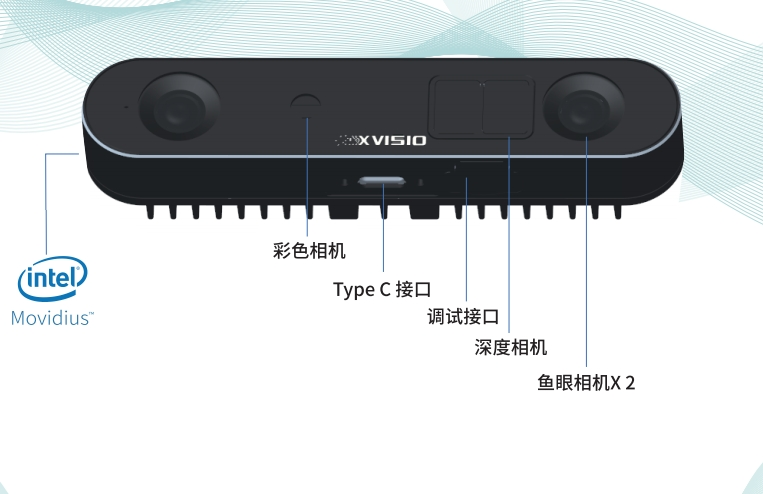{width=70%}

图 6.2 展示的是一个典型 RGB-D 相机的硬件形态。对机器人抓取而言，RGB 与 Depth 的关系不是“谁替代谁”，而是互补：RGB 更擅长区分类别和边界，Depth 更擅长提供距离和尺度。只有二者完成时间同步、像素对齐和内参标定，后续的“mask 筛深度”和“深度反投影”才有意义。否则，即使分割结果看起来很准，也可能因为 RGB 与深度没有对齐，把错误位置的深度值拿来生成点云。

实际部署时，需要优先确认三个基础条件：第一，RGB 与 Depth 是否已经注册到同一像素坐标系；第二，深度值是否有明确单位，例如 16-bit 深度图常以毫米存储，而 Open3D 等库通常以米为几何单位；第三，相机内参是否与当前分辨率一致。很多看似“位姿估计不稳定”的问题，最后都能追溯到这三项基础配置。

| 输入项 | 提供的信息 | 典型用途 | 主要误差来源 |
|---|---|---|---|
| RGB 图像 | 颜色、纹理、边缘、语义线索 | 检测、分割、目标识别 | 光照变化、遮挡、反光、运动模糊 |
| Depth 图像 | 像素级距离观测 | 反投影、点云恢复、3D 定位 | 深度空洞、飞点、量程误差、材质相关噪声 |
| 相机内参 $K$ | $f_x,f_y,c_x,c_y$ | 像素到相机三维坐标转换 | 标定误差、畸变补偿不足、尺度配置错误 |
| 手眼外参 | 相机与机器人坐标系关系 | 相机系到基座系转换 | 外参漂移、矩阵方向混淆、采样姿态不足 |

#### 3.1.2 深度相机：三维几何的感知核心

深度相机本身也有不同技术路线。双目立体视觉依赖左右图像的视差，适合纹理丰富、光照可控或户外场景；结构光通过投射编码图案获得深度，近距离精度较高，但容易受强光和反光表面影响；ToF 相机通过测量光飞行时间估计距离，覆盖范围较大，但在边缘、反光和多径反射场景中仍会产生系统性噪声。选型时不应只看分辨率，还要同时考虑工作距离、目标材质、安装方式和允许的标定复杂度。

| 深度技术 | 基本原理 | 优势 | 局限 | 抓取场景中的典型用法 |
|---|---|---|---|---|
| 双目 / 主动双目 | 由视差恢复深度 | 结构简单，部分方案适合较远距离 | 弱纹理区域匹配困难 | 移动机器人、较大工作空间观测 |
| 结构光 | 投射已知图案并分析形变 | 近距离精度高，适合桌面场景 | 强光、反光和透明材质敏感 | 桌面分拣、近距离物体建模 |
| ToF | 测量光传播时间或相位差 | 量程较大，响应快 | 边缘、多径和反光噪声明显 | 中距离感知、全局粗定位 |

#### 3.1.3 多相机配置：从单一视角到系统级视觉

常见相机拓扑可分为三类。Eye-to-Hand 相机固定在工作空间外，视野稳定，适合桌面分拣和工位监控；Eye-in-Hand 相机安装在末端执行器附近，近距离精度高，适合精细对位和二次复检；多相机协同则通过顶视、头部、腕部等视角互补，缓解遮挡并扩展可观测空间。拓扑选择会直接影响后续手眼标定形式和抓取闭环策略。

#### 3.1.4 关键参数：选型的量化依据

相机选型最终要落到可量化指标上：工作距离决定深度有效范围，分辨率和视场角决定目标在图像中的像素占比，帧率影响闭环响应，标定稳定性决定点云尺度和坐标转换是否可信。若这些底层条件不足，后续模型精度很难弥补硬件观测质量的缺口。

**本节小结：** RGB-D 输入为抓取感知提供了语义与几何两类互补信息：RGB 帮助系统识别目标类别、纹理和边界，Depth 给出尺度、距离和局部几何，内参和外参则把这些像素观测放回真实空间。相机拓扑、工作距离、分辨率、深度噪声和标定稳定性并不是外围配置，而是直接决定点云质量和坐标转换可靠性的基础条件。多相机配置可以减少遮挡、扩大视野，但也会引入同步、外参维护和数据融合成本。只有输入侧足够可信，后续检测、分割、点云提取和位姿估计才有稳定发挥的可能。

### 3.2 目标检测：从边界框到目标粗定位

#### 3.2.1 核心作用：缩小搜索空间，为后续处理"划重点"

目标检测的作用，是在整幅图像中建立受约束的候选区域，减少后续分割、深度关联和点云处理的搜索空间。检测结果并不直接给出抓取点，而是提供语义先验和区域先验。

在实际系统中，检测通常是整条链路的第一道候选生成环节。没有检测框，后续分割模型可能要面对整幅图像；没有类别和置信度，任务层也很难判断当前目标是否就是用户想抓的对象。检测的价值不在于一步到位解决抓取，而在于把问题从“整张图里有什么”缩小为“这个局部区域里如何恢复目标几何”。

#### 3.2.2 输出形式：边界框、类别与置信度

| 输出项 | 含义 | 在后续链路中的作用 |
|---|---|---|
| `class` | 目标类别 | 关联任务约束与抓取策略库 |
| `bbox` | 二维候选框 | 限定分割与深度关联范围 |
| `score` | 检测置信度 | 过滤误检、排序候选目标 |

#### 3.2.3 YOLO 系列：实时检测的工业标准

闭集检测器的代表是 YOLO 系列。它的优势是推理快、部署成熟，适合固定类别和实时性要求高的场景。对桌面机械臂来说，如果任务只涉及少量已知物体，训练一个轻量 YOLO 或 YOLO-seg 模型往往比直接使用大型通用模型更稳定。原因很直接：闭集任务的类别边界清晰，标注成本可控，模型输出也更容易和后端抓取策略库绑定。

#### 3.2.4 Grounded-SAM：开放词汇检测的新范式

开放词汇检测器解决的是另一类问题：任务目标不一定来自固定类别表，而可能来自语言指令，例如“拿起那个蓝色瓶子”。Grounding DINO 与 SAM 组合后，可以先根据文本找到候选目标，再由分割模型给出前景 mask，适合服务机器人和开放环境。它的优势是泛化，代价是链路更长、延迟更高，而且文本提示的歧义会传递到后续 mask 和点云。

| 方法类别 | 代表实现 | 特点 | 适用场景 |
|---|---|---|---|
| 闭集检测 | YOLO 系列、Faster R-CNN | 类别集合固定，部署成熟 | 已知类别、边缘设备、工业分拣 |
| 开放词汇检测 | Grounding DINO、Grounded-SAM | 文本提示驱动，类别开放 | 家庭服务、语言交互、未知物体搜索 |
| 检测跟踪组合 | detector + tracker | 帧间稳定，减少跳变 | 视频流、移动平台、动态目标 |

#### 3.2.5 核心局限：二维信息不足以支撑抓取

检测阈值不应只根据 mAP 设定。阈值过低会引入误检，导致背景深度进入点云；阈值过高会漏掉目标，使整条感知链无法启动。对于抓取系统，检测器的输出应和后续点云质量一起评估。

在工程实现中，检测结果通常还要经过任务层过滤。例如，同一帧图像中检测到多个杯子时，系统需要根据语言指令、距离、可达性或抓取优先级选择其中一个；当检测框连续多帧跳动时，应引入跟踪或时序平滑，避免后续点云在帧间抖动。检测器不是独立终点，而是整个抓取链路的候选生成器。

**本节小结：** 目标检测是抓取感知链路中的第一道候选生成环节，它把全图搜索问题缩小到目标相关区域，也为任务层提供类别和置信度线索。闭集 YOLO 适合已知类别、实时性要求高的场景，开放词汇检测则适合服务机器人面对长尾物体和语言指令的任务。无论采用哪类检测器，检测结果本身都仍只是二维入口，不能直接给出深度、姿态或可执行接触点。要让这个入口真正服务抓取，还必须继续经过实例分割、深度关联、点云处理和坐标转换。

### 3.3 实例分割：从像素级掩码到目标区域提取

#### 3.3.1 核心作用：从"矩形框"到"精确轮廓"

若直接用 bbox 裁剪深度图，矩形区域通常会同时包含目标、桌面和邻近物体。这些非目标像素在反投影后会变成背景点云，污染质心估计、法向量估计和点云配准。因此，实例分割在本链路中的功能，是为三维恢复提供目标级前景约束。

这里可以把 bbox 和 mask 的差别理解得更直观一些：bbox 在图像上给出一个“搜索范围”，mask 则进一步给出目标前景像素集合。对于人眼来说，框里混入少量桌面并不影响理解；但对点云算法来说，桌面点和物体点没有语义标签，一旦一起进入配准或主轴估计，就会被当成同一个几何对象处理。很多抓取偏差并不是位姿算法本身的问题，而是从这一步开始，目标点云已经被背景点污染了。

| 表示形式 | 保留对象 | 背景混入风险 | 对三维恢复的影响 |
|---|---|---|---|
| 整幅图像 | 场景全部像素 | 最高 | 反投影得到完整场景点云 |
| bbox 裁剪 | 矩形区域像素 | 中等 | 桌面、邻物易混入目标点云 |
| mask 筛选 | 目标前景像素 | 最低 | 更利于恢复目标专属点云 |

#### 3.3.2 经典实例分割模型：Mask R-CNN 与 YOLACT

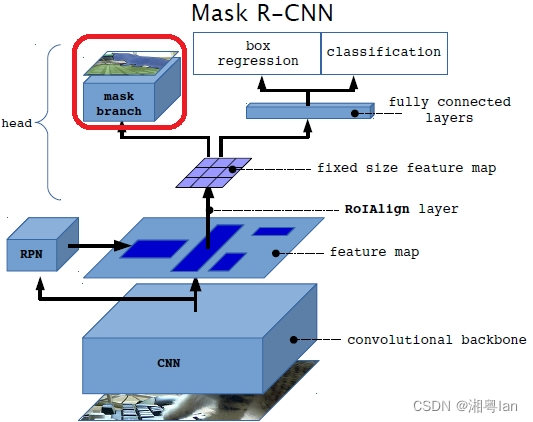{width=60%}

Mask R-CNN 代表了经典两阶段实例分割范式 [1]。它的思路可以拆成两步看：第一步先让 Region Proposal Network（RPN）在特征图上找出一批可能包含目标的候选区域；第二步对每个候选区域做更精细的判断，包括类别分类、边界框修正和像素级 mask 预测。图 6.3 中的 `mask branch` 就是 Mask R-CNN 相比 Faster R-CNN 增加的关键分支，它让模型不只知道“这里有一个目标”，还能知道“目标在这个框里的哪些像素上”。

这种两阶段结构的优势是稳。候选区域先把问题缩小，再在局部区域内做细分割；RoIAlign 等对齐机制减少了特征量化误差，因此边界质量通常较好，适合小零件分拣、工件装配前定位、桌面物体点云提取等对轮廓敏感的场景。它的代价是链路较长，推理速度和部署复杂度不如单阶段方法。对于教学和离线实验，Mask R-CNN 很适合用来解释“检测框为什么不够、mask 为什么有价值”；对于实时抓取，则需要结合算力和帧率要求权衡。

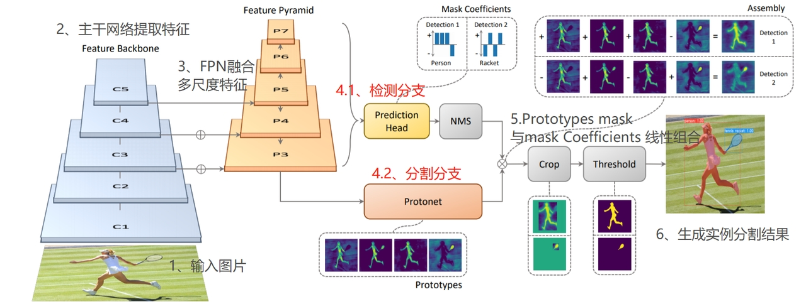{width=90%}

YOLACT 则走了另一条路线：不再先生成候选区域再逐个精修，而是在一次前向传播中同时预测两类东西：一组全图共享的 prototype masks，以及每个检测实例对应的 mask coefficients [2]。最终每个实例的 mask 由这些 prototype 按系数组合得到。图 6.4 右侧的 “Prototypes mask 与 mask coefficients 线性组合” 展示的就是这个过程。它把“每个实例单独做精细分割”的问题，改写成“全图原型 + 实例系数”的组合问题。

这类方法的关键取舍是用“可组合的原型”换取速度。它不需要对每个 RoI 单独运行复杂的 mask 分支，因此更适合视频流和边缘设备。但也因为 mask 是由若干原型组合出来的，在边界特别复杂、小物体密集或严重遮挡时，分割质量可能不如两阶段方法稳定。对机器人抓取来说，如果场景是传送带、桌面分拣或固定类别物体，YOLACT 类方法可以提供较高帧率；如果任务要求精密插拔或小零件位姿估计，则需要重点验证 mask 边缘误差是否会放大为点云误差。

| 维度 | Mask R-CNN | YOLACT |
|---|---|---|
| 基本范式 | 两阶段，先候选区域再局部分割 | 单阶段，原型 mask 与实例系数组合 |
| 主要优势 | 边界质量较稳，便于解释和离线评估 | 推理链路短，适合实时或视频流 |
| 主要风险 | 速度和部署成本较高 | 复杂边界、小物体和遮挡场景下需谨慎验证 |
| 抓取前端定位 | 高质量 mask 生成器 | 实时目标前景筛选器 |

#### 3.3.3 通用分割基础模型：SAM / SAM2

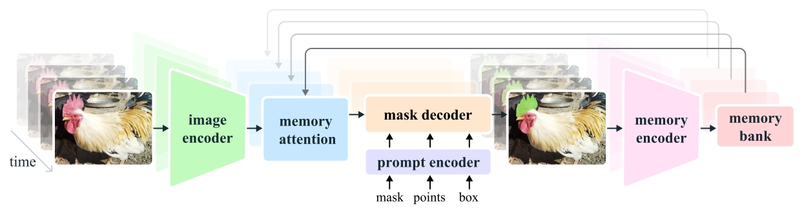{width=85%}

SAM2 的价值不只在于“能分割”，更在于它把分割从单张图像扩展到了视频序列 [3]。图 6.5 中的 memory attention 和 memory bank 可以理解为模型的短期记忆：第一帧由点、框或 mask 提示确定目标以后，后续帧不必每次从零开始找目标，而是参考过去帧中的目标表示继续跟踪。对于机器人来说，这一点很重要，因为机械臂一旦开始运动，视角、遮挡和光照都会变化。如果每一帧的 mask 都独立预测，目标前景可能抖动；如果能利用时序记忆，点云和位姿估计会更稳定。

在抓取系统中，SAM2 更适合作为“交互式目标锁定 + 时序前景保持”的工具，而不是替代几何模块。第一次提示可以来自人工点击、语言检测框或任务规划器；后续帧则依赖记忆机制维持同一目标身份。这样做的直接收益是降低 mask 在连续帧中的跳变，从而减少点云质心和位姿估计的抖动。

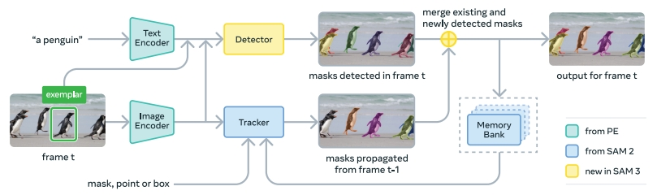{width=85%}

图 6.6 展示的流程进一步把语言提示、视觉提示和时序跟踪结合起来。用户可以说“抓那个红色杯子”，开放词汇检测器先根据文本找到候选目标，分割模型再生成 mask，跟踪模块负责在后续帧维持目标一致性。对于服务机器人和移动操作平台，这种能力比固定类别检测更接近真实需求：家庭、办公室、仓储环境中的物体种类很难提前穷尽，机器人必须能根据语言描述临时确定目标。

不过，SAM 系列和 Grounded-SAM 类方法不能被理解为完整抓取前端。它们输出的仍然是二维 mask，并不直接解决深度空洞、透明物体、手眼标定或夹爪碰撞问题。更准确的定位是：它们把开放类别目标从图像中分离出来，为后续 RGB-D 几何恢复提供更强的前景约束。要让它真正服务抓取，还需要继续接上深度筛选、反投影、点云滤波和坐标转换。

#### 3.3.4 核心局限：仍为 2D 感知，需与深度图配合

实例分割误差通常以三种方式向下游传播：边界漏分会低估物体尺寸；背景混入会偏移点云质心和主方向；遮挡粘连会把多个物体错误合并，使位姿估计建立在错误几何对象上。

**本节小结：** 实例分割把粗糙的 bbox 进一步收缩为目标前景像素，是二维视觉进入三维点云之前的关键筛选步骤。对机器人而言，mask 的价值不只是让图像结果更精细，而是决定哪些深度像素会被带入三维空间；一旦背景、桌面或邻物混入，后续质心估计、主轴估计和点云配准都会受到影响。Mask R-CNN、YOLACT、SAM/SAM2 等方法各有适用边界，选型时要同时考虑实时性、开放类别能力、边缘精度和与深度图的对齐质量。因此，实例分割虽然仍停留在 2D 层面，却直接决定了下一步目标点云是否“干净”、位姿估计是否有可靠输入。

### 3.4 点云生成与滤波：从深度图到三维目标点云

目标点云生成是从图像域进入欧氏空间的关键步骤。给定实例 mask、深度图和相机内参，系统先筛选目标前景深度，再将有效像素反投影到相机坐标系，最后通过滤波和降采样形成位姿估计所需的几何输入。

到这里，机器人完成了从“看见一块前景区域”到“量出一簇空间点”的转换。这一步看似只是公式计算，但它决定了后续所有几何算法的输入基础是否可靠。深度尺度错了，点云会整体变大或变小；mask 边缘错了，点云会混入桌面；滤波参数过强，目标局部结构会被抹掉。位姿估计如果建立在这样的点云上，再复杂的模型也很难稳定输出正确结果。

#### 3.4.1 像素反投影：从深度图到三维点云的核心公式

设相机内参矩阵为：

$$
K = \begin{bmatrix}
 f_x & 0 & c_x \\
 0 & f_y & c_y \\
 0 & 0 & 1
\end{bmatrix}
$$

对于深度像素 $(u,v,d)$，若深度图原始值需要通过尺度因子 $s$ 转换为米制深度，则先令：

$$
Z = \frac{d}{s}
$$

其在相机坐标系下的三维点 $\mathbf{p}_c=(X,Y,Z)^T$ 为：

$$
X = \frac{(u-c_x)Z}{f_x}, \qquad
Y = \frac{(v-c_y)Z}{f_y}, \qquad
Z = \frac{d}{s}
$$

该公式恢复的是**相机坐标系下的观测点**，不是机器人基座坐标系下的控制目标。因此，第 3 节输出仍属于视觉几何表征，后续必须经过手眼外参和抓取映射才能用于执行。

反投影公式还隐含两个容易被忽略的前提。第一，深度值 $d$ 必须与 RGB 或 mask 所在像素对齐；若 RGB 与 Depth 分辨率不同或外参未对齐，mask 中的前景像素可能会取到背景深度。第二，深度单位必须明确：许多 RGB-D 相机输出 16-bit 深度图，数值单位可能是毫米，也可能需要乘以 `depth_scale` 才能转为米。单位错误不会让程序报错，但会让点云尺度整体错误，后续位姿估计和手眼转换都会被污染。

#### 3.4.2 点云预处理：从"原始点云"到"干净点云"

| 处理步骤 | 目的 | 典型参数 | 输出结果 |
|---|---|---|---|
| 前景筛选 | 去除非目标深度 | `mask > 0` | 目标深度图 |
| 反投影 | 像素恢复为三维点 | `K, depth_scale` | 原始目标点云 |
| 直通滤波 | 裁剪工作空间外点 | `z_min, z_max` | 有效空间范围点云 |
| 统计滤波 | 剔除离群飞点 | `nb_neighbors, std_ratio` | 更平滑稳定的点云 |
| 体素降采样 | 控制点数与计算量 | `voxel_size` | 适合配准的稀疏点云 |
| 导出存储 | 供位姿估计模块调用 | `.pcd / .ply` | 标准化目标点云文件 |

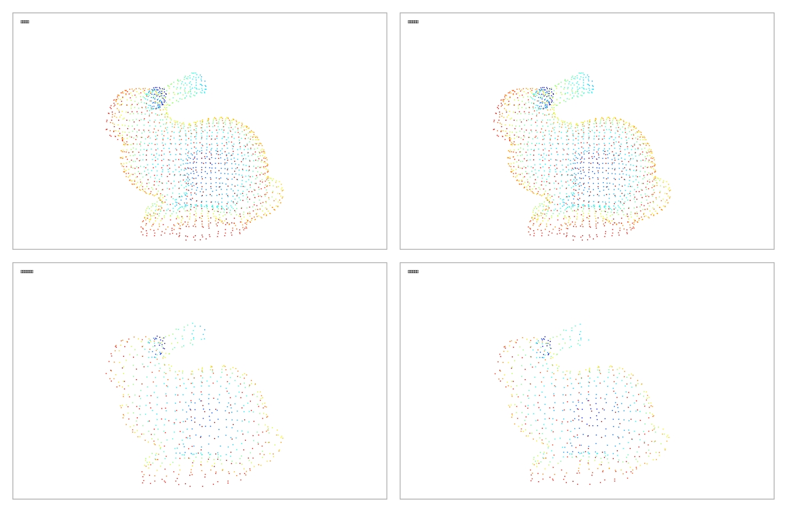{width=90%}

图 6.7 中使用的是经典 Stanford Bunny 点云 / 网格模型，来源于 Stanford 3D Scanning Repository [5]。它是计算机图形学、三维重建、点云处理和 Open3D / PCL 教学中非常常见的基准模型，并不是 OpenCV 专属案例；本讲使用它只是为了直观展示点云滤波、降采样和离群点去除的效果。

点云预处理的目标不是“尽可能保留所有点”，而是在保留主要几何结构的前提下去除噪声并降低计算量。过弱的滤波会使 ICP 或位姿回归受到离群点干扰；过强的滤波则会破坏边缘、孔洞、把手等对姿态判断有价值的局部结构。Open3D 中常用的体素降采样和统计离群点滤波，正好对应这两个目标：前者控制点数，后者根据邻域距离剔除孤立点 [4]。

三类滤波可以按功能区分。直通滤波用于删除工作空间之外的点，例如桌面以下、相机量程之外或机器人不可达区域；统计离群点滤波根据每个点到邻近点的平均距离剔除孤立飞点，适合处理深度边缘和反光噪声；体素降采样把空间划分成固定大小的立方体网格，每个体素保留一个代表点，用来降低点数并提高配准速度。常见经验是先保证目标点云语义纯净，再做适度去噪，最后按下游算法实时性选择体素大小。

| 操作 | 解决的问题 | 参数含义 | 调参倾向 |
|---|---|---|---|
| 直通滤波 | 删除明显不可能属于目标的空间区域 | `z_min, z_max` 或 XYZ 范围 | 宁可略宽，不要截断目标 |
| 统计滤波 | 删除孤立飞点和边缘离群点 | `nb_neighbors, std_ratio` | 点云稀疏时放宽阈值 |
| 体素降采样 | 控制点数、提升配准速度 | `voxel_size` | 精密抓取取小，实时任务取大 |

参数调节时要先判断下游需求。如果下一步是 ICP 精配准，应保留足够的边缘、平面和局部结构；如果下一步只是计算 3D 中心或粗略包围盒，可以使用更强的降采样来换取速度。对真实机器人来说，滤波参数不是越强越好，而是要服务位姿估计和抓取规划所需的几何信息量。

#### 3.4.3 目标点云提取与误差修正路径

| 现象 | 优先检查项 | 处理建议 |
|---|---|---|
| 点云整体倾斜或尺度异常 | 内参、深度尺度 | 核对 `f_x, f_y, c_x, c_y` 与 `depth_scale` |
| 边缘大量飞点 | 深度边界、反光区域、mask 边界 | 先修正分割，再调整统计滤波参数 |
| 目标被截断 | `z_min / z_max` 过窄、mask 漏分 | 放宽空间阈值或改善前景提取 |
| 点数过多导致配准缓慢 | 点云过密 | 增大 `voxel_size`，但避免过度降采样 |
| 多物体粘连 | 分割失败或遮挡严重 | 重做实例分割，必要时做连通域拆分 |

这些现象分别对应不同层级的假设失配。尺度异常通常源于相机参数或深度单位错误；飞点和空洞对应测距噪声与边界不连续；粘连则说明二维前景约束失败。调试时应先定位表征层级，再调整对应模块。

#### 3.4.4 全链路回顾与实验索引

本节的实验代码位于 [Visual_Perception 目录](../../code/lecture06/Visual_Perception/)。其中，[`pipeline_from_syllabus.py`](../../code/lecture06/Visual_Perception/pipeline_from_syllabus.py) 是与 3.4 节最直接对应的课堂脚本：它不依赖交互式分割界面，而是假设已经有 `depth.png`、`mask.png` 和 `intrinsics.json`，然后严格按照“mask 筛深度 → 反投影 → 直通滤波 → 统计滤波与体素降采样 → 导出点云”的顺序执行。示例输入可从 University of Washington RGB-D Object Dataset 下载一帧 full 640×480 RGB-D 数据，并按代码目录 README 中的说明整理为 `data/rgbd_object_demo/`。

运行方式如下：

```bash
python pipeline_from_syllabus.py --demo-dir data/rgbd_object_demo --no-vis
```

若希望同时弹出最终点云窗口，可去掉 `--no-vis`。脚本运行后会在示例目录的 `output/` 下保存 masked depth、各阶段点云、阶段截图和 JSON 摘要，便于将终端统计、点云文件和正文图示逐一对应起来。

| 步骤 | 对应函数 | 核心操作 | 关键输出 | 对应图示 |
|---|---|
| 1 | `step1_mask_filtering()` | 用 mask 将非目标深度置零 | `syllabus_masked_depth.png`、有效深度像素统计 | 图 6.8 |
| 2 | `step2_backprojection()` | 用 Open3D 根据相机内参反投影 | `syllabus_target_raw.pcd`、原始目标点数 | 图 6.9 |
| 3 | `step3_passthrough()` | 用 NumPy 布尔切片做 Z 向直通滤波 | `syllabus_target_passthrough.pcd`、裁剪前后点数 | 图 6.10 |
| 4a | `step4_denoise_and_downsample()` | 统计滤波剔除离群飞点 | `syllabus_target_statistical.pcd`、剔除点数 | 图 6.11 |
| 4b | `step4_denoise_and_downsample()` | 体素降采样降低点云规模 | 降采样后点数、压缩比 | 图 6.11 |
| 5 | `step5_export()` | 导出最终清洗点云并打印空间范围 | `syllabus_target_clean.pcd`、XYZ 范围 | 图 6.12 |

这段代码的价值在于它把 3.4 节的每个概念都变成了可检查的中间结果。`syllabus_masked_depth.png` 对应二维前景约束，说明 mask 是否真正限制了深度区域；`syllabus_target_raw.pcd` 对应反投影后的原始目标点云，用来检查深度尺度和相机内参；`syllabus_target_passthrough.pcd` 对应工作空间裁剪，用来判断 Z 向阈值是否误删目标；`syllabus_target_statistical.pcd` 和 `syllabus_target_clean.pcd` 则分别对应去噪与降采样后的几何表示。脚本还会保存 `syllabus_pipeline_summary.json`，记录输入路径、参数、像素统计、各阶段点数和 XYZ 范围。

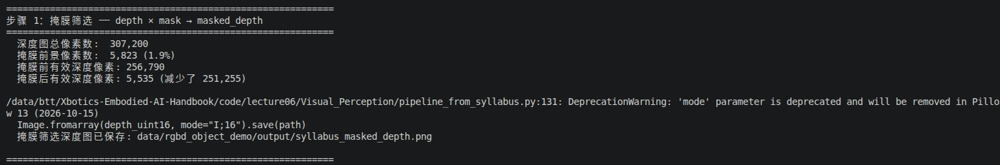{width=70%}

图 6.8 对应第 1 步。这里最值得观察的是“掩膜前景像素数”和“掩膜后有效深度像素数”并不一定相等：前者来自二维 mask，后者还要求对应像素有有效深度。目标边缘、反光区域或透明区域常常会出现 mask 有前景、Depth 无有效值的情况，这也是点云空洞的直接来源。

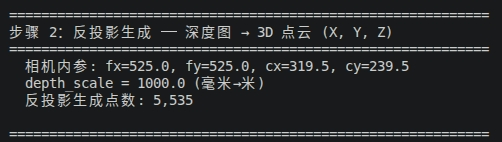{width=70%}

图 6.9 对应第 2 步。反投影点数通常等于 masked depth 中的有效深度像素数。若点数异常少，应优先检查 mask 是否过小、深度图是否存在大面积空洞；若点云尺度明显异常，则应检查 `intrinsics.json` 中的 `fx, fy, cx, cy` 与 `depth_scale`。

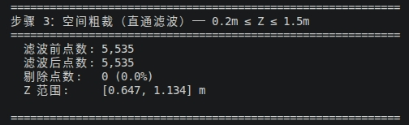{width=70%}

图 6.10 对应第 3 步。直通滤波的作用不是精修点云，而是快速删除明显不属于工作空间的点。若过滤后点数变化很小，说明当前目标本来就在有效 Z 范围内；若点数突然大幅下降，则需要确认 `z_min / z_max` 是否过窄，避免把目标本体截断。

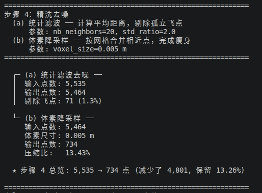{width=70%}

图 6.11 对应第 4 步。统计滤波先根据邻域距离剔除孤立点，体素降采样再按空间网格合并近邻点。前者主要改善点云纯净度，后者主要降低计算量。若统计滤波剔除比例过高，可能是 `nb_neighbors` 过大或 `std_ratio` 过小；若体素降采样后点数过低，则可能丢失物体边缘、孔洞、把手等对位姿估计有用的局部结构。

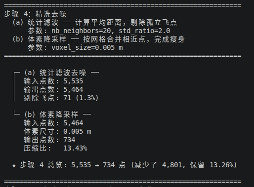{width=85%}

图 6.12 对应第 5 步。最终输出的 `syllabus_target_clean.pcd` 是第 4 节位姿估计可以直接读取的目标点云。这里的 XYZ 范围不仅是日志信息，也是一项必要的合理性检查：如果物体尺寸明显不符合常识，问题通常不在位姿估计，而在前面的深度尺度、内参、mask 或滤波参数。

课堂讨论可以围绕三个问题展开：为什么反投影必须依赖相机内参；为什么深度空洞常出现在物体边缘、反光面和透明材质上；为什么体素降采样需要在“计算效率”和“几何细节保留”之间折中。

**本节小结：** 点云生成完成了从二维像素到三维几何的关键跃迁：mask 负责选出目标前景，深度与内参负责反投影，滤波与降采样负责把原始观测整理成可计算的目标点云。这里最重要的不是某个函数调用，而是每一步都留下可检查的中间结果：masked depth、raw point cloud、passthrough point cloud 和 clean point cloud。直通滤波、统计滤波和体素降采样分别解决空间裁剪、离群点抑制和计算规模控制问题，但参数过强也可能削掉真实几何细节。这样一来，位姿估计前端的错误就不再是模糊的“模型不准”，而可以被定位到 mask、深度尺度、内参、外参或滤波参数等具体环节。

### 3.5 常用开源工具与模型选型

#### 3.5.1 检测分割工具

| 任务 | 推荐工具 | 选择理由 |
|---|---|---|
| 固定类别实时检测 | YOLO / YOLO-seg | 实时性好、部署成熟、边缘设备友好 |
| 开放词汇目标定位 | Grounding DINO + SAM / Grounded-SAM | 支持文本提示，适配开放类别物体 |
| 通用实例分割 | Mask R-CNN、SAM / SAM2 | 分割质量稳定，提示形式灵活 |

#### 3.5.2 点云处理工具

| 任务 | 推荐工具 | 选择理由 |
|---|---|---|
| 点云处理 | Open3D | 提供滤波、配准、可视化等完整工具链 |
| 真机 RGB-D 数据采集 | RealSense SDK 或相机厂商 SDK | 便于获得对齐 RGB、Depth 与内参 |

#### 3.5.3 选型建议：三维度决策框架

一个简洁的选型原则是：类别固定、追求实时，优先闭集检测器；类别开放、需要语言交互，优先 Grounded-SAM 类组合；对点云几何要求高，则优先保证 mask 质量和深度质量，而不是盲目更换位姿估计算法。对于教学实验，`YOLO / Grounding DINO → SAM → Open3D` 是一条容易观察中间结果的链路；对于工业部署，则应根据目标类别、节拍、算力和失败代价做更保守的组合。

**本节小结：** 第 3 节的核心输出不是 bbox，也不是 mask，而是经过前景约束、深度反投影与几何整形后形成的目标点云表征。检测与分割负责回答“处理哪个目标”，深度和内参负责把目标送入三维空间，滤波和工具链则负责让这份点云足够干净、足够轻量、足够可调试。开源工具的选择应围绕链路需求展开：检测分割看类别开放性和实时性，点云处理看几何算子和可视化能力，整体系统还要考虑部署复杂度。接下来，第 4 节将在这份点云或 RGB-D 观测基础上讨论 6D 位姿估计，第 5 节则进一步把位姿结果转化为夹爪可以执行的抓取目标。

## 4 6D物体位姿估计：原理与主流技术方案

### 4.1 什么是6D位姿：平移与旋转的数学表示

6D位姿（6 Degree‑of‑Freedom Pose）是描述刚体在三维空间中完整状态的标准表示，包含3个平移自由度与3个旋转自由度，是连接视觉感知与机器人操作的核心中间量。清晰理解其数学表示，是掌握位姿估计算法的基础。

#### 4.1.1 平移自由度：物体三维空间位置的量化描述

平移描述物体坐标系原点在参考坐标系（相机坐标系或机器人基座坐标系）中的三维空间位置，用三维向量 $\mathbf{t} = [x, y, z]^T$ 表示，单位通常为米或毫米。

- $x, y$ 对应物体在垂直于相机光轴平面内的水平与垂直位置；
- $z$ 对应物体沿相机光轴方向的深度距离。

平移分量决定了物体"在空间哪里"，是机械臂能够到达目标区域的基础前提。

#### 4.1.2 旋转自由度：三种主流旋转表示方法对比

旋转描述物体坐标系相对于参考坐标系的空间朝向，共有3个独立自由度。工程中常用三种表示方式，各有优劣与适用场景。

- **欧拉角：** 用roll（绕X轴）、pitch（绕Y轴）、yaw（绕Z轴）三个角度描述旋转。优势是直观易懂，便于人类理解与调试；劣势是存在万向锁（Gimbal Lock）问题，特定角度下自由度退化，插值与求导不便。
- **四元数：** 用四维单位向量 $\mathbf{q} = [w, x, y, z]^T$ 描述旋转，满足 $w^2 + x^2 + y^2 + z^2 = 1$。优势是无万向锁、计算高效、插值平滑；劣势是直观性差，不便于人工解读。四元数是机器人控制系统与位姿估计算法中最常用的旋转表示形式。
- **旋转矩阵：** 用 $3 \times 3$ 的正交矩阵 $R$ 描述旋转，三个列向量分别对应物体坐标系三个轴在参考坐标系下的方向。优势是数学性质严谨，可直接用于点坐标变换；劣势是参数冗余（9个参数描述3个自由度），不适合直接作为网络回归目标。

#### 4.1.3 齐次变换矩阵：位姿的统一工程表达形式

工程实践中，通常将平移向量与旋转矩阵整合为 $4 \times 4$ 的齐次变换矩阵 $T \in SE(3)$，作为位姿的标准输出与交换格式：

$$T = \begin{bmatrix} \mathbf{R} & \mathbf{t} \\ \mathbf{0}^{\mathsf{T}} & 1 \end{bmatrix}$$

该矩阵可以直接完成不同坐标系之间的点坐标变换：对于任意一点在物体坐标系下的坐标 $P_{\text{obj}}$，其在相机坐标系下的坐标 $P_{\text{cam}}$ 可通过左乘变换矩阵得到：

$$P_{\text{cam}} = T \cdot P_{\text{obj}}$$

齐次变换矩阵的优势在于可以通过矩阵乘法方便地实现多级坐标系的级联变换，是手眼标定、坐标转换链路中的标准数据结构。

**本节小结：** 6D 位姿的核心是把三维平移和三维旋转放在同一个刚体变换中表达，而齐次变换矩阵是工程系统中最常用的交换格式。平移部分决定物体在哪里，旋转部分决定物体坐标系如何相对相机或机器人基座摆放，两者缺一不可。旋转矩阵、欧拉角、四元数和轴角各有适用场景，也各有可能引入奇异性、顺序歧义或归一化问题。理解这些表示方法的边界，是后续进行坐标变换、位姿误差分析、抓取模板映射和真机调试的基础。

### 4.2 位姿估计的三类技术路线

6D位姿估计经过多年发展，形成了三类技术路线清晰、适用场景各异的方法体系：传统几何法、模板匹配法与深度学习法。三者并非简单的替代关系，而是在不同场景下各有最优解。

#### 4.2.1 传统几何法：基于点云配准的ICP系列

- **核心思想：** 将观测得到的目标点云与物体的CAD模型点云进行迭代配准，寻找使两组点云最优对齐的刚体变换矩阵。
- **代表算法：** ICP（迭代最近点）及其众多变体，包括点到点ICP、点到平面ICP、截断ICP等。
- **算法流程：** 给定初始位姿、观测目标点云与模型参考点云；为每个观测点在模型点云中寻找最近对应点；求解使对应点距离总和最小的刚体变换；更新位姿，重复迭代直到误差收敛。
- **优势：** 精度高，收敛后可达亚毫米级；无需训练，纯几何驱动，可解释性强；有成熟的开源实现。
- **劣势：** 对初始位姿要求高，初始偏差过大易陷入局部最优；对遮挡、离群点敏感；无纹理、对称物体匹配难度大。
- **适用场景：** 已知物体精确三维模型、初始位姿偏差较小的工业场景，常用作深度学习粗估计后的位姿精化环节。

#### 4.2.2 模板匹配法：基于三维模型的姿态对齐

- **核心思想：** 离线预先渲染物体在不同视角、不同姿态下的二维/三维模板，构建模板库；在线将输入图像/点云与模板库进行特征匹配，找到最相似模板对应的姿态。
- **代表方案：** 经典LINEMOD算法及其深度学习增强变体。
- **算法流程：** 离线阶段对物体CAD模型进行全视角采样渲染，提取梯度、深度等鲁棒特征，构建模板库；在线阶段提取输入图像的对应特征，与模板库快速匹配，输出相似度最高的模板对应的位姿。
- **优势：** 推理速度快，适合实时场景；对低纹理、无纹理物体友好；对硬件算力要求低。
- **劣势：** 姿态精度有限，通常为粗估计；模板库占用存储空间大；新物体需要重新建库，泛化能力差。
- **适用场景：** 结构化工业分拣场景、固定物体模型、对实时性要求高但精度要求适中的任务。

#### 4.2.3 深度学习法：从两阶段方案到端到端范式

深度学习方法利用神经网络从数据中学习位姿特征，根据架构设计可分为两阶段与端到端两大类，是当前位姿估计领域的研究主流。

**1. 两阶段方案**

- **核心逻辑：** 第一阶段完成目标检测与实例分割，第二阶段单独进行6D位姿回归；
- **典型代表：** SAM‑6D，以SAM的分割结果为基础，后续接位姿估计头；
- **特点：** 任务解耦清晰，便于分模块调试；分割精度直接决定位姿上限；可复用成熟的检测分割模型。

**2. 端到端方案**

- **直接回归型：** 网络输入原始图像/点云，直接输出完整的旋转与平移参数。代表为FoundationPose，通过几何重构与优化实现强泛化性。优势是泛化能力强，对遮挡场景鲁棒，可适配未知类别物体；劣势是模型参数量大，推理速度慢，训练数据依赖度高。
- **检测驱动型：** 基于YOLO等目标检测架构扩展，单次前向传播同步预测类别、检测框与3D包围盒角点的2D投影，再通过PnP几何算法求解6D位姿。代表为YOLO‑6D。优势是推理速度快，模型轻量化，支持实时部署；劣势是泛化能力有限，依赖已知物体3D模型，遮挡与对称场景精度下降明显。

**三类技术路线对比：**

| 技术路线 | 代表算法 | 核心优势 | 核心劣势 | 适用场景 |
|----------|----------|----------|----------|----------|
| 传统几何法 | ICP | 精度高、可解释、无需训练 | 依赖初始值、对遮挡敏感 | 工业精配准、位姿精化 |
| 模板匹配法 | LINEMOD | 速度快、低纹理友好 | 姿态精度有限、泛化差 | 工业分拣、固定物体 |
| 深度学习‑两阶段 | SAM‑6D | 解耦清晰、泛化较好 | 流程较长 | 通用服务机器人 |
| 深度学习‑端到端 | FoundationPose | 泛化强、遮挡鲁棒 | 参数量大、速度慢 | 非结构化未知物体 |
| 深度学习‑检测驱动 | YOLO‑6D | 速度快、轻量化 | 泛化有限、依赖模型 | 实时结构化场景 |

工程实践中常采用"深度学习粗估计+ICP精配准"的混合方案，兼顾速度、泛化性与精度，是当前落地最广泛的组合模式。

**本节小结：** 传统几何法、模板匹配法和深度学习法分别在精度、速度、泛化性和部署成本上各有侧重。几何法依赖可观测结构和良好的初值，适合点云质量较高、局部配准可验证的场景；模板匹配法依赖 CAD 或先验模型，适合已知物体和工业化部署；学习法依赖训练数据覆盖，能够在复杂纹理和开放场景中提供更强的初始估计能力。它们解决的是同一个位姿问题，却适用于不同工程边界。实际系统常采用混合路线：先用学习模型提供粗位姿，再用几何配准提高局部精度和可解释性。

### 4.3 典型开源方案对比：FoundationPose / SAM‑6D / YOLO‑6D

FoundationPose、SAM‑6D与YOLO‑6D是当前工程与科研领域最具代表性的三类开源位姿估计方案，分别对应端到端通用型、两阶段融合型、检测驱动实时型三条技术路径。

| 对比维度 | FoundationPose | SAM‑6D | YOLO‑6D |
|----------|---------------|--------|----------|
| 技术路线 | 端到端（直接回归） | 两阶段（分割+位姿） | 检测驱动（PnP求解） |
| 输入 | RGB‑D图像 | RGB‑D图像 | RGB图像 |
| 是否需要CAD模型 | 否（零样本） | 是（可选） | 是（需要3D模型） |
| 推理速度 | 较慢（>1s） | 中等（0.5‑1s） | 极快（<50ms） |
| 泛化能力 | 强（未知物体） | 中等（已知类别） | 弱（固定物体） |
| 精度 | 高 | 高 | 中等 |
| 适用场景 | 科研、通用抓取 | 服务机器人 | 工业实时结构化 |

**选型决策建议：**

- **工业结构化场景，固定物体、追求实时性：** 优先选择YOLO‑6D+ICP精化的方案，兼顾实时性与精度。
- **服务机器人场景，物体类别多变、追求泛化性：** 优先选择SAM‑6D方案，依托SAM的零样本分割能力，适配家庭、办公等开放场景。
- **科研前沿场景，未知物体、追求通用能力：** 优先选择FoundationPose方案，其强零样本泛化能力适合探索未知物体操作。

**选型核心原则：** 优先匹配场景需求，不盲目追求SOTA。在满足任务要求的前提下，优先选择部署简单、维护成本低、调试方便的方案。

**本节小结：** FoundationPose、SAM-6D 和 YOLO-6D 的差异，本质上对应“通用泛化、分割融合、实时闭集”三种工程取舍。FoundationPose 更适合重视泛化能力和模型先验的场景，SAM-6D 强调分割与位姿估计的联动，YOLO-6D 则更偏向已知类别下的实时闭环需求。选型时不应只看论文指标，而要回到任务物体是否固定、是否需要实时、是否有 CAD 模型、是否允许较高算力开销、失败后能否被人工诊断这些约束。位姿模型的价值，最终要在具体抓取链路中通过稳定性、延迟、可复现性和失败可诊断性来验证。

### 4.4 位姿估计的精度评价指标

位姿估计的性能需要量化指标进行客观评估，不同指标从不同维度衡量精度。掌握评价指标是算法选型、效果评测与故障排查的基础。

#### 4.4.1 ADD 与 ADD‑S：位姿精度的核心综合指标

- **ADD（Average Distance）指标：** 将物体模型上的所有点，通过估计位姿变换后，与真值位姿变换后的对应点计算欧氏距离，取所有点距离的平均值。物理含义是衡量估计位姿与真值位姿之间的整体偏差，距离越小精度越高。合格阈值通常以物体直径的10%作为判定标准。
- **ADD‑S 指标：** 针对对称物体提出，因为对称物体旋转后点的对应关系不唯一。对于每个估计位姿变换后的点，不匹配固定对应点，而是匹配模型点云中最近的点，再计算平均距离。专门用于旋转对称物体的位姿精度评估。
- **AUC（Area Under Curve）：** 绘制不同误差阈值下的位姿准确率曲线，计算曲线下的面积。比单一阈值更全面地反映算法在不同精度要求下的整体性能。

#### 4.4.2 分项误差指标：平移误差与旋转误差

综合指标便于整体对比，但故障排查时需要分项指标定位误差来源。

- **平移误差：** 估计位姿的平移向量与真值平移向量之间的欧氏距离，单位通常为毫米。直接反映物体位置估计的准确程度。典型合格标准：桌面抓取场景通常要求平移误差小于5mm。
- **旋转误差：** 估计旋转与真值旋转之间的测地线角度差，单位为度。反映物体朝向估计的准确程度，偏差会在长臂展处被放大。典型合格标准：桌面抓取场景通常要求旋转误差小于5°。

分项误差可以帮助快速定位问题：平移误差大通常源于深度质量差或标定偏差，旋转误差大通常源于点云特征不足或对称歧义。

**本节小结：** 位姿估计不能只看模型输出是否“看起来合理”，还要用 ADD、ADD-S、平移误差和旋转误差等指标进行量化。ADD 适合评估一般刚体模型的整体对齐程度，ADD-S 更适合存在对称性的物体，平移和旋转分项误差则更利于定位具体失败来源。对抓取而言，几毫米的位置偏差、几度的姿态偏差和对称处理不当，可能分别表现为抓空、夹偏、顶撞或姿态跳变。只有把评价指标和执行后果联系起来，位姿估计结果才真正进入机器人系统分析，而不是停留在离线视觉评测。

## 5 抓取位姿生成：从物体位姿到机器人可执行目标

第 4 节得到的 `object pose` 描述物体在空间中的刚体状态；机器人控制系统真正需要的，是末端执行器在机器人基座坐标系下的可执行目标。因此，抓取位姿生成不是在物体中心“放一个点”，而是将物体状态、夹爪几何、任务约束和坐标变换统一到同一个操作表征中。

如果说第 4 节解决的是“物体摆在哪里”，第 5 节解决的就是“末端执行器应如何接近并约束物体”。这两个问题看起来相近，实际差别很大。一个盒子的位姿可以定义在几何中心，但夹爪不一定要去中心点；一个杯子的坐标系可以朝向杯口，但夹爪可能更适合从杯身侧面接近；一个工具的姿态估计很准确，也不代表机械臂一定能以那个方向绕过桌面和邻近物体。抓取位姿生成就是把这些操作层面的因素逐一补上。

可以将该层理解为如下映射：

$$
({}^{C}T_{O},\; \mathcal{P}_{O},\; \mathcal{G},\; \mathcal{C})
\longrightarrow
({}^{B}T_{G},\; w_g,\; \mathbf{a},\; \text{pre-grasp})
$$

其中，$\,{}^{C}T_{O}$ 是相机系下的物体位姿，$\mathcal{P}_{O}$ 是目标点云或几何模型，$\mathcal{G}$ 表示夹爪结构参数，$\mathcal{C}$ 表示环境、任务和可达性约束；输出则包括基座系抓取位姿、夹爪开合宽度、接近方向和预抓取位姿。这个映射看起来像一个简单的坐标变换，实际上包含了任务层、几何层和运动学层的共同约束。

### 5.1 为什么 object pose 不等于 grasp pose

`object pose` 和 `grasp pose` 描述的是两个不同对象。前者描述物体坐标系相对于参考坐标系的刚体变换；后者描述夹爪工具中心点（TCP）相对于机器人基座坐标系的目标变换。二者相关，但不等价。

工程上可以把 `object pose` 看作“感知模块的状态估计”，把 `grasp pose` 看作“规划模块的动作候选”。前者尽量客观地描述物体，后者必须带有任务意图：是搬起、递送、倒水、插入，还是只把物体推到一侧。任务不同，即使同一个物体位姿也会对应不同抓取方式。

#### 5.1.1 抓取点选择：物体中心不等于最佳接触点

一个直观例子是螺丝刀：object pose 可以告诉我们螺丝刀的长轴方向和空间位置，但抓取时通常不会去夹刀尖，也不会盲目夹几何中心，而要选择靠近手柄、受力稳定且不影响后续使用的位置。再比如杯子，杯子的物体坐标系可能定义在杯身中心，但抓取策略可能选择从侧面夹杯身，也可能选择抓杯柄附近。也就是说，object pose 是对“物”的描述，grasp pose 是对“手”的描述，中间必须经过抓取策略映射。

| 概念 | 描述对象 | 典型形式 | 回答的问题 | 尚未包含的信息 |
|---|---|---|---|---|
| object pose | 物体坐标系 | $\,{}^{C}T_{O}$ / $\,{}^{B}T_{O}$ | 物体在哪里、朝向如何 | 抓取点、接近方向、夹爪开口、避碰偏置 |
| grasp pose | 夹爪 TCP 坐标系 | $\,{}^{B}T_{G}$ + $w_g$ | 夹爪应到哪里、如何对齐 | 仍需 IK、碰撞、力控和执行校验 |

| 转换阶段 | 输入 | 输出 | 关键约束 |
|---|---|---|---|
| 状态估计 | RGB-D、mask、目标点云 | object pose | 几何一致性、对称性、置信度 |
| 抓取生成 | object pose、点云、夹爪模型 | grasp candidates | 接触稳定性、开合宽度、接近方向 |
| 坐标转换 | 相机外参、当前末端位姿 | base-frame grasp pose | 矩阵方向、单位、TCP 偏置 |
| 执行筛选 | grasp pose、环境模型 | 可执行轨迹 | IK、关节限位、碰撞、速度约束 |

#### 5.1.2 接近方向：物体朝向不等于夹爪进入方向

即使物体姿态估计正确，夹爪也不一定沿物体坐标轴直接接近。接近方向要同时考虑桌面、邻物、夹爪形状和任务意图：顶部抓取更关心桌面法线，侧向抓取更关心局部表面法线，插拔任务则可能要求沿孔轴或工具轴运动。

#### 5.1.3 夹爪开合尺度：物体尺寸不等于夹爪开口宽度

夹爪开口宽度来自被夹持局部的几何尺度，而不是物体整体尺寸。对杯子、工具、带把手物体等非均匀目标而言，物体 bbox 尺寸只能提供粗略上界，真正可用的开合尺度需要结合局部点云、抓取模板或学习模型估计。

#### 5.1.4 安全余量：物体表面不等于夹爪目标位置

抓取位姿还必须包含安全偏移和预抓取姿态。机械臂通常先到达目标外侧的 pre-grasp，再沿接近方向低速进入 grasp 位姿，以减少标定误差、深度噪声和规划误差带来的碰撞风险。

若在物体坐标系下预定义抓取模板 $\,{}^{O}T_{G}$，Eye-to-Hand 情形下可写为：

$$
{}^{B}T_{G} = {}^{B}T_{C} \, {}^{C}T_{O} \, {}^{O}T_{G}
$$

Eye-in-Hand 情形下，由于相机随末端运动，还需引入当前末端位姿：

$$
{}^{B}T_{G} = {}^{B}T_{E} \, {}^{E}T_{C} \, {}^{C}T_{O} \, {}^{O}T_{G}
$$

这两个公式说明：从 object pose 到 grasp pose 的转换，本质上是从**物体状态表征**到**动作构型表征**的映射。该映射同时受物体几何、夹爪结构、环境约束和坐标链路方向的共同影响。

**本节小结：** object pose 描述物体，grasp pose 描述夹爪动作，二者之间隔着抓取点选择、接近方向、开合宽度、安全偏移和坐标转换等一系列操作决策。一个物体位姿可以对应多个抓取候选，不同候选又会受到夹爪结构、任务意图、周围障碍物和可达性约束的筛选。位姿估计提供的是操作所需的重要中间量，而不是机械臂可以直接执行的最终指令。真正的抓取生成，需要把物体状态、夹爪几何、运动规划和安全策略放在同一条链路中共同考虑。

### 5.2 抓取位姿的核心要素：抓取点、接近方向、开合尺度、安全偏移与姿态匹配

一个可执行抓取位姿至少包含抓取点、接近方向、姿态对齐、开合宽度和安全偏移五个要素。它们共同决定夹爪如何接近目标、在哪个位置形成接触、以何种方向闭合，以及如何在执行前预留安全缓冲。MoveIt 等运动规划框架中的 `grasp_pose`、`pre_grasp_approach`、`post_grasp_retreat`、`pre_grasp_posture` 和 `grasp_posture`，本质上就是把这些要素结构化成可提交给规划器的接口字段 [6][7]。

可以按一次真实抓取来理解这些参数：夹爪先要知道目标点在哪里，这是抓取点；接着要知道从哪个方向靠近，这是接近方向；靠近时手指该怎么转，这是姿态对齐；手指张多大，这是开合宽度；最后，不能直接高速冲到接触点，而要先停在目标外侧一个安全位置，这就是安全偏移和预抓取位姿。少掉任何一个参数，抓取都可能从“可执行动作”退化成“空间里一个孤立的点”。

#### 5.2.1 接近方向（Approach Direction）：夹爪从哪个方向来

接近方向决定末端执行器进入目标附近的路径。它通常由桌面法线、物体侧面法线、物体主轴或任务约束确定，是避碰和姿态规划中最敏感的参数之一。

#### 5.2.2 开合尺度（Gripper Opening Width）：夹爪张多大

开合尺度决定夹爪闭合前的初始宽度。它需要覆盖局部被夹持尺寸，并加入一定安全余量；过小会提前碰撞目标，过大会增加碰撞邻物的风险。

#### 5.2.3 安全偏移（Safety Offset）：夹爪停在哪儿

安全偏移用于构造 pre-grasp，使夹爪在真正接触前先停在目标外侧。它把长距离规划和短距离接触分开，是降低执行风险的基本设计。

#### 5.2.4 姿态匹配（Orientation Alignment）：夹爪方向与物体姿态对齐

姿态匹配决定夹爪开合方向、接近方向和 TCP 坐标系之间的关系。规则物体可以依赖主轴或抓取模板，复杂物体则常需要学习模型生成多个候选，再由几何与运动学约束筛选。

| 要素 | 物理含义 | 典型确定方式 | 误差后果 |
|---|---|---|---|
| 抓取点 $\mathbf{p}_{g}$ | 夹爪中心到达的位置 | 质心、局部平面中心、关键点、抓取模板 | 夹空、夹边、接触不稳定 |
| 接近方向 $\mathbf{a}$ | 夹爪进入目标的方向 | 桌面法线、表面法线、物体主轴、任务约束 | 提前碰撞、接近受阻 |
| 姿态矩阵 $R_g$ | 夹爪局部坐标系与目标几何的对齐关系 | 由接近方向、开合方向和 TCP 定义构造 | 手指不贴合、姿态偏转 |
| 开合宽度 $w_g$ | 闭合前夹爪张开尺度 | 被夹持部位局部尺寸 + 安全余量 | 无法闭合或压碰邻物 |
| 安全偏移 $d_{safe}$ | 预抓取点到抓取点的距离 | 沿接近方向反向偏移 | 高速接近时撞物、路径过短 |

#### 5.2.5 总结：五个要素的协同关系

从接口角度看，一个抓取候选通常不是只保存 `pose`，而是一组随动作阶段展开的参数：

| 字段 | 对应含义 | 常见用途 |
|---|---|---|
| `grasp_pose` | 末端执行器尝试抓取时的目标位姿 | 作为 IK 和路径规划目标 |
| `pre_grasp_approach` | 抓取前的接近方向和距离 | 控制末端从安全位置进入目标 |
| `post_grasp_retreat` | 抓取后的撤离方向和距离 | 抬升或退出障碍区域 |
| `pre_grasp_posture` | 接近前夹爪姿态 | 通常对应张开状态 |
| `grasp_posture` | 抓取时夹爪姿态或闭合动作 | 控制闭合位置与接触力 |
| `grasp_quality` | 候选抓取评分 | 多候选排序与筛选 |

两个常用计算关系为：

$$
w_g = d_{\text{local}} + \Delta_{\text{safe}}
$$

$$
\mathbf{p}_{\text{pre}} = \mathbf{p}_{g} - d_{\text{safe}} \mathbf{a}
$$

其中，$d_{\text{local}}$ 表示被夹持局部的几何尺度，$\Delta_{\text{safe}}$ 用于补偿定位误差、夹爪重复定位误差和物体轻微形变，$\mathbf{p}_{\text{pre}}$ 是预抓取位姿的位置。实际系统中，$d_{\text{safe}}$ 通常还要结合夹爪开口、速度规划和障碍物距离确定。

在实现上，抓取位姿可以来自三种来源。第一种是模板法：对已知物体预先定义若干 $\,{}^{O}T_{G}$，运行时用 object pose 将模板变换到机器人坐标系；第二种是几何法：从点云中估计主轴、法线、局部宽度和可接触区域，再构造夹爪坐标系；第三种是学习法：由网络直接预测抓取候选、抓取质量分数和夹爪宽度。无论候选如何产生，最后都需要回到同一套执行参数：抓取点、接近方向、开合宽度、预抓取偏移和可达性校验。

| 生成方式 | 输入依赖 | 优势 | 风险 |
|---|---|---|---|
| 抓取模板 | CAD / 物体坐标系 / 物体位姿 | 可解释、重复性好 | 依赖已知物体和准确位姿 |
| 点云几何 | 目标点云、法线、包围盒、主轴 | 不强依赖类别，适合规则物体 | 对遮挡和噪声敏感 |
| 学习预测 | RGB-D / 点云 / 示教数据 | 可处理复杂形状和多候选 | 需要数据，候选仍需几何校验 |

**本节小结：** 一个完整抓取位姿不是单个空间点，而是一组相互约束的执行参数。抓取点决定夹爪到哪里，接近方向决定从哪条路径进入，姿态匹配决定手指如何对齐，开合宽度决定能否包住目标，安全偏移决定接近过程是否留有缓冲。任何一个要素定义不清，都会把看似合理的几何候选变成真机上的碰撞、夹偏或闭合失败。只有这些要素共同成立，并且经过坐标转换和可达性校验，抓取候选才会变成可规划、可接近、可闭合的末端目标。

### 5.3 典型抓取场景的位姿生成逻辑：顶部垂直接近 vs 侧面姿态匹配

桌面操作中最常见的两类构型是顶部抓取（top grasp）与侧向抓取（side grasp）。二者的区别主要体现在接近方向、姿态约束和环境碰撞条件上。

在桌面场景里，系统通常会先尝试最简单的顶部抓取：从上方下来，夹住物体，再向上抬起。如果目标较高、上方被遮挡、物体靠近货架或墙面，顶部路径就可能不可行，此时才需要考虑侧向抓取。这个决策顺序本身也是一种工程取舍：先用约束更少、风险更低的构型；当环境不允许时，再使用对姿态精度要求更高的构型。

#### 5.3.1 桌面顶部抓取：垂直接近范式

| 构型 | 接近方向 | 姿态约束 | 适合对象 | 主要风险 |
|---|---|---|---|---|
| 顶部抓取 | 沿桌面法线向下 | 夹爪开合方向通常与物体长轴对齐 | 盒体、书本、手机、低矮工件 | 上方空间不足、薄物体难夹 |
| 侧向抓取 | 沿物体侧面法线或水平方向 | 夹爪开合平面需贴合目标侧面 | 杯、瓶、细高物体、货架物体 | 易撞桌面 / 隔板，姿态误差放大 |

顶部抓取的优势是结构简单、碰撞风险较低，通常只需准确估计目标平面位置、顶部高度和开合方向。对于规则块状物体，抓取点可取目标点云在水平面的几何中心，接近方向取桌面法线的反方向，预抓取位姿位于目标上方。它对物体绕竖直轴的旋转误差相对不敏感，因此常被用作观测退化时的保守降级策略。

#### 5.3.2 侧面抓取：水平接近与姿态匹配

侧向抓取更依赖姿态估计和局部几何。夹爪需要从目标侧面进入，接近方向与侧面法线相关，开合方向要与可夹持区域的主方向匹配。它的优势是能处理细高物体、货架物体和上方空间受限场景；风险在于姿态误差会被夹爪长度和接近距离放大。若姿态误差为 $\theta$，指尖处的横向偏移近似为：

$$
\Delta x \approx L \tan \theta
$$

其中 $L$ 是夹爪指尖到 TCP 或接触区域的有效距离。以 $L=0.3\,\text{m}$、$\theta=5^{\circ}$ 为例，横向偏移约为 $26\,\text{mm}$，足以导致侧向抓取从“夹持”变成“顶撞”。因此，侧向抓取通常需要更可靠的点云质量、位姿精化和碰撞检查。

#### 5.3.3 预抓取位姿与安全接近路径设计

执行时，抓取动作通常拆为三段：`pre-grasp → grasp → retreat / lift`。这种分段并非形式化流程，而是为了将长距离运动、低速接触和撤离验证分开处理。

| 阶段 | 顶部抓取 | 侧向抓取 |
|---|---|---|
| Pre-grasp | 位于目标上方，夹爪张开 | 位于目标侧面外侧，夹爪张开 |
| Grasp | 沿竖直方向下降并闭合 | 沿水平方向进入并闭合 |
| Retreat / lift | 垂直抬升，验证负载 | 先沿接近反方向退出，再按可行方向抬升 |

这三段动作也对应不同的误差容忍度。到达 pre-grasp 时允许较大的路径规划余量，因为夹爪尚未接触物体；从 pre-grasp 到 grasp 的最后一段运动必须低速、短距离、方向明确，因为此时深度误差和姿态误差会直接转化为碰撞或夹空；retreat / lift 阶段则用于验证抓取是否成功，并让物体离开桌面或狭窄空间。MoveIt 等规划框架中的 `pre_grasp_approach`、`post_grasp_retreat`、`grasp_pose` 等字段，本质上就是对这三段动作的结构化描述。

**本节小结：** 顶部抓取适合开阔桌面和规则低矮物体，它的优点是约束简单、姿态要求较低、失败风险相对可控；侧向抓取适合细高物体、侧面接触和空间受限场景，但对物体姿态估计、夹爪对齐和避碰规划要求更高。两种抓取范式不是谁替代谁，而是对应不同几何条件和任务目标的策略选择。无论采用哪种构型，都应通过 `pre-grasp → grasp → retreat` 将接近、接触和撤离分开处理。这个三段式结构，是把视觉误差、标定误差和运动误差限制在可控范围内的基本工程手段。

### 5.4 坐标系转换链路：从相机坐标系到机器人基座坐标系

视觉模块通常输出相机坐标系下的点、点云或位姿；运动控制模块需要机器人基座坐标系下的夹爪目标。因此，抓取位姿生成必须显式经过坐标变换链路，并清楚区分 Eye-to-Hand 与 Eye-in-Hand 两种拓扑。

这是从“算得出来”到“机器人动得对”的关键一步。视觉算法说“目标在相机前方 0.6 米、右侧 0.1 米”，机械臂控制器并不能直接使用这句话；它需要知道这个目标在机器人基座坐标系下的位置和姿态。手眼标定的作用，就是把相机看到的空间和机器人能运动的空间对齐。如果这一步错了，前面的检测、分割、点云和位姿都可能看起来正确，但机械臂一执行就会整体偏到另一边。

#### 5.4.1 完整的坐标转换依赖关系

从像素到执行目标，一条典型链路包含以下变换：

| 变换项 | 来源 | 用途 |
|---|---|---|
| $K$ | 相机内参标定 | 像素与深度到相机三维点的恢复 |
| $\,{}^{E}T_{C}$ | Eye-in-Hand 手眼标定 | 相机系到末端系变换 |
| $\,{}^{B}T_{C}$ | Eye-to-Hand 手眼标定 | 相机系到基座系变换 |
| $\,{}^{B}T_{E}$ | 机器人正运动学 | 末端系到基座系变换 |
| $\,{}^{E}T_{TCP}$ | 工具标定 | 法兰 / 末端到夹爪 TCP 的固定偏置 |

坐标变换错误常见于两个层面：一是矩阵方向写反，例如把 $\,{}^{B}T_{C}$ 当成 $\,{}^{C}T_{B}$ 使用；二是忽略 TCP 偏置，导致机械臂法兰到位但夹爪中心未到位。真机部署中，应将每个变换矩阵的“从哪个坐标系到哪个坐标系”写入变量名或文档，避免只用 `T`、`R`、`t` 这类模糊命名。

一个实用的写法是始终使用“左上标表示目标坐标系，右下标表示源坐标系”的约定：$\,{}^{B}T_{C}$ 表示把相机系中的点变换到基座系，$\,{}^{E}T_{C}$ 表示把相机系中的点变换到末端系。若要把点 $\mathbf{p}_{C}$ 变到基座系，应写作 $\mathbf{p}_{B} = {}^{B}T_{C}\mathbf{p}_{C}$。这种记号看似繁琐，但能显著减少矩阵连乘方向错误。

#### 5.4.2 眼在手上（Eye-in-Hand）与眼在手外（Eye-to-Hand）的物理拓扑差异

Eye-to-Hand 中，相机固定在工作空间外，待求外参通常为 $\,{}^{B}T_{C}$。相机观测到的抓取位姿可直接通过固定外参映射到基座系：

$$
{}^{B}T_{G} = {}^{B}T_{C} \, {}^{C}T_{G}
$$

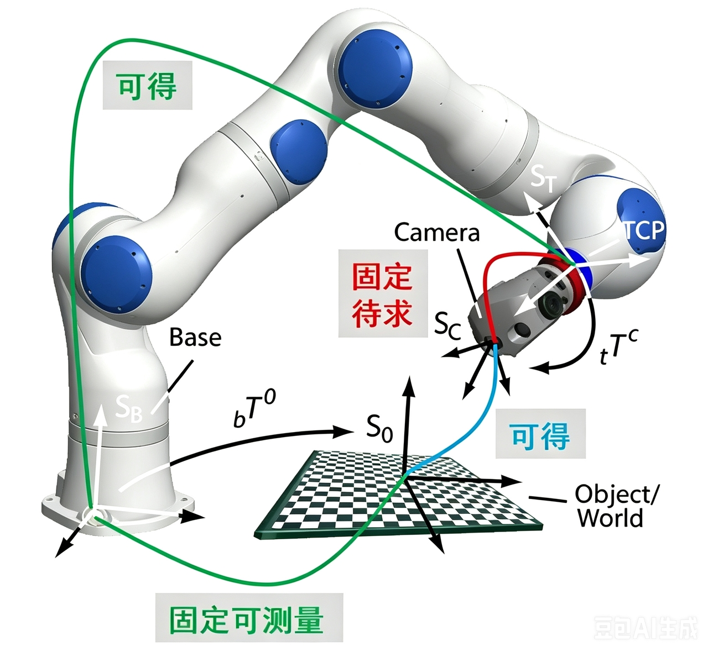{width=75%}

图 6.13 对应的是“眼在手外”。相机像一个固定观察员，从工作空间外持续看着桌面和机械臂。它的优势是视野稳定、容易观察全局，适合桌面分拣、上下料和多个目标的排序选择；缺点是目标可能被机械臂本体遮挡，且相机距离目标较远时，深度噪声和标定误差会更明显。

Eye-in-Hand 中，相机安装在末端并随机械臂运动，待求外参通常为 $\,{}^{E}T_{C}$。运行时必须结合当前末端位姿：

$$
{}^{B}T_{G} = {}^{B}T_{E} \, {}^{E}T_{C} \, {}^{C}T_{G}
$$

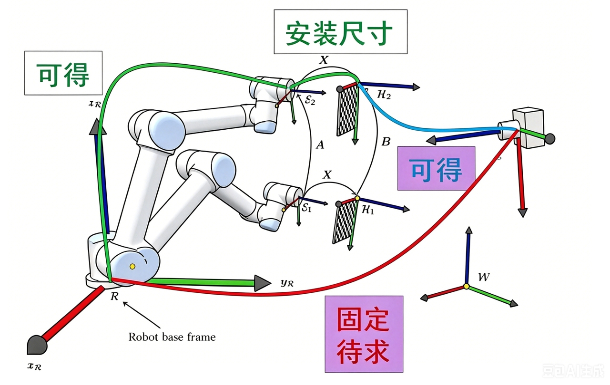{width=75%}

图 6.14 对应的是“眼在手上”。相机随着夹爪运动，机器人可以把相机移动到目标附近做近距离复检，因此适合精细装配、局部对位和遮挡较多的场景。代价是采集图像需要机械臂先移动到合适位置，循环时间更长；相机安装在末端还会带来负载、布线和碰撞规避问题。

| 拓扑 | 固定对象 | 运动对象 | 待求外参 | 运行时变换形式 |
|---|---|---|---|---|
| Eye-to-Hand | 相机固定于工作区外 | 标定板或目标随机械臂运动 | $\,{}^{B}T_{C}$ | $\,{}^{B}T_{G} = {}^{B}T_{C} {}^{C}T_{G}$ |
| Eye-in-Hand | 相机固定于末端 | 相机随机械臂运动 | $\,{}^{E}T_{C}$ | $\,{}^{B}T_{G} = {}^{B}T_{E} {}^{E}T_{C} {}^{C}T_{G}$ |

#### 5.4.3 手眼标定的数学本质：求解 $AX=XB$ 方程

手眼标定的目标，是基于多组机器人运动与相机观测求解一个固定外参矩阵 $X$：

$$
AX = XB
$$

| 符号 | 含义 |
|---|---|
| $A$ | 机器人侧相邻两次采样之间的相对运动 |
| $B$ | 相机侧相邻两次观测之间的相对运动 |
| $X$ | 待求的固定手眼外参 |

该方程依赖的是相对运动关系，而非单次绝对位姿。采样过程是否覆盖足够的平移和旋转激励、标定板观测是否稳定、矩阵方向是否统一，往往比具体调用哪个求解接口更重要。若采样姿态变化过小，或所有位姿近似共面，求得的 $X$ 可能数值上收敛但物理上不可用。

OpenCV 的 `calibrateHandEye()` 提供了 Tsai-Lenz、Park-Martin、Horaud、Andreff、Daniilidis 等多种求解方法 [8]。工程上不应把“换求解器”作为第一反应：如果样本激励不足、机器人位姿方向写反、`T_cam_board` 来自错误 marker 尺寸，那么不同方法只是在同一批错误数据上给出不同数值。更可靠的流程是先检查输入矩阵方向和样本分布，再比较不同求解器的一致性。

采样时应避免只在一个小区域内平移机械臂，也不要让相机始终以几乎相同的角度观察标定板。更可靠的做法是覆盖工作空间内多个位置，并让末端姿态产生足够的 roll、pitch、yaw 变化。标定完成后，不应只检查算法返回的均方误差，还应做点位复现：选择相机视野中的一个已知点，经外参变换到机器人基座系，再让机械臂移动到该点附近观察是否吻合。这个验证步骤往往比单看矩阵数值更能发现方向、单位和 TCP 错误。

#### 5.4.4 眼在手上实操和代码入口

Eye-in-Hand 的物理关系可以这样理解：相机固定在末端执行器上，机械臂每运动到一个新姿态，相机也随之改变观察角度；若标定板在世界中保持相对静止，那么每一组样本都应满足同一条坐标链：

$$
{}^{B}T_{\text{board}} = {}^{B}T_{E}\,{}^{E}T_{C}\,{}^{C}T_{\text{board}}
$$

其中 $\,{}^{E}T_{C}$ 就是要求解的 `T_end_camera`。对应代码位于 [Hand-eye calibration 目录](../../code/lecture06/Hand-eye%20calibration/)：教学 demo 默认使用合成数据，从 `T_base_end` 和 `T_cam_board` 生成一组可复现实验样本；真实机器人实验时，则把这两个 JSON 换成实采数据。完整流程与第 3.4.4 节的点云 demo 类似，都是先准备输入，再一键运行脚本，最后查看输出报告。

| 环节 | 脚本 | 输出或检查项 |
|---|---|---|
| 一键流水线 | [`pipeline_hand_eye_demo.py`](../../code/lecture06/Hand-eye%20calibration/pipeline_hand_eye_demo.py) | 合成样本、数据筛查、外参求解、闭环验证、`pipeline_summary.json` |
| 合成数据 | [`generate_synthetic_hand_eye_data.py`](../../code/lecture06/Hand-eye%20calibration/generate_synthetic_hand_eye_data.py) | `robot_poses.json`、`camera_poses.json`、`ground_truth.json` |
| 相机侧位姿生成 | [`estimate_board_pose_aruco.py`](../../code/lecture06/Hand-eye%20calibration/estimate_board_pose_aruco.py) | `camera_poses.json`、重投影误差报告 |
| 数据筛查 | [`inspect_hand_eye_dataset.py`](../../code/lecture06/Hand-eye%20calibration/inspect_hand_eye_dataset.py) | 样本配对、运动激励、弱运动对 |
| 外参求解 | [`calibrate_eye_in_hand.py`](../../code/lecture06/Hand-eye%20calibration/calibrate_eye_in_hand.py) | `T_end_camera`、残差统计、详细报告 |
| 闭环验证 | [`validate_hand_eye.py`](../../code/lecture06/Hand-eye%20calibration/validate_hand_eye.py) | `T_base_board` 跨样本一致性 |
| 教学求解 | [`solve_hand_eye_teaching.py`](../../code/lecture06/Hand-eye%20calibration/solve_hand_eye_teaching.py) | `AX=XB` 相对运动构造与 Park 求解诊断 |

最小可运行命令如下：

```bash
cd "code/lecture06/Hand-eye calibration"

pip install numpy opencv-python

python pipeline_hand_eye_demo.py --topology eye_in_hand
```

如果默认镜像下载较慢，可使用清华 PyPI 镜像：

```bash
pip install -i https://pypi.tuna.tsinghua.edu.cn/simple numpy opencv-python
```

运行后会生成 `data/hand_eye_demo/eye_in_hand/`，其中 `eye_in_hand.json` 保存求解得到的 `T_end_camera`，`inspect_report.json` 记录样本激励检查，`validation_report.json` 记录 `T_base_board` 的跨样本一致性，`pipeline_summary.json` 汇总残差和输出路径。在默认合成数据上，终端会同时打印与 `ground_truth.json` 的误差，便于确认求解结果是否落在毫米级和小角度范围内。

真实标定时，流程不变：先用 `estimate_board_pose_aruco.py` 或其他 PnP 程序生成 `camera_poses.json`，再把机器人控制器记录的 `T_base_end` 写入 `robot_poses.json`，最后用 `pipeline_hand_eye_demo.py --topology eye_in_hand --demo-dir 你的数据目录 --skip-generate` 复用同一套筛查、求解和验证步骤。这三步各自回答一个问题：样本是否足够好，末端到相机的固定外参是多少，以及把外参代回去以后标定板在基座系中是否近似不动。

#### 5.4.5 眼在手外实操和代码入口

Eye-to-Hand 的核心是求解 $\,{}^{B}T_{C}$ / `T_base_camera`，即固定相机到机器人基座的外参。和 Eye-in-Hand 相比，Eye-to-Hand 的相机不再随机械臂运动，运动的是末端上的标定板或被末端夹持的刚性目标。因此，它的闭环关系更适合写成：

$$
{}^{B}T_{E}\,{}^{E}T_{\text{board}} = {}^{B}T_{C}\,{}^{C}T_{\text{board}}
$$

这里 $\,{}^{E}T_{\text{board}}$ 在采样过程中保持固定，要求解的是 $\,{}^{B}T_C$。两种拓扑可以使用同一批输入格式：机器人侧记录 `T_base_end`，相机侧记录 `T_cam_board`；区别在于构造 $AX=XB$ 相对运动时，Eye-to-Hand 需要对机器人侧运动做方向改写。代码入口仍位于 [Hand-eye calibration 目录](../../code/lecture06/Hand-eye%20calibration/)，但一键命令需要把 `--topology` 切换为 `eye_to_hand`。

| 环节 | 脚本 | 输出或检查项 |
|---|---|---|
| 一键流水线 | [`pipeline_hand_eye_demo.py`](../../code/lecture06/Hand-eye%20calibration/pipeline_hand_eye_demo.py) | 合成样本、数据筛查、外参求解、闭环验证、`pipeline_summary.json` |
| 合成数据 | [`generate_synthetic_hand_eye_data.py`](../../code/lecture06/Hand-eye%20calibration/generate_synthetic_hand_eye_data.py) | 可复现样本与 `ground_truth.json` |
| 相机侧位姿生成 | [`estimate_board_pose_aruco.py`](../../code/lecture06/Hand-eye%20calibration/estimate_board_pose_aruco.py) | 固定相机视角下的 `T_cam_board` |
| 数据筛查 | [`inspect_hand_eye_dataset.py`](../../code/lecture06/Hand-eye%20calibration/inspect_hand_eye_dataset.py) | 使用 `--topology eye_to_hand` 检查运动激励 |
| 外参求解 | [`calibrate_eye_to_hand.py`](../../code/lecture06/Hand-eye%20calibration/calibrate_eye_to_hand.py) | `T_base_camera`、残差统计、详细报告 |
| 闭环验证 | [`validate_hand_eye.py`](../../code/lecture06/Hand-eye%20calibration/validate_hand_eye.py) | `T_end_board` 跨样本一致性 |

最小可运行命令如下：

```bash
cd "code/lecture06/Hand-eye calibration"

pip install numpy opencv-python

python pipeline_hand_eye_demo.py --topology eye_to_hand
```

运行后会生成 `data/hand_eye_demo/eye_to_hand/`，其中 `eye_to_hand.json` 保存求解得到的 `T_base_camera`，`inspect_report.json` 记录样本激励检查，`validation_report.json` 记录 `T_end_board` 的跨样本一致性，`pipeline_summary.json` 汇总残差和输出路径。

Eye-to-Hand 的验证重点不是“标定板在基座系中不动”，而是“标定板在末端坐标系中不动”。因此 `validate_hand_eye.py` 读取 `eye_to_hand.json` 后，会根据其中的 `topology` 字段自动选择验证链路，反推出每个样本的 `T_end_board`，再统计它们相对于平均参考变换的平移和旋转残差。真实标定时，可用 `pipeline_hand_eye_demo.py --topology eye_to_hand --demo-dir 你的数据目录 --skip-generate` 直接复用实采 `robot_poses.json` 和 `camera_poses.json`。若残差呈现随末端位置变化而系统性增大，通常应优先检查相机外参方向、机器人基座坐标定义和相机内参；若只有少数样本异常，则更可能是某几张图的 marker 检测、机器人姿态记录或样本配对出现问题。

#### 5.4.6 真机部署中的标定误差排查

| 误差来源 | 典型表现 | 优先检查项 |
|---|---|---|
| 相机内参偏差 | 点云尺度异常、边缘畸变明显 | $f_x,f_y,c_x,c_y$、畸变模型 |
| 深度尺度错误 | Z 向整体放大或缩小 | `depth_scale`、单位换算 |
| 手眼旋转误差 | 距离越远偏差越大 | 姿态激励是否充分、矩阵方向是否统一 |
| 机器人位姿解析错误 | 标定矩阵数值正常但复现失败 | 欧拉角顺序、四元数顺序、角度单位 |
| TCP 偏置遗漏 | 法兰到位但夹爪中心不对 | $\,{}^{E}T_{TCP}$、工具坐标设定 |

旋转误差会随臂展放大。若臂展为 $r$，角误差为 $\theta$，末端横向偏差近似为 $r\tan\theta$。在 $r=1\,\text{m}$、$\theta=1^{\circ}$ 时，偏差约为 $17.5\,\text{mm}$。因此，手眼标定验证不能只看平移残差，还必须检查旋转残差与实际点位复现误差。

**本节小结：** 坐标系转换是视觉结果进入机器人控制系统的最后一道几何关口。Eye-in-Hand 与 Eye-to-Hand 的输入数据形式看起来相似，都是机器人位姿配相机观测，但固定对象、运动对象、外参含义和验证链路完全不同。工程实现中最容易出错的不是公式本身，而是矩阵方向、乘法顺序、TCP 偏置和“谁相对谁运动”的拓扑理解。只要这些关系写反，前端感知再准确，也会在执行阶段表现为稳定而危险的系统性偏差。因此，手眼标定结果必须通过点位复现、姿态复现和抓取前的坐标链路检查共同验证。

### 5.5 可达性校验：由几何可行到机械可行

即使 $\,{}^{B}T_{G}$ 已经计算完成，也不能直接下发执行。几何上合理的抓取目标不一定满足机械臂的工作空间、关节限位、逆运动学和碰撞约束。抓取候选需要经过从粗到细的可达性筛选。

这一节要强调的是：抓取位姿“算出来”不等于“机械臂能做到”。有些目标点在相机看来很合理，但超出了机械臂工作空间；有些位置能够到达，但要求夹爪以一个机械臂无法实现的姿态进入；还有些位姿本身可达，但从当前位置过去的路径会撞到桌面或旁边物体。因此，抓取候选必须先经过可达性校验，再进入运动规划和执行。

| 检查项 | 目的 | 失败时的典型处理 |
|---|---|---|
| 工作空间判断 | 判断目标位置是否在机械臂可达范围内 | 丢弃候选或更换目标点 |
| IK 可解性 | 判断是否存在满足目标姿态的关节解 | 更换抓取方向、放宽姿态或调整 pre-grasp |
| 关节限位 | 防止接近奇异位形或超出机构范围 | 选择另一组 IK 解或重新排序候选 |
| 碰撞检查 | 避免与桌面、环境、本体和邻物碰撞 | 修改接近方向、提高过渡点、增加安全偏移 |
| 夹爪行程 | 判断局部尺寸是否落在夹爪开口范围内 | 更换抓取部位或放弃抓取 |
| 路径连续性 | 确保 pre-grasp → grasp → retreat 可顺序执行 | 分段规划或插入中间位姿 |

可达性校验应按顺序执行：先剔除明显超出工作空间的候选，再求解 IK，最后做碰撞和路径检查。这样可以减少规划器负担，也便于定位失败原因。对教学系统而言，建议将每个候选的失败原因显式记录为 `workspace_fail`、`ik_fail`、`collision_fail` 或 `gripper_fail`，避免调试时只看到笼统的 planning failed。

在多候选抓取中，可达性校验还承担排序作用。系统可以先生成多个抓取候选，再按照抓取质量、接近路径长度、IK 解裕量、碰撞距离和夹爪开口余量进行打分。最终被执行的候选，不一定是视觉评分最高的候选，而是综合几何稳定性和机械可行性后最可靠的候选。这样的排序机制能显著降低单一位姿估计误差对最终抓取的影响。

**本节小结：** 可达性校验把“几何上合理”的抓取候选进一步筛成“机械上可执行”的目标。工作空间判断、IK、关节限位、碰撞检测和夹爪行程检查应按由粗到细的顺序执行，这样既减少规划器负担，也便于定位失败原因。可达性失败并不一定说明位姿估计错误，也可能来自机械臂构型、障碍物布局、TCP 定义或夹爪行程不足。真实系统中，记录 `workspace_fail`、`ik_fail`、`collision_fail`、`width_fail` 等失败标签，往往比只看到一句 planning failed 更有调试价值，也能指导后续候选排序和策略降级。

### 5.6 观测退化下的策略降级

真实场景中，6D 位姿估计可能因遮挡、反光、透明材质、低纹理或点云过稀而失效。此时系统不应继续使用低置信度姿态结果，而应根据当前可用观测信息切换到更低信息需求的策略。

降级策略可以理解为机器人系统的保守执行模式。当完整 6D 位姿可靠时，应优先使用姿态匹配抓取；但如果只剩下一个稳定的 3D 中心点，就不应构造缺乏依据的旋转姿态并直接执行。更稳妥的做法，是承认当前信息不足，退回到对姿态要求较低的顶部抓取，或者重新观测。对真实机器人来说，拒绝一次低置信度抓取通常比错误执行一次更安全。

| 当前可用信息 | 建议策略 | 适用条件 | 主要限制 |
|---|---|---|---|
| 6D pose 可靠 | 姿态匹配抓取 | 已知物体、点云完整、配准误差低 | 依赖姿态置信度与标定精度 |
| 3D 中心可靠 | 顶部垂直接近 | 桌面开阔、目标低矮、姿态不关键 | 不适合细长、偏心或易滚动物体 |
| 仅 bbox / mask 可靠 | 重新观测、近距离复检或再分割 | 深度质量不足、遮挡较重 | 需要额外时间和运动 |
| 多次复检仍失败 | 放弃执行或请求人工确认 | 安全风险高、目标不可达 | 任务中断，但避免错误执行 |

降级策略的核心，是把“精确但不可靠”的高维估计，替换为“粗糙但可验证”的低维控制目标。例如，当物体姿态不可信但目标点云中心稳定时，可以退回到基于 3D 中心的顶部抓取：接近方向固定为桌面法线方向，夹爪姿态取默认水平姿态，开合宽度由点云包围盒估计，随后仍执行可达性和碰撞检查。

触发降级的常见条件包括：位姿置信度低于阈值、配准残差过大、位姿在连续帧间跳变、有效深度像素比例过低、IK 或碰撞检查连续失败。降级不是为了保证高成功率，而是为了避免系统在感知不充分时输出看似精确、实则危险的动作。

降级策略也应当分层，而不是只有“执行 / 不执行”两种状态。若只是旋转不可靠，可以保留 3D 中心并使用顶部抓取；若深度点云也不可靠，可以移动腕部相机或改变视角重新采集；若多次重感知仍失败，则应放弃该目标或请求人工确认。对于面向真实硬件的系统，这种保守决策是安全设计的一部分。

**本节小结：** 抓取位姿生成是从物体状态表征到机器人动作表征的转换层。它不仅要从物体位姿推导夹爪的抓取点、接近方向与开合宽度，还要通过手眼标定和 TCP 修正完成坐标转换，并经过 IK、碰撞、夹爪行程与策略降级机制筛选。当 6D 位姿可靠时，系统可以使用姿态匹配抓取；当姿态信息不稳定时，则应退回到中心点、顶部抓取或重感知等更保守策略。到这一步，视觉输出才真正被翻译成真实机器人可以尝试执行的抓取目标，也才进入运动规划和执行闭环的责任范围。

## 6 感知失败分析与鲁棒性优化

在实验室理想环境下，6D位姿估计算法往往能达到很高的精度指标，但部署到真实物理场景后，遮挡、反光、标定误差、环境扰动等因素都会导致感知失效，直接拉低抓取成功率。感知失败并非单一环节的问题，而是贯穿从输入采集到位姿输出的全链路。本章系统梳理典型感知失败的场景与成因，量化不同误差对抓取结果的影响，并给出从视觉输入到位姿计算再到系统机制的三层优化方案，最终形成一套可落地的真机调试流程。

### 6.1 典型感知失败场景与成因

感知失败按照产生的环节可分为三大类：视觉类失败发生在数据输入前端，源于传感器与环境的不匹配；几何类失败发生在2D‑3D转换与坐标变换环节，源于标定误差与坐标系定义问题；位姿类失败发生在输出端，源于算法本身的歧义性与运动学约束。

#### 6.1.1 视觉类失败：遮挡、反光、低纹理与光照剧变

- **遮挡与堆叠：** 目标物体被遮挡30%以上，点云不完整，位姿估计算法缺少匹配特征，导致位姿漂移或求解失败。
- **反光与透明材质：** 金属、玻璃表面出现高光，深度图出现空洞、飞点，目标点云残缺不全。
- **低纹理/无纹理物体：** 纯色、哑光表面缺少特征点，位姿估计出现旋转歧义，姿态随机跳动。
- **光照剧变：** 强光直射或逆光导致RGB过曝或过暗，目标检测漏检、误检，后续环节连锁失效。

#### 6.1.2 几何类失败：深度空洞、外参偏差与坐标系错误

- **深度缺失与点云空洞：** 物体表面法线与光轴夹角过大或材质原因，点云大面积空缺，ICP配准易陷入局部最优。
- **手眼外参偏差：** 所有抓取结果呈现固定方向、固定大小的系统性偏移。这是最隐蔽的系统性误差——单看位姿估计本身结果稳定，但转换到机器人坐标系后全部偏位。
- **坐标系方向定义错误：** 抓取位姿出现镜像翻转、坐标轴方向颠倒，直接导致撞机或抓空。

#### 6.1.3 位姿类失败：位姿跳变、方向翻转与目标不可达

- **位姿跳变：** 连续多帧估计出的位姿无规律突变，机械臂末端抖动，无法平稳接近。
- **方向翻转（对称歧义）：** 旋转对称物体（如圆柱体、立方体）的位姿出现180°或90°随机翻转，夹爪开合方向与物体长轴错位。
- **目标不可达：** 位姿估计正确，但生成的抓取位姿超出工作范围或存在碰撞，运动规划报错。

**本节小结：** 感知失败通常不是单一模型错误，而是视觉输入、几何恢复、位姿估计和运动约束共同作用的结果。遮挡、反光、低纹理、深度空洞、外参偏差和姿态歧义会沿着链路逐步传导，最终在抓取阶段集中暴露。视觉类失败通常影响“是否看见和分清目标”，几何类失败影响“点云和坐标是否可信”，位姿类失败则影响“夹爪能否以正确方向接近”。把失败按这些层级拆开，有助于在真机调试时先定位问题层级，再选择对应的优化手段，而不是把所有现象都归因于模型精度不足。

### 6.2 感知误差对抓取成功率的影响量化

不同类型的感知误差对抓取结果的破坏程度并不相同。量化误差与成功率的对应关系，有助于设定合理的精度指标、判断误差来源，以及评估优化效果。

#### 6.2.1 平移误差：从毫米级偏差到厘米级失效

平移误差指估计位置与真实位置的欧氏距离偏差。

| 误差量级 | 影响 | 成功率 |
|----------|------|--------|
| 1‑3mm | 轻微偏差，几乎无影响 | 接近100% |
| 3‑5mm | 中度偏差，夹持位置偏离最佳受力点 | 70%‑90% |
| 5‑10mm | 较大偏差，夹爪仅能夹住边缘 | 30%‑50% |
| 10mm以上 | 严重偏差，大概率抓空或撞物 | <20% |

#### 6.2.2 旋转误差：角度偏差的空间放大效应

旋转误差最核心的特点是误差会随操作距离被空间放大——离机器人基座越远，同样的角度偏差造成的末端位置偏移越大。近似计算公式：$\text{末端偏移} \approx \text{臂展} \times \tan(\text{旋转误差})$。

| 误差量级 | 影响 | 成功率 |
|----------|------|--------|
| <2° | 可完全容忍 | 基本不受影响 |
| 2°‑5° | 接触面积减小，摩擦力下降 | 60%‑80% |
| 5°‑15° | 无法形成有效夹持面 | <30% |
| >15° | 夹爪端面撞向物体侧面 | 基本失败 |

旋转误差存在放大效应，因此旋转精度往往比平移精度更重要。

#### 6.2.3 深度误差：接近方向的致命影响

深度误差是沿夹爪接近方向的平移误差，它比平面内的平移误差更致命——夹爪在接近方向上几乎没有容错空间。

| 误差量级 | 影响 |
|----------|------|
| 1‑2mm | 无明显影响 |
| 3‑5mm | 夹持深度不足或顶推物体移位 |
| 5‑10mm | 抓空或撞物 |
| 10mm以上 | 100%失败，甚至损坏传感器 |

深度误差沿接近方向作用，没有侧向容错余量，是三类误差中最容易直接导致抓取失败的类型。

**本节小结：** 平移误差决定夹爪能否到达正确接触区域，旋转误差会随臂展和夹爪长度被放大，深度误差则直接影响接近方向上的安全距离。不同误差在图像上可能都只是“偏了一点”，但在物理执行中会分别表现为夹边、顶撞、滑脱或抓空。对抓取系统而言，误差分析必须回到毫米、角度、接近方向和接触区域这些可执行尺度，而不能只看离线成功率。把感知误差和执行后果一一对应起来，才能判断应该优先优化深度尺度、手眼标定、旋转估计还是抓取安全余量。

### 6.3 三类优化方向

针对上述失败场景与误差来源，可从视觉输入层、位姿计算层、系统机制层三个维度分层优化，实现从"单次准确"到"长期稳定"的鲁棒性提升。

#### 6.3.1 视觉层面：光照、反光、透明物体的处理

- **光照环境标准化：** 采用漫射环形补光，避免点光源直射；搭配偏振镜头或多角度斜向补光；封闭工作空间，隔绝环境光干扰。
- **多模态数据互补：** 融合RGB、深度、红外三个通道；针对透明物体补充红外成像或线激光模组。
- **图像与深度后处理：** 对实例分割掩膜做形态学开运算与平滑处理；对深度图做空洞补全（双边滤波、邻域插值、深度学习补全）；增加边缘深度滤波，剔除飞点。

#### 6.3.2 位姿层面：多帧融合与时序平滑

- **时序滤波平滑：** 引入卡尔曼滤波或滑动窗口平均，抑制单帧跳变；设置位姿变化阈值，丢弃突变帧并沿用历史平滑结果。
- **粗到精的两阶段位姿精修：** 第一阶段用深度学习输出粗位姿，第二阶段用ICP做几何精配准，兼顾泛化性与精度。
- **多视角融合：** 控制机械臂带动腕部相机移动到2‑3个不同角度观测物体，融合多视角结果，大幅降低遮挡误差。

#### 6.3.3 系统层面：失败检测与重感知机制

- **前置失败检测：** 设置三重校验——点云有效率校验（有效点数占比<40%则不执行）、位姿置信度校验（配准误差超阈值则不执行）、可达性校验（位姿不可达则不执行）。
- **重感知重试机制：** 单次感知失败后自动调整策略重新采集；持续失败则调整相机角度或补光参数；设置2‑3次重试机会，可将整体成功率提升10%‑20%。
- **失败样本闭环回流：** 自动记录所有失败场景的原始数据，定期标注后用于模型微调，形成"部署‑失败‑优化"闭环迭代。

**本节小结：** 鲁棒性优化应分层进行：视觉层改善输入质量，位姿层提高估计稳定性，系统层通过失败检测、重感知和数据回流形成闭环。视觉层可以通过光照控制、反光处理、多视角观测和更稳定的分割提高输入质量；位姿层可以通过多帧融合、时序平滑、对称性处理和几何校验减少跳变；系统层则需要在低置信度时拒绝执行、重新观测或切换到保守策略。单独提高某个模型的精度，往往无法覆盖真实场景中的遮挡、材质、标定和运动约束问题。只有三层协同，系统才能从“单次能跑”逐步推进到“长期稳定”。

### 6.4 真机部署中的感知调试流程

真机调试切忌一上来就跑全链路抓取，否则出现失败时无法定位是哪个环节出了问题。正确的调试路径遵循先基础后上层、先单步后全链路的原则，逐级验证、逐级排查。

#### 6.4.1 基础校验：标定与坐标系正确性验证

**校验内容：**

- 相机内参：重投影误差<0.5像素，畸变校正正确。
- 手眼外参：标定矩阵平移与旋转精度合格，排除固定偏移。
- TCP工具标定：夹爪工具中心点标定准确，无偏心。
- 坐标系约定：像素、相机、机器人基座坐标系的轴方向与单位统一。

**验证方法：** 固定高精度标定板，控制机械臂移动到5‑8个不同位姿，对比"视觉计算的标定板位姿"与"机器人正运动学计算的位姿"。合格标准：平移误差<2mm，旋转误差<1°。

**常见问题排查：**

- 固定方向的系统性偏移 → 优先检查手眼标定与TCP标定。
- 镜像/翻转错误 → 优先检查坐标系方向与变换矩阵乘法顺序。
- 误差随位置变化 → 优先检查标定样本分布是否覆盖工作空间。

#### 6.4.2 单步验证：检测分割效果与静态位姿精度测试

- **检测分割验证：** 固定目标物体，连续采集20帧，统计召回率与准确率（要求无漏检、无误检）；对比掩膜与真实轮廓，边缘平均误差<2像素；改变光照、角度、背景测试鲁棒性。
- **静态位姿精度验证：** 使用标准立方体、标定球等已知尺寸物体，连续采集10帧，对比感知输出与真值，合格标准：平移误差<3mm，旋转误差<2°。
- **点云质量验证：** 可视化目标点云，调整滤波参数，在保留几何细节与去除噪声之间找平衡。

#### 6.4.3 全链路验证：动态抓取评测与迭代优化

- **固定场景基准测试：** 同一物体、同一摆放位置，重复10‑20次完整抓取，统计基准成功率；对每次失败进行归因分类（检测、分割、位姿、标定、运动规划、执行），找到占比最高的失败原因。
- **泛化场景压力测试：** 改变物体角度、位置、堆叠状态，调整光照条件，评估系统鲁棒性边界。
- **闭环迭代优化：** 针对占比最高的失败类型优化对应模块，每轮优化后重新测试，直到达到目标指标。

**调试核心逻辑：** 先搞定标定与坐标系这个基础，排除系统性误差；再逐个验证单模块性能；最后做全链路成功率评测与迭代优化。遵循这个流程，可以避免盲目调参，高效定位并解决问题，快速将系统从"能跑"优化到"稳定好用"。

**本节小结：** 真机调试应遵循“先基础、后上层；先单步、后全链路”的顺序。第一步要确认相机内参、手眼外参、TCP 和坐标系方向没有系统性错误；第二步要分别验证检测、分割、点云和静态位姿精度；第三步才进入动态抓取评测和迭代优化。这样做可以避免把标定问题、感知问题和规划问题混在一次失败执行里，也能让每个模块都有独立的合格标准。对机器人系统而言，好的调试流程不是更快地反复试，而是让每一次失败都留下可归因、可复现、可改进的证据。

# 参考资料

[1] HE K, GKIOXARI G, DOLLAR P, et al. Mask R-CNN[EB/OL]. (2017-03-20)[2026-07-26]. https://arxiv.org/abs/1703.06870.

[2] BOLYA D, ZHOU C, XIAO F, et al. YOLACT: real-time instance segmentation[EB/OL]. (2019-04-04)[2026-07-26]. https://arxiv.org/abs/1904.02689.

[3] RAVI N, GABEUR V, HU Y T, et al. SAM 2: segment anything in images and videos[EB/OL]. (2024-08-01)[2026-07-26]. https://arxiv.org/abs/2408.00714.

[4] Open3D. Point cloud outlier removal[EB/OL]. [2026-07-26]. https://www.open3d.org/docs/release/tutorial/geometry/pointcloud_outlier_removal.html.

[5] Stanford Computer Graphics Laboratory. The Stanford 3D Scanning Repository: Stanford Bunny[EB/OL]. [2026-07-26]. https://graphics.stanford.edu/data/3Dscanrep/.

[6] MoveIt. Pick and Place[EB/OL]. [2026-07-26]. https://moveit.picknik.ai/main/doc/examples/pick_place/pick_place_tutorial.html.

[7] ROS. moveit_msgs/Grasp Message[EB/OL]. [2026-07-26]. https://docs.ros.org/lunar/api/moveit_msgs/html/msg/Grasp.html.

[8] OpenCV. Camera Calibration and 3D Reconstruction: calibrateHandEye[EB/OL]. [2026-07-26]. https://docs.opencv.org/master/d9/d0c/group__calib3d.html.
