# 第 7 讲 机器人操作技能：从目标位姿到抓取、放置与失败恢复

第 6 讲结束时，机器人已经知道桌上方块的位置和朝向。听起来任务快完成了，但真让机械臂去抓，问题马上就来了：夹爪从哪里靠近？什么时候闭合？方块被夹住以后，程序怎么确认它真的离开了桌面？如果方块掉了，机器人还要不要继续往 B 区走？

这就是本讲要解决的事。我们不停在“算出一个位姿”，而是把位姿变成一套能执行、能检查、失败后还能处理的操作流程。

本讲围绕两个任务展开：

- **方块任务**：把红色方块从 A 区抓起，放到 B 区；

- **瓶子任务**：保持瓶子竖直，从侧面水平夹住瓶身，再放进收纳盒。


<table>
<tr>
<td width="50%" align="center">

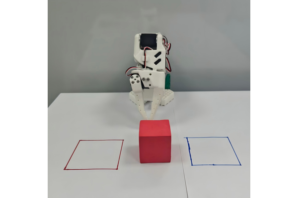

图 7-0a 方块任务现场：夹爪对准红色方块，左侧红框为 A 区、右侧蓝框为 B 区

</td>

<td width="50%" align="center">

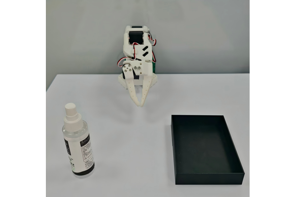

图 7-0b 瓶子任务现场：侧向抓取后放入收纳盒

</td>
</tr>
</table>

这一讲最终要完成的是：把一个目标物体位姿转换成预抓取、抓取、抬升、放置和退出位姿，用状态机把这些动作串起来，再根据夹爪、视觉和日志判断任务为什么成功或失败。

| 这一讲真正要回答的五个问题 |
|---|
| 1. 物体位姿为什么不能直接当成夹爪目标？ |
| 2. 预抓取、抓取、抬升、放置和退出位姿分别解决什么问题？ |
| 3. 状态机怎样保证“上一步没完成，下一步就不乱跑”？ |
| 4. 机械臂动作执行完后，怎样确认物体真的被抓起、放好？ |
| 5. 失败后应该改位姿、改速度、改夹爪参数，还是安全退出？ |

# 1 坐标有了，动作还没有

第 6 讲给出的目标物体位姿回答了“物体在哪里”。但机械臂真正需要的不是一个孤立坐标，而是一串带顺序的动作目标。

假设红色方块位于 A 区。若把方块中心直接发给机械臂，夹爪可能从侧面撞上方块，也可能在还没对准时提前闭合。即使夹爪顺利到达目标，程序仍然不知道方块是否被夹住，更不知道它有没有在抬升途中掉下来。

因此，抓取不是“移动到一个点”，而是一个小型任务流程：先到安全位置，再靠近物体；夹住以后先抬一点验证；确认稳定后再搬运；放下以后还要退开，让相机看清结果。

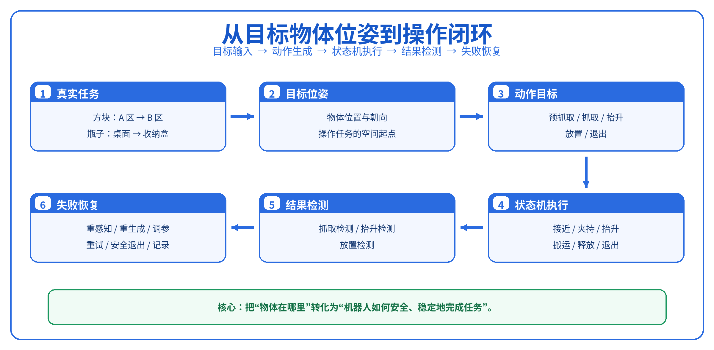

图 7-1 从目标物体位姿到操作闭环

图中的每一格都对应一个必须回答的问题。物体位姿负责提供空间起点，动作位姿规定夹爪去哪里，状态机决定先做什么后做什么，检测模块判断物理任务是否真的完成，失败处理则决定下一次尝试应该改什么。

## 1.1 两个任务，一套主线

方块任务最适合用来建立基线。方块形状规则、重心稳定，夹爪从正上方竖直下降，两指夹住左右两侧。只要抓取中心、下降高度和夹爪宽度设置合理，任务就很容易重复。

瓶子任务在同一条主线上增加了两个约束。第一，瓶子保持竖直，夹爪不能从上方套住，而要从侧面水平接近；第二，目标不是一块平面区域，而是一个有盒沿的收纳盒。抓取时要防止瓶子下滑，放置时还要避免夹爪碰到盒沿。

| 对比项 | 方块 A 区 → B 区 | 竖直瓶子 → 收纳盒 |
|---|---|---|
| 接近方式 | 自上而下 | 侧向水平接近 |
| 夹持位置 | 方块中心附近 | 瓶身中部 |
| 放置目标 | 桌面 B 区 | 收纳盒内部 |
| 最常见失败 | 抓偏、抓空、越界 | 滑落、碰盒沿、放后倾倒 |
| 主要教学作用 | 跑通最小闭环 | 处理姿态和容器约束 |

两个任务看起来不同，但程序骨架完全一致：

> 读取物体位姿 → 生成动作位姿 → 校验 → 抓取 → 抬升验证 → 搬运与放置 → 检测结果 → 失败恢复或记录成功

## 1.2 为什么要把任务拆成几个状态

机械臂控制最怕“一口气发完”。如果程序连续发送抓取、抬升和搬运命令，中间没有检查，方块即使没有夹住，机械臂也会照样移动到 B 区；瓶子即使已经滑落，机械臂也可能继续伸向收纳盒。

把任务拆成状态后，每一步都有自己的完成条件。预抓取状态只关心末端是否到达安全位置；夹爪闭合状态只负责形成接触；抬升验证状态才判断物体是否真的跟着夹爪离开桌面。上一步不通过，下一步就不会执行。

这条原则贯穿整讲：

> **动作命令负责“做什么”，检测条件负责“做成没有”，状态机负责“下一步去哪”。**

# 2 从物体位姿到夹爪该去哪里

先看一个最直接的问题：第 6 讲输出的是物体位姿，但机械臂控制的是夹爪位姿。两者不是同一个东西。

物体位姿把物体的参考点放进机器人基座坐标系；夹爪位姿则规定末端执行器的位置和朝向。方块中心可能在实体内部，瓶子参考点也不一定落在适合夹持的瓶身位置。因此，中间必须加一层“抓取关系”：夹爪相对于物体应该放在哪里、朝向哪里、张开多大。

## 2.1 先认识输入：物体位姿说了什么

用 `object_pose_base` 表示目标物体在机器人基座坐标系中的位姿。它由三维位置和四元数姿态组成：

```math
\mathrm{object\_pose\_base}=[x,y,z,q_x,q_y,q_z,q_w]
```

| 符号 | 含义 |
|---|---|
| $x,y,z$ | 物体参考点在机器人基座坐标系中的三维位置 |
| $q_x,q_y,q_z,q_w$ | 表示物体朝向的四元数 |
| $base$ | 这些量都以机器人基座坐标系为参考 |

这组数值只告诉我们物体在哪里。夹爪真正要执行的抓取，还需要确定抓取点、接近方向、夹爪朝向和开口宽度。

## 2.2 用一个抓取候选描述“怎么夹”

抓取候选可以理解为一副虚拟夹爪：把它摆到物体附近，就能直观看出真实夹爪应该以什么位置和方向靠近。

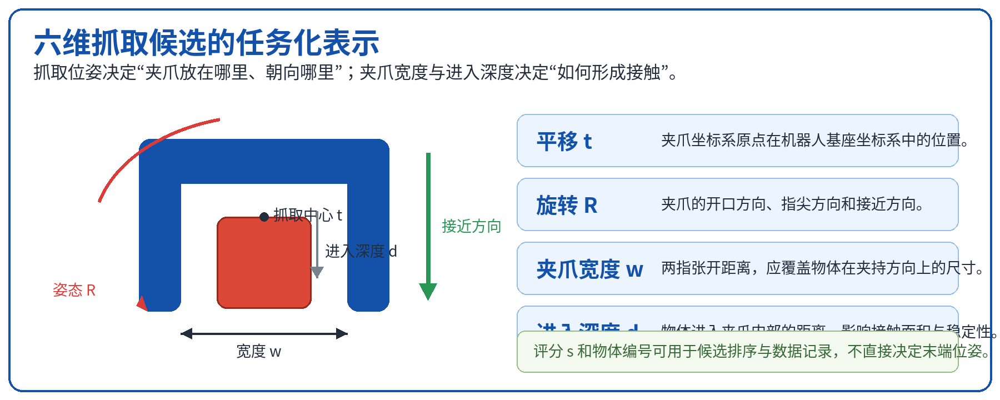

图 7-2 六维抓取候选的任务化表示

参考 GraspNet 的六维抓取格式，本讲把一次抓取写成以下几个量：

```math
G=\{\mathbf{t},\mathbf{R},w,d,s\}
```

| 符号 | 含义 | 在程序中的作用 |
|---|---|---|
| $\mathbf{t}$ | 夹爪坐标系原点在基座坐标系中的位置 | 决定夹爪去哪里 |
| $\mathbf{R}$ | 夹爪相对于基座坐标系的旋转矩阵 | 决定夹爪朝哪个方向 |
| $w$ | 两指目标开口宽度 | 决定物体能否进入夹爪 |
| $d$ | 物体沿接近方向进入夹爪的深度 | 决定夹持是否充分 |
| ${s}$  | 抓取候选评分 | 多个候选之间排序 |

图中的 U 形框只是抓取姿态的可视化。真正执行时，必须让 SO-101 的真实夹爪与它重合，再由真实夹爪接触物体。

## 2.3 方块竖直抓，瓶子水平抓

方块任务采用顶部抓取。夹爪位于方块正上方，接近方向竖直向下，两指夹住方块相对的两个侧面。抓取点优先选在几何中心附近，因为这里离重心近，抬升时不容易旋转。

瓶子保持竖直，夹爪从侧面水平接近。两指夹住瓶身中部，既不能太低——否则下侧指尖容易碰桌面；也不能太高——否则可能夹到瓶肩或瓶盖，接触不稳定。

| 任务 | 抓取点 | 夹爪方向 | 接近方向 |
|---|---|---|---|
| 方块 | 几何中心附近 | 夹爪竖直向下 | 自上而下 |
| 瓶子 | 瓶身中部 | 水平包夹瓶身 | 沿桌面侧向接近 |

## 2.4 五个位姿不是五个名字，而是五个问题

一次抓取—放置任务至少需要五个关键位姿：

1. **预抓取位姿**：先停在物体附近，但不接触；
2. **抓取位姿**：真实夹爪包围物体并准备闭合；
3. **抬升位姿**：夹住后先离开桌面，验证物体是否跟随；
4. **放置位姿**：物体已经得到桌面或容器支撑，但夹爪还没有松开；
5. **退出位姿**：夹爪打开后离开目标区域。

### 预抓取位姿：给接近动作留出一段安全距离

先定义三个量： $p_g$ 是抓取位置， $a$ 是从预抓取位置指向抓取位置的单位接近向量， $d_{pre}$ 是预抓取距离。预抓取位置 $p_{pre}$ 为：

```math
\mathbf{p}_{pre}=\mathbf{p}_g-d_{pre}\mathbf{a}
```

方块的 $a$ 竖直向下，所以预抓取位姿在方块正上方；瓶子的 $a$ 水平指向瓶身，所以预抓取位姿在瓶子侧面。

### 抬升位姿：先证明“抓住了”，再开始搬运

先定义 $h_{lift}$ 为抬升高度， $e_z$ 为基座坐标系中竖直向上的单位向量。抬升位置为：

```math
\mathbf{p}_{lift}=\mathbf{p}_g+h_{lift}\mathbf{e}_z
```

方块和瓶子虽然抓取方向不同，但抬升都沿竖直方向进行。原因很简单：先把物体从桌面和周围障碍物中“拔出来”，再做大范围水平搬运，碰撞风险更低。

### 放置位姿：到位时先别松手

放置位姿不是“夹爪已经离开”的位置。此时方块应当已经落在 B 区桌面上，瓶子应当已经进入收纳盒并获得底部支撑，但夹爪仍然保持闭合。确认物体受到支撑后，夹爪才打开，然后移动到退出位姿。

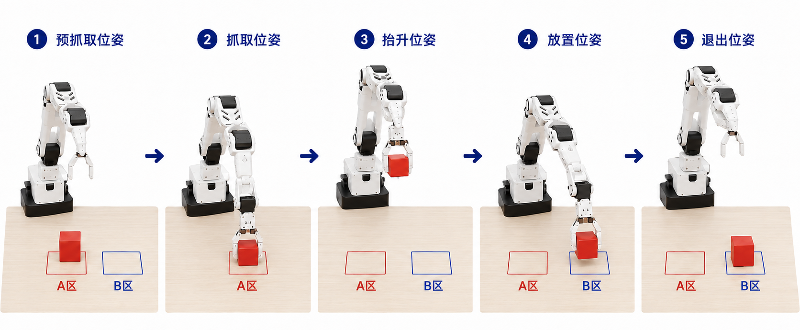

图 7-3 方块任务的预抓取、抓取、抬升、放置与退出位姿

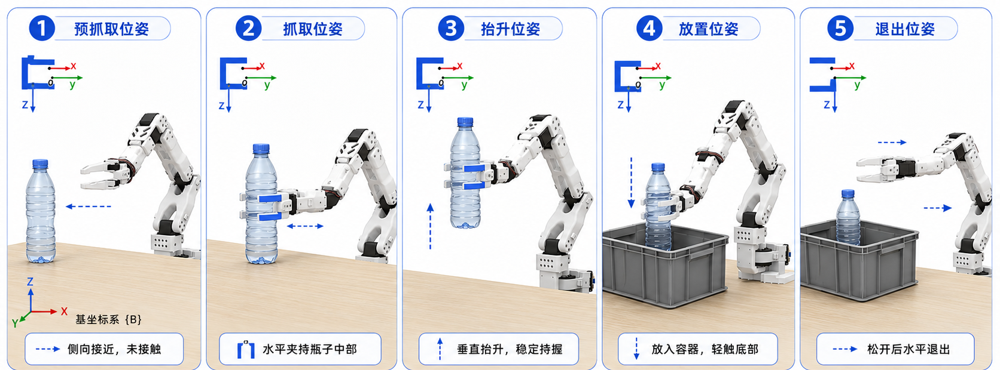

图 7-4 竖直瓶子的水平抓取、抬升、入盒与退出

## 2.5 先做几何初筛，再谈机械臂能不能到

抓取候选生成以后，先排除一眼就不合理的方案。这里不求逆运动学，也不规划完整轨迹，只检查物体、夹爪和场景之间的几何关系。

首先看夹爪宽度。定义 $w_{object}$ 为物体在夹持方向上的宽度， $w_{min}$ 和 $w_{max}$ 分别为夹爪能够稳定夹持的最小、最大宽度。候选至少应满足：

$$
w_{min}\leq w_{object}\leq w_{max}
$$

其次看接触位置。方块不能只夹到边角，瓶子应避开瓶盖、瓶肩和容易变形的位置。最后检查桌面和目标区域的几何间隙。这里考虑桌面高度，不是因为机械臂“放在桌子上”，而是因为夹爪指尖、腕部和被抓物体在接近时都可能碰到桌面。瓶子入盒时，还要确认夹爪能够通过盒口，并且释放后有退出空间。

| 初筛项 | 需要看什么 | 不合理时怎么改 |
|---|---|---|
| 抓取点 | 是否接近重心、接触面是否稳定 | 移动抓取点 |
| 夹爪开口 | 物体能否进入并被稳定夹住 | 换夹持方向或末端工具 |
| 桌面间隙 | 指尖、腕部是否可能碰桌面 | 提高抓取点或改变姿态 |
| 预抓取距离 | 是否留出夹爪外形和减速空间 | 调整 $d_{pre}$ |
| 放置空间 | 物体和夹爪是否能进入并退出 | 调整放置点或退出方向 |

几何初筛通过，只说明这个抓取“看起来合理”。机械臂是否真的够得到、关节有没有解、整段路径会不会撞，还要交给下一节。

# 3 五个位姿怎么串成一次不会乱跑的任务

五个位姿只是五个目标。如果程序把它们依次塞给机械臂，却不检查中间结果，任务仍然很危险。

状态机解决的正是这个问题。它把连续动作拆成一个个状态，每个状态只做一件事，并明确写出四样东西：输入、执行动作、完成条件、失败条件。

> **状态机不是动作播放列表。它是“做一步、看结果、再决定下一步”的执行规则。**

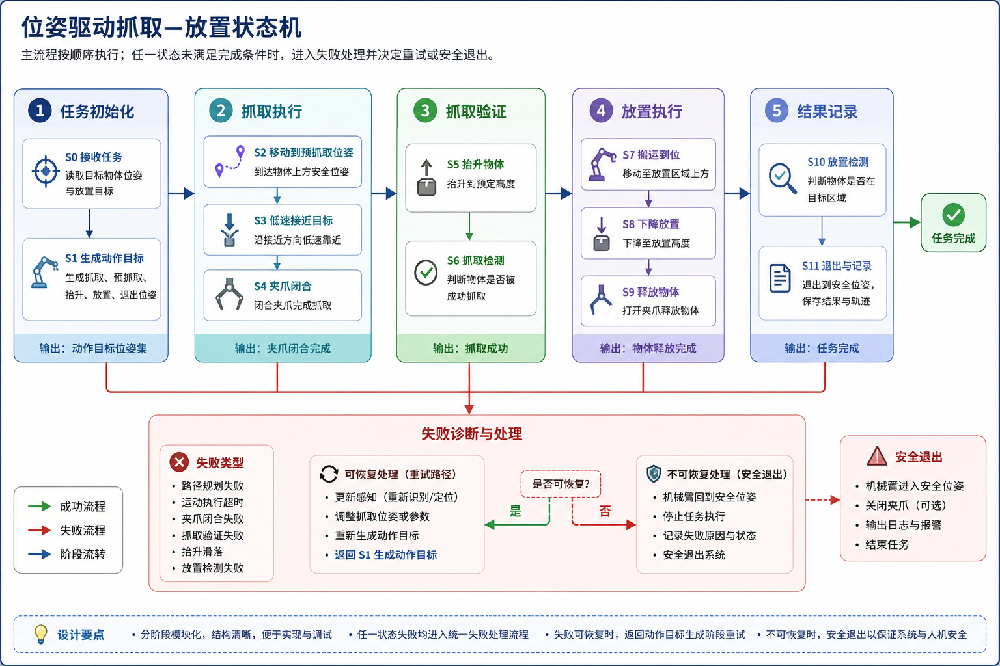

图 7-5 位姿驱动抓取—放置状态机及失败诊断路径

## 3.1 主流程：正常情况下机器人怎么走

主流程可以压缩成五个阶段：

1. **任务初始化**：读取物体位姿和放置目标，生成动作位姿；
2. **抓取执行**：到预抓取位姿，低速接近，闭合夹爪；
3. **抓取验证**：抬升并确认物体随夹爪离开桌面；
4. **放置执行**：搬运、下降、释放；
5. **结果记录**：检测放置结果，退出并保存日志。

任何阶段失败，都进入同一个失败处理入口。失败处理先记录“在哪个状态失败、看到了什么证据”，再决定是重新感知、重新生成位姿、调整参数，还是安全退出。

| 状态 | 主要动作 | 完成条件 | 常见失败 |
|---|---|---|---|
| 接收任务 | 读取物体位姿和目标区域 | 输入完整且未过期 | 目标丢失、位姿过期 |
| 生成与校验 | 生成动作位姿并检查可执行性 | 候选通过校验 | 无解、越界、碰撞 |
| 到达预抓取 | 大范围移动到安全位置 | 末端误差合格 | 规划失败、超时 |
| 低速接近 | 沿短路径靠近物体 | 到达抓取位姿 | 推动物体、发生碰撞 |
| 夹爪闭合 | 设置开口并形成夹持 | 夹爪状态稳定 | 抓空、单指接触 |
| 抬升验证 | 抬起并观察物体 | 物体稳定离桌 | 仍在桌面、滑落 |
| 放置执行 | 搬运、下降、释放 | 物体获得支撑 | 碰盒沿、未释放 |
| 放置检测 | 判断目标区域状态 | 物体稳定在目标区 | 越界、倾倒、被带走 |

## 3.2 到预抓取位姿：大动作先在安全区完成

预抓取位姿允许机械臂从当前姿态进行较大范围运动。此时夹爪还没有进入物体附近，因此可以使用正常速度的轨迹控制或运动规划。

到位判断不能只看“命令发出去了”。先定义位置误差 $e_p$、姿态误差 $e_R$，以及各自允许上限 $\varepsilon_p$、 $\varepsilon_R$。只有同时满足

$$
e_p\leq\varepsilon_p,\qquad e_R\leq\varepsilon_R
$$

状态机才进入低速接近。否则继续等待控制器收敛；超过超时时间，则记录“预抓取到位失败”。

## 3.3 低速接近：越靠近物体，动作越要保守

从预抓取到抓取位姿的距离通常不长，却是最容易撞到物体和桌面的阶段。这里建议使用短直线轨迹或分段小步移动，并降低速度和加速度。

低速接近的完成条件有两个：末端到达抓取位姿；物体仍在允许位置内。若方块被夹爪推离 A 区中心，或瓶子在接近过程中倾倒，即使末端到位，也不能进入夹爪闭合状态。

这里可以做一个很直接的对照实验：固定其他参数，只改变接近速度，再记录每档速度下的抓取成功率、物体位移和碰撞次数。结果通常很直观——速度提高以后，时间可能只省下一点，撞飞物体和错过闭合时机的概率却会明显上升。

## 3.4 夹爪闭合：闭合完成不等于抓取成功

夹爪在接近阶段保持张开，到达抓取位姿以后才闭合。目标开口应略小于物体在夹持方向上的宽度，使两指能够建立接触并持续保持。

方块刚性较强，夹持参数比较宽容；塑料瓶容易变形，夹得太紧可能压瘪，夹得太松又会滑落。若平台不能直接控制夹持力，可以通过闭合终点、闭合速度和电流上限间接调节。

夹爪闭合状态只负责把夹爪关到目标位置。是否抓住物体，要由抓取检测和抬升验证给出答案。

## 3.5 先抬一点：这是最便宜也最可靠的验证

夹爪闭合后，不要立刻高速搬运。先沿竖直方向抬升一小段，并观察物体是否同步上升。

- 末端上升，物体仍在桌面：抓空；
- 物体刚被带起就掉下：夹持不足或抓取点不稳；
- 物体随夹爪上升并保持相对位置：抓取通过。

方块抬升后应位于 A 区正上方；瓶子虽然从侧面夹持，抬升方向仍然竖直。验证通过后，才进入大范围搬运。

## 3.6 放置、释放、退出：顺序不能反

放置分成三个动作。先移动到目标区域上方，再下降到放置位姿；物体获得桌面或盒底支撑后，夹爪打开；最后机械臂退到安全位置。

方块到达放置位姿时已经接触 B 区桌面，但夹爪仍抓着它。瓶子进入收纳盒以后也一样，先让瓶底得到支撑，再松开。若夹爪在物体还悬空时提前打开，物体会掉落、反弹或倾倒。

夹爪打开后要等待短暂稳定时间，再退出。退出既避免夹爪继续碰到物体，也让相机获得无遮挡的目标区域画面。

## 3.7 执行前校验：看起来合理，还要真的能到

第 2 节的初筛只看几何关系。执行前校验要面对具体机械臂，回答三个更实际的问题：

- 目标是否处于 SO-101 的工作空间；
- 每个末端位姿是否存在满足关节限位的逆运动学解；
- 从当前姿态到目标姿态的整条轨迹是否碰桌面、盒子或机械臂自身。

只有完整动作序列都通过，状态机才进入预抓取。若某个关键位姿无解，不能只删掉那一步继续执行，而应回到动作生成，调整姿态、偏移或中间点。

## 3.8 代码里怎么写状态机

程序中建议把任务逻辑和设备接口分开。状态机只决定“当前处于哪个状态、下一步去哪”；机器人后端负责“怎样把末端移动到目标”；检测模块负责“结果是否成立”。

每个状态可以拆成三个函数：

| 函数 | 何时调用 | 负责什么 |
|---|---|---|
| `on_enter()` | 第一次进入状态 | 发送目标、设置速度、启动计时 |
| `on_update()` | 每个控制周期 | 读取反馈、判断完成或失败 |
| `on_exit()` | 离开状态 | 保存结果、停止当前控制器 |

状态函数统一返回四种结果：

| 返回值 | 含义 | 状态机动作 |
|---|---|---|
| `RUNNING` | 动作还在执行 | 留在当前状态 |
| `SUCCESS` | 完成条件满足 | 进入下一状态 |
| `RETRYABLE_FAILURE` | 可以通过重感知、调参或重规划恢复 | 进入失败处理 |
| `FATAL_FAILURE` | 急停、通信中断、持续过载等高风险异常 | 立即安全退出 |

完成条件最好要求连续若干周期成立，而不是某一帧刚好满足就转移。这种“去抖”可以减少视觉抖动和电流瞬时尖峰带来的误判。

# 4 机械臂动完了，不等于任务成功

最常见的误判是：程序执行到了最后一行，于是把任务记成成功。真实情况可能完全不同——夹爪闭合了，但中间没有物体；机械臂抬起来了，但方块还留在桌面；夹爪在 B 区打开了，但方块滚出了边界。

成功检测必须跟着任务阶段走。抓取后看有没有形成夹持，抬升后看物体是否离桌，释放后看物体是否稳定留在目标区域。

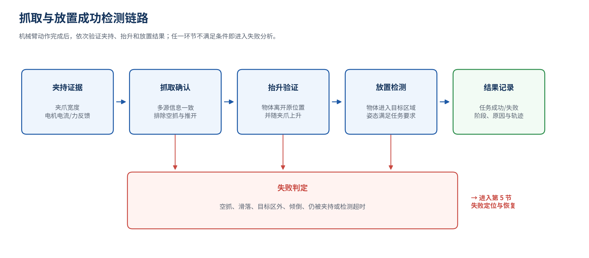

图 7-6 抓取、抬升与放置的分阶段成功检测链路

## 4.1 夹爪到底夹到东西没有

最容易获得的信号是夹爪宽度。若夹爪闭合后还保留一段与物体宽度相符的开口，说明两指之间可能有物体；若夹爪几乎完全合拢，更像是空抓。

但宽度不能单独定案。夹爪可能卡在机构上，也可能碰到桌面或其他物体。电机电流、力矩或末端力可以提供第二类证据：接触发生后，负载通常会升高并保持一段时间。视觉则回答第三个问题——夹在两指之间的到底是不是目标物体。

入门实验推荐使用“夹爪宽度 + 抬升后视觉”组合。前者给出即时提示，后者用物体是否离桌完成最终确认。

| 证据 | 能说明什么 | 不能单独说明什么 |
|---|---|---|
| 夹爪宽度 | 两指之间是否存在阻挡 | 阻挡是不是目标物体 |
| 电流或力 | 是否发生接触并形成负载 | 接触是否稳定、位置是否正确 |
| 视觉 | 物体是否位于夹爪之间 | 遮挡时可能看不清接触力 |

## 4.2 物体有没有跟着夹爪离开桌面

抬升检测是最直观的抓取验证。抓取前保存物体初始位置，抬升过程中持续估计物体高度和它与夹爪的相对位置。

方块任务中，只要方块底面离开桌面，并连续若干帧保持在夹爪下方，就可以确认抬升成功。瓶子任务还要看瓶身是否下滑或旋转。若瓶子虽然没有完全掉落，但相对夹爪持续下移，也应判为“夹持不稳定”，而不是等到真正掉落才处理。

## 4.3 物体是不是稳定留在目标区域

放置检测发生在夹爪打开并退出以后。先退出再看，能够减少夹爪遮挡。

方块任务不能只检查中心点是否落入 B 区。更稳妥的做法是检查方块投影有足够比例位于 B 区内，并等待几帧确认它没有继续滑动。瓶子任务则检查瓶体主体是否进入收纳盒、是否卡在盒沿、是否滚出；若任务要求竖直放置，还要增加姿态条件。

放置成功包含三个条件：

1. 物体进入目标区域；
2. 物体与夹爪已经分离；
3. 等待稳定时间后，物体没有继续滚动或倾倒。

## 4.4 日志要能回答“最早哪里不对”

只保存最终的 `success=True/False`，对调试几乎没有帮助。一次任务至少要记录：

- 物体位姿和五个动作位姿；
- 每个状态进入、退出的时间；
- 末端轨迹、夹爪命令和夹爪反馈；
- 抓取、抬升、放置三个阶段的检测结果；
- 第一个失败状态、失败代码和重试参数；
- 关键帧或失败前后视频。

任务编号和时间戳把这些数据串起来。这样看到“瓶子入盒失败”时，才能继续追问：是抓取时已经下滑，还是碰到盒沿以后才倾倒？

# 5 失败不是一句“没抓起来”

机器人失败后，最没有用的结论就是“再试一次”。如果位姿、速度、夹爪参数和场景都没变，下一次很可能重复同样的失败。

更有效的做法是先找**最早出现异常的状态**。后面看到的现象往往只是前面问题的结果。方块在抬升时掉落，原因可能是抓取点偏离重心；瓶子在收纳盒外倾倒，也可能是搬运途中已经下滑，而不是放置位姿本身错误。

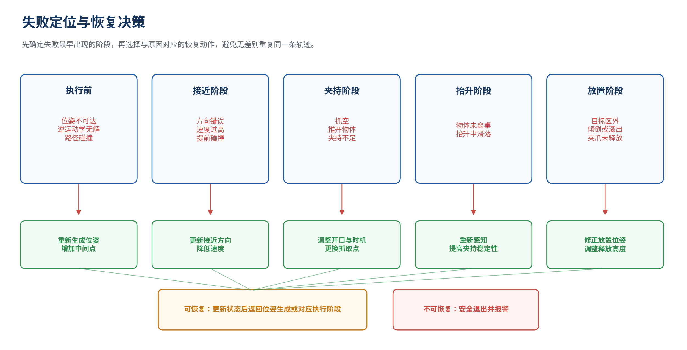

图 7-7 按失败阶段组织的失败定位与恢复路径

## 5.1 先按阶段缩小排查范围

| 第一个失败状态 | 先看什么 | 常见原因 |
|---|---|---|
| 位姿生成或校验 | 物体位姿、抓取姿态、可达性、碰撞 | 坐标偏差、目标无解 |
| 到预抓取 | 规划结果、关节限位、到位误差 | 轨迹失败、超时 |
| 低速接近 | 接近方向、速度、物体位移 | 推动物体、碰桌面 |
| 夹爪闭合 | 开口、闭合时机、电流、图像 | 抓空、单指接触 |
| 抬升验证 | 夹持稳定性、抓取点、加速度 | 下滑、旋转、掉落 |
| 放置检测 | 放置位姿、释放高度、盒沿和边界 | 越界、卡住、倾倒 |

排查时先看事实，再写原因。例如“夹爪闭合后宽度接近零，方块仍在 A 区”是可观察事实；“抓取点不准”是推断。两者要分开记录，避免把猜测当结论。

## 5.2 恢复不是回到起点，而是改掉导致失败的条件

目标被推走，先重新感知；抓取方向不合理，重新生成候选；接近撞到桌面，提高抓取点或改变姿态；夹持不足，调整闭合终点、抓取点或抬升加速度；规划无解，换候选或增加中间点。

| 失败原因 | 首选恢复 | 第二步调整 |
|---|---|---|
| 目标位姿失效 | 重新感知 | 检查坐标变换与遮挡 |
| 抓取姿态不合理 | 重新生成抓取候选 | 换接近方向或抓取点 |
| 接近碰撞 | 增加安全距离、降速 | 提高抓取点或改变路径 |
| 逆运动学无解 | 换候选重新求解 | 改初始姿态、加中间点 |
| 抬升滑落 | 改夹爪参数和抓取点 | 降低抬升加速度 |
| 放置越界或倾倒 | 修正放置位姿和释放高度 | 调整退出方向 |

恢复动作本身也要有顺序：停止当前运动，判断是否需要保持夹持，把机械臂移到不会扩大风险的位置，再重新感知和规划。目标已经被推走以后，不能沿原轨迹快速重试。

## 5.3 三次重试不能是三次复制粘贴

重试必须设置上限，并记录每一次到底改了什么。

- 第一次失败：重新感知，排除偶发定位误差；
- 第二次失败：调整抓取偏移、预抓取距离、接近速度或夹爪参数；
- 第三次失败：换抓取方向或采用更保守的策略；
- 仍然失败，或出现急停、通信中断、持续过载：安全退出。

安全退出不等于直接断电。程序应停止当前动作，根据物体是否仍被夹持决定保持还是释放，再将机械臂移动到允许的安全位姿，最后保存日志和报警信息。

## 5.4 失败样本是下一轮改进最值钱的数据

一次失败样本应保存“任务输入—动作目标—执行过程—失败判定—恢复结果”。至少包括图像、深度、物体位姿、动作位姿、关节与末端轨迹、夹爪命令和反馈，以及失败前后视频。

失败标签建议分成五项：失败阶段、直接现象、推定原因、恢复动作、恢复结果。后续统计时，才能回答哪些失败最常见、哪种参数修改最有效、哪些任务应该补采数据。

# 6 实验：把整套抓取—放置流程跑起来

前面已经把每个环节拆开讲清楚了，现在把它们真正跑起来。目标仍然是两个：把红色方块从 A 区搬到 B 区；把竖直瓶子从侧面夹起，再放进收纳盒。

这两个任务共用同一套状态机，变化的只是物体位姿、抓取方向、夹爪宽度和放置目标。代码因此准备了三种后端：不依赖外部软件的 Mock 后端、ManiSkill 仿真后端和 SO-101 真机适配器。先用 Mock 后端确认状态流、检测和日志没有问题，再切到仿真检查控制与碰撞，最后接入真机。这样每次只增加一层复杂度，出错时也更容易定位。

这一节不追求一上来就把真机跑得很快，而是先把闭环一层层搭起来。做到下面这些，才算真正跑通：两个任务都能配置；状态机能完整推进；日志能说明成功或失败发生在哪里；同一套上层逻辑可以切换到教学模拟、ManiSkill 或 SO-101。

**表 7-22 这次实验要跑通的六件事**

| **要跑通的部分** | **看到什么才算通过** |
|---|---|
| 两个任务的配置 | 方块竖直抓取和瓶子水平抓取分别具有明确的输入、动作参数与成功条件 |
| 工程模块之间的关系 | 能从主程序追到位姿生成、状态机、后端、检测、恢复和日志模块 |
| 教学模拟 | 两个任务都能完整运行，并在 `runs/` 下生成结构化日志 |
| SO-101 接口 | 观测和动作能够封装进统一后端，同时保留速度、限位、超时和急停保护 |
| ManiSkill 接口 | 环境能够创建，观测能够读取，动作能够发送，视频与轨迹能够保存 |
| 失败复盘 | 能从最早失败状态和直接证据出发，提出下一轮只改一个关键条件的验证方案 |

## 6.1 先把两个任务说清楚

实战从规则方块开始。红色方块初始位于 A 区，机械臂采用自上而下的竖直抓取，将方块抬离桌面后搬运至 B 区。该任务用于验证动作位姿、状态机顺序、夹爪闭合和区域检测是否正确。

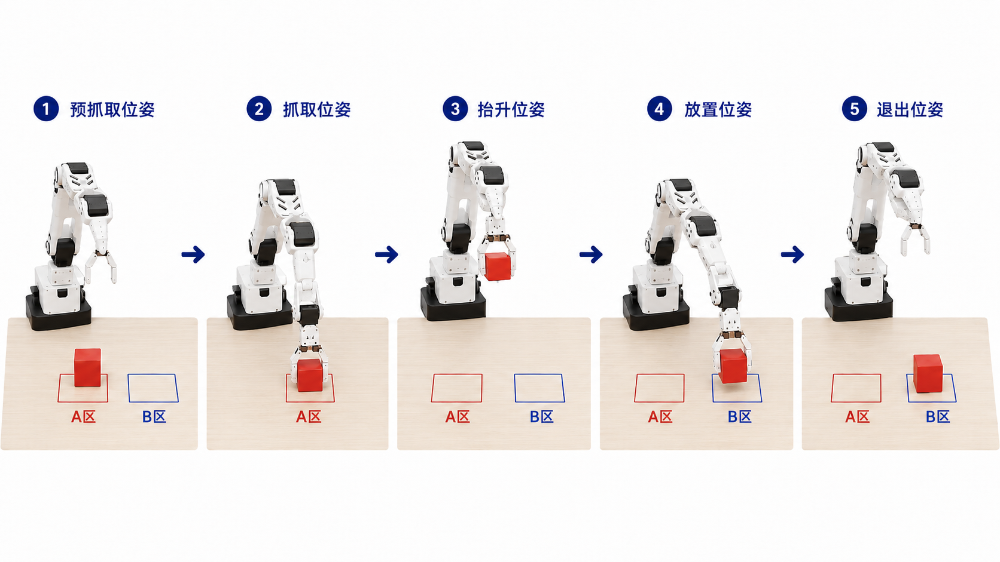

**图 7-9 方块从 A 区搬运至 B 区的五个关键位姿**

瓶子任务保持瓶体竖直，夹爪从侧面水平接近并夹持瓶身中部。机械臂将瓶子垂直抬升，移动至收纳盒上方，下降后释放。该任务增加了侧向接近、易滑落物体和容器边缘碰撞等工程问题。

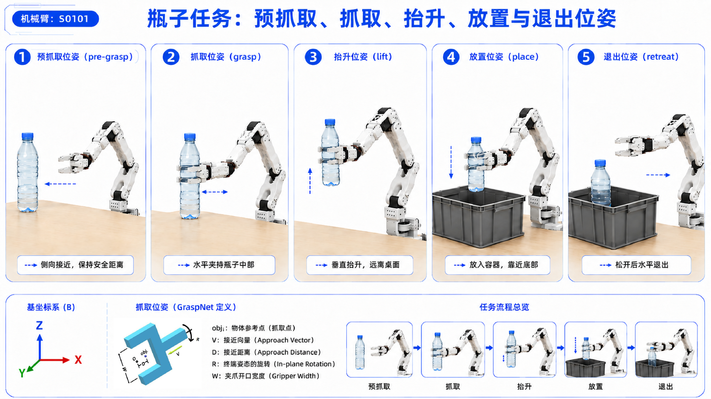

**图 7-10 竖直瓶子的水平抓取与入盒流程**

**表 7-23 两个实战任务的输入、动作与成功条件**

| **任务** | **输入**                       | **抓取方式**                   | **成功条件**                       | **重点观察**                           |
|----------|--------------------------------|--------------------------------|------------------------------------|----------------------------------------|
| 方块 A→B | 方块位姿、B 区中心与边界       | 竖直向下接近，两指夹持方块两侧 | 方块离开 A 区并稳定落入 B 区       | 中心对准、桌面间隙、抬升稳定、区域越界 |
| 瓶子入盒 | 瓶子位姿、收纳盒中心与内部范围 | 水平侧向接近，在瓶身中部夹持   | 瓶子主体进入盒内，夹爪退出后不滚出 | 侧向碰撞、夹持下滑、盒沿干涉、释放高度 |

## 6.2 代码怎么拆：状态机不直接碰硬件

真机实验由 SO-101 机械臂、二指夹爪、相机、控制计算机和急停装置组成。机械臂基座固定在桌面，桌面作为工作环境中的碰撞平面；相机提供目标物体位姿和放置区域观测；控制程序负责动作目标生成、状态转移和结果记录。

无硬件实验采用两级替代方案。教学模拟后端不依赖机器人软件，可直接验证任务配置、状态机、检测、恢复和日志是否正确。ManiSkill 后端进一步提供动力学、碰撞、相机观测和视频录制，用于观察动作在仿真环境中的实际结果。

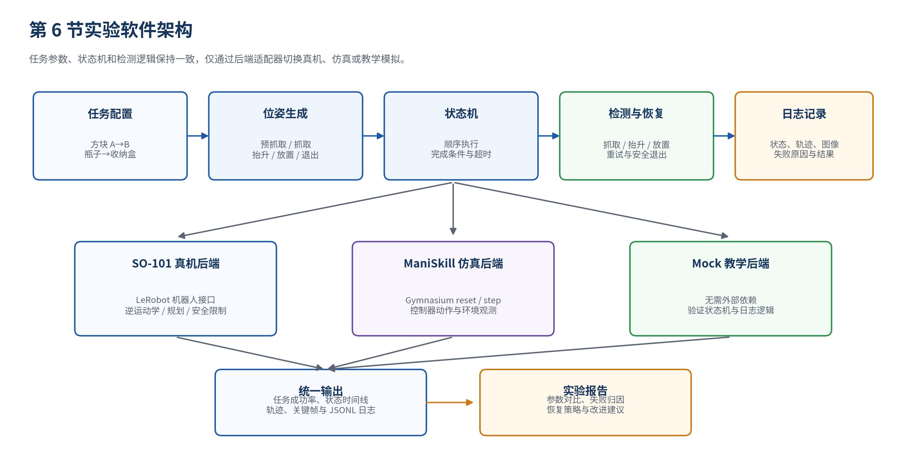

**图 7-8 真机、仿真与教学模拟共享的实验软件架构**

项目按职责拆分为若干 Python 模块。状态机只调用统一的后端接口，不直接操作串口、仿真器或规划器。这样可以在不修改任务逻辑的前提下切换运行平台，也便于单独测试每个模块。

**代码清单 7-1 推荐的项目目录结构**

```text
robot_pick_place/
├── models.py              # 位姿、任务、观测、状态和失败代码
├── config.py              # 方块与瓶子任务参数
├── pose_generator.py      # 生成六个动作位姿
├── checker.py             # 抓取、抬升和放置检测
├── recovery.py            # 根据失败类型调整下一次任务参数
├── state_machine.py       # 抓取—放置状态机
├── task_logger.py         # JSONL 任务日志
├── run_demo.py            # 命令行入口
└── backends/
    ├── base.py            # 统一后端接口
    ├── mock.py            # 无外部依赖的教学模拟后端
    ├── so101_adapter.py   # SO-101 真机适配器
    └── maniskill_adapter.py # ManiSkill 仿真适配器
```

**表 7-24 工程模块的输入、输出与职责**

| **模块**          | **输入**                   | **输出**            | **职责**                                         |
|-------------------|----------------------------|---------------------|--------------------------------------------------|
| config.py         | 任务名称                   | TaskConfig          | 集中保存物体位姿、放置目标、抓取方式、速度和阈值 |
| pose_generator.py | TaskConfig                 | ActionTargets       | 生成预抓取、抓取、抬升、放置准备、放置与退出位姿 |
| state_machine.py  | 后端、任务配置、日志器     | 成功或失败结果      | 按照状态顺序执行，并在每一步检查完成条件         |
| checker.py        | 统一观测与任务阈值         | 布尔检测结果        | 判断是否夹住、是否抬起、是否放置成功             |
| recovery.py       | 失败代码与重试次数         | 修改后的 TaskConfig | 使下一次重试改变关键参数，而非机械重复           |
| backends/         | 统一动作目标               | 统一 Observation    | 屏蔽真机、仿真和教学模拟之间的接口差异           |
| task_logger.py    | 状态、观测、事件与附加字段 | events.jsonl        | 保存可复现的任务时间线                           |

## 6.3 先统一数据结构和任务参数

第一步不是写状态机，而是先统一模块之间传递的数据。完整定义见 [`models.py`](../../code/lecture07/robot_pick_place/models.py)。正文先看状态机运行时传递的三类对象，任务参数 `TaskConfig` 随后单独对照：

```python
@dataclass(frozen=True)
class ActionTargets:
    pre_grasp: Pose
    grasp: Pose
    lift: Pose
    pre_place: Pose
    place: Pose
    retreat: Pose

@dataclass(frozen=True)
class Observation:
    timestamp: float
    eef_pose: Pose
    gripper_width: float
    object_pose: Pose | None
    object_visible: bool
    object_attached: bool
    collision: bool = False

@dataclass(frozen=True)
class MotionResult:
    success: bool
    reason: str = ""
```

这里有一条清晰的数据流：`TaskConfig` 描述“要完成什么任务”，`ActionTargets` 给出“六步分别去哪里”，`Observation` 返回“机器人和物体现在怎样”，`MotionResult` 则说明“一条运动命令是否执行成功”。状态机只依赖这些统一对象，因此不需要知道底层连接的是 Mock、ManiSkill 还是真机。

`TaskConfig` 的字段很多，但决定两个任务差异的主要是下面几项：

**表 7-25 主要任务参数及两个场景的差异**

| **字段**            | **含义**                             | **方块任务**   | **瓶子任务**               |
|---------------------|--------------------------------------|----------------|----------------------------|
| approach_direction  | 末端从预抓取位姿进入抓取位姿的方向   | 沿竖直方向向下 | 沿水平方向接近瓶身         |
| grasp_offset        | 末端参考点相对于物体参考点的空间偏移 | 主要为竖直偏移 | 包含侧向距离和瓶身夹持高度 |
| pre_grasp_distance  | 进入抓取前保留的安全接近距离         | 0.12 m         | 0.11 m                     |
| lift_height         | 抓取后沿竖直方向抬升的距离           | 0.13 m         | 0.16 m                     |
| gripper_open_width  | 接近物体前的夹爪开口                 | 0.075 m        | 0.095 m                    |
| gripper_close_width | 形成夹持后的目标开口                 | 0.035 m        | 0.058 m                    |

配置文件完整内容见 [`config.py`](../../code/lecture07/robot_pick_place/config.py)。对照两个任务时，不必逐项阅读全部数值，只看改变抓取方式的关键参数：

```python
def cube_task() -> TaskConfig:
    return TaskConfig(
        approach_direction=(0.0, 0.0, -1.0),
        grasp_offset=(0.0, 0.0, 0.055),
        pre_grasp_distance=0.12,
        gripper_open_width=0.075,
        gripper_close_width=0.035,
        # 其余位置、速度和检测阈值见完整源码
    )

def bottle_task() -> TaskConfig:
    return TaskConfig(
        approach_direction=(-1.0, 0.0, 0.0),
        grasp_offset=(0.065, 0.0, 0.03),
        pre_grasp_distance=0.11,
        gripper_open_width=0.095,
        gripper_close_width=0.058,
        # 其余位置、速度和检测阈值见完整源码
    )
```

方块的接近方向是竖直向下，瓶子的接近方向是水平方向；`grasp_offset` 又把夹爪参考点放到各自合适的夹持位置。状态机没有改变，改变的是输入给它的任务配置。

代码中的四元数和距离仅作为教学示例。真机实验必须依据 SO-101 的末端坐标系、夹爪安装方向和标定结果重新确认，不能复制未验证的姿态数值。

## 6.4 把物体位姿变成动作位姿

动作位姿生成函数先将接近方向归一化，再根据目标物体位姿、抓取偏移和抓取姿态得到抓取位姿。预抓取位姿沿接近方向反向偏移；抬升位姿在抓取位姿基础上提高；放置准备位姿和退出位姿位于目标区域上方。

代码将 place_pose 解释为物体期望到达的位置，因此生成机械臂放置位姿时仍需保留抓取偏移。这样，方块中心最终落在 B 区目标点，瓶身中心最终落在收纳盒内部，而不是把末端参考点误当成物体中心。

完整实现见 [`pose_generator.py`](../../code/lecture07/robot_pick_place/pose_generator.py)。核心不是辅助函数 `_normalize()`，而是六个位姿如何由两个参考位姿派生：

```python
def generate_targets(task: TaskConfig) -> ActionTargets:
    ax, ay, az = _normalize(task.approach_direction)
    ox, oy, oz = task.grasp_offset
    qx, qy, qz, qw = task.grasp_quaternion

    # 物体位姿 + 抓取偏移 = 夹爪真正要到达的抓取位姿
    grasp = Pose(
        task.object_pose.x + ox,
        task.object_pose.y + oy,
        task.object_pose.z + oz,
        qx,
        qy,
        qz,
        qw,
    )

    # 沿接近方向反向退开，得到安全的预抓取位姿
    pre_grasp = grasp.shifted(
        -ax * task.pre_grasp_distance,
        -ay * task.pre_grasp_distance,
        -az * task.pre_grasp_distance,
    )
    lift = grasp.shifted(0.0, 0.0, task.lift_height)

    # place_pose 描述物体目标，因此放置末端仍要保留 grasp_offset
    place = Pose(
        task.place_pose.x + ox,
        task.place_pose.y + oy,
        task.place_pose.z + oz,
        qx,
        qy,
        qz,
        qw,
    )
    pre_place = place.shifted(0.0, 0.0, task.place_clearance)
    retreat = place.shifted(0.0, 0.0, task.retreat_height)

    return ActionTargets(
        pre_grasp=pre_grasp,
        grasp=grasp,
        lift=lift,
        pre_place=pre_place,
        place=place,
        retreat=retreat,
    )
```

这段代码最容易误解的是 `place`：`task.place_pose` 表示物体最终应在的位置，不是夹爪末端的位置，因此生成放置目标时仍然要加上 `grasp_offset`。否则程序会把夹爪参考点送到 B 区中心，而物体中心会产生同样大小的偏差。

| **运行前检查** 打印六个位姿并在 RViz、Open3D 或仿真窗口中可视化。若抓取位姿方向、预抓取偏移或放置高度明显错误，应在动作执行前修正。 |
|-------------------------------------------------------------------------------------------------------------------------------------|

## 6.5 先用 Mock 后端把逻辑跑通

RobotBackend 定义状态机需要的最小能力：建立连接、重置任务、读取观测、移动末端、控制夹爪和停止运动。真机与仿真只要实现这些方法，便可以复用同一套状态机。

MockBackend 是可运行的教学模拟后端。它直接更新末端位姿，并在夹爪到达物体附近且执行闭合时建立“物体附着”关系；夹爪打开时释放物体。该后端不模拟真实动力学，其用途是检查状态机顺序、数据流、检测逻辑和日志格式。

统一接口的完整定义在 [`backends/base.py`](../../code/lecture07/robot_pick_place/backends/base.py)，Mock 实现在 [`backends/mock.py`](../../code/lecture07/robot_pick_place/backends/mock.py)。状态机实际只要求后端提供下面七项能力：

```python
class RobotBackend(ABC):
    @abstractmethod
    def connect(self) -> None:
        ...
    def reset_task(self, task: TaskConfig) -> None:
        ...
    def get_observation(self) -> Observation:
        ...
    def move_pose(self, target: Pose, speed: float,
                  timeout: float = 8.0) -> MotionResult:
        ...
    def set_gripper(self, width: float, force: float = 0.5,
                    timeout: float = 3.0) -> MotionResult:
        ...
    def stop(self) -> None:
        ...
    def disconnect(self) -> None:
        ...
```

Mock 后端最关键的不是连接和复位样板代码，而是它怎样用一个简化的“附着关系”模拟抓住物体：

```python
def set_gripper(self, width: float, force: float = 0.5,
                timeout: float = 3.0) -> MotionResult:
    self.gripper_width = width
    closing = width <= self.task.gripper_close_width + 0.01
    opening = width >= self.task.gripper_open_width - 0.01

    if closing and self.eef_pose.distance_to(self.object_pose) <= 0.11:
        self.object_attached = True
        self.object_from_eef = (
            self.object_pose.x - self.eef_pose.x,
            self.object_pose.y - self.eef_pose.y,
            self.object_pose.z - self.eef_pose.z,
        )
    elif opening and self.object_attached:
        self.object_attached = False
        self.object_pose = replace(self.object_pose, z=self.task.place_pose.z)

    return MotionResult(True)
```

闭合时，只有夹爪足够接近物体才建立 `object_attached=True`；之后末端移动，物体按照相对偏移一起移动；张开时解除附着。它能验证状态顺序和检测逻辑，但没有接触力、摩擦、碰撞和惯性，因而不能证明真实抓取会成功。

## 6.6 检测和恢复：失败后必须改点东西

检测函数只读取统一 Observation，不依赖具体运行平台。抓取检测结合夹爪宽度、物体与末端距离以及仿真附着状态；抬升检测比较物体相对于初始位置的高度变化；放置检测确认物体已经脱离夹爪，并位于目标位置允许范围内。

恢复函数根据失败代码修改下一次任务参数。运动或碰撞失败时增加预抓取距离并降低接近速度；抓取或抬升失败时微调抓取偏移、夹爪闭合宽度和接近速度；放置失败时增加放置准备高度和退出高度。此处调整量是教学示例，真机实验应依据日志和安全范围逐步确定。

完整检测逻辑见 [`checker.py`](../../code/lecture07/robot_pick_place/checker.py)。三个函数分别回答“夹住了吗、抬起来了吗、放到目标了吗”：

```python
def grasp_success(obs: Observation, task: TaskConfig) -> bool:
    if not obs.object_visible or obs.object_pose is None:
        return False
    width_is_plausible = (
        task.gripper_close_width - 0.015
        <= obs.gripper_width
        <= task.object_width + 0.03
    )
    object_is_near = obs.eef_pose.distance_to(obs.object_pose) <= 0.12
    return obs.object_attached or (width_is_plausible and object_is_near)


def lift_success(
    obs: Observation,
    initial_object_pose: Pose,
    task: TaskConfig,
) -> bool:
    if obs.object_pose is None:
        return False
    height_gain = obs.object_pose.z - initial_object_pose.z
    object_is_near = obs.eef_pose.distance_to(obs.object_pose) <= 0.14
    return height_gain >= task.lift_threshold and object_is_near


def place_success(obs: Observation, task: TaskConfig) -> bool:
    if obs.object_pose is None or obs.object_attached:
        return False
    xy_error = hypot(
        obs.object_pose.x - task.place_pose.x,
        obs.object_pose.y - task.place_pose.y,
    )
    return xy_error <= task.place_xy_tolerance
```

这三个判据有意使用不同证据。抓取阶段看夹爪开口与物体距离，抬升阶段看物体高度增量，放置阶段看物体是否脱离夹爪并进入目标区域。这样即使“运动命令执行成功”，任务仍可能在物理检测上失败。

恢复逻辑见 [`recovery.py`](../../code/lecture07/robot_pick_place/recovery.py)。以抓取或抬升失败为例，下一次尝试会同时改变抓取高度、夹爪闭合宽度和接近速度：

```python
if failure in {FailureCode.GRASP_FAILED, FailureCode.LIFT_FAILED}:
    gx, gy, gz = task.grasp_offset
    return replace(
        task,
        grasp_offset=(gx, gy, gz + 0.005),
        gripper_close_width=max(0.0, task.gripper_close_width - 0.003),
        slow_speed=max(0.03, task.slow_speed * 0.85),
    )
```

这里真正重要的是“重试必须改变条件”，而不是记住示例中的 `0.005` 或 `0.003`。这些调整量只用于教学；真机应根据失败证据、平台限位和低速试验逐步确定。

## 6.7 状态机：把所有模块串起来

状态机每进入一个状态，先写入状态日志，再调用后端执行动作或读取检测结果。任何一步失败都会生成 FailureCode 和原因文本，随后进入恢复或安全退出。一次尝试成功后，状态机写入 DONE；若达到最大重试次数仍未成功，则进入 SAFE_EXIT。

run_attempt() 负责执行一次完整尝试，run() 负责管理重试次数和参数更新。两层结构将“单次任务逻辑”和“跨尝试恢复逻辑”分离，便于单独测试和修改。

完整状态机见 [`state_machine.py`](../../code/lecture07/robot_pick_place/state_machine.py)。文件虽然较长，但每个状态都重复同一种结构：进入状态、执行动作、检查返回值；若失败则立刻记录最早失败点。

```python
def run_attempt(self) -> AttemptResult:
    targets = generate_targets(self.task)
    initial_object_pose = self.task.object_pose

    self._enter(State.MOVE_PRE_GRASP)
    result = self.backend.move_pose(targets.pre_grasp, self.task.fast_speed)
    if not result.success:
        return self._fail(FailureCode.MOTION_FAILED, result.reason)

        self._enter(State.APPROACH)
        result = self.backend.move_pose(targets.grasp, self.task.slow_speed)
        if not result.success:
            code = FailureCode.COLLISION if "collision" in result.reason else (
                FailureCode.MOTION_FAILED
            )
            return self._fail(code, result.reason)

        self._enter(State.CLOSE_GRIPPER)
        result = self.backend.set_gripper(self.task.gripper_close_width)
        if not result.success:
            return self._fail(FailureCode.GRASP_FAILED, result.reason)

    self._enter(State.VERIFY_GRASP)
    if not grasp_success(self.backend.get_observation(), self.task):
        return self._fail(FailureCode.GRASP_FAILED, "grasp check failed")

    self._enter(State.LIFT)
    result = self.backend.move_pose(targets.lift, self.task.slow_speed)
    obs = self.backend.get_observation()
    if not result.success or not lift_success(obs, initial_object_pose, self.task):
        return self._fail(FailureCode.LIFT_FAILED, "lift check failed")

    # MOVE_PRE_PLACE → LOWER_PLACE → OPEN_GRIPPER 采用相同的执行/检查模式
    ...
    if not place_success(self.backend.get_observation(), self.task):
        return self._fail(FailureCode.PLACE_FAILED, "place check failed")

    self._enter(State.DONE)
    return AttemptResult(True, FailureCode.NONE, "")
```

这段截取保留了三类最关键的分支：运动失败、抓取检测失败和抬升检测失败。搬运、释放与退出在完整源码中使用同样的模式，因此正文不再重复展开。

`run_attempt()` 只负责一次尝试；跨尝试的恢复由 `run()` 管理：

```python
def run(self) -> bool:
    current_task = self.task
    for retry_index in range(current_task.max_retries + 1):
            self.task = current_task
            self.backend.reset_task(current_task)
            self.logger.log(
                State.INIT,
                "attempt_start",
                self.backend.get_observation(),
                retry_index=retry_index,
            )
            result = self.run_attempt()
            if result.success:
                return True

            self.backend.stop()
        if retry_index >= current_task.max_retries:
            self._enter(State.SAFE_EXIT, reason=result.reason)
            return False

        self._enter(State.RECOVER, failure=result.failure.name)
        current_task = adjust_task(current_task, result.failure, retry_index + 1)
    return False
```

两层循环的分工很重要：`run_attempt()` 保持单次状态流清晰，`run()` 决定失败后是否恢复、怎样修改参数以及何时安全退出。这样重试逻辑不会散落在每一个动作状态中。

## 6.8 运行、日志和结果查看

TaskLogger 为每次任务创建独立目录，并以 JSON Lines 格式保存事件。每一行是一个完整 JSON 对象，包含时间、状态、事件、统一观测以及失败代码、重试次数等附加字段。JSON Lines 便于逐行追加，即使程序异常中止，也能保留已经写入的记录。

完整实现见 [`task_logger.py`](../../code/lecture07/robot_pick_place/task_logger.py)。日志器的核心是把一次状态事件和当时的观测组成一条记录，然后立即追加到文件：

```python
def log(self, state: State, event: str,
        observation: Observation | None = None, **extra: Any) -> None:
    record = {
        "time": time(),
        "state": state.name,
        "event": event,
        **extra,
    }
    if observation is not None:
        record["observation"] = asdict(observation)

    with self.events_path.open("a", encoding="utf-8") as file:
        file.write(json.dumps(record, ensure_ascii=False) + "\n")
```

采用 JSONL 而不是任务结束后一次性写入大 JSON，是为了让每次状态转换都立即落盘。即使程序中途退出，已经发生的状态和失败证据仍然能够保留。

命令行入口读取任务名称，创建后端和日志器，并在 try/finally 结构中保证程序结束时断开连接。教学模拟后端没有外部依赖，可以作为项目的第一项自动化测试。

入口的完整实现见 [`run_demo.py`](../../code/lecture07/robot_pick_place/run_demo.py)。它只负责组装任务、后端、日志器和状态机：

```python
def main() -> int:
    args = build_parser().parse_args()
    task = get_task(args.task)
    backend = MockBackend()
    logger = TaskLogger(args.output, task.name)

    backend.connect()
    try:
        machine = PickPlaceStateMachine(backend, task, logger)
        success = machine.run()
    finally:
        backend.disconnect()

    print(f"task={task.name}, success={success}")
    print(f"log_dir={logger.task_dir}")
    return 0 if success else 1
```

入口层没有抓取细节：切换任务只改变 `TaskConfig`，切换平台只替换 `backend`，状态机本身保持不变。

在教学模拟后端运行两个任务：

```bash
# 在包含 robot_pick_place/ 的目录中执行
python -m robot_pick_place.run_demo --task cube
python -m robot_pick_place.run_demo --task bottle

# 典型输出
task=cube_a_to_b, success=True
log_dir=runs/<时间戳>_cube_a_to_b
task=bottle_to_bin, success=True
log_dir=runs/<时间戳>_bottle_to_bin
```

配套代码已分别运行方块和瓶子配置。两个任务均依次进入 13 个执行状态并生成 events.jsonl。教学模拟通过只能证明程序逻辑闭环正确，不能替代碰撞检查、动力学验证和真机安全测试。

## 6.9 有真机：接入 SO-101

SO-101 真机适配器接收一个已经配置和标定的机器人对象。该对象负责硬件连接、读取电机与相机观测以及发送关节目标。适配器另外注入三个与本项目相关的函数：plan_pose() 将末端目标位姿转换为一系列关节动作；read_eef_pose() 根据关节状态计算实际末端位姿；detect_object() 从相机观测中获得目标物体位姿。

LeRobot 的机器人接口采用 connect()、get_observation() 和 send_action() 组织硬件读写。适配器将这些底层方法转换为状态机所需的 move_pose()、set_gripper() 和 get_observation()。运动规划可以由 MoveIt 2、配套的逆运动学与插值模块，或其他经过验证的规划器完成。

完整适配器见 [`backends/so101_adapter.py`](../../code/lecture07/robot_pick_place/backends/so101_adapter.py)。正文只看最关键的 `move_pose()`：它把状态机给出的末端位姿交给规划器，再逐条发送规划出的关节动作。

```python
def move_pose(self, target: Pose, speed: float,
              timeout: float = 8.0) -> MotionResult:
    deadline = monotonic() + timeout
    try:
        joint_actions = self.plan_pose(target, speed)
    except Exception as exc:
        return MotionResult(False, f"planning failed: {exc}")

    for action in joint_actions:
        if monotonic() > deadline:
            self.stop()
            return MotionResult(False, "motion timeout")
        self.robot.send_action(action)
        sleep(0.02)
    return MotionResult(True)
```

这段代码刻意把 `plan_pose()` 作为注入函数，而不是在适配器内写死。原因是逆运动学、URDF、关节顺序和碰撞规划都依赖具体机械臂配置。适配器负责统一接口，规划器负责把末端目标转换为安全、可执行的关节轨迹。

另外两条真机路径同样重要：`get_observation()` 把电机与相机数据转换成统一 `Observation`；`set_gripper()` 把以米表示的夹爪目标转换成硬件实际命令。它们的完整边界检查应保留在源码中，不需要在正文逐行展开。

**表 7-26 SO-101 真机运行前的安全检查**

| **真机检查项目** | **执行要求**                                                               |
|------------------|----------------------------------------------------------------------------|
| 标定与方向       | 确认各关节零位、转动方向、夹爪开合方向和末端坐标系与配置一致               |
| 速度与加速度     | 首次运行使用低速；预抓取和搬运速度不得直接用于贴近物体的接近阶段           |
| 工作空间限制     | 所有末端目标必须位于预先设定的安全工作区内，并避开桌面边缘和机械臂本体     |
| 规划与碰撞       | 每个关键位姿都必须具有逆运动学解；执行轨迹需检查桌面、物体、收纳盒与自碰撞 |
| 超时与急停       | 运动和夹爪动作均设置超时；操作者能够随时触发急停或切断驱动                 |
| 分阶段试运行     | 先空载到达预抓取、抬升和放置准备位姿，再加入物体并启用夹爪动作             |

| **真机安全原则** AI 生成或修改的真机代码不得直接执行。必须检查关节限位、夹爪方向、速度、规划结果、碰撞模型、超时和急停逻辑，并先进行无物体低速试运行。 |
|--------------------------------------------------------------------------------------------------------------------------------------------------------|

## 6.10 没有真机：接入 ManiSkill

没有真机时，可以直接使用预装好的云端环境。ManiSkill 通过 Gymnasium 接口创建任务环境，`reset()` 返回初始观测，`step()` 接收控制器动作并返回新观测、奖励、终止标志和附加信息。单环境 CPU 实验可使用 `CPUGymWrapper` 将批量张量转换为常规的非批量 NumPy 接口；`RecordEpisode` 则负责保存视频和轨迹。

ManiSkill 的动作维度和语义由所选控制器决定。示例使用关节增量控制创建环境，随后由 pose_to_actions() 将状态机给出的绝对动作位姿转换为一段控制器动作。若改用末端增量位姿控制，则应按照环境 action_space 的顺序构造平移、旋转和夹爪动作。运行前必须打印 observation_space 和 action_space，不能根据其他机器人或其他控制器的维度直接复制动作向量。

适配器完整实现见 [`backends/maniskill_adapter.py`](../../code/lecture07/robot_pick_place/backends/maniskill_adapter.py)。接入时最关键的是先固定环境、观测模式和控制模式，再检查空间定义：

```python
import gymnasium as gym
import mani_skill.envs
from mani_skill.utils.wrappers.gymnasium import CPUGymWrapper
from mani_skill.utils.wrappers.record import RecordEpisode

env = gym.make(
    "PickCube-v1",
    num_envs=1,
    obs_mode="state_dict",
    control_mode="pd_joint_delta_pos",
    render_mode="rgb_array",
)
env = CPUGymWrapper(env)
env = RecordEpisode(
    env,
    output_dir="runs/maniskill_video",
    save_trajectory=True,
    save_video=True,
    video_fps=30,
)

obs, info = env.reset(seed=0)
print(env.observation_space)
print(env.action_space)
```

这里没有展开 `pose_to_actions()`，因为它必须与当前环境的 `control_mode` 配套：在 `pd_joint_delta_pos` 下，它要输出关节增量；换成末端位姿控制器后，动作的维度和语义都会变化。因此，打印 `observation_space` 和 `action_space` 不是调试附属步骤，而是编写转换函数之前必须完成的接口确认。

**表 7-27 真机、仿真与教学模拟代码的主要差异**

| **差异项目** | **SO-101 真机**              | **ManiSkill 仿真**             | **教学模拟后端**         |
|--------------|------------------------------|--------------------------------|--------------------------|
| 观测来源     | 电机、相机和外部检测         | 环境状态或相机观测             | 程序内部状态             |
| 动作执行     | 规划得到关节目标并发送到电机 | 通过 env.step() 发送控制器动作 | 直接更新末端和物体状态   |
| 碰撞与动力学 | 来自真实接触，风险不可逆     | 由仿真引擎计算                 | 不模拟真实碰撞和动力学   |
| 成功检测     | 依赖视觉、夹爪反馈和日志     | 可使用环境状态与视觉           | 使用附着状态和位置阈值   |
| 主要用途     | 验证真实操作能力             | 验证动作、碰撞和传感流程       | 验证软件结构与状态机逻辑 |

## 6.11 实验步骤：从空跑到真机

**1.** 先检查任务区域。真机侧确认 SO-101 基座固定、桌面和收纳盒位置稳定，A 区与 B 区边界清晰；没有真机时，打开预装好的云端项目。

**2.** 运行教学模拟。依次执行 cube 和 bottle 任务，确认状态机能够到达 DONE，并检查 runs/ 下是否生成两个任务目录。

**3.** 检查动作目标。打印预抓取、抓取、抬升、放置准备、放置和退出位姿，并在可视化工具中确认方向和高度关系。

**4.** 运行方块无夹持试验。真机只执行预抓取、抬升和 B 区上方的空载位姿，确认逆运动学、轨迹和桌面间隙。

**5.** 启用方块抓取。将方块放入 A 区，低速运行完整状态机，观察夹爪是否在方块正上方接近、是否在 A 区上方抬升、是否在 B 区释放。

**6.** 执行方块参数对比。至少比较两种接近速度或两种预抓取距离，每组运行不少于 5 次，记录成功率、耗时和失败阶段。

**7.** 运行瓶子无夹持试验。检查水平接近方向、夹爪开口、瓶身夹持高度和收纳盒上方的放置准备位姿。

**8.** 启用瓶子抓取。夹爪从侧面水平接近瓶身中部，抬升时保持瓶体竖直，并在进入收纳盒前降低下降速度。

**9.** 触发并记录一次可恢复失败。可在仿真中改变接近偏移或夹爪宽度，观察状态机记录失败代码、修改参数并重新尝试。真机不得通过故意制造碰撞完成该步骤。

**10.** 执行放置检测。方块任务检查物体是否稳定位于 B 区；瓶子任务检查瓶体是否进入盒内、是否被盒沿卡住以及退出后是否滚出。

**11.** 生成实验汇总。运行日志分析脚本，输出 summary.csv，并将成功率、平均耗时、重试次数和失败类型整理为表格。

**12.** 完成失败复盘。选择一次失败样本，指出最早异常状态、直接证据、推定原因、恢复动作和下一轮验证方法。

## 6.12 怎么看结果

实验结果需要同时保留空间、时间和任务三个层面的证据。空间层面显示目标物体位姿、六个动作位姿和机械臂末端轨迹；时间层面显示状态机进入与退出时刻、夹爪命令和检测结果；任务层面统计成功率、耗时、重试次数和失败类型。

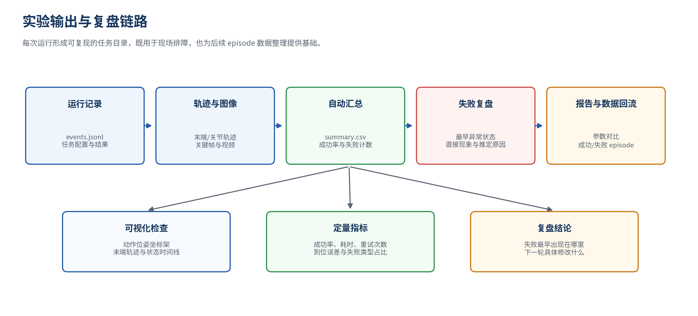

**图 7-11 从运行日志到实验报告和数据回流的处理链路**

**表 7-28 第 6 节实验的可视化与分析输出**

| **输出文件或图表** | **必须包含的内容**                                       | **用于回答的问题**                     |
|--------------------|----------------------------------------------------------|----------------------------------------|
| 动作位姿图         | 物体位姿、预抓取、抓取、抬升、放置准备、放置和退出位姿   | 目标生成是否符合任务几何关系           |
| 末端轨迹图         | 三维轨迹或 x/y/z 随时间变化，标出状态边界                | 轨迹是否平滑，异常最早出现在哪一段     |
| 状态时间线         | 每个状态的进入、完成、失败和重试时刻                     | 状态机是否按预期推进，哪个状态耗时过长 |
| 成功率表           | 任务、参数组、运行次数、成功次数、成功率和平均耗时       | 参数变化是否真正改善任务结果           |
| 失败案例表         | 关键帧、失败阶段、直接现象、推定原因、恢复策略和验证结果 | 失败归因是否有证据，改进是否可执行     |

日志分析的完整脚本见 [`analyze_runs.py`](../../code/lecture07/analyze_runs.py)。正文只看单次任务如何从事件流提取四个核心指标：

```python
def summarize_task(task_dir: Path) -> dict[str, object]:
    events_path = task_dir / "events.jsonl"
    records = [
        json.loads(line)
        for line in events_path.read_text(encoding="utf-8").splitlines()
        if line.strip()
    ]
    success = any(record.get("event") == "success" for record in records)
    failures = [record for record in records if record.get("event") == "failure"]
    states = [record["state"] for record in records if record.get("event") == "enter"]
    return {
        "task_dir": task_dir.name,
        "success": success,
        "failure_count": len(failures),
        "last_failure": failures[-1].get("code", "") if failures else "",
        "state_count": len(states),
    }
```

数据处理顺序是：逐行读取事件 → 判断是否出现 `success` → 收集全部 `failure` → 统计进入过的状态。批量遍历目录和写入 CSV 只是外围流程，留在完整源码中即可。把这条最小链路跑通后，再增加总耗时、各状态耗时和失败类型占比。

## 6.13 常见失败：先找最早出错的状态

实战复盘应以“最早异常状态”为起点。观察到方块最终未进入 B 区时，不能立即将原因归结为放置位姿；如果方块在抬升或搬运过程中已经相对夹爪发生滑移，真正需要修改的是抓取点、夹爪参数或运动速度。

**表 7-29 实战中的常见失败、证据与修改方向**

| **现象**             | **优先查看的证据**                   | **首先检查的模块**         | **下一轮修改**                             |
|----------------------|--------------------------------------|----------------------------|--------------------------------------------|
| 预抓取无法到达       | 规划错误码、逆运动学结果、碰撞对象   | 位姿生成与真机规划器       | 换候选位姿、增加中间点或调整初始姿态       |
| 接近时推开方块       | 接近轨迹、速度、物体关键帧           | 预抓取距离与接近控制       | 减小速度、修正中心偏移、分段接近           |
| 夹爪闭合但抓空       | 夹爪宽度、闭合时刻、抓取前后图像     | 抓取位姿与夹爪控制         | 调整抓取高度、闭合终点和闭合时机           |
| 瓶子抬升时下滑       | 瓶身相对夹爪位置、夹爪宽度、抬升速度 | 抓取点、夹持参数与抬升控制 | 更换瓶身夹持高度、降低加速度、收紧目标宽度 |
| 瓶子碰到盒沿         | 放置准备位姿、下降轨迹、盒体碰撞记录 | 放置位姿与环境模型         | 提高放置准备高度、修正盒中心、低速下降     |
| 检测结果与视频不一致 | 时间戳、检测框、状态日志和视频帧     | checker.py 与数据同步      | 修正阈值、增加稳定帧数、统一时间基准       |

| **复盘问题** 失败最早出现在哪个状态？当时可以直接观察到什么？推定原因由哪些证据支持？下一轮只修改哪一个关键条件，如何判断修改有效？ |
|-------------------------------------------------------------------------------------------------------------------------------------|

## 6.14 让 AI 帮忙分析，但别把判断交出去

AI 适合帮助梳理概念、检查代码和提出可能原因，但它看不到真实机械臂当时的全部状态，也不能替代实验判断。一次完整的 AI 分析记录，应保留原始问题、回答摘要、采纳了什么、哪些地方仍需验证，以及验证后的最终结论。凡是涉及真机参数的建议，都要回到文档、代码和低速实验中逐项确认。

**表 7-30 可以交给 AI 辅助分析的六个问题**

| **类型** | **可以这样问**                                                                                   |
|----------|------------------------------------------------------------------------------------------------|
| 概念理解 | 为什么教学模拟后端运行成功，仍不能证明真机任务能够成功？                                       |
| 概念理解 | 为什么瓶子水平抓取时，放置位姿仍要保留抓取参考点相对于物体中心的偏移？                         |
| 概念理解 | 为什么状态机应记录第一个失败状态，而不是只记录最终任务失败？                                   |
| 工程实现 | 如何将 SO-101 的关节位置观测转换为统一的末端 Pose？需要哪些标定和运动学信息？                  |
| 工程实现 | ManiSkill 的控制器改变后，pose_to_actions() 和 gripper_action() 应如何修改？                   |
| 失败复盘 | 根据一次瓶子滑落视频、夹爪宽度日志和状态时间线，如何区分抓取点问题、夹持力问题与抬升速度问题？ |

## 6.15 Vibe Coding：让 AI 补完日志分析，再逐项核对

这一轮 Vibe Coding 从扩展 `analyze_runs.py` 开始。先把 `events.jsonl` 的字段示例和期望输出交给 AI，让它生成一个结构清楚的初稿；随后在教学模拟日志上实际运行，并逐项核对统计结果。只要有一项数字与原始日志对不上，就回到字段定义和计算逻辑继续检查。

**一个可直接使用的 Prompt**

```text
请基于下面的 JSONL 任务日志，编写一个适合初学者的 Python 分析脚本。
输入：
1. runs/ 下多个任务目录中的 events.jsonl；
2. 每行包含 time、state、event、observation 和可选 failure code；
3. 状态进入事件为 event="enter"，成功事件为 event="success"。
输出：
1. 每次任务是否成功、总耗时、重试次数；
2. 每个状态的持续时间；
3. 各失败代码的出现次数；
4. summary.csv；
5. 一张状态耗时柱状图和一张失败类型统计图。
要求：
- 使用 pathlib、json、csv 和 matplotlib；
- 缺少字段时给出清晰提示，不直接崩溃；
- 函数拆分清楚，包含类型标注；
- 不使用复杂框架；
- 解释每一段代码的作用和假设。
```

初稿跑起来以后，还可以继续追问：日志中断或最后一行不完整时如何处理；同一状态多次进入时如何计算耗时；如何区分一次任务中的多次重试；如何将方块与瓶子分组统计；如何把失败关键帧路径写入报告。

| **验证边界** AI 可以生成代码初稿，但每一段代码都要能够解释，并通过实际运行核对结果。只要修改涉及真机控制，就必须重新检查限位、速度、超时、夹爪方向和急停路径。 |
|--------------------------------------------------------------------------------------------------------------------------------------------------|

## 6.16 最后怎么判断这次实验真的跑通

一段成功视频只能说明某一次运行完成了任务；一份代码也只能说明程序写出来了。要判断这次实验是否真正跑通，还要看状态机是否按顺序推进、检测是否给出可靠证据、失败后是否发生了有依据的调整，以及日志能否把整个过程还原出来。

**表 7-31 完整实验结果的评价参考（满分 100 分）**

| **检查项**            | **看到什么才算完成**                                                   | **参考分值** |
|-----------------------|------------------------------------------------------------------------|----------|
| 工程代码              | 模块结构清楚，方块和瓶子任务均可配置；状态机、检测、恢复和日志能够运行 | 20       |
| 动作位姿              | 展示六个关键位姿，说明方块竖直抓取和瓶子水平抓取的差异                 | 15       |
| 硬件或仿真 Demo       | 至少完成方块任务；有条件者完成瓶子入盒；视频能够看到完整状态过程       | 20       |
| 成功检测              | 抓取、抬升和放置均有明确判据，不以动作完成代替任务成功                 | 10       |
| 失败与恢复            | 记录至少一次可恢复失败，给出最早失败状态、证据、原因和恢复结果         | 15       |
| 可视化与日志          | 保留轨迹或状态时间线、`summary.csv`、关键帧和任务日志                  | 10       |
| AI 提问与 Vibe Coding | 保留问题、回答摘要、验证记录和扩展后的分析脚本                         | 5        |
| 报告规范              | 结构完整、图表清晰、参数和结论可复现，真机安全说明充分                 | 5        |

运行完两个任务后，最后再做一次检查：代码是否真的执行到了正确状态，物体是否真正进入目标区域，失败时参数是否发生了有依据的变化。完成这些检查以后，整条规则操作闭环才算跑通。

# 7 收一下：从一个坐标，到一次完整任务

这一讲从一个看似简单的问题开始：已经知道物体在哪里，为什么机器人还不会抓？

答案现在很清楚。物体位姿只是空间起点，真正的操作技能还需要抓取关系、动作位姿、执行顺序、成功检测和失败处理。方块从 A 区到 B 区、瓶子进入收纳盒，表面上是两个任务，背后用的是同一条闭环。

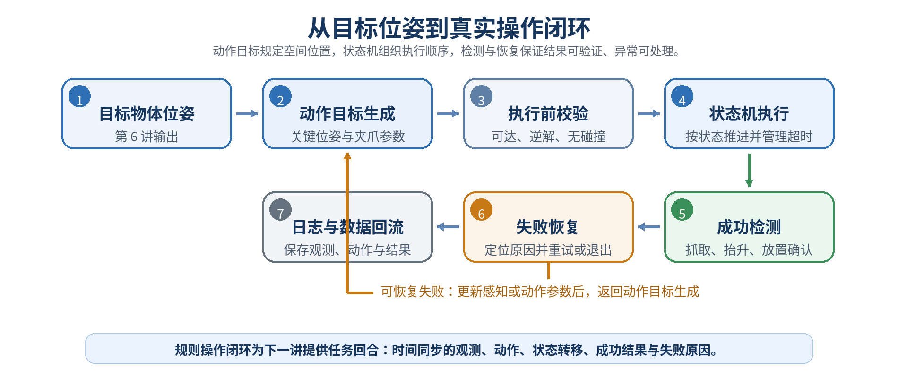

图 7-12 从目标位姿到真实操作闭环

## 7.1 这条主线值得再走一遍

1. 第 6 讲输出目标物体位姿；
2. 本讲把物体位姿转成预抓取、抓取、抬升、放置和退出位姿；
3. 状态机按顺序执行，每一步都检查完成条件；
4. 夹爪宽度、视觉和物体运动共同确认抓取、抬升和放置结果；
5. 失败后从最早异常状态开始定位，修改关键条件后再重试；
6. 状态、动作、检测和结果都写入日志，形成可复现的任务记录。

抓取不是一个单步动作，而是一条物理闭环。只要其中任何一环没有证据，程序就不应该假设任务已经成功。


## 7.2 从规则系统到端到端策略

第 7 讲是传统机器人操作方法的最后一讲。从前面的感知、位姿估计，到本讲的抓取、放置、结果检测和失败恢复，我们搭建的是一条典型的模块化流水线：

> 相机图像 → 目标位姿 → 动作规划 → 状态机执行 → 成功检测与失败恢复

在这套系统中，每个模块的输入、输出和判断规则都由人明确设计。机器人为什么进入某个状态、为什么执行某个动作、又为什么失败，都可以沿着程序逐步检查。这正是传统方法的优势：结构清晰、行为可解释，也便于定位和处理异常。

但它的局限同样明显。环境、物体和任务一旦发生变化，工程人员往往需要重新调整阈值、修改规则，甚至增加新的状态。面对难以穷举的真实场景，我们自然会提出另一个问题：

> 能不能不再逐条编写规则，而是让机器人直接从任务经验中学习“看到什么，就应该做什么”？

从第 8 讲开始，课程将进入一条完全不同的技术路线——**端到端机器人操作**，从 **感知、规划和控制的模块化Pipeline 走向 端到端的Policy**：不再研究“怎样把规则写得更完整”，而是研究“怎样让机器人从数据中学会动作”。

# 参考资料

1. MoveIt 2 Documentation：<https://moveit.picknik.ai/>
2. MoveIt 2 Tutorials：<https://moveit.picknik.ai/main/doc/tutorials/tutorials.html>
3. ManiSkill Documentation：<https://maniskill.readthedocs.io/>
4. robosuite Documentation：<https://robosuite.ai/docs/>
5. MuJoCo Menagerie：<https://github.com/google-deepmind/mujoco_menagerie>
6. Isaac Lab Documentation：<https://isaac-sim.github.io/IsaacLab/>
7. AnyGrasp SDK：<https://github.com/graspnet/anygrasp_sdk>
8. GraspNet Baseline：<https://github.com/graspnet/graspnet-baseline>
9. Fang H S, Wang C, Gou M, Lu C. *GraspNet-1Billion*. CVPR, 2020：<https://graspnet.net/>
