# 1 两种机器人：手写 pipeline 还是端到端 policy

第7讲我们已经让机械臂把红色方块从 A 区搬到了 B 区、把竖直的瓶子放进了收纳盒。用的办法是一条**人写的流水线**：先估出物体位姿，再算出预抓取、抓取、抬升、放置、退出这五个关键位姿，串成一个状态机，最后逐段执行、逐段校验，失败了还要按阶段回溯排查。它能跑通——代价是每一环的规则都得我们自己写出来。

这一讲把同一件事换一种做法：不再写规则，而是直接用一个神经网络，从相机画面映射到机器人指令。两种做法摆在一起对比，会引出第8到13讲共同的主角——**策略（policy）**。

## 1.1 传统机器人怎么干活：一条手写的流水线

传统做法会把"怎么动"**显式地**用人写的模型一步步算出来：先感知与建图，再规划一条轨迹，最后交给控制器执行。规划这一步常用两类算法——**RRT**（快速扩展随机树，Rapidly-exploring Random Tree）在自由空间里随机撒点、连成一条不碰东西的路径；**MPC**（模型预测控制，Model Predictive Control）则用动力学模型往前推演几步，再决定当下这一步怎么动。每一环都是人设计出来的。

把"生成机器人运动"的方法摊开看，大致分成两支[1]：左边是这种**显式建模**（explicit modeling：运动学、规划、控制），右边是这一讲要讲的**隐式建模**（implicit modeling：从示教中学习、强化学习）：

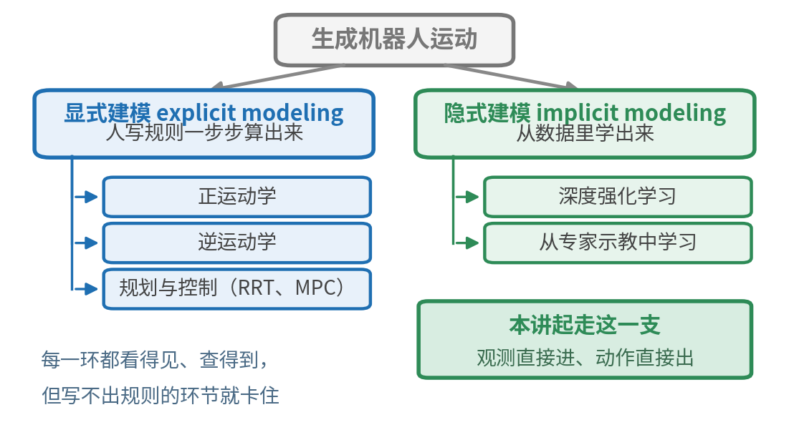{width=100%}

图上要看的不只是"分成两支"，还有那个绿色落点：这一讲以及往后的第9–13讲，全都站在右边这一支上。左支的好处写在它下面——每一步都看得见、查得到，哪里出错就去修哪一段，可解释、可调试。

## 1.2 流水线的死穴：有些环节根本写不出规则

问题在于，**有些环节是写不出规则的**。

抓一块软布、把线穿进针眼、拧一个滑手的瓶盖——这些任务里物体会形变、会打滑，接触力瞬息万变，你很难用解析模型把"此刻该怎么动"描述清楚。再加上真实世界的长尾层出不穷：换个光照、换个没见过的杯子，手写的感知和规划就要重新调一遍。

流水线不是不好，而是它把"难以言说"的技能硬拆成可编程的步骤，恰恰在最难的那几环上卡住了。

## 1.3 换个思路：让一个网络从观测直接到动作

端到端（end-to-end）策略给出的答案是：**不再把任务拆成感知—规划—控制三段分别设计，而是用一个神经网络，从图像与状态直接预测任务级的动作表示**，靠联合训练省掉人工写死的中间接口。相机像素进去，动作出来——但要注意这个"动作"通常还不是电机级命令：它更常是关节目标、末端增量或一段动作块，后面仍要经过坐标变换、控制器和安全约束才真正落到电机上。

> 备注：端到端**不是**要取代一切。端到端强调的是目标函数可以联合优化，不是输出必须直达电机。正逆运动学、安全限位、底层伺服这些有成熟解析解的部分仍然保留；端到端替代的，是那几个"写不出规则"的环节。

最早把这件事讲清楚的两个工作，一个在自动驾驶、一个在机械臂。NVIDIA 的 **DAVE-2**[2] 让摄像头画面直接进一个卷积网络、输出方向盘转角，中间不再有"车道线检测→路径规划→转向控制"的人工流水线。这个名字来自 2016 年那篇原始论文；同一组人在 2017 年的后续工作里把它改称 **PilotNet**[3]，今天多数人是用后一个名字记住它的：

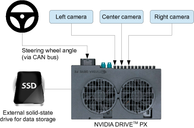

Levine 等人[4]在机械臂上做了同样的事，用一个网络把图像直接映射到电机扭矩。他们问的是同一个问题：把感知和控制**联合**训练，会不会比分开设计更好？在他们那组视觉运动控制任务上，答案是肯定的——联合训练的策略优于所比较的分阶段基线。这是那批任务、那批数据、那组基线下的结果，不等于所有任务都该取消模块化设计。


把这两件事抽象出来——"那个直接吃观测、吐动作的网络"——就是这一讲真正的主角。

# 2 什么是 policy

## 2.1 一句话定义：从观测到动作的映射

> 策略（policy）就是一个从**观测**到**动作**的函数：你给它当前看到的东西，它告诉你下一步该怎么动。

放进机器人和环境的互动里看最清楚：**智能体**（agent，在这里就是机器人）从环境收到观测，输出一个动作作用回环境，环境再给出新的观测——如此往复。这张经典的"智能体—环境"回路就是策略工作的舞台：

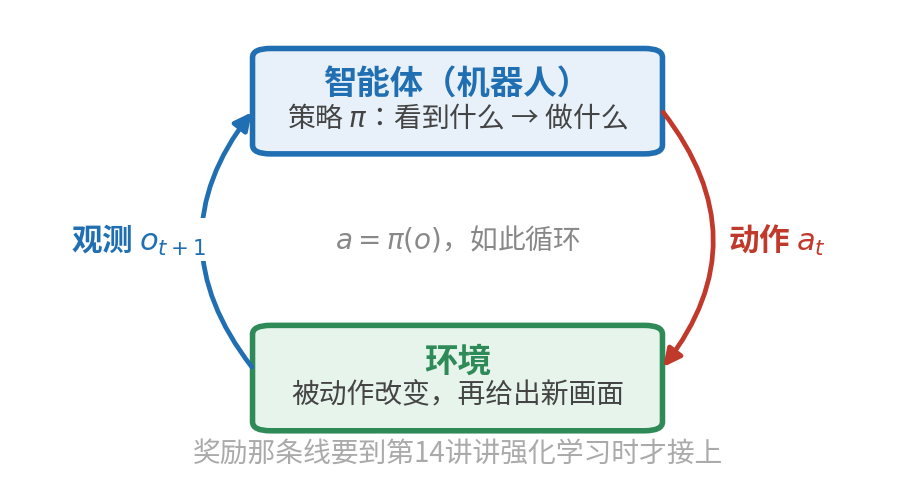{width=100%}

这张图上只有两条边——动作出去、观测回来，这一讲要的正是这两条。图下那行灰字提醒的是：强化学习那套习惯记号里还有第三条边（奖励 $r_{t+1}$），第14讲会把它接上，本讲先不碰。写成符号是 $a = \pi(o)$；更一般地写成一个分布 $\pi(a \mid o)$——同一个观测下，合理的动作往往不止一个。这件事会成为第10讲 1.4 节的核心出发点。

| 符号 | 含义 | 典型例子 |
|---|---|---|
| $o$ | observation，观测 | 相机图像、机器人关节角 |
| $a$ | action，动作 | 各关节目标角度、末端位姿、电机扭矩 |
| $\pi$ | policy，策略（要学的网络） | 一个卷积 + 全连接网络 |

## 2.2 观测里有什么、动作又是什么

观测和动作具体长什么样？看一段真实遥操作数据最直观：每一帧的**观测** $o_t$ 由机器人本体状态（关节角 $q_t$，那串数字）加上相机图像组成，对应的**动作** $a_t$ 是人类专家此刻通过主臂给出的目标关节角——策略要学的，就是"给定上面的观测、回归出下面的动作"：

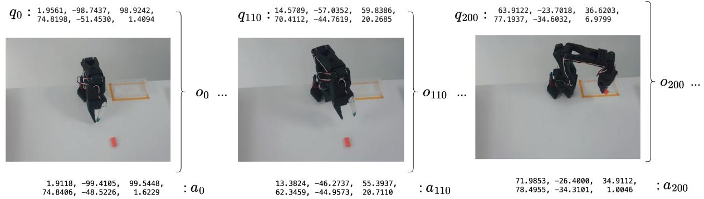

由此能看清观测和动作各有哪些常见形态：

**观测 $o$ 可以是**：本体状态（关节角、末端位置，维度低、信息直接）、图像（信息丰富但要网络自己提取）、语言指令（让同一个策略能做不同任务），以及它们的组合与一小段历史（不只看当前一帧）。

**动作 $a$ 的几个关键选择**：在关节空间还是末端空间表达；给**绝对**目标还是**相对**增量；一次只预测单步，还是预测未来一小段动作块（action chunk）。

> 备注：观测和动作的"口径"是策略的接口约定。同一个任务换一种动作表示（比如关节角换成末端位姿、绝对换成相对），对网络来说就是另一个学习问题——后面几讲的很多设计差异，以及第 3 节部署翻车的坑，都出在这里。

## 2.3 策略的谱系：从只看状态到看懂语言的 VLA

把"观测里加不加图像、加不加语言"当坐标，策略就排成一条谱系。

最左端是**状态策略**（state policy）：观测里只有关节角、末端位置这类本体数字，没有图像。往右一步，观测里加进相机画面，就是**视觉运动策略**（visuomotor policy）——第10讲要动手训的 ACT（动作分块 Transformer，Action Chunking with Transformers）和 Diffusion Policy（用扩散模型生成动作）都属于这一档。再往右，观测里加进一句自然语言指令，同一个网络就能按"把碗放到盘子上"还是"把杯子推到左边"做不同的事，这类叫**语言条件策略**（language-conditioned policy），Google 的 RT-1[5] 是代表作。最右端把视觉、语言、动作三件事统一进一个大模型，就是**视觉-语言-动作模型**（Vision-Language-Action，VLA）[6]，本讲实验要用的 $\pi_0$ 就是其中一个。

越往右，策略"看懂"的东西越多、能听的指令越泛。把这条谱系画成一条轴：

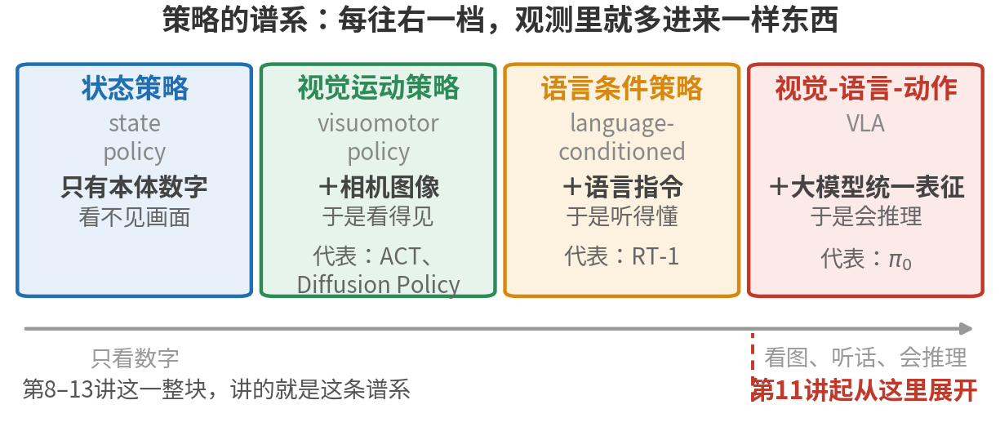{width=100%}

图要读的是那一列加粗的"＋"号：四档之间不是四种并列的方法，而是**同一个 $\pi(a\mid o)$ 一路往观测里加东西**——先加画面、再加语言、最后加进一个能把两者一起理解的大模型。观测里多进来一样，能听懂的指令就宽一层，这也是为什么最右端的 VLA 能对"把碗放到盘子上"和"把杯子推到左边"做出不同的事。这条谱系正好是本课程"端到端策略"这一大块（第8–13讲）的地图，最右端的 VLA 会从第11讲起展开。

## 2.4 本节小结

策略就是"观测→动作"的那个函数，写作 $\pi(a\mid o)$。它的两个接口——观测里放什么、动作怎么表达——决定了它是一个只看状态的状态策略，还是一个能听语言的 VLA，也决定了它好不好训、好不好部署。下一节就来看，当我们真把一个策略学出来、搬上机器人时，会在哪些地方栽跟头。

# 3 从训练到部署：为什么 loss 低了还会失败

策略是学出来的。但"学得好"和"用得好"之间，隔着几道部署时才会暴露的坎。这一节不讲新算法，讲**数据的变换**：示教数据在进网络之前，要先统一动作口径、再做归一化；部署时，网络吐出的数字要按**原路逆着走回来**——先反归一化、再还原口径，才变回机器人能执行的指令。这条"来回路"上任何一环两端对不上，机器人就会表现出三种经典症状：**几乎不动**、**越走越飘**（发散）、或者**来回抖动**——而此时网络和权重往往都没有任何毛病。

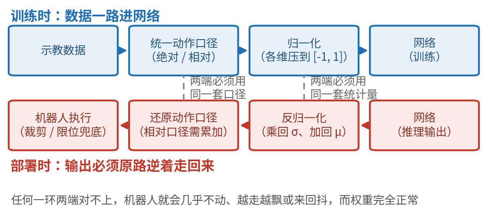{width=100%}

上图就是本节的路线图。上排画的是训练时数据怎么进网络，下排画的是部署时数据怎么原路走回来；中间那两条虚线，标出了最容易断掉的两处衔接——动作口径（3.3）和归一化统计量（3.4）。在拆这两处衔接之前，先回答一个更基本的问题：怎么判断一个策略到底行不行（3.1、3.2）。

## 3.1 训练损失低不等于任务成功

最容易踩的认知误区，是盯着训练损失（loss）下降就以为大功告成。

策略的训练目标通常是"让预测动作接近示教动作"，这是一个**单步**的监督指标。但任务成功是一个**闭环**的结果：要一步接一步走到底、把方块真的送进容器。单步每步差一点点，几十步累积下来可能完全跑偏；反过来，loss 不是最低的那个 checkpoint，真机成功率反而更高，也很常见。也不存在一个通用的数值，说"loss 降到多少就能部署"——验证集损失、预测动作与示教动作的逐维误差这类**离线指标**，作用是训练监控、checkpoint 粗筛和故障诊断；最终的任务能力，要在仿真或真机上按统一协议闭环跑一遍才算数。

> loss 衡量的是"像不像示教"，成功率衡量的是"任务成没成"，两者经常对不上——所以选模型不能只看 loss 曲线。这两类指标是分工，不是互斥：离线筛，闭环定。

## 3.2 闭环里误差会滚雪球：为什么必须 rollout 验证

为什么单步差一点，闭环会差很多？因为机器人是**用自己的动作决定自己下一步看到什么**。

训练时策略见到的都是示教里"正确"的状态；一旦它在某一步偏离一点，就进入了训练时没见过的状态，于是下一步预测更偏、状态更陌生——误差像滚雪球一样越滚越大。下图画的就是这个过程：

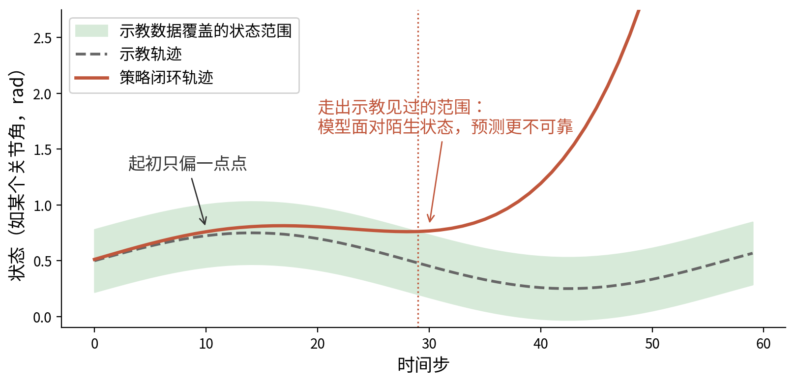{width=85%}

注意图里的转折点：轨迹还在绿色带内时，偏差几乎看不出来；**走出带子的那一刻**，模型面对的是示教里从未出现过的状态，输出开始失去依据，轨迹加速飘走。这个现象叫**分布漂移**（distribution shift）；在模仿学习里它有个更精确的名字叫**协变量偏移**（covariate shift），指的正是"策略自己走出来的状态分布"和"示教数据的状态分布"对不上。它是模仿学习的经典难题，Ross 等人提出的 **DAgger**[7]（数据聚合，Dataset Aggregation：让策略先跑，再请专家对跑出来的状态补标正确动作，把这批数据加回训练集重训）就是冲它去的。第10讲 1.2 节会从生成式策略的角度再碰一次这个问题，DAgger 这条交互式纠正的路，则留到第16讲 8.6 节的人在环方法展开。

结论很硬：**策略到底行不行，得让它在环境里真正跑一遍（rollout）、看任务成没成——离线指标做不了这个判决。** 离线指标仍然有它的位置：粗筛 checkpoint、诊断故障、在上真机之前先把明显的问题挡掉，从而降低真机风险。这也是为什么本讲第 4 节的实验，核心不是算 loss，而是让策略在仿真里闭环跑起来。

## 3.3 动作口径：绝对还是相对，两端必须说同一种话

2.2 提过动作可以是**绝对**的，也可以是**相对**的（增量 / delta）。这是这一讲最该记牢的细节之一——它既影响网络好不好学，又是部署时最常翻车的地方。

先把两种口径说清楚。假设机械臂某个关节此刻在 1.18 弧度，下一帧示教把它转到了 1.20 弧度，那么"这一步动作"有两种记法：

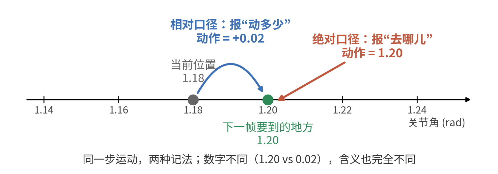{width=80%}

- **绝对口径**：策略直接输出"目标 = 1.20 弧度"。动作的含义是**去哪儿**，跟你现在在哪没关系。
- **相对口径**：策略输出"在当前基础上 +0.02 弧度"。动作的含义是**动多少**，必须配合"当前在哪"才能还原出真正的目标（$1.18 + 0.02 = 1.20$）。

末端位姿也是一样：可以给"末端在世界坐标系下的绝对位姿"，也可以给"末端再往前挪 1 厘米"这种增量。两种口径各有长短，没有绝对的好坏：绝对口径每一步都瞄准一个固定坐标，动作表示本身不会累积漂移，但网络得记住"整个工作空间长什么样"；相对口径是"局部修正"，跨起点泛化好、通常也更好学，代价是部署时要一步步把增量累加回绝对位置。口径的选择本身就影响性能——Diffusion Policy 那篇论文专门做过这项对照[8]：方法完全不变，只把动作表示从速度口径换成位置口径，多个任务上的成功率就明显不同。

真正的分水岭在于：**训练和部署两端，必须用同一种口径去解释同一个数字。** 这里要留意相对口径的一个数值特点：增量的绝对值天然很小。粗算一下就知道——采集频率 30Hz、关节以每秒零点几弧度这种温和速度转动，相邻两帧之间就只差 0.01 弧度上下，几乎贴着 0。由此引出两个对称的坑，下图左右各画了一个：

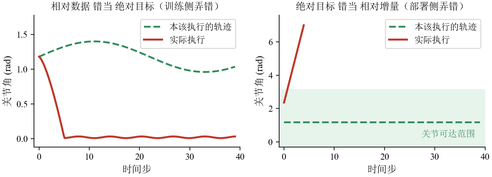

- **左图，训练侧弄错——把相对数据当绝对目标训**：本该是"+0.02"的增量，被错当成绝对目标喂给网络。网络于是学会"不管现在在哪，都输出一个 0.02 左右的绝对目标"——机械臂径直扎向接近零位的姿态。到了那儿之后，每一步给出的目标几乎都是同一个数，机械臂原地不动；那点残余的位移比网络的预测噪声还小，看上去就是在抖。症状：**先猛地一动，然后几乎不动**。此时 loss 依然很漂亮、网络本身也没毛病，机器人却罢工了。
- **右图，部署侧弄错——把绝对目标当相对增量发**：训练时动作是绝对目标（比如 1.2），部署端却把它当成增量，每步都在当前位置上再加 1.2——关节角一路累加、冲出可达范围。症状：**单调地越走越远**（发散）。反过来，相对模型部署时忘了"目标 = 当前位置 + 增量"这步累加，把 0.02 直接当绝对目标下发，就回到左图的下场。

> 备注：动作口径必须在训练和部署两端**完全一致**——同一个数字 0.02，在绝对口径下意思是"去 0.02 弧度处"，在相对口径下意思是"再走 0.02 弧度"，差之毫厘谬以千里。这是一条约定层面的硬约束，不是事后调参能补救的。

> 备注：口径的约定其实从**采数据**那一刻就开始了。主从遥操作里从臂跟随主臂，也分两种方式——**绝对跟踪**：从臂直接去主臂当前的绝对姿态，录下的动作就是从臂真实到达的姿态，前提是主从标定的零点对齐；**相对（锚定）跟踪**：接通的第一帧记下"从臂当前姿态减主臂姿态"的差，之后从臂只复现主臂的位移。锚定跟踪不要求零点严格对齐、接通瞬间从臂不会突然跳动，但录下的动作和从臂实际姿态恒差一个**每次开机都不同的常数**——动作口径已经被悄悄改写，部署时更容易两端对不上。遥操作采数据的细节，下一讲展开。

## 3.4 归一化：把统计量和模型绑在一起

第二处容易断掉的衔接是**归一化**（normalization）——把不同量纲的数值统一缩放到相近的区间。

**为什么非归一化不可。** 一份机器人数据里，不同物理量的数值范围天差地别：关节角可能在 $[-3.14, 3.14]$、夹爪开合是 $[0, 1]$、图像像素是 $[0, 255]$。神经网络对数值尺度很敏感，所以训练前几乎都会把每一维**各自**归一化到相近的尺度。这里要分两头说，因为它们解决的是两件不同的事：

- **输入侧（图像、状态）归一化**改善数值条件，并且要和视觉编码器预训练时用的那套归一化对上——很多模型直接沿用预训练编码器固定的 mean/std，不能自己另算一套。
- **动作侧（输出）归一化**才是"平衡各维度"那件事：动作各维共用一个回归/生成损失，量程大的维度会主导这个损失、量程小的维度几乎学不动。

两头的统计量、变换和反变换都必须**分别**记录，别混成一套。

![左：相机像素、关节角、夹爪开合三种量的原始数值范围相差悬殊；右：各维各自归一化后，统一落到 [-1, +1]（本书自绘）](../../assets/figures/lecture08/ref/fig08-3-normalization-ranges.png){width=100%}

左图里关节角和夹爪开合那两条几乎看不见的细条就是问题所在：$[-3.14, 3.14]$ 和 $[0, 1]$ 摆在 0 到 255 的像素旁边，被压成了两道竖线。右图三条一样长——归一化要做的不是把数值改小，而是把各维放到同一把尺子上。

常见两种做法。第一种是**均值-方差（mean / std）**：$\hat{x} = (x - \mu) / \sigma$，用这一维的均值 $\mu$ 和标准差 $\sigma$ 把数据拉成零均值、单位方差。简单，但对离群点敏感——数据里混进几个异常大的值（比如传感器毛刺），$\sigma$ 就被撑大，正常值反而被压扁。

第二种是**分位数（q01 / q99）**。先说清 q99 是什么：把这一维的所有数据**从小到大排队，排在 99% 位置上的那个数就是 q99**——也就是说，99% 的数据都不超过它；q01 同理，是排在 1% 位置上的数。归一化时不用最小值和最大值，而用 $[q_{01}, q_{99}]$ 这段区间做线性缩放，把它映射到 $[-1, +1]$；落在区间外的样本直接截断到边界上——注意是**两端各约 1%、合计约 2%**（$q_{01}$ 以下约 1%，$q_{99}$ 以上约 1%），实际比例还受重复值和具体实现影响：

![左：直方图里几个离群点把 max 拉得很远，而 q01/q99 紧贴数据主体；右：把 [q01, q99] 线性映射到 [-1, +1]，超出 q99 的毛刺被截断到 +1](../../assets/figures/lecture08/ref/834_q99-normalization.png)

好处在左图一眼可见：min / max 会被那几个毛刺整个带偏，q01 / q99 则稳稳贴住数据主体。所以分位数归一化更抗离群点。

但**不要把它当成放之四海的默认值**——连同一个系列的两代模型都不一样。把 LeRobot v0.5.1 里几个常用策略的默认归一化摊开看：

| 策略（LeRobot v0.5.1） | 状态侧 | 动作侧 |
|---|---|---|
| $\pi_0$ | 均值-方差 | 均值-方差 |
| $\pi_{0.5}$ | 分位数 | 分位数 |
| ACT | 均值-方差 | 均值-方差 |
| Diffusion Policy | 最小-最大 | 最小-最大 |
| SmolVLA | 均值-方差 | 均值-方差 |

分位数确实被用了，但用它的是 $\pi_{0.5}$；$\pi_0$ 自己走的还是均值-方差。$\pi_0$ 的官方实现 openpi 里也是同一个口径：分位数归一化那个开关对 $\pi_0$ 是显式关掉的，从 $\pi_{0.5}$ 起才打开。每个策略都在自己的配置里分别声明图像、状态、动作三路各用哪种归一化（上表只列了状态与动作两路），换策略、换版本都要回去看一眼实际用的是哪种——照搬别处的假设，就是这一节剩下要讲的那类翻车。

举个具体的数走一遍归一化的"来回"。某关节在训练集上统计出 $\mu = 0.3$、$\sigma = 0.5$。示教里一个目标 0.8，归一化后是 $(0.8 - 0.3)/0.5 = 1.0$，网络学到的、吐出来的都是这个 1.0。轮到推理时网络输出 1.0，必须再**反归一化**回真实尺度：$1.0 \times 0.5 + 0.3 = 0.8$，这个 0.8 才是真正下发给机器人的值。训练（正向归一化）和部署（反向还原）用的，必须是同一套 $\mu, \sigma$。

**关键在于：这套统计量（$\mu, \sigma$ 或 q01 / q99）是从训练集统计出来的，是模型的一部分**——它通常和权重放在一起，存成一个不起眼的小文件。部署时如果只带走了权重、把统计量落下了，或者拿错成另一份数据（另一个 `asset_id`）的统计量，那就是一个**部署错误**，应当当场暴露出来。别指望框架会好心地帮你兜住。不同实现在这件事上的行为并不一致：有的直接报错停下，有的则悄悄回退到一套默认值、或者加载另一份资产接着跑。后一种最危险——本该还原成 0.8 的动作被原样当成 1.0 发了出去，日志里一句提示都没有。所以启动时就要校验统计量的键、维度、版本和数值范围，**禁止静默回退**；否则整条动作的尺度会系统性错位，而你只看到下图这两种症状：

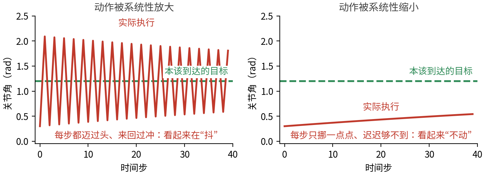{width=100%}

两条红线的形状本身就是诊断依据：左图围着绿线上下穿行，幅度只是缓慢收窄，四十步都没停下来；右图是一条单调的缓坡，四十步走完还不到目标距离的三分之一。这种错和 3.3 的坑同一个性质：网络、权重都没问题，全错在"模型和它的附属统计量分了家"。

> 一句话：模型权重和它的归一化统计量是**一套**东西；权重对了、统计量丢了或拿错了，输出照样全错。而且观测侧（输入）和动作侧（输出）两头都要归一化，部署时两套统计量一个都不能少——启动时先校验，别等机器人动起来才发现。

## 3.5 裁剪、限位与出发前检查单

就算前面都对，真机上还要留一道兜底闸：把动作**裁剪**（clip）到合理范围、限制最大速度、加上关节限位。策略偶尔吐出一个离谱的值时，这道闸能把它拦在幅值之内。但要清楚它的能力边界：裁剪只管**单次**幅值，管不了轨迹整体——连续多个贴着边界的动作、坐标系搞错、绝对/相对口径搞反，照样能做出危险运动。所以它是**最低层的数值保护**，上面还要叠加一层层约束：限加速度、限加加速度（jerk，也就是加速度的变化率，管的是动作平不平顺），再加上工作空间约束、碰撞监测、看门狗、急停，以及先低速分阶段验证、确认没问题再放速度。

最后，把本节的内容收成一张**出发前检查单**，部署前逐行过一遍：

| 检查项 | 要确认的问题 |
|---|---|
| 动作口径 | 训练数据的动作是绝对还是相对？部署端按同一种口径解释了吗（相对口径记得累加还原）？ |
| 归一化统计量 | 统计量文件和权重在一起吗？观测侧、动作侧两套都齐吗？ |
| 数值量级 | 离线喂几帧观测，输出的数值量级像正常动作吗（相对口径应是贴近 0 的小数）？ |
| 起始位姿 | 机器人从示教数据里出现过的起始位姿附近出发了吗？ |
| 安全兜底 | 裁剪、限速、关节限位这道闸设了吗？加速度限制、工作空间、碰撞监测、看门狗、急停齐了吗？ |
| 评估标准 | 判好坏的标准定成 rollout 成功率了吗（而不是 loss）？ |

这张表不长，但每一行背后都是一类"模型没毛病、机器人不工作"的故障。第 4 节的实验会拿着它逐行核对一遍。

## 3.6 本节小结

把一个策略从训练搬到部署，本质是让数据把那条"来回路"走完整：训练侧怎么把示教数据变换进网络（统一动作口径、归一化），部署侧就必须用同一套约定逆着变换回来（反归一化、还原口径），最后用裁剪与限位兜底；判断成没成，只认闭环 rollout（3.1、3.2）。这些都不是算法创新，却是机器人能不能动起来的分水岭——"模型看着没问题、就是不工作"的故障，十有八九断在来回路的某一环上，症状无非三种：不动、发散、抖动。

# 4 实验：用 $\pi_0$ 跑通第一个策略闭环

讲了这么多概念，这一节亲手跑一个真正的策略，把"看一眼、动一下"的闭环看在眼里。我们用一个现成的、能力很强的 VLA——**$\pi_0$**——当作黑盒策略，在仿真环境 LIBERO 里跑一遍 rollout。

这里有个容易踩的前提要先说清楚：**用的不是 $\pi_0$ 的通用基座权重，而是一份已经在 LIBERO 上微调过的 checkpoint**。$\pi_0$ 的基座预训练数据里不含 LIBERO 仿真数据，直接零样本丢进 LIBERO 是跑不出成功率的——必须配上对应的 LIBERO 微调配置与权重。本讲实验固定用 LeRobot 提供的 `lerobot/pi0_libero_finetuned_v044`（代码见 `code/vla/1_policy_rollout/1_2_pi0_libero_rollout/pi0_demo.py`）；openpi 那条线上对应的是 `pi0_libero` 配置与 checkpoint——同一个仓库里还并列着 `pi0_fast_libero`、`pi05_libero` 这些名字很像的变体，它们背后是不同的模型，别拿错。换版本要连着配置、归一化资产、评测脚本一起换，不能只换权重文件。

## 4.1 先认识主角：$\pi_0$ 当一个黑盒策略

$\pi_0$ 是 Physical Intelligence 提出的视觉-语言-动作模型[9]：一个视觉-语言骨干网络看懂图像和指令，后面接一个"动作专家"生成连续动作。

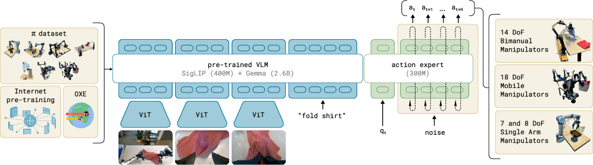

> 备注：$\pi_0$ 内部用 flow matching 生成动作，这套机制留到第10讲 5 节（Flow Matching）和第11讲 3 节（$\pi_0$）再拆。**本讲只把它当一个"观测进、动作出"的黑盒**——恰好印证第 2 节对策略的定义。

## 4.2 搭好舞台：LIBERO 仿真环境

LIBERO[10] 是一个机器人操作的仿真基准，用程序化的方式生成了一批桌面操作任务，分成空间、物体、目标、长程四个套件。没有真机时，它就是我们验证策略的标准台子：

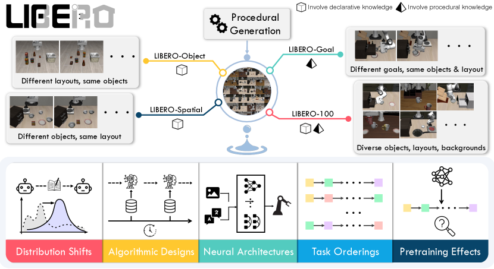

在跑策略之前，先花几分钟把这个环境本身摸清楚——观测里有什么、动作是几维、发一个动作末端会往哪动。这三件事正是 2.2 节那两个接口在一个具体环境里的样子。完整脚本在 `code/vla/1_policy_rollout/1_1_libero_env/libero_demo.py`，建一个环境只要这几行：

```python
env_cfg = LiberoEnvConfig(
    task="libero_spatial",
    task_ids=[0],
    obs_type="pixels_agent_pos",   # 图像 + 本体状态 两路观测
    observation_height=256,
    observation_width=256,
)

envs = make_env(env_cfg, n_envs=1)
env  = envs['libero_spatial'][0]
```

`obs_type="pixels_agent_pos"` 这一个参数就把观测的口径定死了：图像一路、本体状态一路。换成别的取值，策略拿到的观测就变了——而策略的输入接口是训练时就固定下来的，对不上就跑不了。

动作那一头同样要当场确认，不要靠猜：

```python
action_space = env.single_action_space
print(f"Action space: {action_space}")
assert action_space.shape == (7,)
```

7 维，就是 4.5 节要核对的那个动作口径。这句 `assert` 值得留着：环境版本一变，维度对不上会当场炸，总好过让一个维度错位的动作悄悄发到机器人上。

## 4.3 闭环跑起来：看一眼、动一下

实验的核心是一个循环：从环境拿到当前观测（相机图 + 机器人状态 + 语言指令）→ 喂给 $\pi_0$ → 得到一段动作 → 在环境里执行 → 拿到新的观测……如此往复，直到任务完成或超时。这就是第 3 节反复强调的**闭环 rollout**：策略不是预测一次就完事，而是要在自己造成的后果里一直走下去。

代码在 `code/vla/1_policy_rollout/1_2_pi0_libero_rollout/pi0_demo.py`。第一步是把策略连同它的归一化统计量一起加载进来：

```python
    policy_path = "lerobot/pi0_libero_finetuned_v044"
    policy_cfg = PreTrainedConfig.from_pretrained(policy_path)
    policy_cfg.device = "cuda" if torch.cuda.is_available() else "cpu"
    policy = get_policy_class(policy_cfg.type).from_pretrained(
        policy_path, config=policy_cfg, strict=False
    )
    preprocessor, postprocessor = make_pre_post_processors(policy_cfg, pretrained_path=policy_path)
```

最后那行是 3.4 节的主角落到代码上的样子。`preprocessor` 做正向归一化，`postprocessor` 做反归一化，两者的统计量都从 `policy_path` 这一个来源读出来——统计量和权重同进同出，不会分家。如果哪天你写的推理脚本里只有 `from_pretrained` 而没有这一行，那就是把归一化整个跳过了，动作尺度会系统性错位。

装好之后，闭环本身只有十来行：

```python
        for _ in range(max_steps):
            observation_batch = preprocess_observation(observation)
            observation_batch = add_envs_task(env, observation_batch)
            observation_batch = env_preprocessor(observation_batch)
            observation_batch = preprocessor(observation_batch)

            with torch.inference_mode():
                action = policy.select_action(observation_batch)

            action = postprocessor(action)
            action = env_postprocessor({"action": action})["action"].cpu().numpy()

            observation, _, terminated, truncated, info = env.step(action)
            frames.append(env.envs[0].render())
```

把它对着第 3 节那张来回路的图读一遍，每一行都能找到位置：四行预处理是"去路"，`select_action` 是网络本身，两行后处理是"回程"（先反归一化、再还原成环境的动作口径），`env.step` 把动作作用回环境、换来下一帧观测。第 2 节说策略是一个 $a = \pi(o)$ 的函数，在这里就是中间那两行；剩下的全是在给这个函数配上正确的输入输出口径。

一段成功的 rollout 会被写成模块目录下的 `output/pi0_libero_success.mp4`。脚本在写视频之前先拦了两道：

```python
        if not frames:
            raise RuntimeError("no frames")
        if not success:
            raise RuntimeError("no success")
```

这两行不是防御性编程的样板，而是 3.1 节那条结论的代码版：**跑完不等于跑对**。没有它们，一次"程序正常退出但任务没完成"的运行看起来和成功没有区别——而这恰恰是本讲反复强调的那类故障的样子。

跑通之后那段视频抽成四帧，长这样：

{width=100%}

对着这四帧再回看上面那个循环：每一帧画面都是上一个动作造成的后果，也是下一次 `select_action` 的输入——第 3 节说的"用自己的动作决定自己下一步看到什么"，在这里是字面意思。四帧之间没有任何人写的分段逻辑：没有"预抓取位姿"、没有状态机、没有阶段校验，全程只有观测进、动作出。这正是第 1 节那条对比的落点。

## 4.4 一个对照实验：把图像换成白噪声

闭环跑通了，但还剩一个问题没回答：$\pi_0$ 真的在看图像吗？还是说这个任务本身太固定，光靠本体状态和语言指令就能蒙对？

这个问题不能靠读代码回答，得做对照实验：**其他一切不动，只把送进网络的图像换成白噪声**，再跑一遍同样的任务，比较两次的成功率。脚本是 `code/vla/1_policy_rollout/1_2_pi0_libero_rollout/pi0_test.py`，替换只发生在观测进网络之前的那一步：

```python
def replace_images_with_white_noise(observation_batch: dict[str, Any]) -> dict[str, Any]:
    for key, value in observation_batch.items():
        if key.startswith("observation.images.") and torch.is_tensor(value):
            observation_batch[key] = torch.rand_like(value)
    return observation_batch
```

注意它只动 `observation.images.` 开头的键——本体状态、语言指令、动作口径、归一化统计量全都保持原样。这是对照实验的关键：**一次只改一个变量**，否则成功率掉下来你也说不清是被哪一项改掉的。

把 `image_mode` 分别设成 `"real"` 和 `"white_noise"` 各跑一遍，把两次的成功率填进这张表，结论自己就出来了：

| 图像输入 | 其余输入 | 套件成功率 |
|---|---|---|
| 真实相机图 | 不变 | ＿＿＿ |
| 均匀白噪声 | 不变 | ＿＿＿ |

怎么读这张表：**白噪声那一行掉得越多，说明这个策略越依赖视觉。** 如果两行差不多，那就要警惕了——要么这个任务的初始状态太固定、闭着眼睛按固定轨迹走也能成，要么图像那一路根本没接进网络。第二种情况在自己搭推理流水线时并不罕见，而它在成功率上可能一点都不显眼，只有做了这个对照才看得出来。

## 4.5 拿着检查单核对这次部署

跑通只是第一步。真正把这一讲学透，是拿出 3.5 那张出发前检查单，把这次 $\pi_0$ + LIBERO 的运行逐行核对一遍：

- **动作口径**：LIBERO 约定的动作是 7 维的**相对**增量——前 3 维是末端位置增量、接着 3 维是姿态（旋转）增量，最后 1 维控制夹爪开合；环境在内部把增量累加成真实目标，正是 3.3 说的"相对口径要累加还原"。这份 LIBERO 微调 checkpoint 就是按这套口径训练的，两端说的是同一种话；一旦把它的输出错当绝对位姿发下去，立刻就是 3.3 右图的下场。要提醒的是，这个映射由框架里的输入/输出转换代码（openpi 那边叫 `LiberoInputs`/`LiberoOutputs`）明确定义，不是权重"自带"的性质——换环境或换框架时，这层转换要重新核对。
- **归一化统计量**：这份 checkpoint 把归一化统计量和权重存放在一起，加载策略时一起载入——推理时先把观测归一化送进网络，再把输出反归一化成真实增量。"下载权重就能直接跑"，靠的正是统计量没和权重分家（3.4）。
- **数值量级**：闭环跑起来之前，可以先打印第一帧的动作看一眼：7 维增量应当是贴近 0 的小数。如果看到大数，那是口径或统计量出了问题的信号（3.3、3.4 的症状），先停下排查，别急着跑完 rollout。
- **起始位姿**：LIBERO 每次重置会把机械臂和物体摆到任务定义的初始状态。用**和微调时一致的环境版本与重置协议**，能显著缩小初始状态的分布差异，3.2 那个雪球不容易从源头滚起来。但"重置到任务定义的初始分布"不等于"和训练数据分布完全一致"——相机参数、随机化设置、物体姿态、控制器、库版本，以及策略自己走出来的后续状态，都还可能带来偏移。所以仍要用多组初始条件各跑几遍 rollout，看闭环里有没有漂移。
- **安全兜底**：仿真里翻车零成本，偶尔的离谱动作顶多让任务失败、摔不坏硬件，这一关可以先放松；但同样的闭环搬上真机之前，裁剪、限速、限位必须补上（3.5）。
- **评估标准**：判断这次实验成不成，看任务有没有在限定步数内完成，不看 loss、也不看任何离线数字（3.1、3.2）。

检查单六项，每一项都能在这次实验里找到落点。把它核对完，第 3 节那条"训练到部署的来回路"才算真正走通了一遍。

# 5 本讲小结

## 5.1 回顾整条数据流

这一讲只讲了一件事：**策略，就是从观测到动作的那个网络；用它，就是让"观测→策略→动作→环境→新观测"这个闭环转起来。** 训练时盯成功率而非只盯 loss，部署时把动作口径、归一化统计量、安全边界对齐，这个闭环才转得稳。

## 5.2 策略要吃数据：下一讲采数据

策略这么强，前提是有数据喂它。$\pi_0$ 的预训练权重背后，是海量的示教数据。那这些数据从哪来、怎么采、采成什么格式才能直接训练？下一讲就动手采一份能训练的数据集。

> 一句话总结：端到端策略把"感知—规划—控制"的手写流水线，压成一个"观测→动作"的网络；学会它、跑通它的闭环、并在部署时对齐动作口径与归一化，是后面所有 VLA 的起点。

# 参考文献

[1] CAPUANO F, PASCAL C, ZOUITINE A, et al. Robot learning: a tutorial[EB/OL]. (2025-10-14)[2026-06-30]. https://arxiv.org/abs/2510.12403.

[2] BOJARSKI M, DEL TESTA D, DWORAKOWSKI D, et al. End to end learning for self-driving cars[EB/OL]. (2016-04-25)[2026-06-30]. https://arxiv.org/abs/1604.07316.

[3] BOJARSKI M, YERES P, CHOROMANSKA A, et al. Explaining how a deep neural network trained with end-to-end learning steers a car[EB/OL]. (2017-04-25)[2026-06-30]. https://arxiv.org/abs/1704.07911.

[4] LEVINE S, FINN C, DARRELL T, et al. End-to-end training of deep visuomotor policies[EB/OL]. (2015-04-02)[2026-06-30]. https://arxiv.org/abs/1504.00702.

[5] BROHAN A, BROWN N, CARBAJAL J, et al. RT-1: robotics transformer for real-world control at scale[EB/OL]. (2022-12-13)[2026-06-30]. https://arxiv.org/abs/2212.06817.

[6] ZHONG Y, BAI F, CAI S, et al. A survey on vision-language-action models: an action tokenization perspective[EB/OL]. (2025-07-02)[2026-06-30]. https://arxiv.org/abs/2507.01925.

[7] ROSS S, GORDON G J, BAGNELL J A. A reduction of imitation learning and structured prediction to no-regret online learning[EB/OL]. (2010-11-02)[2026-06-30]. https://arxiv.org/abs/1011.0686.

[8] CHI C, XU Z, FENG S, et al. Diffusion policy: visuomotor policy learning via action diffusion[EB/OL]. (2023-03-07)[2026-06-30]. https://arxiv.org/abs/2303.04137.

[9] BLACK K, BROWN N, DRIESS D, et al. $\pi_0$: a vision-language-action flow model for general robot control[EB/OL]. (2024-10-31)[2026-06-30]. https://arxiv.org/abs/2410.24164.

[10] LIU B, ZHU Y, GAO C, et al. LIBERO: benchmarking knowledge transfer for lifelong robot learning[EB/OL]. (2023-06-05)[2026-06-30]. https://arxiv.org/abs/2306.03310.
