# 1 为什么数据决定 VLA 的上限

上一讲我们把视线放在策略模型本身。但在真正动手训练之前，有一件更靠前、也更容易被低估的事：**数据**。一个朴素却反复被验证的事实是——策略能做到多好，几乎在采数据的那一刻就被锁死了。同一个模型，喂不同的数据，上限天差地别。这一讲就从"怎么采到一份能把策略喂好的数据"讲起。

## 1.1 立论：瓶颈是数据，不是算力

人们很容易以为机器人学不好是因为模型不够大、算力不够多。但在操作领域，最紧的那一环往往是**高质量、与本体动作对齐的配对观测—动作数据**。语言和图像可以从互联网上海量爬取，机器人的每一条 $(o_t, a_t)$ 都得和某个具体本体的动作口径对上，来源比文本图像窄得多——真机示教、部署日志、仿真、脚本与合成扰动、人类视频重定向都能出数据（本讲 4.5 节就会用仿真采一份），但它们的**可执行性**和 Sim2Real 风险各不相同，不能简单当成等价供给。

| 维度 | 算力 | 硬件本体 | 数据 |
|---|---|---|---|
| 是否当前主要瓶颈 | 通常不是，相对充足 | 通常不是，平台已够用 | 常常是最紧的一环 |
| 能否靠"买"或"堆"解决 | 能 | 部分能 | 不能，得逐条采或逐条生成 |
| 现实判断 | 算力少有成为操作任务的瓶颈 | 平台已足够 | 高质量、可执行、与本体对齐的示教数据最稀缺 |

> 备注：瓶颈到底在哪一环，随任务和规模变化——数据、算力、硬件、系统工程都可能成为主瓶颈。本讲取的是"当前多数桌面操作任务上，数据是最紧那环"这个口径。

把"瓶颈在数据"这件事立住之后，后面三节用经验证据回答三个递进的问题：加数据有没有用、加什么样的数据最有用、好坏怎么界定。

## 1.2 加数据有用吗：模仿学习的数据 scaling law

第一个证据来自一项专门研究"示教数量"的工作——《模仿学习中的数据规模律》（Data Scaling Laws in Imitation Learning）。研究者跨大量环境与物体采了四万多条示教、跑了一万五千多次真机闭环，专门测策略的泛化能力如何随训练环境数、物体数、示教数变化。下面这张图就出自该工作。

结论很干净：泛化性能随环境数和物体数大致呈**幂律**上升；而且当每个环境/物体的示教数到达一定阈值后，再往上堆示教收益就很小了。换句话说，**多样性比绝对数量更重要**——同样的采集预算，铺到更多环境和物体上，比在少数几个场景里反复堆示教要划算得多。沿着这个规律，四个人采一下午数据，就足以让两个任务在全新环境、未见物体上做到约九成成功率。

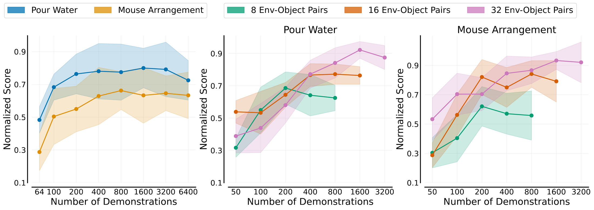

## 1.3 加什么数据最有用：跨本体数据的正迁移

第二个证据更有冲击力，来自 **Open X-Embodiment（OXE）** 这项联合多家机构的工作：把二十多种不同机器人、几百种技能的数据汇聚成一个大池子，用同一个模型（RT-X 系列）一起训，会发生什么？下面两张图都出自该工作。

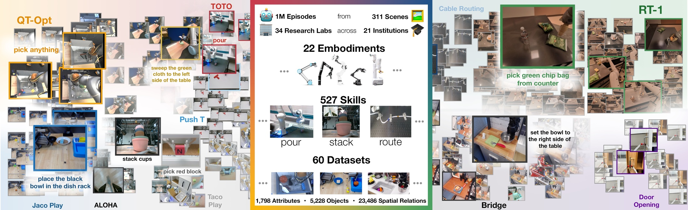

OXE 在它那 22 种本体、RT-X 那套设置下报告的结果是**总体正迁移**：一个机器人能从其它机器人的经验里获益。在同样的网络结构下，用这个混合大池子训练，比只用单机自己的数据训练，成功率有明显抬升；更大容量的模型甚至能在分布外技能上把泛化能力提升约三倍，并涌现出原本训练集里根本没有的新行为。

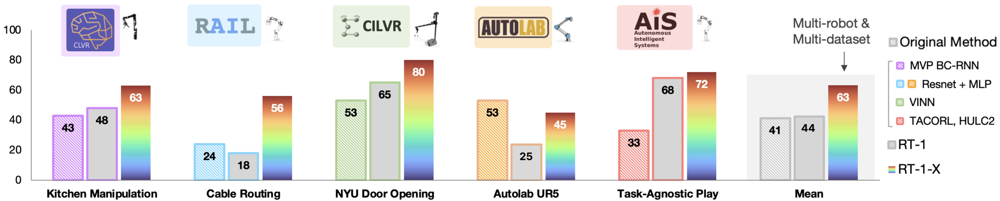

这张图是本节最值得记住的一张：**在合适的模型与配比下，加更多、更杂的数据能把能力上限往上顶**。它把"数据决定上限"从一句口号变成了可量化的对照实验。但"总体正迁移"不等于"任意混任意数据都受益"：跨本体的收益取决于模型容量、动作表示、各数据源的采样权重和你关心的目标域——容量不够或配比失衡时，负迁移是真实存在的。所以混数据之后不能只看一个总平均分，要**把每个数据来源（每个"域"）的成绩分开报**——本体 A 的任务、本体 B 的任务、仿真的、真机的，各自算各自的成功率，再摆在一起看。总分涨了、某一个域却掉了，是混数据最常见的翻车方式；只报总分会把它盖住。

## 1.4 好坏怎么界定：质量比数量更关键

数据不是越多越好，**质量**同样决定上限。一项对六种离线学习算法、八个任务的系统消融发现：策略性能强烈依赖示教的质量；当数据由多人采集、质量参差不齐时，同一个算法的成功率会明显下降。也就是说，算法选择固然重要，但喂进去的数据干不干净，往往是更靠前的决定因素。

| 数据情形 | 现象 | 启示 |
|---|---|---|
| 单一熟练操作者、动作干净 | 同一算法成功率高 | 质量先于数量 |
| 多人混采、质量参差 | 同一算法成功率明显下降 | 采集要控质量、要会筛 |
| 盲目加量但不控质量 | 收益递减甚至变差 | "采得多"不等于"采得好" |

正因为如此，近年出现了把"质量"做成可度量、可筛选的方法：用影响函数去估计单条示教对策略闭环表现的因果贡献，再据此挑出真正有用的数据、剔除拖后腿的轨迹。这把"好数据"从一种感觉，变成了可以打分排序的工程量。

## 1.5 多样性的"轴"：往哪个方向多样，就往哪个方向泛化

既然多样性比数量更重要，那"多样"又该往哪些方向铺？两份大规模真实数据集给了很直接的答案。

第一份是 **DROID**——一份跨七万多条轨迹、五百多个场景、几十个真实地点采了一年的数据集（下图出自该工作）。

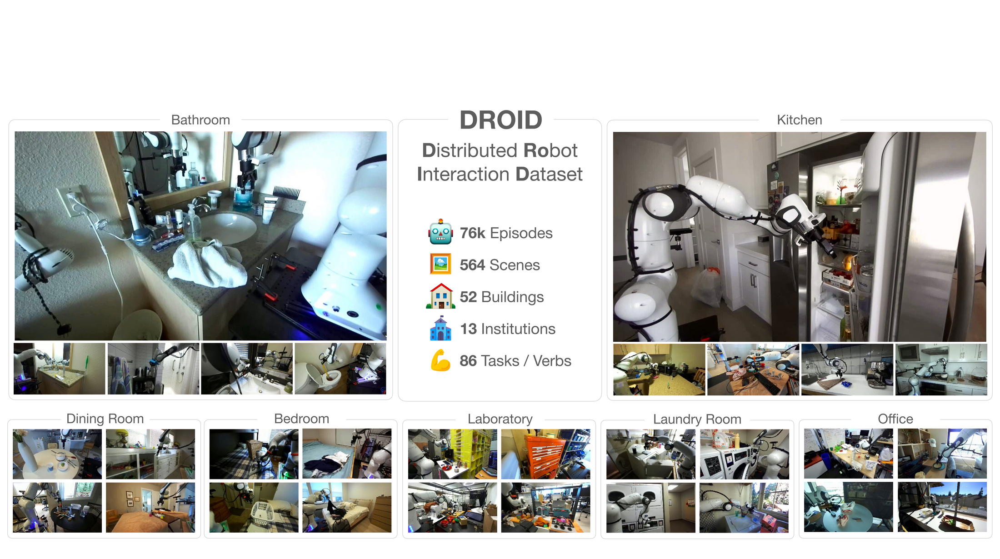

它显示：不同的多样性轴各自驱动**不同方向**的泛化——场景多样带来换场景的泛化，视角多样带来换相机的泛化，物体与任务多样带来换物体、换指令的泛化。这意味着采数据前要先想清楚"我要它在什么维度上泛化"，再决定在哪个轴上铺开。

第二份是 **BridgeData V2**——一份在低成本机器人上采集的大规模多任务、多环境数据集（下图出自该工作）。

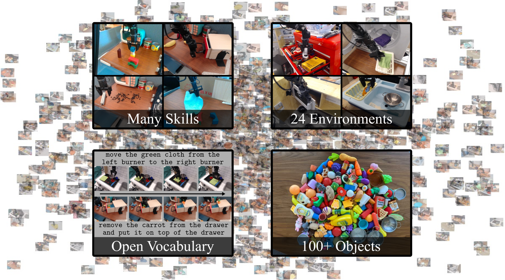

它印证了同一点：足够宽的任务与环境覆盖，能让学到的技能跨环境、甚至跨实验室迁移。

需要留一句边界：以上都是**在这些论文覆盖的任务、物体类别与采集协议范围内**观察到的经验趋势，不是保证。跨实验室还要受硬件型号、相机配置、控制接口和操作员习惯的影响；一旦超出原本的本体、任务或传感器分布，多样性带来的泛化就得重新验证，不能直接外推。

## 1.6 小结：数据决定上限

把这一节收一下，"数据决定上限"不是口号，而是一串互相印证的证据：

| 证据 | 一句话结论 |
|---|---|
| 数据规模律 | 加数据，泛化大致按幂律上升 |
| 跨本体正迁移 | 加更杂的数据，能力直接抬升、涌现新技能 |
| 质量消融 | 同一算法，好数据远胜坏数据 |
| 多样性轴 | 在覆盖范围内，往哪个方向多样，就往哪个方向泛化 |

当然，数据也不是万能钥匙——光有数据和大模型仍不够，怎么把海量无结构的人类行为高效转成机器人能用的监督信号，本身就是一个开放问题。但这恰恰把话题自然带到下一节：既然好数据这么关键，**到底怎么把它采出来**。

# 2 遥操作采集方法概述

要采到能训练的操作数据，核心动作是**遥操作**：让人去"驱动"机器人完成任务，同时把每一帧的观测和动作记录下来。问题是，"让人驱动机器人"有非常多种做法，成本、便携性、数据质量各不相同。这一节先把它们铺成一张分类地图。

## 2.1 一张分类地图：四大类与一条权衡轴

按"机器人和人体在数据回路里占多少"，可以把采集方法从重到轻分成四大类：真机数据、人类代理数据、通用接口遥操作、无机器人数据。

一条权衡贯穿整张地图：

| 大类 | 机器人是否在回路 | 轨迹可执行性 | 便携 / 可规模化 | 是否需重定向或后处理 | 典型代表 |
|---|---|---|---|---|---|
| 真机数据 | 在回路 | 高，物理可行 | 低 | 否 | 主从臂、原机示教 |
| 人类代理数据 | 不在回路，人戴或持设备 | 中 | 高 | 是 | 手持夹爪、数据手套 |
| 通用接口遥操作 | 在回路，靠接口驱动 | 中高 | 中 | 部分 | 手柄、VR/AR |
| 无机器人数据 | 完全不在回路 | 低，需转化 | 极高 | 是，强转化 | 第一视角视频、世界模型生成 |

简单说：**机器人越在回路里，采到的轨迹越能直接执行，但越贵越不便携；机器人越不在回路，采集越轻便越能规模化，但越需要后处理或重定向才能变成机器人能用的动作**。下面逐类展开。

## 2.2 真机数据：机器人在回路

### 2.2.1 原机示教

最直接的做法是人手把手地拖动真机或灵巧手完成任务，让传感器把轨迹记录下来。它的天然优势是采集时就带上了真实的接触与触觉信息。下图来自 **KineDex** 这项工作。

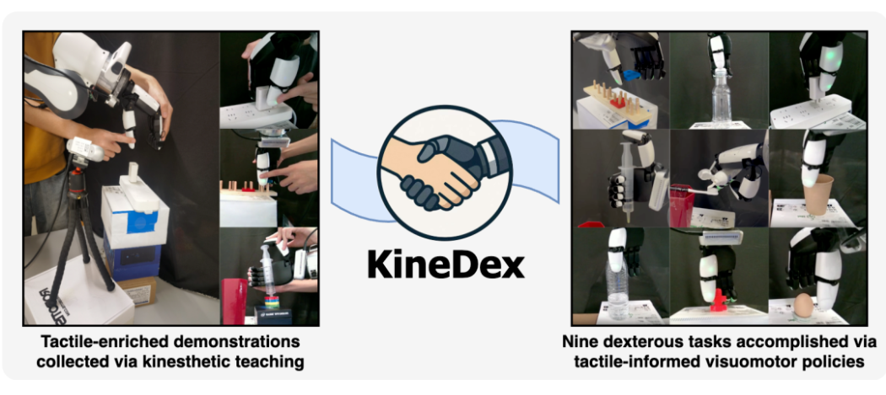

面向柔顺的软体手时，这种拖动示教更显自然，柔顺性本身反而成了示教的便利——下图来自 **KineSoft**。

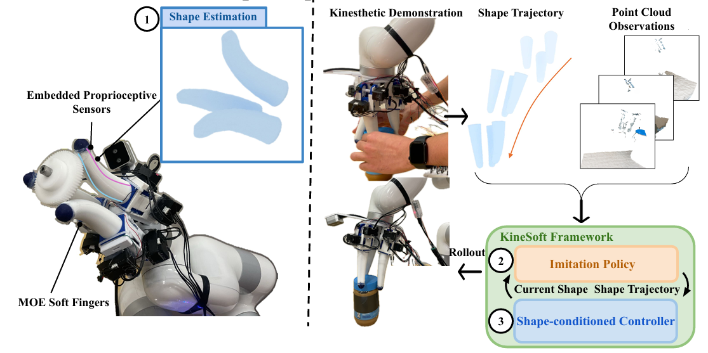

### 2.2.2 主从臂（同构）

更常见的是主从臂：操作者驱动一只"主臂"，机器人"从臂"实时跟随。当主臂与从臂机械结构相同（同构）时，关节映射变得很简单——省掉了跨本体重定向那一层，采到的轨迹落在从臂自己的可达空间里，对模仿学习最友好。但"结构相同"不等于"数值可以直接搬"：关节顺序、正方向、零位、量程、减速比、限位、安装姿态都得先对齐，标定没做准，映射就是错的；从臂还有跟踪误差、碰撞和接触约束，主臂摆到的姿态它未必真到得了。下面两张分别是松灵 **PIKA** 方案与本课实物实验要用的低成本代表 **SO-101**。

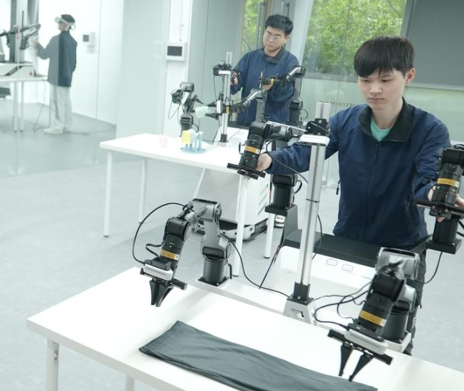

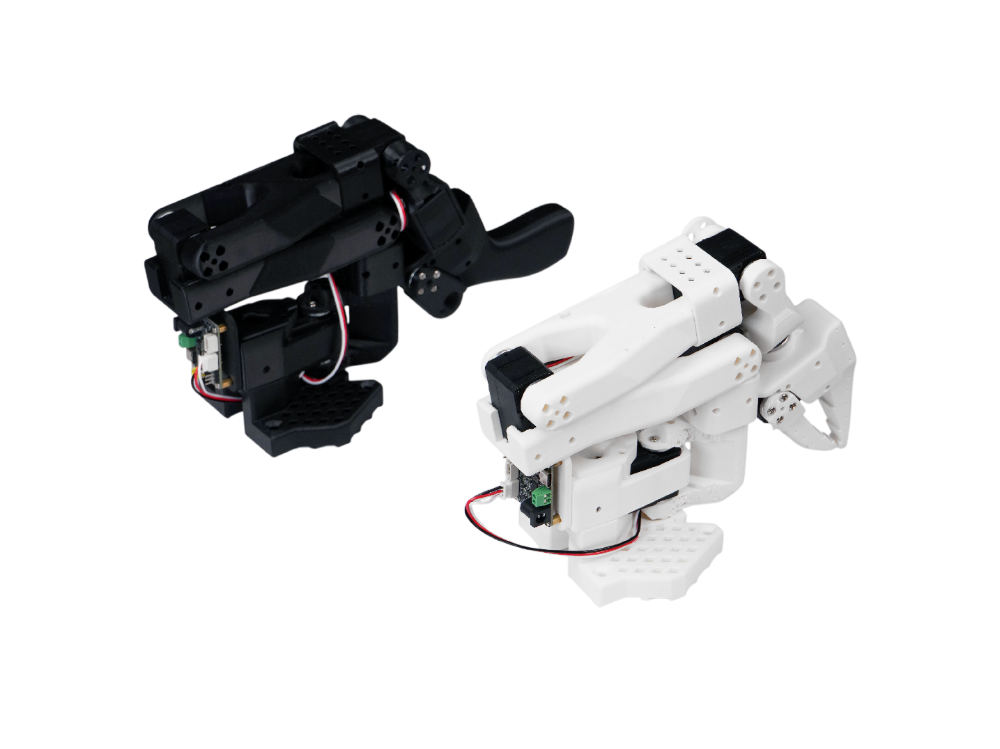

把主从臂装上移动底座，就能采"边走边操作"的全身数据；这一路线（**Mobile ALOHA**）只用几十条示教就能学会相当长的家务任务，下图即出自该工作。

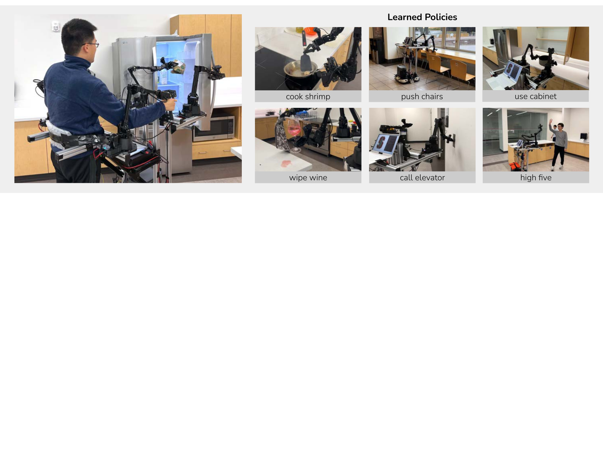

主从跟随还有一个容易被忽略的约定：从臂**怎么**跟随主臂。一种是**绝对跟踪**——从臂直接去主臂当前的绝对姿态，主臂摆成什么姿势、从臂就到达同一个姿势，跟从臂开机时停在哪无关，前提是主从标定的零点对齐。另一种是**相对（锚定）跟踪**——接通的第一帧记下"从臂当前姿态减主臂姿态"这个差，之后每帧的从臂目标就是"主臂姿态加上这个差"，相当于从臂从自己此刻的位置出发，复现主臂的**位移**。

两种口径都能用，锚定跟踪本身不是错——它不要求零点严格对齐、接通瞬间从臂也不会突然跳过去，用起来省事。真正会出问题的是**口径没被固定、偏置没被记下来**：锚定量每次开机都不同，如果不存下来，同一份数据集里不同 episode 的动作标签其实对应着不同的偏置，训练出的模型部署时就容易和环境"说的不是同一种话"（上一讲 3.3 的口径坑）。所以规矩是：口径（absolute 还是 anchored）写死在采集配置里、标定与锚点一起存进数据集、训练端和部署端用同一套解释。

还有一个概念要分清：**主臂读数、下发给从臂的目标，都是"命令"（动作标签）；从臂真实到达的姿态得从它自己的编码器读**。跟踪误差、负载、接触都会让两者不等。所以采集时最好三样分开记：`leader command`（主臂读数）、`follower target`（下发目标）、`follower measured state`（从臂实测状态）。把命令当成实际轨迹，是数据侧一个很隐蔽的错。

### 2.2.3 主从臂（异构）

如果主臂和从臂结构不同（异构），就不能直接映射，需要标定、滤波、插值这一串处理把主臂指令对齐到目标机械臂。它的价值在于通用——一套低成本主端可以适配各种商用机械臂，下图来自 **U-Arm** 这套超低成本通用遥操接口。

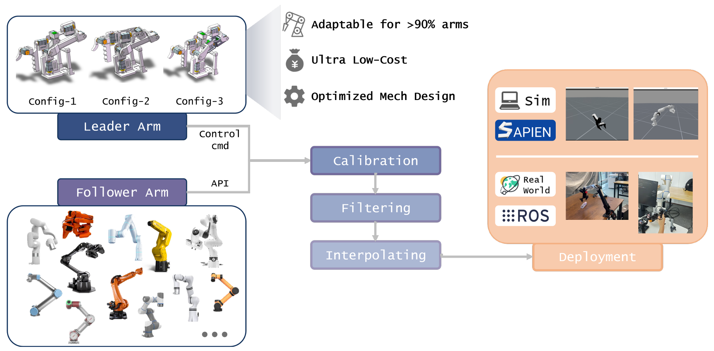

### 2.2.4 移动操作整机遥操

当目标是一台带底盘、带双臂的移动操作整机时，往往需要一个能统一多种输入的遥操作接口，把相机、VR、键鼠、手柄等任意组合起来同时驱动底盘和手臂。下图来自模块化遥操系统 **TeleMoMa**。

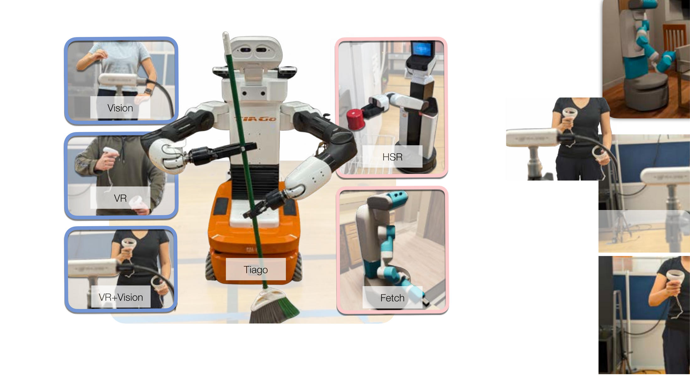

## 2.3 人类代理数据：人戴或持设备

这一类不让机器人进回路，而是让人戴上或拿起一个"代理设备"去做任务，事后再把人的动作重定向到机器人。好处是轻、快、能在真实场景里大规模采，代价是采到的轨迹可能撞上机器人的运动学奇异、超出工作空间或精度不足，需要后处理。

### 2.3.1 末端执行器代理（手持）

最典型的是 **UMI**——手持一个夹爪加广角相机，直接记录末端执行器的运动轨迹，整套装置与机器人解耦、可以带到任何场景里采，下图出自该工作。

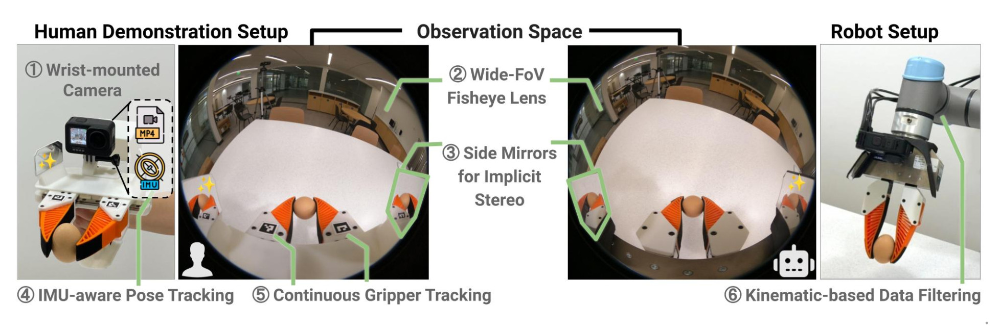

把其中复杂的视觉惯性里程计换成现成的跟踪模块，可以在保住精度的同时大幅降低部署复杂度——这是 **FastUMI** 的思路。

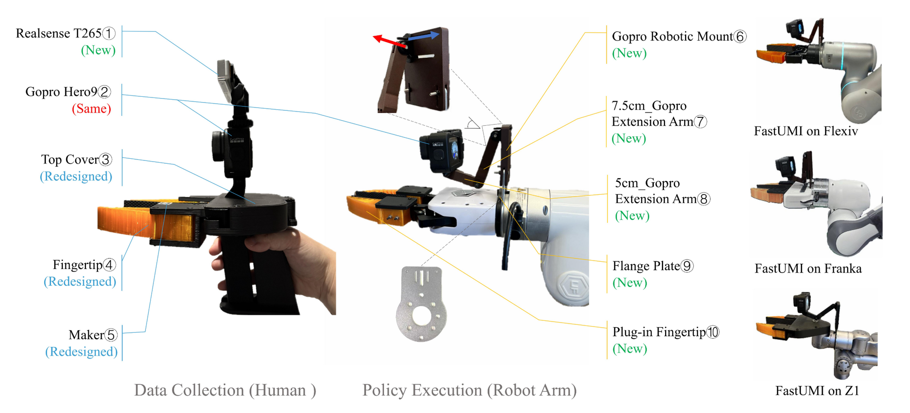

视觉式的方案还能进一步做到跨机械臂、跨灵巧手、跨相机配置的通用遥操，下图来自 **AnyTeleop**。

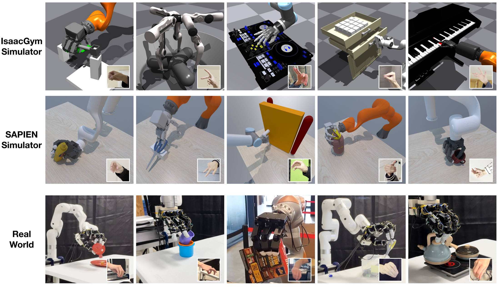

### 2.3.2 增强现实反馈采集

手持代理的一个痛点是：人采得很顺，机器人却未必执行得了。一个改进思路（**ARCap**）是在采集时给操作者叠加实时的增强现实提示——把机器人的可达范围、工作空间、虚拟手臂预览实时显示出来，引导人把示教约束在机器人能执行的范围内，从源头提高数据可用率，下图出自该工作。

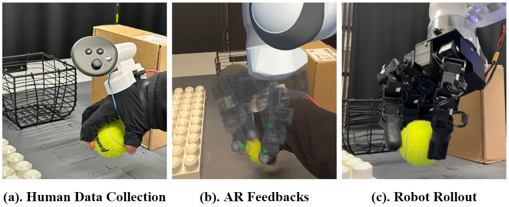

### 2.3.3 穿戴设备代理

把代理设备做成可穿戴的数据手套、外骨骼或背负式装置，就能在采动作的同时采到力与触觉反馈。下面两张分别来自低成本开源数据手套 **DOGlove** 与背负式人形双臂遥操设备 **U-Arm Humanoid**。

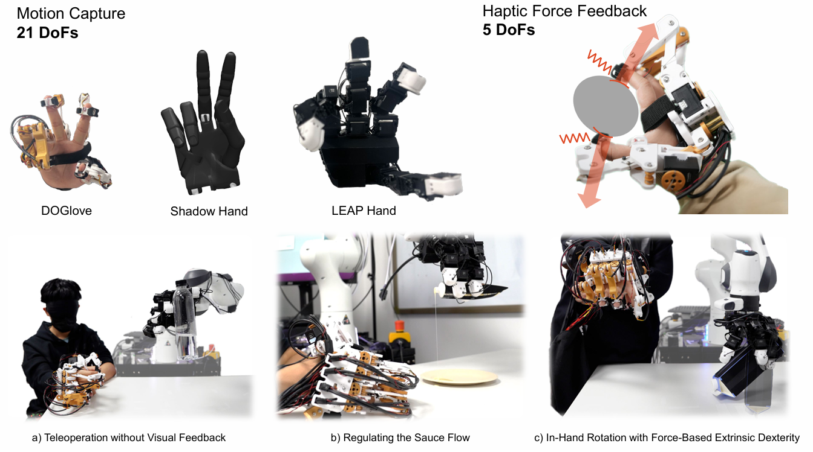

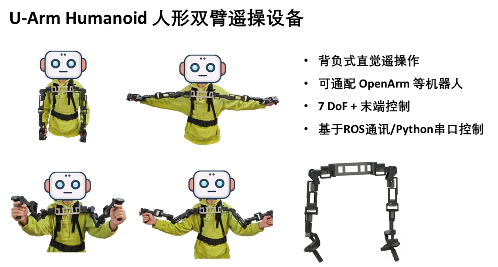

更进一步，让人形机器人实时"影随"人的全身动作，就能在做任务的同时把全身的示教数据录下来——这是 **HumanPlus** 的做法，下图出自该工作。

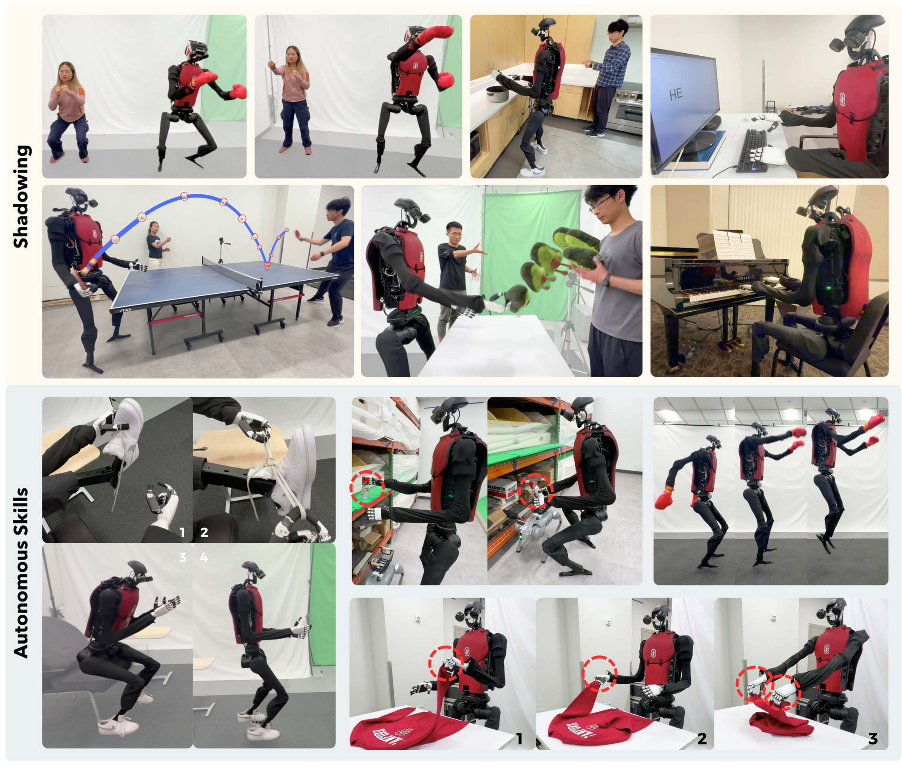

## 2.4 通用接口遥操作

这一类直接复用现成的、人人都有的输入设备来驱动机器人，门槛极低、易规模化。

### 2.4.1 手柄

最朴素的是用通用游戏手柄驱动机器人采集，下图来自开源项目 **joycon-robotics**（用任天堂 Joy-Con 手柄遥操）。

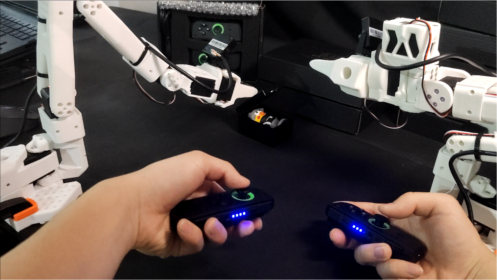

### 2.4.2 手机众包

**RoboTurk** 把手机当成六自由度的控制器，再放到云端做众包，远端工人无需培训就能登录网页采集，单个项目就曾众包出上百小时的数据——这说明**接口越通用，越能把采集规模化**。下图出自该工作。

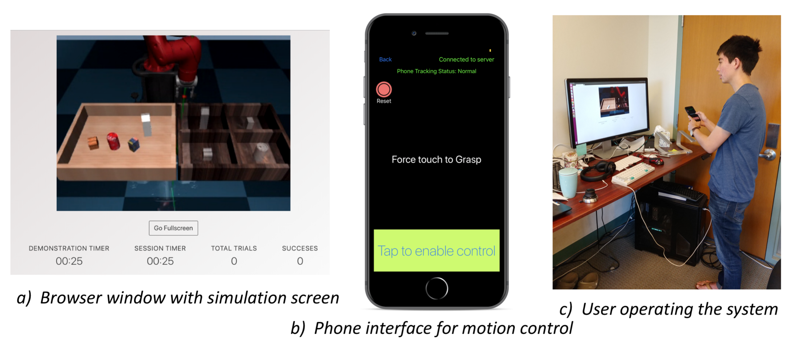

### 2.4.3 虚拟现实与增强现实

戴上头显做沉浸式遥操，可以同时获得立体视觉反馈和手臂、手部的动作映射，操作者像"附身"在机器人上——下图来自 **Open-TeleVision**。

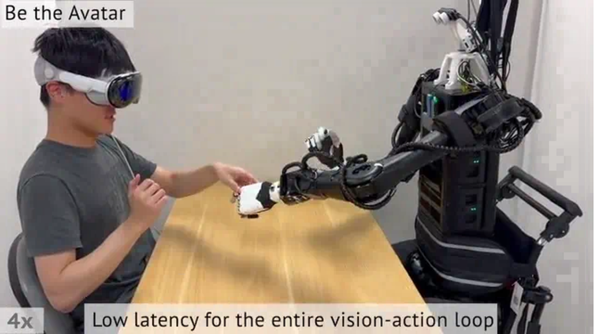

基于通用消费级头显的方案（**OpenTeach**），可以用自然手势驱动机器人，并在很多任务上验证。

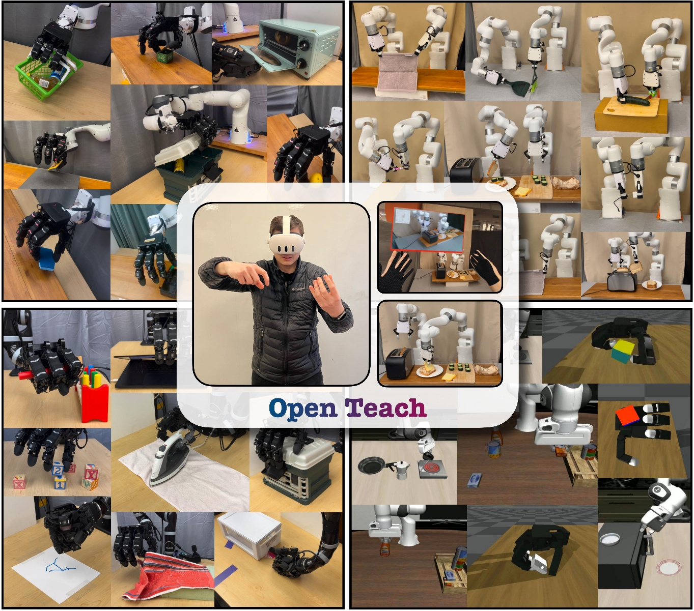

借助高端头显，还能做到实时的双臂灵巧遥操，下图来自 **Bunny-VisionPro**。

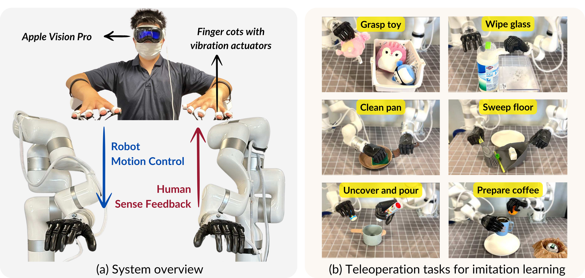

## 2.5 无机器人数据

最轻的一类连人体代理硬件都不必绑定机器人，直接采人做日常操作的数据，再想办法转成机器人能用的监督。它的可规模化程度最高，但"转化"这一步也最重。

### 2.5.1 第一视角人类操作数据

**In-N-On** 用智能眼镜或头显直接采人做日常操作的第一视角视频，把数据分成"野外随手采"和"贴着目标任务采"两类，先用海量野外数据预训练、再用少量贴任务数据微调，下图出自该工作。

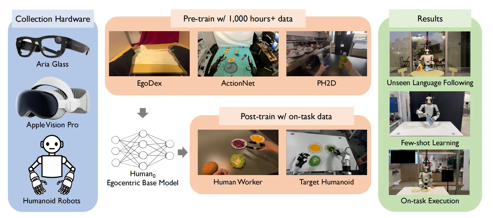

### 2.5.2 世界模型生成数据

更激进的一步（**Ctrl-World**）是让世界模型在策略的闭环里 rollout，直接合成轨迹来扩充数据，用生成的数据进一步提升策略表现，下图出自该工作。

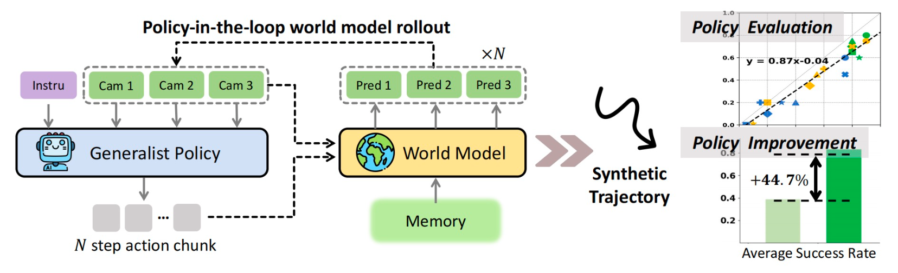

## 2.6 方法对比与落到本课

把四大类里的代表方法放在一张表里横向看，就能按手上的预算、场地、是否需要力触觉来选型：

| 方法 | 所属大类 | 机器人在回路 | 力 / 触觉 | 成本 | 便携 |
|---|---|---|---|---|---|
| 原机示教 | 真机 | 是 | 有 | 中 | 低 |
| 主从臂（同构） | 真机 | 是 | 多无 | 低到中 | 低 |
| 主从臂（异构） | 真机 | 是 | 无 | 低 | 低 |
| 移动整机遥操 | 真机 | 是 | 无 | 中 | 中 |
| 手持末端代理 | 人类代理 | 否 | 多无 | 低 | 高 |
| 增强现实反馈采集 | 人类代理 | 否 | 视觉提示 | 低 | 高 |
| 穿戴代理 | 人类代理 | 否 | 有 | 中 | 中 |
| 手柄 | 通用接口 | 是 | 无 | 极低 | 高 |
| 手机众包 | 通用接口 | 是 | 无 | 极低 | 高 |
| 头显遥操 | 通用接口 | 是 | 部分 | 中 | 中 |
| 第一视角 | 无机器人 | 否 | 无 | 低 | 极高 |
| 世界模型生成 | 无机器人 | 否 | 无 | 算力 | 高 |

落到本课：实物实验用 SO-101 主从臂（真机、同构），它是这张地图里成本最低的入口；没有真机时，就用 SO-101 仿真器配手柄或键盘（对应通用接口那一类），落成同一种容器格式的数据。仿真里还有一条**完全不靠人遥操**的路：让一个视觉强化学习策略在仿真里从零学会任务、自动跑出成功轨迹充当训练数据——本课后面用来微调 VLA 的那批 SO-101 仿真数据，正是这么来的，第16讲会把这套"视觉 RL 生成数据"的做法从头讲透。但在动手采之前，得先认清一件事：不管用哪种方法，采到的数据最终都要以**同一种标准格式**落盘、被训练代码直接读。下一节就把承载这一切的 **LeRobot 框架与数据集格式**讲清楚，再回头动手采。

# 3 LeRobot 框架与数据集

上一节铺完了各种采集方法。但不管用哪种方法，采到的数据最终都要以**同一种标准格式**落盘、被训练代码直接读——否则每换一种机器人、每换一种算法都要重写一遍工具链。这套把数采、数据、训练串起来的框架，就是 HuggingFace 推出的 **LeRobot**。这一节先认清它，下一节再动手采。

## 3.1 LeRobot 是什么：一条端到端的闭环

LeRobot 是 HuggingFace 推出的**端到端具身智能开源框架**（Apache-2.0 许可、PyTorch 实现），目标是降低机器人学习的门槛。它把从硬件接口、数据采集、数据格式、策略训练到推理部署的整条栈，串成一个**闭环**：

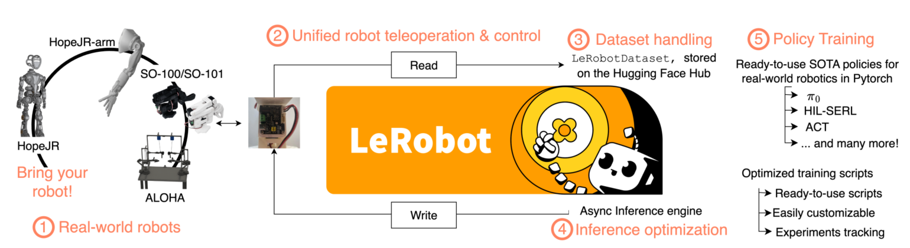{width=98%}

顺着图上的五块走一圈：**Real-world robots**（带上你自己的机器人，SO-100/SO-101、ALOHA、HopeJR……）→ **Unified teleoperation & control**（用统一接口遥操作驱动它）→ **Dataset handling**（把过程录成 LeRobotDataset 并存到 HuggingFace Hub）→ **Policy training**（用 Hub 上现成的 SOTA 策略训练 / 微调）→ **Inference optimization**（经异步推理引擎部署回机器人）。本讲走的就是中间「采集 → 数据集」这一段，下一讲接「策略训练」。

把这个闭环落到代码里，LeRobot 是一套**自上而下的分层架构**——每一层只管自己的事，上层调用下层的抽象，所以换机器人只动底层、换算法只动策略层：

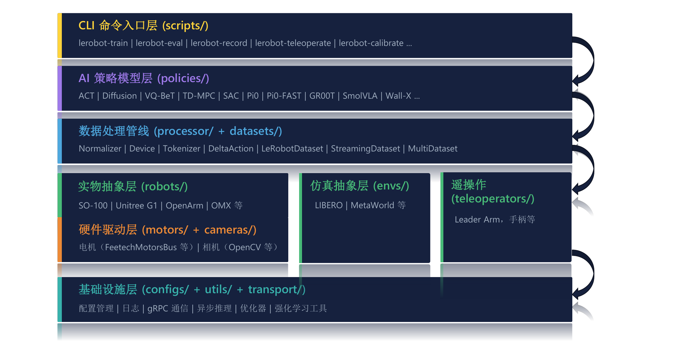{width=98%}

从上往下看：**CLI 命令入口层（scripts/）** 提供 `lerobot-record`/`lerobot-train` 等命令，**AI 策略模型层（policies/）** 放 ACT / Diffusion / $\pi_0$ / SmolVLA 等算法，**数据处理管线（processor/ + datasets/）** 管统一数据格式，**实物抽象层（robots/）** 与**仿真抽象层（envs/）** 分别接真机（SO-100、Unitree G1……）和仿真（LIBERO、MetaWorld……），**遥操作器（teleoperators/）** 提供主臂 / 手柄等输入，最底下是**基础设施层（configs/ + utils/ + transport/）**。换机器人只动 `robots/`、换算法只动 `policies/`，彼此不牵连。

## 3.2 数据采集落在哪一层

在这套分层里，与「采数据」直接相关的只有两层——把它们在同一张图上用红框高亮出来：

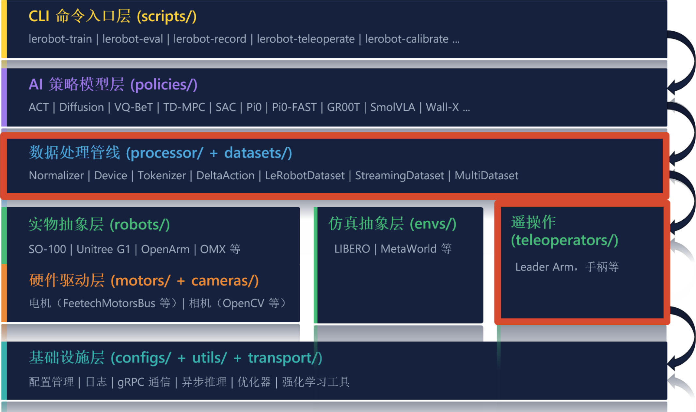{width=98%}

红框圈出的两块就是本讲焦点：**数据处理层（datasets/）** 负责把采到的东西落成统一格式，**遥操作器（teleoperators/）** 负责驱动机器人产生动作。我们用 **CLI 入口层**的 `lerobot-record` 采数据（第 4 节），它向下调用**实物抽象层**的 SO-101（机器人本体）和**遥操作器**的主臂；采出来的，就是**数据处理层**里的一份 LeRobotDataset。下面先把这个格式认全。

## 3.3 LeRobotDataset：采集到训练的统一格式

LeRobotDataset 是 HuggingFace 为机器人学习设计的**统一数据格式**，专门存储和共享多模态时序数据（传感器信号 + 多相机视频）。它有三条核心设计：**存储与 API 解耦**（底层是少量大文件、上层提供直观的 episode 级访问）、**Hub 原生**（直接在 HuggingFace Hub 上托管、搜索、可视化）、**流式支持**（无需下载即可消费数据）。

> 备注（版本口径）：本节及后文的目录结构、`meta/` 字段、类名与源码文件位置，都基于 **LeRobot >= 0.4.0、LeRobotDataset v3.0，核验日期 2026-07-21**。LeRobot 是一个迭代很快的库，目录布局、CLI 参数名和源码文件名都可能随版本变动。照着跑之前先确认自己装的版本；对不上时以官方文档与当前源码为准。

先记住一个最小单位——**episode（回合）**：就是机器人把某个任务从头到尾做一遍的完整记录，从初始状态开始、到任务结束为止，期间每一帧的图像、关节状态、动作都按时间顺序记下来。一个数据集，就是许许多多 episode 的集合（行为克隆里常见 50~100 个起步）。

落到磁盘上，LeRobotDataset 把一份采集拆成**三大支柱**分开存：**低维数据进 Parquet 表格、相机画面进 MP4 视频、说明书进 meta**。

```{=latex}
\dirtree{%
.1 \texttt{<dataset>/} {\color{TreeNoteColor}（一份采集，HF 缓存目录下）}.
.2 \texttt{data/} {\color{TreeNoteColor}（表格：状态 / 动作 / 时间戳 / 索引，列式 parquet）}.
.3 \texttt{chunk-000/}.
.4 \texttt{file-000.parquet} {\color{TreeNoteColor}（多个 episode 的行合并到同一文件）}.
.2 \texttt{videos/} {\color{TreeNoteColor}（视频：每路相机一个子目录）}.
.3 \texttt{observation.images.front/} {\color{TreeNoteColor}（前视相机）}.
.4 \texttt{chunk-000/file-000.mp4} {\color{TreeNoteColor}（多个 episode 的帧合并到同一视频）}.
.3 \texttt{observation.images.side/} {\color{TreeNoteColor}（侧视相机）}.
.2 \texttt{meta/} {\color{TreeNoteColor}（数据集说明书）}.
.3 \texttt{info.json} {\color{TreeNoteColor}（schema：字段、维度、帧率、路径模板）}.
.3 \texttt{stats.json} {\color{TreeNoteColor}（全局统计 mean/std/min/max，训练归一化）}.
.3 \texttt{tasks.parquet} {\color{TreeNoteColor}（任务描述到整数 ID 的映射）}.
.3 \texttt{episodes/} {\color{TreeNoteColor}（每 episode 的长度、任务、文件偏移量）}.
}
```

三大支柱各管一摊：

| 支柱 | 存什么 | 怎么存 |
|---|---|---|
| 表格 `data/` | 低维、高频信号：关节状态、动作、时间戳、各种索引 | 列式 Apache Parquet，多 episode 行级拼接到大文件，支持内存映射与流式读取 |
| 视频 `videos/` | 相机画面这类高维数据 | 每路相机编码成 MP4（默认 AV1 高压缩，可选 H.264/H.265），多 episode 帧拼接 |
| 元数据 `meta/` | 整份数据集的结构与口径 | `info.json`（schema）+ `stats.json`（归一化统计）+ `tasks.parquet`（任务表）+ `episodes/`（每条边界） |

> 备注：新版（v3.0）把许多 episode 的行**合并**进同一个 `file-000.parquet`、帧合并进同一个 `file-000.mp4`，某条 episode 的边界靠 `meta/episodes/` 里记录的偏移量定位。这样做是为了减少文件数、降低文件系统压力、让 Hub 大文件下载更高效。**这套结构与采集方式无关**——不管是 SO-101 真机遥操还是仿真器键盘采，最后都长成这个样子。

这种"把许多 episode 合并进大文件"的组织方式，正是 v3.0 相比老版 v2.0 最关键的改动。两版差别一表看清：

| 特性 | v2.0 | v3.0（本课所用） |
|---|---|---|
| 文件组织 | 每个 episode 一个文件 | 多个 episode 合并到大文件 |
| 文件命名 | `episode-0000.parquet` | `file-000.parquet` |
| episode 边界 | 直接靠文件名区分 | 靠 `meta/episodes/` 里的偏移量定位 |
| 流式读取 | 不支持 | 支持 `StreamingLeRobotDataset` |
| 文件系统压力 | 高（大量小文件） | 低（少量大文件） |
| Hub 流式下载 | 不支持 | 原生支持 |

## 3.4 打开一个真实的公开数据集：lerobot/libero

上面把格式讲抽象了，不如直接打开一个别人已经传到 HuggingFace 上的真实数据集，对着实物看一遍。这里用官方的 **lerobot/libero**——由 Franka Panda 机械臂在 LIBERO 仿真环境里采集的一份标准数据集：

| 属性 | 值 |
|---|---|
| 格式版本 | v3.0 |
| 机器人 | Franka Panda |
| 总 episodes | 1693 |
| 总帧数 | 273,465 |
| 任务数 | 40（来自 LIBERO 四个套件：空间 / 物体 / 目标 / 长程各 10 个） |
| FPS | 10 |
| 相机数 | 2（前视角 + 腕部视角） |
| 图像分辨率 | 256×256 |
| 状态 / 动作维度 | 8（7 关节 + 夹爪）/ 7（6 DOF + 夹爪） |
| 总大小 | 1.94 GB |

下面不止"读属性表"，而是顺着它在 HuggingFace 上的页面 <https://huggingface.co/datasets/lerobot/libero>，从**页面 → 生态 → 物理文件 → 逐行数据**四个角度把它看穿。

### 3.4.1 HuggingFace 页面：四个 tab，四种看法

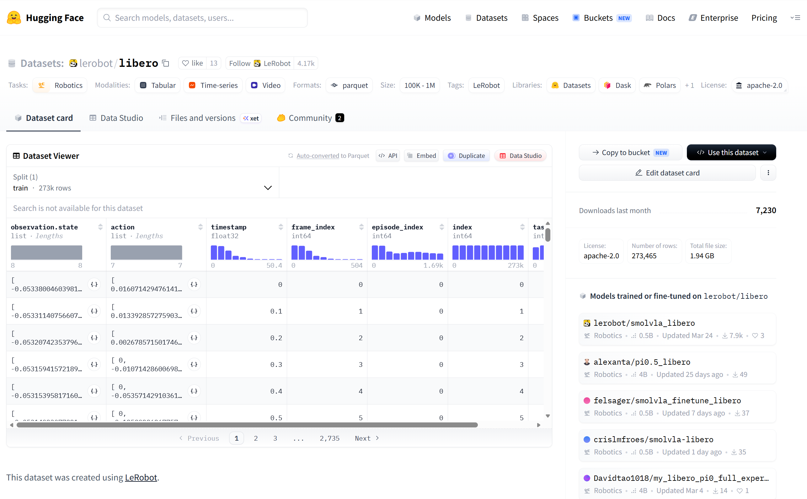{width=98%}

打开一个 HF 数据集页面，顶部四个 tab 正好对应四种看法：

- **Dataset card**：概览页（标签、统计、自动生成的数据卡、谁在用它）。
- **Data Studio**：内置表格浏览器，**无需下载**就能逐行翻看 parquet（这里 273k 行分 2,735 页）。
- **Files and versions**：物理文件树 + git 式版本历史（见 3.4.3）。
- **Community**：讨论区。

顶部那排**标签**本身就是一张"身份证"：

| 标签 | 含义 |
|---|---|
| `Robotics` | 任务领域 |
| `Tabular` · `Time-series` · `Video` | 三种模态：表格（状态 / 动作）+ 时序 + 视频 |
| `parquet` | 底层存储格式 |
| `100K - 1M` | 行数量级（这里 27 万行） |
| `Dask` · `Polars` | 可直接用这些库流式查询 |
| `apache-2.0` | 许可证 |

右侧关键数字：**273,465 行 · 1.94 GB · 月下载约 7,230**——一个被大量真实使用的小型标准数据集。

### 3.4.2 谁在用它：数据集 → 模型的生态闭环

Dataset card 右侧的 **"Models trained or fine-tuned on lerobot/libero"** 列出了一串模型：`lerobot/smolvla_libero`、`alexanta/pi0.5_libero`、`felsager/smolvla_finetune_libero`、`crislmfroes/smolvla_libero`……

这正好呼应 3.1 那张闭环图：**同一份数据集，喂给 SmolVLA、$\pi_{0.5}$ 等不同策略，就训出 / 微调出一批模型**。数据在下游沉淀为能力——这就是第 1 节"数据决定上限"最直观的体现。

### 3.4.3 物理视角：Files and versions

切到 Files 这个 tab，看到的是**磁盘上真实的样子**，正好印证 3.3 的目录结构：

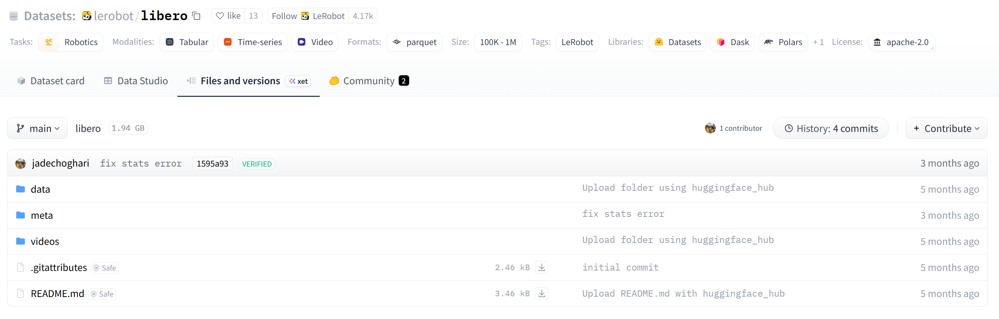{width=98%}

```{=latex}
\dirtree{%
.1 \texttt{libero/} {\color{TreeNoteColor}（1.94 GB，main 分支）}.
.2 \texttt{data/} {\color{TreeNoteColor}（表格数据 parquet）}.
.2 \texttt{meta/} {\color{TreeNoteColor}（元数据 info.json / stats / tasks / episodes）}.
.2 \texttt{videos/} {\color{TreeNoteColor}（多相机视频 mp4）}.
.2 \texttt{.gitattributes}.
.2 \texttt{README.md}.
}
```

三个顶层目录 `data/ meta/ videos/` 就是三大支柱的物理落地。HF 数据集本质是一个**带版本管理的 git 仓库**：页面记录了完整的 commit 历史（如 `fix stats error`），可以像代码一样回溯、追踪每一次改动。

### 3.4.4 逻辑视角：Data Studio 逐行看数据

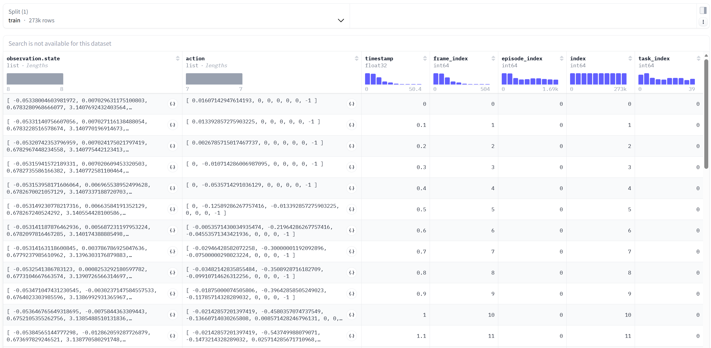{width=98%}

Data Studio 把 parquet 一行一行摊开，每一行 = 某个 episode 在某一时刻的一帧，重点看这几列：

- **`observation.state`**：长度 8 的浮点数组——机器人**自身的本体感知**（关节角度 + 夹爪），即"机器人感受到的身体状态"。
- **`action`**：长度 7 的浮点数组——该时刻**要下发执行的目标动作**；策略要学的，就是"看到 state + 图像 → 输出 action"。
- **三个 index 列的相对 vs 绝对语义**（看直方图分布最直观）：

| 列 | 语义 | 取值范围 |
|---|---|---|
| `frame_index` | **相对**：episode 内第几帧，每个 episode 从 0 重置 | 0 → ~504 |
| `episode_index` | 第几个 episode | 0 → 1,692 |
| `index` | **绝对**：全局第几帧，跨 episode 一直累积 | 0 → 273,464 |
| `task_index` | 第几个任务（40 个之一） | 0 → 39 |

> 备注：`action` 与 `state` 的来源随**采集方式**而不同——本课的 SO-101 是**真机遥操作**，`action` 来自**主臂（leader）**、`state` 来自**从臂（follower）**，action 背后其实是人的操作意图；而 lerobot/libero 是**仿真**采集（Franka Panda in LIBERO），没有人手主臂，`action` 是策略 / 脚本下发的目标动作。采集方式不同，落盘格式却完全一样——这正是统一格式的价值。

认清了一份真实公开数据集长什么样，下面回到本课自己的 SO-101 采集，把一帧、一份说明书逐字段看穿。

## 3.5 一帧数据里有什么

把数据集里的一个样本（一帧）展开，返回的就是一个 Python 字典（值为 PyTorch 张量），这正是第8讲讲过的"观测 → 动作"配对，只是现在有了具体字段和形状。以本课 SO-101 双相机采集为例：

```python
sample = dataset[100]
# {
#   'observation.images.front': tensor([3, 480, 640]),  # 前视相机，CHW
#   'observation.images.side':  tensor([3, 480, 640]),  # 侧视相机
#   'observation.state':        tensor([6]),            # 本体感知：6 个关节读数
#   'action':                   tensor([6]),            # 动作：6 个关节目标（含夹爪）
#   'timestamp':                tensor(3.3),            # 秒
#   'frame_index':              tensor(99),             # episode 内帧索引
#   'episode_index':            tensor(0),              # 第几个 episode
#   'index':                    tensor(100),            # 全局帧索引（跨 episode 累积）
#   'task_index':               tensor(0),              # 第几个任务
#   'task': "Put the cuboid into the basket"            # 自然语言任务描述
# }
```

这里有两个细节值得点破：

> 备注：列里看不到「图像」本身——图像存在 `videos/` 的 mp4 里。取样本时，LeRobotDataset 用这一帧的 `timestamp` 去对应视频里**按时间解码出那一帧**，再和表格数据拼成一个完整样本。
>
> 备注：`frame_index` 是**相对**索引（每个 episode 从 0 重置），`index` 是**绝对**索引（跨 episode 一直累积）；`observation.state` 是机器人**自己的关节读数**（部分可观测的观测，不是环境真实状态），`action` 是该时刻**要下发执行的目标动作**——策略要学的，就是「看到 state + 图像 → 输出 action」。

## 3.6 info.json：数据集的「说明书」

`meta/info.json` 是整份数据集的 schema 真相来源，一份采集的所有口径都写在这里。下面是 SO-101 cuboid 采集的 info.json 骨架（`side` 相机与 `front` 结构相同，省略）：

```json
{
  "codebase_version": "v3.0",
  "robot_type": "so101_follower",
  "total_episodes": 50,
  "total_frames": 45000,
  "total_tasks": 1,
  "fps": 30,
  "data_path":  "data/chunk-{chunk_index:03d}/file-{file_index:03d}.parquet",
  "video_path": "videos/{video_key}/chunk-{chunk_index:03d}/file-{file_index:03d}.mp4",
  "features": {
    "observation.images.front": {
      "dtype": "video",
      "shape": [480, 640, 3],
      "names": ["height", "width", "channel"],
      "info": { "video.codec": "av1", "video.fps": 30, "video.is_depth_map": false }
    },
    "observation.images.side": { "...": "同上（侧视相机）" },
    "observation.state": { "dtype": "float32", "shape": [6], "names": ["state"] },
    "action":            { "dtype": "float32", "shape": [6], "names": ["action"] },
    "timestamp":     { "dtype": "float32", "shape": [1], "names": null },
    "frame_index":   { "dtype": "int64",   "shape": [1], "names": null },
    "episode_index": { "dtype": "int64",   "shape": [1], "names": null },
    "index":         { "dtype": "int64",   "shape": [1], "names": null },
    "task_index":    { "dtype": "int64",   "shape": [1], "names": null }
  }
}
```

逐字段读这份说明书：顶层是**数据集级**口径——`robot_type` 机器人型号、`total_episodes/frames/tasks` 规模、`fps` 采样帧率、`data_path`/`video_path` 是**路径模板**（把 `chunk_index`、`file_index`、`video_key` 填进去就拼出真实文件路径）。`features` 里每个字段声明 `dtype`（`video` 走 mp4 / `float32` / `int64`）、`shape`（维度，图像 `[480,640,3]`、状态 `[6]`、动作 `[6]`）、`names`（每维名字），video 字段还附编码细节（`av1` 编码、`is_depth_map=false` 表示是 RGB 不是深度图）。**读懂 info.json，就读懂了一份数据集的全部口径。**

## 3.7 加载、切时间窗与可视化回看

落盘之后，训练侧主要做三件事，LeRobot 都封装成了简洁的 API。

**一、加载数据集。** 从 Hub 或本地一行加载，可只取部分 episode 省内存，也能不下载直接流式读取：

```python
from lerobot.datasets.lerobot_dataset import LeRobotDataset

dataset = LeRobotDataset("local/cuboid")            # 加载（自动缓存）
print(dataset.meta.total_episodes, dataset.meta.fps)  # 看元信息
dataset = LeRobotDataset("local/cuboid", episodes=[0, 1, 2])  # 只取前 3 个 episode
sample = dataset[100]                               # 随机访问一帧
```

**二、切时间窗（delta_timestamps）。** 很多策略不是只看「当前这一帧」就够：有的要把过去若干帧拼起来看运动趋势，有的要一次输出未来几十帧动作（**action chunk**，如 50 帧 $\approx$ 1.6 s，让灵巧操作更连贯）。`delta_timestamps` 就是取样本时顺带把「相对当前帧的前后若干时刻」一起按时间对齐取出、堆成带时间维的张量：

```python
# 取当前帧及前 0.2s、0.1s 的前视图像（历史上下文）
delta_timestamps = {"observation.images.front": [-0.2, -0.1, 0.0]}
dataset = LeRobotDataset("local/cuboid", delta_timestamps=delta_timestamps)
print(dataset[100]["observation.images.front"].shape)  # [3, 3, 480, 640]，T=3
```

**三、可视化回看。** 把某条 episode 的图像与各维动作、状态曲线逐帧放出来，肉眼检查这条数据采得干不干净——这又回到质量这件事上。两条路：在线用 HuggingFace Spaces 的 `visualize_dataset`（无需下载、浏览器直接看），本地用基于 Rerun 的可视化工具：

```bash
lerobot-dataset-viz --repo-id local/cuboid --episode-index 0
```

Rerun 里能同步看到多相机图像、动作各维曲线、本体状态各维曲线，并支持按帧 / 按时间戳导航。

**四、喂进训练（DataLoader）。** LeRobotDataset 就是标准的 PyTorch `Dataset`，直接套 `DataLoader` 就能批量喂给模型：

```python
import torch

dataloader = torch.utils.data.DataLoader(dataset, batch_size=16, shuffle=True, num_workers=4)
for batch in dataloader:
    states  = batch["observation.state"]          # [B, 6]
    actions = batch["action"]                     # [B, 6]
    images  = batch["observation.images.front"]   # [B, 3, 480, 640]
    # model.forward(batch) ...
```

**五、流式读取（无需下载）。** 数据集很大、本地放不下时，用 `StreamingLeRobotDataset` 直接从 Hub 边下边读，不占本地磁盘：

```python
from lerobot.datasets.streaming_dataset import StreamingLeRobotDataset

dataset = StreamingLeRobotDataset("lerobot/libero")
for sample in dataset:
    print(sample["action"]); break
```

**六、数据增强（可选）。** 训练时常对图像做随机增强（亮度 / 对比度抖动等），LeRobot 内置 `ImageTransforms`，作为 `image_transforms` 传入即可，落盘数据本身不动。

最后给一张"想改源码时去哪找"的速查表，`lerobot/datasets/` 下与本讲相关的关键文件（**与版本相关**，按上文的 0.4.0 / v3.0 口径记录；新版本里文件可能改名或拆分，找不到就直接在源码树里搜类名）：

| 文件 | 作用 |
|---|---|
| `lerobot_dataset.py` | 核心类 `LeRobotDataset` / `LeRobotDatasetMetadata` / `MultiLeRobotDataset` |
| `streaming_dataset.py` | `StreamingLeRobotDataset`（流式读取） |
| `video_utils.py` | 视频编解码（torchcodec / pyav） |
| `transforms.py` | 图像数据增强 |
| `compute_stats.py` | 计算数据集统计（mean/std），写 `stats.json` |
| `factory.py` | `make_dataset()`：从训练配置创建数据集 |
| `lerobot_dataset_viz.py` | 本地可视化（Rerun） |

认全了格式，下一节就回到「采」这件事：用最小的 SO-101 把一条数据采出来，看它怎么长成上面这套结构。

# 4 实验：采一段抓取数据

理论与格式都铺完了，这一节动手采一段"把方块放进篮子"的数据，把第 2 节的主从臂方案跑成一份真实落盘的 LeRobotDataset。

## 4.1 实物方案：SO-101 主从臂

实物方案用一对 SO-101 主从臂。它俩**结构完全同构**——都是 6 个 Feetech 舵机（`shoulder_pan / shoulder_lift / elbow_flex / wrist_flex / wrist_roll / gripper`）。正因为同构，在**逐关节标定过、方向与量程都核对过**的前提下，主臂读到的关节角度可以逐关节映射成从臂的目标角度，这就是主从遥操作能成立的根本：

- 人手扳动 **leader 主臂**，**follower 从臂**实时跟随做出同样的动作；
- 主臂当前的关节角度，就是这一帧的**动作标签** `action`（人想让机械臂去的地方）；
- 从臂自身的关节读数 + 机位相机画面，就是这一帧的**观测** `observation`。

于是人只要专注地用主臂把任务做一遍，**观测和动作标签就被同时、自动地配好对**。采集流程分两步走：先把遥操作本身跑通，再在遥操作之上开启录制。这两步对应 LeRobot 自带的两条命令——`lerobot-teleoperate` 和 `lerobot-record`。

## 4.2 第一步：先跑通遥操作（lerobot-teleoperate）

正式录之前，先用 `lerobot-teleoperate` 验证整套硬件——主臂扳动时从臂方向对不对、相机有没有画面、帧率稳不稳：

```bash
lerobot-teleoperate \
    --robot.type=so101_follower \
    --robot.port=/dev/ttyFollower \
    --robot.id=my_follower_arm \
    --robot.cameras='{
        front: {type: opencv, index_or_path: 0, width: 640, height: 480, fps: 30},
        side:  {type: opencv, index_or_path: 2, width: 640, height: 480, fps: 30}
      }' \
    --teleop.type=so101_leader \
    --teleop.port=/dev/ttyLeader \
    --teleop.id=my_leader_arm \
    --display_data=true \
    --fps=30
```

参数其实只分三组——**从臂（`--robot.*`）、主臂（`--teleop.*`）、显示与帧率**：

| 参数 | 含义 |
|------|------|
| `--robot.type=so101_follower` | 从臂类型，决定加载哪个 Robot 类 |
| `--robot.port=/dev/ttyFollower` | 从臂串口（udev 固定名） |
| `--robot.id=...` | 从臂唯一名，用于找到它的标定文件 |
| `--robot.cameras=...` | 相机配置：`front`（设备 0）+ `side`（设备 2），均 640×480@30 |
| `--teleop.type=so101_leader` | 主臂类型 |
| `--teleop.port=/dev/ttyLeader` | 主臂串口（udev 固定名） |
| `--teleop.id=...` | 主臂唯一名（对应主臂标定文件） |
| `--display_data=true` | 开实时显示，看相机画面与动作曲线 |
| `--fps=30` | 控制环目标频率 30 Hz |

这一步只做「读主臂 → 写从臂」、不落盘，纯粹用来确认硬件正常。

> 备注：本演示假设主从臂已完成**标定**（把主从臂关节读数对齐到同一套零位与量程），且串口已用 udev 固定成 `/dev/ttyLeader`、`/dev/ttyFollower`。零位对齐之后，这套遥操作就是 2.2.2 说的**绝对跟踪**——录下的 `action` 是下发给从臂的目标角度，从臂实测到达的姿态记在 `observation.state` 里，两者会差一点跟踪误差。

## 4.3 第二步：在遥操作之上录数据（lerobot-record）

硬件确认无误，把命令换成 `lerobot-record`——它干的事就是「遥操作」再加上「把每一帧写进数据集」。前半段（robot / teleop / cameras / display）和上一条**一模一样**，新增的全是 `--dataset.*`：

```bash
lerobot-record \
    --robot.type=so101_follower --robot.port=/dev/ttyFollower --robot.id=my_follower_arm \
    --robot.cameras='{
        front: {type: opencv, index_or_path: 0, width: 640, height: 480, fps: 30},
        side:  {type: opencv, index_or_path: 2, width: 640, height: 480, fps: 30}
      }' \
    --teleop.type=so101_leader --teleop.port=/dev/ttyLeader --teleop.id=my_leader_arm \
    --display_data=true \
    --fps=30 \
    --dataset.repo_id=local/cuboid \
    --dataset.single_task="Put the cuboid into the basket" \
    --dataset.num_episodes=50 \
    --dataset.episode_time_s=30 \
    --dataset.reset_time_s=30 \
    --dataset.push_to_hub=false
#   --resume=true
```

| `--dataset.*` 参数 | 含义 |
|------|------|
| `--dataset.repo_id=local/cuboid` | 数据集标识（`<namespace>/<name>` 形式），决定落盘目录名；上不上传由下面的 `push_to_hub` 决定，不由这里的 `local/` 决定 |
| `--dataset.single_task="..."` | 任务的自然语言描述，写进每一帧的 `task` 字段 |
| `--dataset.num_episodes=50` | 录 50 个回合（episode） |
| `--dataset.episode_time_s=30` | 每个回合录 30 秒 |
| `--dataset.reset_time_s=30` | 两个回合之间留 30 秒手动复位场景 |
| `--dataset.push_to_hub=false` | 不上传到 HuggingFace Hub。这才是"离线开关"；要上传时把 `repo_id` 改成 `<HF_USER>/<DATASET_NAME>`（Hub 要求合法的用户名或组织命名空间） |
| `--resume=true`（注释掉） | 在已有数据集上**续录**（追加 episode），而非新建 |

录制过程中用三个键实时干预，这是数采时最高频的三种操作：

| 按键 | 作用 |
|------|------|
| → 右箭头 | 提前结束当前回合（任务已完成，不必等满时长） |
| ← 左箭头 | 当前回合搞砸了，丢弃并重录 |
| Esc | 结束整个录制流程 |

整段采集就是按 episode 反复采"抓放"这一个动作：录一回合 → 留时间复位场景（复位段也跑遥操作让从臂跟随，但**不存盘**）→ 存盘 → 下一回合，满意了按 →、搞砸了按 ←。录完，磁盘上就长出第 3 节那套 `data/ videos/ meta/` 结构。

## 4.4 一帧是怎么配好对的：30 Hz 循环

揭开 `lerobot-record` 的盖子，它内部就是一个 **30 Hz 的循环**，每一圈做三个动作——读观测、读遥操作动作、让从臂复现——再把这一帧拼好写进数据集：

```python
obs = robot.get_observation()           # 读从臂 6 个关节 + 两路相机一帧 = 观测
raw_action = teleop.get_action()        # 读主臂 6 个关节当前角度 = 动作标签
robot.send_action(raw_action)           # 动作下发给从臂，从臂复现，画面随之变化
frame = {**obs, **raw_action, "task": single_task}
dataset.add_frame(frame)                # 拼成一帧，攒进当前 episode 缓冲
```

`add_frame` 其实**基本不写最终磁盘**：低维数据（关节、动作、时间戳）先攒在内存缓冲里，图像先落成中间文件，`frame_index` / `timestamp` / `task` 由它自动补全。直到一个回合结束才一次性编码落盘：

```python
dataset.add_frame(frame)    # 每帧：攒进 episode 缓冲（自动补帧号、时间戳）
dataset.save_episode()      # 回合结束：编码成 mp4 + 写 parquet + 更新 meta，清空缓冲
dataset.finalize()          # 全部录完：统计与元数据落定
```

一圈下来，观测和动作就被**同时配好对**；`precise_sleep` 把每圈凑够 `1/fps`，尽量贴住 30 Hz 的节奏。注意 sleep 只能"尽量"——它不是硬实时保证：相机解码、USB 带宽、操作系统调度、写盘都会带来抖动，个别圈超期甚至丢帧是常态。所以真正可靠的做法是把**实际时间戳**记进数据集，同时监控每圈时长、超期次数和相机帧的"年龄"；训练时按时间戳对齐，而不是假设帧间严格等距。理解这条循环，就理解了"一份数据集是怎么一帧帧长出来的"。

## 4.5 仿真方案：SO-101 仿真器键盘 / 手柄

没有真机也能做同一件事。课程代码仓的 `2_5_sim_teleop_record` 模块给出了现成实现：SO-101 仿真器加一只普通键盘，就能驱动仿真里的从臂完成同样的抓取。控制方式比想象的还直接——六个关节各分一对按键（A/D 转底座、W/S 抬肩、E/Q 屈肘、R/F 弯腕、T/G 转腕、C/V 开合夹爪），每帧给按住的关节一个小增量，不需要逆运动学；回车存一集、Esc 结束采集。采集循环每步把相机图像与关节状态录进轨迹，收满后用与真机线**同一个官方转换器**落成 LeRobotDataset。因为这条线和真机线用的是同一个 SO-101 关节口径、同一套观测字段，采出的数据能和实物那份对上：同样的 `data/ videos/ meta/` 落盘结构、同样的六维关节目标——第 3 节备注里"这套结构与采集方式无关"，在这里得到直接印证。模块还带一个内置动作序列的自检模式，不接键盘也能自动跑通"采集、转换、加载"整条链，先验证环境再上手实采。这让没有硬件的同学也能完整走通"采集到数据集"的闭环。

> 备注：主臂遥操与键盘遥操给动作的方式不同——主臂直接给六个关节的目标角度（人手怎么摆它怎么记），键盘给的是**关节增量**（按一下动一点）。本课这两条线都在落盘前把增量累加成同一形状的六维关节目标，所以 `action` 语义一致、训练代码无感。
>
> 但别把这件事推广成"统一成 LeRobotDataset 就自动一致"。**容器格式一致，不等于 schema 与语义一致**：手柄/键盘方案也可以输出末端增量而不是关节目标，不同装置的相机数量、状态维度、参考坐标系（frame）、控制频率都可能不同。所以跨真机/仿真、跨设备混数据训练之前，必须靠 `features` schema 把每个字段的维度和语义**显式声明出来**，并逐项做动作空间、单位、frame、频率和图像键的映射核对。

## 4.6 采集要点

无论实物还是仿真，几条要点决定数据质量：动作要连贯、不要顿挫；每条 episode 之间要把场景复位到一致的初始分布；操作失误、明显跑偏的轨迹当场按 ← 剔掉重采，别混进要用来训练纯行为克隆的那份数据里。

不过"剔掉"不等于"删掉"。失败轨迹、人工纠正段、从偏离状态恢复回来的片段，对训练失败检测器、恢复策略、奖励模型或偏好学习都很有价值——直接删就把这部分信息丢了。更好的做法是**分开存并打标签**：成功示教集一份、失败/纠正集另一份。训练纯 BC 时只用前者；后面做恢复行为、奖励模型或强化学习（第14讲到第16讲）时，再把后者拿出来用。这几条直接呼应第 1 节——**采集阶段控住质量，才有第 1 节说的"好数据"**。

# 5 任务设计与评测协议

数据采好了，还差最后一块拼图：**怎么判断一个策略训得好不好**。这一节给后面所有训练立一把统一的标尺。

## 5.1 痛点：评测乱、不可复现

当下机器人操作领域的评测相当混乱。同一个仿真基准上，一个月内就能有几十篇论文报结果，但各自的协议、复位方式、成功判据都不一样，数字之间根本没法直接比。更糟的是，很多评测把性能塌缩成一个"成功 / 失败"的计数，掩盖了执行质量的差异。要让训练有意义，先得把评测做规范。

## 5.2 怎么定义一个任务

一个可复现的任务，必须把下面几样东西写进协议，而不是留给临场发挥：

| 要素 | 说明 | 反例 |
|---|---|---|
| 物体与初始分布 | 用哪些物体、初始位姿或范围 | "随便摆个方块" |
| 语言指令 | 精确的指令文本 | 每次口头描述都不同 |
| 成功判据 | 可由机器自动判定的成功条件 | 人眼"差不多就算过" |
| 复位流程 | 每条闭环前如何复位场景 | 不复位，状态漂移 |
| 记录粒度 | 逐条记录成功或失败 | 只报一个总成功率 |

## 5.3 成功判据与逐实例统计

成功率只有在**固定协议下逐条记录**时才有意义，而且要报告不确定性，而不是给一个孤零零的数字。这里有两句话值得记住：**训练 loss 低不等于任务成功**，必须真的跑闭环看成不成；**单一的成功率数字也会骗人**，要看它是在什么协议、多少次试验下统计出来的。这正好接上第 1 节——所谓"数据质量"，最终也要落到闭环成功率上来定义。

## 5.4 一个可复现协议长什么样

一个完整的评测协议，本质上是把"从采集到打分"的每一步都固定下来：

| 步骤 | 内容 |
|---|---|
| 演示采集 | 统一硬件与格式 |
| 任务规范 | 任务、初始分布写死 |
| 场景复位 | 每条闭环前一致复位 |
| 策略执行 | 固定推理设置 |
| 逐条记录 | 每条成功或失败都留痕 |
| 打分 | 机判成功，必要时加执行质量 |
| 因子分析 | 按任务因子拆解成败 |

## 5.5 常用评测基准

落到具体工具，常用的评测基准各有侧重：

| 基准 | 类型 | 特点 |
|---|---|---|
| LIBERO | 仿真 | 多套件覆盖空间、物体、目标、长程，并有加扰动的更严版本 |
| SimplerEnv | 真实到仿真 | 在仿真里复刻真实场景评测真机策略 |
| RoboArena | 真机分布式 | 多机构分布式评测，让结果可比 |
| RoboEval | 行为指标 | 在二元成功之外补上执行质量 |
| VLABench | 仿真 | 面向语言条件的长程推理任务 |

## 5.6 小结

任务定义、成功判据、逐条统计，三件事合起来就是一把统一的标尺。有了它，后面每一讲的训练才能被公平地横向比较。

# 6 小结与下一讲

这一讲我们走完了一条完整的"操作数据闭环"：先论证了数据决定策略的上限，再把遥操作采集方法铺成一张四大类的地图，接着认清了承载这一切的 LeRobot 框架与统一数据集格式，然后用 SO-101 把遥操作与录制两条命令跑成一份真实落盘的数据，最后立起了一套任务设计与评测协议。

一句话总结：**数据决定上限，协议决定可信**——采到一份多样、干净的数据，再用一套可复现的协议去量它，才谈得上把策略训好。

下一讲，我们就从这份数据出发，真正把策略学出来：从模仿学习的三条主线 ACT、Diffusion Policy 与 Flow Matching 讲起。

# 参考资料


[1] LIN F, HU Y, SHENG P, et al. Data scaling laws in imitation learning for robotic manipulation[EB/OL]. (2024-10-24)[2026-06-26]. https://arxiv.org/abs/2410.18647.

[2] O'NEILL A, REHMAN A, et al. Open X-Embodiment: robotic learning datasets and RT-X models[EB/OL]. (2023-10-13)[2026-06-26]. https://arxiv.org/abs/2310.08864.

[3] MANDLEKAR A, XU D, WONG J, et al. What matters in learning from offline human demonstrations for robot manipulation[EB/OL]. (2021-08-06)[2026-06-26]. https://arxiv.org/abs/2108.03298.

[4] AGIA C, SINHA R, YANG J, et al. CUPID: curating data your robot loves with influence functions[EB/OL]. (2025-06-23)[2026-06-26]. https://arxiv.org/abs/2506.19121.

[5] KHAZATSKY A, PERTSCH K, NAIR S, et al. DROID: a large-scale in-the-wild robot manipulation dataset[EB/OL]. (2024-03-19)[2026-06-26]. https://arxiv.org/abs/2403.12945.

[6] WALKE H, BLACK K, LEE A, et al. BridgeData V2: a dataset for robot learning at scale[EB/OL]. (2023-08-24)[2026-06-26]. https://arxiv.org/abs/2308.12952.

[7] KARCINI E, MEHRBAN F, NGUYEN Q, et al. Robots need more than VLA and world models[EB/OL]. (2026-06-04)[2026-06-26]. https://arxiv.org/abs/2606.06556.

[8] Hugging Face. LeRobot: state-of-the-art machine learning for real-world robotics in PyTorch[CP/OL]. [2026-06-26]. https://github.com/huggingface/lerobot.

[9] ZHANG D, YUAN C, WEN C, et al. KineDex: learning tactile-informed visuomotor policies via kinesthetic teaching for dexterous manipulation[EB/OL]. (2025-05-04)[2026-06-26]. https://arxiv.org/abs/2505.01974.

[10] YOO U, FRANCIS J, OH J, et al. KineSoft: learning proprioceptive manipulation policies with soft robot hands[EB/OL]. (2025-03-03)[2026-06-26]. https://arxiv.org/abs/2503.01078.

[11] AgileX Robotics. pika_ros: 松灵 PIKA 便携式数据采集套装[CP/OL]. [2026-06-26]. https://github.com/agilexrobotics/pika_ros.

[12] The Robot Studio, Hugging Face. SO-101 低成本开源机械臂[CP/OL]. [2026-06-26]. https://github.com/TheRobotStudio/SO-ARM100.

[13] FU Z, ZHAO T, FINN C. Mobile ALOHA: learning bimanual mobile manipulation with low-cost whole-body teleoperation[EB/OL]. (2024-01-04)[2026-06-26]. https://arxiv.org/abs/2401.02117.

[14] ZOU Y, ZHOU Z, SHI C, et al. U-ARM: ultra low-cost general teleoperation interface for robot manipulation[EB/OL]. (2025-09-02)[2026-06-26]. https://arxiv.org/abs/2509.02437.

[15] DASS S, AI W, JIANG Y, et al. TeleMoMa: a modular and versatile teleoperation system for mobile manipulation[EB/OL]. (2024-03-12)[2026-06-26]. https://arxiv.org/abs/2403.07869.

[16] CHI C, XU Z, PAN C, et al. Universal manipulation interface: in-the-wild robot teaching without in-the-wild robots[EB/OL]. (2024-02-15)[2026-06-26]. https://arxiv.org/abs/2402.10329.

[17] ZHAXIZHUOMA, LIU K, GUAN C, et al. FastUMI: a scalable and hardware-independent universal manipulation interface with dataset[EB/OL]. (2024-09-29)[2026-06-26]. https://arxiv.org/abs/2409.19499.

[18] QIN Y, YANG W, HUANG B, et al. AnyTeleop: a general vision-based dexterous robot arm-hand teleoperation system[EB/OL]. (2023-07-10)[2026-06-26]. https://arxiv.org/abs/2307.04577.

[19] CHEN S, WANG C, NGUYEN K, et al. ARCap: collecting high-quality human demonstrations for robot learning with augmented reality feedback[EB/OL]. (2024-10-11)[2026-06-26]. https://arxiv.org/abs/2410.08464.

[20] ZHANG H, HU S, YUAN Z, et al. DOGlove: dexterous manipulation with a low-cost open-source haptic force feedback glove[EB/OL]. (2025-02-11)[2026-06-26]. https://arxiv.org/abs/2502.07730.

[21] FU Z, ZHAO Q, WU Q, et al. HumanPlus: humanoid shadowing and imitation from humans[EB/OL]. (2024-06-15)[2026-06-26]. https://arxiv.org/abs/2406.10454.

[22] Box2AI Robotics. joycon-robotics: 用 Joy-Con 手柄遥操作机器人[CP/OL]. [2026-06-26]. https://github.com/box2ai-robotics/joycon-robotics.

[23] MANDLEKAR A, ZHU Y, GARG A, et al. RoboTurk: a crowdsourcing platform for robotic skill learning through imitation[EB/OL]. (2018-11-07)[2026-06-26]. https://arxiv.org/abs/1811.02790.

[24] CHENG X, LI J, YANG S, et al. Open-TeleVision: teleoperation with immersive active visual feedback[EB/OL]. (2024-07-01)[2026-06-26]. https://arxiv.org/abs/2407.01512.

[25] IYER A, PENG Z, DAI Y, et al. Open Teach: a versatile teleoperation system for robotic manipulation[EB/OL]. (2024-03-12)[2026-06-26]. https://arxiv.org/abs/2403.07870.

[26] DING R, QIN Y, ZHU J, et al. Bunny-VisionPro: real-time bimanual dexterous teleoperation for imitation learning[EB/OL]. (2024-07-03)[2026-06-26]. https://arxiv.org/abs/2407.03162.

[27] CAI X, QIU R, CHEN G, et al. In-N-On: scaling egocentric manipulation with in-the-wild and on-task data[EB/OL]. (2025-11-19)[2026-06-26]. https://arxiv.org/abs/2511.15704.

[28] GUO Y, SHI L, CHEN J, et al. Ctrl-World: a controllable generative world model for robot manipulation[EB/OL]. (2025-10-11)[2026-06-26]. https://arxiv.org/abs/2510.10125.

[29] JIANG T, TAN X, WHEELER S, et al. What are we actually benchmarking in robot manipulation?[EB/OL]. (2026-06-02)[2026-06-26]. https://arxiv.org/abs/2606.04233.

[30] JIN S, WANG Y, DUAN Y, et al. UMI-Bench 1.0: an open and reproducible real-world benchmark for tabletop robotic manipulation with UMI data[EB/OL]. (2026-06-09)[2026-06-26]. https://arxiv.org/abs/2606.10382.

[31] LIU B, ZHU Y, GAO C, et al. LIBERO: benchmarking knowledge transfer for lifelong robot learning[EB/OL]. (2023-06-05)[2026-06-26]. https://arxiv.org/abs/2306.03310.

[32] LI X, HSU K, GU J, et al. Evaluating real-world robot manipulation policies in simulation[EB/OL]. (2024-05-09)[2026-06-26]. https://arxiv.org/abs/2405.05941.

[33] ATREYA P, PERTSCH K, LEE T, et al. RoboArena: distributed real-world evaluation of generalist robot policies[EB/OL]. (2025-06-22)[2026-06-26]. https://arxiv.org/abs/2506.18123.

[34] WANG Y, UNG C, TANNERT G, et al. RoboEval: where robotic manipulation meets structured and scalable evaluation[EB/OL]. (2025-07-01)[2026-06-26]. https://arxiv.org/abs/2507.00435.

[35] ZHANG S, XU Z, LIU P, et al. VLABench: a large-scale benchmark for language-conditioned robotics manipulation with long-horizon reasoning tasks[EB/OL]. (2024-12-24)[2026-06-26]. https://arxiv.org/abs/2412.18194.


