# 1 朴素行为克隆撞墙：为什么需要生成式策略

上一讲我们采到了一份能训练的数据集：每条轨迹都是人类示范的一串 $(o_t, a_t)$ 配对。这一讲开始，从数据里真正把策略学出来。

最朴素、也最直接的做法就是**行为克隆（Behavioral Cloning, BC）**：把示范数据当成监督学习的训练集，输入观测、回归动作。它离线、安全、不需要 reward，是最能落地的起点。但朴素 BC 很快会撞上两堵墙，这两堵墙正是后面所有生成式策略（ACT、Diffusion Policy、Flow Matching）出现的根本原因。

## 1.1 从确定性映射说起：行为克隆在学什么

最朴素的 BC 学的是一个确定性映射：

$$
a_t = \pi_\theta(o_t)
$$

各变量含义：

| 符号 | 含义 | 典型维度 |
|------|------|----------|
| $o_t$ | 时刻 $t$ 的观测（observation），包含图像和本体感知 | 图像 $3 \times H \times W$ + 关节角 $d_s$ 维 |
| $a_t$ | 时刻 $t$ 的动作（action），如关节角速度或位置增量 | $d_a$ 维，例如双臂 14 维 |
| $\pi_\theta$ | 参数为 $\theta$ 的策略网络 | — |

训练目标是最小化专家数据上的重建误差：

$$
\min_\theta \; \mathbb{E}_{(o_t, a_t) \sim \mathcal{D}} \; \mathcal{L}\!\left(a_t,\; \pi_\theta(o_t)\right)
$$

| 符号 | 含义 |
|------|------|
| $\mathcal{D}$ | 专家示教数据集，包含多条轨迹 |
| $\mathcal{L}$ | 损失函数，如 MSE 或 L1 |

这个框架有两个根本性问题。

## 1.2 死穴一：误差累积（Compounding Error）

单步 BC 的执行链是：

$$
o_t \xrightarrow{\pi} a_t \;\to\; o_{t+1} \xrightarrow{\pi} a_{t+1} \;\to\; \cdots
$$

训练时，模型只见过专家状态分布 $d^{\pi^*}$（专家策略 $\pi^*$ 诱导的状态分布）。推理时只要某一步 $a_t$ 有偏差，$o_{t+1}$ 就偏离专家轨迹，进入训练集从未覆盖的 OOD（out-of-distribution）区域。模型在 OOD 状态下更容易出错，误差沿时间轴滚雪球：

$$
\text{小误差} \;\to\; \text{偏离专家轨迹} \;\to\; \text{进入 OOD 状态} \;\to\; \text{更大误差} \;\to\; \text{任务失败}
$$

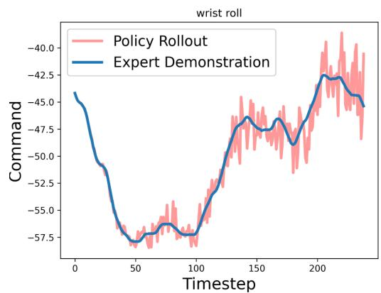{width=50%}

## 1.3 死穴二：多模态动作分布（Multimodality）

人类示教数据中，同一个观测 $o_t$ 下可能存在多种都合理的动作。比如抓取一个杯子，可以从左边绕过去抓，也可以从右边绕过去抓，两条轨迹都是专家示范。

真实的条件分布 $p(a_t \mid o_t)$ 是**多峰的**（multimodal）。如果用 MSE 这类点回归损失，模型会学到各峰的加权平均：

$$
\hat{a}_t = \mathbb{E}_{a_t \sim p(a_t \mid o_t)}[a_t]
$$

| 符号 | 含义 |
|------|------|
| $\hat{a}_t$ | 模型预测的动作 |
| $p(a_t \mid o_t)$ | 给定观测 $o_t$ 下动作的真实条件分布 |

这个"平均动作"往往不属于任何一个合理模式——两边都不像，最后谁也做不好。

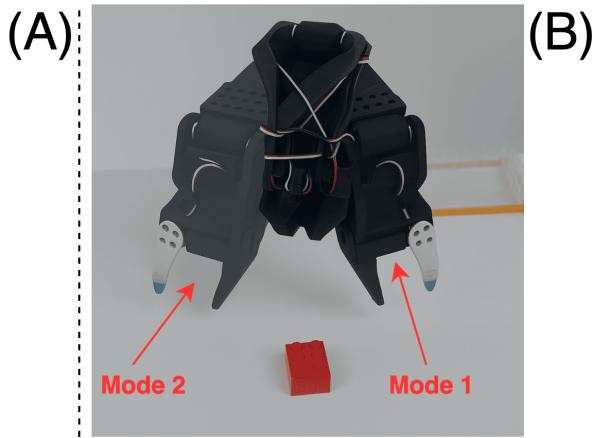{width=50%}

## 1.4 要学的不是一个动作，而是一个分布

从这两个死穴可以看出，关键转变是：策略不应该再学一个确定性的点映射 $a = f(o)$，而要去建模整个**条件分布** $a \sim p(a \mid o)$。

一旦把策略看成**条件生成问题**，很多后续方法就顺理成章了：

- 用隐变量（latent variable）表达"高层意图 / 风格 / 轨迹模式"；
- 用迭代去噪（iterative denoising）表达"逐步把噪声变成动作"；
- 用连续流（continuous flow）表达"把简单分布运输到动作分布"。

换句话说，在机器人模仿学习里，生成模型首先是一个"动作分布建模器"：它的任务不是生成图片，而是表达多峰动作分布、保留不同示范风格、而不是强行平均。这就是生成模型进入机器人策略学习的入口。

## 1.5 三条生成式主线地图：CVAE / Diffusion / Flow Matching

接下来这一讲，会沿三条生成式主线把"如何建模 $p(a \mid o)$"讲透：


| 方法 | 核心想法 | 推理方式 | 在机器人里的意义 |
|------|----------|----------|------------------|
| **VAE / CVAE** | 用 latent variable 表达隐含模式 | 一次采样 + 一次解码 | 适合 chunk-level 动作生成，直接通向 ACT |
| **Diffusion** | 从噪声开始，逐步去噪得到动作 | 多步迭代 | 更强的多模态建模，直接通向 Diffusion Policy |
| **Flow Matching** | 学习从简单分布到目标分布的连续流 | ODE 积分，通常步数更少 | 是新一代 VLA action head 的关键基础 |


下面 §2（ACT）、§4（Diffusion Policy）、§5（Flow Matching），分别就是这三条线在机器人里的代表实现。

# 2 ACT：用 Action Chunking + CVAE 建模示教分布

> 论文：*Learning Fine-Grained Bimanual Manipulation with Low-Cost Hardware*，Tony Z. Zhao et al., 2023
> arXiv: 2304.13705

## 2.1 两个核心想法：动作分块 + 隐变量

ACT 用两个机制分别对付 §1 提出的两个问题：

| 问题 | ACT 的解法 | 核心思想 |
|------|-----------|----------|
| 误差累积 | **Action Chunking** | 一次预测未来 $k$ 步，减少闭环频率 |
| 多模态分布 | **Conditional VAE** | 用隐变量 $z$ 建模不同动作模式 |

## 2.2 Action Chunking：把单步预测变成短时规划

ACT 不预测单步动作，而是一次预测未来 $k$ 步的动作序列（**action chunk**）：

$$
o_t \;\longrightarrow\; \hat{\mathbf{a}}_{t:t+k} = (\hat{a}_t,\; \hat{a}_{t+1},\; \ldots,\; \hat{a}_{t+k-1})
$$

| 符号 | 含义 | 典型值 |
|------|------|--------|
| $k$ | chunk size，一次预测的步数 | 100（LeRobot 默认） |
| $\hat{\mathbf{a}}_{t:t+k}$ | 预测的动作块，形状 $k \times d_a$ | $100 \times 14$ |
| $d_a$ | 动作维度（每步动作的自由度数） | 14（双臂各 7 个关节） |

在 **LeRobot 默认配置** 下，模型在 $t$ 时刻一次性预测一个长度为 $k$ 的 chunk，并默认把这 $k$ 步全部放入 action queue 依次执行，然后再重新查询策略。这样闭环频率从"每步一次"降到了"每 $k$ 步一次"，误差只在重新规划时才有机会继续累积。

> 备注：原论文里还重点讨论了 **temporal ensembling** 这一执行方式；本文主线以 LeRobot 默认实现（`temporal_ensemble_coeff = None`）为准，论文设定作为补充说明。

ACT 不是简单的回归器，而是一个**条件变分自编码器（CVAE）**。在讲 ACT 的具体结构之前，先把 CVAE 的来龙去脉讲清楚。

## 2.3 从 AE 到 VAE 到 CVAE

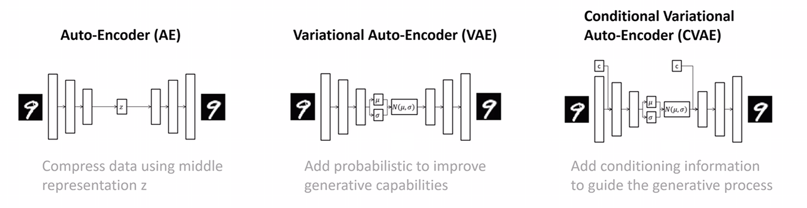

上图展示了三种自编码器的演进关系。我们逐个拆解。

### 2.3.1 Auto-Encoder（AE）：压缩与重建

AE 的目标很简单：把输入 $x$ 压缩成一个低维表示 $z$，再从 $z$ 重建出 $\hat{x}$。

$$
z = f_{\text{enc}}(x), \quad \hat{x} = f_{\text{dec}}(z)
$$

| 符号 | 含义 | 维度 |
|------|------|------|
| $x$ | 输入数据（如一张图片、一段动作序列） | $d_x$ |
| $z$ | 中间表示（latent representation） | $d_z$，远小于 $d_x$ |
| $\hat{x}$ | 重建输出 | $d_x$（和输入同维） |
| $f_{\text{enc}}$ | 编码器网络 | $\mathbb{R}^{d_x} \to \mathbb{R}^{d_z}$ |
| $f_{\text{dec}}$ | 解码器网络 | $\mathbb{R}^{d_z} \to \mathbb{R}^{d_x}$ |

AE 的问题：$z$ 是确定性的，隐空间没有结构。你没法在隐空间里"采样"来生成新数据。

### 2.3.2 Variational Auto-Encoder（VAE）：给隐空间加上概率结构

VAE 的关键改变：**编码器不再输出一个确定的 $z$，而是输出一个概率分布的参数**。

$$
f_{\text{enc}}(x) \;\to\; (\mu, \log\sigma^2) \quad\Longrightarrow\quad z \sim \mathcal{N}(\mu, \;\text{diag}(\sigma^2))
$$

| 符号 | 含义 | 维度 |
|------|------|------|
| $\mu$ | 后验分布的均值向量 | $d_z$(如 32 维) |
| $\log\sigma^2$ | 后验分布的对数方差向量(逐元素) | $d_z$ |
| $\sigma^2$ | 方差向量，$\sigma^2 = \exp(\log\sigma^2)$ | $d_z$ |
| $\mathcal{N}(\mu, \text{diag}(\sigma^2))$ | 对角高斯分布，各维度独立 | — |

训练时通过 **reparameterization trick** 采样（使采样过程可微分）：

$$
z = \mu + \sigma \odot \varepsilon, \quad \varepsilon \sim \mathcal{N}(0, I)
$$

| 符号 | 含义 |
|------|------|
| $\odot$ | 逐元素乘法（Hadamard product） |
| $\varepsilon$ | 从标准正态采样的噪声，形状 $d_z$ |
| $I$ | $d_z \times d_z$ 的单位矩阵 |

同时，训练目标里加入 **KL 散度**，把后验分布 $q(z \mid x)$ 约束到标准正态先验 $p(z) = \mathcal{N}(0, I)$ 附近：

$$
\mathcal{L}_{\text{VAE}} = \underbrace{\mathcal{L}_{\text{recon}}(x, \hat{x})}_{\text{重建损失}} + \underbrace{D_{\text{KL}}\!\left(q(z \mid x) \;\|\; \mathcal{N}(0, I)\right)}_{\text{KL 散度：约束隐空间}}
$$

**通俗理解 KL 散度这一项**：训练时有两股力在拉扯 $z$：

- **重建损失**说："$z$，你得携带足够的信息，不然我没法还原动作。"——这股力让不同数据的 $z$ 尽量分开、各自编码有用信息。
- **KL 散度**说："$z$，你别跑太远，待在标准正态 $\mathcal{N}(0, I)$ 附近。"——这股力把所有数据的 $z$ 往原点附近拉拢。

如果没有 KL 约束，编码器可以把不同数据映射到隐空间里任意位置——比如把"从左绕"映射到 $z=100$，把"从右绕"映射到 $z=-200$。隐空间会变得七零八落，中间大片区域是"空白"，推理时随便采一个 $z$ 大概率落在空白区，解码器生成的就是垃圾。

但如果 KL 约束太强，把后验完全压成标准正态，$z$ 就不携带任何信息了——所有数据的 $z$ 都变成同一个分布，解码器分不出"从左绕"还是"从右绕"，$z$ 等于白加了。

所以最终 $z$ 的分布会在两者之间找到平衡：它仍然编码了有用信息（不同模式的 $z$ 均值略有不同），但不同数据对应的 $z$ 分布彼此重叠、连续，不会散落到隐空间的犄角旮旯。这样推理时从 $\mathcal{N}(0, I)$ 附近取值，就能落在有意义的区域。

简单类比：KL 散度就像一根弹簧，把编码器的输出往原点拉。弹簧太松（$\beta$ 小），隐空间散乱，采样质量差；弹簧太紧（$\beta$ 大），所有数据被压到同一个点，丢失多样性。好的 $\beta$ 在两者之间取平衡。

### 2.3.3 Conditional VAE（CVAE）：加入条件信息

CVAE 在 VAE 的基础上引入**条件变量 $c$**，让生成过程受条件控制：

$$
\text{编码器：} \quad q(z \mid x, c) = \mathcal{N}\!\left(\mu(x, c),\; \text{diag}(\sigma^2(x, c))\right)
$$

$$
\text{解码器：} \quad \hat{x} = f_{\text{dec}}(z, c)
$$


| 符号 | 含义 | 在 ACT 中对应 |
|------|------|---------------|
| $c$ | 条件变量 | **对 policy decoder 而言**是当前观测 $o_t$；**对 LeRobot 的 CVAE encoder 而言**实际输入只用机器人状态 $s_t$ |
| $x$ | 要建模的目标数据 | 动作块 $\mathbf{a}_{t:t+k}$ |
| $z$ | 隐变量，表达"风格/模式" | 动作模式（从左绕 vs 从右绕） |


在 ACT 的语境下，CVAE 的含义是：

$$
p(\mathbf{a}_{t:t+k} \mid o_t) = \int p(\mathbf{a}_{t:t+k} \mid o_t, z) \; p(z) \; dz
$$

| 符号 | 含义 |
|------|------|
| $p(\mathbf{a}_{t:t+k} \mid o_t)$ | 给定观测下动作块的条件分布（我们真正想建模的） |
| $p(\mathbf{a}_{t:t+k} \mid o_t, z)$ | 给定观测**和**隐变量后，动作块的分布（由 policy decoder 参数化） |
| $p(z) = \mathcal{N}(0, I)$ | 隐变量的先验分布 |

> 备注：上面是 **CVAE 的概念层表达**。如果落到 LeRobot 的具体实现，训练时的 VAE encoder 并不读取图像，只用 $(s_t, \mathbf{a}_{t:t+k})$ 去近似后验；图像是在右侧 policy decoder 中使用的。这是一个很容易和"概念上的条件变量 $o_t$"混淆的点。

不同的 $z$ 对应不同的动作模式。多模态分布被分解成：先采样 $z$（选择模式），再条件生成动作块（执行该模式）。

## 2.4 ACT 的整体架构与数据流

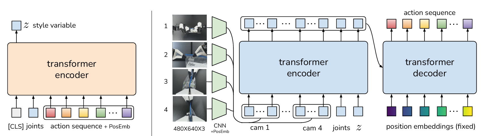

上图展示了 ACT 的整体结构。从左到右：

1. **VAE Encoder**（左侧）：输入 `[CLS]` token、机器人关节状态、动作序列，加上位置编码，经过 Transformer Encoder，输出隐变量 $z$ 的分布参数。**仅训练时使用。**
2. **Transformer Encoder-Decoder**（右侧）：输入 $z$、机器人状态、图像特征，经过 Transformer Encoder + Decoder，输出预测的动作序列。**训练和推理都使用。**

训练时，ACT 做三件事：(1) VAE Encoder 从真实动作中提取隐变量 $z$；(2) Transformer 主干根据 $z$ 和观测预测动作块；(3) 用重建损失 + KL 正则来优化。下面按数据流的顺序走一遍。

### 2.4.1 Step 1 — VAE Encoder：从真实动作中推断隐变量

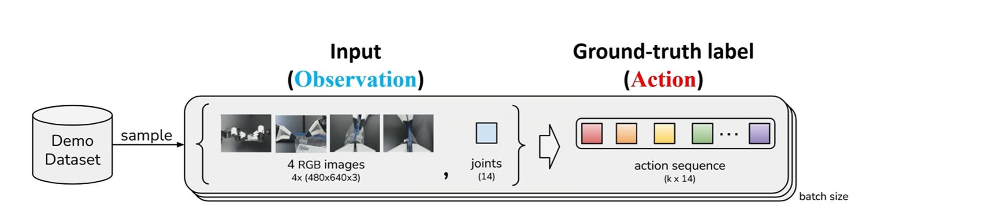

VAE Encoder 的任务：看到机器人当前状态 $s_t$ 和接下来真实执行的 $k$ 步动作 $\mathbf{a}_{t:t+k}$，推断出"这段动作属于哪种风格/模式"，输出隐变量 $z$ 的后验分布参数：

$$
q(z \mid s_t, \mathbf{a}_{t:t+k}) = \mathcal{N}\!\left(\mu_\phi,\; \text{diag}(\sigma_\phi^2)\right)
$$

VAE Encoder 是一个 BERT 风格的 Transformer Encoder。它的输入是一个 token 序列，每个 token 都是 $d_{\text{model}} = 512$ 维的向量：


| 位置索引 | Token 来源 | 原始维度 | 投影方式 | 投影后维度 |
|----------|-----------|----------|----------|-----------|
| 0 | `[CLS]` token（可学习 embedding） | $512$ | `nn.Embedding(1, 512)` | $512$ |
| 1 | 机器人关节状态 $s_t$ | $d_s$（如 14） | 线性层 $W_s \in \mathbb{R}^{512 \times d_s}$ | $512$ |
| 2 ~ $k$+1 | 动作序列 $a_t, a_{t+1}, \ldots, a_{t+k-1}$ | 每步 $d_a$（如 14） | 线性层 $W_a \in \mathbb{R}^{512 \times d_a}$（共享） | 每步 $512$ |


整个输入序列长度为 $1 + 1 + k = k + 2$。以默认 $k = 100$ 为例，序列长度 = 102。加上**固定正弦位置编码**后送入 Transformer：

$$
\text{input} = [\text{CLS};\; W_s s_t;\; W_a a_t;\; W_a a_{t+1};\; \ldots;\; W_a a_{t+k-1}] + \text{PE}
$$

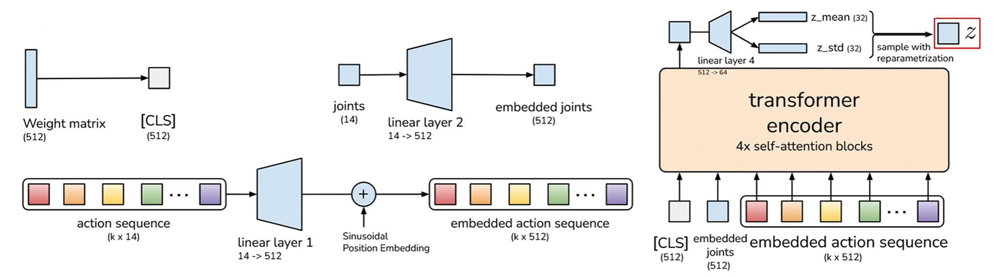

输入序列经过 **4 层 Transformer Encoder**（`n_vae_encoder_layers = 4`，8 头注意力，FFN 3200，$d_{\text{model}} = 512$）。取 `[CLS]` 位置（位置 0）的输出向量 $h_{\text{CLS}} \in \mathbb{R}^{512}$，经线性投影得到隐变量的分布参数：

$$
[\mu_\phi,\; \log\sigma^2_\phi] = W_{\text{latent}} \cdot h_{\text{CLS}}, \quad W_{\text{latent}} \in \mathbb{R}^{64 \times 512}
$$

前 32 维是后验均值 $\mu_\phi$，后 32 维是后验对数方差 $\log\sigma^2_\phi$。代码里存的是 $\log\sigma^2$（即 `log_sigma_x2`）而不是 $\log\sigma$，因为 $\sigma^2$ 必须为正，存对数可以让网络输出任意实数。

然后用 reparameterization trick 采样：

$$
z = \mu + \sigma \odot \varepsilon, \quad \varepsilon \sim \mathcal{N}(0, I), \quad \sigma = \exp(\log\sigma^2 / 2)
$$

这个 trick 的意义：直接"从分布里采样"没法算梯度，但把随机性挪到固定的 $\varepsilon$ 上后，$z$ 对 $\mu$ 和 $\sigma$ 就可微了。

> VAE Encoder **仅在训练时使用**。推理时没有真实动作可看，直接令 $z = \mathbf{0}$（§2.6 会解释为什么可以这样做）。

### 2.4.2 Step 2 — Transformer 主干：从观测生成动作块

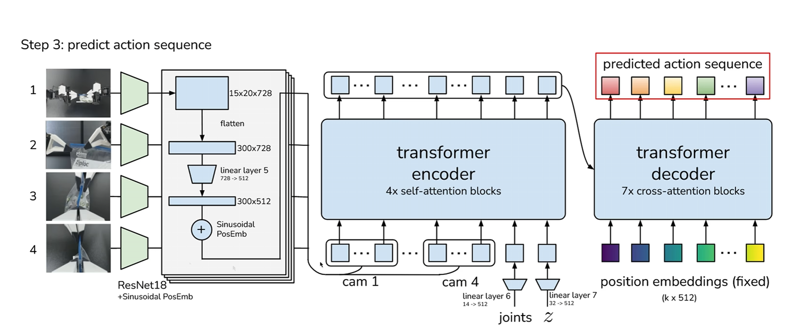

拿到 $z$ 后，它和观测一起送入 Transformer 主干（在 CVAE 框架里，这就是 **decoder** 侧）。这个主干由 Transformer Encoder + Transformer Decoder 两部分组成（注意：这里的 encoder/decoder 是 Transformer 架构意义上的，不是 VAE 意义上的）。

每路相机图像先经过 **ResNet18** backbone（ImageNet 预训练权重），取 `layer4` 的输出特征图，再经过 $1 \times 1$ 卷积投影到 $d_{\text{model}} = 512$ 维，最后展平空间维度变成 token 序列：

$$
I^{(c)} \in \mathbb{R}^{3 \times H \times W} \;\xrightarrow{\text{ResNet18}}\; F^{(c)} \in \mathbb{R}^{512 \times H' \times W'} \;\xrightarrow{1\times1 \text{ Conv + flatten}}\; (f_1^{(c)}, \ldots, f_{H'W'}^{(c)})
$$

以 $480\times640$ 的图像为例，$H' = 15, W' = 20$，每路相机产生 $300$ 个 token（每个 512 维），附加 **2D 正弦位置编码**来保留空间位置信息。

将以下 token 拼接成一个序列送入 Transformer Encoder：

| Token 类型 | 数量 | 投影方式 | 位置编码 |
|-----------|------|----------|----------|
| latent token | 1 | 线性层 $\mathbb{R}^{32} \to \mathbb{R}^{512}$ | 可学习 1D |
| robot state token | 1 | 线性层 $\mathbb{R}^{d_s} \to \mathbb{R}^{512}$ | 可学习 1D |
| image tokens（每路相机） | $H' \times W'$ 个 | $1\times1$ 卷积 | 2D 正弦 |

以 4 路相机为例，总共 $1 + 1 + 4 \times 300 = 1202$ 个 token。经过 **4 层 Transformer Encoder**（`n_encoder_layers = 4`，8 头注意力，FFN 3200）处理，输出形状不变。

Decoder 的输入是 $k$ 个**全零查询向量**（类似 DETR 的 object queries），加上**可学习的位置编码** $E_{\text{pos}} \in \mathbb{R}^{k \times 512}$。每个查询对应动作序列中的一步。每个 Decoder Layer 包含三个子层：

1. **Self-Attention**：$k$ 个查询之间互相注意——让模型在生成第 $i$ 步动作时，能参考其他时间步的查询状态，从而保持动作序列的时序连贯性；
2. **Cross-Attention**：查询 cross-attend 到 Encoder 输出——这是动作生成的核心：每个时间步的查询从图像特征、机器人状态、隐变量中提取所需信息；
3. **FFN**：两层线性 + ReLU。

LeRobot 中 `n_decoder_layers = 1`。虽然原始 ACT 代码配置里写的是 7 层，但社区发现其 released implementation 实际只用到了第 1 层；LeRobot 因而直接把默认值设为 1 以对齐这一行为。Decoder 输出经过线性 action head 投影到动作空间：

$$
\hat{\mathbf{a}}_{t:t+k} = W_{\text{head}} \cdot \text{decoder\_out}, \quad W_{\text{head}} \in \mathbb{R}^{d_a \times 512}
$$

最终输出预测的动作块 $\hat{\mathbf{a}}_{t:t+k} \in \mathbb{R}^{B \times k \times d_a}$。

## 2.5 训练：重建损失 + KL 正则（$\beta=10$ 的直觉）

ACT 的训练损失是标准的 CVAE 形式——重建损失 + KL 正则：

$$
\mathcal{L} = \underbrace{\mathcal{L}_{\text{L1}}}_{\text{预测动作要接近真实动作}} + \;\beta \cdot \underbrace{D_{\text{KL}}}_{\text{隐空间要接近标准正态}}
$$

### 2.5.1 重建损失 $\mathcal{L}_{\text{L1}}$

逐元素 L1，对 padding 位置做 mask 后取均值——直觉上就是"预测的每一步每一个关节，和真实值的绝对误差"：

$$
\mathcal{L}_{\text{L1}} = \operatorname{mean}\!\left(\,|\mathbf{a} - \hat{\mathbf{a}}| \odot \mathbf{1}_{\text{not pad}}\right)
$$

其中 $\mathbf{1}_{\text{not pad}}$ 是非 padding 位置的掩码。当一段 chunk 落在 episode 尾部、未来动作不足 $k$ 步时，超出部分会被 padding 填上，再被这个掩码屏蔽掉，不参与损失。

### 2.5.2 KL 散度 $D_{\text{KL}}$

衡量 VAE Encoder 输出的后验分布 $q(z \mid s_t, \mathbf{a})$ 和标准正态先验 $\mathcal{N}(0, I)$ 之间的距离。两个对角高斯之间的 KL 有解析公式（逐维度独立计算后求和）：

$$
D_{\text{KL}} = -\frac{1}{2} \sum_{i=1}^{d_z} \left( 1 + \log\sigma_i^2 - \mu_i^2 - \exp(\log\sigma_i^2) \right)
$$

### 2.5.3 为什么 $\beta = 10$ 这么大

$\beta$ 控制"隐空间规整度"和"重建精度"之间的权衡。$\beta$ 越大，隐空间越被压向 $\mathcal{N}(0, I)$，推理时用 $z=0$ 就越可靠；代价是重建可能略粗糙。LeRobot 默认 `kl_weight = 10.0`，偏向让推理时的 $z=0$ 更稳定。

## 2.6 推理：z=0 与动作块执行

### 2.6.1 为什么可以用 $z = 0$

这是 ACT 里最值得深究的设计决策。

**问题**：推理时没有未来动作 $\mathbf{a}_{t:t+k}$，无法运行 VAE Encoder，怎么得到 $z$？

**ACT 的答案**：直接令 $z = \mathbf{0} \in \mathbb{R}^{32}$。

**为什么这样做在实现上是合理的？一个直观理解是：**

1. 训练时 KL 项把后验 $q(z \mid s_t, \mathbf{a})$ 约束到 $\mathcal{N}(0, I)$ 附近；
2. $z = \mathbf{0}$ 是 $\mathcal{N}(0, I)$ 的均值，也是概率密度最高的点；
3. 在这种训练方式下，$z$ 被持续拉向标准正态的高密度区域，所以用 $z = \mathbf{0}$ 做确定性解码通常是稳定的默认选择。

**代价**：放弃了多模态采样能力。推理时 ACT 总是走同一个模式，不会随机选择"从左绕"还是"从右绕"。这换来了更稳定、可复现的部署行为。

### 2.6.2 Action Chunking 的执行策略

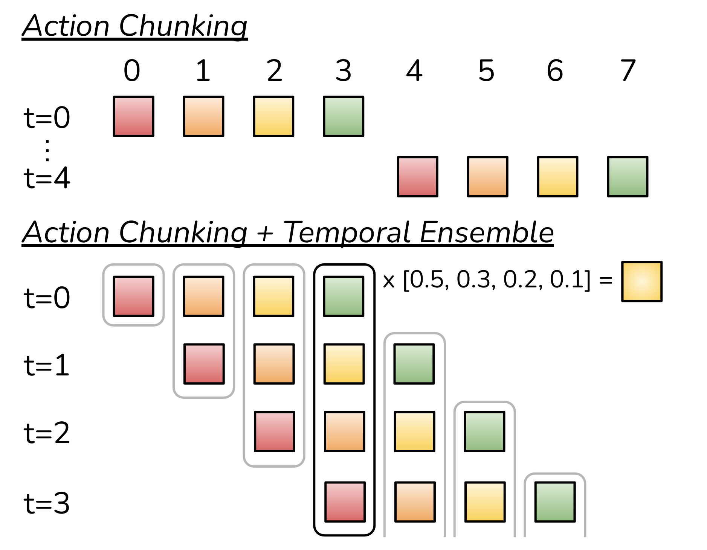{width=50%}

上图展示了两种推理执行策略。

#### 2.6.2.1 模式一：Action Queue（LeRobot 默认）

每次生成完整的 $k$ 步 chunk，但只执行前 `n_action_steps` 步，剩余丢弃，队列空了再重新规划。

| 符号 | 含义 | 典型值 |
|------|------|--------|
| $n$ | `n_action_steps`，每次实际执行的步数 | 可设为 1 ~ $k$ |
| $k$ | `chunk_size`，每次预测的步数 | 100 |

LeRobot 默认 `n_action_steps = 100 = chunk_size`，也就是一次预测 100 步、一次性全部执行完，再重新查询策略。

#### 2.6.2.2 模式二：Temporal Ensembling（论文重点讨论，LeRobot 默认关闭）

每步都重新规划一个完整 chunk，但把多个重叠 chunk 中对同一时刻的预测做**加权平均**。第 $i$ 个预测（来自 $i$ 步之前的规划）的权重为 $w_i = \exp(-m \cdot i)$，最终执行的动作是归一化加权平均：

$$
a_t^{\text{exec}} = \frac{\sum_{i} w_i \cdot \hat{a}_t^{(i)}}{\sum_{i} w_i}
$$

其中 $m$ 是 `temporal_ensemble_coeff`（原始 ACT 取 0.01）。$m > 0$ 意味着更老的预测权重更高，这看起来有点反直觉，但它确实是 ACT 论文与 LeRobot 实现采用的定义，可以理解为在 chunk 边界处减少策略抖动、保留 action chunking 的平滑性。

### 2.6.3 完整数据流总结

**训练时**：

1. 输入 $s_t$（robot state）、$I_t$（多路图像）、目标动作块 $\mathbf{a}_{t:t+k}$；
2. VAE Encoder：$[\text{CLS},\, s_t,\, a_t,\, \ldots]$ 长度 $k+2$ 序列 $\to$ 4 层 Transformer Encoder $\to$ $h_{\text{CLS}}$ $\to$ $[\mu,\, \log\sigma^2]$ $\to$ reparameterization $\to$ $z \in \mathbb{R}^{32}$；
3. 主 Transformer Encoder：$[z,\, s_t,\, \text{img tokens}\ldots]$（如 1202 个 token）$\to$ 4 层 Encoder；
4. Transformer Decoder：$k$ 个全零 query cross-attend 到 Encoder 输出 $\to$ 1 层 Decoder $\to$ action head $\to$ $\hat{\mathbf{a}}_{t:t+k}$；
5. 损失：

$$
\mathcal{L} = \mathcal{L}_{\text{L1}}(\mathbf{a},\; \hat{\mathbf{a}}) + \beta \cdot D_{\text{KL}}\!\left(q(z \mid s, \mathbf{a}) \;\|\; \mathcal{N}(0, I)\right)
$$

**推理时**：输入当前 $s_t$、$I_t$ $\to$ 令 $z = \mathbf{0}$（跳过 VAE Encoder）$\to$ Transformer Encoder + Decoder $\to$ $\hat{\mathbf{a}}_{t:t+k}$ $\to$ Action Queue 或 Temporal Ensembling 执行。

### 2.6.4 关键超参数一览

| 超参数 | 符号 | 默认值 | 含义 |
|--------|------|--------|------|
| `chunk_size` | $k$ | 100 | 一次预测的动作步数 |
| `latent_dim` | $d_z$ | 32 | VAE 隐变量维度 |
| `dim_model` | $d_{\text{model}}$ | 512 | Transformer 隐层维度 |
| `n_heads` | $n_{\text{heads}}$ | 8 | 多头注意力头数 |
| `dim_feedforward` | $d_{\text{ff}}$ | 3200 | FFN 中间层维度 |
| `n_encoder_layers` | — | 4 | 主 Transformer Encoder 层数 |
| `n_decoder_layers` | — | 1 | 主 Transformer Decoder 层数 |
| `n_vae_encoder_layers` | — | 4 | VAE Encoder 层数 |
| `kl_weight` | $\beta$ | 10.0 | KL 散度权重 |
| `temporal_ensemble_coeff` | $m$ | None | Temporal ensembling 系数 |
| `vision_backbone` | — | resnet18 | 图像特征提取骨干网络 |
| `n_action_steps` | $n$ | 100 | 每次实际执行的动作步数 |

## 2.7 本节小结

**核心创新**：ACT 把策略从"点预测器"变成"条件生成器"——用 CVAE 建模 $p(\mathbf{a} \mid o)$ 捕捉示教的多模态，用 action chunking 把单步动作回归改成短时规划来压住误差累积。它给后续方法立下了两个范式：**动作按 chunk 生成**、**连续控制当条件生成问题来做**，§4、§5 都是沿着这两点把生成器换得更强。

**局限性**：推理时令 $z = 0$ 走的是确定性单模式生成，等于在执行阶段放弃了多模态采样；要真正在推理时保留多模态，就需要更强的生成器，这正是 §4 Diffusion 的出发点。

在换更强的生成器之前，§3 先动手把 ACT 真正训出来、部署起来，并把源码逐层读懂。

# 3 实验：训练、部署并解析 ACT

理论讲完，这一节把 §2 的 ACT 真正跑起来：在仿真里训练、看效果，再落到真机，最后把训练与推理的代码逐层拆开。

## 3.1 在 LIBERO 上训练与推理

先用 LeRobot 的 ACT 在 LIBERO 数据集上训练一个抓取策略（例如 `libero_goal` 套件里"把碗放到盘子上"这条任务）。流程是标准三步：

1. **准备数据**：从 `lerobot/libero` 数据集中筛选目标任务的轨迹，dataset 会根据 `ACTConfig` 自动把每个时刻之后的 $k=100$ 步动作打包成 chunk 监督；
2. **训练**：用默认 `ACTConfig`（`chunk_size=100`、`kl_weight=10.0` 等）启动训练，监控 `train/loss` 下降；
3. **闭环评估**：LIBERO 内置仿真器和成功判定，训练过程中定期 rollout，看 `eval/pc_success`（成功率）从 0 逐步爬升，以及 `eval/video` 里策略一边看、一边按 chunk 出动作的执行过程。

关键在于：**loss 下降不等于任务成功**（这一点在讲 8 已经强调过），所以必须靠仿真器内的闭环 rollout 来真正判断策略好不好。LIBERO 这类带成功判定的仿真环境，正好提供了这条闭环验证的标尺。

## 3.2 在 SO-101 主从臂上训练 ACT（无真机用仿真器替代）

把同一套 ACT 搬到真机几乎不用改算法，只换数据来源：

- **有真机**：用上一讲采的 SO-101 主从臂遥操作数据（例如"抓方块放盘子"），同样用 `lerobot-train` 训 ACT，再把训练好的策略部署回 SO-101 做闭环执行；动作维度 $d_a$、状态维度 $d_s$、相机路数都会由数据集自动对上，超参沿用默认；
- **无真机**：用 SO-101 仿真器跑同样的流程——键盘或手柄采一份格式一致的数据，训练同一个 ACT，在仿真器里做闭环评估。

无论真机还是仿真，ACT 的训练目标、网络结构、推理时的 $z=0$ 与动作队列执行都完全一致；变的只是数据集的维度和相机数量。

## 3.3 代码解析：LeRobot 源码逐层拆解

§2 讲"为什么这么设计"，这里讲"代码里到底怎么实现的"。下面把 ACT 在 LeRobot 里的实现按数据流逐层拆开。代码基于 LeRobot 源码，训练脚本以 §3.1 的 LIBERO 训练为例、使用默认 `ACTConfig`。

### 3.3.1 从训练脚本入手

先从训练脚本出发，因为它把 ACT 在 LeRobot 里的主要模块都串了起来。核心流程串成一条链：

1. `LeRobotDatasetMetadata(dataset_id)` — 加载数据集元信息
2. `get_task_episodes()` — 筛选目标 task 的 episode
3. `ACTConfig(...)` — 配置策略超参
4. `DatasetConfig(repo_id, episodes)` — 配置数据集
5. `LiberoEnvConfig(task, task_ids)` — 配置评估环境
6. `TrainPipelineConfig(...)` — 组装训练 pipeline
7. `train(cfg)` — 启动训练

脚本的核心代码是：

```python
# 1. 从 lerobot/libero 数据集中筛选 "put the bowl on the plate" 的轨迹
metadata = LeRobotDatasetMetadata("lerobot/libero")
episodes = get_task_episodes(metadata, "put the bowl on the plate")

# 2. 配置 ACT 策略（使用默认超参）
policy_cfg = ACTConfig(device="cuda", push_to_hub=False)

# 3. 配置数据集（只用筛选出的 episode）
dataset_cfg = DatasetConfig(repo_id="lerobot/libero", episodes=episodes)

# 4. 配置 LIBERO 评估环境（libero_goal suite, task 8）
env_cfg = LiberoEnvConfig(task="libero_goal", task_ids=[8], observation_height=256, observation_width=256)

# 5. 组装 pipeline 并训练
cfg = TrainPipelineConfig(dataset=dataset_cfg, env=env_cfg, policy=policy_cfg, ...)
train(cfg)
```

| 训练参数 | 值 | 含义 |
|---------|-----|------|
| `TRAIN_STEPS` | 100000 | 总训练步数 |
| `BATCH_SIZE` | 256 | 批大小 |
| `EVAL_EPISODES` | 10 | 每次评估的 episode 数 |
| `EPOCHS_PER_EVAL` | 2 | 每 2 个 epoch 评估一次 |
| `LOG_FREQ` | 5 | 每 5 步记录一次日志 |

`train()` 内部自动处理：

1. 数据加载 + `delta_timestamps`
2. 预处理（归一化）
3. 训练循环（前向 + 反向 + 梯度裁剪）
4. 定期保存 checkpoint
5. 定期在 LIBERO 环境中 rollout 评估

如果把 `train(cfg)` 再展开一层，大致可以理解成：

- `make_dataset()` — 加载数据 + `delta_timestamps`
- `make_policy()` — 创建 `ACTPolicy`
- `make_pre_post_processors()` — 创建归一化 pipeline
- training loop：`preprocessor(batch)` 归一化 + 搬设备 → `policy.forward(batch)` 前向 + 计算 loss → `eval_policy(env, policy, ...)` 定期仿真评估

首先要注意：**ACT 的 chunk supervision 是 dataset 层生成的，不是模型内部现拼出来的。** 也就是说，这段训练脚本虽然短，但背后接起的是一整条以 action chunk 为中心的数据流，而不是"把单步 BC 模型输出改大一点"这么简单。后续源码可以按下面这条顺序理解：

1. `ACTConfig` 决定 chunk 长度和 CVAE 行为
2. dataset 根据这个配置，生成未来动作块监督
3. processor 负责标准化
4. `ACTPolicy.forward()` 用 chunk 监督计算 loss
5. 推理时，策略先预测完整 chunk，再逐步吐出要执行的一步动作

### 3.3.2 配置层：ACTConfig

文件位置 `policies/act/configuration_act.py`，核心类：

```python
@PreTrainedConfig.register_subclass("act")
@dataclass
class ACTConfig(PreTrainedConfig):
```

它继承自 `PreTrainedConfig`（`configs/policies.py`），天然具备：`input_features` / `output_features` 描述模型的输入输出 feature、`device` / `use_amp` 设备和混合精度、`save_pretrained()` / `from_pretrained()` 模型保存加载，以及与 `make_pre_post_processors()` 的对接。

#### 3.3.2.1 Action Chunking 三参数

```python
n_obs_steps: int = 1
chunk_size: int = 100
n_action_steps: int = 100
```

| 参数 | 含义 | 默认值 | 训练脚本中的值 |
|------|------|--------|---------------|
| `n_obs_steps` | 观测历史步数，当前只支持 1 | 1 | 1 |
| `chunk_size` $k$ | 一次预测多少步动作 | 100 | 100 |
| `n_action_steps` $n$ | 在线执行时每次消费多少步 | 100 | 100 |

训练脚本使用默认配置 `ACTConfig(device="cuda", push_to_hub=False)`，即 `chunk_size=100`、`n_action_steps=100`。模型一次解码 100 步未来动作，但环境仍然是**每一步都在推进并返回新观测**；只是 `ACTPolicy.select_action()` 在动作队列没空时不会重新跑模型，而是继续消费上一次预测出来的 chunk。一个容易混淆的点是：`chunk_size` 决定的是**监督目标长度**，而 `n_action_steps` 决定的是**推理时一次消费多少步预测结果**。两者相关，但不是一个概念。

#### 3.3.2.2 Transformer 架构参数

```python
dim_model: int = 512          # Transformer 隐层维度 d_model
n_heads: int = 8              # 多头注意力头数
dim_feedforward: int = 3200   # FFN 中间层维度
n_encoder_layers: int = 4     # 主 Transformer Encoder 层数
n_decoder_layers: int = 1     # 主 Transformer Decoder 层数
n_vae_encoder_layers: int = 4 # VAE Encoder 层数
```

| 参数 | 符号 | 值 | 含义 |
|------|------|-----|------|
| `dim_model` | $d_{\text{model}}$ | 512 | 所有 token 的统一维度 |
| `n_heads` | $n_{\text{heads}}$ | 8 | 每头维度 $512/8=64$ |
| `dim_feedforward` | $d_{\text{ff}}$ | 3200 | FFN 中间层维度 |
| `n_encoder_layers` | — | 4 | 主 Transformer Encoder 层数 |
| `n_decoder_layers` | — | 1 | 主 Transformer Decoder 层数 |
| `n_vae_encoder_layers` | — | 4 | VAE Encoder 层数 |

注意 `n_decoder_layers = 1`。原始 ACT 论文代码写了 7 层，但有 bug 导致实际只用了第 1 层。LeRobot 直接设为 1 以匹配原始行为（见 `configuration_act.py` 的相关注释）。

#### 3.3.2.3 CVAE 参数

```python
use_vae: bool = True
latent_dim: int = 32
n_vae_encoder_layers: int = 4
kl_weight: float = 10.0
```

| 参数 | 符号 | 值 | 含义 |
|------|------|-----|------|
| `use_vae` | — | True | 启用 CVAE |
| `latent_dim` | $d_z$ | 32 | 隐变量维度 |
| `kl_weight` | $\beta$ | 10.0 | KL 散度权重 |

这三项决定了 ACT 不是单纯的监督回归，而是一个带 KL 正则的 CVAE。

#### 3.3.2.4 `action_delta_indices` 属性

```python
@property
def action_delta_indices(self) -> list:
    return list(range(self.chunk_size))
```

返回 `[0, 1, 2, ..., 99]`。这个属性会被数据层用来构造 `delta_timestamps`，决定 dataset 取样时要把未来多少步 action 一起取出来。

### 3.3.3 数据层：把单帧变成 chunk 监督

文件位置 `datasets/lerobot_dataset.py`、`datasets/factory.py`（`resolve_delta_timestamps` 函数）。

训练脚本里不需要手动构造 `delta_timestamps`，`train()` 内部会自动从 `ACTConfig` 推导。推导链路：

$$
\texttt{ACTConfig.action\_delta\_indices} \;\xrightarrow{\texttt{resolve\_delta\_timestamps}}\; \texttt{delta\_timestamps} \;\xrightarrow{\texttt{LeRobotDataset}}\; \texttt{delta\_indices}
$$

具体代码在 `datasets/factory.py`：

```python
def resolve_delta_timestamps(cfg: PreTrainedConfig, ds_meta: LeRobotDatasetMetadata):
    delta_timestamps = {}
    for key in ds_meta.features:
        if key == ACTION and cfg.action_delta_indices is not None:
            delta_timestamps[key] = [i / ds_meta.fps for i in cfg.action_delta_indices]
        # ... 类似处理 observation 和 reward
    return delta_timestamps if len(delta_timestamps) > 0 else None
```

`ACTConfig.action_delta_indices` 返回 `list(range(100))`，数据集 FPS = 10，所以：

$$
\texttt{delta\_timestamps["action"]} = \left[\frac{0}{10},\; \frac{1}{10},\; \frac{2}{10},\; \ldots,\; \frac{99}{10}\right] = [0.0,\; 0.1,\; 0.2,\; \ldots,\; 9.9]
$$

这意味着 dataset 在取一个样本时，会把当前时刻之后连续 100 个 action 一起取出来。这也说明：**ACT 的 chunk supervision 是数据层根据配置主动生成的。**

在 `LeRobotDataset.__getitem__()`（`lerobot_dataset.py`）里：先取当前帧 `item = self.hf_dataset[idx]`；如果配置了 `delta_indices`，调用 `_get_query_indices(abs_idx, ep_idx)` 和 `_query_hf_dataset(query_indices)`，把未来若干时刻的 action 拼进来，同时生成 padding mask `action_is_pad`。`_get_query_indices`（`lerobot_dataset.py`）的核心逻辑：

```python
query_indices = {
    key: [max(ep_start, min(ep_end - 1, abs_idx + delta)) for delta in delta_idx]
    for key, delta_idx in self.delta_indices.items()
}
padding = {
    f"{key}_is_pad": torch.BoolTensor(
        [(abs_idx + delta < ep_start) | (abs_idx + delta >= ep_end)
         for delta in delta_idx]
    )
    for key, delta_idx in self.delta_indices.items()
}
```

| 符号 | 含义 |
|------|------|
| `ep_start`, `ep_end` | 当前 episode 在数据集中的起止绝对索引 |
| `abs_idx` | 当前帧的绝对索引 |
| `delta_idx` | 相对偏移列表 `[0, 1, ..., 99]` |

如果当前帧距离 episode 结尾不足 100 步，超出部分会被 clamp 到最后一帧，`action_is_pad` 对应位置为 True。最终 `dataset[idx]` 不再只是单个 $a_t$，而是：

| 键 | 形状 | 含义 |
|---|---|---|
| `action` | $(k, d_a) = (100, 7)$ | 动作块 |
| `action_is_pad` | $(k,) = (100,)$ | padding 掩码 |

如果没有 `action_is_pad`，episode 尾部那批样本的监督就会被越界部分污染。也就是说，padding mask 不是边角细节，而是 chunk supervision 能正常工作的必要条件。

`lerobot/libero` 的 dataset metadata 里，和 ACT 直接对接的是一组已经扁平化好的 feature：

- `observation.images.image` — $(256, 256, 3)$，agentview 相机
- `observation.images.image2` — $(256, 256, 3)$，wrist 相机
- `observation.state` — $(8,)$，一个已经打平的 low-dimensional state 向量
- `action` — $(7,)$，包含 `dx, dy, dz, droll, dpitch, dyaw, gripper`

| 属性 | 值 |
|------|-----|
| FPS | 10 |
| 总轨迹数 | 1693 |
| 总帧数 | 273465 |

这里有一个很容易混淆但非常重要的点：

1. **离线训练数据集** `lerobot/libero` 里，ACT 直接读到的是扁平的 `observation.state: (8,)`
2. **LIBERO 环境原始观测** 在 `obs_type="pixels_agent_pos"` 下并不是这个扁平结构，而是嵌套的 `robot_state/eef/...`、`robot_state/gripper/...`
3. 评估时，环境侧的 `LiberoProcessorStep` 会把原始 `robot_state` 再压平成 policy 需要的 `observation.state`

当前 LeRobot 的环境预处理逻辑（`processor/env_processor.py`）里，这个压平过程是：

$$
[\texttt{eef\_pos}(3),\; \texttt{quat2axisangle(eef\_quat)}(3),\; \texttt{gripper\_qpos}(2)]
\;\Rightarrow\;
\texttt{observation.state}(8)
$$

所以更稳妥的理解方式是：**dataset 侧只保证 `observation.state` 的形状是 8 维；而在 LIBERO 环境评估链路里，这 8 维对应的是 `eef_pos(3) + axis-angle(3) + gripper_qpos(2)`。**

### 3.3.4 预处理层：归一化 pipeline

工厂入口 `policies/factory.py`，对 `ACTConfig` 最终走到 `policies/act/processor_act.py` 的 `make_act_pre_post_processors()`。ACT preprocessor 的步骤：

```python
input_steps = [
    RenameObservationsProcessorStep(rename_map={}),
    AddBatchDimensionProcessorStep(),
    DeviceProcessorStep(device=config.device),
    NormalizerProcessorStep(
        features={**config.input_features, **config.output_features},
        norm_map=config.normalization_mapping,
        stats=dataset_stats,
        device=config.device,
    ),
]
```

| 步骤 | 作用 |
|------|------|
| `RenameObservationsProcessorStep` | 观测键名映射（当前 `rename_map={}`，不改名） |
| `AddBatchDimensionProcessorStep` | 单个 observation 自动补 batch 维 |
| `DeviceProcessorStep` | 把 tensor 搬到 `cpu / cuda / mps` |
| `NormalizerProcessorStep` | 用 `dataset_metadata.stats` 的 mean/std 做标准化 |

**preprocess 负责标准化，不是模型内部偷偷做。** LeRobot 的 ACT 实现其实分工非常清楚：dataset 负责把样本组织成 chunk-level 监督、processor 负责归一化和设备搬运、policy / model 负责神经网络前向。postprocessor 的步骤：

```python
output_steps = [
    UnnormalizerProcessorStep(
        features=config.output_features,
        norm_map=config.normalization_mapping,
        stats=dataset_stats,
    ),
    DeviceProcessorStep(device="cpu"),
]
```

先把动作从标准化空间还原到真实动作空间，再移回 CPU。

### 3.3.5 模型入口：ACTPolicy

文件位置 `policies/act/modeling_act.py`，外层类 `class ACTPolicy(PreTrainedPolicy)` 负责三件事：管理训练接口 `forward()`、管理推理接口 `select_action()` / `predict_action_chunk()`、管理在线执行时的动作队列。构造函数：

```python
def __init__(self, config: ACTConfig, **kwargs):
    super().__init__(config)
    config.validate_features()
    self.model = ACT(config)                    # 核心神经网络

    if config.temporal_ensemble_coeff is not None:
        self.temporal_ensembler = ACTTemporalEnsembler(...)
    self.reset()
```

`self.model = ACT(config)` 是真正干活的神经网络，下面会逐层拆解。

#### 3.3.5.1 `forward()`：训练接口

```python
def forward(self, batch):
    # 把多路相机图像整理成 list
    if self.config.image_features:
        batch = dict(batch)
        batch[OBS_IMAGES] = [batch[key] for key in self.config.image_features]

    actions_hat, (mu_hat, log_sigma_x2_hat) = self.model(batch)

    # L1 重建损失，用 action_is_pad 屏蔽 padding 位置
    l1_loss = (
        F.l1_loss(batch[ACTION], actions_hat, reduction="none")
        * ~batch["action_is_pad"].unsqueeze(-1)
    ).mean()
    loss_dict = {"l1_loss": l1_loss.item()}

    # KL 散度
    if self.config.use_vae:
        mean_kld = (-0.5 * (1 + log_sigma_x2_hat - mu_hat.pow(2)
                    - log_sigma_x2_hat.exp())).sum(-1).mean()
        loss_dict["kld_loss"] = mean_kld.item()
        loss = l1_loss + mean_kld * self.config.kl_weight
    else:
        loss = l1_loss

    return loss, loss_dict
```

三个关键点：

1. `ACTPolicy.forward()` 是**训练接口**，真实返回值是 `(loss, loss_dict)`，不是直接把动作 chunk 返回给训练循环
2. 在 `forward()` 内部，真正的神经网络 `self.model(batch)` 会先输出整个动作块 `actions_hat`，形状 $(B, k, d_a) = (B, 100, 7)$
3. 监督信号是 dataset 提供的 chunk-level `batch[ACTION]`，形状同样是 $(B, 100, 7)$，并通过 `action_is_pad` 屏蔽越界位置

损失函数对应 §2.5 的：

$$
\mathcal{L} = \underbrace{\mathcal{L}_{\text{L1}}(\mathbf{a},\; \hat{\mathbf{a}})}_{\text{重建损失}} + \;\beta \cdot \underbrace{D_{\text{KL}}\!\left(q(z \mid o_t, \mathbf{a}) \;\|\; \mathcal{N}(0, I)\right)}_{\text{KL 散度}}
$$

#### 3.3.5.2 `select_action()`：推理接口

```python
def select_action(self, batch):
    self.eval()
    if self.config.temporal_ensemble_coeff is not None:
        actions = self.predict_action_chunk(batch)
        action = self.temporal_ensembler.update(actions)
        return action

    # Action Queue 模式
    if len(self._action_queue) == 0:
        actions = self.predict_action_chunk(batch)[:, :self.config.n_action_steps]
        self._action_queue.extend(actions.transpose(0, 1))
    return self._action_queue.popleft()
```

执行逻辑：

1. 每次环境 step 之后，外部控制循环都会再次调用 `select_action(batch)`
2. 只有当动作队列空了，policy 才会重新调用模型生成一个新的 chunk
3. 新 chunk 只取前 `n_action_steps` 步塞进队列
4. 每次 `select_action()` 最终只弹出一步，返回 $(B, d_a)$

动作队列用 `deque([], maxlen=n_action_steps)` 实现。`select_action()` 和 `predict_action_chunk()` 的语义不同：前者是控制接口，每次真正返回一步动作；后者是模型接口，直接返回完整的动作块。因此更准确的说法是：**ACT 在推理时会"分块预测、逐步消费"，而不是"100 步期间完全不重新观测环境"。** 它会持续接收新观测，只是在队列没耗尽前不会利用这些新观测重新规划。

#### 3.3.5.3 `predict_action_chunk()`：完整 chunk 推理

```python
def predict_action_chunk(self, batch):
    self.eval()
    if self.config.image_features:
        batch = dict(batch)
        batch[OBS_IMAGES] = [batch[key] for key in self.config.image_features]
    actions = self.model(batch)[0]
    return actions  # (B, chunk_size, action_dim) = (B, 100, 7)
```

注意：`batch[OBS_IMAGES]` 被整理成了一个 list，而不是保留原始的多个键。底层 `ACT` 模型期待的是图像列表，不是分散的键。

### 3.3.6 核心神经网络：ACT 类

`ACTPolicy` 里面真正干活的是 `self.model = ACT(config)`（`class ACT(nn.Module)`，整体结构与训练数据流见 §2.4 的架构图）。它的 `__init__` 可以拆成四块核心组件。

#### 3.3.6.1 VAE Encoder 组件（`use_vae=True` 时）

```python
self.vae_encoder = ACTEncoder(config, is_vae_encoder=True)        # 4 层 Transformer Encoder
self.vae_encoder_cls_embed = nn.Embedding(1, config.dim_model)    # [CLS] token
self.vae_encoder_robot_state_input_proj = nn.Linear(d_s, dim_model)   # 状态投影
self.vae_encoder_action_input_proj = nn.Linear(d_a, dim_model)        # 动作投影
self.vae_encoder_latent_output_proj = nn.Linear(dim_model, latent_dim * 2)  # -> [mu, log sigma^2]
```

| 组件 | 输入维度 | 输出维度 | 含义 |
|------|---------|---------|------|
| `vae_encoder_cls_embed` | — | $512$ | 可学习的 `[CLS]` token |
| `vae_encoder_robot_state_input_proj` | $d_s = 8$ | $512$ | 状态投影 |
| `vae_encoder_action_input_proj` | $d_a = 7$ | $512$ | 动作投影（所有时间步共享） |
| `vae_encoder_latent_output_proj` | $512$ | $2 d_z = 64$ | 输出 $[\mu, \log\sigma^2]$ |

#### 3.3.6.2 图像 Backbone

```python
backbone_model = torchvision.models.resnet18(
    weights=config.pretrained_backbone_weights,
    norm_layer=FrozenBatchNorm2d,
)
self.backbone = IntermediateLayerGetter(backbone_model, return_layers={"layer4": "feature_map"})
```

取 ResNet18 的 `layer4` 输出。对于 $256 \times 256$ 输入图像：

$$
I^{(c)} \in \mathbb{R}^{3 \times 256 \times 256} \;\xrightarrow{\text{ResNet18 layer4}}\; F^{(c)} \in \mathbb{R}^{512 \times 8 \times 8}
$$

#### 3.3.6.3 Transformer Encoder + Decoder 与动作回归头

```python
self.encoder = ACTEncoder(config)   # 主 Transformer Encoder（4 层）
self.decoder = ACTDecoder(config)   # 主 Transformer Decoder（1 层）
self.action_head = nn.Linear(dim_model, d_a)  # 512 → 7
```

主干结构可以概括为：`VAE encoder + 图像 backbone + 主 encoder/decoder + 动作回归头`。`Transformer` 子模块、位置编码和 `Temporal Ensembler` 的实现细节这里不再展开。

#### 3.3.6.4 `ACT.forward()` 逐步拆解（按训练时的数据流）

*Step 1：VAE Encoder 推断 latent。* 训练时（`use_vae=True` 且 `self.training`）构造输入序列 `[CLS, robot_state, a_0, ..., a_{k-1}]`：

```python
cls_embed = einops.repeat(
    self.vae_encoder_cls_embed.weight, "1 d -> b 1 d", b=batch_size)             # (B, 1, 512)
robot_state_embed = self.vae_encoder_robot_state_input_proj(
    batch[OBS_STATE]).unsqueeze(1)                                              # (B, 1, 512)
action_embed = self.vae_encoder_action_input_proj(batch[ACTION])               # (B, 100, 512)
vae_encoder_input = torch.cat(
    [cls_embed, robot_state_embed, action_embed], axis=1)                      # (B, 102, 512)
```

输入序列的构成：

| 位置索引 | Token 来源 | 原始维度 | 投影后维度 |
|----------|-----------|----------|-----------|
| 0 | `[CLS]` token（可学习 embedding） | $512$ | $512$ |
| 1 | 机器人状态 $s_t$ | $d_s = 8$ | $512$ |
| 2 ~ 101 | 动作序列 $a_t, a_{t+1}, \ldots, a_{t+99}$ | 每步 $d_a = 7$ | 每步 $512$ |

从 `[CLS]` 输出投影到 latent 分布参数（前 32 维 `mu` 是 posterior mean，后 32 维 `log_sigma_x2` 是 posterior log variance），再用 reparameterization trick 采样 $z = \mu_\phi + \exp(\log\sigma^2_\phi / 2) \odot \varepsilon$（$\varepsilon \sim \mathcal{N}(0, I)$）：

```python
latent_pdf_params = self.vae_encoder_latent_output_proj(cls_token_out)          # (B, 64)
mu = latent_pdf_params[:, :32]
log_sigma_x2 = latent_pdf_params[:, 32:]
latent_sample = mu + log_sigma_x2.div(2).exp() * torch.randn_like(mu)           # (B, 32)
```

*推理时直接令 $z = \mathbf{0}$*（跳过 VAE Encoder）：

```python
latent_sample = torch.zeros([batch_size, self.config.latent_dim], dtype=torch.float32).to(
    batch[OBS_STATE].device)
```

推理时没有未来动作 $\mathbf{a}_{t:t+k}$，无法运行 VAE Encoder，当前实现会直接令 $z = \mathbf{0} \in \mathbb{R}^{32}$，因为：(1) 训练时 KL 项把后验 $q(z \mid o_t, \mathbf{a})$ 约束到 $\mathcal{N}(0, I)$ 附近；(2) $z = \mathbf{0}$ 是 $\mathcal{N}(0, I)$ 的均值、概率密度最高；(3) Decoder 在训练时见过大量 $z \approx \mathbf{0}$ 的样本（因为 $\beta = 10$ 的强 KL 约束）。**VAE encoder 只在训练时出现。**

*Step 2：构造 Transformer Encoder 输入。* latent token + robot state token + 每路相机展平的 image tokens：

```python
encoder_in_tokens = [self.encoder_latent_input_proj(latent_sample)]  # latent token
encoder_in_tokens.append(self.encoder_robot_state_input_proj(batch[OBS_STATE]))  # robot state token
for img in batch[OBS_IMAGES]:
    cam_features = self.backbone(img)["feature_map"]              # (B, 512, 8, 8)
    cam_features = self.encoder_img_feat_input_proj(cam_features) # (B, 512, 8, 8)
    cam_features = rearrange(cam_features, "b c h w -> (h w) b c")# (64, B, 512)
    encoder_in_tokens.extend(list(cam_features))
encoder_in_tokens = torch.stack(encoder_in_tokens, axis=0)       # (N_enc, B, 512)
```

以 2 路相机（$256 \times 256$）为例，token 数量：

$$
N_{\text{enc}} = \underbrace{1}_{\text{latent}} + \underbrace{1}_{\text{state}} + \underbrace{2 \times (8 \times 8)}_{\text{images}} = 130 \text{ 个 token}
$$

| Token 类型 | 来源 | 数量 | 投影方式 |
|-----------|------|------|----------|
| latent token | $z \in \mathbb{R}^{32}$ | 1 | 线性层 $32 \to 512$ |
| robot state token | $s_t \in \mathbb{R}^{8}$ | 1 | 线性层 $8 \to 512$ |
| image tokens（每路相机） | ResNet18 特征图展平 | $8 \times 8 = 64$ 个 | $1\times1$ 卷积 |

输入张量形状：$(N_{\text{enc}},\; B,\; d_{\text{model}}) = (130,\; B,\; 512)$。

*Step 3：Transformer Encoder。* 经过主 Encoder 输出形状不变：

```python
encoder_out = self.encoder(encoder_in_tokens, pos_embed=encoder_in_pos_embed)  # (130, B, 512)
```

*Step 4：Transformer Decoder。* 100 个全零 query cross-attend 到 Encoder 输出：

```python
decoder_in = torch.zeros((chunk_size, batch_size, dim_model))  # (100, B, 512)
decoder_out = self.decoder(
    decoder_in, encoder_out,
    encoder_pos_embed=encoder_in_pos_embed,
    decoder_pos_embed=self.decoder_pos_embed.weight.unsqueeze(1),
)
```

*Step 5：动作回归。* 线性 action head 投影到动作空间：

```python
decoder_out = decoder_out.transpose(0, 1)  # (B, 100, 512)
actions = self.action_head(decoder_out)     # (B, 100, 7)
return actions, (mu, log_sigma_x2)
```

| 符号 | 含义 | 维度 |
|------|------|------|
| `decoder_out` | Decoder 输出 | $(B, 100, 512)$ |
| `actions` | 预测的动作块 $\hat{\mathbf{a}}_{t:t+k}$ | $(B, 100, 7)$ |
| `mu` | 后验均值（训练时） | $(B, 32)$ |
| `log_sigma_x2` | 后验对数方差（训练时） | $(B, 32)$ |

### 3.3.7 代码层完整数据流与超参总结

**训练时：**

1. 输入 $s_t \in \mathbb{R}^{d_s}$（robot state，8 维）、$I_t \in \mathbb{R}^{n_{\text{cam}} \times 3 \times H \times W}$（图像，2 路 $256 \times 256$）、$\mathbf{a}_{t:t+k} \in \mathbb{R}^{k \times d_a}$（目标动作块，$100 \times 7$）、`action_is_pad` $\in \{0,1\}^{k}$（padding 掩码，$(100,)$）
2. dataset 根据 `ACTConfig.action_delta_indices` 生成 chunk-level 监督
3. preprocessor 负责归一化和设备搬运
4. VAE Encoder 根据当前状态和真实动作块推断 latent $z$
5. 主 Transformer Encoder 融合 latent、状态和图像特征
6. Decoder 输出 $\hat{\mathbf{a}}_{t:t+k} \in \mathbb{R}^{B \times 100 \times 7}$
7. 用 masked L1 + KL 计算损失：

$$
\mathcal{L} = \mathcal{L}_{\text{L1}}(\mathbf{a},\; \hat{\mathbf{a}}) + 10.0 \cdot D_{\text{KL}}\!\left(q(z \mid s, \mathbf{a}) \;\|\; \mathcal{N}(0, I)\right)
$$

**推理时：** 输入当前状态和当前图像 → 直接令 $z = \mathbf{0}$（跳过 VAE Encoder）→ Transformer Encoder + Decoder 输出完整 action chunk → `select_action()` 把这个 chunk 缓存在动作队列里、每次只返回一步 → 环境每一步都会产生新观测，但在队列耗尽前 policy 不会基于新观测重算 chunk。

关键超参数一览：

| 超参数 | 符号 | 默认值 | 含义 |
|--------|------|--------|------|
| `chunk_size` | $k$ | 100 | 一次预测的动作步数 |
| `n_action_steps` | $n$ | 100 | 每次实际执行的动作步数 |
| `latent_dim` | $d_z$ | 32 | VAE 隐变量维度 |
| `dim_model` | $d_{\text{model}}$ | 512 | Transformer 隐层维度 |
| `n_heads` | $n_{\text{heads}}$ | 8 | 多头注意力头数 |
| `dim_feedforward` | $d_{\text{ff}}$ | 3200 | FFN 中间层维度 |
| `n_encoder_layers` | — | 4 | 主 Transformer Encoder 层数 |
| `n_decoder_layers` | — | 1 | 主 Transformer Decoder 层数 |
| `n_vae_encoder_layers` | — | 4 | VAE Encoder 层数 |
| `kl_weight` | $\beta$ | 10.0 | KL 散度权重 |

> LeRobot 里的 ACT 先由 dataset 的 `delta_timestamps` 生成动作块监督，再由 processor 完成归一化，接着用带 VAE encoder 的 Transformer 输出 chunk-level 连续动作，最后在推理端把完整 chunk 放进动作队列并逐步消费成一步动作。

## 3.4 部署常见坑与关键超参一览

把 ACT 真正部署到机器人时，几个反复出现的坑值得提前记住：

- **chunk 监督来自 dataset，不是模型现拼**：`chunk_size` 决定监督目标长度，`n_action_steps` 决定推理时一次消费多少步，两者相关但不是一个概念；episode 尾部不足一个 chunk 时要靠 `action_is_pad` 屏蔽，否则监督会被越界部分污染。
- **归一化统计量必须随模型走**：preprocessor 用数据集的 mean/std 做标准化、postprocessor 反标准化（讲 8 的安全边界一节已经强调）；统计量缺失会让动作尺度整体出错。
- **$z=0$ 是确定性推理**：ACT 推理放弃多模态采样，行为可复现但只走一个模式；想要真正的多模态，要等 §4 的 Diffusion。
- **超参基本不用动**：`chunk_size=100`、`latent_dim=32`、`kl_weight=10.0` 等默认值在多数任务上够用，跨任务的差异主要由数据集维度自动对上。

# 4 Diffusion Policy：把去噪过程搬进动作生成

> 本节只介绍 Diffusion 的核心原理，为后续 Flow Matching（§5）做铺垫。
> 参考：Ho, Jain & Abbeel (2020) *Denoising Diffusion Probabilistic Models*（NeurIPS 2020）；Chi et al. (2023) *Diffusion Policy: Visuomotor Policy Learning via Action Diffusion*（RSS 2023）；Zhao et al. (2023) *Learning Fine-Grained Bimanual Manipulation with Low-Cost Hardware*（RSS 2023）。

## 4.1 核心直觉：从纯噪声一步步雕出动作

§2 中，ACT 用 CVAE 迈出了第一步——用隐变量 $z$ 建模多模态动作分布，一次生成 action chunk。但 CVAE 有一个结构性限制：**它只用一个隐变量 $z$ 来编码所有的"风格/模式"信息**，对于复杂的多峰分布，单个 $z$ 的表达能力可能不够。

Diffusion 的思路完全不同：**不用一个隐变量，而是用一串逐步变化的隐变量**，通过多步迭代把噪声"雕刻"成动作。

$$
\underbrace{\text{ACT（CVAE）}}_{\text{一个 } z \text{，一次解码}} \quad\longrightarrow\quad \underbrace{\text{Diffusion}}_{\text{一串 } z_T, z_{T-1}, \ldots, z_0 \text{，逐步去噪}}
$$

Diffusion 模型的灵感来自物理学中的扩散过程：一滴墨水滴入水中，信息（墨水的形状）会逐渐扩散消失，最终变成均匀分布。Diffusion 模型做的事情是：**学会逆转这个过程**。

1. **前向过程（固定，不学习）**：真实数据 $z_0$ 逐步加噪，变成 $z_1, z_2, \ldots, z_T$，最终接近纯噪声。
2. **反向过程（神经网络学习）**：从纯噪声 $z_T$ 出发，逐步去噪，恢复出生成的数据 $z_0$。

用数学语言说，Diffusion 假设数据的生成过程可以分解为一系列马尔可夫步骤：

$$
p(z_0) = \int p(z_T) \prod_{t=1}^{T} p(z_{t-1} \mid z_t) \, dz_{1:T}
$$

| 符号 | 含义 |
|------|------|
| $z_0$ | 真实数据（在机器人里就是 observation-action 对，或者单独的 action chunk） |
| $z_T$ | 纯噪声，$z_T \sim \mathcal{N}(0, I)$ |
| $p(z_{t-1} \mid z_t)$ | 反向去噪的每一步（需要学习） |
| $T$ | 总步数，DDPM 中通常为 1000 |

## 4.2 前向加噪与反向去噪

前向过程是**固定的、不需要学习的**——它是一个纯粹的数学过程，不涉及任何神经网络。可以把它想象成往一张清晰的照片上反复撒雪花：每次只撒一点点，撒了上千次之后，照片就变成了一片纯白噪点。我们只需要按照预设的噪声调度 $\{\beta_t\}_{t=1}^T$ 执行这个过程：

$$
q(z_t \mid z_{t-1}) = \mathcal{N}\!\left(z_t;\; \sqrt{1 - \beta_t}\, z_{t-1},\; \beta_t \mathbf{I}\right)
$$

这条公式可以直接读成一句人话：

$$
z_t = \underbrace{\sqrt{1-\beta_t}\, z_{t-1}}_{\text{保留一大部分旧信号}} + \underbrace{\text{少量新的高斯噪声}}_{\text{强度由 } \beta_t \text{ 控制}}
$$

也就是说，第 $t$ 步的数据并不是"完全重画一遍"，而是在第 $t-1$ 步的基础上做一个很小的扰动：先把原有信号稍微缩小一点，再叠加一小份随机噪声。

| 符号 | 含义 | 典型值 |
|------|------|--------|
| $\beta_t$ | 第 $t$ 步的噪声强度 | 从 $10^{-4}$ 线性增长到 $0.02$ |
| $\sqrt{1-\beta_t}$ | 信号保留系数，每步略小于 1 | — |
| $\beta_t \mathbf{I}$ | 每步添加的噪声方差 | — |

从这个表也能看出前向扩散的物理意义：

- $\sqrt{1-\beta_t}$ 决定"上一时刻的内容还能剩下多少"。因为它通常非常接近 1，所以每一步都只丢失一点点信息。
- $\beta_t \mathbf{I}$ 决定"这一时刻新注入多少随机性"。前期噪声弱，后期噪声更强，因此样本会逐渐从"还能认出内容"走向"几乎纯噪点"。

每一步都在做同一件事：**把信号缩小一点，加一点噪声**。经过 $T$ 步后，原始数据的信息几乎完全消失，$z_T$ 近似于标准正态分布。

### 4.2.1 关键性质：可以一步跳到任意 $t$

逐步加噪太慢。由于每步都是高斯操作，我们可以直接从 $z_0$ 一步算出任意 $z_t$：

$$
q(z_t \mid z_0) = \mathcal{N}\!\left(z_t;\; \sqrt{\bar{\alpha}_t}\, z_0,\; (1 - \bar{\alpha}_t)\, \mathbf{I}\right)
$$

其中：

$$
\alpha_t = 1 - \beta_t, \qquad \bar{\alpha}_t = \prod_{k=1}^{t} \alpha_k
$$

| 符号 | 含义 |
|------|------|
| $\alpha_t$ | 第 $t$ 步的信号保留率 |
| $\bar{\alpha}_t$ | 从第 1 步到第 $t$ 步的累积信号保留率 |

等价地写成采样形式：

$$
z_t = \sqrt{\bar{\alpha}_t}\, z_0 + \sqrt{1 - \bar{\alpha}_t}\, \epsilon, \quad \epsilon \sim \mathcal{N}(0, \mathbf{I})
$$

这个性质对训练至关重要——训练时不需要逐步模拟前向过程，直接采样一个随机的 $t$，一步算出 $z_t$。

### 4.2.2 反向去噪过程

反向去噪过程是 Diffusion 模型真正要学习的部分。目标是学一个神经网络，估计如何从当前的带噪样本 $z_t$ 走向更干净的 $z_{t-1}$。在数学上，当 $\beta_t$ 足够小时，反向过程也是高斯的：

$$
p_\theta(z_{t-1} \mid z_t) = \mathcal{N}\!\left(z_{t-1};\; \mu_\theta(z_t, t),\; \Sigma_\theta(z_t, t)\right)
$$

DDPM 的关键简化：**不直接预测均值 $\mu_\theta$，而是预测噪声 $\epsilon_\theta$**。为什么？因为从 $z_t = \sqrt{\bar{\alpha}_t}\, z_0 + \sqrt{1 - \bar{\alpha}_t}\, \epsilon$ 可以看出，如果知道了 $\epsilon$，就能反推出 $z_0$，进而算出 $\mu_\theta$。预测噪声比预测均值在实践中更稳定。

## 4.3 训练目标：让网络去预测噪声

DDPM 的训练目标极其简洁：

$$
\mathcal{L}(\theta) = \mathbb{E}_{t,\, z_0,\, \epsilon}\left[\left\| \epsilon - \epsilon_\theta\!\left(\sqrt{\bar{\alpha}_t}\, z_0 + \sqrt{1 - \bar{\alpha}_t}\, \epsilon,\; t\right)\right\|^2\right]
$$

$$
t \sim \mathcal{U}(\{1, \ldots, T\}), \quad z_0 \sim \mathcal{D}, \quad \epsilon \sim \mathcal{N}(0, \mathbf{I})
$$

| 符号 | 含义 |
|------|------|
| $\epsilon$ | 真实添加的噪声（训练时已知） |
| $\epsilon_\theta(\cdot, t)$ | 神经网络预测的噪声 |
| $t$ | 随机采样的时间步 |
| $z_0$ | 从数据集采样的真实样本 |

训练过程用一句话概括：

> **随机选一个时间步 $t$，给真实数据加对应强度的噪声，让网络预测加了多少噪声。**

训练好之后，生成新样本（采样/推理）的过程是：

$$
z_T \sim \mathcal{N}(0, \mathbf{I})
$$

$$
z_{t-1} = \frac{1}{\sqrt{\alpha_t}}\left(z_t - \frac{\beta_t}{\sqrt{1 - \bar{\alpha}_t}}\, \epsilon_\theta(z_t, t)\right) + \sigma_t\, \epsilon, \quad \epsilon \sim \mathcal{N}(0, \mathbf{I})
$$

1. 从纯噪声 $z_T$ 开始采样。
2. 在第 $t$ 步，用网络 $\epsilon_\theta(z_t, t)$ 预测当前样本中的噪声成分。
3. 根据预测结果计算 $z_{t-1}$，让样本比当前更"干净"一点。
4. 重复这个过程，从 $t = T$ 一直迭代到 $t = 1$。
5. 最终得到生成结果 $z_0$。

### 4.3.1 为什么不能一步到位

一个自然的疑问：既然前面的公式 $z_t = \sqrt{\bar{\alpha}_t}\, z_0 + \sqrt{1 - \bar{\alpha}_t}\, \epsilon$ 建立了 $z_t$ 和 $z_0$ 之间的直接关系，移个项不就能直接算出 $z_0$ 了吗？

$$
z_0 = \frac{z_t - \sqrt{1 - \bar{\alpha}_t}\, \epsilon}{\sqrt{\bar{\alpha}_t}}
$$

问题在于：**推理时我们并不知道真正的 $\epsilon$ 是多少**。$\epsilon$ 必须由神经网络预测（即 $\epsilon_\theta(z_t, t)$），而这个预测是有误差的。这里要明确区分两个场景：

- **前向加噪时**：我们手里有真实样本 $z_0$，也知道自己采样出来的噪声 $\epsilon$，所以确实可以一步从 $z_0$ 算到任意时刻的 $z_t$。
- **逆向生成时**：我们只有当前的带噪样本 $z_t$，并不知道把它"污染成现在这样"的真实 $\epsilon$ 是什么，必须依赖网络去估计。

所以，公式本身没有问题；真正困难的地方在于，推理阶段代入的是**网络预测的噪声**，不是"上帝视角下的真实噪声"。

**预测误差在不同 $t$ 下的表现完全不同：**

- 当 $t$ 很小（图像几乎清晰）时，网络能比较准确地预测噪声，直接反推 $z_0$ 效果尚可。
- 当 $t$ 很大（满屏噪点）时，信息几乎全丢了，网络只能给出一个非常粗糙的估计。此时强行用这个估计代入公式反推 $z_0$，只会得到一个**极度模糊、细节全无的"平均"结果**（沿用图像生成里"平均脸"的直觉：所有可能动作被糊成一个没有细节的折中）。

逐步去噪之所以有效，有三个层面的原因：

**数学层面：小步保证高斯性。** 前向过程每步只加极少量噪声，数学上可以证明此时逆向过程也是高斯分布。如果试图一步跨越从 $z_T$ 到 $z_0$，逆向分布会变得极其复杂（高度非线性），远非简单的高斯分布能描述。

**信息层面：先定骨架，再画细节。** 纯噪声 $z_T$ 中不包含任何关于目标的具体信息。分步去噪让网络在早期步骤（$t$ 大）先确定低频结构（大致轮廓），在后期步骤（$t$ 小）再补充高频细节（纹理、边缘）。一步到位则要求网络同时猜对所有频率的信息，这几乎不可能。

**纠错层面：每步都有反馈。** 每走一小步，系统都会得到一个稍微清晰的中间状态 $z_{t-1}$，网络基于这个更好的状态进行下一次预测。这种不断反馈、不断微调的机制保证了生成过程稳定收敛。而一步到位就像"盲狙"——一旦预测偏了，没有任何纠正机会。

> **类比：大雾中寻路。** 被随机扔在山里（$z_T$），要走到山脚的村庄（$z_0$）。一步到位相当于在完全看不见的情况下猜出村庄的绝对坐标——几乎不可能。分步去噪相当于每次只看清脚下一米的路，每走一步都根据周围地形调整方向。虽然走了 1000 步，但每步的决策都简单且安全，最终一定能到达目的地。

需要注意的是，DDPM 在每一步内部确实会利用公式"偷偷"估算一下 $z_0$ 应该长什么样（用来计算去噪均值 $\mu_\theta$），但它**不信任**这个一次性估算的结果，只朝着那个方向迈一小步。这正是"预测噪声 $\epsilon_\theta$ 比直接预测 $z_0$ 更稳定"的实践原因。换句话说，公式给出的是一条数学上的"捷径"；而扩散模型真正学到的是：在预测存在误差的现实条件下，怎样沿着这条捷径**稳扎稳打地一点点往回走**。

## 4.4 为什么 Diffusion 比 ACT 更擅长多模态

理解 Diffusion 和 VAE 的区别，有助于理解为什么 Diffusion Policy 在某些场景下会比 ACT 更有优势：


| | VAE / CVAE（ACT） | Diffusion（Diffusion Policy） |
|---|---|---|
| 隐变量 | 一个 $z$，低维（如 32 维） | 一串 $z_T, z_{T-1}, \ldots, z_0$，与数据同维 |
| 生成方式 | 采样 $z$ → 一次解码 | 从噪声开始 → 多步迭代去噪 |
| 多模态能力 | 靠 $z$ 的不同取值区分模式 | 靠迭代过程自然"选择"模式 |
| 推理速度 | 快（一次前向） | 慢（标准 DDPM 需上千步，DDIM 等加速采样可降到约 10 步） |
| 训练稳定性 | KL 坍缩等问题 | 通常更稳定 |


核心区别：VAE 试图用一个低维瓶颈压缩所有信息，而 Diffusion 在数据的原始维度上逐步精炼，不存在信息瓶颈。

Chi et al. (2023) 提出的 Diffusion Policy 把 DDPM 的框架直接搬到了机器人策略学习中。核心改动是：**不建模完整的联合分布 $p(o, a)$，而是建模条件分布 $p(a \mid o)$。**

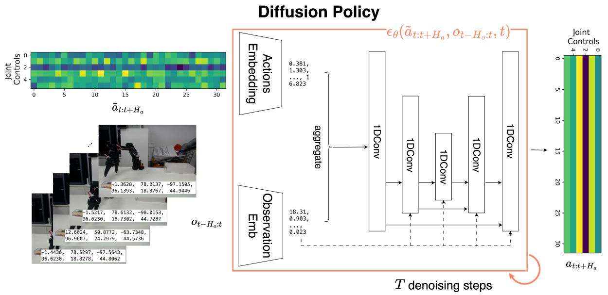

上图展示的是 Diffusion Policy 的一种典型条件去噪实现：左侧是带噪声的动作序列，下方是历史观测，中间的条件网络把两者融合起来，预测当前时间步上的噪声。经过 $T$ 次迭代去噪后，右侧得到可执行的动作序列。图中的 `1DConv` 对应论文里的 CNN 型时序去噪网络；论文中也讨论了 Transformer 型实现。

具体做法：让噪声预测网络 $\epsilon_\theta$ 额外接收观测作为条件。若把预测的整段动作记为 $a_{t:t+T_p-1}$，历史观测窗口记为 $o_{t-T_o+1:t}$，则训练目标可以写成：

$$
\mathcal{L}(\theta) = \mathbb{E}_{i,\, a_{t:t+T_p-1},\, \epsilon}\left[\left\| \epsilon - \epsilon_\theta\!\left(\sqrt{\bar{\alpha}_i}\, a_{t:t+T_p-1} + \sqrt{1 - \bar{\alpha}_i}\, \epsilon,\; i,\; o_{t-T_o+1:t}\right)\right\|^2\right]
$$


| 符号 | 含义 | 典型值 |
|------|------|--------|
| $a_{t:t+T_p-1}$ | 要生成的整段动作预测（prediction horizon） | $T_p = 16$（Diffusion Policy 常用，可调） |
| $o_{t-T_o+1:t}$ | 条件观测窗口（observation horizon） | $T_o = 2$ |
| $T_a$ | 每次实际执行后再重规划的动作步数（action horizon） | $T_a = 8$ |
| $\epsilon_\theta$ | 噪声预测网络（U-Net 或 Transformer） | — |


推理时的流程：

1. 采样一个随机噪声动作序列：$\tilde{a} \sim \mathcal{N}(0, I)$，形状为 $T_p \times d_a$。
2. 用当前观测 $o$ 作为条件输入噪声预测网络。
3. 迭代去噪 $T$ 步，得到完整的动作预测序列。
4. 执行其中前 $T_a$ 步动作。
5. 再根据最新观测滚动规划下一段序列。

回顾 ACT 的推理：$z = 0$，直接解码。这意味着 ACT 在推理时使用的是**固定 latent 的确定性生成**，不再显式采样不同的隐变量模式。而 Diffusion Policy 的推理从随机噪声开始，**每次采样都可能走向不同的模式**。迭代去噪过程天然地在多个模式之间做选择，而不是取平均。

## 4.5 代价：多步采样与实时性压力

Diffusion Policy 的代价是推理速度。标准 DDPM 把生成过程离散成很多个小的去噪步骤，采样步数明显多于 ACT 的单次前向，这在实时机器人控制中是一个实际瓶颈。

## 4.6 本节小结

**核心创新**：Diffusion 把生成式策略从 CVAE 的"单隐变量一次解码"推进到"多步迭代去噪"。去噪过程从随机噪声出发，天然地在多个动作模式之间做选择而不是取平均，多模态建模能力比 ACT 更强；Diffusion Policy 也验证了这套框架在真实机器人任务上的有效性。

**局限性**：标准 DDPM 需要多步去噪，推理明显慢于 ACT 的单次前向，在实时控制下是真正的瓶颈——这正是 §5 Flow Matching 要解决的问题。

# 5 Flow Matching：从扩散到连续流

> 本节介绍 Flow Matching 的核心原理，并说明它为什么适合用来建模连续动作分布，以及它如何自然衔接到以 $\pi_0$ 为代表的一类 VLA 动作生成头。

## 5.1 Diffusion 留下的问题：步数多、路径曲折

回顾本讲的三步：§1 建立核心认知（机器人策略应该从点预测 $a = f(o)$ 走向分布建模 $a \sim p(a \mid o)$）；§2 中 ACT 用一个隐变量 $z$ 编码动作模式、一次解码出 action chunk；§4 中 Diffusion Policy 更进一步——用一串隐变量 $z_T, z_{T-1}, \ldots, z_0$ 逐步去噪，多模态建模能力更强。但 Diffusion 有一个明显的代价：**推理速度慢**。

| 方法 | 推理步数 | 推理方式 |
|------|----------|----------|
| ACT（CVAE） | 1 步 | 采样 $z$，一次解码 |
| Diffusion Policy（DDPM） | 10~1000 步 | 从噪声逐步去噪 |
| Diffusion Policy（DDIM 加速） | ~10 步 | 跳步去噪 |

即使用 DDIM 加速，Diffusion 仍然需要多步迭代。在实时机器人控制中，每一步都要跑一次完整的神经网络前向传播，这是一个实际瓶颈。

**为什么 Diffusion 往往需要这么多步？** 一个重要原因在于 Diffusion 的前向过程带有随机性，导致常见采样轨迹更像是逐步修正、逐步去噪的过程。步数过少时，离散化误差和建模误差都更容易显著暴露出来。

$$
\underbrace{\text{Diffusion}}_{\text{常见采样轨迹更复杂，通常需要较多步}} \quad\longrightarrow\quad \underbrace{\text{Flow Matching}}_{\text{可学习确定性流，常见设定下步数更少}}
$$

## 5.2 核心直觉：学一条把噪声直推到动作的速度场

Flow Matching 的想法非常直接：**不走弯路。直接学一个向量场，把简单分布沿直线推到目标分布。**

用一个物理类比：

- **Diffusion** 像是把墨水滴入水中（扩散），然后试图逆转这个随机过程——路径弯弯曲曲，需要很多步才能走回来。
- **Flow Matching** 像是给每个粒子指定一个速度方向，让它们沿着一条规则的连续路径从起点流到终点。在常见的线性插值设定下，这条路径会更直观，也更容易高效求解。

更具体地说：

1. **起点**：从一个简单分布（如标准正态 $\mathcal{N}(0, I)$）采样一个点 $z_0$。
2. **终点**：数据分布中的一个真实样本 $z_1$。
3. **学习目标**：学一个向量场 $v_\theta(z, t)$，告诉每个点在每个时刻应该往哪个方向、以多大速度移动。
4. **生成过程**：从 $z_0$ 出发，沿着向量场积分到 $t=1$，得到生成结果。

$$
\underbrace{z_0 \sim \mathcal{N}(0, I)}_{\text{噪声}} \quad \xrightarrow{\text{沿 } v_\theta \text{ 积分}} \quad \underbrace{z_1}_{\text{生成的数据}}
$$

下图展示了一个 2D 棋盘格数据集上的 Flow Matching 过程。从 $t=0$ 的标准正态噪声出发，分布沿着学到的向量场逐步流动，最终在 $t=1$ 时形成清晰的棋盘格结构：

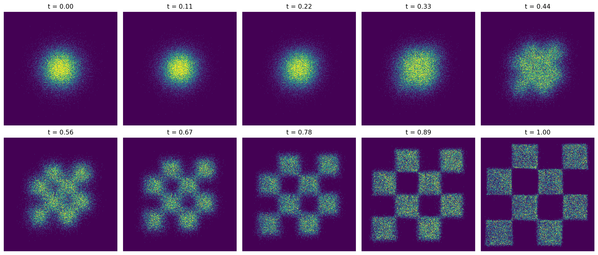

### 5.2.1 流（Flow）

Flow Matching 的核心数学对象是一个**流** $\psi: [0, 1] \times \mathbb{R}^d \to \mathbb{R}^d$，它描述了样本随时间的运动轨迹：$\psi(0, z) = z$（初始位置就是自己），$\psi(1, z)$ 是最终生成的样本。流把 $t=0$ 时刻的分布 $p_0$（简单分布）连续地变换到 $t=1$ 时刻的分布 $p_1$（数据分布）。

### 5.2.2 向量场（Vector Field）

流的运动由一个**向量场** $v: [0, 1] \times \mathbb{R}^d \to \mathbb{R}^d$ 驱动。向量场告诉每个点在每个时刻的"速度"：

$$
\frac{d}{dt} \psi(t, z) = v(t, \psi(t, z))
$$

这就是一个常微分方程（ODE）。给定初始条件 $\psi(0, z) = z$，沿着向量场积分就能得到完整的轨迹。

| 符号 | 含义 |
|------|------|
| $\psi(t, z)$ | 从初始点 $z$ 出发，在时刻 $t$ 的位置 |
| $v(t, x)$ | 在时刻 $t$、位置 $x$ 处的速度向量 |
| $p_0$ | 初始分布（通常是 $\mathcal{N}(0, I)$） |
| $p_1$ | 目标数据分布 |

### 5.2.3 与 Diffusion 的关键区别

Diffusion 的生成过程本质上是一个**随机微分方程（SDE）**——每一步都有随机噪声项。Flow Matching 的生成过程是一个**常微分方程（ODE）**——完全确定性的，没有随机项。

$$
\underbrace{\text{Diffusion: } dz = f(z, t)\,dt + g(t)\,dW}_{\text{SDE，有随机项 } dW} \quad\longleftrightarrow\quad \underbrace{\text{FM: } \frac{dz}{dt} = v_\theta(z, t)}_{\text{ODE，纯确定性}}
$$

确定性路径意味着：采样可以被表述成标准 ODE 积分问题。在很多常见设定下，这会带来更平滑、更可预测的采样过程，并允许用较少的积分步数得到可用结果。

## 5.3 Conditional Flow Matching：线性插值路径 + 目标速度场

直接学习一个能把整个 $p_0$ 变换到 $p_1$ 的全局向量场是困难的。一个关键简化是：**Conditional Flow Matching（CFM）**。

核心思想：不直接在难以显式写出的全局向量场上训练，而是在更容易构造的**条件概率路径**上定义一个条件向量场。在线性插值这个最常见的教学设定里，我们可以把一对端点样本 $(z_0, z_1)$ 看成这条条件路径的条件信息。

为什么这行得通？想象你站在某个中间位置 $z_t$，想知道该往哪走。全局向量场 $u_t(z_t)$ 很难直接写出来，但如果我们额外知道这条条件路径由哪对端点 $(z_0, z_1)$ 生成，那么对应的条件向量场 $u_t(z_t \mid z_0, z_1)$ 就会简单得多。在线性插值情形下，它甚至就是一个常向量。更进一步，边际向量场可以理解为对这些条件向量场做适当平均后的结果。这样一来，训练就可以转化为回归一个显式、便宜、易采样的条件目标，而不必直接回归难以获得的全局目标。

### 5.3.1 线性插值路径

CFM 最常用的选择是**线性插值**（也叫 Optimal Transport 路径）：

$$
z_t = (1 - t)\, z_0 + t\, z_1
$$

| 符号 | 含义 |
|------|------|
| $z_0$ | 从先验分布采样的噪声，$z_0 \sim \mathcal{N}(0, I)$ |
| $z_1$ | 从数据集采样的真实样本，$z_1 \sim p_1$ |
| $z_t$ | 时刻 $t$ 的插值点，$t \in [0, 1]$ |

这条路径的含义非常直观：在 $t=0$ 时是纯噪声，在 $t=1$ 时是真实数据，中间是两者的线性混合。

下图展示了 1D 情况下的线性插值路径。每条线连接一个噪声点 $z_0$（左侧）和一个数据点 $z_1$（右侧），中间的 $z_t$ 就是两者的线性混合：

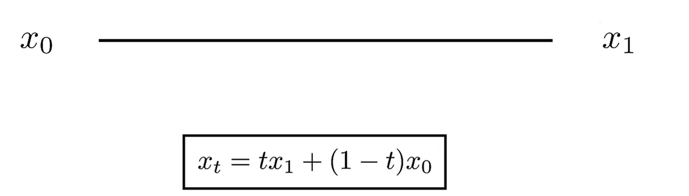

### 5.3.2 目标向量场：两个公式就够了

沿着线性插值路径，每个点的"速度"是常数：

$$
\frac{d}{dt} z_t = z_1 - z_0
$$

这就是我们要让神经网络学习的目标向量场：**在时刻 $t$、位置 $z_t$ 处，速度应该是 $z_1 - z_0$**。整个 Flow Matching 的核心思想，归结到底就是两个公式：

$$
\boxed{z_t = (1-t)\,z_0 + t\,z_1} \qquad \boxed{\frac{d}{dt}z_t = z_1 - z_0}
$$

第一个公式定义了从噪声到数据的路径（线性插值），第二个公式是这条路径的导数（速度）。神经网络要学的就是这个速度——一个从 $z_0$ 指向 $z_1$ 的向量。给定当前位置 $z_t$，模型预测"往哪走、走多快"，就能把噪声推向数据。更完整的理论推导会把这个直觉放到条件概率路径和边际向量场的框架下，但对线性插值这个最常见的入门情形来说，最终训练目标确实可以落到这样一个非常简单的速度回归问题上。

与 Diffusion 对比一下：

| | Diffusion（预测噪声） | Flow Matching（预测速度） |
|---|---|---|
| 插值方式 | $z_t = \sqrt{\bar{\alpha}_t}\, z_0 + \sqrt{1-\bar{\alpha}_t}\, \epsilon$（非线性） | $z_t = (1-t)\, z_0 + t\, z_1$（线性） |
| 学习目标 | 预测加入的噪声 $\epsilon$ | 预测速度 $z_1 - z_0$ |
| 路径形状 | 弯曲（受噪声调度影响） | 笔直（线性插值） |

线性路径是很多 Flow Matching 实现高效的一个重要原因。在常见设定下，更规则的概率路径通常更容易用较少步数进行数值积分。

### 5.3.3 训练目标

Flow Matching 的训练目标和 Diffusion 一样简洁：

$$
\mathcal{L}(\theta) = \mathbb{E}_{t,\, z_0,\, z_1}\left[\left\| v_\theta\!\left((1-t)\, z_0 + t\, z_1,\; t\right) - (z_1 - z_0)\right\|^2\right]
$$

$$
t \sim \mathcal{U}([0, 1]), \quad z_0 \sim \mathcal{N}(0, I), \quad z_1 \sim \mathcal{D}
$$

| 符号 | 含义 |
|------|------|
| $v_\theta(z_t, t)$ | 神经网络预测的速度向量 |
| $z_1 - z_0$ | 真实的目标速度（线性路径的导数） |
| $t$ | 从 $[0, 1]$ 均匀采样的连续时间 |
| $z_0$ | 从标准正态采样的噪声 |
| $z_1$ | 从数据集采样的真实样本 |

训练过程用一句话概括：

> **随机选一个时刻 $t$，在噪声和数据之间做线性插值得到 $z_t$，让网络预测从噪声指向数据的速度。**

与 Diffusion 训练的对比：

| | Diffusion | Flow Matching |
|---|---|---|
| 时间采样 | $t \sim \mathcal{U}(\{1, \ldots, T\})$，离散 | $t \sim \mathcal{U}([0, 1])$，连续 |
| 构造 $z_t$ | $z_t = \sqrt{\bar{\alpha}_t}\, z_0 + \sqrt{1-\bar{\alpha}_t}\, \epsilon$ | $z_t = (1-t)\, z_0 + t\, z_1$ |
| 预测目标 | 噪声 $\epsilon$ | 速度 $z_1 - z_0$ |
| 需要噪声调度 $\{\beta_t\}$？ | 是 | 否 |

在这种教学版线性插值设定里，训练不需要像经典离散 diffusion 那样显式设计一套噪声调度表。这通常会让实现和调参都更直接。

## 5.4 采样：少步 ODE 积分（Euler / Midpoint）

训练好之后，生成新样本的过程是求解一个 ODE：

$$
z_0 \sim \mathcal{N}(0, I), \qquad \frac{dz}{dt} = v_\theta(z_t, t), \quad t: 0 \to 1
$$

从 $t=0$（噪声）积分到 $t=1$（数据），得到生成结果。在实践中，用数值 ODE 求解器（如 Euler 或 Midpoint 方法）来离散化这个过程。

### 5.4.1 Euler 方法（最简单）

把 $[0, 1]$ 分成 $N$ 步，步长 $\Delta t = 1/N$，逐步积分：

$$
z_{t+\Delta t} = z_t + \Delta t \cdot v_\theta(z_t, t)
$$

### 5.4.2 Midpoint 方法（更常用）

先走半步估计中点速度，再用中点速度走完整步：

$$
z_{\text{mid}} = z_t + \frac{\Delta t}{2} \cdot v_\theta(z_t, t)
$$

$$
z_{t+\Delta t} = z_t + \Delta t \cdot v_\theta\!\left(z_{\text{mid}},\; t + \frac{\Delta t}{2}\right)
$$

Midpoint 方法每步需要两次网络前向，但精度更高，总步数可以更少。

### 5.4.3 为什么 Flow Matching 步数更少

关键在于概率路径和采样过程的复杂度。在线性插值等常见设定下，路径更规则，ODE 求解器往往可以用更少步数获得可用结果；而在 diffusion 的常见采样流程里，逐步修正的过程通常对步数更敏感，粗步长更容易带来明显质量损失，因此往往需要更多步来保证精度。

| 方法 | 典型推理步数 | 每步操作 |
|------|-------------|----------|
| DDPM | 1000 | 一次网络前向 |
| DDIM | 10~50 | 一次网络前向 |
| Flow Matching（Euler） | 8~20 | 一次网络前向 |
| Flow Matching（Midpoint） | 5~10 | 两次网络前向 |

## 5.5 Flow Matching Policy，以及给 $\pi_0$ 动作头铺的路

### 5.5.1 与 Diffusion 的全面对比

把前面的要点汇总成一张表：

| | Diffusion（DDPM） | Flow Matching |
|---|---|---|
| 数学框架 | 随机微分方程（SDE） | 常微分方程（ODE） |
| 前向过程 | 逐步加噪（马尔可夫链） | 线性插值（确定性） |
| 学习目标 | 预测噪声 $\epsilon$ | 预测速度 $v = z_1 - z_0$ |
| 时间建模 | 离散 $t \in \{1, \ldots, T\}$ | 连续 $t \in [0, 1]$ |
| 路径形状 | 弯曲（布朗运动式） | 笔直（最优传输式） |
| 推理过程 | 逐步去噪（随机） | ODE 积分（确定性） |
| 典型推理步数 | 10~1000 | 5~10 |
| 噪声调度 | 需要精心设计 $\{\beta_t\}$ | 不需要 |
| 多模态能力 | 强 | 强 |
| 训练稳定性 | 好 | 好 |

核心区别用一句话概括：

> **Diffusion 更像逐步去噪，Flow Matching 更像沿连续向量场做积分。在常见设定下，后者往往能用更少步数完成采样。**

一种常见的理解方式是：在合适的条件概率路径和目标向量场定义下，diffusion 可以被放进更一般的 flow-based 学习框架里来理解。也正因为这个统一视角，Flow Matching 常被看作比经典 diffusion 表述更一般的一类框架。

### 5.5.2 Flow Matching Policy：把 Flow Matching 用到机器人动作生成

和 Diffusion Policy 的思路一样，Flow Matching 也可以条件化到观测上，用于生成机器人动作。**核心改动：让速度场网络额外接收观测作为条件。** 这里动作块用 $H_a$、观测窗口用 $H_o$ 记，对应的就是 §4 Diffusion Policy 里的 $T_p$ 与 $T_o$，只是换了字母。下面写的是一个教学版、最常见的条件化 Flow Matching 目标；具体系统在时间采样分布、时间区间、网络结构和噪声参数化上，往往还会做额外改动。训练目标变为：

$$
\mathcal{L}(\theta) = \mathbb{E}_{t,\, a_{t:t+H_a},\, \epsilon}\left[\left\| v_\theta\!\left((1-t)\, \epsilon + t\, a_{t:t+H_a},\; t,\; o_{t-H_o:t}\right) - (a_{t:t+H_a} - \epsilon)\right\|^2\right]
$$

$$
t \sim \mathcal{U}([0, 1]), \quad \epsilon \sim \mathcal{N}(0, I), \quad o_{t-H_o:t}, a_{t:t+H_a} \sim \mathcal{D}
$$


| 符号 | 含义 | 典型值 |
|------|------|--------|
| $a_{t:t+H_a}$ | 要生成的动作块（action chunk） | $H_a = 16$ 步（沿用 Diffusion Policy 的典型窗口，非 $\pi_0$ 原始设定） |
| $o_{t-H_o:t}$ | 条件观测（历史观测窗口） | $H_o = 2$ 步 |
| $v_\theta$ | 速度场网络（Transformer 或 MLP） | — |
| $\epsilon$ | 从标准正态采样的噪声 | — |


推理时的流程：

1. 采样一个随机噪声 action chunk：$\tilde{a} \sim \mathcal{N}(0, I)$，形状为 $H_a \times d_a$。
2. 用当前观测 $o$ 作为条件输入速度场网络。
3. 用 ODE 求解器积分 $N$ 步。常见实现里这个步数往往是个位数到十几步。
4. 得到生成的 action chunk。
5. 执行前几步动作，再滚动规划下一段 chunk。

与 Diffusion Policy 的推理对比：

| | Diffusion Policy | Flow Matching Policy |
|---|---|---|
| 起点 | 随机噪声 $\tilde{a} \sim \mathcal{N}(0, I)$ | 随机噪声 $\tilde{a} \sim \mathcal{N}(0, I)$ |
| 每步操作 | 预测噪声 → 去噪一步 | 预测速度 → ODE 积分一步 |
| 常见步数 | 10~100 | 5~10 |
| 路径性质 | 随机（SDE） | 确定性（ODE） |

这条演进线最终汇入 VLA：连续动作生成不再只停留在单步回归，而是逐步走向更强的分布建模。Flow Matching 是其中一种很自然的落点，因为它既保留了生成式动作建模的表达力，又更容易把采样过程写成少步数的 ODE 积分。以 $\pi_0$ 为代表的一类系统，就把这种思路和视觉-语言 backbone 结合在了一起——$\pi_0$ 的具体架构和训练细节将在讲 11 展开。

## 5.6 本节小结

**核心创新**：Flow Matching 用确定性连续流（ODE）替代 Diffusion 的随机去噪——直接学一条把噪声推向动作的速度场，前向路径是笔直的线性插值而非弯曲的布朗运动。它在保留多模态表达力的同时，把采样写成少步数的 ODE 积分（常见个位数到十几步），比 Diffusion 更快。

**局限性**：作为动作生成头，它解决的仍只是"给定观测怎么生成一段连续动作"，本身并不带来"听懂语言、泛化到没见过的任务"的能力；要做到这一点，需要把它接到一个视觉-语言大模型骨干上，这就引出了下一讲的 $\pi_0$ 家族。

# 6 本讲小结

## 6.1 三代方法演进：CVAE → Diffusion → Flow Matching

回顾本讲从 §1 到 §5 的完整路线：朴素 BC 撞上误差累积和多模态两堵墙，逼着策略从点预测 $a = f(o)$ 转向分布建模 $a \sim p(a \mid o)$；三条生成式主线依次登场。

$$
\underbrace{\text{ACT（CVAE）}}_{\text{§2}} \quad\longrightarrow\quad \underbrace{\text{Diffusion Policy}}_{\text{§4}} \quad\longrightarrow\quad \underbrace{\text{Flow Matching}}_{\text{§5}} \quad\longrightarrow\quad \underbrace{\text{$\pi_0$ 等连续动作 VLA}}_{\text{下一讲}}
$$


| | ACT（§2） | Diffusion Policy（§4） | Flow Matching（§5） |
|---|---|---|---|
| 生成范式 | CVAE：一个 $z$，一次解码 | 多步去噪：$z_T \to z_0$ | 连续流：ODE 积分 |
| 多模态能力 | 靠 $z$ 区分模式（推理时 $z=0$） | 靠迭代去噪选择模式 | 靠连续流选择模式 |
| 推理步数 | 1 | 10~1000 | 5~10 |
| 推理速度 | 最快 | 最慢 | 中间偏快 |
| 训练复杂度 | 需要 KL 平衡 | 需要噪声调度 | 最简单（速度场 MSE，无需噪声调度） |


每一代方法都在解决上一代的核心瓶颈：ACT 解决了朴素 BC 的多模态问题，但推理时放弃了多模态采样（$z=0$）；Diffusion Policy 恢复了真正的多模态采样，但推理太慢；Flow Matching 保持了多模态能力，并在很多常见设定下减少了推理步数。

## 6.2 一句话总结

> 一句话总结：模仿学习从"看图回归一个动作"走向"看图生成一段动作分布"——ACT 用 CVAE 建模多模态、用 action chunking 做短时规划，Diffusion 用多步去噪换更强的多模态，Flow Matching 用确定性连续流换更少的推理步数；三者是同一个问题 $p(\mathbf{a}_{t:t+k} \mid o_t)$ 越来越好的解法。

## 6.3 下一讲：从动作头到完整 VLA（OpenVLA → $\pi_0$ 家族）

本讲的三条主线都是"单任务 / 少任务"的生成式策略：它们解决的是"给定观测，怎么生成一段连续动作"。但真正的通用机器人还要能听懂语言、泛化到没见过的任务——这就要把这些动作建模能力，接到一个视觉-语言大模型的骨干上。

这条线最终汇入 VLA：连续动作生成不再停留在单步回归，而是逐步走向更强的分布建模。下一讲（讲 11）就从 OpenVLA 讲起，看 VLA 如何把图像、语言、机器人状态统一进一个大模型，并把本讲的 flow matching 作为 $\pi_0$ 家族的动作头——动作怎么被"流"出来。

# 参考资料

[1] ZHAO T Z, KUMAR V, LEVINE S, et al. Learning fine-grained bimanual manipulation with low-cost hardware[EB/OL]. (2023-04-23)[2026-06-26]. https://arxiv.org/abs/2304.13705.

[2] CHI C, XU Z, FENG S, et al. Diffusion policy: visuomotor policy learning via action diffusion[EB/OL]. (2023-03-07)[2026-06-26]. https://arxiv.org/abs/2303.04137.

[3] HO J, JAIN A, ABBEEL P. Denoising diffusion probabilistic models[EB/OL]. (2020-06-19)[2026-06-26]. https://arxiv.org/abs/2006.11239.

[4] CAPUANO F, PASCAL C, ZOUITINE A, et al. Robot learning: a tutorial[EB/OL]. (2025-10-14)[2026-06-26]. https://arxiv.org/abs/2510.12403.

[5] LIPMAN Y, CHEN R T Q, BEN-HAMU H, et al. Flow matching for generative modeling[EB/OL]. (2022-10-06)[2026-06-26]. https://arxiv.org/abs/2210.02747.

[6] BLACK K, BROWN N, DRIESS D, et al. $\pi_0$: a vision-language-action flow model for general robot control[EB/OL]. (2024-10-31)[2026-06-26]. https://arxiv.org/abs/2410.24164.

> 本讲的 AE→VAE→CVAE 演进图、ACT 训练流程示意图、Flow Matching 二维棋盘格与一维线性插值可视化图为本课程教学自制（本课程实验 EAI-wri-003 渲染），不引外部来源。
