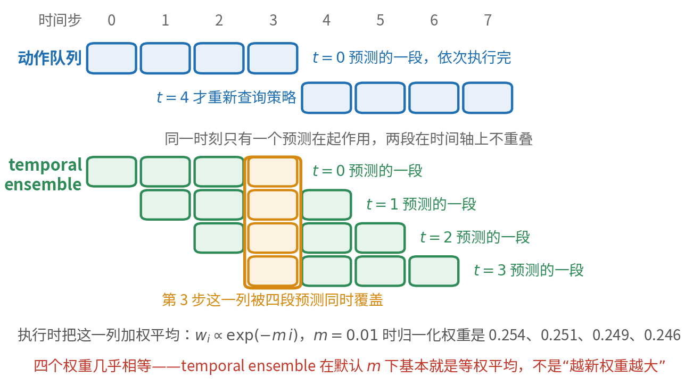
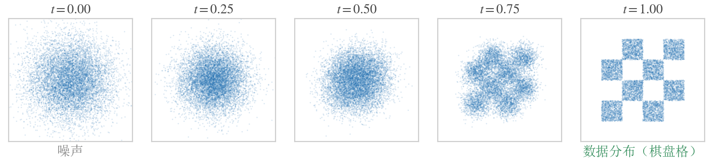
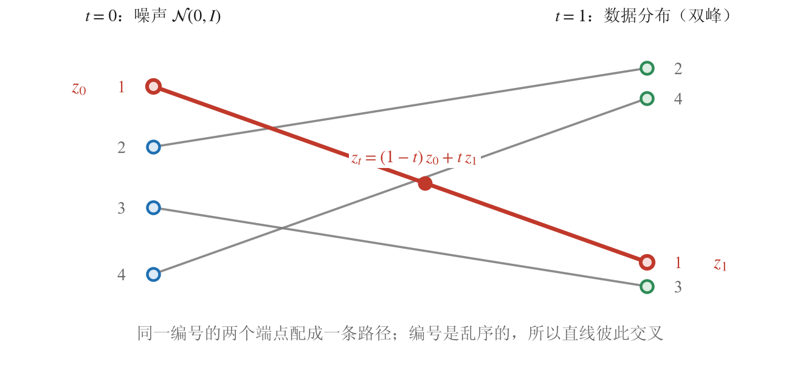

# 1 朴素行为克隆撞墙：为什么需要生成式策略

第9讲采到了一份能训练的数据集：每条轨迹都是人类示教的一串 $(o_t, a_t)$ 配对。这一讲开始，从数据里真正把策略学出来。

最朴素、也最直接的做法就是**行为克隆（Behavioral Cloning, BC）**：把示教数据当成监督学习的训练集，输入观测、回归动作。它离线、安全，也不需要奖励（reward，机器人做对一步时环境给的分数，要到第14讲才登场），是最能落地的起点。但朴素 BC 很快会撞上两堵墙，本讲后面的 ACT、Diffusion Policy、Flow Matching 三条路线，都是冲着这两堵墙去的。

## 1.1 从确定性映射说起：行为克隆在学什么

最朴素的 BC 学的是一个确定性映射：

$$
a_t = \pi_\theta(o_t)
$$

各变量含义：

| 符号 | 含义 | 典型维度 |
|------|------|----------|
| $o_t$ | 时刻 $t$ 的观测（observation），包含图像和本体感知 | 图像 $3 \times H \times W$ + 关节角 $d_s$ 维 |
| $a_t$ | 时刻 $t$ 的动作（action），如关节角速度或位置增量 | $d_a$ 维，例如双臂 14 维 |
| $\pi_\theta$ | 参数为 $\theta$ 的策略网络 | — |

训练目标是最小化专家数据上的重建误差：

$$
\min_\theta \; \mathbb{E}_{(o_t, a_t) \sim \mathcal{D}} \; \mathcal{L}\!\left(a_t,\; \pi_\theta(o_t)\right)
$$

| 符号 | 含义 |
|------|------|
| $\mathcal{D}$ | 专家示教数据集，包含多条轨迹 |
| $\mathcal{L}$ | 损失函数，如 MSE 或 L1 |

这个框架有两个根本性问题。

## 1.2 死穴一：误差累积（Compounding Error）

单步 BC 的执行链是：

$$
o_t \xrightarrow{\pi} a_t \;\to\; o_{t+1} \xrightarrow{\pi} a_{t+1} \;\to\; \cdots
$$

训练时，模型只见过专家状态分布 $d^{\pi^*}$（专家策略 $\pi^*$ 诱导的状态分布）。推理时只要某一步 $a_t$ 有偏差，$o_{t+1}$ 就偏离专家轨迹，落进**分布外**（out-of-distribution, OOD）区域——也就是训练集里压根没出现过的那类观测。模型在分布外状态下更容易出错，误差沿时间轴滚雪球：

$$
\text{小误差} \;\to\; \text{偏离专家轨迹} \;\to\; \text{进入 OOD 状态} \;\to\; \text{更大误差} \;\to\; \text{任务失败}
$$

{width=50%}

图里深色那条是专家示教的腕部滚转指令，浅色那条是训练好的单步策略在闭环里实际发出的指令。两条线的**走势**是贴合的，说明网络确实学到了任务；但浅色线在每一步上都在深色线附近高频抖动，因为它是一步一步独立预测的，相邻两步之间没有任何约束。这些抖动本身就是上面那条链的起点：每一次微小的偏差都会把机器人推到一个略微不同的状态，而下一步的预测又建立在这个已经偏了的状态上。第 2 节的动作分块正是冲着这个“逐步”来的——一次预测一整段，段内的连贯性由网络自己保证。

## 1.3 死穴二：多模态动作分布（Multimodality）

人类示教数据中，同一个观测 $o_t$ 下可能存在多种都合理的动作。比如抓取一个杯子，可以从左边绕过去抓，也可以从右边绕过去抓，两条轨迹都是专家示教。

真实的条件分布 $p(a_t \mid o_t)$ 是**多峰的**（multimodal）。如果用 MSE 这类点回归损失，模型会学到各峰的加权平均：

$$
\hat{a}_t = \mathbb{E}_{a_t \sim p(a_t \mid o_t)}[a_t]
$$

| 符号 | 含义 |
|------|------|
| $\hat{a}_t$ | 模型预测的动作 |
| $p(a_t \mid o_t)$ | 给定观测 $o_t$ 下动作的真实条件分布 |

这个“平均动作”往往不属于任何一个合理模式——两边都不像，最后谁也做不好。

{width=50%}

## 1.4 要学的是一个分布，不是一个动作

从这两个死穴可以看出，关键转变是：策略不应该再学一个确定性的点映射 $a = f(o)$，而要去建模整个**条件分布** $a \sim p(a \mid o)$。

一旦把策略看成**条件生成问题**，很多后续方法就顺理成章了：

- 用隐变量（latent variable）表达“高层意图 / 风格 / 轨迹模式”；
- 用迭代去噪（iterative denoising）表达“逐步把噪声变成动作”；
- 用连续流（continuous flow）表达“把简单分布运输到动作分布”。

在机器人模仿学习里，生成模型扮演的角色首先是一个“动作分布建模器”：它要做的是把多个峰都表达出来，让“从左绕”和“从右绕”各自保留成一个模式，而不是被平均成中间那个谁也做不到的动作，也不是生成一张好看的图片。这就是生成模型进入机器人策略学习的入口。

## 1.5 三条生成式主线地图：CVAE / Diffusion / Flow Matching

接下来这一讲，会沿三条生成式主线把“如何建模 $p(a \mid o)$”讲透：


| 方法 | 核心想法 | 推理方式 | 在机器人里的意义 |
|------|----------|----------|------------------|
| **VAE / CVAE** | 用一个隐变量表达隐含模式 | 一次采样 + 一次解码 | 适合一次生成一整段动作，直接通向 ACT |
| **Diffusion** | 从噪声开始，逐步去噪得到动作 | 多步迭代 | 更强的多模态建模，直接通向 Diffusion Policy |
| **Flow Matching** | 学习从简单分布到目标分布的连续流 | ODE 积分，通常步数更少 | $\pi_0$ 一类 VLA 拿它当**动作头**（action head），第11讲 3 节展开 |


下面第 2 节（ACT）、第 4 节（Diffusion Policy）、第 5 节（Flow Matching），分别就是这三条线在机器人里的代表实现。

# 2 ACT：用 Action Chunking + CVAE 建模示教分布

> 本节讲的 ACT 出自 Zhao 等人 2023 年的工作[1]。那篇论文同时给出了一套低成本双臂遥操作硬件和跑在它上面的策略，这里只讲策略这一半。

## 2.1 两个核心想法：动作分块 + 隐变量

ACT 用两个机制分别对付第 1 节提出的两个问题：

| 问题 | ACT 的解法 | 核心思想 |
|------|-----------|----------|
| 误差累积 | **Action Chunking** | 一次预测未来 $k$ 步，缩短有效决策时域、缓解逐步累积 |
| 多模态分布 | **Conditional VAE** | 用隐变量 $z$ 建模不同动作模式 |

> 备注：Action Chunking 是**缓解**误差累积，不是消除**协变量偏移**（covariate shift，第8讲 3.2 节给过定义：策略自己走出来的状态分布和示教数据的状态分布对不上）。它把“每步都重新决策”换成“每 $k$ 步决策一次”，减少了自回归式的逐步偏移，但策略一旦走进示教没覆盖的状态，照样没有恢复机制。而且 chunk 越长，对新观测的反应就越慢，这是一个要按任务权衡的旋钮，2.6.2 会讲执行策略怎么在两者之间取平衡。

## 2.2 Action Chunking：把单步预测变成短时规划

ACT 不预测单步动作，而是一次预测未来 $k$ 步的动作序列（**action chunk**）：

$$
o_t \;\longrightarrow\; \hat{\mathbf{a}}_{t:t+k} = (\hat{a}_t,\; \hat{a}_{t+1},\; \ldots,\; \hat{a}_{t+k-1})
$$

| 符号 | 含义 | 典型值 |
|------|------|--------|
| $k$ | chunk size，一次预测的步数 | 100（LeRobot 默认） |
| $\hat{\mathbf{a}}_{t:t+k}$ | 预测的动作块，形状 $k \times d_a$ | $100 \times 14$ |
| $d_a$ | 动作维度（每步动作的自由度数） | 14（双臂各 7 个关节） |

在 **LeRobot 默认配置** 下，模型在 $t$ 时刻一次性预测一个长度为 $k$ 的 chunk，并默认把这 $k$ 步全部放入 action queue 依次执行，然后再重新查询策略。这样闭环频率从“每步一次”降到了“每 $k$ 步一次”，误差只在重新规划时才有机会继续累积。

> 备注：原论文里还重点讨论了另一种执行方式 **temporal ensembling**。下面的主线按 LeRobot 的默认实现（`temporal_ensemble_coeff = None`，即关闭）来讲，论文那套设定放在 2.6.2.2 节作为对照。

ACT 是一个**条件变分自编码器（CVAE）**，不是简单的回归器。在讲 ACT 的具体结构之前，先把 CVAE 的来龙去脉讲清楚。

## 2.3 从 AE 到 VAE 到 CVAE


图里三种自编码器是一条演进链：后一个都在前一个的基础上加一样东西。下面按这条链逐个拆。

### 2.3.1 Auto-Encoder（AE）：压缩与重建

AE 的目标很简单：把输入 $x$ 压缩成一个低维表示 $z$，再从 $z$ 重建出 $\hat{x}$。

$$
z = f_{\text{enc}}(x), \quad \hat{x} = f_{\text{dec}}(z)
$$

| 符号 | 含义 | 维度 |
|------|------|------|
| $x$ | 输入数据（如一张图片、一段动作序列） | $d_x$ |
| $z$ | 中间表示（latent representation） | $d_z$，远小于 $d_x$ |
| $\hat{x}$ | 重建输出 | $d_x$（和输入同维） |
| $f_{\text{enc}}$ | 编码器网络 | $\mathbb{R}^{d_x} \to \mathbb{R}^{d_z}$ |
| $f_{\text{dec}}$ | 解码器网络 | $\mathbb{R}^{d_z} \to \mathbb{R}^{d_x}$ |

AE 的问题：$z$ 是确定性的，隐空间没有结构。你没法在隐空间里“采样”来生成新数据。

### 2.3.2 Variational Auto-Encoder（VAE）：给隐空间加上概率结构

VAE 的关键改变：**编码器不再输出一个确定的 $z$，而是输出一个概率分布的参数**。

$$
f_{\text{enc}}(x) \;\to\; (\mu, \log\sigma^2) \quad\Longrightarrow\quad z \sim \mathcal{N}(\mu, \;\text{diag}(\sigma^2))
$$

| 符号 | 含义 | 维度 |
|------|------|------|
| $\mu$ | 后验分布的均值向量 | $d_z$(如 32 维) |
| $\log\sigma^2$ | 后验分布的对数方差向量(逐元素) | $d_z$ |
| $\sigma^2$ | 方差向量，$\sigma^2 = \exp(\log\sigma^2)$ | $d_z$ |
| $\mathcal{N}(\mu, \text{diag}(\sigma^2))$ | 对角高斯分布，各维度独立 | — |

训练时通过 **reparameterization trick** 采样（使采样过程可微分）：

$$
z = \mu + \sigma \odot \varepsilon, \quad \varepsilon \sim \mathcal{N}(0, I)
$$

| 符号 | 含义 |
|------|------|
| $\odot$ | 逐元素乘法（Hadamard product） |
| $\varepsilon$ | 从标准正态采样的噪声，形状 $d_z$ |
| $I$ | $d_z \times d_z$ 的单位矩阵 |

同时，训练目标里加入 **KL 散度**，把后验分布 $q(z \mid x)$ 约束到标准正态先验 $p(z) = \mathcal{N}(0, I)$ 附近：

$$
\mathcal{L}_{\text{VAE}} = \underbrace{\mathcal{L}_{\text{recon}}(x, \hat{x})}_{\text{重建损失}} + \underbrace{D_{\text{KL}}\!\left(q(z \mid x) \;\|\; \mathcal{N}(0, I)\right)}_{\text{KL 散度：约束隐空间}}
$$

**通俗理解 KL 散度这一项**：训练时有两股力在拉扯 $z$：

- **重建损失**说：“$z$，你得携带足够的信息，不然我没法还原动作。”——这股力让不同数据的 $z$ 尽量分开、各自编码有用信息。
- **KL 散度**说：“$z$，你别跑太远，待在标准正态 $\mathcal{N}(0, I)$ 附近。”——这股力把所有数据的 $z$ 往原点附近拉拢。

如果没有 KL 约束，编码器可以把不同数据映射到隐空间里任意位置——比如把“从左绕”映射到 $z=100$，把“从右绕”映射到 $z=-200$。隐空间会变得七零八落，中间大片区域是“空白”，推理时随便采一个 $z$ 大概率落在空白区，解码器生成的就是垃圾。

但如果 KL 约束太强，把后验完全压成标准正态，$z$ 就不携带任何信息了，所有数据的 $z$ 都变成同一个分布，解码器分不出“从左绕”还是“从右绕”，$z$ 等于白加了。

所以最终 $z$ 的分布会在两者之间找到平衡：它仍然编码了有用信息（不同模式的 $z$ 均值略有不同），但不同数据对应的 $z$ 分布彼此重叠、连续，不会散落到隐空间的犄角旮旯。这样推理时从 $\mathcal{N}(0, I)$ 附近取值，就能落在有意义的区域。

KL 这一股力的大小是可以调的：训练时给它配一个权重 $\beta$，$\beta$ 越大，往原点拉得越狠。ACT 把 $\beta$ 取到 10 这样一个相当大的值，图的是推理时的一个具体便利，2.5.3 节会讲清楚。

### 2.3.3 Conditional VAE（CVAE）：加入条件信息

CVAE 在 VAE 的基础上引入**条件变量 $c$**，让生成过程受条件控制：

$$
\text{编码器：} \quad q(z \mid x, c) = \mathcal{N}\!\left(\mu(x, c),\; \text{diag}(\sigma^2(x, c))\right)
$$

$$
\text{解码器：} \quad \hat{x} = f_{\text{dec}}(z, c)
$$


| 符号 | 含义 | 在 ACT 中对应 |
|------|------|---------------|
| $c$ | 条件变量 | **对 policy decoder 而言**是当前观测 $o_t$；**对 LeRobot 的 CVAE encoder 而言**实际输入只用机器人状态 $s_t$ |
| $x$ | 要建模的目标数据 | 动作块 $\mathbf{a}_{t:t+k}$ |
| $z$ | 隐变量，表达“风格/模式” | 动作模式（从左绕 vs 从右绕） |


在 ACT 的语境下，CVAE 的含义是：

$$
p(\mathbf{a}_{t:t+k} \mid o_t) = \int p(\mathbf{a}_{t:t+k} \mid o_t, z) \; p(z) \; dz
$$

| 符号 | 含义 |
|------|------|
| $p(\mathbf{a}_{t:t+k} \mid o_t)$ | 给定观测下动作块的条件分布（我们真正想建模的） |
| $p(\mathbf{a}_{t:t+k} \mid o_t, z)$ | 给定观测**和**隐变量后，动作块的分布（由 policy decoder 参数化） |
| $p(z) = \mathcal{N}(0, I)$ | 隐变量的先验分布 |

> 备注：上面是 **CVAE 的概念层表达**。如果落到 LeRobot 的具体实现，训练时的 VAE encoder 并不读取图像，只用 $(s_t, \mathbf{a}_{t:t+k})$ 去近似后验；图像只进 policy decoder 那一侧（2.4 节的结构图里就是右半边）。这是一个很容易和“概念上的条件变量 $o_t$”混淆的点。

不同的 $z$ 对应不同的动作模式。多模态分布被分解成：先采样 $z$（选择模式），再条件生成动作块（执行该模式）。

## 2.4 ACT 的整体架构与数据流


这张结构图左右两半是分开的两条通路，训练时都要走，推理时只走右半边：

1. **VAE Encoder**（左侧）：输入 `[CLS]` token、机器人关节状态、动作序列，加上位置编码，经过 Transformer Encoder，输出隐变量 $z$ 的分布参数。**仅训练时使用。**
2. **Transformer Encoder-Decoder**（右侧）：输入 $z$、机器人状态、图像特征，经过 Transformer Encoder + Decoder，输出预测的动作序列。**训练和推理都使用。**

训练时，ACT 做三件事：(1) VAE Encoder 从真实动作中提取隐变量 $z$；(2) Transformer 主干根据 $z$ 和观测预测动作块；(3) 用重建损失 + KL 正则来优化。下面按数据流的顺序走一遍。（接下来 2.4.1 那两张「训练过程 Step 1 / 2」图是同一套素材里连着的两张，它把 VAE Encoder 那一段拆成了两张，所以图上的 Step 号和小节号对不齐是正常的；2.4.2 的主干数据流图则是本书按 LeRobot 默认配置重画的。）

### 2.4.1 Step 1 — VAE Encoder：从真实动作中推断隐变量


VAE Encoder 的任务：看到机器人当前状态 $s_t$ 和接下来真实执行的 $k$ 步动作 $\mathbf{a}_{t:t+k}$，推断出“这段动作属于哪种风格/模式”，输出隐变量 $z$ 的后验分布参数：

$$
q(z \mid s_t, \mathbf{a}_{t:t+k}) = \mathcal{N}\!\left(\mu_\phi,\; \text{diag}(\sigma_\phi^2)\right)
$$

VAE Encoder 是一个 BERT 风格的 Transformer Encoder。它的输入是一串 **token**（词元，Transformer 处理的最小单位；这里一个 token 就是一个 512 维向量，可能来自一个状态、也可能来自一步动作）：


| 位置索引 | Token 来源 | 原始维度 | 投影方式 | 投影后维度 |
|----------|-----------|----------|----------|-----------|
| 0 | `[CLS]` token（可学习 embedding） | $512$ | `nn.Embedding(1, 512)` | $512$ |
| 1 | 机器人关节状态 $s_t$ | $d_s$（如 14） | 线性层 $W_s \in \mathbb{R}^{512 \times d_s}$ | $512$ |
| 2 ~ $k$+1 | 动作序列 $a_t, a_{t+1}, \ldots, a_{t+k-1}$ | 每步 $d_a$（如 14） | 线性层 $W_a \in \mathbb{R}^{512 \times d_a}$（共享） | 每步 $512$ |


整个输入序列长度为 $1 + 1 + k = k + 2$。以默认 $k = 100$ 为例，序列长度 = 102。加上**固定正弦位置编码**后送入 Transformer：

$$
\text{input} = [\text{CLS};\; W_s s_t;\; W_a a_t;\; W_a a_{t+1};\; \ldots;\; W_a a_{t+k-1}] + \text{PE}
$$


输入序列经过 **4 层 Transformer Encoder**（`n_vae_encoder_layers = 4`，8 头注意力，FFN 3200，$d_{\text{model}} = 512$）。取 `[CLS]` 位置（位置 0）的输出向量 $h_{\text{CLS}} \in \mathbb{R}^{512}$，经线性投影得到隐变量的分布参数：

$$
[\mu_\phi,\; \log\sigma^2_\phi] = W_{\text{latent}} \cdot h_{\text{CLS}}, \quad W_{\text{latent}} \in \mathbb{R}^{64 \times 512}
$$

前 32 维是后验均值 $\mu_\phi$，后 32 维是后验对数方差 $\log\sigma^2_\phi$。代码里存的是 $\log\sigma^2$（即 `log_sigma_x2`）而不是 $\log\sigma$，因为 $\sigma^2$ 必须为正，存对数可以让网络输出任意实数。

然后用 reparameterization trick 采样：

$$
z = \mu + \sigma \odot \varepsilon, \quad \varepsilon \sim \mathcal{N}(0, I), \quad \sigma = \exp(\log\sigma^2 / 2)
$$

这个 trick 的意义：直接“从分布里采样”没法算梯度，但把随机性挪到固定的 $\varepsilon$ 上后，$z$ 对 $\mu$ 和 $\sigma$ 就可微了。

> VAE Encoder **仅在训练时使用**。推理时没有真实动作可看，直接令 $z = \mathbf{0}$（2.6 节会解释为什么可以这样做）。

### 2.4.2 Step 2 — Transformer 主干：从观测生成动作块

{width=100%}

拿到 $z$ 后，它和观测一起送入 Transformer 主干（在 CVAE 框架里，这就是 **decoder** 侧）。这个主干由 Transformer Encoder + Transformer Decoder 两部分组成（注意：这里的 encoder/decoder 是 Transformer 架构意义上的，不是 VAE 意义上的）。

每路相机图像先经过 **ResNet18** 骨干网络（backbone，用 ImageNet 预训练权重），取 `layer4` 的输出特征图，再经过 $1 \times 1$ 卷积投影到 $d_{\text{model}} = 512$ 维，最后展平空间维度变成 token 序列：

$$
I^{(c)} \in \mathbb{R}^{3 \times H \times W} \;\xrightarrow{\text{ResNet18}}\; F^{(c)} \in \mathbb{R}^{512 \times H' \times W'} \;\xrightarrow{1\times1 \text{ Conv + flatten}}\; (f_1^{(c)}, \ldots, f_{H'W'}^{(c)})
$$

以 $480\times640$ 的图像为例，$H' = 15, W' = 20$，每路相机产生 $300$ 个 token（每个 512 维），附加 **2D 正弦位置编码**来保留空间位置信息。

将以下 token 拼接成一个序列送入 Transformer Encoder：

| Token 类型 | 数量 | 投影方式 | 位置编码 |
|-----------|------|----------|----------|
| latent token | 1 | 线性层 $\mathbb{R}^{32} \to \mathbb{R}^{512}$ | 可学习 1D |
| robot state token | 1 | 线性层 $\mathbb{R}^{d_s} \to \mathbb{R}^{512}$ | 可学习 1D |
| image tokens（每路相机） | $H' \times W'$ 个 | $1\times1$ 卷积 | 2D 正弦 |

以 4 路相机为例，总共 $1 + 1 + 4 \times 300 = 1202$ 个 token。经过 **4 层 Transformer Encoder**（`n_encoder_layers = 4`，8 头注意力，FFN 3200）处理，输出形状不变。

Decoder 的输入是 $k$ 个**全零查询向量**（类似 DETR 的 object queries），加上**可学习的位置编码** $E_{\text{pos}} \in \mathbb{R}^{k \times 512}$。每个查询对应动作序列中的一步。每个 Decoder Layer 包含三个子层：

1. **Self-Attention**：$k$ 个查询之间互相注意——让模型在生成第 $i$ 步动作时，能参考其他时间步的查询状态，从而保持动作序列的时序连贯性；
2. **Cross-Attention**：查询 cross-attend 到 Encoder 输出，这是动作生成的核心：每个时间步的查询从图像特征、机器人状态、隐变量中提取所需信息；
3. **FFN**：两层线性 + ReLU。

Decoder 到底堆几层，是这里唯一需要停一下的地方。上面那张图按 LeRobot 的默认值标了 **1 层交叉注意力**，但你在原始 ACT 的论文与讲解材料里会看到 decoder 框上写着 **7x cross-attention blocks**——两个数字都没写错：原始 ACT 的配置文件确实写了 7 层，可公开出来的那份实现里只有第 1 层的输出真正被取用，后面 6 层白算了。LeRobot 索性把默认值直接设成 1，好让复现出来的行为和原实现一致。同理，那些材料上把图像特征的通道数标成 728、再线性投影到 512，与本节按 ResNet18 讲的 512 也对不上，ResNet18 的 `layer4` 输出就是 512 通道，所以图上直接标 512。**跑起来的层数与维度以代码为准**，这也是上面那张图重画的原因。

Decoder 输出经过线性 action head 投影到动作空间：

$$
\hat{\mathbf{a}}_{t:t+k} = W_{\text{head}} \cdot \text{decoder\_out}, \quad W_{\text{head}} \in \mathbb{R}^{d_a \times 512}
$$

最终输出预测的动作块 $\hat{\mathbf{a}}_{t:t+k} \in \mathbb{R}^{B \times k \times d_a}$。

## 2.5 训练：重建损失 + KL 正则（$\beta=10$ 的直觉）

ACT 的训练损失是标准的 CVAE 形式——重建损失 + KL 正则：

$$
\mathcal{L} = \underbrace{\mathcal{L}_{\text{L1}}}_{\text{预测动作要接近真实动作}} + \;\beta \cdot \underbrace{D_{\text{KL}}}_{\text{隐空间要接近标准正态}}
$$

### 2.5.1 重建损失 $\mathcal{L}_{\text{L1}}$

逐元素 L1，先把补位（padding）的位置屏蔽掉再取均值——直觉上就是“预测的每一步每一个关节，和真实值的绝对误差”：

$$
\mathcal{L}_{\text{L1}} = \operatorname{mean}\!\left(\,|\mathbf{a} - \hat{\mathbf{a}}| \odot \mathbf{1}_{\text{not pad}}\right)
$$

其中 $\mathbf{1}_{\text{not pad}}$ 是非补位位置的掩码。当一段 chunk 落在 episode 尾部、未来动作不足 $k$ 步时，超出的部分会被补位填上，再被这个掩码屏蔽掉，不参与损失。

### 2.5.2 KL 散度 $D_{\text{KL}}$

衡量 VAE Encoder 输出的后验分布 $q(z \mid s_t, \mathbf{a})$ 和标准正态先验 $\mathcal{N}(0, I)$ 之间的距离。两个对角高斯之间的 KL 有解析公式（逐维度独立计算后求和）：

$$
D_{\text{KL}} = -\frac{1}{2} \sum_{i=1}^{d_z} \left( 1 + \log\sigma_i^2 - \mu_i^2 - \exp(\log\sigma_i^2) \right)
$$

### 2.5.3 为什么 $\beta = 10$ 这么大

$\beta$ 控制“隐空间规整度”和“重建精度”之间的权衡。$\beta$ 越大，隐空间越被压向 $\mathcal{N}(0, I)$，推理时用 $z=0$ 就越可靠；代价是重建可能略粗糙。LeRobot 默认 `kl_weight = 10.0`，偏向让推理时的 $z=0$ 更稳定。

## 2.6 推理：z=0 与动作块执行

### 2.6.1 为什么可以用 $z = 0$

这是 ACT 里最值得深究的设计决策。

**问题**：推理时没有未来动作 $\mathbf{a}_{t:t+k}$，无法运行 VAE Encoder，怎么得到 $z$？

**ACT 的答案**：直接令 $z = \mathbf{0} \in \mathbb{R}^{32}$。

**为什么这样做在实现上是合理的？一个直观理解是：**

1. 训练时 KL 项把后验 $q(z \mid s_t, \mathbf{a})$ 约束到 $\mathcal{N}(0, I)$ 附近；
2. $z = \mathbf{0}$ 是 $\mathcal{N}(0, I)$ 的均值；
3. 在 $\beta = 10$ 这样的强 KL 约束下，Decoder 训练时见过大量 $z \approx \mathbf{0}$ 的样本，所以取 $z = \mathbf{0}$ 落在它最熟悉的那片区域。

说得更准确些：这是原 ACT 实现为了拿到**确定性输出**做的工程选择，和它的训练正则配套成立，而不是“密度最高所以最有代表性”这种数学必然。顺带破一个常见直觉：在高维标准高斯里，概率**质量**集中在半径约 $\sqrt{d}$ 的一层壳上，原点虽然是密度众数，却并不是一个典型样本。所以真要在部署时采多个模式（用非零 $z$），得自己在任务上验证可靠性，不能想当然。

**代价**：放弃了多模态采样能力。推理时 ACT 总是走同一个模式，不会随机选择“从左绕”还是“从右绕”。这换来了更稳定、可复现的部署行为。

### 2.6.2 Action Chunking 的执行策略

{width=100%}

两种策略的差别全落在**重叠**上。上半那两排格子首尾相接，$t=4$ 处留着一道明显的缝，缝两侧的动作来自两次互不相干的预测，衔接处最容易跳一下。下半每晚一步的预测就往右错开一格，错出来的阶梯让第 3 步那一列同时压着四个格子——把这一列平均掉，缝也就被抹平了。图里把段长画成 4 步，所以重叠最深是四层；默认配置下段长是 100，重叠会厚得多。

图底下那行权重不是示意，是按下面 2.6.2.2 的公式算出来的真实取值：$m$ 取原始 ACT 的 0.01 时，四个归一化权重是 0.254、0.251、0.249、0.246——**几乎完全相等**。这里要留意 2.6.2.2 的编号方向：$i=0$ 是缓冲区里最老的那次预测，$w_i = \exp(-mi)$ 随 $i$ 递减，所以 $m$ 调得越大，占主导的是**最老**那次预测，而不是**最新**那次。$m=0.01$ 只是把这个偏向压到几乎看不见，落成一次等权平均。

#### 2.6.2.1 模式一：Action Queue（LeRobot 默认）

每次生成完整的 $k$ 步 chunk，但只执行前 `n_action_steps` 步，剩余丢弃，队列空了再重新规划。

| 符号 | 含义 | 典型值 |
|------|------|--------|
| $n$ | `n_action_steps`，每次实际执行的步数 | 可设为 1 ~ $k$ |
| $k$ | `chunk_size`，每次预测的步数 | 100 |

LeRobot 默认 `n_action_steps = 100 = chunk_size`，也就是一次预测 100 步、一次性全部执行完，再重新查询策略。

#### 2.6.2.2 模式二：Temporal Ensembling（论文重点讨论，LeRobot 默认关闭）

每步都重新规划一个完整 chunk，但把多个重叠 chunk 中对同一时刻的预测做**加权平均**。第 $i$ 个预测（**按从旧到新编号**，$i=0$ 是缓冲区里最老的那次规划）的权重为 $w_i = \exp(-m \cdot i)$，最终执行的动作是归一化加权平均：

$$
a_t^{\text{exec}} = \frac{\sum_{i} w_i \cdot \hat{a}_t^{(i)}}{\sum_{i} w_i}
$$

其中 $m$ 是 `temporal_ensemble_coeff`（原始 ACT 取 0.01[1]）。$m > 0$ 意味着更老的预测权重更高，这看起来有点反直觉，但它确实是 ACT 论文与 LeRobot 实现采用的定义，可以理解为在 chunk 边界处减少策略抖动、保留 action chunking 的平滑性。

打开这个开关有一个硬约束容易被忽略：`ACTConfig` 在校验时会要求 `n_action_steps == 1`，一旦 `temporal_ensemble_coeff` 不是 `None` 而 `n_action_steps` 还留着默认的 100，构造配置时就直接抛异常。道理也很直白，既然每一步都要重新规划、再和历史预测加权，就不能同时又让队列一口气吐 100 步。这两个旋钮是互斥的，不是可以叠加的。

### 2.6.3 完整数据流总结

**训练时**：

1. 输入 $s_t$（robot state）、$I_t$（多路图像）、目标动作块 $\mathbf{a}_{t:t+k}$；
2. VAE Encoder：$[\text{CLS},\, s_t,\, a_t,\, \ldots]$ 长度 $k+2$ 序列 $\to$ 4 层 Transformer Encoder $\to$ $h_{\text{CLS}}$ $\to$ $[\mu,\, \log\sigma^2]$ $\to$ reparameterization $\to$ $z \in \mathbb{R}^{32}$；
3. 主 Transformer Encoder：$[z,\, s_t,\, \text{img tokens}\ldots]$（如 1202 个 token）$\to$ 4 层 Encoder；
4. Transformer Decoder：$k$ 个全零 query cross-attend 到 Encoder 输出 $\to$ 1 层 Decoder $\to$ action head $\to$ $\hat{\mathbf{a}}_{t:t+k}$；
5. 损失：

$$
\mathcal{L} = \mathcal{L}_{\text{L1}}(\mathbf{a},\; \hat{\mathbf{a}}) + \beta \cdot D_{\text{KL}}\!\left(q(z \mid s, \mathbf{a}) \;\|\; \mathcal{N}(0, I)\right)
$$

**推理时**：输入当前 $s_t$、$I_t$ $\to$ 令 $z = \mathbf{0}$（跳过 VAE Encoder）$\to$ Transformer Encoder + Decoder $\to$ $\hat{\mathbf{a}}_{t:t+k}$ $\to$ Action Queue 或 Temporal Ensembling 执行。

### 2.6.4 关键超参数一览

| 超参数 | 符号 | 默认值 | 含义 |
|--------|------|--------|------|
| `chunk_size` | $k$ | 100 | 一次预测的动作步数 |
| `latent_dim` | $d_z$ | 32 | VAE 隐变量维度 |
| `dim_model` | $d_{\text{model}}$ | 512 | Transformer 隐层维度 |
| `n_heads` | $n_{\text{heads}}$ | 8 | 多头注意力头数 |
| `dim_feedforward` | $d_{\text{ff}}$ | 3200 | FFN 中间层维度 |
| `n_encoder_layers` | — | 4 | 主 Transformer Encoder 层数 |
| `n_decoder_layers` | — | 1 | 主 Transformer Decoder 层数 |
| `n_vae_encoder_layers` | — | 4 | VAE Encoder 层数 |
| `kl_weight` | $\beta$ | 10.0 | KL 散度权重 |
| `temporal_ensemble_coeff` | $m$ | None | Temporal ensembling 系数 |
| `vision_backbone` | — | resnet18 | 图像特征提取骨干网络 |
| `n_action_steps` | $n$ | 100 | 每次实际执行的动作步数 |

## 2.7 本节小结

**核心创新**：ACT 把策略从“点预测器”变成“条件生成器”——用 CVAE 建模 $p(\mathbf{a} \mid o)$ 捕捉示教的多模态，用 action chunking 把单步动作回归改成短时规划，缓解误差累积（闭环重规划频率、chunk 执行长度、以及走出分布之后怎么恢复，仍要单独设计）。它给后续方法立下了两个范式：**动作按 chunk 生成**、**连续控制当条件生成问题来做**，第 4 节、第 5 节都是沿着这两点把生成器换得更强。

**局限性**：推理时令 $z = 0$ 走的是确定性单模式生成，等于在执行阶段放弃了多模态采样；要真正在推理时保留多模态，就需要更强的生成器，这正是第 4 节 Diffusion 的出发点。

在换更强的生成器之前，第 3 节先动手把 ACT 真正训出来、部署起来，并把源码逐层读懂。

# 3 实验：训练、部署并解析 ACT

理论讲完，这一节把第 2 节的 ACT 真正跑起来：在仿真里训练、看效果，再落到真机，最后把训练与推理的代码逐层拆开。

## 3.1 在 LIBERO 上训练与推理

先用 LeRobot 的 ACT 在 LIBERO 数据集上训练一个抓取策略：`libero_goal` 套件里“把碗放到盘子上”（task 8）这条任务。训练脚本是 `code/vla/3_imitation_learning/3_1_act/train_act_libero.py`，训完之后用 `code/vla/3_imitation_learning/3_1_act/infer_act_libero.py` 加载 checkpoint 做闭环推理并录像。流程是标准三步：

1. **准备数据**：从 `lerobot/libero` 数据集中筛选目标任务的轨迹，dataset 会根据 `ACTConfig` 自动把每个时刻之后的 $k=100$ 步动作打包成 chunk 监督；
2. **训练**：用默认 `ACTConfig`（`chunk_size=100`、`kl_weight=10.0` 等）启动训练，监控 `train/loss` 下降；
3. **闭环评估**：LIBERO 内置仿真器和成功判定，训练过程中定期 rollout，看 `eval/pc_success`（成功率）从 0 逐步爬升，以及 `eval/video` 里策略一边看、一边按 chunk 出动作的执行过程。

**loss 下降不等于任务成功**（第8讲 3.1 节已经强调过），所以必须靠仿真器内的闭环 rollout 来真正判断策略好不好。LIBERO 这类带成功判定的仿真环境，正好提供了这条闭环验证的标尺。

跑完之后，真正要盯的是 `eval/pc_success` 这条曲线，它的形状本身就在说事。开头一段会长时间贴着 0，这是因为这个任务要求“抓起碗、移过去、放到盘子上”三步全对才算成功，前面若干次评估里策略往往只做对了前两步，成功率是离散的 0/1 统计，中间没有部分分。等它第一次离开 0，通常会在很短的训练区间里迅速抬起来，然后进入一个上下大幅震荡的高位平台：因为每次评估只跑 10 个 episode，成功率天然只有 0%、10%……100% 这 11 个取值，抖动是采样噪声不是性能反复。判断“训好了没有”要看这个平台的**中位水平**，不能看某一次评估的峰值——正好一次 100% 就宣布收敛，是这一步最常见的自欺。

{width=100%}

图上最值得盯的是绿色那段的**厚度**：平台期最低点 40%、最高点 100%，整整差了 60 个百分点，而这全部是 10 个 episode 带来的采样噪声。所以拿相邻两次评估的数字比高低是没有意义的——同一个模型，连着评两次就能给出 60% 和 100% 两个结果。真正能比的是中位线：这次 run 的 83% 才是它的成绩。

## 3.2 在 SO-101 Leader–Follower 臂上训练 ACT（无真机用仿真器替代）

把同一套 ACT 搬到真机几乎不用改算法，只换数据来源：

- **有真机**：用第9讲 4 节采的 SO-101 Leader–Follower 臂遥操作数据（例如“抓方块放盘子”），同样用 `lerobot-train` 训 ACT，训练命令封在 `code/vla/3_imitation_learning/3_1_act/train_act_cuboid.sh` 里；训完把策略部署回 SO-101 做闭环执行，动作维度 $d_a$、状态维度 $d_s$、相机路数都会由数据集自动对上，超参沿用默认；
- **无真机**：用 SO-101 仿真器跑同样的流程——键盘或手柄采一份格式一致的数据，训练同一个 ACT，在仿真器里做闭环评估。

无论真机还是仿真，ACT 的训练目标、网络结构、推理时的 $z=0$ 与动作队列执行都完全一致；变的只是数据集的维度和相机数量。

## 3.3 代码解析：LeRobot 源码逐层拆解

第 2 节讲“为什么这么设计”，这里讲“代码里到底怎么实现的”。下面把 ACT 在 LeRobot[2] 里的实现按数据流逐层拆开，训练脚本以 3.1 节的 LIBERO 训练为例、使用默认 `ACTConfig`。

引用的源码来自 **LeRobot v0.5.1**，也就是本书 `code/pyproject.toml` 钉住的那个版本。这个项目迭代很快，读到后面的版本时，类名和默认值可能已经变了，所以下面每处贴出的行，都写清了它在上游仓库里的路径，方便你回自己那份源码里对照。

### 3.3.1 从训练脚本入手

先从训练脚本出发，因为它把 ACT 在 LeRobot 里的主要模块都串了起来。核心流程串成一条链：

1. `LeRobotDatasetMetadata(dataset_id)` — 加载数据集元信息
2. `get_task_episodes()` — 筛选目标 task 的 episode
3. `ACTConfig(...)` — 配置策略超参
4. `DatasetConfig(repo_id, episodes)` — 配置数据集
5. `LiberoEnvConfig(task, task_ids)` — 配置评估环境
6. `TrainPipelineConfig(...)` — 组装训练 pipeline
7. `train(cfg)` — 启动训练

脚本 `code/vla/3_imitation_learning/3_1_act/train_act_libero.py` 的 `main()` 就是这条链：

```python
    dataset_id = "lerobot/libero"
    target_task = "put the bowl on the plate"

    # 只读 meta/ 就能拿到任务表，不用把整份数据集下下来
    metadata = LeRobotDatasetMetadata(dataset_id)
    # 从 40 个任务里挑出这一条的 episode 序号，后面用它做单任务训练
    episodes = get_task_episodes(metadata, target_task)

    # 超参全用 ACTConfig 的默认值：chunk_size=100、latent_dim=32、kl_weight=10.0。
    # 这组值来自原始 ACT 那批任务，换任务时至少要重调 chunk_size（它按秒理解才有意义）。
    policy_cfg = ACTConfig(
        device="cuda",
        push_to_hub=False,
    )

    dataset_cfg = DatasetConfig(
        repo_id=dataset_id,
        episodes=episodes,
        use_imagenet_stats=False,
        video_backend="pyav",
    )

    # 评估环境要和数据集对齐：同一个套件、同一条任务、同样的图像尺寸，
    # 否则策略在评估时看到的画面和训练时不是一回事。
    env_cfg = LiberoEnvConfig(
        task="libero_goal",
        task_ids=[8],
        obs_type="pixels_agent_pos",
        observation_height=256,
        observation_width=256,
    )

    cfg = TrainPipelineConfig(
        dataset=dataset_cfg,
        env=env_cfg,
        policy=policy_cfg,
        output_dir=output_dir,
        batch_size=BATCH_SIZE,
        num_workers=2,
        steps=100000,
        eval_freq=eval_freq,
        save_freq=eval_freq,
        log_freq=5,
        save_checkpoint=True,
        wandb=WandBConfig(enable=True, project="act-libero"),
        eval=EvalConfig(
            n_episodes=EVAL_EPISODES,
            batch_size=1,
            use_async_envs=False,
        ),
    )

    train(cfg)
```

几个值得说明的选择：

| 参数 | 值 | 为什么是这个值 |
|---------|-----|------|
| `batch_size` | 256 | 显存放得下就尽量大；ACT 的监督信号是动作块级的，一条样本带 100 步动作 |
| `steps` | 100000 | 单任务几十条轨迹，这个量级足够训到成功率进入平台 |
| `n_episodes` | 10 | 一次评估跑 10 个 episode。成功率是 0/1 统计，跑太少方差大到看不出趋势 |
| `eval_freq` / `save_freq` | 由 `EPOCHS_PER_EVAL` 推出 | 每 2 个 epoch 评一次；评估要在仿真器里跑完整 rollout，比训练一步贵得多，不能每步都评 |
| `use_imagenet_stats` | `False` | 用这份数据集自己的统计量归一化，仿真图像的分布和自然照片差得远 |

`eval_freq` 和 `save_freq` 取同一个值，是为了让曲线上任何一个点都能回去复现，每次评估都留一份 checkpoint。

`train()` 内部自动处理：

1. 数据加载 + `delta_timestamps`
2. 预处理（归一化）
3. 训练循环（前向 + 反向 + 梯度裁剪）
4. 定期保存 checkpoint
5. 定期在 LIBERO 环境中 rollout 评估

如果把 `train(cfg)` 再展开一层，大致可以理解成：

- `make_dataset()` — 加载数据 + `delta_timestamps`
- `make_policy()` — 创建 `ACTPolicy`
- `make_pre_post_processors()` — 创建归一化 pipeline
- training loop：`preprocessor(batch)` 归一化 + 搬设备 → `policy.forward(batch)` 前向 + 计算 loss → `eval_policy(env, policy, ...)` 定期仿真评估

首先要注意：**ACT 的动作块监督是 dataset 层生成的，不是模型内部现拼出来的。** 也就是说，这段训练脚本虽然短，但背后接起的是一整条以 action chunk 为中心的数据流，而不是“把单步 BC 模型输出改大一点”这么简单。后续源码可以按下面这条顺序理解：

1. `ACTConfig` 决定 chunk 长度和 CVAE 行为
2. dataset 根据这个配置，生成未来动作块监督
3. processor 负责标准化
4. `ACTPolicy.forward()` 用 chunk 监督计算 loss
5. 推理时，策略先预测完整 chunk，再逐步吐出要执行的一步动作

### 3.3.2 配置层：ACTConfig

文件位置 `lerobot/policies/act/configuration_act.py`，核心类：

```python
@PreTrainedConfig.register_subclass("act")
@dataclass
class ACTConfig(PreTrainedConfig):
```

它继承自 `PreTrainedConfig`（`lerobot/configs/policies.py`），天然具备：`input_features` / `output_features` 描述模型的输入输出 feature、`device` / `use_amp` 设备和混合精度、`save_pretrained()` / `from_pretrained()` 模型保存加载，以及与 `make_pre_post_processors()` 的对接。

#### 3.3.2.1 Action Chunking 三参数

```python
n_obs_steps: int = 1
chunk_size: int = 100
n_action_steps: int = 100
```

| 参数 | 含义 | 默认值 | 训练脚本中的值 |
|------|------|--------|---------------|
| `n_obs_steps` | 观测历史步数，当前只支持 1 | 1 | 1 |
| `chunk_size` $k$ | 一次预测多少步动作 | 100 | 100 |
| `n_action_steps` $n$ | 在线执行时每次消费多少步 | 100 | 100 |

训练脚本使用默认配置 `ACTConfig(device="cuda", push_to_hub=False)`，即 `chunk_size=100`、`n_action_steps=100`。模型一次解码 100 步未来动作，但环境仍然是**每一步都在推进并返回新观测**；只是 `ACTPolicy.select_action()` 在动作队列没空时不会重新跑模型，而是继续消费上一次预测出来的 chunk。一个容易混淆的点是：`chunk_size` 决定的是**监督目标长度**，而 `n_action_steps` 决定的是**推理时一次消费多少步预测结果**。两者相关，但不是一个概念。

#### 3.3.2.2 Transformer 架构参数

```python
dim_model: int = 512          # Transformer 隐层维度 d_model
n_heads: int = 8              # 多头注意力头数
dim_feedforward: int = 3200   # FFN 中间层维度
n_encoder_layers: int = 4     # 主 Transformer Encoder 层数
n_decoder_layers: int = 1     # 主 Transformer Decoder 层数
n_vae_encoder_layers: int = 4 # VAE Encoder 层数
```

| 参数 | 符号 | 值 | 含义 |
|------|------|-----|------|
| `dim_model` | $d_{\text{model}}$ | 512 | 所有 token 的统一维度 |
| `n_heads` | $n_{\text{heads}}$ | 8 | 每头维度 $512/8=64$ |
| `dim_feedforward` | $d_{\text{ff}}$ | 3200 | FFN 中间层维度 |
| `n_encoder_layers` | — | 4 | 主 Transformer Encoder 层数 |
| `n_decoder_layers` | — | 1 | 主 Transformer Decoder 层数 |
| `n_vae_encoder_layers` | — | 4 | VAE Encoder 层数 |

这里唯一值得停一下的是 `n_decoder_layers = 1`，原因在 2.4.2 节讲过：原实现里后 6 层没被取用，LeRobot 把默认值对齐成 1。

#### 3.3.2.3 CVAE 参数

```python
use_vae: bool = True
latent_dim: int = 32
n_vae_encoder_layers: int = 4
kl_weight: float = 10.0
```

| 参数 | 符号 | 值 | 含义 |
|------|------|-----|------|
| `use_vae` | — | True | 启用 CVAE |
| `latent_dim` | $d_z$ | 32 | 隐变量维度 |
| `kl_weight` | $\beta$ | 10.0 | KL 散度权重 |

这三项决定了 ACT 是一个带 KL 正则的 CVAE，不是单纯的监督回归。

#### 3.3.2.4 `action_delta_indices` 属性

```python
@property
def action_delta_indices(self) -> list:
    return list(range(self.chunk_size))
```

返回 `[0, 1, 2, ..., 99]`。这个属性会被数据层用来构造 `delta_timestamps`，决定 dataset 取样时要把未来多少步 action 一起取出来。

### 3.3.3 数据层：把单帧变成 chunk 监督

文件位置 `lerobot/datasets/lerobot_dataset.py`、`lerobot/datasets/factory.py`（`resolve_delta_timestamps` 函数）。

训练脚本里不需要手动构造 `delta_timestamps`，`train()` 内部会自动从 `ACTConfig` 推导。推导链路：

$$
\texttt{ACTConfig.action\_delta\_indices} \;\xrightarrow{\texttt{resolve\_delta\_timestamps}}\; \texttt{delta\_timestamps} \;\xrightarrow{\texttt{LeRobotDataset}}\; \texttt{delta\_indices}
$$

具体代码在 `lerobot/datasets/factory.py`：

```python
    delta_timestamps = {}
    for key in ds_meta.features:
        if key == REWARD and cfg.reward_delta_indices is not None:
            delta_timestamps[key] = [i / ds_meta.fps for i in cfg.reward_delta_indices]
        if key == ACTION and cfg.action_delta_indices is not None:
            delta_timestamps[key] = [i / ds_meta.fps for i in cfg.action_delta_indices]
        if key.startswith(OBS_PREFIX) and cfg.observation_delta_indices is not None:
            delta_timestamps[key] = [i / ds_meta.fps for i in cfg.observation_delta_indices]

    if len(delta_timestamps) == 0:
        delta_timestamps = None

    return delta_timestamps
```

三个分支是并列的：reward、action、observation 各自看自己那份 `*_delta_indices`（顺序同代码）。ACT 只实现了
`action_delta_indices`，另外两个属性返回 `None`，所以对 ACT 来说只有中间那条分支会生效。

`ACTConfig.action_delta_indices` 返回 `list(range(100))`，数据集 FPS = 10，所以：

$$
\texttt{delta\_timestamps[“action”]} = \left[\frac{0}{10},\; \frac{1}{10},\; \frac{2}{10},\; \ldots,\; \frac{99}{10}\right] = [0.0,\; 0.1,\; 0.2,\; \ldots,\; 9.9]
$$

这意味着 dataset 在取一个样本时，会把当前时刻之后连续 100 个 action 一起取出来。这也说明：**ACT 的动作块监督是数据层根据配置主动生成的。**

在 `LeRobotDataset.__getitem__()`（上游 `lerobot/datasets/lerobot_dataset.py`）里：先取当前帧，如果配置了 `delta_indices`，就调用 `_get_query_indices(abs_idx, ep_idx)` 把未来若干时刻的 action 拼进来，同时生成补位掩码 `action_is_pad`。`_get_query_indices` 本身在上游 `lerobot/datasets/dataset_reader.py`，核心逻辑是：

```python
        query_indices = {
            key: [max(ep_start, min(ep_end - 1, abs_idx + delta)) for delta in delta_idx]
            for key, delta_idx in self.delta_indices.items()
        }
        padding = {
            f"{key}_is_pad": torch.BoolTensor(
                [(abs_idx + delta < ep_start) | (abs_idx + delta >= ep_end) for delta in delta_idx]
            )
            for key, delta_idx in self.delta_indices.items()
        }
```

| 符号 | 含义 |
|------|------|
| `ep_start`, `ep_end` | 当前 episode 在数据集中的起止绝对索引 |
| `abs_idx` | 当前帧的绝对索引 |
| `delta_idx` | 相对偏移列表 `[0, 1, ..., 99]` |

如果当前帧距离 episode 结尾不足 100 步，超出部分会被 clamp 到最后一帧，`action_is_pad` 对应位置为 True。最终 `dataset[idx]` 不再只是单个 $a_t$，而是：

| 键 | 形状 | 含义 |
|---|---|---|
| `action` | $(k, d_a) = (100, 7)$ | 动作块 |
| `action_is_pad` | $(k,) = (100,)$ | 补位掩码 |

如果没有 `action_is_pad`，episode 尾部那批样本的监督就会被越界部分污染。补位掩码是动作块监督能正常工作的必要条件，不是边角细节。

`lerobot/libero` 的 dataset metadata 里，和 ACT 直接对接的是一组已经扁平化好的 feature：

- `observation.images.image` — $(256, 256, 3)$，agentview 相机
- `observation.images.image2` — $(256, 256, 3)$，wrist 相机
- `observation.state` — $(8,)$，一个已经打平的 low-dimensional state 向量
- `action` — $(7,)$，包含 `dx, dy, dz, droll, dpitch, dyaw, gripper`

| 属性 | 值 |
|------|-----|
| FPS | 10 |
| 总轨迹数 | 1693 |
| 总帧数 | 273465 |

这三个数取自 `lerobot/libero` 数据集卡片页渲染出来的 `meta/info.json`（同页还写着机器人型号 Panda、
40 个任务）。它们会随上游重新发布而变，自己训之前顺手核一眼即可。

这里有一个很容易混淆但非常重要的点：

1. **离线训练数据集** `lerobot/libero` 里，ACT 直接读到的是扁平的 `observation.state: (8,)`
2. **LIBERO 环境原始观测** 在 `obs_type="pixels_agent_pos"` 下是嵌套的 `robot_state/eef/...`、`robot_state/gripper/...`，不是这个扁平结构
3. 评估时，环境侧的 `LiberoProcessorStep` 会把原始 `robot_state` 再压平成 policy 需要的 `observation.state`

当前 LeRobot 的环境预处理逻辑（`lerobot/processor/env_processor.py`）里，这个压平过程是：

$$
[\texttt{eef\_pos}(3),\; \texttt{quat2axisangle(eef\_quat)}(3),\; \texttt{gripper\_qpos}(2)]
\;\Rightarrow\;
\texttt{observation.state}(8)
$$

所以更稳妥的理解方式是：**dataset 侧只保证 `observation.state` 的形状是 8 维；而在 LIBERO 环境评估链路里，这 8 维对应的是 `eef_pos(3) + axis-angle(3) + gripper_qpos(2)`。**

### 3.3.4 预处理层：归一化 pipeline

工厂入口 `lerobot/policies/factory.py`，对 `ACTConfig` 最终走到 `lerobot/policies/act/processor_act.py` 的 `make_act_pre_post_processors()`。ACT preprocessor 的步骤：

```python
input_steps = [
    RenameObservationsProcessorStep(rename_map={}),
    AddBatchDimensionProcessorStep(),
    DeviceProcessorStep(device=config.device),
    NormalizerProcessorStep(
        features={**config.input_features, **config.output_features},
        norm_map=config.normalization_mapping,
        stats=dataset_stats,
        device=config.device,
    ),
]
```

| 步骤 | 作用 |
|------|------|
| `RenameObservationsProcessorStep` | 观测键名映射（当前 `rename_map={}`，不改名） |
| `AddBatchDimensionProcessorStep` | 单个 observation 自动补 batch 维 |
| `DeviceProcessorStep` | 把 tensor 搬到 `cpu / cuda / mps` |
| `NormalizerProcessorStep` | 用 `dataset_metadata.stats` 的 mean/std 做标准化 |

**preprocess 负责标准化，不是模型内部偷偷做。** LeRobot 的 ACT 实现其实分工非常清楚：dataset 负责把样本组织成动作块监督、processor 负责归一化和设备搬运、policy / model 负责神经网络前向。postprocessor 的步骤：

```python
output_steps = [
    UnnormalizerProcessorStep(
        features=config.output_features,
        norm_map=config.normalization_mapping,
        stats=dataset_stats,
    ),
    DeviceProcessorStep(device="cpu"),
]
```

先把动作从标准化空间还原到真实动作空间，再移回 CPU。

### 3.3.5 模型入口：ACTPolicy

文件位置 `lerobot/policies/act/modeling_act.py`，外层类 `class ACTPolicy(PreTrainedPolicy)` 负责三件事：管理训练接口 `forward()`、管理推理接口 `select_action()` / `predict_action_chunk()`、管理在线执行时的动作队列。构造函数：

```python
super().__init__(config)
config.validate_features()
self.config = config

self.model = ACT(config)

if config.temporal_ensemble_coeff is not None:
    self.temporal_ensembler = ACTTemporalEnsembler(
        config.temporal_ensemble_coeff, config.chunk_size
    )

self.reset()
```

`self.model = ACT(config)` 是真正干活的神经网络，下面会逐层拆解。

#### 3.3.5.1 `forward()`：训练接口

```python
def forward(self, batch):
    # 把多路相机图像整理成 list
    if self.config.image_features:
        batch = dict(batch)
        batch[OBS_IMAGES] = [batch[key] for key in self.config.image_features]

    actions_hat, (mu_hat, log_sigma_x2_hat) = self.model(batch)

    # L1 重建损失，用 action_is_pad 屏蔽 padding 位置
    l1_loss = (
        F.l1_loss(batch[ACTION], actions_hat, reduction="none")
        * ~batch["action_is_pad"].unsqueeze(-1)
    ).mean()
    loss_dict = {"l1_loss": l1_loss.item()}

    # KL 散度
    if self.config.use_vae:
        mean_kld = (
            (-0.5 * (1 + log_sigma_x2_hat - mu_hat.pow(2) - (log_sigma_x2_hat).exp()))
            .sum(-1)
            .mean()
        )
        loss_dict["kld_loss"] = mean_kld.item()
        loss = l1_loss + mean_kld * self.config.kl_weight
    else:
        loss = l1_loss

    return loss, loss_dict
```

三个关键点：

1. `ACTPolicy.forward()` 是**训练接口**，真实返回值是 `(loss, loss_dict)`，不是直接把动作 chunk 返回给训练循环
2. 在 `forward()` 内部，真正的神经网络 `self.model(batch)` 会先输出整个动作块 `actions_hat`，形状 $(B, k, d_a) = (B, 100, 7)$
3. 监督信号是 dataset 提供的动作块 `batch[ACTION]`，形状同样是 $(B, 100, 7)$，并通过 `action_is_pad` 屏蔽越界位置

损失函数对应 2.5 节的：

$$
\mathcal{L} = \underbrace{\mathcal{L}_{\text{L1}}(\mathbf{a},\; \hat{\mathbf{a}})}_{\text{重建损失}} + \;\beta \cdot \underbrace{D_{\text{KL}}\!\left(q(z \mid s_t, \mathbf{a}) \;\|\; \mathcal{N}(0, I)\right)}_{\text{KL 散度}}
$$

#### 3.3.5.2 `select_action()`：推理接口

```python
@torch.no_grad()
def select_action(self, batch: dict[str, Tensor]) -> Tensor:
    self.eval()
    if self.config.temporal_ensemble_coeff is not None:
        actions = self.predict_action_chunk(batch)
        action = self.temporal_ensembler.update(actions)
        return action

    # Action Queue 模式
    if len(self._action_queue) == 0:
        actions = self.predict_action_chunk(batch)[:, : self.config.n_action_steps]
        self._action_queue.extend(actions.transpose(0, 1))
    return self._action_queue.popleft()
```

执行逻辑：

1. 每次环境 step 之后，外部控制循环都会再次调用 `select_action(batch)`
2. 只有当动作队列空了，policy 才会重新调用模型生成一个新的 chunk
3. 新 chunk 只取前 `n_action_steps` 步塞进队列
4. 每次 `select_action()` 最终只弹出一步，返回 $(B, d_a)$

动作队列用 `deque([], maxlen=n_action_steps)` 实现。`select_action()` 和 `predict_action_chunk()` 的语义不同：前者是控制接口，每次真正返回一步动作；后者是模型接口，直接返回完整的动作块。因此更准确的说法是：**ACT 在推理时会“分块预测、逐步消费”，而不是“100 步期间完全不重新观测环境”。** 它会持续接收新观测，只是在队列没耗尽前不会利用这些新观测重新规划。

#### 3.3.5.3 `predict_action_chunk()`：完整 chunk 推理

```python
    @torch.no_grad()
    def predict_action_chunk(self, batch: dict[str, Tensor]) -> Tensor:
        """Predict a chunk of actions given environment observations."""
        self.eval()

        if self.config.image_features:
            batch = dict(batch)  # shallow copy so that adding a key doesn't modify the original
            batch[OBS_IMAGES] = [batch[key] for key in self.config.image_features]

        actions = self.model(batch)[0]
        return actions
```

返回的形状是 $(B, k, d_a) = (B, 100, 7)$。两处细节值得留意：它和上一节的 `select_action()` 一样带着 `@torch.no_grad()`，所以整条推理路径上都不会建计算图；`batch[OBS_IMAGES]` 被整理成了一个 list 而不是保留原始的多个键，底层 `ACT` 模型期待的是图像列表，不是分散的键，而 `dict(batch)` 这一层浅拷贝保证了改键名不会污染调用方传进来的那个 batch。

### 3.3.6 核心神经网络：ACT 类

`ACTPolicy` 里面真正干活的是 `self.model = ACT(config)`（`class ACT(nn.Module)`，整体结构与训练数据流见 2.4 节的架构图）。它的 `__init__` 可以拆成四块核心组件。

#### 3.3.6.1 VAE Encoder 组件（`use_vae=True` 时）

```python
self.vae_encoder = ACTEncoder(config, is_vae_encoder=True)
self.vae_encoder_cls_embed = nn.Embedding(1, config.dim_model)
# Projection layer for joint-space configuration to hidden dimension.
if self.config.robot_state_feature:
    self.vae_encoder_robot_state_input_proj = nn.Linear(
        self.config.robot_state_feature.shape[0], config.dim_model
    )
# Projection layer for action (joint-space target) to hidden dimension.
self.vae_encoder_action_input_proj = nn.Linear(
    self.config.action_feature.shape[0],
    config.dim_model,
)
# Projection layer from the VAE encoder's output to the latent distribution's parameter space.
self.vae_encoder_latent_output_proj = nn.Linear(config.dim_model, config.latent_dim * 2)
```

投影层的输入维度是从数据集的 feature 描述里读出来的，不是写死的常数：状态那一路取
`config.robot_state_feature.shape[0]`，动作那一路取 `config.action_feature.shape[0]`。
这就是 3.2 节说的“换机器人不用改算法”，维度由数据集说了算。在 LIBERO 这份数据上
它们分别是 8 和 7。

| 组件 | 输入维度 | 输出维度 | 含义 |
|------|---------|---------|------|
| `vae_encoder_cls_embed` | — | $512$ | 可学习的 `[CLS]` token |
| `vae_encoder_robot_state_input_proj` | $d_s = 8$ | $512$ | 状态投影 |
| `vae_encoder_action_input_proj` | $d_a = 7$ | $512$ | 动作投影（所有时间步共享） |
| `vae_encoder_latent_output_proj` | $512$ | $2 d_z = 64$ | 输出 $[\mu, \log\sigma^2]$ |

#### 3.3.6.2 图像 Backbone

```python
backbone_model = getattr(torchvision.models, config.vision_backbone)(
    replace_stride_with_dilation=[False, False, config.replace_final_stride_with_dilation],
    weights=config.pretrained_backbone_weights,
    norm_layer=FrozenBatchNorm2d,
)
self.backbone = IntermediateLayerGetter(backbone_model, return_layers={"layer4": "feature_map"})
```

骨干网络是按 `config.vision_backbone` 这个字符串（默认 `"resnet18"`）从 `torchvision.models` 里取的，
所以换成别的 ResNet 变体只要改配置。`norm_layer=FrozenBatchNorm2d` 把 BatchNorm 的统计量冻住：
机器人训练常用很小的 batch，BatchNorm 在小 batch 下估出来的均值方差噪声很大，冻住反而更稳。
`IntermediateLayerGetter` 的作用是只要 `layer4` 的特征图，不要 ResNet 后面的池化和分类头。

对于 $256 \times 256$ 输入图像：

$$
I^{(c)} \in \mathbb{R}^{3 \times 256 \times 256} \;\xrightarrow{\text{ResNet18 layer4}}\; F^{(c)} \in \mathbb{R}^{512 \times 8 \times 8}
$$

#### 3.3.6.3 Transformer Encoder + Decoder 与动作回归头

```python
self.encoder = ACTEncoder(config)   # 主 Transformer Encoder（4 层）
self.decoder = ACTDecoder(config)   # 主 Transformer Decoder（1 层）
self.action_head = nn.Linear(config.dim_model, self.config.action_feature.shape[0])
```

主干结构可以概括为：VAE encoder + 图像骨干网络 + 主 encoder/decoder + 动作回归头。`Transformer` 子模块、位置编码和 `Temporal Ensembler` 的实现细节这里不再展开。

#### 3.3.6.4 `ACT.forward()` 逐步拆解（按训练时的数据流）

*Step 1：VAE Encoder 推断 latent。* 训练时（`use_vae=True` 且 `self.training`）构造输入序列 `[CLS, robot_state, a_0, ..., a_{k-1}]`：

```python
            cls_embed = einops.repeat(
                self.vae_encoder_cls_embed.weight, "1 d -> b 1 d", b=batch_size
            )  # (B, 1, D)
            if self.config.robot_state_feature:
                robot_state_embed = self.vae_encoder_robot_state_input_proj(batch[OBS_STATE])
                robot_state_embed = robot_state_embed.unsqueeze(1)  # (B, 1, D)
            action_embed = self.vae_encoder_action_input_proj(batch[ACTION])  # (B, S, D)

            if self.config.robot_state_feature:
                vae_encoder_input = [cls_embed, robot_state_embed, action_embed]  # (B, S+2, D)
            else:
                vae_encoder_input = [cls_embed, action_embed]
            vae_encoder_input = torch.cat(vae_encoder_input, axis=1)
```

`S` 就是 `chunk_size`，取 100 时序列长度是 $100 + 2 = 102$。两处 `if self.config.robot_state_feature`
是因为 ACT 也支持没有本体状态、只有图像的数据集，那种情况下序列里少一个 token，长度变成 $S+1$。

输入序列的构成：

| 位置索引 | Token 来源 | 原始维度 | 投影后维度 |
|----------|-----------|----------|-----------|
| 0 | `[CLS]` token（可学习 embedding） | $512$ | $512$ |
| 1 | 机器人状态 $s_t$ | $d_s = 8$ | $512$ |
| 2 ~ 101 | 动作序列 $a_t, a_{t+1}, \ldots, a_{t+99}$ | 每步 $d_a = 7$ | 每步 $512$ |

从 `[CLS]` 输出投影到 latent 分布参数（前 32 维 `mu` 是 posterior mean，后 32 维 `log_sigma_x2` 是 posterior log variance），再用 reparameterization trick 采样 $z = \mu_\phi + \exp(\log\sigma^2_\phi / 2) \odot \varepsilon$（$\varepsilon \sim \mathcal{N}(0, I)$）：

```python
latent_pdf_params = self.vae_encoder_latent_output_proj(cls_token_out)          # (B, 64)
mu = latent_pdf_params[:, : self.config.latent_dim]
# This is 2log(sigma). Done this way to match the original implementation.
log_sigma_x2 = latent_pdf_params[:, self.config.latent_dim :]
latent_sample = mu + log_sigma_x2.div(2).exp() * torch.randn_like(mu)           # (B, 32)
```

*推理时直接令 $z = \mathbf{0}$*（跳过 VAE Encoder）：

```python
mu = log_sigma_x2 = None
latent_sample = torch.zeros([batch_size, self.config.latent_dim], dtype=torch.float32).to(
    batch[OBS_STATE].device
)
```

推理时没有未来动作 $\mathbf{a}_{t:t+k}$ 可读，VAE Encoder 根本跑不起来，所以代码里直接把 latent 填成零张量。这一步为什么站得住脚、代价是什么，2.6.1 节已经辨析过（它是配着 $\beta = 10$ 的强 KL 约束才成立的工程选择，不是“原点密度最高所以最有代表性”）。这里只需要认一件事：**整份 VAE encoder 的权重，在推理路径上一次都不会被调用。**

*Step 2：构造 Transformer Encoder 输入。* latent token + robot state token + 每路相机展平的 image tokens：

```python
        encoder_in_tokens = [self.encoder_latent_input_proj(latent_sample)]
        # Robot state token.
        if self.config.robot_state_feature:
            encoder_in_tokens.append(self.encoder_robot_state_input_proj(batch[OBS_STATE]))

        if self.config.image_features:
            # For a list of images, the H and W may vary but H*W is constant.
            for img in batch[OBS_IMAGES]:
                cam_features = self.backbone(img)["feature_map"]
                cam_features = self.encoder_img_feat_input_proj(cam_features)
                cam_features = einops.rearrange(cam_features, "b c h w -> (h w) b c")
                encoder_in_tokens.extend(list(cam_features))

        # Stack all tokens along the sequence dimension.
        encoder_in_tokens = torch.stack(encoder_in_tokens, axis=0)
```

（源码里还有一条并列的 `if self.config.env_state_feature` 分支，以及与 token 同步累加的
`encoder_in_pos_embed`，这里只摘了 token 那一路。要留意这几个 `if` 是**平级并列**的：
本体状态那一路缺席，并不影响相机图像照样被编码成 token。）
`einops.rearrange(cam_features, "b c h w -> (h w) b c")` 是关键的一步：把 $(B, 512, 8, 8)$ 的特征图
按空间位置摊平成 $64$ 个 token，并换成 Transformer 要的 `(序列, batch, 维度)` 排布。空间信息不是丢了，
而是交给随后叠加的 2D 正弦位置编码去承担。

以 2 路相机（$256 \times 256$）为例，token 数量：

$$
N_{\text{enc}} = \underbrace{1}_{\text{latent}} + \underbrace{1}_{\text{state}} + \underbrace{2 \times (8 \times 8)}_{\text{images}} = 130 \text{ 个 token}
$$

| Token 类型 | 来源 | 数量 | 投影方式 |
|-----------|------|------|----------|
| latent token | $z \in \mathbb{R}^{32}$ | 1 | 线性层 $32 \to 512$ |
| robot state token | $s_t \in \mathbb{R}^{8}$ | 1 | 线性层 $8 \to 512$ |
| image tokens（每路相机） | ResNet18 特征图展平 | $8 \times 8 = 64$ 个 | $1\times1$ 卷积 |

输入张量形状：$(N_{\text{enc}},\; B,\; d_{\text{model}}) = (130,\; B,\; 512)$。

*Step 3：Transformer Encoder。* 经过主 Encoder 输出形状不变：

```python
encoder_out = self.encoder(encoder_in_tokens, pos_embed=encoder_in_pos_embed)  # (130, B, 512)
```

*Step 4：Transformer Decoder。* 100 个全零 query cross-attend 到 Encoder 输出：

```python
        decoder_in = torch.zeros(
            (self.config.chunk_size, batch_size, self.config.dim_model),
            dtype=encoder_in_pos_embed.dtype,
            device=encoder_in_pos_embed.device,
        )
        decoder_out = self.decoder(
            decoder_in,
            encoder_out,
            encoder_pos_embed=encoder_in_pos_embed,
            decoder_pos_embed=self.decoder_pos_embed.weight.unsqueeze(1),
        )
```

`decoder_in` 全是零，形状 $(100, B, 512)$——100 个查询彼此完全相同。真正把它们区分开的是
`decoder_pos_embed`，也就是那份可学习的位置编码：第 $i$ 个查询靠位置编码知道“我负责第 $i$ 步”。
这也是为什么 2.4.2 节说它们像 DETR 的 object queries。

*Step 5：动作回归。* 线性 action head 投影到动作空间：

```python
        decoder_out = decoder_out.transpose(0, 1)

        actions = self.action_head(decoder_out)

        return actions, (mu, log_sigma_x2)
```

| 符号 | 含义 | 维度 |
|------|------|------|
| `decoder_out` | Decoder 输出 | $(B, 100, 512)$ |
| `actions` | 预测的动作块 $\hat{\mathbf{a}}_{t:t+k}$ | $(B, 100, 7)$ |
| `mu` | 后验均值（训练时） | $(B, 32)$ |
| `log_sigma_x2` | 后验对数方差（训练时） | $(B, 32)$ |

### 3.3.7 代码层完整数据流与超参总结

**训练时：**

1. 输入 $s_t \in \mathbb{R}^{d_s}$（robot state，8 维）、$I_t \in \mathbb{R}^{n_{\text{cam}} \times 3 \times H \times W}$（图像，2 路 $256 \times 256$）、$\mathbf{a}_{t:t+k} \in \mathbb{R}^{k \times d_a}$（目标动作块，$100 \times 7$）、`action_is_pad` $\in \{0,1\}^{k}$（补位掩码，$(100,)$）
2. dataset 根据 `ACTConfig.action_delta_indices` 生成动作块监督
3. preprocessor 负责归一化和设备搬运
4. VAE Encoder 根据当前状态和真实动作块推断 latent $z$
5. 主 Transformer Encoder 融合 latent、状态和图像特征
6. Decoder 输出 $\hat{\mathbf{a}}_{t:t+k} \in \mathbb{R}^{B \times 100 \times 7}$
7. 用 masked L1 + KL 计算损失：

$$
\mathcal{L} = \mathcal{L}_{\text{L1}}(\mathbf{a},\; \hat{\mathbf{a}}) + 10.0 \cdot D_{\text{KL}}\!\left(q(z \mid s, \mathbf{a}) \;\|\; \mathcal{N}(0, I)\right)
$$

**推理时：** 输入当前状态和当前图像 → 直接令 $z = \mathbf{0}$（跳过 VAE Encoder）→ Transformer Encoder + Decoder 输出完整 action chunk → `select_action()` 把这个 chunk 缓存在动作队列里、每次只返回一步 → 环境每一步都会产生新观测，但在队列耗尽前 policy 不会基于新观测重算 chunk。

关键超参数一览：

| 超参数 | 符号 | 默认值 | 含义 |
|--------|------|--------|------|
| `chunk_size` | $k$ | 100 | 一次预测的动作步数 |
| `n_action_steps` | $n$ | 100 | 每次实际执行的动作步数 |
| `latent_dim` | $d_z$ | 32 | VAE 隐变量维度 |
| `dim_model` | $d_{\text{model}}$ | 512 | Transformer 隐层维度 |
| `n_heads` | $n_{\text{heads}}$ | 8 | 多头注意力头数 |
| `dim_feedforward` | $d_{\text{ff}}$ | 3200 | FFN 中间层维度 |
| `n_encoder_layers` | — | 4 | 主 Transformer Encoder 层数 |
| `n_decoder_layers` | — | 1 | 主 Transformer Decoder 层数 |
| `n_vae_encoder_layers` | — | 4 | VAE Encoder 层数 |
| `kl_weight` | $\beta$ | 10.0 | KL 散度权重 |

> LeRobot 里的 ACT 先由 dataset 的 `delta_timestamps` 生成动作块监督，再由 processor 完成归一化，接着用带 VAE encoder 的 Transformer 一次输出整段连续动作，最后在推理端把完整 chunk 放进动作队列并逐步消费成一步动作。

## 3.4 部署常见坑与关键超参一览

把 ACT 真正部署到机器人时，几个反复出现的坑值得提前记住：

- **chunk 监督来自 dataset，不是模型现拼**：`chunk_size` 决定监督目标长度，`n_action_steps` 决定推理时一次消费多少步，两者相关但不是一个概念；episode 尾部不足一个 chunk 时要靠 `action_is_pad` 屏蔽，否则监督会被越界部分污染。
- **归一化统计量必须随模型走**：preprocessor 用数据集的 mean/std 做标准化、postprocessor 反标准化（第8讲 3.4 节已经强调）；统计量缺失会让动作尺度整体出错。
- **$z=0$ 是确定性推理**：ACT 推理放弃多模态采样，行为可复现但只走一个模式；想要真正的多模态，要等第 4 节的 Diffusion。
- **超参先沿用原实现当起点**：`chunk_size=100`、`latent_dim=32`、`kl_weight=10.0` 这组值来自原 ACT 实现和它那批任务，不是跨机器人、跨频率、跨任务时长的通用默认。尤其 `chunk_size` 要**按秒理解而不是按步**——100 步在 10 Hz 下是 10 秒、在 50 Hz 下只有 2 秒，控制含义完全不同。换到自己的任务上，至少要调 `chunk_size` / `n_action_steps`、KL 权重和观测窗口，并用闭环成功率加推理时延来选，而不是看 loss。

# 4 Diffusion Policy：把去噪过程搬进动作生成

> 本节只介绍 Diffusion 的核心原理，为后续 Flow Matching（第 5 节）做铺垫。

## 4.1 核心直觉：从纯噪声一步步雕出动作

第 2 节中，ACT 用 CVAE 迈出了第一步——用隐变量 $z$ 建模多模态动作分布，一次生成 action chunk。但 CVAE 有一个结构性限制：**它只用一个隐变量 $z$ 来编码所有的“风格/模式”信息**，对于复杂的多峰分布，单个 $z$ 的表达能力可能不够。

Diffusion 的思路完全不同：**不用一个隐变量，而是用一串逐步变化的隐变量**，通过多步迭代把噪声“雕刻”成动作。

$$
\underbrace{\text{ACT（CVAE）}}_{\text{一个 } z \text{，一次解码}} \quad\longrightarrow\quad \underbrace{\text{Diffusion}}_{\text{一串 } z_T, z_{T-1}, \ldots, z_0 \text{，逐步去噪}}
$$

Diffusion 模型的灵感来自物理学中的扩散过程：一滴墨水滴入水中，信息（墨水的形状）会逐渐扩散消失，最终变成均匀分布。Diffusion 模型做的事情是：**学会逆转这个过程**。

1. **前向过程（固定，不学习）**：真实数据 $z_0$ 逐步加噪，变成 $z_1, z_2, \ldots, z_T$，最终接近纯噪声。
2. **反向过程（神经网络学习）**：从纯噪声 $z_T$ 出发，逐步去噪，恢复出生成的数据 $z_0$。

用数学语言说，Diffusion 假设数据的生成过程可以分解为一系列马尔可夫步骤。下面按 **DDPM**（Denoising Diffusion Probabilistic Models，去噪扩散概率模型）这套最经典的表述来讲[3]：

$$
p(z_0) = \int p(z_T) \prod_{t=1}^{T} p(z_{t-1} \mid z_t) \, dz_{1:T}
$$

| 符号 | 含义 |
|------|------|
| $z_0$ | 真实数据（在机器人里就是 observation-action 对，或者单独的 action chunk） |
| $z_T$ | 纯噪声，$z_T \sim \mathcal{N}(0, I)$ |
| $p(z_{t-1} \mid z_t)$ | 反向去噪的每一步（需要学习） |
| $T$ | 总步数，DDPM 中通常为 1000 |

## 4.2 前向加噪与反向去噪

前向过程是**固定的、不需要学习的**，它是一个纯粹的数学过程，不涉及任何神经网络。可以把它想象成往一张清晰的照片上反复撒雪花：每次只撒一点点，撒了上千次之后，照片就变成了一片纯白噪点。我们只需要按照预设的噪声调度 $\{\beta_t\}_{t=1}^T$ 执行这个过程：

$$
q(z_t \mid z_{t-1}) = \mathcal{N}\!\left(z_t;\; \sqrt{1 - \beta_t}\, z_{t-1},\; \beta_t \mathbf{I}\right)
$$

这条公式可以直接读成一句人话：

$$
z_t = \underbrace{\sqrt{1-\beta_t}\, z_{t-1}}_{\text{保留一大部分旧信号}} + \underbrace{\text{少量新的高斯噪声}}_{\text{强度由 } \beta_t \text{ 控制}}
$$

第 $t$ 步的数据是在第 $t-1$ 步的基础上做一个很小的扰动，不是“完全重画一遍”：先把原有信号稍微缩小一点，再叠加一小份随机噪声。

| 符号 | 含义 | 典型值 |
|------|------|--------|
| $\beta_t$ | 第 $t$ 步的噪声强度 | 从 $10^{-4}$ 线性增长到 $0.02$（DDPM 原文取值[3]） |
| $\sqrt{1-\beta_t}$ | 信号保留系数，每步略小于 1 | — |
| $\beta_t \mathbf{I}$ | 每步添加的噪声方差 | — |

从这个表也能看出前向扩散的物理意义：

- $\sqrt{1-\beta_t}$ 决定“上一时刻的内容还能剩下多少”。因为它通常非常接近 1，所以每一步都只丢失一点点信息。
- $\beta_t \mathbf{I}$ 决定“这一时刻新注入多少随机性”。前期噪声弱，后期噪声更强，因此样本会逐渐从“还能认出内容”走向“几乎纯噪点”。

每一步都在做同一件事：**把信号缩小一点，加一点噪声**。经过 $T$ 步后，原始数据的信息几乎完全消失，$z_T$ 近似于标准正态分布。

### 4.2.1 关键性质：可以一步跳到任意 $t$

逐步加噪太慢。由于每步都是高斯操作，我们可以直接从 $z_0$ 一步算出任意 $z_t$：

$$
q(z_t \mid z_0) = \mathcal{N}\!\left(z_t;\; \sqrt{\bar{\alpha}_t}\, z_0,\; (1 - \bar{\alpha}_t)\, \mathbf{I}\right)
$$

其中：

$$
\alpha_t = 1 - \beta_t, \qquad \bar{\alpha}_t = \prod_{k=1}^{t} \alpha_k
$$

| 符号 | 含义 |
|------|------|
| $\alpha_t$ | 第 $t$ 步的信号保留率 |
| $\bar{\alpha}_t$ | 从第 1 步到第 $t$ 步的累积信号保留率 |

等价地写成采样形式：

$$
z_t = \sqrt{\bar{\alpha}_t}\, z_0 + \sqrt{1 - \bar{\alpha}_t}\, \epsilon, \quad \epsilon \sim \mathcal{N}(0, \mathbf{I})
$$

这个性质对训练至关重要，训练时不需要逐步模拟前向过程，直接采样一个随机的 $t$，一步算出 $z_t$。

### 4.2.2 反向去噪过程

反向去噪过程是 Diffusion 模型真正要学习的部分。目标是学一个神经网络，估计如何从当前的带噪样本 $z_t$ 走向更干净的 $z_{t-1}$。在数学上，$\beta_t$ 足够小时，反向过程也是高斯的：

$$
p_\theta(z_{t-1} \mid z_t) = \mathcal{N}\!\left(z_{t-1};\; \mu_\theta(z_t, t),\; \Sigma_\theta(z_t, t)\right)
$$

DDPM 的关键简化：**不直接预测均值 $\mu_\theta$，而是预测噪声 $\epsilon_\theta$**。为什么？因为从 $z_t = \sqrt{\bar{\alpha}_t}\, z_0 + \sqrt{1 - \bar{\alpha}_t}\, \epsilon$ 可以看出，如果知道了 $\epsilon$，就能反推出 $z_0$，进而算出 $\mu_\theta$。预测噪声比预测均值在实践中更稳定。

## 4.3 训练目标：让网络去预测噪声

DDPM 的训练目标极其简洁：

$$
\mathcal{L}(\theta) = \mathbb{E}_{t,\, z_0,\, \epsilon}\left[\left\| \epsilon - \epsilon_\theta\!\left(\sqrt{\bar{\alpha}_t}\, z_0 + \sqrt{1 - \bar{\alpha}_t}\, \epsilon,\; t\right)\right\|^2\right]
$$

$$
t \sim \mathcal{U}(\{1, \ldots, T\}), \quad z_0 \sim \mathcal{D}, \quad \epsilon \sim \mathcal{N}(0, \mathbf{I})
$$

| 符号 | 含义 |
|------|------|
| $\epsilon$ | 真实添加的噪声（训练时已知） |
| $\epsilon_\theta(\cdot, t)$ | 神经网络预测的噪声 |
| $t$ | 随机采样的时间步 |
| $z_0$ | 从数据集采样的真实样本 |

> **随机选一个时间步 $t$，给真实数据加对应强度的噪声，让网络预测加了多少噪声。**

训练好之后，生成新样本（采样/推理）的过程是：

$$
z_T \sim \mathcal{N}(0, \mathbf{I})
$$

$$
z_{t-1} = \frac{1}{\sqrt{\alpha_t}}\left(z_t - \frac{\beta_t}{\sqrt{1 - \bar{\alpha}_t}}\, \epsilon_\theta(z_t, t)\right) + \sigma_t\, \epsilon, \quad \epsilon \sim \mathcal{N}(0, \mathbf{I})
$$

1. 从纯噪声 $z_T$ 开始采样。
2. 在第 $t$ 步，用网络 $\epsilon_\theta(z_t, t)$ 预测当前样本中的噪声成分。
3. 根据预测结果计算 $z_{t-1}$，让样本比当前更“干净”一点。
4. 重复这个过程，从 $t = T$ 一直迭代到 $t = 1$。
5. 最终得到生成结果 $z_0$。

### 4.3.1 为什么不能一步到位

一个自然的疑问：既然前面的公式 $z_t = \sqrt{\bar{\alpha}_t}\, z_0 + \sqrt{1 - \bar{\alpha}_t}\, \epsilon$ 建立了 $z_t$ 和 $z_0$ 之间的直接关系，移个项不就能直接算出 $z_0$ 了吗？

$$
z_0 = \frac{z_t - \sqrt{1 - \bar{\alpha}_t}\, \epsilon}{\sqrt{\bar{\alpha}_t}}
$$

**推理时我们并不知道真正的 $\epsilon$ 是多少**。$\epsilon$ 必须由神经网络预测（即 $\epsilon_\theta(z_t, t)$），而这个预测是有误差的。这里要明确区分两个场景：

- **前向加噪时**：我们手里有真实样本 $z_0$，也知道自己采样出来的噪声 $\epsilon$，所以确实可以一步从 $z_0$ 算到任意时刻的 $z_t$。
- **逆向生成时**：我们只有当前的带噪样本 $z_t$，并不知道把它“污染成现在这样”的真实 $\epsilon$ 是什么，必须依赖网络去估计。

所以，公式本身没有问题；真正困难的地方在于，推理阶段代入的是**网络预测的噪声**，不是“上帝视角下的真实噪声”。

**预测误差在不同 $t$ 下的表现完全不同：**

- $t$ 很小（图像几乎清晰）时，网络能比较准确地预测噪声，直接反推 $z_0$ 效果尚可。
- $t$ 很大（满屏噪点）时，信息几乎全丢了，网络只能给出一个非常粗糙的估计。此时强行用这个估计代入公式反推 $z_0$，只会得到一个**极度模糊、细节全无的“平均”结果**（沿用图像生成里“平均脸”的直觉：所有可能动作被糊成一个没有细节的折中）。

逐步去噪之所以有效，有三个层面的原因：

**数学层面：小步保证高斯性。** 前向过程每步只加极少量噪声，数学上可以证明此时逆向过程也是高斯分布。如果试图一步跨越从 $z_T$ 到 $z_0$，逆向分布会变得极其复杂（高度非线性），远非简单的高斯分布能描述。

**信息层面：先定骨架，再画细节。** 纯噪声 $z_T$ 中不包含任何关于目标的具体信息。分步去噪让网络在早期步骤（$t$ 大）先确定低频结构（大致轮廓），在后期步骤（$t$ 小）再补充高频细节（纹理、边缘）。一步到位则要求网络同时猜对所有频率的信息，这几乎不可能。

**纠错层面：每步都在修正自己的估计。** 每走一小步，就得到一个稍微清晰的中间状态 $z_{t-1}$，网络基于这个更好的状态做下一次预测。多步采样因此比一步到位更稳——一步到位像“盲狙”，预测偏了没有任何修正机会。但要说清边界：这里的“反馈”是模型对自己中间估计的迭代修正，**不是**来自环境的反馈；而且有限步的神经网络采样**没有逐样本的收敛保证**——模型误差、离散化误差、条件给错、步数太少，都可能产出低质量样本。

> **类比：大雾中寻路。** 被随机扔在山里（$z_T$），要走到山脚的村庄（$z_0$）。一步到位相当于在完全看不见的情况下猜出村庄的绝对坐标，几乎不可能。分步去噪相当于每次只看清脚下一米的路，每走一步都根据周围地形调整方向。走了 1000 步，但每步的决策都简单，因此更容易走对——当然，雾里认错方向也是可能的，所以生成质量还是要靠采样质量和任务成功率去验证。

需要注意的是，DDPM 在每一步内部确实会利用公式“偷偷”估算一下 $z_0$ 应该长什么样（用来计算去噪均值 $\mu_\theta$），但它**不信任**这个一次性估算的结果，只朝着那个方向迈一小步。这正是“预测噪声 $\epsilon_\theta$ 比直接预测 $z_0$ 更稳定”的实践原因。公式给出的是一条数学上的“捷径”，而扩散模型真正学到的是：在预测存在误差的现实条件下，怎样沿着这条捷径**稳扎稳打地一点点往回走**。

## 4.4 为什么 Diffusion 比 ACT 更擅长多模态

理解 Diffusion 和 VAE 的区别，有助于理解为什么 Diffusion Policy 在某些场景下会比 ACT 更有优势：


| | VAE / CVAE（ACT） | Diffusion（Diffusion Policy） |
|---|---|---|
| 隐变量 | 一个 $z$，低维（如 32 维） | 一串 $z_T, z_{T-1}, \ldots, z_0$，与数据同维 |
| 生成方式 | 采样 $z$ → 一次解码 | 从噪声开始 → 多步迭代去噪 |
| 多模态能力 | 靠 $z$ 的不同取值区分模式 | 靠迭代过程自然“选择”模式 |
| 推理速度 | 快（一次前向） | 慢（多步迭代，经典设定要上千步；换采样器可以压下来，见 4.5 节） |
| 训练稳定性 | KL 坍缩等问题 | 通常更稳定 |


核心区别：VAE 试图用一个低维瓶颈压缩所有信息，而 Diffusion 在数据的原始维度上逐步精炼，不存在信息瓶颈。

Chi 等人提出的 Diffusion Policy[4] 把 DDPM 的框架直接搬到了机器人策略学习中。核心改动是：**不建模完整的联合分布 $p(o, a)$，而是建模条件分布 $p(a \mid o)$。**


这张图画的是 Diffusion Policy 的一种典型条件去噪实现：左上是带噪声的动作序列，左下是历史观测的那一叠帧，两者各自过一层 embedding 后汇合（图中的 `aggregate`），送进中间那串 `1DConv` 组成的去噪网络，预测这一步该减掉多少噪声。右下角那条回环箭头标着 $T$ denoising steps，意思是整个中间部分要重复跑 $T$ 遍，最后右侧才是可执行的动作序列。`1DConv` 对应论文里的 CNN 型时序去噪网络；论文中也讨论了 Transformer 型实现。

看图时注意符号：图里用 $H_a$ 记要生成的动作段长度、$H_o$ 记观测窗口长度，而下面正文沿用论文表格里的 $T_p$ 和 $T_o$。同一个东西两套字母，是因为论文正文和后来的实现各用了一套，本讲 5.5.2 节讲 Flow Matching Policy 时会切回 $H$ 那一套。

具体做法：让噪声预测网络 $\epsilon_\theta$ 额外接收观测作为条件。若把预测的整段动作记为 $a_{t:t+T_p-1}$，历史观测窗口记为 $o_{t-T_o+1:t}$，则训练目标可以写成：

$$
\mathcal{L}(\theta) = \mathbb{E}_{i,\, a_{t:t+T_p-1},\, \epsilon}\left[\left\| \epsilon - \epsilon_\theta\!\left(\sqrt{\bar{\alpha}_i}\, a_{t:t+T_p-1} + \sqrt{1 - \bar{\alpha}_i}\, \epsilon,\; i,\; o_{t-T_o+1:t}\right)\right\|^2\right]
$$


| 符号 | 含义 | 典型值 |
|------|------|--------|
| $a_{t:t+T_p-1}$ | 要生成的整段动作预测（prediction horizon） | $T_p = 16$ |
| $o_{t-T_o+1:t}$ | 条件观测窗口（observation horizon） | $T_o = 2$ |
| $T_a$ | 每次实际执行后再重规划的动作步数（action horizon） | $T_a = 8$ |
| $\epsilon_\theta$ | 噪声预测网络（U-Net 或 Transformer） | — |

上面三个典型值取自 Diffusion Policy 原文的主实验设定[4]，换任务时都要重调——尤其 $T_a$，它和 ACT 的 `n_action_steps` 是同一个旋钮。


推理时的流程：

1. 采样一个随机噪声动作序列：$\tilde{a} \sim \mathcal{N}(0, I)$，形状为 $T_p \times d_a$。
2. 用当前观测 $o$ 作为条件输入噪声预测网络。
3. 迭代去噪 $T$ 步，得到完整的动作预测序列。
4. 执行其中前 $T_a$ 步动作。
5. 再根据最新观测滚动规划下一段序列。

回顾 ACT 的推理：$z = 0$，直接解码。这意味着**原 ACT 实现**在推理时用的是固定 latent 的确定性生成，不再显式采样不同的隐变量模式，注意这是那份实现的部署选择，不是 CVAE 这一类模型没法采多模态。而 Diffusion Policy 的推理从随机噪声开始，**每次采样都可能走向不同的模式**：迭代去噪在多个模式之间做选择，而不是把它们平均掉。

## 4.5 代价：多步采样与实时性压力

Diffusion Policy 的代价是推理速度。标准 DDPM 把生成过程离散成很多个小的去噪步骤，采样步数明显多于 ACT 的单次前向，这在实时机器人控制中是一个实际瓶颈。

缓解的办法之一是换一个采样器。**DDIM**（Denoising Diffusion Implicit Models，去噪扩散隐式模型）[5]用一条确定性的更新规则，允许在去噪链上跳步，把步数从上千压到十步量级。但这只是把常数降下来：每一步仍然要跑一遍完整的网络前向，多步就是多次前向。想在这一点上再进一步，就要换掉“逐步去噪”这个框架本身，那就是第 5 节的 Flow Matching。

## 4.6 本节小结

**核心创新**：Diffusion 把生成式策略从 CVAE 的“单隐变量一次解码”推进到“多步迭代去噪”，提供了更灵活的条件分布建模与随机采样机制：从随机噪声出发，在多个动作模式之间做选择而不是取平均。和采用 $z = 0$ 确定性推理的 ACT 实现相比，它更容易在部署时显式采出不同模式。Diffusion Policy 也验证了这套框架在真实机器人任务上的有效性。至于两者谁“更强”，要在同一套协议下比较才有意义——架构、训练配方、采样器和数据都会影响结论。

**局限性**：标准 DDPM 需要多步去噪，推理明显慢于 ACT 的单次前向，在实时控制下是真正的瓶颈，这正是第 5 节 Flow Matching 要解决的问题。

# 5 Flow Matching：从扩散到连续流

> 本节介绍 Flow Matching 的核心原理，并说明它为什么适合用来建模连续动作分布，以及它如何自然衔接到以 $\pi_0$ 为代表的一类 VLA 动作生成头。

## 5.1 Diffusion 留下的问题：步数多、路径曲折

回顾本讲的三步：第 1 节建立核心认知（机器人策略应该从点预测 $a = f(o)$ 走向分布建模 $a \sim p(a \mid o)$）；第 2 节中 ACT 用一个隐变量 $z$ 编码动作模式、一次解码出 action chunk；第 4 节中 Diffusion Policy 换了一种做法——用一串隐变量 $z_T, z_{T-1}, \ldots, z_0$ 逐步去噪，换来部署时更容易采出不同模式。但 Diffusion 有一个明显的代价：**推理速度慢**。

| 方法 | 常见步数量级 | 推理方式 |
|------|----------|----------|
| ACT（CVAE） | 1 步 | 取定 $z$，一次解码 |
| Diffusion Policy（DDPM） | 数百到上千步 | 从噪声逐步去噪 |
| Diffusion Policy（DDIM 加速） | 十步量级 | 跳步、确定性去噪 |

即使用 DDIM 加速，Diffusion 仍然需要多步迭代。在实时机器人控制中，每一步都要跑一次完整的神经网络前向传播，这是一个实际瓶颈。上表是各实现里的常见量级，具体值取决于采样器与误差容限，不宜当成固定结论，5.4.3 节会换成 **NFE**（number of function evaluations，网络前向次数）这个更公平的口径重新对比，因为“一步”在不同求解器下的开销并不一样。

**为什么 Diffusion 往往需要这么多步？** 一个重要原因在于 Diffusion 的前向过程带有随机性，导致常见采样轨迹更像是逐步修正、逐步去噪的过程。步数过少时，离散化误差和建模误差都更容易显著暴露出来。

$$
\underbrace{\text{Diffusion}}_{\text{常见采样轨迹更复杂，通常需要较多步}} \quad\longrightarrow\quad \underbrace{\text{Flow Matching}}_{\text{可学习确定性流，常见设定下步数更少}}
$$

## 5.2 核心直觉：学一条把噪声直推到动作的速度场

Flow Matching[6] 的想法非常直接：**不走弯路。直接学一个向量场，把简单分布沿直线推到目标分布。**

用一个物理类比：

- **Diffusion** 像是把墨水滴入水中（扩散），然后试图逆转这个随机过程——路径弯弯曲曲，需要很多步才能走回来。
- **Flow Matching** 像是给每个粒子指定一个速度方向，让它们沿着一条规则的连续路径从起点流到终点。在常见的线性插值设定下，这条路径会更直观，也更容易高效求解。

> **先说清一个记号陷阱**：$z_0$ 在这两套方法里指的是**相反的东西**。Diffusion 沿用 DDPM 的习惯，时间从数据往噪声走，$z_0$ 是**真实数据**、$z_T$ 是纯噪声；Flow Matching 沿用流模型的习惯，时间从噪声往数据走，$z_0$ 是**噪声**、$z_1$ 是真实数据。这不是笔误，是两个社区各自的约定，读原始论文时也会碰上。本讲第 4 节的 $z_0$ 一律是数据，从这一节起的 $z_0$ 一律是噪声；后面的对照表里，同一行左右两栏的 $z_0$ 含义相反，看表时留意。

更具体地说：

1. **起点**：从一个简单分布（如标准正态 $\mathcal{N}(0, I)$）采样一个点 $z_0$。
2. **终点**：数据分布中的一个真实样本 $z_1$。
3. **学习目标**：学一个向量场 $v_\theta(z, t)$，告诉每个点在每个时刻应该往哪个方向、以多大速度移动。
4. **生成过程**：从 $z_0$ 出发，沿着向量场积分到 $t=1$，得到生成结果。

$$
\underbrace{z_0 \sim \mathcal{N}(0, I)}_{\text{噪声}} \quad \xrightarrow{\text{沿 } v_\theta \text{ 积分}} \quad \underbrace{z_1}_{\text{生成的数据}}
$$

下图把这条路径画在一个 2D 棋盘格数据集上。最左边 $t=0$ 是标准正态噪声，最右边 $t=1$ 是数据分布本身，中间三格是它们之间的过渡：一团各向同性的高斯先被收拢，再裂成几块，最后长成清晰的棋盘格：

{width=100%}

要说清楚这五格画的到底是什么：它们是**概率路径本身**，不是某个训练好的模型跑出来的采样轨迹——按 $z_0 \sim \mathcal{N}(0, I)$、$z_1 \sim p_{\text{数据}}$ 各自独立采样、再按插值式算出 $z_t$，把每个 $t$ 上得到的那一堆点画出来。Flow Matching 训练要拟合的正是这条路径：向量场学到位之后，从噪声出发积分，走的就是这五格描述的过程。

### 5.2.1 流（Flow）

Flow Matching 的核心数学对象是一个**流** $\psi: [0, 1] \times \mathbb{R}^d \to \mathbb{R}^d$，它描述了样本随时间的运动轨迹：$\psi(0, z) = z$（初始位置就是自己），$\psi(1, z)$ 是最终生成的样本。流把 $t=0$ 时刻的分布 $p_0$（简单分布）连续地变换到 $t=1$ 时刻的分布 $p_1$（数据分布）。

### 5.2.2 向量场（Vector Field）

流的运动由一个**向量场** $v: [0, 1] \times \mathbb{R}^d \to \mathbb{R}^d$ 驱动。向量场告诉每个点在每个时刻的“速度”：

$$
\frac{d}{dt} \psi(t, z) = v(t, \psi(t, z))
$$

这就是一个常微分方程（ODE）。给定初始条件 $\psi(0, z) = z$，沿着向量场积分就能得到完整的轨迹。

| 符号 | 含义 |
|------|------|
| $\psi(t, z)$ | 从初始点 $z$ 出发，在时刻 $t$ 的位置 |
| $v(t, x)$ | 在时刻 $t$、位置 $x$ 处的速度向量 |
| $p_0$ | 初始分布（通常是 $\mathcal{N}(0, I)$） |
| $p_1$ | 目标数据分布 |

### 5.2.3 与 Diffusion 的关键区别

两者最常见的采样形态可以这样对照：经典 DDPM 走的是随机的反向链，而 Flow Matching 直接学习驱动**连续归一化流**（continuous normalizing flow, CNF——把简单分布沿着一个连续的速度场“流”成复杂分布的模型）的向量场，通常用 ODE 求解器采样。

$$
\underbrace{\text{Diffusion（反向 SDE）: } dz = f(z, t)\,dt + g(t)\,dW}_{\text{含随机项 } dW} \quad\longleftrightarrow\quad \underbrace{\text{FM（ODE）: } \frac{dz}{dt} = v_\theta(z, t)}_{\text{确定性积分}}
$$

但**别把 SDE / ODE 当成划分这两个方法族的硬界线**：连续时间的 score 模型既可以用反向 SDE 采样，也可以用与之等价的概率流 ODE（probability-flow ODE）采样；DDIM 同样是确定性采样器。采样过程随机还是确定，取决于你选的**采样器**，而不是取决于它叫 diffusion 还是 flow matching。

用 ODE 求解器采样的好处在于：采样是一个标准的数值积分问题。在很多常见设定下，这会带来更平滑、更可预测的采样过程，并允许用较少的积分步数得到可用结果。

## 5.3 Conditional Flow Matching：线性插值路径 + 目标速度场

直接学习一个能把整个 $p_0$ 变换到 $p_1$ 的全局向量场是困难的。一个关键简化是：**Conditional Flow Matching（CFM）**。

核心思想：不直接在难以显式写出的全局向量场上训练，而是在更容易构造的**条件概率路径**上定义一个条件向量场。在线性插值这个最常见的教学设定里，我们可以把一对端点样本 $(z_0, z_1)$ 看成这条条件路径的条件信息。

为什么这行得通？想象你站在某个中间位置 $z_t$，想知道该往哪走。全局向量场 $u_t(z_t)$ 很难直接写出来，但如果我们额外知道这条条件路径由哪对端点 $(z_0, z_1)$ 生成，那么对应的条件向量场 $u_t(z_t \mid z_0, z_1)$ 就会简单得多。在线性插值情形下，它甚至就是一个常向量。更进一步，边际向量场可以理解为对这些条件向量场做适当平均后的结果。这样一来，训练就可以转化为回归一个显式、便宜、易采样的条件目标，而不必直接回归难以获得的全局目标。

### 5.3.1 线性插值路径

CFM 最常用、也最好懂的选择是**端点线性插值**（独立条件 Flow Matching）：

$$
z_t = (1 - t)\, z_0 + t\, z_1
$$

| 符号 | 含义 |
|------|------|
| $z_0$ | 从先验分布采样的噪声，$z_0 \sim \mathcal{N}(0, I)$ |
| $z_1$ | 从数据集采样的真实样本，$z_1 \sim p_1$ |
| $z_t$ | 时刻 $t$ 的插值点，$t \in [0, 1]$ |

这条路径的含义非常直观：在 $t=0$ 时是纯噪声，在 $t=1$ 时是真实数据，中间是两者的线性混合。

> 备注：这条直线路径常被误称为“Optimal Transport 路径”。这里的 $z_0$ 与 $z_1$ 是**各自独立采样**配成的一对，这样连出来的直线并不构成两个分布之间的最优传输耦合。只有当端点是通过 OT（或近似 OT）**耦合**配对、或使用相应的 OT 条件路径时，才配得上“OT 路径”这个名字，那是 OT Flow Matching 的做法。

把这条路径画在一维上，就是下面这根线段：左端点是采到的噪声 $z_0$，右端点是数据集里的样本 $z_1$，$t$ 从 0 走到 1 的过程就是沿着这根线段从左滑到右，滑到哪儿，$z_t$ 就是哪儿。

{width=100%}

图里要看的是**多对端点**，这正是上面那个公式给不了的东西：公式只描述一条路径，而实际的训练数据是成千上万对这样的 $(z_0, z_1)$，每一对连出一条自己的直线，彼此交叉。单看红色那条，路径确实是直的、速度确实是常数；可把所有条件路径叠在一起，同一个位置在同一时刻会有好几条路径穿过、各自朝不同方向走，平均下来得到的**边际**流场就不再是直的了。5.3.2 节末尾会把这件事拆成三句话，其中“学出来的**边际**流不必是直的”，说的就是图上这些交叉。

### 5.3.2 目标向量场：两个公式就够了

沿着线性插值路径，每个点的“速度”是常数：

$$
\frac{d}{dt} z_t = z_1 - z_0
$$

这就是我们要让神经网络学习的目标向量场：**在时刻 $t$、位置 $z_t$ 处，速度应该是 $z_1 - z_0$**。整个 Flow Matching 的核心思想，归结到底就是两个公式：

$$
z_t = (1-t)\,z_0 + t\,z_1 \qquad\qquad \frac{d}{dt}z_t = z_1 - z_0
$$

第一个公式定义了从噪声到数据的路径（线性插值），第二个公式是这条路径的导数（速度）。神经网络要学的就是这个速度——一个从 $z_0$ 指向 $z_1$ 的向量。给定当前位置 $z_t$，模型预测“往哪走、走多快”，就能把噪声推向数据。更完整的理论推导会把这个直觉放到条件概率路径和边际向量场的框架下，但对线性插值这个最常见的入门情形来说，最终训练目标确实可以落到这样一个非常简单的速度回归问题上。

与 Diffusion 对比一下：

| | Diffusion（预测噪声） | Flow Matching（预测速度） |
|---|---|---|
| $z_0$ 指什么 | 真实数据（$z_T$ 才是噪声） | 噪声（$z_1$ 才是真实数据） |
| 插值方式 | $z_t = \sqrt{\bar{\alpha}_t}\, z_0 + \sqrt{1-\bar{\alpha}_t}\, \epsilon$（非线性） | $z_t = (1-t)\, z_0 + t\, z_1$（线性） |
| 学习目标 | 预测加入的噪声 $\epsilon$ | 预测速度 $z_1 - z_0$ |
| 条件路径形状 | 由噪声调度决定，非线性 | 直线（端点线性插值） |

线性**条件**路径让训练目标变得非常简单，这是很多 Flow Matching 实现高效的一个重要原因。但要把三件事分开：单条**条件**路径（给定一对端点）是直线；学出来的**边际**流不必是直的；实际数值采样**轨迹**也可能弯。反过来，扩散概率流 ODE 的轨迹也不能简单等同于“布朗式曲线”。所以比较两者时，应当报告向量场、端点耦合方式和求解器设置，而不是笼统地说一个直、一个弯。

### 5.3.3 训练目标

Flow Matching 的训练目标和 Diffusion 一样简洁：

$$
\mathcal{L}(\theta) = \mathbb{E}_{t,\, z_0,\, z_1}\left[\left\| v_\theta\!\left((1-t)\, z_0 + t\, z_1,\; t\right) - (z_1 - z_0)\right\|^2\right]
$$

$$
t \sim \mathcal{U}([0, 1]), \quad z_0 \sim \mathcal{N}(0, I), \quad z_1 \sim \mathcal{D}
$$

| 符号 | 含义 |
|------|------|
| $v_\theta(z_t, t)$ | 神经网络预测的速度向量 |
| $z_1 - z_0$ | 真实的目标速度（线性路径的导数） |
| $t$ | 从 $[0, 1]$ 均匀采样的连续时间 |
| $z_0$ | 从标准正态采样的噪声 |
| $z_1$ | 从数据集采样的真实样本 |

> **随机选一个时刻 $t$，在噪声和数据之间做线性插值得到 $z_t$，让网络预测从噪声指向数据的速度。**

与 Diffusion 训练的对比：

| | Diffusion | Flow Matching |
|---|---|---|
| $z_0$ 指什么 | 真实数据 | 噪声 |
| 时间采样 | $t \sim \mathcal{U}(\{1, \ldots, T\})$，离散 | $t \sim \mathcal{U}([0, 1])$，连续 |
| 构造 $z_t$ | $z_t = \sqrt{\bar{\alpha}_t}\, z_0 + \sqrt{1-\bar{\alpha}_t}\, \epsilon$ | $z_t = (1-t)\, z_0 + t\, z_1$ |
| 预测目标 | 噪声 $\epsilon$ | 速度 $z_1 - z_0$ |
| 需要经典离散噪声调度表 $\{\beta_t\}$？ | 是 | 线性条件路径下不需要 |

在这种教学版线性插值设定里，训练不需要像经典离散 diffusion 那样显式设计一套 $\beta$ 调度表，实现和调参都更直接。但别把它读成“Flow Matching 训练一定更简单”：概率路径怎么选、时间 $t$ 怎么采样、端点怎么耦合、端点分布与参数化怎么定、ODE 求解设置怎么配，这些旋钮都还在，有些 Flow Matching 变体反而比一个标准 DDPM 实现更复杂。工程复杂度要按具体实现比，不按方法名比。

## 5.4 采样：少步 ODE 积分（Euler / Midpoint）

训练好之后，生成新样本的过程是求解一个 ODE：

$$
z_0 \sim \mathcal{N}(0, I), \qquad \frac{dz}{dt} = v_\theta(z_t, t), \quad t: 0 \to 1
$$

从 $t=0$（噪声）积分到 $t=1$（数据），得到生成结果。在实践中，用数值 ODE 求解器（如 Euler 或 Midpoint 方法）来离散化这个过程。

### 5.4.1 Euler 方法（最简单）

把 $[0, 1]$ 分成 $N$ 步，步长 $\Delta t = 1/N$，逐步积分：

$$
z_{t+\Delta t} = z_t + \Delta t \cdot v_\theta(z_t, t)
$$

### 5.4.2 Midpoint 方法（更常用）

先走半步估计中点速度，再用中点速度走完整步：

$$
z_{\text{mid}} = z_t + \frac{\Delta t}{2} \cdot v_\theta(z_t, t)
$$

$$
z_{t+\Delta t} = z_t + \Delta t \cdot v_\theta\!\left(z_{\text{mid}},\; t + \frac{\Delta t}{2}\right)
$$

Midpoint 方法每步需要两次网络前向，但精度更高，总步数可以更少。

### 5.4.3 为什么 Flow Matching 常能用更少步数

机制在于路径的规则程度决定了求解器能容忍多粗的步长。线性插值这类条件路径足够规则，ODE 求解器走大步也不会偏太多，所以少数几步就能得到可用结果；而经典 DDPM 那种逐步修正的采样流程对步长敏感得多，步子一粗，离散化误差立刻显现在样本质量上。

明白了机制，再看数字时就要注意一件事：**该比的量是 NFE 和端到端时延，不是“步数”**，每步的代价并不相同。下表是各家论文与实现里常见的量级，属示例范围、不是通用结论：

| 方法 | 常见步数量级 | 每步网络前向 |
|------|-------------|----------|
| DDPM | ~1000 | 1 |
| DDIM | 10~50 | 1 |
| Flow Matching（Euler） | 8~20 | 1 |
| Flow Matching（Midpoint） | 5~10 | 2（所以 NFE 是步数的两倍） |

注意 Midpoint 每步两次前向，5 步就是 10 次 NFE，单看“5 步”会低估它的开销。而 DDIM、概率流 ODE 同样能少步采样，蒸馏/一致性方法能把 NFE 压得更低。最终快慢还取决于模型大小、求解器、误差容限和硬件，所以要下结论就得在**同一模型、同一硬件**上实测 NFE、时延和任务成功率。

## 5.5 Flow Matching Policy，以及给 $\pi_0$ 动作头铺的路

### 5.5.1 与 Diffusion 的全面对比

把前面的要点汇总成一张表：

| | Diffusion（以 DDPM 为例） | Flow Matching（线性条件路径） |
|---|---|---|
| 常见表述 | 离散加噪马尔可夫链；连续时间下为 score 模型 | 学习驱动 CNF 的向量场 |
| 前向过程 | 按噪声调度逐步加噪 | 端点线性插值 |
| 学习目标 | 预测噪声 $\epsilon$ | 预测速度 $v = z_1 - z_0$ |
| 时间建模 | 离散 $t \in \{1, \ldots, T\}$ | 连续 $t \in [0, 1]$ |
| 条件路径 | 由噪声调度决定，非线性 | 直线 |
| 常用采样器 | 随机反向链；也可用概率流 ODE 或 DDIM 确定性采样 | ODE 求解器（Euler / Midpoint 等） |
| 步数 / NFE | 见 5.4.3 的示例范围，取决于采样器 | 见 5.4.3 的示例范围，Midpoint 每步 2 次前向 |
| 噪声调度 | 需要设计 $\{\beta_t\}$ | 线性路径下不需要 $\beta$ 表，但仍需选路径、时间采样与求解器 |
| 多模态能力 | 强 | 强 |
| 训练稳定性 | 好 | 好 |

核心区别是这样的：

> **Diffusion 的经典表述是逐步去噪，Flow Matching 是沿连续向量场做积分。在常见设定下，后者往往能用更少的网络前向完成采样，快多少要按 5.4.3 节那套口径实测。**

一种常见的理解方式是：在合适的条件概率路径和目标向量场定义下，Diffusion 可以被放进更一般的流模型框架里来理解。也正因为这个统一视角，Flow Matching 常被看作比经典 Diffusion 表述更一般的一类框架。

### 5.5.2 Flow Matching Policy：把 Flow Matching 用到机器人动作生成

和 Diffusion Policy 的思路一样，Flow Matching 也可以条件化到观测上，用于生成机器人动作。**核心改动：让速度场网络额外接收观测作为条件。** 这里动作块用 $H_a$、观测窗口用 $H_o$ 记，对应的就是第 4 节 Diffusion Policy 里的 $T_p$ 与 $T_o$，只是换了字母。另外把**流的时间记成 $\tau$**：一旦条件化到观测上，下标里的 $t$ 已经被“机器人的第 $t$ 个控制时刻”占住了，再用 $t$ 兼指流的时间就会撞车，第 4 节把扩散步记成 $i$ 是出于同一个理由。下面写的是一个教学版、最常见的条件化 Flow Matching 目标；具体系统在时间采样分布、时间区间、网络结构和噪声参数化上，往往还会做额外改动。训练目标变为：

$$
\mathcal{L}(\theta) = \mathbb{E}_{\tau,\, a_{t:t+H_a},\, \epsilon}\left[\left\| v_\theta\!\left((1-\tau)\, \epsilon + \tau\, a_{t:t+H_a},\; \tau,\; o_{t-H_o:t}\right) - (a_{t:t+H_a} - \epsilon)\right\|^2\right]
$$

$$
\tau \sim \mathcal{U}([0, 1]), \quad \epsilon \sim \mathcal{N}(0, I), \quad o_{t-H_o:t}, a_{t:t+H_a} \sim \mathcal{D}
$$


| 符号 | 含义 | 典型值 |
|------|------|--------|
| $a_{t:t+H_a}$ | 要生成的动作块（action chunk） | $H_a = 16$ 步（沿用 Diffusion Policy 的典型窗口，非 $\pi_0$ 原始设定） |
| $o_{t-H_o:t}$ | 条件观测（历史观测窗口） | $H_o = 2$ 步 |
| $v_\theta$ | 速度场网络（Transformer 或 MLP） | — |
| $\epsilon$ | 从标准正态采样的噪声 | — |


推理时的流程：

1. 采样一个随机噪声 action chunk：$\tilde{a} \sim \mathcal{N}(0, I)$，形状为 $H_a \times d_a$。
2. 用当前观测 $o$ 作为条件输入速度场网络。
3. 用 ODE 求解器积分 $N$ 步。常见实现里这个步数往往是个位数到十几步。
4. 得到生成的 action chunk。
5. 执行前几步动作，再滚动规划下一段 chunk。

与 Diffusion Policy 的推理对比：

| | Diffusion Policy | Flow Matching Policy |
|---|---|---|
| 起点 | 随机噪声 $\tilde{a} \sim \mathcal{N}(0, I)$ | 随机噪声 $\tilde{a} \sim \mathcal{N}(0, I)$ |
| 每步操作 | 预测噪声 → 去噪一步 | 预测速度 → ODE 积分一步 |
| 步数 / NFE | 见 5.4.3 示例范围 | 见 5.4.3 示例范围 |
| 采样器 | 随机反向链，或 DDIM / 概率流 ODE 确定性采样 | ODE 求解器（确定性） |

把 Flow Matching 当动作头，图的正是这两条同时成立：分布建模的表达力保住了，采样又能压成少数几步 ODE 积分——对一个还要在前面挂着视觉-语言大模型的系统来说，动作头这一端的时延预算本来就所剩无几。$\pi_0$[7] 就是这么搭的，它的具体架构和训练细节在第11讲 3 节展开。

## 5.6 本节小结

**核心创新**：Flow Matching 直接学一条把噪声推向动作的速度场，用 ODE 积分采样——条件路径是端点间的直线，训练目标简化成一个速度回归。它在保留多模态表达力的同时，通常能用更少的网络前向次数完成采样（常见个位数到十几步）。

**局限性**：作为动作生成头，它解决的仍只是“给定观测怎么生成一段连续动作”，本身并不带来“听懂语言、泛化到没见过的任务”的能力；要做到这一点，需要把它接到一个视觉-语言大模型骨干上，这就引出了下一讲的 $\pi_0$ 家族。

# 6 本讲小结

## 6.1 三类代表性生成式动作建模方法

回顾本讲从第 1 节到第 5 节的完整路线：朴素 BC 撞上误差累积和多模态两堵墙，逼着策略从点预测 $a = f(o)$ 转向分布建模 $a \sim p(a \mid o)$；三条生成式主线依次登场。

$$
\underbrace{\text{ACT（CVAE）}}_{\text{第 2 节}} \quad\cdot\quad \underbrace{\text{Diffusion Policy}}_{\text{第 4 节}} \quad\cdot\quad \underbrace{\text{Flow Matching}}_{\text{第 5 节}} \quad\longrightarrow\quad \underbrace{\text{$\pi_0$ 等连续动作 VLA}}_{\text{下一讲}}
$$

看这三个方法，最好别按“第一代、第二代、第三代”来记，它们是在**两个正交的维度**上各做了选择，不是一条互相替代的世代链：

| 维度 | 可选项 |
|---|---|
| 时序结构 | 单步动作 / 动作块（chunk）/ 滚动重规划 |
| 分布建模 | 确定性回归 / CVAE / Diffusion / Flow Matching |

ACT 选的是「动作块 × CVAE」，还额外带上了 Transformer 架构与 temporal ensembling；Diffusion Policy 是「动作块 + 滚动重规划 × Diffusion」；Flow Matching 作为动作头是「动作块 × 连续流」。三者的网络结构和训练目标也可以互换搭配，所以实际优劣要看任务、时延预算和数据，而不是看它“属于第几代”。

| | ACT（第 2 节） | Diffusion Policy（第 4 节） | Flow Matching（第 5 节） |
|---|---|---|---|
| 生成范式 | CVAE：一个 $z$，一次解码 | 多步去噪：$z_T \to z_0$ | 连续流：ODE 积分 |
| 多模态能力 | 靠 $z$ 区分模式（原实现推理时取 $z=0$） | 靠迭代去噪选择模式 | 靠连续流选择模式 |
| 采样开销 | 单次前向 | 多次前向，见 5.4.3 | 少步 ODE，见 5.4.3 |
| 训练要调什么 | KL 权重平衡 | 噪声调度与采样器 | 概率路径、时间采样、耦合与求解器 |

各自解决的痛点也就清楚了：ACT 用 CVAE 处理示教的多模态，但原实现在推理时取 $z=0$、放弃了采样多样性；Diffusion Policy 恢复了部署时显式采多模态的能力，代价是采样要多次网络前向；Flow Matching 保持多模态表达力，并在常见设定下用更少前向次数完成采样。

## 6.2 一句话总结

> 模仿学习从“看图回归一个动作”走向“看图生成一段动作分布”——ACT 用 CVAE 建模多模态、用 action chunking 做短时规划，Diffusion 用多步去噪换更强的多模态，Flow Matching 用确定性连续流换更少的推理步数；三者是同一个问题 $p(\mathbf{a}_{t:t+k} \mid o_t)$ 越来越好的解法。

## 6.3 下一讲：从动作头到完整 VLA（OpenVLA → $\pi_0$ 家族）

本讲的三条主线都是“单任务 / 少任务”的生成式策略：它们解决的是“给定观测，怎么生成一段连续动作”。但真正的通用机器人还要能听懂语言、泛化到没见过的任务——这就要把这些动作建模能力，接到一个视觉-语言大模型的骨干上。

下一讲（第11讲）就从 OpenVLA 讲起，看 VLA 如何把图像、语言、机器人状态统一进一个大模型，再看 $\pi_0$ 家族怎么把本讲这套 Flow Matching 装成它的动作头，动作是怎么被“流”出来的。

# 参考文献

[1] ZHAO T Z, KUMAR V, LEVINE S, et al. Learning fine-grained bimanual manipulation with low-cost hardware[EB/OL]. (2023-04-23)[2026-06-26]. https://arxiv.org/abs/2304.13705.

[2] CAPUANO F, PASCAL C, ZOUITINE A, et al. Robot learning: a tutorial[EB/OL]. (2025-10-14)[2026-06-26]. https://arxiv.org/abs/2510.12403.

[3] HO J, JAIN A, ABBEEL P. Denoising diffusion probabilistic models[EB/OL]. (2020-06-19)[2026-06-26]. https://arxiv.org/abs/2006.11239.

[4] CHI C, XU Z, FENG S, et al. Diffusion policy: visuomotor policy learning via action diffusion[EB/OL]. (2023-03-07)[2026-06-26]. https://arxiv.org/abs/2303.04137.

[5] SONG J, MENG C, ERMON S. Denoising diffusion implicit models[EB/OL]. (2020-10-06)[2026-06-26]. https://arxiv.org/abs/2010.02502.

[6] LIPMAN Y, CHEN R T Q, BEN-HAMU H, et al. Flow matching for generative modeling[EB/OL]. (2022-10-06)[2026-06-26]. https://arxiv.org/abs/2210.02747.

[7] BLACK K, BROWN N, DRIESS D, et al. $\pi_0$: a vision-language-action flow model for general robot control[EB/OL]. (2024-10-31)[2026-06-26]. https://arxiv.org/abs/2410.24164.

