# 1 从 LLM 到 VLA：模型是怎么学会"动手"的

第10讲把"动作怎么生成"这件事拆开讲了一遍：ACT 用 CVAE 建模示教分布，Diffusion 与 Flow Matching 把动作当连续量从噪声里去噪出来。但那几个模型都只管"怎么动"——换一句没见过的指令，它们听不懂。这一讲补上另外半边：把视觉理解和语言理解接进来，让模型不只会动，还知道该去动什么。

要理解视觉-语言-动作模型（VLA），最好的切入点是看它从哪儿来。VLA 这个名字本身就是它的三块拼图：**V**ision（看）+ **L**anguage（听懂指令）+ **A**ction（动手）。

![VLA 的整体结构：多模态观测（视觉 / 语言 / 深度图 / 点云 / 触觉 / 力）各自编码，经骨干网络特征推理、融合本体信息后，由动作解码输出机器人动作序列 $[a_1, a_2, \dots, a_{t+H}]$。左侧 VLA = Vision + Language + Action——看一眼、听懂一句话、直接做出动作（图片出自参考文献 1，仓库这张在左侧另拼了一块标题板）](../../assets/figures/lecture11/ref/intro/vla_overview.png)

## 1.1 两条演进路线：理解世界 × 操控世界

VLA 不是凭空出现的，它是两条独立发展的技术路线汇合的产物。

- **明线——模态融合，"理解世界"**：`LLM → VLM → VLA`。模型能处理的模态从纯文本，扩到图像，再扩到动作。LLM 把语言任务统一成"预测下一个 token"、靠海量文本学会推理；VLM 给它接上视觉编码器，能看图说话；自回归 VLA（RT-2、OpenVLA）顺着这条线，把动作也当成 token 来生成。
- **暗线——动作生成，"操控世界"**：`强化学习 → 模仿学习（BC/ACT）→ 生成式策略（Diffusion/Flow）`。这条线关心的是机器人"怎么动手"：从试错的强化学习，到模仿示教，再到用扩散/流匹配建模复杂动作分布。
- **汇合点**：$\pi_0$、SmolVLA = 暗线的生成式动作头 + 明线的 VLM 骨干，两条线在这里交汇；后来强化学习又以"VLA 后训练"的新形式回归。

把这两条线记在心里，本讲后面每个模型落在哪条线上、补了哪一环，就一目了然。

## 1.2 三步演化：每一步补一种缺的能力

**LLM（大语言模型）。** 代表 GPT、LLaMA、Qwen。核心能力是文本理解、逻辑推理、代码生成，训练范式是大规模文本预训练 + 指令微调。它证明了一件事：只要数据和算力足够，一个通用模型就能解决大量不同任务。LLM 以及它底层的 Transformer 结构，网上的资料已经很多，这里就不详细展开，只取它"会读写、能推理"这一点。但它活在纯文字世界里——看不见画面，也不能动。

**VLM（视觉-语言模型）。** 代表 LLaVA、Qwen-VL、PaliGemma。在 LLM 前面接一个视觉编码器（ViT/SigLIP）+ 投影层，把图像也变成 token 喂进 LLM，于是能做图像描述、视觉问答、看图表。VLM 让模型"睁开了眼睛"，但它的输出仍是文字——只能说，不能动。

**VLA（视觉-语言-动作模型）。** 代表 RT-2、OpenVLA、$\pi_0$、SmolVLA、GR00T N1。在 VLM 基础上补两块：输入端再加机器人本体感知（关节角、夹爪状态），输出端把文本 token 换成可执行的动作序列。模型从"看懂、说出来"变成"看懂、直接做出来"。

> 一句话：LLM 会读写，VLM 会看图说话，VLA 会看着画面、听着指令直接动手。

## 1.3 Vision：观测怎么变成模型能懂的 token

VLA 的"看"不止一张 RGB 图。不同的观测模态各有各的编码方式：

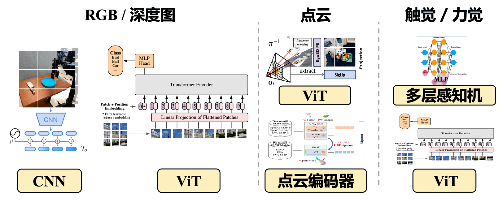{width=80%}

- **RGB / 深度图**：用 CNN 或 ViT（把图像切成 patch，过 Transformer Encoder）提特征；
- **点云**：用专门的点云编码器；
- **触觉 / 力觉**：用 MLP 把传感读数编码。

不管哪种模态，目标都一样：变成一串 token，和语言 token 拼在一起喂给模型。本讲的模型主要用 RGB（多为双视觉编码器或 ViT）。

## 1.4 Action：动作怎么解码——两条技术路线

"看懂"之后最关键的一步，是把模型内部的表示**变成动作**。这一步有两个维度：动作空间长什么样，以及怎么对动作建模。

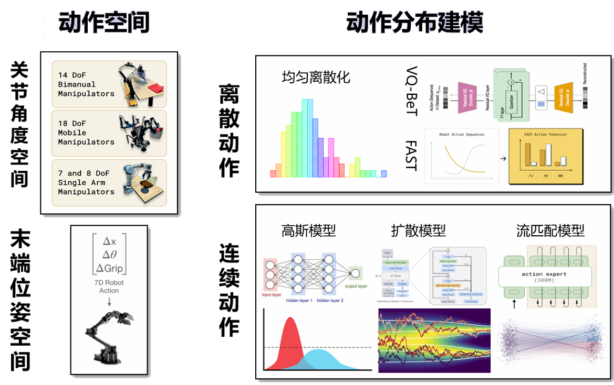{width=80%}

- **动作空间**：可以是关节角度，也可以是末端执行器位姿；
- **动作分布建模**——这正是各家 VLA 的根本分野，分两条路线：
  - **离散动作 → 自回归**：把连续动作切成整数 token（均匀离散化；向量量化，也就是图里那一路 VQ-BeT——用 VQ-VAE 式的码本把连续量映射成码本编号；或更高效的 FAST），像生成文字一样逐个解码。优点是直接复用 LLM 架构，缺点是离散化损精度、逐 token 解码慢。代表：RT-2、OpenVLA、$\pi_0$-FAST、VLA-0。
  - **连续动作 → 流匹配 / 扩散**：把动作当连续值，用扩散或流匹配从噪声里"去噪/流"出来。优点是连续空间、精度高、天然多模态，代价是架构更复杂、要多步采样。代表：Diffusion Policy、$\pi_0$、$\pi_{0.5}$、SmolVLA。

这两条路线（自回归 token vs 连续流匹配）会贯穿本讲后面所有模型——读每个模型时先问一句"它的动作头走哪条路"，就抓住了它的骨架。

## 1.5 发展时间线与本讲要讲的模型

VLA 发展得非常快：2022 年 RT-1、Gato 起步，2023 年 RT-2、ACT、Diffusion Policy 把 VLM 和生成式动作建模带进来，2024 年 OpenVLA、$\pi_0$ 让开源生态爆发，2025 年起走向小型化、开放世界泛化、人形全身（$\pi_{0.5}$、SmolVLA、GR00T N1 等）。

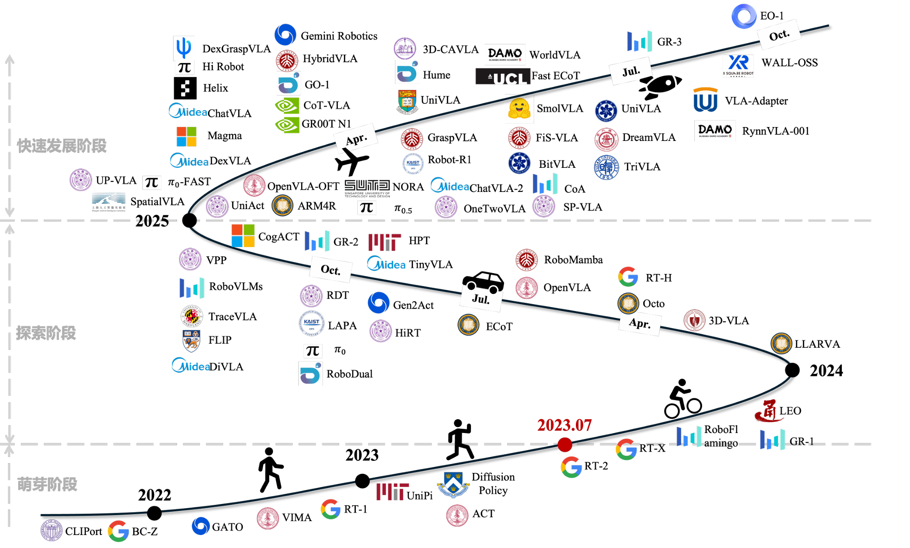

本讲就从这条时间线上挑出六个有代表性的模型，沿着"两条路线"展开：先看离散自回归的开山之作 **OpenVLA**，再到用流匹配的 **$\pi_0$** 及其家族（**$\pi_0$-FAST**、**$\pi_{0.5}$**），最后是两个把模型压小的代表 **VLA-0** 与 **SmolVLA**。读完这六个，你就能看清 VLA 这条演化链是怎么一步步往前推的。时间线上没被挑中的那几十个工作、以及更细的分类维度，可以去综述[1]里查。

# 2 OpenVLA：开源视觉-语言-动作模型

OpenVLA[2] 是第一个把「完全开源」和「打得过闭源大模型」同时做到的 VLA。下面这张总览图
把它的三段式讲完了：左边喂进大规模真机数据，中间微调一个现成 VLM，右边输出闭环控制。

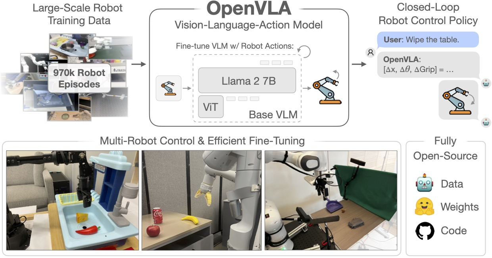

## 2.1 背景与动机

NLP 和 CV 里"大规模预训练 + 下游微调"的范式早已验证，但机器人领域一直走不通，卡在**数据**——真实机器人数据要用硬件实采，成本远高于文本和图片。两个进展打破了僵局：**Open X-Embodiment**[3]（后文简称 OXE）把 20+ 机构、20+ 种机器人的 200 万+ 条轨迹聚到一起，第一次提供了足够大的真实机器人数据；**RT-2**[4] 把预训练 VLM 微调用于机器人控制、首次提出 VLA 概念，证明了 `VLM → VLA` 这条路可行。

问题是，RT-2 及其 550 亿参数的 RT-2-X 都是**闭源**的，已有的开源方案（如 Octo[5]）又不是端到端的 VLM 微调路线。OpenVLA 要补的就是这个缺口：做一个**强、且完全开源**的 VLA——在大规模真实机器人数据上预训练、配一套高效的下游微调框架（支持 LoRA 等参数高效微调；LoRA 全称低秩适配 Low-Rank Adaptation，冻住原权重、只训练一对小的低秩矩阵，第12讲会展开），并把代码、权重、数据配置全部公开。

## 2.2 模型架构


OpenVLA 是一个 70 亿参数的 VLA 模型，构建在 Prismatic VLM[6] 之上——那是一套把视觉编码器、投影层和语言模型拼装成 VLM 的开源配方，OpenVLA 直接拿它当底座。整体架构非常简洁：图像和语言指令作为输入，经过视觉编码、投影、语言模型处理后，直接输出 token 化的机器人动作。

### 2.2.1 视觉编码器：双编码器融合

OpenVLA 使用**双视觉编码器**（Dual Vision Encoder），将两个互补的预训练视觉模型的特征融合：

| 编码器 | 擅长 | 作用 |
|--------|------|------|
| DINOv2 | 空间感知、细粒度几何特征 | 提供精确的空间表示，帮助机器人定位物体 |
| SigLIP | 图像-语言对齐、高级语义特征 | 提供语义理解能力，连接视觉与语言 |

两个编码器分别处理输入图像，输出的特征在通道维度上拼接（channel-wise concatenation），然后通过一个 MLP 投影器映射到语言模型的输入空间：

$$
I_t \;\xrightarrow{\text{DINOv2}}\; F_{\text{dino}} \in \mathbb{R}^{N \times d_1}
$$

$$
I_t \;\xrightarrow{\text{SigLIP}}\; F_{\text{sig}} \in \mathbb{R}^{N \times d_2}
$$

$$
F_{\text{vis}} = \text{MLP}\!\left(\text{concat}(F_{\text{dino}},\; F_{\text{sig}})\right) \in \mathbb{R}^{N \times d_{\text{llm}}}
$$

| 符号 | 含义 |
|------|------|
| $N$ | 图像 patch token 的数量 |
| $d_1, d_2$ | 两个编码器各自的特征维度 |
| $d_{\text{llm}}$ | 语言模型的隐层维度（Llama 2 7B 为 4096） |

消融实验表明，加入 DINOv2 有助于提高空间推理能力，双编码器的组合优于单独使用任一编码器。

### 2.2.2 语言模型骨干：Llama 2 7B

OpenVLA 的核心骨干是 **Llama 2 7B**，一个 70 亿参数的大语言模型。它接收两类 token 作为输入：

1. **视觉 token**：由双视觉编码器 + MLP 投影器生成
2. **语言 token**：由 Llama 分词器对语言指令进行分词得到

语言指令不是直接丢进去的，要先套进一个固定模板。OpenVLA 官方发布的模型卡给出的写法是：

```text
[视觉 token] In: What action should the robot take to {<INSTRUCTION>}?
Out:
```

模型接着以自回归方式输出 7 个动作 token，对应一个时间步的机器人动作；`Out:` 后面跟的就是这 7 个 token。

顺带说明一处容易看岔的地方：2.2 开头那张架构图上印的模板是 `What should the robot do to {task}? A:`，与这里的写法不同。两者都是"把指令包成一个问句、让模型接着答"的同一件事，实际跑模型时以官方发布实现里的这一版为准。

### 2.2.3 动作空间与输出

OpenVLA 输出的是**单步**末端执行器动作，采用**增量**（delta）表示：

$$
a_t = (\Delta x,\; \Delta y,\; \Delta z,\; \Delta \text{roll},\; \Delta \text{pitch},\; \Delta \text{yaw},\; g)
$$

| 维度 | 含义 | 说明 |
|------|------|------|
| $\Delta x, \Delta y, \Delta z$ | 末端执行器位置变化量 | 在机器人基座坐标系下 |
| $\Delta \text{roll}, \Delta \text{pitch}, \Delta \text{yaw}$ | 末端执行器姿态变化量 | 欧拉角增量 |
| $g$ | 夹爪开合程度 | 连续值，表示张开/闭合程度 |

这是一个 7 维的动作向量。使用增量表示而非绝对位姿，是因为增量在不同机器人之间更具迁移性——不同机器人的关节空间不同，但末端执行器的笛卡尔空间增量是通用的。

## 2.3 动作 Token 化

将连续的机器人动作转化为离散 token 是 OpenVLA 的关键设计之一。这使得动作预测可以直接复用语言模型的自回归生成框架，无需修改架构。

### 2.3.1 离散化方法

对于 7 维动作向量的每个维度，OpenVLA 在论文中采用**基于分位数的均匀离散化**：

1. 统计训练数据中该维度动作值的第 1 分位数 $q_1$ 和第 99 分位数 $q_{99}$
2. 将 $[q_1, q_{99}]$ 区间均匀划分为 256 个 bin（编号 0 ~ 255）
3. 将连续动作值映射到对应的 bin 编号

$$
\text{bin}(a_i) = \text{clip}\!\left(\left\lfloor \frac{a_i - q_1}{q_{99} - q_1} \times 256 \right\rfloor,\; 0,\; 255\right)
$$

| 符号 | 含义 |
|------|------|
| $a_i$ | 第 $i$ 维的连续动作值 |
| $q_1, q_{99}$ | 该维度训练数据的第 1 和第 99 分位数 |
| $\text{bin}(a_i)$ | 离散化后的 bin 编号，取值 $\{0, 1, \ldots, 255\}$ |

使用分位数而非最小-最大值的好处是**忽略异常值**。如果直接用 min-max 区间，少数极端动作会把整体范围拉大，导致常见动作落入更粗的离散区间。分位数方法剔除了前后各 1% 的极端值，从而保留更有效的分辨率。

一个具体例子：假设某一维动作在训练集中的第 1 分位数和第 99 分位数分别为 $q_1=-0.20$、$q_{99}=0.30$，当前动作值为 $a_i=0.05$。那么它在区间中的相对位置为

$$
\frac{a_i-q_1}{q_{99}-q_1} = \frac{0.05-(-0.20)}{0.30-(-0.20)} = \frac{0.25}{0.50} = 0.5
$$

再乘以 256 并向下取整，可得

$$
\text{bin}(a_i)=\lfloor 0.5 \times 256 \rfloor = 128
$$

这个连续动作值于是被编码成第 128 个 bin。规律很直白：动作值越靠近区间中间，落到的 bin 编号越靠近中间；超出上下界的值会被 clip 到 0 或 255。

### 2.3.2 分词器词汇表的调整

离散化后，每个动作维度变成一个 0~255 的整数。但 Llama 2 的分词器并不能把这些整数自然地高效表示成单个原子 token。比如表示 "132" 时，往往需要拆成多个 token，这会让动作序列变得冗长。

论文中的解决方案是：**覆盖词汇表中最低频的 256 个 token**。

具体做法是：在 Llama 2 的词汇表中，找到使用频率最低的 256 个位置，将它们重定义为动作 bin 编号 0~255 对应的动作 token。这样每个动作维度只需 1 个 token 表示，7 维动作只需 7 个 token。

$$
a_t = (a_1, a_2, \ldots, a_7) \;\xrightarrow{\text{离散化}}\; (\text{bin}_1, \text{bin}_2, \ldots, \text{bin}_7) \;\xrightarrow{\text{映射}}\; (\text{token}_1, \text{token}_2, \ldots, \text{token}_7)
$$

这种方法的代价是：被覆盖的低频词汇在微调后不再可用，语言模型的原始语言能力会受到一定影响。但 OpenVLA 的定位本来就是机器人控制而非通用对话，论文把它当作可以接受的工程折中。

![从一个连续动作值到词表里一个槽位的完整流水线。(a) 该维动作在训练集上的分布，两条红色虚线是 $q_1$ 与 $q_{99}$，灰色柱子是被剔掉的前后各 1% 尾巴——min-max 会被这些离群点拉垮，分位数不会。(b) $[q_1, q_{99}]$ 被均分成 256 格，正文那个算例 $a_i=0.05$ 落在正中间，红线标出它就是第 128 格。(c) 代价落在词表哪一段：被顶掉的是最低频的 256 个槽位（本书自绘；(a) 的分布形状为示意，$q_1$、$q_{99}$、$a_i$ 三个数取自正文算例）](../../assets/figures/lecture11/ref/fig11-2-action-tokenization.png){width=100%}

这三格分别对应上面三小节各自讲过、却一直没放在一起的三件事。(a) 回答的是"为什么用分位数而不是 min-max"——灰色那两撮离群动作如果参与定界，中间那一大团常见动作就会被挤进更少的格子里，分辨率白白浪费。(b) 回答的是"一个具体值怎么落格"——注意横轴是被拉直的 $[q_1, q_{99}]$，落点位置就是那个相对位置 0.5，乘 256 取整即得 128。(c) 回答的是"代价在哪"——被换掉的不是随机 256 个词，而是**频率最低**的那 256 个，这正是 OpenVLA 敢做这笔交换的理由：常用词一个没动。

### 2.3.3 训练目标

有了动作 token 化，OpenVLA 的训练就变成了标准的**自回归 next-token prediction**：

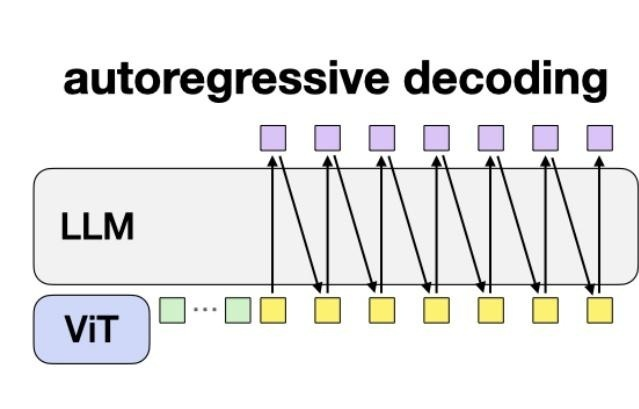{width=55%}

$$
\mathcal{L} = -\sum_{j=1}^{7} \log p_\theta(\text{token}_j \mid I_t, l, \text{token}_{1:j-1})
$$

| 符号 | 含义 |
|------|------|
| $p_\theta$ | 模型参数化的条件概率 |
| $\text{token}_j$ | 第 $j$ 个动作 token |
| $\text{token}_{1:j-1}$ | 前 $j-1$ 个已生成的动作 token |

训练时，只对动作 token 计算损失，图像和语言 token 的损失被 mask 掉。这本质上是一个分类问题——对每个动作维度，模型从 256 个 bin 中选择一个。

## 2.4 训练细节

### 2.4.1 预训练数据：Open X-Embodiment

OpenVLA 在 Open X-Embodiment 数据集的一个子集上进行预训练，包含 **27 个真实机器人数据集**、约 **97 万条 episode**。这比 RT-2-X 使用的 12 个数据集多了 15 个。

为了保证输入输出的一致性，作者对数据做了筛选：

- **只使用第三人称视角**（primary camera）的图像，排除腕部相机等其他视角
- **只使用单臂机器人**的数据，排除双臂操作
- **统一动作空间**为 7 维末端执行器增量

此外，借鉴 Octo 的做法，对数据集进行了**混合权重平衡**：降低多样性较低的数据集的采样权重，确保训练过程不会被某类数据主导。

### 2.4.2 预训练过程

OpenVLA 的预训练本质上是对 Prismatic VLM 进行**全参数微调**（full fine-tuning），使其从视觉问答任务适配到机器人动作预测任务。

| 配置项 | 值 |
|--------|-----|
| 基础模型 | Prismatic VLM（DINOv2 + SigLIP + Llama 2 7B） |
| 训练数据 | Open X-Embodiment 子集，27 个数据集，~97 万 episode |
| 训练硬件 | 64 张 A100 GPU |
| 训练时长 | 14 天 |
| Batch size | 2048 |
| 训练轮数 | ~30 个 epoch |
| 学习率 | 与 VLM 预训练阶段相同，恒定学习率 |
| 图像分辨率 | $224 \times 224$ |

关键发现：

- **微调视觉编码器很重要**：冻结视觉编码器会显著降低性能。论文给出的解释是，预训练的视觉表示尚不足以直接用于机器人控制，需要在机器人数据上进一步调整
- **训练更久更好**：与 VLM 预训练通常只过 1~2 个 epoch 不同，OpenVLA 训练了约 30 个 epoch，性能持续提升
- **$224 \times 224$ 足够**：$384 \times 384$ 分辨率在 Bridge 评估中没有带来性能提升，但训练时间增加了 3 倍

### 2.4.3 下游微调

预训练完成后，OpenVLA 可以在新的机器人设置和任务上进行微调。作者测试了多种微调策略：

| 微调策略 | 可训练参数 | 显存占用 | 效果 |
|----------|-----------|----------|------|
| Full fine-tuning | 100%（~7B） | 最高 | 基准 |
| Frozen vision | 接近 full fine-tuning | 较高 | 较差 |
| Sandwich | 视觉编码器 + LLM 最后一层 | 较低 | 中等 |
| Last layer only | LLM 最后一层 | 最低 | 较差 |
| **LoRA (rank=32)** | **1.4%（~98M）** | **较低** | **接近 full fine-tuning** |

LoRA 是最推荐的微调方式：只训练 1.4% 的参数，显存需求大幅降低，但性能接近全参数微调。论文强调这显著降低了微调门槛：一张 A100 就能跑完一次下游微调，耗时约 15 小时。

## 2.5 后续改进：OpenVLA-OFT+

OpenVLA 的局限性催生了后续改进工作 **OpenVLA-OFT+**[7]（Open Fine-Tuning+），针对原版的几个核心短板进行了升级。

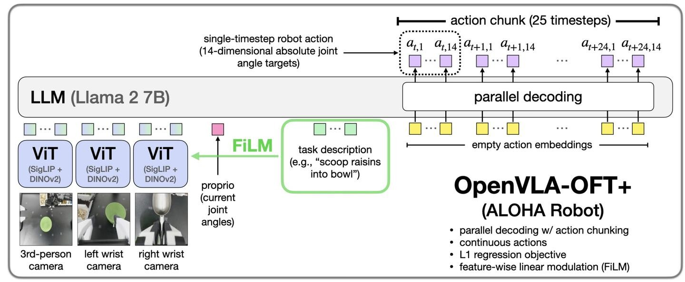

相比原版 OpenVLA，OFT+ 的主要改进包括：

| 维度 | OpenVLA | OpenVLA-OFT+ |
|------|---------|--------------|
| 输入图像 | 单张第三人称图像 | 多相机（第三人称 + 腕部相机） |
| 本体感知 | 不使用 | 通过 FiLM 注入当前关节角度 |
| 动作表示 | 离散 token（256 bin） | 连续值，L1 回归 |
| 动作维度 | 7 维末端执行器增量 | 14 维绝对关节角度（支持双臂） |
| 解码方式 | 自回归（逐 token 生成） | 并行解码（bidirectional attention） |
| Action chunking | 不支持（单步输出） | 支持（25 步 chunk） |
| 目标平台 | 单臂机器人 | ALOHA 双臂机器人 |

OFT+ 的核心设计变化：

1. **并行解码替代自回归**：原版 OpenVLA 逐个生成 7 个动作 token，推理速度受限于串行 forward pass 次数。OFT+ 使用双向注意力（bidirectional attention），一次 forward pass 并行输出所有动作 token，大幅提升推理速度

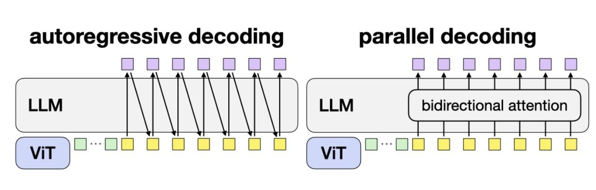

2. **连续动作回归替代离散分类**：不再将动作离散化为 256 个 bin，而是直接回归连续值，使用 L1 损失训练。这避免了离散化带来的精度损失

3. **Action chunking**：动作块（action chunk）是第10讲 2.2 节讲 ACT 时用过的老朋友——一次预测未来若干步动作，而不是每步都重新决策。OFT+ 一次输出 25 步，结合并行解码，在保持高控制频率的同时获得短时规划能力

4. **FiLM 条件注入**：通过 Feature-wise Linear Modulation 将本体感知信息（关节角度）注入视觉特征，让模型能感知机器人自身状态，而不仅仅依赖图像隐含的位姿信息

## 2.6 上手：跑一次 OpenVLA 推理

前面讲的 256 bin、逐 token 解码，都可以在 LIBERO 仿真里亲手验证。配套代码仓的
`code/vla/4_vla_inference/4_1_openvla_infer/` 加载 OpenVLA 官方在
LIBERO-10 上微调的 7B checkpoint，闭环推理一次并录像：

```bash
cd code
uv run python vla/4_vla_inference/4_1_openvla_infer/openvla_demo.py
```

代码里有两处与 $\pi_0$ 的 demo（第8讲 4.3 节跑过）不同，恰好对应本节讲过的两个机制：

- **加载方式**：这个 checkpoint 不是 LeRobot 格式——HF 仓库里放的是 transformers
  远程模型代码（Prismatic 架构），所以要显式构造 `OpenVLAConfig` 再加载；
  `unnorm_key="libero_10"` 指定用哪套动作反归一化统计，就是 2.3.1 节那对
  $q_1/q_{99}$ 分位数。
- **动作生成**：`select_action` 每个仿真步做一次 7-token 贪心解码——模型逐个"说出"
  7 个动作 token，再按 token → bin 编号 → bin 中心值 → $q_1/q_{99}$ 反归一化
  还原成连续动作。一步要过 7 次 7B 前向，跑起来能明显感觉到它比动作块模型慢——
  第 4 节 $\pi_0$-FAST 要解决的"自回归动作 token 化太慢"，在这里能直接体感到。

固定初始状态后，任务「put both the alphabet soup and the tomato sauce in the
basket」在 247 步内完成：

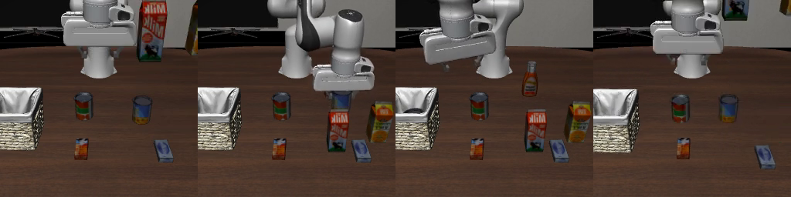{width=98%}

同目录的 `code/vla/4_vla_inference/4_1_openvla_infer/openvla_eval.sh` 是官方 `lerobot-eval` 的标准评测入口：多 episode 自动换
初始状态、统计成功率（`pc_success`）并逐集录像，想验证"不是挑了个好局"就用它。

## 2.7 本节小结

**核心创新**

OpenVLA 是 VLA 领域的一个里程碑式工作，其核心贡献在于：

1. **验证了"小模型胜大模型"的可能性**：7B 参数的 OpenVLA 在多数任务上超越了 55B 的 RT-2-X，说明数据多样性和架构设计比单纯堆参数更重要

2. **建立了 VLA 的开源基准**：几乎所有后续 VLA 工作（如 OpenVLA-OFT、$\pi_0$ 等）都将 OpenVLA 作为 baseline 进行对比

3. **证明了 VLM $\to$ VLA 微调路线的有效性**：不需要从头设计复杂架构，直接在成熟的 VLM 上微调即可获得强大的机器人控制能力

4. **降低了 VLA 研究的门槛**：权重、代码、数据配方全部公开，配上 2.4.3 的 LoRA 微调，一张显卡就能把它调到自己的机器人上

> 一句话总结：OpenVLA 用 Prismatic VLM（DINOv2 + SigLIP + Llama 2 7B）作为骨干，将连续动作离散化为 token，通过自回归 next-token prediction 实现端到端的视觉-语言-动作映射，是开源 VLA 的第一个成熟方案。

**局限性**

OpenVLA 的局限性也可以直接概括为四点：

1. **时序建模能力有限**：原版 OpenVLA 只看单帧、只输出单步动作，不支持多帧历史和 action chunking。

2. **推理延迟大**：7B 自回归解码的单次推理延迟较高，重规划周期被拉长，因此不适合高频闭环控制，也不直接支持双臂精细操作。

3. **存在灾难性遗忘**：只在机器人数据上微调会削弱原始 VLM 的语言与 VQA 能力。

4. **动作 token 方案不够优雅**：覆盖低频词汇虽然简单有效，但会破坏原始词表结构，后续工作更倾向于采用更干净的动作表示方法。

# 3 $\pi_0$：基于 Flow Matching 的视觉-语言-动作流模型

$\pi_0$[8] 换掉的是 OpenVLA 最核心的那个部件——动作头。下面这张总览图右侧那些任务
（叠衣服、装纸箱）之所以做得动，靠的就是它一次生成一整段连续动作的能力。

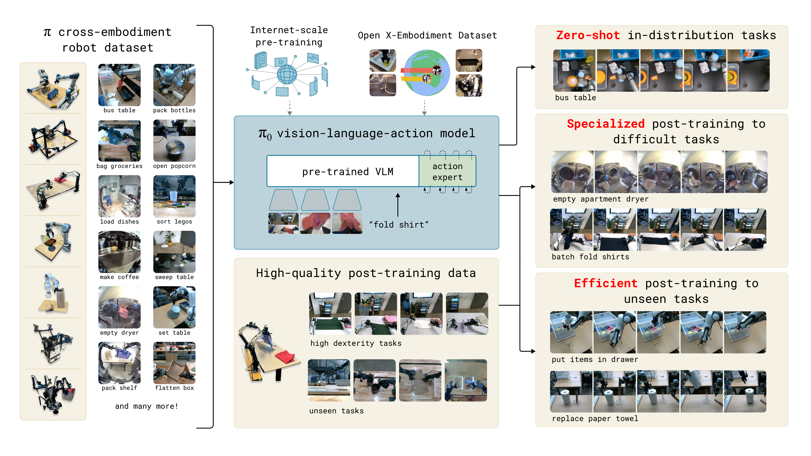

## 3.1 背景与动机

### 3.1.1 从 OpenVLA 到 $\pi_0$：为什么需要新架构？

2.7 节是站在 OpenVLA 这个模型的角度列局限。换成「要做精细、高频操作」的角度再看一遍，它们会收敛成下面四道门槛——$\pi_0$ 的每一处架构选择，都对着其中一条：

| 问题 | 具体表现 |
|------|----------|
| 推理延迟大 | 7B 模型逐 token 解码，单次推理延迟高、重规划周期长，难以支撑高频闭环 |
| 动作离散化精度有限 | 256 bin 离散化引入量化误差，精细操作受限 |
| 不支持 action chunking | 单步输出，无法一次规划多步连续动作 |
| 部署时输出单一路径 | 用贪婪解码时输出退化成一条确定路径（自回归模型本身可以表示并采样多峰分布，见下方备注） |

> 备注：**离散化会带来量化误差，逐 token 解码也会增加延迟**——这两条是实打实的代价。但"自回归分类是点预测"这个说法不准确：自回归分类定义的是一个条件概率分布，通过采样完全可以表达多模态。真正让输出变成单一路径的是**贪婪 / argmax 解码**这个部署选择，而不是自回归建模本身。

第10讲第 5 节介绍过 Flow Matching——一种比 Diffusion 更高效的连续生成方法，用确定性 ODE 替代随机 SDE，在常见设定下个位数到十几步就能完成采样（各家的示例范围见第10讲 5.4.3 节，那里也说清了该比的是网络前向次数而不是"步数"）。$\pi_0$ 的核心思路就是：**把 Flow Matching 作为动作生成头，嫁接到预训练 VLM 上，同时引入专门的 Action Expert 来处理机器人特有的输入输出。**

### 3.1.2 $\pi_0$ 的核心定位

$\pi_0$（读作 "pi-zero"）由 Physical Intelligence 提出，是一个通用机器人策略（generalist robot policy），也可以理解为一个机器人基础模型（robot foundation model）。它的设计目标是：

1. **继承互联网规模的语义知识**：基于预训练 VLM（PaliGemma[9]）初始化，获得物体识别、空间关系、语言理解等能力
2. **支持高频精细控制**：通过 flow matching 一次生成连续 action chunk，动作以最高 50 Hz 的频率**执行**（注意这是动作执行频率，不是模型每 20 ms 重新推理一次；四个频率概念的区分见 3.3.4）
3. **跨机器人泛化**：单一模型同时支持单臂、双臂、移动操作等 7 种机器人构型
4. **通过预训练/后训练范式获得鲁棒性**：类比 LLM 的 pre-training + post-training 流程

$$
\underbrace{\text{OpenVLA}}_{\text{自回归离散动作}} \quad\longrightarrow\quad \underbrace{\pi_0}_{\text{Flow Matching 连续动作 + Action Expert}}
$$


## 3.2 模型架构

### 3.2.1 总体结构：VLM 骨干 + Action Expert

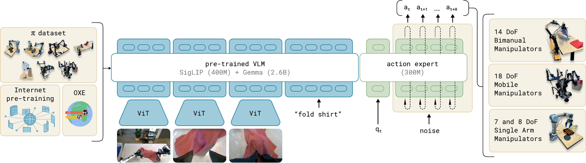

$\pi_0$ 的架构可以理解为一个带有两组权重的 Transformer：

1. **VLM 骨干**（约 3B 参数）：基于 PaliGemma，处理图像和语言 token
2. **Action Expert**（约 300M 参数）：从头初始化，处理机器人状态和动作 token

两组权重可以理解为实现于同一个 Transformer 框架中的两套 expert：它们通过自注意力计算彼此交互，但并不是简单地共享一整套 attention/MLP 参数，而是各自保有与自身宽度匹配的参数集。这种设计可以类比为一种 **按 token 类型固定路由** 的两专家结构，而不是经典的稀疏门控混合专家（Mixture-of-Experts, MoE，由一个门控网络按内容动态挑选专家）：视觉-语言 token 固定走 VLM 骨干，机器人状态与动作 token 固定走 Action Expert。

$$
\text{总参数量} = \underbrace{3\text{B}}_{\text{PaliGemma}} + \underbrace{300\text{M}}_{\text{Action Expert}} = 3.3\text{B}
$$

**为什么要用两组权重？** 如果让机器人状态和动作 token 直接复用 VLM 的 MLP 权重，会产生分布偏移——VLM 在预训练时从未见过这类输入。用独立的 Action Expert 权重可以避免干扰 VLM 已学到的表示，同时让动作生成有自己的专属容量。

### 3.2.2 输入与输出

$\pi_0$ 的输入输出定义如下：

$$
\pi_0: \quad (\mathbf{I}^1_t, \ldots, \mathbf{I}^n_t, \ell_t, \mathbf{q}_t) \;\longrightarrow\; \mathbf{A}_t = [\mathbf{a}_t, \mathbf{a}_{t+1}, \ldots, \mathbf{a}_{t+H-1}]
$$

| 符号 | 含义 | 典型值 |
|------|------|--------|
| $\mathbf{I}^i_t$ | 第 $i$ 个相机的 RGB 图像 | 最多 3 个相机，$224 \times 224$ |
| $\ell_t$ | 语言指令 token 序列 | 如 "fold the shirt" |
| $\mathbf{q}_t$ | 机器人本体感知（关节角度） | 最大 18 维 |
| $\mathbf{A}_t$ | 动作块（action chunk） | $H = 50$ 步 |
| $\mathbf{a}_{t'}$ | 单步动作向量 | 最大 17 维 |

关键设计：输出不是单步动作，而是一个包含 50 步未来动作的 action chunk。这使得模型可以一次规划约 1 秒的连续运动（动作以 50 Hz 执行时），大幅减少推理调用次数。

### 3.2.3 Token 构成与路由

整个输入序列由以下 token 组成，每种 token 被路由到对应的 expert：

| Token 类型 | 来源 | 路由到 | 编码方式 |
|------------|------|--------|----------|
| 图像 token | SigLIP 视觉编码器 | VLM 骨干 | ViT 编码 → 线性投影 |
| 语言 token | 分词器 | VLM 骨干 | 标准 embedding |
| 状态 token | 关节角度 $\mathbf{q}_t$ | Action Expert | 线性投影 |
| 动作 token | 带噪动作 $\mathbf{A}^\tau_t$ + 时间步 $\tau$ | Action Expert | MLP 编码（见 3.2.6） |

VLM 骨干和 Action Expert 在自注意力层中交互——动作 token 可以 attend 到图像、语言和状态 token 的 key-value，从而获取完整的条件信息。

### 3.2.4 注意力掩码：分块因果注意力

$\pi_0$ 使用分块因果注意力掩码（blockwise causal attention mask），将输入序列分为 3 个块：

| 块编号 | 内容 | 块内注意力 | 跨块注意力 |
|--------|------|------------|------------|
| 块 1 | $[\mathbf{I}^1_t, \ldots, \mathbf{I}^n_t, \ell_t]$ | 全双向 | 不能 attend 到块 2、3 |
| 块 2 | $[\mathbf{q}_t]$ | — | 可以 attend 到块 1，不能 attend 到块 3 |
| 块 3 | $[\mathbf{a}^\tau_t, \ldots, \mathbf{a}^\tau_{t+H-1}]$ | 全双向 | 可以 attend 到块 1、2 |

这样分块带来三个效果（下面第 1、3 条是论文明确说明的动机，第 2 条属本书对实现的解读）：

1. **块 1 不 attend 到块 2、3**：图像和语言 token 保持与 VLM 预训练时一致的注意力模式，最小化分布偏移
2. **块 2 单独一块**：机器人状态 $\mathbf{q}_t$ 在 flow matching 的多步积分中不变，因此它和图像/语言一起构成"整段推理里不变的前缀"，可以缓存 key-value（3.2.5 会展开）。要说清的是，**KV 缓存成立的条件是"前缀内容在多步积分中不变"，而不是"状态必须单独成一块"**——把状态并进块 1 同样能缓存；单独成块主要是为了让状态既能看到图像/语言、又不被前缀双向影响
3. **块 3 内部全双向**：所有动作 token 互相 attend，使得 action chunk 内部的动作可以相互协调

> 备注：以上是本书按 3 个语义块给出的读法，方便理解可见性关系。真要照着实现，请直接对照官方代码里输入打包、`attention mask` 构造与 KV cache 三处的逻辑（LeRobot 包内 `lerobot/policies/pi0/modeling_pi0.py`，以及 openpi 的对应实现），逐 token 核对可见性矩阵——不同版本在块的划分粒度和掩码细节上可能与本节的简化描述不完全一致。

上面的分块规则在实现里用一个很简洁的方式落地：给每个 token 标一个"组号"（沿序列对因果边界做累积和算出来——每遇到一个边界，组号加一），再规定 **token $i$ 能 attend token $j$，当且仅当 $j$ 的组号 $\le$ $i$ 的组号**。于是图像/语言（组 1）、机器人状态（组 2）、动作（组 3）就自动满足"动作能看前缀、状态只看自己、前缀看不到后面"的分块因果模式；再叠上 padding 掩码，就得到最终送进注意力的二维掩码矩阵。

### 3.2.5 KV 缓存：推理为什么能只算一次前缀

要理解 $\pi_0$ 推理为什么快，先要理解 Transformer 里一个通用的加速技巧——**KV 缓存（KV Cache）**。

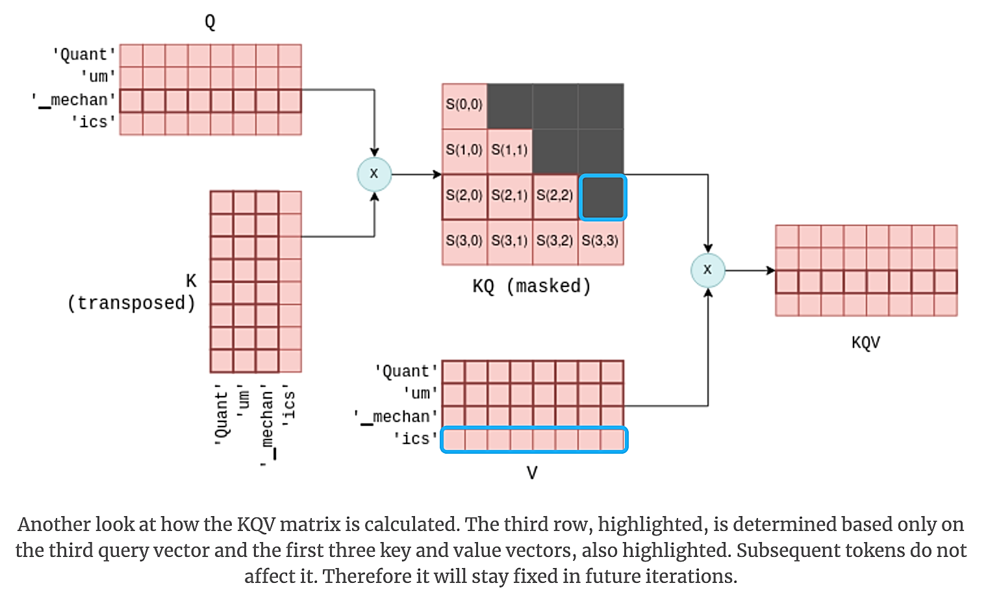{width=82%}

自回归生成时，模型一个 token 一个 token 地往外吐。注意力里有个关键性质：因为有**因果掩码**，第 $i$ 个 token 的输出只依赖它自己的 query 和**前 $i$ 个 token 的 key / value**——后面还没生成的 token 不会影响它。于是已经算过的那些 key / value，在后续每一步里都**原封不动**。既然不变，就没必要每生成一个新 token 都把整段历史重算一遍：把过去所有 token 的 key / value **缓存**起来，新 token 来了只算它自己这一列、再去 attend 缓存好的历史即可。这就是 KV 缓存——拿显存换计算，把自回归推理从"每步重算全程"降到"每步只算一个新 token"。

回到 $\pi_0$：它的推理不是逐 token 自回归，而是 flow matching 的约 10 步 Euler 积分，但 KV 缓存的道理一样适用。关键条件是**前缀（图像、语言、机器人状态）在这 10 步里完全不变**，于是把**前缀的 key / value 只算一次、缓存起来**；之后每个去噪步只让小小的 Action Expert 处理动作 token、去 attend 缓存好的前缀 KV。结果是 3B 的 VLM 骨干整段推理只跑一次、300M 的 Action Expert 跑 10 次——这正是 $\pi_0$ 能把推理压到实时的关键。

### 3.2.6 动作 Token 的编码：融合噪声动作与时间步

在 flow matching 中，每一步积分都需要将当前的带噪动作 $\mathbf{a}^\tau_{t'}$ 和 flow matching 时间步 $\tau$ 编码为 token。$\pi_0$ 使用一个 MLP 来完成这个融合：

$$
\text{token}(\mathbf{a}^\tau_{t'}, \tau) = W_3 \cdot \text{swish}\!\left(W_2 \cdot \text{concat}\!\left(W_1 \cdot \mathbf{a}^\tau_{t'},\; \phi(\tau)\right)\right)
$$

| 符号 | 含义 | 维度 |
|------|------|------|
| $\mathbf{a}^\tau_{t'}$ | 时刻 $t'$ 的带噪动作 | $d$（动作维度） |
| $\phi(\tau)$ | $\tau$ 的正弦位置编码 | $w$（embedding 宽度） |
| $W_1$ | 动作投影矩阵 | $\mathbb{R}^{w \times d}$ |
| $W_2$ | 融合层矩阵 | $\mathbb{R}^{w \times 2w}$ |
| $W_3$ | 输出投影矩阵 | $\mathbb{R}^{w \times w}$ |

其中 $w = 1024$ 是 Action Expert 的 embedding 宽度。这个 MLP 先分别编码动作和时间步，拼接后通过 swish 激活和线性层融合，输出一个与 **Action Expert** embedding 维度匹配的 token，而不是去匹配 VLM 骨干的 2048 维宽度。

### 3.2.7 Action Expert 的具体配置

PaliGemma 基于 Gemma 2B 语言模型。下表两列分别是 VLM 骨干（`gemma_2b`）与 Action Expert（`gemma_300m`）的 Transformer 配置，数值取自官方实现的模型配置（LeRobot 包内 `lerobot/policies/pi0/modeling_pi0.py` 里的 `get_gemma_config`，与 openpi 包内 `src/openpi/models/gemma.py` 一致；LeRobot 由 `uv sync` 从我们维护的 fork 装入，仓库内不存源码树）：

| 参数 | VLM 骨干（`gemma_2b`） | Action Expert（`gemma_300m`） |
|------|----------------------|---------------|
| width | 2048 | 1024 |
| depth（层数） | 18 | 18 |
| mlp_dim | 16,384 | 4,096 |
| num_heads（注意力头数） | 8 | 8 |
| num_kv_heads | 1 | 1 |
| head_dim | 256 | 256 |
| 参数量 | ~3B | ~300M |

注意 **depth 与 num_heads 是两个不同的量**：两者都是 18 层，但注意力头数是 8（$8 \times 256 = 2048$，正好等于骨干的 width；Action Expert 则用同样的 8 头 $\times$ 256 维投影到自己 1024 的 width 上）。`num_kv_heads = 1` 表示两者都用 multi-query attention。

两个 expert 共享相同的 depth 和注意力结构，但 Action Expert 的 width 和 mlp_dim 大幅缩小。这是因为 Action Expert 在推理时需要运行 10 次（每次 flow matching 积分步），缩小宽度可以显著降低推理延迟。

## 3.3 Flow Matching 动作生成

### 3.3.1 条件 Flow Matching 损失

$\pi_0$ 使用条件 flow matching 来建模动作分布 $p(\mathbf{A}_t \mid \mathbf{o}_t)$。训练损失为：

$$
L^\tau(\theta) = \mathbb{E}_{p(\mathbf{A}_t \mid \mathbf{o}_t),\, q(\mathbf{A}^\tau_t \mid \mathbf{A}_t)} \left\| \mathbf{v}_\theta(\mathbf{A}^\tau_t, \mathbf{o}_t) - \mathbf{u}(\mathbf{A}^\tau_t \mid \mathbf{A}_t) \right\|^2
$$

其中上标 $\tau \in [0, 1]$ 表示 flow matching 时间步（不是机器人时间步），下标 $t$ 表示机器人时间步。

使用线性高斯概率路径（论文中也称 optimal transport 路径；严格说只有端点按 OT 耦合配对时才是 OT 路径，见第10讲 5.3.1 节的备注）：

$$
q(\mathbf{A}^\tau_t \mid \mathbf{A}_t) = \mathcal{N}\!\left(\tau \mathbf{A}_t,\; (1 - \tau)^2 \mathbf{I}\right)
$$

这里的方差写成 $(1-\tau)^2$ 才和下面的采样式自洽：若 $\epsilon \sim \mathcal{N}(\mathbf{0}, \mathbf{I})$，则 $\mathbf{A}^\tau_t = \tau \mathbf{A}_t + (1-\tau)\epsilon$ 的条件协方差就是 $(1-\tau)^2 \mathbf{I}$。

在实际训练中，具体操作为：

1. 采样随机噪声 $\epsilon \sim \mathcal{N}(\mathbf{0}, \mathbf{I})$
2. 构造带噪动作 $\mathbf{A}^\tau_t = \tau \mathbf{A}_t + (1 - \tau) \epsilon$
3. 训练网络输出 $\mathbf{v}_\theta(\mathbf{A}^\tau_t, \mathbf{o}_t)$ 去匹配目标向量场 $\mathbf{u}(\mathbf{A}^\tau_t \mid \mathbf{A}_t) = \mathbf{A}_t - \epsilon$

| 符号 | 含义 |
|------|------|
| $\mathbf{v}_\theta$ | 网络预测的速度向量场 |
| $\mathbf{A}_t$ | 真实动作块（ground truth） |
| $\mathbf{A}^\tau_t$ | 时间步 $\tau$ 处的带噪动作 |
| $\epsilon$ | 从标准正态采样的噪声 |
| $\mathbf{u}$ | 目标去噪向量场，$= \mathbf{A}_t - \epsilon$ |

这里的符号约定与第10讲 5.3.1 节的 Flow Matching 写法略有不同。两边的端点其实一致：第10讲里 $t=0$ 是噪声、$t=1$ 是数据，$\pi_0$ 论文里 $\tau=0$ 是噪声、$\tau=1$ 是数据。差别只在带噪样本怎么写——第10讲写成 $z_t = (1-t)z_0 + tz_1$（$z_0$ 是噪声），$\pi_0$ 写成 $\mathbf{A}^\tau_t = \tau \mathbf{A}_t + (1-\tau)\epsilon$（$\mathbf{A}_t$ 是数据）。两式等价，只是变量命名不同。

### 3.3.2 时间步采样：Beta 分布而非均匀分布

标准 Flow Matching 从均匀分布 $\tau \sim \mathcal{U}(0, 1)$ 采样时间步。$\pi_0$ 做了一个重要修改：**使用偏移 Beta 分布，强调低时间步（高噪声）区域。**

$$
p(\tau) = \text{Beta}\!\left(\frac{s - \tau}{s};\; 1.5,\; 1\right), \quad s = 0.999
$$

为了避免把这个式子误读成"直接对 $\tau$ 代入普通 Beta 密度"，更直观的理解是：先采样 $z \sim \text{Beta}(1.5, 1)$，再令

$$
\tau = s(1-z), \quad s = 0.999
$$

这样得到的时间步会更集中在较小的 $\tau$ 区域，也就是更高噪声的区域。

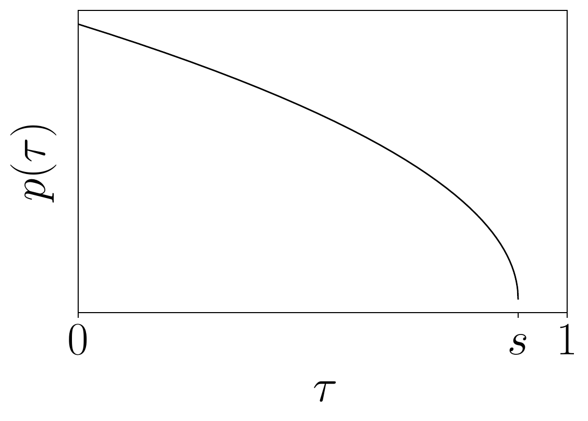{width=50%}

为什么这样设计？论文的核心论点是：动作预测与图像生成有本质区别。

- 在图像生成中，给定文本标签预测平均图像相对容易，因此中间时间步（中等噪声）最难学
- 在动作预测中，给定机器人观测 $\mathbf{o}_t$ 后，观测对动作分布的约束非常强，预测条件均值 $\mathbb{E}[\mathbf{A}_t \mid \mathbf{o}_t]$ 本身就是一个困难问题
- 因此低时间步（高噪声）区域更需要训练，因为此时模型需要从几乎纯噪声中恢复出合理的动作方向

此外，超过阈值 $s = 0.999$ 的时间步不会被采样，因为只要积分步长 $\delta > 1 - s = 0.001$，推理时就不需要处理这些极高时间步。

### 3.3.3 推理过程：前向 Euler 积分

推理时，从纯噪声出发，通过前向 Euler 积分生成动作：

$$
\mathbf{A}^0_t \sim \mathcal{N}(\mathbf{0}, \mathbf{I})
$$

$$
\mathbf{A}^{\tau + \delta}_t = \mathbf{A}^\tau_t + \delta \cdot \mathbf{v}_\theta(\mathbf{A}^\tau_t, \mathbf{o}_t)
$$

$\pi_0$ 使用 10 步积分（$\delta = 0.1$），从 $\tau = 0$ 积分到 $\tau = 1$。

推理的关键优化是 **KV 缓存**：观测 token（图像、语言、状态）在 10 步积分中不变，因此只需在第一步计算它们的 attention key-value，后续 9 步直接复用缓存，只重新计算动作 token 的前向传播。

论文[8]报告的 RTX 4090 上推理耗时拆分：

| 模块 | 耗时 |
|------|------|
| 图像编码器 | 14 ms |
| 观测前向传播（含 KV 缓存生成） | 32 ms |
| 10 次动作前向传播（flow matching） | 27 ms |
| 网络延迟（如果离板推理） | 13 ms |
| **总计（板载）** | **73 ms** |
| **总计（离板）** | **86 ms** |

### 3.3.4 实时动作执行策略

模型一次生成 $H = 50$ 步的 action chunk，但不需要等全部执行完再推理下一个 chunk。实际策略是：

- **20Hz 机器人**（UR5e、Franka）：执行 16 步后推理下一个 chunk（间隔 0.8 秒）
- **50Hz 机器人**（其他平台）：执行 25 步后推理下一个 chunk（间隔 0.5 秒）

论文尝试过时间集成（temporal ensembling，即对重叠 chunk 的动作做加权平均），但发现反而损害性能，因此采用开环执行——直接按顺序执行 chunk 中的动作，不做聚合。

把上面两小节的数字放在一起，就能看清"50 Hz"到底指什么。谈 VLA 的实时性时，至少要把四个量分开，混在一起就会得出错误结论：

| 量 | 含义 | $\pi_0$ 的对应值 |
|---|---|---|
| 动作执行频率（actuator rate） | 底层控制器多久消费一个动作 | 最高 50 Hz（即每 20 ms 出队一个动作） |
| 动作块长度（action chunk length） | 一次推理生成多少步动作 | $H = 50$ 步（50 Hz 下约 1 秒） |
| 模型推理延迟（inference latency） | 跑一次完整前向要多久 | 板载约 73 ms、离板约 86 ms（RTX 4090，见上表） |
| 重规划周期（replan interval） | 多久重新感知并推理一次 | 20 Hz 平台约 0.8 s、50 Hz 平台约 0.5 s |

所以"$\pi_0$ 支持 50 Hz 控制"这句话的准确含义是：**动作以 50 Hz 出队执行**，而大模型每 0.5 秒才重新看一眼、重新规划一次。它不等于每 20 ms 重新推理一次。后面 3.6.1 的横向对比、以及第13讲讨论实时推理时，都沿用这套区分。

## 3.4 训练方案

### 3.4.1 两阶段训练：预训练 + 后训练

$\pi_0$ 的训练方案直接借鉴了 LLM 的 pre-training / post-training 范式：

| 阶段 | 目标 | 数据特点 | 效果 |
|---|---|---|---|
| 预训练 | 获得广泛的物理操作能力和泛化性 | 大规模、多样化、质量参差不齐 | 基础模型，能跟随语言指令，各任务初步胜任 |
| 后训练（微调） | 在特定下游任务上达到高性能 | 小规模、高质量、任务特定 | 流畅、高效、鲁棒的任务执行 |

两阶段的互补逻辑：

- **只用高质量数据训练**：模型不会学到从错误中恢复的能力，因为高质量数据中几乎没有失误场景
- **只用预训练数据**：模型无法学到流畅高效的执行策略
- **两阶段结合**：模型尽可能模仿高质量数据的行为模式，同时保留从预训练中学到的纠错和恢复能力

### 3.4.2 预训练数据


预训练数据总量约 10,000 小时，包含两大来源：

| 数据来源 | 占比 | 内容 |
|----------|------|------|
| 开源数据（OXE、Bridge v2、DROID） | 9.1% | 22 种机器人，2~10Hz 控制，覆盖广泛物体和环境 |
| 自有数据 | 90.9%（903M 时间步） | 7 种机器人构型，68 个任务，高频精细操作 |

自有数据中，单臂数据 106M 时间步，双臂数据 797M 时间步。

**数据平衡策略**：对每个任务-机器人组合，采样权重按 $n^{0.43}$ 缩放（$n$ 为该组合的样本数），从而降低过度表示的组合的权重。

**跨机器人统一表示**：

- 配置向量 $\mathbf{q}_t$ 和动作向量 $\mathbf{a}_t$ 统一为最大维度（18 维，对应双 6-DoF 臂 + 2 夹爪 + 移动底盘 + 升降躯干）
- 维度较低的机器人用零填充
- 相机数少于 3 个的机器人，缺失的图像槽位用 mask 处理

**语言标注**：使用两种粒度的语言标签：

- **任务名称**：高层描述，如 "bus the table"
- **片段标注**：细粒度标签，标注约 2 秒长的子轨迹，如 "pick up the napkin"

预训练步数为 700k。

### 3.4.3 后训练（微调）

后训练使用任务特定的高质量数据，数据量因任务复杂度而异：

- 简单任务：约 5 小时
- 复杂任务（如叠衣服）：100 小时以上

### 3.4.4 高层语言策略

对于需要语义推理和高层策略的复杂任务（如收拾桌子需要区分垃圾和餐具），$\pi_0$ 可以与一个高层 VLM 策略配合：

1. 高层 VLM 观察当前场景，将高层任务（如 "bus the table"）分解为即时子任务（如 "pick up the napkin" → "throw the napkin into the trash"）
2. $\pi_0$ 接收这些中间语言指令，执行具体的物理操作

这种"高层出指令、低层做动作"的分工，和早期的 SayCan（让语言模型挑出下一步该做哪个技能，再交给已有的技能库去执行）是同一个思路：用 VLM 的语义推理能力，补上低层策略在高层规划上的短板。

## 3.5 支持的机器人平台

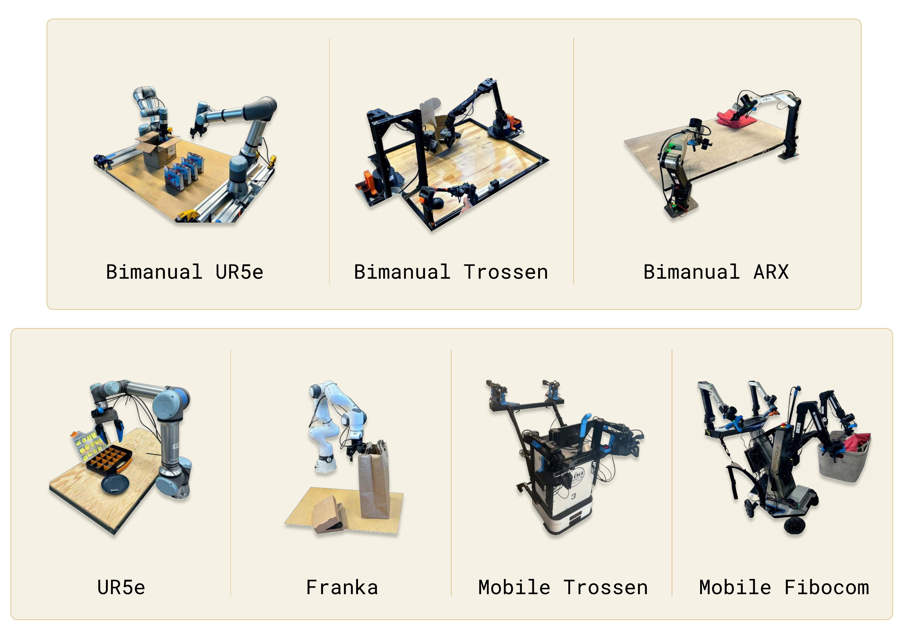

$\pi_0$ 在 7 种不同的机器人构型上联合训练：

| 平台 | 自由度 | 相机数 | 动作维度 | 特点 |
|------|--------|--------|----------|------|
| UR5e | 7 | 2 | 7 | 单臂，平行夹爪 |
| 双臂 UR5e | 14 | 3 | 14 | 两个 UR5e |
| Franka | 8 | 2 | 8 | 单臂 |
| 双臂 Trossen | 14 | 3 | 14 | 基于 ALOHA 构型 |
| 双臂 ARX/AgileX | 14 | 3 | 16 | 两个 6-DoF 臂 |
| 移动 Trossen/ARX | 14 | 3 | 16 | 非全向移动底盘 |
| 移动 Fibocom | 14 | 3 | 17 | 全向移动底盘 |

单一模型处理所有这些平台，通过零填充和 mask 机制统一不同的配置空间和动作空间。

## 3.6 与其他方法的对比

### 3.6.1 架构层面的对比

表里 ACT 与 Diffusion Policy 两列的机制细节在第10讲第 2、3 节讲过，这里只取它们的规模与动作表示做参照。这两列的参数量口径要单说：ACT 的 ~80M 是它论文自报的数量级；Diffusion Policy 那篇没有给一个统一的模型大小，论文里明说了参数量越大表现越好、实际取值受算力和显存限制，所以这一格写不出一个数。

| | OpenVLA[2] | Octo[5] | ACT | Diffusion Policy | $\pi_0$[8] |
|---|---------|------|-----|-------------------|---------|
| 参数量 | 7B | 93M | ~80M | 依实现规模而定 | 3.3B |
| 动作表示 | 离散 token | 连续（diffusion） | 连续（CVAE） | 连续（diffusion） | 连续（flow matching） |
| Action chunking | 不支持 | 支持 | 支持 | 支持 | 支持（$H=50$） |
| VLM 预训练 | 是（Prismatic） | 否 | 否 | 否 | 是（PaliGemma） |
| 动作执行频率（作者报告值） | 论文报告约 5 Hz | 论文未统一报告 | 依平台设定 | 依平台设定 | 最高 50 Hz |
| 跨机器人 | 是 | 是 | 否 | 否 | 是（7 种构型） |

> 备注（怎么读这张表）：**"动作执行频率"这一行不能当作速度优劣排序**。各论文的硬件、图像分辨率、动作块长度、控制接口和是否异步执行都不同，没有统一的测量口径；把它们排成"低 / 中 / 最高"会把不可比的数字读成高下之分。要严肃比较，应当逐模型列出：作者用的硬件、单次推理延迟、动作执行频率、重规划周期，以及该数字是不是作者实测（口径定义见 3.3.4）。本表只反映各作者在自己设置下报告的量级。

## 3.7 上手：跑一次 $\pi_0$ 推理

$\pi_0$ 的闭环在第8讲 4.3 节已经完整跑过（配套代码仓
`code/vla/1_policy_rollout/1_2_pi0_libero_rollout/`），当时把它当黑盒；
学完本节可以带着结构重看一遍：

```bash
cd code
uv run python vla/1_policy_rollout/1_2_pi0_libero_rollout/pi0_demo.py
```

现在能说清那段代码里"黑盒"内部发生了什么：`select_action` 第一次被调用时，
PaliGemma 骨干把图像与指令编成前缀、算好 KV 缓存（3.2.5 节），Action Expert 从噪声
出发做 10 步前向 Euler 积分（3.3.3 节）一次去噪出 50 步动作块；之后的 49 次调用
只是从动作队列出队，不再过模型——这就是它跑起来"每隔一小段停一下"的节奏来源。

任务「push the plate to the front of the stove」（libero_goal）固定初始状态下
131 步完成：

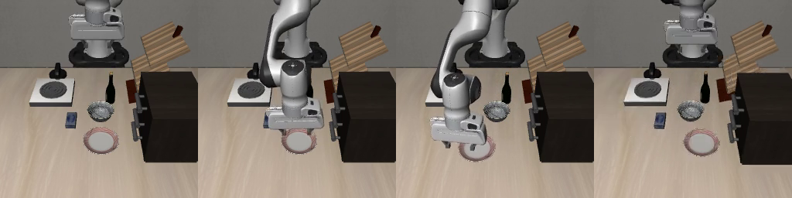{width=98%}

后面 4.5、5.5、7.5 节会用同一段闭环代码依次跑 $\pi_0$-FAST、$\pi_{0.5}$ 和 SmolVLA——对照着
跑，最能体会"路线之争藏在 `select_action` 内部"这句话。

## 3.8 本节小结

**核心创新**

1. **Flow Matching VLA**：首个将 flow matching 与 VLM 结合的 VLA 模型，用连续流替代自回归离散化，支持高频 action chunk 生成

2. **Action Expert 设计**：用独立的小型权重集处理机器人特有 token，既避免了对 VLM 表示的干扰，又通过缩小宽度加速了推理

3. **分块因果注意力**：精心设计的注意力掩码，在保持 VLM 预训练分布的同时，允许动作 token 获取完整的视觉-语言条件信息

4. **预训练/后训练范式**：将 LLM 的训练范式引入机器人学习，用大规模多样化数据建立基础能力，再用高质量数据精调到具体任务

5. **跨机器人训练**：单一模型支持 7 种机器人构型，通过零填充和 mask 统一不同的配置空间

6. **规模**：约 10,000 小时的预训练数据，是当时最大规模的机器人操作学习实验

**局限性**

1. **数据组成优化**：论文简单地合并了所有可用数据，但如何最优地组合和加权不同来源的数据仍是开放问题
2. **正迁移的理解**：跨任务、跨机器人的数据混合是否总是带来正迁移，尚不清楚
3. **泛化边界**：模型是否能扩展到自动驾驶、导航、足式运动等更不同的领域，有待验证
4. **数据需求预测**：对于给定任务，需要多少、什么类型的数据才能达到接近完美的性能，目前无法预测

在第 3 节我们介绍了 $\pi_0$——基于 Flow Matching 的 VLA 模型，它用连续流替代自回归离散化，实现了高频精细控制。下一节介绍它的一个重要后续工作 $\pi_0$-FAST：从动作 token 化的角度，优化自回归 VLA 的训练与推理效率（再下一节的 $\pi_{0.5}$ 会把 FAST 与 flow 结合、冲开放世界泛化）。

# 4 $\pi_0$-FAST：高效动作 Token 化

## 4.1 背景与动机

### 4.1.1 自回归 VLA 的动作 Token 化困境

在第 2 节我们以 OpenVLA 为例介绍了自回归 VLA 常见的动作表示方式：将每个动作维度独立离散化为 256 个 bin，每个时间步的每个维度对应一个 token。这种"逐维度、逐时间步分 bin"（naive tokenization）方案在低频控制（如 BridgeV2 的 5Hz）下工作良好，但在高频场景下会产生严重问题。

考虑一个 50Hz 控制、14 维动作空间（双臂）的场景，1 秒的 action chunk 需要：

$$
\text{token 数} = 50 \times 14 = 700
$$

这带来三个环环相扣的问题——前两条是机制，第三条是它们在高频任务上的直接后果：

| 问题 | 具体表现 |
|---|---|
| 训练收敛极慢 | 高频信号中相邻时间步的动作几乎相同，每个 token 的边际信息量趋近于零，学习信号被严重稀释 |
| 推理速度慢 | 自回归逐 token 解码 700 个 token，延迟远超实时控制需求 |
| 高频任务表现崩溃 | 在 FAST 论文[10]的评估中，采用 naive tokenization 的自回归 VLA 在 20Hz 和 50Hz 任务上几乎无法学到有效策略，也难以支撑 DROID 这类更强调泛化的评估 |

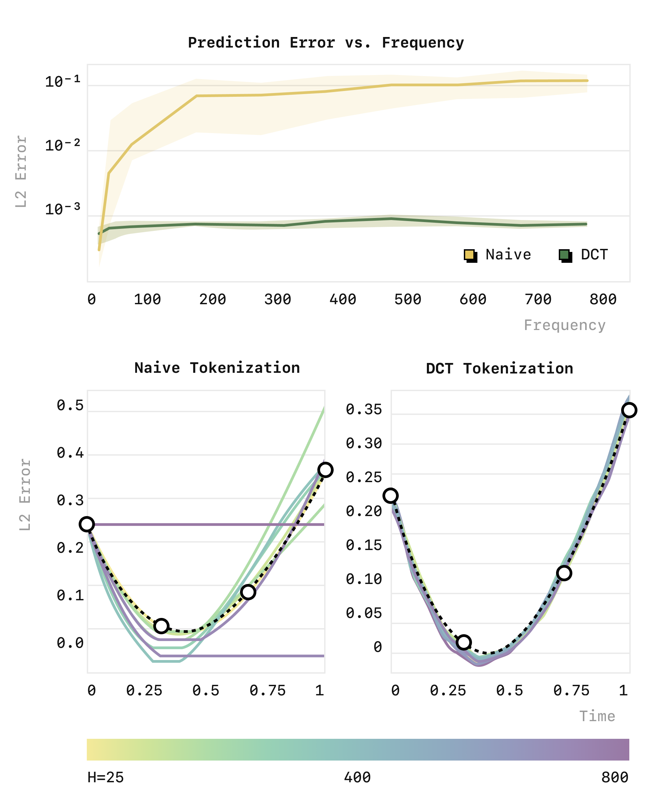{width=70%}

### 4.1.2 为什么边际信息量会趋近于零？

自回归模型的学习信号正比于 $T_i$ 在给定 $T_{1:i-1}$ 条件下的边际信息量。当控制频率升高时，相邻时间步的动作变化量按比例缩小——对于平滑信号，时间步越短，每步变化越小。这意味着：

$$
H(T_i \mid T_{1:i-1}) \to 0 \quad \text{当采样频率} \to \infty
$$

模型需要预测的每个 token 几乎都可以从前一个 token 完美预测，学习信号被淹没在冗余中。这就像让一个人逐字母拼写一篇文章——信息密度极低，学习效率极差。

### 4.1.3 FAST 的核心思路

FAST（Frequency-space Action Sequence Tokenization）的核心思路是：**用基于压缩的 token 化方案替代逐维度分 bin，将高度冗余的动作信号压缩为少量高信息密度的 token。**

类比自然语言处理：BPE（Byte Pair Encoding）从一个较小的初始符号集出发，不断把高频组合学成新 token、**扩充**可用 token 集合（最终词表大小是预先设定的），好处是让高频模式能用更短的 token 序列表示——收益在**缩短序列、提高压缩率**，不是"缩小词表"。FAST 对动作信号做了类似的事情——先用 DCT 变换到频域去除冗余，再用 BPE 进一步压缩。

$$
\underbrace{\text{Na\"ive: 逐维度分 bin}}_{\text{700 tokens/chunk (50Hz, 14-dim)}} \quad\longrightarrow\quad \underbrace{\text{FAST: DCT + BPE}}_{\text{~53 tokens/chunk}}
$$

## 4.2 FAST Token 化算法

### 4.2.1 算法流程总览

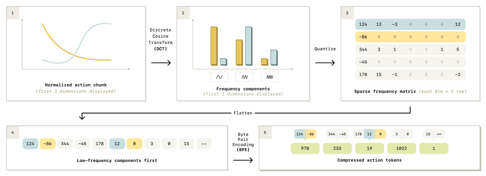

FAST 的 token 化流程分为 5 步：

| 步骤 | 操作 | 目的 |
|---|---|---|
| 1. 归一化 | 用训练集第 1/99 分位数将每个动作维度映射到 $[-1, 1]$ | 统一尺度，便于跨机器人 token 化 |
| 2. DCT 变换 | 对每个动作维度独立做离散余弦变换 | 转换到频域，集中信息到少数系数 |
| 3. 量化 | $\bar{C}^i_j = \text{round}(\gamma \cdot C^i_j)$ | 去除不重要的高频分量，实现有损压缩 |
| 4. 展平 | 按频率优先顺序交叉排列各维度的 DCT 系数 | 让自回归预测先生成低频（整体形状），再生成高频（细节） |
| 5. BPE 压缩 | 对整数序列做 BPE 编码 | 无损压缩零值和频繁组合，生成最终 token 序列 |

### 4.2.2 离散余弦变换（DCT）

DCT 是一种频域变换，将时域信号表示为不同频率余弦分量的加权和。低频分量捕捉信号的整体趋势，高频分量反映急剧变化。对于机器人动作这类平滑信号，大部分能量集中在少数低频系数上。

对于动作维度 $i$ 的时间序列 $a^i_{1:H}$，DCT 变换为：

$$
C^i_j = \text{DCT}(a^i_{1:H})_j
$$

DCT 广泛用于 JPEG 图像压缩——因为像素通常平滑变化，DCT 可以用少数系数表示大部分信息。机器人动作信号同理：关节角度在相邻时间步之间平滑变化，DCT 可以高效压缩。

与基于向量量化（VQ-VAE、FSQ）的学习压缩方法相比，DCT 是解析方法，无需训练神经网络，极其简单快速。

### 4.2.3 量化与压缩

DCT 变换后，通过缩放和取整实现有损压缩：

$$
\bar{C}^i_j = \text{round}(\gamma \cdot C^i_j)
$$

其中 $\gamma$ 是缩放系数（默认 $\gamma = 10$），控制压缩率与重建精度的权衡。取整后，DCT 系数矩阵变得稀疏——大部分高频系数被量化为零，每个动作维度只剩少数有效系数。

### 4.2.4 展平顺序：频率优先

将 $|A| \times H$ 的 DCT 系数矩阵展平为一维序列时，FAST 选择**频率优先**（列优先）顺序：先排列所有维度的最低频系数，再排列次低频，依此类推。

$$
[T_k] = [\bar{C}^1_1, \bar{C}^2_1, \ldots, \bar{C}^{|A|}_1, \bar{C}^1_2, \bar{C}^2_2, \ldots]
$$

这个设计的关键考量是：在自回归预测时，模型先生成低频分量（决定动作的整体形状和方向），再生成高频分量（细节调整）。这类似于先画轮廓再填细节：即便高频分量预测得不够准，整段动作的走向也已经定下来了，策略推演因此更稳。

### 4.2.5 BPE 压缩

展平后的整数序列通常包含大量零值（对应被量化掉的高频分量）。BPE 编码器把频繁出现的整数组合学成新 token，用更短的序列无损地表示同样的内容：

- 大量连续零值被压缩为少数 token
- 跨动作维度的频繁系数组合被合并

BPE 词表大小固定为 1024，可以直接集成到 VLM 的现有词表中。

### 4.2.6 FAST 的超参数

FAST 只有两个超参数，且对两者都不敏感：

| 超参数 | 默认值 | 作用 |
|---|---|---|
| 缩放系数 $\gamma$ | 10 | 控制 DCT 系数量化粒度，权衡压缩率与重建精度 |
| BPE 词表大小 | 1024 | 控制 BPE 压缩的粒度 |

所有实验使用相同的默认值，无需针对数据集调参。这与 VQ-VAE 等需要仔细调参的方法形成鲜明对比。

## 4.3 通用动作 Token 化器：FAST+

FAST 中唯一需要学习的部分是 BPE 词表，需要在每个新数据集上训练（通常只需几分钟）。为了进一步降低使用门槛，作者在约 100 万条真实机器人动作轨迹上训练了一个**通用 token 化器 FAST+**，覆盖单臂、双臂、移动操作等多种构型。

FAST+ 可以作为黑盒 token 化器直接应用于任何机器人的 1 秒动作序列，无需重新训练。实验表明，FAST+ 的性能与针对单个数据集训练的 FAST token 化器相当。

使用方式极其简单——下面这几行调的是 Hugging Face 上 `physical-intelligence/fast` 那个
公开 tokenizer 的接口，不是本书配套仓库里的代码：

```python
from transformers import AutoProcessor

tokenizer = AutoProcessor.from_pretrained(
    "physical-intelligence/fast",
    trust_remote_code=True
)
tokens = tokenizer(action_chunk)
```

## 4.4 压缩效果

| 数据集 | 动作维度 | 控制频率 | naive token 数 | FAST token 数 | 压缩比 |
|---|---|---|---|---|---|
| BridgeV2 | 7 | 5 Hz | 35 | 20 | 1.75x |
| DROID | 7 | 15 Hz | 105 | 29 | 3.6x |
| Table Bussing | 7 | 20 Hz | 140 | 28 | 5.0x |
| T-Shirt Folding | 14 | 50 Hz | 700 | 53 | 13.2x |

FAST 在每个域中始终为每个机械臂生成约 30 个 token（双臂约 60 个），这表明 FAST 找到了一个近似于底层动作信号复杂度的表示，且在很大程度上与动作数据的频率无关。

## 4.5 上手：跑一次 $\pi_0$-FAST 推理

配套代码仓的 `code/vla/4_vla_inference/4_2_pi0fast_pi05_infer/` 加载 $\pi_0$-FAST
的 LIBERO 微调 checkpoint 闭环一次：

```bash
cd code
uv run python vla/4_vla_inference/4_2_pi0fast_pi05_infer/pi0fast_demo.py
```

这个 checkpoint 是 LeRobot 格式，加载回到了 $\pi_0$ demo 的老三行（读配置 → 建策略 →
建前后处理器），只换了一个 `POLICY_PATH`。两处值得留意，都扣着本节内容：

- **FAST tokenizer 是独立组件**：4.2 节说 BPE 词表要在动作数据上训练，所以它不在
  模型权重里，而是一个单独的 HF 仓库，checkpoint 配置里记着它的名字、随权重一起
  自动下载——换数据域重训 tokenizer，模型结构一行不用动。
- **一次生成一整块动作**：与 OpenVLA 每步解码 7 个 token 不同，$\pi_0$-FAST 一次自回归
  生成一串 FAST token、解码回整个动作块，`select_action` 内部维护动作队列，块没
  用完时直接出队、不再过模型——同为自回归离散路线，压缩把"逐步等模型"变成了
  "隔一块等一次"。

同一个任务「push the plate to the front of the stove」（libero_goal），固定初始状态
下 129 步完成；`code/vla/4_vla_inference/4_2_pi0fast_pi05_infer/pi0fast_eval.sh` 用
`lerobot-eval` 连评 2 个初始状态，全部成功：

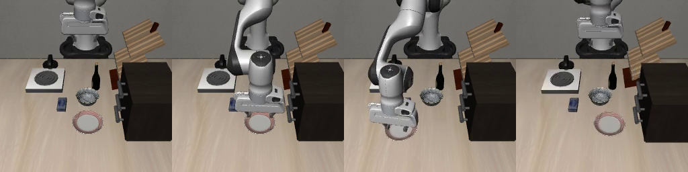{width=98%}

## 4.6 本节小结

**核心创新**

| 贡献 | 内容 |
|---|---|
| 核心方法 | 基于 DCT + BPE 的动作 token 化，将高频动作信号压缩为少量高信息密度 token |
| 通用 token 化器 | FAST+ 在 1M 轨迹上训练，可作为黑盒应用于任何机器人 |
| 训练效率 | 与 diffusion $\pi_0$ 性能匹配，训练时间减少 5 倍 |
| 首次突破 | 论文称其首次在 DROID 数据集上展示了不做协同训练、也不做微调的零样本（zero-shot）语言条件 VLA 策略 |

**局限性**

- 推理速度较慢：论文[10]报告单次约 750 ms，而 flow matching 的 $\pi_0$ 约 100 ms——压缩省下的是训练时间，不是推理时间，高动态任务仍然吃紧
- 尚未在移动机器人、灵巧手、人形机器人等平台上验证 policy 性能
- 自回归 VLA 与 diffusion VLA 的最优架构仍无定论

# 5 $\pi_{0.5}$：开放世界泛化的 VLA

## 5.1 背景与动机

### 5.1.1 泛化性：VLA 的核心挑战

$\pi_0$ 在实验室环境中展示了强大的操作能力，但一个根本问题尚未解决：**模型能否在从未见过的真实环境中工作？**

当一个移动机器人被要求清理一个从未见过的厨房时，它面临多层次的泛化挑战：

| 泛化层次 | 示例 | 所需知识来源 |
|---|---|---|
| 技能泛化 | 拿起不同形状的盘子 | 多样化的机器人操作数据 |
| 场景泛化 | 在新厨房中导航和操作 | 多环境数据 |
| 语义泛化 | 判断哪个抽屉放餐具、哪个是晾碗架 | 互联网视觉-语言知识 |
| 任务规划 | 将"打扫厨房"分解为具体子任务 | 高层语义推理能力 |

仅靠堆积机器人数据来覆盖所有可能场景是不现实的。$\pi_{0.5}$[11] 的核心思路是：**通过异构数据协同训练（co-training），从多种知识来源中迁移能力，实现开放世界泛化。**

### 5.1.2 $\pi_{0.5}$ 的核心定位

$\pi_{0.5}$（读作 "pi oh five"）基于 $\pi_0$ 构建，是一个面向开放世界泛化的 VLA 模型。它的设计目标是：

1. **在全新环境中工作**：在训练数据中从未出现过的真实家庭中执行任务
2. **执行长时间多阶段任务**：如清理厨房、整理卧室，持续 10-15 分钟
3. **从异构数据中迁移知识**：不仅使用移动操作数据，还利用其他机器人数据、网络数据、语言指令等
4. **具备高层任务规划能力**：自主将"打扫厨房"分解为"拿起盘子"→"放入水槽"等子任务

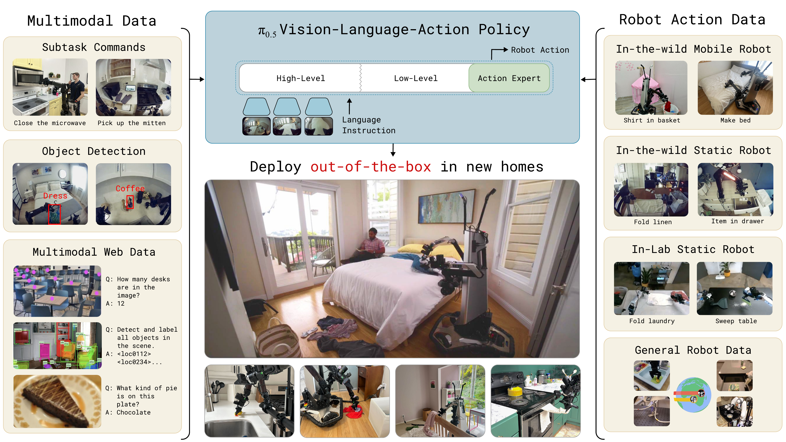

## 5.2 模型架构

### 5.2.1 总体结构

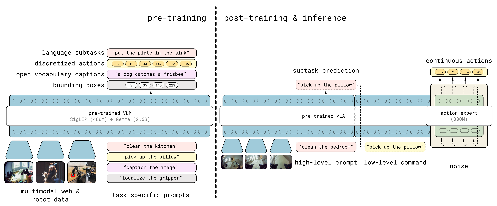

$\pi_{0.5}$ 的架构继承自 $\pi_0$，但做了关键扩展——模型可以同时输出**文本**（用于高层子任务预测和 VLM 任务）和**连续动作**（用于机器人控制）。从推理流程看，可以把它理解为：

$$
\pi_\theta(\hat{\ell}, \mathbf{a}_{t:t+H} \mid \mathbf{o}_t, \ell) \approx \underbrace{\pi_\theta(\hat{\ell} \mid \mathbf{o}_t, \ell)}_{\text{高层子任务推理}} \cdot \underbrace{\pi_\theta(\mathbf{a}_{t:t+H} \mid \mathbf{o}_t, \hat{\ell})}_{\text{低层动作推理}}
$$

| 符号 | 含义 |
|---|---|
| $\mathbf{o}_t = [\mathbf{I}^1_t, \ldots, \mathbf{I}^n_t, \mathbf{q}_t]$ | 观测：多相机图像 + 本体感知 |
| $\ell$ | 高层任务指令，如 "put away the dishes" |
| $\hat{\ell}$ | 模型预测的子任务，如 "pick up the plate" |
| $\mathbf{a}_{t:t+H}$ | 动作块（action chunk），对应 50 个控制步 |

关键设计：**在运行时，模型先生成子任务文本，再把该文本作为低层动作推理的重要上下文。** 这让高层推理和低层控制通过子任务文本衔接，类似于思维链（Chain-of-Thought）推理。不过论文的联合训练公式仍将 action expert 写成条件在文本 token 上，因此这里更适合理解为一种推理流程上的分层分解，而不是严格的概率图模型假设。

### 5.2.2 与 $\pi_0$ 的架构差异

$\pi_{0.5}$ 的 Transformer 骨干延续了 $\pi_0$ 的总体思路（PaliGemma VLM + 300M Action Expert），但有以下关键差异：

| 特性 | $\pi_0$ | $\pi_{0.5}$ |
|---|---|---|
| 文本输出 | 无（VLM 输出被丢弃） | 有（用于子任务预测和 VLM 任务） |
| 动作表示（预训练） | Flow matching | FAST 离散 token |
| 动作表示（后训练） | Flow matching | FAST token + Flow matching 联合 |
| 本体感知输入 | 连续值，线性投影 | 离散化为文本 token |
| 高层推理 | 无显式推理 | 先预测子任务文本，再生成动作 |

### 5.2.3 时间步注入方式的改变

$\pi_0$ 中，flow matching 时间步 $\tau$ 与带噪动作通过 MLP 融合后输入 Transformer。$\pi_{0.5}$ 改为使用 **Adaptive RMSNorm**：

- 时间步 $\tau$ 通过独立的 MLP 编码：$\text{swish}(W_2 \cdot \text{swish}(W_1 \cdot \phi(\tau)))$
- 编码后的时间步信息通过 Adaptive RMSNorm 注入到 Action Expert 的每一层

这种方式让时间步信息更均匀地影响 Action Expert 的所有层，而非仅在输入端融合。

### 5.2.4 注意力掩码

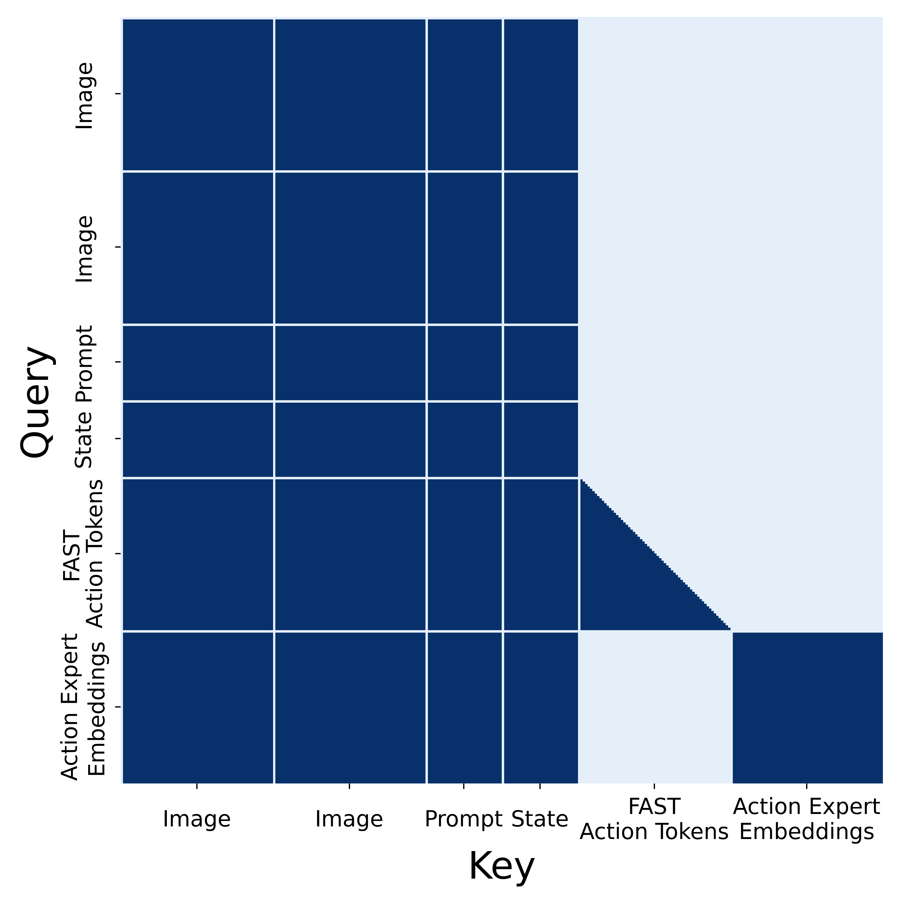{width=50%}

$\pi_{0.5}$ 的注意力掩码比 $\pi_0$ 更复杂，因为需要同时处理 FAST 离散 token 和 flow matching 连续 token：

| Token 类型 | 可以 attend 到 | 不能 attend 到 |
|---|---|---|
| 图像 + prompt + 本体感知 | 彼此（全前缀掩码） | FAST token、Action Expert token |
| FAST action token | 前缀 + 之前的 FAST token（自回归） | Action Expert token |
| Action Expert token | 前缀 + 彼此（双向） | FAST action token |

FAST token 和 Action Expert token 之间不互相 attend，避免两种动作表示之间的信息泄漏。信息单向从 VLM 流向 Action Expert。

## 5.3 训练方案：两阶段训练

### 5.3.1 联合损失函数

$\pi_{0.5}$ 的训练目标结合了自回归文本预测和 flow matching 动作生成：

$$
\mathbb{E}_{\mathcal{D}, \tau, \omega} \left[ H(x_{1:M}, f^\ell_\theta(\mathbf{o}_t, \ell)) + \alpha \left\| \omega - \mathbf{a}_{t:t+H} - f^a_\theta(\mathbf{a}^{\tau, \omega}_{t:t+H}, \mathbf{o}_t, \ell) \right\|^2 \right]
$$

| 项 | 含义 |
|---|---|
| $H(x_{1:M}, f^\ell_\theta)$ | 交叉熵损失：文本 token 预测（包括 FAST 编码的 action token） |
| $\alpha \|\cdot\|^2$ | Flow matching 损失：Action Expert 预测的速度场 |
| $\alpha$ | 权衡系数，后训练阶段设为 10.0 |

### 5.3.2 预训练阶段

预训练阶段将 $\pi_{0.5}$ 作为标准自回归 Transformer 训练（$\alpha = 0$，不使用 Action Expert），使用 FAST 离散 token 表示动作。训练 280k 步。

预训练数据包含 5 类来源：

| 数据类型 | 缩写 | 内容 | 作用 |
|---|---|---|---|
| 移动操作数据 | MM | ~400 小时，~100 个家庭环境的移动机械臂数据 | 直接相关的操作经验 |
| 多环境非移动数据 | ME | 固定臂在多种家庭环境中的数据 | 跨环境泛化，更多样的场景 |
| 跨机器人实验室数据 | CE | 多种机器人在实验室中的数据（含 OXE），是 $\pi_0$ 数据集的扩展版 | 跨机器人迁移，多样化任务 |
| 高层子任务预测 | HL | 带子任务标注的机器人数据 + 边界框标注 | 训练任务分解能力 |
| 网络多模态数据 | WD | 图像描述、视觉问答、物体定位 | 语义理解和物体识别 |

**关键比例**：97.6% 的预训练数据不来自移动操作机器人，而是来自其他机器人、网络数据等异构来源。

**动作表示统一**：所有动作数据归一化到 $[-1, 1]$，动作维度统一为最大值（零填充较低维度的机器人），使用 FAST token 化。

### 5.3.3 后训练阶段

后训练阶段有两个目的：(1) 将模型专门化到移动操作；(2) 加入 Action Expert 以支持 flow matching 连续动作生成。

后训练使用联合损失（$\alpha = 10.0$），训练 80k 步。Action Expert 在后训练开始时随机初始化。

后训练数据的变化：

| 变化 | 原因 |
|---|---|
| 去掉实验室跨机器人数据（CE） | 聚焦移动操作 |
| 加入语言指令数据（VI） | 提升高层子任务推理能力 |
| 保留网络数据（WD） | 维持语义和视觉能力 |
| 过滤动作数据 | 只保留成功的、长度合理的 episode |

**语言指令数据（VI）** 是一种新颖的数据收集方式：专家用户通过语言"遥操作"机器人——实时给出子任务指令（如"拿起盘子"、"放到水槽里"），机器人用已训练的低层 policy 执行。这相当于为高层策略提供了"示教"数据。

### 5.3.4 两阶段设计的优势

$$
\underbrace{\text{预训练：FAST 离散 token}}_{\text{训练快、语言能力强}} \quad\longrightarrow\quad \underbrace{\text{后训练：FAST + Flow Matching}}_{\text{推理快、动作精细}}
$$

这种设计结合了两种动作表示的优势：

- **预训练用 FAST**：离散 token 训练效率高（如 FAST 论文所示，比纯 diffusion 快 5 倍），且与文本 token 共享同一个自回归框架，有利于保持语言跟随能力
- **后训练加入 Flow Matching**：连续动作表示精度更高，且 Action Expert 只有 300M 参数，推理时只需 10 步积分，远快于自回归解码 30-60 个 token

## 5.4 推理流程：分层推理

$\pi_{0.5}$ 的推理分为两步：

### 5.4.1 高层推理：子任务预测

给定高层指令 $\ell$（如 "clean the kitchen"）和当前观测 $\mathbf{o}_t$（4 个相机图像），模型通过自回归解码预测子任务 $\hat{\ell}$（如 "pick up the plate"）。

高层推理使用所有 4 个相机（前向、后向、两个腕部），以获得更全面的场景理解。

### 5.4.2 低层推理：动作生成

给定子任务 $\hat{\ell}$ 和观测 $\mathbf{o}_t$（3 个相机：前向 + 两个腕部），通过 flow matching 的 10 步积分生成动作块 $\mathbf{a}_{t:t+H}$。

低层推理不使用后向相机，因为动作执行主要关注前方和手部视角。

### 5.4.3 推理频率

高层推理和低层推理运行在不同频率：

- **低层控制输出**：对应 50Hz 控制序列（借助 action chunking）
- **高层子任务推理**：频率更低，不需要每步都重新推断子任务

这类似于人类的决策过程：高层规划（"接下来拿盘子"）不需要每毫秒更新，但手部动作需要高频控制。

## 5.5 上手：跑一次 $\pi_{0.5}$ 推理

```bash
cd code
uv run python vla/4_vla_inference/4_2_pi0fast_pi05_infer/pi05_demo.py
```

demo 与 $\pi_0$-FAST 在同一个模块目录（`4_2_pi0fast_pi05_infer/`），与 $\pi_0$ 的 demo
逐行同构——**换模型只是换一行 `POLICY_PATH`**。$\pi_{0.5}$ 的动作输出仍是 flow matching
连续动作头（5.4.2 节的 10 步积分 + action chunking），本节讲的离散 token 联合训练、
分层推理都发生在训练配方与模型内部，对使用者不可见。

把 `code/vla/4_vla_inference/4_2_pi0fast_pi05_infer/pi0fast_demo.py` 和
`code/vla/4_vla_inference/4_2_pi0fast_pi05_infer/pi05_demo.py` 对照着跑一遍，3.7 节留下的那句话就落了地：一条自回归离散、一条连续
流匹配，在"怎么调用"上毫无差别，路线之争全部藏在 `select_action` 内部。

同一个任务、同一个初始状态下 125 步完成（$\pi_0$-FAST 是 129 步）；
`code/vla/4_vla_inference/4_2_pi0fast_pi05_infer/pi05_eval.sh`
连评 2 个初始状态成功 1 个——单任务少量 episode 的成功率波动很大，只做冒烟参考，
系统的成功率对比见各论文汇报的全套件数字：

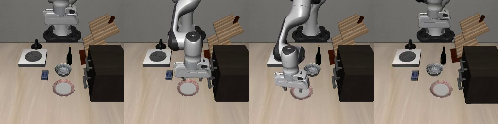{width=98%}

## 5.6 本节小结

**核心创新**

| 贡献 | 内容 |
|---|---|
| 异构协同训练 | 从其他机器人、网络数据、语言指令等多种来源迁移知识 |
| 两阶段训练 | 预训练用 FAST 离散 token（高效），后训练加入 flow matching（精细） |
| 分层推理 | 同一模型先推断子任务文本，再生成低层动作，类似思维链 |
| 语言指令数据 | 新颖的数据收集方式：人类用语言"遥操作"机器人，为高层策略提供示教 |
| 开放世界泛化 | 论文称其首次展示了端到端学习驱动的系统在全新家庭中执行 10-15 分钟的复杂操作任务 |

**局限性**

- 仍会犯错：不熟悉的把手、遮挡导致的部分可观测性问题、高层推理的分心（如反复开关抽屉）
- 只处理相对简单的 prompt，复杂偏好和指令需要更丰富的标注
- 上下文窗口有限，缺乏跨房间的记忆和导航能力
- 数据组合的最优配方仍是开放问题


# 6 VLA-0：把动作直接当文本说出来

VLA-0[12] 的主张只有一句话：前面几节给 VLM 做的那些手术，其实一个都不用做。

## 6.1 背景与动机

### 6.1.1 到目前为止，所有 VLA 都在"改" VLM

从第 2 节的 OpenVLA 开始，本讲的模型都建立在同一个范式上：拿一个预训练好的视觉-语言模型（VLM），把它改造成能输出机器人动作的策略。问题在于，"怎么让 VLM 输出动作"这件事，大家都觉得需要给 VLM **动手术**。手术大致分两类：

::: {tbl-colwidths="[22,22,56]"}

| 路线 | 代表 | 给 VLM 加了什么 |
|------|------|----------------|
| 改词表 / 造动作 token | OpenVLA（覆盖 256 个低频词）、$\pi_0$-FAST（DCT+BPE 动作 tokenizer）、MiniVLA（VQ 码本） | 在 VLM 词表里塞进一批专门表示动作的新 token |
| 换专用动作头 | $\pi_0$ / SmolVLA（flow matching 头）、Octo（diffusion 头）、OpenVLA-OFT（连续 L1 回归头） | 把语言输出头换成一个专门生成连续动作的模块 |

:::


这两类手术都有代价。改词表会破坏 VLM 原有的词汇结构、削弱语言能力（OpenVLA 那一讲已经讲过这个折中）；换专用动作头则要从零训练一个新模块，还往往需要大规模机器人数据预训练才能训好。

### 6.1.2 一个一直没被认真试过的最简想法

退一步看：机器人动作不过就是**几个数**——末端位姿增量、夹爪开合，七八个浮点数而已。而 VLM 在互联网规模的预训练里，早就学会了读写数字（做数学题、识别票据金额、数物体个数）。

那么一个近乎"偷懒"的想法是：**为什么不干脆让 VLM 把动作当普通文本，直接把数字"说"出来？**

```text
输入：[图像] + "把茄子放进盆里"
输出（模型直接生成的文本）："128 240 12 5 ..."
```


不造新 token，不加新头，就用模型本来就会的"输出一串数字"的能力。这个最朴素的策略，恰恰一直没人认真试过——大家默认它太简单、肯定打不过精心设计的动作 token 和动作头。

### 6.1.3 VLA-0 的主张：零改装

VLA-0 把这个想法做到底，并起名 **"zero modification"（零改装）**：

1. 拿一个**完全不改**的现成 VLM（官方用 Qwen2.5-VL-3B-Instruct）。
2. 把动作表示成**文本里的整数**，让模型像写普通回答一样把它们生成出来。
3. 只做标准的**监督微调（SFT）**，**不做**任何大规模机器人数据预训练。

结论很反直觉：就这么个最简方案，性能反而做到了 SOTA——在 LIBERO 上不仅超过同样数据训练的方法，还压过了用了大规模预训练的 $\pi_0$、GR00T N1 等大块头。

## 6.2 方法：动作即文本

VLA-0 的全部技术含量，集中在"怎么把动作表示成文本"这一步上。模型结构本身没有任何改动，所以这一节不讲架构，只讲表示。

### 6.2.1 把动作离散化成整数，再打印成数字串

连续动作没法直接当 token 输出，所以先离散化。对动作向量的每一维，VLA-0 把取值范围均匀切成 $N$ 个 bin，把连续值映射成一个 $0 \sim N-1$ 的整数：

$$
\text{bin}(a_i) = \left\lfloor \frac{a_i - a_{\min}}{a_{\max} - a_{\min}} \times N \right\rfloor
$$

::: {tbl-colwidths="[20,46,34]"}

| 符号 | 含义 | 典型取值 |
|------|------|----------|
| $a_i$ | 第 $i$ 维的连续动作值 | —— |
| $a_{\min}, a_{\max}$ | 该维度的取值范围 | 由数据统计得到 |
| $N$ | 离散 bin 数 | 本课用的 0.5B 版本取 512（LeRobot 策略配置里的 `n_state_bins`） |

:::

这一步和 OpenVLA 的分桶在数学上几乎一样。**关键区别在于离散之后怎么表示**：OpenVLA 要把 bin 编号映射到词表里专门改出来的动作 token，而 VLA-0 直接把这个整数**当普通数字写进文本**。

如果还要做 action chunking（一次输出未来 $H$ 步），就把这 $H$ 步、每步 $A$ 维的动作全部离散化，拼成一长串整数，模型一次性把这串数字生成出来。

### 6.2.2 受约束解码：逼模型只吐合法的数字

"让模型自由生成文本"有个风险：它可能多说一句话、少写一个数、或者把数字写成中文。动作解析需要**恰好 $H \times A$ 个整数**，格式不能错。

VLA-0 用**受约束解码（grammar-constrained decoding）**解决：在生成时挂一个语法，强制输出必须是"恰好 N 个整数"的形式（实现上用 xgrammar 这类工具构造一个 `恰好N个数字` 的语法约束）。这样无论模型本身多"话痨"，落到纸面上的一定是一串干净、可解析的数字。

> 备注：受约束解码不改模型权重、不改架构，只是在**推理时**限制采样空间。所以它和"零改装"的主张不冲突——VLM 还是那个 VLM。

### 6.2.3 为什么"只是说数字"反而好用

直觉上，把动作塞进新造的 token（OpenVLA / $\pi_0$-FAST / VQ）或专用动作头，似乎更"专业"。但它们都有一个隐藏成本：**那些新 token 的 embedding、那个新动作头，都是随机初始化、从零学起的**，VLM 在预训练里积累的知识帮不上忙，得靠机器人数据硬训。

VLA-0 反过来想：数字"128""240"这些 token，VLM 在预训练里已经见过无数次，词表和 embedding 都是现成的。**把动作落在模型已有的表示上，就不必从随机初始化开始学一批新的动作 token**——这是一种可能的解释，也是它不需要大规模机器人预训练也能打过部分需要预训练方法的候选原因之一。

不过要留一句边界：从"预训练见过数字"到"机器人动作迁移得更好"这条因果链，并没有被单独的消融实验证明过。数字在动作序列里主要充当编码符号，未必在用它的自然语言语义；实际收益也可能同时来自受约束解码、离散化方案和整套训练配方。所以把它当作**假设**看，不要当作已证结论。

### 6.2.4 训练：就是一次普通的 SFT

既然不改结构、不加模块，训练就退化成最标准的事：把"图像 + 指令 → 动作数字串"当成普通的指令微调样本，对 VLM 做监督微调（只在动作那段文本上算 loss）。没有 VQ-VAE 预训练、没有 flow/diffusion 的特殊训练目标、没有多阶段流程。

## 6.3 和 OpenVLA 的关系：把离散思路推到极简

把本讲的离散 token 这条线连起来看，VLA-0 是它的终点：

::: {tbl-colwidths="[22,28,26,24]"}

| | OpenVLA（第 2 节） | $\pi_0$-FAST（第 4 节） | VLA-0（本节） |
|---|---|---|---|
| 动作怎么离散 | 每维 256-bin | DCT+BPE 压成 token | 每维分桶成整数 |
| 怎么表示 | **覆盖词表**里 256 个低频 token | 额外造一套 FAST token | **直接当普通数字文本** |
| 对 VLM 的改动 | 改词表（伤语言能力） | 加新 token | **零改装** |

:::

一句话：OpenVLA 证明了"VLA 可以用离散 token 自回归地生成动作"，但为此动了词表；VLA-0 说，连词表都不用动——**动作就是几个数，让模型照着说出来就行**。它是 OpenVLA 离散路线的极简版。

## 6.4 两个版本：3B 官方版 与 0.5B 小型版

VLA-0 的"零改装"思路不挑骨干，于是有两档实现：

::: {tbl-colwidths="[16,26,10,48]"}

| 版本 | 骨干 VLM | 规模 | 落地方式 |
|------|----------|------|----------|
| 官方 VLA-0 | Qwen2.5-VL-3B-Instruct | 3B | 较强，但推理更慢；接 LeRobot 走数据兼容 + 独立部署 |
| vla0_smol（社区） | SmolVLM2-500M | 0.5B | 已被做成 **LeRobot 原生策略**，可直接 `lerobot-train/eval`，自带 SO-100/SO-101 工具链 |

:::

> 备注：两档里 **0.5B 的 vla0_smol** 门槛低得多——它在单张消费级显卡上就能完成监督微调，并且天生接在 LeRobot / SO-101 这套实验体系里，这两点 3B 版本都做不到那么顺。

## 6.5 本节小结

**数据流总结**

**训练时**：图像 + 指令 → VLM → 生成动作数字串；把真实动作离散化成同样的数字串当监督目标，只在动作文本段上算 next-token loss，标准 SFT。

**推理时**：图像 + 指令 → VLM 在受约束解码下吐出恰好 $H \times A$ 个整数 → 反离散化还原成连续动作 → 下发机器人。

把它放回本讲的脉络：到 VLA-0 为止，**离散 token 这条路被走到了极简的尽头**——连词表都不必动。接下来的 SmolVLA 会押注另一边：放弃"纯文本说数字"的简单性，改用 **flow matching 的连续动作头**，用一次前向直接生成整段连续动作，把推理速度和效率拉上来。这两个模型量级相同、都能挂上 LeRobot，动作头哲学却正好相反：一个把动作当文本说出来，一个把动作从噪声里流出来。

参考表（关键事实一览，数字均出自论文[12]）：

::: {tbl-colwidths="[26,74]"}

| 项目 | VLA-0 |
|------|-------|
| 骨干 | Qwen2.5-VL-3B（官方）/ SmolVLM2-500M（小型版） |
| 动作表示 | 离散整数 → 直接当文本输出 |
| 对 VLM 改动 | 零（不改词表、不加动作头） |
| 解码 | 受约束解码，强制恰好 $H\times A$ 个整数 |
| 训练 | 纯 SFT，无大规模机器人预训练 |
| LIBERO | 94.7%（超过用了大规模预训练的 $\pi_0$ / GR00T N1） |
| 真机 SO-100 | 比 SmolVLA 高约 12.5 个百分点 |
| 主要代价 | 自回归推理慢（约 4 Hz） |

:::

> 一句话总结：VLA-0 不给 VLM 做任何手术，只把动作离散成整数、当普通文本让模型"说"出来，再用受约束解码保证格式，就把 OpenVLA 的离散路线推到了极简，并在零改装、纯 SFT 下做到了 SOTA——代价是自回归推理偏慢。

**局限性**

1. **推理慢**：自回归解码逐 token 生成数字串，控制频率受限，高频闭环和快速反应是短板。
2. **离散分辨率有上限**：动作精度受 bin 数限制，本质上还是把连续控制量化了。
3. **验证范围**：主要在 LIBERO 仿真 + 少量真机任务上验证，更大规模、更多形态的机器人上的表现仍待观察。

# 7 SmolVLA：小模型与异步推理

SmolVLA[13] 把同一套「VLM 出条件、动作专家出动作」的结构压到了 0.45B。下面这张架构图
里最显眼的是那把剪刀——VLM 的后半层被整个丢掉了。

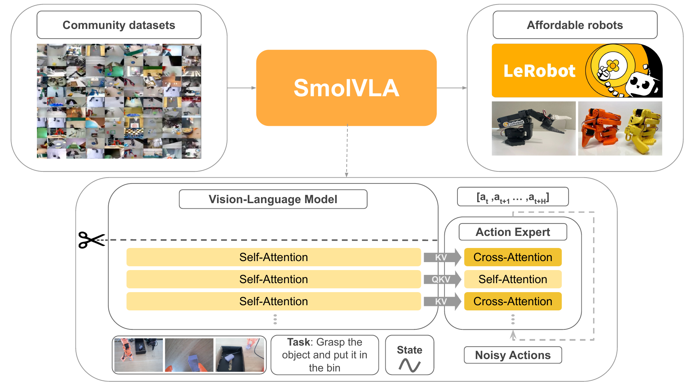

本讲前面介绍的 $\pi_0$ 系列（第 3、4、5 节），以及像 NVIDIA GR00T N1[14] 这样的工业级 VLA，分别代表了两条技术路线：大规模异构数据协同训练和跨构型统一架构。它们性能强大，门槛也同样高：私有数据、多卡集群、上千小时的采集，缺一条都复现不了。本节介绍 Hugging Face 的 SmolVLA——一个仅 450M 参数的开源 VLA 模型，它从截然相反的方向问了一个问题：**在数据和算力都极其有限的条件下，能不能训出一个实用的通用机器人策略？**

## 7.1 背景与动机

### 7.1.1 VLA 的可及性困境

尽管 VLA 模型在学术 benchmark 上取得了令人瞩目的进展，但大部分有影响力的工作仍然是封闭的：模型权重可能公开，但完整的训练细节、数据配方和关键方法组件往往被保留。更重要的是，现有 VLA 模型普遍面临三个可及性障碍：

| 障碍 | 具体表现 |
|---|---|
| 模型规模大 | OpenVLA 7B、$\pi_0$ 3.3B，训练和推理都需要高端 GPU |
| 数据依赖重 | $\pi_0$ 使用 ~10,000 小时私有机器人数据，GR00T N1 使用 ~8,000 小时多源数据（两个数字均引自 SmolVLA 论文[13]的对照） |
| 硬件门槛高 | 评估通常依赖 Franka Panda 等昂贵机器人平台（单台数万美元） |

### 7.1.2 SmolVLA 的核心思路

SmolVLA 的设计哲学可以概括为一句话：**用最小的模型、最少的数据、最便宜的硬件，做到尽可能好的效果。** 具体来说：

- **模型**：450M 参数（$\pi_0$ 的 ~1/7），可以在消费级 GPU 甚至 CPU 上运行
- **数据**：仅使用 ~23K 条公开社区数据集（不到 OpenVLA 训练数据的 1/40）
- **硬件**：在 SO-100/SO-101 等 3D 打印低成本机械臂上评估（成本约几百美元）

$$
\underbrace{\text{SmolVLM-2 (350M)}}_{\text{紧凑 VLM 骨干}} + \underbrace{\text{Action Expert (100M)}}_{\text{Flow Matching Transformer}} = \underbrace{\text{SmolVLA (450M)}}_{\text{小而强的 VLA}}
$$

### 7.1.3 设计原则

SmolVLA 的设计遵循三个核心原则：

| 原则 | 内容 |
|---|---|
| 轻量高效 | 跳过 VLM 后半层、减少视觉 token、使用小型预训练 VLM、交叉注意力（cross-attention, CA）与自注意力（self-attention, SA）交替排列 |
| 社区数据驱动 | 完全基于公开的社区贡献数据集预训练，不依赖任何私有数据 |
| 异步推理 | 解耦动作执行与观测处理，消除推理延迟，提升实时响应能力 |

## 7.2 模型架构

### 7.2.1 总体结构

SmolVLA 由两个核心组件组成：一个紧凑的预训练 VLM 负责感知，一个 Action Expert 负责动作生成。推理流程为：

$$
\underbrace{\phi_t = \text{VLM}_{\text{layer } N}(\mathbf{I}_t^{1:K}, \ell, \mathbf{q}_t)}_{\text{VLM：视觉-语言-状态编码}} \quad \Longrightarrow \quad \underbrace{\mathbf{v}_\theta(\mathbf{A}_t^\tau, \phi_t) \to \mathbf{A}_t}_{\text{Action Expert：Flow Matching 动作生成}}
$$

| 模块 | 角色 | 模型 | 参数量 |
|---|---|---|---|
| VLM | 编码图像、语言指令和机器人状态 | SmolVLM-2（SigLIP + SmolLM2，仅前 $N$ 层） | ~350M |
| Action Expert | 基于 VLM 特征生成动作序列 | 交替 CA/SA 的 Flow Matching Transformer | ~100M |
| 总计 | — | — | 450M |

#### （1）与 $\pi_0$ 和 GR00T N1 的架构对比

这张横向对照表整理自 SmolVLA 论文[13]，$\pi_0$ 与 GR00T N1 两列是它对两个大模型的归纳。

| 特性 | SmolVLA | $\pi_0$ | GR00T N1 |
|---|---|---|---|
| 总参数量 | 450M | 3.3B | 2.2B |
| VLM 骨干 | SmolVLM-2（350M） | PaliGemma（3B） | Eagle-2（1.34B） |
| VLM 特征层 | 前 $N=L/2$ 层（丢弃后半） | 最终层 | 中间层（第 12 层） |
| VLM-动作模块连接 | 交替 CA + 因果 SA | 共享 Transformer + MoE 路由 | Cross-Attention（Flamingo 风格） |
| 动作生成 | Flow Matching（100M） | Flow Matching（300M Action Expert） | DiT + Flow Matching（860M） |
| VLM 训练策略 | 完全冻结 | 语言组件冻结，其余微调 | 语言组件冻结，其余微调 |

最核心的区别在于 SmolVLA 的极致轻量化策略：VLM 完全冻结且只使用前半层，Action Expert 的隐藏维度缩减为 VLM 的 75%。这些设计使得整个模型可以在单块消费级 GPU 上训练，甚至在 CPU 上推理。

### 7.2.2 Vision-Language Model

SmolVLA 使用 SmolVLM-2 作为 VLM 骨干，这是 Hugging Face 开发的一个针对多图像输入优化的紧凑 VLM：

- **视觉编码器**：SigLIP，将图像编码为视觉 token
- **语言解码器**：SmolLM2，处理视觉 token、文本 token 和状态 token
- **状态投影**：机器人本体感知状态通过线性层投影为单个 token，与 VLM 的 token 维度对齐

VLM 的输入处理流程：

1. 多个 RGB 相机图像经 SigLIP 编码，再用 pixel shuffle（把相邻空间位置的特征堆到通道维上，用分辨率换通道数）压缩为每帧 64 个视觉 token
2. 语言指令被 tokenize 为文本 token
3. 机器人状态被线性投影为 1 个状态 token
4. 三类 token 拼接后送入语言解码器

#### （1）视觉 Token 压缩

高分辨率图像虽然有助于感知，但会显著增加推理成本。SmolVLA 将每帧视觉 token 限制为 64 个：

$$
512 \times 512 \text{ 图像} \xrightarrow{\text{SigLIP + PixelShuffle}} 64 \text{ 个 token}（而非 1024 个）
$$

虽然 SmolVLM-2 原本支持 image tiling（处理同一图像的多个裁剪），但 SmolVLA 在推理时只使用全局图像，不使用 tiling，以保持推理的轻量和快速。

#### （2）层跳过（Layer Skipping）

这是 SmolVLA 最关键的效率优化之一。已有研究表明，VLM 的最终层特征并不一定是下游任务的最优表示——中间层往往保留了更丰富的视觉-空间信息。SmolVLA 直接丢弃 VLM 的后 $L - N$ 层，Action Expert 只访问前 $N$ 层的特征：

$$
N = \frac{L}{2} \quad \Longrightarrow \quad \text{VLM 和 Action Expert 的计算量各减半}
$$

论文[13]在 LIBERO 上的实验表明，使用前 16 层（共 32 层）的效果与使用全部层相当，但计算成本减半。此外，从大 VLM 跳层的效果优于直接使用更小的 VLM（256M），说明大模型的前半层特征质量确实更高。

### 7.2.3 Action Expert：Flow Matching Transformer

Action Expert $\mathbf{v}_\theta$ 是一个约 100M 参数的紧凑 Transformer，负责根据 VLM 特征生成动作序列（action chunk）。它使用 flow matching 目标训练，隐藏维度为 VLM 的 75%（$0.75 \times d$）。

#### （1）Flow Matching 训练目标

给定真实动作 chunk $\mathbf{A}_t = (a_t, \ldots, a_{t+n})$、flow matching 时间步 $\tau \sim \text{Beta}(\alpha, \beta)$ 和噪声 $\epsilon \sim \mathcal{N}(\mathbf{0}, \mathbf{I})$，噪声动作为：

$$
\mathbf{A}_t^\tau = \tau \mathbf{A}_t + (1 - \tau) \epsilon
$$

沿 $\tau$ 从 0 积到 1，这条路径的导数是 $\mathbf{A}_t - \epsilon$，所以模型要学的目标向量场是 $\mathbf{u}(\mathbf{A}_t^\tau \mid \mathbf{A}_t) = \mathbf{A}_t - \epsilon$（与 3.3.1 节 $\pi_0$ 的符号约定一致，都是"从噪声指向数据"），损失函数为：

$$
\mathcal{L}^\tau(\theta) = \mathbb{E}_{p(\mathbf{A}_t \mid \mathbf{o}_t), q(\mathbf{A}_t^\tau \mid \mathbf{A}_t)} \left[ \left\| \mathbf{v}_\theta(\mathbf{A}_t^\tau, \mathbf{o}_t) - (\mathbf{A}_t - \epsilon) \right\|^2 \right]
$$

其中 $\mathbf{o}_t$ 是 VLM 第 $N$ 层输出的特征。推理时使用 10 步前向 Euler 积分生成动作——方向必须和训练时的向量场一致：$\tau$ 从 0 走到 1、速度指向数据，才能积分到动作而不是积回噪声。

在论文[13]的这组消融里，flow matching 比 L1 回归在 LIBERO 上平均成功率高约 5 个百分点（80.25% vs 75.25%）；作者把它归因于生成式建模对多模态动作分布的表达能力。要注意单个消融只能说明该设置下成绩更高，优化、容量、损失尺度或超参差异都还没被排除，确切的因果机制仍需更多受控消融。

#### （2）交替 Cross-Attention 和因果 Self-Attention

这是 SmolVLA 区别于 $\pi_0$（纯 SA）和 GR00T N1（标准 Flamingo 式 CA+SA 块）的关键设计。SmolVLA 的 Action Expert 中，每个 Transformer 块只包含一种注意力层，CA 和 SA 交替排列：

| 注意力类型 | 操作 | 作用 |
|---|---|---|
| Cross-Attention (CA) | 动作 token attend 到 VLM 特征 | 将视觉-语言理解注入动作生成 |
| 因果 Self-Attention (SA) | 动作 token attend 到之前的动作 token | 时序建模，确保动作平滑性 |

{width=100%}

7.2.1 那张对照表里的"交替 CA + 因果 SA / 共享 Transformer + MoE 路由 / Cross-Attention（Flamingo 风格）"三个短语，说的就是图上这三竖列。**关键差别不在用不用 CA，而在 CA 和 SA 是不是被拆进不同的块**：中间那一列根本没有 CA，动作 token 靠"和 VLM token 挤在同一个序列里"来拿信息；右边那一列每个块都要同时算 CA 和 SA；只有左边这一列把两者拆开、轮流上。同样画四个块，左列里只有两个要去 attend VLM，右列四个块每一个都得算一遍 CA 再算一遍 SA——7.1.3 把"CA 与 SA 交替排列"和跳层、减视觉 token 一起列在"轻量高效"这条原则下，指的就是这个。至于左列 SA 块上那个"因果"，指的是底部那张下三角掩码：动作 token 只能往回看，看不到自己后面的动作。

这种交替设计的优势在论文[13]的消融实验中得到了验证（下面三张消融表的数字都出自该文）：

| 注意力机制 | Spatial | Object | Goal | Long | 平均 |
|---|---|---|---|---|---|
| 仅 CA | 87 | 92 | 83 | 54 | 79.0 |
| 仅 SA | 80 | 94 | 84 | 40 | 74.5 |
| CA+SA（交替，SmolVLA） | 86 | 99 | 90 | 67 | 85.5 |

交替 CA+SA 比纯 CA 高 6.5 个百分点，比纯 SA 高 11 个百分点。CA 确保动作与感知和指令对齐，SA 提升时序平滑性——在真实机器人上，不平滑的动作预测会导致不安全或不稳定的行为。

此外，SA 层使用因果掩码（每个动作 token 只能 attend 到之前的 token），而非双向注意力。论文[13]报告因果注意力（74.5%）显著优于双向注意力（67.5%，该行未列入上表），防止未来动作信息泄漏对性能至关重要。

#### （3）状态信息的注入位置

SmolVLA 将机器人状态投影为 token 后送入 VLM（作为前缀），而非直接送入 Action Expert。实验表明这一选择对性能影响显著：

| 状态位置 | 注意力 | Spatial | Object | Goal | Long | 平均 |
|---|---|---|---|---|---|---|
| VLM（前缀） | CA | 89 | 94 | 85 | 53 | 80.3 |
| Expert（后缀） | CA | 86 | 82 | 78 | 47 | 73.3 |

将状态送入 VLM 比送入 Action Expert 高 7 个百分点，说明让 VLM 同时理解视觉、语言和本体感知状态的联合表示更有效。

#### （4）Action Chunk 大小

SmolVLA 默认预测 $n = 50$ 步的动作 chunk。消融实验表明 chunk 大小在 10-50 之间效果较好：

| Chunk 大小 | Spatial | Object | Goal | Long | 平均 |
|---|---|---|---|---|---|
| 1 | 45 | 77 | 54 | 24 | 50.0 |
| 10 | 90 | 94 | 94 | 58 | 84.0 |
| 30 | 85 | 94 | 87 | 48 | 78.5 |
| 50 | 89 | 94 | 85 | 53 | 80.3 |
| 100 | 83 | 88 | 85 | 42 | 74.5 |

过小的 chunk（$n=1$）导致模型缺乏时序上下文，性能急剧下降；过大的 chunk（$n=100$）则因为预测范围过长而降低精度。

## 7.3 社区数据集与预训练

### 7.3.1 数据来源：LeRobot 社区数据集

7.1.1 那张表里的两个千小时量级，在 SmolVLA 这里一个都不适用：它的预训练数据完全来自公开的社区贡献数据集——在 Hugging Face Hub 上以 `lerobot` 标签共享的机器人数据集。这些数据由全球各地的研究者和爱好者在不同环境中收集，从实验室到家庭，自然地涵盖了多样化的场景。

| 统计量 | 数值 |
|---|---|
| 数据集数量 | 481 个 |
| 总 episode 数 | ~22,900 条 |
| 总帧数 | ~10.6M 帧 |
| 主要机器人 | SO-100 |

这个数据规模比其他 VLA 的训练数据至少小一个数量级，但多样性显著更高——社区数据集天然包含了嘈杂的示教、异构的环境、多样的物体交互和不同的光照条件。

### 7.3.2 数据标准化

社区数据集的一个核心挑战是标准化。SmolVLA 团队在两个方面做了大量手工工作：

#### （1）任务标注改进

许多社区数据集的任务描述质量很差——有的是模糊的占位符（如 `task desc`），有的是过于简短的指令（如 `Move`、`Pick`），有的完全缺失。SmolVLA 使用 Qwen2.5-VL-3B-Instruct 自动生成简短的动作导向描述：给定采样帧和原始标签，模型被提示生成一句非常简洁、以动作动词开头的描述（附录中的 prompt 约束为不超过 30 个字符，例如 `Open the drawer`、`Pick the cube` 一类短句）。

#### （2）相机视角标准化

不同数据集的相机命名极不一致——`images.laptop` 在不同数据集中可能指顶部、侧面或腕部视角。SmolVLA 团队手动将每个相机映射到标准化方案：

- `OBS_IMAGE_1`：顶部俯视图
- `OBS_IMAGE_2`：腕部视角
- `OBS_IMAGE_3`：侧面视角

如果存在更多额外视角，则保留其原有顺序；训练时未使用的视角会被丢弃。

实验表明，一致的相机命名对预训练效果有显著正面影响。

### 7.3.3 预训练与后训练

SmolVLA 借鉴 LLM 的训练范式，采用预训练 + 后训练的两阶段方案：

| 阶段 | 预训练 | 后训练（微调） |
|---|---|---|
| 数据 | 481 个社区数据集（~23K episodes） | 特定任务数据集（~50 episodes/任务） |
| 训练步数 | 200,000 步 | 仿真 100,000 步；真机 200,000 步 |
| Batch size | 256（全局） | 64 |
| 学习率 | 1e-4（余弦衰减至 2.5e-6） | 同上 |
| VLM 状态 | 完全冻结 | 完全冻结 |
| 训练对象 | 仅 Action Expert | 仅 Action Expert |
| GPU | 4 块 GPU | 单块 GPU 即可 |

> 备注：这里不给"总计算量"的数字。此前流传的"约 30,000 GPU 小时"与 SmolVLA 主打的"小模型、低成本"叙述、以及 4 卡跑 20 万步的常见墙钟量级严重不符（4 卡 30,000 GPU 小时意味着 7,500 小时墙钟，约十个月），极可能是单位或来源误抄。要引用算力，请回查论文附录或官方训练日志，并写成"GPU 型号 × 数量 × 墙钟小时"这种可核对的形式。

关键设计：**VLM 在整个训练过程中完全冻结**，只训练 Action Expert。这与 $\pi_0$（微调 VLM 非语言部分）和 GR00T N1（微调视觉编码器和 DiT）不同，进一步降低了训练成本。

预训练的效果非常显著：在 SO-100 真机任务上，不经预训练的 SmolVLA 平均成功率为 51.7%，经社区数据预训练后跃升至 78.3%，高出 26.6 个百分点。

## 7.4 异步推理

### 7.4.1 同步推理的问题

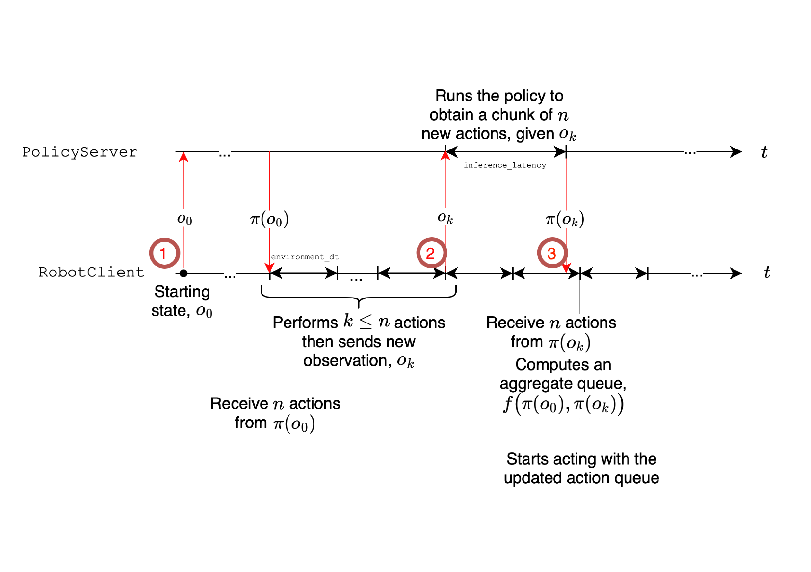

现代视觉运动策略输出 action chunk——一次预测多步动作。标准的同步（sync）推理模式下，机器人执行完整个 chunk 后才采集新观测并预测下一个 chunk。这导致两个问题：

1. **执行空窗期**：chunk 执行完毕后，机器人在等待下一次推理时处于空闲状态，无法对环境变化做出反应
2. **响应延迟**：推理计算时间直接转化为机器人的反应延迟

### 7.4.2 异步推理方案

SmolVLA 提出的异步（async）推理将动作执行与 chunk 预测解耦：

1. **提前触发**：当动作队列剩余比例低于阈值 $g$（如 70%）时，立即采集新观测并发送给 PolicyServer
2. **解耦线程**：控制循环持续执行动作，推理在后台并行进行（非阻塞）
3. **Chunk 融合**：新旧 chunk 在重叠部分通过简单合并规则拼接，避免抖动

#### （1）关键参数：队列阈值 $g$

$g$ 控制了响应性与计算成本之间的权衡：

| $g$ 值 | 行为 | 特点 |
|---|---|---|
| $g = 0$ | 执行完整个 chunk 才触发推理（同步极限） | 推理期间机器人空闲，无法响应 |
| $g = 0.7$ | 消耗约 30% 的 chunk 后触发推理 | 平衡响应性和计算成本 |
| $g = 1$ | 每个时间步都触发推理（计算密集极限） | 最大响应性，但计算成本最高 |

#### （2）观测相似性过滤

为避免冗余的推理请求，异步推理还引入了关节空间相似性过滤：如果新观测与上一次发送的观测在关节空间中的距离低于阈值 $\epsilon$，则跳过该观测。只有当动作队列完全耗尽时，才强制处理最新观测（无论相似性如何）。

#### （3）无空窗期的条件

设 $\mathbb{E}[\ell_S]$ 为 PolicyServer 的推理延迟，$\Delta t$ 为控制周期（30 FPS 下 $\Delta t = 33\text{ms}$），$n$ 为 chunk 大小。要避免运行时出现空队列（即机器人空闲），需要：

$$
g \geq \frac{\mathbb{E}[\ell_S] / \Delta t}{n}
$$

### 7.4.3 异步推理的实验效果

| 推理模式 | 平均成功率 | 平均完成时间 | 固定时间内完成数 |
|---|---|---|---|
| 同步 | 78.3% | 13.75s | 9 个 |
| 异步 | 73.3% | 9.70s（快 ~30%） | 19 个（2$\times$） |

两种模式的成功率相当（~78% vs ~73%），但异步推理完成任务快约 30%，在固定时间窗口内完成的任务数是同步的 2 倍。异步推理使机器人对物体位置变化和外部干扰表现出更强的鲁棒性。

异步推理是模型无关的——它可以与任何输出 action chunk 的策略集成，不需要修改模型本身。

## 7.5 上手：跑一次 SmolVLA 推理

配套代码仓的 `code/vla/4_vla_inference/4_4_smolvla_infer/` 加载 SmolVLA 的 LIBERO
微调 checkpoint 闭环一次：

```bash
cd code
uv run python vla/4_vla_inference/4_4_smolvla_infer/smolvla_demo.py
```

代码依旧与 $\pi_0$ 的 demo 逐行同构——这已经是本讲第 4 个共用同一段闭环模板的模型。
体感上的差别在于**规模**：0.45B 的 SmolVLA 加载和每步推理都比 2.6 节那个 7B 的 OpenVLA
快一个数量级，这就是 7.1 节"可及性"设计目标最直接的兑现。同一个任务
「push the plate to the front of the stove」126 步完成：

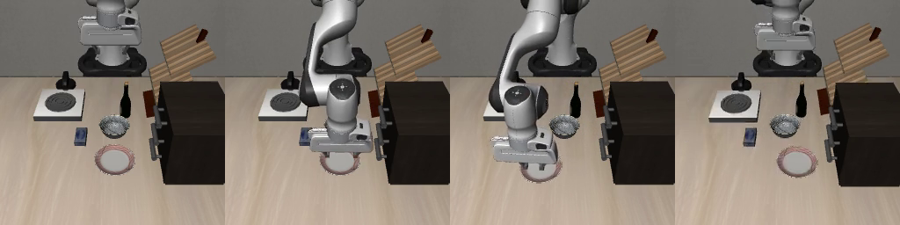{width=98%}

标准评测入口 `code/vla/4_vla_inference/4_4_smolvla_infer/smolvla_eval.sh` 里有个细节值得一提：这个 checkpoint 训练时相机
名叫 `camera1/2/3`，而 LIBERO 环境给出的两路观测叫 `image/image2`，评测命令用
`--rename_map` 把观测键改名对齐——特征名对齐是部署 VLA 时最常见的一类"接线"工作
（第8讲 3.5 节那张出发前检查单里的口径问题，在这里又出现了一次）。

刚讲完的异步推理没有出现在这段代码里：demo 是同步闭环，异步化是把同一个
`select_action` 搬进 PolicyServer、与机器人端解耦的部署层改造，模型与本 demo 的
调用逻辑都不用改。

## 7.6 本节小结

**核心创新**

| 贡献 | 内容 |
|---|---|
| 极致轻量化架构 | 450M 参数，通过层跳过、视觉 token 压缩、缩小 Action Expert 等手段实现消费级硬件可用 |
| 交替 CA/SA 注意力 | Action Expert 中交替使用 cross-attention 和因果 self-attention，兼顾感知对齐和时序平滑 |
| 社区数据预训练 | 论文表明仅用 ~23K 条公开社区数据预训练也能显著提升 VLA 性能（+26.6 个百分点） |
| 异步推理 | 模型无关的推理优化，解耦动作执行与观测处理，速度提升 ~30%，吞吐量翻倍 |
| 完全开源 | 模型权重、训练代码、数据集、硬件设计全部公开，降低社区参与门槛 |

**局限性**

- **数据集多样性不足**：预训练数据主要来自 SO-100 单一构型，跨构型泛化能力有限
- **数据规模小**：~23K 条轨迹远小于 OpenVLA 的 ~1M 条，扩大数据规模可能带来显著提升
- **VLM 骨干非最优**：SmolVLM-2 主要针对文档阅读和 OCR 预训练，未必是机器人交互场景的最优选择
- **任务复杂度有限**：目前主要评估短时简单任务，缺乏长时间多阶段任务的能力
- **缺乏多模态联合训练**：未像 $\pi_{0.5}$ 那样利用网络多模态数据增强语义理解
- **仅使用模仿学习**：未探索强化学习等可能带来更灵活策略适应的学习范式

这六条几乎条条指向同一个根源——数据只有 23K 条、且几乎全来自 SO-100 一种构型。
把社区数据的规模和构型铺开，是这条路线最直接的下一步。

# 8 本讲小结

## 8.1 两条主线回顾

本讲的六个模型，可以收进一张"动作头怎么生成动作"的地图：

- **离散自回归一路**：把动作切成整数、当 token 逐个解码。OpenVLA 用双视觉编码器 + Llama 2 7B 把动作离散成 bin；$\pi_0$-FAST 用 DCT + BPE 把动作压成信息量更高的 token，治好高频下逐维分 bin 的退化；VLA-0 走到极简的尽头——连词表都不改，直接让 VLM 把动作"打印"成数字串。
- **连续动作头一路**：VLM 出条件，外挂一个生成式动作专家用 flow matching 把噪声"流"成连续动作。$\pi_0$ 用 PaliGemma 骨干 + Action Expert 一次生成动作块；$\pi_{0.5}$ 把离散 FAST 与连续 flow 拼成两阶段，换来开放世界泛化；SmolVLA 把这套压到 450M，再用异步推理把延迟藏起来。

{width=100%}

图上有两件事是上面两段文字给不了的。一是**演进方向**：两条链的箭头都朝着参数量更小的方向走，离散一路从 OpenVLA 的 7B 一路降到 VLA-0，连续一路从 $\pi_0$ 的 3.3B 降到 SmolVLA 的 0.45B——三年里这个领域真正的共同趋势不是"更大"，而是"在更小的模型上把动作做对"。二是 $\pi_{0.5}$ 那个横条：它是全图唯一不能用一个点表示的模型，因为它的动作表示在训练的两个阶段里是不同的。凡是想问"$\pi_{0.5}$ 到底算离散还是连续"的，答案就是这个横条的形状——两边都算。

## 8.2 一条演进脉络

上面那张地图是静态的分类。把时间轴加回去看，每一步的动因其实都很具体：OpenVLA 同时暴露出精度和速度两个瓶颈，$\pi_0$ 用连续动作头解决精度、用 KV 缓存解决速度；$\pi_0$-FAST 反过来证明了瓶颈不在"离散"本身，而在"逐维逐步分 bin"这种笨拙的离散方式；$\pi_{0.5}$ 索性承认两种表示各有各的好处，分两个阶段各用各的；到了 VLA-0 与 SmolVLA，问题已经从"怎么更强"换成了"怎么让人跑得起来"。

所以离散与连续这场路线之争，到今天也没有分出胜负——它会一直贯穿后面的内容。

> 一句话总结：VLA 在 VLM 之上接入机器人状态、把输出换成可执行动作，而各家模型的根本分野，就在于动作头是"离散 token 自回归"还是"连续流匹配"。

## 8.3 通向下一讲：把 VLA 微调到自己的机器人

本讲见到的模型都是别人预训练好的通用策略。下一讲就来看怎么把它们微调到自己的机器人上——从全量 SFT 到 LoRA，把一个通用 VLA 真正用起来。

# 参考文献

[1] 李昊然, 陈宇辉, 崔文博, 等. 面向具身操作的视觉-语言-动作模型综述[J]. 自动化学报, 2026, 52(1): 18-51.

[2] KIM M J, PERTSCH K, KARAMCHETI S, et al. OpenVLA: an open-source vision-language-action model[EB/OL]. (2024-06-13)[2026-06-26]. https://arxiv.org/abs/2406.09246.

[3] O'NEILL A, REHMAN A, et al. Open X-Embodiment: robotic learning datasets and RT-X models[EB/OL]. (2023-10-13)[2026-06-26]. https://arxiv.org/abs/2310.08864.

[4] BROHAN A, BROWN N, CARBAJAL J, et al. RT-2: vision-language-action models transfer web knowledge to robotic control[EB/OL]. (2023-07-28)[2026-06-26]. https://arxiv.org/abs/2307.15818.

[5] Octo Model Team, GHOSH D, WALKE H, et al. Octo: an open-source generalist robot policy[EB/OL]. (2024-05-20)[2026-06-26]. https://arxiv.org/abs/2405.12213.

[6] KARAMCHETI S, NAIR S, BALAKRISHNA A, et al. Prismatic VLMs: investigating the design space of visually-conditioned language models[EB/OL]. (2024-02-12)[2026-06-26]. https://arxiv.org/abs/2402.07865.

[7] KIM M J, FINN C, LIANG P. Fine-tuning vision-language-action models: optimizing speed and success[EB/OL]. (2025-02-27)[2026-06-26]. https://arxiv.org/abs/2502.19645.

[8] BLACK K, BROWN N, DRIESS D, et al. $\pi_0$: a vision-language-action flow model for general robot control[EB/OL]. (2024-10-31)[2026-06-26]. https://arxiv.org/abs/2410.24164.

[9] BEYER L, STEINER A, SUSANO PINTO A, et al. PaliGemma: a versatile 3B VLM for transfer[EB/OL]. (2024-07-10)[2026-06-26]. https://arxiv.org/abs/2407.07726.

[10] PERTSCH K, STACHOWICZ K, ICHTER B, et al. FAST: efficient action tokenization for vision-language-action models[EB/OL]. (2025-01-16)[2026-06-26]. https://arxiv.org/abs/2501.09747.

[11] Physical Intelligence, BLACK K, BROWN N, et al. $\pi_{0.5}$: a vision-language-action model with open-world generalization[EB/OL]. (2025-04-22)[2026-06-26]. https://arxiv.org/abs/2504.16054.

[12] GOYAL A, HADFIELD H, YANG X, et al. VLA-0: building state-of-the-art VLAs with zero modification[EB/OL]. (2025-10-15)[2026-06-26]. https://arxiv.org/abs/2510.13054.

[13] SHUKOR M, AUBAKIROVA D, CAPUANO F, et al. SmolVLA: a vision-language-action model for affordable and efficient robotics[EB/OL]. (2025-06-02)[2026-06-26]. https://arxiv.org/abs/2506.01844.

[14] NVIDIA, BJORCK J, CASTAÑEDA F, et al. GR00T N1: an open foundation model for generalist humanoid robots[EB/OL]. (2025-03-18)[2026-06-26]. https://arxiv.org/abs/2503.14734.
