第11讲走读了从 OpenVLA 到 $\pi_0$ 家族的各类 VLA 模型，看清了一个 VLA 长什么样、动作是怎么被生成出来的。但那时加载的都是别人训练好的权重，跑的是通用能力。真正要把一个 VLA 用到你自己的机器人、你自己的任务上，还差关键一步：微调。

这一讲就把微调讲透：先建立“动多少参数 × 用什么信号”两个分类维度的全景图，再沿监督微调这条主线，从全量 SFT 一路讲到 LoRA、讲到怎么落在 $\pi_0$ 上；然后把大模型微调绕不开的多卡训练从显存账本一路讲到双卡实战；最后把策略迁回真实世界要面对的 Sim2Real 与 Real2Sim 讲清楚。

# 1 微调概述：两个分类维度

## 1.1 为什么需要微调？

### 1.1.1 大模型的生命周期

一个大模型从诞生到上线，要走完四步：先在海量无标注语料上**预训练**，拿到一个只会续写文字的基座；再用任务数据**微调**；然后**对齐**到人类偏好；最后**部署**上线。微调卡在这条链的中段：预训练给的是“通识教育”，微调给的是“专业培训”。

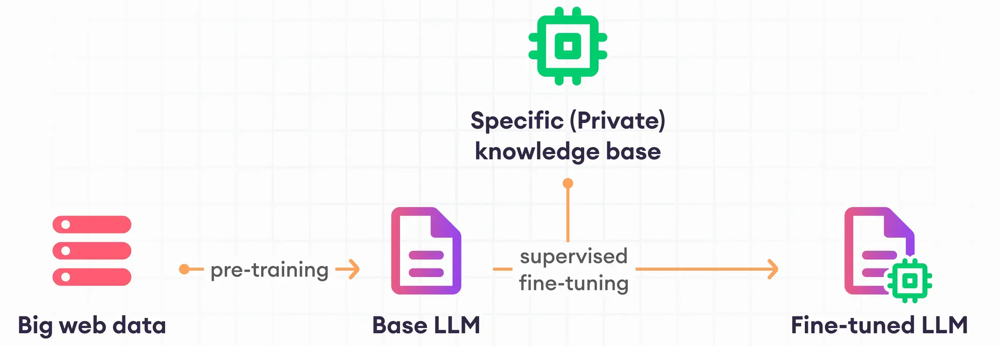{width=75%}

两条数据流的体量差得很远：左边那条是整个互联网量级的语料，右边那条常常只有几万条。规模差着好几个数量级，可决定模型在**你的**任务上好不好用的，是小的那条。

### 1.1.2 预训练模型的根本问题

预训练模型在海量数据上学到了通用知识，但它本质上只学会了一件事：**给定前面的文字，预测下一个词**。

于是它给出的回答可能语法通顺，却不是任务想要的东西。下面这组医学问答的对照就是一个例子。

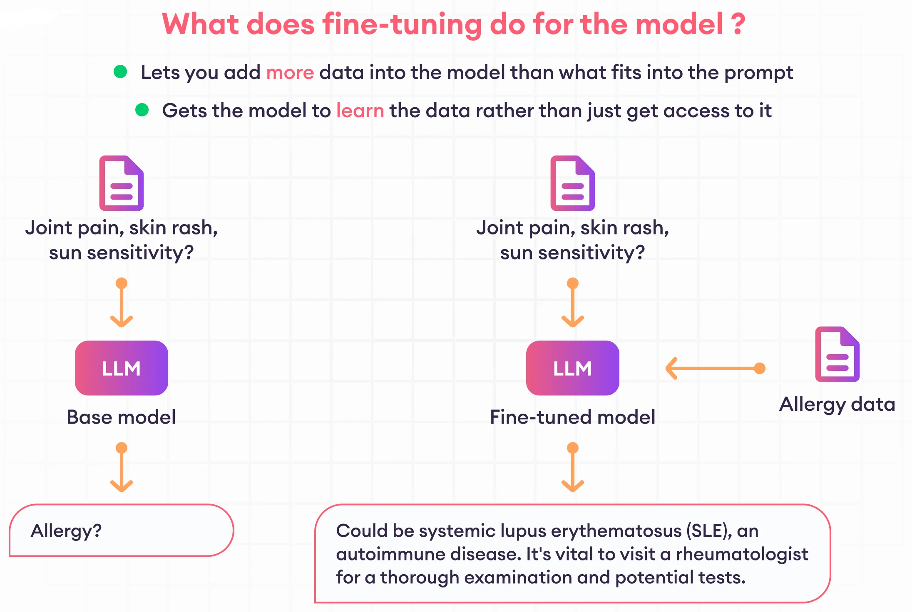{width=75%}

左边把三个症状当成互不相干的线索，只敢回一个最泛的猜测；右边把它们当成一组**同时出现**的证据，于是收敛到一个具体的诊断，还知道接下来该查什么。差别不在于右边“看过更多资料”——把同一份资料塞进 prompt 也做不到这一步；差别在于参数本身吸收了这类数据的分布，遇到同类输入时它默认就往那个语境上靠。

### 1.1.3 微调前先想想：能不能不微调？

在决定微调之前，有一个更轻量的方案值得考虑：**In-Context Learning（上下文学习）**。

做法很简单：在 prompt 里塞几个示例，模型就能“临时”学会新任务。一个德译英的 prompt 长这样：

```text
Translate the following German sentences into English:

Example 1:
German: "Ich liebe Eis."
English: "I love ice cream."

Example 2:
German: "Draußen ist es stürmisch und regnerisch."
English: "It's stormy and rainy outside."

Translate this sentence:
German: "Wo ist der nächste Supermarkt?"
```

注意“临时”二字：这两个示例只活在这一次对话里，模型权重一个字节都没变，下一次提问还得把它们重新贴一遍。

硬伤也就在这里：示例要占上下文窗口、对小模型效果差、知识不进权重所以无法持久化。这三条一旦顶到，就该微调上场了。差别有多大？同样问“为什么天空是蓝色的”，基座模型常常一句话打发，微调过的模型会顺着瑞利散射把道理讲下来。它本来就带着这套语境，不必靠临时提示。


## 1.2 微调的两大分类维度

微调方法五花八门，但只要问两个问题，任何一种都能被摆到确定的位置上：

**维度一：你动了多少参数？**（参数更新范围）

这决定了你需要多少算力、多少显存，以及对模型原有能力的影响有多大。

**维度二：你用什么信号来训练？**（训练信号类型）

这决定了模型学到的是“怎么做任务”还是“什么样的回答更好”。

这两个维度是**正交关系**：前者描述“更新哪些参数”，后者描述“用什么数据和 loss 更新”。例如，SFT 可以用全量微调做，也可以用 LoRA 做；DPO 可以全量训练，也可以只训练 LoRA 适配器。它们是可以组合的两个坐标轴。记住这一点，后面遇到“LoRA DPO”这类看起来像新方法的名字，就能一眼拆成两个已知的坐标。

{width=100%}

这张图要兑现的就是上面那句“正交、可组合”。看**列**：最右一列从下往上是 LoRA SFT → LoRA DPO → LoRA GRPO：参数更新范围一个字没变，变的只是训练信号。看**行**：最下面一行从左往右是全量 SFT → 冻视觉编码器的模块级训练 → LoRA/QLoRA SFT：训练信号一个字没变，变的只是动多少参数。所以“LoRA DPO”从来不是一个新方法，它就是这张图上的一个格子；同理，任何一个你没见过的组合词，先在这两条轴上各定一个坐标，基本就拆明白了。


## 1.3 维度一：你动了多少参数？

这是最直观的分类方式。想象一下，你有一个 7B 参数的大模型，微调的时候你可以选择：动所有参数、动一部分参数、或者几乎不动原来的参数而是加一点新的。

### 1.3.1 全量微调（Full Fine-Tuning）：更新所有参数

**解决什么问题？** 当任务和预训练分布差异很大，或者需要充分改变模型能力时，全量微调提供了最高的参数更新自由度。

**怎么做的？** 解冻模型的所有参数，在你的任务数据上继续训练。本质上和预训练的过程一样，只是数据换成了你的任务数据，学习率调小一些。

**适用语境：** 计算资源充足（多张 A100/H100）、高质量数据较多（几万条以上）、任务差异较大或需要显著改变模型行为，比如让一个通用模型变成专业医疗问答模型，或者训练一个新的机器人操作策略。

**代价是什么？** 以 7B 模型为例，如果用 fp16（半精度，每个数 2 字节）训练，仅模型权重就约 14 GB；再加上梯度、优化器状态、激活值、缓存和显存碎片，实际显存常常是数十 GB 到 100 GB 级别，需要梯度检查点（4.3 节展开）、ZeRO / FSDP（4.4 节展开）等技术，通常也需要多张高端 GPU 才较容易稳定训练。而且每个任务都要存一份完整的模型权重，存储成本也很高。另一个风险是**灾难性遗忘**：模型在学新任务的时候，可能把原来会的东西忘掉。比如微调它做翻译后，它在摘要任务上的能力可能下降。

### 1.3.2 部分微调（Partial Fine-Tuning）：冻住大部分，只动关键层

**解决什么问题？** 全量微调成本高，但只用 In-Context Learning 又不足以稳定完成任务。

**怎么做的？** 冻结模型的大部分层（通常是靠近输入的底层），只训练最后几层或者输出头。底层学到的是通用的语言特征（语法、词义），越往上越任务相关，所以只动上面几层往往就够了。

**适用语境：** 新任务和预训练任务比较相似。比如模型已经会英文问答了，你想让它在医疗领域问答上更好一点。这时候底层的语言理解能力是通用的，只需要调整上层的任务特定表示。

“只动上面几层”到底该动几层，得靠实验定。

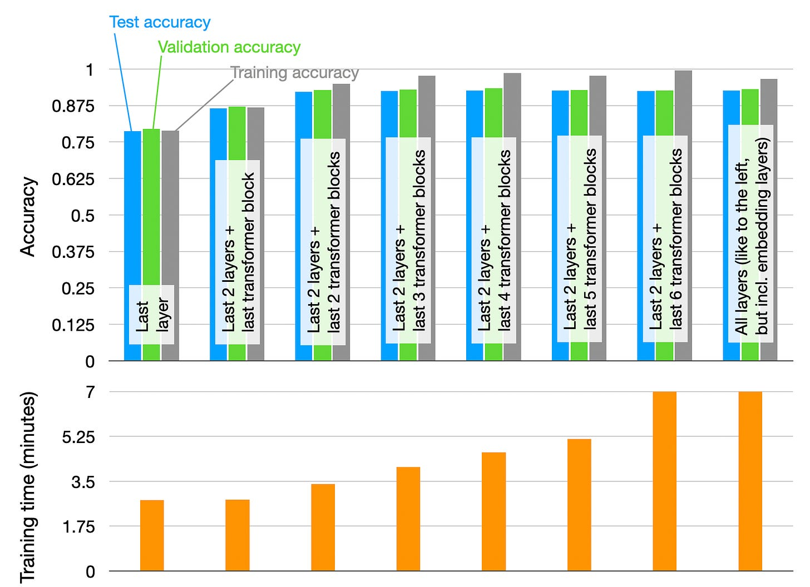{width=80%}

两半张图的趋势形状完全不同：准确率解冻到某一档之后就基本走平，训练时间却一路往上抬。部分微调要找的，就是这两条线**拉开最大**的那一档。再往右加层，买到的准确率越来越少、付出的时间越来越多。

把视野再放宽一格，从“完全不动预训练模型”到“全量更新”，是一条连续的成本-性能带：

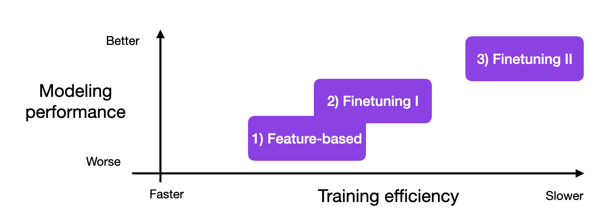{width=60%}

图上三档正好对应这条带的三个位置。**Feature-based** 冻结整个预训练 Transformer，只取它的输出 embedding 训一个分类器；**Finetuning I** 仍冻结 Transformer，但训练顶部一到多个任务层；**Finetuning II** 连 Transformer 一起更新，也就是全量微调。越往右效果通常越好，代价是越慢越贵。这条带上没有免费的位置，只有适合你手头资源的位置。

### 1.3.3 参数高效微调（PEFT）：不动原来的，加一点新的

PEFT 是 **Parameter-Efficient Fine-Tuning** 的缩写，中文常译作“参数高效微调”。它是一大类方法的总称，涵盖多种具体算法：目标是在尽量少更新参数的情况下，让大模型适配新任务。

**解决什么问题？** PEFT 主要面向三个工程问题：显存和算力受限、希望降低灾难性遗忘风险、需要让同一个基座模型适配多个任务。

**核心思想：** 冻结原始模型的所有权重，只训练少量新增的参数。这些新增参数可能是插入的小模块、拼接的向量、或者旁路矩阵。

所以，Adapter Tuning、LoRA、QLoRA、Prefix Tuning、Prompt Tuning 等都可以看作 PEFT 家族里的不同成员。它们的共同点是“少动参数”，区别在于新增参数放在哪里、怎么参与模型计算。

PEFT 的工程收益主要体现在三方面：

1. **省显存**：只需要存储新增参数的梯度和优化器状态，原始模型权重冻结不动
2. **降低遗忘风险**：原始权重不被覆盖，适配器卸载后可以恢复到基座模型行为
3. **易部署**：同一个基座模型搭配不同的轻量适配器，就能服务不同任务，不用存 N 份完整模型

这些成员按“新增参数放在哪里”可以摆成三堆：

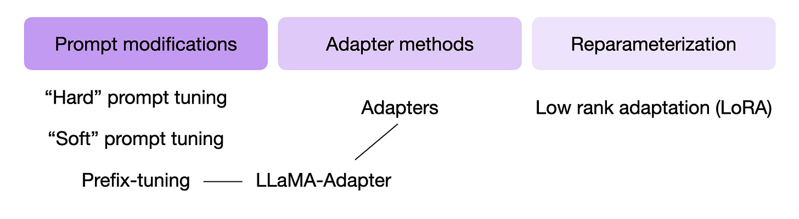{width=80%}

三堆分别对应“新参数进输入端”“新参数进层内”“不插新模块、改写权重更新量的表示形式”。要留神的是**第一堆里混着一个不属于 PEFT 的成员**：

- **提示类（Prompt modifications）**：都是从输入端下手让模型适配任务，但要分清哪一类真的在训练参数。**硬提示（hard prompt）** 是人工写的离散文本提示，**没有任何可训练参数**，严格说属于提示工程，不是 PEFT；**软提示（soft prompt）与 Prefix Tuning** 学的是连续向量提示，有可训练参数，属于参数高效适配。
- **适配器类（Adapter methods）**：在 Transformer 内部插入小模块，冻结原始模型，只训练这些适配器。图上那条把 Prefix-tuning 连到 LLaMA-Adapter 的线说明分栏不是硬边界：同一个方法可以同时带着两栏的性质。
- **重参数化类（Reparameterization）**：不直接训练完整的权重变化量，而是用一个更小的参数化形式来表示它。LoRA 用低秩矩阵近似 $\Delta W$，走的就是这条路。

下面先讲 LoRA / QLoRA，再回看更早的 Adapter 和软提示方法。

#### （1）LoRA（Low-Rank Adaptation）：低秩适配方法

**解决什么问题？** LoRA[1] 要在尽量保留效果的前提下，把可训练参数量降低到原始模型的很小一部分，常见配置只有 0.1%~1% 量级。

**核心直觉：** 许多微调任务的有效更新量 $\Delta W$ 可以被一个**较低秩的矩阵很好地近似**。虽然 $\Delta W$ 本身是个巨大的矩阵，但真正起作用的方向不多，于是可以用两个小得多的矩阵相乘（$\Delta W = BA$）来参数化它。这是一个有效的建模假设，也有经验证据支持（3.2 节会讲“内在维度”这条线），但它不是对所有任务、所有层、任意 rank 都成立的事实。

打个比方：原始权重矩阵 $W$ 是一本百科全书，微调的变化量 $\Delta W$ 就像是一张勘误表。LoRA 的做法是，不直接写这张勘误表（太大了），而是用两个小表格相乘来生成它。结构长什么样、$A$ 和 $B$ 各在哪一步起作用，3.3.1 节会配图逐条走一遍。

**适用语境：** LoRA 常被用作 PEFT 的对照基线。相对全量微调，它通常能用低得多的显存接近全量微调效果，但具体差距取决于任务、数据质量和 LoRA rank。

**推理部署特性：** LoRA 的旁路矩阵在推理时可以合并回原始权重，减少额外前向分支带来的开销。而且不同任务的 LoRA 权重可以热切换：同一个基座模型，加载不同的 LoRA 适配器，就得到不同任务的适配版本。

#### （2）QLoRA（Quantized LoRA）：显存友好的微调方案

**解决什么问题？** LoRA 减少了可训练参数，但基座模型本身仍要占显存。对于 33B、65B、70B 这种大模型，光是加载模型权重就要几十 GB 甚至上百 GB 显存。QLoRA[2] 进一步压缩基座模型，让大模型微调的硬件门槛明显下降。

**怎么做的？** QLoRA 是“量化基座模型 + LoRA 训练”的组合：把冻结的基座模型用 4-bit 精度加载，计算时再反量化到较高精度，LoRA 适配器仍以较高精度训练。所以它是把 LoRA 挂在一个被量化加载的大模型上，和 LoRA 是叠加关系。

**适用语境：** QLoRA 常见于显存主要受限于模型加载、但仍希望微调较大模型的场景。它的代价是量化和反量化会引入额外计算开销，不同实现、硬件和 batch 设置下差异会变化。这里先把它看作 LoRA 的显存优化版本，第 3 节讲 LoRA / QLoRA 时再展开。

#### （3）Adapter Tuning：PEFT 的先驱

**解决什么问题？** 这是最早的 PEFT 方法之一[3]（2019 年），证明了“不动原始权重也能达到接近全量微调的效果”这个思路是可行的。

**怎么做的？** 在 Transformer 的每一层之间插入一个小型的瓶颈网络（先降维再升维）。训练时只训练这些 Adapter 模块，原始模型完全冻结。

![左侧是一个 Transformer 层，两个 Adapter 分别插在多头注意力之后和前馈层之后，各自紧接一个 Layer Norm；右侧把其中一个 Adapter 放大：输入先经前馈下投影压到很窄的中间层（图上只画了两个圆点），过非线性，再经前馈上投影回到原宽度，并有一条跳连从入口直接加到出口。（图取自参考文献 [3]）](../../assets/figures/lecture12/adapter_arxiv-1902.00751.png){width=60%}

关键在那个残差连接：Adapter 初始化时输出接近零，加回主干等于什么都没改，所以插进去的一瞬间模型行为和原来一样。这和后面 LoRA 把 $B$ 初始化为零是同一个思路，都是让训练从预训练状态起步而不是从一次随机扰动起步。中间那个瓶颈维度就是它的容量旋钮，越窄参数越少、表达力越弱。

**适用语境：** 现在用得比 LoRA 少了，但在多任务场景下仍有优势：每个任务一套 Adapter，切换任务就是切换 Adapter。原始论文[3]报告，在它测的那批 NLP 任务上，仅训练 3.6% 的参数就能接近全量微调性能。

#### （4）Prefix Tuning / Prompt Tuning：用“软提示”来微调

**解决什么问题？** 连模型结构都不想改，只想在输入前面加一些可学习的向量来引导模型行为。

**怎么做的？** Prefix Tuning 在每一层的注意力计算前拼接一组可学习的连续向量（“软提示”）。Prompt Tuning 更简单，只在输入层加。这些向量是模型自己学出来的“暗号”，人类读不出内容。

**适用语境：** 常见于极轻量适配，或者训练框架允许学习软提示但不方便改动主体模型权重的场景。在很多现代 LLM 场景里，它们的效果和稳定性通常不如 LoRA，所以现在用得相对少。

### 1.3.4 参数更新方式的权衡

按手头的条件对号入座，大致是下面这张表。

| 条件 | 常见方法 | 说明 |
|----------|----------|------|
| 计算和数据都充足 | 全量微调 | 更新自由度最高，但显存、训练和存储成本也最高 |
| 需要降低可训练参数量 | LoRA | 只训练低秩旁路矩阵，常用于 LLM / VLA 适配 |
| 显存主要卡在加载大模型 | QLoRA | 在 LoRA 基础上量化加载基座模型 |
| 数据很少（几百条） | LoRA / QLoRA | 可训练参数少、容量受限，通常能降低过拟合风险，但不是免疫（见下方备注） |
| 需要一个模型服务多个任务 | LoRA / Adapter | 同一基座模型加载不同适配器 |

> 备注：**LoRA 不是正则器**。可训练参数少确实降低了容量和显存，通常也降低过拟合风险，但在小数据、rank 设得过高、epoch 跑太多或数据分布过窄时，LoRA 一样会过拟合。所以验证集、早停、数据增强、以及 rank / epoch 的选择该做还得做。QLoRA 的核心收益是**把基座模型装进显存**，它不提供额外的正则效果。

这些方法也可以混合使用。为了避免混淆，本讲统一用下面四个名字（配置表里也会逐模块标出 trainable / frozen）：

| 名称 | 含义 |
|---|---|
| 全模型全参数微调 | 目标模型的**所有**参数都可训练 |
| 模块级全参数微调 | 只解冻部分模块（如冻结视觉编码器、全参训练语言骨干与动作头），被解冻模块内是全参数训练 |
| PEFT | 冻结原权重，只训练新增的少量参数（LoRA / 适配器 / 软提示等） |
| 混合策略 | 上面几种按模块组合，例如冻结视觉编码器 + 语言骨干加 LoRA + 动作头全参训练 |

注意后文说“全量微调”时，**指的是第一行的全模型全参数微调**；只要有模块被冻结，就该叫模块级全参数微调或混合策略。这个区分在复现实验时很重要，混着说会导致别人训出完全不同的东西。


## 1.4 维度二：你用什么信号来训练？

参数更新范围决定了“更新哪里”，训练信号决定了“根据什么目标更新”。这个维度可以分成三类：监督信号、偏好信号、奖励信号。它们经常按阶段串联使用，但并不总是严格的线性流程。

### 1.4.1 监督微调（SFT）：教模型“怎么做任务”

**解决什么问题？** 预训练模型只会续写文本，SFT 教它遵循指令、完成任务。

**怎么做的？** 准备一批（指令，回答）对，让模型看着指令学习生成对应的回答。
本质上就是监督学习：给正确答案，让模型去拟合。

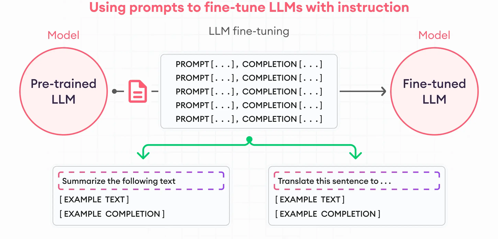{width=75%}

**举个例子：** 你想让模型学会做摘要，就准备一批数据，
每条都是“请总结以下文章：[文章内容]”配上一个高质量的摘要。
模型看了几千条这样的数据后，就学会了“看到'请总结'就输出摘要”这个模式。
图下面那两行 summarization、translation 容易看岔：它们只是同一种数据格式下的两类任务示例，**不是两个新的微调阶段**。

训练过程和预训练类似：前向传播算 loss，反向传播更新权重，多轮迭代直到收敛。
区别在于数据是标注好的（指令，回答）对，而不是无标注的文本。

**SFT 的几种常见组织方式：**

下面这些是从不同角度描述 SFT 数据，可以叠加。例如，一个医疗助手数据集可以同时是“指令微调”、“领域适配”和“多任务微调”。

**指令微调（Instruction Tuning）：** 最常见的 SFT 形式。
用各种各样的指令-回答对来训练，让模型学会遵循指令。
InstructGPT[4] 一类对话模型的后训练流程中，第一步通常就是指令微调。数据格式通常是：

```json
{
  "instruction": "把下面的句子翻译成英文",
  "input": "今天天气真好",
  "output": "The weather is really nice today."
}
```

**领域适配（Domain Adaptation）：** 用特定领域的数据让模型更熟悉该领域。
这里要分清两种做法：如果数据是大量无标注领域文本，通常叫领域继续预训练；
如果数据是领域内的指令-回答对，才属于 SFT。
比如用医疗问答数据微调出医疗助手，用法律咨询数据微调出法律顾问。

**多任务微调（Multi-task Fine-Tuning）：** 同时在多个任务的数据上训练，让模型同时擅长摘要、翻译、分类等多种任务。它有助于缓解单任务微调带来的能力偏移，但也可能出现任务之间相互干扰的问题，因此需要关注任务配比和数据质量。

**SFT 的局限在哪？** SFT 能教模型“做什么”，但很难教“什么更好”。比如，对于同一个问题，可能有多个语法正确但质量不同的回答，而 SFT 没法告诉模型哪个更好。对于“有用性”“安全性”“幽默感”这些抽象品质，更是难以通过标注数据直接传达。

这就引出了下一个阶段。

### 1.4.2 基于人类反馈的强化学习（RLHF）：教模型“什么更好”

**解决什么问题？** SFT 之后的模型能遵循指令了，但回答质量参差不齐，可能说废话、编造事实、甚至输出有害内容。RLHF 用人类的偏好来进一步优化模型，让它的回答更有用、更安全、更符合人类期望。

**这是 ChatGPT 背后的核心技术。** OpenAI 的 InstructGPT 论文[4]详细描述了这个三步流程：

![InstructGPT 的三步流程，图上分三栏。第一栏：从提示集抽一条提示（“Explain the moon landing to a 6 year old”），标注员写出期望回答，用它监督微调出 SFT 模型。第二栏：同一条提示采样出 A–D 四个模型输出，标注员排出 D > C > A = B 的顺序，用这批比较数据训练奖励模型。第三栏：抽一条新提示（“Write a story about frogs”），策略生成输出，奖励模型给出分数 $r_k$，再用 PPO 回过头更新策略。（图取自参考文献 [4]）](../../assets/figures/lecture12/files/httpssubstack-post-media.s3.amazonaws.compublicimages7dfa415c-da9c-4d6f-8de8-ffc9f92272db_1602x952.png){width=85%}

**Step 1：先做 SFT。** 在指令数据上做监督微调，得到一个能遵循指令的基础模型。这是起点。

**Step 2：训练奖励模型（Reward Model）。** 让 SFT 模型对同一个 prompt 生成多个不同的回答，然后请人类标注员来排序：哪个回答更好、哪个更差。用这些排序数据训练一个“奖励模型”，它能自动给任意回答打分。

为什么需要奖励模型？因为人类标注是离线的、昂贵的，不可能实时给每个输出打分。奖励模型就是人类偏好的“代理人”，可以 7×24 小时自动评分。

**Step 3：PPO 强化学习优化。** 用奖励模型作为奖励信号，通过 PPO（Proximal Policy Optimization）算法来优化 SFT 模型。模型生成回答 → 奖励模型打分 → 模型调整策略让高分回答出现得更多。同时用一个“参考模型”（冻结的 SFT 模型）来约束，防止模型为了拿高分而跑偏太远。

**适用语境：** 需要模型输出与人类偏好高度对齐的场景，比如聊天机器人、内容生成、或者面向用户的应用。RLHF 是经过大规模验证的对齐方案之一；实际产品里还会结合 RLAIF、DPO 类方法、安全过滤和人工评估等多种偏好对齐技术。

**RLHF 的痛点：** 虽然效果好，但 RLHF 的工程复杂度很高：

- **训练稳定性要求高**：PPO 算法对超参数非常敏感，配置不当会导致训练退化
- **模型副本多**：概念上会涉及 SFT 模型、奖励模型、正在训练的策略模型、参考模型；实际工程会通过共享权重、offload（卸载，4.3.5 节展开）、缓存等方式降低显存压力
- **奖励黑客（Reward Hacking）**：模型可能学会“骗”奖励模型拿高分，而不是真正变好。比如学会输出冗长但空洞的回答，因为奖励模型误以为长回答 = 好回答
- **奖励模型本身可能有偏差**：如果标注员的偏好不一致，或者标注数据有偏，奖励模型就会学到错误的偏好

这些痛点催生了下一代方法。

### 1.4.3 直接偏好优化（DPO）：不要奖励模型，直接学偏好

**解决什么问题？** RLHF 工程复杂度高。DPO 的目标是：在离线偏好数据场景中，用更简单的监督式目标表达偏好优化。

**核心突破：** DPO 论文[5]指出，在特定偏好建模和 KL 约束假设下，可以把 RLHF 中“奖励建模 + 策略优化”的目标改写成一个简单的偏好分类损失。也就是说，在很多离线偏好数据场景里，你可以跳过显式奖励模型和 PPO，直接用偏好数据来优化语言模型。

**怎么做的？** 准备三元组数据：（prompt，好的回答，差的回答）。训练目标很直觉：让模型在“好的回答”上的生成概率升高，在“差的回答”上的生成概率降低，同时不要偏离参考模型太远。

**适用语境：** DPO 常见于已经有离线偏好数据（同一个 prompt 下的好/差回答对）的场景。它训练更稳定（类似监督学习，不需要调 PPO 的超参数）、计算成本更低（通常只需要策略模型和参考模型）、实现更简单。但如果任务需要在线探索、可验证奖励或长链推理，RL / GRPO / PPO 这类方法仍然有价值。

**DPO vs RLHF 对比：**

| 维度 | RLHF | DPO |
|------|------|-----|
| 是否需要奖励模型 | 需要单独训练 | 不需要 |
| 训练稳定性 | 对 PPO 超参敏感 | 类似监督学习 |
| 计算成本 | 较高，涉及多个模型组件 | 较低，常见实现主要用策略模型和参考模型 |
| 工程复杂度 | 高 | 低 |
| 实际效果 | 成熟，大规模验证 | 依任务和偏好数据质量而定，常作为 RLHF 的简化替代或补充 |

### 1.4.4 偏好优化与在线奖励优化

DPO 打开了“不用显式奖励模型做离线偏好优化”的大门之后，研究者们沿着这个方向继续探索，产生了一系列改进方法。这里要分清两类关系：KTO / ORPO / SimPO / IPO 更接近 DPO 的离线偏好优化家族；GRPO 更接近在线 RL / 奖励优化家族。

**KTO（Kahneman-Tversky Optimization）：** DPO 需要成对的偏好数据（好回答 vs 差回答），
但实际中收集成对数据很麻烦。
KTO 只需要“这个回答好”或“这个回答差”的二元标签就行，数据收集成本大幅降低。
名字来源于行为经济学的前景理论：人对损失比收益更敏感。

**ORPO（Odds Ratio Preference Optimization）：** 它把 SFT 和偏好优化合并到同一个训练目标里，
无需额外参考模型。

**SimPO：** 它进一步简化 DPO，
用序列的平均对数概率来代替参考模型的作用，减少一个模型的显存开销。

**IPO（Identity Preference Optimization）：** 它修正了 DPO 在偏好数据上容易过拟合的问题，
理论上更鲁棒。

**GRPO（Group Relative Policy Optimization）：**
它让模型对同一个 prompt 生成一组回答，用组内相对分数来估计优势（advantage），
从而省掉 PPO 里常见的价值网络（value / critic）。
注意：GRPO 省掉的主要是价值网络，不是所有奖励信号；
奖励仍然可以来自规则、验证器或奖励模型。

### 1.4.5 训练信号的演进脉络

把这些方法串起来看，有一条清晰的演进线：

| 阶段 | 方法 | 训练信号 | 解决的问题 |
|---|---|---|---|
| 第一阶段 | SFT | 标注的（指令，回答）对 | 让模型遵循指令。 |
| 第二阶段 | RLHF | 人类偏好排序 + 奖励模型 + PPO | 让回答更符合人类偏好。 |
| 第三阶段 | DPO | 偏好对数据，无需奖励模型 | 简化 RLHF，降低工程复杂度。 |
| 第四阶段 | KTO / ORPO / SimPO | 更简化的离线偏好信号 | 降低偏好数据和模型副本门槛。 |
| 第五阶段 | GRPO 等 RL 方法 | 规则、验证器或奖励模型给出的在线奖励 | 在可验证任务或推理任务中做策略优化。 |

这些方法的关系可以这样理解：SFT 使用标准答案；DPO / KTO / ORPO / SimPO 使用离线偏好数据；PPO / GRPO 使用在线生成结果上的奖励信号。它们都可以和“全量 / 部分 / PEFT”这些参数更新方式组合。


## 1.5 把两个维度组合起来：完整的微调流程

前面我们分别讲了“动多少参数”和“用什么信号训练”，实际工程中这两个维度是组合使用的。对 LLM 来说，一个常见的后训练流程是：

| 阶段 | 做什么 | 用什么方法 | 参数更新方式 |
|------|--------|-----------|-------------|
| 阶段 1 | 监督微调（SFT） | 指令-回答对 | 全量 / LoRA / QLoRA |
| 阶段 2 | 偏好对齐 | RLHF / DPO / ORPO | 全量 / LoRA / QLoRA |
| 阶段 3 | 评估与迭代 | 根据评估结果调优 | 调数据 + 调超参 |

表里“用什么方法”和“参数更新方式”这两列可以自由配对：“用 LoRA 做 SFT”“用 LoRA 做 DPO”这类说法，“用 LoRA”那半交代的是只训练 LoRA 适配器，“做 SFT / 做 DPO”那半交代的是训练目标取监督学习还是偏好优化。

但 VLA 的流程要单独看。VLA 微调的核心通常落在“让策略在新机器人、新场景或新任务上更会动作”这一侧：

| 阶段 | 做什么 | 常见训练信号 | 关注点 |
|---|---|---|---|
| 阶段 1 | 轨迹适配 | 图像观测 + 语言指令 + 动作轨迹 | 动作表示、机器人本体、相机视角。 |
| 阶段 2 | 策略训练 / 微调 | 行为克隆、动作 token 预测、连续动作回归、扩散或 flow matching（流匹配）损失 | 成功率、稳定性、控制频率。 |
| 阶段 3 | 推演评估与迭代 | 仿真或真实机器人执行结果 | 失败案例、数据补采、超参和冻结策略。 |

微调是一个循环迭代的过程：微调 → 评估 → 发现问题 → 调整数据或超参 → 再微调。每一轮迭代都在逼近你想要的效果。


## 1.6 VLA 微调的特殊考量

前面讲的都是通用的 LLM 微调方法。VLA（Vision-Language-Action）模型的微调有一些独特之处，因为它不只是处理文本，还要处理图像和机器人动作。

### 1.6.1 多模态的挑战

VLA 模型的输入通常是图像观测 + 语言指令，输出是机器人动作序列。微调的时候，你需要决定每个模块怎么处理：

- **视觉编码器**：常见做法是冻结或用很小学习率更新，尤其是在数据少的时候。这样能减少过拟合，也避免破坏已有视觉表征。
- **语言模型 / 多模态骨干**：常用 LoRA、部分微调或全量微调。选哪种取决于数据量、显存和任务差异。
- **动作表示 / 动作头**：这是 VLA 与普通 VLM 最大的区别。有些模型把动作离散化成 token 来预测，有些模型使用连续动作头、扩散模型或 flow matching（流匹配，把一段噪声沿着学出来的“流”连续变形成动作，第11讲第 3 节讲过）模块。不同机器人本体、动作维度和控制频率不同，这部分往往最需要适配。

### 1.6.2 典型 VLA 微调策略

不同的 VLA 模型采用了不同的动作表示和适配策略，不能简单地用“视觉编码器 / 语言骨干 / 动作头”三列一刀切：

| 模型 | 动作表示 | 微调时要关注什么 |
|---|---|---|
| **RT-2**[6] | 把机器人动作离散化成文本 token，由 VLM 直接生成 | 更像把网页规模的视觉问答（VQA）数据和机器人轨迹混在一起共同微调（co-fine-tuning）；不适合说成有一个独立动作头。 |
| **OpenVLA**[7] | 基于 VLM 输出离散化动作 token | 官方支持端到端微调和 LoRA 微调；小数据适配时 LoRA 更常用。 |
| **$\pi_0$**[8] | 连续动作块，由 flow matching 动作专家生成 | 重点在动作专家（action expert）与机器人数据的适配，而不是只调语言模型。 |
| **GR00T N1**[9] | 多模态骨干 + 连续动作策略模块 | 更像机器人基础模型的策略适配；具体冻结哪些模块取决于任务、数据量和实现配置。 |

### 1.6.3 VLA 微调的数据特点

这里说的数据量主要指**下游任务适配**。VLA 基础模型预训练可能使用大规模、多机器人、多任务的混合数据；但把一个已有 VLA 适配到某个新机器人或新任务时，常见数据是几百到几千条机器人操作轨迹。每条轨迹包含一系列的（图像观测，语言指令，动作）三元组。

数据来源主要有三种：遥操作采集（人类操控机器人录制）、仿真环境生成、跨机器人迁移。其中“仿真环境生成”这一路，除了在仿真里遥操作，还能**完全不靠人**：由仿真器自己跑出成功轨迹当数据。本讲用来微调 SO-101 的那批仿真数据就是这么来的，第16讲 6.3 节会把这条生成流程从头讲透。

正因为下游适配数据通常较少，LoRA 等 PEFT 方法在 VLA 微调中经常出现：可训练参数少通常能降低过拟合风险（但仍要靠验证集和早停把住，见 1.3.4 节的备注），也便于在同一基座模型上维护多个任务或机器人适配器。


## 1.7 微调工具生态

工欲善其事，必先利其器。常见的微调工具包括：

| 工具 | 定位 | 支持的方法 |
|------|------|-----------|
| **LLaMA-Factory** | 一站式微调平台 | SFT / DPO / PPO / ORPO，有 WebUI |
| **Hugging Face PEFT** | PEFT 方法标准库 | LoRA / Prefix / Adapter 等 |
| **Hugging Face TRL** | 对齐训练库 | PPO / DPO / KTO / ORPO / GRPO 等 |
| **Unsloth** | 加速 LoRA 微调 | 常用于提升训练速度、降低显存占用 |
| **DeepSpeed** | 分布式训练框架 | ZeRO 显存优化，多卡并行 |
| **LeRobot** | 机器人学习框架 | VLA 微调、策略训练 |

在这门课里，我们主要使用 **LeRobot** 作为实践框架：
用它来组织机器人数据集、加载策略、训练和微调 VLA 与其他机器人策略。
LLaMA-Factory、PEFT、TRL 这些工具更适合理解通用 LLM 微调和对齐训练的工具链，
在本节里作为背景知识出现。


## 1.8 本节小结

本节我们建立了 VLA / LLM 微调的概念框架。核心要记住两个正交维度：

**维度一：动多少参数**

- 全量微调：更新所有参数
- 部分微调：只更新部分模块或层
- PEFT（LoRA / QLoRA / Adapter 等）：冻结基座模型，训练少量新增参数或低秩参数

**维度二：用什么信号训练**

- SFT：使用标准答案做监督学习
- DPO / KTO / ORPO / SimPO：使用离线偏好数据
- PPO / GRPO：使用在线生成结果上的奖励信号

**一句话总结：** LoRA、QLoRA、全量微调回答“更新哪些参数”；SFT、DPO、GRPO 回答“用什么训练信号”。理解这两个维度的组合关系，比记住某一个固定流程更重要。


# 2 全量 SFT

第 1 节把微调的全景图铺开了。从这里开始，我们沿监督微调（SFT）这条主线往下走，先看最直接的一种：全量 SFT。

## 2.1 什么时候该全量微调

全量微调解冻模型的**所有参数**，在任务数据上继续训练（机制见 1.3.1 节）。它给的参数更新自由度最高，代价是显存、训练和存储成本也最高。什么时候值得付这个代价？

- 任务和预训练分布差异较大、需要显著改变模型行为；
- 数据量相对充足、过拟合风险可控；
- 模型本身不大，全参更新的显存还扛得住。

对 VLA 来说，第三条尤其关键：像 VLA-0（第11讲第 6 节）、SmolVLA（第11讲第 7 节）这类小体量模型，全参数微调的显存压力有限，往往可以直接全量 SFT，把视觉-语言骨干和动作模块一起更新到新机器人上。而对 $\pi_0$ 这种大模型，单卡全量微调常常放不下，要么换 LoRA（见第 3 节），要么上多卡（见第 4 节）。

## 2.2 小模型怎么全参更新

实践中 VLA 各模块的处理方式常常不一刀切。这里要注意术语（口径见 1.3.4 节）：**一旦冻结了某个模块，严格说就不再是“全模型全参数微调”，而是“模块级全参数微调”**。两者复现起来差别很大，所以配置表要逐模块写清 trainable / frozen：

| 模块 | 常见处理 | 属于 |
|---|---|---|
| 视觉编码器 | 数据少时常冻结，或用很小的学习率更新，减少过拟合、保住已有视觉表征 | 冻结 → 模块级全参数微调 |
| 语言 / 多模态骨干 | 小模型一般直接全参更新，让它学会把视觉-语言理解映射到动作 | trainable |
| 动作头 / 动作专家 | VLA 与普通 VLM 最大的不同，往往最需要适配，通常全参训练 | trainable |

三个模块全部 trainable 才是全模型全参数微调；冻掉视觉编码器的那一版应当叫模块级全参数微调。

## 2.3 实验：在仿真里把 SmolVLA 全量微调到 SO-101

数据全部出自我们自己的 SO-101 仿真器（`code/vla/5_vla_finetune/5_2_smolvla_full_sft/`）：仿真里跑出来的成功轨迹转成 LeRobot 数据集，这条生成流程见第16讲 6.3 节。微调从社区预训练权重 `lerobot/smolvla_base` 出发，全参数更新，不挂任何适配器。三个入口分别是：

- `code/vla/5_vla_finetune/5_2_smolvla_full_sft/train_smolvla.sh`：微调本体，一条 `lerobot-train`；
- `code/vla/5_vla_finetune/5_2_smolvla_full_sft/smolvla_eval.sh`：`lerobot-eval` 跑多局，报 `pc_success` 并自动录像；
- `code/vla/5_vla_finetune/5_2_smolvla_full_sft/plot_loss.py`：把训练日志里的 loss 抓出来画成收敛曲线。

这条线上真正卡人的是**观测特征对齐**：`smolvla_base` 是按三路相机 `camera1/2/3` 预训练的，而这份仿真数据只有一路 `base_camera`，不改名直接跑会抛 `Feature mismatch`。`train_smolvla.sh` 里那个 `--rename_map` 就是干这件事的：把数据集的相机键映射到权重期望的键。缺 `camera2/3` 是允许的，特征校验只要求数据提供的相机是权重期望相机的**子集**。

**该盯什么。** loss 下降只说明拟合在进行，不说明任务做得成，真正要读的是评测报出的 `pc_success`。但这一版还读不出一个有意义的成功率：训练数据所在的 ReachCube 任务在 `so101_sim` 重构后已经下线，`smolvla_eval.sh` 只能把 checkpoint 放进现存的 PickPlaceCube40 场景里评，属于任务不匹配，`pc_success` 接近 0 是预期结果、不代表微调失败，脚本注释与 `5_2` 的 README 都写明了这一点。想拿到一个真能读的成功率，训练与评测得落在同一个任务上；这一步等新版 SO-101 仿真器就位后补齐，届时本节会换上完整的收敛曲线与成功率。

## 2.4 实物实验：把 SmolVLA 全量微调到 SO-101 真机

这一节等我们自己的 SO-101 真机数据采齐后再写。仿真那条线上的流程原样适用：数据集格式、相机键映射、`pc_success` 的读法都不变，真机额外多出来的只有两件事：数据来路，以及闭环里误差会一步步累积、开环逐帧比对读不出来的那部分风险。

## 2.5 本节小结

**核心创新：** 全量 SFT 解冻模型的全部参数，在新机器人的数据上一起更新视觉-语言骨干与动作头，给出最高的参数更新自由度；对 VLA-0、SmolVLA 这类小体量 VLA，单卡就能把整模型适配到新本体上，是最直接、最不绕弯子的微调路线。2.3 节那条仿真闭环还说明了一件事：微调命令本身只有一行，真正会把人挡在门外的是**观测特征对齐**。

**局限性：** 自由度的代价是显存、训练与存储成本都最高：每个任务都要存一份完整权重；一旦模型放大到 $\pi_0$ 这种 3B 量级，单卡常常直接放不下，要么换成只训低秩旁路的 LoRA（第 3 节），要么把训练摊到多卡上（第 4 节）。


# 3 LoRA SFT

## 3.1 为什么需要 LoRA？

上一节的全量 SFT 把所有参数都解冻了，代价是显存、训练和存储成本都顶到最高。1.3.3 节提过的 PEFT 家族就是冲着这三项成本去的，而其中被用得最多的是 **LoRA（Low-Rank Adaptation）**，Hugging Face PEFT、Unsloth、LLaMA-Factory、LeRobot 都为它提供了成熟支持。

但 LoRA 到底是怎么工作的？为什么用两个小矩阵就能在很多任务上接近全量微调的效果？本节把这个问题讲清楚。

### 3.1.1 全量微调的痛点回顾

先回忆一下全量微调的代价。以一个 7B 参数的模型为例：

| 项目 | 显存占用 |
|------|----------|
| 模型权重（fp16） | ~14 GB |
| 梯度 | ~14 GB |
| 优化器状态（Adam，一阶 + 二阶两份 fp32 矩） | ~56 GB |
| 激活值 / 缓存 | 数 GB ~ 数十 GB |
| **合计** | **前三项 $14+14+56 = 84$ GB，再叠上激活值只会更多** |

这意味着你需要多张 A100/H100 才能舒服地全量微调一个 7B 模型。而且每个任务都要存一份完整的模型副本：如果你有 10 个任务，就要存 10 份 7B 模型，光存储就是 140 GB。

更麻烦的是**灾难性遗忘**：模型在学新任务的时候，可能把原来会的东西忘掉。

LoRA 的出现，就是为了同时解决这三个问题：**显存太大、存储太多、容易遗忘**。


## 3.2 LoRA 的理论基础：内在维度假说

### 3.2.1 预训练模型的“过度参数化”

LoRA 的理论根基来自 Aghajanyan 等人 2020 年的一篇论文《Intrinsic Dimensionality Explains the Effectiveness of Language Model Fine-Tuning》[10]。

这篇论文的核心发现是：**预训练模型的参数空间是高度冗余的**。虽然一个模型可能有数十亿个参数，但在微调的时候，真正需要改变的“有效维度”远远小于参数总数。

打个比方：想象你在一个 1000 维的空间里找一个点。如果这个点实际上只在一个 10 维的子空间里移动，那你根本不需要在全部 1000 个维度上搜索，只需要在那 10 个维度上调整就够了。

### 3.2.2 内在维度 $d_{90}$

论文定义了一个关键指标 $d_{90}$：**在随机子空间中微调，达到全参数微调 90% 性能所需的最小维度**。

实验结果令人惊讶：

| 模型 | 参数量 | $d_{90}$（MRPC 任务） |
|------|--------|----------------------|
| RoBERTa-base | 125M | ~900 |
| RoBERTa-large | 355M | ~200 |

一个 3.55 亿参数的 RoBERTa-large，在这个实验设置下只需要约 200 个随机子空间维度就能达到全参数微调 90% 的效果。这个结果说明微调更新可以被远低于参数总数的低维子空间刻画，也为后来的低秩适配思想提供了重要动机。

### 3.2.3 从内在维度到低秩分解

这个发现直接启发了 LoRA 的核心思想：

> 如果微调时真正有效的更新主要集中在低维方向上，那么我们就不一定需要显式地存储和更新整个 $\Delta W$ 矩阵。LoRA 进一步把这个思想落实为低秩矩阵参数化：$\Delta W = BA$，其中 $B \in \mathbb{R}^{d \times r}$，$A \in \mathbb{R}^{r \times k}$，$r \ll \min(d, k)$。

LoRA 的全部内容就是这一步替换：把“更新一个大矩阵”换成“学两个小矩阵”。


## 3.3 LoRA 的数学原理

### 3.3.1 核心公式

在标准的 Transformer 中，一个线性层的前向传播是：

$$h = W_0 x$$

其中 $W_0 \in \mathbb{R}^{d \times k}$ 是预训练的权重矩阵。

全量微调会把 $W_0$ 本身作为可训练参数更新；从数学上可以把训练后的权重写成 $W_0 + \Delta W$：

$$h = (W_0 + \Delta W) x = W_0 x + \Delta W \cdot x$$

LoRA 的做法是，**冻结 $W_0$**，用两个低秩矩阵来参数化 $\Delta W$：

$$h = W_0 x + \frac{\alpha}{r} \cdot B A x$$

其中：

- $W_0 \in \mathbb{R}^{d \times k}$：冻结的预训练权重
- $B \in \mathbb{R}^{d \times r}$：低秩矩阵（“上投影”）
- $A \in \mathbb{R}^{r \times k}$：低秩矩阵（“下投影”）
- $r$：秩（rank），远小于 $d$ 和 $k$
- $\alpha$：缩放因子
- $\frac{\alpha}{r}$：实际的缩放系数

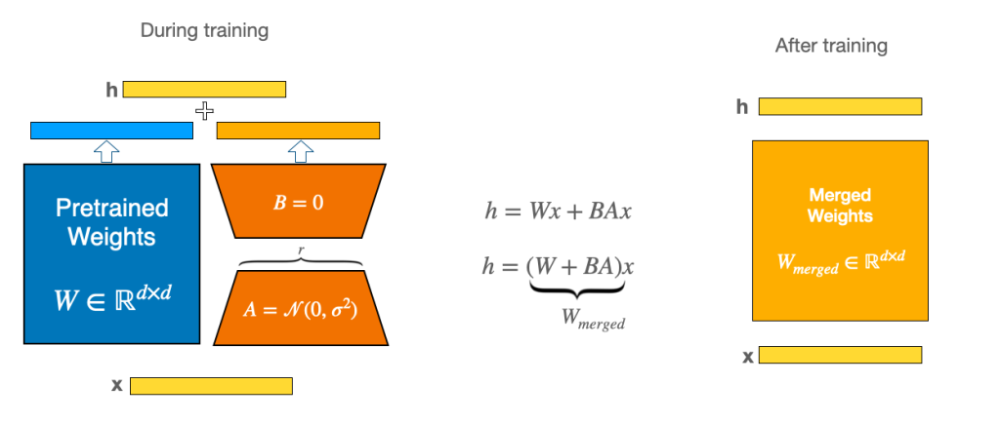{width=80%}

这张图一次交代了三件后面要分开讲的事。**旁路两个矩阵的初始值不对称**：$A$ 取小随机数、$B$ 取全零，所以训练第一步的旁路输出恰好是零，模型从“和原模型完全一样”起步（3.3.4 节）。**右半那块合并后的方块**说明训练结束后旁路可以被吸收进权重，推理时不多一条分支（3.3.7 节）。最后一点是画法上的：图上为了对称把权重画成了方阵 $W \in \mathbb{R}^{d \times d}$，一般线性层里它可以是 $W_0 \in \mathbb{R}^{d \times k}$，不影响这条旁路的结构。


### 3.3.2 参数量对比：为什么这么省？

来算一笔账。假设原始权重矩阵 $W_0$ 的维度是 $4096 \times 4096$（这是 LLaMA-7B 中注意力层的典型尺寸）：

| 方法 | 参数量 | 占比 |
|------|--------|------|
| 全量微调 $\Delta W$ | $4096 \times 4096 = 16{,}777{,}216$ | 100% |
| LoRA（$r=8$） | $4096 \times 8 + 8 \times 4096 = 65{,}536$ | **0.39%** |
| LoRA（$r=16$） | $4096 \times 16 + 16 \times 4096 = 131{,}072$ | **0.78%** |
| LoRA（$r=64$） | $4096 \times 64 + 64 \times 4096 = 524{,}288$ | **3.13%** |

注意占比是随 $r$ 线性涨的，而效果不是：$r$ 从 8 加到 64，参数量翻了八倍，收益却远不成比例，这正是 3.5.1 节要讨论“$r$ 取多少”的原因。

### 3.3.3 与 SVD 的关系

LoRA 的低秩分解和线性代数中的**奇异值分解（SVD）** 有深刻的联系。

任何矩阵 $W$ 都可以通过 SVD 分解为：

$$W = U \Sigma V^T$$

其中 $U$ 和 $V$ 是正交矩阵，$\Sigma$ 是对角矩阵，对角线上是从大到小排列的奇异值 $\sigma_1 \geq \sigma_2 \geq \cdots \geq 0$。

如果我们只保留前 $r$ 个最大的奇异值，就得到了 $W$ 的最佳秩-$r$ 近似：

$$W_r = U_r \Sigma_r V_r^T$$

这是 Eckart-Young 定理保证的：在所有秩为 $r$ 的矩阵中，$W_r$ 是与 $W$ 最接近的（在 Frobenius 范数意义下）。

LoRA 的 $BA$ 本质上就是在学习一个秩为 $r$ 的矩阵，只不过这个矩阵是靠梯度下降学出来的，而 SVD 是直接算出来的。这给了它更大的灵活性：它不需要近似整个 $W_0$，只需要学习任务相关的那部分变化 $\Delta W$。

### 3.3.4 初始化策略：从零开始

LoRA 的初始化非常讲究：

- **矩阵 $A$**：原始 LoRA 论文[1]使用高斯随机初始化；很多工程实现会采用 Kaiming 初始化一类的随机初始化
- **矩阵 $B$**：初始化为全零

为什么？因为这样在训练开始时：

$$\Delta W = BA = \mathbf{0} \cdot A = \mathbf{0}$$

模型的输出和预训练模型完全一致。训练从预训练的状态开始，而不是从一个随机扰动开始。这保证了训练的稳定性。

### 3.3.5 缩放因子 $\alpha$ 的作用

LoRA 引入了一个缩放因子 $\alpha$，实际的权重更新是：

$$\Delta W = \frac{\alpha}{r} \cdot BA$$

$\frac{\alpha}{r}$ 这个比值控制了 LoRA 旁路对原始模型的影响强度：

- **$\alpha / r$ 越大**：LoRA 的影响越强，模型偏离预训练状态越多
- **$\alpha / r$ 越小**：LoRA 的影响越弱，模型更保守地保留预训练知识

实践中的经验法则：

- 常见设置之一是 $\alpha = 2r$（比如 $r=16, \alpha=32$），这样 $\alpha/r$ 保持为 2
- 也有不少设置固定 $\alpha$：原始 LoRA 论文[1]提到可以把 $\alpha$ 设为最先尝试的 $r$，QLoRA 论文[2]的部分实验则使用 $\alpha=16$
- 因此增大 $r$ 时不一定必须同比例增大 $\alpha$；关键是把 $\alpha/r$、学习率和 Dropout 一起调


### 3.3.6 应用到哪些层？

Transformer 中有很多线性层，LoRA 应该加在哪里？

原始 LoRA 论文[1]在 GPT-3 上的实验发现，只对注意力层的 $W_q$（Query）和 $W_v$（Value）投影矩阵加 LoRA 就能取得不错的效果。后续很多实践会把 LoRA 扩展到更多线性层，以换取更高的适配容量；但效果仍取决于任务、数据量、rank 和显存预算。

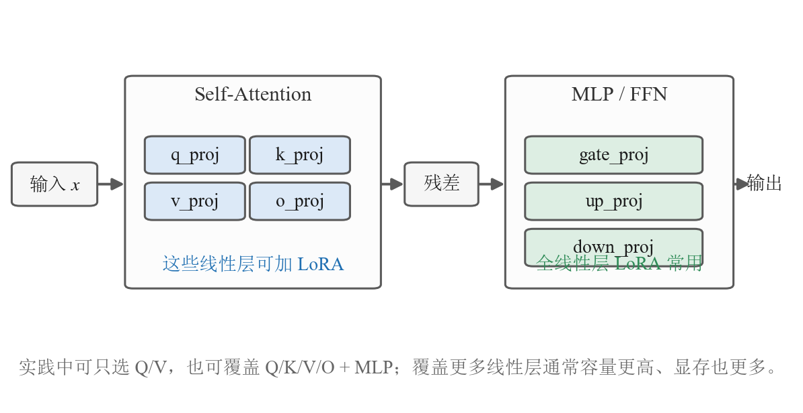{width=100%}

名字会随架构变：LLaMA/Qwen 这类门控 MLP 是 gate、up、down 三个，传统 Transformer FFN 只有 up、down 两个，但挂法完全一样：**每一个独立的线性层都是一个可以单独决定挂不挂的旁路点**。所以“LoRA 加在哪”是一张按层勾选的清单。

具体来说，一个 LLaMA-style Transformer 层中可以加 LoRA 的位置包括：

| 模块 | 权重矩阵 | 说明 |
|---|---|---|
| **注意力层** | $W_q, W_k, W_v$ | Query / Key / Value 投影 |
| | $W_o$ | 注意力输出投影 |
| **FFN 层** | $W_{gate}, W_{up}$ | MLP 的门控和上投影 |
| | $W_{down}$ | MLP 的下投影 |

QLoRA 论文[2]把 LoRA 加到所有线性层上，并在附录中报告：覆盖所有层之后，rank 对最终表现的影响并不总是显著。实际项目中要结合数据量、过拟合风险和显存选择目标层。像 Hugging Face PEFT 这类框架会按模型类型匹配常见模块，也支持通过 `target_modules` 显式指定，必要时可以设为 `"all-linear"` 覆盖所有线性层。

### 3.3.7 推理时的低开销：权重合并

LoRA 有一个非常优雅的特性：**推理时可以把旁路矩阵合并回原始权重，从而避免运行时额外的旁路矩阵乘法**。

训练完成后，直接计算：

$$W_{merged} = W_0 + \frac{\alpha}{r} \cdot BA$$

然后用 $W_{merged}$ 替换 $W_0$，推理时就和普通模型一样执行一个线性层，没有额外的旁路矩阵乘法。

这意味着：

- **训练时**：多一个旁路分支，有少量额外计算
- **推理时**：合并后基本没有额外计算开销，速度接近同精度的普通模型

这里所谓“无额外计算开销”有一个前提：LoRA 已经合并到同精度基座权重中。如果推理时动态挂载适配器、频繁切换多个适配器，或者基座模型是 4-bit 量化格式而不能直接合并，仍可能存在额外开销或工程限制。

而且，如果你需要切换任务，只需要：卸载当前 LoRA 权重 → 加载新的 LoRA 权重 → 重新合并。整个过程通常只涉及几 MB 到数百 MB 的数据传输，远小于切换整套基座模型。


## 3.4 LoRA 的训练流程

### 3.4.1 完整的训练步骤

用 LoRA 微调一个模型一共五步：加载并冻结基座、注入旁路、训练、保存适配器、推理时合并回去。写成伪代码是这样：

```text
# 1 加载并冻结
model ← 预训练基座权重
model 的每个参数.requires_grad ← false

# 2 在目标层注入旁路
r       ← 16          # 秩
alpha   ← 32          # 缩放因子，实际缩放量是 alpha / r
dropout ← 0.05        # 旁路输入前先 dropout，防过拟合
targets ← {q_proj, k_proj, v_proj, o_proj, gate_proj, up_proj, down_proj}
对 targets 里的每个 W0：
    新建可训练的 A、B，把该层前向改成 h = W0·x + (alpha / r)·B·A·x

# 3 训练
按平常的方式训练 model
    # 反向只有 A、B 收到梯度，W0 的梯度既不计算也不存储

# 4 保存
只写出全部 A、B        # 几 MB 到数百 MB，取决于 r 与覆盖的层数

# 5 推理
model ← 预训练基座权重
挂上第 4 步存下的 A、B
合并 W ← W0 + (alpha / r)·B·A    # 合并后旁路消失，推理不再有额外开销
```

落到具体框架上，这五步依次对应 Hugging Face Transformers 的 `AutoModelForCausalLM.from_pretrained`、PEFT 的 `LoraConfig` + `get_peft_model`、常规训练循环、`save_pretrained`、以及 `PeftModel.from_pretrained` + `merge_and_unload`。参数名和默认值以官方文档为准：[Transformers AutoModelForCausalLM](https://huggingface.co/docs/transformers/en/model_doc/auto#transformers.AutoModelForCausalLM)、[PEFT LoRA API](https://huggingface.co/docs/peft/en/package_reference/lora)、[PEFT checkpoint loading guide](https://huggingface.co/docs/peft/en/developer_guides/checkpoint)。

### 3.4.2 LoRA 的显存节省

LoRA 为什么能省这么多显存？关键在于**梯度和优化器状态只需要为 LoRA 参数维护**：

下面先看一个静态训练状态的粗略估算。它只统计模型权重、梯度和 Adam 优化器状态，不包含激活值、临时 buffer、梯度检查点策略和框架开销。

| 项目 | 全量微调（7B） | LoRA 微调（7B，$r=16$） |
|------|---------------|------------------------|
| 模型权重 | 14 GB（fp16） | 14 GB（fp16，冻结） |
| 可训练参数 | 7B | ~40M（约 0.57%，覆盖 Q/K/V/O + MLP，$r=16$） |
| LoRA 参数本身 | - | ~80 MB（fp16） |
| 梯度 | 14 GB | ~80 MB |
| Adam 优化器状态 | 56 GB | ~320 MB（一阶 + 二阶两个 fp32 矩） |
| **静态小计** | **~84 GB+** | **~14.5 GB+** |

真正训练时还要加上激活值和实现开销；如果使用混合精度 Adam 并额外保留一份 fp32 主副本，全量微调还会再多一份权重拷贝。所以 24 GB 显卡能否跑起来取决于 batch size、序列长度、梯度检查点、优化器实现和是否使用量化。但相比全量微调，LoRA 最大的节省来自：不再为 7B 基座权重保存梯度和优化器状态。


## 3.5 LoRA 的超参数调优

### 3.5.1 秩 $r$ 的选择

秩 $r$ 是 LoRA 最重要的超参数，它决定了低秩近似的“容量”：

- **$r$ 太小**（如 1~4）：表达能力不足，可能欠拟合
- **$r$ 太大**（如 256~512）：接近全量微调，失去参数效率优势
- **甜蜜点**：通常在 8~64 之间

不同任务对 $r$ 的需求不同。下面这张表是社区常见的起手档位，**不是论文结论**，真正的取值要用验证集扫出来：

| 任务类型 | 起手 $r$ | 理由 |
|----------|----------|------|
| 简单适配（格式、风格） | 4~16 | 变化量小，低秩就够 |
| 领域适配（医疗、法律） | 16~64 | 需要学习新知识 |
| 复杂任务（新语言、新模态） | 64~256 | 变化量大，需要更高秩 |

### 3.5.2 $\alpha$ 与学习率的关系

$\alpha$ 和学习率（learning rate）共同决定了 LoRA 的更新幅度。实践中有两种常见策略：

**策略一：固定 $\alpha = 2r$，调学习率。** 这是最常见的做法。$\alpha / r = 2$ 是一个合理的默认值，然后通过调学习率来控制更新幅度。

**策略二：固定 $\alpha$，调 $r$。** 有些人喜欢固定 $\alpha = 16$，然后只调 $r$。这样 $r$ 增大时，$\alpha / r$ 会自动减小，起到正则化的效果。

原始 LoRA 论文[1]并没有要求 $\alpha$ 必须随 $r$ 同比增长；QLoRA 论文[2]在一组实验中使用了 $\alpha=16$、$r=64$，并把 LoRA 加到所有线性层上。也就是说，$r$、$\alpha$ 和目标层覆盖范围要一起看：覆盖层数越多，单层所需的 rank 未必越高。

### 3.5.3 Dropout

LoRA 通常在旁路分支中加一个 Dropout 层（常见实现是在输入进入 LoRA 矩阵前做 Dropout），防止过拟合。常见值是 0.05~0.1。数据量越少，Dropout 越重要。

### 3.5.4 实验经验总结

把原始 LoRA 论文、QLoRA 论文和一些第三方复现实验放在一起看，可以得到几条更稳妥的经验。第三方博客实验可以作为工程经验引用，但需要标注来源和实验边界。下面涉及 Raschka 的结论均来自《Practical Tips for Finetuning LLMs Using LoRA》[11]，原文基于 LLaMA-2 7B、Alpaca/LIMA 等设置做了多组实验。

1. 原始 LoRA 论文[1]多数实验只在注意力层上做 LoRA，常用 $W_q/W_v$；QLoRA 论文[2]则把 LoRA 加到所有线性层上，作为大模型指令微调的默认设置
2. Rank 不是越大越稳定地更好。QLoRA 论文[2]报告：LoRA 覆盖所有线性层时，最终效果和 rank 的关系并不强；Raschka 的博客实验中也有高 rank 表现较好的案例，但这取决于模型、数据和训练预算
3. LoRA 应用位置很重要。Raschka 的博客实验[11]建议把 LoRA 应用到所有层，而不只是 Query/Value 那两个矩阵；但他也明确说明自己只比较了“Q/V”与“all layers”两个设置，其他组合没有系统穷举
4. QLoRA 的显存收益和速度代价都依赖实现。Raschka[11] 的一次 LLaMA-2 7B 对比中，显存约从 21.3 GB 降到 14.2 GB，训练时间从 1.85 小时增加到 2.79 小时；按这组数字换算，显存省了约 33%，训练时间多了约 51%（与 3.6.5 节那张表里“约 0.66× 相对吞吐”一致），但这不是一个固定规律
5. 优化器和学习率调度没有统一最佳。原始 LoRA 论文[1]常用 AdamW 配线性衰减（linear decay）；QLoRA 论文[2]在指令微调实验中使用常数调度（constant schedule）；Raschka 的博客实验[11]观察到余弦调度（cosine scheduler）对 SGD 的帮助更明显，对 Adam/AdamW 影响较小
6. 小数据指令微调中要谨慎增加 epoch：训练过久更容易过拟合或削弱原模型能力


## 3.6 QLoRA：让大模型微调走进消费级硬件

### 3.6.1 LoRA 还不够省吗？

LoRA 已经把可训练参数降到了不到 1%，但有一个问题它没解决：**冻结的基座模型本身还是很大**。

以 LLaMA-2 70B 为例：

- 模型权重（fp16）：~140 GB
- 即使用 LoRA，你仍然需要把这 140 GB 加载到显存里
- 这远远超出了任何单张消费级 GPU 的容量

QLoRA（Quantized LoRA）的核心思想是：**既然基座模型是冻结的，我们可以把它压缩到 4-bit 精度来存储，需要计算的时候再临时解压回 16-bit**。

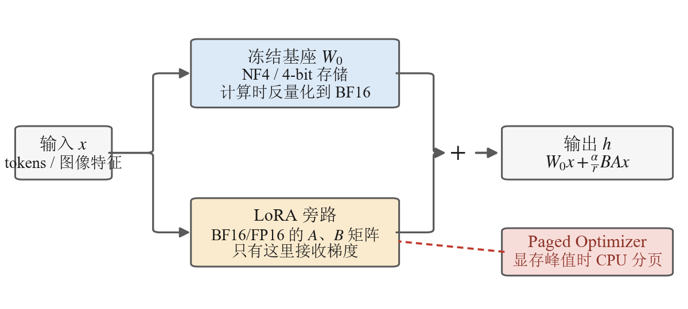{width=100%}

图上要盯住的是两条分支各自处在什么精度：基座那条以 4-bit NF4 躺在显存里、冻结不动，只在前向经过它时临时反量化到 bf16（另一种 16 位半精度，动态范围比 fp16 宽得多，4.3.2 节展开）参与计算；LoRA 那条旁路从头到尾都是 bf16/fp16，因为它是唯一要接收梯度的部分。两条分支的输出最后相加。量化只发生在不训练的那一侧，这正是 QLoRA 敢压到 4-bit 的底气。

### 3.6.2 QLoRA 的三大技术创新

QLoRA 论文[2]提出了三个关键技术，每一个都值得深入理解。

#### （1）创新一：4-bit NormalFloat（NF4）量化

这是 QLoRA 最核心的创新。传统的 4-bit 量化（如 INT4）对所有数值范围均匀分配量化级别，但神经网络的权重分布并不均匀：它们通常服从**以零为中心的正态分布**。

NF4 的做法是：**根据正态分布的分位数来设计量化级别**，让每个量化区间包含相同数量的权重值。

具体步骤：

1. **归一化**：将权重缩放到 $[-1, 1]$ 范围（除以每个块的绝对值最大值）
2. **分位数计算**：将标准正态分布 $\mathcal{N}(0, 1)$ 等概率地分成 $2^4 = 16$ 个区间
3. **映射**：每个权重值映射到最近的分位数中心点，用 4-bit 索引存储

为什么 NF4 比 INT4 好？因为正态分布的权重大部分集中在零附近，NF4 在零附近分配了更密集的量化级别，而在尾部（极端值）分配较少的级别。这样，**大多数权重的量化误差都很小**。

QLoRA 论文[2]从信息论角度说明：在权重近似服从正态分布的假设下，NF4 是非常合适的 4-bit 量化方案。

#### （2）创新二：双重量化（Double Quantization）

量化过程需要为每个量化块存储一个缩放常数（scaling constant）。如果用 fp32 存储这些常数，它们本身也会占用不少显存。

双重量化的做法是：**对这些缩放常数再做一次量化**，用更低比特的表示来存储它们。

它量化两次。

- 第一次量化：将 fp16 权重量化为 NF4，每 64 个权重共享一个 fp32 缩放常数
- 第二次量化：将这些 fp32 缩放常数量化为 8-bit floating point 表示（论文中记为 FP8），每 256 个缩放常数共享一个 fp32 二级缩放常数

这额外节省了约 **0.37 bit/参数**。对于 65B 模型，这意味着节省约 3 GB 显存。

#### （3）创新三：分页优化器（Paged Optimizers）

训练过程中，优化器状态（如 Adam 的一阶和二阶矩估计）会占用大量显存。batch size 较大或序列较长时，可能出现显存峰值（memory spike）导致 OOM（Out of Memory）。

分页优化器利用了 NVIDIA 统一内存（Unified Memory）的特性：

- 优化器状态默认存储在 GPU 显存中
- GPU 显存不足时，自动将部分优化器状态**卸载到 CPU 内存**
- 需要时再**按需加载回 GPU**

这类似于操作系统的虚拟内存/页面交换机制，避免了 OOM 崩溃，代价是偶尔的 CPU-GPU 数据传输延迟。

### 3.6.3 QLoRA 的完整训练流程

把三个创新组合起来，QLoRA 的训练流程是：

1. **加载模型**：将预训练权重以 NF4 格式加载（双重量化），显存占用约为 fp16 的 1/4
2. **注入 LoRA**：在目标层添加 bf16 精度的 LoRA 旁路
3. **前向传播**：NF4 权重临时反量化为 bf16 → 与输入相乘 → 加上 LoRA 旁路输出
4. **反向传播**：梯度只流过 LoRA 参数（bf16），基座模型不更新
5. **优化器更新**：使用分页优化器更新 LoRA 参数，显存不足时自动卸载到 CPU

和普通 LoRA 的差别只在第一步：加载基座时多给一组量化设置。伪代码：

```text
量化设置：
    以 4-bit 加载      ← true
    量化类型           ← NF4
    双重量化           ← 开
    计算 dtype        ← bf16     # 反量化后按 bf16 算

model ← 按上面这组设置加载预训练基座
之后完全走 3.4.1 那五步：注入 A、B → 训练 → 存适配器 → 推理
```

框架侧对应 Hugging Face Transformers 的 bitsandbytes 量化接口，四个设置项就是 `BitsAndBytesConfig` 的 `load_in_4bit`、`bnb_4bit_quant_type`、`bnb_4bit_use_double_quant`、`bnb_4bit_compute_dtype`。官方来源：[Transformers bitsandbytes quantization guide](https://huggingface.co/docs/transformers/en/quantization/bitsandbytes)、[Transformers BitsAndBytesConfig API](https://huggingface.co/docs/transformers/en/main_classes/quantization#transformers.BitsAndBytesConfig)。

### 3.6.4 QLoRA 的显存对比

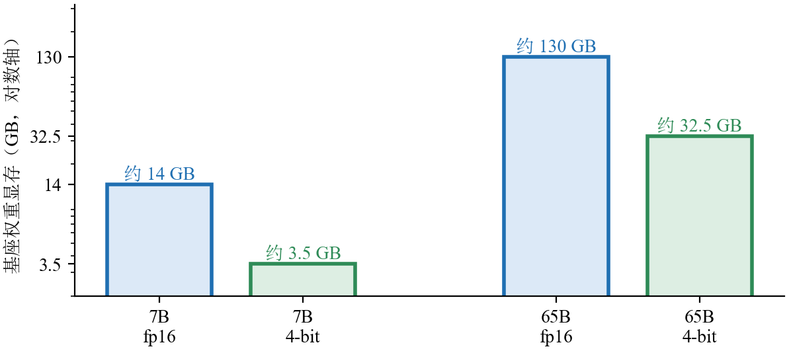{width=100%}

要注意这张图量的**只有基座权重那一块**，不含梯度、优化器状态和激活值。即便如此，落差已经很可观：65B 那一组从约 130 GB 掉到约 32.5 GB，正好跨过单张 48 GB 卡的容量线。本节后面那个“单卡微调 65B”的结论，起点就是这一格。同样的账换成 3.6.1 节那个 70B 的例子，是从 140 GB 降到约 35 GB；再加上双重量化省下的 0.37 bit/参数，才腾出了放 LoRA 参数、激活值和框架开销的空间。

如果把训练时的梯度、优化器状态和常见额外开销也纳入粗略估算，可以得到下面这种量级对比。注意这些数字不是硬件承诺，实际显存会随 batch size、序列长度、梯度检查点和实现细节变化。

| 模型 | 全量微调（fp16）粗略训练显存 | LoRA（fp16 基座）粗略训练显存 | QLoRA（NF4 基座）粗略训练显存 |
|---|---|---|---|
| 7B | 约 84 GB | 约 15 GB | 约 6 GB |
| 13B | 约 156 GB | 约 27 GB | 约 10 GB |
| 33B | 约 396 GB | 约 67 GB | 约 18 GB |
| 65B/70B | 约 780 至 840 GB | 约 140 GB | 约 36 GB |

QLoRA 论文[2]的标志性成果就落在这张表的最后一行：**单张 48 GB 的卡微调 65B 参数的模型**。同一个模型走全量微调要 780 GB 以上。

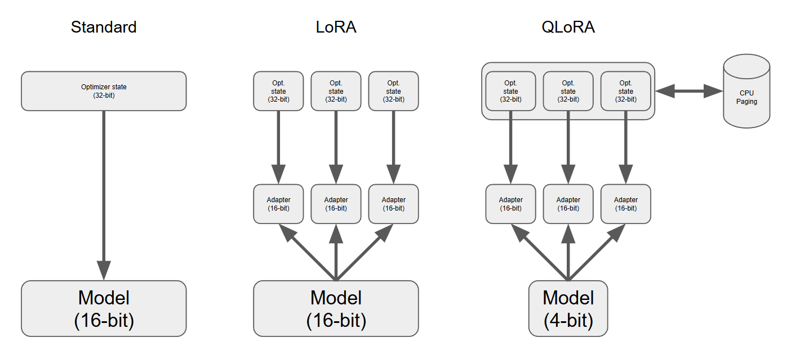{width=90%}

三行摆在一起，能看清每一步省的是哪一块：标准微调整条都要训、都要存优化器状态；LoRA 把基座那一大块冻在 fp16/bf16，只留一小条适配器可训；QLoRA 再把已经冻住的那一大块压成 4-bit。图上的 `Adapter (16-bit)` 指的是 LoRA 的低秩旁路，不是 1.3.3 节讲的传统 Adapter 层，两者名字撞了，结构不是一回事。

### 3.6.5 QLoRA 的代价

QLoRA 不是免费的午餐，它有明确的代价：

**训练速度通常会下降。** 每次前向传播都需要将 NF4 权重反量化为 bf16，这个额外步骤会拖慢训练，但具体幅度取决于模型、batch size、kernel 实现和硬件。下面是一组第三方博客实验中的 LLaMA-2 7B 对比数据，来源为 Raschka[11]：

| 配置 | 显存 | 训练时间 / 相对吞吐 |
|------|------|----------|
| LoRA（fp16 基座） | 21.3 GB | 1.85 小时 / 1.0x |
| QLoRA（NF4 基座） | 14.2 GB | 2.79 小时 / ~0.66x |

**精度可能略有损失，但不是必然。** 量化本身会引入误差。NF4 对近似正态分布的权重很友好，QLoRA 论文[2]在多组实验中报告它能匹配 16-bit LoRA 或全量微调的效果；但在具体业务任务上，QLoRA 仍可能略逊于未量化 LoRA，需要用验证集确认。

**经验法则：显存够用 LoRA 就用 LoRA，少一层量化就少一处不确定；显存不够再上 QLoRA，它是这种情况下最成熟的一条退路。**


## 3.7 LoRA 的变体与演进

LoRA 自 2021 年提出以来，陆续暴露出一些局限，也因此长出了一批变体。下面五个各针对一处：$BA$ 只管方向管不了幅度、所有层共用一个 $r$、$A$ 与 $B$ 的更新步长不匹配、高秩时 $\alpha/r$ 把梯度压得太狠、以及零初始化让训练从头学起。

本节提到的变体结论分别来自 DoRA[12]、AdaLoRA[13]、LoRA+[14]、rsLoRA[15] 和 PiSSA[16] 五篇论文。这些提升都发生在各自的实验设置下，不能直接当作所有任务的固定收益。

### 3.7.1 DoRA：分解权重的幅度和方向

**解决什么问题？** 研究者发现，全量微调时权重的“幅度”和“方向”变化之间呈弱负相关，而 LoRA 微调时却呈正相关。这种差异可能限制了 LoRA 的效果。

**怎么做的？** DoRA（Weight-Decomposed Low-Rank Adaptation）将权重矩阵分解为**幅度向量 $m$** 和**方向矩阵 $V$**，分别训练：

$$W' = m \odot \frac{W_0 + BA}{\|W_0 + BA\|_c}$$

其中 $m$ 是可训练的幅度向量（初始化为 $\|W_0\|_c$），$\|\cdot\|_c$ 表示按列求范数，$\odot$ 是逐元素乘法。LoRA 的 $BA$ 只负责更新方向，幅度由 $m$ 单独控制。

**效果如何？** DoRA 论文[12]报告，在 LLM、视觉-语言模型和文本生成图像模型等多个测试设置中，DoRA 通常优于标准 LoRA；但提升幅度依赖任务、rank 和训练预算，实际项目中仍需要按任务和数据验证。

### 3.7.2 AdaLoRA：自适应分配秩

**解决什么问题？** 标准 LoRA 对所有层使用相同的秩 $r$，但不同层的重要性不同：有些层需要更高的秩来捕捉复杂变化，有些层用很低的秩就够了。

**怎么做的？** AdaLoRA 在训练过程中**动态调整每一层的秩**。它通过监控每层的奇异值和损失敏感度，自动给重要的层分配更高的秩，给不重要的层降低秩，同时保持总参数量不变。

**效果如何？** AdaLoRA 论文[13]报告，在若干 NLU/NLG 任务中，它能在相似参数预算下优于固定 rank 的 LoRA。但它的收益来自动态秩分配和重要性评估，训练流程也更复杂。

### 3.7.3 LoRA+：不对称学习率

**解决什么问题？** 标准 LoRA 对矩阵 $A$ 和 $B$ 使用相同的学习率，但由于 $B$ 初始化为零，它在训练初期需要更大的更新步长才能“追上” $A$。

**怎么做的？** LoRA+ 给 $A$ 和 $B$ 设不同的学习率，两者的比值 $\lambda = \eta_B / \eta_A$ 是要选的超参。这个比值没有万能取值：论文在 RoBERTa 上找到的好取值在 16 量级，换到 LLaMA 上最优只剩 2~4 量级。

**效果如何？** LoRA+ 论文[14]报告，在他们的实验设置里不对称学习率改善了收敛，效果提升 1%~2%、微调速度最高约 2 倍，且不增加计算开销。这些幅度不是通用常数，换模型换任务都要重新扫这个比值。

### 3.7.4 rsLoRA：秩稳定化缩放

**解决什么问题？** 原始 LoRA 的缩放因子 $\alpha / r$ 在高秩时会导致学习速度过慢。$r$ 增大时，$\alpha / r$ 减小，梯度信号被过度衰减。

**怎么做的？** rsLoRA 将缩放因子从 $\alpha / r$ 改为 $\alpha / \sqrt{r}$，保证不同秩下的梯度范数和输出范数保持稳定。

**效果如何？** rsLoRA 论文[15]报告，在较高 rank 设置下，$\alpha/\sqrt{r}$ 比 $\alpha/r$ 更稳定，更容易发挥高 rank 的容量。它主要适合你确实想用高 rank 的场景。

### 3.7.5 PiSSA：基于 SVD 的初始化

**解决什么问题？** 标准 LoRA 用随机初始化 $A$ + 零初始化 $B$，这意味着训练从零开始学习 $\Delta W$。能不能用更好的初始化来加速收敛？

**怎么做的？** PiSSA 对原始权重 $W_0$ 做 SVD 分解，用前 $r$ 个最大奇异值对应的分量来初始化 $A$ 和 $B$：

$$W_0 = U_r \Sigma_r V_r^T + W_{residual}$$

其中 $B = U_r \sqrt{\Sigma_r}$，$A = \sqrt{\Sigma_r} V_r^T$，冻结的部分变成 $W_{residual}$（而不是原始的 $W_0$）。

**效果如何？** PiSSA 论文[16]报告，这种初始化通常能加速收敛，并在一些任务上优于标准 LoRA；代价是初始化阶段需要对目标权重做 SVD 或近似 SVD。

### 3.7.6 变体对比总结

| 变体 | 核心改进 | 适用场景 | 额外开销 |
|---|---|---|---|
| **DoRA** | 分离幅度和方向更新 | 可尝试追求更高精度 | 少量额外计算 |
| **AdaLoRA** | 自适应分配每层的秩 | 参数预算有限 | 训练时额外监控 |
| **LoRA+** | 不对称学习率 | 可能加速训练收敛 | 无 |
| **rsLoRA** | $1/\sqrt{r}$ 缩放 | 高秩设置 | 无 |
| **PiSSA** | SVD 初始化 | 可能加速收敛 | 初始化时做一次 SVD |

**实际建议：** 对于大多数场景，标准 LoRA 已经足够好。如果你想进一步提高效果，可以尝试 DoRA 并用验证集确认收益；如果你使用高秩（$r \geq 64$），可以考虑 rsLoRA；如果你想改善初始化和收敛速度，可以试试 PiSSA。


## 3.8 LoRA 在 VLA 中的应用

### 3.8.1 为什么 VLA 微调特别适合 LoRA？

VLA（Vision-Language-Action）模型的微调场景天然适合 LoRA，原因有三：

1. **数据量小**：机器人操作轨迹的采集成本很高，通常只有几百到几千条。LoRA 可训练参数少、容量受限，通常能压低过拟合风险，但不是免疫，1.3.4 节那条备注仍然成立。
2. **模型大**：VLA 模型通常基于大型 VLM（如 LLaMA-7B、Qwen-7B），全量微调的显存需求很高。
3. **需要保留视觉-语言能力**：我们希望微调后的模型仍然理解图像和语言，只是额外学会了输出动作。LoRA 冻结大部分原始权重，更有利于保留这些能力。

### 3.8.2 不同 VLA 模型的 LoRA 策略

| 模型 | 动作表示 | LoRA 应用位置 | 常见做法 |
|---|---|---|---|
| **OpenVLA**[7] | 离散动作 token | 论文把 LoRA 加到**所有线性层**上，不是只挂语言骨干 | 默认 $r=32$；论文实测 rank 取多少对最终成功率影响很小 |
| **SmolVLA** | 连续动作（flow matching） | 动作专家 / 语言骨干按需选择 | 小模型通常优先全量训练动作模块，必要时对 VLM 加 LoRA |
| **$\pi_0$** | 连续动作（flow matching） | 动作专家模块 | 任务特定适配 |
| **GR00T N1** | 连续动作策略 | 多模态骨干 | 取决于任务和数据量 |

### 3.8.3 VLA LoRA 微调的实践要点

**视觉编码器通常冻结。** 预训练的视觉编码器（如 SigLIP、DINOv2）已经学到了很好的视觉表征，在小数据上微调容易过拟合。常见做法是完全冻结视觉编码器，或者用极小的学习率微调。

**骨干这一侧通常靠 LoRA 适配。** 对语言 / 多模态骨干的注意力层和 FFN 层加 LoRA，让模型学会把视觉-语言理解映射到动作输出。但“到底覆盖哪几层”各家差别很大：上表的 OpenVLA 索性挂满所有线性层，3.9 节会看到 LeRobot 给 $\pi_0$ 的默认名单又是另一种选法。

**动作头通常全量训练。** 对于连续动作 VLA，动作头（action head）或动作专家通常是新增模块，参数量相对较小，常见做法是直接全量训练而不用 LoRA。对于 OpenVLA 这类把动作离散化为 token 的模型，动作输出往往复用语言模型的 token 预测头，不一定存在单独的 `action_head`。


## 3.9 在 LeRobot 里给 $\pi_0$ 挂 LoRA

$\pi_0$ 体量大、全量微调成本高，正是 LoRA 的典型场景。好消息是不用自己写注入代码：LeRobot v0.5.1 已经把 PEFT 接进了训练入口，2.3 节那条 `lerobot-train` 命令加几个 `--peft.*` 参数就切换成 LoRA 微调。

命令面上只多三样东西：`--policy.use_peft=true` 打开适配器路径，`--peft.method_type=LORA` 选方法，`--peft.r` 给秩（默认 16，正好落在 3.5.1 节说的那个常用区间）。**注意 `use_peft=true` 必须配 `--policy.path` 一起用**：LeRobot 明确拒绝“从零初始化 + 挂适配器”这种组合，因为 LoRA 的前提就是有一个值得冻结的基座。

真正值得读一眼的是 LoRA 挂在哪。LeRobot 给每个策略预置了默认的注入位置，`lerobot/policies/pi0/modeling_pi0.py` 里 $\pi_0$ 那份写成一个正则：

```
(.*\.gemma_expert\..*\.self_attn\.(q|v)_proj
 |model\.(state_proj|action_in_proj|action_out_proj
         |action_time_mlp_in|action_time_mlp_out))
```

拆开看是两段。第一段是**动作专家内部注意力的 $W_q$ 与 $W_v$**：正好是 3.3.6 节说的、原始 LoRA 论文最早验证的那两个投影矩阵；第二段是**状态与动作的几个投影层**。视觉塔和语言骨干整个不在名单里，一个适配器都不挂。SmolVLA 的默认名单（`lerobot/policies/smolvla/modeling_smolvla.py`）是同一个模子，只把第一段换成它自己的 `lm_expert`。

3.8.3 节说过“覆盖哪几层各家差别很大”，这份名单就是一个具体答案，而且答案有点反直觉：**LeRobot 的默认配置并没有把 LoRA 加到语言骨干上**，而是压在动作专家那一侧，毕竟需要适配到新机器人的是动作，不是语言理解。另外这两份默认配置都把 `modules_to_save` 设成空列表，也就是说连动作投影层都走低秩旁路、不做全参保存；想让某些新增层全参训练，得自己用 `--peft.full_training_modules` 指定。

想改注入范围就覆盖它：`--peft.target_modules='all-linear'` 是把所有线性层都挂上（QLoRA 论文[2]那套做法），也可以给一个自己的模块名列表。改完之后先确认可训练参数量确实降下来了，这是 LoRA 有没有真正生效的最直接证据。

## 3.10 实物实验：给 $\pi_0$ 挂 LoRA 微调到 SO-101 真机

这一节和 2.4 节一样，等真机数据采齐后再写。上面那份默认注入名单、`--peft.*` 那几个参数、以及“先确认可训练参数量降下来”这个检查，在真机上都不变；要现场定的是秩取多少、以及动作专家之外还要不要覆盖别的层。

## 3.11 本节小结

**核心创新：** LoRA 抓住“微调时的有效权重变化是低秩的”这一观察，用 $\Delta W = \frac{\alpha}{r} BA$ 把更新参数化成两个小矩阵：冻结原始权重、只训练 $A$ 和 $B$，可训练参数压到基座的 1% 以内，推理前还能把旁路合并回权重、省掉运行时的额外分支（前提见 3.3.7 节）；QLoRA 再叠加 NF4 量化、双重量化、分页优化器三件套，把基座以 4-bit 装下，让大模型微调走进消费级硬件。

**局限性：** 低秩是一种近似，当任务与预训练分布差异极大、或秩 $r$ 取得过低时，旁路的表达力可能不够，效果不及全量微调；而且 $r$、$\alpha$、学习率都需要按任务调。QLoRA 用量化与 offload 换显存，代价是训练变慢，精度则多出一层不确定（3.6.5 节：可能略有损失，但不是必然，要用验证集确认）。显存够时优先用 LoRA，显存紧张才上 QLoRA。具体怎么选，可对照下表：

| 你的情况 | 推荐方法 | 理由 |
|----------|----------|------|
| GPU 显存充足（7B 模型 $\geq$ 24 GB） | LoRA | 训练更快，也少一层量化带来的不确定 |
| GPU 显存有限（7B 模型不足 24 GB） | QLoRA | 3.6.5 节那组对照里显存降了约三分之一，代价是训练变慢、精度需用验证集确认 |
| 想微调 33B+ 模型，单卡 | QLoRA | 通常是最现实的方案 |
| 想进一步提高效果 | LoRA + DoRA | 多个实验设置中优于标准 LoRA，但要按任务验证 |
| 高秩设置（$r \geq 64$） | LoRA + rsLoRA | 避免高秩时的学习率衰减 |
| VLA 小数据微调 | LoRA（$r=16\sim32$） | 过拟合风险低，也保留预训练能力 |

**一句话总结：** LoRA 用一对小矩阵接管了“微调该改什么”，把可训练参数压到基座的百分之一量级，QLoRA 再用量化把基座本身塞进消费级显存；落到 LeRobot 上，这一整套只是 `lerobot-train` 后面多挂几个 `--peft.*` 参数，而值得你花时间的是**看清适配器被挂在了哪几层**。


# 4 多卡训练指南

第 2、3 节把 VLA 微调到了自己的机器人上。小模型全量微调、或者给大模型挂 LoRA，单张卡大多还扛得住；可一旦要全量微调 $\pi_0$ 这种 3B 量级、甚至更大的 VLA，单卡立刻开始吃紧：配套代码里那条真机微调脚本默认还是单卡在训 $\pi_0$，代价是权重压到 bf16、批量只敢给 8；想把批量放大、想再换大一档的模型，或者手上的卡再小一号，就会直接撞墙。这一节把多卡训练从头讲到尾：先算清训练显存被谁吃掉，再依次讲数据并行、省显存四件套、ZeRO/FSDP 分片、模型并行，最后落到双卡实战。

**先说清这一节的定位和读法。** 它是本讲篇幅最大的一节，接近全讲的三分之一，而且到 4.6 节之前讲的都是**与 VLA 无关的通用分布式训练知识**：同一套 DDP、ZeRO、FSDP，训语言模型、训视觉模型、训 VLA 完全一样。这么安排是有意的：全量微调 $\pi_0$ 是本书第一次真正撞上显存墙，而撞墙之后要用的那套工具与 VLA 本身无关，索性在这里一次讲透。相应地，读法可以分两种：**只想把 $\pi_0$ 在两张卡上跑起来的，直接跳到 4.6 节**，那里是完整的 `accelerate launch` 命令和必须手动处理的坑；**想搞懂命令背后每个参数在做什么的**，从 4.1 节的显存账本按顺序读下来。

## 4.1 多卡训练总览与显存账本

### 4.1.1 开篇：为什么要专门讲多卡训练

到目前为止，本书训过的策略大多还能塞进一张卡：行为克隆、ACT、扩散策略（第10讲）的参数量从几百万到几千万，单张消费级显卡轻松拿下。但 VLA 这条线一路走下来，模型越做越大：

- **OpenVLA** 直接把一个 7B 的视觉-语言主干当骨架；
- **$\pi_0$** 这一代 flow matching 策略，主干带上 VLM 后参数量也到了 3B 量级；
- **GR00T N1** 这类通用人形基础模型，规模还在继续往上走。

模型一旦跨过某个体量，单卡训练就会撞上两堵墙：

- **放不下**：模型连同它训练时的“附属开销”塞不进一张卡的显存，程序直接 OOM（显存溢出）报错；
- **太慢**：就算勉强塞下，单卡算一遍数据要很久，一次训练拖到几天甚至几周，迭代节奏完全跟不上。

解决这两堵墙，靠的就是**把训练摊到多张卡上**。但“多卡”是一整套互相配合的技术：有的专门省显存，有的专门切模型，有的专门提速度。名词也多——DDP、ZeRO、FSDP、张量并行、流水线并行——初学者很容易被淹没。

多卡训练这一节要做的，就是给这堆名词画一张**地图**。本节是地图的底图：先讲清楚训练时显存到底被谁吃掉（**显存账本**），再讲清楚多卡有哪两条根本不同的扩展方向（**两条并行轴**）。把这两件事看明白，后面每一个名词，都只是这张地图上的一个坐标。

### 4.1.2 显存账本：训练时的显存被谁吃掉

很多人对“模型多大”的第一印象，是参数文件的大小：一个 7B 模型，权重存成 fp16（半精度，每个数 2 字节）大约 14 GB。于是会觉得，40 GB 的卡装个 14 GB 的模型绰绰有余。

这是个典型误区。**推理时**确实差不多就这么多，但**训练时**，参数本身只是开销里最小的一块。训练显存有四类“吃货”。

#### （1）四类吃货

- **参数（parameters）**：模型权重本身。混合精度训练里以 fp16 保存一份，每个参数 2 字节。
- **梯度（gradients）**：反向传播算出来的梯度，要和参数一一对应。同样 fp16，每个参数 2 字节。
- **优化器状态（optimizer states）**：这是最容易被忽略、却往往最大的一块。现在主流优化器是 **Adam**，它为每个参数额外维护两个量：一阶矩（动量，对梯度的滑动平均）和二阶矩（梯度平方的滑动平均）。而且混合精度训练里，为了数值稳定，优化器还会再保存一份 **fp32 的参数主副本（master copy）**。这三样都按 fp32（每个数 4 字节）算。
- **激活值（activations）**：前向传播时每一层的中间输出，反向传播算梯度时要用到，所以得先存着。它不和参数量直接挂钩，而是随 **batch size、序列长度、模型层数**一起涨：批量越大、序列越长，激活值越多。

> 备注：这四类里，前三类（参数 / 梯度 / 优化器状态）的大小**只由参数量决定**，给定模型就是固定的；激活值则由你怎么喂数据（批量、序列长度）决定，是唯一能通过调训练设置直接压缩的一块。这个区别在后面的省显存手段里很关键。

#### （2）一个具体算例：7B 模型要吃多少显存

把上面四类按“每个参数占几字节”折算，前三类是可以精确推导的。记模型参数量为 $\Psi$（这里 $\Psi = 7\times 10^9$）：

| 吃货 | 精度 | 每参数字节数 | 口径 |
|------|------|--------------|------|
| 参数 | fp16 | 2 | 权重一份 |
| 梯度 | fp16 | 2 | 与参数一一对应 |
| 优化器状态 | fp32 | 12 | fp32 主副本 4 + Adam 一阶矩 4 + Adam 二阶矩 4 |

也就是说，混合精度 + Adam 下，**每个参数要占 $2+2+12 = 16$ 字节**。这正是 ZeRO 论文[17]里反复用的那个“16 字节/参数”基准账本。

> 备注（**和 3.1.1 节的口径对一下**）：3.1.1 与 3.4.2 节那两张表把 7B 的优化器状态记作 56 GB，这里记作 84 GB，差的正是**那份 fp32 参数主副本**。那两张表只算了 Adam 的两个 fp32 矩（$8$ 字节/参数 $\times$ 7B = 56 GB），本节按 ZeRO 论文的完整口径把主副本也算进来（$12$ 字节/参数 $\times$ 7B = 84 GB）。两个数都对，只是口径不同；本节之后一律用 16 字节/参数这套账。

代入 7B：

- 参数：$2 \times 7\text{B} = 14$ GB
- 梯度：$2 \times 7\text{B} = 14$ GB
- 优化器状态：$12 \times 7\text{B} = 84$ GB
- **三项合计：$16 \times 7\text{B} = 112$ GB**

注意这 **112 GB 还不包含激活值**：激活值随批量和序列长度另算，叠上去只会更多。

#### （3）为什么 24 GB / 40 GB 的卡轻易就爆

把这个数字摆到常见显卡边上，结论一目了然：

- 一张 24 GB 的卡，连 7B 模型训练所需的 112 GB 都装不下零头；
- 一张 40 GB 的卡，也才够装其中三分之一多一点；
- 哪怕是 80 GB 的高端卡，单张也吃不下，更别提再加上激活值和一点余量。

关键的反直觉点在于：**真正撑爆显存的是优化器状态（84 GB），参数只占 14 GB**。它一个人就占了大头。这也解释了为什么后面省显存的技术里，“对优化器状态动刀”是收益最大的一类。

> 备注：这里用的是混合精度 + Adam 的标准账本。换优化器（如 SGD 无动量）或换精度，系数会变，但“训练显存远大于参数本身、且优化器状态占大头”这个结论是稳的。具体数字以你实际的优化器和精度为准。

### 4.1.3 两条正交的并行轴

看清了“显存被谁吃”，下一个问题是“多张卡怎么分工”。所有多卡训练方法，归根结底都落在两条**互相正交**的轴上。正交的意思是：它们解决的是不同方向的问题，可以单独用，也可以叠加用。

#### （1）数据并行：复制模型，切分数据

第一条轴叫**数据并行（data parallelism）**[18]。思路非常朴素：每张卡上放一份**完整的模型副本**，把一个大批量的数据**切成几份**，每张卡各算一份，最后把各卡的梯度汇总（all-reduce）对齐，保证所有副本始终一致。

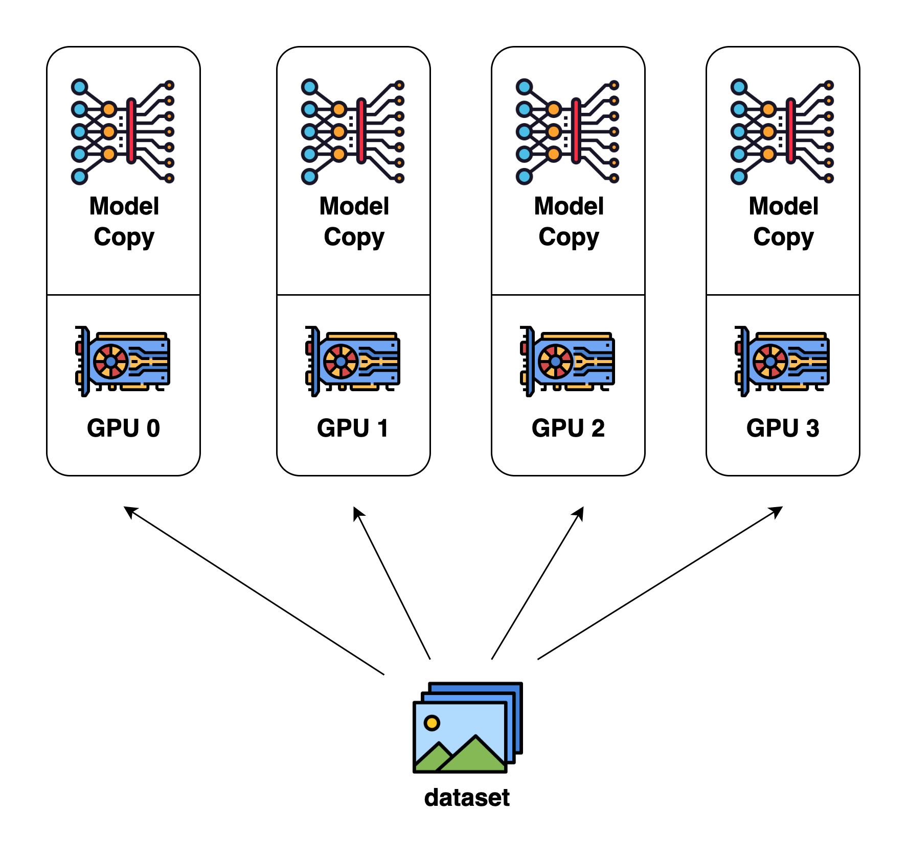{width=52%}

数据并行的特点是：

- **省时间**：N 张卡同时处理不同数据，相当于把有效批量放大 N 倍，吞吐近似翻 N 倍；
- **不省显存**：因为每张卡都要装一份完整模型：参数、梯度、优化器状态原封不动地复制了 N 遍。

所以它只拆得动“太慢”那堵墙；“放不下”那堵墙原封不动。

#### （2）模型并行：切分模型本身

第二条轴叫**模型并行（model parallelism）**[18]。一份模型副本本身就装不进一张卡时，数据并行无能为力，这时只能把**模型本身切开**，不同部分放到不同卡上。

切法又分两种（后面会细讲）：

- 按层内的矩阵运算横切，叫**张量并行**。下图就是一个例子：本来 $C = A \times B$ 在一张卡上算，张量并行把它按列切成几块分到不同卡上各算一部分，最后用 all-gather 把结果拼回来；
- 按层与层之间纵切，把不同的层段分到不同卡上，叫**流水线并行**。

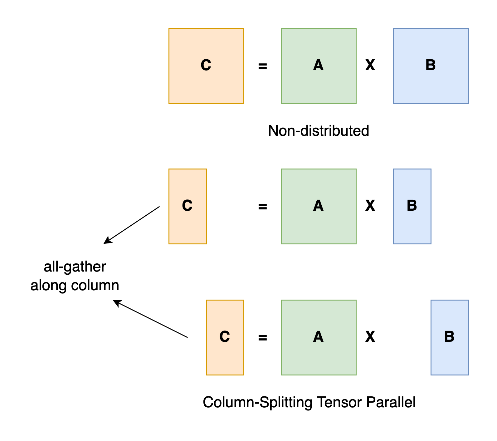{width=68%}

模型并行的特点正好和数据并行互补：它直接攻“放不下”那堵墙，让单卡装不下的模型能跑起来，但通信代价更高、实现更复杂，通常是单纯数据并行扛不住时才上。

#### （3）一个关键的桥：ZeRO / FSDP 站在哪条轴上

这里要先埋一个后面会展开的伏笔。前面说数据并行“不省显存”，是因为它把参数、梯度、优化器状态在每张卡上**完整复制**了 N 份。这其实是巨大的浪费：明明有 N 张卡，同一份优化器状态却存了 N 遍。

**ZeRO / FSDP** 做的就是把这份浪费切掉：它仍然站在**数据并行这条轴上**（每张卡还是处理不同的数据），但不再让每张卡都存完整的一份，而是把参数、梯度、优化器状态**沿数据并行的若干张卡切开分摊**，用到哪片临时聚合哪片。于是它既保留了数据并行“切数据、易扩展”的好处，又把“复制掉的显存”省了回来，相当于在数据并行轴上，顺手解决了一部分“放不下”。这一块是后面 4.4 节的主角，这里只先把它在地图上的位置钉住：**它是数据并行轴上的省显存升级，没另开一条轴。**

### 4.1.4 全景地图：后面几节在讲什么

有了“四类显存吃货 × 两条并行轴”这套坐标，多卡训练这一节的结构就清晰了。后面每一节，都是在这张地图上解决一个具体问题：

| 小节 | 在地图上的位置 |
|------|----------------|
| 4.2 DDP | 数据并行轴的标准实现。让多卡同时跑、把吞吐拉满，但**不省显存**，专门打“太慢”那堵墙。 |
| 4.3 省显存四件套 | 不切模型、不加卡，直接对四类吃货下手：混合精度（压参数/激活）、梯度累积（小批量换大批量）、梯度检查点（用算力换激活值显存）、offload（把状态挪到 CPU/内存）。 |
| 4.4 ZeRO / FSDP | 数据并行轴上的分片升级。把复制掉的参数、梯度、优化器状态切开分摊到各卡，省回第 4.1.2 小节里那 84 GB 的大头。 |
| 4.5 张量 / 流水线并行 | 模型并行轴。一份模型副本本身都装不下时，把模型横切（张量并行）或纵切（流水线并行）。属于进阶与边界情形。 |
| 4.6 双卡实战 | 把上面这些落到实操：先讲通用启动器 `torchrun`，再落到 LeRobot 真正用的 `accelerate launch`，在两张卡上把一次完整训练跑起来。 |


读这张表时，建议始终对照两个问题问自己：**这一节在打哪类显存吃货？它走的是哪条并行轴？** 所有看起来陌生的名词，都能被这两个问题归位。

### 4.1.5 小结

#### （1）核心脉络回顾

本节建立了多卡训练这一节的两块底座：

- **显存账本**：训练显存有四类吃货：参数、梯度、优化器状态、激活值。混合精度 + Adam 下，前三类合计约 16 字节/参数，一个 7B 模型光这三项就要 112 GB（其中优化器状态 84 GB 是大头），还没算激活值。这就是单卡“放不下”的根因。
- **两条并行轴**：数据并行（复制模型、切数据，省时间不省显存）与模型并行（切模型本身，攻“放不下”）互相正交；ZeRO / FSDP 是数据并行轴上把复制掉的状态再切开的省显存升级，不是独立的第三条轴。

#### （2）全景参考表

| 维度 | 要点 |
|------|------|
| 四类显存吃货 | 参数、梯度、优化器状态、激活值 |
| 谁占大头 | 优化器状态（Adam fp32 主副本 + 一阶矩 + 二阶矩，12 字节/参数） |
| 7B 训练显存（前三类） | $16 \times 7\text{B} = 112$ GB（14 + 14 + 84，未含激活值） |
| 数据并行 | 复制模型、切数据；省时间，不省显存 |
| 模型并行 | 切模型本身（张量并行横切 / 流水线并行纵切）；攻“放不下” |
| ZeRO / FSDP 的定位 | 数据并行轴上的状态分片，省回复制掉的显存 |

> 一句话总结：训练显存被参数、梯度、优化器状态、激活值四类吃掉，优化器状态是大头、7B 仅前三类就要 112 GB；多卡训练沿“数据并行（省时间）”和“模型并行（攻放不下）”两条正交轴展开，后面每个名词都是这张地图上的一个坐标。

## 4.2 数据并行 DDP

### 4.2.1 从地图上那一格出发

上一节把整张多卡训练的地图铺开：训练显存被参数、梯度、优化器状态、激活值四类吃货分掉，多卡扩展沿“数据并行”和“模型并行”两条正交轴展开。这一节就钉在地图最常用的一格上：**数据并行轴**，而且是它的标准实现。

回忆一下这一格的两个标签：

- **数据并行**的思路朴素到一句话能说完：每张卡上放一份**完整的模型副本**，把一个大批量切成几份，每张卡各算一份数据，再把各卡的梯度汇总对齐，让所有副本始终保持一致。
- 它的定位是 **“提速不省显存”**：N 张卡同时处理不同数据，在计算占主导、batch 够大、通信与数据管线不成瓶颈时吞吐可接近 N 倍，专打“太慢”那堵墙；但每张卡都得装一份完整模型，参数、梯度、优化器状态原封不动复制了 N 遍，对“放不下”那堵墙毫无帮助。

这一节要做的，就是把这一格从“一句话思路”落到“真正怎么实现”。核心问题只有两个：**多卡到底怎么各算各的？各卡算完又怎么把梯度对齐？** 把这两件事讲透，DDP 就讲清了。

但在讲 DDP 之前，得先看看它的前身：`DataParallel` 是怎么把这件事做砸的。理解了老办法的死穴，才知道 DDP 每一个设计为什么非这么做不可。

### 4.2.2 老 DataParallel 的死穴

PyTorch 早期提供过一个非常好用的接口[19]：把模型包一层 `nn.DataParallel`，一行代码就能多卡训练，不用改其它任何东西。好用归好用，它有几个结构性的毛病，重到今天官方文档明确建议**即使单机多卡也别再用它**。

#### （1）单进程多线程，被 GIL 卡住

`DataParallel` 是**单进程**的：一个 Python 进程，内部开多个线程，每个线程驱动一张卡。问题出在 Python 的**全局解释器锁（GIL，Global Interpreter Lock）**：同一时刻只允许一个线程执行 Python 字节码。

于是多张卡名义上“并行”，实际在 Python 层是被 GIL 串成了一队：调度每张卡的前向、组织数据、收集结果这些 Python 侧的活，多个线程要排队抢锁，谁也快不起来。卡越多，这个串行瓶颈越明显。GPU 本身是空闲等着的，瓶颈卡在喂它的那只手上。

#### （2）主卡聚合：一张卡被活活拖死

更要命的是它的工作方式高度**不对称**。`DataParallel` 每一步大致是这样跑的：

- 把整批数据放在**主卡（通常是 0 号卡）**上，再切片分发给其它卡；
- 每张卡各自算前向，把**输出**全部收回主卡；
- 在主卡上算损失，再把梯度分发回各卡做反向；
- 各卡的梯度最后又**汇总回主卡**做参数更新。

看出问题了：所有东西都要**经过主卡中转**。主卡既要存自己那份模型、又要临时汇聚其它所有卡的输出和梯度，于是：

- **主卡显存爆**：它比别的卡多扛一大坨聚合数据，常常别的卡还很空，主卡先 OOM 了，逼着你把批量调小，反而拖累整体；
- **主卡算力被拖死**：聚合、求损失、广播这些活全压在主卡上，它成了独木桥，其它卡算完只能干等主卡处理。

结果就是：加了卡，负载却严重倾斜，扩展性很差，加到第三张、第四张卡，加速比早就不是线性了。

这两条毛病——**GIL 串行**和**主卡瓶颈**——指向同一个病根：**用一个进程带多张卡，注定有个中心点会成为瓶颈。** 解药顺理成章：别再让一个进程管所有卡，给**每张卡配一个独立进程**。这就是 DDP。

### 4.2.3 DistributedDataParallel：每卡一进程

`DistributedDataParallel`（简称 DDP）把架构彻底翻过来：不再是一个进程开多个线程，而是**每张卡起一个独立的进程**，进程之间完全对等，没有主卡。

具体来说，假设有 N 张卡，就启动 N 个进程，每个进程：

- **独占一张卡**，绑死一一对应；
- 各自持有一份**完整、独立的模型副本**（参数、梯度、优化器状态都齐全）；
- 从数据集里领走**自己那一份 batch 子集**（靠 `DistributedSampler` 保证各进程拿到的样本不重叠），各算各的前向和反向。

注意这里和老办法的根本区别：**没有谁把数据收到中心点再分发，也没有谁把输出收回去聚合。** 每个进程从头到尾只管自己那张卡上的那份模型和那份数据，是真正对等的并行。

#### （1）多进程为什么能绕开 GIL

GIL 是**进程内**的锁：它锁的是“一个 Python 解释器里同时只能跑一个线程”。DDP 既然给每张卡都开了独立进程，每个进程就有**自己独立的 Python 解释器、自己独立的 GIL**，互不干涉。N 个进程可以在 N 个 CPU 核上真正同时跑 Python 代码，调度各自的卡。

一句话：`DataParallel` 的线程在抢同一把锁，DDP 的进程各拿各的锁。GIL 这堵墙就这样被绕过去了，多卡才真正能并行起来。

#### （2）一个新问题：副本怎么保持一致

但对等也带来一个新麻烦。既然每个进程各算各的、互不通信，它们各自的梯度是基于**不同的数据子集**算出来的，自然各不相同。如果就这么各更各的参数，几步之后 N 份模型副本就会分道扬镳，变成 N 个不一样的模型，那就不是在训练一个模型了。

所以 DDP 必须在每一步反向之后，做一件关键的事：**让所有进程的梯度对齐成同一份**，再各自用这份对齐后的梯度更新参数。这样虽然各卡分开更新，但因为用的是同一份梯度、起点又相同，更新完依然是同一个模型。

这个“把各卡梯度对齐成一份”的操作，就是下一节的主角：**all-reduce**。

### 4.2.4 梯度同步：all-reduce 的直觉

#### （1）它到底在干什么

先抛开实现，看清 all-reduce 想要的结果是什么。

每张卡算完反向，手里有一份自己的梯度。现在的目标是：让**每张卡最终都拿到“所有卡梯度的平均值”**。注意是每张卡都拿到，而且拿到的是**同一份**平均梯度。

> 备注：取**平均**而不是求和，是因为各卡算的是同一个大批量被切开的不同子集。把各子集的梯度求平均，等价于在整个大批量上算一次梯度。如果只求和不除以卡数，相当于把学习率悄悄放大了 N 倍。

为什么这一步能保证副本一致？很直接：N 张卡更新参数前，手里的梯度都是同一份平均梯度；它们的参数起点本来就一样（上一步更新后就对齐了）；同样的起点 + 同样的梯度 + 同样的优化器 = 同样的新参数。于是每走完一步，N 份副本依然严丝合缝地相等。这就是“各算各的，却始终是同一个模型”的奥秘。

“每张卡都拿到所有卡数据的某种规约（这里是求和/平均）结果”，这个集合通信操作就叫 **all-reduce**（全规约）。“all”指**人手一份**结果，“reduce”指把多份数据**规约**成一份。

#### （2）朴素做法为什么不够好

最容易想到的 all-reduce 实现，就是退回主卡模式：选一张卡当中心，所有卡把梯度发给它，它求完平均再广播回去。

这恰恰是第 4.2.2 小节批判过的瓶颈：中心卡要接收其它所有卡的数据，再把结果发给所有卡，它的通信量随卡数线性增长，又一次成了独木桥。卡越多，这张中心卡越堵。我们好不容易用多进程去掉了主卡，可不能在通信这一步又把它请回来。

需要一种**没有中心、负载均摊**的做法。这就是 **ring-allreduce（环形全规约）**[20]。

#### （3）ring-allreduce：环形传递，带宽友好

ring-allreduce 把所有卡在逻辑上排成一个**环**：每张卡只和它的左邻、右邻通信：从左邻收数据，往右邻发数据，仅此而已。没有任何一张卡需要和所有卡直接通信，中心瓶颈从根上消失了。

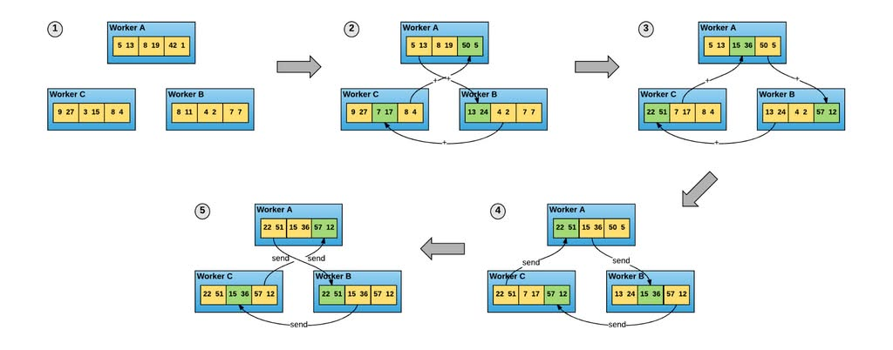{width=62%}

它的巧妙之处在于先**把每张卡的梯度切成 N 块**（N 为卡数），然后分两个阶段沿环传：

- **第一阶段（规约）**：环转 N−1 步，每一步每张卡把手里某一块发给右邻、同时收下左邻发来的另一块并累加。转完一圈后，每张卡上都恰好有**一块**集齐了所有卡的贡献（即那一块的全局和）。
- **第二阶段（分发）**：再沿环传 N−1 步，把这些已经算好的完整块一路传递、覆盖，直到每张卡都集齐全部 N 块的最终结果。

关键的直觉在通信量上。朴素中心做法里，中心卡要收发的数据量随卡数 N **线性增长**，卡越多它越堵。而 ring-allreduce 里，每张卡每一步只收发**一块**（约为总梯度的 1/N），整个过程每张卡收发的数据量近似是“两遍完整梯度”，**与卡数 N 几乎无关**。换句话说，从 2 张卡加到 8 张卡，单卡的通信负担基本不变，没有哪条链路会随规模变堵。这正是它“带宽友好”、能撑起大规模训练的原因。

> 备注：这里说的“每卡通信量与卡数无关”，指的是它不随 N 显著增长（约为 2 倍梯度大小），而不是字面意义上的常数；环越长，传完一圈的**步数**仍随 N 增加，只是每步的数据量同比例变小，两者相抵，总数据量稳住。要点记“带宽不随卡数变堵”即可。

### 4.2.5 把通信藏进计算：分桶与重叠

到这里 DDP 在概念上已经完整：每卡一进程、各算各的、用 ring-allreduce 同步梯度。但要真正跑得快，还有一个工程上的关键设计，否则通信会成为新的拖累。

#### （1）一个朴素实现的浪费

设想最直白的写法：等整个反向传播全部算完，拿到所有层的完整梯度，再一次性发起一场 all-reduce 把它们同步掉。

这么做有两处浪费：

- **算和传完全串行**：反向在算的时候，网络通信空着；通信在传的时候，GPU 算力空着。两件本可以同时干的事，被排成了一队。
- **一次同步一大坨**：把全部梯度攒成一个巨大的消息再发，启动太晚，也不利于通信库流水。

而反向传播有个天然可利用的性质：它是**从最后一层往前**逐层算梯度的。也就是说，靠后的层早早就把梯度算好了，这时靠前的层还没轮到。既然后面层的梯度已经就绪，**为什么要干等前面层全算完才一起传？**

#### （2）分桶 + 重叠：一边算一边传

DDP 的做法是把两件事**重叠**起来[19]：

- **梯度分桶（bucketing）**：把参数按一定顺序分成若干个“桶（bucket）”，每个桶是一组参数的梯度。不再等全部梯度算完，而是**一个桶的梯度凑齐了，就立刻对这个桶发起 all-reduce**。
- **计算与通信重叠（overlap）**：于是出现这样的流水：反向还在往前算着前面那些层的梯度，后面那些已经算好、装满了桶的梯度已经在网络上同步着了。算力和带宽同时在忙，通信被悄悄“藏”进了计算的时间里。

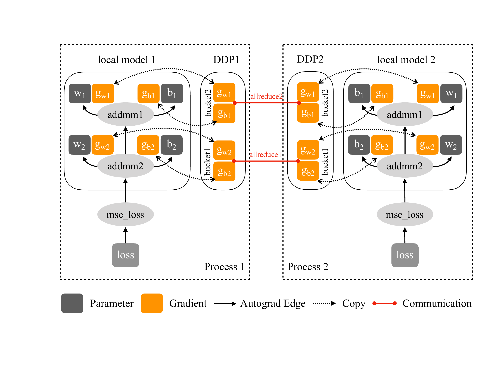{width=80%}

直觉上，理想情况下当最后一个桶（最靠前那些层的梯度）也算完时，前面那些桶的 all-reduce 已经基本传完了。整场梯度同步的时间，被尽可能多地塞进了反向计算的缝隙里，几乎不额外占用墙钟时间。这就是 DDP 能做到“多卡近线性加速”的工程底气。

> 备注：桶的大小是个权衡：桶太小，发起的 all-reduce 次数多、每次启动有固定开销；桶太大，又要等很久才凑齐一桶、重叠的机会变少。框架给了默认桶大小（PyTorch 的 `DistributedDataParallel` 默认 25 MB[19]），一般不用手动调。

### 4.2.6 DDP 的边界：只提速，不省显存

把 DDP 拆到这里，正好回到开篇钉下的那个定位，现在可以理解得更实了。

DDP 让每张卡跑一个独立进程、各持一份**完整**的模型副本。这句话里“完整”二字是关键。每张卡上都实打实地存着：

- 一份完整的**参数**；
- 一份完整的**梯度**；
- 一份完整的**优化器状态**（上一节算过，混合精度 + Adam 下这是最大的一块）。

也就是说，上一节那笔“7B 模型前三类就要 112 GB”的账，在 DDP 下**每张卡都要原样付一遍**。加卡只是让更多数据同时被处理、训练更快，**单卡的显存压力一点没减**。如果一份完整副本本来就装不进单卡，DDP 直接无能为力，它从设计上就只攻“太慢”，不碰“放不下”。

这恰好把两个问题留给了后面：

- 单卡显存还是紧张怎么办？下一节 **4.3 省显存四件套**不加卡、不切模型，直接对四类吃货下手：混合精度、梯度累积、梯度检查点、offload，把单卡能塞下的模型尽量做大。
- 那 N 份被完整复制的参数、梯度、优化器状态，本身就是巨大的浪费，能不能切开？这正是 **4.4 ZeRO / FSDP** 的活：它仍站在数据并行这条轴上，但把这些复制 N 遍的状态**沿各卡切开分摊**，用到哪片聚合哪片，把 DDP 白白复制掉的显存省回来。

省显存的两条路，都是从“DDP 只提速不省显存”这个缺口长出来的。

### 4.2.7 小结

#### （1）核心脉络回顾

本节把数据并行从“一句话思路”落到了“标准实现 DDP”：

- **老 `DataParallel` 的死穴**：单进程多线程被 GIL 串行、所有数据和梯度经主卡中转导致主卡显存与算力双重瓶颈，扩展性差，已被官方弃用。
- **DDP 的翻盘**：每卡一进程、进程对等无主卡，各持完整副本、各算各的数据子集；独立进程各有独立 GIL，多卡才真正并行。
- **梯度同步 = all-reduce**：每张卡都拿到所有卡梯度的同一份平均值，保证副本始终一致；ring-allreduce 用环形传递让通信均摊、单卡通信量不随卡数变堵，带宽友好。
- **工程加速 = 分桶 + 重叠**：一个桶的梯度凑齐就立刻 all-reduce，与还在进行的反向计算重叠，把通信“藏”进计算，逼近线性加速。
- **边界**：每卡仍存整份参数 / 梯度 / 优化器状态，**只提速、不省显存**。

#### （2）关键结论参考表

| 维度 | 要点 |
|------|------|
| DataParallel 为何弃用 | 单进程多线程吃 GIL；主卡聚合致显存/算力瓶颈、负载倾斜 |
| DDP 的架构 | 每卡一进程、对等无主卡、各持完整副本、各算数据子集 |
| 为何能绕开 GIL | 每进程独立解释器、独立 GIL，N 进程在 N 核上真并行 |
| 梯度同步是什么 | all-reduce：各卡梯度求平均，人手一份相同的平均梯度 |
| 为何取平均 | 各卡是大批量的不同子集，平均等价于整批算一次梯度 |
| ring-allreduce 的好处 | 环形传递、无中心；单卡通信量约 2 倍梯度、不随卡数变堵 |
| 加速关键工程 | 梯度分桶 + 计算通信重叠，把同步藏进反向计算 |
| DDP 的定位 | 数据并行轴；只攻“太慢”，每卡仍存整份状态、不省显存 |

> 一句话总结：DDP 用“每卡一进程、各持完整副本、各算数据子集、再用 ring-allreduce 把梯度对齐成同一份平均值”实现数据并行，靠梯度分桶与计算通信重叠逼近线性加速；但每卡仍存整份参数/梯度/优化器状态，**只提速不省显存**，省显存留给后面的四件套与 ZeRO/FSDP。

## 4.3 省显存四件套

### 4.3.1 加卡救不了“放不下”

上一节把 DDP 拆得很透：每张卡起一个独立进程、各持一份**完整**的模型副本、各算各的数据子集，再用 ring-allreduce 把梯度对齐，多卡近线性提速。但它的边界也钉得很死：每张卡都要原样存下整份参数、梯度、优化器状态，**只提速，不省显存**。

这就留下一个尴尬的处境：如果一份完整副本本身就塞不进单卡，加再多卡也没用，每张卡的显存压力纹丝不动。

那“放不下”怎么办？一条路是把模型切开摊到多卡上（后面 4.4、4.5 两节的活）；但在动用多卡分片这种重武器之前，还有一整套**单卡就能用、每张卡都能用**的省显存工具，门槛低、即插即用，往往先把它们用满，问题就解决了一大半。这一节讲的就是这套工具箱里最常用的四件：**混合精度、梯度累积、梯度检查点、offload**。

为什么是这四件、它们各自管用在哪？还是回到 4.1 节立下的那本**显存账本**。训练显存有四类吃货：

- **参数**：模型权重本身；
- **梯度**：反向传播算出来、与参数一一对应；
- **优化器状态**：Adam 的一阶矩、二阶矩，外加混合精度下的 fp32 主副本，前三类里最大的一块；
- **激活值**：前向每一层的中间输出，反向算梯度时要用，随批量和序列长度涨。

这一节的四件套，就是冲着这四类吃货逐个下手的：有的压激活、有的压激活峰值、有的把激活用算力换掉、有的把优化器状态和参数挪走。读每一节时，建议都先问一句：**这一件，打的是四类里的哪一类？**

### 4.3.2 混合精度 AMP：用低精度算、用高精度存

第一件，也是最该默认打开的一件：**混合精度训练（Automatic Mixed Precision，AMP）**。

#### （1）朴素想法与它的两个坑

最朴素的省显存想法是：既然 fp32（单精度，每个数 4 字节）这么占地方，干脆全程换成 fp16（半精度，每个数 2 字节）不就行了？参数、梯度、激活值一律砍半，显存直接对折，前向反向还能用上 GPU 的半精度算力，又快又省。

听上去完美，但真这么干，训练大概率会崩。问题出在 fp16 这个格式本身：它能表示的**数值范围太窄**了。

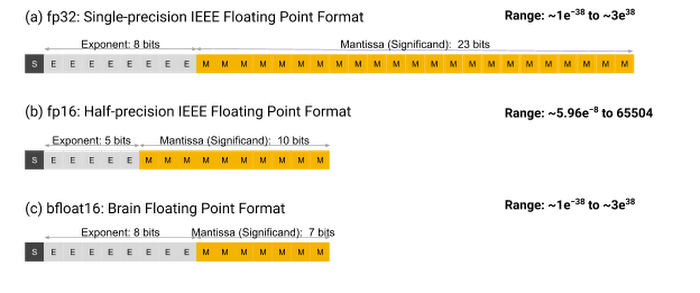{width=92%}

指数位宽决定的是**能表示多小**，而训练里恰好有两个地方会撞上 fp16 那个 $6\times10^{-8}$ 的下限：

- **小梯度下溢**：反向传播算出的梯度经常很小，一旦小过 fp16 能表示的最小值，就被直接四舍五入成 0，梯度没了，这部分参数永远不更新。
- **大小数相加被吃掉**：fp16 尾数只有 10 位，一个大数加一个很小的数，小数可能因为对不齐尾数而被整个忽略。优化器累加动量、参数做微小更新时，这种“加了等于没加”很致命。

直接全 fp16，就是在这两个坑里反复栽跟头。AMP 的设计，正是为了既吃到低精度的省显存与提速，又绕开这两个坑。

#### （2）AMP 的三件配合

AMP 的做法是**该用低精度的地方用低精度、该保高精度的地方保高精度**，三件事配合起来：

- **前向反向用半精度算**：把计算量最大的那些算子（矩阵乘、卷积）放在 fp16/bf16 下做。这一步既省下激活值的显存（激活以半精度存，体积对折），又用上 GPU 的半精度算力，是省与快的主要来源。
- **保留一份 fp32 主副本（master copy）**：优化器手里始终攥着一份高精度的参数副本，每一步参数更新都作用在它身上，半精度副本只是从它派生出来供前向用。这样“微小更新被尾数吃掉”的问题就被挡在 fp32 这一侧。这正是 4.1 节账本里那份 fp32 主副本的来历。
- **loss scaling（损失缩放）对付下溢**：这是专门治 fp16 小梯度下溢的巧招。

loss scaling 的直觉很简单。既然小梯度会下溢到 0，那就在反向传播**之前**，把损失（loss）乘上一个较大的缩放因子 $S$。根据链式法则，所有梯度也会跟着同比例放大 $S$ 倍。本来要下溢成 0 的小梯度，被抬到 fp16 能表示的范围里活了下来。等梯度安全地回到 fp32 这一侧、要拿去更新参数之前，再把它**除以同一个 $S$ 缩回原值**。放大只是为了让它平安穿过 fp16 那段窄路，缩回来保证更新量不变。

> 备注：这里要分清“精度”和“范围”两件事。loss scaling 解决的是**范围**问题（小梯度别下溢到 0），不是精度问题；fp32 主副本解决的是**精度**问题（微小更新别被尾数吃掉）。两件事分别由两个机制兜住，缺一不可。

#### （3）bf16：用精度换范围，省掉 loss scaling

fp16 的麻烦根子在于范围太窄。于是有了另一种半精度格式：**bf16（bfloat16，Brain Floating Point）**[21]，它换了个权衡思路。

回到上面那张图最下面一行：bf16 同样是 16 位、同样每个数 2 字节，但它把位宽**重新分配**了：保留**完整的 8 位指数**（和 fp32 一样宽的动态范围），代价是尾数只剩 7 位（精度比 fp16 的 10 位还低）。

这一换，直接改变了使用体验：

- **范围和 fp32 一样宽**，小梯度基本不会下溢，于是 bf16 训练**通常不需要 loss scaling**，那套放大缩回的机制可以省掉，训练更省心、更稳。
- **精度更低**（尾数 7 位），单个数的有效位数不如 fp16。但神经网络训练对单点精度并不敏感，对数值范围却很敏感，所以这个取舍在实践中非常划算。

> 备注：bf16 不挑数值范围，但要硬件支持：它在较新的 GPU（Ampere 及之后）上才有原生加速；老卡只能用 fp16，那就得老老实实配 loss scaling。一句话经验：硬件支持 bf16 就优先 bf16（省掉 loss scaling、更稳）；只能 fp16 就务必开 loss scaling。

混合精度打的是哪类吃货？主要是**激活值**（半精度存，体积对折）和计算精度。参数和优化器那边因为要保 fp32 主副本，省得有限，省显存的大头落在激活与计算这一侧，附带换来可观的提速。

### 4.3.3 梯度累积：用小批量凑出大批量

第二件，**梯度累积（gradient accumulation）**，专治一个很具体的窘境：你想用大批量训练（大批量往往更稳、更利于收敛），但大批量的激活值塞不进显存。

#### （1）显存峰值是被谁顶起来的

先看清一件事：训练时的**显存峰值，主要由一次前向反向里那批数据的激活值顶起来**。批量越大，同时存在显存里的激活就越多，峰值越高。所以“放不下”常常是**这一批的激活放不下**。

梯度累积的洞察是：大批量之所以“等效”，靠的是它在更新参数前**汇总了足够多样本的梯度**；而样本的梯度是可以**一笔一笔累加**的：分几次算、把梯度加到一起，和一次性算一大批，得到的总梯度是一样的。

#### （2）累积 N 步再更新

于是做法变成这样：把想要的大批量拆成 N 个小批量（micro-batch），然后

- 逐个小批量做前向反向，每次算出的梯度**不立刻更新参数，而是累加**到梯度缓冲里；
- 累加满 N 个小批量后，才用这份累加好的梯度做**一次**参数更新（optimizer step），随后清空缓冲，进入下一轮。

这样 N 个小批量合起来，在数学上等效于一个 N 倍大的批量做了一次更新。

关键在显存峰值：**任一时刻，显存里只装着一个小批量的激活**：前一个小批量反向算完、梯度累加进缓冲后，它的激活就释放了，下一个小批量才进来。于是峰值由**单个小批量**决定，而不是那个等效大批量。梯度缓冲只和参数量一样大、是固定开销，不随累积步数 N 涨。

> 备注：梯度累积省的是**激活峰值**，代价是**时间**：同样多的数据要串行算 N 趟，吞吐变低。它不像 DDP 那样靠多卡并行换吞吐，而是单卡上拿时间换“能跑大批量”。另外它和 DDP 可以叠加：DDP 切数据、梯度累积在每张卡内再凑大批量，但要注意累积过程中先别每步都 all-reduce，攒到要更新那一步再同步，免得白费通信。

梯度累积打的是哪类吃货？精确地说，是**激活值的峰值**：它不减少单批的激活，而是让你用“装得下的小批量”凑出“装不下的大批量”的训练效果。

### 4.3.4 梯度检查点：反向时按需重算激活

第三件，**梯度检查点（gradient checkpointing，也叫 activation checkpointing）**[22]，直接冲着激活值这块最大的可压缩项下手，思路是**用算力换显存**。

#### （1）激活为什么非存不可

先看清激活值的开销从哪来。反向传播算某一层的梯度时，需要用到这一层前向时的中间结果（输入、激活）。所以标准训练里，前向**每一层的中间激活都得先存着**，一直留到反向用完，层数越深，攒下的激活越多，这往往是长序列、深网络里显存的最大头。

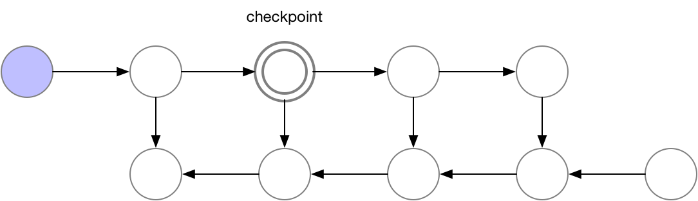{width=88%}

图上那条长链就是一次前向：每个节点是一层的中间输出。标准训练里这一整条都得留着等反向来取，链有多长、显存就压多少。图里只有双圈那几个节点是被保留的检查点，其余单圈节点算完就丢，**丢掉的部分才是这一招省下来的显存**。

#### （2）只存少量检查点，其余反向时重算

梯度检查点的做法是：前向时**不再保存所有层的激活**，只在少数选定的位置（上图的双圈“检查点”节点）留下激活，其余中间激活**算完即扔**。

到了反向传播，轮到某个被扔掉激活的区段时，就**从最近的那个检查点出发，把这一小段前向重新算一遍**，临时把需要的激活补出来，用完再扔。

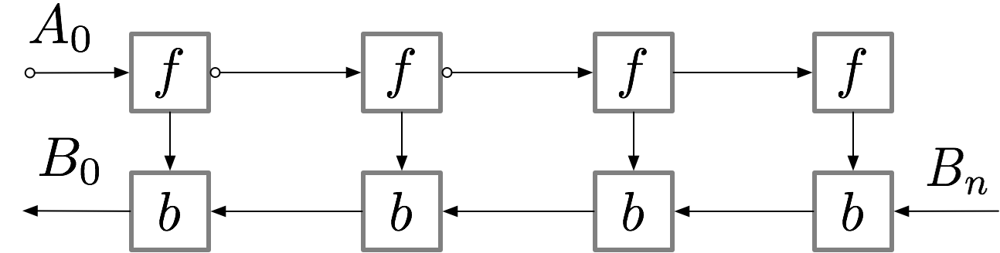{width=92%}

代价一目了然：**多做了一遍（局部的）前向计算**。省显存靠的就是“不全程存激活，需要时重算”，重算就是额外的算力开销。

#### （3）$\sqrt{N}$ 的甜点

那省多少、亏多少？有一个很经典的结论[22]：如果把一个 N 层（或 N 段）的网络，**每隔 $\sqrt{N}$ 层放一个检查点**，可以把激活的显存占用从正比于 $N$ 压到正比于 $\sqrt{N}$，而额外的前向重算大约只多花一倍前向的算力。

直觉上，检查点之间的段越长，存的检查点越少（越省显存），但反向时每段要重算的也越长（越费算力）；检查点越密则反过来。$\sqrt{N}$ 是这两者的平衡甜点：显存降到 $\sqrt{N}$ 量级、算力只多约一遍前向。对深而长的模型（Transformer 尤其典型），这是个极高性价比的交换。

> 备注：梯度检查点和混合精度、梯度累积可以**叠加使用**，它们打的是激活的不同侧面（精度 / 峰值 / 是否驻留）。框架里通常一个开关就能打开（如对 Transformer 的每个 block 包一层 checkpoint），是把单卡能塞下的模型做大的常用手段。

梯度检查点打的是哪类吃货？纯粹是**激活值**，而且是把它从“全程驻留”换成“按需重算”，用算力把这块显存换掉。

### 4.3.5 CPU / NVMe offload：把暂时不用的搬下卡

前面三件，混合精度和梯度检查点主要压**激活**，梯度累积压**激活峰值**。但 4.1 节那本账里最大的一块：**优化器状态（84 GB 那个大头）**和参数本身，前三件几乎没碰。第四件 **offload（卸载）** 就是冲着它们去的。

#### （1）显存紧、内存盘很宽

offload 的出发点是一个朴素的不平衡：GPU 显存又贵又小（单卡几十 GB），而 CPU 内存通常宽得多（几百 GB 很常见），NVMe 固态盘更是论 TB 算。既然如此，那些**当下这一刻用不到**的东西，为什么非要一直占着金贵的显存？

哪些东西是“当下用不到”的？最典型的就是优化器状态和部分参数：

- **优化器状态**只在**参数更新那一刻**才用到：前向和反向的整个过程里，Adam 的一阶矩、二阶矩、fp32 主副本都只是躺在显存里等着，纯属占着茅坑。
- **参数**也类似：一个深层网络前向走到第 10 层时，第 50 层的参数这会儿根本用不上。

#### （2）用到再取回

offload 的做法就顺理成章：把这些暂时不用的优化器状态、参数**搬到 CPU 内存或 NVMe 盘上**，给显存腾地方；等真正要用它们时（比如参数更新那一步要优化器状态了），再**临时取回**显存，用完可以再放下去。极端情况下，连参数更新这步计算本身都可以挪到 CPU 上做，让优化器状态压根不必上卡。

这一招的省显存力度可以非常大：把 84 GB 的优化器状态整个挪下卡，单卡显存一下宽松一大截，原本死活塞不进的模型可能就跑起来了。

代价也很直接：**搬运要走 PCIe 总线（卡和内存之间）或盘的读写带宽**，这些通道比显存内部带宽慢得多。数据在显存和 CPU/盘之间来回搬，会拖慢每一步训练。所以 offload 是典型的**用带宽（和时间）换显存**：显存实在不够、宁可慢也要先跑起来时才上；显存够用时不必自找这份开销。框架会尽量把搬运和计算重叠起来藏掉一部分延迟，但带宽这道坎是省不掉的。

> 备注：offload 解决的是优化器状态/参数“放不下”，靠的是把它们挪出显存。这和后面 4.4 节 ZeRO 的思路（把这些状态沿多卡切开分摊）其实是同一类问题的两种解法：一个往**纵向**挪（搬到 CPU/盘），一个往**横向**切（分摊到多卡）。事实上 offload 正是 DeepSpeed ZeRO 体系里的一个组成部分（ZeRO-Offload / ZeRO-Infinity），下一节会把它放回 ZeRO 的全景里看。

offload 打的是哪类吃货？是前三件几乎没碰的两块：**优化器状态和参数**，代价是 PCIe / 盘的搬运带宽。

### 4.3.6 四件套对账：各打哪类吃货

把四件套放回 4.1 节的显存账本上，每一件的“打击目标”和“代价”就一清二楚了：

| 工具 | 主要打哪类吃货 | 代价 |
|------|----------------|------|
| 混合精度 AMP | 激活值 + 计算精度（半精度存算） | 精度（靠 fp32 主副本 + loss scaling / bf16 兜住） |
| 梯度累积 | 激活峰值（小批量凑大批量） | 时间（同样数据串行多算 N 趟） |
| 梯度检查点 | 激活值（不全程存、反向重算） | 算力（多约一遍前向，$\sqrt N$ 甜点） |
| CPU / NVMe offload | 优化器状态 + 参数（搬下卡） | 带宽（PCIe / 盘读写，更慢） |


读这张表的关键，是看它们**覆盖了不同的吃货**：混合精度和梯度检查点主攻激活，梯度累积管激活峰值，offload 则补上前三件没碰的优化器状态和参数。所以它们可以**层层叠加**：一份单卡训练里同时开混合精度、梯度检查点、梯度累积，再视情况加 offload，是把单卡能塞下的模型做到最大的常规组合拳。它们共同的特点是：**不切模型、不靠多卡，单卡或每张卡上原地就能用**，门槛低、收益直接，往往先把这套用满，“放不下”就缓解了大半。

但四件套也有它的天花板。混合精度、检查点、累积压的都是激活那一侧；offload 虽然能搬走优化器状态，可一旦搬运量太大，PCIe / 盘带宽就成了瓶颈，慢到不可接受。当一份完整副本里的参数、梯度、优化器状态实在大到连“挪”都挪不动时，就该换思路了：既然有 N 张卡，与其每张都存一整份再各自想办法压，不如干脆把这一整份**沿多卡切开分摊**，谁都不存全份。这正是下一节 **ZeRO / FSDP** 的主场；而 offload 把状态“往卡外挪”的思路，也会作为 ZeRO 的一个组成部分，在那里和“沿卡切开”合流。

### 4.3.7 小结

#### （1）核心脉络回顾

DDP 只提速不省显存，于是这一节转向**单卡、每卡都能用**的四件省显存工具，逐个对着 4.1 节那四类显存吃货下手：

- **混合精度 AMP**：前向反向用 fp16/bf16 算、保留 fp32 主副本、用 loss scaling 防小梯度下溢；bf16 用精度换范围、通常省掉 loss scaling。主要压**激活**与计算精度。
- **梯度累积**：小批量累积 N 步梯度再更新一次，等效大批量而显存峰值只由单个小批量决定。压的是**激活峰值**，代价是时间。
- **梯度检查点**：前向只存少量检查点激活，反向按需重算中间激活，$\sqrt N$ 布点可把激活显存压到 $\sqrt N$ 量级、只多约一遍前向。压**激活**，代价是算力。
- **CPU / NVMe offload**：把暂时不用的优化器状态、参数搬到内存或盘、用到再取回。补打前三件没碰的**优化器状态与参数**，代价是 PCIe / 盘带宽。

四件可层层叠加，门槛低、即插即用；但都绕不开“激活/搬运”这一侧的物理上限，真正的大模型最终要靠把状态**沿多卡切开**。

#### （2）关键结论参考表

| 维度 | 要点 |
|------|------|
| 四件套共同特点 | 不切模型、不靠多卡，单卡/每卡原地可用，可层层叠加 |
| 混合精度 AMP | 半精度算 + fp32 主副本 + loss scaling；范围归 loss scaling、精度归主副本 |
| fp16 vs bf16 | fp16 范围窄需 loss scaling；bf16 范围同 fp32、通常免 loss scaling，但要新硬件 |
| 梯度累积 | 累积 N 步再 step，等效大批量；峰值由单个小批量决定，省激活峰值、费时间 |
| 梯度检查点 | 前向存少量检查点、反向重算；$\sqrt N$ 布点→激活降到 $\sqrt N$、多约一遍前向 |
| offload | 优化器状态/参数搬到 CPU/NVMe、用到再取回；省显存大、代价是搬运带宽 |
| 四件套天花板 | 主压激活与搬运一侧；超大模型需把状态沿多卡切开（下一节 ZeRO/FSDP） |

> 一句话总结：省显存四件套不切模型、不加卡，逐个击破四类显存吃货：混合精度（半精度算+fp32 主副本+loss scaling，压激活与精度）、梯度累积（小批量凑大批量，压激活峰值）、梯度检查点（反向重算，$\sqrt N$ 换激活）、offload（优化器状态/参数搬下卡，换带宽），可层层叠加用满单卡，再大就交给下一节沿多卡切开的 ZeRO/FSDP。

## 4.4 ZeRO 与 FSDP

### 4.4.1 DDP 里那 N 份冗余复制

数据并行这条轴上，DDP 是最干净的一格：N 张卡、各起一个进程、各持一份**完整**的模型副本，各算各的数据子集，再用 ring-allreduce 把梯度对齐。它把“太慢”那堵墙拆得很漂亮，却把“放不下”原封不动留在了原地：每张卡都得实打实地扛下一整份参数、一整份梯度、一整份优化器状态。

盯住“各持一份完整副本”这句话，会发现一件浪费得刺眼的事：**这 N 份副本几乎一模一样。**

- 参数：N 张卡上是同一份权重，复制了 N 遍；
- 优化器状态：每一步 all-reduce 后梯度对齐、起点相同，于是各卡的 Adam 一阶矩、二阶矩、fp32 主副本也几乎完全一致，又复制了 N 遍；
- 梯度：all-reduce 之后人手一份相同的平均梯度，还是复制了 N 遍。

也就是说，4.1 节那笔“7B 模型前三类就要 112 GB”的账，DDP 下**每张卡都要原样付一遍**，而且付的还是**同一份内容**。加到 8 张卡，这份内容就在显存里躺了 8 个一模一样的拷贝。这不是必需的并行开销，纯粹是冗余。

ZeRO（Zero Redundancy Optimizer，零冗余优化器）的核心想法，一句话就能说清：**既然这 N 份是重复的，那就别让每张卡都存全份，把它沿 N 张卡切开，每张卡只存 1/N；真要用到完整的一份时，临时把各卡那 1/N 拼回来用，用完即扔。**

这一招的精妙在于它**仍站在数据并行这条轴上**：还是 N 张卡各算各的数据子集，还是 all-reduce 那一套通信骨架，模型本身没有被切成几段塞到不同卡（那是后面 4.5 节张量 / 流水线并行的活）。它动的只是“每张卡到底要不要存全份冗余状态”这一件事。所以可以把 ZeRO 理解成“**给 DDP 做减法**”：DDP 是 ZeRO 的零分片版本，ZeRO 在它之上一层层把冗余切掉。

> 备注：上一节 offload 把“暂时用不到的状态搬下卡”称作往**纵向**挪；ZeRO 这里是往**横向**切：同一批冗余状态，offload 把它挪到 CPU/盘，ZeRO 把它分摊到各卡。两者其实是 DeepSpeed ZeRO 体系里互补的两条腿，本节先讲“横向切”。

### 4.4.2 怎么切：先讲清“分片 + 临时拼回”

在分阶段之前，先把 ZeRO 反复要用的那个动作讲透，后面三个阶段都是它的复用。

切开很好理解：一份完整的状态（比如全部优化器状态），按某种顺序均匀分成 N 段，第 $i$ 张卡只保管第 $i$ 段，其余 N−1 段它根本不存。光看保管，每张卡的这块显存立刻降到原来的 1/N。

麻烦在“真要用整份时怎么办”。训练里总有些时刻需要完整的一份，比如前向计算某一层，得有这一层**完整**的参数才能算。这时 ZeRO 的做法是：**临时把各卡手里那一片对应的状态广播汇集起来，在每张卡上拼出当下需要的完整一份，算完立刻把不属于自己那片的部分丢掉**，显存重新回落。

“每张卡都把自己那一片发出去、最终每张卡都集齐完整一份”，这个集合通信操作叫 **all-gather（全收集）**[23]。它和 DDP 的 all-reduce 是一对近亲：all-reduce 是把各卡的数据**规约**（求和/平均）成同一份，all-gather 是把各卡的分片**拼接**成同一份完整体，不做求和。

{width=96%}

记住这张图里的两个操作，后面三个阶段就是它们的不同组合：

- **all-gather**：用到完整参数时，把各卡的参数分片拼回来。
- **reduce-scatter（规约-散射）**：DDP 的 all-reduce 其实可以拆成两步：先 reduce-scatter（各卡只拿到自己负责那一片的规约后梯度），再 all-gather（把各片拼成完整梯度）。梯度本来就要分片存时，第二步 all-gather 干脆不做，reduce-scatter 完每张卡正好留下自己那一片规约好的梯度。

下面三个阶段，就是按“优化器状态 → 梯度 → 参数”的顺序，一层层把这套切法用上去。

### 4.4.3 ZeRO Stage 1：先切最大的那块（优化器状态）

切谁先切？回到 4.1 节的账本：混合精度 + Adam 下，**优化器状态是前三类里最大的一块**。

把一个参数量为 $\Psi$ 的模型摊开（以下都按每个参数算）：

| 这一类状态 | 每参数字节 | 说明 |
|------|------|------|
| 参数（半精度） | 2 | 前向反向用的 fp16/bf16 权重 |
| 梯度（半精度） | 2 | 与参数一一对应 |
| 优化器状态 $K$ | 12 | fp32 主副本 4 + Adam 一阶矩 4 + 二阶矩 4 |


合计每参数 $2+2+K = 16$ 字节（$K=12$ 是混合精度 Adam 的标准口径，下同）。能看出优化器状态那 12 字节占了 3/4，**先切它，省得最多**。

Stage 1（记作 $P_{os}$，os = optimizer states）就只切这一块：把那 12 字节/参数的优化器状态沿 N 张卡均分，每张卡只存 1/N。参数和梯度仍各存整份不动。

为什么先动它还有一个好处：**通信几乎不增**。优化器状态只在**参数更新那一刻**才用到，前向、反向全程它都躺着没事。于是切了它不影响前向反向的任何通信；只在更新参数时，每张卡用自己那 1/N 的优化器状态更新对应的 1/N 参数，再把更新后的参数分片 all-gather 给大家。这一步 all-gather 的通信量和 DDP 原本的 all-reduce 是**同一量级**（都约等于 2 倍参数大小走一遍）。

> 备注：直觉上 Stage 1 是“白捡”的：优化器状态是最大的吃货，切它省最多，而它平时又不参与通信，切了几乎不增加通信开销。所以即便不追求极致省显存，开 Stage 1 往往也是稳赚的第一步。

记每卡显存：参数 2、梯度 2 不动，优化器状态从 12 降到 $K/N_d$（$N_d$ 是数据并行度，即卡数）。每卡约

$$
2\Psi + 2\Psi + \frac{K\Psi}{N_d} = \left(4 + \frac{K}{N_d}\right)\Psi \;\text{字节}.
$$

卡多时这一项趋近于 0，每卡从 $16\Psi$ 直奔 $4\Psi$。

### 4.4.4 ZeRO Stage 2：再切梯度

Stage 1 之后，每张卡仍存着一整份梯度，但仔细想想，这份完整梯度其实也用不全。

更新参数时，第 $i$ 张卡只负责更新它那 1/N 的参数（因为它只持有对应的 1/N 优化器状态）。既然它只更新这一片，它**真正需要的也只是这一片对应的梯度**，其余 N−1 片梯度对它毫无用处，留着纯属冗余。

Stage 2（记作 $P_{os+g}$，在 Stage 1 基础上再加 g = gradients）就把梯度也切了：每张卡只保留**它负责那一片参数**对应的梯度。

实现上正好接住第 4.4.2 小节那个 reduce-scatter：反向算完梯度，本来 DDP 要做一次 all-reduce 让人手一份完整平均梯度；现在改成 **reduce-scatter**：梯度规约后，每张卡只收下自己负责那一片的规约结果，其余直接丢掉。少做了 all-reduce 后半段的 all-gather，所以**通信量和 DDP 仍是同一量级**，没有变大。

记每卡显存：参数 2 不动，梯度和优化器状态都降到 1/N。每卡约

$$
2\Psi + \frac{(2+K)\Psi}{N_d} = \left(2 + \frac{2+K}{N_d}\right)\Psi \;\text{字节}.
$$

卡多时趋近 $2\Psi$，只剩那份半精度参数没切。

### 4.4.5 ZeRO Stage 3：连参数本身也切

到 Stage 2，每张卡还剩最后一份没切的东西：那 2 字节/参数的半精度参数本身。它没法像优化器状态那样“平时不用”：前向、反向每一层都要用到对应层的完整参数。这正是切它最难、收益也最大的一块。

Stage 3（记作 $P_{os+g+p}$，再加 p = parameters）把参数也沿各卡切开：每张卡平时只保管 1/N 的参数。那前向反向怎么用？靠的就是第 4.4.2 小节那个“临时拼回、用完即弃”：

- **前向**走到某一层，就对**这一层**的参数发起 all-gather，把各卡的分片临时拼成这层完整的参数，算完这层的输出，**立刻把不属于自己那片的参数丢掉**，显存回落，再走下一层；
- **反向**同理，要算某层梯度时再 all-gather 一次该层的完整参数，算完即弃。

关键直觉是**“按层、按需、用完即弃”**：任一时刻显存里只临时驻留**正在算的那一层**的完整参数，而不是整个模型的完整参数。模型再大，单层总是小的，于是参数这块显存也压到了 1/N 量级（加上某一层的临时峰值）。

代价是通信变多了。参数在前向被 all-gather 一遍、反向又被 all-gather 一遍，再加上梯度的 reduce-scatter，总通信量约为 DDP 的 **1.5 倍**。换来的是显存的彻底分片：三类状态全切，每卡约

$$
\frac{(2+2+K)\Psi}{N_d} = \frac{(4+K)\Psi}{N_d}\;\text{字节},
$$

也就是把基线那 $16\Psi$ 整个除以卡数。下面这张图把三个阶段并排画在一起，能一眼看清“切得越多、每卡那根柱子越矮”。

{width=98%}

> 备注：ZeRO 论文[17]给的直觉例子：一个 7.5B 参数的模型，混合精度 Adam 下基线每卡约 $(4+12)\times 7.5\text{B} \approx 120\,\text{GB}$，单卡根本放不下；用 Stage 3 摊到 $N_d=64$ 张卡，每卡那一份分片状态降到约 $120/64 \approx 1.9\,\text{GB}$。数量级上看，分片把“放不下”直接变成了“绰绰有余”。记住趋势即可：阶段越高、卡越多，每卡那根柱子越矮。

### 4.4.6 显存与通信的权衡

把三个阶段对着 DDP 摆在一起，规律非常清爽：**阶段越高，越省显存，但通信量越大。**

| 方案 | 每卡显存（字节） | 通信量 vs DDP |
|------|------|------|
| DDP（Stage 0） | $(4+K)\Psi$ | 基准（一次 all-reduce，约 2 倍梯度） |
| Stage 1 $P_{os}$ | $\left(4+\dfrac{K}{N_d}\right)\Psi$ | 同量级 |
| Stage 2 $P_{os+g}$ | $\left(2+\dfrac{2+K}{N_d}\right)\Psi$ | 同量级 |
| Stage 3 $P_{os+g+p}$ | $\dfrac{(4+K)\Psi}{N_d}$ | 约 1.5 倍 |


读这张表的关键有三点：

- **Stage 1/2 是几乎白赚的省。** 它们的通信量和 DDP 同量级（不显著增加），却把每卡显存从 $16\Psi$ 一路压到趋近 $2\Psi$。所以只要在用 DDP，开到 Stage 2 通常是默认值得做的。
- **Stage 3 用 1.5 倍通信换“完全分片”。** 它把每卡显存压成 $(4+K)\Psi/N_d$，卡越多越省，理论上能靠堆卡装下任意大的模型。代价是参数要前向反向各 all-gather 一遍，通信约 1.5 倍。当模型大到 Stage 2 都装不下时才动用它。
- **省显存的来源是“分摊”，不是“消失”。** 那 $16\Psi$ 字节并没有变少，只是从“每卡各存一份”摊成了“N 张卡合起来存一份”。所以 ZeRO 省的是**单卡**显存，总显存占用没降。这和 DDP“加卡不省单卡显存”正好相反：ZeRO 是“加卡就摊薄单卡显存”。

> 备注：这里 $K=12$、参数/梯度各 2 字节，都是**混合精度 Adam** 这一标准口径下的数字，也是论文图里 $(4+K)$ 那个 4 的来历（参数 2 + 梯度 2）。换优化器或换精度，系数会变，但“阶段越高越省、Stage1/2 不增通信、Stage3 约 1.5 倍通信”这套定性结论不变。

### 4.4.7 FSDP：PyTorch 原生的 ZeRO-3

ZeRO 最初是 DeepSpeed（微软）那套库里的实现。PyTorch 后来把同一思路做成了**原生**功能：**FSDP（Fully Sharded Data Parallel，完全分片数据并行）**[23]。名字里的“Fully Sharded”就是 ZeRO Stage 3 的精神：参数、梯度、优化器状态**全部分片**，每张卡只存 1/N。

所以可以一句话对上号：**FSDP 约等于 PyTorch 原生的 ZeRO-3，同一思路、不同实现。** 它的工作流和第 4.4.2 小节讲的完全一致：平时各卡只持分片，前向/反向按需 all-gather 拼出当前要用的那部分参数、算完即弃，梯度用 reduce-scatter 规约后直接切片落回各卡。

{width=98%}

FSDP 还有个实用的灵活点：分片的程度可以调。把分片范围收窄（只切优化器状态和梯度、参数在每张卡上保留完整一份），它的行为就退化成 **ZeRO Stage 2** 那一档（PyTorch 里对应 `SHARD_GRAD_OP` 这类策略）；放到完全分片就是 Stage 3。FSDP 因此能在 Stage 2/3 之间按显存与通信的权衡取舍。

> 备注：DeepSpeed ZeRO 和 PyTorch FSDP 解决的是同一个问题、给的是同一类答案，差别主要在工程实现与生态（配置方式、与 offload/混合精度的衔接、和训练框架的集成）。4.6 节的实战里会看到，在 Lightning 里 `strategy="fsdp"` 和 `strategy="deepspeed"` 就是这两条路的入口，底层都是“沿数据并行各卡切开冗余状态”这同一件事。

### 4.4.8 和 DDP 的对照：同一条轴，复制 vs 分片

绕了一圈，回到这条数据并行轴本身。DDP 和 ZeRO/FSDP 站在**同一条轴**上（都是 N 张卡各算各的数据子集、靠集合通信对齐），它们真正的分水岭只有一个词：**对那份冗余状态，是复制，还是分片。**

| 维度 | DDP（ZeRO Stage 0） | ZeRO / FSDP |
|------|------|------|
| 所在轴 | 数据并行 | 数据并行（同一条轴） |
| 对状态的处理 | 每卡复制整份 | 沿各卡分片，每卡存 1/N |
| 参数/梯度/优化器 | 三者都各存整份 | 按阶段逐层切（Stage 1/2/3） |
| 用完整状态时 | 本来就在手边 | 临时 all-gather 拼回、用完即弃 |
| 加卡的效果 | 提速，单卡显存不变 | 提速 + 单卡显存摊薄 |
| 通信量 | 基准（all-reduce，约 2 倍梯度） | Stage1/2 同量级；Stage3 约 1.5 倍 |
| 一句话定位 | 数据并行最干净的基线 | 给 DDP 做减法，切掉 N 份冗余 |


把这张表读顺，数据并行这条轴的故事就闭环了：4.2 节的 DDP 是这条轴的起点，用“复制整份”换来最简单的近线性提速；ZeRO/FSDP 是这条轴的终点，用“分片 + 临时拼回”把 DDP 复制掉的 N 份冗余一层层切回来，让单卡显存随卡数摊薄。两者是同一条轴上“零分片”到“完全分片”的两端，DDP 就是 ZeRO 的 Stage 0。

到这里，数据并行轴能做的省显存已经做到了头：它能把**复制的冗余**切干净，却切不动模型本身：前向某一层那份临时拼出来的完整参数、那一层的激活，终究要落在一张卡上。如果**单独一层**就已经大到一张卡放不下，分片冗余也救不了。那就得离开数据并行这条轴，转到另一条正交轴上，把**模型本身**切开摊到多卡——这正是下一节 **张量并行 / 流水线并行** 的主场。

### 4.4.9 小结

#### （1）核心脉络回顾

本节把数据并行轴上“省显存”这件事做到了头：

- **出发点**：DDP 每卡各存一份完整副本，而这 N 份参数/梯度/优化器状态几乎一模一样，是纯冗余复制。
- **ZeRO 的核心动作**：把这份冗余状态沿 N 张卡**分片**（每卡只存 1/N），真要用整份时临时 **all-gather** 拼回、用完即弃；梯度同步用 **reduce-scatter** 直接切片落卡。
- **三个阶段（逐层切）**：Stage 1 切优化器状态（最大的一块，通信几乎不增）→ Stage 2 再切梯度（reduce-scatter，通信仍同量级）→ Stage 3 连参数也切（前向反向按层 all-gather、约 1.5 倍通信）。
- **权衡**：阶段越高越省显存、通信越大；Stage 1/2 近乎白赚，Stage 3 用 1.5 倍通信换完全分片，每卡显存 $(4+K)\Psi/N_d$，靠堆卡装下任意大模型。
- **FSDP**：PyTorch 原生的 ZeRO-3，同思路不同实现，还能退化到 Stage 2 一档。
- **与 DDP 对照**：同在数据并行轴，分水岭是“复制 vs 分片”，DDP = ZeRO Stage 0。

#### （2）关键结论参考表

| 维度 | 要点 |
|------|------|
| ZeRO 解决什么 | DDP 每卡复制整份状态，N 份冗余；把它沿各卡分片，每卡只存 1/N |
| 核心通信动作 | all-gather 临时拼回完整参数（用完即弃）；reduce-scatter 把梯度规约后切片落卡 |
| Stage 1（$P_{os}$） | 切优化器状态（最大块、平时不用），每卡 $(4+K/N_d)\Psi$，通信同量级 |
| Stage 2（$P_{os+g}$） | 再切梯度，每卡 $(2+(2+K)/N_d)\Psi$，reduce-scatter，通信同量级 |
| Stage 3（$P_{os+g+p}$） | 连参数也切，按层 all-gather 用完即弃，每卡 $(4+K)\Psi/N_d$，约 1.5 倍通信 |
| 口径 | $K{=}12$（混合精度 Adam）、参数/梯度各 2 字节；基线 $(4+K)\Psi=16\Psi$ |
| FSDP | PyTorch 原生 ZeRO-3，完全分片；可退化到 Stage 2 行为 |
| 与 DDP 关系 | 同数据并行轴，复制 vs 分片；DDP 即 ZeRO Stage 0 |
| 轴的边界 | 切得了冗余复制，切不动模型本身；单层放不下要转张量/流水线并行 |

> 一句话总结：ZeRO 把 DDP 里复制了 N 遍的参数/梯度/优化器状态沿各卡分片、每卡只存 1/N，用完整状态时临时 all-gather 拼回、用完即弃，按“优化器状态→梯度→参数”分三阶段逐层切（Stage1/2 不增通信、Stage3 约 1.5 倍换完全分片）；FSDP 是它的 PyTorch 原生版（ZeRO-3）。DDP 即 ZeRO Stage 0，分水岭只在“复制 vs 分片”，而切不动模型本身这件事，要交给下一节的张量/流水线并行。

## 4.5 模型并行：张量与流水线

### 4.5.1 当单层本身都放不下时

前面整条数据并行轴，从 DDP 到 ZeRO/FSDP，干的都是同一类事：要么把模型**复制**到每张卡，要么把那份冗余的参数/梯度/优化器状态沿各卡**分片**。但不管复制还是分片，有一条共同的底线始终没被突破——**每张卡都还能完整地跑一次前向**。FSDP 哪怕把参数切成 1/N，前向走到某一层时，也总能临时 all-gather 把**这一层完整的权重**拼回到一张卡上，算完即弃。它的前提是：单独一层，一张卡装得下。

这条底线一旦破了，数据并行就彻底没招了。设想一层就是一个巨大的权重矩阵，大到它自己（再加上算它时的激活）就已经超过一张卡的显存——这时 all-gather 想拼也拼不出来，因为拼出来的完整一层根本落不进任何一张卡。分片冗余救得了“重复存了 N 份”，救不了“单独一份就放不下”。

唯一的出路，是换一条和数据并行**正交**的轴：不再让每张卡各持一个能独立跑完的模型，而是把**模型本身**切开，一张卡只放模型的一部分，几张卡合起来才凑成一个完整的网络跑一次前向。这条轴叫**模型并行**。

> 备注：先把定位说清楚——这是**进阶 / 边界**内容。模型并行是几十上百 B 的超大模型训练才真正要动用的重武器；VLA 当前这点规模（通常 $\le$ 7B），用上一节的 ZeRO/FSDP 加上省显存四件套基本就够了，**大概率用不到**张量并行 / 流水线并行。本节的目的是让你懂它的原理，更要懂它的**边界**——到底什么时候才轮得到它上场（见第 4.5.5 小节）。

把“切开模型”这件事再拆细，有两种切法，对应本节的两个主角：

- **沿层内切**——把单独一层那个大矩阵横切到多卡，这是**张量并行**（第 4.5.2 小节）；
- **沿层间切**——把整个网络的层序列纵切成几段、每段一张卡，这是**流水线并行**（第 4.5.3 小节）。

### 4.5.2 张量并行：把一层横切开

张量并行（Tensor Parallelism，TP）针对的就是“单独一层太大”这个最棘手的情形。它的思路非常直接：既然一层就是一次大矩阵乘 $Y = XA$，那就把权重矩阵 $A$ 切成几块，分给几张卡，每张卡只算其中一块，最后把各块结果拼起来，等价于算了完整的一层。它最早在 Megatron-LM[24] 里把 Transformer 的两个核心子层（MLP 与注意力）切开，所以常被叫作 **Megatron 式**张量并行。

#### （1）MLP：按列切权重，各算一块再拼

拿 Transformer 里的 MLP 子层举例，它是两个连续的矩阵乘：先 $XA$ 过一个 GeLU 激活，再乘 $B$（这里的 $A$、$B$ 沿用 Megatron 原图的记号，指 MLP 自己那两个权重矩阵，和 3.3 节 LoRA 的低秩矩阵 $A$、$B$ 只是重名）。关键的切法是把第一个权重矩阵 $A$ **按列**切成 $[A_1, A_2]$，分给两张卡：

- 卡 1 算 $XA_1$，卡 2 算 $XA_2$——两张卡各自拿到完整的输入 $X$（输入不切），各算出输出的一半列；
- GeLU 是逐元素的，对半列各自做即可，互不影响，**不需要任何通信**；
- 第二个矩阵 $B$ 配合着**按行**切成 $\begin{bmatrix} B_1 \\ B_2 \end{bmatrix}$，卡 1 算 $Y_1 B_1$、卡 2 算 $Y_2 B_2$，两张卡各得一个部分和；
- 最后把两个部分和**加起来**才是完整输出——这一步求和，就是各卡之间的一次通信。

{width=92%}

这个“列切 + 行切”的搭配很巧妙：列切让中间结果天然分成两半各算各的，行切让末尾恰好是两个部分和相加。于是整个 MLP 子层下来，前向**只在最后汇总时通信一次**，中间的激活、GeLU 全程不通信。

> 备注：图里的 $f$ 和 $g$ 是一对共轭算子。前向时 $f$ 是直接拷贝（把 $X$ 复制给两路）、$g$ 是 all-reduce（把两个部分和求和）；反向时正好反过来——$g$ 变成拷贝、$f$ 变成 all-reduce 汇总两路回传的梯度。直觉记住即可：**前向在出口 all-reduce 一次，反向在入口 all-reduce 一次**。

#### （2）注意力：天然按头切

注意力子层切起来更自然，因为多头注意力本来就是**多个头各算各的**。Megatron 直接把不同的注意力头分到不同卡：卡 1 拿一部分头的 $Q_1, K_1, V_1$、卡 2 拿另一部分头的 $Q_2, K_2, V_2$，各自独立地算完自己那几个头的注意力，最后同样靠输出投影那一步把各卡结果汇总。

{width=92%}

切法和 MLP 是同一个模子：中间各算各的不通信，出口 all-reduce 汇总一次。

#### （3）张量并行的代价：通信极频繁，实践中留在机内

把上面两个子层的直觉合起来：张量并行是**层内横切**——同一层被几张卡分着算，最后拼回。它的特点也就此注定：

- **通信发生在层内、极其频繁。** 每一个 Transformer 块（一个注意力子层 + 一个 MLP 子层）前向就要 all-reduce 两次，反向再两次。模型有几十层，一次前向反向就是上百次跨卡 all-reduce，而且**夹在计算关键路径上**——下一步算什么，得等这一次 all-reduce 的结果。
- **要求极高带宽，实践中优先放在机内。** 正因为通信又频繁又卡在关键路径上，张量并行对卡间带宽极度敏感，所以工程上一般把一个 TP 组放在**同一台机器内**靠 **NVLink**（或 NVSwitch）直连的几张卡之间。这是效率取舍，不是算法硬限制：跨节点 TP 是可以跑的，只是对互联带宽和延迟要求很高，需要拓扑感知的通信编排，在高速 InfiniBand / NVSwitch 集群上才比较现实，通常效率也低于机内。

所以实践中张量并行的并行度通常**取到单机的卡数**（比如一机 8 卡就设 TP=8），把它当“机内”的并行手段用。要跨机扩展，主力交给下一个主角。

### 4.5.3 流水线并行：把层序列纵切成段

如果说张量并行是把**一层**横着切开，流水线并行（Pipeline Parallelism，PP）就是把**整个层序列**纵着切成几段。比如一个 32 层的网络，切成 4 段、每段 8 层，分别放在 4 张卡上：卡 0 放第 1–8 层、卡 1 放第 9–16 层……数据进来后，像在流水线上一样从卡 0 流到卡 1、再到卡 2、卡 3，逐段算过去，每张卡只负责自己那一段的前向反向。这样每张卡只需装下整个模型的 1/4，跨机也只在段与段的**交界处**传一次激活，通信稀疏，对带宽要求远比张量并行低。

听起来很美，但**朴素地这么切会浪费惨重**。

#### （1）朴素切法的空转：一次只有一张卡在干活

问题出在数据是**顺着段一路串行流过去**的：卡 1 必须等卡 0 把前 8 层算完、把激活传过来，它才能开工；卡 2 又得等卡 1……于是任一时刻，整条流水线上**只有一张卡在算**，其余几张全在干等。反向回传时同样如此，从最后一段倒着串回来。

{width=96%}

图里看得很刺眼：四张卡，时间轴上算力利用率连 1/4 都不到。这样切，多卡几乎没带来加速——纯粹是为了“装得下”被迫拆段，效率上是亏的。

#### （2）micro-batch 把流水线填满

救法是 **micro-batch（微批）**[25]：别让一整个 batch 作为一个不可分的整体串行流过，把它切成若干个 micro-batch，一份接一份地连续喂进流水线。这样当卡 0 算完第 1 个 micro-batch、把它交给卡 1 时，卡 0 立刻就能接着算第 2 个 micro-batch，不必干等。几个 micro-batch 错峰流动起来，流水线就被**填满**了——理想状态下每张卡都在同时处理不同的 micro-batch，算力被利用起来。

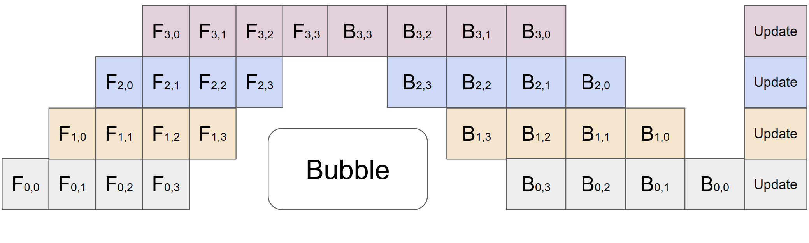{width=98%}

把这张图和上一张并排看，差别一眼就出来：上一张每一列时间片里只有一个方块（一张卡在算、三张在等），这一张中段每一列都被填满了（四张卡各在处理不同的 micro-batch）。变的不是硬件，只是喂进去的数据被切细了。

#### （3）气泡：流水线填充与排空时的空转

但流水线不可能从头到尾都是满的。一开始得**逐段填充**——卡 0 先动，卡 1 等第一个 micro-batch 到了才动，卡 2 再晚一步……流水线最初那个“逐级启动”的三角形里，靠后的卡还闲着；结尾**排空**时同理，前面的卡先做完闲下来。这段填充期 + 排空期的空转，就是流水线并行特有的**气泡（bubble）**，如上图正中那块 “Bubble”。

气泡是纯浪费的算力，但它可以被压小：

- **micro-batch 切得越多**，中间填满的稳定段就越长，相对而言两头那点固定的气泡占比就越小。所以实践里会把 batch 切成尽可能多的 micro-batch（受限于显存和单个 micro-batch 不能太小）。
- **更聪明的调度也能缩气泡。** 朴素 GPipe 是“先把所有 micro-batch 的前向做完，再统一做反向”，反向阶段开始前会空出一截。后来的 **1F1B**（one-forward-one-backward）调度——它出自 PipeDream[49] 那条流水线并行线，不是 GPipe 原文的调度——让每张卡一旦能做反向就**前向、反向交替着做**（做一个前向紧接做一个能做的反向），把前向和反向更紧密地咬合在一起，从而减少各卡积压的激活、也把气泡进一步压平。直觉上：1F1B 不再“先全前向再全反向”，而是“算一个、还一个”，让流水线更早进入稳定的满负荷状态。

> 备注：气泡是流水线并行**绕不开**的固有开销，只能压小、不能完全消除（两头总要填充和排空）。这也是流水线并行度不会切太多段的原因之一——段越多，填充/排空的级数越长，气泡的“地基”越大。实践里 PP 通常切到个位数段。

### 4.5.4 3D 并行：三条轴叠在一起

到这里，切模型的两条轴都齐了，加上之前的数据并行，一共有三条相互正交的轴：

- **数据并行（DP）**：复制 / 分片，每份各算不同数据（DDP、ZeRO/FSDP）；
- **张量并行（TP）**：层内横切，通信频繁，优先放机内 NVLink；
- **流水线并行（PP）**：层间纵切，可跨机，通信稀疏但有气泡。

真正训练几百 B 的超大模型时，这三条轴会**同时叠用**，业界称为 **3D 并行**。典型组合（如 Megatron-DeepSpeed 那一套）是：机内 8 张卡靠 NVLink 走**张量并行**，机间若干组靠**流水线并行**纵切成几段，再在最外层用**数据并行 / ZeRO** 复制或分片多份并行喂数据。每条轴各管一段瓶颈——TP 解决“单层放不下”、PP 解决“层数太多单机装不下整模型”、DP 解决“吞吐不够”，叠起来才能把成百上千张卡高效喂饱。

这套组合很强，但也很重——配置、调参、容错都复杂得多。本节点到为止，知道“大模型训练是这三条轴叠出来的”即可，不展开。对绝大多数人来说，更要紧的是下一节那条边界：自己到底要不要碰这些东西。

### 4.5.5 边界判断：你大概率用不到模型并行

这是本节最该记住的一节。前面把张量并行、流水线并行的原理都讲了，但**讲原理不等于推荐用**——恰恰相反，对 VLA 这个量级，结论是**大概率别用**。把判断标准摆清楚：

**什么时候才真需要模型并行？** 只有数据并行那条轴**彻底失效**时，也就是：

- **单独一层**就大到一张卡放不下——这时连 FSDP 都拼不出完整的一层，只能上**张量并行**把这层横切；
- 或者模型大到**几十上百 B**，层数多到即便每层都放得下，整个模型的层序列加上训练状态也塞不进单机——这时要上**流水线并行**把层序列纵切跨机。

**VLA 当前规模够不着这条线。** 现在的 VLA 模型通常在几亿到 7B 之间，单层远没到一张卡装不下的地步。这个量级要省显存，按上一节和上上节的顺序走就够了：

| 顺序 | 先试什么 | 它解决的瓶颈 |
|------|------|------|
| 1 | 省显存四件套（混合精度 + 梯度检查点 + 梯度累积 + CPU/NVMe offload） | 单卡内部抠显存，不加卡也能塞下更大模型 |
| 2 | ZeRO/FSDP（Stage 2 → Stage 3） | 沿数据并行各卡分片状态，单卡显存随卡数摊薄 |
| 3 | 再叠 offload（把分片搬到 CPU/盘） | 用主存/带宽换显存，进一步顶住峰值 |
| 4 | 仍放不下、且卡在“单层” → 才上 TP/PP | 切模型本身，离开数据并行轴 |


一条清晰的判断标准可以这样记：**先 ZeRO/FSDP（配上省显存四件套和 offload），真到了单层都放不下、或模型几十上百 B 的地步，才考虑模型并行。** 反过来说，只要你的单层还能塞进一张卡（哪怕要靠 offload 临时倒腾），就**没必要**碰张量并行 / 流水线并行——它们带来的工程复杂度、对 NVLink 拓扑的依赖、气泡的效率损耗，远不是 $\le$ 7B 这个量级该付的成本。

> 备注：换个角度记这条边界——数据并行轴（含 ZeRO/FSDP）的本事是把**冗余**榨干，但它要求“单层能在一张卡上完整算一次”；模型并行轴的本事是突破这条底线、切开模型本身，代价是高得多的通信与工程复杂度。VLA 的规模还远没逼到那条底线，所以这条轴对当前的我们是“知其原理、暂不动用”。

### 4.5.6 小结

#### （1）核心脉络回顾

本节离开数据并行轴，进到切开模型本身的模型并行轴：

- **触发条件**：数据并行（含 FSDP）的底线是“每卡都能完整跑一次前向”；**单独一层**都放不下、这条底线被突破时，才需要模型并行。
- **张量并行（TP）**：层内横切，把一层的大矩阵按列/行切到多卡（MLP 列切+行切、注意力按头切），各算一块、出口 all-reduce 拼回。通信在层内、极频繁，因此实践中优先放在机内 NVLink。
- **流水线并行（PP）**：层间纵切，把层序列切成几段放不同卡，数据像流水线逐段流过；朴素切法一次只一张卡干活，用 **micro-batch** 错峰喂入填满流水线，但首尾填充/排空的**气泡**绕不开，靠多 micro-batch 和 **1F1B** 调度压小。
- **3D 并行**：DP × TP × PP 三条正交轴叠用，是几百 B 超大模型训练（Megatron-DeepSpeed 式）的标配。
- **边界**：VLA（$\le$ 7B）单层装得下，**先 ZeRO/FSDP + 省显存四件套 + offload**，大概率用不到 TP/PP。

#### （2）关键结论参考表

| 维度 | 要点 |
|------|------|
| 何时才需要模型并行 | 单独一层一张卡放不下（→TP），或模型几十上百 B 整模型装不进单机（→PP） |
| 张量并行 TP | 层内横切大矩阵；MLP 列切+行切、注意力按头切；出口 all-reduce；通信极频繁、绑 NVLink 机内 |
| 流水线并行 PP | 层间纵切成段；micro-batch 填满流水线；气泡（填充/排空空转）绕不开，1F1B 调度压小；通信稀疏可跨机 |
| 气泡 | 流水线首尾填充与排空的固有空转，micro-batch 越多、1F1B 调度越能压小，但不能消除 |
| 3D 并行 | DP × TP × PP 叠用，超大模型训练标配（机内 TP、机间 PP、最外层 DP/ZeRO） |
| VLA 的取舍 | 当前规模用不到；先省显存四件套 + ZeRO/FSDP + offload，单层放不下才上模型并行 |


> 一句话总结：单独一层都放不下、数据并行救不了时，才转到模型并行轴——张量并行把一层的大矩阵横切到多卡（机内 NVLink、通信极频繁），流水线并行把层序列纵切成段、靠 micro-batch 填满流水线但躲不开气泡，超大模型则把 DP×TP×PP 三轴叠成 3D 并行；而 VLA 这个量级单层装得下，先 ZeRO/FSDP 加省显存四件套加 offload，大概率用不到这条进阶的轴。

## 4.6 多卡实战落地

### 4.6.1 原理讲完了，怎么真把它跑起来

前面几节，把多卡训练的道理从头到尾铺了一遍：4.1 节算清显存账本、4.2 节讲 DDP 怎么靠 all-reduce 近线性提速、4.3 节用省显存四件套在单卡里抠空间、4.4 节用 ZeRO/FSDP 沿各卡分片冗余状态、4.5 节把模型本身横切纵切到多卡。这些都是“它为什么省、为什么快”的原理。

但原理懂了，离真把训练跑在两张卡上还差关键一步：**到底敲哪条命令，单脚本才会变成多进程、各占一张卡跑起来？** 这一节就落到地面，用**双卡**这个最小可复现的规模，把“启动”这件事说清楚，再落到一次真实的 LeRobot 训练。

为什么挑双卡？因为它是能看出“多卡到底有没有动起来”的最小规模——一张卡看不到任何并行，三张以上又只是把双卡的逻辑重复几遍。双卡能跑通，加到八卡通常只是改一个数字。所以本节所有命令都以双卡为例，理解了就能直接往上扩。

这一节的脉络是：先讲清 `torchrun` 这个**通用启动器**怎么把单脚本拉成多进程（第 4.6.2 小节），再看 PyTorch Lightning 怎么用一个 `strategy` 开关把前面几节的 DDP / FSDP 原理对上代码（第 4.6.3 小节），最后落到 LeRobot——它的多卡入口是 Hugging Face 的 `accelerate launch`，给出双卡命令并逐参数拆解（第 4.6.4 小节）。收尾给一棵选型决策树（第 4.6.5 小节），把多卡训练这一节该怎么选串成一条线。

### 4.6.2 torchrun：单脚本怎么变成多进程

多卡训练第一个要破的迷思是：**写训练代码时，你只写“一张卡上怎么训”那一份逻辑，并不在代码里手动开几个进程。** 真正把这份单脚本拉成多进程、每个进程绑一张卡的，是外面那个**启动器**。PyTorch 自带的通用启动器就是 `torchrun`。

#### （1）一条命令拉起两个进程

假设你手上有一份自己写的单卡训练脚本（下面的命令里记作 train.py，是个占位名，本书仓库里没有这个文件），平时就是 `python train.py`。要它在双卡上跑，命令换成：

```bash
torchrun --nproc_per_node=2 train.py
```

`--nproc_per_node=2` 的意思是“在这台机器上起 2 个进程”（per node = 每台机器，这里就一台）。torchrun 会**把同一份脚本同时启动两遍**，得到两个独立的 Python 进程，分别绑到 GPU 0 和 GPU 1 上。

这里最反直觉的一点要先说透：**这两个进程跑的是一模一样的代码。** 不是一个进程当“主”、另一个当“从”分别执行不同脚本，而是同一份脚本被原样跑了两遍。那它们怎么做到“各算各的数据子集、只在一处打日志”而不互相打架？靠的是 torchrun 给每个进程注入的一组**环境变量**，让每个进程知道“我是第几个”。

#### （2）RANK / LOCAL_RANK / WORLD_SIZE：进程靠它们区分身份

torchrun 拉起每个进程时，会往它的环境里塞进几个关键变量。三个最常用的：

| 变量 | 含义 |
|------|------|
| `WORLD_SIZE` | 总共有几个进程（= 全局总卡数）。双卡单机就是 2 |
| `RANK` | 当前进程在**所有**进程里的全局编号，从 0 开始。双卡时是 0 或 1 |
| `LOCAL_RANK` | 当前进程在**本机**内的编号，从 0 开始。常直接拿它当要绑的 GPU 号 |


单机双卡时 `RANK` 和 `LOCAL_RANK` 恰好一样（都是 0、1）；一旦跨多台机器，`RANK` 是横跨所有机器的全局编号，而 `LOCAL_RANK` 只在本机内计数——这就是为什么绑 GPU 用 `LOCAL_RANK`（它对应本机第几张卡），而判断“谁是全局主进程”用 `RANK`（通常 `RANK==0` 是主卡）。

有了这几个变量，那份“被跑了两遍”的同一脚本，就能靠读自己的 `RANK` 来分工：

- **分数据**：每个进程按 `RANK` 取数据集里不同的一份子集（这正是 DDP 数据并行的入口，对上 4.2 节讲的“各算各的数据”）。PyTorch 的 `DistributedSampler` 就是读 `RANK` / `WORLD_SIZE` 自动切分的。
- **定主卡日志**：打印进度、存 checkpoint、上报 wandb 这种“只该做一次”的事，用 `if RANK == 0:` 圈起来，只让主进程做，避免两个进程把同一条日志打两遍、把同一个文件写两次。

> 备注：很多人以为“多卡训练”要在代码里写一堆 `spawn`、`Process` 手动开进程——其实不必。进程是 torchrun 在**外面**开好的，代码里只管“我是谁（读 RANK）、我该处理哪份数据”。这就是为什么同一份单卡脚本，几乎不改逻辑就能被 torchrun 拉成多卡。

把这一节记牢：**torchrun 是 PyTorch 通用的分布式启动器，它把单脚本复制成多进程、每进程绑一张卡，并用 `RANK`/`LOCAL_RANK`/`WORLD_SIZE` 让每个进程知道自己的身份。** 这是“多卡到底怎么跑起来”的概念底座——后面 Lightning 和 LeRobot 的启动器，本质都是这套机制的不同封装。

### 4.6.3 PyTorch Lightning：一个 strategy 开关切换并行策略

torchrun 把进程拉起来了，但“进程之间怎么同步梯度、要不要分片状态”还得有人实现。自己手写这套（包装 `DistributedDataParallel`、配 sampler、管 all-reduce）很繁琐。PyTorch Lightning 把这些都封进了 `Trainer`，对外只暴露一个开关：**`strategy`**。

#### （1）同一份 fit，换 strategy 就换并行方案

Lightning 的训练入口永远是那一句 `trainer.fit(model, data)`。要用几张卡、用哪种并行策略，只改 `Trainer` 的两个参数：

```python
trainer = Trainer(devices=2, strategy="ddp")
trainer.fit(model, data)
```

`devices=2` 说用两张卡，`strategy="ddp"` 说用 DDP 这套并行。**模型代码、数据代码一个字都不用改**——同一份 `LightningModule` 和 `LightningDataModule`，换 strategy 就换底层并行方案。这正是 Lightning 的价值：把前面几节那些原理，收敛成一个字符串开关。

底层上，Lightning 也是靠 torchrun 式的多进程机制把训练拉起来的（它自己负责 spawn 出 `devices` 个进程、注入 rank 信息），所以第 4.6.2 小节那套“单脚本变多进程、靠 rank 区分”的心智模型在这里依然成立，只是 Lightning 替你把它藏到了 `Trainer` 背后。

#### （2）三个 strategy 对上前面几节的原理

`strategy` 的取值正好把多卡训练这一节前面几节讲的原理一一对上一个代码开关：

| strategy | 它是什么（对应小节） | 什么时候用 |
|------|------|------|
| `"ddp"` | 数据并行，每卡一份完整副本（4.2 节） | 模型单卡**放得下**、只想靠多卡提速 |
| `"fsdp"` | 完全分片数据并行，参数/梯度/优化器全切（4.4 节） | 模型单卡**放不下**，要沿各卡分片 |
| `"deepspeed"` | DeepSpeed ZeRO 各 stage + offload（4.4 节） | 要 ZeRO 分阶段、或要把分片 offload 到 CPU/盘 |


一句话各自的定位：

- **`ddp`：放得下就用它提速。** 这是数据并行最干净的一档，每张卡存整份模型、各算各的数据、all-reduce 同步梯度。只要模型塞得进一张卡，加卡就近线性提速，没有任何分片开销，是默认首选。
- **`fsdp`：放不下就分片。** 对应 4.4 节的 FSDP（PyTorch 原生 ZeRO-3），把参数/梯度/优化器状态沿各卡切开，每卡只存 1/N，前向反向按层临时 all-gather 拼回。模型大到单卡装不下时换它。
- **`deepspeed`：要 ZeRO 各 stage / offload 时用。** 同样是分片那条路，但走 DeepSpeed 这套实现，能精细选 ZeRO Stage 1/2/3，还能把分片进一步 offload 到 CPU 或 NVMe，用主存换显存顶住峰值。

可以这样记：**这三个开关，就是把 4.2 节（DDP）和 4.4 节（ZeRO/FSDP）的原理，落到了 `Trainer(strategy=...)` 这一行上。** 懂了前面几节，选哪个 strategy 就是一句话的判断。

### 4.6.4 落到 LeRobot：用 accelerate launch 跑双卡训练

前面 torchrun 和 Lightning 讲的是“自己写训练循环时怎么上多卡”。但 VLA 这门课真正要训的 ACT、$\pi_0$ 这些策略，跑的是 **LeRobot** 这套现成框架。它的多卡入口既不是 torchrun，也不是 Lightning 的 strategy，而是 Hugging Face 的 **`accelerate launch`**。

下面的命令与参数名都以 **LeRobot v0.5.1** 为准（本书 `code/pyproject.toml` 钉的就是这个版本）。这个框架迭代很快，换版本前先对一遍 `lerobot-train --help`。

#### （1）accelerate 扮演什么角色

把 accelerate 放到前两节的坐标里就好懂了：**`accelerate launch` 和 `torchrun` 是同一层的东西——都是把单脚本拉成多进程、每进程绑一张卡的启动器。** 区别在于 accelerate 在启动器之外还多管了一件事：它在训练脚本内部用一个 `Accelerator` 对象**自动接管分布式与混合精度**——DDP 的进程同步、梯度 all-reduce、混合精度的精度切换，都由它在底层包好（LeRobot 里它底层就是用 `DistributedDataParallel` 实现的 DDP）。

所以对 LeRobot 用户来说，你不直接碰 torchrun，也不写 DDP 包装，只要用 `accelerate launch` 去启动 LeRobot 的训练入口 `lerobot-train`，多卡就跑起来了。

> 备注：这一点必须分清——**LeRobot 多卡用的是 `accelerate launch`，不是 `torchrun`。** 第 4.6.2 小节的 torchrun 是讲“通用启动机制”时用的通用工具；到了 LeRobot 这个具体框架，对应的启动器换成了 accelerate（你可以把 accelerate 理解成“torchrun 同层、但额外接管了 DDP 和混合精度”的启动器）。

#### （2）双卡训练命令

直接在命令行给参数（不预先做配置）的双卡命令是这样：

```bash
accelerate launch \
  --multi_gpu \
  --num_processes=2 \
  $(which lerobot-train) \
  --dataset.repo_id=${HF_USER}/my_dataset \
  --policy.type=act \
  --policy.push_to_hub=false \
  --output_dir=outputs/train/act_multi_gpu \
  --job_name=act_multi_gpu \
  --wandb.enable=true
```

逐个参数看，前半截是给 accelerate 的（控制怎么启动），后半截是给 lerobot-train 的（控制训什么）：

| 参数 | 含义 |
|------|------|
| `accelerate launch` | 用 accelerate 这个启动器把后面的程序拉成多进程 |
| `--multi_gpu` | 开启多卡模式 |
| `--num_processes=2` | 用几张卡（= 进程数），双卡就填 2 |
| `$(which lerobot-train)` | 被启动的程序：LeRobot 的训练入口脚本的真实路径 |
| `--dataset.repo_id=...` | 训练用的数据集（Hugging Face 仓库 id） |
| `--policy.type=act` | 训哪种策略，这里是 ACT；换 $\pi_0$ 改成对应类型 |
| `--policy.push_to_hub=false` | 不往 Hugging Face Hub 推权重。这一项**不能省**：它默认是 `true`，而一旦为真又没给 `--policy.repo_id`，`lerobot-train` 启动时就直接报“`policy.repo_id` argument missing”退出 |
| `--output_dir=...` | 输出（checkpoint、日志）落盘目录 |
| `--job_name=...` | 这次任务的名字 |
| `--wandb.enable=true` | 打开 wandb 记录 |


要换张数，就改 `--num_processes`：八卡填 8。也可以先用 `accelerate config` 把“用几张卡、什么精度”这些选项存成一份配置，之后直接 `accelerate launch $(which lerobot-train) ...` 不用每次重复写。

配套代码里那条真机微调脚本 `code/vla/5_vla_finetune/5_4_so101_real_sft/train_so101_real.sh` 里就有这个分支：脚本顶部一个 `NUM_GPUS` 变量，填 1 时直接调 `lerobot-train`，大于 1 时换成上面这条 `accelerate launch --multi_gpu` 的写法，训练参数一个字都不用改——单卡与多卡的差别只在最外面那层启动器。

#### （3）混合精度交给 accelerate 控

这里有个容易记反的地方：**`lerobot-train` 的混合精度从头到尾都由 accelerate 接管，单卡也一样。** LeRobot v0.5.1 的 `lerobot/scripts/lerobot_train.py` 里，训练步整个包在 `accelerator.autocast()` 下（源码注释就写着 *Let accelerator handle mixed precision*），而策略配置里那个 `--policy.use_amp` 在这个文件里一次都没被读到——它只在推理侧的 `lerobot-eval`、`lerobot-record` 里生效。所以不论单卡多卡，训练精度都用启动器的 `--mixed_precision` 控：

```bash
accelerate launch --multi_gpu --num_processes=2 --mixed_precision=bf16 \
  $(which lerobot-train) --dataset.repo_id=${HF_USER}/my_dataset \
  --policy.type=act --policy.push_to_hub=false
```

`--mixed_precision` 取 `fp16` 或 `bf16`（对应 4.3 节讲的两种半精度）。不填就是 fp32 全精度训练——`accelerator.autocast()` 在没有指定精度时是个空壳，不会自动帮你开半精度。

#### （4）一个必须手动处理的坑：学习率要自己缩

这是 LeRobot 多卡最容易踩的一点，务必记住：**LeRobot 不会自动按卡数缩放学习率和训练步数。**

原因在“有效 batch”。数据并行下，N 张卡各吃一份 batch、梯度 all-reduce 平均，相当于一步更新看了 N 份 batch 的数据。所以：

$$
\text{有效 batch} = \text{batch\_size} \times \text{卡数}.
$$

双卡时有效 batch 直接翻倍。batch 变了，学习率通常也要跟着调，但**怎么调是个要扫的超参，不是一条定律**。最常被引用的候选是**线性缩放**（batch 翻几倍、学习率乘几倍），它是大 batch 训练里的经验启发式；实践中平方根缩放、干脆保持原值、或者重新调 warmup，都可能更合适——尤其是 VLA 这种小数据微调场景。LeRobot 不替你做这件事，得手动指定。稳妥的做法是**以原学习率为起点做一个小范围扫描**，同时检查 warmup、总优化步数和梯度累积设置。

改的时候要走对参数。`lerobot-train` 的 `use_policy_training_preset` 默认是 `true`，启动校验那一步会用**策略自带的预置优化器整个覆盖** `--optimizer.*`——也就是说 `--optimizer.lr` 写了也不生效，学习率仍是预置值。真正管用的入口是策略自己的 `--policy.optimizer_lr`（上面那条真机微调脚本用的就是它）。ACT 的预置学习率是 `1e-5`（`lerobot/policies/act/configuration_act.py` 里的 `optimizer_lr`），双卡有效 batch 翻倍，先试线性缩放的 `2e-5`：

```bash
accelerate launch --num_processes=2 $(which lerobot-train) \
  --policy.type=act \
  --policy.optimizer_lr=2e-5 \
  --policy.push_to_hub=false \
  --dataset.repo_id=lerobot/pusht
```

用双倍 batch 却完全不看学习率，确实可能让每步更新偏保守、收敛偏慢；但反过来照着线性缩放硬乘上去也可能训崩。这一格最终要靠验证实验定，别当成公式套。

#### （5）双卡相比单卡，显存和吞吐怎么变

把 ACT / $\pi_0$ 这类训练放到双卡上，最该有的预期是这两条——而且它们正是“数据并行”这个性质的直接推论：

- **吞吐可以接近翻倍——但要看条件。** 两张卡各处理一份数据子集、并行算前向反向，单位时间过的样本数增加，墙钟时间下降。能不能接近理想的 2 倍，取决于：计算是否占主导、batch 是否足够大、卡间互联（NVLink / PCIe）是否够快、数据加载与 CPU 预处理是否成为瓶颈。这些条件都满足时接近线性；模型小或 batch 小的时候，实际加速常常远低于 2 倍。所以别照搬“减半”，**用 samples/s 实测一遍**再定预期。这对应 4.2 节讲的 DDP 近线性提速及其前提。
- **单卡显存不降。** 这点务必想清楚：DDP / accelerate 这条路是**数据并行**，每张卡都存着一份**完整**的模型、梯度、优化器状态（对上 4.4 节开头说的“N 份冗余复制”）。所以加到双卡，单张卡要占的显存和单卡训练时**一样多**，不会因为多了一张卡就降下来。

把这两条合起来记：**双卡数据并行，买到的是吞吐（训得更快），买不到的是单卡显存（每卡照样要装下整份）。** 如果瓶颈是“单卡显存装不下”而不是“训得太慢”，加卡做数据并行解决不了问题——那是 4.4 节的 FSDP / ZeRO（分片，单卡显存随卡数摊薄）该上场的场景。这条区分，正好引出下一节的选型。

### 4.6.5 选型决策树：到底该用哪一招

多卡训练这一节前后讲了 DDP、省显存四件套、ZeRO/FSDP、模型并行一大串招式。真到自己训一个模型，该按什么顺序选？把判断收成一条**逐级递进**的决策线——每一步先问一个问题，答“够了”就停，答“还不行”才往下走：

1. **单卡放得下吗？** 放得下 → 直接 **DDP**（Lightning `strategy="ddp"` / LeRobot `accelerate launch --multi_gpu`）。这一步只为**提速**，加卡近线性快、单卡显存不变，是最简单也最该首选的一档。
2. **单卡放不下？先抠单卡。** 别急着加卡，先上 **4.3 节的省显存四件套**（混合精度 + 梯度检查点 + 梯度累积 + CPU/NVMe offload），在一张卡内部把显存抠出来。很多时候四件套就够，省去多卡的复杂度。
3. **四件套还不够？分片。** 上 **4.4 节的 ZeRO/FSDP**（Lightning `strategy="fsdp"` 或 `"deepspeed"`），把参数/梯度/优化器状态沿各卡切开，单卡显存随卡数摊薄；还顶不住就再叠 **offload** 把分片搬到 CPU/盘。
4. **连单独一层都放不下？切模型本身。** 到这一步数据并行那条轴彻底失效（连 FSDP 都拼不出完整的一层），才上 **4.5 节的模型并行**（张量并行横切一层 / 流水线并行纵切层序列）。这是几十上百 B 超大模型才动用的重武器。

这四步的顺序不是随便排的：每往下一步，工程复杂度都要上一个台阶，所以能在上一步停住就别往下走。

{width=100%}

图上有两处正好解释了这条决策线为什么是这个顺序。**第一处是 (3) 那根柱子**：它和 (1) 一模一样高，因为 DDP 只是把数据分给多张卡，每张卡仍然要完整地放下参数、梯度和优化器状态——所以第 1 步只解决“慢”，不解决“放不下”，单卡放不下时加多少张卡都没用。**第二处是 (2) 和 (4) 的高低**：省显存四件套（31 GB）比 ZeRO-2（38 GB）还低，而且不需要多卡、不增加通信。这就是第 2 步要排在第 3 步前面的原因——最贵的那一段（优化器状态 84 GB）用 offload 直接搬走，比切成 8 份还划算。真正非分片不可的，是四件套之后仍然顶破容量线的那些情况。

对 VLA 当前这个量级（通常 $\le$ 7B），绝大多数情况走到第 1~3 步就解决了，**第 4 步基本用不到**。本节的双卡 + LeRobot 实战，落在的正是第 1 步（DDP 提速）这一档——也是最常用、最该先掌握的一档。

### 4.6.6 小结

#### （1）核心脉络回顾

本节把前面几节的原理落到“怎么真跑起来”：

- **torchrun 是通用启动器**：`torchrun --nproc_per_node=2 train.py` 把单脚本复制成两进程、各绑一张卡，靠注入的 `RANK`/`LOCAL_RANK`/`WORLD_SIZE` 让每个进程知道身份——分数据用 RANK、定主卡日志用 `RANK==0`。
- **Lightning 用一个 strategy 开关切并行**：同一句 `trainer.fit(model, data)`，`Trainer(devices=2, strategy="ddp"/"fsdp"/"deepspeed")` 三选一，把 4.2 节（DDP）与 4.4 节（ZeRO/FSDP）的原理对上代码；底层仍是 torchrun 式多进程。
- **LeRobot 多卡走 `accelerate launch`**：accelerate 是和 torchrun 同层的启动器，额外接管 DDP 与混合精度。双卡命令 `accelerate launch --multi_gpu --num_processes=2 $(which lerobot-train) ...`；混合精度用 `--mixed_precision` 控；**学习率要手动调**，且要走 `--policy.optimizer_lr` 而不是会被预置覆盖的 `--optimizer.lr`（有效 batch = batch×卡数；线性缩放只是最常被引用的起点，不是定律，最终要扫）。
- **双卡相比单卡**：吞吐近线性翻倍，但单卡显存不降（数据并行各卡存整份）。
- **选型决策树**：放得下→DDP 提速；放不下→先省显存四件套→还不够→ZeRO/FSDP+offload→单层都放不下→才上模型并行。

#### （2）关键命令与结论参考表

| 维度 | 要点 |
|------|------|
| 通用启动器 | `torchrun --nproc_per_node=2 train.py`，单脚本变多进程；RANK/LOCAL_RANK/WORLD_SIZE 定身份 |
| Lightning 切换 | `Trainer(devices=2, strategy="ddp"/"fsdp"/"deepspeed")` + `trainer.fit`，模型代码不改 |
| LeRobot 入口 | `accelerate launch --multi_gpu --num_processes=2 $(which lerobot-train) ...`（不是 torchrun） |
| 混合精度 | 训练侧一律由 accelerate 控：`--mixed_precision=fp16/bf16`；`--policy.use_amp` 只作用于推理侧 |
| 学习率缩放 | 不自动缩；有效 batch=batch×卡数。改学习率走 `--policy.optimizer_lr`（`--optimizer.*` 会被策略预置覆盖）；线性缩放只是起点，要用验证集扫 |
| 双卡效果 | 吞吐近线性翻倍；单卡显存不降（数据并行） |
| 选型顺序 | DDP 提速 → 省显存四件套 → ZeRO/FSDP+offload → 单层放不下才模型并行 |


> 一句话总结：多卡训练的本质是“启动器把单脚本拉成多进程、各绑一张卡靠 rank 分工”——通用的是 `torchrun`，Lightning 用一个 `strategy` 开关在 DDP/FSDP/DeepSpeed 间切换，而 LeRobot 的入口是 Hugging Face 的 `accelerate launch`（双卡 `--multi_gpu --num_processes=2 $(which lerobot-train)`，混合精度交给 accelerate、学习率得自己调且不能照搬线性缩放）；双卡数据并行买到的是近线性吞吐、买不到单卡显存，选型就按“放得下用 DDP、放不下先抠再分片、单层都放不下才切模型”这条线走下去。


# 5 Sim2Real 与 Real2Sim

微调好的策略，最终要在真实机器人上工作。但仿真里训练或验证、再迁到真机，中间隔着一道绕不开的鸿沟。这一节先把 Sim2Real（从仿真到真实的策略迁移）讲透，再反过来看 Real2Sim（把真实世界重建成可仿真的世界）。前面三节微调出来的策略，最后都要过这一关。

## 5.1 Sim2Real：从仿真到真实的策略迁移

### 5.1.1 为什么需要 Sim2Real

#### （1）机器人学习的现实困境

把一个深度神经网络的策略（policy）真正部署到机器人上，并不像训练一个图像分类器那样轻松。机器人学习有几个不可绕开的现实约束：

- **数据贵**：在真机上每采一条轨迹，都要消耗硬件磨损、操作员时间和场地。OpenAI 让 Shadow Hand 学会解魔方（5.1.4 节展开），靠的是在大规模仿真集群上堆出来的经验总量——那个量级不可能在真机上跑出来。
- **数据慢**：真机数据是“实时”的，5 Hz 控制频率意味着一秒只产生 5 个样本；而 GPU 仿真器轻松能跑到每秒上万步。
- **数据危险**：四足、人形、灵巧手类机器人在早期训练阶段会大幅度抖动、跌倒、自碰撞。直接在真机上做强化学习常常意味着硬件持续损耗。
- **数据难规模化**：实验室能塞下 5 台机械臂已经算多。仿真里同一时刻可以并行 4096 个环境。

这些约束共同导致了一个现象：**单纯靠“在真机上多采点数据”这条路，很难支撑大规模策略学习**。

#### （2）仿真带来的承诺

仿真器提供了一个看似完美的替代方案：

- 数据近乎免费、可以并行
- 失败没有代价，可以放心探索
- 物理参数、初始条件、任务变体可以任意配置
- 可以在仿真里跑强化学习（reinforcement learning, RL），让策略自我探索

近十年来，许多机器人学习成果都依赖“先在仿真中训练或验证，再迁移到真机”这一基本范式，典型例子包括 OpenAI Dactyl 的灵巧手和 ANYmal 类腿足机器人的敏捷运动。

#### （3）现实差距（Reality Gap）

但任何在仿真里训练好的策略，一旦放到真机就会出现性能下降，有时是小问题，有时是策略完全失效。这就是**现实差距**。

Aljalbout 等人的综述《The Reality Gap in Robotics: Challenges, Solutions, and Best Practices》[26]系统总结了这个问题：现实差距是视觉、动力学、传感器、执行器和软件栈多层误差共同叠加的结果。

Sim2Real 就是研究“如何让仿真训练好的策略在真实世界依然能工作”的子领域。它在过去十年里发展出了一整套方法论，并且在 VLA（Vision-Language-Action）时代继续演化。本节就是要把这套方法论梳理清楚。

> 小结：仿真是必需品；但要把仿真里学到的东西真正落地，必须正面应对现实差距。Sim2Real 这一整套方法就是为这一步存在的。

### 5.1.2 现实差距到底差在哪里

把“仿真和真实不一样”这句话再切细一点，可以分成四类来源。理解差距来自哪里，是后面理解每种方法的基础。

#### （1）视觉差距

仿真里的图像和真机相机拍到的图像不会完全一致：

- 光照模型简化（环境光、阴影、间接光）
- 材质渲染不真实（金属反光、透明物体、湿表面）
- 相机内参与噪声特性不同（畸变、白平衡、时延、滚动快门）
- 仿真背景常常是干净的；真实背景充斥杂物、人、动态变化

视觉差距的后果很直接：一个只看像素的策略，在仿真里刷到很高的成功率，换到真机相机下可能掉到勉强能动的水平——掉多少没有通用数字，取决于渲染与真实相机差多远。

#### （2）动力学差距

物理引擎的物理是近似的，特别是接触力学（contact dynamics）这一块：

- 物体质量、惯量、几何尺寸的标定误差
- 摩擦系数、阻尼、弹性系数与真实不符
- 接触模型大多基于硬约束（hard constraint）求解，无法精确刻画粘滑、变形、接触面随时间退化等现象
- 关节传动不是理想刚体（齿轮间隙、皮带形变、连杆挠曲）

四足机器人在仿真里可以稳稳跑过砂石坡道，到真机上一脚踩下去发现砂石“流动”了；这就是典型的动力学差距。

#### （3）传感器与执行器差距

机器人不止有相机：

- IMU 有偏置和漂移；编码器有量化和噪声
- 电机有电流上限、热保护、PWM 量化
- 控制环路从软件到硬件之间存在通信延迟（毫秒级到几十毫秒级）
- 真实世界的力/力矩传感器存在零漂、温漂

这些低层细节在仿真里通常被理想化，但在真机上每一项都可能让策略失效。

#### （4）控制软件栈差距

最后一类差距常被忽略，但工程上几乎一定会踩坑：

- 仿真中以 100 Hz 控制，真机上换成 50 Hz
- 仿真直接用关节位置指令，真机走 PID + 力矩限幅
- 真机有安全监控会强行截断异常输出
- 状态滤波、坐标系定义、单位（弧度/角度，米/毫米）不一致

很多失败的 Sim2Real 栽在软件栈对不齐上。

#### （5）把四类差距汇总到一张表

| 差距类型 | 典型表现 | 主流应对策略 |
|---|---|---|
| 视觉差距 | 真机图像更暗、阴影更复杂、背景杂；仿真中训练好的视觉策略在真机失败 | 视觉域随机化（visual DR）；GAN 域适配；高保真渲染（RTX、3DGS） |
| 动力学差距 | 真机摩擦/接触不可预测；步态/抓取不再稳定 | 动力学域随机化（dynamics DR）；系统辨识（SysID）；可微仿真 |
| 传感器/执行器差距 | IMU 漂移；电机延迟；编码器噪声；力/力矩零漂 | 注入噪声/延迟到仿真；师生框架的“鲁棒学生” |
| 控制软件栈差距 | 控制频率、滤波、安全检查与仿真不一致 | 工程对齐；同一套控制代码同时跑仿真和真机 |

> 小结：现实差距是四类差距的叠加。本节后面讲的每种方法，都可以放到这张表上对号入座。

### 5.1.3 Sim2Real 方法的整体地图

在深入展开每条路线之前，先给这些方法画一张分布图。Sim2Real 的方法大致可以划成六个家族：

| 家族 | 核心思想（一句话） | 代表工作 |
|---|---|---|
| 1. 域随机化（domain randomization, DR） | 训练时把仿真环境的参数随机扰动；让真实世界看起来“只是又一个变体” | Tobin 2017、Peng 2018、OpenAI Dactyl/ADR、DrEureka |
| 2. 域适配（domain adaptation, DA） | 学一个翻译器，把仿真和真实“对齐”到同一个分布 | GraspGAN、RL-CycleGAN、RetinaGAN、RCAN |
| 3. 系统辨识（system identification, SysID） | 用真实数据估出更准的仿真参数，让仿真离真实更近 | SimOpt、BayesSim |
| 4. 渐进网络与师生框架 | 仿真先训“教师”，真机或盲学生再蒸馏；或加新分支保留旧能力 | Progressive Nets、RMA、Hwangbo 2019 |
| 5. 基础模型与生成式策略 | 大数据 + 大模型；在语言条件和跨任务设置中提供语义先验，但仍依赖底层迁移工具 | Diffusion Policy、RT-2、OpenVLA、$\pi_0$、GR00T N1 |
| 6. 混合 / 协同训练 | 真实和仿真数据一起喂；或仿真中“嵌入”真实场景的重建 | SplatSim、TRANSIC、Lin 2025 |

这六类不是互斥的：

- 基础模型相关流水线常常把“DR + 师生 + 真实数据微调”一起用；
- SimOpt 同时是 SysID 又是 DR 的延伸；
- TRANSIC 把真机纠正叠加到仿真训练上，是 6+4 的组合。

理解每一族“想解决什么差距”是关键，单纯记名字记不住。

> 小结：把任何一篇 Sim2Real 论文摆到这张图上对号入座，就能看清它的位置和它的局限。

### 5.1.4 域随机化（Domain Randomization）

域随机化是最早奏效、也最容易上手的 Sim2Real 方法。它的核心直觉极其朴素：

> 与其费力把仿真做得“像真实”，不如让仿真的变体足够多，使真实世界对模型来说“只是其中一个特例”。

#### （1）视觉域随机化

最早的两个代表作是 Sadeghi 与 Levine 的 **CAD2RL**[42]（arXiv 2016 年底、RSS 2017）和 Tobin 等人的 **Domain Randomization**[27]（2017）。

CAD2RL 让无人机在大量随机化的 3D CAD 房间里学避障，全程不用一张真实图片，模型直接零样本部署到真机就能飞。Tobin 等人[27]把同样的思路用在桌面物体定位上：在仿真里随机化纹理、光照、相机位姿、干扰物，训练出来的检测器直接在真机相机上工作。

![左侧“训练”栏是九张仿真渲染图，同一张桌子和同一批几何体在每张里换了一套颜色、纹理、光照和相机角度，桌面从粉到绿到紫无所不有；右侧“测试”栏只有一张真机照片——普通木桌上摆着彩色积木。（图取自参考文献 [27]）](../../assets/figures/lecture12/ref/figures/wri-005-tobin2017-domain-randomization-figure1-crop_arxiv-1703.06907.png){width=78%}

视觉 DR 通常会随机化：

- 物体材质、贴图、颜色
- 光源强度、位置、色温
- 相机位姿、视场角、内参
- 背景图片、干扰物数量与位置
- 噪声、模糊、JPEG 压缩

#### （2）动力学域随机化

Tobin 之后一年，**Peng 等人**[28]把同样的思路从视觉迁到了物理：随机化质量、摩擦、阻尼、关节限位、控制延迟。他们用一个 LSTM 策略在仿真中学会“推方块到目标位姿”，再直接部署到 Fetch 机械臂上。LSTM 的隐状态承担了一个隐式的“在线系统辨识”作用——模型从最近几步的运动看出当前真实物理，自适应地选择动作。

紧接着，**OpenAI 的 Dactyl**[29] 把动力学 DR 推到了极致。他们让 Shadow Dexterous Hand 把一个方块旋转到指定姿态，仿真中随机化了：

- 物体质量、尺寸、摩擦
- 手指关节阻尼、PID 系数、电机响应延迟
- 相机外参、光照
- 重力、地面接触参数
- 各种噪声（观测噪声、动作噪声）

模型完全在仿真里学，再零样本部署到真实 Shadow Hand 上。灵巧手自由度这么高、接触又这么密集，仍然靠“把变体撑宽到包住真实”这一条路走通了——这是本节开头那句直觉最极端的一次兑现。

#### （3）自动化域随机化（ADR）

朴素 DR 有一个工程痛点：随机化范围如何选？范围太小，泛化不到真实；范围太大，策略学不会任务。研究者过去靠手动炼丹。

OpenAI 在解魔方那项工作[30]里提出了 **自动化域随机化（Automatic Domain Randomization, ADR）**：

- 从一个窄的随机化范围开始训练
- 当策略在当前范围内表现稳定，就自动**扩大**这个范围
- 当策略表现下降，就自动**收回**

最终他们让 Shadow Hand 在仿真里学会魔方旋转技能，并在真机上完成了多面解魔方任务。这是公认 Sim2Real 历史上最复杂的成功演示之一。

#### （4）LLM 引导的域随机化

到 2024 年，**DrEureka**[31] 又走了一步：把“如何选随机化范围”这件事交给一个大语言模型（LLM）来想。GPT-4 阅读环境代码、阅读任务描述，自动生成奖励函数和域随机化分布，再迭代评估改进。在四足行走和灵巧操作两个任务上，DrEureka 自动找到的 Sim2Real 配置与人类专家手动调出的相当，甚至更好。

#### （5）一点理论：DR 为什么会奏效？

域随机化在数学上可以表达成一个跨域期望损失：

$$
\theta^{\star} = \arg\min_{\theta} \, \mathbb{E}_{\xi \sim p(\xi)} \, \mathbb{E}_{\tau \sim \pi_\theta(\xi)} \big[\mathcal{L}(\tau)\big]
$$

这里 $\xi$ 是仿真环境的参数（质量、摩擦、纹理种子等），$p(\xi)$ 是我们设计的随机化分布，$\pi_\theta$ 是参数为 $\theta$ 的策略（这个 $\pi$ 是强化学习里表示策略的通用记号，和本讲反复出现的模型名 $\pi_0$ 没有关系），$\tau$ 是它跑出来的一条轨迹，$\mathcal{L}$ 是这条轨迹上的损失。模型求的是整个 $\xi$ 分布上的**平均最优**。如果真实世界的参数被这个 $p(\xi)$ “覆盖”了，那么真机就只是其中一个采样。

**Chen 等人**[48]（ICLR 2022）给出了正式分析：把仿真器建模成一族参数可调的 MDP 之后，可以对 Sim2Real 差距——DR 返回的策略与真实世界最优策略之间的价值差——给出上界，并证明在温和条件下，一条真实样本都不用也能迁移成功。同一篇还点出一件容易被忽略的事：DR 里要让策略带上历史（也就是用依赖历史的记忆型策略），否则这套保证撑不住。

#### （6）DR 五种变体一张表

| 变体 | 代表 | 关键扩展 |
|---|---|---|
| 视觉 DR | CAD2RL[42]（2017）、Tobin 2017[27] | 随机化纹理、光照、相机参数 |
| 动力学 DR | Peng 2018 | 随机化物理参数；LSTM 隐式辨识 |
| 全方位 DR | OpenAI Dactyl | 视觉 + 动力学 + 噪声同时随机 |
| 自动化 DR（ADR） | OpenAI 解魔方（2019） | 训练中自动伸缩随机范围 |
| LLM 引导 DR | DrEureka（2024） | LLM 自动生成奖励 + DR 分布 |

> 小结：DR 的精神是“宽到包住真实世界”。它简单、可扩展、不需要真机数据，是很多腿足/灵巧手 Sim2Real 流水线的第一选择。代价是策略往往是“鲁棒但保守”的；要榨干性能，往往还要叠加其他方法。

### 5.1.5 域适配（Domain Adaptation）

域随机化是“让模型学会忽略差异”；域适配则反过来——**让差异本身被消除**。具体做法：学习一个图像翻译器，把仿真图变成“看起来像真实”的图，或者把真实图变成“看起来像仿真”的图，让策略的输入分布对齐。

#### （1）像素级 GAN 适配：GraspGAN

Bousmalis 等人的 GraspGAN[32] 是这条路线的开山作。他们把一个 GAN（生成对抗网络）接到抓取数据流水线里：

- 输入：仿真渲染图像
- 输出：风格上贴近真实的图像
- 训练目标：判别器分不清生成图和真实图

论文[32]报告，这样训练出来的抓取策略相比纯仿真训练，达到同等效果所需的真实样本量少了约一个数量级到 50 倍（视对照设置而定）。

#### （2）任务感知 GAN：RL-CycleGAN 与 RetinaGAN

朴素 GAN 的问题是它“只关心颜色对不对”，可能在翻译过程中把机械臂位置或物体边缘也悄悄挪一挪——这对游戏图像没事，对机器人灾难性。

- **RL-CycleGAN**[44]（Rao 等人，CVPR 2020）：把 RL 智能体的特征也作为约束训练 GAN，强迫翻译保留任务相关信息。
- **RetinaGAN**[33]：进一步引入“物体级一致性”约束，让翻译前后物体的边界框检测结果一致。论文那张真机实例抓取对照表里，RetinaGAN 是 80.0%，同表的 CycleGAN 是 67.8%、RL-CycleGAN 是 68.9%，而纯仿真训练只有 18.9%。

#### （3）Sim-to-Sim 中介：RCAN

**RCAN**[34] 走了一条颇具巧思的折中路线：

- 不直接学“仿真 → 真实”的翻译（数据稀缺、目标域风格未知）
- 而是学“随机化仿真 → 一个干净的、规范化的仿真”的翻译
- 真实图来的时候，也走同一个翻译器，被映射到这个规范化空间
- 策略只在规范化仿真空间里学一次

![上下两行结构完全相同，差别只在最左边那一格。上行“训练”从高度随机化的仿真图出发，下行“测试”从真机照片出发；两者都先过同一个生成器 $G$，被翻译成同一套规范仿真外观（灰底、纯色积木、彩色机械臂），再送进同一个智能体输出动作。（图取自参考文献 [34]）](../../assets/figures/lecture12/ref/figures/wri-003-rcan-method-summary.png){width=75%}

RCAN 因此既享受了 DR 的鲁棒性（训练翻译器要看大量随机化图），又享受了 DA 的精确性（最后策略输入是同一套规范化的图），并且不需要任何真机数据。

#### （4）三种 DA 路线对比

| 方法 | 翻译方向 | 关键贡献 |
|---|---|---|
| GraspGAN（2018） | 仿真 → 真实风格 | 像素级 GAN；真实样本最多省到 1/50 |
| RL-CycleGAN（2020）/ RetinaGAN（2021） | 仿真 $\leftrightarrow$ 真实，加任务一致性约束 | 任务/物体级一致性，避免 GAN 移动机械臂 |
| RCAN（2019） | 随机化仿真 → 规范化仿真 | 用 Sim-to-Sim 中介，规避真机数据 |

> 小结：DA 适合视觉差距是主要瓶颈、动力学差距相对较小的任务（典型代表：抓取）。它对真机数据的需求很轻量（一些无标签真实图），代价是要训一个图像翻译器，并保证它别把任务关键信息丢了。

### 5.1.6 系统辨识（System Identification）

域随机化和域适配都从模型这边发力。系统辨识则反过来：**改进仿真，让仿真离真实更近**。

#### （1）闭环辨识：SimOpt

**SimOpt**[45]（Chebotar 等人，ICRA 2019）提出一个闭环：

1. 在当前仿真参数分布下训练策略
2. 把策略放到真机上跑一段，记录真实轨迹
3. 比较仿真和真实轨迹的差异，反向更新仿真参数分布（用交叉熵方法 CEM）
4. 回到第一步

它的妙处在于把 DR 和 SysID 缝合：**用真实数据来调整 DR 的范围**，避免范围太宽、策略学不会，或者太窄、迁移失败。

#### （2）贝叶斯辨识：BayesSim

**BayesSim**[46]（Ramos 等人，RSS 2019）把 SimOpt 的思路放在概率框架下：用高斯混合分布建模仿真参数的后验，给定真实观测求后验。这意味着不再是点估计，而是一个 **置信分布**；这个分布天然可以作为下一轮 DR 的范围。

#### （3）SysID 与 DR 是互补的

很多人把 SysID 和 DR 当对立面。但真正在工业界跑通的方案常常两者并用：

| 组件 | 解决什么问题 | 风险 |
|---|---|---|
| DR | 让策略对参数变化鲁棒 | 范围过宽时策略学不出最优行为 |
| SysID | 把 DR 范围调到合适的位置 | 真机数据需求高于纯 DR |
| DR + SysID | 鲁棒性 + 精度兼顾 | 工程链路较长 |

> 小结：当任务对动力学精度敏感（接触丰富、灵巧、低速精操），单靠 DR 不够时，SysID 是把 DR 落地的关键工具。

### 5.1.7 渐进网络与师生框架

DR、DA、SysID 都是“调环境”或“调输入”。下一类方法换一个角度：**调网络结构和训练流程**。

#### （1）渐进网络（Progressive Networks）

**Rusu 等人**（DeepMind）先在 2016 年 6 月提出 Progressive Networks[50] 这个架构本身：

- 第一列：在仿真中训练一个完整网络
- 第二列：冻结第一列，新加一列在真机上训练；新列每一层都和第一列对应层有“侧向连接（lateral connection）”
- 后续列继续叠加

好处是**没有灾难性遗忘**：旧能力被冻结的列保留下来，新能力由新列扛。代价是参数随任务数线性增长。

把它用到 Sim2Real 上的是同一批人同年 10 月挂出的那篇[43]（后来正式发表在 CoRL 2017）：仿真里训练好像素级到达任务，加一列在真机上微调，只需要少量真机数据就能迁移。

#### （2）师生框架（Teacher-Student）

师生是腿足机器人 Sim2Real 真正的主流方案，**RMA（Rapid Motor Adaptation）**[35] 是最有代表性的工作之一。

RMA 把训练分成两阶段：

- **教师阶段**：在仿真中训练一个能直接看到“特权信息”（privileged info：地形高度图、摩擦、负载、机器人物理参数）的策略；用 RL 学到一个最优控制策略，外加一个把特权信息编码成隐变量 $z$ 的编码器。
- **适应模块阶段**：训练一个**只看真机能看到的输入**的模块——它从最近若干步的本体历史（关节状态、IMU、命令）去**估计第一阶段那个同一个环境隐变量 $z$**。

这里的要点在于两阶段各学什么：第一阶段用特权信息训出基础策略**和**环境编码器；第二阶段并不重新学一个策略去模仿教师动作，而是学一个适应模块，把“看不见的环境参数”从本体历史里**推断**出来。部署时两者闭环协同：适应模块持续估计 $z$，基础策略拿着这个 $z$ 加当前观测出动作。因为 $z$ 的估计随时间更新，这套结构本身就是一种“在线快速适应”——RMA 因此能在岩石、沙地、楼梯、湿滑地面上稳定行走。把它笼统说成“学生蒸馏教师动作”，会把这个在线适应机制盖掉。

更早的开山工作是 **Hwangbo 等人**[47]（Science Robotics 2019）：在 ANYmal 上用师生框架学敏捷动作。教师在仿真里享受准确动力学，学生再蒸馏到只看实际可观测的输入。它和 RMA 的分工正好互补：RMA 把重点放在部署后的在线估计，这一篇把重点放在“仿真里的准确动力学怎么蒸馏进一个只看得见本体的学生”。

#### （3）师生 vs 渐进 vs DR

| 方法 | 关键机制 | 适合什么 |
|---|---|---|
| 渐进网络 | 冻旧加新 + 侧向连接 | 任务数有限、想要绝对不忘旧 |
| 师生 | 教师特权学习 + 学生蒸馏 | 真机有部分可观测约束（腿足、灵巧手） |
| DR | 训练时随机化环境参数 | 不愿/没法访问真机的设定 |

> 小结：师生是腿足机器人 Sim2Real 的事实标准，因为腿足机器人天生有“特权 vs 实际可观测”的差距；DR 主要负责“仿真环境本身就有变化”，两者经常组合。

### 5.1.8 近年几类代表性做法

前面几节已经把 DR、域适配、系统辨识、渐进网络和师生框架分开讲了。近年的论文并没有形成一个新的统一概念，而是沿着几个不同方向继续往前走：

1. 有的工作在换 **策略类**，让策略能表达更复杂的动作分布；
2. 有的工作在接入 **基础模型**，让策略理解语言和语义；
3. 有的工作在自动化 **奖励和随机化配置**；
4. 有的工作在重建 **真实场景外观**；
5. 有的工作在加入 **真机纠错或残差模型**；
6. 有的工作在做 **Real2Sim 参数对齐**。

这几类做法针对的差距不一样。把它们分开看，反而更容易判断一篇论文到底贡献在哪里。

#### （1）扩散策略（Diffusion Policy）

Chi 等人提出的 Diffusion Policy[36] 把扩散模型（diffusion model）用作机器人动作生成的策略类。

![论文的方法总览，分三格。左格是输入输出示例——上排是机械臂的图像观测序列，下排三张图叠着彩色散点，画的是同一个观测下采出的多条候选动作序列。中格是通用形式：观测 $\mathbf{O}_t$ 送进去噪网络 $\varepsilon_\theta(\mathbf{O},\mathbf{A},k)$，一次吐出预测时域 $T_p$ 内的一整段动作 $\mathbf{A}_t$，只执行开头几步再重新预测。右两格是两种网络实现：CNN 版用 FiLM 把观测条件注入一维卷积，Transformer 版用交叉注意力。（图取自参考文献 [36]）](../../assets/figures/lecture12/ref/figures/wri-003-diffusion-policy-overview_arxiv-2303.04137.png){width=80%}

左格那三张彩色散点图是这张图里最该看的：同一个观测下，动作散成几团——**“多模态”在这里是画得出来的**，而这正是下面三条特点里第一条要说的事。

和传统 BC 相比，Diffusion Policy 有三个特点：

- **多模态动作分布**：同一观测可以有多种合理动作；扩散模型不会把它们“平均”成一个差的动作
- **训练稳定**：本质上是回归损失，不像 GAN/VAE 那么挑超参
- **高维连续动作友好**：扩散过程天然适配长序列的连续动作块

Diffusion Policy 自身不是 VLA，也不是仿真器改造方法。它主要解决的是“策略怎么表达动作分布”的问题。很多后来的系统把它当作策略骨架之一，例如 SplatSim 用它训练 RGB 操作策略，$\pi_0$ 则把 flow matching 动作专家接到 VLM 后面。

#### （2）VLA / 机器人基础模型

VLA 的核心想法是：把视觉-语言模型（VLM）接上机器人动作输出，让一个模型同时具备语义理解和动作生成能力。下面这些工作按时间排列，但不是一条严格的继承链；更准确地说，它们代表了几种不同的 VLA 设计取向。

在这些系统里，仿真通常用于数据增广、评估、具身适配或补足真实数据，很少是唯一训练来源。VLA 主要增强的是语言条件、语义泛化和跨任务控制能力；对于腿足、灵巧手、接触丰富操作等任务，DR、SysID、师生框架和任务特定控制仍然很关键。

主要里程碑：

- **RT-2**[6]：把动作离散化成文本 token，让 VLM 直接生成动作；论文基于 PaLI-X / PaLM-E 等 VLM 尺度做实验，展现出语义泛化（例如能理解“把灭绝的动物放到桌上”这种新颖指令）。
- **OpenVLA**[7]：开源 7B VLA，用 DINOv2 + SigLIP 视觉编码器和 LLaMA-2 骨干，在 Open X-Embodiment 970K 条数据上训练；用 LoRA 高效适配新任务。

![OpenVLA 的数据通路。左侧输入是一张相机图和一句语言指令 “Put eggplant in bowl”；图像经 DinoV2 与 SigLIP 两个编码器并联，再过 MLP 投影成视觉 token，指令经 Llama Tokenizer 成文本 token，两串 token 拼在一起送进 Llama 2 7B；输出端的动作 token 经 Action De-Tokenizer 还原成 $[\Delta x, \Delta\theta, \Delta\text{Grip}]$ 这样一个 7 维机器人动作。（图取自参考文献 [7]）](../../assets/figures/lecture12/ref/figures/wri-005-openvla-architecture-flattened_arxiv-2406.09246.png){width=72%}

图右端那个七维向量是理解这条路线的关键：动作在模型内部一直是**离散 token**，直到最后一步才被反 token 化成连续量——所以 OpenVLA 能直接复用语言模型的全部训练机制，代价是动作精度受限于 token 的分辨率。

- **$\pi_0$**[8]：在 VLM 之上挂 flow matching 动作专家（action expert），输出连续动作块；预训练数据来自 7 种机器人配置、68 个任务和超过 10,000 小时机器人数据，并补充 Open X-Embodiment 数据。相较于离散 action-token 路线，$\pi_0$ 更强调连续动作建模和长程真实任务。

![$\pi_0$ 的框架。左端是训练数据来源——$\pi$ 自采数据集、互联网预训练语料与 OXE（Open X-Embodiment）；中间是预训练 VLM，标注为 SigLIP（400M）+ Gemma（2.6B），多路相机图各过一个 ViT，与指令 “fold shirt” 一起进入；右接一个 300M 的动作专家，输入当前关节状态 $q_t$ 和噪声，输出动作块 $a_t, a_{t+1}, \dots, a_{t+H}$；最右列出三类目标本体——14 自由度双臂、18 自由度移动操作、7 与 8 自由度单臂。（图取自参考文献 [8]）](../../assets/figures/lecture12/ref/figures/wri-005-pi0-framework-flattened_arxiv-2410.24164.png){width=72%}

和上一张并排看差别就很清楚：OpenVLA 的动作从主干里以 token 形式出来，$\pi_0$ 则把动作交给一个**挂在 VLM 之外的 300M 动作专家**，主干只负责理解、不负责产出连续量。右侧那三类本体也说明了参数量为什么要这么分——同一个 VLM 要面对自由度差一倍以上的机器人，可换的是动作专家那一头。

- **GR00T N1**[9]：人形机器人基础模型；双系统设计——System 1 是高频扩散动作策略，System 2 是 LLM 高层规划。

#### （3）LLM 辅助奖励和随机化：DrEureka

**DrEureka**[31] 不直接提出一个新的机器人策略网络。它解决的是另一个更工程化的问题：奖励函数和域随机化的参数范围通常要靠人手调。

DrEureka 的形态可以拆成三步：

1. LLM 根据任务描述和环境代码生成候选奖励函数；
2. 在仿真里训练初始策略，并用扰动仿真估计哪些物理参数范围还可行；
3. LLM 根据这些范围生成 DR 配置，再训练用于真机部署的策略。

所以 DrEureka 属于“自动化 Sim2Real 配置”这一类。它和 VLA 的关系很弱：LLM 在这里是奖励函数与域随机化范围的设计助手。

#### （4）3DGS 场景桥接：SplatSim

**SplatSim**[37] 关心的是视觉差距。传统视觉 DR 是随机换纹理、光照、背景；SplatSim 换了一种思路：先用 3D Gaussian Splatting（3DGS）把真实场景外观重建出来，再在这个更接近真实的仿真视觉里训练策略。

它的流程是：

1. 从真实场景采集多视角图像；
2. 重建出 3DGS 场景；
3. 用三维高斯点作为仿真的渲染图元；
4. 在仿真里训练 RGB 操作策略；
5. 零样本部署到真实机器人。

论文[37]报告的结果是：SplatSim 训练的 RGB 操作策略零样本到真机平均成功率为 86.25%，而同任务全真实数据训练的参考上限为 97.5%。这说明它解决的是“视觉上像不像真实世界”的问题，而不是语言理解问题。

#### （5）真机纠错和残差学习：TRANSIC

**TRANSIC**[38] 处理的是另一个常见情况：仿真策略已经不错，但真机上会在某些状态失败。

它的形态是：

1. 先在仿真里训练一个基础策略；
2. 部署到真机时，让人类操作者在线介入纠正；
3. 不直接覆盖基础策略，而是学习一个残差策略；
4. 再训练一个门控模块，判断什么时候该让残差策略接管。

这和第 5.1.7 小节的师生框架有关，但重点不同。师生框架主要解决“仿真中特权信息如何蒸馏到真实可观测策略”；TRANSIC 解决的是“真机失败时如何用少量纠错数据补上仿真策略的短板”。

#### （6）Real2Sim 对齐和人形灵巧操作：ASAP / Humanoid-Dex

还有一类工作反过来，先把仿真调得更像真实。

- **ASAP**（He 等人，2025）：先在仿真中预训练人形全身动作跟踪策略；再在真实机器人上采集少量数据，学习一个增量动作模型（delta action model），用它补偿仿真和真实动力学差异；最后把这个增量模型放回仿真中继续微调策略。
- **Humanoid-Dex（Lin 等人，2025）**：做人形灵巧操作时，使用自动 Real2Sim 标定、通用的接触与物体奖励、分而治之的策略蒸馏，以及稀疏/稠密混合的物体表示。

这类工作说明：在接触丰富、人形、灵巧操作任务里，“让仿真变准”和“让策略更强”一样重要。VLA 可以提供语义和任务条件，但不自动解决接触、摩擦、延迟和执行器误差。

### 5.1.9 开放挑战

虽然 Sim2Real 已经取得了大量成功案例，离“问题解决”还差得远。把当前公认的开放问题列出来，作为这门课讨论和后续科研的起点。

#### （1）接触动力学

接触是机器人物理仿真最薄弱的一环。摩擦、滑动、粘附、磨损、碰撞瞬态——绝大多数仿真器都用大幅简化的接触求解器。一旦任务依赖精细接触（夹精密件、摩擦触觉、装配公差），Sim2Real 就会显著恶化。

#### （2）可形变物体

布、绳、流体、食物、人体软组织——这些都是当前任何主流仿真器都无法精确刻画的。SoftGym、PhysTwin 等工作在尝试，但距离“在仿真里训练好直接落地”还有相当距离。

#### （3）触觉与力反馈

视觉那一侧已经攒下一整套可用的工具（域随机化、域适配、3DGS 渲染），**触觉 Sim2Real 却还在早期阶段**。GelSight、DIGIT 等基于光学的触觉传感器开始可仿真，力/力矩传感器的零飘和动力学耦合在仿真里还很难刻画。

#### （4）跨本体迁移

策略在一台机器人上学会的，能不能直接搬到另一种机器人上？现状是：

- 同一形态、不同尺度：通常可以
- 同类机器人不同型号：经常需要重新微调
- 跨形态（机械臂 → 人形）：基本不行，必须重新训练

基础模型路线最被关注的开放问题之一就是 **跨本体泛化（cross-embodiment generalization）**。

#### （5）基础模型策略的现实缺口

VLA 和扩散 / flow matching 策略在部分仿真或离线基准上能拿到很高分数，但部署到真机时仍常出现明显下降。原因复杂：

- 离散 token 类动作（OpenVLA）精度损失
- 连续 flow matching（$\pi_0$）训练数据需求大
- 仿真和真实数据混合比、清洗策略至今没有公认配方

#### （6）评估标准化

不同论文用不同的真机平台、不同的成功率定义，结果很难严格比较。SIMPLER、LIBERO 等基准在缩小这个鸿沟，但远未统一。

#### （7）在线适应与持续学习

部署后的策略能不能在真实世界继续学？RMA 提供了“在线快速适应”的雏形（靠适应模块在线估计环境隐变量，见 5.1.7 节）；真机在线纠正这一路的代表是 TRANSIC[38]、DAgger 及 HIL-SERL 一类人在环方法（第16讲第 8 节会展开）。但持续学习不忘旧、避免奖励黑客仍是难题。

顺带把一个容易混的归类说清：$\pi_{0.5}$（第11讲第 5 节）**不属于**这一格。它的核心是**开放世界泛化、异构数据与知识迁移**（预训练 + 后训练那条线），不是部署后在线更新或持续学习——把它放进“在线纠正”会误导读者去它身上找不存在的在线学习机制。

> 小结：这些挑战不是孤立的；接触/可形变/触觉的精度上限决定了基础策略在精操作上的天花板，跨本体迁移决定了基础模型能走多远。

### 5.1.10 本节小结

Sim2Real 的全貌可以这样把握：

- **现实差距是问题**。视觉、动力学、传感器/执行器、控制软件栈四类来源都在制造它。
- **Sim2Real 是一族方法**，不是一个算法。几大家族——DR、DA、SysID、渐进/师生、基础模型与生成式策略、混合训练——按“想消除哪个差距”来选用。
- **DR + 师生**是腿足机器人 Sim2Real 的事实主流；**DA + DR** 是视觉抓取的常见组合；**SimOpt + DR** 是接触敏感任务的稳妥做法。
- **基础模型扩展了流水线**：VLA 和扩散策略让语言条件、多任务和长程操作更可行，但完全替代不了 DR、SysID 与师生这些底层工具。“基础模型 + 仿真增广 + 真机微调”是当前常见的工程组合之一。
- **开放问题集中在**：接触动力学、可形变物体、触觉、跨本体迁移、基础策略的真机精度，以及评估标准化。

本节后面的 Real2Sim 部分会从另一个角度回到这张地图，讨论如何把真实世界重建到仿真里。

## 5.2 Real2Sim：从真实观测到可仿真的三维世界

### 5.2.1 Real2Sim 的问题定义

Sim2Real 关心的是：策略已经在仿真里学好，怎样迁移到真实机器人。Real2Sim 关心的是更靠前的一步：真实世界本身怎样变成一个机器人仿真器能使用的世界。这里的目标是做一个可以被加载、碰撞、推动、控制、采样、评估的仿真环境。

一个厨房柜子如果只在渲染图里像柜子，还不够。机器人需要知道门板是哪一根连杆（link，模型里可以独立运动的刚性部件），铰链轴在哪里，关节限位是多少，碰撞几何是否稳定，摩擦和质量是否合理，场景能否写成 URDF / MJCF / USD（机器人和仿真场景常用的模型描述格式）或仿真器原生格式。衣服、绳子、软包裹这类可形变物体还需要材料参数和变形模型。Real2Sim 的核心难点就在这里：**从真实观测恢复一个仿真就绪（simulation-ready，能被仿真器直接加载并稳定求解）的三维世界**。

Ye 等人的综述《3D Generation for Embodied AI and Robotic Simulation: A Survey》[39]把这个问题概括得很清楚：面向具身智能的三维内容正在从“视觉真实”转向“交互可用”。该综述把相关工作分成三个角色——资产生成器（Data Generator）管物体级资产从哪里来，仿真环境（Simulation Environments）管这些资产怎么组成可交互的世界，Sim2Real 桥接（Sim2Real Bridge）管真实观测怎么进仿真、仿真数据又怎么回到真实机器人。下面三个小节就按这三个角色展开。

![Ye 等人综述的全文外框，自上而下五层：预备知识（三维表示 / 生成模型 / 仿真平台与资产 / 具身智能基础）、三个角色（资产生成器、仿真环境、Sim2Real 桥接）、数据集与评估、挑战与未来方向。三个角色一层被虚线框单独圈出。（图出自参考文献 [39] 图 1）](../../assets/figures/lecture12/ref/figures/wri-018-ye2026-fig1-outline_arxiv-2604.26509.png){width=90%}

被虚线圈起来的那一层才是本节要讲的部分，它上下各压着一层：上面是三维表示与生成模型这些前置技术，下面是数据集与评估。这个夹层位置本身说明了 Real2Sim 的处境：它算不上一项独立技术，更像是把三维生成的能力接到机器人评估口径上的中间环节。三个角色之间也有依赖顺序：没有可仿真的资产，就没有可靠的数字孪生；没有可交互的场景，就不能训练或评估策略。

Real2Sim 可以写成一条链：

$$
\text{真实观测}
\rightarrow
\text{三维表示}
\rightarrow
\text{仿真资产}
\rightarrow
\text{交互环境}
\rightarrow
\text{策略训练 / 评估 / 部署}
$$

其中每一环都有自己的失败模式。NeRF（Neural Radiance Field，用神经网络表示场景辐射和密度的隐式三维表示）或 3DGS（3D Gaussian Splatting，用大量三维高斯点快速渲染场景的显式表示）可以让画面逼真，但不一定能碰撞；三角网格（mesh，物理引擎常用的表面几何）可以进物理引擎，但材质和纹理可能不真实；有 URDF 关节也不代表物理参数准确；有一个重建场景也不代表训练出来的策略能迁回真机。

| 层级 | 主要问题 | 典型输出 |
|---|---|---|
| 三维表示 | 真实图像、深度、视频如何变成三维内容 | 点云、三角网格、有符号距离场（SDF）、NeRF、3DGS |
| 仿真资产 | 三维内容如何被物理引擎消费 | 碰撞网格、惯量、摩擦、URDF、MJCF、USD |
| 交互环境 | 多个资产如何组成任务场景 | 场景图、布局、任务元数据、仿真场景 |
| 桥接闭环 | 真实观测如何转成数字孪生并反哺策略学习 | 数字孪生、数据增强、合成示教、策略评估 |

NeRF、3DGS、三角网格只是这条链里的表示选择，单独拿出来都撑不起完整的 Real2Sim。

### 5.2.2 仿真就绪：比视觉真实更高的门槛

传统三维生成常用 Chamfer Distance（倒角距离，衡量点云或表面之间的几何差异）、FID（生成图像分布和真实图像分布的距离）、CLIP Score（图像与文本的语义匹配分数）评估几何和外观。但机器人仿真还要回答另一个问题：这个资产能不能真的在仿真器里跑。该综述[39]把仿真就绪拆成四项要求：

1. **几何有效性**：尺度正确，拓扑干净，必要时有部件结构，有能用于接触计算的碰撞几何。
2. **物理参数化**：质量、惯量、密度、摩擦、恢复系数、质心、材料属性等可以被表达。
3. **运动学可执行**：如果对象有关节，要有关节类型、关节轴、关节限位和运动约束。
4. **仿真器兼容**：输出能写成 URDF、MJCF、USD 或目标仿真平台的原生格式。

这四项把 Real2Sim 和普通三维重建区分开。一个漂亮的 3DGS 场景，如果没有稳定的碰撞网格（collision mesh，专供接触计算用的简化几何），就不能直接训练接触策略；一个由多视角图片重建的三角网格，如果不是封闭无洞的（watertight，表面完全闭合，体积与碰撞计算才有定义），进入物理引擎后可能穿模、爆炸或产生错误接触；一个看起来正确的抽屉，如果铰链轴错了，机器人学到的开抽屉策略就没有意义。

| 表示 / 格式 | 优势 | 在 Real2Sim 中的限制 |
|---|---|---|
| 点云 | 来自 RGB-D（彩色图像加深度图）/ 激光雷达，适合感知输入 | 缺少拓扑和物理属性，不能直接表达关节和材料 |
| 三角网格 | 物理引擎最常用，便于碰撞和接触 | 需要清理拓扑、简化碰撞几何、补物理参数 |
| 有符号距离场（SDF）/ 占据场 | 连续几何，适合抽出封闭无洞的表面 | 需要转换为仿真器可用格式 |
| NeRF | 视角合成质量高，适合视觉增强 | 渲染慢，几何隐式，物理接入成本高 |
| 3DGS | 显式、高速、照片级渲染 | 高斯是渲染图元，不天然等于碰撞图元 |
| URDF / MJCF / USD | 可被仿真器加载执行 | 需要几何、关节、物理属性一起正确序列化 |

3DGS 和 NeRF 属于“可渲染表示”这一层。它们能显著减少视觉差距，但不自动解决动力学差距。完整的 Real2Sim 系统通常采用混合表示：3DGS 或 NeRF 负责真实外观，三角网格 / 有符号距离场负责碰撞，URDF / MJCF / USD 负责运动学和物理属性。

### 5.2.3 资产生成器：生成可仿真的物体资产

资产生成器关注的是“资产从哪里来”。它未必对着某个具体真实场景做重建，更多是成批生成或补全可进入仿真的物体。对机器人来说，一个资产库光有外观模型不够用，还要有关节结构、物理参数、可形变模型，以及仿真器能读的文件格式。

#### （1）关节物体：从几何到运动学

家居和工业场景里大量对象都是关节物体：柜门、抽屉、剪刀、笔记本、瓶盖、微波炉门。机器人要操作它们，就必须知道哪些部件能动、如何动、运动范围是多少。URDFormer、SINGAPO、Articulate-Anything、URDF-Anything 这类工作都在试图从图像、文本或三维形状生成可执行的关节资产。

关节资产至少需要四类信息：

- 各个连杆与部件的几何；
- 关节类型，例如转动副（revolute，绕轴转，柜门属于这类）、移动副（prismatic，沿轴平移，抽屉属于这类）、固定（fixed，不动）；
- 关节轴、关节原点、关节限位；
- 可被仿真器读取的文件格式，例如 URDF 或 MJCF。

如果只预测几何，机器人最多知道“这里有一个抽屉”；如果能预测关节，机器人才能在仿真中尝试“拉开抽屉”。这就是面向具身智能的三维生成和普通三维生成的差别。

#### （2）物理属性：从“能看”到“能推”

物体能被推动、抓取、碰撞，取决于质量、质心、惯量、摩擦、材料等属性。NeRF2Physics、PhysX-3D、PhysX-Anything、GaussianProperty 等工作尝试从几何、语言、图像或 3DGS 中推断这些属性。很多估计只能达到粗粒度，例如“金属比泡沫重”“橡胶摩擦更大”，但即使这种粗粒度信息也比完全手填参数更接近真实世界。

物理属性很难单靠静态图像可靠恢复。两个外观相同的盒子，一个可能是空纸盒，一个可能装满金属零件。真正可靠的参数估计通常需要交互观测：拿起、推动、碰撞、下落，才能从运动响应中反推物理。

#### （3）可形变资产：布、绳子和软体物体

可形变物体是 Real2Sim 最难的部分。布料、绳子、软玩具、包裹、食物没有低维刚体状态，接触和变形高度非线性。综述中把可形变资产单独列为一类，因为它们需要和有限元法（FEM）、物质点法（MPM）、基于位置的动力学（PBD）、弹簧-质点模型、布料求解器等模型接起来。

服装生成相对成熟一些，因为裁剪样片（sewing pattern，衣服在裁剪台上摊平后的二维片形）可以充当仿真原生的中间表示：它是布料仿真器能直接理解的结构，超出了单纯的视觉网格。一般软体物体还没有类似统一的中间表示。PhysGaussian、PhysDreamer、GarmentDreamer、DressCode 代表了早期路线，但离“任意可形变资产都能自动生成并稳定仿真”还有明显距离。

#### （4）端到端资产流水线

真正有用的资产生成系统需要把几何、纹理、关节、材料、物理参数和文件格式串起来。EmbodiedGen、Seed3D、PhysX-Anything 这类工作代表了端到端方向：输入文本、图片或粗糙的三维内容，输出仿真器可加载的资产。

这类系统的关键不只是生成能力，还有质量控制。大规模生成一定会产生坏资产：非流形网格、自相交、错误尺度、漂浮部件、碰撞体缺失、关节轴错位。好的流水线需要自动验证和过滤，例如拓扑检查、语义一致性检查、物理稳定性检查、仿真器加载测试。

**小结**：资产生成器解决的是“物体资产的规模化来源”，为 Real2Sim 提供可补全、可替换、可扩展的资产基础。

### 5.2.4 仿真环境：生成可交互场景

一个物体资产能动，不代表整个场景能用。机器人训练和评估需要完整环境：物体之间的空间关系、支撑关系、可达性、任务目标、随机化范围、传感器配置、初始状态分布。仿真环境这一层关注的就是“多个资产如何组成可交互世界”。

#### （1）结构驱动场景生成

早期具身场景多来自程序化生成规则（procedural rules）或已有的真实扫描数据。ProcTHOR、RoboCasa、OmniGibson、BEHAVIOR、Habitat 这类平台提供大量房间、厨房、家居任务。它们的价值在于场景可以被智能体走动、抓取、打开、移动和重置。

结构驱动方法通常依赖场景图（scene graph，用节点和边表示物体及其关系）或布局先验。场景图里的节点是物体，边表示支撑、相邻、包含、可交互关系。例如“杯子在桌子上”“抽屉属于柜子”“盘子靠近水槽”。这种结构比单纯的三角网格更接近机器人任务。

#### （2）可控场景生成

可控生成把用户需求、图片条件、任务条件或物理条件引入场景构建。文本可以指定“一个杂乱厨房台面”，图片可以提供真实布局，任务可以要求“杯子必须在机器人可达范围内”，物理条件可以约束“物体不能悬空、不能互相穿透”。

对 Real2Sim 来说，可控生成很重要，因为真实扫描往往不完整。摄像头看不到的柜子背面、桌子下方、遮挡物内部，都需要生成先验补全。生成模型可以填补缺失几何和纹理，但必须受物理和语义约束，否则补出来的内容可能好看但不可用。

#### （3）智能体式场景生成

近年的场景生成开始引入由 LLM / VLM 驱动的智能体（自动化决策模块）：模型先理解任务，再调用分割、检索、生成、放置、物理检查等模块，迭代构造场景。Holodeck、SceneWeaver、SAGE、SceneSmith 代表了这种趋势。

智能体式方法的优势是语义强、可控性高，能根据任务调整场景；缺点是成本高、模块误差会累积。一个失败的分割、错误的物体检索或不稳定的物理验证，都会让最终环境不可用。工程上更可行的方向是层次化：先快速生成粗布局，再对任务关键区域做精细化生成和物理验证。

**小结**：仿真环境这一层解决的是“场景如何可交互”。缺了它，Real2Sim 只能得到一堆孤立资产，撑不起长任务、导航、操作和策略评估。

### 5.2.5 Sim2Real 桥接：从数字孪生到策略闭环

Sim2Real 桥接描述真实观测和机器人策略之间的闭环：真实观测先变成数字孪生；数字孪生再用于数据增强、任务生成和示教生成；训练出的策略回到真实机器人；真实执行反馈继续修正仿真域。

![中间橙色框是生成式仿真域，内含三列——数字孪生列（自动场景重建 / 运动学重建 / 物理感知与对齐）、数据增强列（视角与几何增强 / 动态与时序增强 / 物理一致性）、任务与示教生成列；左端真实观测（RGB-D 扫描、视频示教、遥操数据）经一支粗箭头进入，右端合成示教喂给真实机器人部署，底部一条虚线箭头从部署折返回真实观测。（图出自参考文献 [39] 图 9）](../../assets/figures/lecture12/ref/figures/wri-018-ye2026-fig9-bridge_arxiv-2604.26509.png){width=90%}

图里最值得看的是那条底部虚线：中间三列之间都是单向往右推进的实线箭头，只有它从真实部署折回起点。它把这套流水线的设计意图交代清楚了——真机执行的失败要被当作下一轮重建的输入，而不是“扫一次、生成一批数据、训完就结束”。少了这条虚线，中间三列就退化成一个只跑一遍的离线数据工厂；5.2.9 节最后一条开放挑战说的正是这件事。

#### （1）生成式数字孪生

数字孪生的目标是从真实观测自动构造一份仿真就绪的真实场景副本。输入可能是 RGB-D、视频、多视角图片、点云、机器人力矩传感器或接触轨迹；输出必须既视觉对齐，又物理可交互。

生成式数字孪生要解决三个层层递进的子问题，正对应上图数字孪生那一列的三格：**自动场景重建**（从 RGB-D 或多视角图像得到可交互的资产与场景）、**运动学重建**（恢复某个具体物体实例的关节类型、轴与限位）、**物理感知与视觉-动力学对齐**（恢复质量、惯量、摩擦、弹性、阻尼，让仿真推演的轨迹对得上真实观测）。三者的难度是递增的：几何最容易，关节次之，物理参数最难——因为前两者能从图像里看出来，物理参数看不出来。本节后面的两个案例正好各占一端：Scalable Real2Sim[40] 做刚体的几何加惯性参数，PhysTwin[41] 做可形变物体的物理模型。

资产生成器多是生成“新的类别级资产”；数字孪生多是重建“某个真实实例”。两者可以共享技术，目标却不同：生成一个可能存在的抽屉，和重建眼前这个抽屉，是两件事。

#### （2）三维可控的数据增强

机器人示教很贵。Real2Sim 的一个直接用途是把少量真实示教转成可编辑的三维表示，然后从新视角、新物体摆放、新光照、新背景、新时间轨迹中合成更多训练数据。

传统二维图像增强容易破坏几何一致性：换背景、改颜色、贴干扰物，都不保证多视角深度和接触关系正确。NeRF 和 3DGS 把增强从像素层搬到三维层：相机可以移动，物体可以替换，遮挡关系和深度更容易保持一致。5.1.8 节讲过的 SplatSim[37] 就属于这一方向，同路的还有 RoboSplat、ExoGS、GAF、Splat-MOVER。

这类增强的底线是物理一致性。合成数据不能出现物体穿插、深度不一致、运动轨迹违反接触约束等问题。否则策略学到的是重建流程留下的伪影，而不是任务本身，真实部署时反而更差。

#### （3）任务和示教生成

更进一步，系统可以不只增强已有示教，还能生成新的任务、新的场景、新的示教轨迹。MimicGen 从少量人类示教中重组出大量以物体为中心的轨迹；Gen2Sim 和 GenSim2 用 LLM / VLM 生成仿真任务、奖励和示教；R2R2R 从视频恢复物体运动，再把 3DGS 转成三角网格进入 IsaacLab 之类的并行仿真器。

这类工作把 Real2Sim 和基础模型规模的机器人学习连了起来。VLA 模型需要大量跨任务、跨对象、跨场景数据，真实采集成本过高。可仿真的三维世界可以成为数据发动机：真实观测提供锚点，生成和仿真提供规模。

**小结**：Sim2Real 桥接是 Real2Sim 的下游闭环。数字孪生做出来是要拿去用的——把真实数据转成可训练、可评估、可迁移的机器人学习资源，光留一个漂亮场景没有意义。

### 5.2.6 案例一：Scalable Real2Sim

**Scalable Real2Sim**[40] 展示了刚体资产的主动式 Real2Sim 流水线。它瞄准的是产量——在一个标准的抓取-放置工作台上，把可仿真的物体资产一件件自动造出来，展示效果不在它的目标里。

它的输入很克制：一个外部相机和机器人自身的关节力矩传感器。系统让机器人抓取物体、重新摆放物体、从多个视角观察物体，再执行激励轨迹收集力矩和位姿数据。最终输出三类内容：

- **视觉几何**：带纹理的三角网格；
- **碰撞几何**：适合物理引擎使用的凸分解碰撞体；
- **物理属性**：质量、质心、转动惯量等惯性参数。

这篇论文的重要性在于它把 Real2Sim 变成了一个“物理扫描”过程。普通三维扫描只能得到形状；Scalable Real2Sim 通过机器人交互同时估计碰撞几何和惯性参数。论文还提出从 NeRF / 3DGS 这类只按图像亮度重建出来的表示里，抽取物体级三角网格的方法，处理了运动物体和夹爪遮挡的问题。

| 流水线阶段 | 作用 |
|---|---|
| 机器人抓取和重抓取 | 让相机看到物体多个面，减少遮挡 |
| 视觉重建 | 从多视角观测恢复带纹理的物体几何 |
| 碰撞几何生成 | 把视觉网格简化成物理引擎能稳定求解的若干凸块 |
| 激励轨迹设计 | 让机器人运动充分激发待估计惯性参数 |
| 参数辨识 | 从关节位置、速度、加速度和力矩估计质量、质心、惯量 |
| 仿真导入 | 把资产放进 Drake 等物理仿真器做推演 |

这篇案例清楚地说明：决定 Real2Sim 成不成的，是有没有产出一份完整的、仿真器直接能用的资产；用没用 NeRF 或 3DGS 反倒是次要的。视觉重建只是中间步骤，碰撞几何和物理参数才决定它能否进入真实的操作仿真。

### 5.2.7 案例二：PhysTwin

**PhysTwin**[41] 面向可形变物体的物理数字孪生。它从稀疏 RGB-D 视频构建可交互的物理数字孪生，目标对象包括绳子、布、软玩具和包裹。

![左下角方框是 PhysTwin 的核心表示——一只软玩具，放大处画出连接质点的弹簧拓扑（红点为控制点），旁边挂着刚度、接触和三维高斯三组参数；左上角两台相机拍下真实视频，经重建与跟踪得到上排的伪轨迹，下排是仿真渲染出的几何与运动；两排之间的代价函数由几何项、运动项、渲染项三项相加，红色虚线箭头是回传的优化方向。（图出自参考文献 [41]）](../../assets/figures/lecture12/ref/figures/wri-003-phystwin-framework.png){width=85%}

图中间那个三项相加的代价函数，是 PhysTwin 与单纯的动态 3DGS 分野的地方。动态 3DGS 只需要渲染项——把画面拟合上就行；PhysTwin 另外两项要求仿真推出来的几何与运动也对得上观测，等于强迫弹簧刚度、接触参数这些物理量必须解释真实视频里的形变，而不只是渲染得像。左上角那两台相机也值得留一眼：视角只有两个，靠的是生成式形状先验把看不到的背面补出来。

PhysTwin 的关键思想有三点：

1. **物理表示和渲染表示分工**：弹簧-质点模型负责动力学，三维高斯点负责外观。
2. **稀疏到稠密优化**：先用零阶优化处理拓扑和碰撞边界等不易求导的变量，再用一阶优化细化弹簧刚度等连续物理参数。
3. **面向下游交互**：构建出的数字孪生不只用于重放视频，还能预测未来状态、支持交互式仿真，以及给基于模型的机器人规划当环境。

PhysTwin 说明可形变 Real2Sim 不能只依赖“外观重建”。动态 NeRF 或动态 3DGS 可以复现已经看到的运动，但如果没有物理参数和可执行动力学模型，就很难预测未见过的交互。Real2Sim 真正有价值的地方，是让机器人在仿真里尝试没做过的动作；重播旧视频这件事，动态重建本来就会。

### 5.2.8 评估：资产质量必须落实到任务表现

面向机器人仿真的三维内容至少要经过三层评估。

| 评估层级 | 常见指标 | 局限 |
|---|---|---|
| 几何与外观 | Chamfer Distance、F-Score、IoU、FID、CLIP Score | 不能判断能否稳定碰撞和操作 |
| 物理可用性 | 稳定率、关节类型准确率、关节轴误差、穿模体积、无碰撞比例、材料参数误差 | 依赖仿真器，静态指标多，动态接触覆盖不足 |
| 下游任务 | 抓取成功率、关节物体操作成功率、导航成功率、SPL（按路径长度加权的导航成功率，走得越绕分越低）、Sim2Real 迁移成功率 | 会混合资产质量、策略质量和仿真器调参影响 |

下游任务表现是 Real2Sim 评估中最关键的一层。一个资产在几何指标上很好，不代表机器人能抓；一个场景渲染很逼真，不代表策略能迁回真机。最终要看它是否提升真实机器人训练、评估或部署的可靠性。

这也解释了 SIMPLER、PolaRiS、REALM、Real2Sim-Eval 这类评估基础设施为什么重要：它们重建场景是为了拿它当比较策略的公共考场，让 VLA、扩散策略、ACT 在更可复现的环境里横向比一次。Real2Sim 评估替代不了真机实验，但可以显著降低筛选策略和定位失败模式的成本。

### 5.2.9 开放挑战

#### （1）物理标注稀缺

Objaverse、Objaverse-XL 这类数据集规模巨大，但多数缺少质量、摩擦、材料、关节等仿真属性。AKB-48、PhysXNet、PhysX-Mobility 等有物理或运动学标注的数据集规模小得多。大规模物理标注可能需要 VLM / LLM 辅助估计、可微仿真自监督、真实机器人主动交互和仿真验证共同完成。

#### （2）几何好看不等于物理可用

很多生成模型优化的是视觉指标。非流形面、自相交、薄片结构、错误尺度在图片里不明显，但进入物理引擎会直接失败。Real2Sim 需要把封闭无洞比例、无碰撞比例、稳定性测试、跨仿真器一致性作为基本检查。

#### （3）可形变和动态对象仍然困难

刚体和关节物体已经有较清楚的 URDF / MJCF 表达方式，可形变物体没有统一标准。布、绳、软体、颗粒和流体涉及不同求解器和材料模型，速度、稳定性和真实度之间很难兼得。PhysTwin 这类工作是重要进展，但通用可形变 Real2Sim 还处在早期。

#### （4）场景生成的效率与可控性冲突

一次前馈或扩散式的场景生成速度快，但任务约束和物理一致性弱；LLM / VLM 智能体式生成可控性强，但慢且容易在模块之间累积误差。一个务实方向是先用快速模型生成粗布局，再只对任务关键区域做智能体式精修和物理验证。

#### （5）评价标准碎片化

不同论文使用不同数据集、仿真器、策略和任务，导致结果很难横向比较。未来需要三层统一协议：格式有效性、物理可用性、下游任务表现，并加入跨 MuJoCo、Isaac Sim、Genesis、SAPIEN 等仿真器的一致性测试。

#### （6）Sim2Real 差距不会自动消失

Real2Sim 能把差距压小，但消不掉它。传感器噪声、接触模型、电机延迟、材质变化、隐藏状态、场景长尾都会造成残余误差。更可靠的方向是闭环：真实执行反馈持续更新数字孪生，而不是一次扫描后永远相信仿真。

### 5.2.10 本节小结

Real2Sim 要交付的是“把真实世界转换成机器人仿真器可执行的三维内容”——资产要同时满足几何有效、物理参数化、运动学可执行和格式兼容四项。Ye 等人[39]的三段式结构可以概括为：

- **资产生成器**提供可仿真的物体资产；
- **仿真环境**把资产组织成可交互任务世界；
- **Sim2Real 桥接**把真实观测转成数字孪生，并用于数据增强、任务生成、策略训练和评估。

Scalable Real2Sim 展示了刚体资产如何通过机器人主动交互自动获得视觉几何、碰撞几何和惯性参数；PhysTwin 展示了可形变物体如何把物理模型、生成先验和 3DGS 渲染合在一起。两者共同说明：Real2Sim 的前沿正在从“视觉重建”走向“物理可执行的数字孪生”。


# 6 本讲小结

这一讲我们把 VLA 微调走了一遍完整链路：

- **两个分类维度**：动多少参数（全量 / 部分 / PEFT）× 用什么信号（SFT / 偏好 / 奖励），两者正交、可组合；本讲聚焦监督微调这一支。
- **全量 SFT**：参数更新自由度最高、成本也最高，适合小体量 VLA（VLA-0、SmolVLA）直接全参更新到新机器人。
- **LoRA SFT**：用低秩旁路 $\Delta W=\frac{\alpha}{r}BA$ 把可训练参数压到不到 1%，QLoRA 再用 4-bit 量化把大模型微调拉进消费级硬件；$\pi_0$ 这类大模型常用它做任务适配。
- **多卡训练**：训练显存被参数 / 梯度 / 优化器状态 / 激活值四类吃掉，优化器状态是大头；沿数据并行（省时间）和模型并行（攻放不下）两条正交轴展开，DDP、省显存四件套、ZeRO/FSDP、张量 / 流水线并行各归其位，最后落到双卡 + LeRobot 的真实启动命令上。
- **Sim2Real 与 Real2Sim**：现实差距来自视觉 / 动力学 / 传感器执行器 / 软件栈四类；域随机化、域适配、系统辨识、师生框架各有主攻的那一类差距，但真跑通的方案基本都是几种叠着用；Real2Sim 则反过来把真实重建成可仿真的世界，两者互为闭环。

> 一句话总结：微调把一个通用 VLA 用到了你自己的机器人上——全量 SFT 给足自由度、LoRA 压住成本、多卡突破显存墙、Sim2Real / Real2Sim 兜住落地。

下一讲我们把目光投向 VLA 的前沿：怎么让它跑得更快、记得更久、用上整个人形身体。

# 参考文献

> 著录遵《GB/T 7714—2015》；arXiv 预印本按 [EB/OL]、正式会议论文按 [C]、期刊按 [J]。引用日期以各条方括号内标注为准。

[1] HU E J, SHEN Y, WALLIS P, et al. LoRA: low-rank adaptation of large language models[EB/OL]. (2021)[2026-06-26]. https://arxiv.org/abs/2106.09685.

[2] DETTMERS T, PAGNONI A, HOLTZMAN A, et al. QLoRA: efficient finetuning of quantized LLMs[EB/OL]. (2023)[2026-06-26]. https://arxiv.org/abs/2305.14314.

[3] HOULSBY N, GIURGIU A, JASTRZEBSKI S, et al. Parameter-efficient transfer learning for NLP[EB/OL]. (2019)[2026-06-26]. https://arxiv.org/abs/1902.00751.

[4] OUYANG L, WU J, JIANG X, et al. Training language models to follow instructions with human feedback[EB/OL]. (2022)[2026-06-26]. https://arxiv.org/abs/2203.02155.

[5] RAFAILOV R, SHARMA A, MITCHELL E, et al. Direct preference optimization: your language model is secretly a reward model[EB/OL]. (2023)[2026-06-26]. https://arxiv.org/abs/2305.18290.

[6] BROHAN A, BROWN N, CARBAJAL J, et al. RT-2: vision-language-action models transfer web knowledge to robotic control[EB/OL]. (2023)[2026-06-26]. https://arxiv.org/abs/2307.15818.

[7] KIM M J, PERTSCH K, KARAMCHETI S, et al. OpenVLA: an open-source vision-language-action model[EB/OL]. (2024)[2026-06-26]. https://arxiv.org/abs/2406.09246.

[8] BLACK K, BROWN N, DRIESS D, et al. $\pi_0$: a vision-language-action flow model for general robot control[EB/OL]. (2024)[2026-06-26]. https://arxiv.org/abs/2410.24164.

[9] NVIDIA, BJORCK J, CASTAÑEDA F, et al. GR00T N1: an open foundation model for generalist humanoid robots[EB/OL]. (2025)[2026-06-26]. https://arxiv.org/abs/2503.14734.

[10] AGHAJANYAN A, ZETTLEMOYER L, GUPTA S. Intrinsic dimensionality explains the effectiveness of language model fine-tuning[EB/OL]. (2020)[2026-06-26]. https://arxiv.org/abs/2012.13255.

[11] RASCHKA S. Practical tips for finetuning LLMs using LoRA (low-rank adaptation)[EB/OL]. (2023)[2026-06-26]. https://magazine.sebastianraschka.com/p/practical-tips-for-finetuning-llms.

[12] LIU S Y, WANG C Y, YIN H, et al. DoRA: weight-decomposed low-rank adaptation[EB/OL]. (2024)[2026-06-26]. https://arxiv.org/abs/2402.09353.

[13] ZHANG Q, CHEN M, BUKHARIN A, et al. AdaLoRA: adaptive budget allocation for parameter-efficient fine-tuning[EB/OL]. (2023)[2026-06-26]. https://arxiv.org/abs/2303.10512.

[14] HAYOU S, GHOSH N, YU B. LoRA+: efficient low rank adaptation of large models[EB/OL]. (2024)[2026-06-26]. https://arxiv.org/abs/2402.12354.

[15] KALAJDZIEVSKI D. A rank stabilization scaling factor for fine-tuning with LoRA[EB/OL]. (2023)[2026-06-26]. https://arxiv.org/abs/2312.03732.

[16] MENG F, WANG Z, ZHANG M. PiSSA: principal singular values and singular vectors adaptation of large language models[EB/OL]. (2024)[2026-06-26]. https://arxiv.org/abs/2404.02948.

[17] RAJBHANDARI S, RASLEY J, RUWASE O, et al. ZeRO: memory optimizations toward training trillion parameter models[EB/OL]. (2019)[2026-06-26]. https://arxiv.org/abs/1910.02054.

[18] HPC-AI Tech. Colossal-AI documentation: paradigms of parallelism[EB/OL]. (2024)[2026-06-26]. https://colossalai.org/docs/.

[19] LI S, ZHAO Y, VARMA R, et al. PyTorch distributed: experiences on accelerating data parallel training[EB/OL]. (2020)[2026-06-26]. https://arxiv.org/abs/2006.15704.

[20] Uber Engineering. Meet Horovod: Uber's open source distributed deep learning framework[EB/OL]. (2017)[2026-06-26]. https://eng.uber.com/horovod/.

[21] Google Cloud. BFloat16: the secret to high performance on Cloud TPUs[EB/OL]. (2019)[2026-06-26]. https://cloud.google.com/blog/products/ai-machine-learning/bfloat16-the-secret-to-high-performance-on-cloud-tpus.

[22] CHEN T, XU B, ZHANG C, et al. Training deep nets with sublinear memory cost[EB/OL]. (2016)[2026-08-29]. https://arxiv.org/abs/1604.06174.

[23] PyTorch Team. Getting started with fully sharded data parallel (FSDP)[EB/OL]. (2023)[2026-06-26]. https://pytorch.org/tutorials/intermediate/FSDP_tutorial.html.

[24] SHOEYBI M, PATWARY M, PURI R, et al. Megatron-LM: training multi-billion parameter language models using model parallelism[EB/OL]. (2019)[2026-06-26]. https://arxiv.org/abs/1909.08053.

[25] HUANG Y, CHENG Y, BAPNA A, et al. GPipe: efficient training of giant neural networks using pipeline parallelism[EB/OL]. (2018)[2026-06-26]. https://arxiv.org/abs/1811.06965.

[26] ALJALBOUT E, XING J, ROMERO Á, et al. The reality gap in robotics: challenges, solutions, and best practices[EB/OL]. (2025)[2026-06-26]. https://arxiv.org/abs/2510.20808.

[27] TOBIN J, FONG R, RAY A, et al. Domain randomization for transferring deep neural networks from simulation to the real world[EB/OL]. (2017)[2026-06-26]. https://arxiv.org/abs/1703.06907.

[28] PENG X B, ANDRYCHOWICZ M, ZAREMBA W, et al. Sim-to-real transfer of robotic control with dynamics randomization[C]//ICRA 2018. https://doi.org/10.1109/ICRA.2018.8460528.

[29] OPENAI, ANDRYCHOWICZ M, BAKER B, et al. Learning dexterous in-hand manipulation[EB/OL]. (2018)[2026-06-26]. https://arxiv.org/abs/1808.00177.

[30] OPENAI, AKKAYA I, ANDRYCHOWICZ M, et al. Solving Rubik's cube with a robot hand[EB/OL]. (2019)[2026-06-26]. https://arxiv.org/abs/1910.07113.

[31] MA Y J, LIANG W, WANG H J, et al. DrEureka: language model guided sim-to-real transfer[C]//Robotics: Science and Systems XX (RSS 2024), paper 094. https://doi.org/10.15607/RSS.2024.XX.094.

[32] BOUSMALIS K, IRPAN A, WOHLHART P, et al. Using simulation and domain adaptation to improve efficiency of deep robotic grasping[C]//ICRA 2018. https://doi.org/10.1109/ICRA.2018.8460875.

[33] HO D, RAO K, XU Z, et al. RetinaGAN: an object-aware approach to sim-to-real transfer[C]//ICRA 2021. https://arxiv.org/abs/2011.03148.

[34] JAMES S, WOHLHART P, KALAKRISHNAN M, et al. Sim-to-real via sim-to-sim: data-efficient robotic grasping via randomized-to-canonical adaptation networks[C]//CVPR 2019. https://doi.org/10.1109/CVPR.2019.01291.

[35] KUMAR A, FU Z, PATHAK D, et al. RMA: rapid motor adaptation for legged robots[EB/OL]. (2021)[2026-06-26]. https://arxiv.org/abs/2107.04034.

[36] CHI C, XU Z, FENG S, et al. Diffusion policy: visuomotor policy learning via action diffusion[EB/OL]. (2023)[2026-06-26]. https://arxiv.org/abs/2303.04137.

[37] QURESHI M N, GARG S, YANDÚN F, et al. SplatSim: zero-shot sim2real transfer of RGB manipulation policies using Gaussian splatting[EB/OL]. (2024)[2026-06-26]. https://arxiv.org/abs/2409.10161.

[38] JIANG Y, WANG C, ZHANG R, et al. TRANSIC: sim-to-real policy transfer by learning from online correction[EB/OL]. (2024)[2026-06-26]. https://arxiv.org/abs/2405.10315.

[39] YE T, MAO Y, LIAO M, et al. 3D generation for embodied AI and robotic simulation: a survey[EB/OL]. (2026)[2026-06-26]. https://arxiv.org/abs/2604.26509.

[40] PFAFF N, FU E, BINAGIA J P, et al. Scalable real2sim: physics-aware asset generation via robotic pick-and-place setups[C]//IROS 2025. https://doi.org/10.1109/IROS60139.2025.11246653.

[41] JIANG H, HSU H, ZHANG K, et al. PhysTwin: physics-informed reconstruction and simulation of deformable objects from videos[C]//ICCV 2025. https://doi.org/10.1109/ICCV51701.2025.00678.

[42] SADEGHI F, LEVINE S. CAD2RL: real single-image flight without a single real image[C]//Robotics: Science and Systems XIII (RSS 2017), paper 34. https://www.roboticsproceedings.org/rss13/p34.pdf.

[43] RUSU A A, VECERIK M, ROTHÖRL T, et al. Sim-to-real robot learning from pixels with progressive nets[EB/OL]. (2016)[2026-08-29]. https://arxiv.org/abs/1610.04286.

[44] RAO K, HARRIS C, IRPAN A, et al. RL-CycleGAN: reinforcement learning aware simulation-to-real[C]//CVPR 2020. https://arxiv.org/abs/2006.09001.

[45] CHEBOTAR Y, HANDA A, MAKOVIYCHUK V, et al. Closing the sim-to-real loop: adapting simulation randomization with real world experience[C]//ICRA 2019: 8973-8979. https://arxiv.org/abs/1810.05687.

[46] RAMOS F, POSSAS R C, FOX D. BayesSim: adaptive domain randomization via probabilistic inference for robotics simulators[C]//Robotics: Science and Systems XV (RSS 2019). https://arxiv.org/abs/1906.01728.

[47] HWANGBO J, LEE J, DOSOVITSKIY A, et al. Learning agile and dynamic motor skills for legged robots[J]. Science Robotics, 2019, 4(26): eaau5872. https://doi.org/10.1126/scirobotics.aau5872.

[48] CHEN X, HU J, JIN C, et al. Understanding domain randomization for sim-to-real transfer[C]//ICLR 2022. https://openreview.net/forum?id=T8vZHIRTrY.

[49] HARLAP A, NARAYANAN D, PHANISHAYEE A, et al. PipeDream: fast and efficient pipeline parallel DNN training[EB/OL]. (2018)[2026-08-29]. https://arxiv.org/abs/1806.03377.

[50] RUSU A A, RABINOWITZ N C, DESJARDINS G, et al. Progressive neural networks[EB/OL]. (2016)[2026-08-29]. https://arxiv.org/abs/1606.04671.
