第12讲我们把一个 VLA 微调到了自己的机器人上（2.3 节把 SmolVLA 全量微调到 SO-101），让它在桌面任务里能跑、能用。可"能用"和"能落地"之间还隔着三道坎：它**太慢**，跟不上控制频率；它**记不住**，长程任务做着做着就乱；它**只有一只手**，没法用整个人形身体去干活。

这三道坎各自都已经长出一条活跃的研究线：实时推理让 VLA 跑得更快，长时记忆让它记得更久，人形全身 VLA 让它用上整个身体。三条线下面各占一节，每节先摆出这条线的地图，再挑几篇代表作看清它们各自解决了什么、又付出了什么代价。这一讲没有配套实验，读完不会多一个能跑的模型，但会多一把判断"下一个 VLA 值不值得跟"的尺子。

# 1 实时推理：让大模型跟上控制频率

## 1.1 为什么"实时"是 VLA 落地的第一个卡点

当前主流大 VLA 推理一次——图像编码 + 语言模型 prefill + 动作去噪——完整跑一轮往往要 58–106 ms，还不含网络通信。这个区间的两端后面都会给出处：58 ms 是 1.6 节 FLASH 那篇在 LIBERO 上测到的一轮完整推理，106 ms 是 1.5 节那篇用朴素 PyTorch 实现、在单张消费级显卡上双视角跑出来的数。这个数字本身不算"慢"，要判断它够不够快，得放到机器人自己的时间预算里去比：

| 指标 | 含义 |
|---|---|
| 首动作延迟 | 从拿到新观测，到第一个可执行动作发出去，隔了多久 |
| 感知到动作端到端延迟 | 传感器采样 → 预处理 → 推理 → 后处理 → 下发的全链路耗时 |
| 闭环重规划周期 | 多久重新看一眼环境、重新规划一次 |
| 动作块边界停顿 | 一个块执行完、下一个块还没算好时，机器人空等多久 |
| 任务允许时限 | 这个任务留给你的机会窗口有多长（抓传送带上的物体 vs 慢速摆放，差好几个数量级） |

拿这套口径去量，问题就具体了：

- **停顿**：推理还没算完，机器人只能等，在动作块边界出现可见停顿，动态任务直接失败。
- **抖动**：相邻两次规划可能选不同路径，切换点剧烈震动，触发保护停机。
- **反应盲区**：就算消除了停顿，感知到新信息后仍要等整个推理流程跑完才能给出第一个动作——几十毫秒的首动作延迟，在乒乓球、传送带分拣这类任务里足以让机会窗口关闭。

一句话：**大 VLA 单次推理几十到上百毫秒，而真实控制要高频、低延迟、快反应。** 这不是调参能抹平的矛盾，需要从算法、系统、学习三个层面协同突破。

> 备注：常见的一种类比是"人的反应时间约 150–200 ms，所以模型 58–106 ms 已经够快（或还不够快）"。这个对比其实不成立：人的反应时间包含感知、决策与肌肉启动的完整链路，而 VLA 那个数字只是推理这一段，两者不是同一个指标，不能直接比大小。要谈够不够快，就用上表这些机器人侧的量。

## 1.2 三条路线：算法 / 系统 / 学习+投机

同一个"实时"目标，有三种正交的解法。先把地图立起来：

| 路线 | 关键问题 | 代表工作 | 核心手段 |
|------|----------|----------|----------|
| **算法层** | 推理没算完怎么执行不停顿、不抖动？感知到变化怎么快速反应？ | RTC、FASTER | 改推理期调度策略；不改模型、不改训练 |
| **系统层** | 模型本身太慢，怎么进 30 ms 以内？ | Realtime-VLA V1 | kernel 工程 + 并发流水线，榨干硬件 |
| **学习+投机层** | 跑快了不稳不准怎么办？重复规划能否少推理几次？ | Realtime-VLA V2、FLASH | 学习速度自适应；投机推理跳过昂贵去噪 |

三条路线互补而非竞争。算法层免训练、即插即用，代价是模型本身该多慢还是多慢；系统层是底层使能，没有它把单次推理压下去，上面两层都无从谈起，代价是要为具体硬件手写 kernel；学习+投机层在"已经快"的基础上把平均延迟压到极限，代价是多训一个模型、多一条回退路径。

上表说清了"谁是谁、用什么手段"，但真正要紧的是**它们动的不是同一段**——把三条路线放回
"观测进来 → VLM prefill → N 步去噪 → 动作块出队 → 控制器逐个消费"这条链上，各自的落点是：

- **系统层动的是 prefill 与去噪这两段本身**。1.5 节的 Full Streaming Inference 让大模型慢回路
  几十毫秒看一次场景、Action Expert 快回路约 2 ms 出一次动作，两条并发跑，单次推理从
  106 ms 压到 27 ms。这两段被压短了，链路的其余部分一个字没改。
- **算法层动的是段与段之间的调度**。FASTER 把去噪步数沿时间视界分配，近端一步、远端多步
  （1.4 节）；RTC 让新算出来的一块与上一块重叠，重叠区切成冻结 / 软过渡 / 自由重画三段
  （1.3 节）。两者都不改模型权重，只改推理期什么时候算什么。
- **学习+投机层根本不在主干上**。FLASH 走旁路：小模型 7.8 ms 猜一整块，主模型并行验证，
  猜中就绕开去噪、猜错才回主干走完整的 58 ms（1.6 节）。同一层里的 V2 更靠外——它不绕路，
  学的是"何时快、何时慢"，调的是整条链的节奏。

正因为三者动的不是同一段，把它们叠起来不会互相抵消。1.3 到 1.6 各取其中一条，看它到底在跟什么较劲。

## 1.3 RTC：把"等推理"变成"边算边接"

第一道坎是停顿与抖动。以 $\pi_{0.5}$ 为例：RTC 论文[1]在 50 Hz 控制、5 步去噪的设定下量到，一次**模型推理**要 76 ms，而底层控制器每 20 ms 就要消费一个动作（即**动作执行周期** 20 ms，不是每 20 ms 重新推理一次）。动作队列能按 20 ms 稳定出队，靠的是一次推理生成了一整块动作；可一旦这一块执行到底、下一块还没算出来，"算完再动"就意味着每个动作块边界都卡顿。更糟的是相邻两块可能各走各的路，切换点直接抖到触发保护停机。

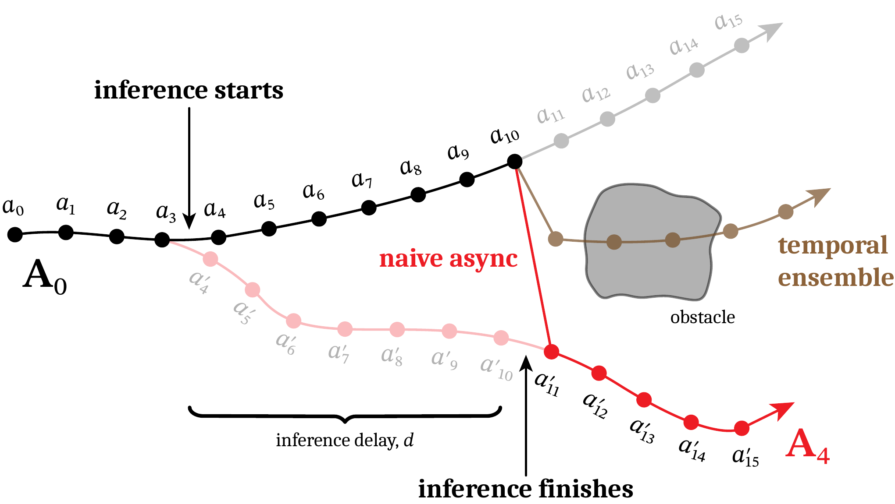{width=68%}

RTC 的做法可以类比成**修图**：已经在执行、来不及改的动作直接"冻住"，只对还没到的未来段重新生成，接缝处用软过渡保证连续。

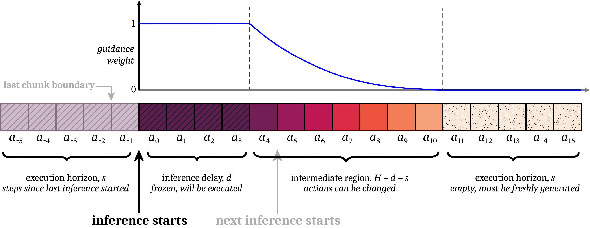{width=80%}

它完全免训练、即插即用，在注入 +100 / +200 ms 延迟时依然不崩。它解决的是"一个块怎么平滑地接到下一个块"。

## 1.4 FASTER：不只不卡，还要反应快

执行平滑了还不够。打乒乓球这种任务，球飞过来到要挥拍只有几百毫秒——机器人"看到"之后还得等整轮去噪（比如 10 步）跑完才出第一个动作，机会窗口早就关了。

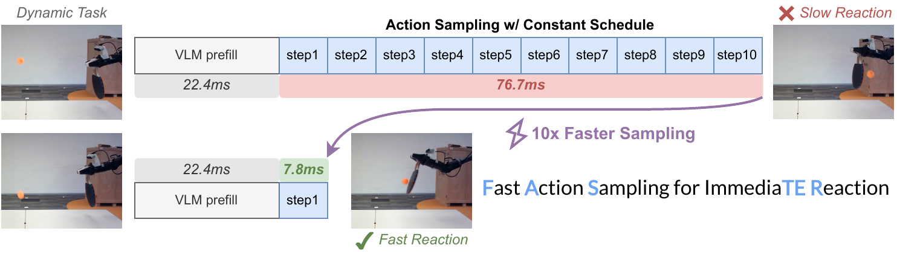{width=86%}

FASTER[2] 的关键观察是：近端动作路径直，**一步就能估准**，只有远端动作才真正需要多步去噪。于是让近端动作一算好就立刻发给机器人，不必等整块凑齐。

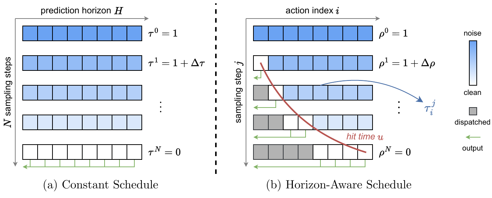{width=80%}

读这个"10×"要留神它量的是哪一段：论文压缩的是**近端动作的去噪采样**，从 10 步 76.7 ms 变成 1 步 7.8 ms，约 10 倍；而首动作延迟前面还挂着一段 22.4 ms 的 VLM prefill，谁也压不掉，所以端到端的首动作延迟是从约 99 ms 降到约 30 ms，三倍出头。**"采样快 10 倍"和"反应快 10 倍"不是一回事**——这类加速比读的时候先问一句"分母里含不含 prefill"。RTC 和 FASTER 都属算法层：只改推理期的调度策略，不动模型、不重训。

## 1.5 Realtime-VLA V1：把模型本身榨到 30 FPS

上面算法层那些做法，都是在"单次推理耗时给定"的前提下把停顿和抖动藏起来；它们没有让模型本身变快。可现实是以 PaliGemma 3B 为骨干的 $\pi_0$，用一份照着模型结构直写的 PyTorch 实现，在 RTX 4090 上双视角单次推理要 106 ms，连 30 FPS（$\leq 33$ ms）的重规划节奏都摸不到。这时要换一个层面：不改算法，把模型本身在硬件上跑快。

这条线的第一篇论文题为《Running VLAs at Real-time Speed》[3]，后续两篇顺着它自称 V2、FLASH，所以下文按 **Realtime-VLA V1 / V2 / FLASH** 这个通行叫法称呼三者。V1 的核心是 **Full Streaming Inference** 框架：把"看场景"的大模型（计算密集）和"出动作"的 Action Expert（访存密集）拆成两条频率不同的回路**并发**跑——大模型慢回路几十毫秒看一次场景，Action Expert 快回路最快约 2 ms 就出一次动作，互不阻塞。

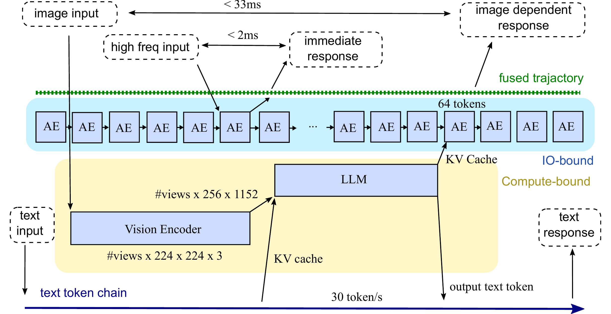{width=82%}

配合 kernel 工程（把整张网络约化成约 24 个 GEMM 类算子加配套的标量算子，逐个手调：RMSNorm 的仿射参数折进后面的线性层、QKV 融合等），同一张 RTX 4090 上双视角推理从 106 ms 压到 **27 ms**——跨过了 30 FPS 那道 33 ms 的门槛，论文给出的部署口径也正是 30 Hz。再靠 Full Streaming Inference 把 Action Expert 解耦出来单独高频跑，**轨迹参考的更新频率**最高冲到 **480 Hz**。要注意它**不等于力矩环或阻抗控制环的频率**——能不能真正满足力控 / 阻抗控制的要求，还取决于力传感、总线周期、实时操作系统、控制器稳定性与抖动，需要由底层实时控制栈单独验证。

系统层把速度地基铺好之后，问题就换了一副面孔：**能跑这么快，不等于该一直跑这么快。**

## 1.6 学会调速与少推理：V2 与 FLASH

把模型跑快之后，还有两类问题，分别由学习层和投机层来补，这里各给一句直觉：

- **Realtime-VLA V2[4]**：跑快了立刻露馅——轻量臂高速会抖、示教数据全是"舒适速度"导致一加速模型就懵。问题本质不是"能不能快"，而是**何时快、何时慢**，这得学。V2 给出一套全栈流程（速度自适应模型定节奏 + 时域/空域优化抹平滞后），并且先把系统时延一项项标出来对齐：相机曝光 55 ms、读出 33 ms、关节反馈 50 ms、运动滞后 150 ms，四项加起来已经接近 300 ms——不先把这些补偿掉，模型学到的"什么时候该减速"全会错位。在折衬衫、把 PCB 插进公差约 0.2 mm 的治具这些任务上，它能做到接近人类操作速度，且在精细阶段自动减速。
- **Realtime-VLA FLASH[5]**：传送带分拣里大多数时候动作和上一轮几乎一样，何必每次从头算？FLASH 借用大模型的**投机推理**：用一个 110M 的小模型（主干 VLM 约 2.7B，小模型只占 4%）一步猜出整块动作，配合 Triton kernel 一轮只要 7.8 ms；主模型只做快速并行验证，猜对直接用，猜错或要精细抓取时才回退完整推理（一轮 58 ms）。任务级平均延迟因此降到 19.1 ms，约 3 倍加速。

## 1.7 本节小结

实时不是单点 trick，而是三条线合力：算法层（调度）消除停顿/抖动、压缩反应盲区；系统层（硬件榨取）让模型本身进 30 ms，是上层方案的速度地基；学习+投机层（自适应 + 投机）把平均延迟压到极限。缺哪一条，都只是部分答案。

# 2 长时记忆：让 VLA 记得住、想得到

## 2.1 单帧 VLA 的马尔可夫假设为什么不够

绝大多数 VLA（OpenVLA、$\pi_0$、ACT……）都有一个隐含假设：**当前这一帧，足以决定下一步动作**——也就是把单帧观测当成了充分统计量。

可真实操作任务常常是**部分可观测**的：单帧不足以恢复出决策所需的状态。

- 机械臂挡住了关键区域，当前帧看不全；
- "按按钮"任务，按前按后画面几乎一样，分不清按过没有（两个不同的真实状态映射到几乎相同的观测，这叫**状态别名**）；
- 多阶段任务里，早一步的决定影响晚一步该怎么走；
- 传送带上的物体在动，得预判它会移到哪。

要说准确的话：**环境的状态转移本身可以仍是马尔可夫的**，问题出在策略只拿到了部分观测——这类问题的标准刻画是 POMDP（部分可观测马尔可夫决策过程）。所以补救办法不是"放弃马尔可夫性"，而是把决策依据从单帧扩成足以近似状态的东西：引入历史、记忆，或做状态估计。

一句话：**只看当下一帧的 VLA，既不会用过去，也不会预判未来，于是长程任务做不下来。** 这条研究线就是在回答——怎么给 VLA 装上"记忆"和"想象"。

## 2.2 一条主线：从隐式上下文到记忆+想象

这个方向的工作可以排成一条由隐到显、再从记忆走向想象的主线：

| 阶段 | 代表工作 | 一句话定位 |
|------|----------|-----------|
| 看过去 1： 隐式 | Long-Context DP | 把历史当长上下文，用"也预测过去"正则 + 缓存训练，又好又省 |
| 看过去 2： 轻量 | HAMLET | 给现成 VLA 外挂可学习 token + 轻记忆，免重训就会用历史 |
| 看过去 3： 检索 | Chameleon | 观测-动作延迟；记忆要可区分 / 可寻址 / 可前瞻 |
| 看过去 4： 记忆库 | MemoryVLA | 仿海马体的显式感知-认知记忆库：检索-融合-巩固 |
| 看过去 5： 双记忆 | Dual-Memory VLA | 把"先验"和"近期动作一致性"也当记忆，生成又快又稳 |
| 看未来 1： 想象 | MemoryVLA++ | 在记忆之上加世界模型，潜空间想象未来 |
| 看未来 2： 预测 | BagelVLA | 语言规划 + 视觉预测 + 动作交错统一，单步残差低延迟 |
| 长程收口 | Long-VLA | 输入掩码把子任务切成移动 / 交互两段，端到端拿到技能串接 |

前五行在"用好过去"，第六七行加上"预判未来"，最后一行直指"长程"。2.3 到 2.6 从这张表里取四篇：先立一把判断记忆好坏的标尺，再看这把标尺下三种不同的答法。

## 2.3 记忆要"找得回、用得上"：Chameleon 的三条标尺

Chameleon[6] 用**猜杯子**点破问题：先看到球藏在哪个杯子下、洗牌后球已不可见、最后却要选对——决定动作的信息早被看到、用时却已看不见，这叫**观测-动作延迟**。

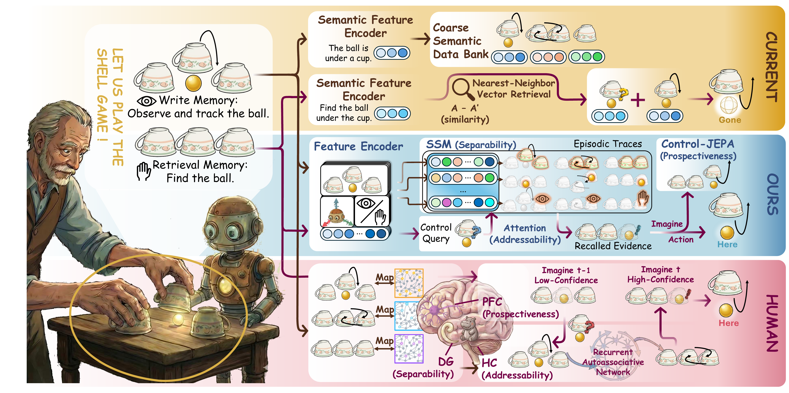{width=96%}

它主张记忆要同时满足三件事——**可区分**（不同历史要能分开）、**可寻址**（用得上时找得回）、**可前瞻**（能为将来的决策预先准备）。这三条是审视任何记忆系统的标尺，2.4 到 2.6 那几篇都可以拿它来对照。

## 2.4 MemoryVLA：把记忆做成显式记忆库

如果说 2.3 节立的是"记忆该长什么样"，MemoryVLA[7] 给出的就是一套照着它做出来的显式记忆库。它仿照人类的双记忆系统：**工作记忆**（感知 token + 认知 token）记当下，**感知-认知记忆库**记长期历史。

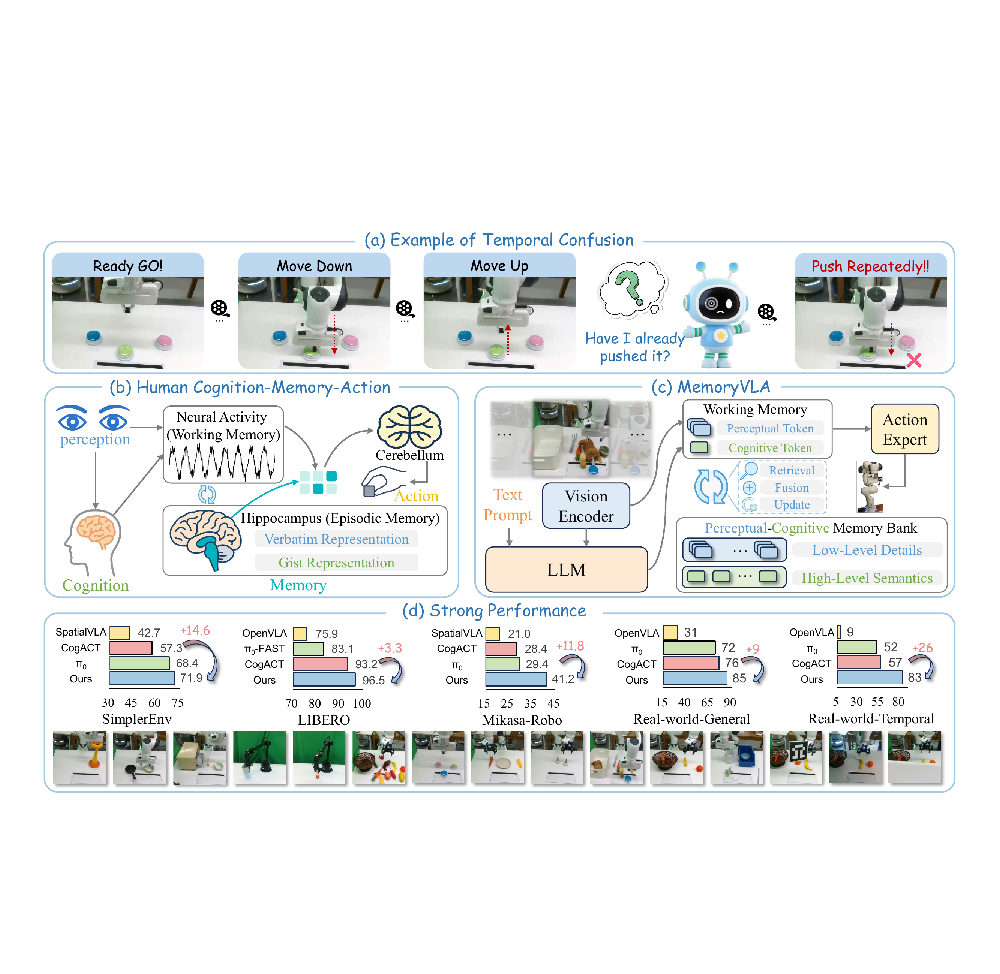{width=94%}

三步机制：**检索**（带时间编码到记忆库里查相关历史）→ **门控融合**（自适应地把历史与当下混合）→ **巩固**（合并相邻最相似的条目，防止记忆库无限膨胀），最后由记忆条件的扩散动作专家输出动作。这套机制让它在长程真机任务上明显领先只看当下的基线。

## 2.5 从"记住过去"到"预判未来"：MemoryVLA++

时序建模还有另一半——**想象**。按按钮任务靠记忆，传送带抓取却要靠想象（预判物体会移到哪）。

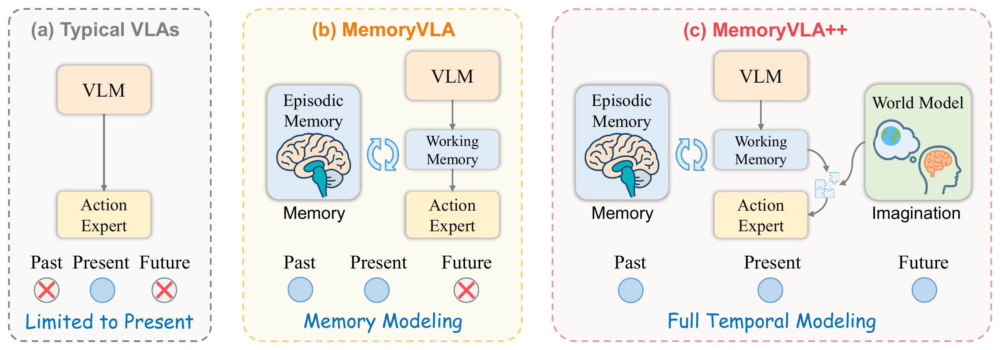{width=86%}

MemoryVLA++[8] 在记忆之上加一个**世界模型**，在一个去噪的潜空间里想象出紧凑的未来 token（注意：想象发生在潜空间，不生成完整的像素帧，避免逐帧生成的误差被带进动作），让"现在 + 过去 + 未来"一起驱动动作。于是记忆与想象——时序建模的两半——终于凑齐。

## 2.6 Long-VLA：把长程能力直接收口

无论记忆还是想象，最终都服务于**长程多步操作**。长程的难点在**技能串接**：端到端模型不擅长串接，把多个策略拼起来又失了统一。

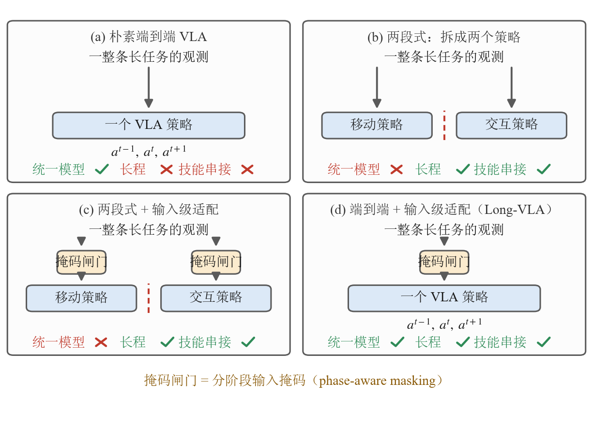{width=100%}

图里四格是按"三项能占几项"排的。(a) 朴素端到端 VLA 只有一个策略吃整条长任务，**统一**这一项占住了，但它撑不住长程、也管不了技能串接。(b) 把任务拆成移动策略与交互策略两个模型，**长程**这一项拿到了，代价是统一没了——两个方框中间那道红色虚线就是接缝，交接处得另外想办法，所以串接这一项仍是空的。(c) 在两段式的基础上给每个策略的输入侧加一道**掩码闸门**，接缝靠输入级适配接住，串接这一项才补上，但仍然是两个模型。(d) 是 Long-VLA[9] 的位置：闸门保留、策略只剩一个，三项同时占齐。

关键在最下面那行说明的闸门本身。**分阶段的输入掩码**（phase-aware masking）把每个子任务切成**移动 / 交互**两段：移动段只放行远处的导航线索、遮住近处的操作线索，交互段反过来。同一个模型在两段里看到的输入不一样，等于自己扮演了两个专用策略，接缝就不必再交给第二个模型。Long-VLA 靠这一手在一个端到端统一模型里拿到技能串接能力，直接以"把长任务真正做完"为目标收口。

## 2.7 易混点："记忆"和"想象"各指好几样东西

2.2 那张表里还有四篇没单独展开，先各给一句，再把它们放到一起比：**Long-Context DP**[10] 走的是最省事的一路，不建记忆库，把历史直接当长上下文，再用"顺便也预测过去"这个正则逼模型真的去看历史；**HAMLET**[11] 走的是最省钱的一路，给现成 VLA 外挂一组可学习 token 加一个轻量记忆模块，原模型不用重训就变得会用历史（history-aware）；**Dual-Memory VLA**[12] 把"记忆"的定义往外扩了一格——除了观测历史，生成先验和最近几步动作的一致性也算记忆；**BagelVLA**[13] 则不满足于只加记忆，把语言规划、视觉预测、动作生成交错编排进同一个模型。

连同前面四节，"记忆"和"想象"在这条线里已经指了好几样不同的东西。听到这两个词时要先问一句：

- **记的是什么**：MemoryVLA 记的是**观测历史**；HAMLET 记的是每步压缩的 **token**；Dual-Memory 记的是**生成先验 + 近期动作**；Long-Context DP 根本不建记忆库，只把历史当**长上下文**。
- **想象怎么做**：MemoryVLA++ 是**世界模型潜空间想象**；BagelVLA 是**语言规划 + 视觉残差预测**。都想"看未来"，一个偏视觉生成、一个偏推理+预测。
- **记忆不等于长上下文**：把历史一股脑塞进上下文只是最朴素的一种，又贵又容易错配预训练分布——2.4、2.5 两节之所以要绕开它、去建"显式、可检索、可压缩"的记忆库，理由就在这里。

## 2.8 记忆的代价，以及"收益是在哪量出来的"

1.2 节给三条实时路线各记了一笔代价，这一节也得记。给 VLA 装记忆不是白装的：

- **它和第 1 节的目标直接打架。** 每一步都要去记忆库里检索、再和当下融合，这些计算原本不存在。1.5 节费半天劲把单次推理从 106 ms 压到 27 ms，这一节又往每一步里加一道检索和一道融合——两条线是同一台机器上的资源竞争，不是可以各自庆祝的两项进展。
- **巩固是有损压缩。** 记忆库不能无限长，所以 MemoryVLA 要合并相邻最相似的条目。可"相似"是模型自己判的：合错了，那段历史就等于没记过，而且没有任何报错告诉你它丢了什么。
- **长上下文那条路省事但更贵。** 把历史一股脑塞进上下文，序列长度线性涨、注意力开销更陡，还容易偏离预训练时的分布——2.7 节说的就是这件事。

还有一条读论文时更该带着的警觉：**这条线上的收益，绝大多数是在专门为"需要记忆"而造的任务上量出来的。** Chameleon 干脆自己造了一个基准，把决策场景做成视觉上有歧义、必须靠更早的观测才能判断；MemoryVLA++ 在真机上报的三个数把这件事摆得很清楚——一般任务提升约 9 个百分点，而依赖记忆和依赖想象的两类任务分别是约 26 和 28 个百分点。同一个模型，换一批不吃记忆的任务，收益会缩水到三分之一。

所以从隐式长上下文，到显式记忆库，再到记忆 + 想象与长程收口，这条线确实让一个只会看当下的策略学会了用过去、预判未来。但它的正确读法不是"记忆让 VLA 更强"，而是一个先要问自己的问题：**你的任务里到底有没有观测-动作延迟？** 有，这些方法值回它的推理开销；没有，你付了成本却买不到多少东西。

# 3 人形全身 VLA：让语言驱动整个身体

## 3.1 人形全身难在哪

桌面机械臂的 VLA，主要难在"看懂场景、选对动作"。换成人形机器人，难度会突然上一个台阶：它不是一只固定在桌边的手，而是一个会移动、会转身、会蹲下、会被上肢动作牵动重心的完整身体。所以人形全身 VLA 不是简单把动作维度加大，它同时遇到四个问题：

- **语言要落到全身动作**：一句"走过去挥手"不是末端位姿，而是一段全身运动风格。
- **视觉要决定空间关系**：椅子在左还是右、物体远还是近，会改变身体怎么走、怎么停、怎么伸手。
- **高层语义和低层控制频率差太大**：VLA 可以慢一点想，但腿和身体必须高频稳定执行。
- **数据太贵**：人形全身遥操作、动捕、真机采集都比桌面操作贵得多。

这些难点最后都收敛成同一对矛盾：

> 一边是"懂任务、但不会走路的大脑"，一边是"会走路、但不懂任务的身体"，怎么把这两条线拼成一个端到端、会全身干活的系统？

把这两端拼起来不是某一家一步到位的，而是一串工作各自推进、逐渐拼出来的。3.2 到 3.9 这八小节按**问题的递进顺序**排（这是叙述线索，不是时间线——同期工作很多是并行发布的）：3.2 先证明语言能直接驱动全身，3.3 用一个潜在接口把"高层想"和"低层动"分开，3.4 把这个双系统大脑做成开放基础模型；3.5 与 3.6 转向身体这端，先把会走稳的底座统一起来、再把它做大；3.7 与 3.8 回到大脑，补上"会移动"和"数据从哪来"两块；3.9 把两端正式合龙。

## 3.2 LangWBC：先证明语言能直驱全身

这条线上最先要回答的一道题是：如果没有视觉，只有一句语言指令，能不能让人形直接做出全身动作？LangWBC[14] 没有走传统的"语言 → 参考轨迹 → 跟踪控制器"路线，而是训练一个最终部署用的 **CVAE Student**——CVAE 是条件变分自编码器（Conditional Variational Autoencoder），一种能按给定条件采样出多样输出的生成模型。这个 Student 输入语言和本体感知，直接输出全身动作。

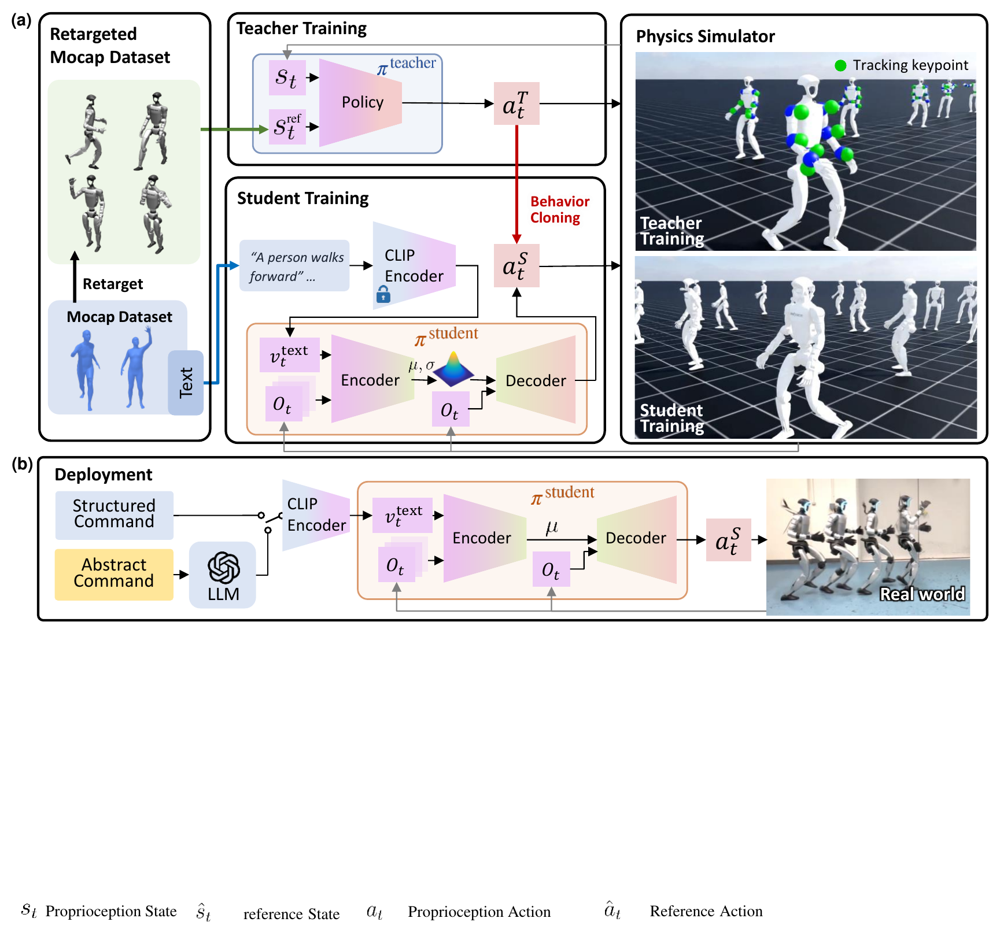{width=88%}

这里值得记住的是 Teacher / Student 分工：Teacher 不懂语言，只在训练中提供高质量全身动作；Student 才是部署时使用的策略，把语言条件和身体状态对齐到同一个动作空间；中间的 CVAE 隐空间像一个"动作风格旋钮"，让走、跑、挥手、转身这类动作可以泛化、切换、插值。LangWBC 先证明了一个基础能力：**语言可以直接接到人形全身控制上。** 它缺的是视觉。

## 3.3 LeVERB：高层看图、低层稳执行

LeVERB[15] 把视觉补了进来：机器人不只听语言，还要看第一视角图像。"坐到椅子上"这句话，椅子在哪、朝向如何，必须由视觉决定。它的核心是快 / 慢双系统。

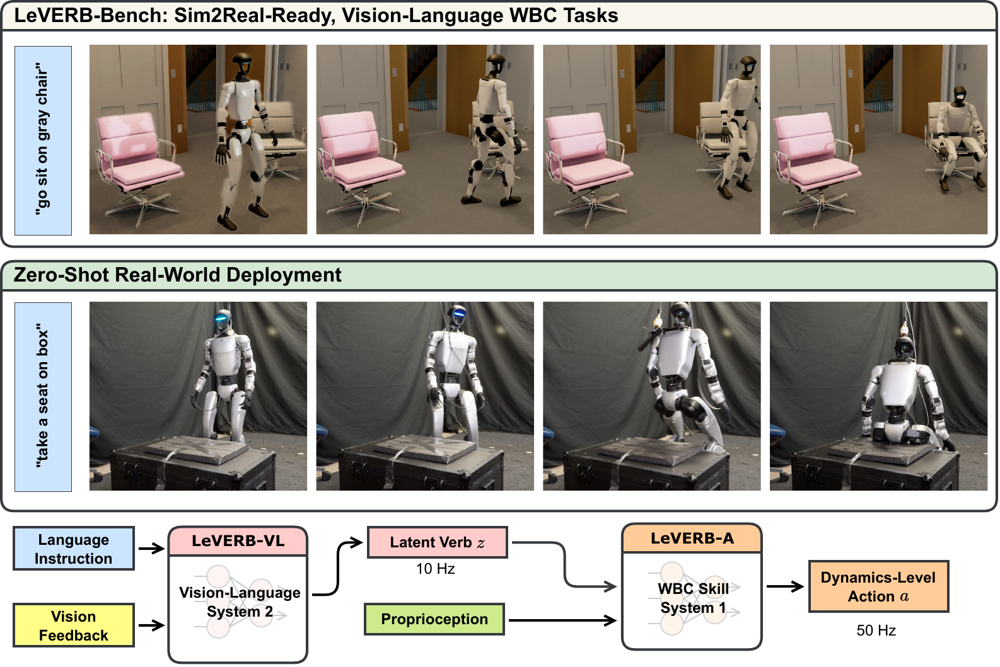{width=86%}

高层负责"看懂要做什么"，低层负责"把身体稳稳做出来"，中间只传一个潜在 verb。这个潜在 verb 不是自然语言单词，也不是关节角，而是一段动作意图的压缩表示——这一节后面还会反复见到的"潜在接口"，最干净的范例就是它。

图里那两个频率要读准：10 Hz 是高层重新看一眼场景、吐一个新 verb 的节奏，50 Hz 是低层把 verb 展开成关节命令的节奏，两者都不是电机力矩环的频率。整本书遇到快 / 慢双系统都按这个口径读（同第11讲 3.3.4 节）：高层刷新率、动作块生成节奏、底层控制器执行频率是三个不同的量，别拿一个 Hz 概括整套系统。

LeVERB 让视觉语言任务终于能接到人形全身动作上。这个"快慢双系统 + 一个潜在接口"的骨架很好用，同期也有别的工作把它推向更大规模。

## 3.4 GR00T N1：强大脑，但没有腿

GR00T N1[16] 走的是同一个快 / 慢分层思路。它和 LeVERB 谁也没顺着谁——N1 公开更早（2025-03-18），LeVERB 随后（2025-06-16）才给出 latent verb 这个接口，两者是并列的探索。N1 的贡献在于把这套分层做成一个开放、可规模化的基础模型。它要对付的根本困难是：文字和图像有互联网级数据，人形机器人却没有——每条真机轨迹都要一个人实地遥操作才能产生。N1 的主张是把异构数据按"规模"和"本体专属性"组织成一座**数据金字塔**。

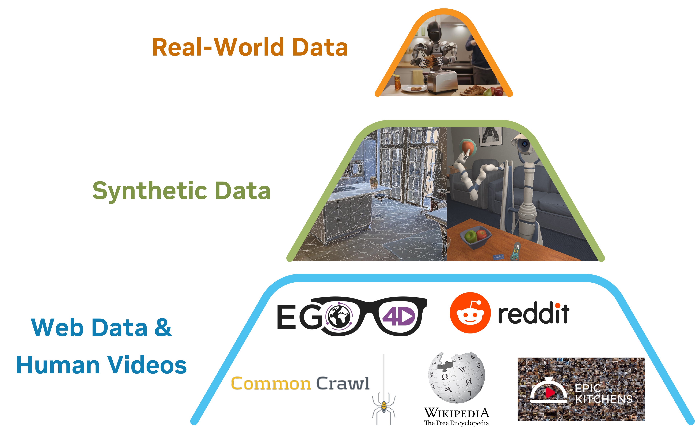{width=56%}

模型本身就是这样一个双系统 VLA：一个作为 System 2 的 VLM 负责"想清楚要干什么"，一个作为 System 1 的扩散 Transformer（Diffusion Transformer，DiT，用 flow matching 训练）负责"把动作流畅地动出来"，两者用交叉注意力相连——和 LeVERB 属于同一类快 / 慢分层设计，只是被做成了开放基础模型。

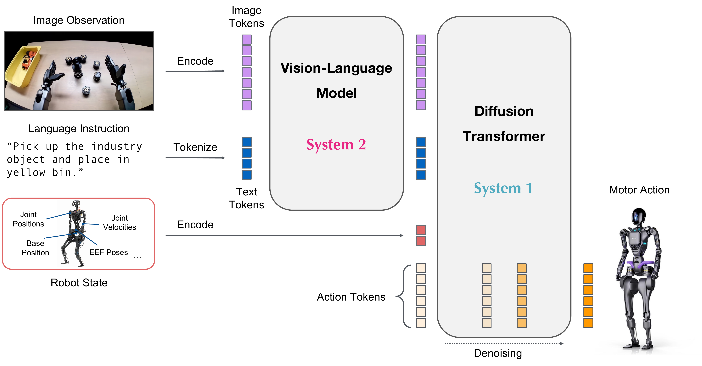{width=80%}

图里的两条链要分开看：上半条是图像与语言先转成 token 送进 VLM，下半条是机器人状态（关节位置、关节速度、基座位置、末端位姿）单独编码，两者汇进 Diffusion Transformer，由它对一串动作 token 反复去噪，最后出电机动作。**注意 System 1 / System 2 在这里只是架构分工的标签，图上没有给任何频率**——这套系统实际跑多快，得看论文正文里对具体本体报告的数字。

但 N1 第一版只做短时程桌面操作，论文的局限性写得很直白——**长时程的全身移动操作（loco-manipulation，边走边操作）还没有**。这个"有强大脑、却没有全身底座"的缺口，定义了下一步要补的东西：一个真正会走、会稳的身体。

## 3.5 HOVER：立底座

要补的就是这条"腿"。HOVER[17] 的洞察是：**全身运动模仿可以当所有控制模式的公共底座。** 不管最后要"走快点"还是"把手举到这里"，背后都指向同一件事——让机器人像人一样稳、协调地动。

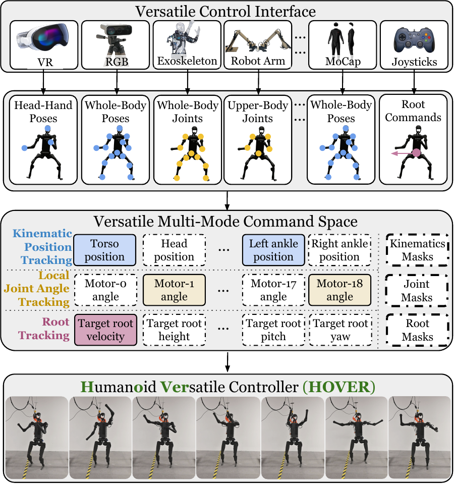{width=90%}

图里那组掩码是关键：命令空间同时覆盖上半身和下半身，每个维度用三种原子模式之一跟踪，具体这一次跟哪些由掩码指定。论文因此可以说，此前那些人形全身控制工作各自的命令空间，都是这个大空间的一个子集——导航那类只用根速度跟踪，桌面操作那类只用上半身关节角跟踪，都能在这张大表里划出一块。做法上是先用大规模人类动捕训一个看得到完整信息的 oracle 老师，再蒸馏进一个只看得到残缺指令的学生。这样一张网就能吃下导航、loco-manipulation、桌面操作等多种模式，**并且在模式之间无缝切换、各模式原有的长处都保住**——省下的是"每换一种控制模式就重训一个策略"的功夫。值得一提的是，这套"oracle 老师 → 残缺指令学生"的蒸馏，和 3.2 节 LangWBC 的 Teacher → CVAE Student 是同一个套路——都靠蒸馏把一个会全身动的控制器逼出来，区别只在 LangWBC 给学生加了语言条件、HOVER 追求把所有控制模式装进一张网。

## 3.6 SONIC：做大底座

HOVER 证明了底座可以统一，SONIC[18] 接着把它做大。它诊断出人形控制吃不到"规模红利"的卡点不在算法、而在任务选择，于是把**动作追踪**当成那个可规模化的基础任务（逐帧贴近动捕轨迹，监督稠密、不用设计奖励），沿网络规模、数据量、算力三条轴一起放大（论文自己用的词是 supersize），做成一个全身控制的行为基础模型，并暴露出一个干净的**通用 token 接口**。

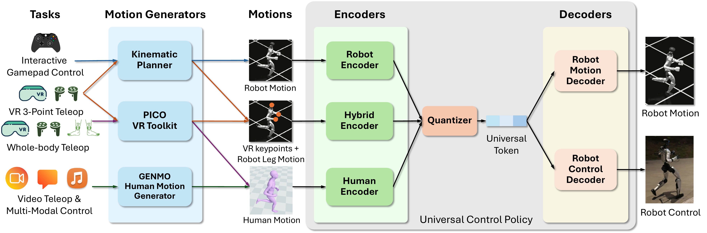{width=90%}

图里最值得看的是中间那个瓶颈：手柄、VR 三点遥操作、全身遥操作、视频与多模态控制四类来源，各走各的编码器（机器人动作走 Robot Encoder、VR 关键点加腿部动作走 Hybrid Encoder、人类动作走 Human Encoder），量化成同一串**通用 token**，再交给下游的解码器落成机器人运动或实机控制。这样一来，"换一种指令来源"就不再意味着"重训一个控制器"——这正是一个可规模化底座该有的样子。至于能不能把 VLA 也接到这个 token 接口上，是个很自然的下一步；3.9 节会看到，工程上真正合龙时走的是另一条路。

## 3.7 WholeBodyVLA：移动服务操作

低层的身体和它的接口都立住了，回到大脑这端——它的能力也在同步往前补。第一块是"移动"。桌面操作默认手已经在物体旁边，可人形先得走过去——而且不是走到附近就行。WholeBodyVLA[19] 把这一步提成核心问题，叫**面向操作的移动**（manipulation-aware locomotion）：人形不是走到某处就结束，而是要边走边为操作创造条件。论文为此专门训了一个面向 loco-manipulation 的强化学习策略，只求把前进、转身、下蹲这三件事做准做稳——因为它们正是"把身体摆到能干活的位姿"最常用的三个动作。移动不再是"先导航到附近再开始操作"，而是主动把整个身体带到适合操作的位置和姿态。

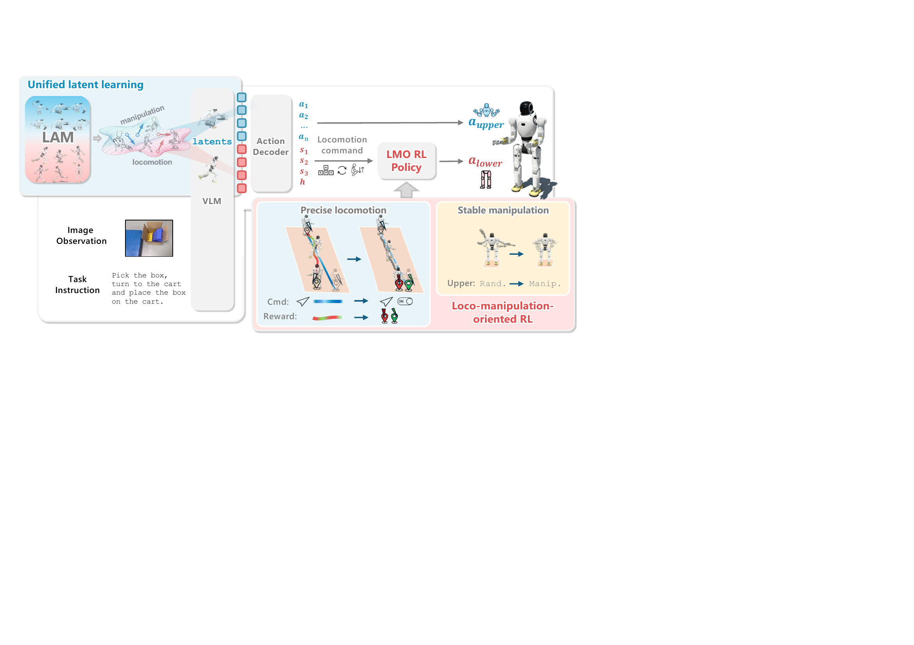{width=92%}

实现上它从大量无动作视频里学**潜在动作**：把相邻两帧的画面变化翻译成离散伪动作标签当监督；VLA 再同时预测操作和移动两路潜在码，最后由轻量解码器分别落成上肢动作和下肢移动指令。它和 3.4 节 GR00T N1 内部"给无动作视频打伪标签"**共享同一个动机**——都想用无动作视频扩数据、绕开昂贵的真机动作标注——但技术实现并不相同：

| | GR00T N1 | WholeBodyVLA |
|---|---|---|
| 伪标签来源 | 在异构数据金字塔里给无动作视频打潜在动作伪标签 | 由相邻帧画面变化学出离散潜在动作码本 |
| 训练目标与下游用途 | 潜在动作作为预训练监督，服务统一的双系统动作生成 | 显式预测操作 / 移动两路潜在码，再各自解码成上肢动作与下肢移动指令 |

所以别把它们读成"同一个思路"就带过去——latent 的语义和它最终被怎么用，是两者真正的分水岭。还有一条更容易混的：N1 那套潜在动作只活在**训练期**，用来给无动作视频造监督信号，推理时并不存在；而 3.3 节 LeVERB 的 latent verb 是**推理期**高层与低层之间真正传输的东西。同样叫 latent，一个是数据工具，一个是运行时接口。

## 3.8 Humanoid-VLA：数据规模化

第二块是"数据"。3.2 到 3.7 那几篇都默认有配好的指令-动作数据可训，可人形全身数据偏偏是最贵的一种。Humanoid-VLA[20] 换到数据视角，回答"训练信号从哪来"：再漂亮的架构，没有数据也训不出来。

它的主线是"先学怎么动，再补看什么"——先把身体动作离散成 token、像语言一样做预训练（语言-运动预对齐），让模型先掌握"人形的身体怎么协调地动"；再接入第一视角视觉做条件微调，补上"看到什么、做什么"。关键一招是把海量**无标注视频**组织成自监督任务，廉价地变成可训练的指令-动作配对，绕开昂贵的真机遥操作。把身体动作离散成 motion token，和 3.6 节 SONIC 那个"通用 token"是同一个动作 token 化的思路——两边都把连续的全身动作变成一串离散 token，好让大模型像处理语言一样处理它。

## 3.9 GR00T N1.5 / N1.6：用解耦全身控制把两条线合龙

大脑这端（语言、视觉、移动、数据、动作 token）和身体那端（HOVER 的统一命令空间、SONIC 的规模化底座）都齐了，最后一步是把两端拼成一个端到端系统。GR00T N1.5 / N1.6[21] 就是合龙的地方——它不是一篇新论文，而是把前面几块积木拼起来的工程节点。合龙前大脑先升级：N1.5 换了更强的 VLM，并加入 FLARE（未来潜在表征对齐）——只让模型对齐未来帧的潜在表征，不生成未来画面，从而能从人类第一视角视频里学到东西[22]；N1.6 进一步换成 Cosmos-2B 的内部变体，把 DiT 从 16 层扩到 32 层，改成预测相对于当前状态的动作块而不是绝对关节角或末端位姿，并加入更多跨本体数据。

真正的拼法是 **decoupled WBC**——解耦的全身控制（WBC 即 whole-body control，全身控制）。最朴素的想法是让 VLA 直接吐每个关节的角度，但腿的动态平衡是一套高频、对扰动极敏感的控制问题，让擅长"理解任务"的大脑同时学走路既低效又脆弱。GR00T 的选择是把身体沿上下拆开：

> **下半身**交给一个强化学习出来的策略负责走、转、蹲、稳；**上半身**用逆运动学（inverse kinematics, IK）把目标位姿解成关节角[23]。VLA 大脑（双系统里的 S2，慢、懂任务）只管输出上肢要去哪、身体要往哪走这类高层命令；这套解耦控制器（S1，快、稳、会走路）接过命令，高频执行成电机指令。

注意这里和 3.6 节的 SONIC 是**两条并列的路线，不是上下游**：NVIDIA 把它们放在同一个全身控制平台里发布，一边是 N1.5 / N1.6 在用的 decoupled WBC，一边是 GEAR-SONIC 这种用动作追踪训出来的统一全身策略[23]。前者靠"把问题拆开"取胜，后者靠"把一张网做大"取胜，都是可用的底座，只是各自赌了不同的东西。

不管走哪一条，收益是同一个：两端可以独立迭代、各自规模化。大脑越做越懂任务，底座越做越稳越通用，互不拖累。绕了一圈会发现，这个解耦接口和 3.3 节 LeVERB 的"潜在接口"是同一件事在工程上的落地版本——从一句话指令到全身电机命令，中间始终隔着一个干净的中间层，只不过这一层里跑的从一个潜在向量变成了几路可读的分块命令。

## 3.10 本节小结

人形全身 VLA 的关键不是某个模型，而是一个反复出现的招式：在"想做什么"的高层语义和"怎么稳稳做出来"的低层全身控制之间，插一个潜在 / 解耦的中间接口。把它放在哪、用什么形式实现，就是这一节几篇工作最主要的差别：

| 接口形式 | 它连接什么 | 直观作用 |
|------|------------|----------|
| CVAE 隐变量（LangWBC） | 语言条件与动作风格 | 给全身动作留出可泛化、可插值的风格空间 |
| latent verb（LeVERB） | 视觉语言高层与 50 Hz 控制器 | 把"场景里该做什么"压成低层能执行的动作意图 |
| 潜在动作（WholeBodyVLA） | 无动作视频与 VLA 训练 | 把两帧画面变化翻译成离散伪动作标签 |
| motion token（Humanoid-VLA） | 原始姿态与大模型 | 把连续身体动作变成语言模型能学习的离散序列 |
| 通用 token（SONIC） | 各路指令源与同一个控制解码器 | 把手柄 / VR / 全身遥操作 / 视频统一成一种内部 token |
| 上下解耦的高层命令（GR00T N1.5/N1.6 的 decoupled WBC） | VLA 大脑（S2）与解耦全身控制器（S1） | 大脑只出"上肢去哪、身体往哪走"，下肢用 RL、上肢用 IK 各自高频执行 |

把这张表竖着读，是同一个判断：让"想做什么"和"怎么稳稳做出来"在一个干净的接口处分工——既把复杂全身动作压进一个可沟通、可泛化的中间空间，也让大脑与身体能各自独立迭代、各自规模化。

代价同样要记一笔，而且这一笔比前两节的更硬：**接口划在哪，天花板就落在哪。** 大脑只能说出接口里有的词——底座学不会的动作，再懂任务的大脑也表达不出来，LeVERB 的潜在 verb 表达不了 WBC 策略没练过的行为，decoupled WBC 的上肢 IK 也做不出需要全身协同发力的动作。同时，一旦接受了这个分层，**端到端联合优化就被放弃了**：两端各自最优不等于整体最优，"走过去的姿态会不会妨碍接下来抓取"这类跨层的事，恰恰是 3.7 节那个"面向操作的移动"想补回来的东西。换句话说，这一节所有工作都在同一条张力上取值——分得越干净，越好规模化，也越难做那些必须跨层才做得成的事。

# 4 本讲小结与下一讲

## 4.1 三条前沿的共同方向

这一讲沿三个方向看了 VLA 的前沿：实时推理（算法 + 系统 + 学习三线合力，让大模型跟上控制频率）、长时记忆（从隐式上下文到显式记忆库，再到记忆 + 想象与长程收口）、人形全身 VLA（在高层语义和低层全身控制之间插一个潜在 / 解耦接口，让语言驱动整个身体）。

把它们放在一起，会看到一个共同方向：**VLA 正在从"单帧、桌面、单臂"走向"高频、长程、整身"。** 快、久、全身，分别在时间的三个尺度上给 VLA 松绑——一次推理的时间、一个任务的时间跨度、一个身体的空间范围。

更值得记住的是三条线用的**是同一个招式**：把一条原本要一口气走完的链路，在中间切开一刀，让两边按各自的节奏跑。

- 实时那条线切的是**时间**：RTC 把一个动作块切成冻结段 / 软过渡段 / 自由重画段，FASTER 沿时间视界把去噪步数切成"近端一步、远端多步"，V1 干脆把大模型和动作专家切成两条频率不同的并发回路。
- 记忆那条线切的是**信息**：决策依据从"单帧"切成"工作记忆 + 可检索的记忆库"，当下和历史各存各的、各有各的更新节奏。
- 人形那条线切的是**职责**：懂任务的大脑和会走路的身体切开，中间只留一个潜在 verb 或一组分块命令。

这三刀落在链路的三个互不相干的维度上——时间、信息、职责——这就是"同一个招式"这句话的
实质。而接缝同时也是账单的所在：切开之后，就再也没有一个模块能看见全局。这是本讲反复出现的
那对取舍，也是判断下一篇 VLA 前沿论文的起点。

## 4.2 读一篇 VLA 前沿论文，先问四句

开篇说这一讲要给你一把尺子。把上面这些教训收成四个问题，遇到新论文按顺序问一遍，多数时候够用了：

1. **它压的是哪一段？** 看到"N 倍加速"先找分母。1.4 节那个"10×"量的是去噪采样，把 22.4 ms 的 prefill 算进来就只剩三倍出头。加速比不写清楚起止点，就等于没写。
2. **它加的东西活在训练期还是推理期？** 同样叫 latent，GR00T N1 的潜在动作只是训练期给无动作视频造监督的工具，推理时并不存在；LeVERB 的 latent verb 是运行时高层与低层之间真正传输的东西。一个不占推理预算，一个占。
3. **收益是在什么任务上量的？** 2.8 节那三个数——一般任务约 9 个百分点、依赖记忆和依赖想象的任务约 26 和 28 个百分点——说明同一个方法换一批任务收益能差三倍。先看它的基准是不是专为这个能力造的。
4. **它把哪一层的活推给了谁？** 分层方案都会把难题挪个位置而不是消灭它：大脑不学走路，是因为底座学了；VLA 不预测关节角，是因为 IK 和 RL 策略接住了。**问清楚接住的那一方能力边界在哪，就知道整个系统的天花板在哪。**

## 4.3 下一讲：换范式进入强化学习

到这一讲为止，从第8讲到第13讲，我们走的都是**模仿学习**这条主线：从示教数据里学一个策略，无论是 ACT、扩散、流匹配，还是各种 VLA，本质都是"模仿专家怎么做"。它的天花板也很清楚：**纯离线的行为克隆一旦走到示教没覆盖的状态，就没有东西告诉它该怎么走回来。** 这不是模仿学习的宿命——DAgger、交互式模仿、数据聚合，以及专门补采纠正与恢复数据的做法，都能把"走错了怎么回来"学进策略里，第16讲的人在环方法走的就是这一路；但它们都得额外掏出交互机会或额外的数据，纯离线的那一版掏不出来。

下一讲开始换一个范式：**强化学习**让机器人在环境里试错、用奖励塑造行为，去触碰模仿学习够不到的地方。我们会从最朴素的 REINFORCE 出发、一路升级到 PPO，让宇树 G1 先学会走路，最后再把同一套 PPO 原样搬到动作跟随上。

# 参考文献

> 著录遵《GB/T 7714—2015》顺序编码制，正文标记 `[N]` 按首次引用先后编号。
> 圆括号内为 arXiv **v1 提交日期**（逐条对 arXiv abs 页的 submission history 核过），
> 方括号内为引用日期 2026-06-26。

[1] BLACK K, GALLIKER MY, LEVINE S. Real-Time Execution of Action Chunking Flow Policies[EB/OL]. (2025-06-09)[2026-06-26]. https://arxiv.org/abs/2506.07339.

[2] LU Y, LIU Z, FAN X, et al. FASTER: Rethinking Real-Time Flow VLAs[EB/OL]. (2026-03-19)[2026-06-26]. https://arxiv.org/abs/2603.19199.

[3] MA Y, ZHOU Y, YANG Y, et al. Running VLAs at Real-time Speed[EB/OL]. (2025-10-30)[2026-06-26]. https://arxiv.org/abs/2510.26742.

[4] YANG C, HU Y, MA Y, et al. Realtime-VLA V2: Learning to Run VLAs Fast, Smooth, and Accurate[EB/OL]. (2026-03-27)[2026-06-26]. https://arxiv.org/abs/2603.26360.

[5] NIU J, GU K, ZHAO Y, et al. Realtime-VLA FLASH: Speculative Inference Framework for Diffusion-based VLAs[EB/OL]. (2026-05-13)[2026-06-26]. https://arxiv.org/abs/2605.13778.

[6] GUO X, JIANG C, KIM HB, et al. Chameleon: Control-Indexed Prospective Memory for Visuomotor Manipulation[EB/OL]. (2026-03-25)[2026-06-26]. https://arxiv.org/abs/2603.24576.

[7] SHI H, XIE B, LIU Y, et al. MemoryVLA: Perceptual-Cognitive Memory in Vision-Language-Action Models for Robotic Manipulation[EB/OL]. (2025-08-26)[2026-06-26]. https://arxiv.org/abs/2508.19236.

[8] SHI H, LI W, XIE B, et al. MemoryVLA++: Temporal Modeling via Memory and Imagination in Vision-Language-Action Models[EB/OL]. (2026-06-08)[2026-06-26]. https://arxiv.org/abs/2606.09827.

[9] FAN Y, DING P, BAI S, et al. Long-VLA: Unleashing Long-Horizon Capability of Vision Language Action Model for Robot Manipulation[EB/OL]. (2025-08-27)[2026-06-26]. https://arxiv.org/abs/2508.19958.

[10] TORNE M, TANG A, LIU Y, et al. Learning Long-Context Diffusion Policies via Past-Token Prediction[EB/OL]. (2025-05-14)[2026-06-26]. https://arxiv.org/abs/2505.09561.

[11] KOO M, CHOI D, KIM T, et al. HAMLET: Switch your Vision-Language-Action Model into a History-Aware Policy[EB/OL]. (2025-10-01)[2026-06-26]. https://arxiv.org/abs/2510.00695.

[12] LI Z, HU B, SHAO R, et al. Global Prior Meets Local Consistency: Dual-Memory Augmented Vision-Language-Action Model for Efficient Robotic Manipulation[EB/OL]. (2026-02-22)[2026-06-26]. https://arxiv.org/abs/2602.20200.

[13] HU Y, ZHANG J, LUO Y, et al. BagelVLA: Enhancing Long-Horizon Manipulation via Interleaved Vision-Language-Action Generation[EB/OL]. (2026-02-10)[2026-06-26]. https://arxiv.org/abs/2602.09849.

[14] SHAO Y, HUANG X, ZHANG B, et al. LangWBC: Language-directed Humanoid Whole-Body Control via End-to-end Learning[EB/OL]. (2025-04-30)[2026-06-26]. https://arxiv.org/abs/2504.21738.

[15] XUE H, HUANG X, NIU D, et al. LeVERB: Humanoid Whole-Body Control with Latent Vision-Language Instruction[EB/OL]. (2025-06-16)[2026-06-26]. https://arxiv.org/abs/2506.13751.

[16] NVIDIA, BJORCK J, CASTANEDA F, et al. GR00T N1: An Open Foundation Model for Generalist Humanoid Robots[EB/OL]. (2025-03-18)[2026-06-26]. https://arxiv.org/abs/2503.14734.

[17] HE T, XIAO W, LIN T, et al. HOVER: Versatile Neural Whole-Body Controller for Humanoid Robots[EB/OL]. (2024-10-28)[2026-06-26]. https://arxiv.org/abs/2410.21229.

[18] LUO Z, YUAN Y, WANG T, et al. SONIC: Supersizing Motion Tracking for Natural Humanoid Whole-Body Control[EB/OL]. (2025-11-11)[2026-06-26]. https://arxiv.org/abs/2511.07820.

[19] JIANG H, CHEN J, BU Q, et al. WholeBodyVLA: Towards Unified Latent VLA for Whole-Body Loco-Manipulation Control[EB/OL]. (2025-12-11)[2026-06-26]. https://arxiv.org/abs/2512.11047.

[20] DING P, MA J, TONG X, et al. Humanoid-VLA: Towards Universal Humanoid Control with Visual Integration[EB/OL]. (2025-02-20)[2026-06-26]. https://arxiv.org/abs/2502.14795.

[21] NVIDIA GEAR Lab. GR00T N1.6: An Improved Open Foundation Model for Generalist Humanoid Robots[EB/OL]. [2026-06-26]. https://research.nvidia.com/labs/gear/gr00t-n1_6/.

[22] NVIDIA GEAR Lab. GR00T N1.5: An Improved Open Foundation Model for Generalist Humanoid Robots[EB/OL]. [2026-06-26]. https://research.nvidia.com/labs/gear/gr00t-n1_5/.

[23] NVIDIA GEAR Lab. GR00T Whole-Body Control: decoupled WBC models used in GR00T N1.5 / N1.6 and GEAR-SONIC[CP/OL]. [2026-06-26]. https://github.com/NVlabs/GR00T-WholeBodyControl.
