从第8讲开始，我们做的事情其实只有一件：训练一个**策略**，再把它部署到闭环里。第8讲立起了这个概念——策略就是从观测到动作的映射；第9到12讲围着它转了一整圈：采数据、用 ACT 和 VLA 学它、微调它；第13讲看了它的前沿形态。这一整段有个共同前提：**训练信号来自人的示教**——每一步都有人告诉网络"该做什么"。

这一讲把这个前提抽掉。有些事情示教教不了：没人能遥操作出人形机器人 29 个关节的行走节奏；示教信号只说"这一步该做什么"，不说"哪种做法回报更高"；走到示教没覆盖的状态更是无人可问。于是换一种监督信号：不再给"标准答案"，只给一个**能打分的奖励**，让机器人自己**试错**。这就是强化学习（Reinforcement Learning, RL）。

强化学习的概念和算法出了名的多而杂，这一讲不求全，只把入门必须的一条主线走透：先把"学走路"这个任务翻译成强化学习的语言，再建立一张**不会混淆的方法分类地图**，然后沿着地图上"基于策略"这一支，从最朴素的 REINFORCE 出发，每讲完一个算法就在**同一个任务**上跑给你看——看到它的毛病，再引出下一个算法——一路升级到工业级的 PPO。最后把同一套 PPO 原样搬去做更难的动作跟随，看看这套配方离开入门任务还剩多少本事。

# 1 从模仿到试错

## 1.1 回顾第8讲：策略是从观测到动作的映射

第8讲 2.1 节给策略下过定义：$\pi_\theta$ 是一个参数为 $\theta$ 的网络，输入观测 $o_t$，输出动作 $a_t$；部署时它在闭环里反复"看一眼、动一下"。之后几讲无论模型怎么变——ACT、$\pi_0$、VLA——都没有离开这个框架，变的只是网络结构和训练数据。

本讲的主角**还是同一个 $\pi_\theta$**，甚至连"闭环交互"这个舞台都没换。真正换掉的只有一样东西：训练信号。模仿学习的每条训练样本都带着"这一步该做什么"的动作标签；强化学习没有标签，只有环境对结果的打分。

> 备注：符号上有一处小衔接。强化学习教材习惯把策略的输入写成状态 $s_t$，第8讲写的是观测 $o_t$。区别在于"看没看全"：状态是环境的完整信息（**完全可观测**），观测是策略实际看到的部分（真机常常只做到**部分可观测**）。本讲在仿真里把该看的都给了策略，两者暂不区分、统一写 $s_t$；真机上"看不全"的麻烦见 2.2 节的备注。

## 1.2 示教教不了的事

模仿学习的天花板，第8讲和第10讲都碰到过。集中起来是三件事：

- **有些任务根本采不到合用的示教**。桌面操作可以用 Leader–Follower 臂示教（第9讲），但人形行走要 29 个关节以每秒几十次的频率协调发力，很难直接采到**足够覆盖、足够稳定、又能当低层控制标签**的示教数据——Leader–Follower 遥操作这类装置尤其够不着（动捕、动作重定向能提供某种参考动作，但那是另一种监督，第 8 节就会这么用）。本讲的任务——让 G1 学走路——恰好就是这种情形。
- **缺少直接优化任务回报的机制**。纯行为克隆的学习目标是"贴近示教动作"，受示教分布与标签质量约束；监督信号里没有"哪种做法回报更高"这个概念。（要注意这不等于"模型上限就是示范者水平"：聚合多个示范者、去噪、泛化，都可能让策略在某些指标上超过单个示范者。真正的限制是数据支持范围、优化目标和评测分布。）
- **错了不会救**。第8讲 3.2 节讲过闭环里误差会滚雪球：一旦走到示教数据没覆盖的状态，模型两眼一抹黑，因为那里没有标签。

三件事的根源是同一个：模仿学习的监督信号回答的是"**这一步该做什么**"。而上面三个场景需要的是另一种信号——"**这一步做得好不好**"。

## 1.3 用奖励代替标签

"做得好不好"用一个标量就能表达：**奖励**。环境每收到一个动作，除了转移到新状态，还吐回一个分数。于是第8讲的部署闭环"观测 → 动作 → 环境 → 新观测"上多出一条回路：**每一步都带回一个奖励**。机器人在闭环里反复尝试，把"怎么动能拿高分"自己摸出来。

这个改动顺带改变了 rollout 的身份。第8讲里 rollout 是**验证工具**——loss 再低也要拉到闭环里跑过才算数；本讲里 rollout 变成了**训练数据本身**：机器人自己跑出来的轨迹、连同每一步的得分，就是训练集。数据不再是事先采好的静态数据集，而是边训练边生成、随着策略变化而变化——这是强化学习与模仿学习在工程形态上最大的不同，也是后面 3.4 节讨论"这些自产数据怎么用"的伏笔。

## 1.4 本讲的任务与路线：让 G1 学会走路

贯穿全讲的任务只有一个：**宇树 G1 人形机器人，在平地上按速度指令行走**——每个回合随机给一个目标速度（前进/侧移/转向），走稳、跟上就得分。选它做入门载体有三个理由：它不需要任何示教数据（正是 1.2 节的第一种情形）；"跟上速度、别摔倒"的分数很好写；仿真里可以大规模并行试错，单卡就能复现。

方法上我们走一条**三级阶梯**，每一级都是一个完整算法，在同一个任务上跑出来对照：

- **v1 REINFORCE**：最朴素的策略梯度，能学，但涨得慢、很早见顶、还会摔；
- **v2 A2C**：请一个"评分员"（critic）当参照物，把学习信号洗干净，动作幅度明显打开，但时不时被一次更新推坏；
- **v3 PPO**：给每次更新加上护栏，又稳又省数据——工业级配方。

为了让对照干净，三个版本刻意做到**只有算法不同**：同一个环境、同一个网络结构（`code/rl/1_rl_basics/1_1_g1_walk_rl/model.py` 里的 `ActorCritic`）、同一份训练预算（4096 个并行环境 × 每轮 24 步 × 3000 迭代）；评测口径也完全一致——各自的最终权重、确定性动作、16 个环境 × 400 步统一打分。三份训练脚本都用标准的 PyTorch Lightning 结构组织：一个在线采样的 `Dataset`、一个 `LightningDataModule`、一个负责算 loss 的 `LightningModule`，入口统一是 `trainer.fit(model, data)`；要调的超参就写在第一次用到它的地方，改文件里的变量即可。**版本之间的差异（diff）就是这一讲的知识点**——读懂三个文件的区别，就读懂了从 REINFORCE 到 PPO 的演进。

讲完 PPO，第 8 节还会把同一套代码原样搬到一个难得多的任务——让 G1 逐帧贴住一段真实武术动作——看看同一套算法在硬任务上能做到什么程度。

# 2 把「学走路」写成强化学习问题

强化学习有一套自己的词汇。这一节不空讲定义，每引入一个词，就立刻落到 G1 行走任务上——把"学走路"完整翻译成强化学习的语言，后面所有算法都在这套语言上工作。

## 2.1 智能体与环境：一个回合怎么跑

强化学习的基本场景只有两个角色：一个**智能体（agent）**在一个**环境（environment）**里行动。智能体每一步看到环境的状态，做一个动作；环境收到动作后，给出一个奖励、并转移到下一个状态。

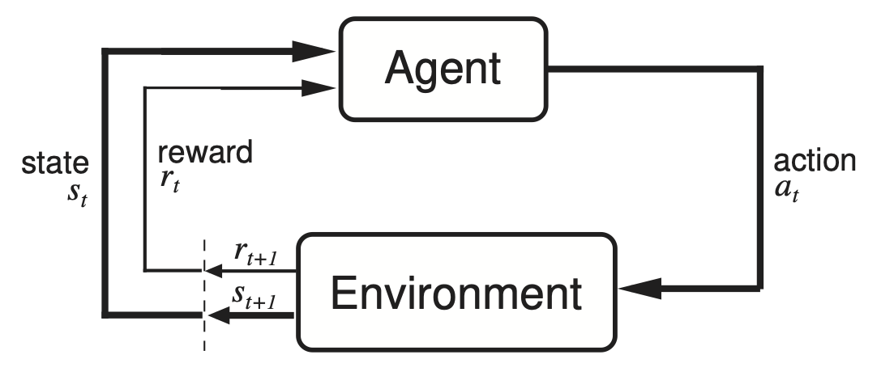{width=78%}

把一步交互写成符号，就是：

$$
s_t \;\xrightarrow{\;a_t\;}\; r_{t+1},\, s_{t+1}
$$

这个抽象框架放到 G1 行走上，每个角色的具体所指是：

| 概念 | 含义 | 在 G1 行走里的具体所指 |
|------|------|------------------------|
| 智能体 agent | 做决策的主体 | 控制 G1 的策略网络 |
| 环境 environment | 智能体交互的世界 | 仿真器里的物理引擎 |
| 状态 state | 环境在这一刻的完整描述（本讲仿真里策略看到的就是它） | 关节角度、躯干姿态、目标速度指令 |
| 动作 action | 智能体做出的动作 | 29 个关节的目标量 |
| 奖励 reward | 环境返回的反馈 | 跟上速度 + 保持直立 − 各种惩罚 |
| 轨迹 trajectory / 回合 episode | 一整段交互 | 从站立开始，到摔倒或 20 秒超时 |

"试错"的量从哪来？仿真里同时开 **4096 个并行环境**，4096 台虚拟 G1 同时摔、同时爬起来，一轮就贡献近十万步经验。这是强化学习在仿真里能成的关键工程条件。

## 2.2 状态与动作：G1 看到什么、能动什么

智能体"看到什么"叫**观测空间**，"能做什么"叫**动作空间**。对入门来说，动作空间的区别尤其要分清：

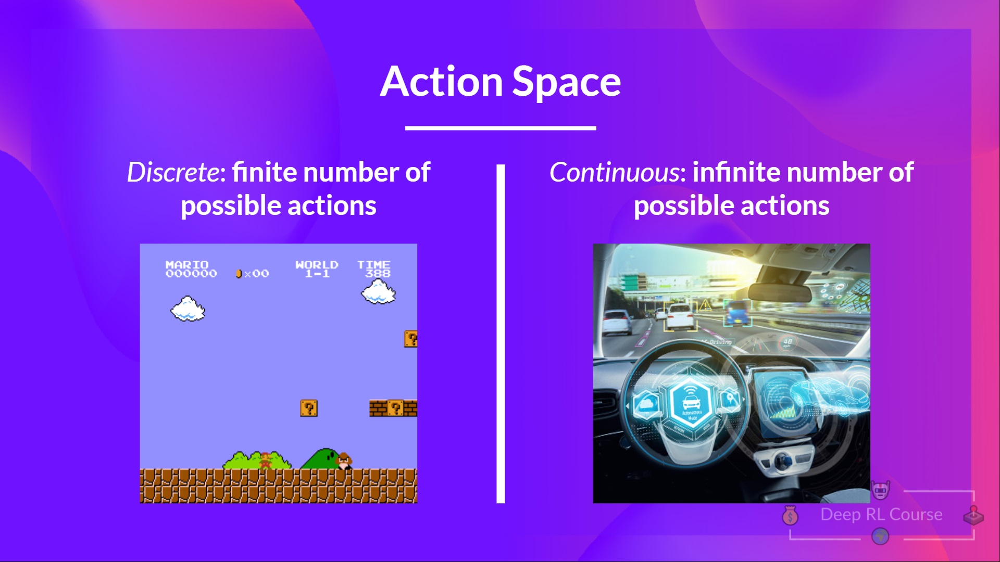{width=100%}

- **离散动作空间**：动作是有限个选项里挑一个，比如游戏手柄的几个按键、语言模型从词表里选下一个 token。
- **连续动作空间**：动作是一个或一组实数，比如方向盘转角、机械臂每个关节的目标量。

G1 的状态是关节角度、躯干姿态加上目标速度指令；动作是 **29 个关节的目标量，每个都是连续实数**——高维连续动作空间。记住这个事实，3.2 节讲算法分类时它会直接决定我们选哪一支。

> 备注：宇树 G1 有多种关节配置——官方规格表里基础版是 23 个自由度，加上腰部、腕部与三指灵巧手最多到 43 个。本讲全程按 **29 个关节**算：mjlab 自带的 G1 模型是双腿各 6 个、双臂各 7 个、腰部 3 个，合起来正好 29；重定向管线那边用的 G1 模型文件也是 29 自由度那一版（`g1_mocap_29dof.xml`）。换配置只改这个数字，算法一行不用动。

> 备注：真实机器人还有一层麻烦——它通常不是"完全可观测"的：相机只看到局部画面，物体可能被遮挡，执行还带误差。这类"看不全"的问题在学术上叫部分可观测（POMDP）。本讲在仿真里把状态给得比较全（1.1 节说的 $o_t$ 与 $s_t$ 暂不区分），但要知道真机会更难。

## 2.3 奖励与回报：怎么给「走得好」打分

**奖励（reward）**是某一步的即时反馈，一个标量。G1 这一帧跟上了目标速度、躯干直立，给正分；动作过猛、关节顶到限位、脚底打滑，扣分。**怎么设计奖励，是强化学习里最关键也最难的一环**——分数写歪了，机器人就会学出"钻空子"的动作；机器人和大模型任务里奖励还常常很稀疏，很久才有一次明确反馈。行走任务的好处是**反馈稠密、每步都有**（速度跟踪、姿态稳定、能耗和关节限位惩罚都能就地算出来），比稀疏奖励好写得多；但也别把它想得太轻松——这几项之间的权重怎么配，仍会显著左右最终步态，写"能跑"和写"跑得好看"是两回事。

但训练时我们关心的几乎从来不是单步奖励，而是**从现在开始、未来一整段能拿到多少总分**，这叫**回报（return）**。一个只顾眼前奖励的策略会很短视：为了这一帧站直而猛地刹住，下一帧反而摔了。回报逼着策略为长远负责。把未来的奖励加起来、按时间打折扣：

$$
R_t \;=\; r_{t+1} + \gamma\, r_{t+2} + \gamma^2 r_{t+3} + \cdots \;=\; \sum_{k=0}^{\infty}\gamma^{k}\, r_{t+k+1}
$$

公式里的折扣因子 $\gamma\in[0,1]$ 控制"看多远"：越接近 1 越重视长期，越接近 0 越只顾眼前。但求和式本身看不出它到底把视野截在哪儿——那要看权重 $\gamma^k$ 衰减得多快。

![$\gamma$ 决定未来的奖励还剩多少分量。左：三个 $\gamma$ 取值下，往后第 $k$ 步的奖励在回报里还剩多少权重。本讲取 $\gamma=0.99$，半衰期约 69 步（$0.99^{69}\approx 0.5$），有效视野 $1/(1-\gamma)=100$ 步（此处权重已降到 $0.99^{100}\approx 0.37$）。右：同样三个 $\gamma$ 的有效视野贴到一整个回合上——mjlab 的 G1 速度跟随环境仿真步长 0.005 秒、每 4 步出一次动作，即 50 Hz，回合上限 20 秒[7]，一个回合正好 1000 步](../../assets/figures/lecture14/ref/fig14-3-discount-horizon.png){width=100%}

右图那三根条子说明一件容易被忽略的事：$\gamma=0.99$ 的视野只覆盖一个回合的前十分之一，**不是"几乎一视同仁地看完整段"**。图下那行小字提醒的坑更要紧——$1/(1-\gamma)$ 算出来的是**步数**，不是秒。同一个 0.99，在 50 Hz 的 G1 上折合 2 秒，搬到 200 Hz 的控制回路上就只剩 0.5 秒；换了控制频率却不动 $\gamma$，等于悄悄把策略的视野砍掉四分之三。

一句话：**奖励是每一步的分，回报是一整段的分；强化学习最大化的是回报。**

## 2.4 策略与价值：两个基本量

**策略（policy）**沿用第8讲的定义，写成概率形式是 $\pi_\theta(a\mid s)$——参数为 $\theta$ 的网络，在状态 $s$ 下给出动作 $a$ 的概率。

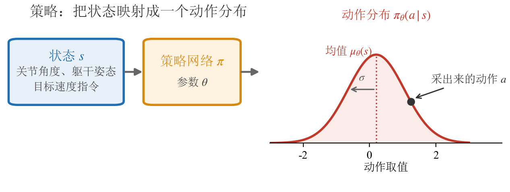{width=100%}

和第8讲不同的一点是：本讲用**随机策略**。G1 的策略网络对每个关节吐出高斯分布的**均值**；标准差不由网络算，而是一组跟着一起训练、但不随状态变化的参数（5.4 节的优化器那一行会再见到它）。训练时从这个分布里**采样**去试探，部署时直接取均值。随机性是"探索"的来源——不试新动作，就永远不知道有没有更好的走法；这也是试错学习必须付的入场费。

除了策略，强化学习还有第二个基本量：**价值（value）**——给"一个状态本身有多好"打分的评分员。现在只需要记住有这么个概念：策略负责"怎么做"，价值负责"值多少分"。它的精确定义（$V$、$Q$、优势 $A$）等到第 6 节第一个真正需要它的算法出现时再展开。

## 2.5 本节小结

"学走路"翻译成强化学习语言：G1 的策略网络是智能体，物理仿真是环境，每回合随机给速度指令，跟上加分、摔倒扣分；4096 个并行环境提供试错的量。G1 的动作空间是 29 维**连续**空间。策略 $\pi_\theta(a\mid s)$ 输出高斯分布、采样探索，目标是最大化折扣回报 $R_t$ 而非单步奖励；价值是"状态值多少分"的评分员，第 6 节正式登场。

# 3 强化学习方法分类

概念备齐，先别急着钻算法。强化学习的算法出了名的多——REINFORCE、A2C、TRPO、PPO、DQN、DDPG、SAC、AlphaZero……第一次接触很容易被缩写淹没，而且不同教材的分类词还长得很像，一混就乱。这一节把地图画清楚：**三个互相独立的划分**，每个算法对三个问题各回答一次，就有了自己唯一的坐标。这张地图不但罩住本讲，也罩住后面两讲。

![按 Spinning Up 的经典算法分类树[1]重画（节点与分支逐个对齐原图）：第一层按"学不学环境模型"分成 Model-Free 与 Model-Based；Model-Free 内部按"学什么"分成 Policy Optimization（基于策略）与 Q-Learning（基于价值）两族，DDPG/TD3/SAC 画在两族之间](../../assets/figures/lecture14/ref/fig142-rl-taxonomy.png){width=94%}

## 3.1 第一个划分：学不学环境模型

上图的第一刀：**model-based** 方法先学（或已知）一个"环境会怎么变"的模型，再拿它做规划——图右侧的 World Models、AlphaZero 都在这支。**model-free** 方法不显式学环境的转移模型、也不用它做规划，直接拿试错经验去更新策略或价值。机器人任务的环境模型（接触、摩擦、碰撞）极难学准，主流走 **model-free**，即图的左半边——本讲到第16讲的所有算法都在这半边，后面不再讨论 model-based。

## 3.2 第二个划分：学什么——基于价值的方法与基于策略的方法

model-free 内部，按"网络到底在学什么"分成两大类。这是整张地图最重要的一刀：

- **基于价值的方法（value-based）**：不直接学策略，而是学**动作价值 $Q(s,a)$**——"在状态 $s$ 做动作 $a$，往后平均能拿多少分"。学好之后，策略是**导出**的：每一步挑 $Q$ 值最大的动作。这一族的更新工具是贝尔曼方程与**时序差分**（temporal difference, TD——用"下一步的估值"回头修"这一步的估值"，第16讲展开），代表算法是 Q-learning 和它的深度版 DQN——就是分类树 "Q-Learning" 那一列。
- **基于策略的方法（policy-based）**：直接参数化策略 $\pi_\theta$、直接优化它。其中沿"期望回报对 $\theta$ 的梯度"做梯度上升的子类，叫**策略梯度方法（policy gradient methods）**——这是基于策略一族在深度强化学习里的绝对主流（不用梯度的爬山法、进化策略也属于基于策略，但本讲不涉及）。分类树里这支标着 "Policy Optimization"（策略优化）[1]，而 Hugging Face 的深度强化学习课程把同一支叫 "policy-based"[6]——两个名字指的是同一件事；这支下面挂的 Policy Gradient、A2C/A3C、TRPO、PPO，全是策略梯度方法。**本讲的三级阶梯全部走这一支。**

两族各自擅长什么，用 2.2 节的动作空间就能对上号：动作**离散**（按键、从词表选 token）时，对有限个动作逐个比 $Q$ 很自然，基于价值的方法如鱼得水；动作**连续**（G1 的 29 个关节）时，没法对无限个动作枚举 $Q$，直接输出动作分布的基于策略方法要顺手得多。这就是本讲选基于策略一支的第一个理由。

## 3.3 Actor-Critic：横跨两类的混合架构

**Actor-Critic 说的是一种架构**：模型里同时有一个策略网络（actor，出动作）和一个价值网络（critic，打分）。它描述"网络怎么搭"，不描述"优化目标是什么"，所以它**横跨**上面两大类：

- 本讲的 A2C 和 PPO 带 critic，但 critic 只是给策略梯度当参照物（第 6 节会讲清楚），**优化主体仍是策略**——它们是策略梯度方法；
- 分类树上画在两族**中间**的 DDPG、TD3、SAC 也带 actor 和 critic，但重心倒过来：critic 按贝尔曼方程更新、是学习主体，actor 更像是"帮连续动作挑 $Q$ 最大值"的执行器——它们介于两类之间，更靠基于价值一侧。

所以看到 "actor-critic" 这个词别急着归类，先问一句：它的 critic 是给谁打工的。

## 3.4 第三个划分：on-policy 与 off-policy——学的策略和采数据的策略是不是同一个

第三个划分和"学什么"**完全独立**，它问的是数据：**被改进的策略**（目标策略）和**生成数据的策略**（行为策略）是不是同一个？

- **on-policy**：是同一个。数据只在**当前策略附近的一小段窗口内**管用——策略一更新，旧 rollout 的分布就和新策略对不上，不能像经验池那样长期留着反复复用（7.3 节会看到 PPO 抢在数据被推远之前复用几轮，正是在这个短窗口里做文章）——稳，但费样本。
- **off-policy**：不是同一个。历史数据（甚至别的策略采的数据）都能塞进经验池反复复用——省样本，但训练更容易不稳。

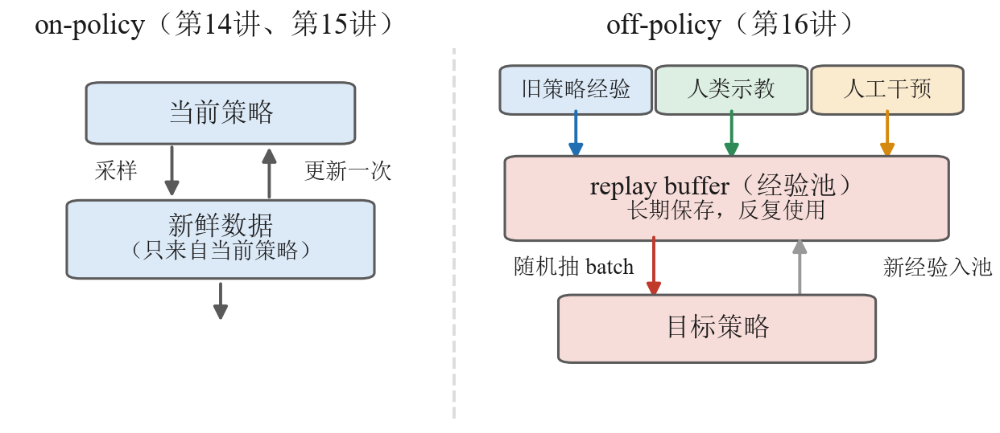{width=100%}

两边的差别，落到图上就是**中间那个池子**：左半的数据在"当前策略"和"新鲜数据"之间打转，更新一次就作废；右半的旧策略经验、人类示教、人工干预三种来源全部汇进经验池，目标策略从池里随机抽一批训练，新经验只是继续入池。有了这个池子，数据才从消耗品变成资产——这正是第16讲上真机时必须换到 off-policy 的原因。

这个划分直接对应一笔经济账：**数据便宜（仿真随便跑）就用 on-policy 图个稳；数据贵（真机一条都不舍得扔）就用 off-policy 把经验池榨干。**本讲在仿真里训练，走 on-policy；第16讲上真机，就会换到 off-policy。

> 备注：**经典的似然比策略梯度**（REINFORCE、A2C、PPO 这一路）常用 on-policy 估计——因为那个梯度公式里的期望要在**当前策略**的数据分布下估；Q-learning 一族几乎总是 off-policy——因为贝尔曼最优更新跟数据是谁采的无关。但别把它读成"策略梯度必然 on-policy"：**确定性策略梯度（DDPG、TD3）和 SAC 都是用策略梯度更新 actor 的 off-policy actor-critic**，它们从回放池里学（本节开头那张分类地图里就有这几个）。所以"基于策略 $\approx$ on-policy、基于价值 $\approx$ off-policy"是**常见对应，不是定义**：两条轴一个说"学什么"、一个说"数据怎么用"，概念上独立。分不清这两条轴，是强化学习分类看着混乱的最大根源。

## 3.5 把算法放上地图

三个划分立好，把本讲和后面两讲会遇到的算法全部放上去：

| 算法 | 学什么 | 数据 | 在课程里的位置 |
|------|--------|------|----------------|
| REINFORCE | 基于策略（策略梯度） | on-policy | 第14讲 5.3；代码 5.4（v1） |
| A2C | 基于策略（策略梯度 + critic 参照） | on-policy | 第14讲 6.3；代码 6.4（v2） |
| TRPO | 基于策略（策略梯度 + 硬约束步长） | on-policy | 第14讲 7.1（一句话带过） |
| **PPO** | 基于策略（策略梯度 + clip） | on-policy | 第14讲 7.2；代码 7.4（v3） |
| GRPO | 基于策略（策略梯度，去掉 critic，用组内平均当参照） | on-policy | 第15讲 1.4 |
| Q-learning / DQN | 基于价值 | off-policy | 第16讲 2.3–2.4 |
| SAC（及 DDPG/TD3） | 两族之间的 actor-critic | off-policy | 第16讲 5.2 |

看这张表要抓两条线：

- **本讲的三级阶梯 REINFORCE → A2C → PPO 是同一支内的演进**，不是三个门类：都是 model-free、基于策略（策略梯度）、on-policy，坐标完全相同，差别只在"怎么把策略梯度算得更稳"——这正是第 5 节到第 7 节一节补一块的机制。演进链再往后一站就是第15讲的 GRPO：它保留 PPO 的 clip、去掉 critic，是这条链在大模型后训练场景下的延伸。
- **第16讲换的不是"更好的算法"，而是另一格坐标**：真机数据贵，必须 off-policy，于是从基于策略一支跳到 SAC 那一格。到时候你会发现本讲的概念一个都不浪费。

## 3.6 本节小结

强化学习方法分类只需要三个独立的问题：学不学环境模型（model-free / model-based）、学什么（基于价值 / 基于策略，策略梯度是基于策略的主流子类）、学的策略和采数据的策略是否同一个（on-policy / off-policy）。Actor-Critic 是横跨两类的**架构**词。"基于策略 $\approx$ on-policy"只是常态对应、不是定义。本讲路线：model-free + 基于策略（策略梯度）+ on-policy，沿 REINFORCE → A2C → PPO 走到底；GRPO（第15讲）和 SAC（第16讲）都能在这张地图上找到自己的格子。

# 4 基础：跑起来要哪些零件

后面三节各讲一个算法，但它们共用同一套地基：仿真器、参考动作，以及代码放在哪。这一节把地基一次交代完，后面就只谈算法。

三位"幕后工作人员"先认识一下。5.4 节代码走读里的 `code/rl/1_rl_basics/1_1_g1_walk_rl/env.py` 只是薄薄一层包装，真正干重活的是几个开源组件。它们是本讲实验的依赖，不是研究对象——每一位用一段话知道它是谁、替我们干了什么，就足够了。

## 4.1 mjlab：G1 的练功房

第一位是 **mjlab**[7]，G1 的"练功房"。强化学习靠海量试错吃饭，一个环境一步一步跑太慢，我们的训练一次开 4096 个环境同时采样。mjlab 把 GPU 并行版的 MuJoCo（MuJoCo Warp）接进 Isaac Lab 那套按管理器组装环境的接口：场景、观测、奖励、终止条件都是现成积木，还内置了宇树 G1 的标准任务——行走实验用的平地速度跟随（`Mjlab-Velocity-Flat-Unitree-G1`）、第 8 节动作跟随用的动作跟踪（`Mjlab-Tracking-Flat-Unitree-G1`），都直接取自它。课程这层包装做的只是把它的接口整理得顺手一点。

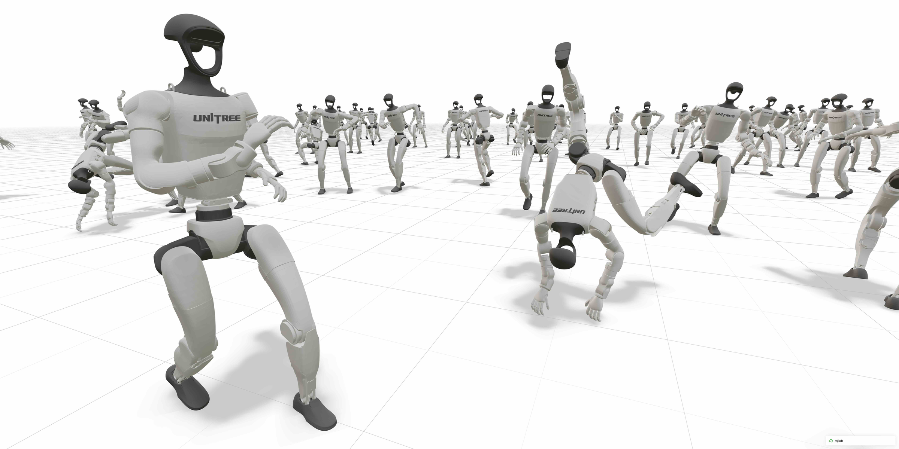{width=92%}

## 4.2 GVHMR：从视频里抠出人的动作

第二位是 **GVHMR**[8]，负责从视频里"抠"出人的动作。第 8 节要让 G1 逐帧贴住一段真实武术动作，参考动作最方便的来源是一段普通视频。GVHMR（浙江大学团队开源）输入单目视频，输出世界坐标系下连贯的三维人体动作——人在哪里、朝向哪边、每一帧什么姿势，全部恢复出来，并用 SMPL-X 参数化人体表示（用一组低维参数描述体型与逐帧姿态，相当于人体动作的通用"语言"）。它的做法是先把姿态估计在一个由**重力方向 + 相机朝向**定义的坐标系里，再靠相机旋转转回世界系，从而避开"世界坐标系怎么定"这个老问题。

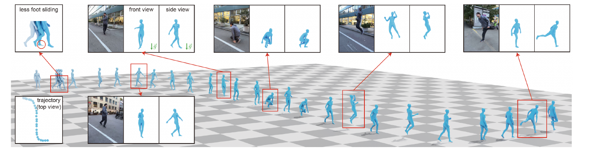{width=98%}

## 4.3 GMR：把人的动作翻译成 G1 的动作

第三位是 **GMR**（General Motion Retargeting）[9][10]，负责把"人的动作"翻译成"G1 的动作"。人和 G1 体型比例不同、关节构成也不同，人的动作不能直接照搬到机器人身上；这道翻译工序的术语叫**重定向**（retargeting）。GMR 先对齐人与机器人的关键部位、按体型做缩放，再用逆运动学逐帧解出 G1 各关节的角度，输出机器人真正能执行的参考轨迹。

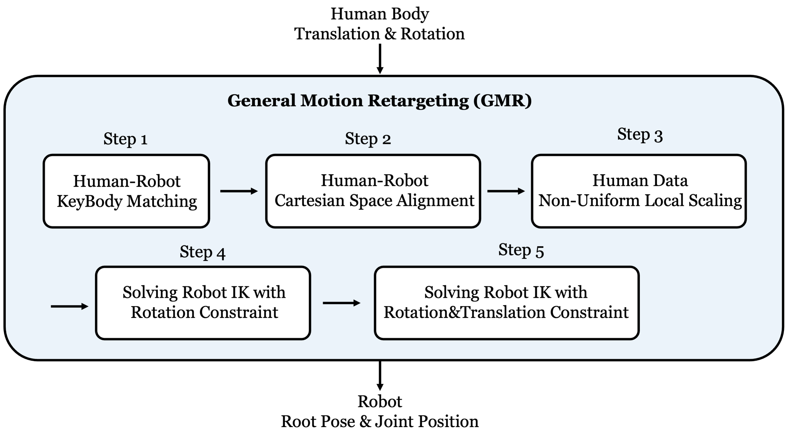{width=80%}

## 4.4 一条管线四步：从视频到 G1 参考动作

GVHMR 和 GMR 各管一段，把它们接起来还差两道工序。完整的管线是四步，在课程实验仓库里是独立模块 `code/rl/1_rl_basics/1_0_video_to_g1_reference/`：

| 步 | 脚本 | 干什么 |
|---|---|---|
| 1 | `video_to_human_motion.py` | 用 GVHMR 从单目视频恢复人体动作（SMPL-X 参数） |
| 2 | `run_gvhmr_no_render.py` | GVHMR 推理的无渲染封装，服务器上开不了窗口 |
| 3 | `human_motion_to_g1_reference.py` | 用 GMR 把人体动作重定向到 G1 的 29 个关节 |
| 4 | `build_motion_npz.py` | 打包成训练用的 `.npz`（关节轨迹 + body 位姿 + 帧率） |

产物是一个参考动作文件 `code/rl/1_rl_basics/data/g1_reference_motions/marshal-arts.npz`（682 帧、50 Hz、29 个关节），课程自带的这一份就是用这条链生成的；想换自己的视频，把四步再走一遍即可。

这个模块**编号是 `1_0` 而不是 `1_1`**，因为它不是算法阶梯上的一级：它只产数据、不产结论，是后面动作跟随实验的**前置**。本讲的行走实验完全不用它（奖励由环境在线给出，不需要任何参考数据）；这份参考动作要等到第 8 节才派上用场。

## 4.5 代码地图：一节讲义对一个模块

本讲从这里往后的每一个一级标题，都对应实验仓库里的一个代码单元。读到哪一节，打开哪一个目录即可：

| 讲义 | 代码 | 内容 |
|---|---|---|
| 第 4 节（本节） | `1_0_video_to_g1_reference/` | 视频 → G1 参考动作的四步管线 |
| 第 5 节 | `1_1_g1_walk_rl/train_v1_reinforce.py` | 行走任务 · REINFORCE |
| 第 6 节 | `1_1_g1_walk_rl/train_v2_a2c.py` | 行走任务 · A2C |
| 第 7 节 | `1_1_g1_walk_rl/train_v3_ppo.py` | 行走任务 · PPO |
| 第 8 节 | `1_3_g1_motion_tracking/` | 同三个算法 · 换成动作跟随这个更难的任务 |

两条任务线（`1_1` 行走 / `1_3` 动作跟随）的文件名一一对应：`train_v1_reinforce.py` / `train_v2_a2c.py` / `train_v3_ppo.py` / `rollout.py`，同一级算法在两条线上是同一份代码换个环境。建议横向对照着读：**算法不变，任务变难**。

每条线内部还有三个共用件，它们是"受控对照"的机械保证：`env.py` 包装 mjlab 环境（**这是两条线唯一被设计成不同的东西**），`model.py` 提供三个版本共用的 `ActorCritic` 与 GAE 工具函数（两条线逐字相同），`rollout.py` 按统一口径评测并录像。要调的超参就写在第一次用到它的地方，没有命令行参数层。

# 5 v1 REINFORCE：最朴素的策略梯度方法

## 5.1 什么是策略梯度

基于策略的方法只做一件事：调策略参数 $\theta$，让期望回报变大。把"期望回报"记作目标函数 $J(\theta)$，最直接的做法就是对它做梯度上升。**策略梯度定理**给出了这个梯度可以怎么从采样数据里估出来（结论直接用，不推导）：

$$
\nabla_\theta J(\theta)\;=\;\mathbb{E}\Big[\,\sum_t \nabla_\theta \log \pi_\theta(a_t\mid s_t)\cdot R_t\,\Big]
$$

| 符号 | 含义 | 说明 |
|------|------|------|
| $J(\theta)$ | 目标函数 | 当前策略的期望回报，越大越好 |
| $\log \pi_\theta(a_t\mid s_t)$ | 对数概率 | 策略当时有多倾向于选这个动作（取对数便于求梯度） |
| $\nabla_\theta \log \pi_\theta$ | 对数概率的梯度 | 指向"让这个动作概率变大"的参数方向 |
| $R_t$ | 从 $t$ 起的折扣回报 | 就是 2.3 节那个回报，在这里当这一步的"权重"（下一小节会给它一个更贴切的名字） |

沿这个梯度做上升的算法，统称**策略梯度方法**——就是 3.2 节点过名、本讲从头走到尾的那条子类链。

## 5.2 梯度往哪指：好动作加概率，坏动作减概率

公式里两个因子各管一件事。$\nabla_\theta \log \pi_\theta(a_t\mid s_t)$ 管方向——它指向"让动作 $a_t$ 的概率变大"；乘上去的权重 $R_t$ 管力度：

- $R_t$ 大（这一步之后拿了高回报）：往"更常做这个动作"的方向推得狠一点；
- $R_t$ 小甚至为负：反着推，让它以后少出现。

> 好动作提高概率，坏动作降低概率——按事后的回报大小定推拉的力度。

权重用的是 **reward-to-go**（$t$ 之后的回报）而不是整条轨迹的总回报，道理也直白：评价 $t$ 时刻的动作，只该算它**之后**的账；它之前已经发生的奖励与这个动作无关，混进来只添噪声。

落成损失函数，就是在前面加个负号交给梯度下降。下面这一行等会儿会原样出现在 v1 的代码里（代码里那个 `advantages` 目前就是 $R_t$ 做了一点归一化，5.4 节细说）：

```python
policy_loss = -(log_probs * batch["advantages"]).mean()
```

## 5.3 REINFORCE：采一批轨迹、算回报、更新一次

把上面的公式变成可执行的循环，就是 REINFORCE，教材上也叫**蒙特卡洛策略梯度**[5]——"蒙特卡洛"指权重 $R_t$ 是用**实际跑出来的回报**直接估的，不借助任何辅助网络：

1. 用当前策略在环境里采一批轨迹；
2. 对每一步算 reward-to-go $R_t$；
3. 按 $-\log\pi_\theta(a_t\mid s_t)\cdot R_t$ 更新一次策略；
4. **丢掉这批数据**（on-policy：策略变了，旧数据即过期），回到第 1 步。

这是所有策略梯度算法的公共骨架。后面的 A2C 和 PPO 都只是在这四步里"换零件"：A2C 换第 2 步的权重，PPO 改第 3 步的更新方式。

## 5.4 代码走读：v1 版训练循环

行走实验的代码都在 `code/rl/1_rl_basics/1_1_g1_walk_rl/` 这一个目录里，下表只写目录内的文件名。本节走读前三个文件，其中前两个由三个版本共用；后三个不讲算法，但 5.5 节起的评测数字、rollout 视频和 7.5 节那两张训练曲线图，都由它们产出：

| 文件 | 职责 |
|------|------|
| `env.py` | 包装 mjlab 的 G1 平地速度任务成 `G1WalkEnv`，返回观测 / 奖励 / 终止信号 |
| `model.py` | `ActorCritic` 网络（actor + critic 两个 MLP）与 GAE 工具函数 |
| `train_v1_reinforce.py` | 本节的 REINFORCE 训练脚本 |
| `rollout.py` | 载入训练好的权重，按 1.4 节的统一口径（16 个环境 × 400 步、确定性动作）评测并录像 |
| `plot_reward_curves.py` | 画 7.5 节那张三算法训练奖励对照曲线 |
| `plot_training_losses.py` | 画 7.5 节那张四面板训练损失对照图 |

评测摘要落在 `code/rl/1_rl_basics/result/1_1_g1_walk_rl/` 下的同名 `.json` 里，后面每一个奖励与摔倒率都能在那里查到原始记录。

Lightning 把训练拆成三块（第12讲 4.6 节见过 `LightningModule` 与 `LightningDataModule` 的这套分工）；唯一不同的是这里的"数据集"不再是磁盘上的文件，而是**在线采样**：

| 类 | 角色 |
|----|------|
| `G1WalkRolloutDataset` | 在线数据集：每轮用当前策略采一段轨迹，产出一整批（batch）训练数据 |
| `G1WalkData` | `LightningDataModule`：每一轮（Lightning 管一轮叫一个 epoch）都重建数据集，保证数据永远新鲜，对应 on-policy |
| `G1WalkLightningReinforce` | `LightningModule`：拿到 batch 算 REINFORCE loss |

采样端的核心是 reward-to-go 的计算——从后往前累加折扣回报，遇到回合结束就截断：

```python
def reward_to_go(reward_steps, done_steps, gamma):
    # reward_steps / done_steps 形状都是 (T, N)：T 个时间步 × N 个并行环境。
    returns = torch.zeros_like(reward_steps)    # 输出与输入同形，每步存一个 R_t
    # running 存"当前步之后的累计回报"，形状 (N,)：N 个环境各算各的。
    # 它必须在循环外初始化——循环里每一步都要读上一次的结果，累加量不能每步重置。
    running = torch.zeros(reward_steps.shape[1], device=reward_steps.device)
    # 倒着遍历：R_t = r_t + gamma * R_{t+1}，第 t 步要用到第 t+1 步的结果，
    # 所以从最后一步往前推，一趟就能算完；正着走得先把整段存下来再回头算。
    for step in reversed(range(reward_steps.shape[0])):
        # (1.0 - done_steps[step]) 是"回合是否继续"的开关：该步回合结束时它是 0，
        # 把 running 乘没了——下一个回合的回报就不会漏进这一个回合。
        running = reward_steps[step] + gamma * running * (1.0 - done_steps[step])
        returns[step] = running    # 存下这一步的 reward-to-go
    return returns
```

采完 4096 环境 × 24 步的一段轨迹后，把回报整理成每步的权重：

```python
        returns = reward_to_go(reward_steps, done_steps, self.gamma)
        # 唯一的基线就是整批均值（常数），没有学习的 critic。
        advantages = returns - returns.mean()    # 比这批平均好的得正权重，差的得负权重
        advantages = advantages / (advantages.std() + 1.0e-8)    # 再归一；+1e-8 防除零
```

这里有个值得停一秒的小动作：权重没有直接用 $R_t$，而是先**减掉整批均值**再除以整批标准差。这是常见的方差降低与尺度归一化技巧，让数值更平稳。要说准确一点：$b(s)$ 那条"减去与动作无关的基线不改变梯度期望"的性质，要求基线是**固定的、不依赖当前所选动作的**；而这里的批均值恰恰是用同一批的动作和回报算出来的，除以批标准差也会引入有限样本偏差。所以它不是严格无偏，只是在实践里以一点小偏差换取稳定性——好用，但别说成"完全不改变梯度期望"。而"跟平均水平比，而不是跟零比"这个念头，正是下一节整节的种子，先按下不表。

训练端的 `training_step` 就是 5.2 节那行公式，外加一项熵：

```python
    def training_step(self, batch, batch_idx):
        # 采样时那次前向裹在 no_grad 里，梯度断了；这里重新算一遍才能反传。
        distribution = self.model.action_distribution(batch["obs"])
        # 每个关节维度独立采样，各维 log 概率相加 = 整个动作向量的 log π(a|s)。
        log_probs = distribution.log_prob(batch["actions"]).sum(dim=-1)
        entropy = distribution.entropy().sum(dim=-1)    # 同理各维熵相加，衡量分布摊开的程度
        # 5.2 节那行公式：负号是因为梯度下降只会"下降"，而我们想让好动作的概率上升。
        policy_loss = -(log_probs * batch["advantages"]).mean()
        entropy_loss = entropy.mean()    # 一批里所有步的熵取平均
        loss = policy_loss - self.entropy_coef * entropy_loss    # 熵前是减号：熵越大 loss 越小
```

多出来的**熵奖励**（`entropy_coef = 0.01`）鼓励动作分布别过早收窄——分布越"摊开"熵越大，等于奖励策略保持探索。这就是 2.4 节说的"随机性是探索的来源"在代码里的落点；三个版本都带这一项，它不是版本间的区别点。

还有一处点破：`ActorCritic` 网络里其实有 critic，但 v1 的优化器**刻意只训 actor**——

```python
    def configure_optimizers(self):
        # 只优化 actor 和动作标准差；critic 不参与训练。
        params = list(self.model.actor.parameters()) + [self.model.std]    # std 也是可学参数
        self.optimizer = torch.optim.Adam(params, lr=self.learning_rate)    # critic 的参数没进来
        return self.optimizer
```

这是为了三版共用同一个网络类、保证对照干净：v1 的 critic 纯粹闲置，REINFORCE 本身完全不需要它。入口照例是 `trainer.fit(model, data)`，其中 `reload_dataloaders_every_n_epochs=1` 让每轮都重新采样——on-policy 的"用完即弃"由 Lightning 的数据加载周期天然实现。

## 5.5 实验：G1 用 REINFORCE 学走路

按 1.4 节的统一口径评测（最终权重、确定性动作、16 环境 × 400 步）：

| 指标 | v1 REINFORCE |
|------|--------------|
| 评测平均奖励 | 0.070 |
| 摔倒率 | 1.3% |

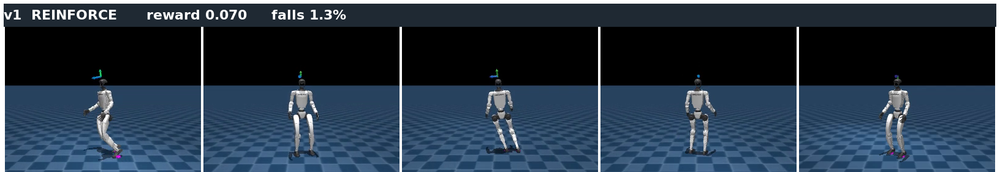{width=98%}

先说成绩：**它真的学会了**。从随机初始化出发——最初的策略只会让 G1 像断线木偶一样瘫倒——训练之后能站住、能顺着指令小幅挪步。这说明"好动作加概率、坏动作减概率"这个信号是实打实起作用的，策略梯度这条路走得通。

再说不足，看图和数字都很明显：动作僵硬、不敢迈步，跟指令跟得很勉强，还有 1.3% 的评测回合以摔倒收场。训练过程也不好看——奖励爬到 700 次迭代左右就停在 0.008 附近，剩下的两千多次迭代基本原地踏步（7.5 节那张训练曲线看得最清楚）。能学，但学得**又慢又浅**。

## 5.6 毛病在哪：回报噪声淹没了学习信号

病根在权重 $R_t$ 上。它是蒙特卡洛估计——**这一步之后实际发生的一切**都被算进这个数里：同一个状态下做同一个好动作，这次后面一路顺风、拿了高回报；下次同样的开局，后面那几十步走岔了、摔了，回报就低。于是"这个动作好不好"的信号里，混进了大量**与这个动作无关的运气**。

这就是**高方差**：梯度的方向平均来看是对的，但每一次估计都在真值周围剧烈乱跳。4096 个环境的平均能压掉一部分，但对 29 维连续动作的人形任务远远不够——大部分更新步都在相互抵消，真正推着策略往前走的那点分量被剩下的噪声稀释掉了。

减掉整批均值那个小动作已经暗示了出路：**别拿绝对回报当权重，找个参照物，比出相对好坏**。参照物选得越贴切，运气成分抵消得越干净。什么是最贴切的参照物？下一节的主角。

## 5.7 本节小结

策略梯度方法沿"期望回报的梯度"直接更新策略，REINFORCE 是它最朴素的实现：用实际回报（reward-to-go）当权重，好动作加概率、坏动作减概率，采一批、更一步、丢数据。在 G1 行走上它证明了这条路走得通（能站能挪，0.070 / 摔 1.3%），但蒙特卡洛回报里混着大量与动作无关的运气，**方差大**，学得又慢又浅。它的局限指向一个明确的改进方向：给回报找一个像样的参照物。

# 6 v2 A2C：请一位评分员来降方差

## 6.1 基线的直觉：跟「平均水平」比，不是跟零比

评价一个动作，公平的问法不是"它拿了多少分"，而是"它比**这个状态下的平均水平**多拿了多少分"。同样是"后面拿到回报 5"，在一个平均只能拿 1 的烂局面里是神来之笔，在平均能拿 10 的好局面里是拖了后腿。

把这个参照物记作**基线（baseline）**$b(s)$：策略梯度的权重从 $R_t$ 换成 $R_t - b(s_t)$。数学上可以证明（这里直接引用结论）：只要 $b$ 不依赖动作，减掉它**不改变梯度的期望**，却能大幅降低方差——运气带来的涨落被参照物同步吸收了。带基线的 REINFORCE 在教材里就叫 **REINFORCE with baseline**[5]。

v1 已经偷偷用了最粗的基线：整批回报的均值，一个常数。但常数对所有状态一视同仁，显然不够贴切——烂局面和好局面的"平均水平"根本不同。**理想的基线应该因状态而异：每个状态自己的平均水平。**这个"每个状态自己的平均水平"，正是 2.4 节预告过的那个量。

## 6.2 价值函数与优势：V、Q、A = Q − V

现在正式引入价值。先看**状态价值函数** $V^\pi(s)$：

$$
V^\pi(s)=\mathbb{E}_{\pi}\big[\,r_{t+1}+\gamma r_{t+2}+\gamma^2 r_{t+3}+\cdots \,\mid\, s_t=s\,\big]
$$

$V^\pi(s)$ 回答"**这个状态本身有多好**"——从 $s$ 出发、之后都按当前策略 $\pi$ 走，平均能拿到多少回报。它不规定第一步做哪个动作——这正是"这个状态的平均水平"的严格说法，也就是我们要的理想基线。

再看**动作价值函数** $Q^\pi(s,a)$，它比 $V$ 多指定了第一步：

$$
Q^\pi(s,a)=\mathbb{E}\big[\,r_{t+1}+\gamma r_{t+2}+\gamma^2 r_{t+3}+\cdots \,\mid\, s_t=s,\ a_t=a\,\big]
$$

即在状态 $s$ 下**先做动作 $a$**、之后再按 $\pi$ 走的平均回报（3.2 节基于价值的方法学的就是它）。两者一减，得到全场最重要的量——**优势函数（advantage）**：

$$
A^\pi(s,a)=Q^\pi(s,a)-V^\pi(s)
$$

它回答的问题正是 6.1 节那个公平的问法：**这个动作比该状态的平均水平好多少？**

- $A(s,a)>0$：比平均好，**提高**它的概率；
- $A(s,a)<0$：比平均差，**降低**它的概率；
- $A(s,a)\approx 0$：和平均差不多，基本不用动。

| 符号 | 含义 | 说明 |
|------|------|------|
| $b(s)$ | 基线 | 只依赖状态、不依赖所选动作的参照物；这类基线减掉后不改变梯度期望 |
| $V^\pi(s)$ | 状态价值 | 状态 $s$ 的平均水平——理想的基线 |
| $Q^\pi(s,a)$ | 动作价值 | 在 $s$ 先做 $a$ 有多好 |
| $A^\pi(s,a)$ | 优势 | $Q-V$，动作比平均好多少——理想的权重 |

从此策略梯度的权重升级为优势：**估出每个动作的 $A$，优势为正就调高概率、为负就调低。**本讲余下的一切、以及第15讲的 GRPO，全在围绕"怎么把 $A$ 估得又准又稳"做文章。

## 6.3 从基线到 critic：Actor-Critic 与 GAE

$V^\pi(s)$ 没有解析解，那就用老办法——再训一个小网络去估它，输入状态、输出一个标量。这个价值网络就是 **critic（评分员）**，原来的策略网络对应地叫 **actor（演员）**：演员出动作，评分员打分。

四个方框、一个环，这套分工的骨架就说完了：

{width=85%}

骨架好记，但它把两件事留在了环外：优势具体怎么算出来，以及 critic 自己靠什么变准。把这两件事画进去，才是代码里真正在跑的那张图——也才看得出**优化主体始终是策略，critic 只是给策略梯度当参照物**：

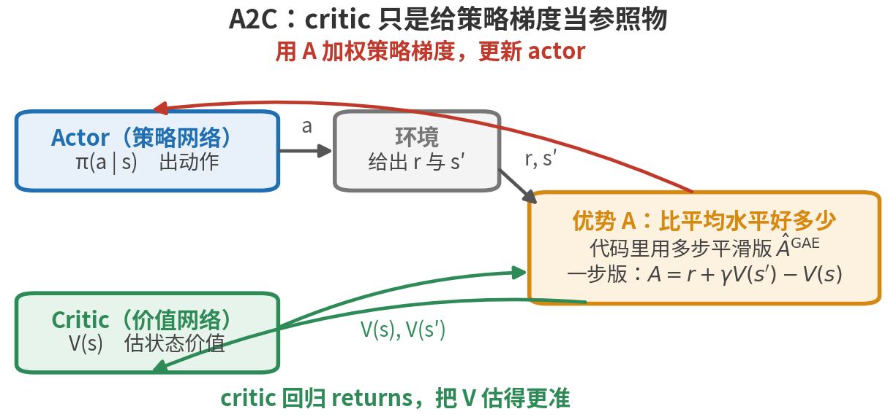{width=100%}

顺着这张图的箭头走一遍就是一轮更新：actor 出动作交给环境，环境回一个 $r$ 和一个 $s'$；critic 拿状态估出 $V(s)$、$V(s')$，沿绿箭头汇到右边那个框里算出优势 $A$——这就是上一张环图里那根紫色"Advantage"箭头背后真正发生的事；红箭头把 $A$ 送回 actor 给策略梯度加权，紫箭头让 critic 自己回归 returns、把 $V$ 估得更准。**红紫这两条是两件独立的事**——红的更新策略网络、紫的更新价值网络，各走各的损失项、各改各的参数，图上特意分成两种颜色，别当成一条回流的两截。优势框里上下写了两个式子——下面那个一步版最直观，上面那个多步平滑版 $\hat A^{\mathrm{GAE}}$ 才是代码里真正用的，本小节稍后就会讲到它。

这里要把一条容易含糊的界线划清楚——**REINFORCE 和 Actor-Critic 到底差在哪**。文献里的命名并不完全统一：不少资料把"actor + 学出来的 critic 基线"也叫 actor-critic，哪怕 actor 用的是蒙特卡洛回报。**本讲采用较窄的定义，以是否 bootstrap（自举）为界**，即看价值网络的估值参不参与构造回报目标；读别的教材时留意它用的是宽还是窄定义：

- 如果学出来的 $V$ **只当基线**——权重用 $R_t - V(s_t)$，其中 $R_t$ 仍是实打实跑出来的蒙特卡洛回报——那还是 REINFORCE with baseline，教材明确说这**不算** actor-critic[5]——理由逐字是"价值函数只被当作基线、没被当作 critic，也就是没有用于自举"：$V$ 只是个参照物，没有介入回报本身的估计；
- 只有当 $V$ 的估值**替代了部分实际回报**，比如把 3.2 节点过名的**时序差分**写成残差 $\delta_t = r_{t+1} + \gamma V(s_{t+1}) - V(s_t)$、用它来估优势——"这一步实际拿到的，比评分员预期的多多少"——评分员才真正参与了估计本身，这才叫 **actor-critic**。

实践里最常用的优势估计是 **GAE（广义优势估计）**[3]：把一步、两步、多步的时序差分残差按 $\lambda$ 加权平滑成一个估计。$\lambda$ 是方差-偏差的旋钮：靠近 1 更接近蒙特卡洛（准但噪），靠近 0 更依赖评分员（稳但依赖评分员的水平）。本讲取 $\lambda=0.95$，业界常用值。GAE 的公式细节不展开，代码里它就是一个从后往前的递推函数。

把"演员按 GAE 优势做策略梯度、评分员同时回归回报把自己越练越准"组合起来，就是 **A2C（Advantage Actor-Critic，优势演员-评分员）**——名字直接点明两个关键词。它还有个多机异步的工程变体 A3C，思路相同。回看 3.3 节的地图定位就清楚了：A2C 的评分员用的正是基于价值一族的时序差分工具，所以说 actor-critic 是"结合两类方法的混合架构"；但评分员在这里是给策略梯度打工的，**优化主体仍是策略**——A2C 稳稳落在基于策略这一支。

## 6.4 代码走读：v1 到 v2 改了什么

`code/rl/1_rl_basics/1_1_g1_walk_rl/train_v2_a2c.py` 与 v1 结构完全相同，diff 集中在两处。第一处在采样端：优势不再是"回报减均值"，而是 critic 估值 + GAE：

```python
# 关键变化(1)：优势不再用常数基线，改用 critic 估值 + GAE（理论上降方差，见 6.1 节）
        with torch.no_grad():    # 采样阶段只要数值，不需要梯度
            next_value = self.model.value(critic_obs)    # 末状态的价值：GAE 递推从它起头
        # 一次算出每步的优势和回报：优势喂给 actor，回报当 critic 的回归目标。
        advantages, returns = compute_gae(
            reward_steps, done_steps, value_steps, next_value, self.gamma, self.lam)
```

第二处在训练端：评分员自己也要学——多了一项让 $V$ 回归实际回报的 value loss，优化器也从"只训 actor"改成训全部参数：

```python
# 关键变化(2)：critic 要回归 returns，于是 loss 多了一项 value_loss
        # 带基线的策略梯度：advantage 已减去 critic 估值；不做 ratio 裁剪。
        policy_loss = -(log_probs * batch["advantages"]).mean()
        value_loss = torch.square(values - batch["returns"]).mean()    # critic 估值向回报靠拢
        entropy_loss = entropy.mean()
        # 三项加权合成一个 loss：value 前是加号（要降），熵前是减号（要升）。
        loss = policy_loss + self.value_loss_coef * value_loss - self.entropy_coef * entropy_loss
```

> 备注：代码里 critic 吃的是单独的 `critic_obs`——比 actor 的观测多了脚部接触等**特权信息**。这是仿真强化学习的常用技巧（非对称 actor-critic）：评分员只在训练时存在，部署时只带走 actor，所以评分员可以看仿真器里的"天眼"信息，把分打得更准，而不破坏部署的可行性。

## 6.5 实验：同一个任务，A2C 交出什么成绩

同一口径评测，先看数字，和 v1 摆在一起：

| 指标 | v1 REINFORCE | v2 A2C |
|------|--------------|--------|
| 评测平均奖励 | 0.070 | 0.043 |
| 摔倒率 | 1.3% | 1.3% |

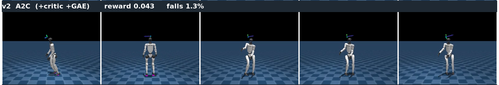{width=98%}

结果出乎意料：**评测奖励反而比 v1 低了**（0.043 对 0.070），摔倒率也没降。这不是 bug，是这一讲最好的教材，值得停下来仔细读：

- critic 基线确实起了作用，图上直接看得到：v2 的动作幅度比 v1 大得多、姿态更舒展，评测记录里的动作绝对值均值也对得上——v2 是 0.56，v1 与 v3 都是 0.39。但要分清三件事：**梯度方差**（6.1 节那个"减掉贴合状态的基线、不改变梯度期望却降方差"的理论性质）、**动作幅度**（均值推得多远）、**分布宽度**（摊得多开）。7.5 节的策略熵曲线上 v2 反而比 v1 低（15 对 22），也就是分布更窄、只是均值推得更远——动作更大不等于探索更充分。
- 但训练过程露出了一个 v1 没有的故障模式：**单次更新会把刚学会的步态一脚踩塌**。看 7.5 节那张训练奖励曲线：v2 的滑动平均在 0.004 上下的平台上晃了两千多次迭代，而**第 500 迭代之后的这 2500 次迭代**里，有 **195 次**迭代的平均奖励掉到 −0.01 以下、最低一次掉到 −0.049；同一区间里 v1 最低只到 −0.0040，v3 更是最低都还有 0.0189。

按理更干净的学习信号应当帮上忙，为什么反而更颠？**病根在步长**：信号方差降低后，每次更新的推力更一致、有效步长变大——而这套算法里没有任何东西在管"一步最多能迈多大"。v3 直接印证了这一点：补上步长约束后，同样的优势估计立刻兑现成最高分。**A2C 卡住不是因为 critic 不好，是因为没有刹车。**

## 6.6 毛病在哪：更新步子没人管

策略梯度只给方向，不给安全步长。学习率是固定的，优势偶尔被高估时，一次更新就可能把策略推得离原来很远——高斯分布的均值猛移、标准差猛缩，策略性格突变。

对 on-policy 方法（3.4 节）这尤其致命，因为它有个**恶性循环放大器**：策略被推坏了 → 下一轮只能用**被推坏的策略**采数据 → 数据也是坏的 → 在坏数据上更新，好不容易学到的东西被反复抹掉。v1 反而因为信号噪声大、单步推力互相抵消，误打误撞地"步子小"；v2 把噪声压干净，等于给车换了好引擎却没装刹车。

所以下一块要补的机制已经呼之欲出：**限制每次更新的步长**——这正是 PPO 的全部内容。

## 6.7 本节小结

A2C 在 REINFORCE 上补的是"参照物"：基线思想（跟平均比、不跟零比）→ 理想基线就是状态价值 $V^\pi(s)$ → 用 critic 网络去估它。与 REINFORCE 的分界线（本讲取窄定义）是 bootstrap：$V$ 只当基线仍是 REINFORCE with baseline，$V$ 参与时序差分/GAE 估优势才是 actor-critic。两者用的是**同一条策略梯度公式**，只是权重从实际回报换成了评分员参与估计的优势。critic 基线压低了梯度方差，动作幅度随之明显打开（0.56 对 0.39）；但它没有步长约束，训练里有近两百次迭代被一次更新推坏，评测反而不如 v1（0.043 对 0.070）——这指向下一块拼图：管住步子。

# 7 v3 PPO：给更新步子加护栏

## 7.1 信赖域思想：TRPO 一句话，PPO 是它的好实现

"每次更新别离旧策略太远"这个思想，学名叫**信赖域（trust region）**：只在旧策略周围一小圈范围里更新，才信得过、不会崩。先把这个思想做严格的是 **TRPO**（Trust Region Policy Optimization）：用 KL 散度硬约束新旧策略的距离，再用二阶优化求解——理论漂亮，实现笨重。

**PPO**（Proximal Policy Optimization，近端策略优化）[2]是它广为流传的简化版："Proximal（近端）"说的就是新策略要待在旧策略附近。它不解带约束的优化问题，只在目标函数上动一个聪明的手脚——裁剪——一阶方法就能跑，效果却不输。稳定、通用、好实现，这让 PPO 长期是机器人控制与大模型对齐里的默认选择——大模型那边后来的变化，第15讲会讲。

## 7.2 概率比值与 clip 目标

要约束"离旧策略多远"，先得有个量来度量它。PPO 用**新旧策略对同一个动作的概率比值**（提醒一句：这个 $r$ 和 2.3 节那个奖励 $r$ 只是恰好共用一个字母——一个是比值、一个是分数，文献里都这么写，别看串了）：

$$
r_t(\theta)=\frac{\pi_\theta(a_t\mid s_t)}{\pi_{\theta_{\text{old}}}(a_t\mid s_t)}
$$

$r_t=1$ 表示新旧策略对这个动作看法一致；$>1$ 是新策略更喜欢它，$<1$ 是更嫌弃它。优势为正时我们想把 $r_t$ 往上推，为负时往下压——但 PPO 不允许推拉得太夸张。它在目标函数里给这个比值套上一道 $[1-\epsilon,\,1+\epsilon]$ 的**裁剪（clip）**（$\epsilon$ 取 0.2）：

$$
L^{\text{CLIP}}=\mathbb{E}\big[\min\big(r_t A_t,\ \text{clip}(r_t,1-\epsilon,1+\epsilon)\,A_t\big)\big]
$$

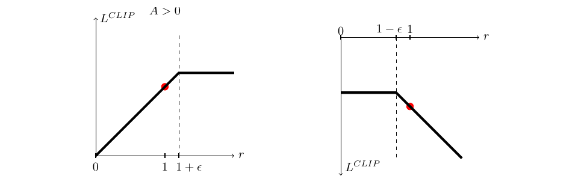{width=80%}

这张图分两种情况读：

- **左图（$A>0$，好动作）**：想增大概率、把 $r$ 往右推；但 $r$ 一旦越过 $1+\epsilon$，曲线就**变平**——再推目标也不涨，梯度归零，更新自动停手，好动作的概率不会被推到离谱。
- **右图（$A<0$，坏动作）**：对称地想把 $r$ 往左压；越过 $1-\epsilon$ 后曲线同样变平，不会一脚把坏动作踩到零。

以 $\epsilon=0.2$ 说人话：一旦新策略把某个动作的概率推出旧策略的 0.8 到 1.2 倍，目标函数就不再奖励继续推。要点在于——**clip 夹的是"目标函数的收益"，不是硬卡住比值 $r_t$ 本身**：某个样本的 $r_t$ 仍然可能越过这个区间，只是越界之后再推也赚不到分、梯度归零。**"走太远"在目标函数里赚不到钱，每次更新于是很少跑得太离谱。**

> 备注：所以 PPO-Clip 只是一道**软**信赖域——它是在代理目标上做的软约束，**不保证**策略始终待在一个严格的信赖域里。它不像 TRPO 那样用 KL 硬约束新旧策略的距离，只是让越界的更新"无利可图"；实际训练中 KL 仍可能超标，$r_t$ 也可能被别的样本带出区间。正因为 clip 不是铁栅栏，工业级 PPO 才要再配 7.3 节的 KL 自适应学习率兜底，并持续监控 KL、策略熵和梯度范数。本讲后文说"夹进信赖域"，都是这个软的意思。

## 7.3 数据复用与 KL 自适应

clip 还带来一个重要副产品：**同一批数据可以多用几遍了**。没有 clip 时数据基本只敢用一遍——多用几遍策略就被推飞；有 clip 抑制过大的概率比更新，PPO 就能把一段 rollout 拆成几份**小批（minibatch）**、再把整段数据反复过上好几个 epoch，样本效率大幅提高，顺手缓解了 on-policy 费样本的老毛病。（这是"通常更稳"，不是安全保证——KL 仍可能超标，所以要监控，下面就说这件事。）

工业级 PPO 通常还加一个自动化步长管家：**按 KL 散度自适应学习率**——每次更新后量一下新旧策略的 KL 距离，动得太猛（KL 超标）就调小学习率，动得太小就调大，步长自动收放。至此，一轮完整的 PPO 训练是：

1. 用当前策略采一批 rollout；
2. critic + GAE 算每步优势 $A_t$（第 6 节原样保留）；
3. 切成多个 minibatch，用 $L^{\text{CLIP}}$ 反复更新多轮，同时用 value loss 更新 critic；
4. 按 KL 调学习率，回到第 1 步。

## 7.4 代码走读：v2 到 v3 改了什么

`code/rl/1_rl_basics/1_1_g1_walk_rl/train_v3_ppo.py` 在 v2 上加三块，正好对应上两节。第一块，policy loss 换成裁剪目标——采样时顺手记下旧策略的 `log_probs`，训练时算比值：

```python
# 关键变化(1)：clip——用概率比值把更新夹在信赖域内（见 7.2 节的图）
        ratio = torch.exp(log_probs - batch["log_probs"])    # 相减取指数 = 新旧概率之比 r
        unclipped = ratio * batch["advantages"]    # 不裁剪的目标：比值越大，好动作赚得越多
        # 把比值夹进 [1-ε, 1+ε] 再乘优势，得到一个"越界就不再涨"的版本。
        clipped = (torch.clamp(ratio, 1.0 - self.clip_param, 1.0 + self.clip_param)
                   * batch["advantages"])
        # 取两者较小值 = 取更保守的估计：越界之后再推也赚不到分，梯度自然归零。
        policy_loss = -torch.min(unclipped, clipped).mean()
```

第二块在数据端：`G1WalkRolloutDataset` 不再把整段 rollout 打包成一个 batch 用一遍，而是切成 minibatch、重复多个 epoch 逐个吐出——Lightning 那边一行不用改，多轮复用完全由数据集实现：

```python
# 关键变化(2)：一段 rollout 切成多个 minibatch、反复训几轮，样本效率更高
        for _ in range(self.num_learning_epochs):    # 同一段 rollout 反复训几轮
            indices = torch.randperm(usable_size, device=flat["actions"].device)    # 每轮重打乱
            for start in range(0, usable_size, mini_batch_size):    # 按 minibatch 大小切片
                selected = indices[start : start + mini_batch_size]    # 这一小批的下标
                mini_batch = {key: value[selected] for key, value in flat.items()}    # 各字段同步取
```

第三块是步长管家，挂在 Lightning 的 `on_before_optimizer_step` 钩子上：

```python
# 关键变化(3)：按 KL 自适应调学习率——动得太猛减速，太小加速
def adapt_learning_rate_to_kl(optimizer, kl, desired_kl, min_lr=1.0e-5, max_lr=1.0e-2):
    current_lr = optimizer.param_groups[0]["lr"]    # 读优化器里当前的学习率
    kl_value = float(kl.detach().cpu())    # 搬到 CPU 变成普通浮点数，后面只做比较
    if kl_value > 2.0 * desired_kl:    # KL 超目标一倍以上：这一步迈太大了
        current_lr = max(min_lr, current_lr / 1.5)    # 降速；max 兜住下限
    elif 0.0 < kl_value < 0.5 * desired_kl:    # KL 不到目标一半：步子太小，可以加速
        current_lr = min(max_lr, current_lr * 1.5)    # 提速；min 兜住上限
    optimizer.param_groups[0]["lr"] = current_lr    # 写回优化器，下一步生效
    return current_lr
```

此外 v3 对 value loss 也做了对称的裁剪（新估值别离旧估值太远），思路与 clip 一脉相承。这套"clip + 多轮复用 + KL 自适应"不是本课程自创的组合：它逐条对得上 mjlab 给宇树 G1 速度跟随任务备好的官方 PPO 配方[7]，而 BeyondMimic[4] 训练真机 G1 的动作跟踪策略走的也是同一条路子——等下我们原样把它搬去做更难的任务。

## 7.5 实验：三个算法同台，行走任务收口

三个版本到齐，统一口径最后对照一次：

| 版本 | 算法 | 评测平均奖励 | 摔倒率 |
|------|------|--------------|--------|
| v1 | REINFORCE | 0.070 | 1.3% |
| v2 | A2C（+critic +GAE） | 0.043 | 1.3% |
| **v3** | **PPO（+clip +复用 +KL 自适应）** | **0.097** | **0.0%** |

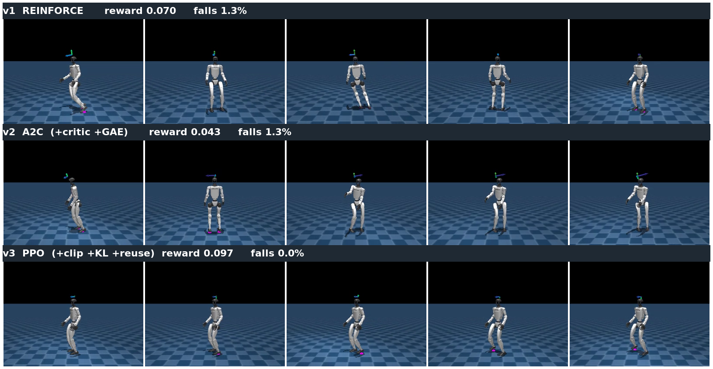{width=98%}

表格和截图给的是终点成绩，把整个训练过程画出来，三者的差别更直白：

{width=96%}

这张图要分两层读。**细线是每次迭代的原始奖励，粗线是它的趋势**。先看细线：真正一直毛刺丛生的只有 v2，后 2500 次迭代里它的原始值与滑动平均平均差 0.0046，而 v1 和 v3 的细线都紧贴着各自的粗线（0.0007 与 0.0009）。这里要防一个很容易犯的误读：**REINFORCE 的高方差大在梯度上，不在这条曲线上**——曲线画的是 4096 个环境的平均奖励，几万条样本一平均，逐次迭代之间本来就不会抖。5.6 节那个方差说的是同一批数据里每个动作拿到的权重有多散，那是另一个量，要看优势/梯度方差才读得到。v2 的细线之所以抖，是它每一步真的把策略推得忽左忽右。

**趋势那一层才是三者的差距所在**：v1 和 v2 大约 700 次迭代后就双双卡在 0 附近再也上不去（末段滑动平均 0.008 与 0.007），v2 还更低一点；v3 一路爬到 0.073，把另外两条甩开近一个量级——这正是 6.6 节说的"更新步子没人管"与"管住了"的区别。

不过 v3 这条线在 2500 迭代前后**掉了一级**：滑动平均从 0.073 落到 0.055，之后再没回去。这正是 7.2 节那条备注说的——clip 是软约束不是铁栅栏，压得住大多数更新，但压不住全部。记住这个时间点，读下一张损失图时它还会再出现一次。

训练时记下的各项损失，则从另一个角度说明了三版到底各自在优化什么：

{width=98%}

四个面板正好对应三版的差异。**策略损失**三版都有，但只看它没用——它的绝对值不能横向比较，因为每版的优势估计口径不同。**策略熵**最能说明问题：三条线都从 41 附近往下走（策略逐渐变确定），但走的节奏差很多——v1 降得最慢、末段仍停在 22 以上，说明它的动作分布一直很散、迟迟收不拢；v2 收到 15 附近；v3 一路压到 5.9（三者中最低），动作最果断。（熵说的是分布**摊得多宽**，和 6.5 节那个"动作幅度"不是一回事——后者量的是均值有多大，所以熵最高的 v1 反而动作最小。）注意 v3 的熵在 2500 迭代之后**又反弹回 12 附近**，和上一张图那次回落是同一个时间点——同一件事在两张图上都留下了痕迹。

下面两个面板只有部分版本有。**价值损失**只有 v2 和 v3 有，因为 v1 根本没训 critic：v3 的一路降到 0.02 上下，但在 2500 迭代前后同样跳了一级、末段停在 0.030——又是那个时间点；v2 的则从 700 迭代时的 0.027 起起落落地涨到末段的 0.046。价值损失升高不等于评分员变笨——它要拟合的目标（回报）本身也随策略在变。v2 那条线一路涨，说明它的 critic 始终在追一个被反复推坏的策略：步长没人管，评分员也跟着遭殃。**新旧策略 KL** 只有 v3 记录，全程稳定在 0.015 附近（目标值 0.01）——图上那条 50 次迭代滑动平均的粗线整段都落在 0.013 到 0.018 之间，抖得最厉害的单次迭代也不过 0.028。这正是步长管家在起作用：KL 偏大就压学习率、偏小就放开。

v3 把两个指标同时拿下：评测奖励最高（0.097），**摔倒率归零**。它对 6.5 节那个反常结果给出的回收是：同一套 critic + GAE 的优势估计，配上步长约束之后立刻兑现成了最高分——这支持"卡脖子的主要是步长"这个方向。但按上面价值损失那条线看，也不能反过来说 v2 的 critic 一点问题没有。

值得留意的是，v3 其实比 v2 训得**更激进**：同一批数据训 5 个 epoch、每个 epoch 切 4 份 minibatch，一共 20 个优化 step（**单个样本约被用 5 次**，不是 20 次——每个 epoch 里每个样本只出现在一份 minibatch 里），而 v2 只过一遍。更激进却更稳，是因为 clip 把每次更新的概率比压在了一个小区间里。**护栏不是让车变慢，是让车敢开快。**

> 备注：3000 迭代的课堂预算下，三者都还停留在"稳住、小幅行走"而非利落快走——mjlab 官方那份 G1 配方把迭代次数设在 **3 万**[7]，是这里的十倍。本实验的目的是对照算法差异，不是刷行走质量；把 `max_iterations` 调大即可提升绝对效果，算法本身不用动。

## 7.6 本节小结

PPO 在 A2C 之上补的是"步长安全"：用概率比值 $r_t$ 度量策略变化，clip 让"走太远"无利可图，软性地把更新压在旧策略附近；有 clip 抑制过大更新才敢多轮复用数据，再加 KL 自适应学习率自动收放步长。在行走任务的三版对照里（7.5 节），v3 同时拿下最高奖励与零摔倒，回收了 v2 的反常；换到更难的动作跟随任务（第 8 节），PPO 的领先幅度进一步拉开。

# 8 更难的任务：让 G1 跟住一段真实动作

前三节在同一个入门任务上把算法从最朴素做到了工业级。这一节不再动算法，改动任务：**同一套代码原样搬去一个难得多的问题**，看这套配方离开入门任务还剩多少本事。

## 8.1 任务：从"别摔就行"到"逐帧对齐"

行走任务上三版好歹都能站住，光看 rollout 截图差距还不算触目。把同一套代码搬到一个**难得多**的任务上试试：让 G1 **逐帧贴住一段真实武术动作**——参考动作由真人视频重定向到 G1 得到，用的正是第 4 节那条管线：GVHMR 从视频恢复人体动作，GMR 把它重定向成 G1 的参考轨迹。它比走路难在目标上：不再是"别摔就行"，而是每一帧都要匹配参考姿态。

这一组的代码在 `code/rl/1_rl_basics/1_3_g1_motion_tracking/`，三个版本与行走线**文件名一一对应**（4.5 节那张代码地图），差异只有三处：环境从速度指令换成参考动作跟踪、多一个参考动作文件参数，权重也落在另一个目录。网络结构（`model.py` 里的 `ActorCritic`）两条线逐字相同。评测摘要同样落在 `code/rl/1_rl_basics/result/1_3_g1_motion_tracking/` 下的 `.json` 里。

## 8.2 这件事真机上有人做成过：BeyondMimic

这正是 BeyondMimic[4] 做的事情——同一套 PPO 配方，训练真实宇树 G1 做出空中侧手翻、旋踢、翻身踢、冲刺这类敏捷动作：

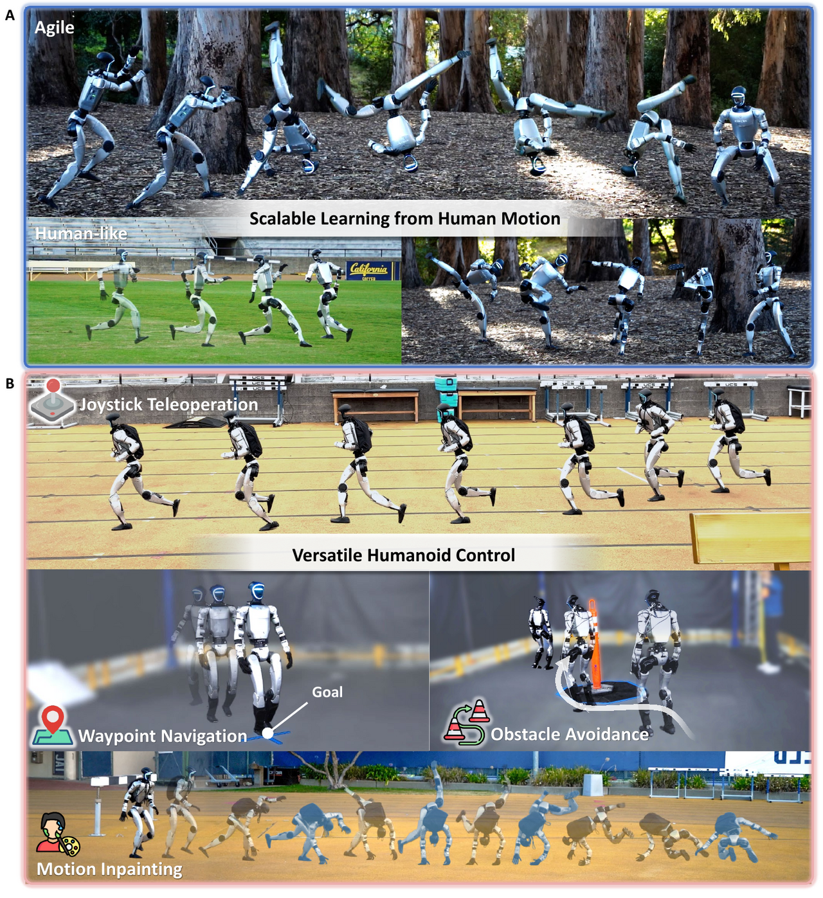{width=70%}

> 备注：本讲借用的是 BeyondMimic 的**动作跟随**那一半——让机器人稳稳执行给定的动捕轨迹，而不是凭空"涌现"出跑酷。这一点要说清楚，免得对强化学习的能力产生误解：难点在控制，不在动作创意。

## 8.3 三版对照：任务越难，差距越大

仿真里跑同样的三档，评测口径与行走线一致（确定性动作，16 环境 × 400 步）：

| 版本 | 算法 | 评测平均奖励 | 摔倒率 |
|------|------|--------------|--------|
| v1 | REINFORCE | 0.052 | 2.6% |
| v2 | A2C | 0.046 | 1.2% |
| **v3** | **PPO** | **0.070** | **0.0%** |

{width=98%}

这张图能直接看的是：三个版本都没当场瘫倒。**跟得准不准它给不了**——参考姿态没有画进画面，差别只能从跟随奖励上读：**0.070 对 0.052 / 0.046，而且只有 v3 全程不摔。**

把这组数字和行走任务那组（7.5 节：0.097 对 0.070 / 0.043）并排看，结论就出来了：**任务越难，朴素方法和完整 PPO 的差距越大。** 行走任务上 v1/v2 好歹能站住、能挪步，差距主要体现在稳定性；换到逐帧对齐这种硬任务，它们连"跟住"都做不到，v3 那套 clip + 数据复用 + KL 自适应才真正显出必要性。这就是把同一套算法搬到更难任务上要看的东西。

> 备注：两条任务线的评测口径完全一致——各自的最终权重、确定性动作、16 个环境 × 400 步，所以两组数字可以横向比较。

# 9 本讲小结

## 9.1 一条演进链：每一步为什么发生

回看整条路，每个算法都是被前一个的毛病**逼**出来的：

| 版本 | 算法 | 新增机制 | 解决什么毛病 | 对应章节 |
|------|------|----------|--------------|----------|
| v1 | REINFORCE | 策略梯度 + reward-to-go | ——（起点） | 第 5 节 |
| v2 | A2C | critic 基线 + GAE 优势 | v1 回报噪声大（方差） | 第 6 节 |
| v3 | PPO | clip + 多轮复用 + KL 自适应 | v2 更新步长没人管 | 第 7 节 |

一轮完整 PPO 的数据流也顺一遍：当前策略在 4096 个并行环境里采 24 步 → critic + GAE 把每步的优势估出来 → 切成 4 份 minibatch 反复训 5 轮，policy loss 走 clip、value loss 回归回报 → 按 KL 调学习率 → 丢掉数据，用新策略再采。本讲的关键超参数一览：

| 超参数 | 取值 | 在哪一节出现 |
|--------|------|--------------|
| 折扣因子 $\gamma$ | 0.99 | 2.3 节 |
| GAE 系数 $\lambda$ | 0.95 | 6.3 节 |
| clip 范围 $\epsilon$ | 0.2 | 7.2 节 |
| 复用轮数 × minibatch 数 | 5 × 4 | 7.3 节 |
| 目标 KL（学习率自适应） | 0.01 | 7.3 节 |
| 熵奖励系数 | 0.01 | 5.4 节 |
| 并行环境 × 每轮步数 × 迭代 | 4096 × 24 × 3000 | 1.4 节 |

这些数不是课程自己凑的：$\gamma$、$\lambda$、$\epsilon$、5 × 4 的复用切分、目标 KL、熵系数、每轮 24 步，逐条照搬 mjlab 给 G1 速度跟随任务备好的官方 PPO 配方[7]；只有迭代次数从官方的 3 万压到了课堂预算的 3000。三个版本又共用同一份配置，所以前面看到的差距是**算法机制**的差距，不是"某一版超参调得更好"。

概念多，把最容易混的十组收进一张速查表，每一条都标出它第一次出现的地方：

| 名词 | 一句话 | 首次出现 |
|------|--------|----------|
| 奖励 / 回报 | 每步的分 / 一整段的折扣总分 | 2.3 节 |
| 基于价值 / 基于策略 | 学"值多少分" / 直接学"怎么做" | 3.2 节 |
| 策略梯度方法 | 基于策略一族中沿梯度上升的子类 | 3.2 节 |
| actor-critic | 策略网络 + 价值网络的混合架构，横跨基于价值与基于策略两类 | 3.3 节 |
| on-policy / off-policy | 学的策略和采数据的策略是否同一个 | 3.4 节 |
| reward-to-go | 只算这一步之后的回报 | 5.2 节 |
| 基线 / 优势 | 参照物 / 比这个状态的平均水平好多少（$A=Q-V$） | 6.1 节 / 6.2 节 |
| bootstrap（自举） | 用价值估计替代部分实际回报；REINFORCE 与 actor-critic 的分界 | 6.3 节 |
| GAE | 多步时序差分残差的 $\lambda$ 加权，估优势 | 6.3 节 |
| 信赖域 / clip | 更新尽量待在旧策略附近（软约束）/ 用裁剪实现它 | 7.1 节 / 7.2 节 |

## 9.2 回到分类地图：GRPO 与 off-policy 在等下两讲

用第 3 节的三个划分给本讲定位：我们全程走在 model-free、基于策略（策略梯度）、on-policy 这一格里，把这一格内部从最朴素做到了工业级。地图上还有两步棋，正好是下两讲：

**往前一站是 GRPO（第15讲）。**场景换成大模型和 VLA 的后训练：奖励从"走得稳不稳"变成可验证的对错，"动作"从关节目标量变成文本 token。这个场景里 critic 变麻烦了：给一个语言模型再挂一个价值网络，显存与计算都会明显往上走。具体涨多少不好一概而论——取决于价值网络与策略共不共享骨干（常见做法是共享 backbone、只加一个 value head，也可以另用一个小得多的网络），也取决于并行与 offload 怎么实现，反正不是简单的"翻倍"。但这个场景也有个本讲没有的便利：同一道题可以让模型采样**一组**回答，组内的平均分天然就是"这个状态的平均水平"。于是 GRPO 做了个漂亮的取舍：**保留 PPO 的 clip，请走 critic**，用组内相对优势直接当权重。critic 在第 6 节被我们请进来、到 GRPO 又被请走，这不叫倒退：换了场景之后，"参照物从哪来"这个老问题有了更省的答案。你会发现本讲建立的优势、信赖域、clip 这套直觉，原样迁移过去。

**另一格是 off-policy 的价值线（第16讲）。**真机上一条数据都金贵，on-policy"用完即弃"养不起，必须换到 off-policy、把经验池榨干——也就是 3.5 节表里 Q-learning、DQN 到 SAC 那一列。第16讲第 8 节的 HIL-SERL 就建在 SAC 上，还要把人拉进训练环里。到那时，第 3 节这张地图上的每一格就都被我们亲手踩过了。

> 一句话总结：强化学习用奖励代替标准答案，让机器人在试错中学会示教教不了的事；REINFORCE 证明"好动作加概率"这条路走得通，A2C 用 critic 换掉粗糙的参照物，PPO 用 clip 管住步子——同样的 3000 次迭代、同一套超参，G1 从勉强站住、时不时摔一下，走到零摔倒行走，这段差距就是这条演进链最直接的证据。

# 参考文献

[1] ACHIAM J. Spinning up in deep reinforcement learning[EB/OL]. (2018)[2026-06-26]. https://spinningup.openai.com.

[2] SCHULMAN J, WOLSKI F, DHARIWAL P, et al. Proximal policy optimization algorithms[EB/OL]. (2017-07-20)[2026-06-26]. https://arxiv.org/abs/1707.06347.

[3] SCHULMAN J, MORITZ P, LEVINE S, et al. High-dimensional continuous control using generalized advantage estimation[EB/OL]. (2015-06-08)[2026-06-26]. https://arxiv.org/abs/1506.02438.

[4] LIAO Q, TRUONG T E, HUANG X, et al. BeyondMimic: from motion tracking to versatile humanoid control via guided diffusion[EB/OL]. (2025-08-11)[2026-06-26]. https://arxiv.org/abs/2508.08241.

[5] SUTTON R S, BARTO A G. Reinforcement learning: an introduction[M]. 2nd ed. Cambridge: MIT Press, 2018.

[6] SIMONINI T, SANSEVIERO O. The Hugging Face deep reinforcement learning course[EB/OL]. (2023)[2026-06-26]. https://huggingface.co/learn/deep-rl-course.

[7] ZAKKA K, LIAO Q, YI B, et al. mjlab: a lightweight framework for GPU-accelerated robot learning[EB/OL]. (2026-01-29)[2026-08-29]. https://arxiv.org/abs/2601.22074. 代码仓库：https://github.com/mujocolab/mjlab.

[8] SHEN Z, PI H, XIA Y, et al. World-grounded human motion recovery via gravity-view coordinates[EB/OL]. (2024-09-10)[2026-07-02]. https://arxiv.org/abs/2409.06662.

[9] ARAUJO J P, ZE Y, XU P, et al. Retargeting matters: general motion retargeting for humanoid motion tracking[EB/OL]. (2025-10-02)[2026-07-02]. https://arxiv.org/abs/2510.02252.

[10] ZE Y. GMR: general motion retargeting[EB/OL]. (2025-08-03)[2026-08-29]. https://github.com/YanjieZe/GMR.

[11] CAPUANO F, PASCAL C, ZOUITINE A, et al. Robot learning: a tutorial[EB/OL]. (2025-10-14)[2026-08-31]. https://arxiv.org/abs/2510.12403.
