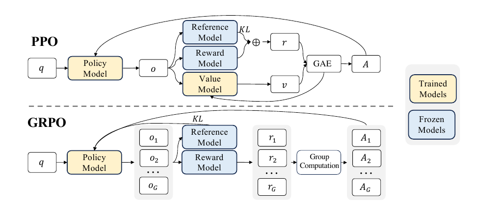
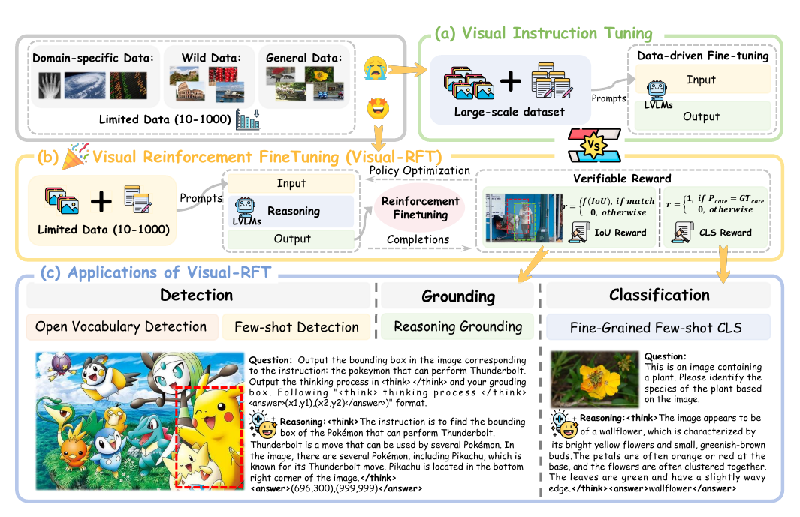
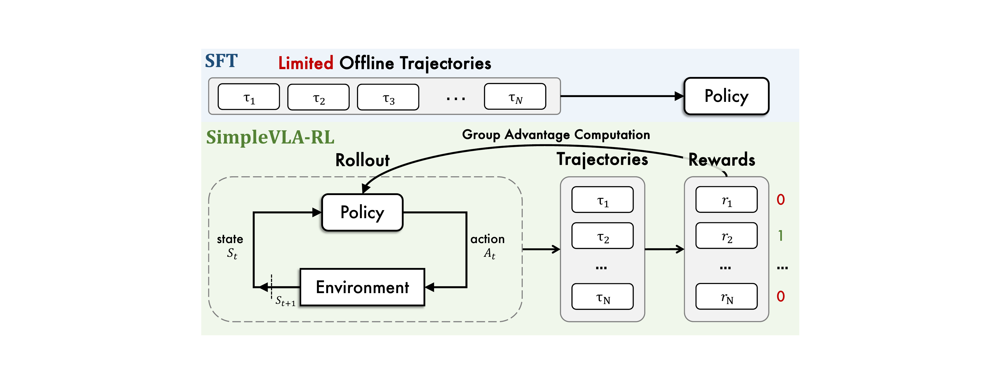
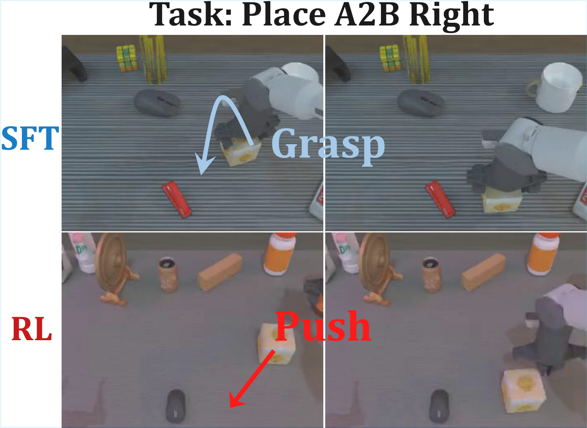
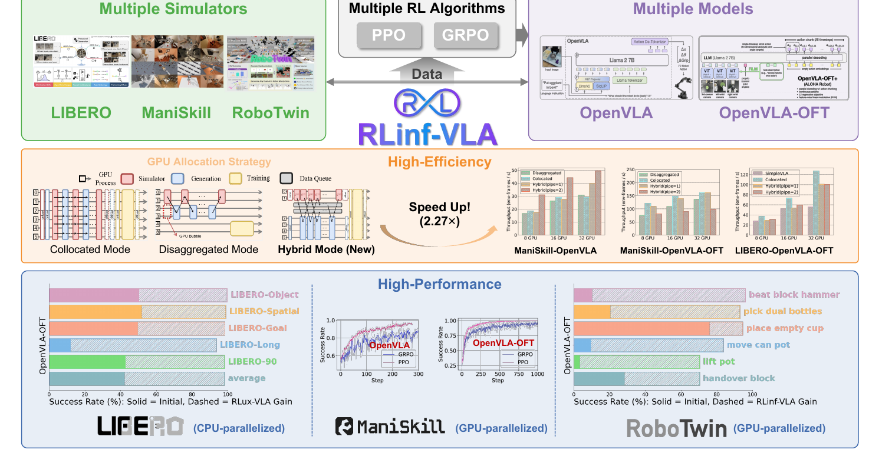
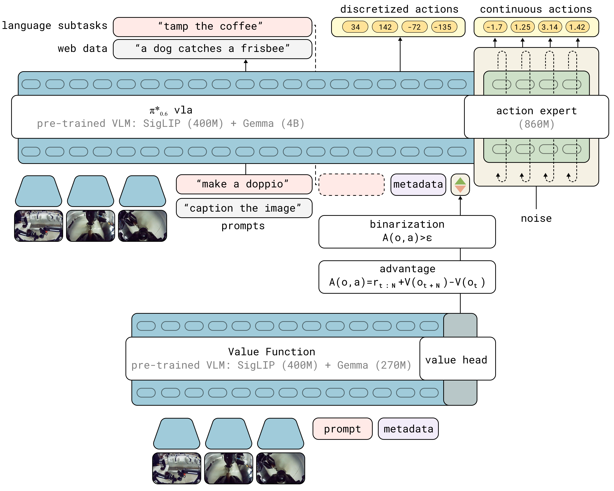
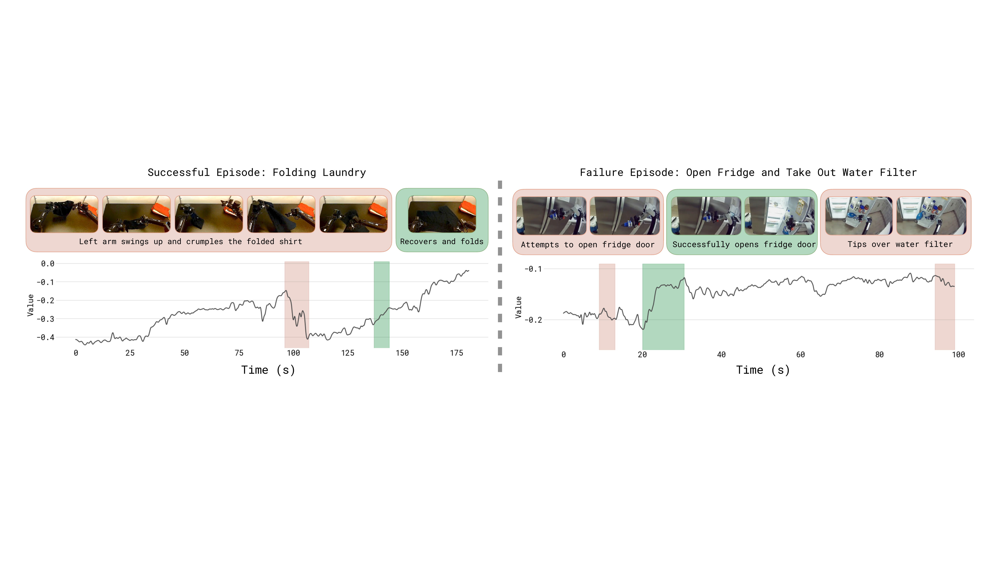
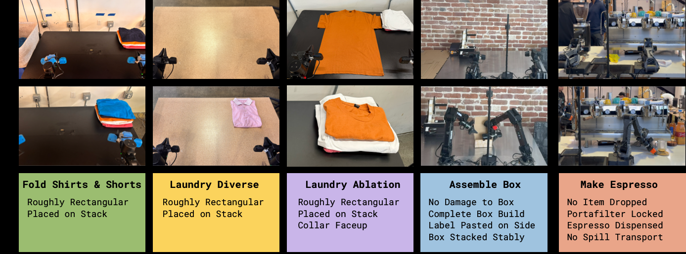
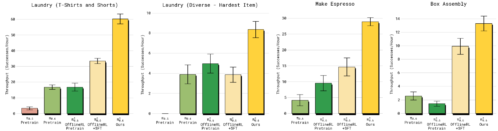

# 1 从 PPO 到 GRPO：为什么不再请评分员

## 1.1 回顾第14讲：PPO 手里的四件家当

上一讲（第14讲）我们从最朴素的策略梯度出发，一路把 G1 的行走策略升级到了 PPO。先盘点一下 PPO 手里的家当：

| 部件 | 作用 |
|------|------|
| 策略网络（actor） | 从观测映到动作分布，是我们真正要的东西 |
| 价值网络（critic） | 给每个状态估计“从这里出发平均还能拿多少回报”，充当基线 |
| GAE | 把多步实际回报和价值估计折中，进一步压方差 |
| clip 目标 | 限制每次更新的步子，防止策略一步迈进深渊 |

其中 critic 是我们花钱请来的“评分员”：策略梯度告诉我们“好动作加概率、坏动作减概率”，但“好坏”必须跟一个参照比才有意义，critic 提供的就是这个参照。它和策略一起训练、一起长大，是降低方差的关键。

上一讲结尾我们留了一个问题：这位花钱请来的评分员，有没有可能不请？本讲的第一件事就是回答它。

## 1.2 场景变了：从 G1 行走到大模型答题

在回答之前，先看清场景发生了什么变化。上一讲的 RL 用来从零训练一个行走策略；本讲的 RL 用在一个已经预训练、微调过的大模型上，让它在某个指标上继续变好——这个阶段叫**后训练（post-training）**。两个场景的差别比看上去大得多：

| 维度 | G1 学走路 | 大模型答题 |
|------|-----------|------------|
| 策略本体 | 几百万参数的小网络 | 3B 起步的大模型 |
| 一个回合 | 仿真里走几千步 | 生成一段回答，生成完即回合结束 |
| 奖励 | 每一步都有（速度、姿态、能耗） | 只在句末（答对 / 答错） |
| 同一初始状态重复 | 不同回合初始状态各不相同 | 同一道题可以让模型答任意多遍 |

这张表读出三个含义：

1. **奖励全堆在末尾**。生成中途没有任何奖励，GAE 那套“多步回报折中”没了用武之地；
2. **critic 变得极其昂贵**。要估计“从这半截回答出发还能得多少分”，critic 得读懂这半截回答——它必须是一个和策略同体量的大模型；
3. **但答题场景有一个 G1 行走没有的便利**：同一道题，可以让模型答很多遍。

第三条正是 GRPO 的突破口。

## 1.3 critic 的账算不过来

先把第二条展开。后训练一个 7B 模型时，显存里本来就要放下策略本体和一个冻结的参考模型；照搬 PPO 的话还得再塞进一个同体量的 critic。而 critic 和参考模型不一样——参考模型只做前向，critic 是**要训练**的，梯度、优化器状态、激活值一样都少不了。省掉它省下的不止一份权重。至于总开销究竟涨几成，取决于 critic 与策略共不共享骨干、怎么并行与 offload，没有一个放之四海的倍数。

更麻烦的是 critic 很难训准。奖励只在句末出现，critic 要从“半截文本”预测最终得分，这个回归问题本身就极难；而一个估不准的基线比没有基线更糟——它会系统性地把梯度引向错误的方向。DeepSeek 团队在数学推理任务上的实践正是被这两个问题逼出了新招。

## 1.4 GRPO 的一招：同题采一组，平均分当基线

既然同一道题可以答很多遍，那全组的平均分就是现成的基线——不用请评分员，让这组回答互相比就行了。

具体做法：对同一个题目（prompt），用当前策略采样 $G$ 条回答，逐条用规则打分得到奖励 $r_1, r_2, \ldots, r_G$，然后把每条回答的优势定义为组内标准化的相对分数：

$$
\hat{A}_i = \frac{r_i - \operatorname{mean}(r_1, \ldots, r_G)}{\operatorname{std}(r_1, \ldots, r_G)}
$$

| 符号 | 含义 | 典型取值 |
|------|------|----------|
| $G$ | 同一题目采样的回答条数（组大小） | 4～16 |
| $r_i$ | 第 $i$ 条回答的奖励 | 0 或 1（规则判定） |
| $\hat{A}_i$ | 第 $i$ 条回答的组相对优势 | 正＝比组平均好，负＝比组平均差 |

比组平均好的回答，整条的所有 token 都被加概率；比组平均差的，整条减概率。critic 的活——提供“平均水平”这个参照——被一次分组采样直接干掉了。

> 备注：组内标准化给出的只是**相对**优势——每条回答是跟“这一组的平均”比，而不是跟一个绝对的价值估计比。软肋也正在这里：万一一组里的回答全对或全错，组内没有差异，标准化后优势全为零，这一组就不产生任何梯度。所以 GRPO 格外依赖“组里有对有错”的题目；第 6 节里调采样温度、做动态采样，很大程度上就是在保证每组内部有信号可比。



上图出自提出 GRPO 的 DeepSeekMath 论文[1]，上下两行对着读，差别一眼可见：上半行 PPO，policy 与 value 两个大模型都是黄色的“要训练”，GAE 把奖励与价值汇合成优势；下半行 GRPO，value model 整块消失，取而代之的是“Group Computation”——同一题目的 $G$ 条输出各拿一个奖励，组内归一化后直接得到每条的优势。GRPO 由 DeepSeekMath 提出，随后被 DeepSeek-R1[2] 发扬光大，成为大模型后训练的主力算法之一。

两行**共有**的那两个蓝色方块值得多看一眼，它们正是后面两节的伏笔。一个是 **Reference Model**：上下两行都挂着它、都往回连一条 KL——所以 1.5 节说 GRPO“新增”一条 KL，指的是相对第14讲那版机器人 PPO 而言；这张图上的大模型 PPO 本来就有。另一个是 **Reward Model**：图里两行都要请一个模型来打分，那是数学推理场景的通用做法；本讲第 2 节要做的第一件事，就是把这个方块也拆掉，换成一段判分脚本。

## 1.5 留下的没变：clip 还在，再加一条对参考模型的 KL

GRPO 是对 PPO 做减法，而不是推翻重来。上一讲管住策略的两件事，一件原样保留、一件是新增：

- **clip 照旧**：组相对优势 $\hat{A}_i$ 直接代入 PPO 的 clip 目标，每次更新的步子仍被概率比值的裁剪范围限制。要强调的是——**把新策略拉回旧策略附近（单步的信赖域）这件事，仍然由 clip 承担，并没有随 GRPO 而消失。**
- **新增一条对参考模型的 KL**：GRPO 额外挂一条 KL，约束“策略别偏离**参考模型**太远”——参考模型通常就是 RL 开始前那个经**监督微调**（SFT，supervised fine-tuning，拿示教数据当标签直接学模仿）得到的模型，全程冻结。这条 KL 管的是整场训练不要把模型带离原本的胜任区。它是**加**上去的锚，不是把 clip 那条旧策略约束“搬了个家”。

> 备注：别把这条 KL 和上一讲 PPO 里的 KL 混了。第14讲 6.3 节那版 PPO 也量新旧策略的 KL，但那只是用来**自适应调学习率**的旁路，真正约束单步步长的是 clip；GRPO 新增的这条 KL 则全程锚定在同一个冻结的参考模型上，防的是“训着训着整个人变了”。一个盯“这一步迈太大”（clip）、一个盯“整场训练跑偏”（KL 锚）——两件事各管各的。这条 KL 锚该不该留，第 6.3.5 节还会再算一次账。

完整的 GRPO 目标函数我们放到第 6 节讲 SimpleVLA-RL 时给出——那里正好第一次真正用到它。

## 1.6 本节小结

GRPO 用“同题采一组、组内平均分当基线”替掉了 PPO 的价值网络，省下的是一个要训练的大模型，连同它难训准的那份麻烦；clip 护栏保留（旧策略的信赖域仍靠它），另加一条对参考模型的 KL 锚定整场训练。它的代价是要求“同一初始状态可以重复采样”——这在答题场景免费，在机器人场景则需要仿真器配合，这个伏笔后面会兑现。还没回答的问题是：句末那个奖励从哪来？这是下一节的主题。

# 2 可验证奖励，和一个题眼

## 2.1 奖励从哪来

GRPO 把“怎么算优势”解决了，但每条回答的分数 $r_i$ 从哪来？后训练大模型有三条路：

| 路线 | 做法 | 毛病 |
|------|------|------|
| 人工打分 | 每条回答请人评 | 无法规模化，采样一批就要标一批 |
| 训练奖励模型 | 先用人标偏好训一个打分模型，再让它代人打分 | 要先烧一轮标注；策略会学会“讨好”打分模型而非真的变好 |
| 规则判定 | 用确定性规则直接判对错 | 只适用于答案可机判的任务 |

第三条路就是**可验证奖励**（RLVR，Reinforcement Learning with Verifiable Rewards）：数学题比对最终答案、代码跑测试用例、机器人任务看有没有完成——奖励函数退化成一段判分脚本。

## 2.2 稀疏，但干净

可验证奖励通常是 0/1 的稀疏信号：对就是对，错就是错，中间过程一分不给。看起来信息量很少，但它有两个训练奖励模型换不来的性质：

- **干净**：判分规则没有参数、不会被“黑”。策略找不到“骗过打分器”的捷径，只能真的把任务做对；
- **免费且无限**：判分脚本可以自动运行任意多次，采样多少条就能判多少条，成本不随规模增长。

而且稀疏奖励和 GRPO 天然般配：同一道题采 $G$ 条回答，只要有对有错，组内立刻分出高下，0/1 奖励经过组内标准化就变成了有正有负的密集学习信号。


上图是 Visual-RFT 给出的管线图[3]，可以当作“GRPO + 可验证奖励”组合拳的标准照。最左一列是输入与被训练的策略，Policy Model 上那个火苗标记表示它是唯一要更新的模型；右上一排是它对同一张图、同一个问题采出的多条带推理过程的回答，候选框各画在不同位置，有的对有的错。中间那一块把每条回答交给规则函数打分——检测看 $R_\text{IoU}$、分类看 $R_\text{cls}$，两条判分公式就印在图上；分数汇成“Verifiable Reward”，再沿箭头一路回流到左边的策略。整个环路里没有价值网络，也没有奖励模型；唯一带雪花标记的 Reference Model 是冻结的，只承担 1.5 节那条 KL。

## 2.3 题眼：强化学习外环与策略本体解耦

现在把这个训练环路从头到尾盘一遍，数一数它对“策略”这个黑盒到底提了几个要求：

1. 给定输入，能**采样出一串离散 token**；
2. 对采出的每个 token，能给出它的 **log 概率 $\log \pi_\theta$**（用来算概率比值和 KL）；
3. 外环拿到完整输出后能**判分**。

就这三条。环路完全不关心 token 的**含义**——它是一个中文字、一个数学符号，还是别的什么，GRPO 一概不问。

这就是本讲的题眼：**强化学习外环和策略本体是解耦的**。语言模型输出文本 token；而有一类 VLA 模型（比如第 6 节 SimpleVLA-RL 用的那个保留动作 token 头的 OpenVLA-OFT 变体）把机器人动作离散成整数 token 打出来——动作 token 和文本 token 在数学上是同一个东西：都是大模型词表上的 categorical 分布，log 概率的算法一模一样。

于是一个大胆的推论自然成立：**给 VLM 做数数后训练的那套 GRPO 外壳，几乎一行不改，就能套到 VLA 的动作 token 上**——只要把“答案对不对”的判分脚本换成“任务成没成”的仿真判定。第 4 节的数数实验和第 6 节的 SimpleVLA-RL 就是这条线的两端。

反过来，这个题眼也划出了边界：如果动作头不是离散 token，而是 flow matching 或扩散模型输出的连续动作，第 2 条要求（干净的 log 概率）就不满足，这套外壳套不上去。怎么办？第 8 节的 $\pi^{*}_{0.6}$ 会给出一条绕行的路，下一讲（第16讲）的价值方法则是另一条正面解决的路。

## 2.4 本节小结

一段判分脚本就是可验证奖励的全部实体——不用人标，也不用训一个奖励模型；它给的信号稀疏，但干净，和 GRPO 的组内比较正好互补。更要紧的是我们看清了 GRPO 外环对策略只有“离散选择 + log 概率”两个要求——文本 token 与离散动作 token 因此可以共用同一套后训练外壳。这个题眼是本讲把 VLM 和 VLA 并在一起讲的全部理由。

# 3 VLM 后训练：从 DeepSeek-R1 到会数数的小模型

## 3.1 R1 时刻

把 GRPO 和可验证奖励组合起来大规模应用的标志性工作是 DeepSeek-R1：在数学和代码这两类天然可机判的任务上做 RLVR 后训练，模型的逐步推理能力随训练显著涌现，重新定义了“后训练”在大模型训练管线里的地位。R1 的细节不是本讲重点，只需要记住它验证的这条配方：**规则奖励 + GRPO，就足以让大模型学会一类新能力**。

## 3.2 搬到多模态：R1-V 与 Visual-RFT

这条配方很快被搬到了视觉-语言模型上。R1-V 项目[4]用不到 3 美元的算力后训练 Qwen2-VL-2B，只跑 100 步 GRPO，就把它在 SuperCLEVR 数数子集上的准确率从 48.0% 拉到 82.5%；Visual-RFT 则系统地把 R1 式的后训练扩展到检测、分类、定位等一系列视觉任务——检测框的 IoU、分类的对错，都可以写成判分规则。



这张图把两种范式**上下**叠着画。(a) 那一栏是传统视觉指令微调，进料口写着 Large-scale dataset，本质是记忆式模仿，数据饥渴；(b) 那一整行是可验证奖励驱动的强化微调，进料口直接标着 Limited Data (10-1000)——十条到一千条，模型对每个输入生成多条带推理的回答，靠 IoU 与分类两种规则反馈自我修正。最下面 (c) 一栏摆出它落地的几类任务：开放词表检测、少样本检测、推理定位、细粒度少样本分类。对小模型、垂直任务来说，(b) 这条路的性价比高得多。

## 3.3 为什么数数是最干净的入门

在所有视觉 RLVR 任务里，我们选**数数**作为第一个上手实验，因为它把无关变量压到了最少：

- **答案唯一且是整数**：“图里有几个红色的球”只有一个正确答案，判分就是字符串比对，零歧义；
- **不需要奖励模型、不需要人**：规则一行就能写完；
- **不需要机器人**：纯计算任务，单卡就能完整跑通训练加评测；
- **能力真实有用**：数数考验的是视觉定位加逐个枚举，恰是小 VLM 普遍薄弱、又能被 RL 明显改善的能力。

下一节我们就在这个任务上，完整跑一遍“后训练前 → 后训练后”的对照。

## 3.4 本节小结

DeepSeek-R1 验证了“规则奖励 + GRPO”的后训练配方，R1-V 和 Visual-RFT 证明它能以极低成本搬到多模态模型上。数数任务判分零歧义、不需要机器人，是视觉 RLVR 的最干净入门，也是我们第一个实验的舞台。

# 4 实验：让 VLM 学会数数

## 4.1 任务与设置

第一个实验完整复刻第 3 节的配方：在 SuperCLEVR 数数任务上，用 GRPO 后训练一个小型视觉-语言模型，看它从“数不对”到“数得对”。SuperCLEVR[5] 是渲染出来的 3D 场景数据集，图里散落着不同颜色、形状、材质的物体，问题形如“图中有几个红色的金属物体”，答案是一个整数。

| 设置项 | 取值 |
|--------|------|
| 基座模型 | Qwen2.5-VL-3B-Instruct[6]（4bit 量化 + LoRA 微调） |
| 训练算法 | GRPO（TRL 库[7] 的 `GRPOTrainer`） |
| 训练数据 | CLEVR 计数题 512 条（R1-V 项目同款） |
| 组大小 $G$ | 4 |
| 训练步数 | 300 步，单卡，总用时约 22 分钟 |
| 评测 | SuperCLEVR 固定 200 题切片，训练前后同一套题 |

> 备注：更小的 Qwen2-VL-2B 与当前训练工具链存在兼容问题，因此选用 3B。表里的每一项都能在
> `code/rl/2_grpo_posttraining/2_1_grpo_vlm_counting/train_grpo_qwen2_vl.py` 里找到对应的一行；
> 22 分钟这个数取自那一次训练留下的 `train_runtime=1320.7` 秒，记录在
> `code/rl/2_grpo_posttraining/result/2_1_grpo_vlm_counting/README.md`。

## 4.2 奖励：两条判分规则

整个实验的奖励函数只有两条规则，都能用几行判分逻辑写完：

- **格式奖励**：回答必须把最终答案放进规定的标签里（形如 `<answer>7</answer>`）。守规矩得分，否则不得分；
- **正确性奖励**：从标签里抽出的答案与标准答案一致，得 1 分，否则 0 分。

为什么需要第一条？如果答案埋在自由发挥的文本里，判分脚本就抓不准它，正确性奖励无从谈起。格式奖励每条回答都能判、信号密集，模型很快学会“把答案放在指定位置”；在此基础上，稀疏的正确性奖励才有的放矢。先教格式、再提准确率，这是 DeepSeek-R1 以来 RLVR 训练的通用小技巧。

说“几行”不是修辞——连同抽答案的辅助函数一起，两条规则十几行就写完了，没有任何模型参与，全靠正则和字符串比较：

```python
def extract_answer(text: str) -> str | None:
    # 三个细节都是被模型的实际输出逼出来的：`(.*?)` 非贪婪，一段里出现多对标签时只取第一对，
    # 不会从第一个 <answer> 一路吞到最后一个 </answer>；IGNORECASE 容忍模型写成 <Answer>；
    # DOTALL 让 `.` 也能匹配换行，答案跨行时照样抓得到。
    match = re.search(r"<answer>\s*(.*?)\s*</answer>", text, flags=re.IGNORECASE | re.DOTALL)
    if match is None:
        return None                      # 没有合法标签：交给调用方判成 0 分，不在这里给分
    return match.group(1).strip()        # 去掉两端空白，后面才好做纯字符串比较


def format_reward(completion: str) -> float:
    # 只问"抽不抽得出"，不问答对没答对——所以每条回答都判得动，信号密集
    return 1.0 if extract_answer(completion) is not None else 0.0


def correctness_reward(completion: str, target: str) -> float:
    predicted = normalize_answer(extract_answer(completion))
    # 标准答案两种形态都要接住：带标签的整段，或者干脆就是裸答案，所以 `or target` 兜底
    expected = normalize_answer(extract_answer(target) or target)
    if predicted is None or expected is None:
        return 0.0                       # 格式没立住就没法比对错，直接 0 分
    return 1.0 if predicted == expected else 0.0     # 归一化之后是全等比较，不给部分分
```

（为了让三个函数并排看得清，上面省去了它们各自的 docstring，仓库里的版本带着。）

`format_reward` 抽得出标签就给分，每一句回答都判得动，信号密集；`correctness_reward` 抽不出答案直接 0 分——格式奖励必须先立起来的原因，就写在这两行里。

这十几行就是第 2 节说的“**可验证奖励**”的全部实体——没有奖励模型、没有人工标注，一个判分脚本而已。把它们交给 TRL 的 `GRPOTrainer`，组采样、算组内平均、按优势更新这些就都是现成的：

```python
        def formatting_reward_func(completions, **unused):
            return [format_reward(completion) for completion in completions]

        def correctness_reward_func(completions, answer, **unused):
            return [correctness_reward(completion, target)
                    for completion, target in zip(completions, answer)]
```

注意奖励函数收到的是 `completions`——**一次一组**，正是 1.4 节那个“同题采一组、平均分当基线”的组。组大小 $G$ 就写在 `GRPOConfig` 里（本实验取 4）。

训练脚本的四件套和第14讲的三个 RL 版本一一对应：一个 `Dataset`（`ClevrCountingDataset`）、一个 `LightningDataModule`（`ClevrCountingData`）、一个包住 Qwen2.5-VL 的 `nn.Module`（`QwenVLGRPOModel`）、一个 `LightningModule`（`GRPOLightningModule`），入口仍是 `trainer.fit(model, data)`。有一处不同要说明：第14讲那三版用的是 `IterableDataset`，每轮现场采新数据；这里的 `Dataset` 只负责把 512 道题准备好，**在线采样发生在 `GRPOTrainer` 内部**——它拿到一道题就现场生成 4 条回答、现场打分。所以 `LightningModule` 的 `training_step` 只被调用一次，进去之后 `GRPOTrainer.train()` 一口气跑完 300 个 GRPO step。完整代码在 `code/rl/2_grpo_posttraining/2_1_grpo_vlm_counting/train_grpo_qwen2_vl.py`。

## 4.3 结果：从蒙到数

训练前后在同一套 200 题上各评一遍：

| 指标 | 后训练前 | 后训练后 | 提升 |
|------|----------|----------|------|
| 数数准确率 | 0.095 | 0.44 | +0.345 |
| 答案格式合规率 | 0.22 | 0.79 | +0.57 |

{width=75%}

后训练前的 3B 模型在 SuperCLEVR 上准确率只有 9.5%——基本处于“蒙”的水平；300 步 GRPO 之后达到 44%。格式合规率涨得更多，从 0.22 到 0.79。两条奖励的性质本就不同：格式奖励密集、每条回答都判得动，是模型最容易先抓住的那一部分；数数得分稀疏得多，只有当答案已经被放进指定位置、判分脚本抓得到它时才谈得上。这正是 4.2 节说“先教格式、再提准确率”的原因。

诚实地说，44% 远不是这个任务的上限，更长的训练、更大的组还能继续涨。但作为演示，从 9.5% 到 44% 的跳变已经把要点说清楚了：**不加新数据、不加人工标注，只靠判分脚本和 GRPO，模型确实学会了一项它原本不会的能力**。

## 4.4 本节小结

用现成的 GRPO 训练器加两条判分规则，单卡二十来分钟就完成了一次完整的 RLVR 后训练，数数准确率从 0.095 提到 0.44。这个实验的全部要素——组采样、规则打分、组内比较——接下来会原封不动地出现在 VLA 的后训练里，变的只有两样：策略的 token 从文字换成动作，判分从比对答案换成仿真器判定任务成败。

# 5 VLA 后训练：把「答对没」换成「干成没」

## 5.1 机器人任务天然可验证

把第 2 节的判分脚本从“答案比对”换成“任务判定”，可验证奖励就走进了机器人领域。仿真基准 LIBERO[8] 里，每个任务自带成功判定——物体有没有被放到目标位置、抽屉有没有被拉开，仿真器一查便知。**机器人任务天生就是可验证奖励的富矿**：不用训奖励模型，不用人盯着打分。

仿真器还顺手兑现了第 1 节埋下的伏笔。GRPO 要求“同一道题答 $G$ 遍”，机器人版的“同一道题”就是**同一个初始状态**——仿真器可以把场景精确重置到同一初始布局，让策略从完全相同的起点跑 $G$ 条轨迹。真机上这两件事（自动判定、精确重置）都很难，所以本讲的 VLA 后训练全部在仿真里完成；真实世界的路怎么走，第 8 节和下一讲各给一条。

## 5.2 三个层次的代表工作

2025 年前后，VLA 强化学习后训练集中爆发。我们选三篇代表作，它们恰好回答三个不同层次的问题：

| 工作 | 层次 | 回答的问题 |
|------|------|------------|
| SimpleVLA-RL[9]（第 6 节） | 算法 | GRPO 搬上 VLA 到底行不行、能涨多少 |
| RLinf-VLA[10]（第 7 节） | 系统 | 大规模 VLA 强化学习的 GPU 资源怎么编排 |
| $\pi^{*}_{0.6}$[11]（第 8 节） | 落地 | 连续动作头、真实世界部署怎么办 |

本讲把三篇都过一遍：先看代表作怎么把路走通（第 6 节），再看基建怎么把路修宽（第 7 节），最后看前沿怎么把它推向真实世界（第 8 节）。

## 5.3 SFT 基线为什么重要

动手之前还有最后一个概念要建立。稀疏 0/1 奖励下，GRPO 的学习信号来自“组内有对有错”：如果基座策略在任务上**从不成功**，每组 $G$ 条轨迹全是 0 分，组内标准差为零、优势恒为零——**一步也学不动**。反过来，如果基座已经**接近满分**，组内全是 1 分，同样没有信号，而且也没有提升空间了。

所以 VLA 后训练开工前必须先量两个数：**基座成功率是不是大于零**（有没有信号）、**离天花板还有多远**（有没有提升空间）。最舒服的起点是成功率居中的基座——一组里既有成功又有失败，每次采样都带信息。这条规律看似朴素，第 6.4.6 节 SimpleVLA-RL 的失败边界实验会结结实实撞上它。

## 5.4 本节小结

机器人仿真任务自带成功判定和精确重置，天然满足可验证奖励和 GRPO 分组采样的两个前提。三篇代表作分别站在算法、系统、落地三个层次上。能套上这套外壳的 VLA 有一个硬条件：动作得以离散 token 的形式生成——只有这样 log 概率才与文本同构，数数实验的外壳才能原样搬来。此外还有一个新前提：基座成功率必须“不为零也不满分”，这个数字决定了后训练有没有得学、有没有得涨。

# 6 SimpleVLA-RL：把 GRPO 搬上 VLA 的代表作

> 论文：*SimpleVLA-RL: Scaling VLA Training via Reinforcement Learning*[9]，2025 年 9 月（arXiv: 2509.09674）


这张图是本节的路线图，四个角对应后面四个小节，值得先扫一遍再往下读。左上那条爬升曲线最有冲击力：横轴是 RL 训练步数，纵轴是 LIBERO-Long 成功率，起点 17.3% 是“每个任务只给一条示教”的 SFT，曲线一路爬过 86.5% 那条代表全量示教 SFT 的灰线，停在 91.7%——**每个任务一条轨迹，加 RL 之后压过了每个任务五十条轨迹的纯模仿**（6.4.2 节）。右上四组柱子里，浅色是 SFT 打底、深色是 RL 补上的增量，红色虚线是 $\pi_0$ 的水平（6.4.1 与 6.4.4 节）。左下两格画面就是 6.4.5 节要讲的 pushcut。右下三张小图的横轴都是“已见任务成功率”、纵轴是“未见任务成功率”，红蓝两条线朝相反方向走，那是 6.4.3 节的泛化结论。

第 11、12 讲里我们认识的 $\pi_0$、$\pi_{0.5}$、SmolVLA，训练范式都是 SFT。然而 SFT 面临两个根本性瓶颈：（1）高质量机器人轨迹数据稀缺且采集成本高昂；（2）模型泛化能力受限于训练数据的分布。

受 DeepSeek-R1 的启发——RL 仅凭结果奖励就能显著提升 LLM 的逐步推理能力——SimpleVLA-RL 提出了一个自然的问题：**RL 能否同样提升 VLA 模型的逐步动作规划能力？**

## 6.1 背景与动机

当前 VLA 的主流训练范式是“大规模预训练 + SFT”，往下扩展时会撞上两堵墙。一堵是**数据稀缺**：把 SFT 继续做大需要海量人类遥操的机器人轨迹，而这些数据要精心布置实验场景、准备多样的操作对象、还得有熟练的操作员，成本高到难以规模化。另一堵是**泛化不足**：SFT 只见过有限的、场景和任务都特定的数据，一旦遇上没见过的任务、环境或物体，性能就会掉下来。5.1 节说“机器人任务天然可验证”，要绕开的就是这两堵墙。

绕开的思路来自 3.1 节那个 R1 时刻：仅靠一个结果奖励（答案对不对），RL 就能驱动 LLM 学会逐步推理。把这件事平移到机器人上，就是一个很自然的类比——

$$
\underbrace{\text{LLM: 逐 token 推理}}_{\text{RL 提升推理链质量}} \quad \longleftrightarrow \quad \underbrace{\text{VLA: 逐步动作规划}}_{\text{RL 能否提升动作序列质量？}}
$$

但这个平移不是照搬。LLM 和 VLA 在状态空间、动作空间、和环境怎么交互、rollout 怎么产生这四件事上都有根本差异——这正是 SimpleVLA-RL 要解决的核心技术问题，下一节先把这些差异摆清楚。

SimpleVLA-RL 本身是一个面向 VLA 的高效在线 RL 框架，基于字节跳动的 veRL[12]（一个通用 LLM RL 框架）改造而来。它做了四件事：**把 LLM RL 框架适配到 VLA**（实现 VLA 特有的交互式轨迹采样与损失计算）；**只用结果奖励**（成功 1、失败 0，不手工设计过程奖励）；**加了一组探索增强手段**（动态采样、放宽裁剪上界、提高采样温度）显著提升训练效率；以及一个意外收获——RL 训练中模型**自己发现了示教数据里根本不存在的新策略**（后面 6.4 节会看到的 “pushcut”）。

## 6.2 预备知识：LLM RL vs VLA RL

理解 SimpleVLA-RL 的关键在于看清 LLM 和 VLA 在 RL 框架下的本质差异。

### 6.2.1 LLM 的 RL 形式化

| 要素 | 定义 |
|------|------|
| 状态 $s_t$ | 输入 prompt 加上已生成的 token：$s_t = (x_{\text{prompt}}, y_1, \ldots, y_{t-1})$ |
| 动作 $a_t$ | 从词表 $\mathcal{V}$ 中采样下一个 token：$a_t = y_t \sim \text{softmax}(f_\theta(s_t) / T)$ |
| 环境 | 序列生成完成后提供奖励信号（正确/错误，或学习的奖励模型） |
| Rollout | 自回归生成 token 直到终止，**无需中间环境反馈** |

### 6.2.2 VLA 的 RL 形式化

| 要素 | 定义 |
|------|------|
| 状态 $s_t$ | 多模态观测：$s_t = (o_t^{\text{vis}}, o_t^{\text{prop}}, l_{\text{task}})$，包括视觉输入、本体感知和语言指令 |
| 动作 $a_t$ | 机器人控制命令：$a_t \in \mathbb{R}^d$，通过 action tokenizer 或 diffusion expert 生成 |
| 环境 | 物理世界或仿真器，提供状态转移 $s_{t+1} = \text{Env}(s_t, a_t)$ 和奖励信号 |
| Rollout | 与环境持续交互，每步执行动作后获取新观测，**需要闭环反馈** |

### 6.2.3 核心差异

两者最关键的差异在于 rollout 方式：

| 维度 | LLM RL | VLA RL |
|------|--------|--------|
| Rollout 方式 | 一次性自回归生成完整序列 | 多轮与环境交互，每步更新观测 |
| 环境反馈 | 仅在序列完成后 | 每步都有状态转移 |
| 动作空间 | 离散 token（词表） | 连续控制命令或离散 action token |
| 采样成本 | 低（纯计算） | 高（需要渲染环境） |
| 多样性来源 | 温度采样自然产生 | 需要特殊设计（action decoder 类型依赖） |

VLA 的 rollout 需要在每个时间步与环境交互——每个动作改变环境状态，后续动作必须基于实时感知反馈。这使得 VLA RL 的采样成本远高于 LLM RL，也是 SimpleVLA-RL 需要优化并行渲染的原因。

### 6.2.4 GRPO 目标函数：把第 1 节的直觉写完整

SimpleVLA-RL 采用 GRPO 作为核心 RL 算法。第 1 节我们从“同题采一组、平均分当基线”建立了组相对优势的直觉，这里把完整的优化目标写出来——SimpleVLA-RL 正是第一个真正要用到它的地方。

给定初始状态 $s_0$，行为策略 $\pi_{\theta_{\text{old}}}$ 生成 $G$ 条轨迹 $\{\tau_i\}_{i=1}^G$，GRPO 的优化目标为：

$$
J_{\text{GRPO}}(\theta) = \mathbb{E} \left[ \frac{1}{G} \sum_{i=1}^G \frac{1}{|\tau_i|} \sum_{t=1}^{|\tau_i|} \min\left( r_{i,t}(\theta) \hat{A}_i, \text{clip}(r_{i,t}(\theta), 1-\epsilon, 1+\epsilon) \hat{A}_i \right) \right]
$$

其中重要性采样比和归一化优势为：

$$
r_{i,t}(\theta) = \frac{\pi_\theta(a_{i,t}|s_{i,t})}{\pi_{\theta_{\text{old}}}(a_{i,t}|s_{i,t})}, \quad \hat{A}_i = \frac{R_i - \text{mean}(\{R_i\}_{i=1}^G)}{\text{std}(\{R_i\}_{i=1}^G)}
$$

| 符号 | 含义 |
|------|------|
| $\tau_i$ | 同一初始状态下采出的第 $i$ 条轨迹，其 token 数记作 $\lvert\tau_i\rvert$ |
| $r_{i,t}(\theta)$ | 新旧策略在第 $t$ 个 token 上的概率比值（第14讲 6.2 节那个 ratio 的原样搬运） |
| $R_i$ | 第 $i$ 条轨迹的总奖励（结果奖励下为 0 或 1） |
| $\hat{A}_i$ | 组内归一化优势，整条轨迹共享 |
| $\epsilon$ | clip 裁剪范围 |

把它和第14讲 6.2 节的 clip 目标并排放，会发现只有一处不同：优势换成了组相对优势。少掉的那个价值网络，连带它的梯度与优化器状态一起省了；而组内比较算出来的优势，天然适合结果奖励（成功/失败）这种只有 0 和 1 的场景。

## 6.3 SimpleVLA-RL 方法

### 6.3.1 总体框架



这张图和 1.4 节那张 PPO/GRPO 对照图是同一个句式，只是把“生成一段回答”换成了“跑一条轨迹”：上半行的 SFT 是一条直线，轨迹进、策略出，没有回路；下半行多出来的那个虚线框才是全部的新东西——策略和 Environment 之间那个 state / action 的来回箭头。轨迹右边一列奖励标着 0、1、0，正是 5.1 节说的“仿真器一查便知”；再右边那条弯回策略的箭头写着 Group Advantage Computation，和 GRPO 那张图上的“Group Computation”是同一个东西。

SimpleVLA-RL 应用于 OpenVLA-OFT，骨干是 LLaMA2-7B，带 action chunk（第10讲 2.2 节那个“一次预测未来若干步”的动作块）与并行解码。这里要说清一个容易混的前提：第11讲 2.5 节介绍的 OFT+[13] 默认把动作头换成了**连续值 L1 回归**，而 SimpleVLA-RL 用的是**保留离散 action token 输出**的那个变体——并行解码照用，动作仍以 token 形式生成。选它的原因正是第 2 节的题眼：**只有还在吐 token 的模型才给得出 log 概率**，才和 PPO/GRPO 这类要算概率比的算法兼容——既能通过随机采样产生多样轨迹，又能直接计算策略梯度。

### 6.3.2 交互式 VLA Rollout

VLA 的 rollout 与 LLM 有本质区别。LLM 只需一次性自回归生成完整 token 序列；VLA 则需要在每个时间步与环境交互，获取新的视觉观测和本体感知状态后，才能生成下一个 action chunk。

SimpleVLA-RL 的 rollout 流程：

1. 对每个输入（场景 + 任务指令），复制 $G$ 份并行初始化 $G$ 个仿真环境
2. 在每个时间步，VLA 模型基于当前状态 $s_t$，通过温度采样生成 action chunk $(a_t, a_{t+1}, \ldots, a_{t+k-1})$
3. 机器人在环境中执行动作，环境返回新状态 $s_{t+k}$ 和完成标志
4. 已完成的轨迹被移除，继续采样直到所有轨迹终止或达到最大步数

为了加速采样，SimpleVLA-RL 扩展了 veRL 框架，支持**并行多环境渲染**——多个仿真环境同时运行，显著降低了 rollout 的时间成本。

### 6.3.3 结果奖励建模

与传统 RL 方法需要精心设计奖励函数不同，SimpleVLA-RL 采用极其简单的二值结果奖励：

$$
R(a_{i,t} \mid s_{i,t}) = \begin{cases} 1, & \text{is\_successful}[\text{traj}_i(a_i, s_i)] \\ 0, & \text{otherwise} \end{cases}
$$

轨迹级奖励被均匀传播到每个 action token：成功轨迹中的所有 token 获得奖励 1，失败轨迹中的所有 token 获得奖励 0。

这种设计的优势：

| 优势 | 说明 |
|------|------|
| 可扩展 | 无需为每个任务设计特定的奖励函数 |
| 通用性强 | 适用于任何有成功/失败判定的环境 |
| 避免过程约束 | 不限制完成任务的具体方式，给予模型更大的探索空间 |

### 6.3.4 探索增强策略

探索是 VLA RL 的关键瓶颈。操作任务通常允许多种有效解法，但 VLA 模型倾向于收敛到 SFT 数据中的少数固定模式。SimpleVLA-RL 引入三项探索增强策略：

（1）**动态采样（Dynamic Sampling）**。无价值函数的 RL 算法（如 GRPO）在组内所有轨迹获得相同奖励时会产生零梯度——优势估计变为零，训练停滞。动态采样通过过滤掉全成功或全失败的组来解决这个问题：

$$
0 < \left| \{\text{traj}_i \mid \text{is\_successful}[\text{traj}_i]\} \right| < G
$$

只保留包含混合结果（既有成功又有失败）的组，确保非零优势估计和稳定的梯度流。

（2）**提高裁剪上界（Clip Higher）**。PPO/GRPO 使用裁剪限制策略更新幅度以保证稳定性。但上界裁剪会限制低概率 token 的概率提升，从而约束探索。SimpleVLA-RL 将裁剪范围从 $[1-0.2, 1+0.2]$ 调整为 $[1-0.2, 1+0.28]$，放宽上界以鼓励探索新行为。

（3）**提高 Rollout 温度**。将采样温度从 1.0 提高到 1.6，使 VLA 模型在 rollout 阶段生成更多样化的轨迹。更高的温度增加了 action token 分布的熵，促进对不同动作策略的探索。

{width=50%}

这里只取动态采样这一项的消融曲线：开着它（红），LIBERO-Long 的成功率一路爬到 93% 上下、逼近图上 94% 那条虚线；关掉之后（蓝）在 70% 到 80% 之间来回晃，对应图上 80% 那条虚线。两条虚线之间就是图里那个大大的 **15%**。除了终点差 15 个百分点，红线在整个 300 步里几乎始终压在蓝线上方——省下的不只是最终分数，还有到达同一分数所需的步数。

> 备注：这三招都是在“基座已经相当强”（SFT 成功率 91%）的前提下鼓励探索，别当成放之四海的调参口诀。基座本来就只有四五成功率时，升温会把成功轨迹进一步摊薄，组内全败的比例反而上去——同一个旋钮，很可能要往相反方向拧。6.4.6 节那张失败边界表说的是同一件事：这三招管不管用，先看基座站在哪。

### 6.3.5 训练目标

综合以上设计，SimpleVLA-RL 的最终优化目标为：

$$
\mathcal{J}(\theta) = \mathbb{E} \left[ \frac{1}{G} \sum_{i=1}^G \frac{1}{|a_i|} \sum_{t=1}^{|a_i|} \min \left( r_{i,t}(\theta) \hat{A}_i, \text{clip}(r_{i,t}(\theta), 1-\varepsilon_{low}, 1+\varepsilon_{high}) \hat{A}_i \right) \right]
$$

$$
\text{s.t.} \quad 0 < \left| \{\text{traj}_i \mid \text{is\_successful}[\text{traj}_i]\} \right| < G
$$

与标准 GRPO 相比，SimpleVLA-RL 做了两个关键修改：

| 修改 | 原因 |
|------|------|
| 移除 KL 散度正则化 | 消除对参考模型的依赖，减少内存消耗并加速训练；同时避免 KL 惩罚限制策略偏离参考模型，从而约束探索 |
| 非对称裁剪 $\varepsilon_{low} \neq \varepsilon_{high}$ | 放宽上界（$\varepsilon_{high} = 0.28$）鼓励探索，保持下界（$\varepsilon_{low} = 0.2$）确保稳定性 |

## 6.4 实验结果与讨论

SimpleVLA-RL 的实验部分不需要记住每个任务的完整表格，更重要的是理解结果说明了什么。论文的评估覆盖三个层面：LIBERO 的语言引导操作任务、RoboTwin 1.0/2.0 的双臂仿真任务，以及纯仿真训练后的真实世界迁移。所有核心实验都采用同一个思路：先用 SFT 得到 OpenVLA-OFT 基线，再在仿真环境中用 SimpleVLA-RL 继续训练。

### 6.4.1 主要结果：RL 把 SFT 的上限继续往上推

核心结果可以压缩成一张表：

| 评估场景 | SFT 基线 | + SimpleVLA-RL | 结果含义 |
|----------|----------|----------------|----------|
| LIBERO | 91.0 | **99.1** | 在强 SFT 基线上继续提升，超过 $\pi_0$ 和 UniVLA 等已有 VLA 模型 |
| RoboTwin 1.0 | 39.8 | **70.4** | 双臂操作任务平均提升 30.6 个百分点，说明结果奖励能修正复杂控制策略 |
| RoboTwin 2.0 | 38.3 | **68.8** | 在更复杂的域随机化任务中仍有 30.5 个百分点提升，并超过 $\pi_0$ 和 RDT |
| 真实世界 | 17.5 | **38.5** | 只在仿真中 RL 训练，也能带来真实世界平均成功率提升 |

这个结果的关键不是“RL 又涨了几个点”，而是 **SFT 的高成功率并不等于策略已经学到了最优行为**。在 LIBERO 上，OpenVLA-OFT 的 SFT 基线已经达到 91.0%，看起来相当强；但 RL 仍能把平均成功率推到 99.1%，其中 LIBERO-Long 从 86.5% 提升到 98.5%。这说明 SFT 主要学习的是“像示教一样做”，而 RL 优化的是“能不能完成任务”。当评价标准从模仿轨迹转向任务成功，模型还有继续改进的空间。

RoboTwin 2.0 的结果更能说明问题。短时任务、中时任务、长时和超长时任务全部提升，整体从 38.3% 到 68.8%。这表明 SimpleVLA-RL 并不是只修补短动作误差，而是在多步闭环任务里改善了动作序列的整体质量。长时程任务对局部错误非常敏感，早期一个小偏差可能在后面被放大；RL 通过真实环境反馈训练，正好能让模型学习如何从中间状态继续纠偏。

### 6.4.2 数据效率：RL 可以弥补示教数据不足

SimpleVLA-RL 最有价值的实验之一，是极端少数据设置。每个 LIBERO 任务只给 1 条示教轨迹时，SFT 平均成功率只有 48.9%，LIBERO-Long 只有 17.3%；但继续做 RL 后，平均成功率达到 96.9%。

| 设置 | Spatial | Object | Goal | Long | 平均 |
|------|---------|--------|------|------|------|
| 单轨迹 SFT | 63.6 | 54.9 | 59.6 | 17.3 | 48.9 |
| **单轨迹 SFT + RL** | **98.2** | **98.7** | **98.8** | **91.7** | **96.9** |
| 提升 | +34.6 | +43.8 | +39.2 | +74.4 | +48.0 |
| 全轨迹 SFT（每套 500 条） | 91.6 | 95.3 | 90.6 | 86.5 | 91.0 |
| **全轨迹 SFT + RL** | **99.4** | **99.1** | **99.2** | **98.5** | **99.1** |
| 提升 | +7.8 | +3.8 | +8.6 | +12.0 | +8.1 |

这里的“全轨迹”指每个 LIBERO 任务套件共 500 条示教轨迹，也就是 10 个任务、每个任务 50 条。对比最有冲击力的地方在于：**单轨迹 SFT + RL（96.9%）甚至超过了全轨迹 SFT（91.0%）**。这不是说示教数据不重要，而是说示教数据的作用更像是给模型一个可探索的起点；一旦模型偶尔能成功，在线 RL 就可以通过成功/失败反馈继续放大有效行为。

这对 VLA 训练很关键。机器人示教轨迹昂贵、慢、难扩展，而仿真交互可以并行采样。SimpleVLA-RL 的结果说明：如果环境能提供可靠的成功判定，那么一部分“数据扩展”可以从人工示教转移到环境试错上。

### 6.4.3 泛化：RL 不只是记住训练任务

SimpleVLA-RL 在三个维度上评估了泛化能力：空间泛化（LIBERO-Spatial）、物体泛化（LIBERO-Object）和任务泛化（LIBERO-Goal）。

实验设置：每个任务套件的 10 个任务中，9 个用于训练，1 个保留为未见任务进行分布外评估。

{width=50%}

这张图的读法要先看横轴——它量的不是训练步数，而是**模型在训练任务上有多强**。所以两条线讲的是同一件事的两种结局：训练任务练得越好，SFT 在没见过的那个任务上塌得越彻底，RL 却基本不受影响。核心发现：

- **SFT 严重过拟合**：随着训练任务成功率提升，SFT 在未见任务上的性能反而下降，甚至出现灾难性遗忘（成功率降至 0%）
- **RL 持续泛化**：随着训练任务成功率提升，SimpleVLA-RL 在未见任务上也持续改善，在所有三个维度上都优于 SFT
- **LIBERO-Goal 最具挑战性**：SFT 在训练开始时就立即在未见任务上降至 0%，因为 Goal 任务涉及多样化的物体和操作策略，跨任务可迁移的成分很少；而 RL 不仅避免了性能下降，还实现了 5%-15% 的提升

这组实验说明，SFT 的问题不只是“数据少”，还包括“优化目标太窄”。SFT 会把训练轨迹当作唯一正确答案，训练越久越可能贴合已见任务的具体分布；RL 则只关心结果是否成功，因此允许模型在不同初始状态、物体位置和任务表述下找到不同但有效的动作路径。这也是为什么 RL 在未见任务上更不容易崩掉。

### 6.4.4 Sim-to-Real：仿真 RL 的收益能迁移到真实世界

| 模型 | Stack Bowls | Place Cup | Pick Bottle | Click Bell | 平均 |
|------|-------------|-----------|-------------|------------|------|
| RDT (SFT) | 60.0 | 4.0 | 10.0 | 20.0 | 23.5 |
| OpenVLA-OFT (SFT) | 38.0 | 2.0 | 0.0 | 30.0 | 17.5 |
| **+ SimpleVLA-RL** | **70.0** | **10.0** | **14.0** | **60.0** | **38.5** |
| 提升 | +32.0 | +8.0 | +14.0 | +30.0 | +21.0 |

整个训练过程**完全在仿真中完成**，不使用任何真实世界数据。SimpleVLA-RL 将真实世界平均成功率从 17.5% 提升到 38.5%，超过 RDT 的 23.5%；涨得最多的 Stack Bowls 从 38% 到 70%，四个任务里只有 Click Bell 的 SFT 起点本来就高于 RDT。

这个结果需要谨慎解读：38.5% 还不是一个可以直接部署的高成功率，但它证明了仿真 RL 学到的改进并没有完全被 sim-to-real gap 抹掉。换句话说，仿真不是只用来做离线数据生成，也可以成为策略继续优化的训练场。未来如果仿真质量、域随机化和真实世界安全探索结合得更好，这条路线有可能显著降低真实机器人试错成本。

### 6.4.5 行为变化：“Pushcut” 说明 RL 在优化任务结果

SimpleVLA-RL 训练过程中观察到了一个引人注目的涌现现象——**“pushcut”**（push-driven shortcut，推动捷径）。在 RoboTwin 2.0 的 **move can pot** 任务中，所有示教轨迹都遵循“抓取 → 移动 → 放置”的标准策略；RL 训练后，模型自主发现了一种更省事的解法：**直接把罐子推到目标位置**，绕过抓取动作。同样的事也发生在 **place a2b left/right** 任务上，下图取的正是后者：

{width=50%}

对着两排画面读：上排蓝色箭头画的是一条先抬起、再落下的抓取轨迹，右边那帧夹爪已经扣在方块上；下排红色箭头是一条贴着桌面斜向下的直线，右边那帧方块已经被推离原位，而夹爪始终没有合拢。**同一个任务，示教教的是抓，奖励要的只是“到位”，模型就自己把抓这一步省了。**

“Pushcut” 的意义在于，它非常直观地展示了 SFT 和 RL 的目标差异：

| 方法 | 行为模式 |
|------|----------|
| SFT | 复制示教数据中的固定模式，无法超越数据分布 |
| RL | 通过奖励驱动的探索发现新策略；结果奖励不约束完成方式，给予模型更大的创新空间 |

这也是 SimpleVLA-RL 最值得讨论的地方。结果奖励不告诉模型“应该怎么做”，只告诉它“是否完成了任务”。因此，只要环境判定和真实任务目标一致，RL 就可能发现更短、更鲁棒、示教中不存在的策略。但这也带来一个反面提醒：如果奖励或成功判定设计得太粗糙，模型也可能学到投机行为。SimpleVLA-RL 能用二值结果奖励取得好效果，一个前提是这些操作任务的成功判定相对清晰。

### 6.4.6 失败边界：RL 需要最低初始能力

SimpleVLA-RL 并非万能。论文通过实验揭示了 RL 失效的条件：

| SFT 数据量（RoboTwin 2.0） | SFT 成功率 | + RL 成功率 | 提升 |
|------------|------------|-------------|------|
| 0 条轨迹 | 0% | 0% | 0 |
| 100 条轨迹 | 7.3% | 25.4% | +18.1 |
| 1000 条轨迹 | 28.2% | 50.4% | +22.2 |

这张表正是第 5 节那条规律的实证。0 条 SFT 数据时，模型成功率为 0%，RL 也无法提升，因为它几乎采不到成功轨迹，优势估计没有正样本。100 条和 1000 条 SFT 数据都能带来提升，但初始能力越强，RL 越容易获得有效反馈。

因此，SimpleVLA-RL 更准确的定位是：**它不是替代 SFT，而是接在 SFT 后面，把“会模仿”进一步变成“会完成任务”**。SFT 负责提供基本动作先验和非零成功率，RL 负责在环境反馈中筛选、放大和修正策略。

## 6.5 局限性与未来方向

SimpleVLA-RL 最硬的一条边界写在它的名字之外：它只适用于**以离散 token 形式输出动作**的 VLA（如 6.3.1 节说的那个保留 token 头的 OpenVLA-OFT 变体）。原因很实在——GRPO 要算 log 概率，而动作头换成 flow matching（比如 $\pi_0$）或连续回归之后，这个量压根算不出来。这条限制也就解释了第 8 节为什么要另起炉灶：$\pi^{*}_{0.6}$ 面对的正是 flow matching 这一类“算不出 log 概率”的模型。

另一条边界就写在 6.4.6 节那张表的第一行：RL 需要一个最低初始能力。基础模型完全不会做时，一组轨迹全军覆没，组内优势齐刷刷是零，训练就地空转——所以 SFT 打底仍然省不掉。这件事和奖励的稀疏性是同一枚硬币：二值的结果奖励在初始成功率极低时几乎不给信号，想改善，就得掺一点过程奖励（比如“离目标近了多少”）来引导早期探索。

再往外一层是成本。在线 RL 要吃掉海量环境交互，只有仿真器喂得起；真实世界的在线 RL 依然昂贵——这恰好是第16讲整讲要回答的问题。相比之下最后一条就朴素得多：为了训练和推理效率，SimpleVLA-RL 只用单视角图像、去掉了腕部相机，这多半压低了它在精细操作上的上限。

除了这几条各自对应的出路，还留着一个更开放的问题：RL 训练本身有没有 scaling law——更多环境、更多采样、更长训练，能不能持续换来提升。这个问题目前谁也没有答案。

## 6.6 本节小结

SimpleVLA-RL 最值得带走的一句话是：**即使 SFT 已经很强，一个二值的结果奖励仍然能把它继续往上推**。而推的方式很省——单轨迹 SFT 加 RL 就逼近了全轨迹 SFT 加 RL，这意味着示教数据不再是扩展性能的唯一通道。

它涨点的机制也和 SFT 不同。SFT 逼着模型贴合固定的示教轨迹，RL 不这么要求，只问最后做成没有，于是在未见任务上反而更不容易过拟合。这一点在纯仿真训练里也能兑现一部分：仿真 RL 确实能提升真实世界的成功率，只是离可靠部署还有距离。

但这一切都有个前提——模型得先有**偶尔成功**的能力。二值奖励太稀疏，全败的一组给不出任何梯度，RL 根本启动不了。这条前提在 6.4.6 节那张表的第一行摆得最直白：0 条示教、0% 成功率，RL 接上去仍然是 0。

局限也同样清楚：只适用于自回归动作头、离不开仿真器、在基座太弱时无法启动。不过对本讲来说，它最重要的角色是“把路走通的人”——证明了数数实验的那套 GRPO 外壳搬到 VLA 上真的能涨点。下一个问题随之而来：这样的训练要用一整个 GPU 集群跑仿真、推理、训练三种负载，资源怎么编排才不浪费？这就是下一节 RLinf 的主题。

# 7 RLinf：VLA 强化学习的基建化

> 论文：*RLinf-VLA: A Unified and Efficient Framework for Reinforcement Learning of Vision-Language-Action Models*[10]，2025 年 10 月（arXiv: 2510.06710）

## 7.1 为什么需要基建

回看 SimpleVLA-RL 的训练回路，一次迭代里其实混着三种完全不同的计算负载：

| 负载 | 干什么 | 资源特征 |
|------|--------|----------|
| 仿真 | 物理引擎步进 + 渲染观测图像 | 有的仿真器吃 CPU（如 LIBERO），有的吃 GPU（如 ManiSkill） |
| 生成 | 策略大批量自回归采样动作 | GPU 推理，吞吐敏感 |
| 训练 | 反向传播更新策略 | GPU 训练，显存敏感 |

三者彼此串行依赖：仿真等生成给动作，生成等仿真给观测，训练等两者凑够一批数据。若简单地顺序执行，GPU 会花大量时间空转等待——尤其是等 CPU 仿真。SimpleVLA-RL 借用 veRL 并扩展并行渲染，已经是在系统层面找补；RLinf-VLA 则把“资源编排”当成正题来解，目标是给 VLA 强化学习修一条谁都能跑的高速路。

## 7.2 一套接口，三种编排



上图分三层读。顶层是**统一抽象**：仿真器（LIBERO、ManiSkill、RoboTwin）、VLA 模型（OpenVLA、OpenVLA-OFT）、RL 算法（PPO、GRPO）三个维度各自可插拔——换一个仿真器或换一个模型，不用重写训练系统。中层是本文的核心贡献，**三种 GPU 分配模式**：

- **共置（collocated）**：仿真、生成、训练全部共享同一批 GPU，轮流使用。实现最简单，但同一时刻只有一种负载在跑；
- **分置（disaggregated）**：三种负载各占一批 GPU、流水线衔接。各负载互不干扰，但流水线有气泡——图上就在这一栏里用红字标了“GPU Bubble”，分给仿真的卡在等待时照样闲着；
- **混合（hybrid，新提出）**：细粒度流水线——把 rollout 切成小段，仿真、生成在不同 GPU 组上交叠执行，气泡被压到最小。

图上那个大大的 **2.27×** 是混合模式相对 SimpleVLA-RL 那套实现的吞吐加速上限（LIBERO + OpenVLA-OFT，随 GPU 数变化，最低一档是 1.34 倍）；论文摘要另给了一个整体口径：在 ManiSkill 上端到端训练提速 1.61 到 1.88 倍。底层的性能面板给出算法侧的结果：同一套系统训练出的**单一统一模型**，在 130 个 LIBERO 任务上取得 98.11% 成功率、25 个 ManiSkill 任务上 97.66%、六个 RoboTwin 任务平均 84.63%。面板里每根柱子的实心段是 SFT 起点、斜线段是 RL 补上的增量，不同任务的增量宽窄差得很远——这本身就是 5.3 节那条规律的又一次印证：起点越低，RL 能补的越多。

## 7.3 对本讲的启示

RLinf 值得放进本讲，不在于又刷高了几个点，而在于它标志着一个阶段转换：**VLA 强化学习正在从“单篇论文附带的训练脚本”走向“可复用的公共基础设施”**——就像当年深度学习从手写反向传播走向框架。对使用者，复现门槛在下降；对研究者，比较不同算法终于有了同一条起跑线。

同时它反过来印证了第 2 节的题眼：基建做得再庞大，中间那层“RL 算法”始终只有薄薄一页纸——PPO、GRPO，插在仿真器和模型之间。系统复杂化的是**资源编排**，不是**学习原理**。所以读这类工作时，要分清哪些复杂度是算法带来的、哪些只是为了让集群不空转。

## 7.4 本节小结

RLinf-VLA 用统一接口把仿真器、VLA 模型、RL 算法三个维度解耦，用共置/分置/混合三种 GPU 编排把训练吞吐提高到最多 2.27 倍，并以单一模型在三大仿真基准上验证了大规模 VLA 强化学习的有效性。它的存在说明这条技术路线已经开始沉淀为基础设施；而算法内核依然轻薄——庞大的是编排，不是 GRPO 本身。

# 8 $\pi^{*}_{0.6}$：让 VLA 从真实经验中学习

> 论文：*$\pi^{*}_{0.6}$: a VLA That Learns From Experience*[11]，Physical Intelligence，2025 年 11 月（arXiv: 2511.14759）


先照着这张图把 RECAP 的形状记住：**上面一个策略、下面一个价值函数、中间一个不断转的圈**。策略框里除了熟悉的 high-level / low-level / action expert，还多挂了一个黄色的 `advantage` 输入口——本节全部的机关都在这个口子上。圆环上的两个箭头也值得留意：向右那条写着 `rollouts`，是模型自己去干活；向左那条写着 `interventions and labeling`，是人接管纠偏并打标。第 1 到 8 节的所有方法里，这两条箭头都不存在——仿真器自动重置、自动判分，不需要人；到了真实的厨房和衣柜前，这两件事只能由人来做。

## 8.1 背景与动机

### 8.1.1 从模仿学习到经验学习

第 11、12 讲里我们认识了 $\pi_0$ 和 $\pi_{0.5}$；$\pi_{0.6}$ 是这条线的最新一代，换上了更大的 Gemma 3 骨干和更强的 action expert，但训练范式没变，仍是 SFT，也就是**行为克隆**（BC，behavior cloning）：给模型看专家示教，让它模仿每一步动作。

而模仿学习有一个根本性问题：**模型最多只能和示教数据一样好**。更关键的是，一旦执行时偏离了专家轨迹，模型就进入了训练数据没有覆盖的状态，误差会不断累积。

人类学习技能的方式不是这样的。人类在学会基本动作后，会通过**反复练习**来精进——从失败中学习，从纠正中改进，逐渐超越最初的教学水平。$\pi^{*}_{0.6}$ 和 RECAP 方法正是要把这种“从经验中学习”的能力赋予 VLA 模型。

### 8.1.2 VLA 强化学习的挑战

第14讲和本讲前几节已经建立了 RL 后训练 VLA 的基本思路，也亲手跑通了 GRPO 版本。但把 RL 真正应用到最大规模的 VLA 模型和真实世界部署上，还面临几个特殊挑战：

| 挑战 | 具体表现 |
|------|----------|
| 模型规模 | $\pi_{0.6}$ 的 VLM 骨干是 SigLIP 400M 视觉塔配 Gemma 3 4B，另挂 860M 参数的 action expert，直接用 PPO 等在线策略梯度方法训练成本极高 |
| 动作表示 | $\pi_{0.6}$ 使用 flow matching 生成连续动作，不像离散 token 那样有现成的 log-likelihood，传统策略梯度方法难以直接应用 |
| 数据异构 | 真实部署中的数据来源多样：专家示教、自主 rollout、人类纠正干预，需要一个统一框架处理 |
| 真实世界部署 | 不是仿真环境，每次数据收集都有成本，需要高效利用所有数据 |

第二行正是第 2 节题眼划出的边界：flow matching 动作头没有干净的 log 概率，GRPO 那套外壳套不上去。$\pi^{*}_{0.6}$ 走的就是那条“绕行的路”。

### 8.1.3 RECAP 的核心思路

RECAP（**R**L with **E**xperience and **C**orrections via **A**dvantage-conditioned **P**olicies）提出了一个不同于 PPO/GRPO 的 RL 方案：**advantage conditioning**（优势条件化）。

先约定一个写法：本节从这里开始沿用论文的 **advantage** 一词，它就是前面八节一直在说的**优势**——“这个动作比该状态下的平均水平好多少”。之所以不翻译，是因为它接下来会以 `Advantage: positive` 这样的字面标记进到模型输入里，保留原词读代码和读论文都少一层转换。

核心思想可以用一句话概括：

> 不用策略梯度更新模型，而是把“这个动作好不好”作为一个额外输入条件，让模型学会区分好动作和坏动作，推理时只要求模型输出“好动作”。

这个方法有几个关键优势：

1. **兼容 flow matching**：不需要计算 log-likelihood，只需要在输入中加一个条件标记
2. **能利用所有数据**：好数据和坏数据都有用——好数据标记为 positive，坏数据标记为 negative
3. **训练稳定**：本质上还是监督学习，只是多了一个条件输入，不需要复杂的策略梯度估计
4. **可迭代改进**：收集新数据 → 更新价值函数 → 重新计算 advantage → 重新训练策略

## 8.2 从正则化强化学习到 Advantage Conditioning

### 8.2.1 问题设定

RECAP 使用标准的 RL 框架。策略 $\pi(\mathbf{a}_t | \mathbf{o}_t)$ 根据观测 $\mathbf{o}_t$ 选择动作 $\mathbf{a}_t$。一条轨迹定义为：

$$
\tau = (\mathbf{o}_0, \mathbf{a}_0, \mathbf{o}_1, \mathbf{a}_1, \cdots, \mathbf{o}_T)
$$

这里 $\tau$ 表示一条完整 episode；$\mathbf{o}_t$ 是第 $t$ 个时刻的观测，通常包含多路相机图像、机器人关节状态和任务语言；$\mathbf{a}_t$ 是策略在该观测下输出的机器人动作；$T$ 是 episode 结束时刻。论文为了简洁，把观测近似看作 Markov 状态，也就是默认当前观测已经足够判断下一步该怎么做。

RL 的目标是最大化累计奖励（回报）：

$$
\mathcal{J}(\pi) = \mathbb{E}_{\tau \sim \rho_\pi}\left[\sum_{t=0}^T r_t\right]
$$

其中 $\rho_\pi$ 是策略 $\pi$ 和真实环境动力学共同诱导出的轨迹分布，$r_t = r(\mathbf{o}_t, \mathbf{a}_t)$ 是即时奖励。这个式子的意思是：如果反复让策略 $\pi$ 执行任务，它会产生很多条轨迹，$\mathcal{J}(\pi)$ 就是这些轨迹总奖励的平均值。RECAP 中没有使用折扣因子；如果写成带折扣的形式，可以把 $\gamma$ 取为 $1$。

价值函数和优势函数的定义与第14讲一致：

$$
V^\pi(\mathbf{o}_t) = \mathbb{E}\left[\sum_{t'=t}^T r_{t'}\right], \quad A^\pi(\mathbf{o}_t, \mathbf{a}_t) = \mathbb{E}\left[\sum_{t'=t}^{t+N-1} r_{t'} + V^\pi(\mathbf{o}_{t+N})\right] - V^\pi(\mathbf{o}_t)
$$

这里 $V^\pi(\mathbf{o}_t)$ 是“从当前观测继续执行策略 $\pi$，预期还能拿到多少回报”；$A^\pi(\mathbf{o}_t,\mathbf{a}_t)$ 是动作 $\mathbf{a}_t$ 相对策略平均行为的优势；$N$ 是 n-step 估计的前瞻步数。优势函数可以理解为一个局部比较：先真实执行当前动作并看未来 $N$ 步，再加上第 $t+N$ 步的价值估计，最后减掉原状态价值。如果 $A>0$，说明这个动作比当前策略在该状态下的平均选择更好；如果 $A<0$，说明它拖慢了进度或更容易导致失败。

是的，你没看错——**价值函数在这里回来了**。第 1 节 GRPO 靠“同题采一组”把 critic 请走，靠的是仿真里可以随意重复初始状态；真实世界没有这个奢侈条件，每条轨迹的初始状态都独一无二，组内比较无从谈起，“平均水平”的参照只能重新请价值函数来估。请走与请回，都是同一笔账在不同场景下的最优解。

### 8.2.2 正则化强化学习

RECAP 的理论基础来自**正则化 RL**。与直接最大化回报不同，正则化 RL 在优化奖励的同时，要求新策略不要偏离参考策略 $\pi_\text{ref}$ 太远：

$$
\mathcal{J}(\pi, \pi_\text{ref}) = \mathbb{E}_{\tau \sim \rho_\pi}\left[\sum_{t=0}^T \gamma^t r_t\right] - \beta \, \mathbb{E}_{\mathbf{o} \sim \rho_\pi}\left[D_\text{KL}(\pi(\cdot|\mathbf{o}) \| \pi_\text{ref}(\cdot|\mathbf{o}))\right]
$$

这里 $\pi_\text{ref}$ 是参考策略，通常可以理解为收集数据的行为策略或上一阶段策略；$D_\text{KL}$ 衡量新策略和参考策略在同一观测下的动作分布差异；$\beta$ 是正则强度；$\gamma$ 是折扣因子。论文在基础 RL 设定中不使用折扣，所以上一节等价于 $\gamma=1$；这里保留 $\gamma$ 是为了呈现正则化 RL 的通用写法。

这个“别偏离参考策略太远”的思想我们已经见过两次了：第 1.5 节 GRPO 挂的那条 KL、6.3.5 节 SimpleVLA-RL 为放开探索特意把它移除时权衡的，都是它。当 $D$ 取 KL 散度时，这个优化问题有一个经典的闭式解（推导用拉格朗日乘子法 + 对 $\pi$ 求泛函导数即可，AWR[14]、MPO[15] 等论文都给过；这里直接借用结果）：

$$
\hat{\pi}(\mathbf{a}|\mathbf{o}) \propto \pi_\text{ref}(\mathbf{a}|\mathbf{o}) \exp\!\left(A^{\pi_\text{ref}}(\mathbf{o}, \mathbf{a}) / \beta\right)
$$

这里 $\hat{\pi}$ 是理论上的改进策略；$\propto$ 表示右侧还要除一个归一化常数，让所有动作的概率加起来为 1。

读这个式子最简单的方法是把它拆成两步：**先看参考策略给每个动作的概率，再乘上一个“奖罚因子” $\exp(A/\beta)$**。

- 如果某动作 $A>0$（比平均更好），$\exp(A/\beta)>1$，它在新策略里的概率被**放大**；
- 如果 $A<0$（比平均更差），$\exp(A/\beta)<1$，它的概率被**压缩**；
- $A=0$ 的动作权重为 1，等于不动。

$\beta$ 控制正则化强度：

- $\beta$ 很小，$\exp(A/\beta)$ 对 advantage 极敏感，新策略只会把概率几乎全压在少数高 advantage 动作上，激进；
- $\beta$ 很大，所有动作的权重都接近 1，新策略几乎等于 $\pi_\text{ref}$，保守。

可以把 $\beta$ 想成“我对 advantage 估计的信任程度”——估得准就敢取小，估得糙就要取大。

这个结果是 PPO、AWR、MPO 等很多 RL 算法的理论基础。RECAP 的 advantage conditioning 也从这里出发，但走了一条不同的路。

### 8.2.3 从闭式解到 Advantage Conditioning

上面的闭式解虽然优美，但直接用它来更新策略并不容易——尤其是当策略用 flow matching 表示时，我们甚至无法高效计算 $\pi_\text{ref}(\mathbf{a}|\mathbf{o})$。

RECAP 的核心技巧是**把 advantage 翻译成一个虚拟事件的概率**。引入一个二元随机变量 $I \in \{0,1\}$：$I=1$ 代表“这是个改进动作”，$I=0$ 代表“不是”。然后用 advantage 来定义这个事件发生的概率：

$$
p(I | A^{\pi_\text{ref}}(\mathbf{o}, \mathbf{a})) = \frac{g(A^{\pi_\text{ref}}(\mathbf{o}, \mathbf{a}))}{\int g(A^{\pi_\text{ref}}(\mathbf{o}, \mathbf{a}')) \, d\mathbf{a}'}
$$

读这个式子时只需要把握两点：

- $g$ 是**任意单调递增函数**——advantage 越高，分子越大，$p(I|A)$ 越大。具体取什么 $g$ 不重要（最自然的选择就是 $g=\exp$，刚好对应上一节的指数加权解），重要的是它把“动作好坏”映射成了一个 0 到 1 之间的权重；
- 分母里的 $\mathbf{a}'$ 是积分变量，作用就是凑一个归一化常数。$p(I|A)$ 不需要有“真实的概率含义”，它只要是一个**形式上合法的概率**，方便我们紧接着用贝叶斯公式做变形。

把 $p(I|A)$ 当成上一节那个“奖罚因子”，原来的策略改进解就可以等价地重写成：

$$
\hat{\pi}(\mathbf{a}|\mathbf{o}) \propto \pi_\text{ref}(\mathbf{a}|\mathbf{o}) \, p(I | A^{\pi_\text{ref}}(\mathbf{o}, \mathbf{a}))^\beta
$$

CFGRL[16] 证明这个策略**保证优于参考策略**（$\mathcal{J}(\hat{\pi}) \geq \mathcal{J}(\pi_\text{ref})$）。直觉与前面一致：$\pi_\text{ref}$ 提供动作分布的“底座”，$p(I|A)^\beta$ 负责把“更像改进动作”的动作放大、其他压低。本质上换汤不换药——只是把 $\exp(A/\beta)$ 换成了 $p(I|A)^\beta$。

接下来用一次贝叶斯公式做关键的换形。考虑联合分布 $p(\mathbf{a}, I | \mathbf{o})$，它描述的是：在已经看到观测 $\mathbf{o}$ 的前提下，**同时采到动作 $\mathbf{a}$，并且这个动作被标记为改进动作 $I$** 的概率。这个联合事件可以从两个角度展开：

1. **先采动作，再判断好坏**：先按照参考策略在观测 $\mathbf{o}$ 下采样动作 $\mathbf{a}$，概率是 $\pi_\text{ref}(\mathbf{a}|\mathbf{o})$；然后根据这个动作和观测判断它是否属于 $I$，概率是 $p(I|\mathbf{a},\mathbf{o})$。
2. **先限定好坏，再看动作分布**：先考虑在观测 $\mathbf{o}$ 下出现改进动作这个事件，概率是 $p(I|\mathbf{o})$；再看如果已经知道动作属于 $I$，参考策略中这些动作的条件分布是什么，也就是 $\pi_\text{ref}(\mathbf{a}|I,\mathbf{o})$。

这两个角度描述的是同一个联合概率，所以它们必须相等：

$$
p(\mathbf{a}, I | \mathbf{o}) = p(I | \mathbf{a}, \mathbf{o}) \, \pi_\text{ref}(\mathbf{a} | \mathbf{o}) = \pi_\text{ref}(\mathbf{a} | I, \mathbf{o}) \, p(I | \mathbf{o})
$$

这个式子里的四项可以逐个理解：

- $\pi_\text{ref}(\mathbf{a}|\mathbf{o})$ 是**无条件动作分布**：只看当前观测，参考策略本来会多大概率输出动作 $\mathbf{a}$；
- $p(I|\mathbf{a},\mathbf{o})$ 是**动作质量判断**：给定这个动作和观测，它有多大概率被认为是改进动作；
- $\pi_\text{ref}(\mathbf{a}|I,\mathbf{o})$ 是**高质量动作子分布**：在已经筛选出 $I$ 这类动作后，动作 $\mathbf{a}$ 在其中占多大比例；
- $p(I|\mathbf{o})$ 是**状态级基准概率**：在当前观测下，整体上有多大概率采到一个改进动作。它只和 $\mathbf{o}$ 有关，不随具体动作 $\mathbf{a}$ 改变。

两式联立、把 $p(I|\mathbf{a},\mathbf{o})$ 解出来：

$$
p(I | \mathbf{a}, \mathbf{o}) = \underbrace{\frac{\pi_\text{ref}(\mathbf{a} | I, \mathbf{o})}{\pi_\text{ref}(\mathbf{a} | \mathbf{o})}}_{\text{依赖 } \mathbf{a}} \cdot \underbrace{p(I | \mathbf{o})}_{\text{不依赖 } \mathbf{a}}
$$

由于 advantage 是由 $(\mathbf{o},\mathbf{a})$ 完全决定的，$p(I|A^{\pi_\text{ref}})$ 和 $p(I|\mathbf{a},\mathbf{o})$ 在数值上是同一个东西。又因为右边第二项 $p(I|\mathbf{o})$ 不依赖 $\mathbf{a}$，对 $\mathbf{a}$ 而言是常数，会被 $\propto$ 关系里的归一化吸收掉，所以可以丢掉它，只保留：

$$
p(I | A^{\pi_\text{ref}}(\mathbf{o}, \mathbf{a})) \;\propto\; \frac{\pi_\text{ref}(\mathbf{a} | I, \mathbf{o})}{\pi_\text{ref}(\mathbf{a} | \mathbf{o})}
$$

这一步是整个推导的关键：**它把“对 advantage 的指数加权”换成了“在 $I$ 条件下的动作分布与无条件分布的比值”**。前者需要显式计算 advantage 再代到 $\exp$ 里，后者是两个分布之比——后面会看到，这正好让我们能用一个条件生成模型把“打分”内化进策略本身。

把它代回 $\hat{\pi}$ 的表达式（顺便加上语言指令 $\ell$，因为 VLA 的所有分布都要条件在任务上）：

$$
\hat{\pi}(\mathbf{a} | \mathbf{o}, \ell) \propto \pi_\text{ref}(\mathbf{a} | \mathbf{o}, \ell) \left(\frac{\pi_\text{ref}(\mathbf{a} | I, \mathbf{o}, \ell)}{\pi_\text{ref}(\mathbf{a} | \mathbf{o}, \ell)}\right)^\beta
$$

> 加入 $\ell$ 是因为同一帧画面在不同任务下“好动作”完全不同：让机器人去拿杯子和让它擦桌子，对着同样的桌面应该输出截然不同的轨迹。

**关键时刻：把 $\beta = 1$ 代进去**。括号里的 $\beta$ 次方消失，乘上前面的 $\pi_\text{ref}(\mathbf{a}|\mathbf{o},\ell)$ 后，分子分母上的 $\pi_\text{ref}(\mathbf{a}|\mathbf{o},\ell)$ 直接抵消：

$$
\hat{\pi}(\mathbf{a} | \mathbf{o}, \ell) \propto \pi_\text{ref}(\mathbf{a} | I, \mathbf{o}, \ell)
$$

而 $\pi_\text{ref}(\mathbf{a}|I,\mathbf{o},\ell)$ 本身就是合法分布（对 $\mathbf{a}$ 积分等于 1），所以这里的归一化常数恰好是 1，可以把 $\propto$ 升级成等号：

$$
\hat{\pi}(\mathbf{a} | \mathbf{o}, \ell) = \pi_\text{ref}(\mathbf{a} | I, \mathbf{o}, \ell)
$$

这个式子读起来非常朴素：**“改进后的策略”就等于“参考策略在 $I=$ 改进 这个标签下的条件分布”**。

把它翻译成工程语言，就是 advantage conditioning 的全部精髓：

> 如果我能训一个模型把“在 $I$ 条件下从数据里采动作”学会，那推理时往这个模型输入 $I=$True，输出就直接是改进后的策略——不需要算 advantage、不需要算 log-likelihood、不需要策略梯度。

## 8.3 RECAP 方法详解

RECAP 的完整流程由三个步骤组成，可以迭代执行：

1. **数据收集**：部署 VLA 执行任务，标注成功/失败，可选地提供人类纠正干预
2. **价值函数训练**：用所有数据训练一个多任务分布式价值函数
3. **Advantage 条件化训练**：用价值函数计算 advantage，条件化训练 VLA 策略

### 8.3.1 分布式价值函数训练

**为什么需要价值函数**。Advantage conditioning 需要知道每个动作的 advantage 值。而 advantage 的计算依赖价值函数 $V^\pi(\mathbf{o}_t)$——它估计从当前状态出发，未来能获得多少回报。

**分布式价值函数**。RECAP 不是直接预测一个标量价值，而是训练一个**分布式价值函数**（distributional value function）：

$$
p_\phi(V | \mathbf{o}_t, \ell) \in \Delta_B
$$

这里 $\phi$ 是价值函数的参数，$V$ 是要预测的未来回报，$\Delta_B$ 表示 $B$ 维概率单纯形，也就是长度为 $B$、元素非负且总和为 1 的概率向量。换句话说，模型不是直接输出“当前价值是 -0.37”这样的单个数，而是输出“价值落在每个 bin 中的概率”。

它把价值空间离散化为 $B = 201$ 个 bin，输出一个概率分布。训练目标是最小化交叉熵：

$$
\min_\phi \, \mathbb{E}_{\tau \in \mathcal{D}}\left[\sum_{\mathbf{o}_t \in \tau} H\!\left(R^B_t(\tau), \, p_\phi(V | \mathbf{o}_t, \ell)\right)\right]
$$

其中 $\mathcal{D}$ 是当前训练数据集，包含示教、自主 rollout 和纠正数据；$R_t(\tau)=\sum_{t'=t}^T r_{t'}$ 是轨迹 $\tau$ 从时刻 $t$ 开始的蒙特卡洛实际回报（一个标量）；$R^B_t(\tau)$ 是把这个标量回报翻译成的**长度 $B$ 的目标概率向量**——常见做法是 two-hot 编码：找到 $R_t$ 落在的两个相邻 bin，按距离把概率分摊给它们，使期望恰好等于 $R_t$；$H(\cdot,\cdot)$ 是交叉熵。

这个目标的含义其实非常直白：对数据集里每条轨迹的每个观测，都让价值函数预测“从这里到 episode 结束最终会拿到多少回报”——只是它预测的不是一个数，而是一张“回报落在哪个区间”的柱状图。

| 设计选择 | 说明 |
|----------|------|
| 分布式而非标量 | 分布式价值函数能捕捉回报的不确定性，训练更稳定 |
| 蒙特卡洛估计 | 直接用轨迹跑完后的实际回报当目标，不用自举（bootstrapping），简单可靠 |
| 多任务 | 同一个价值函数处理所有任务，通过语言指令 $\ell$ 区分 |

从分布中提取连续价值：

$$
V^{\pi_\text{ref}}(\mathbf{o}_t, \ell) = \sum_{b=1}^{B} p_\phi(V = b | \mathbf{o}_t, \ell) \cdot v(b)
$$

其中 $v(b)$ 是第 $b$ 个 bin 对应的连续价值。这个式子就是对离散价值分布求期望：每个 bin 的价值乘以该 bin 的概率，再全部加起来。

**价值函数架构**。价值函数沿用与 VLA 相同的架构设计，但骨干小得多：VLA 那边是 SigLIP 400M 视觉塔配 Gemma 4B，价值函数这边视觉塔照旧、语言塔换成 Gemma 270M，合起来约 670M。它接收与 VLA 相同的输入（图像、语言指令），输出价值分布。为防止过拟合，价值函数也会在少量多模态网络数据上联合训练。



这张图把前面几页公式拼成了一条可以用手指走的通路，值得从下往上读一遍。最下面是价值函数，输入和策略一样是三路图像加提示词，末端多一个 value head；它的输出进到 `advantage` 那个方框里，算式逐字就是 8.3.2 节马上要写出的 $A(o,a)=r_{t:N}+V(o_{t+N})-V(o_t)$；再往上一格是 `binarization`，把这个实数压成一个是非题。压完的结果就是策略输入行里那个绿红三角——它挤在 `metadata` 和 action expert 之间，位置很说明问题：**它排在语言子任务之后、动作之前，所以只影响动作怎么生成，不影响模型说什么。** 顶上两串黄色格子是策略的两种动作输出，左边一串整数是 FAST 离散 token，右边一串小数是 action expert 从噪声里去噪出来的连续动作。

**奖励函数设计**。RECAP 使用一个通用的稀疏奖励定义，适用于几乎所有任务：

$$
r_t = \begin{cases}
0 & \text{if } t = T \text{ and success} \\
-C_\text{fail} & \text{if } t = T \text{ and failure} \\
-1 & \text{otherwise}
\end{cases}
$$

这里 $T$ 是 episode 的最后一步，$C_\text{fail}$ 是一个足够大的失败惩罚常数。直觉：每多走一步就扣 1 分，成功完成不额外扣分，失败则在终点扣一个大的负分。这样价值函数学到的就是“距离成功还有多少步”的负数：越接近成功，剩余负奖励越少，价值越接近 0；如果最终失败，价值会明显更低。

实际中，价值被归一化到 $(-1, 0)$ 区间，其中 $0$ 表示成功完成，$-1$ 表示最差情况。不同任务的最大 episode 长度不同，所以按任务分别归一化。

{width=100%}

这张图最值得看的不是“成功的曲线往上、失败的曲线往下”，而是**曲线在 episode 内部的起伏**。左边这一段最后是成功的，可价值曲线在 100 秒附近有一个明显的坑——对应上方那一格粉色关键帧：“左臂抬起来，把已经叠好的衬衫又弄皱了”；再往后 140 秒的绿色区间是“重新叠好”，曲线随之爬回去。右边那段最后失败了，可它中途有一段陡升，对应绿色的“成功打开冰箱门”；直到 95 秒附近碰倒滤水器，曲线才掉下来。**这正是 advantage conditioning 能用上失败数据的原因**：整条轨迹的成败只有一个 0/1，而价值函数能指出这条轨迹里**哪几步**是好的、哪几步是坏的——二值结果奖励最大的软肋（一条失败轨迹里其实有大量正确动作，却被整条判负）在这里被一个学出来的价值函数正面回答了。

### 8.3.2 Advantage 条件化策略训练

**改进指示器**。有了价值函数，就可以计算每个动作的 advantage：

$$
A^{\pi_\text{ref}}(\mathbf{o}_t, \mathbf{a}_t, \ell) = \sum_{t'=t}^{t+N-1} r_{t'} + V^{\pi_\text{ref}}(\mathbf{o}_{t+N}) - V^{\pi_\text{ref}}(\mathbf{o}_t)
$$

其中 $N$ 是前瞻步数（微调阶段使用 $N=50$）。这条式子可以拆成“实际值 vs 默认值”的对比：

- $\sum_{t'=t}^{t+N-1} r_{t'} + V^{\pi_\text{ref}}(\mathbf{o}_{t+N})$ ——“**实际值**”：真的执行了数据里这条轨迹接下来的 $N$ 步，然后用价值函数估计从第 $t+N$ 步开始还能拿到多少。这是“采用了这个动作之后真实发生的总回报估计”。
- $V^{\pi_\text{ref}}(\mathbf{o}_t)$ ——“**默认值**”：还没执行任何动作时，从当前观测出发的平均回报。这是“如果按 $\pi_\text{ref}$ 平均水平办事，能拿到多少”。
- 两者相减 = 这个动作比“平均水平”多挣（或多亏）了多少。

所以 advantage 的符号意义非常清晰：让机器人更快接近成功或避免失败的动作，实际值高于默认值，$A$ 偏正；造成卡顿、退步或增加失败风险的动作，实际值低于默认值，$A$ 偏负。

然后将 advantage 二值化为改进指示器：

$$
I_t = \mathbf{1}\!\left(A^{\pi_\text{ref}}(\mathbf{o}_t, \mathbf{a}_t, \ell) > \epsilon_\ell\right)
$$

这里 $\mathbf{1}(\cdot)$ 是指示函数，条件成立时输出 1，否则输出 0；$I_t$ 就是二值化后的 advantage 标签；$\epsilon_\ell$ 是每个任务单独设置的阈值，控制多少数据被标记为“positive”。注意它不是固定的 0：论文发现通过阈值控制 positive 的比例，比在推理时用很大的 CFG 权重更稳定。

| 参数 | 预训练阶段 | 微调阶段 |
|------|------------|----------|
| $\epsilon_\ell$ | 约 30% 的示教数据为 positive | 通常约 40% 的 rollout 数据为 positive；最难的叠衣服任务约 10% |
| $N$（前瞻步数） | 用整条 episode 总回报减当前价值作高方差估计 | $N = 50$ |

为什么要二值化而不是直接用连续 advantage？因为二值化后，条件输入就变成了一个简单的文本标记（“Advantage: positive” 或 “Advantage: negative”），可以直接嵌入到 VLA 的语言输入中，不需要修改模型架构。预训练阶段论文使用整条 episode 回报减当前价值这样的估计，主要是为了在大规模预训练中只做一次价值函数推理，虽然方差更高，但在海量多任务数据上效果足够好。

**训练目标**。策略的训练目标是同时学习无条件分布和条件分布：

$$
\min_\theta \, \mathbb{E}_{\mathcal{D}_{\pi_\text{ref}}}\left[-\log \pi_\theta(\mathbf{a}_t | \mathbf{o}_t, \ell) - \alpha \log \pi_\theta(\mathbf{a}_t | I_t, \mathbf{o}_t, \ell)\right]
$$

这里 $\theta$ 是 VLA 策略参数；$\mathcal{D}_{\pi_\text{ref}}$ 表示由参考行为策略产生的数据集，在实际系统里它是人类示教、旧策略 rollout、新策略 rollout 和纠正片段的混合；$-\log \pi_\theta(\cdot)$ 是监督学习里的负对数似然损失。第一项让模型学习无条件的动作分布（所有数据），第二项让模型学习在给定改进标签 $I_t$ 时的动作分布。$\alpha$ 是权衡超参数：越大，模型越重视条件分布。

这个目标可以看成“一个模型，两种问法”：不提供 $I_t$ 时，它学数据整体的行为；提供 $I_t=\text{positive}$ 时，它学高 advantage 子集对应的行为。推理时使用 positive 条件，相当于要求模型输出更像高质量片段的动作。

实际中，RECAP 使用 **advantage conditioning dropout**：训练时 30% 的概率随机丢弃 $I_t$ 条件。这替代了显式的 $\alpha$ 超参数，同时使模型能在推理时使用 classifier-free guidance（CFG）。

**与 $\pi_{0.6}$ 模型的结合**。$\pi_{0.6}$ 模型的输出包含三部分：

1. **子任务文本** $\hat{\ell}$：自回归生成，如“pick up the coffee cup”
2. **离散化动作** $a^\ell_{t:t+H}$：FAST tokenizer 编码的动作 token
3. **连续动作** $\mathbf{a}_{t:t+H}$：flow matching action expert 生成的 action chunk

advantage 指示器 $I_t$ 插入在子任务文本之后、动作之前，因此只影响动作的生成。

对于连续动作部分，精确的 log-likelihood 无法计算。RECAP 使用 flow matching 损失作为 log-likelihood 的下界：

$$
\log \pi_\theta(\mathbf{a}_{t:t+H}, a^\ell_{t:t+H} | I_t, \mathbf{o}_t, \ell, \hat{\ell}) \geq \mathbb{E}_{\eta, \omega}\left[\log p_\theta(a^\ell_{t:t+H} | I_t, \mathbf{o}_t, \ell, \hat{\ell}) - \alpha_\eta \left\|\omega - \mathbf{a}_{t:t+H} - f_\theta(\mathbf{a}^{\eta,\omega}_{t:t+H}, I_t, \mathbf{o}_t, \ell, \hat{\ell})\right\|^2\right]
$$

其中 $H$ 是 action chunk 的长度，$a^\ell_{t:t+H}$ 是 FAST tokenizer 得到的离散动作 token，$\mathbf{a}_{t:t+H}$ 是连续的那一份 action chunk，$\hat{\ell}$ 是模型先生成的子任务文本。$\mathbf{a}^{\eta,\omega}_{t:t+H} = \eta \mathbf{a}_{t:t+H} + (1-\eta)\omega$ 是加噪后的动作，$\omega \sim \mathcal{N}(0, \mathbf{I})$ 是高斯噪声，$\eta \in [0,1]$ 是 flow matching 的时间索引，$f_\theta$ 是 action expert 在该噪声水平上预测的速度场，$\alpha_\eta$ 是噪声相关的损失权重。

不要被符号吓住，这个不等式想表达的事情其实很简单：

- **左边**是我们真正想最大化的“动作 log-likelihood”——但 flow matching 没法精确算它（这是连续生成模型的通病）；
- **右边**是它的一个**下界**，可以拆成两块：
    1. **离散 token 的交叉熵** $\log p_\theta(a^\ell|\cdots)$：就是普通的语言模型负对数似然，跟训 LLM 一样；
    2. **连续动作的 flow matching 均方误差** $\|\omega-\mathbf{a}-f_\theta(\cdots)\|^2$：就是 VLA 一直用的 flow matching 损失，只不过把 $I_t$ 也作为输入条件之一塞进去了。

换句话说，RECAP 没有为了 RL 强行改造 flow matching，而是**保留了原来稳定的监督式训练损失，只是在输入里多塞一个 advantage 标签**。这是它训练稳定的关键来源——拿来训普通 VLA 的那套代码，几乎不改就能跑。

**人类纠正的处理**。在自主 rollout 过程中，专家操作员可以介入提供纠正动作。对于这些纠正动作，RECAP 强制设置 $I_t = \text{True}$，因为人类专家提供的纠正动作可以合理地假设为高质量动作。

整条 episode（包括自主部分和纠正部分）都会被加入数据集，无论是否发生了纠正。这种做法类似于 HG-DAgger[17]（Human-Gated DAgger，人把关的 DAgger），但 RECAP 额外利用了 RL 框架来处理自主数据。

### 8.3.3 推理时的策略改进：Classifier-Free Guidance

训练完成后，默认使用 $\beta = 1$，即直接从 $\pi_\theta(\mathbf{a} | I = \text{True}, \mathbf{o}, \ell)$ 采样。

但也可以通过 CFG 进一步锐化策略（$\beta > 1$）。由于训练时使用了 advantage conditioning dropout，模型同时学会了条件分布和无条件分布。在 flow matching 的框架下，模型学到的实际上是 log-likelihood 的梯度，因此可以按以下方式组合：

$$
\nabla_\mathbf{a} \log \hat{\pi} = \nabla_\mathbf{a} \log \pi_\theta(\mathbf{a} | \mathbf{o}, \ell) + \beta \left(\nabla_\mathbf{a} \log \pi_\theta(\mathbf{a} | I, \mathbf{o}, \ell) - \nabla_\mathbf{a} \log \pi_\theta(\mathbf{a} | \mathbf{o}, \ell)\right)
$$

这个式子怎么来的？其实就是把 8.2.3 节最终的策略改进解

$$\hat{\pi}(\mathbf{a}|\mathbf{o},\ell) \propto \pi_\text{ref}(\mathbf{a}|\mathbf{o},\ell)\,\left[\pi_\text{ref}(\mathbf{a}|I,\mathbf{o},\ell)/\pi_\text{ref}(\mathbf{a}|\mathbf{o},\ell)\right]^\beta$$

两边同时取 $\log$，再对 $\mathbf{a}$ 求梯度，归一化常数对 $\mathbf{a}$ 求导后变成 0 自动消失，整理后就是上面这个加权 score 形式。flow matching 推理时模型给出的本来就不是 $\log\pi$ 本身、而是它在动作空间里的梯度（也就是 score $\nabla_\mathbf{a}\log\pi$），所以推理时**直接在 score 层面做这个组合**就行，不需要先把概率算出来。

可以分三步读这个式子：

- **基线方向** $\nabla_\mathbf{a}\log\pi_\theta(\mathbf{a}|\mathbf{o},\ell)$：告诉我们“无条件下，往哪边动会让动作更像训练数据整体的样子”；
- **改进方向** 括号里的差：是“加了 $I$ 条件之后的 score 比无条件 score 多出来的部分”，可以理解为“想要更像高 advantage 数据，应该额外往哪边走”；
- **CFG 缩放** $\beta$：决定要把这个改进方向放大多少倍。$\beta=1$ 时整体退化为条件策略的 score；$\beta>1$ 时会更激进地把动作推向 positive 条件偏好的区域。

实际中，过高的 $\beta$ 会把动作分布推向支撑集的边界（导致过于激进的动作），因此论文主要依赖训练时的阈值 $\epsilon_\ell$ 来控制策略质量，只在需要时使用适度的 CFG（$\beta \in [1.5, 2.5]$）。

### 8.3.4 完整算法流程

RECAP 的完整算法可以分为预训练和迭代改进两个阶段：

**预训练阶段**（在大规模多任务多机器人数据集上）：

1. 在所有示教数据 $\mathcal{D}_\text{demo}$ 上训练价值函数 $V_\text{pre}$
2. 用 $V_\text{pre}$ 计算 advantage，在 $\mathcal{D}_\text{demo}$ 上训练 advantage 条件化的 VLA $\pi_\text{pre}$

**迭代改进阶段**（针对特定任务 $\ell$）：

3. 用任务示教数据初始化 $\mathcal{D}_\ell$，从 $V_\text{pre}$ 微调价值函数 $V^0_\ell$
4. 从 $\pi_\text{pre}$ 微调策略 $\pi^0_\ell$（此阶段固定 $I_t = \text{True}$，等价于 SFT）
5. 对 $k = 1, 2, \ldots, K$：
   - 用 $\pi^{k-1}_\ell$ 收集数据（自主 rollout + 可选的人类纠正），加入 $\mathcal{D}_\ell$
   - 从 $V_\text{pre}$ 微调 $V^k_\ell$（注意：从预训练 checkpoint 微调，不是从上一轮）
   - 从 $\pi_\text{pre}$ 微调 $\pi^k_\ell$（同样从预训练 checkpoint 微调）

每轮迭代都从预训练 checkpoint 开始微调，而不是从上一轮的模型继续。这样做可以避免多轮迭代中的策略漂移——第 1.5 节那条 KL 锚要对抗的正是这种漂移，RECAP 换了个办法，用“每轮回到起点重训”从结构上杜绝了它。

## 8.4 与其他策略提取方法的对比

### 8.4.1 为什么不用 PPO

上一讲介绍了 PPO，本讲前几节的 GRPO 一族也是当前 VLA 在线后训练的主流。RECAP 却绕开了整条策略梯度路线，直接原因是**算不出来**：PPO 要构造概率比值，就得有 $\log \pi_\theta(\mathbf{a}|\mathbf{o})$，而 $\pi_{0.6}$ 的连续动作由 flow matching 生成，精确的 log-likelihood 没法高效求；用近似值顶上，等于在比值里又叠一层误差。

就算这一关能绕过去，还有一笔账划不来。PPO 是 on-policy 的，每次更新都要当前策略去采新数据——搬到真机上，就是每做一次梯度更新都得等机器人跑完一轮。RECAP 走 offline，同一批经验可以反复榨，这在“一条真机数据都不舍得扔”的场景里是决定性的。

最后是稳定性。论文的实验里，PPO 想在 off-policy 数据上稳住，必须把信赖域收得非常小；而信赖域一小，策略每次能改进的幅度也就跟着被锁死了——稳是稳了，却也走不动。

### 8.4.2 为什么不用 AWR

AWR（Advantage Weighted Regression）是另一种常见的 offline RL 方法，它用 advantage 对数据进行加权：高 advantage 的数据权重大，低 advantage 的数据权重小。

AWR 的问题是：它会**丢弃或大幅降权大量数据**。低 advantage 的数据几乎不参与训练，这本质上是一种过滤式模仿学习。而 RECAP 的 advantage conditioning 让模型从所有数据中学习——好数据教模型“什么是好动作”，坏数据教模型“什么是坏动作”。

### 8.4.3 实验对比

论文在最难的叠衣服任务上，把 advantage conditioning 与 AWR、PPO 摆在一起比。结论不必记完整图表：advantage conditioning 最稳——它把 positive 和 negative 数据一起用上，既提成功率、又不牺牲执行速度，吞吐量因此最高。AWR 输在速度上：它会过滤或降权大量低 advantage 的数据，学出来的策略偏保守，吞吐量跟不上。PPO 则受限于 8.4.1 节说过的那个矛盾——为了在 off-policy 数据上稳住，信赖域必须收得很小，而信赖域一小，改进幅度也就锁死了。

所以这组对比真正说明的不是“换个 RL 损失能不能涨点”，而是：**对 flow matching VLA 加真机离线数据这个组合，把 advantage 当条件输入喂进去，比直接做策略梯度或加权回归更适合工程落地**。

## 8.5 实验结果

### 8.5.1 评估任务

论文在三类复杂的真实世界任务上评估 RECAP：叠衣服、制作咖啡和组装箱子。它们共同覆盖了变形物体、液体操作、长时序多步骤任务和真实工厂部署场景。

{width=100%}

最下面那一行色块请对着第 2 节读——它就是**可验证奖励在真实世界里长什么样**。仿真里“任务成没成”由仿真器一查便知；到了真实的桌面上，这件事要被拆成人能一眼判定的几条：组装箱子那列写着“箱体无损伤 / 装配完整 / 标签贴在侧面 / 码放稳固”，制作咖啡那列写着“没掉东西 / 手柄锁紧 / 咖啡已萃出 / 搬运不洒”。判据能不能写到这个颗粒度，直接决定了这一整套方法能不能用——**判分脚本换成了一张判分清单，可验证奖励这件事本身没有变。**

机器人本体则一直是同一台：

{width=75%}

留意右侧那三格画面：**腕部相机看到的东西离手非常近**，几乎只有夹爪和它正在碰的那块布。叠衣服、锁咖啡手柄这类任务全靠这种近距离视角判断接触状态——这也解释了 6.5 节最后那条局限为什么值得一提：SimpleVLA-RL 为了效率把腕部相机去掉了，而这里三路一个都不能少。

### 8.5.2 主要结果

先看核心指标。论文没有只报成功率，而是用**吞吐量**（每小时成功完成的任务数）当主指标——因为它同时装下了两件事：任务做没做成、做得够不够快。

{width=98%}

这张图要横着读：每一组里的柱子是一条逐级加强的链，越往右加的东西越多。**四个任务里，最右边那根黄柱都排在最高位**：叠 T 恤/短裤从 33 涨到 60、咖啡从 14.7 涨到 29，都接近翻倍；组装箱子从 9.9 到 13.2，涨幅温和一些。中间几根柱子的次序并不总是单调——多样叠衣服那组里，加了 SFT（3.9）反而略低于只做离线 RL 预训练（4.9），误差棒也大幅重叠，说明在这个最难的任务上中间环节的差异并不显著；真正稳定拉开差距的是最后那步真机经验。左起两组还能看到一根很矮的 $\pi_{0.5}$ 柱子——多样叠衣服那组它干脆贴着零轴，说明这个任务对上一代模型基本不可做。

| 观察项 | 数字 | 说明 |
|--------|------|------|
| 吞吐量提升（多样叠衣服 / 咖啡） | **约 2 倍**（3.9→8.4 / 14.7→29） | 加入真机经验后相对“离线 RL + SFT”那一根柱子 |
| 主要任务最终成功率 | **≥ 90%** | 最难的多样叠衣服除外 |
| 严格 T 恤折叠（判据加一条“领口朝上”） | **97%** | 仅两轮迭代后 |
| 连续运行时长 | 咖啡 **13 小时** / 在陌生的家里叠衣服 **2 小时以上** | 工厂场景另有真实包装箱组装 |

这张表值得琢磨的地方藏在**第二行和第一行的落差**里：部分叠衣服任务在 SFT 之后成功率就已经接近上限了，可 RECAP 仍然把吞吐量拉高了一倍以上。既然“能不能完成”这个指标已经饱和，那 RL 在这里改善的只可能是**它测不出来的那部分**——同样是完成，更快、更少返工。这也正是论文坚持用吞吐量当主指标的原因。

最后一行同样值得注意：在“大致成矩形、叠好放到衣物堆上”之外再加一条“领口必须朝上”，判据严了一档，两轮迭代仍到 97%。**RECAP 不只是整体提分，还能用相对较少的数据改变策略的偏好、消掉某个特定的错误模式**——这一点对真机落地比“平均分涨了几个点”实用得多。

## 8.6 RECAP 与本讲方法的关系

### 8.6.1 在课程体系中的位置

| 出处 | 方法 | RL 类型 | 策略提取 | 适用场景 |
|------|------|---------|----------|----------|
| 第14讲 | PPO | 在线 RL | 策略梯度 | 从零训练控制策略 |
| 本讲第 6 节 | SimpleVLA-RL | 在线 RL（GRPO） | 组内相对优势 | 仿真环境中输出离散动作 token 的 VLA |
| **本节** | **RECAP** | **迭代离线 RL** | **Advantage conditioning** | **大规模 VLA + 真实机器人** |

RECAP 与前面方法的关键区别：

1. **离线 vs 在线**：GRPO 一族需要在训练过程中持续与环境交互；RECAP 先收集一批数据，再离线训练，更适合真实机器人场景
2. **Advantage conditioning vs 策略梯度**：不需要计算 log-likelihood，天然兼容 flow matching
3. **规模**：RECAP 在数十亿参数的 VLA 上运行，处理数万小时的多任务多机器人数据

### 8.6.2 与 Reward Conditioning 文献的关系

Advantage conditioning 并非 RECAP 首创。把 RL 问题改写成“以某个期望回报为条件的序列建模”，这条思路早有前身：Decision Transformer[18] 以 return-to-go 为条件，Upside-Down RL[19] 直接把期望回报当输入条件训练策略，而 CFGRL[16] 把 classifier-free guidance 引进 RL——那是 RECAP 最直接的理论基础。

RECAP 的贡献不在于提出这个条件化的想法，而在于**把它铺满了整条流水线**：从大规模 VLA 预训练一路贯到特定任务的迭代微调，并且在复杂的真实世界任务上验证了它真的管用——不只是仿真里的漂亮曲线。

## 8.7 本节小结

RECAP 和 $\pi^{*}_{0.6}$ 给出的是一条把 RL 用到大规模 VLA 上的实用路径，而这条路的枢纽是一个很轻的动作：**把“这个动作好不好”编码成输入条件，推理时只管请求“好动作”**。不做策略梯度，不求 log-likelihood，于是 flow matching 这类算不出概率的现代生成模型也能顺理成章地被优化——8.4.1 节说的那三道坎，一次全绕开了。

支撑这个条件的是一个分布式价值函数：用蒙特卡洛回报训练，输出的是价值分布而不是一个标量，多任务共享同一份，训练简单也稳。有了它，异构数据才能被塞进同一个框架——示教数据、自主 rollout、人类纠正干预，好的标 positive、坏的标 negative、纠正过的强制标 positive，来源的差异就此被抹平。

效果上，论文摘要只给了一句总口径：在最难的几个任务上，RECAP 把吞吐量拉高一倍以上、把失败率压掉约一半。更细的数字在 8.5.2 节那张表里：最终模型在咖啡制作、叠 T 恤/短裤、箱子组装上达到 90% 以上成功率——**最难的多样叠衣服是那张表里明确标出的例外**，做咖啡能连续跑十三个小时。

还有一件事值得单独记一笔：为了拿到 advantage，RECAP 必须让操作员**看着机器人跑、随时接管纠偏**，纠正片段回流进数据集并强制标成 positive。这是本讲第一次把“人”正式放进训练回路——在此之前，人只出现在离线的示教数据里，不参与训练当中的任何一次决策。8.2.1 节请回来的价值函数，加上这里请进来的人，就是第 9 节要收束的两条线。

# 9 本讲小结

## 9.1 一套外壳，两个载体

本讲开头把 GRPO 从 PPO 里“减”了出来：**去 critic**——同题采一组、组内平均分当基线；**可验证奖励**——判分脚本替掉人工标注和奖励模型；**KL 锚定参考模型**——防止整场训练漂离胜任区。然后同一套外壳换了两种载体：

| | VLM 数数（第 4 节，动手） | VLA 操作（第 6 节 SimpleVLA-RL） |
|--|--------------------|-----------------------|
| 策略 token | 文本 | 动作（离散成 token 的关节量） |
| 判分 | 答案字符串比对 | 仿真器任务成败判定 |
| 一道题 | 一张图 + 一个问题 | 一个初始状态 + 一条任务指令 |
| 后训练效果 | 准确率 0.095 → 0.44 | LIBERO 平均成功率 91.0 → 99.1 |
| 各自的坎 | 先学格式、再学正确 | 组内全成或全败就零梯度，靠动态采样过滤 |

两列之间，算法一行未改——这正是第 2 节题眼“强化学习外环与策略本体解耦”的完整兑现。判断一个模型能不能套这个外壳，只看一件事：它能不能给出离散选择的干净 log 概率。

## 9.2 一条越走越宽的路

本讲的主角恰好排成一条路线图：数数实验先在单卡上把 GRPO 的最小闭环走了一遍；SimpleVLA-RL 把同一套外壳搬上 VLA、证明路能走通；RLinf 把训练做成基础设施、把路修宽；$\pi^{*}_{0.6}$ 则把它推进真实世界——那里没有同题重采，价值函数被重新请了回来，人类纠正走进了训练回路。

回望上一讲的算法地图，本讲的 GRPO 一族仍然站在 on-policy 策略梯度这条链的末端：数据采完、更新一次、旧数据作废。仿真里这只是慢；到了真机上，每一条轨迹都是真金白银，扔不起。$\pi^{*}_{0.6}$ 用离线迭代给出了它的答案，而下一讲我们走另一条路：**off-policy 的价值方法**——SAC 把每一条历史经验都存进回放池反复使用，再配上人在环的纠正与守护，第一次把强化学习完整地放上真机，让 SO-101 在一小时内学会接触型任务。

> 一句话总结：GRPO 用组内相对优势替掉 critic、用可验证奖励替掉人工标注，而它对策略的全部要求只是“离散选择 + log 概率”——所以同一套后训练外壳，既能让 VLM 学会数数，也能让把动作写成离散 token 的 VLA 自我提升；仿真给了它同题重采的奢侈，真实世界则逼出了价值函数与人在环的回归。

# 参考文献

> 著录遵《GB/T 7714—2015》顺序编码制，正文标记 `[N]` 按首次引用先后编号。
> 圆括号内为 arXiv **v1 提交日期**（逐条对 arXiv abs 页的 submission history 核过），
> 方括号内为引用日期 2026-08-29。

[1] SHAO Z, WANG P, ZHU Q, et al. DeepSeekMath: Pushing the limits of mathematical reasoning in open language models[EB/OL]. (2024-02-05)[2026-08-29]. https://arxiv.org/abs/2402.03300.

[2] DEEPSEEK-AI, GUO D, YANG D, et al. DeepSeek-R1: Incentivizing reasoning capability in LLMs via reinforcement learning[EB/OL]. (2025-01-22)[2026-08-29]. https://arxiv.org/abs/2501.12948.

[3] LIU Z, SUN Z, ZANG Y, et al. Visual-RFT: Visual reinforcement fine-tuning[EB/OL]. (2025-03-03)[2026-08-29]. https://arxiv.org/abs/2503.01785.

[4] DEEP-AGENT. R1-V: Reinforcing super generalization ability in vision language models with less than \$3[EB/OL]. (2025)[2026-08-29]. https://github.com/Deep-Agent/R1-V.

[5] LI Z, WANG X, STENGEL-ESKIN E, et al. Super-CLEVR: A virtual benchmark to diagnose domain robustness in visual reasoning[EB/OL]. (2022-12-01)[2026-08-29]. https://arxiv.org/abs/2212.00259.

[6] BAI S, CHEN K, LIU X, et al. Qwen2.5-VL technical report[EB/OL]. (2025-02-19)[2026-08-29]. https://arxiv.org/abs/2502.13923.

[7] HUGGING FACE. TRL: Transformer reinforcement learning[EB/OL]. [2026-08-29]. https://github.com/huggingface/trl.

[8] LIU B, ZHU Y, GAO C, et al. LIBERO: Benchmarking knowledge transfer for lifelong robot learning[EB/OL]. (2023-06-05)[2026-08-29]. https://arxiv.org/abs/2306.03310.

[9] LI H, ZUO Y, YU J, et al. SimpleVLA-RL: Scaling VLA training via reinforcement learning[EB/OL]. (2025-09-11)[2026-08-29]. https://arxiv.org/abs/2509.09674.

[10] ZANG H, WEI M, XU S, et al. RLinf-VLA: A unified and efficient framework for reinforcement learning of vision-language-action models[EB/OL]. (2025-10-08)[2026-08-29]. https://arxiv.org/abs/2510.06710.

[11] PHYSICAL INTELLIGENCE. $\pi^{*}_{0.6}$: A VLA that learns from experience[EB/OL]. (2025-11-18)[2026-08-29]. https://arxiv.org/abs/2511.14759.

[12] BYTEDANCE. verl: Volcano engine reinforcement learning for LLMs[EB/OL]. [2026-08-29]. https://github.com/volcengine/verl.

[13] KIM M J, FINN C, LIANG P. Fine-tuning vision-language-action models: Optimizing speed and success[EB/OL]. (2025-02-27)[2026-08-29]. https://arxiv.org/abs/2502.19645.

[14] PENG X B, KUMAR A, ZHANG G, et al. Advantage-weighted regression: Simple and scalable off-policy reinforcement learning[EB/OL]. (2019-10-01)[2026-08-29]. https://arxiv.org/abs/1910.00177.

[15] ABDOLMALEKI A, SPRINGENBERG J T, TASSA Y, et al. Maximum a posteriori policy optimisation[EB/OL]. (2018-06-14)[2026-08-29]. https://arxiv.org/abs/1806.06920.

[16] FRANS K, PARK S, ABBEEL P, et al. Diffusion guidance is a controllable policy improvement operator[EB/OL]. (2025-05-29)[2026-08-29]. https://arxiv.org/abs/2505.23458.

[17] KELLY M, SIDRANE C, DRIGGS-CAMPBELL K, et al. HG-DAgger: Interactive imitation learning with human experts[EB/OL]. (2018-10-05)[2026-08-29]. https://arxiv.org/abs/1810.02890.

[18] CHEN L, LU K, RAJESWARAN A, et al. Decision Transformer: Reinforcement learning via sequence modeling[EB/OL]. (2021-06-02)[2026-08-29]. https://arxiv.org/abs/2106.01345.

[19] SCHMIDHUBER J. Reinforcement learning upside down: Don't predict rewards — just map them to actions[EB/OL]. (2019-12-05)[2026-08-29]. https://arxiv.org/abs/1912.02875.

本讲中的 VLM 数数前后对照图为本课程实验渲染。
