# 1 上一讲留下的账：真机上样本有多贵

## 1.1 我们已经见过的两种强化学习

到目前为止，这门课里的强化学习都发生在两个"便宜"的地方。

第14讲，我们在 mjlab 仿真里让 G1 学会了行走和动作跟随：REINFORCE、A2C、PPO，一路把训练做稳。那套流程的底色是**大规模并行仿真**——4096 个环境同时跑，一次迭代就采回几万步经验，训练三千次迭代，累计消耗的环境交互在**上亿步**这个量级。仿真里这不算事：GPU 多算一会儿而已。

第15讲，我们用 GRPO 给 VLM 做后训练，也看了 SimpleVLA-RL 把同一套外壳搬到 VLA 的动作 token 上：同一道题采一组回答（或同一个初始状态采一组 rollout），组内比较出相对优势。它省掉了 critic，但没省掉采样——每一次更新都要新鲜采一组，而且**采完这一批、更新完就扔**。

这两讲有一个共同的隐含前提：**采样近乎免费**。也正因为免费，我们可以心安理得地用 on-policy 方法——数据必须来自当前策略，旧数据一律作废。

## 1.2 换到真机，这笔账立刻算不平

现在把场景换成一台真实的 SO-101 机械臂，重新算这笔账：

- **时间**：一条操作轨迹 5 到 20 秒，加上复位、摆放物体，一分钟采不了几条。一整天不停地采，也就是几千条轨迹、几十万步交互——离"上亿步"差了三个数量级。
- **人力**：真机采样必须有人守着。机器人卡住要拉回来，物体掉了要捡，出危险要急停。
- **磨损与风险**：每一次失败的探索都在消耗硬件寿命；一次出格的动作可能撞坏夹爪或工件。
- **没有并行**：仿真里 4096 个环境是一行配置，真机上 4096 台机械臂是一座工厂。

所以在真机上，**每一条经验都很贵**。而 on-policy 方法的规矩是"数据只能用一次"——这相当于花大价钱买菜，做一顿饭就把冰箱清空。真机强化学习的第一原则由此而来：**经验必须攒着反复用**。

## 1.3 为什么 PPO 做不到"攒着反复用"

有同学会问：PPO 不是已经在"复用"了吗——同一批数据做多轮 minibatch 更新？

确实，但那是**小范围、短窗口**的复用（第14讲 6.3 节讲过）：PPO 的 ratio 和 clip 机制只在"数据来自**很接近当前策略**的旧策略"时才有效。数据一旦老了——比如是三天前的策略采的，或者干脆是人遥操作示教的——重要性比率会严重失真，clip 直接把梯度掐没。PPO 的复用是"这顿饭做完前菜可以再翻炒两次"，不是"冰箱里的菜下周还能吃"。

要真正做到"什么数据都能吃"——旧策略的、人示教的、别的策略采的——需要换一类从根上就不挑数据来源的算法。这正是第14讲 3.5 节那张分类地图上埋下的那条线：**off-policy（离策略）方法**。这一讲，我们把它请上场，并沿着它一路走到真机。

## 1.4 本节小结

本节把课程的场景从仿真切换到真机，核心是一笔账：仿真里采样近乎免费，on-policy"采完即弃"跑得起；真机上一条轨迹按十秒计费、要人陪着采、还有磨损风险，样本贵了三个数量级。PPO 的多轮 minibatch 只是近策略的短窗口复用，救不了这笔账。真机强化学习的第一原则是经验必须存起来反复用，这就把我们引向 off-policy 方法。

# 2 价值方法与 off-policy：把稀疏的成功传播开

## 2.1 行为策略与目标策略：off-policy 的定义

第14讲 3.4 节给过教材上的标准定义，这里正式启用它：

- **行为策略（behavior policy）**：真正在环境里执行动作、产生数据的策略。
- **目标策略（target policy）**：我们想要学好的那个策略。

**on-policy**：两者是同一个——学谁就用谁去采数据，所以数据随策略更新立刻过期。
**off-policy**：两者可以不同——学的策略和采数据的策略解耦。

拿熟悉的例子对号入座。第14讲训 PPO 时，每一轮迭代都是**当前这一版策略**去 4096 个环境里采数据，更新完策略，这批数据立刻作废——行为策略与目标策略始终是同一个，这是 on-policy。而这一讲要做的事是：目标策略在 GPU 上不停更新，可它训练用的数据，可能来自十分钟前的旧版本策略、来自人拿 leader 臂做的示教、甚至来自训练中人接管的那几下——**采数据的"手"和被训练的"脑"不再是同一个**，这是 off-policy。

第14讲 3.4 节那张数据流对比图现在可以回头再看一眼：左半就是第14讲每天在做的循环——采样、更新一次、作废、重采，数据在"当前策略"和"新鲜数据"之间打转，出不了这个圈；右半是本讲的新世界——三种来源的经验全部汇入中间的经验池，目标策略从池里随机抽 batch 训练，策略更新不作废任何数据，新经验只是继续入池。两半放在一起看，off-policy 多出来的其实只有一样东西——**中间那个池子**，但正是它让"数据"从消耗品变成了资产。

| | on-policy（第14讲、第15讲） | off-policy（本讲） |
|---|---|---|
| 谁采数据 | 当前策略本人 | 谁都行：旧策略、人、别的策略 |
| 数据寿命 | 一次更新后作废 | 长期有效，反复使用 |
| 策略更新后 | 必须重新采样 | 继续吃老本 |
| 样本效率 | 低 | 高 |
| 训练稳定性 | 高（数据永远新鲜） | 需要额外手段兜底（2.5 节） |

解耦这一步看似只是定义上的松绑，实际上打开了三扇门，这一讲后面全都要用到：

1. **旧数据能用**：过去所有版本的策略采的经验都还有效。
2. **示教能用**：人遥操作采的成功示教，本质上就是"另一个行为策略"产生的数据。
3. **干预能用**：训练中人接管机器人纠偏的那几步，同样是合法数据——这是本讲后半场 HIL-SERL 的核心素材。

三扇门后面是同一间仓库，先看仓库本身。

## 2.2 replay buffer：把经验存成资产

off-policy 的标配数据结构是**经验回放池（replay buffer）**。它做的事情非常朴素——但每个设计都有明确的理由：

- **存什么**：不存完整轨迹，而是把经验拆成一条条**转移** $(s, a, r, s', d)$——状态、动作、即时奖励、下一状态、是否终止。拆散了存是有意为之：下一小节会看到，off-policy 的学习单元恰好就是单条转移，不需要知道它前后发生了什么。
- **存多少**：容量通常在几十万到上百万条转移，先进先出。对真机训练来说这个容量近乎"终身记忆"——几小时的真机交互也就几万条转移，一条也不必扔。
- **怎么取**：训练时从池子里**均匀随机**抽一个 batch。随机抽样不只是省事，它本身就是一个稳定器：同一条轨迹里相邻的转移高度相关（机械臂这一拍和下一拍的画面几乎一样），按时间顺序喂给网络等于反复用相关样本冲刷梯度；随机打散后，一个 batch 里混着不同回合、不同阶段、不同来源的转移，梯度估计干净得多。

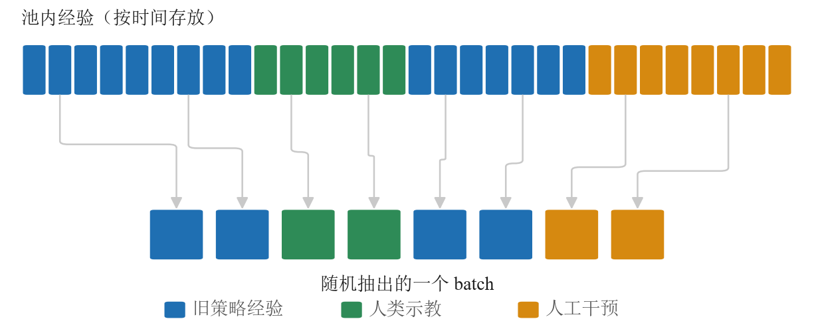{width=100%}

上图把"存"和"取"画在了一起。上排是池子的真实存放顺序：按时间一条条排过去，同一段颜色（同一来源、同一回合）连成片，相邻两条转移几乎长一样。下排是训练时真正喂给网络的一个 batch——从池子里随机翻牌抽出来，灰色的连线指出每一条原本躺在池子的哪个位置：八条在池子里彼此隔得老远，来源也混着，三种颜色都进了这一把。网络每一步看到的都是这样一把"混装"的经验，梯度自然稳。

对照第14讲的 PPO 就能看清差别：PPO 的"数据仓库"每轮清空重建，本质是**缓冲区**；replay buffer 只进不清（满了才挤掉最旧的），是真正的**资产**。HIL-SERL 还会维护两个池子——在线经验一个、人类示教一个——那是第 8 节的事，机制完全相同。

## 2.3 Q 函数：给「状态-动作」记账

off-policy 为什么能不挑数据来源？根子在它学的东西不一样。策略梯度直接学"该做什么"，而价值方法先学"**做了会怎样**"。

第14讲 2.4 节我们已经认识了价值函数 $V(s)$——"从状态 $s$ 出发平均还能拿多少回报"。但 $V$ 有个先天短板：它把"之后会怎么做"整个托付给了某个策略，所以它天生绑定那个策略——换个策略，同一个状态的 $V$ 就变了，旧策略采的数据也就没法直接给新策略估 $V$。off-policy 需要一个更"钉得死"的对象：把**第一步的动作也固定下来**——

$$Q(s, a) = \text{从状态 } s \text{ 做动作 } a \text{ 出发，之后平均还能拿多少回报}$$

$Q$ 比 $V$ 多钉住一个动作，好处立竿见影：一条数据 $(s, a, \ldots)$ 里的 $s$ 和 $a$ 都是**既成事实**，不管这个 $a$ 是谁选的——旧策略、人手、随机探索——"在 $s$ 做了 $a$"这件事对任何人都是同一件事。评价既成事实，不需要征得当事策略的同意。

写成式子就是：

$$
Q^\pi(s,a)=\mathbb{E}_{\pi}\big[\,r_{t+1}+\gamma r_{t+2}+\gamma^2 r_{t+3}+\cdots \,\mid\, s_t=s,\ a_t=a\,\big]
$$

逐段读一遍：等号左边是"这个状态-动作对值多少"；右边的期望是"未来能拿到的折扣回报"；竖线后面挂着两个条件——**从状态 $s$ 出发**，**并且第一步做动作 $a$**；而期望下标的 $\pi$ 在提醒我们，第一步之后的每一步仍然按策略 $\pi$ 走。和第14讲 5.2 节的 $V^\pi(s)$ 相比，唯一多出来的就是"第一步做了 $a$"这个条件。

这个 $Q$ 函数不是靠完整轨迹的总回报学的，而是靠**自举（bootstrap）**——用下一步的估值来更新这一步（第14讲 5.3 节我们用它区分过 REINFORCE 和 Actor-Critic）。对每一条转移记录 $(s, a, r, s')$，$Q$ 应该满足：

$$y = r + \gamma \,(1 - d)\, Q(s', a'), \qquad a' \sim \pi(\cdot \mid s')$$

| 符号 | 含义 | 典型取值 |
|------|------|----------|
| $(s, a, r, s')$ | 一条转移：状态、动作、即时奖励、下一状态 | 来自 replay buffer |
| $y$ | $Q(s,a)$ 的更新目标 | — |
| $\gamma$ | 折扣因子 | 0.99 |
| $d$ | 回合是否在 $s'$ 终止（终止则不再有后续回报） | 0 或 1 |
| $a'$ | 由**当前**策略在 $s'$ 处选出的下一动作 | — |

注意这个等式的一个关键性质：它对**任何来源**的转移 $(s, a, r, s')$ 都成立。这条转移是三天前的旧策略采的、是人示教的、还是干预时人打的方向，都不影响"$s$ 做 $a$ 得了 $r$ 到了 $s'$"这个事实——下一步的动作 $a'$ 用**当前策略**重新选就行。**这就是 off-policy 能吃百家饭的数学根源**：贝尔曼等式描述的是环境的因果，而不是某个策略的偏好。

价值方法还有一个对真机特别重要的本事：**把稀疏的成功传播开**。真机任务的奖励往往只有"最后成没成功"一个 0/1 信号（第 8 节会看到它甚至是学出来的）。策略梯度面对这种奖励几乎摸不到方向；而 $Q$ 函数靠自举，能像多米诺骨牌一样把终点的信号一格一格传回起点。

用一个迷你例子把"传播"演出来。假设推方块任务的一个成功回合只有三步，产生三条转移进池子（$\gamma = 0.9$，$Q$ 初始全为 0）：

| 转移 | 内容 | 奖励 |
|---|---|---|
| 甲 | $(s_0, a_0, 0, s_1)$：伸向方块 | 0 |
| 乙 | $(s_1, a_1, 0, s_2)$：抵住方块推 | 0 |
| 丙 | $(s_2, a_2, 1, \text{终止})$：方块进目标区 | 1 |

训练时反复从池子里随机抽转移，看 $Q$ 值怎么演化：

- 第一次抽到**丙**：终止转移，目标 $y = 1$，于是 $Q(s_2, a_2)$ 朝 1 更新——成功本身先被记住。
- 之后抽到**乙**：目标 $y = 0 + 0.9 \times Q(s_2, a_2) \approx 0.9$——虽然乙自己的奖励是 0，但"它通向一个值 1 的地方"这件事通过自举传了过来，$Q(s_1, a_1)$ 朝 0.9 涨。
- 再抽到**甲**：同理 $Q(s_0, a_0)$ 朝 $0.9 \times 0.9 \approx 0.81$ 涨。

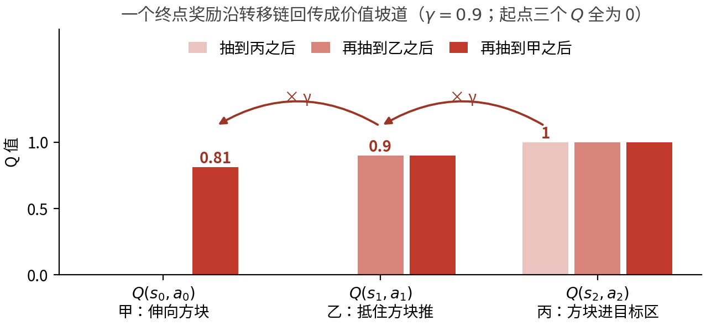{width=100%}

上图把这三轮抽样画成了柱状图：横轴三组分别是 $Q(s_0,a_0)$、$Q(s_1,a_1)$、$Q(s_2,a_2)$，同一组里从浅到深是抽样进行到第几轮（起点三个 $Q$ 全是 0，那一档没有柱子可画，写在标题里）——抽到丙之后只有最右边那组立了起来（值 1），再抽到乙时中间那组跟着涨到 0.9，最后抽到甲，最左边那组涨到 0.81。柱子上方那两道带 $\times\,\gamma$ 的箭头，画的就是**每往左传一格要乘一次折扣**；右侧已经学到的高度则一直保持不变。几轮下来，一个孤零零的终点奖励就被摊开成了一条**从起点到终点逐渐升高的价值坡道**，后面的 actor 只要顺着坡爬就行。注意整个过程对抽样顺序、对这三条转移是谁采的都没有要求——早抽到乙也没关系（那时目标还是 0，等丙学进去后乙迟早会被再次抽到）；池子里随机翻牌，信号自然回流。

> 备注：目标 $y$ 里还有一个不起眼但关键的工程件——**目标网络**。如果 $y$ 里的 $Q(s', a')$ 用的是正在被训练的同一个网络，那么每次参数更新，所有目标值都跟着晃，网络等于在追自己的尾巴。实践中会维护一份**延迟拷贝** $\bar{Q}$ 专门算目标：每步只让它朝主网络挪一小步（软更新，比例 $\tau \approx 0.005$）。目标稳住了，回归才收敛。上面公式里的 $Q(s', a')$，实现中都读作 $\bar{Q}(s', a')$。

## 2.4 动手：CartPole 上从查表到用网络

前面 Q 函数、经验池、目标网络都还是纸面概念。在上真机、上机械臂之前，先用一个最小的任务把它们**跑成代码**——经典的 CartPole：一根杆立在小车上，左右推车让杆不倒，动作只有"左推 / 右推"两个离散选项。它简单到能在几分钟内训完，却正好能把"从查表到用网络"这一步演清楚。

### 任务

先把这个场景在脑子里立起来：一辆小车卡在一条水平轨道上，只能左右滑；车顶有一个**不受驱动的转轴**，一根杆子铰在上面。没有任何电机去扶那根杆——它只受重力和小车加速度的摆布。策略唯一能做的事就是**把车往左推或往右推**，靠车身的移动把杆一次次"接"回竖直附近。这也是它反直觉的地方：想让杆往右倒回来，你得先把车往右推。

- **观测**：四个连续量——小车位置、小车速度、杆的角度、杆的角速度。
- **动作**：两个离散选项——左推、右推。**没有"不动"这一档**，每一拍都必须选一边。
- **奖励与终止**：每活一步得 1 分。杆偏离竖直超过约 12°（弧度约 0.21）、或小车滑出轨道 ±2.4，回合立即结束；撑满 500 步则回合正常结束，拿满分 500。所以"回合回报"和"杆立住了几步"是同一个数。
- **什么算成功**：单回合 500 分叫**满分**，但真正的门槛是**稳定拿满分**——后面会看到，"偶尔打出一次 500"和"最后 50 个回合大多是 500"是两回事。

{width=100%}

选它当入门例子有三个具体理由：状态只有四维，**表格法勉强还做得动**，这才谈得上和 DQN 同台对照（换成机械臂，表格法连起跑线都站不上）；纯 CPU 几分钟就能训完一轮，不需要仿真器也不需要机器人；而它的观测是连续量、动作是离散档，恰好卡在"必须分桶"和"可以用网络"的分界线上——这一节要讲的就是这条线。

两个版本用同一个任务、同一套统计口径（回合回报），**版本之间的差异就是这一节的知识点**。

### 第一版：表格 Q-learning

最朴素的做法是给每个"状态-动作"配一格账，存成一张表。可连续值没法当表格的下标——于是第一步永远是**分桶**：每一维切成 8 段，四维组合起来就是表的"状态"维度（$8^4 \times 2$ 格）。然后就是上一节那套 Q 更新，逐格填表，$\varepsilon$-greedy 采样（大概率按当前最优、小概率随机试）：

```python
        # 四维桶索引接上动作号，拼成五元组——它就是这张表里唯一一格的下标
        cell = tuple(state.tolist()) + (int(action),)
        # 只用 next_state 的四维索引取出"下一状态那一行"，再取 max：
        # Q-learning 学的是"下一步按最优走"，与这一步实际怎么采样无关，off-policy 由此而来
        best_next = self.model.table[tuple(next_state.tolist())].max()
        # (1.0 - done)：回合终止时后面没有"下一步"了，把 bootstrap 项整个乘没
        target = reward + self.gamma * best_next * (1.0 - done)
        td_error = target - self.model.table[cell]     # 目标与现值之差，就是这一格错了多少

        # 这一行就是表格 Q-learning 的全部：把这一格往目标挪 ALPHA 那么多。
        self.model.table[cell] += self.alpha * td_error
```

这一版**没有神经网络**——"没有网络"本身就是要暴露的教学点。Q 表照样放进一个 `nn.Module`，只为了和下一版的 `QNetwork` 占同一个位置、能用同一套 `state_dict()` 存取；但里面一个可训练参数都没有，整张表只是个 buffer：

```python
    def __init__(self, n_actions):
        super().__init__()
        # register_buffer：随模型保存/加载，但不是可训练参数。
        self.register_buffer("table", torch.zeros((NUM_BINS,) * 4 + (n_actions,)))
        self.n_actions = n_actions
```

没有参数就没有梯度，也就没有优化器可配——`configure_optimizers` 直接返回空：

```python
    def configure_optimizers(self):
        # 查表更新不是梯度下降，这里确实没有优化器可配。
        return None
```

表格法的致命短板是：状态得手工分桶，而表的大小是**每维桶数的连乘**。四维还能勉强切，换成图像或机械臂几十维的状态，桶数直接组合爆炸、根本存不下——这就是"维度诅咒"。

### 第二版：DQN

解法是把那张表换成一个**神经网络**：输入原始连续状态，输出每个动作的 Q 值。这就是 DQN[1]——2015 年它靠这一招在 Atari 游戏上直接吃屏幕像素打到人类水平，把值学习从表格时代推进到了网络时代。网络能在相近状态之间**泛化**，不用穷举分桶，天然绕开维度爆炸——这种"用一个可学习的函数去近似整张 Q 表"的做法叫**函数近似**。

但网络不能像表格那样即采即改：训练样本前后高度相关、更新目标自己还在动，直接套表格那套会训崩。于是把上两节攒下的两件工程配件正式装上——**经验回放**（2.2 节，随机抽 batch 打断相关性）和**目标网络**（2.3 节备注，稳住回归目标）。三处改动一目了然：

```python
        # 网络一次吐出全部动作的 Q 值，gather 按实际执行的那个动作号把对应列挑出来
        # ——相当于表格版的 table[cell]，只是现在这一格是算出来的，不是查出来的
        q_values = self.online(states).gather(1, actions.unsqueeze(1)).squeeze(1)
        with torch.no_grad():        # 目标是常数，不能让梯度顺着它流回目标网络
            # 采集时 dones 写的是 terminated（不含 truncated），
            # 所以真正失败才不 bootstrap，这里直接乘 (1 - dones)。
            next_q = self.target(next_states).max(dim=1).values    # 用 target 网络，不是 online
            td_target = rewards + self.gamma * next_q * (1.0 - dones)
        # 表格版是"把这一格挪一点"，这里换成对整批做一次回归——梯度下降替代了直接赋值
        loss = nn.functional.mse_loss(q_values, td_target)
```

对着上一版读：Q 值的来源从 `table[s]` 变成了 `online(s)`，查表变成了前向计算；算目标用的是 `self.target` 而不是 `self.online`，一份延迟拷贝专门负责给出回归目标，网络不再追自己的尾巴；最后，更新不再是改表里的一格，而是对**一整个 minibatch** 做回归——而这个 batch 来自经验池的随机抽样，正好把同一条轨迹上前后相邻的样本打散。

（想把 DQN 这一档再练熟一点，Hugging Face 的深度强化学习课[2]有一整个单元配可跑的练习。）

**两版的四件套骨架是同一副**：一个边跑环境边吐样本的 `Dataset`、一个 `LightningDataModule` 持有环境、一个 `nn.Module` 装 Q（v1 是表、v2 是网络）、一个 `LightningModule` 写更新规则，入口都是 `trainer.fit(model, data)`。差别不在骨架，在骨架里换掉的那几个零件：Q 从表变成网络、多出一份目标网络、多出一个 `ReplayBuffer` 类（v1 的样本是采一条学一条，用不上池子），以及多出一个真正的优化器——v1 那个返回 `None` 的 `configure_optimizers` 到这一版才有东西可配，因为到这一版才有可训练参数。**换零件不换骨架，正是这条阶梯往后四级还能一直用同一副模板的原因。**

### 结果

两版各跑一次，横轴统一用环境步数（两级的回合长度差很多，按回合数对齐会误导）：

{width=96%}

| 版本 | 方法 | 环境步数 | 末 50 回合平均回报 | 其中满分回合 |
|------|------|----------|--------------------|--------------|
| v1 | 表格 Q-learning（手工分桶） | 20.1 万 | 193 | 0 / 50 |
| **v2** | **DQN（网络吃原始状态）** | **5.0 万** | **396** | **31 / 50** |

差距很干脆：**DQN 只用了表格法四分之一的交互，成绩却是它的两倍**。末段的质量差得更远——DQN 最后 50 个回合里有 31 个直接打满 500 分，表格法这 50 个回合一个满分都没有，最好的一次只到 452。

图上那几根伸到 500 分那条虚线的浅蓝细线不是错觉：表格法整个 20 万步里也**打出过 6 次满分**（第一次在约 9.8 万步）。但它守不住——满分回合零星出现，下一个回合又掉回一两百分。**"偶尔做到"和"稳定做到"是两件事**，这条分界线在后面 SO-101 的实验里还会再出现一次。

原因就在分桶。每维只切 8 段，落进同一个桶的状态被当成同一个状态——杆子偏 3° 和偏 8° 共用一格 Q 值，策略再怎么训也精细不到哪去；而且相邻桶之间没有任何信息共享，每一格都得自己撞够次数才学得会。DQN 的网络恰恰相反：相近的状态天然给出相近的 Q 值，一次更新就能惠及一片邻域，所以又快又稳。

**这就是"函数近似"四个字的实际含义**：不是换了个更聪明的更新公式，而是换了一种"记住经验"的方式——记得越会举一反三，同样的交互量就换得回越高的回报。

不过省样本从来不是白省的。函数近似、自举、off-policy 这三样一旦凑齐，训练就失去了"只会越来越好"的保证——下一节就来算这笔账。

到这里，Q 函数、经验池、目标网络都从概念变成了能跑的代码。但 DQN 还卡着一道坎：它靠"对每个动作的 Q 取 **argmax**"来选动作，这只在动作是**有限几个离散选项**时才做得到。机械臂的动作是六个关节各自转多少的连续量——argmax 无从枚举。要把 off-policy 带上机械臂，就得换一类"不靠 argmax、直接吐连续动作"的算法。而在动手爬这条连续控制的阶梯之前，还得先认清 off-policy 省下样本要付的那份代价。

## 2.5 天下没有免费的午餐：off-policy 的稳定性代价

既然 off-policy 这么省样本，第14讲为什么不直接教它？因为它天生更难训稳。强化学习里有个著名的"**死亡三角**"（deadly triad，这个名字出自 Sutton 与 Barto 的教材[3]）：**自举**、**函数近似**（神经网络）、**离策略数据**——三者单独都没事，凑齐了就容易让训练发散：

| 组合 | 熟悉的例子 | 稳吗 |
|---|---|---|
| 只有函数近似 | 监督学习 | 稳：标签固定，回归目标不动 |
| 自举 + 离策略，无函数近似 | 表格型 Q-learning（每个状态一格） | 稳：有收敛保证 |
| 函数近似 + 自举，on-policy | 第14讲 A2C/PPO 的 critic | 基本稳：数据新鲜，错账很快被重访修正 |
| 三者齐 | 深度 off-policy（本讲） | 要靠工程兜底 |

三者凑齐为什么危险？直觉是：$Q$ 用自己的估值更新自己（自举），估值本身有误差（网络近似），而离策略数据又让"账本出错的地方"和"账本被查账的地方"错开——网络在池子里那批旧数据上改账本，改动却会牵连到当前策略常去的状态（函数近似让相邻状态的估值联动），那些地方的错误迟迟等不到新数据来纠正，误差就可能越滚越大。

on-policy 方法（PPO）用"只吃新鲜数据"砍掉了第三条边，所以稳，代价是费样本；off-policy 方法三条边全占，所以省样本，代价是要靠一堆工程手段兜底。这些兜底手段——双 Q 取小（治高估）、目标网络软更新（治追尾巴）、随机抽样（治样本相关）、合适的更新采样比（UTD，update-to-data ratio，即每采一步数据做几次梯度更新，治更新过猛）——下面几节会在 SO-101 阶梯上逐级登场：哪一级栽了跟头、要补哪一件配件，都对着死亡三角的某一条边。它们不是装饰，本讲后面的方法（DDPG、TD3、SAC、HIL-SERL）都带着这样一串"稳定性配件"。

## 2.6 与上一讲的分水岭：critic 请走了，又请回来

第15讲我们刚把 critic 请走（GRPO 用组内平均分当基线），这一讲怎么又请回来了？对照一下两边的处境就清楚了：

| | 第15讲（GRPO 后训练） | 第16讲（真机 RL） |
|---|---|---|
| 动作 | 离散 token，一次生成一段 | 连续控制量，10 Hz 逐步闭环 |
| 奖励 | 可验证：规则一判就有 | 稀疏 0/1，还得靠视觉判 |
| 一组采样的成本 | 便宜（GPU 上采一组回答） | 昂贵（真机跑一组 rollout） |
| 数据能否复用 | 不复用也无妨 | 必须复用 |
| 基线/信号 | 组内比较就够 | 要靠 $Q$ 自举把稀疏信号传开 |

GRPO 免 critic 的前提是"同题采一组很便宜"；真机上一组 rollout 本身就是最贵的东西，而且连续动作加稀疏奖励，光靠组内比较传播不了信号。所以 critic 回来了，而且这次它是主角：**off-policy 的一切复用能力，都建立在 $Q$ 函数这本"不挑数据来源的账"上**。

## 2.7 本节小结

本节建立了这一讲的方法底座。off-policy 的定义是行为策略与目标策略解耦，由此旧数据、人类示教、人工干预都成为合法训练数据，统一存进 replay buffer 这座"资产仓库"随机取用；数学根源是 $Q$ 函数评价的是"在 $s$ 做了 $a$"这个既成事实，贝尔曼等式对任何来源的转移都成立。$Q$ 靠自举把稀疏的成功信号沿价值坡道一格格传回起点，目标网络稳住回归目标。我们在 CartPole 上把这套概念跑成了代码——从手工分桶的表格 Q，到用神经网络吃原始状态的 DQN，"函数近似 + 经验回放 + 目标网络"就此凑齐。但 DQN 靠 argmax 选动作，迈不进连续控制；而三者一凑齐，死亡三角带来的稳定性风险也一并到场。接下来我们就在 SO-101 上从零爬一条 off-policy 阶梯，一级一级把连续动作和稳定性这两道坎补上——这也是为什么入门先学 on-policy，上真机才换 off-policy。

# 3 DDPG：把确定性策略带进连续动作

前面 CartPole 上的 DQN 有一个天花板：它靠"对每个动作的 Q 值取 argmax"来选动作，这只在动作是**有限几个离散选项**时才做得到。可 SO-101 机械臂的动作是六个关节的连续转动量（每一步给每个关节一个目标角度增量），把连续区间切成格子再 argmax，格子数随维度指数爆炸——和上一节表格 Q 撞的是同一堵墙。要在连续动作空间里做 off-policy，得换一个思路：不再"评分选最高"，而是**直接让一个网络吐出动作**。这就是 DDPG。

从这一节起，我们把战场搬到 SO-101 的仿真环境，用同一个任务、同一套训练预算，只换算法，一级级往上爬——就像第14讲在 G1 行走上从 REINFORCE 爬到 PPO 一样，**每一级和上一级的差异，就是这一节的知识点**。

## 3.1 任务与环境：一个"够到方块"的最小操作

四级算法都在同一个任务上比：**ReachCube**——机械臂把末端够到桌上的方块。这是操作任务里最简单的一档（纯靠近，不用抓取），却已经足够暴露每个算法的脾气。

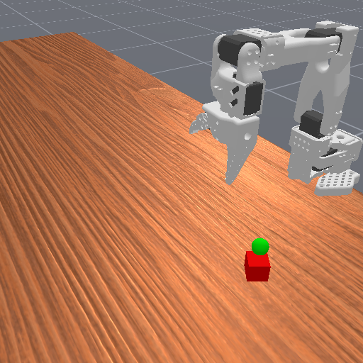{width=60%}

环境复用的正是 VLA 课用过的那套 SO-101 仿真（`so101_sim` 包）。这里先记住一个贯穿全讲的事实：**强化学习训练用的环境，和 VLA 课评测、复现数据用的，是同一个环境**——只是这里开一千个并行实例快速采样，VLA 那边开一个实例做评测。等爬到第 6 级 squint，我们会看到这条线怎么闭合成一整个数据闭环。

策略看到的观测是拼成一条向量的关节状态（位置、速度、物体位姿等，几十维），动作是六维连续量。奖励是**稠密**的：末端离方块越近，每一步给的奖励越高。稠密奖励很重要——它给了算法一个连续的"往哪走更好"的信号，不像"够到才 +1"那样一片荒漠。

> 关于复现，有三件事要先说清楚，否则你照着跑一遍会以为是自己配错了：
>
> 1. **数值复现不了。** 下面四级的曲线与成功率，都是在**单相机版的 ReachCube 场景**上跑出来的，那个场景后来随 `so101_sim` 重构下线了。四个训练脚本（`code/rl/3_offpolicy/3_2_so101_offpolicy/train_v3_ddpg.py`、`code/rl/3_offpolicy/3_2_so101_offpolicy/train_v4_td3.py`、`code/rl/3_offpolicy/3_2_so101_offpolicy/train_v5_sac.py`、`code/rl/3_offpolicy/3_2_so101_offpolicy/train_v6_squint.py`）里的任务名现在指向仓库里还在的**双相机抓放场景**——任务换了，奖励尺度和难度都不一样，跑出来的数不会是下面这组。要对着看的是"每一级改了什么、曲线形状怎么变"，不是这几个具体数字。
> 2. **能跑通的只有 v3/v4/v5。** 这三级吃关节状态、不过渲染管线，在新场景上照着跑没有问题。**第 6 级 squint 现在直接跑会报错**，原因和修法见 6.2 节的注意框。
> 3. **原始训练记录没有随仓库分发。** `code/rl/3_offpolicy/result/` 下只留了 CartPole 那两级的 `*.json`；下面几张 SO-101 曲线图是当时那次实验的截图，图里的数在仓库里找不到对应的原始记录，也就无法逐点核对。模块 README 里也记着这条，本模块的算法阶梯待重新整训。

## 3.2 DDPG 的两个网络：Actor 出动作，Critic 打分

DDPG（Deep Deterministic Policy Gradient，深度确定性策略梯度）[4]的骨架是两个网络：

- **Actor**（确定性策略）：输入状态，直接输出一个确定的动作（六个关节这一步各转多少），末端用 `tanh` 把动作压进合法区间。它不像上一讲 PPO 那样输出一个概率分布再采样，而是"看到这个状态，我就做这个动作"。
- **Critic**（Q 网络）：输入"状态 + 动作"，输出一个标量 Q 值，即"在这个状态做这个动作，预计能拿多少回报"。这就是上一节 Q 函数的连续版——DQN 的 Q 网络对每个离散动作出一个分，DDPG 的 Critic 直接把动作当输入吃进去出一个分。

两者怎么配合训练？

- **Critic 学法**和 DQN 一脉相承：用贝尔曼目标 $r + \gamma\, Q_{\text{target}}(s', \pi(s'))$ 做回归，只是下一动作由 Actor（而非 argmax）给出，同样配一套缓慢跟随的目标网络。
- **Actor 学法**是 DDPG 的点睛之笔，叫**确定性策略梯度**：Actor 要让 Critic 给自己打的分越高越好，于是损失就是 $-Q(s, \pi(s))$。梯度顺着 Critic 一路回传到 Actor——**Critic 告诉 Actor"往动作空间的哪个方向挪，我给的分会更高"，Actor 就照着挪**。

探索呢？确定性策略自己不带随机性，DDPG 靠在输出动作上**外加一点高斯噪声**来试探周围。记住这个"外加噪声"——它后面会成为整条阶梯的命门。

代码上这就是标准的四件套：`DeterministicActor` 和 `QCritic` 两个 `nn.Module`，`DDPG` 这个 `LightningModule` 在一个 minibatch 里先更新 Critic、再更新 Actor、最后软更新目标网络（`code/rl/3_offpolicy/3_2_so101_offpolicy/train_v3_ddpg.py`）。

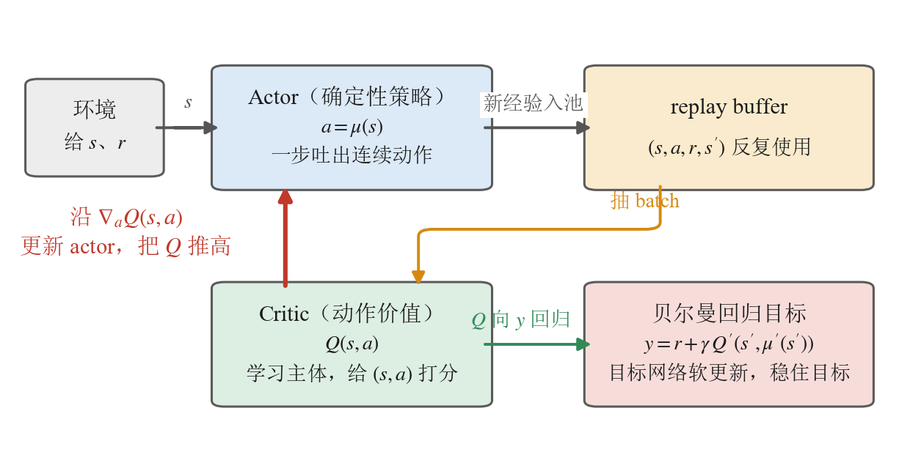{width=100%}

这张图把 DDPG 一轮更新的角色摆在了一起，顺着箭头走一遍就是一轮训练：环境给出状态 $s$，Actor 据此吐出动作，交互产生的新经验进 replay buffer（灰箭头）；训练时从池子里抽一个 batch 交给 Critic（橙箭头）；Critic 把自己的 $Q(s,a)$ 往右下那个贝尔曼目标 $y$ 上回归（绿箭头）；最后那条从 Critic 直接指回 Actor 的红箭头——**这就是确定性策略梯度**，Critic 打的分反过来告诉 Actor 该往动作空间的哪个方向挪。

图上有一件公式看不出来的事：**这几个角色围成的是一个闭环，而不是一条流水线**。Actor 的更新方向取决于 Critic 此刻的打分，Critic 的回归目标又取决于 Actor 此刻给出的下一动作 $\mu'(s')$——两个网络互为对方的老师。下一小节那个"学不动"的坑，和 3.4 节那个"反复横跳"的毛病，根子都在这个闭环上。

## 3.3 一个真实的坑：不归一化，网络直接学不动

第一次把 DDPG 跑起来，结果是**成功率全程 0，而且平均奖励一动不动**——不是上下乱跳，是从头到尾一条死平线。

按常理，DDPG 是成熟算法、奖励又是稠密的，不该毫无起色。我们顺着查下去，查出一个非常具体、也非常典型的病根，值得当作一个案例讲透。

第一步先排除"是不是训练不够"：把并行环境加到一千、每步更新加到 256 次、探索噪声调大，甚至照 DDPG 原论文[4]给末层用小初始化——**统统还是 0**。这说明不是预算问题。

第二步盯住 Actor 的**权重范数**看：它 600 次迭代下来，数值一位小数都不变。这是一个强信号——**Actor 根本没在更新**，梯度约等于零。

第三步找零梯度的来源。回头看观测：SO-101 的状态里有的分量数值到了 **200** 这个量级（比如某些位姿读数），而且没有做任何归一化。这么大的数直接喂进 Actor 的 MLP，逐层放大，到末端 `tanh` 时早已**深度饱和**——而 `tanh` 在饱和区的梯度几乎为零。梯度在这里被掐断，Actor 于是冻在初始值上，成功率自然永远是 0。

修法是强化学习里的标准动作，你在第14讲 4.5 节的 G1 代码里其实已经见过：**观测归一化**。在线统计每一维观测的均值和方差，把状态归一化到零均值、单位方差再喂网络，大数值就不会把 `tanh` 顶进饱和区。加上这一步，Actor 的权重立刻开始更新：

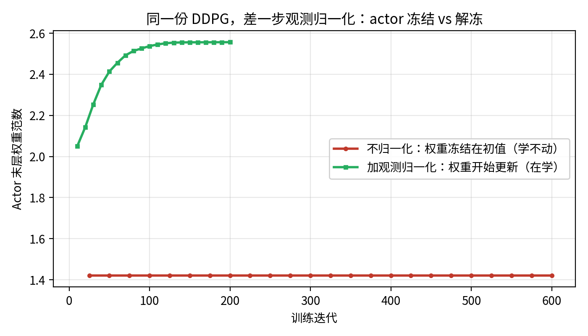{width=85%}

这张图只证明"梯度通了"，不证明"学会了"。**参数在动**和**任务在解**是两件事——归一化之后奖励涨没涨、成功率有没有起色，要看 4.2 节那张三算法对照的奖励曲线，下一小节先说 DDPG 那条读出来是什么样。

> 备注：为什么第 6 级 squint（下文）不需要单独加这一步？因为它的网络里用了 LayerNorm，等于把归一化揉进了结构里。归一化不是可有可无的调参，是让梯度能正常流动的前提——这一点对**任何**拿原始观测喂 MLP 的连续控制都成立，回到第8讲 3.4 节讲部署时反复强调的"数值口径要对齐"是同一个道理。

这个插曲的价值不在 bug 本身，而在它演示了**怎么诊断一个"学不动"的强化学习**：先排除预算、再定位是哪个网络没动、再顺着零梯度找到数值根因。真机上遇到"怎么训都不涨"，走的就是这条路。

## 3.4 DDPG 的成绩与毛病

归一化修好后，DDPG 终于开始学——但学得**很不稳**。它的奖励曲线是 4.2 节那张三线对照图里的红线，等下和 TD3、SAC 摆在一起看最清楚，这里先说形状：前两百次迭代平均奖励在 −0.56 到 +0.32 之间大起大落，一会儿爬上去、一会儿又栽下来；两百五十次前后还栽进负数最后一次（探到 −0.29），此后才算站住，却也只在 0.3 上下小幅晃着走完全程。而**成功率从头到尾是 0**——够得更近了一点，一次也没真够到。

病根是 DDPG 只有**一个** Critic。确定性策略梯度让 Actor 死命往"Critic 打分最高"的方向挪，可单个 Critic 会**系统性地高估** Q 值——它对某些动作给出虚高的分，Actor 就一头扎过去，扎过去才发现回报没那么高，于是又调头。高估→追高→修正→再高估，训练就在这种自我欺骗里反复横跳。

这就是下一级 TD3 要治的病。

## 3.5 本节小结

DDPG 用一个确定性 Actor 直接吐连续动作、一个 Critic 打分，靠确定性策略梯度让 Actor 沿 Critic 的梯度往上爬，把 off-policy 从离散动作推进到了连续控制。过程中我们撞上并诊断了一个典型的"学不动"——原始观测数值过大把 `tanh` 顶进饱和、Actor 梯度冻结，用观测归一化解决。但 DDPG 单个 Critic 会高估 Q 值：前两百多次迭代奖励在正负之间大起大落（最后一次栽进负数在两百五十次前后），之后虽然不再翻车，也只停在 0.3 上下的低位，成功率全程 0、一次没够到方块——这把接力棒交给 TD3。

# 4 TD3：用两个 Critic 治高估

TD3（Twin Delayed DDPG，双 Q 延迟更新版 DDPG）[5]不是另起炉灶，而是在 DDPG 上**打三个补丁**，专治上一节那个"单 Critic 高估导致震荡"的毛病。三个补丁里最核心的一个，名字就写在算法里——Twin，双 Critic。

## 4.1 三个补丁

对照 DDPG，TD3 只改了三处，其余骨架（确定性 Actor、确定性策略梯度、目标网络、外加探索噪声）原封不动：

1. **双 Critic 取小（Clipped Double Q）**：训**两个**独立的 Critic $Q_1, Q_2$，算贝尔曼目标时取两者中**较小**的那个：$r + \gamma \min(Q_1', Q_2')$。道理很直白——一个 Critic 可能虚高，但两个独立网络在同一个动作上**同时**虚高的概率低得多，取 min 就把高估的那部分系统性地压下去。这是三补丁里最管用的一条。
2. **延迟策略更新**：Critic 每更新若干步，Actor 才更新一次。让 Critic 先把 Q 估得准一点，再拿它去指导 Actor，避免 Actor 追着一个还没学好、乱跳的 Critic 跑。
3. **目标策略平滑**：给目标动作加一点截断的小噪声，避免 Critic 在某个动作上出现尖锐的虚高峰值被 Actor 钻空子。

代码上，`code/rl/3_offpolicy/3_2_so101_offpolicy/train_v4_td3.py` 和 3.2 节那份同目录的 `code/rl/3_offpolicy/3_2_so101_offpolicy/train_v3_ddpg.py` 结构**刻意保持一致**，diff 就集中在这三处——把两个文件放一起对比，看到的差异就是这一节的全部知识点。

## 4.2 TD3 的成绩：更稳、更近，但还是够不到

三级算法的奖励曲线现在可以摆在一起看了：

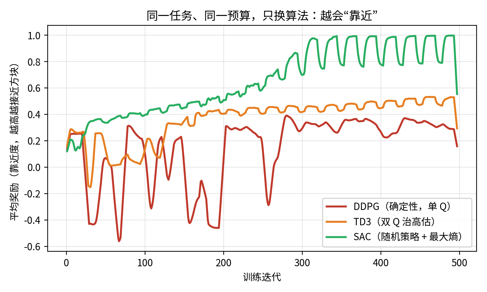{width=95%}

看橙线：TD3 的前一百三十次迭代其实和 DDPG 一样在晃，**双 Critic 并没有让它一上来就稳**；但从那以后它再没掉下去过，平滑地爬到比 DDPG 高一档的水平停住——靠得离方块更近了。治高估确实有效，只是效果是"后半程不再翻车"，不是"全程平滑"。

但橙线爬到中途就**平了**，而且成功率**仍然是 0**——TD3 靠得更近，却始终没能真正够到方块。为什么治好了高估还是解不出？

因为 TD3 治的是 **Q 高估**，动的全是 Critic 那一侧；它的 Actor 依然是**确定性**的，探索依然靠**外加的那点高斯噪声**。而 ReachCube 真正卡住确定性策略的，不是高估，是**探索**——确定性策略加一点小噪声，在六维动作空间里翻来覆去就那么大范围，试探不到"精准够到方块"所需的那套动作。高估修好了，探索的天花板还在。

这恰恰说明：**双 Critic 不是万能药，它只解决它那一类问题。** 要跨过"够到"这道坎，得从探索本身下手——这是 SAC 的地盘。

## 4.3 本节小结

TD3 在 DDPG 上打三个补丁——双 Critic 取 min 治高估、延迟策略更新、目标策略平滑。效果不是"一上来就稳"（前一百三十次迭代它和 DDPG 一样在晃），而是"过了那一段就再没翻过车"：此后平滑爬到比 DDPG 高一档的平台，离方块更近。但它的探索仍靠确定性策略外加噪声，成功率依旧是 0：治好了高估，治不了探索。跨过"够到"这道坎要换探索机制，交给 SAC。

# 5 SAC：把探索变成一条原则

DDPG 和 TD3 都卡在同一个地方——确定性策略 + 外加噪声的探索太弱。SAC（Soft Actor-Critic，柔性演员-评论员）[6]从根上换掉这套探索：它让策略重新变成**随机**的，并且把"保持随机、多探索"写成训练目标的一部分。这一换，成功率从 0 做到了 0.99。

## 5.1 最大熵：把"多探索"写进目标

普通强化学习的目标只有一条：回报最大化。SAC 在它上面加了一项——**策略熵**最大化。熵衡量策略的随机程度：熵高，策略在多个动作间保持犹豫、乐于尝试；熵低，策略趋于孤注一掷。SAC 的目标变成"**在拿高回报的同时，尽量保持随机**"。

这一项的作用正是治探索：它不让策略过早地锁死到某一套确定动作上，而是逼着它持续在动作空间里铺开试探，直到真的找到"够到方块"的那条路。DDPG/TD3 是"选定一个动作 + 抖一抖"，SAC 是"维持一整个动作分布，且刻意不让它塌缩"——后者的探索强度不是一个量级。

## 5.2 SAC 的四个零件

把 SAC 拆开，是四个零件（对照 DDPG/TD3 看差异）：

1. **随机策略（挤压高斯 Actor）**：Actor 不再输出一个确定动作，而是输出一个高斯分布的均值和标准差，动作从中采样、再用 `tanh` 压进合法区间。有了分布，才谈得上熵。
2. **最大熵目标**：回报项里减去一个"熵的代价"，等价于奖励策略保持随机（上一小节）。
3. **自动温度 $\alpha$**：熵这一项占多大权重，用一个可学习的温度系数 $\alpha$ 自动调——训练自己找"探索够用又不过头"的平衡，不用手调。
4. **双 Critic 取 min**：治高估这条从 TD3 继承下来，SAC 也用两个 Critic 取小。

| 零件 | DDPG | TD3 | SAC |
|---|---|---|---|
| 策略 | 确定性 | 确定性 | **随机（高斯采样）** |
| 探索 | 外加噪声 | 外加噪声 | **最大熵内生** |
| 温度 $\alpha$ | 无 | 无 | **自动调** |
| Critic | 单个 | 双 min | 双 min |

看这张表就清楚：SAC = TD3 的双 Critic + 一套全新的"随机策略 + 最大熵 + 自动温度"探索机制。前三级在 Critic 那侧修修补补，SAC 终于动了**策略**这一侧。

## 5.3 破局：成功率从 0 到 0.99

回到 4.2 节那张对照图的绿线：SAC 的平均奖励一路稳步登顶，远超 DDPG 和 TD3。更重要的是成功率——它是这条阶梯上**第一个真正把方块够到**的算法。

不过有个细节值得讲：SAC 需要**足够的训练时间**才破局。前一百六十次迭代成功率贴着 0 一动不动；到两百多次才开始零星冒头；直到经验攒够、策略在熵的驱动下把动作空间探得足够透，才在三百次迭代前后头一回摸到 0.99：

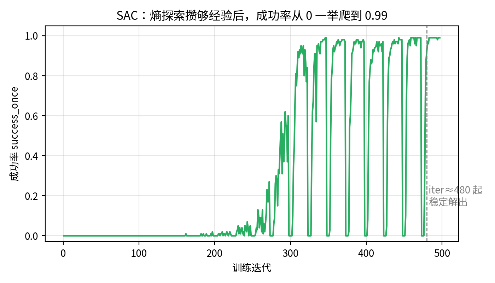{width=90%}

这条"憋很久再突然起飞"的曲线本身就是探索型学习的典型形态——不是线性进步，是量变到质变。但**真正要看清的是后半段**：第一次冲上 0.99 之后，成功率还会一次次成片掉回 0，来回拉锯了将近两百次迭代才站稳。上一次见到这个形状是在 2.4 节的 CartPole 上——表格法也打出过满分，只是守不住。**"第一次做成"和"稳定做成"之间隔着的这段，才是真机上最耗时间的部分。**

## 5.4 一张图看懂整条阶梯的两层道理

把四级放在一起，成功率是这样一个阶梯：

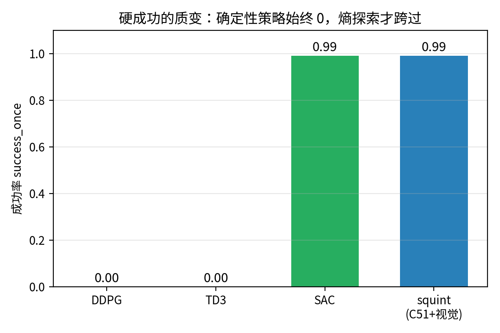{width=80%}

把这张成功率图和前面那张靠近度（奖励）图叠着看，能读出**两层不同的道理**，这也是这条阶梯最想让你记住的：

- **靠近度是逐级抬高的**：训练末段三条线各自停在 0.3、0.45、0.9 上下，DDPG < TD3 < SAC。（只有终点是这个次序——头一百多次迭代里 DDPG 和 TD3 互有高低，缠在一起。）从终点看，每一级的改进都实实在在有效：TD3 的双 Critic、SAC 的熵探索，都让策略离目标更近了。
- **硬成功是有质变的**：DDPG 和 TD3 无论靠得多近，成功率都死死是 0；只有 SAC 跨过了"够到"那道坎。这说明**"离得更近"和"真正解决"是两回事**——把方块从"差一点"推到"够到"，靠的不是把距离一点点磨小（那样 DDPG/TD3 迟早也能到），而是探索方式的**质变**：确定性策略的探索有天花板，最大熵才能顶破它。

一句话：**在这个任务上，探索——而不是高估、也不是网络容量——才是那把决定"解不解得出"的钥匙。**

## 5.5 本节小结

SAC 把探索从"外加噪声"换成"最大熵"这条原则：随机策略 + 熵最大化 + 自动温度，逼着策略持续铺开试探，直到真正找到够到方块的动作。它是这条阶梯上第一个把成功率做上去的算法（0→0.99，三百次迭代前后头一回够到，到 iter$\approx 480$ 之后才不再掉链子）。叠看靠近度与成功率两张图，读出两层道理：终点上靠近度逐级抬高、每级改进都有效，但硬成功有质变，探索才是解出任务的钥匙。SAC 用的还是标量 Critic + 均方误差，样本效率仍有提升空间——这是 squint 的切入点。

# 6 squint：从像素学会，顺手把数据也生成了

到 SAC 为止，机械臂已经能从**关节状态**够到方块了。但真机上部署 VLA 时，策略看到的是**相机图像**，不是上帝视角的关节读数。

第 6 级叫 **squint**[7]——加州大学圣迭戈分校做的一套视觉 SAC 配方，名字就是"眯着眼看"：它故意把相机画面压到极低的分辨率，像人眯眼一样只留下轮廓，反而训得又快又稳。我们这一讲从头到尾用的 SO-101 仿真场景，本身就是从它的开源任务集分叉来的（`so101_sim` 包里的 `tasks/UPSTREAM.md` 记着这条来路）。

它在 SAC 上叠了两件事：一是把输入从状态换成**像素**，二是把 Critic 从标量升级成**分布式**——顺带，它训好的策略还能直接拿去**生成 VLA 课要的仿真数据集**。

## 6.1 分布式 Critic（C51）：不估一个数，估一整条分布

前几级的 Critic 都是估**一个**标量 Q 值。squint 用的 C51 分布式 Critic[8] 换了个思路：不估"预期回报是多少"，而是估"回报**落在各个取值上的概率分布**长什么样"——把可能的回报切成一排固定的档位，网络输出的是"落在每一档的概率"，训练时用分类交叉熵去拟合，而不是对一个数做均方误差。（C51 这个名字来自原论文用的 51 个档位；本讲代码里把档位数开到了 101。）

直觉上，回报本身是有不确定性的——同一个状态动作，运气好回报高、运气差回报低。硬压成一个平均数会丢掉这层结构；让网络直接去学整条分布，每一步更新提供的训练信号更丰富。这就是为什么 squint 在更难的视觉输入上，反而能学得比标量 SAC 更快更稳；同一份配方里，分布式 Critic 也是 FastTD3[9] 列出的关键设计之一（7.1 节还会再见到它）。

## 6.2 从 16 像素学会操作

squint 的另一半就是"眯眼"本身：把相机图像降到 16×16 像素，过一个小 CNN 编码，再接上和 SAC 同款的随机策略。分辨率压这么低不是将就——高分辨率图像既占满回放池的显存，又让编码器每一步都算得很慢，而"够到方块"这件事根本不需要看清纹理，看得见轮廓和相对位置就够了。配上分布式 Critic 和大规模并行采样，它照样能从零学会 ReachCube，成功率 0.99——而且这次策略看的是**像素**，离真机部署的输入形态更近了一步。

代码上 squint 就是把 SAC 的标量双 Critic 换成 `C51TwinQ`、前面接一个 CNN 编码器，其余训练骨架不变（`code/rl/3_offpolicy/3_2_so101_offpolicy/train_v6_squint.py`，同样自包含一个文件）。这一级也不必再外挂 3.3 节那个观测归一化——它的特征投影里带了 `LayerNorm`，归一化已经长在网络结构里。

> 注意：**这一级现在还跑不起来。** 文件里的 `CNNEncoder`（第一层 `nn.Conv2d(3, 32, ...)`）和 `ReplayBuffer`（`rgb` 缓冲按 `(容量, H, W, 3)` 开）都是按单相机 3 通道图像写死的，而仓库里现存的三个场景都出双相机（顶视 + 腕视），经 `FlattenRGBDObservationWrapper` 沿通道轴拼成 6 通道。所以报错来得比想象中早：**策略还没开始跑，热身阶段用随机动作采的第一批帧往回放池里写的时候就对不上了**——池子按 3 通道开，帧是 6 通道的。要跑通得把这两处都改成按环境实际通道数构造（`run_training` 已经用 `observation_space["state"].shape[-1]` 推状态维，图像通道数同法可得）；`code/rl/3_offpolicy/3_2_so101_offpolicy/datagen/rollout.py` 直接复用同一个编码器，要一起改。这本身是一道不错的练手题，前五级都是可以直接跑的。

## 6.3 顺手生成数据：闭合整条数据链

squint 训好的策略不只是这条教学阶梯的终点，它还有一个下游用途，把这一讲和 VLA 课接成一个闭环。

回到 3.1 节那句话：**RL 训练用的环境，和 VLA 课评测、复现数据用的是同一个环境**。既然 squint 已经能在这个环境里稳定够到方块，那就让它多跑几百条成功轨迹、把每条轨迹换个贴近真机的外观（黑臂、白底）重渲一遍，转成 VLA 课要的标准数据集格式——一套 VLA 微调数据就这么"顺手"生成出来了。这条流水线独立收在 `code/rl/3_offpolicy/3_2_so101_offpolicy/datagen/` 里，下表只写这个目录内的文件名。前三个文件各管一步，第四个把三步串起来：

| 文件 | 这一步干什么 |
|------|------|
| `rollout.py` | 加载训好的策略，跑出成功轨迹 |
| `replay.py` | 把每条轨迹换个外观（黑臂、白底）重渲一遍 |
| `to_lerobot.py` | 转成 LeRobot 数据集格式 |
| `gen_dataset.py` | 一条命令把上面三步串起来 |

这里正好回收 VLA 课埋下的那个伏笔：**第9讲 2.6 节、第12讲 3.2 节里，你们用来微调 VLA 的那批仿真数据，当时只说"是用视觉强化学习从零生成的"、没有展开。现在你自己走到了这一步——从零训一个视觉 RL 策略、让它生成数据——也就真正理解了那批数据是怎么来的。** 一门课里"先给你用、最后教你造"的完整闭环，到这里合上了。

> 注意：这条流水线**现在整条跑不通**，卡在上一小节那个 3/6 通道问题上——第一步要 `code/rl/3_offpolicy/3_2_so101_offpolicy/train_v6_squint.py` 训出 `sac_ckpt.pt`，而 v6 现在起不来；第二步 `code/rl/3_offpolicy/3_2_so101_offpolicy/datagen/rollout.py` 直接 `from train_v6_squint import CNNEncoder`，就算有现成 ckpt 也会在同一处挂。两处按上一小节说的一起改成按环境实际通道数构造，链子才通。所以这四个文件现在的读法是"看清数据是怎么造出来的"，还不是"照着跑一遍"。

## 6.4 本节小结

squint 在 SAC 的随机策略基础上做两件事：把标量 Critic 换成 C51 分布式 Critic（估回报的整条分布而非一个均值，每步更新的训练信号更丰富），把输入"眯"成 16×16 像素（贴近真机部署形态，又不让高分辨率拖垮回放池和编码器）。它在当初那个单相机 ReachCube 上从零学会、成功率 0.99，训好的策略再顺手 rollout + 换色生成 VLA 微调数据集，回收了第9讲 2.6 节、第12讲 3.2 节"数据是视觉 RL 生成"的伏笔，把这一讲和 VLA 课闭成一个"先用后造"的完整数据闭环。要动手跑这一级和它的数据链，得先补上 6.2 节说的那个通道数改造。

# 7 同一个 G1，换 off-policy 再走一遍：15 分钟学会走路

我们在 SO-101 上从零爬完了 off-policy 阶梯——从表格 Q 一路到能从像素学会的 squint。最后把镜头拉回第14讲的老地方 G1 行走，看看业界怎么把同一套 off-policy 规模化：它真能在大规模并行仿真里顶替 on-policy 吗？2025 年恰好有一对工作把这件事做成了标杆。

## 7.1 FastTD3 与 FastSAC：把 off-policy 搬进大规模并行仿真

off-policy 算法（SAC、TD3）在机器人学界长期被认为"样本效率高但难伺候"，主流的大规模并行仿真训练（第14讲那套 4096 环境 + PPO）一直是 on-policy 的天下。**FastTD3**[9] 打破了这个格局：他们发现只要几处关键设计调对，off-policy 完全能在数千个并行环境的规模下稳定训练，而且**更快**。配方简单得出奇：

- **并行采样进同一个 replay buffer**：几千个环境同时交互，所有转移汇入一个大池子——并行仿真的吞吐和经验复用的效率第一次叠加在一起。
- **大 batch 更新**：每次从池子里采上万条转移做一步梯度，充分喂饱 GPU。
- **高更新采样比（UTD）**：每采一步环境交互，做多次梯度更新——on-policy 做不到的"一份数据榨多次"，off-policy 的看家本领。
- **精心调校的稳定性配件**：双 Q 取小、目标网络软更新等（2.5 节说过，这些是 off-policy 的必要开销）。

FastTD3 在 HumanoidBench 等人形基准上把训练时间压到单张 A100 上三小时以内，并把学到的策略部署上了 Booster T1 全尺寸人形真机；**FastSAC** 是同一篇工作里把这套配方套在 SAC 上的版本。

## 7.2 结果：G1 行走，单卡 15 分钟

后续工作《Learning Sim-to-Real Humanoid Locomotion in 15 Minutes》[10]把这套配方推到了极致：在单张 RTX 4090 上，**15 分钟**训出能通过 sim-to-real 部署到 Unitree G1 和 Booster T1 真机的行走策略——训练时还开着强域随机化（随机动力学、粗糙地形、外力推搡）。下图取自该论文，上排是训好的策略部署在真机上的照片，下排是训练曲线。

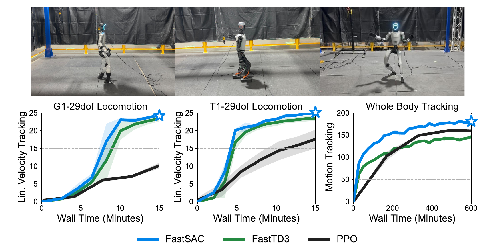{width=92%}

曲线的读法：横轴是**墙钟时间**（不是环境步数），纵轴是速度跟随任务的回报。左、中两张图里，蓝线（FastSAC）和绿线（FastTD3）都在 10 分钟上下冲到平台期，黑线（PPO）到 15 分钟还没停止爬升——G1 那张上它只到两条彩线的四成出头，T1 那张上追到了七成，差距没那么悬殊。右图是更难的全身动作跟踪（和第14讲 6.6 节那个 BeyondMimic 同类任务），时间尺度拉长到 600 分钟——这里要看仔细：**只有 FastSAC 全程领先**，FastTD3 前期虽快，约 350 分钟后被 PPO 反超、最终收在它下面。所以 off-policy 的墙钟优势在长时间尺度上并非无条件成立，换个算法就可能翻盘。

> 备注：这是**同一块 GPU 上的墙钟对比**，不是"PPO 学不会"——给足时间 PPO 也能到平台。off-policy 每一步更新更重（大 batch、多次梯度），但样本复用让它总体上快得多。另外论文用了**极简奖励函数**——off-policy 对奖励设计的品味和 on-policy 不完全一样，把第14讲的奖励原样搬过来不一定最优。

这个结果和第14讲形成了一组干净的对照：**同一台 G1、同一类行走任务**，第14讲的 PPO 靠 4096 个环境堆出上亿步交互，这里的 FastSAC 靠"每条经验反复用"把墙钟压缩到一刻钟。第14讲埋的"为什么真机要换 off-policy"，在仿真里就已经初见分晓。

## 7.3 动手实验：给 G1 行走加第四个版本

第14讲的 G1 行走模块里躺着三个训练脚本：`code/rl/1_rl_basics/1_1_g1_walk_rl/train_v1_reinforce.py`、`code/rl/1_rl_basics/1_1_g1_walk_rl/train_v2_a2c.py`、`code/rl/1_rl_basics/1_1_g1_walk_rl/train_v3_ppo.py`——同一个任务，算法由简到繁。SO-101 阶梯之外再补一个动手实验：给第14讲这条 G1 阶梯加**第四级**——off-policy 的 SAC 版本，环境、奖励、模型骨架全部复用，只换算法。

实验设计如下：

- **任务与环境**：与第14讲完全相同的 mjlab G1 平地速度跟随环境（`G1WalkEnv`），不改任何奖励项——保证对照干净。
- **代码结构**：和 v1 到 v3 一样的 Lightning 四件套。最有教学价值的差异在数据层：前三个版本用的是 `G1WalkRolloutDataset`，每轮**在线采一段新 rollout**；SAC 版本换成 **`G1WalkReplayDataset`**——转移存进池子、随机抽样训练。**on-policy 和 off-policy 的全部区别，在数据这一层直接看得见。**
- **训练配方**：取 FastSAC 配方中对课堂有意义的三件——并行环境采样进同一个 buffer、大 batch、高 UTD；分布式 Critic 等纯提速细节不进这个 G1 版本，保持代码能一口气读懂。
- **对照口径**：两张曲线图。第一张按**环境步数**对齐——预期 off-policy 在早期样本效率上显著占优，这是"每条经验反复用"的直接兑现；第二张按**墙钟时间**对齐——诚实展示 off-policy 每步更新更贵的另一面。最后配 rollout 视频对照步态质量。

这套实验已经落进课程代码仓：`code/rl/1_rl_basics/1_1_g1_walk_rl/train_v4_sac.py`，与前三个版本并排摆放；评测数字、对照曲线与 rollout 视频在 `code/rl/1_rl_basics/result/1_1_g1_walk_rl/` 里（`compare.json` 是逐档评测的原始记录）。下面按结果读图。

**先回答最要紧的问题：它会不会走？** 会。取第 900 次迭代那份存档做确定性评测（256 个环境各跑 300 步），摔倒率 0.96%，抽帧里能看到真实的迈步——不是站桩，也不是高频抽搐。但平均 reward 只有 0.026，是 v3 PPO（0.097）的四分之一出头。

{width=92%}

**再看两张对照曲线。** 第一张按环境步数对齐：SAC 的第一个存档点（246 万步）就已经在 0.026，而 PPO 的第一个存档点要到 2000 万步（当时 0.064）。要小心的是，2000 万步之前 PPO 没有存档，两条曲线的"交叉点"并没有实测——所以这张图只支持一个定性结论：**off-policy 在起步阶段确实更省交互**，不支持"省了多少倍"这样的定量说法。第二张按墙钟对齐：同样跑满 3000 次迭代，SAC 用了约 15 分钟，PPO 约 100 分钟。

{width=88%}

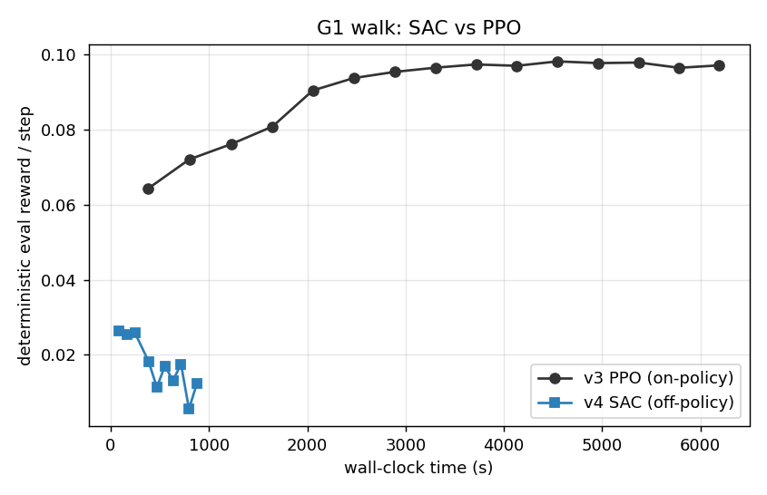{width=88%}

**但这两条曲线还告诉你一件更要紧的事：SAC 这条是往下走的。** 记录里 SAC 每 300 次迭代存一档，十档的 reward 依次是 0.026、0.025、0.026、0.018、0.011、0.017、0.013、0.018、0.006、0.012——**最高点就是最早那一档**，第 2700 次迭代那档只剩 0.006，不到峰值的四分之一；同期摔倒率也从 0.96% 抬到 1.0%～1.4% 之间起伏。也就是说，我们拿去评测的 0.026 是在**第 4 分钟**挣到的，后面那十来分钟训练不但没让它变好，还把它训坏了。

这恰恰是 2.5 节死亡三角那笔账的现场：函数近似、自举、离策略数据三者凑齐，训练就**失去了"只会越来越好"的保证**——on-policy 那边"数据永远新鲜、错账很快被重访修正"的兜底没有了。至于这一次具体坏在哪一条边上，我们没有做到定位（要盯 $\alpha$、Q 值量级、动作幅度逐项回放），所以这里只报形状不报病因。对读者的实操含义很直接：**off-policy 训练必须存档并逐档评测，不能训完直接取最后一档**——最后一档很可能不是最好那一档。

| 版本 | 算法 | 最好的一档 reward | 该档摔倒率 | 该档交互量 | 该档墙钟 | 跑满 3000 迭代总墙钟 |
|---|---|---|---|---|---|---|
| v3 | PPO（on-policy） | 0.098 | 0% | 2.16 亿步 | 约 76 分钟 | 约 100 分钟 |
| v4 | SAC（off-policy） | 0.026 | 约 1% | 246 万步 | 约 1.3 分钟 | 约 15 分钟 |

（表里 v4 那一行取的是峰值档；正文和抽帧用的是第 900 次迭代那份存档，reward 同为 0.026、摔倒率 0.96%、交互量 737 万步、墙钟 4.1 分钟——两档成绩在评测噪声内，取哪一档结论都一样。）

**为什么没追上 PPO 的平台？** 两个原因，7.2 节的备注其实都预告过：这套奖励本来是给 PPO 调的，off-policy 的品味不一样；而且课堂版刻意只保留 SAC 最核心的零件，论文配方里的分布式 Critic（6.1 节那一套）和逐任务精调过的整套超参都没上——它们正是论文里绝对性能的来源。所以这张对照图的正确读法不是"SAC 不行"，而是：**样本效率与绝对性能是一对要靠配方去调和的矛盾**——起步省交互是 off-policy 结构性的优势，绝对高度则要靠完整配方去挣。

同样要说清楚的是，**这个 15 分钟和 7.2 节论文那个 15 分钟不是一回事**：论文的一刻钟练出的是能 sim-to-real 上真机的行走策略，我们这一刻钟练出的是一个 reward 只有 PPO 四分之一、而且后半程还在退化的策略。两者唯一可比的是"off-policy 在这个量级的墙钟里确实能把腿迈起来"，不是成绩。

**跑通之前先踩了三个坑**，每一个都是第 5 节讲过的零件在真实训练里的反面教材，值得记下来：

1. **奖励尺度**。G1 每步 reward 只有 0.05 上下，直接进 SAC 的目标会被熵项整个淹没——actor 优化的全是"保持随机"，机器人永远站着不动。把 reward 放大十倍之后，任务信号才压得过熵。回头看 5.1 节的目标函数：reward 和熵是相加的两项，谁的量级大谁说了算。
2. **温度失守**。自动温度（5.2 节的第四个零件）会自己往下调 $\alpha$，训到后期 $\alpha$ 掉到 0.01 附近，熵正则实际上消失，策略开始把动作越顶越大、步态反而退化。解法是给 $\alpha$ 设一个 0.1 的下限——自动温度照常工作，但不许它把探索完全关掉。
3. **动作幅度**。tanh 挤压的输出上限一开始设成 3.0，策略学出灾难性的大幅甩动；收回 1.0（这个环境的动作本来就是 1 上下的量级）才回到正常步态。

三个坑合起来是一句话：**off-policy 的稳定性从来不是白来的**——同一份代码，几个数值不对就完全不收敛。这也为第 8 节埋下伏笔：真机方案要在 SAC 之上再垫示教、干预这么多层保险，正是因为它在真机上连"重训一次试试"的机会都没有。

## 7.4 本节小结

本节用 FastTD3/FastSAC 回答了"off-policy 行不行"：不但行，在大规模并行仿真里还更快——单卡 15 分钟训出能上 G1 真机的行走策略，核心配方是并行采样进同一个 replay buffer、大 batch、高 UTD。我们自己的第四版动手实验印证了这条路的两面：起步省交互、墙钟压到一刻钟是结构性的，绝对高度则要靠完整配方去挣。它的局限也要看清：这仍然是**仿真里**的胜利，奖励函数是白拿的、复位是免费的、探索撞坏了按 R 重来。下一节把这三张"仿真特权卡"全部收走，看看真机上还缺什么。

# 8 真机压轴：HIL-SERL 让 SO-101 学会接触型任务

阶梯爬到 squint，我们已经能在仿真里从零学会一个操作任务了。但那仍是**仿真里**的胜利——奖励是白拿的、复位是免费的、探索撞坏了按 R 重来。这一节把这三张"仿真特权卡"全部收走，看看真机上还缺什么，再用一整套工程答案把它补齐。好消息是不用从头造轮子：这套答案叫 **HIL-SERL**[11]，而且已经被 LeRobot[12] 官方移植到 SO-100/SO-101——第9讲 4.1 节采数据用的那套 Leader–Follower 臂，现在原封不动就能变成一套真机强化学习装备。所以这一节采取"**概念一件、操作一件**"的走法：每讲清 HIL-SERL 的一个部件，紧接着就给出它在 LeRobot 里对应的那一步命令。

## 8.1 把 SAC 搬上真机：四道坎

把前面 SO-101 阶梯上的 SAC 直接搬上一台真实机械臂，会立刻撞上四道坎：

1. **奖励谁来发？** 仿真器里 reward 是一行代码，因为仿真器知道每个物体的真实位姿。真机上没有上帝视角——"插头插进去了没有"，只有相机看得见。
2. **谁来复位？** 仿真里回合结束一键 reset。真机上方块掉在地上不会自己飞回桌面。
3. **探索会闯祸。** 随机初始化的策略在真机上乱抡，轻则任务毫无进展，重则撞坏夹爪和工件。
4. **样本贵上加贵。** 第 1 节算过的账，在接触型任务上更严苛——插拔、对位这类任务容错以毫米计，瞎探索几乎撞不出成功，稀疏奖励长期是零，学习根本启动不了。

**HIL-SERL**（Human-in-the-Loop Sample-Efficient Robotic Reinforcement Learning，人在环的样本高效机器人强化学习，UC Berkeley）[11]就是针对这四道坎给出的一整套工程答案，2024 年放出预印本，2025 年发表在 Science Robotics 上。它不发明新算法，而是把一条成熟的 off-policy 血缘链带上真机，再补上"人"这个要素。

## 8.2 一条血缘链：SAC 到 HIL-SERL

HIL-SERL 不是凭空出现的，它是伯克利同一条线上四步演进的终点，每一步只解决一个问题：

| 工作 | 年份 | 在前一步上补了什么 |
|---|---|---|
| SAC[6] | 2018 | 连续动作 off-policy 的算法底座（第 5 节） |
| RLPD[13] | 2023 | **先验数据进池子**：每个 batch 一半采自在线经验、一半采自离线示教；配上高 UTD 和 LayerNorm 稳住 critic |
| SERL[14] | 2024 | **软件套件**：actor 与 learner 分进程解耦、阻抗控制器保护硬件、免复位训练支持 |
| HIL-SERL[11] | 2024 | **人在环**：训练中人工干预 + 视觉奖励分类器，通吃接触型任务 |

链条中间的 **RLPD**（RL with Prior Data）值得多说两句，因为 HIL-SERL 的 learner 跑的就是它。它对 SAC 只做三处改动，每处都对着一个真机痛点：

- **对半采样**：每个训练 batch 一半抽自在线经验池、一半抽自示教池。比例焊死在五五开是刻意的——全吃示教会过拟合到"学得像"（那是模仿学习的地界），全吃在线经验又回到冷启动的老问题；对半保证每一步更新既有"成功长什么样"的锚，又有"我自己刚犯的错"的新鲜教训。
- **高 UTD**：每采一步做多次梯度更新（2.5 节说的 UTD 杠杆），把真机上贵得要命的每条转移榨干。
- **critic 加 LayerNorm**：高 UTD 会放大死亡三角的风险，尤其是 critic 对**没见过的动作**报出离谱高分、被 actor 钻空子的问题；LayerNorm 把网络输出的量级压住，是让"猛榨样本"不翻车的关键配平。

记住这条链的读法：**SAC 给能力，RLPD 给样本效率，SERL 给工程骨架，HIL-SERL 给真机落地的最后一公里。**

下面就把 HIL-SERL 拆成"四件套 + actor-learner 架构"逐个讲透——每讲完一件，紧接着给出它在 LeRobot SO-101 上对应的那一步操作。

## 8.3 落到我们的硬件：角色分工与第一步——划安全边界

先把任务和硬件摆好。**任务**选接触型的入门款：**把方块推到目标区域**（push cube to goal region）。它具备接触任务的全部要素——推的力道和角度直接决定成败、视觉可判定成功——又足够短（5 到 10 秒一个回合），符合 HIL-SERL 的甜区。练顺之后可以升级到抓取-提起（pick and lift）。

**硬件分工**和第9讲 4.1 节遥操作采数据时一模一样，但角色变了：

- **follower 臂**：不再重放人的动作，而是作为 **RL actor 的身体**，执行策略输出的动作、与环境真实交互。
- **leader 臂**：不再全程主导，而是作为**人的干预接口**——训练中它实时跟随 follower 的姿态，人随时可以握住它接管几步（SO-101 leader 的减速齿轮让"顺滑接管"成为可能），键盘 space 键在"策略控制"和"人控制"之间切换。
- **两路相机**（顶视 + 腕视）：既是策略的眼睛，也是奖励分类器的裁判席。

动作空间有一个关键选择：**在末端执行器（EE）空间学，不在关节空间学**。策略输出的是末端的 x、y、z 位移增量，由逆运动学换算成关节目标。经验上，操作类任务在关节空间学 RL 要难得多——同样的任务换到 EE 空间往往才变得可学；而且 EE 空间里"划安全边界"直观得多。

这条 EE 边界正是 8.1 节第三道坎（探索会闯祸）的第一个工程回应，也是全流程的第一步操作。运行 `lerobot-find-joint-limits`，手动拖着 follower 把"完成任务需要的空间"扫一遍，脚本记录末端位置的最小、最大值：

```bash
lerobot-find-joint-limits \
  --robot.type=so101_follower --robot.port=/dev/ttyFollower \
  --teleop.type=so101_leader --teleop.port=/dev/ttyLeader
```

得到的边界写进配置的 `end_effector_bounds`。这一步同时回应了两件事：探索安全（策略出不了这个箱子），和学习难度（动作空间被压缩到任务相关的一小块）。

## 8.4 第一件套 demo buffer：示教打底，并采下示教

**概念。** 训练开始前，先用遥操作采一批成功示教，装进一个独立的 **demo buffer**。这直接继承 RLPD：每个训练 batch 一半来自在线经验池、一半来自示教池——从第一次梯度更新起，网络就见过"成功长什么样"，不必从纯随机探索里大海捞针。这是对第四道坎（学习启动不了）的回答。

**操作。** 在 LeRobot 里，把配置文件 `mode` 设为 `"record"`，用 leader 遥操作采 **15 到 20 条成功示教**（论文里典型是 20 到 30 条）：

```bash
python -m lerobot.rl.gym_manipulator --config_path env_config_so101.json
```

每条示教以人按下"成功"键结束（该回合最后一步记奖励 1）。数据落成标准 LeRobot 数据集——第9讲 3.3 节学的那套数据格式，在这里原样复用。

## 8.5 第二件套 视觉奖励分类器：让相机当裁判，并把它训出来

**概念。** 不手写奖励函数，也不让人逐帧打分，而是**把"成功了吗"学出来**：遥操作采集一批正样本（任务完成的画面）和负样本（没完成的画面）——论文的典型配比是约 200 正、1000 负，折合十来条轨迹、五分钟的事——训练一个基于 ResNet 的**二分类器**。训练时它盯着相机画面，输出 0/1 稀疏奖励，还顺带自动判断回合结束。这是对第一道坎（真机没有上帝视角）的回答。

> 备注：分类器也会被骗——机械臂挡住目标、光照变化都可能造成误判。假阳性尤其危险：策略会学会"摆拍"骗分。实践中靠提高判定阈值、追加难负样本来修，这也是下面训练分类器时要专门留心的点。

**操作（一）：先框视觉关注区。** RL 直接从像素学习，对背景干扰极其敏感——光照变化、路过的人、工作区外的杂物都可能把学习带偏。上分类器之前，先用交互工具把每路相机的画面裁到任务核心区：

```bash
python -m lerobot.rl.crop_dataset_roi --repo-id <你的示教数据集>
```

框出的裁剪参数写进配置的 `crop_params_dict`，图像统一缩放到 $128\times128$。

**操作（二）：训练分类器。** 先把 `terminate_on_success` 设为 `false` 再采一批数据——回合在成功后**不**立即截断，让"成功状态"的画面多攒一些（正样本不足是分类器最常见的坑）；然后用 ResNet-10 底座训二分类器：

```bash
lerobot-train --config_path reward_classifier_train_config.json
```

训完把模型路径写进配置的 `reward_classifier.pretrained_path`，判定阈值从 0.7 左右起调。上真机前先单独测一轮：故意摆几个"像成功但不是"的场面，看它会不会误判。

## 8.6 第三、四件套 人工干预与自动复位

**人工干预（第三件套）。** 这是 HIL-SERL 名字里 "Human-in-the-Loop" 的本体。在线训练时人守在旁边，看到策略快要闯祸或卡死，**随时接管**遥操几步把机器人带回正轨，然后把控制权还给策略。关键在于干预数据的用法：**接管的那几步被当作高质量的 off-policy 转移，照常存进经验池参与训练**——2.1 节说过，off-policy 不挑数据来源，人的手就是另一个行为策略。

这与模仿学习里的 DAgger 家族形成一组重要对照：HG-DAgger[15] 同样让人纠偏，但把纠偏数据拿去做**监督学习**——策略的上限被钉死在"学得像示范者"；HIL-SERL 把同样的数据交给**强化学习**——干预只是引路，策略最终按任务奖励自我优化，可以**超过**示范者（8.8 节与 HG-DAgger 的对照曲线会印证这一点）。这是对第三道坎（探索闯祸）的回答：人挡住最坏情况，策略保留自我提升空间。这一件套的操作接口就是 8.3 节说的 leader 臂 + space 键，具体命令并进下一节的在线训练里一起给。

**自动复位（第四件套）。** 回合结束后环境自动回到初始分布：SERL 提供了 forward-backward 双控制器的免复位方案（一个策略做任务、一个策略负责"拆回去"），SO-101 这类简单场景则用固定复位关节位加随机化初始姿态。人只负责偶尔把掉落的物体捡回工作区。这是对第二道坎（谁来复位）的回答。

## 8.7 actor-learner 架构：拼成在线系统，并跑起来

四件套怎么拼成一个在线系统？下图是 HIL-SERL 论文的系统总览。

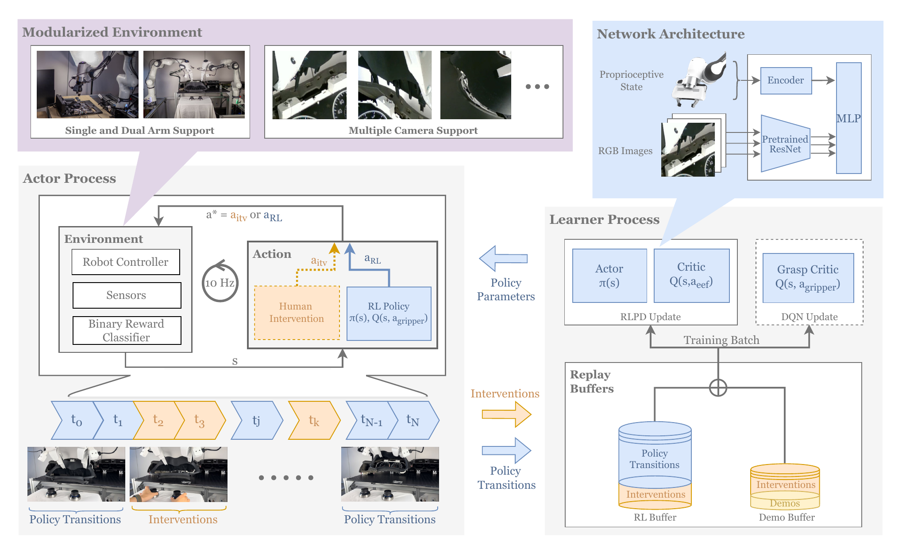{width=100%}

按数据流走一遍这张图：

- **左边 actor 进程**：以 10 Hz 的固定节奏和环境交互。每一拍，环境给出观测 $s$（相机图像 + 本体状态），动作要么来自 RL 策略（$a_{\mathrm{RL}}$），要么来自人的干预（$a_{\mathrm{itv}}$，虚线路径）——谁在控制就听谁的。二值奖励分类器在环境侧充当裁判。时间轴上蓝色段是策略自主，黄色段是人接管。
- **learner 里的 replay buffers**：两个池子。RL buffer 收在线转移，demo buffer 装训练前采的示教；learner 每个 batch 从两池对半采样（RLPD 的规矩）。注意图上**两个池子的底部都画着一层 Interventions**——人接管的那几步既算在线经验、也算示教，两边都进，这是它比普通 RLPD 多出来的一笔。
- **右边 learner 进程**：在 GPU 上闷头做梯度更新（actor 网络 + critic 网络），周期性把刚更新好的策略参数推回 actor 进程。
- **右上网络结构**：多路相机图像过同一个预训练 ResNet-10 编码，与本体状态编码拼接后进 MLP。

actor 和 learner **异步解耦**是真机 RL 的硬需求，不是花活：真机控制必须踩着 10 Hz 的实时节拍，不能停下来等 GPU 算完一个 batch；反过来 GPU 也不该在机器人慢吞吞动作时闲着。分进程后两边各按各的节奏满负荷运转，这个设计在下面的 LeRobot 实现里原样保留。

LeRobot 把整套 HIL-SERL 封装成三块：环境侧的 `gym_manipulator`（把真机包成 Gym 风格环境，串起奖励分类器、干预、安全边界等处理管线）、训练侧的 `lerobot.rl.learner` 与 `lerobot.rl.actor` 两个进程入口（正对上面架构图的两个进程），以及一份 JSON 配置文件贯穿全部环节——工程实现与上面那张论文架构图一一对应。

**操作：起两个进程做在线训练。** 边界、示教、分类器都就位后，两个终端分别拉起两个进程，人守在 leader 旁边：

```bash
python -m lerobot.rl.learner --config_path train_config_hilserl_so101.json
python -m lerobot.rl.actor   --config_path train_config_hilserl_so101.json
```

干预的节奏是门手艺，官方与论文的经验一致：**开头几个回合先让策略自由探索**摸清行情；之后**短促、精准地**接管——策略卡死或将要出界时拉一把就还权，不要长时间代驾；策略开始能完成任务后，把干预收缩到"临门一脚"级别的小修正。

> 备注：三个对成败影响最大的超参——
>
> - `temperature_init`：SAC 初始温度，从 0.01 量级起步；设太高会让干预"教不进去"。
> - `policy_parameters_push_frequency`：learner 向 actor 推送参数的间隔，压到 1 到 2 秒，让 actor 总用上新鲜策略。
> - `storage_device`：设为 `cuda`，省去参数在 CPU、GPU 间搬运的开销。

**收口：评测。** 训练前后各跑 20 个回合测成功率（训练前用纯示教做基准），配上训练全程的干预率曲线与回报曲线，就构成这次实验的完整证据链。

## 8.8 训练全景与真机战绩

把四件套按序上场串起来，就是 HIL-SERL 的一次完整训练，下图（同样取自论文）画的就是这三步。

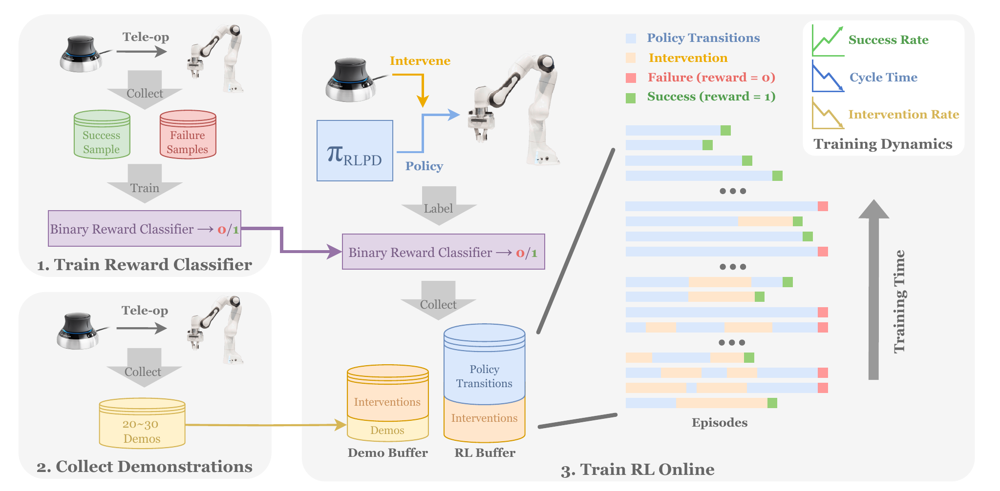{width=100%}

左上：遥操采正负样本，训出二值奖励分类器。左下：遥操采 20 到 30 条示教进 demo buffer。右侧：在线训练——策略与环境交互，分类器发奖励。右侧那一叠横条是按时间排开的一个个回合，**时间轴自下而上**（图右侧那个大箭头标着 Training Time）：底下几行早期回合里橙色的人工干预段又多又长、末尾还常是红色的失败标记；越往上橙色越稀、蓝色的策略自主段越连成整条，末尾的绿色成功标记越来越密。

论文在**七类**真机任务上验证了这套流程（结果表把它们按子任务拆成 13 行）：主板装配（内存条插入、SSD、USB 插拔与理线这类精密插拔）、宜家板件装配、汽车仪表盘装配、物体交接、传动带装配、抽积木、平底锅翻物——精密装配、动态操作、双臂协作都在里面：

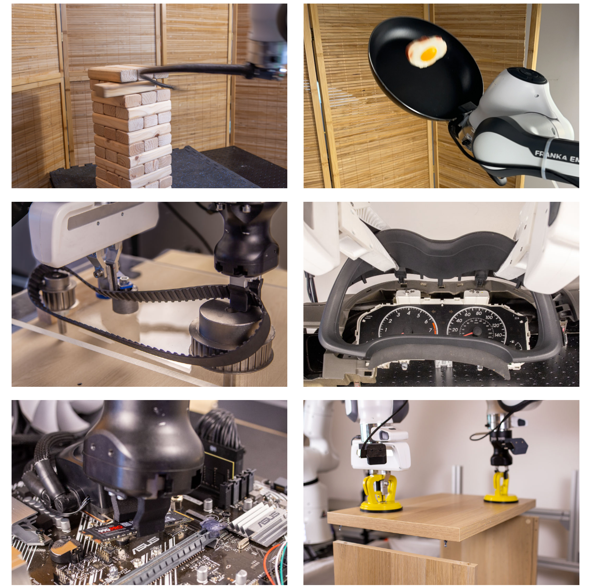{width=88%}

实验结果压成三条即可带走：

1. **1 到 2.5 小时的真机训练**就能把几乎所有任务练到 100% 成功率——这是"真机 RL 不可行"这个旧共识被打破的核心数字。
2. 相对模仿学习基线，平均成功率约 **2 倍**，执行速度快约 **1.8 倍**——RL 不只是学会了，还在按任务目标持续优化动作质量。
3. **干预率一路降到 0**——人从"全程陪练"逐渐退成"旁观者"，这是系统在自我提升的最直接体征。要注意降的过程并不平顺（8.10 节会看到一条真实曲线中途还会回升），能指望的是趋势，不是单调。

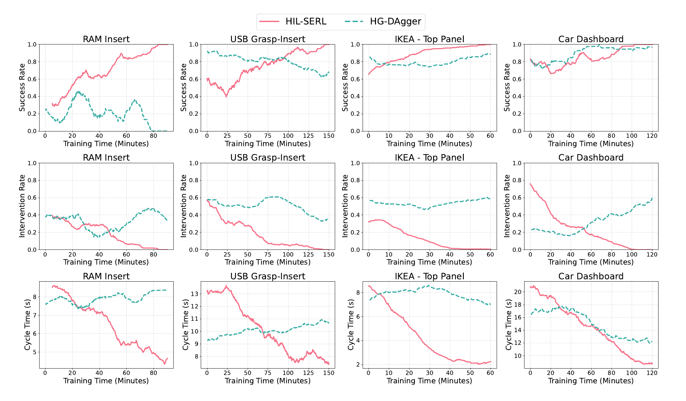{width=100%}

上图的对照值得细看，而且**要一行一行看，不能只看第一行**。

成功率那一行（第一行）里，两者的差距只在难任务上明显：内存条插入上 HG-DAgger 一路掉到 0、USB 从 0.9 滑到 0.65，而 HIL-SERL 都爬到了 1.0；可到了宜家顶板和汽车仪表盘这两个相对好做的任务上，HG-DAgger 也爬到了 0.89 和 0.97，跟 HIL-SERL 差不了多少。**光看成功率，会低估这组对照的信息量。**

真正干净的分界线在第二行**干预率**：HIL-SERL 的四条粉线全部降到 0 并留在那里，而 HG-DAgger 的青虚线在四个任务里有三个后期不降反升——策略越训，人越得频繁伸手。第三行**单次耗时**大体是同一个故事，但要老实留下一个反例：HIL-SERL 四条全在下降；HG-DAgger 在内存条（7.6 秒升到 8.4 秒）和 USB（9.3 升到 10.7）上不降反升，宜家顶板中途冲高到 8.6 又回落到 7.0、基本原地踏步，**只有汽车仪表盘确有改善——从 16.5 秒降到 12.2 秒，快了约四分之一**。可这一档恰恰是它干预率升得最凶的一档（0.16 一路涨到 0.59）——这点提速是拿干预换来的。

也就是说，即使在 HG-DAgger 成功率追平的那两个任务上，它也是**靠人一直在旁边托着**才追平的。同样的人力投入，监督学习"吸收"干预、把它变成更像示范者的模仿，强化学习"消化"干预、把它变成自己不再需要人的能力——差距就在这。

局限性也要摊开：每个任务都要**单独**走一遍全流程（没有跨任务泛化，这正是 VLA 那条线擅长的事）；任务时长以 5 到 10 秒的短程为主；奖励分类器可能被骗。这些边界划出了它和前几讲方法的分工——本讲第 9 节会回到这张分工地图。

## 8.9 没有真机：gym_hil 仿真替代

没有 SO-101 也能完整体验这套流程。LeRobot 配套的 `gym_hil` 提供了 MuJoCo 版的 Franka Panda 抓方块环境，键盘或手柄充当干预接口：

```bash
# 配置里 task 设为 PandaPickCubeKeyboard-v0，其余流程与真机完全一致
python -m lerobot.rl.actor   --config_path train_gym_hil_env.json
python -m lerobot.rl.learner --config_path train_gym_hil_env.json
```

采示教、起两个进程、space 接管干预——和真机同一套命令与配置结构。仿真里有物体真值，奖励可以直接判，四件套里的"奖励分类器"这一件在仿真里是可选项。建议的学习路径：先在 gym_hil 里把全流程跑熟，再上真机——真机上每一分钟都贵，别把学工具的成本花在真机时间里。

这张有无干预的对照图说明的是另一件事——干预对**学习速度**的贡献：

{width=78%}

橙色那条（无干预）在头一万八千步里贴着 0 一动不动，之后才开始爬，到三万步上下才追平；有人干预的两条（粉、绿）不到一万步就到顶——**差了三倍的交互量**。干预不是锦上添花，而是真机 RL 能在小时级完成的关键。

## 8.10 训练健康的体征：盯着干预率

在线训练阶段最值得盯的一张图不是回报曲线，而是**干预率曲线**。下面这张图来自 LeRobot 官方文档的抓取-提起实验。

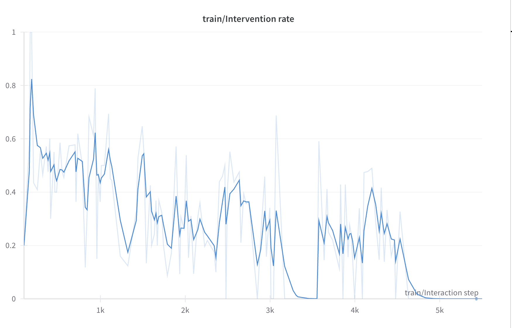{width=78%}

这是"健康训练"的模样：**总体趋势向下**。注意它并不单调——3.3k 步附近先归零，接着又回升到 0.3 左右拉锯了近一千步，最后才真正稳定在 0。真机训练很少给你一条干净的下降曲线；要盯的是趋势，不是某一段。如果训练半小时干预率还纹丝不动，通常说明出了问题（奖励分类器误判、边界设错、或干预方式太"代驾"），该停下来排查而不是继续耗真机时间。

需要说清楚的是：这一节给的是一条**照着能走通的流程**，不是我们自己跑完的一次实验——上面所有数字和曲线都来自 HIL-SERL 论文与 LeRobot 官方文档。你在自己那台 SO-101 上按 8.3 到 8.7 走完一遍，拿到的训练前后成功率对照、干预率曲线和 rollout 视频，就是属于你自己的那份证据链。

## 8.11 本节小结

本节把 HIL-SERL 从概念一路落到我们自己的硬件上。它把"真机稀疏奖励 RL 学不动"拆成四道坎，用四件套逐一回应：示教打底解决冷启动、视觉奖励分类器解决没有上帝视角、人工干预解决探索闯祸、自动复位解决连续训练；底座是 SAC 到 RLPD 到 SERL 的 off-policy 血缘链，架构上 actor 与 learner 异步解耦保住真机的实时节拍。落到 SO-101 上，每个部件都对应 LeRobot 里的一步操作——划安全边界、采示教、框 ROI、训分类器、双进程在线训练、评测收口，每一步都是第9讲数据工具链的自然延伸；没有真机就用 gym_hil 走完全流程。战绩：1 到 2.5 小时真机训练做到接近 100% 成功率，约 2 倍于模仿基线；训练健康与否，第一看干预率是否持续下降。局限：单任务、短程、分类器可被骗，且真机训练全程需要人值守。它的一切素材——旧经验、示教、干预——之所以能进同一个池子，全靠 off-policy 不挑数据来源这一条根性质。

# 9 结课全景：三种强化学习，与一条完整的链路

## 9.1 三种 RL 形态对照

课程的强化学习三部曲到此收官。三讲各用了一种形态的 RL，放进一张表里，差异一目了然：

| | 第14讲 | 第15讲 | 第16讲 |
|---|---|---|---|
| 载体 | G1 人形行走/动作跟随 | VLM 数数（动手）、VLA 操作（导读） | SO-101 接触任务 |
| 训练地点 | 仿真（大规模并行） | 仿真 rollout / GPU 答题 | **真机在线** |
| 动作 | 连续关节控制 | 离散 token | 连续 EE 控制 |
| 奖励 | 手写密集奖励 | 可验证规则，稀疏但免费 | **学出来的**视觉 0/1 |
| 数据方式 | on-policy | on-policy | **off-policy** |
| critic | 有（GAE 基线） | 无（组内相对优势） | 有（Q 函数，主角） |
| 人的角色 | 写奖励函数 | 写判分规则 | **示教 + 在线干预** |
| 代表算法 | PPO | GRPO | SAC（RLPD/HIL-SERL） |
| 本讲演示阶梯 | REINFORCE→A2C→PPO | 单一 GRPO | 表格Q→DQN→DDPG→TD3→SAC→squint（六级 off-policy） |

这张表也是一张**选型地图**：有仿真、能并行、奖励好写——on-policy 大力出奇迹（第14讲）；策略本体是生成模型、结果可规则验证——GRPO 后训练（第15讲）；必须在真机上学、样本以秒计费——off-policy 加人在环（本讲）。三种形态没有高下，只有场景匹配。

## 9.2 从第8讲到第16讲：一条链路

把镜头拉远，这九讲其实只讲了一件事——**一台机器人怎么从零获得并持续改进一个技能**：

- **第8讲**立了骨架：端到端 policy，观测进、动作出，rollout 才是唯一的裁判。
- **第9讲**解决原料：遥操作采集、LeRobot 数据闭环——今天它的 Leader–Follower 臂和数据格式在 RL 里原样复用。
- **第10讲**给了第一批可用的大脑：ACT、Diffusion Policy、Flow Matching，模仿学习把示教"学得像"。
- **第11到13讲**把大脑换成通才：VLA 家族——预训练带来语言理解与跨任务泛化，微调把它对齐到你的机器人。
- **第14讲**引入第二种学习范式：不再模仿，而是试错——策略梯度到 PPO，在仿真里大规模练。
- **第15讲**把两条线接起来：RL 作为后训练外环，让模仿学出来的 VLA 自我提升。
- **本讲**走完最后一公里：off-policy 加人在环，让学习直接发生在真机上——模仿给底子，人保驾，RL 超越示范者。而且这条 RL 线还会反哺 VLA：SO-101 阶梯顶端那个从像素学会的视觉策略，顺手 rollout 又换外观重渲，就生成出第9讲与第12讲用来微调 VLA 的那批仿真数据集（6.3 节）——"RL 生成数据 → VLA 微调"的仿真数据闭环就此合上。

模仿学习与强化学习在这条链路上不是对手而是接力：**示教决定起点，试错决定上限，真机决定成色**。课程后续将继续走向世界模型等更前沿的方向，而无论模型形态怎么变，这条"数据-策略-改进"的闭环都是底层不变的骨架。

# 10 本讲小结

## 10.1 主线回顾

这一讲从一笔账出发：真机上样本贵三个数量级，on-policy"采完即弃"的奢侈打法玩不起，于是换 off-policy——行为策略与目标策略解耦，旧经验、示教、干预统统进 replay buffer 反复用；数学根基是贝尔曼等式不挑数据来源。我们先在 CartPole 上把 Q 函数、经验回放、目标网络跑成代码，从手工分桶的表格 Q 走到吃原始状态的 DQN。随后在 SO-101 的 ReachCube 上从零爬了一条 off-policy 阶梯：DDPG 用确定性 Actor 把 off-policy 带进连续动作（过程中诊断了观测不归一化把 `tanh` 顶进饱和、Actor 梯度冻结的典型坑），TD3 用双 Critic 取小治好高估、却仍卡在探索，SAC 把最大熵写进训练目标、成功率从 0 做到 0.99（三百次迭代前后头一回够到，四百八十次之后才不再掉链子），squint 再把输入换成像素、Critic 换成 C51 分布式，从 16 像素学会并顺手生成出 VLA 微调数据。接着回到 G1 行走验证规模化：FastSAC/FastTD3 单卡 15 分钟练成能上真机的行走。最后 HIL-SERL 把 off-policy 带上真机——示教打底、视觉分类器发奖、人在环纠偏、自动复位撑连续训练，1 到 2.5 小时把接触型任务练到接近 100%，落到 SO-101 上就是一整套 LeRobot 工作流，干预率下降就是训练健康的体征。

## 10.2 方法演进链

这一讲织了两条演进链。一条是**算法阶梯**，每一级只补上一级的一个短板：

$$\text{表格 Q} \;\to\; \text{DQN} \;\to\; \text{DDPG} \;\to\; \text{TD3} \;\to\; \text{SAC} \;\to\; \text{squint}$$

分桶到函数近似、离散到连续、单 Critic 到双 Critic、外加噪声到最大熵、标量到分布式视觉——一步一个知识点。另一条是把 SAC 带上真机的**工程血缘链**：

$$\text{SAC} \;\to\; \text{RLPD} \;\to\; \text{SERL} \;\to\; \text{HIL-SERL}$$

能力、样本效率、工程骨架、真机落地——每一步只加一块砖。旁支上，FastTD3/FastSAC 证明同一套 off-policy 底座在大规模并行仿真里同样占优。

> 一句话总结：真机上的强化学习是一门"省"的艺术——off-policy 把每条经验用到极致，人在环把每次失败挡在损失之外，从 CartPole 一路爬到 squint 再到 HIL-SERL，讲的都是同一件事：用最少的真机样本，把一个接触型技能在两小时上下学出来。

# 参考文献

[1] MNIH V, KAVUKCUOGLU K, SILVER D, et al. Human-level control through deep reinforcement learning[J]. Nature, 2015, 518(7540): 529-533. https://doi.org/10.1038/nature14236.

[2] SIMONINI T, SANSEVIERO O. The Hugging Face deep reinforcement learning course[EB/OL]. (2023)[2026-07-04]. https://huggingface.co/learn/deep-rl-course.

[3] SUTTON R S, BARTO A G. Reinforcement learning: an introduction[M]. 2nd ed. Cambridge: MIT Press, 2018. （"死亡三角"见该书第 11 章 The Deadly Triad 一节）

[4] LILLICRAP T P, HUNT J J, PRITZEL A, et al. Continuous control with deep reinforcement learning[EB/OL]. (2015-09-09). https://arxiv.org/abs/1509.02971.

[5] FUJIMOTO S, VAN HOOF H, MEGER D. Addressing function approximation error in actor-critic methods[EB/OL]. (2018-02-26). https://arxiv.org/abs/1802.09477.

[6] HAARNOJA T, ZHOU A, ABBEEL P, et al. Soft actor-critic: Off-policy maximum entropy deep reinforcement learning with a stochastic actor[EB/OL]. (2018-01-04). https://arxiv.org/abs/1801.01290.

[7] ALMUZAIREE A, CHRISTENSEN H I. Squint: Fast visual reinforcement learning for sim-to-real robotics[EB/OL]. (2026-02-24). https://arxiv.org/abs/2602.21203. 代码仓库：https://github.com/aalmuzairee/squint（MIT 许可）。

[8] BELLEMARE M G, DABNEY W, MUNOS R. A distributional perspective on reinforcement learning[EB/OL]. (2017-07-21). https://arxiv.org/abs/1707.06887.

[9] SEO Y, SFERRAZZA C, GENG H, et al. FastTD3: Simple, fast, and capable reinforcement learning for humanoid control[EB/OL]. (2025-05-28). https://arxiv.org/abs/2505.22642.

[10] SEO Y, SFERRAZZA C, CHEN J, et al. Learning sim-to-real humanoid locomotion in 15 minutes[EB/OL]. (2025-12-01). https://arxiv.org/abs/2512.01996.

[11] LUO J, XU C, WU J, et al. Precise and dexterous robotic manipulation via human-in-the-loop reinforcement learning[J]. Science Robotics, 2025. https://doi.org/10.1126/scirobotics.ads5033. 预印本 (2024-10-29): https://arxiv.org/abs/2410.21845.

[12] CADENE R, ALIBERT S, SOARE S, et al. LeRobot: State-of-the-art machine learning for real-world robotics in PyTorch[EB/OL]. https://github.com/huggingface/lerobot.

[13] BALL P J, SMITH L, KOSTRIKOV I, et al. Efficient online reinforcement learning with offline data[EB/OL]. (2023-02-06). https://arxiv.org/abs/2302.02948.

[14] LUO J, HU Z, XU C, et al. SERL: A software suite for sample-efficient robotic reinforcement learning[EB/OL]. (2024-01-29). https://arxiv.org/abs/2401.16013.

[15] KELLY M, SIDRANE C, DRIGGS-CAMPBELL K, et al. HG-DAgger: Interactive imitation learning with human experts[EB/OL]. (2018-10-05). https://arxiv.org/abs/1810.02890.
