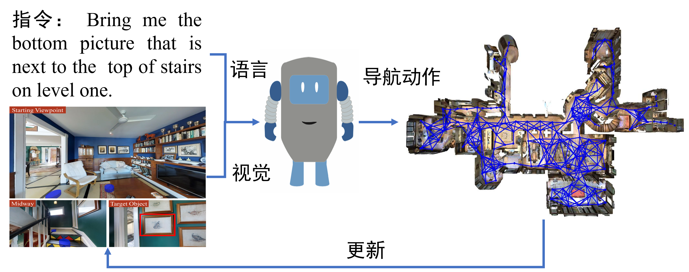
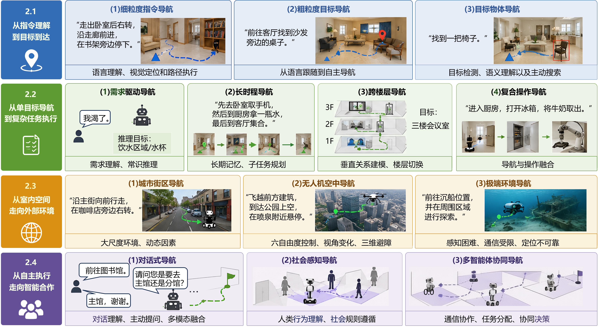
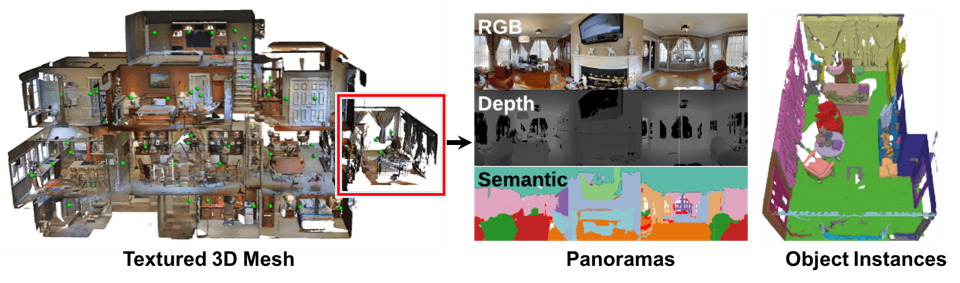
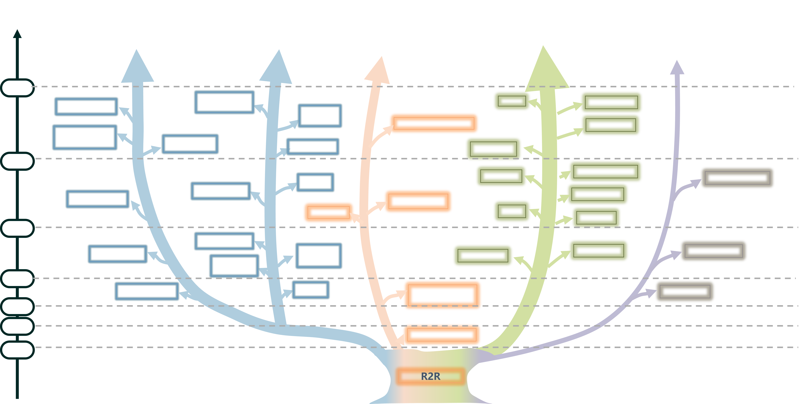
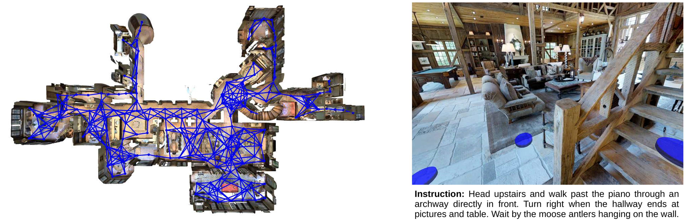

# 第 17 讲 视觉语言导航：任务与基准
# 学习目标

1. **理解视觉语言导航（VLN）的基本概念与问题定义**，掌握 VLN 的任务目标、系统组成和序贯决策过程，明确其在具身智能技术体系中的作用与定位。
2. **掌握 VLN 的核心任务要素**，理解语言指令、视觉观测、历史状态与动作决策之间的关系，能够分析 VLN 作为部分可观测序贯决策问题的基本形式。
3. **理解 VLN 任务范式的发展演进**，掌握从基础指令导航、目标导航，到长时程任务、开放环境导航以及交互协同导航的发展脉络，认识不同任务对智能体能力的要求。
4. **掌握主流 VLN 仿真平台的特点与适用场景**，了解 Matterport3D、Habitat、AI2-THOR、AirSim、Isaac Sim 等典型平台的功能特点，能够根据研究任务选择合适的实验环境。
5. **理解 VLN 基准数据集的发展规律**，掌握典型数据集在任务定义、环境规模、语言复杂度和交互能力方面的差异，认识数据集对推动 VLN 研究发展的重要作用。
6. **掌握 VLN 性能评价方法**，理解成功率、路径效率、轨迹一致性以及目标定位等主要评价指标的物理意义，能够从多个维度分析导航模型性能。
7. **建立 VLN 技术发展整体认知**，认识视觉语言导航从“语言驱动路径执行”向“具身智能任务理解与自主执行”发展的趋势，为进一步学习视觉语言模型、大语言模型和具身智能导航方法奠定基础。

# 1 引言：问题定义与系统边界

## 1.1 从“语言指令”到“空间运动”

在日常生活中，人类可以根据自然语言描述完成复杂的空间活动。例如，当接收到“请前往厨房，在冰箱前方停止”这一指令时，人类能够根据语言信息理解目标位置，并结合周围环境完成路径规划和运动执行。然而，对于机器人而言，这一过程并非简单的动作输出，而需要经历从语言理解到环境交互的一系列认知与决策过程。具体而言，机器人首先需要完成**语言理解**，从自然语言指令中提取目标对象、空间关系和任务约束，例如识别“厨房”“冰箱”“前方”等语义信息；随后，通过**视觉感知**获取环境状态，识别场景中的物体、区域和空间结构，并估计自身与目标位置之间的关系；在此基础上，机器人需要结合当前观测和历史轨迹进行**决策规划**，确定下一步运动方向；最后，通过**运动控制**将规划结果转换为具体控制指令，并根据环境变化实时调整行为。

上述过程构成了**视觉语言导航（Vision-and-Language Navigation, VLN）** 的核心研究问题。VLN 旨在研究智能体如何根据自然语言指令和视觉环境信息，在未知或动态环境中自主规划路径并完成目标导航任务。其本质并非简单建立“图像—文本—动作”之间的映射关系，而是要求智能体实现**语言语义理解、空间环境认知和序贯行为决策的统一**。与传统导航任务相比，VLN 具有以下三个方面的特点：
- **语言驱动的导航决策**：传统机器人导航通常依赖预定义地图、目标坐标或人工设定规则，而 VLN 以自然语言作为任务描述方式。由于语言具有高度灵活性和抽象性，智能体需要理解不同表达方式背后的空间含义，并将其转化为可执行的导航目标。
- **多模态信息融合与动态交互**：VLN 任务需要同时处理语言指令、视觉观测和历史状态等多源信息。智能体不仅需要理解当前环境，还需要在连续运动过程中不断更新自身状态，根据新的视觉反馈调整导航策略。
- **开放环境中的泛化能力**：实际应用中的机器人往往需要面对未见过的环境、变化的物体布局以及复杂的人机交互需求。因此，VLN 不仅要求模型具有导航能力，还要求其具备跨环境理解和自主适应能力。

从具身智能的发展角度来看，VLN 是连接**语言智能、视觉感知和机器人行动**的重要研究方向。一方面，它推动人工智能系统由“理解信息”向“执行任务”发展，使语言模型能够影响真实世界中的行为决策；另一方面，它也为研究智能体如何在环境中持续感知、推理和行动提供了典型实验平台。因此，VLN 被广泛认为是实现自然人机交互和通用具身智能的重要基础任务。

## 1.2 问题的形式化定义

  
  

VLN 任务可抽象为**部分可观测的序贯决策过程**。设环境状态空间为 $ \mathcal{S} $，观测空间为 $ \mathcal{O} $（含 RGB 图像、深度图、位姿等），动作空间为 $ \mathcal{A} $（离散动作或连续速度指令），语言指令为 $ I $。每时间步 $ t $，智能体依据策略 $ \pi(o_{\le t}, I) \mapsto a_t $ 生成动作 $ a_t \in \mathcal{A} $，环境转移至 $ s_{t+1} $ 并返回新观测 $ o_{t+1} $。该过程持续至智能体输出“停止”或达到最大步数。

**观测空间**通常包括 RGB 图像（地标识别）、深度图（障碍物感知）、机器人位姿、语言指令及历史动作序列。**动作空间**可分为三个层级：（1）**离散**（如前进/左转/右转/停止），策略学习简单，但与真实连续控制存在差距；（2）**连续**（如线速度与角速度），表达灵活但控制精度要求高；（3）**子目标**（如“前方 2.5 米处”），由下层控制器跟踪，将决策与控制解耦，利于模块化开发。

> **关键洞察**：VLN 策略是**时间依赖**的——仅凭单帧图像无法判断是否到达目标，必须结合历史轨迹与指令中的空间参照。
>

## 1.3 与相关研究领域的边界

VLN 与传统 SLAM 导航、视觉语言动作（VLA）以及通用机器人在任务目标、输入形式、空间表示和运动能力等方面存在本质区别。初学者容易将这些概念混为一谈，因此下面从六个维度对其进行系统比较，以帮助读者准确理解 VLN 在具身智能技术体系中的定位。

**表1　VLN 与相关领域的技术特征对比**

|     维度     | **传统 SLAM 导航** | **VLA**   | **VLN**           | **通用机器人**   |
| :--------: | :------------- | :-------- | :---------------- | :---------- |
|  **核心任务**  | 建图定位与路径规划      | 语言驱动机器人操作 | 语言驱动未知环境导航        | 多技能自主任务执行   |
|  **语言输入**  | 无（或目标点）        | 操作任务描述    | 导航指令（含地标、方向和空间关系） | 任意自然语言任务    |
|  **模型输出**  | 路径或运动控制指令      | 操作动作序列    | 导航动作序列            | 多技能动作序列     |
|  **运动模态**  | 轮式/腿足移动        | 机械臂关节运动   | 轮式/腿足移动           | 移动 + 操作     |
|  **空间表示**  | 强依赖几何地图        | 局部操作空间    | 在线空间表示（视觉、拓扑或语义）  | 世界模型或统一环境表示 |

* **VLN vs. 传统 SLAM 导航**：传统 SLAM 导航主要依赖几何建图与精确定位，通过全局地图规划最优路径，其性能高度依赖地图质量和定位精度。VLN 则更强调语言理解与语义推理，即使缺乏先验地图，也能够结合视觉观测、空间关系以及常识知识（如“厨房通常有冰箱”“沙发通常位于客厅”）推断导航方向。两者并非相互替代，而是形成层次化协作关系：SLAM 负责底层定位、建图和局部避障，VLN 负责高层语言理解、目标推理与导航决策。
* **VLN vs. VLA**：VLA侧重将自然语言直接映射为机器人操作动作，重点解决抓取、放置、开门等操作任务，其输出通常为机械臂关节或末端执行器的控制序列。VLN 则关注移动机器人在未知环境中的自主导航，其输出为底盘或腿足的导航动作序列，目标是完成位置迁移而非物体状态改变。在复合机器人系统中，两者通常形成串联关系：VLN 完成导航定位，将机器人移动至目标区域；VLA 再完成精细操作，实现完整的具身任务执行。
* **VLN vs. 通用机器人**：通用机器人旨在利用统一模型完成导航、操作、对话、任务规划等多种能力，实现开放环境中的长期自主执行。相比之下，VLN 聚焦于语言驱动导航这一基础能力，可视为通用机器人技能体系中的一个核心原子技能（如 `navigate_to(target)`）。将 VLN 作为独立研究方向，不仅有助于深入解决语言理解、视觉感知与空间推理之间的跨模态对齐问题，也为构建具备导航、操作和长期规划能力的通用机器人奠定了重要基础。

# 2 典型任务范式
视觉语言导航的核心目标是使智能体能够理解自然语言指令，并结合视觉感知、空间推理和自主决策能力，在未知环境中自主完成导航任务。早期 VLN 研究主要关注“根据语言指令到达指定位置”这一基本问题，随着研究不断深入，任务目标逐渐从单纯的位置到达扩展到长程导航、交互式任务完成以及开放环境中的自主探索等更复杂场景。

如下图所示，从整体发展趋势来看，研究对象经历了从基础室内导航任务，到长时程、多阶段任务以及城市、空中等复杂开放环境导航，并进一步向具备交互理解与协同决策能力的综合具身智能任务扩展。本节按照 VLN 任务能力演进过程，对典型任务范式进行系统介绍。

  
  
VLN典型任务范式

## 2.1 从指令理解到目标到达

基础导航任务是 VLN 领域最早提出的任务范式，其核心目标是根据自然语言描述完成从起始位置到目标位置的自主移动。该类任务主要关注语言信息与视觉环境之间的语义对应关系，即智能体能否理解指令中的空间信息，并将其转化为连续导航行为。根据语言指令提供信息的丰富程度，基础导航任务可以进一步分为细粒度指令导航、粗粒度目标导航以及目标物体导航。

### （1）细粒度指令导航

细粒度指令导航是 VLN 研究中最经典的任务形式，其特点是导航指令包含较为完整的路径描述，包括动作方向、空间关系以及环境地标等信息。例如，“走出卧室后右转，沿走廊前进，在书架旁边停下”等指令明确描述了导航过程中需要执行的动作序列。智能体需要将语言中的方向词、距离描述和地标信息映射到当前视觉观察，并在运动过程中不断判断自身状态与目标路径之间的一致性。

细粒度指令导航主要考察智能体的语言理解、视觉定位和路径执行能力，是早期 VLN 模型设计和评测的主要任务形式。代表性数据集包括 R2R（Room-to-Room）和 RxR（Room-across-Room），大量经典 VLN 方法均基于该类任务进行验证。

### （2）粗粒度目标导航

粗粒度目标导航进一步降低了语言指令中路径信息的详细程度，仅提供目标区域或目标位置的高层描述，而不直接告诉智能体具体的移动路线。例如，“前往客厅找到沙发旁边的桌子”等指令只描述目标区域和目标对象，智能体需要自主探索环境并规划到达目标的路径。

相比细粒度导航，粗粒度目标导航减少了语言指令对路径规划的约束，使智能体由“执行指定路线”转变为“自主寻找目标”。因此，该任务更加依赖环境理解能力、全局空间推理能力以及主动探索策略。粗粒度导航也是 VLN 从语言跟随任务向自主导航任务发展的重要阶段。

### （3）目标物体导航

目标物体导航进一步将导航目标从空间位置扩展到语义对象，要求智能体根据目标物体类别或语义描述，在未知环境中主动寻找指定目标。例如，“找到一把椅子”这一任务并未提供目标物体所在区域，智能体需要通过视觉感知不断搜索环境，并在发现目标物体后完成任务。

目标物体导航与粗粒度目标导航的主要区别在于任务终点定义不同。粗粒度导航通常以到达指定区域作为成功条件，而目标物体导航要求智能体真正发现目标实例，因此更加依赖目标检测、语义理解以及主动搜索能力。

## 2.2 从单目标导航到复杂任务执行

随着实际应用需求不断提升，VLN 任务逐渐突破单次位置到达的限制，开始关注智能体在长时间跨度内完成复杂任务的能力。此类任务不仅要求智能体理解语言描述，还需要具备任务分解、长期记忆以及多阶段规划能力。

### （1）需求驱动导航

需求驱动导航将 VLN 的任务描述从具体行动指令扩展到更加抽象的人类需求表达。例如，用户提出“我渴了”这一需求时，智能体需要结合环境知识推理用户真实意图，并进一步确定寻找饮水区域或相关物体作为任务目标。

与传统 VLN 中直接给出目标位置或行动指令不同，需求驱动导航要求智能体具备更高层次的语义理解和常识推理能力。其关键问题在于如何建立“需求—目标—行为”之间的映射关系，使智能体能够从抽象需求中推断合理任务目标，并选择最可能的执行路径。

### （2）长时程导航

长时程导航要求智能体根据包含多个阶段目标的复杂指令，在较长时间范围内持续执行导航任务。例如，“先去卧室取手机，然后到厨房拿一瓶水，最后到客厅集合”等指令包含多个连续子任务，需要智能体按照一定顺序完成目标。

相比传统 VLN 任务，长时程导航的主要难点在于任务持续时间更长、决策链更加复杂。智能体需要保持对整体任务目标的长期记忆，判断当前子任务是否完成，并根据环境变化动态调整后续规划。因此，长时程导航成为衡量 VLN 模型长期推理能力和任务执行能力的重要方向。

### （3）跨楼层导航

跨楼层导航将 VLN 从单层二维空间扩展至包含垂直结构的三维建筑环境。在该任务中，智能体不仅需要完成房间之间的水平移动，还需要识别楼梯、电梯等垂直通道，实现不同楼层之间的自主切换。

相比单层导航环境，跨楼层导航面临更加复杂的空间关系建模问题。智能体需要理解楼层之间的拓扑关系，判断当前所在楼层，并适应楼梯、电梯等区域造成的视觉变化。因此，跨楼层导航是推动 VLN 从实验室环境走向真实建筑服务场景的重要任务方向。

### （4）复合操作导航

复合操作导航进一步将 VLN 与机器人操作能力结合，使智能体能够完成从环境移动到物体操作的完整任务链。例如，“进入厨房，打开冰箱，将牛奶取出”等任务不仅要求机器人到达目标位置，还需要完成目标识别、操作规划和机械控制。

与传统导航任务相比，复合操作导航涉及导航和操作两个不同层次的问题。导航阶段强调大范围空间移动和路径规划，而操作阶段关注局部环境理解和精细动作控制。因此，如何实现导航与操作之间的信息共享和协同优化，是当前具身智能研究中的重要挑战。

## 2.3 从室内空间走向真实世界

传统 VLN 研究主要基于室内环境展开，具有空间规模有限、环境结构相对稳定等特点。为了提升智能体在真实世界中的应用能力，研究者进一步将 VLN 推广至城市街区、空中空间以及极端环境等开放场景。

### （1）城市街区导航

城市街区导航将 VLN 从室内建筑空间扩展到真实城市环境，要求智能体根据自然语言指令在街道网络中完成导航。例如，“沿主街向前行走，在咖啡店旁边右转”等指令需要智能体结合街景信息、道路结构和城市地标完成路径规划。

相比室内导航，城市环境具有更大的空间尺度和更高的不确定性。智能体不仅需要识别建筑、道路和交通标志等多尺度视觉信息，还需要处理车辆、行人等动态因素带来的环境变化。因此，城市街区导航对大范围空间理解、动态环境适应和长期路径规划提出了更高要求。

### （2）无人机空中导航

无人机空中导航进一步将 VLN 从地面二维空间扩展至三维空域，使智能体能够根据自然语言指令完成自主飞行任务。与地面机器人相比，无人机具有更高的运动自由度，需要同时处理位置、姿态和速度等状态信息。

该任务面临六自由度运动控制、动态视角变化、飞行动力学约束以及三维空间避障等挑战。由于无人机视角与传统机器人存在明显差异，智能体还需要学习如何利用高空视觉信息进行空间理解和目标定位。目前空中 VLN 仍处于快速发展阶段，主要依托 AirSim 等仿真平台开展算法研究和验证。

### （3）极端环境导航

极端环境导航是 VLN 向特殊应用场景拓展的重要方向，包括水下机器人导航、灾害环境导航、太空空间导航等任务。在这些环境中，智能体通常面临感知困难、通信受限和定位不可靠等问题。

以水下机器人导航为例，由于无法使用 GPS，机器人需要依靠声呐、惯性导航等方式进行定位，同时还需克服水体浑浊、光照不足以及洋流扰动等因素影响。目前该方向仍处于探索阶段，相关研究主要集中于仿真环境构建和初步任务验证。

## 2.4 从自主执行走向智能合作

随着具身智能的发展，VLN 的目标逐渐由单纯完成导航任务转向支持人与机器人、机器人之间的自然协作。因此，交互式导航、社会感知导航以及多智能体协同导航成为当前研究的重要方向。

### （1）对话式导航

对话式导航突破了传统 VLN“一次输入、一次执行”的模式，引入人与智能体之间的多轮交流机制。当初始指令存在歧义或信息不足时，智能体可以主动向用户提问，并根据反馈调整导航策略。

该任务将导航过程由静态指令理解转变为动态信息获取过程，要求智能体具备对话历史理解、主动提问以及多模态信息融合能力。对话式导航更加符合真实人机协作场景，是未来服务机器人发展的重要基础。

### （2）社会感知导航

社会感知导航关注智能体在人类活动环境中的行为适应能力。与传统导航只关注空间路径不同，社会感知导航要求智能体理解人类行为，并遵守相应社会规范，例如避让行人、保持合理距离以及避免影响他人活动。

该任务推动 VLN 从“几何空间中的路径规划”发展为“社会空间中的行为决策”，其核心挑战包括人类行为预测、社会规则学习以及动态环境适应，是实现人机共融的重要技术方向。

### （3）多智能体协同导航

多智能体协同导航进一步将 VLN 从单个智能体自主决策扩展到多个智能体之间的信息共享与任务协作。在该任务中，不同智能体通过通信交换环境信息，并共同完成复杂导航目标。

相比单智能体导航，多智能体系统需要解决通信效率、任务分配、跨视角空间融合以及协同决策等问题。该方向对于灾害救援、智能仓储和复杂环境探测等应用具有重要意义，也是 VLN 向群体智能发展的关键阶段。

## 小结

总体来看，VLN 任务范式经历了从基础导航到复杂任务执行、从封闭室内环境到开放真实世界、从单智能体决策到交互协同智能的发展过程。其研究目标也由最初的“理解语言并到达目标位置”，逐渐扩展为具备环境认知、任务规划、人机交互和自主协作能力的综合智能体。

未来 VLN 将进一步与视觉语言模型、大语言模型以及具身智能技术结合，推动智能体从“执行导航指令”向“理解任务意图并自主完成复杂任务”方向发展。

# 3 仿真模拟器

仿真模拟器是连接具身智能算法与真实机器人部署的关键基础设施，为视觉语言导航、物体操作等任务提供可复现、低成本且安全的实验环境。本节将依次介绍 Matterport3D Simulator、Habitat、AI2-THOR、Gazebo、AirSim、OceanGym 和 Isaac Sim 七种主流平台，重点阐述各自的定位、核心技术特征及其在 VLN 研究中的适用边界。

## 3.1 Matterport3D Simulator

  
  
 Matterport3D场景

Matterport3D Simulator 是最早专门为视觉语言导航设计的仿真平台，由 Anderson 等人于 CVPR 2018 年随 R2R 数据集一同发布。该平台基于 Matterport3D 数据集构建，该数据集包含 90 个覆盖住宅、办公室、酒店、教堂等不同风格的室内环境，均通过高精度三维扫描重建得到完整的 360° 全景 RGB‑D 图像，从而确立了“基于真实世界静态扫描进行离散导航”这一基本范式。

在场景表达上，平台预先定义了密集的可导航视点，视点之间以无向边连接，形成一张支撑智能体移动的拓扑地图。其核心优势可以概括为三点：（1）视觉真实性强：输入和输出直接来自真实物理扫描，保留了自然光照、纹理细节以及物体遮挡等复杂视觉现象；（2）渲染效率高：全景纹理被预加载至 GPU 显存，在 Titan X 显卡上以 640×480 分辨率进行离屏渲染时，帧率可达约 1000 FPS；（3）任务标准化程度高：平台原生集成了 R2R 导航任务接口，并遵循统一的 EvalAI 评估协议，便于不同方法间的公平比较。

需要注意的是，该平台的适用边界十分清晰。它高度契合离散动作空间下的 VLN 研究，但其内在局限在于智能体只能在预设图的节点之间“瞬移”，无法模拟连续物理运动；同时，平台仅提供基础的碰撞检测，缺乏刚体动力学与物理交互能力。

## 3.2 Habitat

Habitat 是由 Meta AI 开源的一套具身智能仿真生态系统，其设计目标是突破仿真速度与场景多样性的瓶颈，为导航、感知、问答等非物理交互式具身任务提供统一且高效的实验基石。

该平台由两个核心组件构成。底层为高性能模拟器引擎 **Habitat‑Sim**，它基于 Bullet 物理引擎并利用 GPU 加速渲染，在单 GPU 多进程配置下，帧率可突破 10 000 FPS，并且能够统一加载 Matterport3D、Gibson、Replica 等多种高逼真度三维场景数据集。上层为模块化任务框架 **Habitat‑Lab**，它定义了标准化的任务接口（如 VLN‑CE、ObjectNav）、传感器接口和评价指标；研究者只需继承 `Agent` 基类并实现 `act()` 方法，即可在统一协议下评估算法性能。

目前，Habitat 已经成为连续环境视觉语言导航、目标导向物体导航等任务的权威基准平台。其标准化的评估协议和可复现的评测流程，大幅降低了不同方法之间的比较壁垒；同时，依托活跃的开源社区与持续更新的任务套件，Habitat 正不断向多模态交互、长周期规划及动态环境适应等更具挑战性的研究方向延伸，为具身智能的规模化实验验证提供了坚实的中立基石。

## 3.3 AI2‑THOR

AI2‑THOR 是由艾伦人工智能研究所开源的一体化交互式仿真框架，其核心设计理念是为智能体提供一个可交互的虚拟实验场。在该平台中，智能体不仅能够在室内场景中导航，还可以执行推开障碍物、拾取与放置物体、开关抽屉等操作，因而成为连接“导航”与“操作”两大能力的桥梁性平台。

AI2‑THOR 的突出特征体现在以下方面。首先，场景为合成生成，共包含 120 个家居场景（客厅、卧室、厨房、浴室各 30 个），物体可自由重新排列，并支持智能体位置与物体配置的随机化，有利于策略的泛化训练。其次，平台内置物理引擎，支持推动、拾取、放置、打开/关闭等操作，能够形成完整的“动作‑反馈”闭环，使交互过程在物理上具有合理性。再次，平台通过 Python API 提供了极强的可配置性，研究者可以自由控制场景、物体、智能体参数，并支持可配置的机器人具身形态。

在 VLN 研究中，AI2‑THOR 最为知名的贡献是 ALFRED 和 TEACH 两个数据集。ALFRED 包含 7 种复合任务类型，其指令由分步子目标的自然语言指导构成，已成为衡量“导航+操作”能力的标杆基准；TEACH 则进一步引入了对话式交互，更贴近真实的人机协作场景。除此之外，AI2‑THOR 还衍生出 RoboTHOR（标准化评估环境）、ManipulaTHOR（添加机械臂支持）和 ProcTHOR（程序化生成大规模场景）等重要扩展平台。

就其适用边界而言，AI2‑THOR 最适合需要物体级语义理解与物理交互的 VLN 任务。但需要指出的是，其场景由合成方式生成，视觉真实感略逊于真实扫描数据；同时，其物理引擎精度不及 Isaac Sim，不适合进行高精度动力学仿真。

## 3.4 Gazebo

Gazebo 是由 Open Robotics 基金会维护的开源机器人三维仿真平台，经过十余年的持续迭代，已成为 ROS 生态系统中广泛使用的物理仿真环境。其核心目标是提供一个高保真度、物理一致性强的虚拟实验平台。

在核心能力方面，Gazebo 具有以下显著特点：（1）多物理引擎支持：通过插件化架构，可在 ODE、Bullet、Simbody 和 DART 四种物理引擎之间动态切换，以适应不同的仿真需求；（2）丰富的传感器仿真：提供激光雷达、相机、IMU、GPS 等 20 余种传感器模型，并支持注入高斯噪声以提升仿真的真实性；（3）与 ROS 深度集成：能够与 ROS/ROS2 实现无缝双向通信，使得在仿真中验证的算法代码可以直接迁移到真实机器人上，大幅降低部署成本；（4）丰富的模型资产：通过 Gazebo Fuel 在线资产库，提供大量预构建的机器人模型与环境组件。

在 VLN 研究中，Gazebo 的主要价值体现在系统集成与真机部署前的全链路验证。研究者可以在 Gazebo 中搭建包含感知、规划、控制模块的完整机器人系统，在接近真实物理的条件下，验证 VLN 算法从高层决策到底层执行的完整链路。不过，在 VLN 核心环节（语言指令→视觉感知→路径规划）的研发中，其渲染引擎在视觉真实感上不及 Isaac Sim，仿真速度不及 Habitat，细粒度交互能力也不及 AI2‑THOR。

## 3.5 AirSim

AirSim 是由微软开源的面向无人机、无人车等自主系统的仿真平台，构建于 Unreal Engine之上。其核心设计理念是充分利用游戏引擎的顶级图形渲染能力，提供照片级真实感的视觉仿真环境。

AirSim 的核心能力集中表现在以下几个方面：（1）借助 Unreal Engine 的渲染技术，AirSim 能够生成包含精细光照、阴影、反射和材质的照片级图像，并支持动态光照变化以及阴晴、雨雪等天气模拟，极大提升了视觉感知任务的真实性；（2）平台提供了 RGB 相机、深度相机、激光雷达、IMU、GPS 等多种传感器的高保真仿真模型；（3）内置四旋翼物理模型，支持软件在环和硬件在环仿真，并与 PX4、ArduPilot 等主流飞控系统紧密集成；（4）通过 RPC 暴露跨平台 API，支持 Python 和 C++ 等多种语言，用户可以按需采集带有精确标注的合成数据。

需指出的是，其物理引擎侧重于视觉真实感而非高保真动力学，因此适用于以视觉感知为核心的空中VLN研究，而对涉及复杂力效交互的任务需谨慎使用。

## 3.6 OceanGym

OceanGym 是首个面向海洋水下具身智能体的综合性基准测试平台，由浙江大学团队开发。平台的核心设计目标是，为水下自主机器人提供高保真仿真环境与标准化评估体系，从而推动具身智能在极端水下环境中的感知、规划与适应能力研究。

OceanGym 构建于UE5之上，并基于 HoloOcean 插件实现水下机器人仿真。在环境仿真层面，依托 UE5 的渲染管线，OceanGym 能够模拟低能见度、快速衰减的光照、动态洋流以及海底地形等复杂的水下视觉特征，并提供光学图像与声呐数据两种感知模态，要求智能体同时理解和融合视觉与声学信息。在任务设计层面，平台设立了涵盖从感知到决策的八大任务领域：在决策导航任务中，由多模态大语言模型驱动的智能体需根据自然语言指令在水下场景中自主探索并定位目标；在多模态感知任务中，则重点评估 MLLM 对水下光学图像和声呐图像的理解与识别能力。在智能体框架层面，平台集成了感知、记忆与序列决策能力。

在 VLN 研究中，OceanGym 首次为“海下机器人导航”任务范式提供了标准化仿真与评估平台。在此之前，海下 VLN 研究大多停留在概念验证阶段，缺乏统一的基准和评估协议，OceanGym 的提出有效填补了这一空白，为研究者提供了可复现、可量化的实验环境。

## 3.7 Isaac Sim

Isaac Sim 是 NVIDIA 基于 Omniverse 平台构建的机器人仿真参考应用，以高保真物理交互与数字孪生能力为核心，面向高精度力控操作及复杂动态环境下的算法部署需求。

在场景构建层面，平台原生采用皮克斯开源的 USD（通用场景描述）格式，并支持导入 URDF、MJCF 等主流机器人描述文件，具备良好的资产兼容性与多工具链协作能力。物理与渲染方面，基于 PhysX GPU 引擎可实现超实时物理模拟，同时借助 RTX 光线追踪技术生成照片级视觉数据，为感知-控制闭环提供高一致性的仿真信号。在合成数据生成方面，内置的 Replicator 工具支持自动化输出附带实例分割、深度、法向等标注信息的图像数据，可有效支撑大规模感知模型训练。系统集成方面，平台提供与 ROS/ROS2 的原生桥接，支持双向实时通信，可实现算法在仿真环境与真实平台间的零迁移部署。

上述能力使 Isaac Sim 尤其适用于高精度机械臂操作、腿足机器人运动控制、多机器人协同以及抓取-导航复合型任务，在需要兼顾视觉真实感与物理交互精度的场景中展现出显著的应用价值。

## 3.8 小结

| 维度 | **Matterport3D Simulator** | **Habitat** | **AI2-THOR** | **Gazebo** | **AirSim** | **OceanGym** | **NVIDIA Isaac Sim** |
| :--- | :--- | :--- | :--- | :--- | :--- | :--- | :--- |
| **开发者** | 澳大利亚国立大学等 | Meta AI（FAIR） | 艾伦人工智能研究所 | Open Robotics | 微软 | 浙江大学 | NVIDIA |
| **场景来源** | 真实扫描（RGB-D） | 真实扫描 + 合成 | 合成（程序生成） | 合成（手动建模） | 合成（Unreal） | 合成（UE5） | 合成（USD） |
| **核心定位** | 离散导航基准测试 | 高速并行导航训练 | 室内物体交互与指令跟随 | ROS生态系统集成 | 无人机视觉导航 | 水下具身智能评估 | 高精度物理与数字孪生 |
| **物理引擎** | 无 | Bullet（默认），PhysX可选 | 内置刚体引擎 | ODE（默认），支持Bullet/DART/Simbody | 内置刚体引擎 | UE5物理引擎 | PhysX（GPU加速） |
| **物体交互** | ❌ | 有限（抓取基础） |  拾取/放置/开关/抽屉 |  通用物理交互 | 有限（碰撞/扰动） | 水下探索与目标定位 | 高精度力控 |
| **视觉保真度** | 真实扫描纹理 | 混合（扫描+渲染） | 照片级合成（Unity） | OGRE中低精度 | UE4/5照片级 | UE5照片级 | RTX光线追踪 |
| **典型任务场景** | R2R视觉语言导航 | VLN-CE、ObjectNav | ALFRED、TEACH指令执行 | 系统集成与算法验证 | 空中视觉语言导航 | 水下目标搜索与定位 | 导航+抓取复合操作 |
| **ROS集成度** | 有限 | 有限（通过ROS Bridge） | 有限 | 原生深度集成 | 桥接（RPC/ROS） | 有限 | 原生支持（ROS/ROS2） |
| **硬件要求** | 较低 | 中 | 中 | 中 | 较高 | 较高 | 较高 |

上表从场景来源、物理引擎、交互能力、视觉保真度、开发生态及典型应用等多个维度，对上述七种视觉语言导航仿真平台进行了综合比较。总体来看，不同平台各具特点，并不存在适用于所有任务的统一方案，其选型应结合具体研究目标进行综合权衡：
- **视觉真实感、场景可编辑性与运行效率。** 基于真实三维扫描构建的平台（如Matterport3D）具有较高的视觉真实性，但场景修改能力相对有限；基于程序化生成或物理建模的平台（如AI2-THOR、Isaac Sim）能够灵活构建实验环境并支持复杂交互，但通常需要更高的计算资源。
- **物理仿真能力决定了平台能够支持的任务类型。** 对于仅涉及路径规划和导航的VLN任务，无需复杂物理建模即可完成实验；而涉及物体操作、人机交互或机器人控制时，则需要平台提供刚体动力学、碰撞检测乃至高精度物理仿真能力，因此AI2-THOR、Gazebo和Isaac Sim更具优势。其中，Isaac Sim能够支持更加精细的机器人动力学建模和力学仿真，更适用于具身智能和机器人操作研究。
- **软件生态和开发接口也是平台选型的重要因素。** Gazebo和Isaac Sim均提供了良好的ROS接口，便于仿真系统与真实机器人之间的迁移；Habitat支持高效的GPU并行渲染，在大规模数据采集、强化学习训练以及多智能体实验中具有较高的运行效率。

综合来看，各平台在VLN研究中的应用场景具有较强的互补性。Habitat和Matterport3D更适用于室内视觉导航研究；AirSim主要面向无人机等空中导航任务；OceanGym适用于水下自主导航研究；AI2-THOR和Isaac Sim则更适合导航与操作相结合的具身智能任务。因此，平台选型应围绕研究问题、实验需求以及计算资源等因素综合考虑，而非单纯追求功能最丰富的平台。在实际研究中，也可以采用多平台协同验证的方式，例如先利用Habitat开展算法训练与参数调试，再迁移至Isaac Sim或真实机器人平台进行高保真验证，以兼顾算法研发效率和实验可信度。

# 4 基准数据集
## 4.1 数据集的作用与分类

视觉语言导航的快速发展离不开高质量数据集的持续建设。数据集不仅为模型训练提供样本，更决定了VLN任务的定义方式、评测标准以及研究方向，是推动该领域发展的重要基础设施。从研究过程来看，VLN数据集主要承担**任务定义、模型训练和性能评估**三个方面的重要作用：
- **1）任务定义。** 数据集首先定义了VLN任务的研究对象和问题边界。通过规定导航场景、自然语言指令形式、动作空间以及评价指标，数据集将“根据自然语言指令完成视觉导航”这一抽象目标具体化为可训练、可测试的标准任务。随着研究不断深入，VLN任务由早期的路径跟随逐渐扩展到目标导航、导航与操作融合、交互式导航以及真实机器人部署等多种任务形式，持续推动VLN研究向更加复杂、更加真实的应用场景发展。
- **2）模型训练。** 数据集为VLN模型提供监督学习、自监督学习以及强化学习所需的训练样本。大规模数据集通常包含大量“自然语言指令—导航轨迹”配对数据，使模型能够学习语言表达、视觉场景与导航行为之间的映射关系。数据规模、场景覆盖范围、语言表达的丰富程度以及环境真实性等因素，都会直接影响模型的学习效果和泛化能力，因此，高质量、多样化的数据集是构建高性能VLN模型的重要基础。
- **3）性能评估。** 数据集还为不同VLN算法提供统一的测试平台和评价标准。标准化的数据划分（训练集、验证集和测试集）以及公开排行榜，使不同算法能够在相同实验条件下进行公平比较。近年来，除导航成功率等传统指标外，越来越多的数据集开始关注长期规划、持续记忆、社会感知、安全性、可解释性以及跨平台泛化等能力评测，使VLN评价体系逐渐由单一任务性能评估向综合智能能力评估发展。

随着VLN研究不断向真实世界拓展，数据集的发展呈现出由**受控环境向开放环境、由单次导航向复杂任务、由仿真验证向真实部署**不断演进的趋势。从整体发展脉络来看，现有VLN数据集可划分为四大类型，如下图所示。

  
  
VLN数据集发展脉络

**1）室内VLN数据集。** 室内环境是VLN研究起步最早、发展最成熟的实验平台，也是目前最常用的训练与评测环境。代表性数据集包括R2R、RxR、R4R、VLN-CE、REVERIE、SOON、ObjectNav、ALFRED和HomeRobot等。近年来，又进一步扩展出长时程导航、持续学习、细粒度能力诊断、物理推理等新型基准，为研究长期记忆、复杂规划和具身智能提供了更加丰富的测试平台。\
**2）室外与城市级VLN数据集。** 室外数据集主要面向真实街景和城市环境，代表性数据集包括Touchdown、StreetLearn、Talk2Nav和POINav等。与室内环境相比，该类数据集具有导航范围更大、环境变化更加复杂、视觉干扰更多等特点，要求智能体具备地标识别、空间推理、长距离路径规划以及开放环境适应等能力，更贴近真实世界中的导航需求。\
**3）无人机空中VLN数据集。** 无人机VLN进一步将导航任务由二维地面空间扩展到三维飞行空间，代表性数据集包括AerialVLN、OpenUAV、CityNav、OpenFly、UAV-VLN、AirNav和LogisticsVLN等。该类任务不仅需要解决视觉理解和语言推理问题，还需要考虑飞行动力学约束、连续运动控制以及三维空间规划，是VLN向空中具身智能发展的重要方向。\
**4）扩展任务VLN数据集。** 为满足真实应用需求，近年来VLN研究进一步发展出一系列扩展任务数据集，包括交互式与对话式导航、多智能体协同导航以及真实世界部署等新型任务。代表性数据集包括CVDN、HANNA、TEACh、HA-VLN、CoNavBench、VLN-PE、VR-Robo和NaviLLM-Bench等。这类数据集更加关注语言交互、社会规范、协同决策、跨机器人迁移以及真实部署能力，标志着VLN研究正由"完成导航任务"逐步迈向"支持复杂具身智能行为"。

本章将按照上述分类，分别介绍各类代表性VLN数据集的发展历程、任务特点、应用场景及研究价值，并总结不同数据集之间的联系与发展趋势，为后续算法研究和实验平台选择提供参考。

## 4.2 室内 VLN 基准数据集

室内环境是视觉语言导航研究起步最早、发展最成熟的应用场景，也是多数方法训练与评测的基础平台。随着研究不断深入，室内 VLN 数据集的任务设定也由最初的离散路径跟随，逐步扩展到连续控制、目标定位、导航与操作融合、长时程规划、持续学习以及真实部署等方向。总体来看，室内 VLN 数据集的发展，不仅推动了算法能力的持续提升，也反映了该领域从“完成单次导航任务”走向“支持复杂具身智能行为”的演进趋势。

从能力演进的角度看，室内 VLN 基准大体可以概括为四个层次：第一类是以 R2R、RxR 和 R4R 为代表的基础导航数据集，主要解决语言指令跟随和路径规划问题；第二类是以 VLN-CE、REVERIE、SOON 和 ObjectNav 为代表的扩展型数据集，分别从连续控制、目标定位、细粒度语义理解和语义目标搜索等方面提升任务难度；第三类是以 ALFRED 和 HomeRobot 为代表的导航与操作融合数据集，强调在移动基础上完成物体操作；第四类则是以 IVLN、MG-VLN、LHPR-VLN、VLNCL、CVLN 等为代表的长时程与持续学习基准，以及 NavNuances、VLNVerse、StreamVLN、CoT-VLNBench 等新兴评测框架，进一步关注长期记忆、物理推理、细粒度诊断和开放环境适应能力。

### （1）R2R：VLN 领域的奠基性数据集

  
  
 R2R数据集

Room-to-Room（R2R）是 VLN 领域首个基于真实照片环境的大规模基准数据集，也是该领域最具代表性的经典任务之一。R2R 构建于 Matterport3D 的真实室内三维扫描场景之上，采用人类标注员以“为盲人指路”的方式编写自然语言指令，使导航任务从传统的路径规划问题转化为“根据语言指令完成视觉导航”的新型研究问题。数据集提供了大量“语言指令—导航路径”配对样本，为早期 VLN 方法的提出、验证和比较奠定了基础。

R2R 的重要意义不仅在于其规模较大、标注规范，更在于它首次建立了 VLN 的标准任务形式和评测范式。围绕 R2R，研究者提出了多种经典模型，并逐步形成了 VLN 研究的基本技术路线。因此，R2R 通常被视为 VLN 领域的起点，其地位相当于ImageNet之于计算机视觉。

### （2）RxR：面向多语言与细粒度理解的扩展

RxR 是 R2R 的多语言扩展版本，进一步将 VLN 研究推进到跨语言导航方向。与 R2R 相比，RxR 不仅提供英语指令，还支持多种语言版本，使研究者能够考察模型在跨语言理解和迁移学习方面的能力。与此同时，RxR 的指令通常更加详细，信息密度更高，因而对模型的语义解析、空间关系理解和长文本建模能力提出了更高要求。

RxR 的出现说明，VLN 任务并不局限于单一语言环境下的路径跟随，而是可以扩展到多语言、多文化和更细粒度的语言表达场景。这类数据集为跨语言 VLN、细粒度指令理解以及多模态语义对齐研究提供了重要基础。

### （3）R4R：强化长期规划能力

Room-for-Room（R4R）主要面向长路径导航问题。R2R 的路径长度较短，难以充分测试模型在长时域任务中的规划与记忆能力，而现实中的导航任务往往涉及跨越多个房间、多个转折点的长距离移动。R4R 通过对 R2R 路径进行拼接与重组，将多个短路径整合为更长、更复杂的导航轨迹，从而显著提高了任务难度。

R4R 的核心价值在于，它将 VLN 从“短程路径跟随”推进到“长程目标规划”。在这一设定下，模型不仅需要正确理解局部指令，还需要保持对整体任务目标的持续记忆，并在执行过程中完成子目标分解与顺序规划。因此，R4R 在 VLN 发展过程中具有承上启下的重要作用。

### （4）VLN-CE：迈向连续环境导航

VLN in Continuous Environments（VLN-CE）是在 R2R 基础上的连续控制版本，旨在消除离散导航图带来的简化假设，使任务更接近真实机器人的运动方式。与 R2R 中“从一个离散节点跳转到另一个节点”的动作形式不同，VLN-CE 采用连续动作空间，要求智能体通过细粒度控制指令在真实几何空间中完成移动、转向和避障。

VLN-CE 的引入，使 VLN 任务从“图上的路径选择”转向“物理空间中的连续运动控制”。这不仅提高了任务的真实性，也带来了更复杂的技术挑战，包括位置估计误差累积、局部避障、路径修正以及连续状态下的目标保持等。因而，VLN-CE 是连接传统 VLN 与真实机器人控制的重要桥梁。

### （5）REVERIE：导航与物体定位的融合

REVERIE 将 VLN 从“导航到某一区域”进一步推进到“导航到某一具体目标物体”，体现了导航与视觉语义定位任务的融合。与 R2R 这类逐步给出路线的指令不同，REVERIE 更强调目标导向，指令中往往包含目标物体的类别、属性和位置线索。智能体需要先完成路径规划，到达目标区域后，再在视觉场景中识别并定位目标物体。

这一任务设定显著提升了 VLN 的复杂度，因为模型不仅要理解“去哪里”，还要理解“找到什么”。因此，REVERIE 代表了 VLN 从纯导航向目标导向具身理解发展的重要阶段，也推动了视觉语义定位、对象识别和导航决策的协同研究。

### （6）SOON：物体级细粒度导航

Scenario Oriented Object Navigation（SOON）进一步将 VLN 的关注粒度从场景级提升到物体级，强调对细粒度空间关系和对象属性的理解。与一般导航指令相比，SOON 中的语言表达通常包含多个物体描述和复杂的空间关系，例如“绕过沙发，走向窗户旁边的落地灯”等。这类任务要求模型能够准确识别对象、理解修饰关系，并将语言中的空间描述映射为具体导航行为。

SOON 的意义在于，它将 VLN 的研究重点从“大致到达某一区域”推进到“精确满足多重语义约束”。这使得模型不仅需要具备空间推理能力，还要具备更强的组合性语义理解能力，因而更加贴近真实环境中复杂指令的执行需求。

### （7）ObjectNav：目标物体导航

Object-Goal Navigation（ObjectNav）是 Habitat 平台上广泛使用的目标物体导航基准。与传统 VLN 任务不同，ObjectNav 不依赖详细的路径指令，而是要求智能体根据目标物体类别，在未知室内环境中主动搜索并接近目标物体。换言之，任务终点不再是预定义坐标，而是具有语义属性的物体实例。

ObjectNav 的研究重点在于主动探索、语义搜索和在线决策。智能体需要在不完全了解环境布局的情况下，结合视觉感知、环境记忆和目标类别信息进行逐步搜索。这一设定拓展了 VLN 的研究边界，使其从“听懂指令并沿路前进”转向“在开放环境中主动寻找目标”。

### （8）ALFRED：导航与操作融合的标杆

Action Learning From Realistic Environments and Directives（ALFRED）是首个将导航与物体操作相结合的 VLN 基准，标志着 VLN 研究从“移动”向“行动”进一步扩展。ALFRED 的任务通常由多个顺序子目标组成，例如先到达厨房，再打开某个容器，最后将物体放入指定位置。智能体不仅要完成导航，还要完成抓取、放置、打开、关闭等操作。

ALFRED 的提出说明，VLN 任务已经不再局限于路径跟随，而是开始与具身智能中的操作能力深度融合。其核心挑战在于如何将自然语言中的多步任务分解为可执行的子任务序列，并在连续交互过程中保持规划一致性和动作连贯性。

### （9）HomeRobot：开放词汇移动操作基准

HomeRobot 是面向开放词汇移动操作的综合性基准平台，强调导航、识别和操作的统一执行。与 ALFRED 相比，HomeRobot 不仅关注“导航+操作”的组合任务，还进一步强调开放词汇条件下的泛化能力，即智能体需要处理的目标类别不受固定标签集合限制，而是面向更广泛的自然语言表达。

HomeRobot 的重要特点在于其兼顾仿真环境与真实机器人平台，形成了从模拟训练到物理部署的完整评测链路。这使得 VLN 研究开始真正进入“可落地”的阶段，不再仅仅停留在虚拟环境中的任务完成，而是朝着真实世界中的通用移动操作系统演进。

### （10）LHPR-VLN：长时程规划与推理基准

Long-Horizon Planning and Reasoning in VLN（LHPR-VLN）面向长时程复杂任务，重点考察模型在多步骤、多子目标条件下的规划、记忆和推理能力。与传统短程导航不同，LHPR-VLN 强调任务执行链条更长、目标关系更复杂，因而更加接近真实生活中的多阶段具身任务。

LHPR-VLN 的提出反映出 VLN 研究正在从“单次到达目标”走向“支持长时程任务完成”。对于这类任务，模型不仅要正确理解当前指令，还要持续维护任务进度，确保各个子阶段之间的逻辑连贯性。

### （11）MG-VLN：多目标与长时程导航

Multi-Goal VLN（MG-VLN）将 VLN 任务扩展到多目标、长时程场景，要求智能体按照高层指令顺序依次完成多个目标。与单一终点导航不同，MG-VLN 更强调任务分解、阶段性规划和连续执行，适合用于研究终身学习和复杂任务调度问题。

MG-VLN 的出现说明，VLN 的研究重点已经从“能否到达一个终点”转向“能否在长任务链中稳定完成多个目标”。这类任务对于路径记忆、阶段切换和行为一致性提出了更高要求。

### （12）IVLN：跨幕持续记忆导航

Iterative Vision-and-Language Navigation（IVLN）提出了持续导航的新范式。与传统基准在每个 episode 结束后清空状态不同，IVLN 要求智能体在多个连续阶段中维持记忆，并在更长时间跨度上持续完成导航任务。这使得 VLN 从“局部任务”进一步迈向“持续任务”。

IVLN 的研究价值在于，它更真实地模拟了实际机器人在长期运行过程中的状态保持和经验积累需求。对于智能体而言，如何在跨阶段任务中保留关键记忆、避免信息遗失，是这一类基准所关注的核心问题。

### （13）GSA-VLN：广义场景适应

General Scene Adaptation for VLN（GSA-VLN）关注智能体在场景变化条件下的持续适应能力。该基准要求模型不仅能够在特定环境中执行导航任务，还要随着场景变化不断调整自身策略，以适应新的布局和新的任务需求。其关注重点在于模型的场景适应、长期记忆和持续优化能力。

GSA-VLN 体现了 VLN 从静态环境假设向动态环境适应的转变。对于真实机器人系统而言，这类能力尤为重要，因为实际部署环境往往存在布局变化、物体移动和任务更新等不确定因素。

### （14）VLNVerse：物理感知的大规模基准

VLNVerse 是面向物理感知和全栈具身智能的新型 VLN 基准。与传统导航数据集相比，VLNVerse 更强调在物理引擎支持下构建大规模可扩展场景，使模型能够在更接近真实世界的条件下进行训练与测试。其核心关注点不仅是导航成功率，还包括模型对物理规则、交互约束和环境动态的理解能力。

VLNVerse 的提出说明，未来 VLN 研究将更加重视物理真实性与具身交互能力的统一，即在更真实的环境中测试智能体是否真正具备“理解—规划—执行”的综合能力。

### （15）StreamVLN：流式视频 VLN

StreamVLN 面向连续视频流场景，采用慢速与快速结合的上下文建模策略，使智能体能够在交错的视觉、语言和动作输入中进行实时推理。与传统离散式指令导航不同，StreamVLN 更强调多模态信息的在线处理与长期上下文维护。

该类方法的意义在于，它将 VLN 从静态单轮任务扩展到流式交互任务，适合用于研究多模态实时决策、连续感知和在线记忆更新等问题。

### （16）NavNuances：细粒度诊断评估基准

NavNuances 不是面向训练的传统数据集，而是一个用于能力诊断的评估基准。其核心目标是将复杂的 VLN 指令拆解为若干原子能力单元，并分别评估模型在方向变化、地标识别、区域识别、垂直移动和数值理解等方面的表现，从而揭示模型在标准基准上可能被掩盖的细粒度缺陷。

NavNuances 的价值在于，它把评测重点从“最终是否到达目标”推进到“模型究竟在哪些能力上存在不足”。这种诊断式评估有助于研究者更准确地分析模型弱点，并为后续方法改进提供依据。

### （17）其他室内 VLN 数据集

除上述代表性基准外，近年来还出现了一批面向特定研究目标的室内 VLN 数据集。例如，HM3D-AutoVLN 利用大规模场景数据和自动生成指令构建任务，进一步提升了数据获取效率；VLNCL 和 CVLN 分别从持续学习和跨域持续学习角度出发，研究模型在多场景连续学习中的遗忘问题；VLN-NF 从可行性角度考察模型对指令前提的识别能力；R2RIE-CE 则引入指令错误检测与定位任务，提升了导航过程中的鲁棒性；CoT-VLNBench 通过引入显式推理过程，进一步考察模型的多步思考与决策能力。

## 4.3 室外与城市级VLN数据集

随着视觉语言导航研究逐渐从室内环境走向真实世界，室外与城市级VLN数据集不断涌现，为开放环境中的导航研究提供了重要支撑。相比室内环境，室外场景具有**导航范围更广、空间结构更加开放、环境变化更加复杂以及动态干扰更多**等特点。智能体不仅需要理解自然语言指令，还需要利用道路、建筑物、交通设施以及兴趣点（Point of Interest，POI）等地标信息完成长距离导航和精确定位，因此对视觉感知、语言理解、空间推理和长期规划能力提出了更高要求。总体来看，室外VLN数据集的发展经历了**街景导航、城市级导航、长距离导航以及POI精细导航**四个阶段。

### （1）Touchdown与Retouchdown：街景导航基准

**Touchdown**是首个面向真实街道环境的视觉语言导航基准，也是室外VLN研究的重要起点。该数据集基于Google街景图像构建，导航指令由人工标注完成，描述智能体从起点到终点的导航过程。与室内VLN相比，Touchdown更加依赖建筑物、商店招牌、交通标志等街景地标完成导航，对视觉-语言语义定位（Visual-Language Grounding）和空间方向理解提出了新的挑战。

随后提出的**Retouchdown**对Touchdown进行了重新标注和质量优化，修正了部分导航路径、目标位置及语言描述中的标注误差，提高了数据质量和评测可靠性，目前已成为室外VLN研究的重要测试基准。

### （2）StreetLearn：城市级导航基准

**StreetLearn**利用Google Street View构建了覆盖多个城市的大规模街景导航环境，是城市级视觉导航的重要基准。与Touchdown主要关注自然语言导航不同，StreetLearn更加侧重于开放城市环境中的空间表示学习、长期路径规划和自主探索能力。

由于具有较大的场景规模和丰富的道路网络，StreetLearn不仅广泛应用于视觉导航研究，也成为强化学习、自主探索和空间记忆等方向的重要实验平台，为城市级导航算法的发展提供了丰富的数据支持。

### （3）Talk2Nav：长距离城市导航基准

随着研究不断深入，室外VLN开始关注更加复杂的长距离导航任务。**Talk2Nav**构建于纽约市真实街景环境，包含10,714条长距离导航路线，每条指令通常包含多个地标描述和方向提示。

相比Touchdown，Talk2Nav具有更长的导航距离、更丰富的地标信息以及更加复杂的空间关系表达，要求智能体能够在较长时间跨度内保持语言理解、环境感知和路径规划的一致性，因此成为研究城市级长期导航的重要数据集。

### （4）POINav：POI精细导航基准

近年来，随着配送机器人、导览机器人等真实应用的发展，研究重点逐渐由"到达目标区域"转向"精确到达目标位置"。**POINav**正是在这一背景下提出的新一代室外VLN基准，其核心目标是解决真实世界兴趣点（Point of Interest，POI）导航中的"最后几米"问题。

与传统街景导航不同，POINav不仅要求智能体导航至目标建筑附近，还需要进一步识别商铺招牌、入口标识等细粒度视觉信息，准确定位目标入口并完成最终导航。该数据集构建了面向真实商业区域的闭环评测环境，并提供了大规模POI与入口对应关系的数据，为城市配送、智慧导览以及服务机器人等实际应用提供了更加贴近真实场景的测试平台。

## 4.4 无人机空中 VLN 数据集

随着VLN研究从二维地面环境进一步拓展至三维空中空间，无人机视觉语言导航（UAV Vision-and-Language Navigation，UAV-VLN）逐渐成为具身智能和自主机器人领域的重要研究方向。相比地面机器人，无人机具有更强的空间机动能力和环境覆盖能力，可广泛应用于城市巡检、灾害搜救、物流配送和智能安防等任务。

然而，无人机导航也带来了新的挑战。一方面，无人机需要在三维空间中完成运动决策，其动作空间由二维平面移动扩展到包含高度变化和姿态调整的六自由度运动空间；另一方面，由于飞行过程中的快速视角变化、定位误差、动态环境干扰以及飞行动力学约束，智能体不仅需要理解自然语言指令，还需要完成三维空间推理和连续控制。因此，空中VLN数据集的发展逐渐从**仿真环境中的三维导航验证**，扩展到**真实城市环境中的自主飞行**，进一步发展到**大规模轨迹学习、多模态大模型导航以及任务型无人机应用**。

### （1）AerialVLN：城市级无人机VLN基准

**AerialVLN**是首个面向城市环境的无人机VLN基准数据集，基于Unreal Engine 4构建高保真的三维城市仿真环境。该数据集将传统VLN任务从地面二维导航扩展到空中三维导航，要求无人机根据自然语言指令在城市空间中完成自主飞行。

相比地面VLN任务，AerialVLN主要关注无人机视角下的视觉理解、空间定位以及三维路径规划问题。由于无人机具有更大的运动自由度，智能体需要同时处理高度变化、视角变化以及复杂环境中的飞行控制，是研究空中VLN的重要起点。

### （2）OpenUAV：真实无人机VLN平台

**OpenUAV**面向真实无人机视觉语言导航任务，构建了包含多样化环境、真实飞行控制以及算法接口支持的开放平台。在此基础上，OpenUAV提供了目标导向型无人机VLN数据集，支持研究者在真实飞行条件下开展导航算法评估。

此外，OpenUAV还提出了UAV-Need-Help任务，用于研究无人机在导航过程中主动获取辅助信息的能力，推动无人机VLN从单纯执行指令向交互式智能导航发展。

### （3）CityNav：真实城市空中导航基准

**CityNav**是面向真实城市环境的大规模无人机VLN数据集。该数据集基于真实城市区域采集无人机飞行轨迹，并配套自然语言导航描述，为研究真实环境中的空中视觉语言导航提供了重要基础。

相比仿真数据集，CityNav更加关注真实世界中的视觉变化、环境复杂性和导航泛化能力，为无人机VLN从实验室研究走向实际应用提供了支持。

### （4）OpenFly：大规模空中轨迹学习基准

**OpenFly**构建了大规模无人机飞行轨迹数据集，包含约10万条空中导航轨迹，并同时支持仿真环境和真实世界部署验证。

该数据集重点关注大规模视觉-语言-动作数据学习问题，通过丰富的飞行轨迹帮助模型学习语言指令、视觉环境和飞行动作之间的映射关系，为无人机具身智能模型训练提供了重要数据基础。

### （5）UAV-VLN：连续飞行控制基准

**UAV-VLN**进一步探索端到端无人机视觉语言导航，其核心特点是直接根据视觉观察和自然语言指令预测连续飞行控制信号，包括速度和偏航角等。

相比传统VLN中离散动作选择方式，UAV-VLN更加接近真实无人机控制过程，对模型的视觉理解、空间推理和运动控制能力提出了更高要求。

### （6）AirNav：面向多模态大模型评测的无人机VLN基准

**AirNav**面向多模态大语言模型在无人机视角下的视觉理解和导航决策能力评估，重点研究MLLM对于复杂空中场景、自然语言指令以及空间关系的综合理解能力。

该数据集推动无人机VLN由传统导航模型评测向大模型推理能力评估发展，为研究视觉语言模型在空中具身智能中的应用提供了新的实验平台。

### （7）LogisticsVLN：面向终端配送任务的无人机VLN

**LogisticsVLN**针对无人机配送场景中的精细化导航需求提出，重点解决传统无人机VLN只能完成区域级目标导航，而难以实现精确终端定位的问题。

该数据集关注配送任务中的“最后几米”导航，例如准确定位建筑窗口、入口或指定投递位置。相比AerialVLN、UAV-VLN等主要关注区域级或城市级导航任务，LogisticsVLN更加面向真实服务场景，为无人机物流配送、智能投递等应用提供了新的评测基础。

## 4.5 扩展任务 VLN 数据集

随着视觉语言导航研究不断发展，数据集的构建目标已不再局限于提升导航环境的规模和复杂度，而是逐渐向**交互能力、协同能力以及真实部署能力**等更高层次的智能行为拓展。近年来，大量新型VLN数据集相继提出，推动研究对象由传统的"单智能体、静态环境、一次性导航"逐步演进为"多轮交互、多智能体协作以及真实机器人部署"等更加复杂的任务形式。

总体来看，这类数据集的发展体现了VLN由"完成导航任务"向"完成真实世界任务"的演进趋势。根据其关注的能力类型，可将其划分为**交互式VLN数据集**、**社会感知与多智能体VLN数据集**以及**真实世界与跨本体VLN数据集**三类

### 4.5.1 交互式与对话式VLN数据集

传统VLN采用"一次给出完整导航指令，智能体一次性执行"的任务模式。在实际应用中，由于环境变化、语言歧义或感知误差，智能体往往难以依靠一次指令完成复杂导航。因此，交互式VLN通过引入**多轮对话、主动提问和求助机制**，使智能体能够动态获取新的信息，提高导航鲁棒性和任务完成率。

#### （1）HANNA：主动求助导航

**Help, Anna! Natural Navigational Assistance（HANNA）** 进一步提出主动求助机制。智能体在导航过程中可以自主决定继续探索还是请求导航助手提供帮助，而每次求助都会带来一定代价。

HANNA强调智能体的元认知能力，即能够判断自身是否处于迷失状态，并在导航效率与求助成本之间进行权衡，使研究重点由"如何导航"扩展到"何时寻求帮助"。

#### （2）JustAsk：交互式学习

**JustAsk**（2019）同样基于R2R构建，通过引入Oracle交互机制，使智能体在遇到指令歧义或导航困难时主动向人类请求帮助，并利用反馈不断修正导航策略。

与HANNA相比，JustAsk更加关注交互过程中的学习能力，为研究人机协同导航提供了新的实验平台。

#### （3）CVDN：多轮对话导航

**Cooperative Vision-and-Dialogue Navigation（CVDN）** 是交互式VLN领域最具代表性的基准之一。该数据集突破了传统单向指令跟随模式，引入"导航员—向导"双角色协作机制。导航员只能观察局部环境，而向导拥有完整地图信息，双方通过多轮自然语言对话共同完成导航任务。

相比传统VLN，CVDN不仅要求智能体理解视觉信息和导航指令，还需要综合分析历史对话内容，决定何时提问、如何理解回答以及如何将语言信息映射到当前视觉环境，因此成为研究多轮语言交互的重要基准。

#### （4）TEACh与DialFRED：任务驱动对话导航

随着具身智能的发展，交互对象逐渐由导航辅助扩展到完整任务执行。**TEACh**基于AI2-THOR构建"指挥者—执行者"协作框架，使机器人能够通过持续对话完成复杂家庭任务；**DialFRED**则在ALFRED基础上加入多轮语言交互，使智能体能够在执行导航与操作过程中动态获取补充信息。

相比前述数据集，TEACh和DialFRED更加关注导航、语言交互与物体操作之间的协同，为具身智能中的交互式任务执行提供了重要基准。

### 4.5.2 社会感知与多智能体VLN数据集

现实世界中的导航往往发生在人机共存或多机器人协同的环境中。智能体不仅需要完成路径规划，还需要理解人类行为、遵守社会规范，并与其他智能体进行信息共享和任务协作。因此，近年来VLN研究开始由单智能体导航逐渐扩展到社会感知和多智能体协同导航。

#### （1）HA-VLN与HA-VLN 2.0：社会感知导航

**Human-Aware VLN（HA-VLN）** 首次将动态人类活动引入VLN任务，在传统Matterport3D环境中加入动态行人，要求智能体在导航过程中感知人类活动并进行合理避让。

**HA-VLN 2.0**进一步扩展到更加复杂的社会环境，要求智能体不仅识别人类活动，还需要理解排队、礼让等社会行为规范，实现符合人类习惯的导航决策。

相比传统VLN，HA-VLN系列更加关注智能体在真实公共环境中的社会适应能力。

#### （2）CoNavBench：多智能体协作导航

**CoNavBench**（2026）是首个面向多智能体长时程视觉语言导航的综合评测基准。多个智能体需要通过通信共享环境信息，协同探索未知区域，并共同完成复杂导航任务。

该数据集重点研究有限通信条件下的信息共享、跨视角空间对齐以及任务协同机制，推动VLN由单智能体自主导航向群体协作导航发展。

### 4.5.3 真实世界与跨本体VLN数据集

随着VLN算法性能不断提升，研究重点逐渐由仿真环境验证转向真实机器人部署。与此同时，不同机器人平台之间运动方式和传感器配置存在显著差异，使得模型跨平台泛化成为新的研究热点。因此，近年来出现了一系列面向真实机器人和跨本体迁移的新型VLN数据集。

#### （1）VLN-PE：跨本体物理部署

**VLN-PE（Physical Embodiment）**（2025）首次系统支持轮式机器人、四足机器人和人形机器人等多种机器人本体，在真实物理环境中评估VLN算法性能。

研究结果表明，现有VLN模型在真实机器人部署时仍存在明显性能下降，揭示了跨本体泛化和真实环境适应仍是未来的重要研究方向。

#### （2）VR-Robo：数字孪生迁移平台

**VR-Robo**提出真实—仿真—真实（Real-to-Sim-to-Real）的数字孪生框架，通过构建高保真的数字孪生环境，实现算法在仿真环境中的快速训练与真实机器人部署之间的高效迁移，为Sim-to-Real研究提供了新的解决思路。

#### （3）NaviLLM：统一评测平台

随着多模态大语言模型逐渐应用于VLN领域，不同任务和数据集之间缺乏统一评测标准的问题日益突出。**NaviLLM-Bench**构建了覆盖多种VLN任务的统一评测平台，支持不同模型在多类导航任务上的公平比较，为大模型时代VLN算法的综合评估提供了重要参考。

## 小结

| 数据集类型         | 代表数据集         | 年份   | 典型环境               | 主要任务特点          | 动作空间 |
| ------------- | ------------- | ---- | ------------------ | --------------- | ---- |
| **室内VLN**     | R2R           | 2018 | Matterport3D       | 奠基性VLN基准，语言指令跟随 | 离散   |
|               | RxR           | 2020 | Matterport3D       | 多语言、细粒度指令       | 离散   |
|               | R4R           | 2019 | Matterport3D       | 长路径导航           | 离散   |
|               | VLN-CE        | 2020 | Habitat            | 连续控制导航          | 连续   |
|               | REVERIE       | 2020 | Matterport3D       | 导航+目标定位         | 离散   |
|               | SOON          | 2021 | Matterport3D       | 细粒度物体导航         | 离散   |
|               | ObjectNav     | 2020 | Habitat            | 目标物体搜索          | 连续   |
|               | ALFRED        | 2020 | AI2-THOR           | 导航与操作融合         | 离散   |
|               | HomeRobot     | 2023 | Habitat+真实环境       | 开放词汇移动操作        | 连续   |
|               | LHPR-VLN      | 2025 | Habitat            | 长时程规划推理         | 连续   |
|               | MG-VLN        | 2024 | Habitat            | 多目标导航           | 连续   |
|               | IVLN          | 2023 | Habitat            | 持续导航与长期记忆       | 连续   |
|               | GSA-VLN       | 2025 | Habitat            | 场景泛化与长期适应       | 连续   |
|               | NavNuances    | 2024 | Matterport3D       | 细粒度能力诊断         | 离散   |
|               | VLNVerse      | 2026 | 物理仿真环境             | 物理推理与具身交互       | 连续   |
| **室外与城市级VLN** | Touchdown     | 2019 | Google Street View | 首个街景VLN基准       | 离散   |
|               | Retouchdown   | 2020 | Google Street View | 高质量街景导航         | 离散   |
|               | StreetLearn   | 2019 | Google Street View | 城市级导航           | 离散   |
|               | Talk2Nav      | 2021 | 城市街景               | 长距离城市导航         | 离散   |
|               | POINav        | 2026 | 真实城市场景             | POI精细导航         | 连续   |
| **无人机空中VLN**  | AerialVLN     | 2023 | UE4                | 首个无人机VLN基准      | 混合   |
|               | OpenUAV       | 2024 | 仿真+真实              | 开放无人机导航平台       | 连续   |
|               | CityNav       | 2024 | 真实航拍               | 城市空中导航          | 离散   |
|               | OpenFly       | 2025 | 仿真+真实              | 大规模飞行轨迹学习       | 连续   |
|               | UAV-VLN       | 2025 | UE4                | 连续飞行控制          | 连续   |
|               | AirNav        | 2026 | 真实航拍               | MLLM无人机导航评测     | 连续   |
|               | LogisticsVLN  | 2025 | CARLA              | 无人机终端配送         | 连续   |
| **扩展任务VLN**   | HANNA         | 2019 | Matterport3D       | 主动求助导航          | 离散   |
|               | JustAsk       | 2019 | Matterport3D       | 主动提问交互          | 离散   |
|               | CVDN          | 2020 | Matterport3D       | 多轮对话导航          | 离散   |
|               | TEACh         | 2022 | AI2-THOR           | 对话驱动任务执行        | 离散   |
|               | DialFRED      | 2022 | AI2-THOR           | 对话增强导航操作        | 离散   |
|               | HA-VLN        | 2024 | Matterport3D       | 动态人类感知          | 离散   |
|               | HA-VLN 2.0    | 2025 | Matterport3D       | 社会规范导航          | 离散   |
|               | CoNavBench    | 2026 | Habitat            | 多智能体协作导航        | 连续   |
|               | VLN-PE        | 2025 | 仿真+真实              | 跨机器人部署          | 连续   |
|               | VR-Robo       | 2025 | 数字孪生               | Sim-to-Real迁移   | 连续   |
|               | NaviLLM-Bench | 2024 | 多任务环境              | 大模型统一评测         | 混合   |

从VLN数据集的发展历程可以看出，其研究对象正逐步由室内静态环境扩展到城市街景、空中导航、多轮交互、多智能体协作以及真实机器人应用等更加复杂的场景。数据集的发展不仅推动了导航算法的持续演进，也反映了VLN研究由受控实验环境向开放真实世界不断拓展的发展趋势。因此，在开展VLN研究时，应结合具体任务需求，综合考虑数据集的应用场景、任务类型、交互方式、规模以及评测协议，选择合适的数据集开展模型训练与性能验证。

# 5 评估指标

视觉语言导航的目标不仅要求智能体能够根据自然语言指令到达目标位置，还要求其在导航过程中具有较高的路径效率、良好的轨迹一致性以及准确的目标定位能力。因此，仅依靠单一指标难以全面评价模型性能。例如，不同模型虽然都能够成功到达目标，但其导航路径可能存在明显差异；对于目标导向任务，仅到达目标附近也不足以完成任务，还需要准确识别目标物体。随着VLN研究的不断发展，研究者逐步建立了涵盖导航成功率、路径效率、轨迹一致性和目标定位能力等多个方面的评估体系。

从评价内容来看，VLN常用评估指标主要关注以下四个问题：智能体是否成功到达目标位置，导航路径是否具有较高效率，导航轨迹是否与参考路径保持一致，以及智能体是否能够准确定位目标物体。根据评价重点的不同，本节将VLN常用评估指标划分为三类：导航精度与效率指标、轨迹一致性指标以及目标定位指标。表5-1给出了各类指标及其对应的评价内容。

**表5-1 VLN常用评估指标**

| 指标    | 全称                                | 评价内容       | 典型任务         |
| ----- | --------------------------------- | ---------- | ------------ |
| PL    | Path Length                       | 路径长度       | 所有导航任务       |
| NE    | Navigation Error                  | 终点误差       | 所有导航任务       |
| SR    | Success Rate                      | 导航成功率      | R2R、VLN-CE   |
| OSR   | Oracle Success Rate               | 是否曾到达目标附近  | R2R          |
| SPL   | Success weighted by Path Length   | 成功率与路径效率   | 几乎所有VLN任务    |
| CLS   | Coverage weighted by Length Score | 空间路径一致性    | R2R等路径跟随任务   |
| nDTW  | normalized Dynamic Time Warping   | 时序路径一致性    | VLN-CE、连续导航  |
| RGS   | Remote Grounding Success          | 目标定位成功率    | REVERIE、SOON |
| RGSPL | RGS weighted by Path Length       | 定位成功率与路径效率 | REVERIE      |

## 5.1 导航精度与效率指标

导航精度与效率指标主要用于评价智能体是否成功完成导航任务，以及完成导航过程中所采用路径的合理性。这类指标是VLN研究中应用最广泛的一类评价指标，其中导航成功率和路径加权成功率已成为多数VLN基准数据集的标准评价指标。

### （1）路径长度

路径长度（Path Length，PL）表示智能体完成导航过程中实际经过的总距离，其定义为导航轨迹中相邻位置之间距离的累加，即$$
PL=\sum_{t=1}^{T-1} d(p_t,p_{t+1})$$其中，$P={p_1,p_2,\dots,p_T}$表示智能体实际执行的导航轨迹，$d(\cdot,\cdot)$表示两位置之间的欧氏距离，$T$表示轨迹长度。路径长度能够反映导航过程中所消耗的移动距离，但不能单独用于评价导航性能。例如，智能体原地停止时路径长度最短，但任务显然失败；反之，智能体虽然能够成功到达目标，但若路径中存在大量绕行，则路径长度会明显增加。因此，路径长度通常作为后续效率评价指标的重要组成部分，而较少单独使用。

### （2）导航误差

导航误差（Navigation Error，NE）用于衡量智能体最终停止位置与目标位置之间的距离，其定义为$$NE=d(p_T,r_T)$$其中，$p_T$和$r_T$分别表示预测轨迹和参考轨迹的终点。导航误差越小，说明智能体最终位置越接近目标位置。与导航成功率不同，NE属于连续型指标，即使导航失败，也能够反映智能体距离目标还有多远，因此能够更加细致地描述模型性能。在实际分析中，NE常与SR配合使用，用于判断模型是“完全偏离目标”，还是“接近目标但未成功停止”。

### （3）导航成功率

导航成功率（Success Rate，SR）用于判断智能体是否成功到达目标位置，是VLN领域最基本、应用最广泛的评价指标。其定义为$$SR=\mathbb{I}[NE\le d_{th}]$$其中，$d_{th}$表示成功判定阈值，$\mathbb{I}(\cdot)$表示示性函数。当导航误差小于设定阈值时，记为导航成功，否则记为失败。
在R2R等经典数据集中，成功判定阈值通常设定为3 m。该阈值来源于Matterport3D数据集中相邻导航节点之间的平均距离，因此能够较好地适应离散导航图的特点。导航成功率能够直观反映模型完成任务的能力，但其属于二值评价指标，无法区分不同成功路径之间的质量差异。因此，在实际研究中通常结合路径效率指标进行综合评价。

### （4）先知成功率

先知成功率（Oracle Success Rate，OSR）用于判断智能体在整个导航过程中是否曾到达目标附近，其定义为$$OSR=\mathbb{I}\left(\min_{p_t\in P} d(p_t,r_T)\le d_{th}\right)$$与导航成功率仅考察最终停止位置不同，OSR考察整个导航轨迹。当OSR高于SR时，说明智能体曾经到达目标附近，但未能在正确位置停止，通常表明模型的停止策略仍有改进空间。因而，OSR能够为分析模型的停止决策能力提供补充信息。

## 5.2 路径质量与轨迹一致性指标

导航成功并不意味着导航过程合理。路径质量指标进一步评价智能体是否沿着合理路线完成导航，以及预测轨迹是否符合语言指令描述。其中，SPL主要关注导航效率，而CLS和nDTW则更加关注预测轨迹与参考轨迹的一致性。

### （1）路径加权成功率

路径加权成功率（Success weighted by Path Length，SPL）是在导航成功率基础上进一步考虑路径效率得到的综合评价指标，也是目前VLN领域最重要的综合指标之一。其定义为$$SPL=SR\times \frac{PL(R)}{\max(PL(P),PL(R))}$$其中，$PL(P)$和$PL(R)$分别表示预测路径与参考路径的长度。由公式可以看出，SPL只有在导航成功时才具有非零取值；在成功的前提下，预测路径越接近参考路径长度，SPL越高。若预测路径过长，则分数会受到惩罚；若预测路径不长于参考路径，则不会因“抄近路”获得额外奖励。

SPL能够同时反映导航成功率和路径效率，因此在R2R、VLN-CE等多数VLN基准数据集中被广泛采用，是评价导航策略综合质量的核心指标。

### （2）覆盖率加权长度得分

覆盖率加权长度得分（Coverage weighted by Length Score，CLS）用于衡量预测轨迹与参考轨迹在空间上的一致程度。该指标综合考虑路径覆盖率（Path Coverage，PC）和路径长度得分（Length Score，LS），其定义为$$CLS = PC \times LS$$其中，路径覆盖率PC用于衡量预测路径对参考路径的空间覆盖情况，路径长度得分LS用于避免通过过长路径获得较高覆盖率。路径覆盖率可定义为$$PC(P,R)=\frac{1}{|R|}\sum_{r\in R}\exp\left(-\frac{d(r,P)}{d_{th}}\right)$$其中，$d(r,P)=\min_{p\in P} d(r,p)$，表示参考路径中节点到预测路径的最近距离。若预测路径能够较好覆盖参考路径中的各个节点，则PC接近1。

路径长度得分用于约束预测路径的长度，其作用是防止预测路径通过过度绕行来获得较高覆盖率。CLS特别适用于路径跟随任务，例如R2R，因为这类任务要求智能体尽可能沿着指令所描述的路径前进。然而，对于目标导向型任务，指令并不限定唯一路径，因此CLS的重要性相对较低。

### （3）归一化动态时间规整

归一化动态时间规整（normalized Dynamic Time Warping，nDTW）用于衡量预测轨迹与参考轨迹在执行顺序上的一致程度。首先，动态时间规整（DTW）通过动态规划计算两条轨迹之间的最优对齐距离，再将其归一化为相似度分数：$$nDTW = \exp\left(-\frac{DTW(P,R)}{|R|\cdot d_{th}}\right)$$其中，$DTW(P,R)$表示预测路径与参考路径之间的动态时间规整距离，$|R|$表示参考路径的节点数，$d_{th}$为成功阈值。

与CLS不同，nDTW不仅考虑路径经过的位置，还考虑经过这些位置的先后顺序，因此能够更准确地评价连续导航任务中的轨迹质量。对于VLN-CE等连续环境，智能体的动作更加平滑，轨迹也更加细致，nDTW因而具有较强的适用性。

## 5.3 目标定位指标

在REVERIE、SOON等目标导向任务中，仅到达目标附近并不足以完成任务，智能体还需要准确识别并定位目标物体。因此，这类任务引入了专门针对视觉接地（Visual Grounding）的评价指标。

### （1）远程定位成功率

远程定位成功率（Remote Grounding Success，RGS）用于判断智能体是否正确定位目标物体，其定义为$$RGS=\frac{\text{正确定位目标次数}}{\text{总测试次数}}$$与SR相比，RGS进一步要求智能体在到达目标区域后准确识别指令描述的目标实例，因此更加关注视觉理解能力。换言之，SR衡量的是“是否到达目标区域”，而RGS衡量的是“是否找到正确物体”。

### （2）路径加权远程定位成功率

路径加权远程定位成功率（RGSPL）是在RGS基础上进一步考虑路径效率得到的综合指标，其定义为$$RGSPL=RGS\times\frac{PL(R)}{\max(PL(P),PL(R))}$$RGSPL与SPL的计算方式相似，但评价对象由导航成功变为目标定位成功，因此能够同时反映导航效率和视觉接地能力。对于REVERIE等任务而言，RGSPL是衡量模型综合性能的重要指标。

## 小结

评估指标是连接算法设计与实验验证的重要桥梁，也是不同VLN模型进行公平比较的基础。随着VLN任务不断由室内导航向长时程任务、多智能体协作和真实机器人部署等复杂场景拓展，评估体系也逐渐由单一的导航成功率发展为覆盖导航精度、路径效率、轨迹一致性、目标定位、安全性以及长期规划能力等多个方面的综合评价体系。未来，面向开放世界和具身智能的新一代VLN任务，还将进一步引入交互效率、社会规范遵循、物理可执行性等更加丰富的评价指标，从而更加全面地反映智能体在真实环境中的综合导航能力。

# 总结

视觉语言导航（Vision-and-Language Navigation, VLN）是连接**自然语言理解、视觉感知和机器人自主行动**的重要研究方向，其核心目标是使智能体能够根据自然语言指令理解任务意图，并结合环境观测自主完成导航任务。

从问题定义来看，VLN 本质上是一个**基于多模态信息融合的序贯决策问题**。智能体需要综合利用语言指令、视觉观测、历史轨迹和自身状态，在动态交互过程中不断更新环境认知，并生成合理的导航行为。因此，VLN 不仅要求模型具备语言理解能力，还需要具备空间推理、环境建模和长期决策能力。

从任务发展来看，VLN 经历了由简单到复杂、由封闭到开放的发展过程：
* **基础导航阶段**：以 R2R 等任务为代表，主要关注智能体是否能够理解语言指令并到达目标位置；
* **能力扩展阶段**：进一步发展出目标导航、物体定位、长时程导航以及导航与操作融合任务，推动模型从路径跟随走向任务执行；
* **开放环境阶段**：研究范围扩展到城市、空中、水下等真实场景，强调复杂环境中的泛化能力；
* **智能协同阶段**：进一步引入对话交互、社会感知和多智能体协作，使 VLN 向更加接近真实应用的具身智能方向发展。

从实验研究基础来看，仿真平台和基准数据集是推动 VLN 发展的重要支撑。一方面，Matterport3D、Habitat、AI2-THOR、AirSim 和 Isaac Sim 等平台提供了从离散导航、连续控制到复杂交互任务的实验环境；另一方面，R2R、RxR、REVERIE、ALFRED、AerialVLN 等数据集不断拓展任务规模和能力边界，为模型训练和性能评估提供了统一标准。

总体而言，VLN 的研究目标正在从早期的“**理解语言并完成导航**”，逐渐发展为“**理解任务意图、推理环境状态并自主完成复杂具身任务**”。未来，随着视觉语言模型、大语言模型、世界模型以及具身智能技术的发展，VLN 将成为构建通用智能体的重要基础能力之一。

## 参考资料
[1] 视觉语言导航. 技术梳理 | 视觉语言导航（VLN）入门基础！[EB/OL].
(2025). [https://mp.weixin.qq.com/s/Y5hEapfTIuK--PPeP01rNw](https://mp.weixin.qq.com/s/Y5hEapfTIuK--PPeP01rNw)

[2]  From Instruction Following to Cognitive Navigation: A Survey on the Evolution of Vision-and-Language Navigation