# 第 18 讲 视觉语言导航：方法与实践
# 学习目标
1. **理解视觉语言导航方法的发展脉络**，掌握 VLN 从序列到序列学习（Seq2Seq）、视觉语言预训练（Transformer）、大语言模型驱动导航（LLM-based Navigation）的技术演进过程，认识不同阶段解决的核心问题。
2. **掌握 VLN 模型的基本架构与关键技术**，理解语言编码、视觉表示、跨模态融合、历史状态建模以及动作决策等模块在导航系统中的作用，能够分析典型 VLN 模型的信息处理流程。
3. **理解不同学习范式在 VLN 中的作用**，掌握从模仿学习、强化学习到“预训练—监督微调—强化优化（Pre-training→SFT→RFT）”的发展过程，理解数据规模、知识迁移和推理能力对导航性能提升的重要意义。
4. **掌握 Transformer 与视觉语言预训练方法对 VLN 的推动作用**，理解注意力机制、跨模态表示学习以及导航任务专用预训练策略如何提升模型的语义理解、空间推理和长期决策能力。
5. **理解大语言模型驱动 VLN 的基本思想**，认识 LLM 在导航系统中由语言理解模块向推理规划中枢的发展趋势，掌握零样本导航、工具调用、Agent 架构等前沿方法的基本特点。
6. **掌握典型 VLN 模型的技术特点与应用场景**，能够分析 Seq2Seq、DUET、InternVLA-N1 等代表模型在架构设计、训练方式和导航能力方面的差异。
7. **具备开展 VLN 实验研究的基本能力**，能够在仿真环境中配置并运行典型导航模型，理解实验流程、评价指标和结果分析方法，并结合导航轨迹分析模型优势与失败原因。


# 1 引言：VLN 方法演进图谱
当机器人听到“请前往厨房，在冰箱前方停止”指令时，它面临着三重难题：**听懂**这句话的语义结构，**看见**并识别环境中的厨房和冰箱，以及**行动**——将语言和视觉的理解转化为一连串正确的物理动作。这三者之间存在着根本性的鸿沟：语言是离散的、符号化的，视觉是连续的、像素级的，而行动是时序的、因果的。

自 2018 年 R2R 基准数据集提出以来，VLN 研究围绕“如何跨越这三大鸿沟”这一核心问题，经历了一系列方法论上的范式跃迁。回看这段演进历程，可以清晰地识别出三条交织的主线：
- **架构方面**：从 RNN/LSTM/GRU 的串行处理，到 Transformer 的全注意力机制，再到 VLM/LLM 的通用推理引擎。每一次架构升级，都对应着模型“能处理多长上下文”和“能建立多复杂跨模态关联”的能力跃升。
- **学习方面**：从行为克隆的“照葫芦画瓢”，到强化学习的“在试错中精进”，再到“预训练→SFT→RFT”的三步走标准范式。每一次学习方法的革新，都试图解决前一代方法在分布偏移、样本效率和鲁棒性上的固有缺陷。
- **知识方面**：从仅在有限导航数据上“死记硬背”特定环境的布局，到在海量通用图文对上“博览群书”获得广泛的世界知识，再到利用 LLM 在互联网级语料中积累的常识推理和规划能力实现“举一反三”。知识来源的每一次扩展，都从根本上提升了 VLN 智能体的泛化能力和任务适应性。

这三条主线并非平行演进，而是相互交织、互为驱动。Transformer 架构的出现使预训练成为可能（架构→知识），预训练获得的通用表征又使强化学习的样本效率大幅提升（知识→学习），而 LLM 的推理能力则反过来对架构设计提出了新的要求（知识→架构）。它们共同推动 VLN 方法论经历了三个递进阶段的范式跃迁，每一阶段的演进都是**对前一阶段核心缺陷的系统性回应**。下图展示了 VLN 方法演进的整体框架，包括三条主线的协同驱动关系以及各阶段的代表性方法。

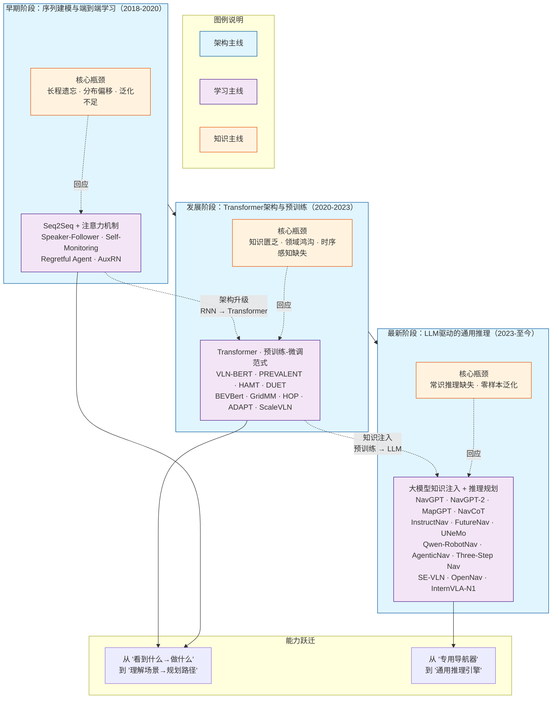

上图从三个维度呈现了 VLN 方法论的完整演进逻辑。
+ **横向（时间轴）** ：从左至右展示了三个递进阶段，每个阶段的核心瓶颈（橙色背景）驱动了该阶段突破方向（紫色背景）的产生。
+ **纵向（能力跃迁）** ：底部展示了两个层次的能力提升——从早期阶段到发展阶段，模型从“反应式的动作预测”进化为“基于场景理解的路径规划”；而从发展阶段到最新研究，模型从“导航任务专用”跃升为“通用推理引擎驱动”。
+ **因果关系**：蓝色箭头表示阶段间的推进关系（每一阶段的局限催生了下一阶段的突破）；紫色虚线箭头表示能力跃迁的累积效应（新阶段继承了前一阶段的基础能力并叠加新的突破）。三阶段的演进并非“替代”而是“叠加”——最新阶段的 LLM 方法仍保留了前两阶段的架构基础和学习范式。

传统 VLN 研究主要聚焦于“如何在给定的导航数据上训练一个更好的模型”——这体现在架构层面（设计更有效的跨模态融合机制）和学习层面（设计更高效的策略优化算法）。然而，基础模型的兴起从根本上扩展了这一问题空间。研究者的关注点从“**如何在有限数据上学得更好**”转向了“**如何将模型中已经蕴含的无限知识引导到导航任务中**”。这种转变催生了一系列新方向，包括通用视觉与语言表示的跨任务预训练、基于 LLM 的高层任务规划与常识推理、以及从仿真环境到真实世界的零样本泛化等任务。

本章将沿着“架构—学习—知识”三条主线交织的演进脉络，系统介绍 VLN 方法的完整发展历程。每阶段先阐述理论原理与代表性方法，再配备贯穿式的动手实践——从早期基于 Seq2Seq 的行为克隆，到基于 DUET 的跨模态预训练与双尺度决策，再到基于 InternVLA-N1 的双系统零样本导航——帮助读者在理解“为何这样做”的同时，亲身体验“效果如何”。

# 2 序列建模与端到端学习

## 2.1 早期VLN模型的主要挑战

2018 年，Anderson 等人在 CVPR 上提出 **Room-to-Room（R2R）** 数据集，并首次给出了适用于视觉语言导航的 **Seq2Seq** 基线模型，标志着 VLN 正式进入基于真实三维环境的规模化研究阶段。该模型借鉴机器翻译中的编码器—解码器（Encoder–Decoder）框架，将自然语言指令编码为语义表示，再结合当前视觉观测逐步预测导航动作，首次实现了真实室内环境中的端到端导航，为后续研究奠定了基本技术路线。

然而，随着研究不断深入，研究者发现 Seq2Seq 模型在复杂导航任务中的性能提升很快遇到瓶颈。尤其是在长距离导航、未知环境测试以及连续决策场景下，模型普遍存在导航成功率下降、误差累积和泛化能力不足等问题。综合来看，这些问题主要体现在三个方面：
- **1）长程依赖建模能力不足**：Seq2Seq 模型通常采用 RNN/LSTM/GRU 作为语言编码器和动作解码器，通过隐藏状态对导航指令、视觉观测和历史动作进行压缩表示。然而，受限于固定维度的循环状态，模型难以长期保存不断增长的历史信息。随着导航步骤增加，早期指令中的关键语义逐渐衰减，导致模型难以持续关注全局目标。例如，在执行“走出卧室，沿走廊前进，在尽头左转，再经过餐厅到达厨房”这类长距离指令时，模型可能能够完成局部动作，却容易遗忘后续目标而偏离路径。因此，如何有效建模导航过程中的长程依赖关系，成为早期 VLN 模型面临的重要挑战。
- **2）训练与测试阶段的分布偏移**：早期 Seq2Seq 方法主要采用教师强制（Teacher Forcing）进行训练，即利用真实历史动作指导模型学习下一步决策。然而，在实际测试过程中，智能体只能依靠自身预测动作进行导航。当某一步出现预测错误时，模型将进入训练阶段未见过的状态，后续决策会基于错误轨迹持续累积偏差，这一现象称为**暴露偏差（Exposure Bias）**。由于 VLN 是典型的长序列决策任务，局部动作误差会不断放大，最终导致整体导航失败。因此，如何减少训练—测试分布差异，提高模型自主决策稳定性，是提升导航性能的关键问题。
- **3）跨环境泛化能力有限**：VLN 的目标是在未知环境中依据语言指令完成导航，而早期 Seq2Seq 模型主要依赖有限规模的监督数据学习视觉—语言—动作之间的映射关系，容易对训练环境中的视觉特征和空间布局产生过拟合。当测试环境中的建筑结构、物体布局或光照条件发生变化时，模型性能往往显著下降。其根本原因在于，模型更多学习了视觉外观与动作之间的统计关联，而缺乏对语言语义、空间关系和导航规律的深层理解。因此，提高模型的跨环境泛化能力成为后续 VLN 研究的重要方向。

Seq2Seq 模型面临的三项挑战本质上均源于**模型表示能力和学习方式的局限性**：一方面，循环神经网络难以有效建模长距离依赖，限制了复杂导航任务中的信息保持能力；另一方面，教师强制训练导致训练与测试阶段存在分布差异，而有限的数据规模又进一步削弱了模型的环境泛化能力。针对这些问题，初期的 VLN 研究主要沿着两条技术路线展开：**一是改进模型结构，提高视觉、语言与历史信息的建模能力；二是优化学习策略，通过数据增强、辅助监督和决策优化等方法缩小训练与测试之间的分布差异，提高模型在未知环境中的导航性能。** 下图总结了这一阶段研究的发展脉络。

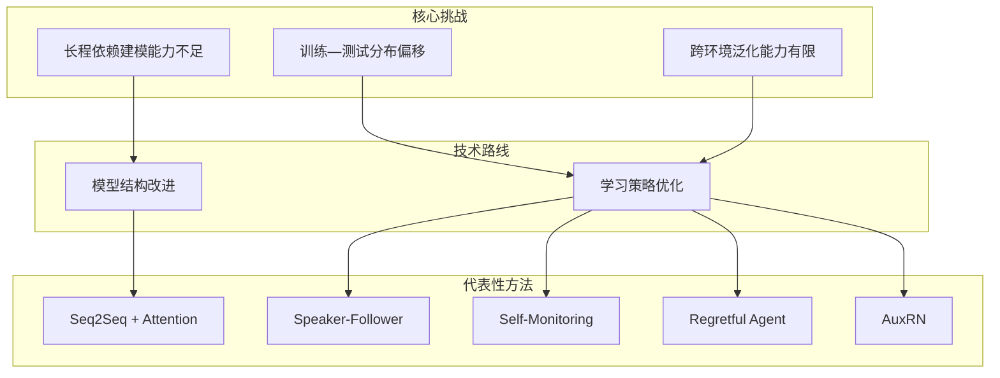
图中顶部概括了 Seq2Seq 模型面临的三项核心挑战，即长程依赖建模能力不足、训练与测试阶段的分布偏移以及跨环境泛化能力有限；中部将后续研究归纳为**模型结构改进**和**学习策略优化**两条主要技术路线；底部列出了这一阶段具有代表性的工作。其中，注意力机制主要改善模型的信息表示能力，Speaker-Follower 利用数据增强缓解分布偏移，而 Self-Monitoring、Regretful Agent 和 AuxRN 等方法则分别从导航进度感知、可学习回溯和辅助监督等角度进一步提升模型的决策能力和泛化性能。后续各节将按照**基线模型→数据增强→决策优化** 的技术演进路线，对这些代表性方法进行详细介绍。


## 2.2 Seq2Seq基线模型与注意力机制

### （1）Seq2Seq基线模型

随着 R2R 数据集的提出，视觉语言导航首次拥有了大规模、标准化的训练与评测平台。为此，Anderson 等人在论文中提出了 **Seq2Seq**（Sequence-to-Sequence）基线模型，将机器翻译领域广泛应用的编码器—解码器（Encoder–Decoder）框架引入视觉语言导航任务，首次实现了**从自然语言指令到导航动作序列的端到端学习**。

<div align="center">
  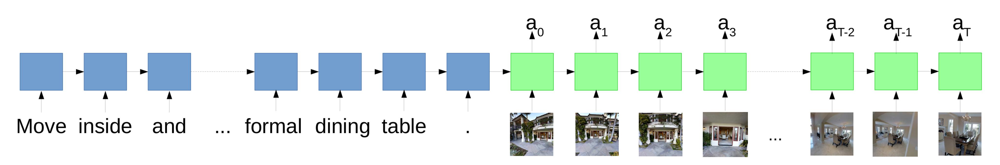
  <p style="margin-top: 5px; color: #555; font-size: 14px;">Seq2Seq模型</p>
</div>


Seq2Seq 模型的基本思想是：**首先将自然语言指令编码为语义表示，再结合当前视觉观测，逐步预测智能体下一步的导航动作。** 在整个导航过程中，模型无需人工设计导航规则，而是直接根据大量“指令—轨迹”示例学习视觉、语言与动作之间的映射关系。Seq2Seq 模型主要由**语言编码器、视觉编码器和动作解码器** 三个模块组成：
- **语言编码器**：语言编码器负责理解导航指令。模型通常采用**双向长短期记忆网络（Bi-LSTM）** 对输入指令进行编码。设输入指令为$I={w_1,w_2,\cdots,w_n}$，经过双向 LSTM 后，可得到每个词对应的上下文表示$$H={h_1,h_2,\cdots,h_n},$$其中，$h_i=[\overrightarrow{h_i};\overleftarrow{h_i}]$表示正向和反向隐藏状态的拼接，因此每个词都能够同时利用前后文信息。
- **视觉编码器**：在导航过程中，智能体每一步都会获得当前环境的视觉观测。R2R 中通常采用 **ResNet-152** 等 ImageNet 预训练网络提取图像特征。由于 Matterport3D 提供的是 **360° 全景图像**，模型需要分别提取多个方向的视觉特征，再组合形成当前时刻的视觉表示。因此，视觉编码器完成了**原始图像到高维视觉语义特征**的转换，为后续动作预测提供环境信息。
- **动作解码器**：动作解码器同样采用 LSTM，在每一个时间步综合利用：①当前视觉特征；②指令表示；③上一步执行动作；④历史隐藏状态；预测下一步导航动作。整个动作生成过程可以表示为$$\pi(A|I,O)=\prod_{t=1}^{T}p(a_t|a_{<t},I,o_t).$$  训练阶段采用**教师强制（Teacher Forcing）** 策略，即每一步输入真实动作作为下一步的历史动作，并利用交叉熵损失优化模型参数。

总体来看，Seq2Seq 模型建立了 VLN 最基本的技术框架：**语言编码—视觉感知—动作预测** 。这一框架后来几乎成为所有 VLN 模型的共同基础。然而，Seq2Seq 仍存在一个明显局限：**整个导航过程中始终使用同一个固定的指令表示。** 换言之，无论智能体刚刚起步，还是已经走到走廊尽头，它读取的都是同一份压缩后的语义向量。这意味着模型无法根据当前位置动态调整对指令不同部分的关注程度，也容易造成长指令信息的遗忘。

### （2）注意力机制的引入

注意力机制的核心思想可以概括为一句话：**模型在每一步导航时，都能够重新阅读整条导航指令，并自动关注当前最相关的内容。** 例如，对于如下导航指令：**"走出卧室，沿走廊直行，在书架前左转，然后进入厨房。"** 智能体刚离开卧室时，应重点关注"**走出卧室**"；当到达走廊尽头时，应更多关注"**书架前左转**"；进入厨房附近后，则主要关注最后一句"**进入厨房**"。显然，不同导航阶段需要关注的语言信息并不相同。为实现这一目标，注意力机制不再只使用编码器最后输出的固定向量，而是保留编码器所有隐藏状态$H={h_1,h_2,\cdots,h_n}$，并在导航的每一步，根据当前解码器状态计算各词的重要程度。首先计算当前导航状态与每个词之间的相关性：$$e_{t,i}=\text{score}(h_{t-1}^{dec},h_i^{enc}),$$
随后利用 Softmax 得到注意力权重$$\alpha_{t,i}=\frac{\exp(e_{t,i})}{\sum_j\exp(e_{t,j})},$$最后根据权重得到当前时刻的动态语言表示$$c_t=\sum_i\alpha_{t,i}h_i^{enc},$$其中，权重越大的词，对当前动作预测的影响越大。

由此可以看出，注意力机制使模型由"**一次理解整条指令**"转变为"**边走边阅读指令**"，突破了 Seq2Seq 固定语义向量的信息瓶颈，使模型能够**动态关注语言、选择视觉区域，并建立跨模态对应关系**，显著提高了长指令理解能力和导航决策质量。

## 2.3 数据增强策略：语言生成与视觉编辑

注意力机制主要从**模型结构**出发缓解了长程信息遗忘问题。然而，VLN 研究很快发现，仅改进网络结构并不能彻底解决模型泛化能力不足的问题。其根本原因在于：**训练数据覆盖的状态空间十分有限**。采用教师强制训练时，智能体始终沿着人工示范轨迹学习，很少接触因自身决策失误而产生的偏离状态；而测试阶段，模型必须完全依赖自身预测，一旦偏离参考路径，就容易进入训练过程中从未见过的状态，从而产生误差累积。

因此，研究者开始将关注点从**模型结构设计**转向**训练数据构建**。其核心思想是：**与其不断修改网络结构，不如扩充训练数据的多样性，让智能体在训练阶段就经历更多环境、更丰富轨迹以及更多语言表达，从而缩小训练与测试之间的分布差异。** 这一时期形成了两条具有代表性的研究路线：一条通过**生成新的语言指令**扩充训练样本，另一条通过**编辑训练环境**增强视觉多样性。

### （1）Speaker-Follower：语言生成驱动的数据增强

<div align="center">
  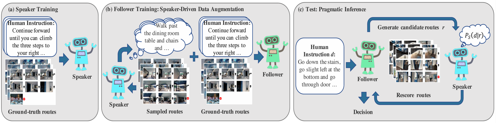
  <p style="margin-top: 5px; color: #555; font-size: 14px;">Speaker-Follower模型</p>
</div>

Speaker-Follower是 VLN 领域最早利用**语言生成进行数据增强**的代表性工作。该方法提出：如果真实标注的导航数据有限，那么可以利用模型自动生成更多的"轨迹—指令"样本，从而扩大训练数据规模，提高模型的泛化能力。整个框架由两个相互协作的模型组成。
- **Follower（导航模型）**：Follower 即普通的 VLN 智能体，根据输入指令和视觉观测预测导航动作，完成从语言到轨迹的映射。
- **Speaker（语言生成模型）**：Speaker 执行与导航相反的任务：给定一条导航轨迹，自动生成能够描述该轨迹的自然语言指令，即完成"轨迹→语言"的逆向映射。

二者形成如下闭环：**环境中采样导航轨迹 → Speaker 自动生成对应指令 → 构成新的"指令—轨迹"训练样本 → 用于继续训练 Follower**。

由于这些轨迹不仅包括人工示范路径，还包含 Follower 在探索过程中产生的各种偏离路径，因此扩充后的训练数据能够覆盖更加丰富的状态空间，使训练分布更加接近测试阶段可能遇到的真实情况，从而有效缓解教师强制带来的分布偏移问题。

除了数据增强之外，Speaker-Follower 还提出了**语用重排序（Pragmatic Re-ranking）** 策略。测试阶段，Follower 首先生成多条候选导航路径；随后 Speaker 分别计算每条路径生成原始指令的概率，并选择与输入指令最一致的路径作为最终结果。这样，导航过程由原来的逐步贪心决策转变为**对完整轨迹进行全局评价**，即使局部动作存在一定误差，也能够依据整条路径与指令的一致性进行修正，从而进一步提高导航成功率。


### （2）EnvEdit：环境编辑驱动的数据增强

虽然 Speaker-Follower 扩充了语言数据，但训练环境本身仍然十分有限。Matterport3D 仅包含几十栋建筑，模型容易记住房间布局、家具颜色等视觉细节，而不是学习真正具有泛化能力的导航策略。

针对这一问题，EnvEdit提出了另一种数据增强思路：**保持环境的空间结构不变，仅改变环境的视觉外观，从而生成大量新的训练场景。** 其核心思想可以概括为一句话：**让同一条导航路径出现在不同外观的环境中，迫使模型学习与视觉风格无关的导航能力。** EnvEdit 主要从三个方面对训练环境进行编辑。
- **风格迁移**：改变房间整体的视觉风格，例如调整墙壁颜色、地板纹理或室内装修风格，使同一空间呈现出完全不同的视觉外观。
- **物体外观编辑**：
修改场景中物体的颜色、材质或纹理，例如将红色沙发改为蓝色，将木质桌面改为玻璃桌面，以减少模型对颜色等低层视觉特征的依赖。
- **物体类别替换**：在保持空间布局基本一致的前提下，将某类家具替换为其他类别，例如将电视替换为书柜、将餐桌替换为办公桌，从而进一步增加环境语义的多样性。

通过上述编辑，智能体能够在保持导航路径基本一致的情况下，观察到大量视觉差异明显的新环境。这种训练方式促使模型更加关注**空间关系、导航语义和目标位置**，而不是记忆某一房间的具体外观，因此显著提高了模型在未见环境中的泛化能力。

### （3）两类数据增强方法的比较

Speaker-Follower 与 EnvEdit 分别代表了 VLN 数据增强的两条主要技术路线，二者具有明显的互补关系。Speaker-Follower 主要从**语言维度**扩充训练数据，通过自动生成新的"轨迹—指令"样本，使模型能够学习更加丰富的语言表达和导航轨迹；EnvEdit 则从**视觉维度**扩充训练环境，在保持空间结构不变的情况下生成大量新的视觉场景，使模型摆脱对训练环境外观的依赖。后续大量工作进一步结合语言生成、环境编辑、数据合成以及生成式人工智能技术，不断扩展训练样本的规模和多样性，为 VLN 模型的跨场景泛化能力提升奠定了重要基础。

## 2.4 导航决策机制的进一步改进

 通过注意力机制和数据增强策略，VLN 模型在长程依赖建模和泛化能力方面取得了重要进展。然而，这些方法主要提升了智能体的**感知与表示能力**，并未从根本上解决导航过程中的**决策问题**。智能体普遍缺乏对导航状态的持续感知与动态评估能力，难以准确判断当前任务进度、是否偏离正确路线以及何时需要修正已有决策。随着研究不断深入，VLN 的研究重点逐渐由**如何看懂环境和理解指令** 转向**如何做出正确决策**。因此，围绕进度估计、回溯搜索、辅助推理等决策机制的研究逐渐兴起，以提高智能体在复杂环境中的自主决策能力和导航成功率。


### （1）Self-Monitoring Agent：导航过程中的自我监控

<div align="center">
  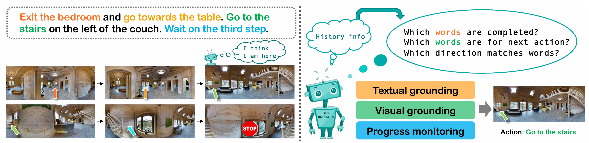
  <p style="margin-top: 5px; color: #555; font-size: 14px;">Self-Monitoring Agent模型</p>
</div>


传统 Seq2Seq 模型每一步仅依据当前视觉观测预测下一动作，而不会主动评估自身导航进度。这意味着模型虽然能够"继续向前走"，却不知道"已经走到哪里"，也无法判断是否正在按照指令逐步完成任务。为解决这一问题，Self-Monitoring Agent提出了**自我监控** 思想，即让智能体在导航过程中持续评估自身状态，使导航不仅包括"决定下一步怎么走"，还包括"判断目前完成到了哪一步"。整个模型主要由两个相互配合的模块组成：
- **视觉—文本协同定位（Visual-Textual Co-grounding）**：该模块负责建立当前视觉观测与导航指令之间的对应关系，根据当前位置动态关注最相关的指令片段，从而判断哪些内容已经完成、哪些内容仍需执行，并预测下一步的移动方向。
- **进度监控器（Progress Monitor）**：进度监控器用于估计当前任务完成程度，即预测智能体已经完成整个导航任务的百分比。例如，当模型判断当前完成约 60% 的导航时，说明仍有部分路径尚未执行。

由于协同定位提供"**当前位置对应哪段指令**"，而进度监控提供"**当前完成了多少任务**"，两者能够形成相互验证机制。当视觉定位结果与进度估计出现明显不一致时，模型能够及时调整注意力分配，从而减少导航偏离。

### （2）Regretful Agent：可学习的回溯决策

尽管 Self-Monitoring Agent 能够估计导航进度，但它仍然采用"一步一步向前"的决策方式。一旦进入错误路径，即使发现方向不正确，也只能继续向前搜索，很难主动返回之前的关键节点。现实生活中，人类导航通常会不断进行自我修正。例如，当发现前方不是目的地时，会立即折返到上一个路口重新选择方向。Regretful Agent借鉴启发式搜索思想，提出了**可学习回溯（Learnable Backtracking）** 机制，使智能体能够根据当前导航状态自主决定："继续前进"还是"返回之前的位置重新规划"。模型主要包含两个核心模块。
- **后悔模块（Regret Module）**：后悔模块根据当前导航状态以及进度估计结果，判断继续前进是否仍有希望完成任务。如果预测当前方向已经明显偏离目标，则主动触发回溯操作，而不是继续沿错误方向移动。
- **进度标记（Progress Marker）**：模型在探索过程中，为已经访问过的方向记录对应的导航进度。当再次到达相同位置时，可以快速判断哪些方向已经探索过、哪些方向尚未尝试，从而避免重复搜索，提高探索效率。

Regretful Agent 的提出，使 VLN 从简单的序列预测逐渐演化为**图搜索问题**。模型不再局限于局部最优决策，而能够利用历史信息不断修正导航策略，因此显著降低了误差累积带来的性能下降。

与此同时，该方法还解决了 VLN 的一个典型矛盾：**集束搜索（Beam Search）虽然成功率较高，但路径通常较长；贪婪搜索路径较短，却容易陷入局部最优。** Regretful Agent 通过可学习回溯，在保持较短路径长度的同时获得了更高的导航成功率，为后续搜索式导航方法提供了重要参考。

### （3）AuxRN：辅助推理增强导航能力

随着导航模型不断发展，研究者逐渐认识到，仅依靠导航动作监督，模型学习到的信息仍然十分有限。事实上，在导航过程中，智能体还需要理解环境结构、估计导航进度、判断方向是否正确以及验证轨迹是否符合指令，这些信息都蕴含着丰富的训练信号。AuxRN（Auxiliary Reasoning Navigation）因此提出：**将导航过程中隐含的认知能力显式设计为多个辅助推理任务，与主导航任务联合学习。** 整个框架设计了四类辅助任务。
- **轨迹复述（Trajectory Retelling）**：根据已经执行的导航轨迹，重新生成对应的自然语言描述，使模型能够理解自身刚刚完成了哪些动作。
- **进度估计（Progress Estimation）**：预测当前导航已经完成整个任务的百分比，加强模型对长期导航状态的理解。
- **方向预测（Orientation Prediction）**：根据当前环境判断下一步应转向的方向，提高空间方向推理能力。
- **轨迹一致性判断（Trajectory Consistency）**：判断当前导航轨迹是否符合原始导航指令，从而增强视觉与语言之间的一致性学习。

这些辅助任务虽然在测试阶段并不直接参与导航决策，但能够在训练过程中持续提供额外监督信号，使模型学习到更加丰富的语义表示和空间知识。因此，AuxRN 不仅提升了导航性能，也进一步增强了模型在未见环境中的泛化能力。


## 2.5 Seq2Seq 模型实践
> **实践定位**：在原始 R2R 离散导航环境中运行 Seq2Seq 基线，理解“指令编码—视觉感知—动作预测”的基本流程，并比较模型在已见环境与未见环境中的表现。

### （1）实践目标
1. 配置 Matterport3D Simulator 和 R2R 数据集；
2. 运行 R2R 官方提供的简单基线，验证环境和数据配置；
3. 训练并评估带注意力机制的 Seq2Seq 模型；
4. 比较 `val_seen` 与 `val_unseen` 上的导航误差和成功率，分析模型的跨环境泛化能力；
5. 查看预测轨迹，归纳提前停止、错误转向和路径偏离等典型失败模式。

### （2）实验条件

本实践建议在 Ubuntu 20.04/22.04 环境中完成。学生需要具备基本的 Python、PyTorch 和 Linux 命令行基础。Matterport3D 场景数据需要提前申请授权；若课程时间有限，可由教师统一准备场景数据、R2R 标注和预提取视觉特征。

建议配置如下：

+ NVIDIA GPU（仅运行简单基线时可不使用 GPU）；
+ 8 GB 以上内存；
+ 约 15 GB 可用磁盘空间；
+ Conda 或其他 Python 虚拟环境管理工具。

### （3）安装 Matterport3D Simulator

```bash
# 1. 创建实验环境
conda create -n r2r-seq2seq python=3.8 -y
conda activate r2r-seq2seq

# 2. 克隆仓库。必须包含 --recursive，以同时取得 pybind11 子模块
git clone --recursive https://github.com/peteanderson80/Matterport3DSimulator.git
cd Matterport3DSimulator

# 3. 安装 R2R 基线所需的 Python 依赖
pip install -r tasks/R2R/requirements.txt
```

Matterport3D Simulator 支持普通 OpenGL、EGL 离屏 GPU 和 OSMesa 离屏 CPU 三种渲染方式。课堂服务器通常没有桌面显示环境，建议采用 EGL：

```bash
mkdir -p build
cd build
cmake -DEGL_RENDERING=ON ..
make -j4
cd ..

# 将编译得到的 Python 模块加入搜索路径
export PYTHONPATH="$(pwd)/build:${PYTHONPATH}"
```

若使用带桌面的本地 Ubuntu，也可以将编译命令改为 `cmake ..`。安装完成后执行：

```bash
./build/tests '~Timing'
```

除计时测试外其余测试通过，说明模拟器编译基本正确。

### （4）准备 Matterport3D 场景和 R2R 数据

1. 在 Matterport3D 官方页面申请数据使用权限；
2. 至少下载 `matterport_skybox_images`；
3. 将各场景目录放入 `data/v1/scans/`；
4. 从仓库根目录下载 R2R 标注：

```bash
./tasks/R2R/data/download.sh
```

完成后的关键目录应类似于：

```text
Matterport3DSimulator/
├── build/
├── connectivity/
├── data/v1/scans/
│   ├── 17DRP5sb8fy/
│   └── ...
├── img_features/
└── tasks/R2R/data/
    ├── R2R_train.json
    ├── R2R_val_seen.json
    └── R2R_val_unseen.json
```

R2R 基线默认使用预提取的 ResNet-152 全景特征。若 `img_features/` 中没有相应 TSV 文件，应按照仓库 README 下载官方预提取特征并放入该目录。此时模型读取的是预提取特征，不需要在训练过程中反复运行 ResNet。

### （5）先运行简单基线

在训练神经网络之前，先执行：

```bash
python3 tasks/R2R/eval.py
```

该命令会运行并评价三种无学习基线：

+ `StopAgent`：停留在起点；
+ `RandomAgent`：随机选择方向并移动；
+ `ShortestAgent`：利用真实目标位置沿最短路径移动，用作性能上界和监督信号来源。

若终端能够分别输出不同数据划分上的评价结果，说明模拟器、导航图、R2R 标注和评价程序已经连通。若此步失败，不应继续训练模型。

### （6）Seq2Seq 模型与官方代码对应关系

R2R 官方基线不是本节前面展示的四动作概念模型，而是面向候选 viewpoint 进行决策的注意力 Seq2Seq。主要代码位于：

| 文件 | 作用 |
|---|---|
| `tasks/R2R/model.py` | 指令编码器、注意力机制和动作解码器 |
| `tasks/R2R/agent.py` | 智能体 rollout、候选动作选择与轨迹保存 |
| `tasks/R2R/env.py` | R2R 数据、预提取视觉特征与模拟器封装 |
| `tasks/R2R/train.py` | 训练、验证和模型保存入口 |
| `tasks/R2R/eval.py` | 导航轨迹评价 |

阅读代码时重点跟踪以下数据流：

> 指令 Token → LSTM 编码器 → 当前全景候选特征 → 注意力解码器 → 候选 viewpoint 概率 → 执行动作并更新隐藏状态。

与连续控制中的“前进、左转、右转”不同，原始 R2R 的动作是从当前节点可到达的候选 viewpoint 中选择下一个节点，或者输出 STOP。

### （7）训练与验证

从仓库根目录运行：

```bash
python3 tasks/R2R/train.py
```

官方入口默认使用 student forcing 训练 Seq2Seq。首次课堂实践不要求修改网络结构。训练时间取决于 GPU 和脚本中的迭代次数；为缩短课堂时间，教师可提前提供 checkpoint，或让学生在 `train.py` 中减少训练迭代数，完成小规模流程验证。

训练过程中应记录：

+ 训练损失是否总体下降；
+ `val_seen` 和 `val_unseen` 的导航误差；
+ 两个验证集上的成功率；
+ 最优模型和预测轨迹的保存位置。

### （8）结果分析

填写下表，并以实际程序输出为准：

| 数据划分 | Navigation Error（m）↓ | Success Rate（%）↑ |
|---|:---:|:---:|
| `val_seen` |  |   |
| `val_unseen` |  |  |

通常情况下，模型在 `val_unseen` 上的表现会低于 `val_seen`，这主要反映跨环境泛化能力的下降。该比较不能单独证明教师强制导致的暴露偏差；暴露偏差可在后续实验中通过 teacher forcing 与 student forcing 的对照进一步研究。

从保存的预测轨迹中选择至少三个失败案例，回答：

1. 智能体在哪个节点首次偏离参考路径？
2. 偏离是否发生在方向词、地标或停止位置附近？
3. 偏离后模型能否重新回到正确路径？
4. 失败更可能来自指令理解、视觉匹配还是误差累积？

### （9）完成标准

满足以下条件视为完成本实践：

1. `./build/tests '~Timing'` 通过；
2. `python3 tasks/R2R/eval.py` 能输出简单基线结果；
3. Seq2Seq 能完成至少一次训练—验证流程；
4. 提交 `val_seen`、`val_unseen` 的结果表以及三个失败案例分析。

### （10）常见问题

+ **找不到 `MatterSim`**：检查是否在仓库根目录执行了 `export PYTHONPATH="$(pwd)/build:${PYTHONPATH}"`。
+ **找不到场景图像**：检查 `data/v1/scans/<scan_id>/` 是否存在，并确认下载了 `matterport_skybox_images`。
+ **服务器上出现 OpenGL 或 DISPLAY 错误**：重新使用 `cmake -DEGL_RENDERING=ON ..` 编译。
+ **找不到图像特征 TSV**：按照官方 README 下载 ResNet-152 预提取特征，放入 `img_features/`。
+ **旧版依赖与当前 PyTorch 不兼容**：优先使用教师提供的固定环境或 Docker 镜像，不要随意升级依赖。


# 3 Transformer架构与预训练

## 3.1 架构与范式的双重变革

随着VLN任务逐渐向长指令、复杂环境和开放场景发展，RNN在建模能力和训练效率上的局限日益突出，推动视觉语言导航进入以Transformer为基础的视觉语言预训练阶段前进。该阶段的发展主要受到三个因素的共同驱动：
- **Transformer取代RNN，重构跨模态建模方式。** Seq2Seq模型依赖循环结构逐步传播信息，历史信息需要经过多个时间步不断传递，容易造成长距离依赖信息衰减，同时训练过程无法充分并行。Transformer利用自注意力机制，使任意位置之间都能够直接建立联系，实现视觉信息、语言信息以及历史状态之间的全局交互，从根本上突破了RNN的信息瓶颈。与此同时，Transformer天然支持GPU并行计算，在模型规模不断扩大的背景下展现出更高的训练效率和更好的扩展能力。
- **预训练—微调范式缓解数据稀缺问题。** 与自然语言处理和计算机视觉相比，VLN高质量导航数据规模较小，模型容易过拟合于有限训练环境，导致跨场景泛化能力较弱。预训练模型首先利用海量图文数据学习通用视觉语义知识，再利用少量导航数据进行任务微调，使模型能够继承丰富的跨模态知识，大幅提高样本利用效率和泛化性能。随着VLN专用预训练模型的提出，预训练逐渐成为该领域的标准训练范式。
- **模型能力由跨模态融合走向历史与空间理解。** Transformer解决了长程依赖问题，但导航任务不仅要求理解当前视觉内容，还需要持续记忆历史轨迹、理解空间结构并规划未来路径。因此，研究重点逐渐由简单的视觉—语言融合扩展到历史状态建模、空间地图建模以及场景语义理解等更高层次的能力，使VLN模型逐步具备更强的长期决策能力和复杂环境适应能力。

围绕上述三个驱动力，该阶段形成了两条相互交织的发展主线。一条主线围绕**Transformer架构演进**展开，从Transformer引入、历史状态建模到空间理解和统一架构设计，不断提升模型的表示能力与决策能力；另一条主线围绕**预训练策略演进**展开，从通用视觉语言预训练逐步发展到面向导航任务的领域预训练和任务专用预训练，不断提高模型的知识迁移能力和泛化性能。


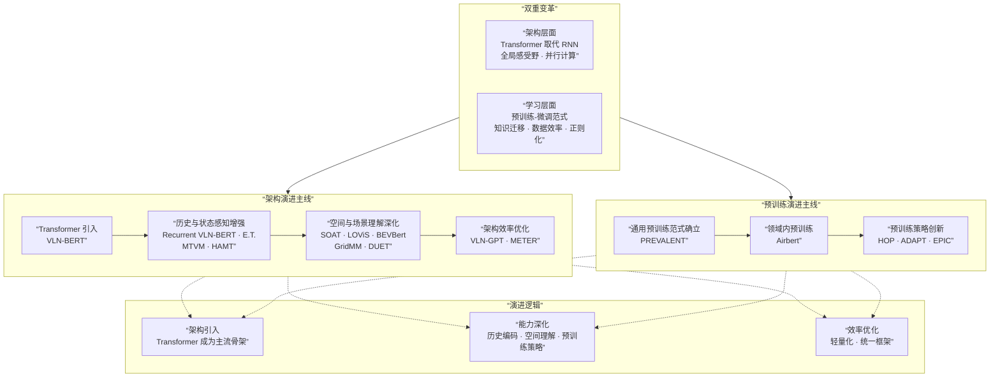

上图展示了该阶段的整体技术发展脉络。两条主线并非独立演进，而是在多个点上相互支撑——例如，历史感知模型（Recurrent VLN-BERT、HAMT）和空间理解模型（DUET）均受益于预训练提供的良好初始化。以下各节将沿着这两条主线，系统介绍该阶段的核心模型与技术贡献。


## 3.2 Transformer架构的引入

该阶段**Transformer 架构成为 VLN 的主流模型，同时预训练—微调范式逐渐取代传统端到端训练**。这一发展并非一蹴而就，而是经历了三个相互衔接的步骤：首先，将 Transformer 引入导航模型，建立统一的视觉—语言表示；随后，构建面向 VLN 的专用预训练任务，使模型能够在导航场景中学习跨模态知识；最后，进一步缩小通用图文数据与导航场景之间的领域差异，使预训练知识能够更加有效地迁移到实际导航任务中。


### （1）VLN-BERT：Transformer正式进入VLN领域

Transformer 的引入标志着 VLN **从循环神经网络迈向全局建模架构**。与早期阶段依赖 LSTM 顺序处理信息不同，Transformer 采用 **自注意力（Self-Attention）** 机制，使指令中的任意词语、历史观测以及当前视觉信息都能够直接建立联系，其基本形式为$$\text{Attention}(Q,K,V)
=\text{softmax}\left(\frac{QK^{T}}{\sqrt{d_k}}\right)V.$$相比 RNN，自注意力具有两个显著优势：
- **全局建模能力：** 每个词语都能够直接关注整个指令序列以及所有视觉特征，不再依赖长距离的信息传递，从根本上缓解了长程依赖问题。
- **并行计算能力：** 所有位置可以同时计算注意力，大幅提高了模型训练效率，也使更深、更大的网络成为可能。

**VLN-BERT** 是最早将 BERT 架构系统应用于视觉语言导航的代表性工作。该模型将语言 Token 与全景视觉特征统一输入 Transformer，在同一网络中完成跨模态信息融合，并输出导航决策。相比传统 Seq2Seq 模型，VLN-BERT 不再采用"语言编码器—动作解码器"的串行结构，而是利用 Transformer 建立视觉与语言之间更加充分的交互关系，为后续 Transformer 模型奠定了统一的架构基础。

### （2）PREVALENT：VLN预训练范式的建立

Transformer 提供了新的网络架构，但仅依赖有限的导航数据进行训练，仍然难以充分发挥其表示能力。为此，研究者进一步提出 **预训练—微调（Pre-training & Fine-tuning）** 的学习范式，其中最具代表性的工作便是 **PREVALENT（Pre-training for Vision-and-Language Navigation）**。PREVALENT 的核心思想是：**首先利用大规模导航相关数据进行预训练，再针对具体 VLN 任务进行微调**。借鉴通用视觉语言预训练，它围绕导航任务设计了更加符合决策过程的代理任务，包括：
- **掩码语言建模**：结合视觉观测预测被遮盖的词语，提高语言理解能力。
- **动作预测（Action Prediction，AP）**：根据当前视觉信息和语言上下文预测下一步动作，使模型在预训练阶段便学习导航决策规律。

其中，动作预测是 PREVALENT 最具代表性的创新。模型不仅学习"图像与文字是否对应"，还学习"面对当前环境应该采取什么动作"，使预训练知识能够直接迁移到导航决策中。


### （3）Airbert：领域预训练提升知识迁移能力

**通用图文数据与导航场景之间存在明显的领域差异**。例如，网络图文数据多关注物体识别和图像描述，而 VLN 更强调连续空间、场景切换以及路径语义。因此，仅依赖通用预训练仍难以获得最佳效果。针对这一问题，**Airbert** 提出了 **领域内预训练（In-domain Pre-training）** 的思想。其核心做法是构建大规模 **BnB（Bed-and-Breakfast）** 数据集，从真实房屋租赁平台自动收集室内图像序列及对应描述，使预训练数据在场景结构、视觉风格和语言表达上更加接近导航任务。为了进一步学习导航场景中的跨模态关系，Airbert 在预训练阶段设计了三个代理任务：
- **掩码语言建模（MLM）**：学习视觉与语言之间的语义对应关系。
- **图像—文本匹配（Image-Text Matching，ITM）**：判断轨迹与指令是否匹配，强化整体语义一致性。
- **轨迹顺序学习（Shuffling Loss）**：判断图像序列是否被打乱，学习导航过程中连续观测与语言描述之间的时序对应关系。

与 PREVALENT 相比，Airbert 的重点不再是设计新的导航任务，而是**缩小预训练数据与目标任务之间的领域鸿沟**。这一工作表明，预训练模型不仅需要"规模更大"，还需要"数据更接近导航场景"，进一步推动了 VLN 从通用视觉语言预训练向领域专用预训练的发展。

## 3.3 历史状态建模能力的增强

Transformer 的引入显著提升了视觉语言信息的全局建模能力，但**标准 Transformer 并不能天然解决导航过程中的历史状态建模问题**。导航本质上属于序贯决策任务，智能体不仅需要理解当前观测，还需要持续记忆已经走过的路径、已经完成的指令以及尚未完成的目标。若仅依据当前观测进行决策，即使拥有强大的跨模态表示能力，也容易出现重复探索、方向混淆或遗忘历史等问题。因此，**如何在 Transformer 中有效维护导航历史状态，成为该阶段的重要研究方向。**

### （1）Recurrent VLN-BERT：循环状态表示

最早的解决思路是在 Transformer 中重新引入**状态记忆**。代表性工作 **Recurrent VLN-BERT** 提出了**循环状态 Token** 机制，在每一步导航结束后，将当前历史信息压缩为一个状态表示，并作为下一时刻 Transformer 的输入，即$$s_t=f(s_{t-1},v_t,I;\theta),$$其中，$s_{t-1}$ 表示上一时刻的历史状态，$v_t$ 表示当前视觉观测，$I$表示导航指令。

这种方法实际上借鉴了 RNN 的思想，但将历史压缩过程放入 Transformer 框架之中。相比完全无状态的 Transformer，它能够持续维护导航上下文，在保持较低计算开销的同时增强历史感知能力。然而，由于所有历史信息最终都被压缩到单一状态向量中，随着导航过程不断延长，仍然可能出现信息丢失的问题。

### （2）Episodic Transformer 与 MTVM：完整历史建模

为了避免历史信息压缩带来的损失，研究者进一步提出**完整历史编码（Full History Encoding）** 的思想。代表性工作 **Episodic Transformer（E.T.）** 不再保留单一状态向量，而是将整个导航过程中产生的视觉观测、动作序列以及语言信息共同输入 Transformer，使模型能够直接关注历史中的任意时刻。这一设计充分发挥了 Transformer 长距离建模的优势，使模型能够根据完整历史重新建立跨时间的信息关联。在 ALFRED 等长时程任务中，该方法显著提升了复杂指令执行能力，也证明了完整历史建模对于长期导航的重要价值。

然而，随着导航过程不断延长，完整历史编码带来的计算量和存储开销也迅速增加。为此，**MTVM（Multimodal Transformer with Variable-length Memory）** 提出了**可变长度记忆库（Variable-length Memory）** 机制。模型不再固定保存全部历史，而是根据导航过程动态维护记忆内容，在保留关键历史信息的同时控制计算复杂度，从而实现了历史信息保真度与模型效率之间的平衡。

### （3）HAMT：层级化历史建模

随着导航任务复杂度不断提高，仅依赖简单的历史缓存已经难以满足长时程决策需求。**HAMT（History-Aware Multimodal Transformer）** 将历史建模进一步发展为**层级化历史表示（Hierarchical History Modeling）**。HAMT 不再压缩历史状态，而是完整保存导航历史，并按照不同时间尺度进行建模。其中，**局部历史编码器**重点关注最近几步的视觉观测和动作信息，为当前动作决策提供直接依据；**全局历史编码器**则通过跨时间注意力机制，在整个导航轨迹上建立长距离依赖关系，使模型能够综合考虑早期观测、中间状态与当前环境之间的联系。

除历史编码外，HAMT 还引入多任务自监督学习，在导航训练过程中联合优化掩码语言建模（MLM）、掩码视觉建模（MRM）、空间关系预测（SPREL）以及图文匹配（ITM）等辅助任务，使历史表示不仅记录轨迹信息，同时蕴含更加丰富的视觉语义和空间知识。HAMT 表明，历史信息不仅需要"记住"，更需要按照不同时间尺度进行组织和表达，从而为复杂导航提供更加稳定的决策依据。

## 3.4 空间理解与地图表示的深化

Transformer 与预训练技术提升了模型的跨模态建模能力，但视觉语言导航本质上仍然是一个**空间决策问题**。智能体不仅需要理解指令中的语义信息，还需要持续回答三个关键问题：**当前位于何处（Where am I）、周围环境是什么（What is around me）、下一步应前往哪里（Where should I go）**。然而，早期 Transformer 模型主要关注视觉与语言的语义对齐，通常将环境表示为一组离散的视觉特征，对场景结构、空间关系以及历史探索信息的建模仍较为有限。因此，研究重点逐渐由“视觉—语言对齐”进一步扩展到“空间—语言对齐”，更加注重将空间结构建模与导航决策相结合。

### （1）SOAT：场景与物体感知的分离建模

早期 VLN 模型通常使用统一的视觉编码器提取环境特征，但现实导航指令往往同时包含**场景级信息**和**物体级信息**。例如，“穿过客厅后走向餐桌旁的红色椅子”既涉及场景切换，也涉及具体目标物体。如果将两类信息混合编码，模型容易忽略它们在导航中的不同作用。**SOAT（Scene- and Object-Aware Transformer）** 针对这一问题提出场景与物体分离建模框架。其核心思想是分别提取环境中的场景语义和物体语义，再通过 Transformer 进行融合：
- **场景编码器**负责识别当前所处的环境类型（如卧室、厨房、走廊等），提供全局语义上下文；
- **物体编码器**负责检测视野中的关键物体及其属性（类别、颜色、位置等），提供细粒度目标信息。

这种分离式设计使模型能够同时利用“在哪里”和“看到了什么”两类信息。当指令包含复杂的场景转换与目标指代时，SOAT 能够建立更加清晰的视觉—语言对应关系，从而提升导航决策的准确性。

### （2）LOViS：朝向信息与视觉信息的解耦表示

除了场景和物体语义外，导航还高度依赖**方向信息**。然而，许多 Transformer 模型将视觉内容与朝向信息编码在同一特征空间中，导致模型难以区分“看见了什么”和“朝向哪里”。例如，在“看到红色沙发后向左转”的指令中，“红色沙发”属于视觉语义信息，而“左转”属于空间方向信息。如果两者被混合表示，模型容易产生歧义。**LOViS（Learning Orientation and Visual Signals）** 提出了显式解耦的建模思路，通过两个独立模块分别处理视觉内容和方向信息：
- **视觉模块**负责编码场景和物体特征，用于理解环境内容；
- **朝向模块**负责编码当前视角及方向变化，用于理解空间动作指令。

通过这种结构，模型能够更加准确地建立方向词与视觉观测之间的对应关系，从而提升对复杂空间指令的理解能力。LOViS 的工作表明，在导航任务中显式建模朝向信息是提高空间推理能力的重要途径。

### （3）DUET：全局规划与局部决策的协同建模

<div align="center">
  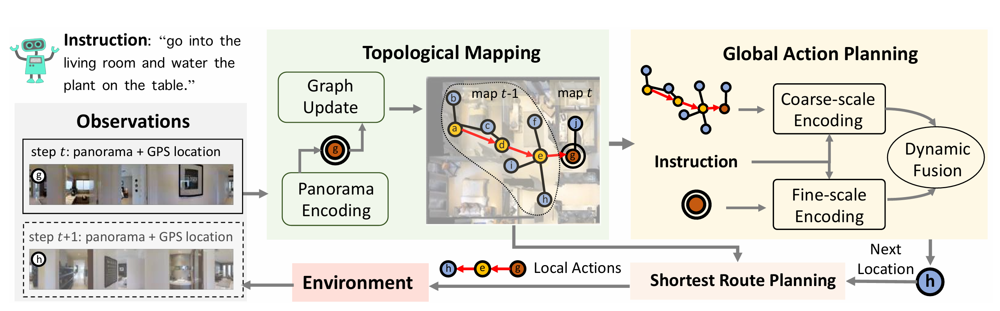
  <p style="margin-top: 5px; color: #555; font-size: 14px;">DUET模型</p>
</div>

随着环境规模不断增大，仅依赖当前观测进行决策已难以满足导航需求。智能体既需要理解局部环境细节，又需要掌握全局空间结构。如何在两种尺度之间建立联系，成为这一阶段的重要研究问题。**DUET（Dual-scale Graph Transformer）** 提出了“**全局规划、局部执行**”的双尺度建模框架。其核心思想是在两个空间尺度上同时进行推理：**1）粗粒度图编码器**在整个拓扑地图上进行全局推理，捕获节点之间的长期空间关系；**2）细粒度编码器**对当前位置的全景视图和物体特征进行精细分析，完成局部决策。最终，模型通过可学习的融合机制综合全局与局部信息：$$s_i=\alpha s_i^{c}+(1-\alpha)s_i^{f},$$其中 $s_i^{c}$ 表示全局空间表示，$s_i^{f}$ 表示局部视觉表示，$\alpha$ 为动态权重。

DUET 的重要意义在于将地图级推理与视角级理解统一到同一框架中，使智能体能够兼顾远程规划与即时决策。这一思想随后被大量工作借鉴，成为现代 VLN 模型的重要设计范式。

### （4）BEVBert：拓扑地图与度量地图的联合表征

虽然拓扑图能够描述环境中“哪些位置彼此连通”，但其缺乏精确的距离和方位信息；相反，度量地图能够提供精细几何结构，却难以支持大范围规划。两种地图各有优势，也各有局限。**BEVBert** 提出将二者结合的混合地图表示方式，在统一框架下同时学习拓扑结构与几何结构：
- **局部度量地图**记录周围环境的精确空间信息，用于短程导航和避障；
- **全局拓扑地图**记录环境整体连通关系，用于长期路径规划。

模型在预训练阶段同时学习两种地图表征，使其能够在导航过程中根据任务需求灵活切换不同尺度的信息来源。BEVBert 的核心贡献在于指出：导航并不存在唯一正确的空间表示形式。高效导航往往需要拓扑推理与几何推理协同工作，这一思想推动了后续地图学习研究的发展。

### （5）GridMM：显式环境记忆地图的构建

前述方法虽然增强了空间表示能力，但大多数仍以隐式特征向量保存历史信息。随着任务规模扩大，单纯依靠隐式记忆逐渐难以维持完整的环境认知。**GridMM（Grid Memory Map）** 将导航历史显式组织为一个持续扩展的二维网格地图。其核心思想是将智能体在探索过程中获得的视觉观测统一投影到同一空间坐标系中，从而构建结构化环境记忆：
- 历史全景观测被映射到网格地图对应位置；
- 地图会随着探索范围扩大而动态扩展；
- 每个网格单元同时记录视觉特征和空间占用信息。

这种设计使智能体能够像人类绘制草图地图一样积累环境认知，而不是仅依赖隐藏状态记忆过去的信息。与传统 Transformer 的隐式历史编码相比，GridMM 提供了一种更加直观、可解释的空间记忆形式。在 REVERIE、R2R 等多个基准上，该方法均取得了显著性能提升，也进一步推动了 VLN 从“轨迹建模”向“地图建模”的演进。

## 3.5 面向导航任务的预训练策略优化

前文的工作在预训练任务仍主要借鉴视觉语言理解领域的经典目标，如**掩码语言建模**、**图文匹配** 等。这些任务能够提升模型的语义理解能力，却难以充分刻画导航过程中所需的**时序决策、空间推理和动作规划能力**。因此，研究者开始思考一个新的问题：**预训练目标是否应更加贴近导航任务本身？** 围绕这一问题，大量工作不再局限于通用视觉语言预训练，而是针对 VLN 的导航特点设计新的代理任务，使模型在预训练阶段就能够学习轨迹顺序、动作决策以及细粒度视觉—语言对齐等能力。

### （1）HOP：历史与顺序感知预训练

导航过程具有天然的**时序性**。智能体不仅需要理解当前观测，还需要结合已经走过的路径和未来目标进行决策。然而，传统预训练任务通常关注单帧图像与文本之间的对应关系，对轨迹历史和动作顺序建模不足。**HOP（History-and-Order Aware Pre-training）** 针对这一问题提出历史与顺序感知预训练框架，其核心思想是在标准跨模态预训练任务基础上，引入能够反映导航过程的代理任务，使模型在预训练阶段学习轨迹的时间结构。除传统的掩码语言建模（MLM）和轨迹—指令匹配（Trajectory-Instruction Matching，TIM）之外，HOP 进一步设计了三个导航相关任务：
- **轨迹顺序建模（Trajectory Order Modeling，TOM）**：判断轨迹图像序列是否保持正确的时间顺序；
- **组顺序建模（Group Order Modeling，GOM）**：学习多个指令片段之间的先后关系，提高长指令理解能力；
- **历史动作预测（Action Prediction with History，APH）**：结合历史观测预测下一步动作，增强时序决策能力。

这些代理任务共同强化了模型对轨迹演化过程的理解，使其不仅学习“看到什么”，更学习“应该怎样移动”。实验表明，HOP 在 R2R、REVERIE 等多个基准上均取得了稳定性能提升，说明显式建模历史信息能够有效提高导航能力。

### （2）ADAPT：动作引导的跨模态预训练

传统视觉语言模型通常将动作预测作为最终输出，而较少关注动作本身与视觉、语言之间的语义联系。这使得模型虽然能够学习视觉—语言对应关系，却难以建立更加直接的“语义—动作”映射。**ADAPT（modAlity-aligneD Action PrompTs ）** 将导航动作纳入跨模态表示学习过程。其基本思路是：为每一种导航动作构建对应的视觉提示和文本提示，使动作成为连接视觉与语言的重要桥梁。具体而言，ADAPT 利用 CLIP 的跨模态表示能力建立动作提示库，其过程包括：
- 使用文本编码器为不同导航动作（如前进、左转、右转等）生成动作语义表示；
- 使用图像编码器提取当前全景观测的视觉表示；
- 计算视觉表示与各动作提示之间的相似度，并选择匹配程度最高的动作。

相比传统动作分类方法，ADAPT 将动作预测转化为跨模态匹配问题，使模型能够更加充分地利用视觉和语言信息完成决策。同时，由于每一步决策均对应明确的动作提示，其推理过程具有较好的可解释性。

### （3）EPIC：细粒度视觉—语言一致性学习

虽然跨模态掩码语言建模能够学习视觉与文本之间的对应关系，但其监督对象仅限于被遮盖的词语。对于未被遮盖的部分，模型并不会主动判断其是否真正与当前视觉内容一致，因此难以获得更加精细的跨模态对齐能力。**EPIC（lEveraging Per Image-Token Consistency）** 核心思想是不再只预测缺失词语，而是要求模型判断指令中的每一个词语是否与当前视觉内容相一致。例如，当图像中出现的是“蓝色沙发”，而文本中描述为“红色沙发”时，模型需要识别这种语义不一致，而不仅仅完成词语预测。

与传统 MLM 相比，EPIC 提供了更加细粒度的监督信号，使模型能够学习更加准确的视觉—语言对应关系，提高目标物体识别和语义定位能力。此外，EPIC 并不依赖特定网络结构，可方便地集成到 ViLT、ALBEF 等多种视觉语言模型中，因此具有良好的通用性和可扩展性。


## 3.6 统一架构与高效建模

随着 Transformer 和预训练范式逐渐成熟，VLN 的研究重点开始由**提升模型能力**进一步转向**提升模型效率与可部署性**。一方面，研究者希望建立统一的多模态架构，使视觉表示、语言理解和跨模态融合能够在同一框架内协同学习；另一方面，随着预训练模型规模不断扩大，全参数微调和大规模模型部署的计算成本迅速增加，如何在保持性能的同时降低训练与推理开销，成为新的研究重点。

### （1）METER：统一多模态 Transformer 框架

**METER（Multimodal End-to-End TransformER）** 是视觉语言领域具有代表性的统一多模态框架。虽然并非专门针对 VLN 设计，但其提出的统一建模思想对后续导航模型产生了重要影响。METER 将视觉编码、语言编码和跨模态融合统一到同一 Transformer 框架中，在共享表示空间内完成多模态信息交互，而不再针对不同任务设计彼此独立的网络结构。与此同时，METER系统比较了不同视觉编码器（CNN、ViT）以及不同跨模态融合策略对模型性能的影响，为视觉语言模型的结构设计提供了较为完整的经验依据。

METER 的意义并不在于提出新的导航策略，而在于证明了**统一架构可以同时兼顾模型性能与良好的可迁移性**。这一思想随后被大量 VLN 模型借鉴，也推动了导航模型逐渐向统一基础模型（Foundation Model）方向发展。

### （2）VLN-PETL：参数高效迁移学习

随着 VLN-BERT、PREVALENT 等大型预训练模型广泛应用，**全参数微调** 所带来的训练成本和存储开销迅速增加。**VLN-PETL** 针对这一问题，引入参数高效迁移学习（PETL）思想，在仅更新少量参数的情况下实现模型迁移。VLN-PETL 并未直接采用通用的 Adapter 或 LoRA，而是针对 VLN 的任务特点设计了两个专用模块：
- **历史交互增强器（Historical Interaction Booster，HIB）**：通过瓶颈层与多头注意力机制，加强视觉编码器对历史轨迹信息的建模，提高模型利用导航历史进行决策的能力。
- **跨模态交互增强器（Cross-modal Interaction Booster，CIB）**：增强语言与视觉特征之间的跨模态交互，提高指令理解与视觉场景之间的对齐能力。

此外，模型在语言编码器中结合 Adapter 与 LoRA，仅对新增模块进行训练，而冻结预训练模型的大部分参数。实验结果证明**高效迁移学习能够在保持模型性能的同时，大幅提升大模型在导航任务中的应用效率**。

### （3）MAGIC：元能力引导的知识蒸馏

除降低训练成本外，**降低模型部署成本**同样成为近年来的重要研究方向。针对机器人平台计算资源有限的问题，**MAGIC（Meta-Ability Guided Interactive Chain-of-distillation）** 提出了一种面向 VLN 的元能力引导知识蒸馏框架，在保持模型性能的同时实现模型轻量化。MAGIC 的核心思想是将复杂的导航能力分解为多个可独立学习的**元能力（Meta-Abilities）**，例如场景理解、指令跟随、空间推理和导航进度估计等，再分别完成知识蒸馏。整个框架主要包括三个组成部分：
- **元能力知识蒸馏（Meta-Ability Knowledge Distillation，MAKD）**：针对不同元能力分别进行知识迁移，使学生模型能够学习教师模型在不同能力维度上的表示。
- **元知识动态加权机制（MKRW 与 MKTD）**：根据不同能力的重要程度及知识迁移难度，动态调整蒸馏权重，提高知识迁移效率。
- **交互式蒸馏链（Interactive Chain of Distillation，ICoD）**：突破传统单向蒸馏方式，在多轮训练过程中建立教师模型与学生模型之间的双向交互，使蒸馏过程能够持续优化。

实验结果表明，轻量级模型 **MAGIC-S** **仅保留教师模型约5%的参数规模（约1100万参数）**，便能够达到甚至超过此前同类方法的性能，并在真实居住环境中的导航实验中展现出良好的实时推理能力，说明知识蒸馏不仅能够降低模型规模，也能够提升模型在实际机器人平台上的部署效率。


## 3.7 DUET 模型实践
> **实践定位**：在 REVERIE 数据集上运行 DUET 官方实现，观察拓扑地图的动态构建过程，理解模型如何融合全局图规划与局部跨模态感知。

### （1）实践目标
1. 配置 DUET 官方代码、Matterport3D Simulator 和 REVERIE 数据；
2. 加载官方预训练模型并完成一次验证集评估；
3. 了解 DUET 的预训练、微调和评估三个阶段；
4. 从代码和预测轨迹中理解“全局规划+局部感知”的双尺度决策；
5. 分析至少两个失败案例。

### （2）实验条件

DUET 的依赖版本较早，建议使用独立 Conda 环境，不要与第 2.5 节共用环境。完整训练需要较长时间，本实践以“加载官方权重并完成评估”为基本任务，重新预训练和微调作为选做内容。

建议准备：

+ Ubuntu 20.04/22.04；
+ NVIDIA GPU，建议显存不低于 12 GB；
+ 16 GB 以上内存；
+ 约 20 GB 可用磁盘空间；
+ 已取得 Matterport3D 数据使用权限。

### （3）安装代码与依赖

```bash
# 1. 克隆 DUET 官方仓库
git clone https://github.com/cshizhe/VLN-DUET.git
cd VLN-DUET

# 2. 创建独立环境
conda create -n vlnduet python=3.8.5 -y
conda activate vlnduet
pip install -r requirements.txt

# 3. 克隆并编译最新版 Matterport3D Simulator
cd ..
git clone --recursive https://github.com/peteanderson80/Matterport3DSimulator.git
cd Matterport3DSimulator
mkdir -p build && cd build
cmake -DEGL_RENDERING=ON ..
make -j4
cd ../..

# 4. 设置模拟器路径
export PYTHONPATH="$(pwd)/Matterport3DSimulator/build:${PYTHONPATH}"
cd VLN-DUET
```

若使用本地桌面环境，可以将 EGL 编译选项改为普通的 `cmake ..`。建议首先运行 Matterport3D Simulator 自带测试，确认模拟器能够载入场景。

### （4）下载数据、特征和模型

DUET 官方仓库 README 提供了数据下载链接，其中包括 REVERIE、SOON、R2R 和 R4R 的处理后标注、全景特征、目标物体特征以及预训练模型。下载后解压到仓库的 `datasets/` 目录。

此外还需要下载 LXMERT 初始化权重：

```bash
mkdir -p datasets/pretrained
wget https://nlp.cs.unc.edu/data/model_LXRT.pth \
  -P datasets/pretrained
```

数据包版本可能随官方发布发生变化，因此应以仓库 README 和脚本中的路径为准。准备完成后，至少确认以下三类资源存在：

```text
VLN-DUET/
├── datasets/
│   ├── pretrained/
│   │   └── model_LXRT.pth
│   ├── ... REVERIE 标注 ...
│   ├── ... 全景图像特征 ...
│   ├── ... 目标物体特征 ...
│   └── ... DUET checkpoint ...
├── pretrain_src/
└── map_nav_src/
```

如果脚本报告文件不存在，应打开相应的 `run_reverie.sh`，根据实际解压目录修改标注、特征和 checkpoint 路径，而不要凭经验重命名数据文件。

### （5）先检查运行脚本

进入微调与评估目录：

```bash
cd map_nav_src
sed -n '1,220p' scripts/run_reverie.sh
```

运行前重点确认：

+ `DATA_ROOT` 或各数据路径是否与本机目录一致；
+ 图像特征和目标物体特征文件是否存在；
+ checkpoint 参数是否指向下载的官方模型；
+ 当前模式是训练、验证还是提交测试结果；
+ 使用的 GPU 数量、批大小和输出目录是否符合本机条件。

官方脚本可能同时包含训练和验证参数。课堂基本任务应关闭训练，只加载 checkpoint 在验证集上运行。由于不同提交版本的参数名称可能变化，应以当前仓库中 `scripts/run_reverie.sh` 和主程序的 `--help` 输出为准。

### （6）运行官方模型

确认脚本已经设置为加载官方 checkpoint 并执行验证后，在 `map_nav_src/` 下运行：

```bash
bash scripts/run_reverie.sh
```

若显存不足，可在脚本中减小 batch size，或只使用单张 GPU。不要在课堂基本任务中直接启动完整预训练。

成功运行后，应在输出目录中看到：

+ 终端或日志文件中的验证指标；
+ 模型预测的导航轨迹；
+ REVERIE 的目标物体预测结果；
+ 本次实验的配置或命令记录。

不同脚本版本的输出目录名称可能不同，学生应根据脚本中的 `output_dir` 或相应参数定位结果。

### （7）预训练与微调（选做）

DUET 官方流程包含两个阶段。预训练阶段联合使用行为克隆和多个辅助任务：

```bash
cd pretrain_src
bash run_reverie.sh
```

微调阶段使用伪交互示范器继续优化模型：

```bash
cd ../map_nav_src
bash scripts/run_reverie.sh
```

这两个命令默认可能运行较长时间。学生只有在已经检查脚本、确认数据路径、训练参数和输出目录后才应执行完整训练。

### （8）核心代码阅读

本实践不要求重新实现 DUET，而是将论文中的模块与官方代码对应起来。阅读 `map_nav_src/` 时重点寻找以下过程：

| 论文概念 | 代码中应关注的内容 |
|---|---|
| 动态拓扑地图 | 已访问节点、候选节点和节点间距离的更新 |
| 全局分支 | 基于拓扑图节点的长期动作评分 |
| 局部分支 | 当前全景视角与目标物体的细粒度跨模态编码 |
| 动态融合 | 全局动作分数与局部动作分数的融合 |
| STOP 与目标定位 | 停止位置选择及 REVERIE 目标物体 grounding |

DUET 的动作不是简单的“前进/左转/右转”。全局分支可以在已经构建的拓扑图上选择较远的目标节点，系统再沿最短路径执行；局部分支则主要利用当前位置的全景视觉和物体特征完成细粒度判断。

### （9）结果记录与分析

记录脚本实际输出的 REVERIE 指标：

| 数据划分 | SR↑ | SPL↑ | RGS↑ | RGSPL↑ |
|---|---:|---:|---:|---:|
| `val_seen` |  |  |  |  |
| `val_unseen` |  |  |  |  |

其中，SR 和 SPL 评价导航是否到达目标位置及路径效率；RGS 和 RGSPL 还要求模型正确定位目标物体，更符合 REVERIE 的任务特点。

选择至少两个失败案例，分析：

1. 模型是否到达了正确房间？
2. 全局规划是否选择了错误分支？
3. 到达目标附近后，局部视觉分支是否识别了正确物体？
4. 错误属于导航失败、目标定位失败，还是二者同时发生？

若希望观察地图扩张，可在拓扑图更新位置打印每一步的已访问节点数、候选节点数和最终选择节点；若课程提供可视化脚本，则进一步绘制预测轨迹与参考轨迹。

### （10）完成标准

满足以下条件视为完成本实践：

1. DUET 环境能够正常导入 Matterport3D Simulator；
2. 数据、图像特征、物体特征和 checkpoint 均能被程序读取；
3. 官方模型在至少一个 REVERIE 验证划分上完成评估；
4. 提交指标表、实际运行命令、日志末尾结果和两个失败案例分析。

### （11）常见问题

+ **仓库地址错误**：官方实现为 `https://github.com/cshizhe/VLN-DUET.git`。
+ **`ModuleNotFoundError: MatterSim`**：重新设置 `PYTHONPATH`，并确认指向 `Matterport3DSimulator/build`。
+ **找不到特征文件**：检查 `run_reverie.sh` 中的路径是否与数据包解压后的真实文件名一致。
+ **CUDA 显存不足**：减小 batch size、只运行验证集或降低并行进程数。
+ **执行脚本后开始长时间训练**：立即停止，检查是否启用了训练参数以及是否正确填写 checkpoint。
+ **旧版依赖安装失败**：优先使用课程提供的固定 Conda 环境或容器，不要直接升级 Transformers、PyTorch 等核心依赖。


# 4 LLM 驱动的通用导航

## 4.1 从“策略学习”到“知识利用”

上一阶段的核心是**利用 Transformer 建立跨模态表示，并通过预训练注入通用知识**，当前阶段的核心则是**利用大语言模型增强导航智能体的推理、规划与自主决策能力**。该阶段不再将导航视为单纯的动作预测问题，而是逐渐发展为面向开放环境的知识驱动具身智能体构建问题，其发展动力主要来自两个相互耦合的变革。

**在认知层面**，LLM 逐渐成为导航智能体的核心推理与规划模块，使导航从基于统计映射的**策略学习**逐步转向基于预训练知识的**知识驱动决策**。传统 Transformer 模型虽然通过预训练增强了视觉—语言表示能力，但其决策过程仍主要依赖导航数据学习“视觉—语言—动作”的映射关系，当面对需要常识理解、组合推理或长程规划的复杂指令时，仍容易受到训练分布限制。而 LLM 通过在海量数据上的预训练获得丰富的世界知识、语言知识和推理能力，能够理解环境语义、推断任务意图，并将复杂任务分解为多个可执行步骤，使导航决策由基于经验匹配的“模式预测”逐渐演变为基于知识推理的“自主决策”。

**在系统层面**，LLM 的角色由单一的语言理解模块逐渐演变为导航智能体的认知中枢，与视觉模型、地图表示、世界模型、运动控制和外部工具形成协同工作机制。导航系统开始从传统的端到端策略网络发展为具有感知、记忆、推理、规划、决策和交互能力的 Agent 架构，使智能体能够在开放环境中持续理解环境状态、更新任务目标，并根据环境反馈动态调整行动策略，实现从“感知—决策”闭环向“感知—认知—规划—行动”闭环的演进。

这一范式变革使 VLN 获得了四个方面的重要能力提升：
- **知识增强的推理能力。** 利用大规模预训练知识完成空间推理、常识推理和因果推理，使智能体能够理解复杂导航语义，并生成更加符合环境规律的行动策略。
- **长程规划能力。** 将复杂导航任务自动分解为多个子目标，并结合环境反馈持续调整规划过程，实现由单步动作预测向多阶段任务规划的转变。
- **开放环境泛化能力。** 借助开放词汇知识和跨场景语义理解能力，使智能体能够适应未知环境、未知目标以及开放指令条件，降低对固定类别和有限训练场景的依赖。
- **智能交互与自主决策能力。** 智能体能够主动理解用户意图、处理模糊指令、解释导航过程、调用外部工具，并依据环境变化重新规划路径，使导航系统逐渐具备真实机器人所需的交互能力和自主性。

在此基础上，LLM 驱动的具身导航研究快速发展，并逐渐形成四条相互关联的技术主线：**零样本导航与推理规划、世界模型与统一 Agent 架构、开放世界泛化与高效部署，以及持续学习与自我进化。**

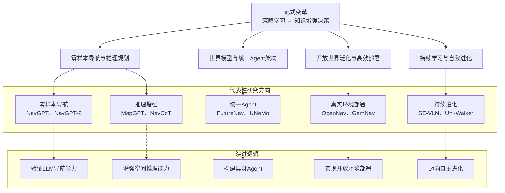

上图从三个层次概括了最新阶段的发展脉络。**顶层（范式变革）** 展示了 VLN 从“策略学习”向“知识增强决策”的根本转变，即利用 LLM 的世界知识与推理能力辅助导航决策生成。**中层（技术主线）** 将后续研究归纳为零样本导航与推理规划、世界模型与统一 Agent 架构、开放世界泛化与高效部署，以及持续学习与自我进化四个方向，分别对应导航智能体在推理能力、系统架构、实际应用和长期演化方面的发展需求。**底层（演进逻辑）**则概括了该阶段的发展路径——从验证 LLM 能否参与导航任务，到增强空间推理能力、构建统一具身 Agent，再到真实环境部署和持续自主进化。后续各节将围绕这四条技术主线，系统介绍该阶段的代表性模型及其关键技术贡献。

## 4.2 零样本导航与推理规划

LLM 被引入视觉语言导航后，研究者首先关注的问题并非如何进一步提升导航性能，而是一个更加基础的问题：大语言模型能否利用其预训练知识，在缺乏导航任务训练的条件下完成导航决策？这一问题催生了零样本导航（Zero-shot Navigation）的发展。与前两个阶段依赖导航数据学习策略不同，零样本导航将 LLM 视为已经具备丰富世界知识和推理能力的认知主体，通过提示工程、工具调用以及多模态信息组织等方式激活其已有知识，从而完成导航决策。研究重点也由“学习导航策略”逐渐转向“利用已有知识进行推理与规划”。


### （1）NavGPT：零样本导航范式的建立

<div align="center">
  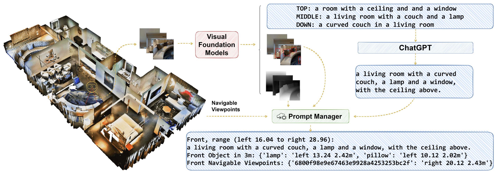
  <p style="margin-top: 5px; color: #555; font-size: 14px;">NavGPT模型框架</p>
</div>

**NavGPT**首次系统地将大语言模型引入视觉语言导航，标志着 LLM 驱动 VLN 的开端。与传统导航模型通过训练学习动作策略不同，NavGPT 将 GPT 作为导航系统的核心推理引擎，仅依靠自然语言提示完成导航决策，首次证明了**LLM 可以在零样本条件下完成视觉语言导航任务**。由于 GPT 无法直接处理图像，NavGPT 首先利用视觉描述模型将全景观测转换为文本，再与导航指令、历史轨迹及候选动作共同组成 Prompt 输入 LLM。整个流程可概括为：**视觉观测 → 文本描述 → Prompt 构建 → LLM 推理 → 动作决策**

相比传统策略网络直接输出动作概率，NavGPT 能够显式分析当前位置、识别关键地标、判断导航进度，并给出相应的动作决策，使导航过程具有一定的可解释性。其最大的意义在于提出了**利用推理替代策略学习** 的新范式。


### （2）NavGPT-2：从可行性验证到性能提升

虽然 NavGPT 验证了 LLM 导航的可行性，但由于采用"图像→文本"转换方式，视觉信息损失较大，同时 LLM 本身缺乏针对导航动作的优化，因此整体性能仍低于专用 VLN 模型。**NavGPT-2**进一步保留了 LLM 的推理能力，同时重新设计了视觉信息接入方式和动作预测机制，使导航系统逐渐由纯推理模型发展为**推理—执行协同架构**。其主要改进包括三个方面：
- **视觉表示对齐。** 将视觉特征直接映射到 LLM 表示空间，避免图像描述带来的信息损失。
- **推理与策略协同。** LLM 负责高层规划与推理，导航策略网络负责动作预测，实现高层认知与低层执行的分工协作。
- **多轮交互能力。** 支持用户在导航过程中修改目标或补充指令，并依据新的任务重新规划路径。

NavGPT 与 NavGPT-2 的演进表明，LLM 导航研究开始由"证明可行"逐步转向"追赶专用模型性能"。

### （3）NavCoT：显式推理与规划能力

随着导航性能不断提升，研究重点进一步转向**如何充分发挥 LLM 的推理能力**。代表性工作 **NavCoT（Navigational Chain-of-Thought）** 将导航决策组织为显式的思维链（Chain of Thought），使模型不仅输出动作，还输出完整的推理过程。NavCoT 将导航划分为三个连续步骤：
- **Imagine（预测）**：根据导航目标预测下一步可能观察到的环境；
- **Select（选择）**：从候选方向中选择与预测结果最一致的路径；
- **Decide（决策）**：结合推理结果生成最终动作。

整个推理流程可表示为$$\text{Observation}\rightarrow\text{Imagine}\rightarrow\text{Select}\rightarrow\text{Decide}\rightarrow\text{Action}
$$相比端到端策略学习，NavCoT 将隐藏在模型内部的决策过程显式化，使导航具有更好的可解释性，同时能够依据环境反馈持续修正规划，在复杂指令和长距离导航任务中表现出更好的鲁棒性。


### （4）从推理模型到导航 Agent

近年来，零样本导航进一步向Agent 方向发展。研究重点开始由"如何推理"扩展为"如何自主完成导航任务"，LLM 不再只是推理模型，而逐渐成为整个导航系统的任务调度中心。**Three-Step Nav** 提出了统一的三阶段规划协议，包括：**1）Look Ahead**：分析任务目标并制定整体规划；2）**Look Around**：结合当前观测选择局部目标；**3）Look Back**：回顾历史轨迹并修正导航偏差。通过持续循环执行上述三个阶段，模型能够不断修正规划，提高长距离导航的稳定性。

**AgenticNav** 则进一步将导航过程重新定义为**工具调用**问题。模型将动作控制、深度估计、地图记忆等功能封装为可调用工具，由视觉语言模型根据当前任务自主选择调用，实现感知、推理与执行的协同工作。这种设计使 LLM 从单纯的推理模块发展为导航 Agent 的认知中枢，更符合当前具身智能系统的发展趋势。


## 4.3 世界模型与统一 Agent 架构

零样本导航证明了大语言模型能够利用已有知识完成导航推理，但其决策过程仍然主要依赖当前观测和历史轨迹，本质上属于**基于当前信息的推理**。当导航任务涉及长程规划、动态环境适应以及复杂任务执行时，仅依赖当前观测已难以满足需求。智能体不仅需要理解"下一步应该怎么走"，还需要预测"环境将如何变化"以及"自己的行为将产生什么影响"。

因此，研究重点进一步由**推理能力**扩展到**世界建模**，并逐渐发展出统一的 Agent 架构。其核心思想是：通过构建环境的内部世界模型，使智能体能够持续维护环境状态、预测未来变化，并协调感知、记忆、规划、决策和执行等多个模块，形成完整的闭环认知过程。

### （1）FutureNav：统一的世界—行动联合建模

**FutureNav**首次将世界模型系统性引入视觉语言导航，其核心思想是不仅学习"如何行动"，还学习"世界如何演化"。传统 VLN 模型通常只优化动作预测，而 FutureNav 将导航过程统一建模为多个相互关联的学习目标，包括：
- **动作预测（Action Prediction）**：预测下一步导航动作；
- **逆向动力学（Inverse Dynamics）**：根据连续观测推断历史动作；
- **正向动力学（Forward Dynamics）**：预测未来环境状态；
- **未来场景生成（Future Generation）**：生成未来可能观察到的视觉场景。

通过联合优化上述任务，FutureNav 学习到更加完整的环境动态模型，使导航决策不再局限于当前观测，而能够结合未来状态进行规划。


### （2）UNeMo：预测—反馈闭环世界模型

FutureNav 证明了世界模型能够提升导航性能，但环境预测如何真正服务于导航决策仍然是一个关键问题。**UNeMo**进一步提出了**多模态世界模型**，将视觉观测、语言指令和历史动作统一编码，并预测未来视觉状态，从而建立环境演化模型。其核心创新是**分层预测—反馈（Hierarchical Prediction Network，HPN）** 机制。一方面，世界模型持续预测未来环境状态；另一方面，导航策略根据预测结果生成动作，并将新的观测再次反馈给世界模型，不断修正未来预测。整个导航过程形成：**环境观测 → 世界模型预测 → 导航决策 → 环境反馈 → 世界模型更新**的闭环认知流程。

相比于仅利用历史轨迹进行推理，UNeMo 使导航系统具备了持续预测和动态修正能力，在复杂场景中的长期规划性能得到进一步提升。


### （3）InternVLA-N1：推理与执行解耦的双系统架构

<div align="center">
  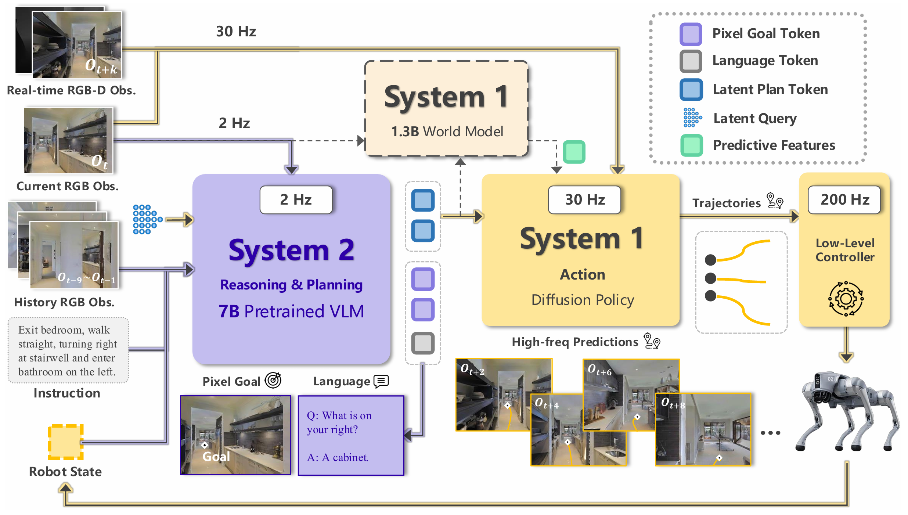
  <p style="margin-top: 5px; color: #555; font-size: 14px;">InternVLA-N1模型框架</p>
</div>

随着模型规模不断扩大，研究者开始思考另一个问题：**大型模型是否需要参与机器人每一次控制？** **InternVLA-N1**提出了具有代表性的**双系统（Dual-System）架构**，其设计理念可以概括为：**Ground Slow，Move Fast。** 即高层推理"慢"，底层控制"快"。整个系统包括两个相互协作的模块：
- **System 2（高层推理）**：利用多模态大模型理解导航指令和视觉环境，低频完成全局规划，并预测下一阶段目标位置。
- **System 1（底层执行）**：利用导航策略网络高频完成运动控制、避障和轨迹跟踪，根据高层规划实时执行动作。

其中，System 2 约以 **2 Hz** 的频率进行推理，而 System 1 约以 **60 Hz** 的频率控制机器人运动，实现异步协同工作。这种设计避免了大模型参与所有控制计算，在保持推理能力的同时显著提高了实时性，也使 VLN 系统更加符合真实机器人控制架构。


### （4）Qwen-RobotNav：统一具身 Agent 架构

随着世界模型和双系统架构的发展，研究重点进一步由导航模型扩展到统一具身智能系统。**Qwen-RobotNav**是阿里千问具身智能体系中的导航基础模型，其目标不再局限于视觉语言导航，而是构建统一的机器人导航 Agent。模型通过统一的多模态表示和工具接口，将视觉理解、语言推理和运动控制连接起来，在同一框架下支持：视觉语言导航（VLN）、点目标导航（PointGoal Navigation）、目标导航（Object Navigation）和目标跟踪与移动控制等任务。

相比于前期模型主要关注某一导航任务，Qwen-RobotNav 更强调不同导航能力之间的统一建模，使导航模型逐渐发展为能够执行多种移动任务的通用具身 Agent。

## 4.4 高效部署与开放世界泛化

随着世界模型和统一 Agent 架构的不断完善，LLM 驱动的导航智能体已经具备较强的推理与规划能力。然而，大规模模型在真实机器人部署过程中仍面临两个关键挑战：一方面，大语言模型参数规模庞大，训练和推理成本较高，难以满足移动机器人对实时性的要求；另一方面，现有模型大多建立在封闭数据集和固定类别上，对于开放环境中的未知目标、开放词汇指令以及动态场景仍缺乏足够的泛化能力。

因此，研究重点进一步转向**高效部署（Efficient Deployment）**与**开放世界泛化（Open-world Generalization）**。前者关注如何以更低的训练与部署成本充分利用大型模型的知识，后者则关注如何突破固定数据集的限制，使导航智能体能够理解开放词汇目标、适应未知环境，并通过主动感知提升决策能力。这一方向的代表性工作包括 GemNav、SkillNav、OpenNav、InstructNav、OpenFMNav、TINA 和 ProFocus。


### （1）GemNav与 SkillNav：高效部署与知识适配

随着多模态大模型规模不断增大，如何在有限计算资源下完成导航任务成为首先需要解决的问题。

**GemNav**探索了轻量化部署方案。其核心思想是冻结大部分多模态大语言模型参数，仅利用低秩适应（LoRA）对少量参数进行微调，并采用统一的离散 Token 表示路径点和导航信号，从而显著降低训练成本，同时保持较好的跨场景泛化能力。

**SkillNav**从任务组织方式入手，将复杂导航任务分解为多个可复用的导航技能，并根据不同任务动态组合这些技能完成导航过程。技能化建模不仅提高了模型的推理效率，也增强了模型在不同导航任务之间的迁移能力。

上述工作表明，高效部署不仅依赖模型压缩，更强调如何以更少的参数、更合理的推理流程充分利用大型模型已有知识，实现高效、可靠的导航决策。

### （2）OpenNav、InstructNav 与 OpenFMNav：开放世界导航


**OpenNav**首次系统探索开放世界导航（Open-world Navigation）。模型结合开放词汇视觉感知、多模态大语言模型规划以及轨迹优化模块，使机器人能够根据任意自然语言描述完成开放集物体导航，并在真实机器人平台完成室内外导航验证。
进一步地，**InstructNav**提出统一的指令导航框架，在同一系统中同时支持视觉语言导航、目标导航以及需求驱动导航等多种任务，使导航模型由单一任务逐渐发展为统一的导航基础模型。

与此同时，**OpenFMNav**进一步突破固定类别限制。模型利用大语言模型解析导航目标，再结合视觉语言模型构建开放词汇语义地图，实现未知类别目标的零样本导航，进一步提升了模型在开放环境中的泛化能力。

相比前期研究主要关注标准 VLN 基准，这些工作开始突破固定类别和固定场景的限制，使导航系统逐渐具备处理开放世界任务的能力。


### （3）TINA 与 ProFocus：主动感知与交互推理

随着开放世界导航的发展，仅依赖被动视觉观测已经难以满足复杂环境下的导航需求。研究开始进一步探索智能体如何主动获取信息，并结合环境反馈持续优化推理过程。

**TINA**提出**Thinking–Interacting–Action**框架，将"思考—交互—行动"统一到导航过程中。模型能够主动分析当前感知信息，并通过问答交互获取缺失的环境信息，再结合新的观测重新规划导航策略，从而提升复杂环境中的决策能力。

进一步地，**ProFocus**提出主动感知与聚焦推理框架，使智能体能够主动选择信息量最大的观察视角，并优先关注与当前导航目标最相关的视觉区域，减少冗余信息干扰，提高开放环境下的感知效率与推理精度。

这一阶段表明，导航智能体开始由被动接收环境信息逐渐发展为主动获取信息和持续优化决策，使导航过程更加符合真实机器人在复杂环境中的工作方式。


## 4.5 持续学习与自我进化

随着 LLM 驱动导航智能体逐渐具备推理、规划和开放环境适应能力，研究者开始进一步思考一个更加长期的问题：**智能体能否像人一样，在持续执行任务过程中不断积累经验，并利用历史经验持续提升导航能力？** 传统 VLN 模型通常采用离线训练、在线部署的模式，模型参数在训练完成后保持固定。当部署到新的环境或面对新的任务时，往往需要重新训练，既难以适应环境变化，也容易出现灾难性遗忘问题。因此，持续学习逐渐成为 LLM 驱动具身导航的重要研究方向。

这一阶段的研究重点已经由"完成一次导航任务"进一步发展为"持续提升导航能力"。智能体不仅需要保存导航过程中积累的知识，还需要能够检索历史经验、总结失败原因，并在长期运行过程中不断优化自身决策策略，逐步形成具备长期记忆、自我反思和持续进化能力的具身导航智能体。


### （1）SE-VLN：测试阶段的自进化导航

**SE-VLN**首次提出基于多模态大语言模型的**测试阶段自进化** 框架。与传统模型在训练结束后参数固定不同，SE-VLN 允许智能体在执行导航任务过程中不断积累经验，并利用历史经验优化后续决策。

整个框架主要包括三个模块：**层级记忆模块**、**检索增强推理模块**和**反思模块**。其中，层级记忆负责保存成功与失败案例；检索模块根据当前任务检索相似导航经验，为推理提供参考；反思模块则总结导航过程中出现的问题，并形成新的经验重新写入记忆库。

SE-VLN 表明，LLM 不仅能够利用已有知识完成导航，还能够在测试过程中不断积累新的导航经验，使导航能力随着任务执行持续提升，为后续终身学习研究奠定了基础。


### （2）Uni-Walker 与 AlldayWalker：终身学习框架

随着持续学习研究的发展，研究重点进一步由单次经验积累扩展到**终身学习（**。代表性工作包括 **Uni-Walker** 和 **AlldayWalker**，两者分别从任务维度和环境维度探索导航智能体的持续学习能力。

**Uni-Walker**提出终身具身导航学习框架，将导航知识划分为**任务共享知识**和**任务特定知识**两部分，并利用解码器扩展 LoRA（DE-LoRA）实现知识解耦。共享知识能够在不同导航任务之间迁移，而任务特定知识则针对不同指令风格进行适应，从而缓解连续学习过程中的灾难性遗忘问题，使模型能够同时支持 VLN、ObjectNav 和对话导航等多种任务。

**AlldayWalker**则进一步关注复杂环境下的长期适应能力。该方法提出全天候多场景终身导航框架，将导航知识建模为高阶张量，并利用 Tucker 分解构建共享子空间和场景特定专家，实现不同环境之间的知识迁移。相比 Uni-Walker 更关注多任务学习，AlldayWalker 更强调跨场景、跨光照和跨天气条件下的持续适应能力，为真实机器人长期部署提供了新的解决方案。

两项工作分别从**任务连续学习**和**环境连续学习**两个角度推动了终身导航的发展，使导航智能体逐渐具备长期适应未知环境的能力。

### （3）AllDayNav 与 TrajRAG：经验积累与知识增强
<div align="center">
  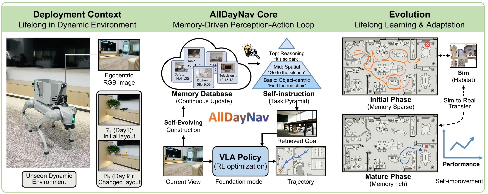
  <p style="margin-top: 5px; color: #555; font-size: 14px;">AllDayNav模型框架</p>
</div>

近年来，持续学习进一步与强化学习、检索增强生成等技术相结合，使导航智能体能够更加高效地利用长期积累的导航经验。

**AllDayNav**提出基于强化学习的终身自主导航框架，通过持续更新多模态记忆，将视觉关键帧、语义描述和时间上下文统一编码，并结合强化学习不断优化导航策略。模型能够根据环境变化持续调整行为，在跨场景、跨任务条件下保持较高的导航性能。

**TrajRAG**则将近年来广泛应用于大语言模型的检索增强生成思想引入导航任务。该方法提出轨迹检索增强框架，将导航过程中积累的历史轨迹组织为包含空间布局、语义信息和运动过程的经验库。在执行新任务时，智能体首先检索与当前环境最相似的历史轨迹，再结合 LLM 完成推理与决策，从而将互联网知识与真实导航经验有机结合，进一步提升了开放环境下的导航泛化能力。

与传统依赖参数记忆不同，这类方法将长期导航经验显式保存为可持续扩展的外部知识库，使智能体能够不断积累新的导航经验，并通过检索增强推理实现知识复用，体现了导航智能体由"参数学习"向"知识学习"的发展趋势。

## 4.6 InternVLA-N1 实践
> **实践定位**：按照 InternNav 官方流程加载 InternVLA-N1，并跑通官方推理示例。学生只需观察模型如何根据导航指令和视觉观测产生高层导航计划，不要求自行实现或重新训练双系统。

### （1）实践目标
1. 安装 InternNav 并完成环境自检；
2. 下载 InternVLA-N1 官方权重；
3. 跑通官方 `inference_only_demo.ipynb`；
4. 输入一条导航指令和示例视觉观测，查看模型输出；
5. 结合输出理解 System 2 高层推理与 System 1 低层执行的分工。

### （2）实践说明

InternVLA-N1 的完整双系统包含低频运行的 System 2 和高频运行的 System 1。前者根据语言指令、视觉观测和历史信息产生高层导航计划，后者将最新计划转化为连续控制动作。完整的仿真评估还需要 Habitat 或 Isaac Sim、场景数据、控制器和相应 checkpoint，配置成本较高。

因此，本节的基本任务仅要求跑通官方提供的 inference-only demo。该 demo 用于验证模型权重能够加载、输入能够正确预处理、模型能够产生推理结果。完整的 VLN-CE 或 Isaac Sim 评估作为选做内容。

### （3）实验条件

InternVLA-N1 为约 8B 参数模型，建议使用 Linux 和 NVIDIA GPU。具体显存需求会受到精度、量化方式和输入长度影响。显存不足时，可由教师提供服务器环境，或仅观看教师运行并分析输出。

建议准备：

+ Ubuntu 22.04；
+ Python 3.10；
+ NVIDIA GPU，建议 24 GB 以上显存；
+ 32 GB 以上内存；
+ 约 30 GB 可用磁盘空间；
+ 可访问 Hugging Face 的网络环境。

### （4）安装 InternNav

```bash
# 1. 克隆官方仓库
git clone https://github.com/InternRobotics/InternNav.git
cd InternNav

# 2. 创建独立环境
conda create -n internnav python=3.10 -y
conda activate internnav

# 3. 按仓库当前版本安装
pip install -e .

# 4. 安装 Notebook 环境
pip install jupyterlab ipykernel
python -m ipykernel install --user \
  --name internnav --display-name "Python (internnav)"
```

InternNav 更新较快。如果仓库当前 README 或官方安装文档给出了额外依赖或指定安装脚本，应以所使用版本的官方文档为准，并在实验报告中记录 commit：

```bash
git rev-parse HEAD
```

### （5）下载模型

可使用 Hugging Face CLI 下载官方模型。先安装命令行工具：

```bash
pip install -U huggingface_hub
```

然后根据官方 demo 中使用的模型名称下载对应 checkpoint。若使用讲义所介绍的 `wo-dagger` 版本，可执行：

```bash
huggingface-cli download \
  InternRobotics/InternVLA-N1-wo-dagger \
  --local-dir checkpoints/InternVLA-N1-wo-dagger
```

模型版本可能随 InternNav 更新而变化。若 Notebook 默认使用更新的 System 2 或 Dual-System 权重，应优先遵循 Notebook 中给出的模型名称和配置，不要混用不同版本的配置文件与 checkpoint。

### （6）运行官方推理示例

仓库提供了推理示例：

```text
scripts/notebooks/inference_only_demo.ipynb
```

启动 Jupyter：

```bash
jupyter lab
```

在浏览器中打开 `scripts/notebooks/inference_only_demo.ipynb`，选择 `Python (internnav)` 内核，然后按顺序执行所有单元格。运行前检查 Notebook 中的模型路径，将其改为本机 checkpoint 的实际位置。

实践中应重点观察四个环节：

1. 模型和处理器是否成功加载；
2. 导航指令与视觉观测如何组织为输入；
3. 模型输出中是否包含目标方向、目标点或高层计划；
4. 历史观测变化后，模型是否会更新导航判断。

只要 Notebook 能够从头运行到末尾，并成功输出一次模型推理结果，就完成了本节基本任务。

### （7）理解双系统数据流

官方完整系统可概括为：

> 导航指令与视觉历史 → System 2 生成高层计划 → 缓存最新计划 → System 1 结合当前 RGB-D 观测生成连续动作 → 环境反馈 → 更新视觉历史。

需要注意，Notebook 主要展示模型推理，并不等同于完整机器人闭环。真正的异步双系统还包含不同运行频率、计划缓存、传感器同步、碰撞处理和底层控制器。本实践不要求学生自行编写这些模块。

### （8）实验记录

至少完成三组输入，填写下表：

| 导航指令 | 视觉场景主要内容 | 模型输出摘要 | 输出是否合理 |
|---|---|---|---|
| 示例 1 |  |  |  |
| 示例 2 |  |  |  |
| 示例 3 |  |  |  |

回答以下问题：

1. 模型输出是直接的底层速度，还是高层目标或计划？
2. 当视觉场景中缺少指令所描述的地标时，模型如何处理？
3. System 2 为什么不需要以与底层控制器相同的高频率运行？
4. 与 DUET 的拓扑节点选择相比，InternVLA-N1 的输出形式有何不同？

### （9）完整仿真评估（选做）

希望进一步运行闭环导航的学生，可按照 InternNav 官方文档继续配置 Habitat 或 Isaac Sim，并选择与 checkpoint 匹配的评估配置。完整流程包括：

1. 安装仿真环境；
2. 准备 R2R/RxR 场景与标注；
3. 下载 System 1、System 2 或 Dual-System 对应权重；
4. 使用官方配置运行 VLN-CE 或 VLN-PE 评估；
5. 记录 NE、SR、SPL 等指标。

由于官方命令和配置会随版本更新，本讲义不再给出容易失效的占位式 `eval.py` 命令。学生应从当前版本官方文档的 **Evaluation** 页面复制命令，并在报告中同时记录仓库 commit、配置文件和 checkpoint 名称。

### （10）完成标准

满足以下条件视为完成本实践：

1. InternNav 安装成功，Python 能正常导入项目模块；
2. 官方 checkpoint 下载完整；
3. `inference_only_demo.ipynb` 能够从头运行至末尾；
4. 至少保存一次有效推理输出；
5. 提交三组输入—输出记录和四个思考题的回答。

### （11）常见问题

+ **模型下载中断**：重新执行 `huggingface-cli download`，工具会复用已经下载的文件。
+ **显存不足**：关闭其他 GPU 进程，缩短输入历史；仍无法运行时使用教师提供的服务器。
+ **模型类无法识别**：不要只安装通用 `transformers` 后脱离项目加载模型，应使用 InternNav 当前版本指定的依赖和代码。
+ **checkpoint 与配置不匹配**：确认 System 2、NavDP、Dual-System 等不同权重没有混用。
+ **Notebook 找不到项目模块**：确认使用 `pip install -e .` 安装，并选择了 `Python (internnav)` 内核。
+ **完整评估缺少场景数据**：推理 demo 不需要完整仿真闭环；若做选做任务，再按照官方文档准备 Habitat 或 Isaac Sim 数据。


# 5 总结

本讲系统介绍了视觉语言导航的主要方法演进过程和典型模型实践，重点分析了不同技术阶段解决的核心问题。
1. **方法演进**：VLN 方法经历了从 Seq2Seq 到 Transformer，再到 LLM 驱动导航的三个主要阶段。早期 Seq2Seq 模型建立了语言、视觉和动作之间的基本映射关系，但受限于循环结构的长程依赖建模能力；随后 Transformer 通过自注意力机制增强了跨模态信息交互，并结合预训练范式提升了模型泛化能力；近年来，大语言模型进一步推动 VLN 从策略学习向知识驱动决策发展。
2. **模型能力提升**：随着研究深入，VLN 模型的关注重点由简单的视觉—语言匹配逐渐转向历史状态建模、空间结构理解和长期导航规划，使智能体能够更加准确地理解环境并完成复杂任务。
3. **学习范式演进**：VLN 训练方式经历了从模仿学习、强化学习到“预训练—监督微调—强化优化”的发展过程。通过利用大规模视觉语言知识和任务专用训练策略，模型逐渐具备更强的数据利用能力和跨环境泛化能力。
4. **智能体架构发展**：LLM 的引入使 VLN 系统逐渐由端到端动作预测模型发展为具备感知、推理、规划和交互能力的智能体架构。导航任务也由“执行路径”进一步扩展到“理解任务意图并自主完成目标”。
5. **实践与应用**：通过典型模型实验，学生能够理解 VLN 方法从理论设计到系统实现的完整流程，并掌握利用仿真平台、评价指标和轨迹分析方法开展导航模型验证的基本能力。

总体而言，视觉语言导航正在从面向单一导航任务的模型研究，逐渐发展为支撑具身智能体自主决策的重要基础技术。未来，结合世界模型和持续学习技术，VLN 将进一步迈向开放环境下的通用智能导航。
