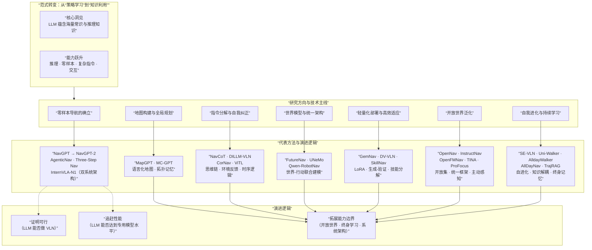

## 学习目标
1. **描述** VLN 方法从 Seq2Seq 到 Transformer 再到 LLM 驱动的三阶段演进脉络，理解每一阶段的核心技术突破与驱动因素。
2. **解释** 各阶段代表性模型（Seq2Seq、DUET、InstructNav、InternVLA-N1 等）的核心思想与技术贡献。
3. **分析** VLN 学习方法的演进逻辑——从模仿学习到强化学习再到“预训练→SFT→RFT”三步走范式，以及第三阶段从“LLM 做决策”到“LLM 成为具身智能体”的深化趋势。
4. **在仿真环境中运行** Seq2Seq、DUET 和 InternVLA-N1 三个代表性模型，记录轨迹与评价指标。

## 19.1 引言：VLN 方法演进图谱
当智能体面对“走出卧室，穿过走廊，在红色沙发前停下”这条指令时，它面临着三重难题：**听懂**这句话的语义结构，**看见**并识别环境中的门、走廊和沙发，以及**行动**——将语言和视觉的理解转化为一连串正确的物理动作。这三者之间存在着根本性的鸿沟：语言是离散的、符号化的，视觉是连续的、像素级的，而行动是时序的、因果的。

自 2018 年 R2R 基准数据集提出以来，VLN 研究围绕“如何跨越这三大鸿沟”这一核心问题，经历了一系列方法论上的范式跃迁。回看这段演进历程，可以清晰地识别出三条交织的主线：

+ **架构主线**：从 RNN/LSTM 的串行处理，到 Transformer 的全注意力机制，再到 VLM/LLM 的通用推理引擎。每一次架构升级，都对应着模型“能处理多长上下文”和“能建立多复杂跨模态关联”的能力跃升。
+ **学习主线**：从行为克隆的“照葫芦画瓢”，到强化学习的“在试错中精进”，再到“预训练→SFT→RFT”的三步走标准范式。每一次学习方法的革新，都试图解决前一代方法在分布偏移、样本效率和鲁棒性上的固有缺陷。
+ **知识主线**：从仅在有限导航数据上“死记硬背”特定环境的布局，到在海量通用图文对上“博览群书”获得广泛的世界知识，再到利用 LLM 在互联网级语料中积累的常识推理和规划能力实现“举一反三”。知识来源的每一次扩展，都从根本上提升了 VLN 智能体的泛化能力和任务适应性。

这三条主线并非平行演进，而是相互交织、互为驱动。Transformer 架构的出现使预训练成为可能（架构→知识），预训练获得的通用表征又使强化学习的样本效率大幅提升（知识→学习），而 LLM 的推理能力则反过来对架构设计提出了新的要求（知识→架构）。它们共同推动 VLN 方法论经历了三个递进阶段的范式跃迁，每一阶段的演进都是**对前一阶段核心缺陷的系统性回应**。下图展示了 VLN 方法演进的整体框架，包括三条主线的协同驱动关系以及各阶段的代表性方法：


上图从三个维度呈现了 VLN 方法论的完整演进逻辑。

+ **横向（时间轴）** ：从左至右展示了三个递进阶段，每个阶段的核心瓶颈（橙色背景）驱动了该阶段突破方向（紫色背景）的产生。
+ **纵向（能力跃迁）** ：底部展示了两个层次的能力提升——从第一阶段到第二阶段，模型从“反应式的动作预测”进化为“基于场景理解的路径规划”；而从第二阶段到第三阶段，模型从“导航任务专用”跃升为“通用推理引擎驱动”。
+ **因果关系**：蓝色箭头表示阶段间的推进关系（每一阶段的局限催生了下一阶段的突破）；紫色虚线箭头表示能力跃迁的累积效应（新阶段继承了前一阶段的基础能力并叠加新的突破）。三阶段的演进并非“替代”而是“叠加”——第三阶段的 LLM 方法仍保留了前两阶段的架构基础和学习范式。

传统 VLN 研究主要聚焦于“如何在给定的导航数据上训练一个更好的模型”——这体现在架构层面（设计更有效的跨模态融合机制）和学习层面（设计更高效的策略优化算法）。然而，基础模型的兴起从根本上扩展了这一问题空间。研究者的关注点从“**如何在有限数据上学得更好**”转向了“**如何将模型中已经蕴含的无限知识引导到导航任务中**”。这种转变催生了一系列新方向，包括通用视觉与语言表示的跨任务预训练、基于 LLM 的高层任务规划与常识推理、以及从仿真环境到真实世界的零样本泛化等任务。

本章将沿着“架构—学习—知识”三条主线交织的演进脉络，系统介绍 VLN 方法的完整发展历程。每阶段先阐述理论原理与代表性方法，再配备贯穿式的动手实践——从第一阶段基于 Seq2Seq 的行为克隆，到第二阶段基于 DUET 的跨模态预训练与双尺度决策，再到第三阶段基于 InternVLA-N1 的双系统零样本导航——帮助读者在理解“为何这样做”的同时，亲身体验“效果如何”。

## 19.2 第一阶段：序列建模与端到端学习
### 19.2.1 长程决策的结构性难题
2018年，Anderson等人在CVPR上发布R2R数据集，标志着VLN从概念验证走向规模化研究。同期提出的Seq2Seq基线模型，虽首次实现了真实三维环境中的端到端导航，但其RNN架构很快暴露出三大核心缺陷——长程遗忘、分布偏移与泛化不足。这些缺陷共同指向一个根本问题：模型在稀缺数据上“死记硬背”场景特征，而非真正理解导航任务的语义。

**挑战一：长程遗忘。** Seq2Seq的解码器依赖固定维度的隐藏状态承载全部历史信息——指令细节、数十步的观测与动作。RNN的循环结构使旧信息在每一步更新时被部分“挤出”，早期指令迅速衰减。当路径跨越多个房间时，遗忘往往是致命的。

**挑战二：分布偏移与暴露偏差。** 训练时采用教师强制——解码器每一步接收真实历史动作而非自身预测。测试时模型须依赖自身预测推进，一旦某步出现偏差，便进入训练中从未见过的状态，误差在此放大。理论表明：长度为$ T $的轨迹，单步误差$ \epsilon $的累积总误差与$ T^2\epsilon $成正比——这便是级联误差的根源。

**挑战三：泛化能力不足。** 模型严重过拟合于训练环境的特定布局与纹理。Seq2Seq在已见环境中成功率接近50%，在未见环境中却骤降至20%以下。模型只是在“记忆”场景的视觉模式，而非真正理解导航语义。

上述三大挑战根植于同一个架构前提——RNN依赖固定维度的隐藏状态压缩全部历史信息。突破这一瓶颈需从两个方向着手：**架构层面**，让模型直接访问完整指令信息；**学习层面**，通过数据增强与辅助任务让模型接触更多样的状态分布。下图展示了第一阶段的整体研究脉络：


上图概括了第一阶段研究的核心逻辑。**顶部（核心瓶颈）** 展示了Seq2Seq架构面临的三大挑战——长程遗忘、分布偏移与泛化不足。**中部（两路突破）** 将后续方法的改进路径归纳为两个方向：架构改进（让模型直接访问完整指令信息）与学习增强（通过数据增强与辅助任务缩小训练与测试的分布差距）。**底部（代表性方法）** 标注了各方法在上述两个方向中的定位——注意力机制从架构层面回应了长程遗忘问题；Speaker-Follower从学习层面回应了分布偏移；Self-Monitoring Agent、Regretful Agent和AuxRN等模型则从进度感知、可学习回溯和自监督辅助任务等角度进一步攻坚泛化与误差累积。以下各节将沿此脉络，按“基线架构→数据增强→训练深化”的递进顺序展开介绍。

### 19.2.2 Seq2Seq 基线模型与注意力机制
**（1）Seq2Seq 基线模型**


图片来自2018-CVPR Vision-and-Language Navigation Interpreting Visually-Grounded Navigation Instructions in Real Environments

R2R 论文中提出的 Seq2Seq 基线模型，其架构由三个功能清晰的模块构成：

+ **语言编码器**：使用双向 LSTM 将指令词序列编码为上下文向量 $ c $。双向处理使得每个位置的输出都能同时融合其左侧和右侧的上下文信息。
+ **视觉编码器**：使用在 ImageNet 上预训练的 CNN（如 ResNet-152）提取当前观测图像的特征。对于全景图（36 个视图），通常对每个视图提取特征后取平均池化或注意力池化，得到单一视觉特征 $ v_t $。
+ **动作解码器**：使用另一个 LSTM，在每一步融合指令上下文 $ c $、当前视觉特征 $ v_t $ 和上一步动作，输出动作概率分布。

训练目标可以形式化为动作序列的条件概率分解：

$$
 \pi(A|I,O) = \prod_{t=1}^{T} p(a_t | a_{<t}, I, O_t)
$$

对于离散动作空间（R2R 中的节点选择），使用标准的交叉熵损失进行训练。

**（2）注意力机制的引入**

在朴素 Seq2Seq 中，解码器每一步使用**同一个**指令上下文向量 $ c $——无论智能体当前走到哪里，对指令的“理解”都是固定不变的。这显然不合理：刚出发时需要关注“从卧室出发”，走到走廊尽头时需要关注“在尽头左转”。

**注意力机制**让解码器在每一步动态地“回看”指令编码器的所有输出（而非仅依赖最终上下文向量），计算当前状态 $ h_{t-1}^{dec} $ 与指令中每个词语的相关性分数，然后根据这些分数对词语特征进行加权求和，得到**动态的、与当前步相关的**上下文向量 $ c_t $：

$$
 e_{t,i} = \text{score}(h_{t-1}^{dec}, h_i^{enc}), \quad \alpha_{t,i} = \frac{\exp(e_{t,i})}{\sum_j \exp(e_{t,j})}, \quad c_t = \sum_i \alpha_{t,i} h_i^{enc}
$$

在 VLN 中，注意力机制在三个层面上发挥作用：

+ **视觉注意力**：重点关注全景图中与当前任务最相关的方向（指令说“左转”时更多地关注左侧视图）。
+ **语言注意力**：重点关注指令中与当前状态最相关的词语（到达交叉口时关注“之后怎么走”）。
+ **跨模态注意力**：建立指令词与图像区域之间的精确映射（将“红色沙发”与图像中红色沙发的像素区域对应）。

### 19.2.3 数据增强与语用推理


图片来自2018-NeurIPS-Speaker-Follower Models for Vision-and-Language Navigation

**Speaker-Follower** 模型（NeurIPS 2018）通过两个核心创新回应了分布偏移问题：

**创新一：Speaker 驱动的数据增强，**框架包含两个协同模型：① **Follower**：导航智能体，接收指令和视觉观测，输出动作序列。② **Speaker**：完成逆向任务——给定一条导航路径，生成描述该路径的自然语言指令。Speaker 为 Follower 生成额外的训练数据：用当前 Follower 在环境中探索产生轨迹（包括“不完美的”偏离路径）→ Speaker 为这些轨迹生成指令 → 扩充训练集，这使得训练分布更接近测试分布。

**创新二：语用重排序，**测试时，Follower 生成多条候选路径，Speaker 评估每条路径与指令的匹配分数，选择分数最高的路径执行。这一机制将导航从“局部的贪婪决策”提升为“全局优化问题”——Speaker 评估的是完整轨迹的全局一致性，可以推翻局部最优但全局不一致的决策。

### 19.2.4 多维度攻坚：泛化能力与决策机制的深化
在 Seq2Seq 和 Speaker-Follower 奠定的基础之上，研究者们从多个维度对第一阶段的模型进行了深化，以攻克泛化与误差累积的核心瓶颈。

**（1）Self-Monitoring Agent：自我监控导航智能体**

VLN 任务要求智能体感知：**哪些指令已完成、下一步需要哪条指令、该往哪个方向走、以及距离目标还有多远**。Self-Monitoring Agent 的核心洞察是：**智能体需要对自身的导航状态进行持续监控**，而非仅依赖局部的视觉-语言匹配。该模型由两个互补模块构成：

+ **视觉-文本协同定位模块（Visual-Textual Co-grounding）** ：从当前周围图像中定位：（1）已完成的指令部分；（2）下一步动作所需的指令；（3）下一步移动方向。
+ **进度监控器（Progress Monitor）** ：确保协同定位的指令正确反映导航进度，作为一种正则化机制。

自我监控智能体通过**将文本定位与进度估计耦合**，实现了对导航状态的双重校验——协同定位告诉智能体“指令对应到哪里”，进度监控告诉智能体“走到了哪里”，两者相互验证。该方法在**未见测试集上实现了 8% 的绝对成功率提升**，显著超越了当时的最先进方法。

**（2）Regretful Agent：基于启发式搜索的后悔导航智能体**

Regretful Agent 的核心洞察是**将 VLN 问题看作导航图上的搜索问题**，并利用进度监控器作为**可学习的启发式函数**来指导搜索。该模型提出两个核心模块：

+ **后悔模块（Regret Module）** ：一个可学习的回溯机制，决定是继续前进还是回退到之前的状态。
+ **进度标记（Progress Marker）** ：显示已访问的方向及其关联的进度估计，帮助智能体决定下一步往哪个方向走。

Regretful Agent 解决了之前方法的一个核心矛盾：**使用集束搜索（Beam Search）的方法成功率较高但轨迹过长，而使用贪婪动作选择的方法轨迹较短但成功率很低**。Regretful Agent 通过**启发式搜索 + 可学习的回溯决策**，在**贪婪动作选择**下实现了 5% 的绝对成功率提升，**路径长度归一化的成功率（SPL）更是提升了 8%**。

**（3）AuxRN：自监督辅助推理任务**

**之前的 VLN 方法在跨模态对齐中隐式地忽视了环境中蕴含的丰富语义信息**，例如导航图结构或子轨迹语义。为此，AuxRN （Auxiliary Reasoning Navigation）提出了一个包含**四个自监督辅助推理任务**的框架，从这些语义信息中挖掘额外的训练信号：

1. **轨迹复述**（Trajectory Retelling）：让智能体用自然语言解释其过往动作；
2. **进度估计**（Progress Estimation）：	评估当前已完成轨迹的百分比；
3. **方向预测**（Angle/Orientation Prediction）：预测下一步应转向的方向；
4. **轨迹一致性评估**（Trajectory Consistency）：判断当前轨迹与指令是否一致。

这些辅助任务帮助智能体**获取语义表示的知识**，从而能够推理自身活动并建立对环境的全面感知。实验表明，辅助推理任务在**大幅提升主任务性能的同时，显著增强了模型的泛化能力**。该方法在标准基准上显著超越了之前的最先进方法。

### 19.2.5 Seq2Seq 模型实践
> **实践定位**：理解 VLN 最早的端到端基线模型，体验“指令→动作”的直接映射，观察分布偏移对性能的影响。
>

#### （1）实践目标
1. 在 Matterport3D Simulator 中配置 R2R 数据集环境
2. 运行 Seq2Seq 基线模型，观察其在已见/未见环境上的导航表现
3. 理解编码器-解码器架构在 VLN 中的基本工作流程
4. 记录并分析 Seq2Seq 的典型失败模式

#### （2）环境配置
```bash
# 1. 克隆 Matterport3D Simulator
git clone https://github.com/peteanderson80/Matterport3DSimulator.git
cd Matterport3DSimulator
# 编译（需提前安装 OpenCV、OpenGL 等依赖）
mkdir build && cd build
cmake .. && make

# 2. 设置 Python 路径
export PYTHONPATH=Matterport3DSimulator/build:$PYTHONPATH

# 3. 下载 R2R 数据集（需签署 Matterport3D 使用协议）
# 将数据放在 ./data/v1/ 目录下
```

#### （3）核心代码解读
Seq2Seq 模型的核心架构（基于 R2R 基线）：

```python
# agent.py - Seq2Seq 智能体核心（简化版）

import torch
import torch.nn as nn
import torchvision.models as models

class Seq2SeqAgent:
    def __init__(self, vocab_size, embedding_size=300, hidden_size=512):
        # 语言编码器：双向 LSTM
        self.word_embedding = nn.Embedding(vocab_size, embedding_size)
        self.encoder = nn.LSTM(embedding_size, hidden_size,
                               num_layers=2, bidirectional=True)

        # 视觉编码器：预训练 ResNet-152
        self.vision_encoder = models.resnet152(pretrained=True)
        # 移除最后的全连接层，取池化层输出
        self.vision_encoder = nn.Sequential(*list(self.vision_encoder.children())[:-1])
        vision_feat_dim = 2048  # ResNet-152 的池化层输出维度

        # 动作解码器：LSTM
        self.decoder = nn.LSTMCell(hidden_size * 2 + vision_feat_dim, hidden_size)
        self.action_head = nn.Linear(hidden_size, 4)  # 前进/左转/右转/停止

    def encode_instruction(self, instruction_tokens):
        # instruction_tokens: [seq_len, batch_size]
        embedded = self.word_embedding(instruction_tokens)
        outputs, (hidden, cell) = self.encoder(embedded)
        # 取最后时刻的隐藏状态作为指令上下文
        # 双向 LSTM 需要拼接前后两个方向的输出
        context = torch.cat([hidden[-2], hidden[-1]], dim=-1)
        return context  # [batch_size, hidden_size * 2]

    def act(self, instruction_context, rgb_obs):
        # 1. 编码当前视觉观测
        # rgb_obs: [batch, 3, H, W]
        vis_feat = self.vision_encoder(rgb_obs).squeeze(-1).squeeze(-1)  # [batch, 2048]

        # 2. 融合指令上下文和视觉特征
        fused = torch.cat([instruction_context, vis_feat], dim=-1)  # [batch, hidden*2 + 2048]

        # 3. 解码器更新（需维护隐藏状态 self.hx, self.cx）
        self.hx, self.cx = self.decoder(fused, (self.hx, self.cx))

        # 4. 预测动作
        action_logits = self.action_head(self.hx)  # [batch, 4]
        return torch.softmax(action_logits, dim=-1)
```

#### （4）运行与评估
```bash
# 在 VLN-CE 代码库中运行 Seq2Seq 基线
cd VLN-CE
# 训练（行为克隆）
python run.py --exp_name seq2seq_bc --model seq2seq --train
# 评估（未见环境）
python run.py --exp_name seq2seq_bc --model seq2seq --eval --split val_unseen
```

#### （5）观察要点
+ Seq2Seq 在**已见环境**中表现尚可，但在**未见环境**中性能显著下降——这直观地展示了分布偏移的严重性。
+ 记录模型在长指令（>20 词）上的表现是否比短指令更差，验证“长程遗忘”问题。
+ 观察典型的失败模式：在岔路口犹豫不决、错过转弯时机、在错误位置提前停止。


## 19.3 第二阶段：Transformer架构与预训练
### 19.3.1 架构与范式的双重变革
如果说第一阶段的核心是“用 RNN 串联指令与动作”，那么第二阶段的核心则是“用 Transformer 进行全局建模，并通过预训练注入通用知识”。这一阶段彻底重构了 VLN 的架构底座与学习范式，其驱动力来自两个相互耦合的变革。

**在架构层面**，Transformer 取代 RNN 成为主流骨架，以全局感受野和并行计算从根本上解决了长程依赖问题。自注意力机制使得指令中任意词语与任意图像区域之间均可直接建立信息交互，不再需要像 RNN 那样逐时间步传递信息。这一变革将视觉-语言融合的效率显著提升，使模型能够有效处理更长、更复杂的跨模态依赖关系。

**在学习层面**，预训练-微调范式取代了纯端到端监督学习，使模型能够从海量通用图文数据中汲取知识，再迁移到导航任务中。这一转变的深层动因在于 VLN 领域长期面临的“恶性循环”：高质量人工标注数据极度稀缺，模型在小数据上训练后严重过拟合于训练环境的视觉纹理，在未见环境中性能断崖式下跌——尽管研究者尝试用模仿学习和强化学习来弥补，但数据瓶颈依然存在。预训练通过三种机制打破了这一循环：

其一，**知识迁移机制**。模型在海量通用数据上学习广泛的世界知识（“沙发”是什么、“左转”是什么意思），再迁移到导航任务中，使模型不必从零开始学习每一个概念。

其二，**数据效率机制**。经过预训练的模型具备良好的表示能力，微调时只需少量导航数据即可快速适配，样本效率可提升数倍至一个数量级。模型无需从头学习“什么是沙发”，只需学习“在导航任务中如何利用对沙发的认知来做决策”。

其三，**正则化机制**。预训练将模型参数置于一个“合理的”空间中，微调时从这个空间出发而非随机初始化，有效防止了小数据上的过拟合。这是一种隐式正则化，它不改变损失函数的形式，而是通过改变参数初始化的分布来约束模型的搜索空间，使微调后的模型在数据有限的情况下依然保持泛化能力。

在此底座之上，跨模态融合机制得以在更深、更广的维度上展开，催生了一大批代表性工作。这些工作可以按照其核心贡献归入几个主要方向：基础架构引入与预训练范式确立、历史与状态感知增强、空间与场景理解深化、预训练策略创新、数据规模扩展、以及架构效率优化。以下各节将沿着这些方向逐一展开。

### 19.3.2 Transformer的引入
**（1）Transformer 架构的引入与 VLN-BERT**

Transformer 架构的出现使 VLN 发生**第一次范式跃迁**。其核心创新是**自注意力机制**：

$$
 \text{Attention}(Q, K, V) = \text{softmax}\left(\frac{QK^T}{\sqrt{d_k}}\right)V
$$

自注意力的两个关键优势：**全局感受野**（序列中任意两个位置都可以直接建立信息交互，从根本上解决了 RNN 的长程依赖问题）和**并行计算**（所有元素之间的相关性可以同时计算，训练效率远高于 RNN）。

**VLN-BERT** 是首个将 BERT 架构系统性地应用于 VLN 的工作。它是一个基于 Transformer 的视觉语言模型，用于评估指令与智能体采集的全景图像轨迹之间的兼容性。VLN-BERT 的结构设计使其能够从通用视觉语言表示学习模型中便捷地进行迁移学习。VLN-BERT 的训练分为两个阶段：

+ **通用预训练**：在大规模网络图文对上预训练，学习视觉-语言对齐的通用知识。
+ **VLN 微调**：在 R2R 等导航数据上微调，适配导航任务。

**（2）PREVALENT：VLN 专用预训练范式的确立**

**PREVALENT（Pre-training for Vision-and-Language Navigation）** 发表于 CVPR 2020，是 VLN 领域第一个专门为 VLN 设计的预训练模型。其预训练目标为两个代理任务的加权和：

+ **掩码语言建模（MLM）** ：在视觉和动作上下文中预测被遮盖的词语。
+ **动作预测（AP）** ：这是 PREVALENT 最具标志性的贡献——模型在预训练阶段就学习“在什么视觉-语言条件下应该采取什么动作”。

PREVALENT 可以轻松地作为现有 VLN 框架的即插即用组件，其预训练模型提供通用图文表示，适用于大多数现有 VLN 方法。实验表明，PREVALENT 在 R2R 和 REVERIE 等多个基准上均显著提升了性能。

**（3）Airbert：领域内预训练弥合鸿沟**

**Airbert**（CVPR 2022）聚焦于领域鸿沟问题——通用图文预训练数据（如 Conceptual Captions）与 VLN 导航数据之间存在显著分布差异。其核心创新是 **BnB（Bed and Breakfast）数据集**——从房屋租赁网站（如 Airbnb）的房源列表中自动构建数百万条领域内“路径-指令”对。BnB 数据包含室内场景图像序列和对应的房间描述文本，在视觉风格和语言风格上都与 VLN 更为接近。Airbert 的预训练使用了三个代理任务：

+ **掩码语言建模（MLM）** ：标准的跨模态 MLM。
+ **图像-文本匹配（ITM）** ：判断指令-轨迹对是否匹配。
+ **乱序损失（Shuffling Loss）** ：判断轨迹中的图像帧是否被打乱顺序，迫使模型学习视觉路径和语言指令之间的时序对齐关系。

### 19.3.3 历史与状态感知的增强
标准的 Transformer 是“无状态”的——每一帧独立处理，缺乏时间概念。而 VLN 本质上是一个时序决策问题，历史信息的有效编码至关重要。以下工作从不同角度解决了这一问题。

**（1）Recurrent VLN-BERT：状态 Token 循环机制**

**Recurrent VLN-BERT**（CVPR 2021）的核心创新是在 Transformer 内部引入循环机制：

$$
 s_t = f(s_{t-1}, v_t, I; \theta)
$$

其中 $ s_{t-1} $ 是一个特殊的“状态 Token”，携带了截至上一时刻的所有历史信息。通过这种设计，Recurrent VLN-BERT 使 BERT 模型具备了时序感知能力，能够维护智能体的跨模态状态信息。

与 HAMT 后来采取的“保留完整历史序列”策略不同，Recurrent VLN-BERT 选择了**压缩历史为单个状态 Token** 的路径，在计算效率和历史信息保真度之间做了不同的权衡。

**（2）Episodic Transformer (E.T.)：完整历史编码**

**Episodic Transformer (E.T.)** （ICCV 2021）提出了一个多模态 Transformer，将完整的语言输入、历史视觉观测和动作序列一同编码。其核心洞察是：对于解决组合性导航任务，使用 Transformer 编码**完整的历史信息**至关重要，而非仅依赖压缩后的状态向量。

E.T. 在 ALFRED 基准上取得了当时的 SOTA 结果，证明了长序列历史编码在复杂指令执行中的价值。

**（3）MTVM：可变长度记忆库**

**Multimodal Transformer with Variable-length Memory (MTVM)** （ECCV 2022）针对 Transformer 模型通常将时序上下文压缩为固定长度向量的问题，引入了一个**可变长度的记忆库**，直接存储之前的激活值来记录导航轨迹。MTVM 通过动态维护记忆长度，在计算效率和历史保真度之间取得了更好的平衡。在 R2R 和 CVDN 数据集上，该方法均取得了性能提升。

**（4）HAMT：层级化历史编码**

**HAMT（History-Aware Multimodal Transformer）** （NeurIPS 2021）是第一个端到端的 VLN Transformer 模型。其核心贡献在于通过**层级化历史编码**将长时域历史信息融入多模态决策中。

HAMT 选择了与 Recurrent VLN-BERT 不同的历史编码策略——**保留完整的历史信息序列**，而非压缩为单个状态 Token。其层级化编码结构包括：

+ **局部历史编码**：编码最近几步的观测-动作对。
+ **全局历史编码**：通过跨步注意力机制在整个轨迹上建立长程依赖。

HAMT 的另一个核心创新是**端到端的多任务自监督学习**，在主导航任务之外联合训练 MLM（掩码语言建模）、MRM（掩码视觉建模）、SPREL（空间关系预测）、ITM（指令-轨迹匹配）等辅助代理任务。

### 19.3.4 空间与场景理解的深化
导航任务本质上是空间任务，智能体需要理解“在哪里”“往哪走”“目标是什么”。以下模型从不同维度强化了空间和场景理解能力。

**（1）SOAT：场景与物体感知的分离编码**

**SOAT: Scene- and Object-Aware Transformer**（NeurIPS 2021）注意到指令中常包含两类关键信息：场景描述（如“走进卧室”）和物体指代（如“找到绿色椅子”）。为此，SOAT 使用了**场景分类网络**和**目标检测器**两个独立的视觉编码器：

+ **场景编码器**：识别当前所处的场景类型（卧室、厨房、走廊等），提供高层上下文。
+ **物体编码器**：检测和编码视野中的物体及其属性（颜色、形状、位置）。

场景特征为物体级处理提供全局上下文信息，两者协同提升了对复杂指令（同时包含场景切换和物体指代）的理解能力。在包含多个物体指代的复杂指令上，该方法表现出了显著的优势。

**（2）LOViS：显式解耦朝向与视觉信息**

**LOViS（Learning Orientation and Visual Signals）** （2022）指出了一个关键问题：当时的 Transformer-based VLN 智能体将**朝向信息**和**视觉信息**在表示层面纠缠在一起，导致模型难以区分“看到了什么”和“面向哪里”。而指令中同时包含地标描述（如“红色沙发”）和方向指示（如“左转”），两者需要不同的处理机制。

LOViS 设计了一个具有**显式朝向模块**和**显式视觉模块**的神经智能体：

+ **朝向模块**：编码当前视野的中心方向，处理“左转”“右转”等指令。
+ **视觉模块**：编码视野中的物体和场景内容，处理“找到红色沙发”等指代。

通过这种解耦设计，LOViS 更有效地将指令中的空间信息和地标指代表达到视觉环境中。

**（3）BEVBert：拓扑-度量混合地图预训练**

**BEVBert**（2022）提出了**拓扑-度量混合地图**的预训练范式，从地图表征层面重构了 VLN 的空间理解。其核心设计是：

+ **局部度量地图**：在当前节点附近构建高精度的度量地图（含精确的距离和位置信息），用于短期推理和避障。
+ **全局拓扑地图**：在整个环境中构建节点-边的拓扑图结构，用于长期路径规划。

BEVBert 在预训练阶段同时学习这两种地图的表征，并在多个 VLN 基准上达到了当时的 SOTA。该工作的关键洞察是：导航需要不同粒度的空间表征——度量地图保证“走得准”，拓扑地图保证“方向对”。

**（4）GridMM：动态网格记忆地图**

**GridMM**（2023）构建了一个**自上而下、动态增长的网格记忆地图（Grid Memory Map）** 来结构化地表示已探索环境。其核心机制是：

+ 将历史全景观测投影到一个统一的 2D 网格地图中。
+ 网格地图随着智能体的移动**动态扩张**。
+ 每个网格单元编码该位置的视觉特征和占用状态。

GridMM 通过这种结构化地图更好地表征了空间关系，在 REVERIE、R2R 等多个数据集上表现优异。

**（5）DUET：双尺度图 Transformer**

**DUET（Dual-scale Graph Transformer）** 代表了 VLN 架构在预训练基础上的精细化演进，发表于 CVPR 2022。其核心思想是“**全局思考，局部行动**”（Think Global, Act Local）：

+ **粗粒度编码器（Coarse-scale）** ：4 层图 Transformer，在整张拓扑地图上做全局规划，考虑节点间的距离关系。
+ **细粒度编码器（Fine-scale）** ：标准 Transformer，对当前节点的 36 个全景视角和物体特征做精细跨模态理解。
+ **动态融合**：可学习权重 $ \alpha $ 自动平衡全局与局部信息：$ s_i = \alpha \cdot s^c_i + (1-\alpha) \cdot s^f_i $。

DUET 在目标导向的 VLN 基准 REVERIE 和 SOON 上显著超越了 state-of-the-art 方法，同时也在细粒度 VLN 基准 R2R 上提升了成功率。DUET 的架构因其通用性，已被许多后续研究所采用。

### 19.3.5 预训练策略的创新
除了标准的 MLM 和 ITM 预训练任务外，研究者们还设计了更贴合 VLN 任务特性的预训练目标。

**（1）HOP：历史和顺序感知预训练**

**HOP: History-and-Order Aware Pre-Training**（CVPR 2022）提出了一种**历史和顺序感知的预训练范式**。除了标准的掩码语言建模（MLM）和轨迹-指令匹配（TIM）外，HOP 还创新地设计了三个代理任务：

+ **轨迹顺序建模（TOM）** ：判断一组图像帧的正确时序顺序。
+ **组顺序建模（GOM）** ：在轨迹级判断指令片段的顺序。
+ **带历史信息的动作预测（APH）** ：在给定历史上下文的情况下预测下一步动作。

这些任务共同迫使模型学习时空视觉-文本对应关系和时序决策能力。HOP 在 R2R 和 REVERIE 上均取得了显著的性能提升。

**（2）ADAPT：模态对齐动作提示**

**ADAPT**（CVPR 2022）提出了**模态对齐动作提示（Modality-Aligned Action Prompts）** 的概念。其核心思想是：将每个动作定义为“图像子提示 + 文本子提示”的对，让智能体显式地学习动作层面的跨模态对齐。

ADAPT 利用 CLIP 模型构建提示库，具体流程为：

1. 对每个动作方向（前进、左转、右转等），使用 CLIP 的文本编码器生成文本提示。
2. 对当前全景图，使用 CLIP 的图像编码器生成图像提示。
3. 计算图像提示与各动作文本提示的匹配分数，选择最匹配的动作。

这种方法在 R2R 和 RxR 上取得了 SOTA 结果，且具有较好的可解释性——智能体每一步的决策都可以通过提示匹配分数来解释。

**（3）EPIC：图像-令牌一致性任务**

**EPIC**（2023）针对跨模态掩码语言建模（CMLM）的不足，提出了**图像-令牌一致性任务（Image-Token Consistency Task）** 。CMLM 的核心局限在于：它只要求模型预测被遮盖的词语，而不要求模型判断未被遮盖的词语是否与图像一致。

EPIC 要求模型判断句子中的**每个令牌**是否与当前图像一致，而非仅预测被遮盖的部分。这种细粒度的监督信号使得模型对视觉-语言对齐更为敏感，可灵活与 ViLT、ALBEF 等多种模型结合提升性能。

### 19.3.6 数据规模的扩展
数据稀缺是 VLN 的固有问题。以下工作通过大规模合成数据从根本上改变了数据供给格局。

**ScaleVLN**（2023）提出了一个**大规模数据生成范式**，其规模在当时的 VLN 领域是空前的：

+ 利用 HM3D 和 Gibson 等数据集的**1200 多个**真实感 3D 场景。
+ 合成了**490 万**条“指令-轨迹”对。
+ 通过简单的模仿学习，将 R2R 测试集上的单次成功率（SR）推高到 **80%** 的新纪录。

这一结果表明：在 VLN 中，**数据规模本身就是一种强大的“模型优化”**——当训练数据足够多、足够多样化时，即使简单的模型也能达到优异的性能。

### 19.3.7 架构效率与统一框架的探索
随着 Transformer 模型规模的增大，架构效率成为不可忽视的问题。

**（1）VLN-GPT：解码器架构的高效建模**

**VLN-GPT**（2024）采用 **GPT-2 风格的 Transformer 解码器**来建模轨迹序列依赖。其核心设计是：

+ 将导航历史处理为**轨迹序列**，而非复杂的历史编码模块。
+ 通过解码器的自注意力机制直接捕获序列中的长程依赖。
+ 简化了模型设计，提升了训练和推理效率。

VLN-GPT 证明了在 VLN 中，“更简单的架构 + 更长的序列建模”可以替代“更复杂的模块设计”。

**（2）METER：统一的多模态端到端 Transformer 框架**

**METER: Multimodal End-to-End TransformER**（2022）提出了一个**用于视觉-语言理解和生成的统一框架**。虽然在 VLN 之外的视觉-语言任务上提出，但其设计理念对 VLN 产生了深远影响：

+ 建立统一的 Transformer 框架来联合学习视觉表示和图文语义对齐。
+ 系统研究了不同视觉编码器（ViT vs CNN）和不同融合机制对下游任务的影响。
+ 为 VLN 领域的 Transformer 架构设计提供了重要参考。

### 19.3.8 DUET 模型实践
> **实践定位**：体验 Transformer 架构带来的跨模态对齐能力，以及双尺度图 Transformer 在目标导向导航中的优势。
>

#### （1）实践目标
1. 在 Matterport3D Simulator 中配置 REVERIE 数据集环境
2. 运行 DUET 预训练模型，观察其“全局规划+局部感知”的双尺度决策过程
3. 对比 DUET 与第一阶段 Seq2Seq 的性能差异
4. 分析 DUET 在 REVERIE 任务上的失败案例

#### （2）环境配置
```bash
# 1. 克隆 DUET 官方仓库
git clone https://github.com/HanqingWangAI/VLN-DUET.git
cd VLN-DUET

# 2. 创建 Conda 环境
conda create --name vlnduet python=3.8.5
conda activate vlnduet
pip install -r requirements.txt

# 3. 安装 Matterport3D Simulator（最新版）
git clone https://github.com/peteanderson80/Matterport3DSimulator.git
cd Matterport3DSimulator
# 编译后设置 PYTHONPATH
export PYTHONPATH=Matterport3DSimulator/build:$PYTHONPATH

# 4. 下载数据（约 15GB）
# 从 Dropbox 下载处理好的标注、特征和预训练模型
# https://www.dropbox.com/sh/u3lhng7t2gq36td/AABAIdFnJxhhCg2ItpAhMtUBa?dl=0
# 放入 datasets/ 目录

# 5. 下载 LXMERT 预训练权重
mkdir -p datasets/pretrained
wget https://nlp.cs.unc.edu/data/model_LXRT.pth -P datasets/pretrained
```

#### （3）核心代码解读
DUET 的双尺度编码器：

```python
# model.py - DUET 双尺度编码器（简化版）

class DUETAgent:
    def __init__(self):
        # 粗粒度编码器：4层图 Transformer
        self.global_encoder = GraphTransformer(
            num_layers=4,
            d_model=512,
            num_heads=8
        )
        # 细粒度编码器：跨模态 Transformer
        self.local_encoder = CrossModalTransformer(
            num_layers=4,
            d_model=512
        )
        # 动态融合权重（可学习）
        self.alpha = nn.Parameter(torch.tensor(0.5))

    def act(self, instruction, obs, topological_map):
        # 1. 粗粒度：全局地图规划
        global_scores = self.global_encoder(
            node_features=topological_map.nodes,
            text_features=instruction,
            dist_matrix=topological_map.dist_matrix
        )

        # 2. 细粒度：局部观测理解
        local_scores = self.local_encoder(
            view_features=obs['panorama'],
            object_features=obs['objects'],
            text_features=instruction
        )

        # 3. 动态融合
        alpha = torch.sigmoid(self.alpha)
        final_scores = alpha * global_scores + (1 - alpha) * local_scores

        # 4. 选择分数最高的节点作为目标
        target_node = final_scores.argmax()
        if target_node == STOP_TOKEN:
            return 'STOP'
        return self.shortest_path_to(target_node)
```

#### （4）训练与评估
```bash
# 预训练（可选，也可直接加载预训练权重）
cd pretrain_src
bash run_reverie.sh

# 微调与评估
cd ../map_nav_src
bash scripts/run_reverie.sh
```

#### （5）观察要点
+ **拓扑地图的动态构建**：观察地图如何随导航进程逐步扩张。
+ **双尺度决策的可视化**：在岔路口，观察粗粒度分数和细粒度分数分别指向哪个方向。
+ **停止决策**：观察模型何时输出 STOP——是否在识别到目标物体后立即停止？

## 19.4 第三阶段：LLM 驱动的通用推理
### 19.4.1 从“策略学习”到“知识利用”
尽管预训练为 VLN 模型注入了丰富的视觉-语言知识，但一个根本性问题依然存在：**模型缺乏真正的推理能力**。当面对需要常识推理（“去厨房拿点喝的”——需要知道饮料通常存放在冰箱里）、组合泛化（“红色沙发和蓝色书架之间的绿色植物”）和长程时空理解（“经过第二扇门后左转”）的复杂指令时，传统模型仍然力不从心。

大型语言模型（LLM）的出现为这一困境提供了全新的解决思路。LLM 在亿万级文本上预训练，已经“阅读”了几乎整个互联网——它知道厨房里通常有什么、左转和右转的空间含义、以及如何将模糊指令拆解为可执行的步骤序列。这一范式的核心转变可以概括为：**从“如何让模型学习导航”转向“如何将 LLM 已经拥有的知识引导到导航任务中”**。LLM 不再被视为需要从零学习的“白板”，而是被看作一个蕴含了海量常识、空间知识和程序性知识的知识库。

这一转变使 VLN 智能体获得了四个层面的核心能力跃升：

+ **高级推理与规划能力**：LLM 可以进行显式的空间推理、因果推理和分解推理。例如，NavCoT 将推理形式化为三步：想象（Imagine）→ 选择（Select）→ 决策（Decide）。
+ **零样本泛化能力**：LLM 的预训练知识从根本上改变了 VLN 对大规模标注数据的依赖。NavGPT 证明了 GPT-3.5 级别的 LLM 在零样本设置下已能完成相当一部分 R2R 导航任务。
+ **复杂指令理解能力**：LLM 能够解析条件逻辑、隐性意图和组合性约束，这在传统模型中几乎无法实现。
+ **交互式导航能力**：LLM 驱动的智能体可以成为主动的沟通者——主动澄清模糊指令、实时汇报导航状态、在关键决策点请求用户确认。

从 2023 年至今，LLM 在 VLN 中的角色经历了快速演化：从最初的“唯一推理引擎”，到“可插拔的认知模块”（可灵活置于系统的不同位置），再到 2026 年趋于成熟的“深度协作与推理的具身智能体”。这一演化涉及多个研究方向——零样本导航的确立、地图构建与全局规划、指令分解与自我纠正、世界模型与统一架构、轻量化部署、开放世界泛化以及自我进化与持续学习。为帮助读者建立对第三阶段整体发展脉络的宏观认知，下图展示了各研究方向之间的逻辑关系与演进路径。



上图从三个层次概括了第三阶段的发展脉络。**顶层（范式转变）** 展示了 LLM 引入 VLN 的根本逻辑——从“策略学习”到“知识利用”的范式转变，以及由此带来的四个核心能力跃升。**中层（研究方向）** 将后续各小节对应的研究方向并列呈现，涵盖零样本导航、地图构建与全局规划、指令分解与自我纠正、世界模型与统一架构、轻量化部署、开放世界泛化和自我进化与持续学习。**底层（代表方法与演进逻辑）** 标注了各方向的代表性模型，并通过三个递进阶段概括了整体演进路径——从“证明可行”（NavGPT 等）到“追赶性能”（NavGPT-2 等），再到“拓展能力边界”（地图构建、开放世界、终身学习等）。这一逻辑呼应了 LLM 在 VLN 中从“唯一推理引擎”到“深度协作与推理的具身智能体”的深化过程。以下各节将沿着这一演进脉络，系统介绍各方向的核心模型与技术贡献。

### 19.4.2 零样本导航的确立
#### （1）NavGPT：纯 LLM 驱动的零样本导航
NavGPT 是第一个纯粹的 LLM 驱动的 VLN 导航智能体，通过执行零样本序贯动作预测，揭示 GPT 模型在复杂具身场景中的推理能力。在每个导航步骤，NavGPT 接收视觉观测的文本描述、导航历史和未来可探索方向作为输入，推理智能体的当前状态，并做出接近目标的决策。NavGPT 可以显式地执行高层导航规划，包括：将指令分解为子目标、整合常识知识、从观测场景中识别地标、跟踪导航进度、通过计划调整适应异常情况。

**NavGPT 的模块化架构**：视觉感知模块（使用 BLIP 等图像描述模型将全景图转换为文本描述）→ 历史摘要模块（压缩导航历史）→ 提示管理器（组装结构化提示）→ LLM 推理引擎（生成“思考过程+动作决策”）。其核心思想是“用推理替代训练”——通过精心设计的提示激活 LLM 中与导航相关的知识网络。

#### （2）NavGPT-2：桥接 LLM 导航与专用模型的性能鸿沟
NavGPT-2 是 NavGPT 的升级改进版本。如果说 NavGPT 证明了“纯 LLM 可以零样本做导航”的可行性，那么 NavGPT-2 的目标则是消除 LLM 导航模型与 VLN 专用模型之间的性能差距，同时保留 LLM 生成可解释性导航推理的能力。NavGPT-2 的三个关键设计：

1. **冻结 LLM 中的视觉内容对齐**：将视觉内容对齐到冻结的 LLM 中，使 LLM 具备视觉观测理解能力。与 NavGPT 依赖外部图像描述模型（如 BLIP）将视觉转换为文本不同，NavGPT-2 直接在 LLM 的潜在空间中对齐视觉-语言表征，避免了“视觉→文本”转换中的信息丢失。
2. **LLM 与导航策略网络的协同**：将 LLM 与导航策略网络相结合，用于有效的动作预测和导航推理。预训练 VLM 的潜在表示可作为视觉-语言表征，使策略网络能够学习视觉、语言和行动之间更好的对齐。
3. **数据效率与多轮交互**：消除基于 LM 的智能体与最先进 VLN 专用模型之间的差距，同时支持与用户的多轮交互，能够在导航过程中根据用户的干预进行规划、主动寻求帮助以及回答视觉问题。

如果说NavGPT 回答了“LLM 能否零样本做导航”（可行性），NavGPT-2 则回答了“LLM 导航能否达到专用模型的水平”（性能）。这一演进呼应了第三阶段的整体趋势——从“证明可行”到“追赶 SOTA”。

#### （3）AgenticNav：工具调用范式下的零样本导航
AgenticNav（2026）代表了零样本 VLN 的一种新范式：将问题重新定义为 VLM 与环境的“工具调用”接口。它将动作、深度和记忆暴露为可调用的工具，允许 VLM 直接选择 RGB 观测中的目标像素，并按需查询深度信息，同时提供紧凑的地图图像作为记忆。AgenticNav 在 R2R-CE 上树立了新的零样本 SOTA。

#### （4）Three-Step Nav：零样本导航的规划协议
Three-Step Nav（2026）提出“三步走”的规划协议：“向前看”提取地标并制定粗略计划；“看现在”将当前观察与子目标对齐；“向后看”审计整个轨迹以纠正漂移。该协议无需梯度更新或微调，在 R2R-CE 和 RxR-CE 数据集上达到了零样本 SOTA。

#### （5）InternVLA-N1：双系统异步推理的导航基础模型
InternVLA-N1 是上海人工智能实验室提出的首个开放双系统视觉-语言导航基础模型（2025）。其核心设计理念是 **“Ground Slow, Move Fast”** ——高层推理要“慢”（低频、深思熟虑），底层执行要“快”（高频、敏捷响应）。

**双系统架构**：

+ **System 2（高层推理，~2Hz）** ：多模态大模型理解语言指令，并根据视觉观测低频地在图像上预测下一步执行的目标像素（即“去哪里”）。System 2 负责长程空间推理规划，不直接控制机器人运动。
+ **System 1（底层执行，~60Hz）** ：一个导航扩散策略网络，给定 System 2 输出的目标像素，负责高频响应敏捷避障，并确保能够准确到达目标点。

**双系统异步推理的优势**：InternVLA-N1 实现了 System 2 推理与 System 1 行动的联合训练与异步推理。System 1 以约 60Hz 的高频执行，System 2 以约 2Hz 的低频推理，使得导航过程更加平滑和高效，并支持动态避障。

> **类比理解**：System 2 像是一位“领航员”——每隔一段时间看看地图，告诉你“往那个方向走”；System 1 像是一位“驾驶员”——以极高的频率调整方向盘和油门，确保你不会撞到障碍物，同时朝着领航员指的方向前进。
>

**训练策略与泛化能力**：InternVLA-N1 采用纯合成数据（InternData-N1）进行两阶段课程训练，场景、具身形态和随机化因素高度多样化。训练数据不包含任何真实世界的导航数据，但模型在真实世界中展现出强大的零样本泛化能力。

**InternVLA-N1 的独特定位**：NavGPT 证明了 LLM 可以做 VLN（零样本可行性），NavGPT-2 弥合了与专用模型的性能差距（追赶 SOTA），OpenNav 将 VLN 推向开放世界（拓展边界），而 InternVLA-N1 则开创了“双系统异步推理”的新范式——从系统架构层面重新思考“推理”与“执行”应该如何分工协作。


### 19.4.3 地图构建与全局规划
这类模型的核心是让 LLM 智能体具备“全局视野”，而非仅在局部环境中做贪婪决策。

**MapGPT**（ACL 2024）指出现有的零样本 VLN 智能体仅让 GPT 在局部环境中选择位置，缺乏有效的“全局视野”。MapGPT 引入了一个在线构建的语言化地图，将节点信息和拓扑关系整合到提示中，帮助 GPT 理解整体空间环境。基于此地图，MapGPT 进一步提出了自适应规划机制，支持智能体进行多步路径规划，系统地探索多个候选节点或子目标。在 R2R 和 REVERIE 上，MapGPT 实现了约 10% 和 12% 的成功率提升，达到了当时的零样本 SOTA。

**MC-GPT**（2024）提出维护一个拓扑记忆地图来存储导航历史，保留视点、物体及其空间关系的信息。MC-GPT 建立了一个将导航记忆和策略与感知、动作预测模块相集成的流水线，使 LLM 能够在导航过程中持续利用历史信息进行推理和决策。

### 19.4.4 指令分解、思维链与自我纠正
这类模型利用 LLM 的推理能力将复杂指令拆解为可执行的子任务，并在导航过程中根据环境反馈进行自我纠正。

**NavCoT（Navigational Chain-of-Thought）** （TPAMI 2025）提出了导航思维链策略，通过参数高效的在域训练实现自引导导航决策。在每个时间步，LLM 被提示：（1）**想象（Imagine）** ——作为世界模型，根据指令想象下一步观测；（2）**选择（Select）** ——选择与想象最匹配的候选观测；（3）**决定（Decide）** ——基于先前推理决定动作。通过简单的参数高效微调，NavCoT 在 R2R 上相比 GPT-4-based 方法实现了约 7% 的相对提升。

**DILLM-VLN**（IEEE RA-L 2025）针对强化学习智能体难以从稀疏环境奖励中学习有效长程策略的问题，提出用轻量级开源 LLM 将复杂导航指令分解为简单、可解释的子指令，然后训练 RL 智能体依次完成这些子指令。该方法引入了级联多尺度注意力（CMA）和多模态融合判别器（MFD），分别用于提供精确的文本指导和评估子指令完成情况。

**CorNav**（ACL 2024 Findings）提出了一个零样本框架，利用 LLM 进行决策，包含两个关键组件：（1）融入环境反馈以优化未来计划并调整动作；（2）多个领域专家分别负责指令解析、场景理解和动作修正。CorNav 还基于 Unreal Engine 5 开发了一个 3D 模拟器和名为 NavBench 的基准。在四项任务上，CorNav 的平均成功率达 28.1%，超越了最佳基线 20.5%。

**ViTL**（2026）针对包含时序逻辑的复杂指令（如“先清理椅子或沙发，然后打开电视”），使用 LLM 将自然语言命令编译为线性时序逻辑（LTL）公式，再转换为确定性有限自动机来协调多通道价值图，首次实现了此类任务的零样本处理。


### 19.4.5 世界模型与统一架构
这类模型让 LLM 不仅学习“如何行动”，更学习“世界如何演化”，从系统层面提升智能。

**FutureNav**（2026）提出了统一世界-行动建模框架。它联合编码文本、视觉和空间特征，并同时优化行动策略、逆向/正向动力学和未来生成四个目标。仅用 40 亿参数的模型就在多个 VLN 基准上达到了 SOTA。

**UNeMo**（2026）引入多模态世界模型（MWM），将视觉特征、语言指令和导航动作作为输入，联合预测后续视觉状态以实现跨模态推理。通过分层预测-反馈（HPN）机制，MWM 与导航策略协作，形成动态双向促进，在 R2R 和 REVERIE 上均取得 SOTA。

**Qwen-RobotNav**（2026）是阿里千问发布的首个完整具身智能模型矩阵的一部分。它是一个 VLN 移动模型，通过可控观测编码和工具接口，将视觉语言能力接入移动控制，统一了指令跟随、点/目标导航、目标追踪和自动驾驶四类任务。

### 19.4.6 轻量化部署与高效适应
这类模型关注如何高效地将 LLM 的知识迁移到导航任务中，降低训练和部署成本。

**GemNav**（2026）探索轻量化路径。它冻结多模态大语言模型（MLLM），仅在语言塔上使用低秩适应（LoRA）进行微调。它用单一的离散 Token 词汇表表示路径点和导航信号。仅用 8.7 小时的单一数据集训练，即可零样本迁移到四种全新物理环境。

**DV-VLN**（2026）提出“生成-验证”新范式。它先让 LLM 生成结构化的导航思维链，再通过真假验证（TFV）和掩码实体验证（MEV）两个通道验证候选动作，有效提升了决策的可靠性。

**SkillNav**（2026）引入基于技能的模块化推理框架。它将导航任务分解为结构化的技能，并组合这些技能来完成导航，为 Transformer-based VLN 代理提供了更优的推理方式。

### 19.4.7 开放世界泛化与零样本框架
开放世界泛化要求 VLN 智能体能够处理**开放集指令**（任意自然语言描述）和**开放集物体**（不受预定义类别限制），并在真实场景中完成多样化导航任务。本节介绍五个代表性工作，分别从跨模态规划、统一指令建模、开放集物体导航、主动感知和交互式推理等角度探索 VLN 开放世界泛化的可行路径。

**（1）OpenNav：MLLM 驱动的开放世界导航**

OpenNav（IROS 2025）使机器人能够在开放世界中，面对开放集指令和开放集物体完成多样化导航任务。其三个核心组件为：**开放词汇感知系统**（识别任意自然语言描述的物体）、**MLLM 赋能的高层规划器**（利用代码生成能力与视觉-语言感知模型交互，生成组合式 2D 鸟瞰价值图）、**中层轨迹优化器**（将规划点合成为平滑可执行的轨迹）。OpenNav 不依赖上下文示例或预定义运动基元，在 Husky 机器人上完成了室内外场景的真实世界验证。其定位区别于 NavGPT-2——后者聚焦于标准 VLN 基准上的性能追赶，OpenNav 则关注**开放世界的泛化能力**与真实场景部署验证。

**（2）InstructNav：通用指令导航框架**

InstructNav（CoRL 2024）提出了零样本通用指令导航大模型系统，通过**动态导航链路**统一多种导航指令的规划。首次实现一个导航框架完成视觉语言导航、物体目标导航和需求驱动导航三类截然不同的任务，在零样本物体目标导航和需求驱动导航上成功率远超现有方法。

**（3）OpenFMNav：开放集零样本物体导航**

OpenFMNav（NAACL 2024 Findings）提出了开放集零样本物体导航框架。首先利用 LLM 的推理能力从自然语言指令中提取目标物体，然后利用 VLM 的泛化能力主动发现和检测场景中的候选物体，构建**通用语义评分地图（VSSM）**，实现开放集条件下的物体导航。

**（4）TINA：思考-交互-行动框架**

TINA（2024）提出了**思考、交互和行动（Thinking, Interacting, and Action）** 框架，以弥补 LLM 在环境感知方面的不足。TINA 使智能体能够审视感知信息，并通过引入的问答模块自主查询环境中的关键线索，将指令与特定感知数据对齐。

**（5）ProFocus：主动感知与聚焦推理**

ProFocus（2026）提出主动感知与聚焦推理框架。它主动选择信息量大的视角，聚焦于与指令和导航历史最相关的视觉线索，避免了被动处理冗余信息，提升了开放场景中的感知效率与推理精度。

### 19.4.8 自我进化与持续学习
终身学习是 VLN 从实验室走向真实部署的关键能力。传统模型在固定数据集上训练后即冻结参数，一旦部署到新场景，要么无法适应环境变化，要么在适应新任务时“灾难性遗忘”旧知识。本节介绍五个代表性工作，分别从知识解耦、参数适配、记忆检索和自进化推理等角度探索 VLN 终身学习的可行路径。

**（1）SE-VLN：基于多模态 LLM 的自进化框架**

SE-VLN（2025）是首个基于多模态大语言模型的自进化 VLN 框架，使智能体在测试阶段具备持续进化能力。其三个核心模块为：**层级记忆模块**（将成功与失败案例转化为可重用知识）、**检索增强的思维推理模块**（检索经验并实现多步决策）、**反思模块**（实现持续进化）。在未见环境中，SE-VLN 在 R2R 和 REVERIE 上分别达到 57% 和 35.2% 的成功率，绝对性能提升达 23.9% 和 15.0%。

**（2）Uni-Walker：终身具身导航框架**

Uni-Walker（ICLR 2026）将终身学习形式化为**终身具身导航学习（LENL）** 问题，要求智能体在连续学习多场景与新指令风格时保留已学知识。其核心创新是**解码器扩展 LoRA（DE-LoRA）** 架构，将导航知识显式解耦为**任务共享组件**与**任务特定组件**。训练依赖两项互补策略：（1）知识继承与专家共激活——促进共享知识在多任务间的高效迁移；（2）专家子空间正交约束与导航思维链——精准捕获特定指令风格的推理模式。Uni-Walker 支持 VLN、OLN（Object-Language Navigation）和 DUN（Dialog Understanding Navigation）三类任务。

**（3）AlldayWalker：全天候多场景终身 VLN 智能体**

AlldayWalker（ICLR 2026）与 Uni-Walker 出自同一团队，聚焦**全天候多场景终身 VLN（AML-VLN）** 问题——在持续学习多场景和多光照环境（黑夜、强光、雾霾）时避免遗忘旧知识。其核心方法 **Tucker 自适应（TuKA）** 将多层级导航知识建模为高阶张量，利用 Tucker 分解解耦为**共享子空间**与**场景特定专家矩阵**，配合解耦增量学习策略，在学习新场景时巩固共享子空间并约束特定专家。该工作基于 Habitat 开发了 **Allday-Habitat** 基准，覆盖仿真与真实环境中的 24 种复杂工况。

> **分工对比**：Uni-Walker 聚焦**多任务知识解耦**（VLN/OLN/DUN 间的共享与遗忘），AlldayWalker 聚焦**多场景多环境适应**（跨场景、跨光照的持续适应）。两者分别从“任务维度”和“环境维度”探索了 VLN 终身学习的可行路径。
>

**（4）AllDayNav：基于强化学习的终身导航**

AllDayNav（2026）面向真实世界的终身自学习导航，通过**强化学习**将场景动态隐式编码到十亿级参数中。其核心机制是**自进化多模态记忆**——自主维护和更新视觉关键帧、语义描述与时间上下文，同时自动生成开放词汇指令、图像目标和结构化奖励。在跨房间、跨幕、跨任务的场景中，AllDayNav 成功率接近 100%，路径效率和鲁棒性一致超越基于地图、VLM 和 RL 的基线方法。

**（5）TrajRAG：检索增强的几何-语义经验积累**

TrajRAG（CVPR 2026）将终身学习引入**零样本物体目标导航（ObjectNav）** 。现有零样本方法依赖 LLM/VLM 的互联网常识知识，缺乏具身 3D 经验，且导航中收集的观测通常被丢弃，无法积累终身经验。TrajRAG 提出**轨迹检索增强生成（Trajectory RAG）** 框架，核心设计包括：（1）**拓扑-极坐标轨迹表示**——紧凑编码空间布局与语义上下文；（2）**层级分块结构**——将相似轨迹组织为统一摘要，支持粗到细的检索；（3）**持续经验积累**——新经验持续合并入 TrajRAG。在 MP3D、HM3D-v1 和 HM3D-v2 上的实验表明，TrajRAG 能有效检索相关几何-语义经验并提升零样本 ObjectNav 性能。

### 19.4.9 InternVLA-N1 实践
> **实践定位**：体验大规模预训练模型带来的零样本泛化能力，理解“双系统”架构如何实现高层推理与低层执行的解耦。
>

#### （1）实践目标
1. 加载 InternVLA-N1 预训练模型，理解其“System 2（推理）+ System 1（执行）”的双系统架构
2. 在未见过的环境中运行零样本导航，观察模型的跨场景泛化能力
3. 对比 InternVLA-N1 与 DUET 在相同任务上的表现差异

#### （2）模型背景
InternVLA-N1 的核心创新包括：

+ **双系统架构**：System 2（低频推理，~2Hz）+ System 1（高频执行，~60Hz）
+ **异步推理**：System 1 和 System 2 以不同频率异步执行
+ **纯合成数据训练**：基于 InternData-N1 合成数据训练，实现跨场景、跨本体的零样本泛化
+ **跨本体部署**：可部署在轮式、四足、双足人形等多种机器人平台上

#### （3）环境配置
```bash
# 1. 从 Hugging Face 加载 InternVLA-N1
pip install transformers

from transformers import AutoProcessor, AutoModelForCausalLM

processor = AutoProcessor.from_pretrained("InternRobotics/InternVLA-N1-wo-dagger")
model = AutoModelForCausalLM.from_pretrained("InternRobotics/InternVLA-N1-wo-dagger")

# 2. 或从 GitHub 获取完整代码
git clone https://github.com/InternRobotics/InternNav.git
cd InternNav
pip install -r requirements.txt
```

#### （4）核心代码解读
```python
# InternVLA-N1 双系统推理（概念代码）

class InternVLAN1:
    def __init__(self):
        # System 2：高层推理（低频，~2Hz）
        self.system2 = load_vlm_model()
        # System 1：底层执行（高频，~60Hz）
        self.system1 = load_diffusion_policy()

    def navigate(self, instruction, observations, step):
        # 1. System 2：推理规划（低频）
        if step % system2_interval == 0:
            target_pixel = self.system2.reason(
                instruction=instruction,
                history=trajectory_history,
                current_obs=observations['rgb']
            )

        # 2. System 1：敏捷执行（高频）
        action = self.system1.act(
            target_pixel=target_pixel,
            current_obs=observations,
            depth=observations['depth']
        )

        return action
```

#### （5）零样本评估
```bash
# 在 VLN-CE 基准上评估 InternVLA-N1
python eval.py --model internvla-n1 --task vlnce --zero-shot
```


## 19.5 方法对比与发展趋势
### 19.5.1 三阶段理论对比总览
| 维度 | **第一阶段：序列建模与端到端学习（2018-2020）** | **第二阶段：Transformer架构与预训练（2020-2023）** | **第三阶段：LLM驱动的通用推理（2023-至今）** |
| :--- | :--- | :--- | :--- |
| **核心架构** | RNN/LSTM + CNN | Transformer（BERT/ViT） | VLM/LLM（GPT、FlanT5、Qwen） |
| **跨模态融合** | 简单拼接 / 注意力 | 交叉自注意力 | 预训练对齐 + 提示工程 / 潜在空间对齐 |
| **训练范式** | 端到端监督学习 | 预训练-微调 | 零样本 / 少样本 + 微调 / 工具调用 |
| **知识来源** | 导航数据（有限） | 导航数据 + 通用图文数据 | 互联网级预训练（万亿 token） |
| **推理方式** | 统计模式匹配 | 统计 + 简单推理 | 因果推理与规划 + 思维链 |
| **泛化能力** | 弱（未见环境骤降） | 中（有一定泛化） | 强（零样本跨场景、开放世界） |
| **交互能力** | 无 | 有限 | 多轮对话交互、主动求助 |
| **代表方法** | Seq2Seq、Speaker-Follower、Self-Monitoring、Regretful、AuxRN | VLN-BERT、PREVALENT、HAMT、DUET、BEVBert、GridMM、HOP、ADAPT、ScaleVLN 等 | NavGPT、NavGPT-2、MapGPT、NavCoT、InstructNav、FutureNav、UNeMo、Qwen-RobotNav、AgenticNav、SE-VLN、OpenNav、InternVLA-N1 等 |


### 19.5.2 未来趋势
1. **从离散到连续的端到端**：VLN-R1 等模型已开始直接从视频流输出连续动作，摆脱离散动作空间的束缚，使导航行为更加平滑自然。
2. **大规模统一模型**：Qwen-RobotNav 展示了单一模型统一多类导航任务的可行性——同一套权重可处理 VLN、目标导航、对话导航等多种任务。
3. **双系统架构的深化**：InternVLA-N1 的“System 2 推理 + System 1 执行”双系统异步推理范式，正在成为具身导航系统架构设计的新方向。未来可能在 System 2 中引入更复杂的推理链，在 System 1 中引入更丰富的运动技能。
4. **零样本真机部署**：Qwen-RobotNav 在 Unitree Go2 四足机器人上实现了零样本部署，InternVLA-N1 也在真实世界中展现出强大的零样本泛化能力。Sim-to-Real 的鸿沟正在被逐步弥合。
5. **开放世界导航**：OpenNav、InstructNav 等工作正在将 VLN 从“室内基准任务”推向“开放世界、开放集指令、开放集物体”的更广阔场景，使 VLN 技术向真实应用迈进。
6. **因果推理能力的增强**：当前 LLM 缺乏真正的因果世界模型，FutureNav、UNeMo 等“世界模型”方向的研究正致力于在 LLM 中嵌入物理常识和因果推理能力，从根本上解决接地和幻觉问题。
7. **轻量化与高效适应**：GemNav、DV-VLN 等工作表明，VLN 领域正从“追求模型规模”转向“追求部署效率”——在保持性能的前提下，大幅降低训练成本和推理延迟。


## 19.6 本讲小结
本章沿着 VLN 方法论的三阶段演进脉络，系统梳理了技术发展，并配备了贯穿各阶段的动手实践。

**第一阶段（2018—2020）** 以 Seq2Seq 基线为起点，通过注意力机制、Speaker-Follower 的数据增强与语用推理、Self-Monitoring 的进度感知、Regretful Agent 的可学习回溯，以及 AuxRN 的自监督辅助任务，在 RNN 骨架不变的前提下从多角度攻坚泛化与误差累积。

**第二阶段（2020—2023）** 以 Transformer 取代 RNN，从架构上根治了长程依赖。VLN-BERT 和 PREVALENT 奠定了预训练-微调范式；Recurrent VLN-BERT 与 HAMT 等解决了历史编码问题；DUET、BEVBert 等强化了空间理解；ScaleVLN 则将 SR 推至 80%。“预训练→SFT→RFT”成为标准训练范式。

**第三阶段（2023—至今）** LLM 为 VLN 注入了推理与零样本泛化能力。该阶段沿多个方向快速展开：NavGPT、NavGPT-2、InternVLA-N1 等探索了零样本导航的可行性与系统架构；MapGPT 赋予 LLM 全局视野；NavCoT、CorNav 等提升了指令分解与自我纠正能力；FutureNav、Qwen-RobotNav 探索了世界模型与统一架构；OpenNav、InstructNav 将 VLN 推向开放世界；SE-VLN 实现了测试时持续进化。接地、幻觉与 Sim-to-Real Gap 仍是核心挑战，其共同根源是 LLM 缺乏真正的因果世界模型——FutureNav、UNeMo 等“世界模型”方向正在为此提供新思路。

从“机械执行指令”到“深度理解场景”再到“零样本泛化新环境”，VLN 方法论的每一次跃迁都对应着一个核心瓶颈的突破。理论梳理与动手实践相结合，构成了对 VLN 方法演进完整而深入的认识。

## 拓展阅读与资源
+ **Seq2Seq 基线**：Anderson 等，CVPR 2018
+ **Speaker-Follower**：Fried 等，ECCV 2018
+ **Self-Monitoring Agent**：Ma 等，arXiv 1901.03035（2019）
+ **Regretful Agent**：Ma 等，arXiv 1903.01602（2019）
+ **AuxRN**：Zhu 等，CVPR 2020
+ **VLN-BERT**：Hong 等，ECCV 2020
+ **Recurrent VLN-BERT**：Hong 等，CVPR 2021
+ **PREVALENT**：Hao 等，CVPR 2020
+ **Episodic Transformer (E.T.)** ：Pashevich 等，ICCV 2021
+ **HAMT**：Chen 等，NeurIPS 2021
+ **SOAT**：Moudgil 等，NeurIPS 2021
+ **Airbert**：Gu 等，CVPR 2022
+ **DUET**：Chen 等，CVPR 2022（官方代码：[https://github.com/HanqingWangAI/VLN-DUET）](https://github.com/HanqingWangAI/VLN-DUET）)
+ **MTVM**：An 等，ECCV 2022
+ **HOP**：Qiao 等，CVPR 2022
+ **ADAPT**：Hao 等，CVPR 2022
+ **BEVBert**：An 等，2022
+ **LOViS**：2022
+ **METER**：Dou 等，2022
+ **GridMM**：2023
+ **EPIC**：2023
+ **ScaleVLN**：2023
+ **NavGPT**：Zhou 等，ICCV 2023
+ **NavGPT-2**：Zhang 等，ECCV 2024
+ **MapGPT**：ACL 2024
+ **CorNav**：ACL 2024 Findings
+ **VLN-Copilot**：ECCV 2024
+ **VLN-GPT**：2024
+ **InstructNav**：CoRL 2024
+ **OpenFMNav**：NAACL 2024 Findings
+ **TINA**：2024
+ **MC-GPT**：2024
+ **NavCoT**：TPAMI 2025
+ **DILLM-VLN**：IEEE RA-L 2025
+ **OpenNav**：Huang 等，IROS 2025
+ **SE-VLN**：2025
+ **InternVLA-N1**：[https://github.com/InternRobotics/InternNav（2025）](https://github.com/InternRobotics/InternNav（2025）)
+ **AgenticNav**：2026
+ **Three-Step Nav**：2026
+ **ViTL**：2026
+ **FutureNav**：2026
+ **UNeMo**：2026
+ **Qwen-RobotNav**：2026
+ **GemNav**：2026
+ **DV-VLN**：2026
+ **SkillNav**：2026
+ **ProFocus**：2026
+ **VLN 综述（基础模型时代）** ：Zhang 等，TMLR 2024
