# 第 17 讲：Embodied Agent

## 17.1 本讲目标

学完这一讲，你应该能回答四个问题：

1. LLM-based Agent 和普通 Chatbot 有什么区别？它怎样通过工具和反馈循环持续做事？
2. LLM-based Agent 的规划、记忆和工具调用，接到机器人身体后分别变成了什么？
3. 机器人执行一个 Skill 后，怎样判断成功、处理失败并保证安全？
4. 为什么一个强模型还不等于可靠的 Agent？Harness 需要负责什么？

先不用记住所有框架名字，可以先抓住一条主线：

```text
Chatbot 只回答问题；
LLM-based Agent 会使用工具推进任务；
Harness 让模型能够持续、可检查、受约束地工作；
Embodied Agent 再把这套任务执行能力接到机器人身体和真实环境上。
```


---

要让机器人完成“去厨房拿一瓶水，再送到客厅”这样的长程任务，仅仅会移动和抓取还不够。它还需要记住目标、拆解步骤、调用不同能力，并根据执行结果不断调整。LLM-based Agent 已经在数字世界中展示了这套任务执行方式，也是 Embodied Agent 的重要基础。

## 17.2 核心知识点：Agent 介绍

一个模型从“只会聊天”变成“能自主做事”，中间究竟多了什么？答案不是一句更复杂的 prompt，而是一套持续规划、调用工具、观察结果和更新状态的执行机制。

### 17.2.1 Agent 的定义：从 Chatbot 到自主任务执行器

**最简单的 Chatbot 是什么样？**

```text
用户问一句 -> 模型答一句
```

比如你问"什么是具身智能？"，模型回答"具身智能是指能够在物理世界中感知、行动和学习的智能系统……"。问什么答什么，对话结束就结束了。

**为什么 Chatbot 不够用？**

很多现实任务不是"回答一句话"就能搞定的。想一想这些例子：

```text
"帮我把电脑上这学期的 20 份课件按课程和日期分类整理好。"
"帮我在网上搜一下最新的具身智能论文，做个中文摘要。"
```

这些任务有一个共同特点：**不是一次回答能完成的**。它们需要：

- 读取信息（打开文件、搜索网络）
- 拆解步骤（先做什么、后做什么）
- 调用工具（搜索信息、操作文件、调用外部服务）
- 检查结果（这步做对了吗？要不要重来？）
- 根据反馈调整（此路不通，换条路）

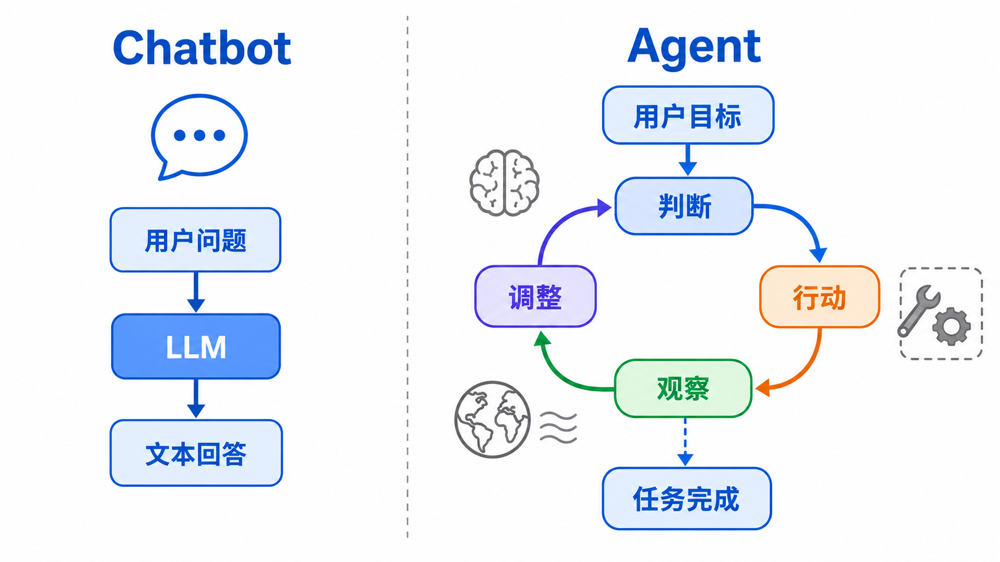

**所以什么是 LLM-based Agent？**

Lilian Weng 在 2023 年的经典综述 *LLM Powered Autonomous Agents* 中，从 Planning、Memory 和 Tool Use 三个方面拆解 Agent。她在 2026 年的 *Harness Engineering for Self-Improvement* 中，把早期 Agent 框架进一步概括为：

```text
Agent = LLM + Memory（记忆） + Tools（工具） + Planning（规划） + Action（行动）
```

通俗地讲：

- **Memory（记忆）**：有两个层次。第一个层次是"别走神"——做任务过程中，记住刚才做了什么、现在该做什么。第二个层次是"积累经验"——上次做类似任务时踩了什么坑、这次别再犯。技术上，简单的记忆靠当前对话的上下文，长久的记忆靠外部存储（想象成 Agent 的"笔记本"，它可以把重要信息记下来，需要时翻出来看）。
- **Tools（工具）**：Agent 光靠“想”是不够的，它需要借助外部能力搜网页、读文件、发送消息或操作机器人。工具决定了 Agent 实际能接触和改变什么。
- **Planning（规划）**：面对复杂任务，先把目标拆成小步骤，再根据执行结果调整。就像整理宿舍时先收书桌、再扫地、最后倒垃圾，而不是毫无顺序地行动。
- **Action（行动）**：把计划真正执行出来。模型提出工具调用或机器人 Skill 请求，外部程序负责执行，执行结果再返回给模型。

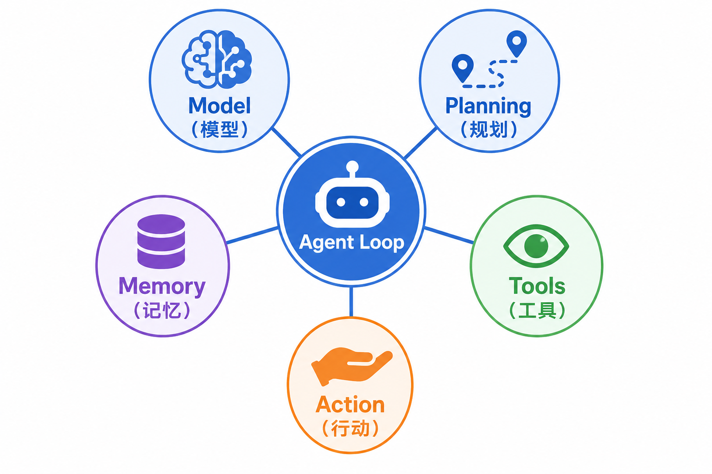


> 上图来自 Lilian Weng 的博客 *LLM Powered Autonomous Agents*（2023）。LLM 位于中心，外围是 Planning、Memory 和 Tool Use。图中没有把 Action 单独画成一个模块，因为行动通常通过工具调用和持续执行过程发生。

这是一张能力清单：LLM 负责理解和推理，Memory 保存状态，Tools 提供外部能力，Planning 决定步骤，Action 把计划变成真实执行。

**一个新的问题：谁负责让 Agent 可靠地工作？**

即使模型已经会规划、会记忆、会调用工具，系统仍可能遇到问题：工具不存在怎么办？连续失败几次应该停？模型说“完成了”，谁来验收？危险操作能不能自动执行？

这些问题不只靠模型回答。Lilian Weng 在 2026 年的博客 *Harness Engineering for Self-Improvement* 中强调，基础模型与真实环境之间的部署系统同样重要。这套负责运行、检查和约束的外围系统称为 **Harness**：

```text
Agent 系统 ≈ Model（模型） + Harness（运行与约束系统）
```

这同样是一种理解框架，而不是数学等式。Harness 的本意是“马具”：模型提供能力，Harness 让这些能力能够受控地工作。随着工具、记忆和任务逐渐复杂，Harness 的具体作用会自然显现出来。

所以 LLM-based Agent 不是"问一句答一句"，而是**围绕一个目标，持续地思考和行动**。就像一个助理，你交代一个任务，它会自己想办法一步步完成，中间遇到问题也会尝试解决。

**用类比来理解**：

- **Chatbot** 像一个知识丰富的图书管理员：你问什么，他根据自己知道的内容回答你。但他不会帮你去找书、不会帮你整理书架、不会帮你录入新书。
- **Agent** 像一个有执行能力的助理：你跟他说"帮我把这些新书分类上架"，他先**规划**（怎么分类、按什么顺序）、靠**记忆**（分类规则记住了、上次的摆放位置也记得）、用**工具**（查库存系统、用推车搬运）、然后告诉你做完了。中间如果发现某本书分类不明确，他会来问你。

所以从 Chatbot 到 Agent 的本质变化是：**从"被动回答"到"主动做事"**。

**Agent 怎样持续做事？**

Agent 不会只思考一次就结束。它会反复经历“想下一步、执行、查看结果、更新状态”，直到任务完成、无法继续或触发停止条件。这种重复运行的工作流程称为 **Agent Loop**，中文可以理解为“Agent 的运行循环”。

Agent Loop 通常包含四步：

```text
Think（思考）-> Act（行动）-> Observe（观察）-> Update（更新状态）
```

- **Think**：根据任务目标，想想下一步该做什么。
- **Act**：调用一个工具，或者向用户提问。
- **Observe**：看看工具返回了什么结果（成功了？失败了？拿到了什么信息？）。
- **Update**：根据结果更新自己的认知，然后回到 Think，继续循环。

例如机器人抓杯子时：

```text
Think：杯子在桌面右侧，下一步尝试抓取
Act：调用 grasp("cup")
Observe：夹爪闭合，但杯子仍在桌面
Update：记录抓取失败，改为重新定位后再抓
```

四步走完并不代表任务结束。Update 之后会再次回到 Think，这就是“循环”的含义。

把这个循环展开来看，Agent 内部实际上在重复做四件事：

1. **Think（思考）**：Agent 看一眼当前情况——"我的任务是什么？我已经做了哪些？上一步结果怎么样？"——然后决定下一步该做什么。这个"下一步"可能是选一个工具、也可能是觉得任务已经完成、也可能是判断自己搞不定了该向人求助。
2. **Act（行动）**：Agent 真正去调用工具。比如去搜索、去读文件、去操作机器人——但注意，Agent 本身不执行，它只是发出"请执行 XX 工具，参数是 YY"的请求，由外面的程序替它执行。
3. **Observe（观察）**：工具执行完了，Agent 收到结果——成功了还是失败了？返回了什么信息？
4. **Update（更新）**：Agent 把刚才的结果记下来——这一步做完了吗？做成功了还是失败了？——然后回到第 1 步，重新思考。

这四步不断重复，像一个"边做边想、错了就改"的人。Agent 不会一口气把所有步骤都定死，而是走一步看一步，每轮都根据最新情况做判断。

为了防止 Agent 在一个问题上反复兜圈子，通常还会设一个**最大步数**。到了上限还没完成，Agent 就停下来汇报"超时未完成"，而不是无限运行下去。

**关键点**：模型本身**不直接执行**工具——它只是"说我需要调用某某工具"。真正执行的是应用程序，应用程序会检查工具是否存在、参数是否合法、有没有权限。这层控制非常重要，因为模型可能会"幻觉"出一个不存在的工具名。

用前面"搜论文做摘要"的例子来感受一下这个循环：

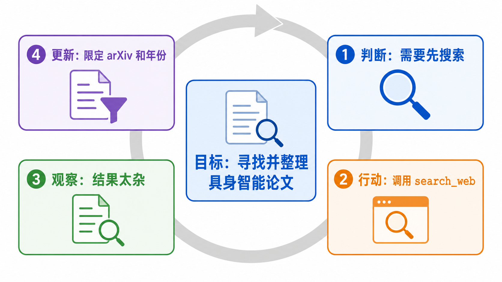

如果是 Chatbot，它被问到"最近有哪些具身智能论文"，只能凭训练时见过的信息回答（可能已经过时了）。Agent 则是真的去搜索、筛选、读摘要、整理成表格——**做了事，不只是说了话**。

> 把这个例子的工具换一下：`search_web` 换成 `navigate_to("厨房")`，`fetch_and_summarize` 换成 `grasp("杯子")`，循环结构完全一样。具身 Agent 和代码 Agent 的区别不在循环本身，而在工具的"另一端"——从服务器变成了电机。

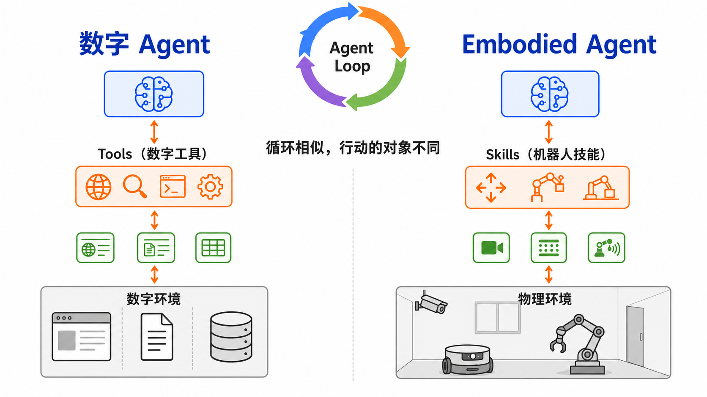

**Agent Loop 的几个工程要点**：

理解了基本循环之后，还有几个实际工程中需要注意的点：

- **步数上限**：必须给 Agent 设置最大执行步数，否则它可能在一个问题上反复尝试、陷入死循环。达到上限后应给出“超时未完成”的明确状态。具体上限应根据任务长度和工具成本设置，机器人任务还要同时设置执行时间与重试次数上限。
- **工具校验**：模型可能"幻觉"出不存在的工具名或不合法的参数。应用层在真正执行前必须校验——工具是否存在？参数类型对不对？必填参数齐不齐？
- **错误要喂回去**：工具失败时，不要把错误信息吞掉，要结构化地返回给模型。模型需要知道"为什么失败"才能调整下一步策略。如果只返回一个"失败"，模型只能瞎猜。
- **能主动停止**：Agent 不是只能被步数上限截断。它自己应该有能力判断"任务已经完成"或"现有信息不足以继续，需要问人"，并主动终止循环。

**为什么不能把 Chatbot 直接当 Agent 用？**

一个自然的问题是：Chatbot 不是也能回答"你可以先运行测试，然后看报错信息……"吗？让它多回答几轮不就行了？

区别在于两个词：**"建议"和"执行"**。

Chatbot 给出的是建议——"你可以这样做"。听不听、做不做、做完之后怎么办，全部由人决定。Agent 是自己做——它真正调用了 run_test，真正读到了报错信息，真正根据报错定位了代码。人在这个过程中可以完全不参与执行细节。

Chatbot 的模式是"人驱动、AI 辅助思考"；Agent 的模式是"人定目标、AI 驱动执行"。这是两者最根本的架构差异。

**你可能在想**：

> *"这个 Agent Loop，和我在编程课上学过的 while 循环有什么区别？"*

好问题。编程课上的 `while` 循环是**写死在代码里的规则**——每轮做什么是程序员预先决定的。Agent 的循环是**模型自己决定每轮做什么**——程序员只提供了工具列表，但什么时候用哪个工具、传什么参数，是模型根据任务情况动态判断的。这就是 Agent "智能"的来源。

> *"模型怎么知道有哪些工具？怎么知道每个工具能干嘛？"*

这是开发者提前告诉它的。开发者把每个工具的名字、功能描述、需要什么参数，以结构化的方式写在系统 prompt 里（可以理解成"说明书"）。

**记住这一点**：Chatbot 只管“说”，Agent 会“做”。Agent 的核心是 LLM 大脑 + 规划 + 记忆 + 工具使用，而任务通过 Agent Loop 持续推进。


### 17.2.2 模型层演进：LLM、VLM、VLA

搞清楚了 Agent 的基本概念之后，一个自然的问题是：Agent 的"大脑"用什么模型？这些模型各自擅长什么？

你可能已经用过 ChatGPT——这背后的模型就是一种 LLM（大语言模型）。它能看懂文字、写出回答，但如果你给它一张照片，让它告诉你"桌子上有什么"，它就做不到了——因为 LLM 只能处理文字。

所以，为了让 Agent 能在真实世界中工作（尤其是机器人场景），我们需要不同类型的模型来分工。模型层按处理的信息类型，大致分成三类：

**LLM（Large Language Model，大语言模型）**

- 吃什么：纯文本
- 吐出什么：纯文本、计划、工具调用请求
- 擅长什么：理解文字指令、拆解任务、逻辑推理、写代码
- 不擅长什么：看不懂图片，不知道物理世界长什么样
- 在 Agent 里的角色：**规划者**——"我们要做什么、按什么顺序做"

你可以把 LLM 想象成一个**"只读过书、没见过真实世界"的军师**。他很会分析局势、制定计划，但他自己看不见战场。

代表模型包括 GPT、Claude、Deepseek等模型系列。在 Agent 场景中，不必只看普通问答排行榜，更要关注它的 **function-calling 能力**（能否准确选择工具并生成参数）、长任务稳定性，以及遇到工具错误后能否正确调整。

**VLM（Vision-Language Model，视觉语言模型）**

- 吃什么：图片 + 文字
- 吐出什么：图片里的东西是什么、在什么位置、什么状态
- 擅长什么："看懂"场景——识别物体、理解空间关系、判断状态（门是开还是关）
- 不擅长什么：不直接输出机器人的动作
- 在 Agent 里的角色：**观察者**——"现在周围是什么情况"

VLM 就像**军师派出去侦察的斥候**——"报告！桌上有两个杯子，红色的在左边，蓝色的在右边。抽屉是关着的。"

**VLA（Vision-Language-Action，视觉语言动作模型）**

- 吃什么：图片 + 文字指令 + 机器人当前状态
- 吐出什么：机器人动作——手臂往哪移、夹爪开还是合
- 擅长什么：把"抓那个杯子"变成精确的电机指令，完成局部操作
- 不擅长什么：长程规划、复杂条件判断、错误恢复
- 在 Agent 里的角色：**执行者**——"把这一步具体做出来"

VLA 就像**训练有素的士兵**——他不需要知道整场战役的计划，只需要精确执行"现在攻下这个山头"。

**这三个模型怎么配合？**

```text
用户说："帮我把桌上的红杯子递给我"

LLM（规划者）：好，我要：1.看场景 2.找红杯子 3.抓 4.递

VLM（观察者）：[看照片] 桌上有一个红杯子，在键盘右边大概一拳的位置，旁边没有障碍

LLM：那就抓。

VLA（执行者）：[收到"抓杯子"指令] 移动手臂到预抓取位 → 降下 → 闭合夹爪 → 感受到力 → 提起
```

**关键认知**：不是让某一个模型包揽所有事情，而是**让不同模型各司其职**，组织成一个可以协作的系统。

### 17.2.3 Agent 发展阶段

LLM-based Agent 不是一夜之间冒出来的。它经历了从简单到复杂的逐步演进，每个阶段解决一个核心问题。

这里的“阶段”是一条由简单到复杂的理解路线，不是严格的产品年代划分。RAG、Memory、MCP、Skill 和 Runtime 并不会相互替代，它们往往同时存在于一个现代 Agent 中。按照问题出现的顺序理解，可以每次只解决一个困难。

整条路线只有三层难度：

```text
第一层：怎样让程序读懂模型输出？
        Structured Output（结构化输出）

第二层：怎样让模型真正行动，并根据结果继续？
        Function Calling（函数调用）→ ReAct

第三层：怎样让长任务稳定运行？
        Context Engineering（上下文工程）→ Memory → MCP → Skill → Harness
```

九个阶段的关系如下：

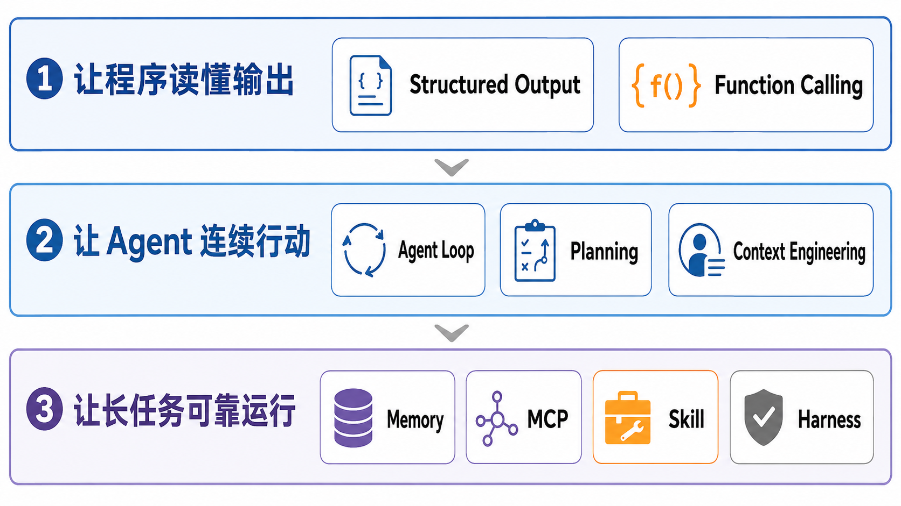

> 每一步能力都是被实际问题推出来的：自由文本难以解析，于是需要 Structured Output；模型无法行动，于是需要 Tool Calling（工具调用机制）；长任务容易跑偏，于是需要状态、Memory 和 Harness。

#### 阶段 A：Prompt-only / Chatbot

这是最早、最简单的形态。用户输入一段文字，模型返回一段文字。一次对话就是一轮问答。

这一阶段的问题是三个"不"：

- **输出不可控**：模型可能回答一大段、也可能只回一句话；格式不固定。
- **程序不可解析**：如果程序想从回答中提取一条"可执行的指令"，需要写正则表达式去猜，非常脆弱。
- **不能调用外部能力**：模型不能说"我先查一下数据库"——它只能凭训练时记住的知识回答。

一句话总结这个阶段：**模型"能说"，但"不能做"**。

#### 阶段 B：JSON / Structured Output

为了让模型的输出能被程序可靠地读取，人们开始要求模型输出结构化的 JSON，而不是自由文本。

这一阶段有两个层次：

- **JSON mode**：保证输出是合法 JSON 字符串，但不保证字段名和字段类型对。比如模型可能把 `"confidence": "high"`（字符串）而不是 `"confidence": 0.95`（数字）。
- **Structured Output**：要求模型严格按照给定的 JSON Schema 输出，字段名、类型、必填/可选全部保证。这是真正可被程序消费的。（可以把 JSON Schema 理解成一份“数据格式说明书”——它定义了每个字段叫什么、是数字还是文字、能不能为空。程序拿到数据后，先对照说明书验一遍，验不过就拒收。）

一个例子：

```json
// 想让模型分析用户意图，程序需要稳定的 JSON：
{
  "intent": "read_file",
  "args": {
    "path": "/home/user/notes.md"
  },
  "confidence": 0.92
}
```

这个阶段的关键词是三个"可"：**可解析**（程序能自动读）、**可校验**（能检查对不对）、**可接入业务系统**（能直接喂给下游程序）。

但 Structured Output 只解决了“输出格式”的问题——模型输出的还是“我想读文件”，而不是真正去读了文件。

#### 阶段 C：Function Calling / Tool Calling

这是 **从 Chatbot 到 Agent 的关键转折点**。**Function Calling（函数调用机制）**让模型不只是“说应该做什么”，而是“请求调用某个函数”；当被调用对象是外部工具时，也常称为 **Tool Calling（工具调用机制）**。

**工作原理**：

1. 开发者把能用什么工具、各自有什么参数，以 JSON Schema 的形式提前告诉模型。
2. 模型在对话中自己判断：我该不该用工具？用哪个？传什么参数？
3. 应用层收到模型的调用请求后，**真正执行**工具，拿到结果。
4. 应用层把工具结果传回给模型，模型根据结果继续思考。

工具描述的例子（这是开发者写好的，提前给模型）：

```json
{
  "name": "search_web",
  "description": "在互联网上搜索信息。当需要查最新资讯或不知道的事情时使用。",
  "parameters": {
    "query": {
      "type": "string",
      "description": "搜索关键词"
    },
    "num_results": {
      "type": "integer",
      "default": 5,
      "description": "返回几条结果"
    }
  }
}
```

一个类比：Function Calling 就像给图书管理员配了一个**真正的借阅系统**。以前你问“有这本书吗”，管理员只能说“我记得好像有”；现在管理员可以在系统里真的查一下库存、帮你预约、帮你续借——他有了做事的“手”，而不仅是说话的“嘴”。

> 注意：工具可以是数字的（搜网页、读文件、调 API），也可以是物理的（抓取、移动、推）。Function Calling 的机制完全一样——模型选择工具、生成参数、等待结果——区别只在于执行端：数字工具的执行端是服务器，物理工具的执行端是电机。这个统一性是 LLM-based Agent 能直接延伸到 Embodied Agent 的关键。

**工具调用的常见模式**：

在实际 Agent 中，工具调用不只是"一次调一个"这么简单。常见的有几种模式：

| 模式 | 说明 | 例子 |
|------|------|------|
| 单次调用 | 一个工具调用拿到答案，任务结束 | "今天天气怎么样" → search_weather() |
| 顺序调用 | A 的结果是 B 的输入，必须按顺序 | read_file() → summarize() → save() |
| 并行调用 | A 和 B 互不依赖，可以同时调 | 同时查三个城市的人口数据 |
| 条件调用 | 根据前面结果决定要不要调下一步 | "如果北京人口 > 上海人口，就画图" |
| 重试调用 | 工具失败了，修改参数或换策略重来 | 网络超时 → 等 3 秒 → 重试 |

一个好的 Agent 需要能根据任务需求在这些模式之间自由切换。

#### 阶段 D：ReAct / Plan-Act-Observe Loop

Function Calling 解决了“调用工具”的问题，但很多任务需要反复调用、根据反馈调整。

Think-Act-Observe 是 Agent Loop 的基本节奏。它的经典代表是 **ReAct**（Reasoning + Acting，推理 + 行动）。

ReAct 的核心思想是：**让语言模型交替生成"思考轨迹"和"任务动作"，动作的结果（观察）再喂回模型，影响下一步思考。**


下面再对照 ReAct 论文中的原始结构图。论文把 Thought（思考）、Action（行动）和 Observation（观察）交错排列，说明模型会依据每次行动的返回结果决定下一步。


> 上图来自 ReAct 原始论文，展示了在不同类型任务中，模型交替生成 Thought（思考）、Action（行动）、Observation（观察）的完整轨迹。左侧是知识密集型的问答任务（HotpotQA），右侧是决策型的交互任务（AlfWorld）。

ReAct 的一个很好的特性是**可解释性**——每一步的思考、行动、观察都被记录下来了。出了问题时，你能清楚地看到 Agent 在哪一步想错了、做错了。这对于调试和建立信任都很关键。

**一个更完整的例子**：假设用户说"帮我查一下北京和上海的常住人口，如果北京人口更多就画一个柱状图"。

这个例子体现了一个关键点：Agent 不是机械地执行"查询→画图"的固定流程，而是在拿到数据后做了**条件判断**——发现条件不满足，就跳过了画图步骤。这种"根据中间结果动态调整后续步骤"的能力，是 ReAct 循环的核心价值。

ReAct 的局限：当步数多了，模型容易"忘记"远在最开始的目标。这就是下一步要解决的问题。

> 这套 Agent Loop 在具身 Agent 中结构基本相同，只是 Act 从“调 API”变成了“调电机”。ReAct 论文的实验在纯文本领域，但这种循环后来成为许多 Embodied Agent 的设计模板：LLM 推理 → 调用 Skill → 观察传感器反馈 → 更新计划。


#### 阶段 E：RAG / Context Engineering

RAG（Retrieval-Augmented Generation，检索增强生成）最开始解决一个简单问题：模型的训练数据有过期日，它不知道训练之后发生的事情；也访问不到公司的内部文档。

Context Engineering（上下文工程）关注的是：每一轮应该把哪些信息交给模型，哪些信息留在外部，需要时再取回。

**标准 RAG 流程**：

```text
用户提问
→ 把问题转成向量（embedding）
→ 在向量数据库里找"和这个问题最像"的文档片段
→ 把找到的文档片段塞进 prompt
→ 模型读着这些参考资料来回答
```

> **"向量"是什么？** 你可以先简单理解成：把一段文字变成一串数字，使得"意思相近"的文字在数字上也相近。比如"苹果"和"水果"在数字空间里离得很近，但和"汽车"离得很远。这样计算机就能通过比较数字来找"和这个问题最相关的内容"。不用深入了解数学原理，知道它能做什么就够了。

但在 Agent 场景中，问题比 RAG 更广。Agent 每一轮"思考"时，面对的是**上下文怎么组织**的问题：什么东西该放进 prompt、什么不该放？

这也是较新的 Harness 视角特别强调的一点：长任务不能简单地把所有历史都塞给模型。上下文窗口像人的工作台，东西堆得越多，不一定越容易工作。真正重要的是把当前步骤需要的信息放在手边，把完整日志和中间产物保存在外部，需要时再取回来。


可能放进上下文的"原料"包括：

```text
- 用户最初的目标是什么（不能忘！）
- 已经做完了哪些事、还剩哪些
- 刚才几次工具调用的结果
- 目前有哪些工具可以用
- 哪些工具失败过、为什么
- 有什么约束（时间限制、权限限制……）
```

**上下文组织不好，Agent 会出现什么问题？**

- **目标漂移**：做了 15 步之后，模型忘了最初用户要干什么，开始跑偏。
- **重复踩坑**：同一个工具用同样的错误参数连续失败 5 次，没意识到要换个办法。
- **幻觉工具**：模型"发明"了一个不存在的工具名——因为它记混了有哪些工具可用。

Context Engineering 中的组件，都是被具体问题“逼出来”的：

- 文件格式太杂，PDF、Word 和网页没法直接统一读取，于是需要 **Document Parser（文档解析器）**把它们整理成文本。
- 文档太多，逐篇阅读太慢，于是用 **Embedding（嵌入）**把文字变成便于比较的数字，再存入支持相似度搜索的 **Vector DB（向量数据库）**。
- 第一次找回的内容太多、排序不够准，于是用 **Reranker（重排序模型）**重新挑出最相关的几条。
- 有些问题关心明确关系，例如“杯子在哪个房间、柜门是否能打开”，于是可以用 **Knowledge Graph（知识图谱）**保存“物体—位置—状态”之间的关系。

初学阶段不需要搭建完整技术栈。只要记住：Context Engineering 解决的不是“怎样把更多内容塞进去”，而是“怎样把当前最有用的内容交给模型”。


#### 阶段 F：Memory

Memory 不只是"把聊天记录存下来"。好的记忆系统要回答三个问题：**记什么、怎么查、怎么用**。

还要再加一个问题：**什么时候更新或丢弃？** 如果错误状态一直保留、过期信息反复被取回，记忆反而会误导 Agent。因此，现代 Agent 工程更关心“记忆生命周期”，而不只是把信息存进去。

**记忆可以拆成五类**：

| 记忆类型 | 记的是什么 | 有什么用 |
|----------|-----------|----------|
| Working memory | 当前这次任务的状态——正在做什么、刚才工具返回了什么 | 让你别走神 |
| Episodic memory | 以前做过的任务的完整过程 | 复盘、积累经验 |
| Semantic memory | 用户偏好、事实知识（如"用户讨厌等待""北京是中国的首都"） | 个性化、知识补充 |
| Procedural memory | 可复用的流程、代码套路、操作模板 | 遇到类似任务直接用 |
| Reflective memory | 失败教训、自我反思、以后该怎么避免 | 别再踩同一个坑 |

这五类的划分来源于 Generative Agents 及后续的记忆系统研究。

> 具身 Agent 在五类记忆之上还有一种特殊需求：**空间记忆（spatial memory）**——记住物体在哪、这个柜子能不能打开、上次从这个角度够不到。这是数字 Agent（跟文件、数据库打交道）不需要但 Embodied Agent 必需的记忆维度。


**两个值得了解的代表性工作**：

- **Generative Agents**：这是比较早期但非常经典的 Agent 架构。它提出了 memory stream（按时间排列的事件流）+ reflection（定期反思——从一堆具体事件中抽象出更高级的认知）+ planning（根据记忆和反思做计划）的完整方案。论文中的 25 个虚拟角色能自主地在虚拟小镇中生活、社交、做计划。


> 上图来自 Generative Agents 原始论文。从图中可以看到：Agent 的每一次经历都存入 Memory Stream（记忆流），系统定期从记忆中做 Reflection（反思），形成更高层次的认知；Planning（规划）再基于记忆和反思生成后续行为。这个"感知→记忆→反思→规划→行动"的架构是许多现代 Agent 系统的思想源头。

- **Mem0**：Agent 记忆的一种代表性工程方案。它尝试把不同层次的记忆保存在外部，并在需要时检索回来。对初学者来说，重点不是记住它用了哪些数据库，而是理解“长期记忆需要独立于当前对话存在”。

#### 阶段 G：MCP（Model Context Protocol）

MCP 最初由 Anthropic 于 2024 年底开源提出，目前由开放社区按照公开治理流程维护。它是一种**上下文与能力交换协议**，用于标准化 AI 应用与外部系统之间的连接。

**为什么需要 MCP？想象一个场景**：

你写了一个 Agent，让它能读文件、搜代码、查数据库。为此你给每个工具写了一段连接代码。但换了一个 Agent 框架后，所有连接代码都要重写——因为每种框架定义工具的方式不一样。如果有 100 个 Agent 应用、50 种工具，就有 5000 个"连接代码"需要维护。这显然不可持续。

MCP 的目标是定义一套共同的通信规则。把能力实现为 MCP Server 后，支持 MCP 的 AI 应用可以用统一方式发现和连接它；是否允许真正调用，还取决于双方支持的能力、身份认证和权限设置。

**谁在参与通信？**

MCP 采用 Host–Client–Server 架构：

```text
Host（AI 应用）
├── Client A ── Server A（文件系统）
├── Client B ── Server B（数据库）
└── Client C ── Server C（机器人 Skill）
```

- **Host**：真正的 AI 应用，例如 Claude Code、VS Code 或 Embodied Agent Runtime。Host 负责管理模型、多个连接、上下文、用户授权和安全策略。
- **Client**：Host 内部的连接组件。通常一个 Client 维护与一个 Server 的独立连接。
- **Server**：提供专门上下文或能力的本地/远程程序，例如文件系统 Server、数据库 Server 或机器人 Skill Server。

**Server 可以提供什么？**

| 类型 | 作用 | 例子 |
|---|---|---|
| **Tools** | 可以执行的操作 | 写文件、查询数据库、调用 `grasp()` |
| **Resources** | 提供给应用的上下文数据 | 文件内容、机器人状态、任务日志 |
| **Prompts** | 可复用的交互模板 | 代码审查模板、机器人任务规划模板 |

MCP 的底层消息使用 JSON-RPC，连接可以运行在本地进程，也可以通过网络连接远程 Server。初学阶段不需要记通信细节，重点是理解 Host、Client 和 Server 的职责边界。

**MCP 不是 Function Calling 的替代品**：

这是容易搞混的地方：

```text
Function Calling：模型怎样表达“我想调用某个函数”
MCP：Host 怎样发现、连接并管理外部上下文和能力
```

两者可以组成一条完整调用链：

```text
模型通过 Function Calling 选择 Tool
→ Host 中的 MCP Client 把请求发给 MCP Server
→ Server 执行并返回结果
→ Host 把结果交回模型
→ Agent Loop 继续
```


**MCP 不等于安全层**：

MCP 规定“怎样连接和交换消息”，不会自动保证 Tool 安全。在 Embodied Agent 中，即使 MCP Server 暴露了 `move_arm()`，Host/Harness 仍然必须检查参数、用户权限、速度与力限制、工作空间和急停条件。MCP 可以连接机器人 Skill，但不能替代机器人控制器和安全边界。

#### 阶段 H：Skill

Tool 是一个函数——有名字、有入参、有出参。但很多真实能力不能简化成单个函数。

**Tool vs Skill**：

Tool 就像工具箱里的一把螺丝刀——它做一件事，很清楚。Skill 则像一份"工作指南"——它不仅告诉你"用螺丝刀"，还告诉你"什么情况下该拧这颗螺丝、拧多紧、拧完检查什么"。

根据 Anthropic 的 Agent Skills 规范和 OpenAI Codex Skills 的设计，一个 Skill 通常是一个目录，中心是一份 `SKILL.md` 文件：

```text
Skill 目录结构（示意）：
skill_name/
  ├── SKILL.md        # 核心：何时使用、怎么做、注意什么、什么情况禁用
  ├── scripts/        # 配套执行脚本
  ├── templates/      # 输出模板
  └── references/     # 参考资料
```

**Skill 和 Procedural Memory 的关系**：

在阶段 F 中，Procedural memory 存的是"怎么做事"的知识。Skill 就是这种记忆的**工程化形态**——它把"经验流程"封装成了可发现、可调用、可维护的模块。

**Tool 和 Skill 的区分**：

- **Tool**：一个输入、输出都很明确的可调用函数，例如 `read_file(path)` 或 `get_camera_image()`。模型发起调用，再拿回结构化结果。
- **Skill**：加载到 prompt 中的 `SKILL.md` 指令包。它不是被"调用"的，而是通过注入指令来影响 Agent 的行为和决策。

> 不同社区对 Skill 的叫法并不完全一致。LLM Agent 中的 Skill 常指一套可复用的操作说明、脚本和资料；机器人领域的 Skill 通常指可调用的行为单元。在机器人场景中，`navigate_to`、`grasp`、`place` 这类行为都属于 Skill。每个 Skill 不只是“一个函数”，而应封装感知→规划→执行→验证的完整闭环。

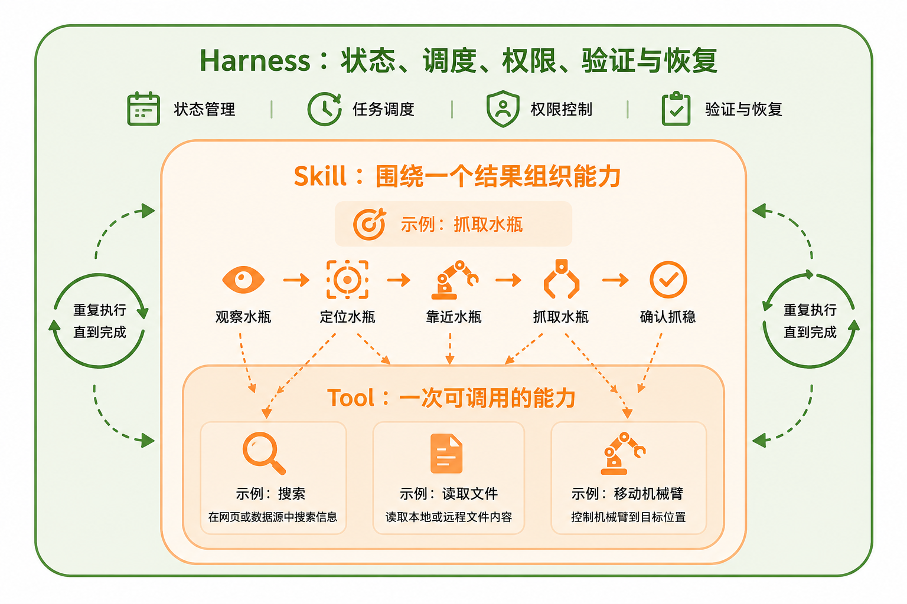

#### 阶段 I：Agent Runtime（运行环境）/ Harness

当工具越来越多、Memory 越来越长、Skill 越来越复杂时，谁来真正运行 Agent Loop、执行 Tool 并保存任务状态？这部分程序称为 **Agent Runtime**。

但“能运行”还不等于“可靠运行”。系统还需要组织 Context、记录中间产物、检查结果、控制权限并处理失败。包含 Runtime 在内的这套完整运行与约束系统，就是 **Harness**。

**Harness 围绕 Runtime 还要管理什么？**

- 工作流管理：当前做到哪了，下一步继续、重试还是结束
- 工具注册与发现：有哪些工具可用，参数和返回值是什么
- 上下文组装：这一轮真正需要给模型哪些信息
- 持久状态：把计划、中间结果、错误和产物保存在上下文之外
- 轨迹与评测：记录每一步，并用测试或检查器判断结果
- 权限控制：限制高风险操作，在关键节点请求人工确认
- 并发与后台任务：管理耗时工具或多个子任务

Claude Code、Codex、OpenClaw 一类数字 Agent 已经让 Harness 的作用变得很直观：模型读取文件、修改内容、运行命令、看到报错，再继续修正；文件系统保存中间产物，测试负责验收，权限系统限制危险操作。

把能力视角和工程视角放在一起，就能看到两条公式的区别：

```text
能力视角：    Agent = LLM + Memory + Tools + Planning + Action
                              ↑ Agent 需要哪些能力？

工程视角：    Agent 系统 ≈ Model + Harness
                                ↑ 这些能力怎样被组织、检查和约束？
```

二者并不矛盾：第一条像零件清单，第二条像整机装配与质量管理。迁移到机器人时，结构没有变，只是对象变了：

| 数字 Agent | Embodied Agent |
|---|---|
| 读取代码、文件和网页 | 读取图像、位姿、力和机器人状态 |
| 调用 Shell、搜索、编辑工具 | 调用导航、检测、抓取、放置 Skill |
| 运行测试判断代码是否正确 | 调用 `check_grasp`、`check_success` 判断动作是否成功 |
| 文件、任务清单和运行日志 | Episode、空间记忆、任务状态和失败视频 |
| 沙箱、命令白名单、人工审批 | 速度/力限制、工作空间、急停和人工接管 |

这里的 **Episode（一次完整任务记录）**指从任务开始到结束的完整执行过程，通常包含观察、动作、状态、时间戳和任务结果。它相当于机器人完成一次任务留下的“全过程录像和实验记录”。

**Harness 为什么与持续改进有关？**

早期大家常把“改进 Agent”理解成修改 prompt 或换一个更强模型。Harness Engineering 提醒我们，改进对象还可以是上下文、工作流、检查器和 Harness 代码。

例如，一个机器人连续三次出现“夹爪闭合了，但杯子并没有被抓起来”。除了重新训练 VLA，还可以先修改工作流：

```text
原流程：grasp → place

改进后：grasp → check_grasp
                  ├─ 成功 → place
                  └─ 失败 → change_view → retry
```

这个例子非常重要：**系统变得更可靠，不一定每次都要重新训练大模型。**增加检查步骤、保存失败轨迹、调整 Skill 顺序，同样是在改进 Agent。

但机器人不能无限制地“自己改自己”。**Evaluator（评测器）**、权限控制和安全边界必须放在自我改进循环之外。Agent 可以提出新的恢复策略，却不能自行关闭碰撞检测、提高速度上限或绕过真机审批。

**从数字世界走向物理世界**：

从 Chatbot 到 ReAct、Function Calling、Memory 和 Harness，语言模型逐渐变成了一个能持续做事、检查结果并受到权限约束的系统。把数字工具换成传感器、电机和机器人 Skill，Agent Loop 仍然成立，但每一步都增加了物理后果和安全要求。

---

## 17.3 Embodied Agent 的通用架构

> “行业应该从关注单一模型能力，转变到关注 Agentic 系统能力。”
>
> ——张巍，逐际动力创始人，[36氪访谈，2026](https://eu.36kr.com/zh/p/3668859815158405)

一个模型能够听懂指令，并不意味着机器人已经能够完成任务。它还需要保存状态、选择 Skill、控制身体、检查结果，并在失败后调整计划。

假设你对机器人说：

> 从冰箱里拿一瓶水，放到客厅茶几上。

人听到这句话，会自然地想到“先去厨房，再开冰箱”。机器人却必须把每一步都变成可以执行、可以检查的过程：冰箱在哪里？门是否已经打开？水瓶能不能够到？抓取后怎样确认没有夹空？

这正是 Embodied Agent 要解决的问题。它沿用数字 Agent 的 Planning、Memory、Tools 和 Agent Loop，但必须增加连接认知与身体的系统结构。

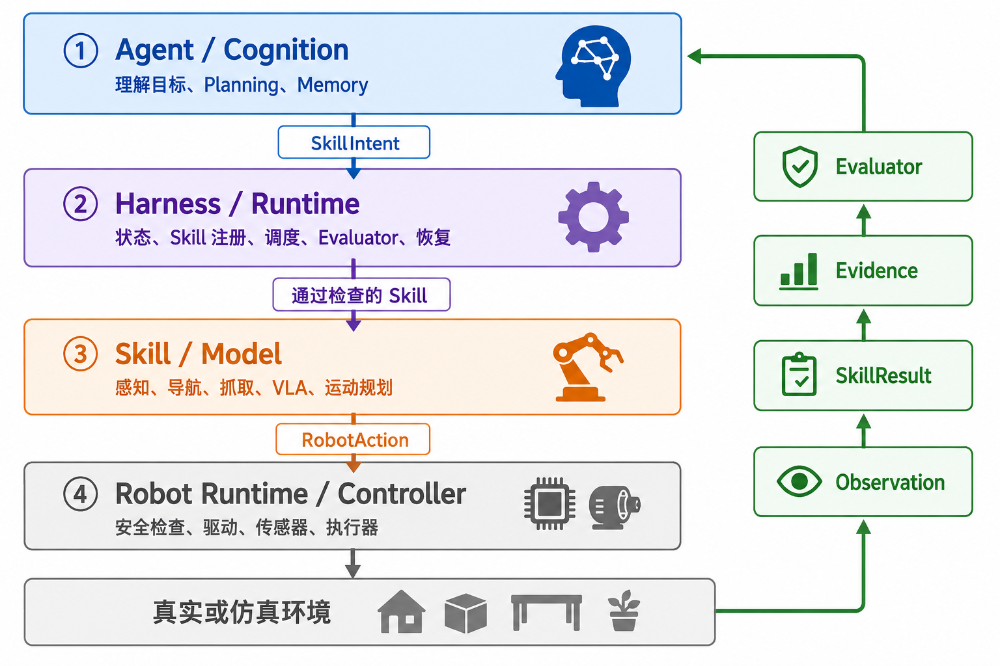

### 17.3.1 为什么不能让 LLM 直接控制机器人？

假设 LLM 直接输出“把机械臂向前移动 20 厘米”。执行前至少还有几个问题没有回答：目标是否仍在原位？前方有没有人？机械臂能否到达？移动后怎样确认没有碰倒水瓶？


LLM 适合理解目标和选择下一步，却不适合承担毫秒级控制、确定性安全检查和物理结果验证。因此，一个 Embodied Agent 通常采用四层架构：

```text
┌──────────────────────────────────────────┐
│ Agent / Cognition                        │
│ 理解目标、Planning、Memory、选择下一步    │
└──────────────────┬───────────────────────┘
                   │ SkillIntent（技能意图）
┌──────────────────▼───────────────────────┐
│ Harness / Runtime                        │
│ 状态、Skill 注册、调度、Evaluator、恢复   │
└──────────────────┬───────────────────────┘
                   │ 通过检查的 Skill
┌──────────────────▼───────────────────────┐
│ Skill / Model                            │
│ 感知、导航、抓取、VLA、VLN、运动规划      │
└──────────────────┬───────────────────────┘
                   │ RobotAction（机器人动作）
┌──────────────────▼───────────────────────┐
│ Robot Runtime / Controller               │
│ 安全检查、驱动、传感器、执行器            │
└──────────────────┬───────────────────────┘
                   │
              真实或仿真环境
                   │
       Observation / SkillResult（技能结果）/ Evidence（任务证据）
                   └──────────────────────→ 向上反馈
```

四层分别回答不同的问题：

| 层次 | 主要职责 | 不应该承担的职责 |
|---|---|---|
| Agent / Cognition | 理解目标、拆解任务、选择 Skill | 直接生成电机控制量 |
| Harness / Runtime | 保存状态、验证请求、调度、评测和恢复 | 替代底层控制器 |
| Skill / Model | 完成一次感知、导航、抓取或放置 | 决定整个长程任务目标 |
| Robot Runtime / Controller | 驱动硬件并执行确定性安全检查 | 理解开放式自然语言任务 |

分层不是为了把系统画得更复杂，而是为了让模型、Skill 和机器人分别演进，并让危险动作始终经过确定性的执行边界。


### 17.3.2 慢系统与快系统怎样协作？

四层架构说明“谁负责什么”，快慢系统说明“不同决策在多长时间内发生”。

```text
慢系统：任务理解、长程 Planning、Memory、失败恢复
                    ↓ SkillIntent
快系统：局部感知、Skill、VLA、运动规划、安全控制
```

例如，慢系统决定“先拿水，再去客厅”；快系统在抓取过程中持续调整轨迹、限制速度并检查夹爪状态。这里的“快”描述决策时间尺度，不代表某个 VLA 模型的推理延迟一定很短。

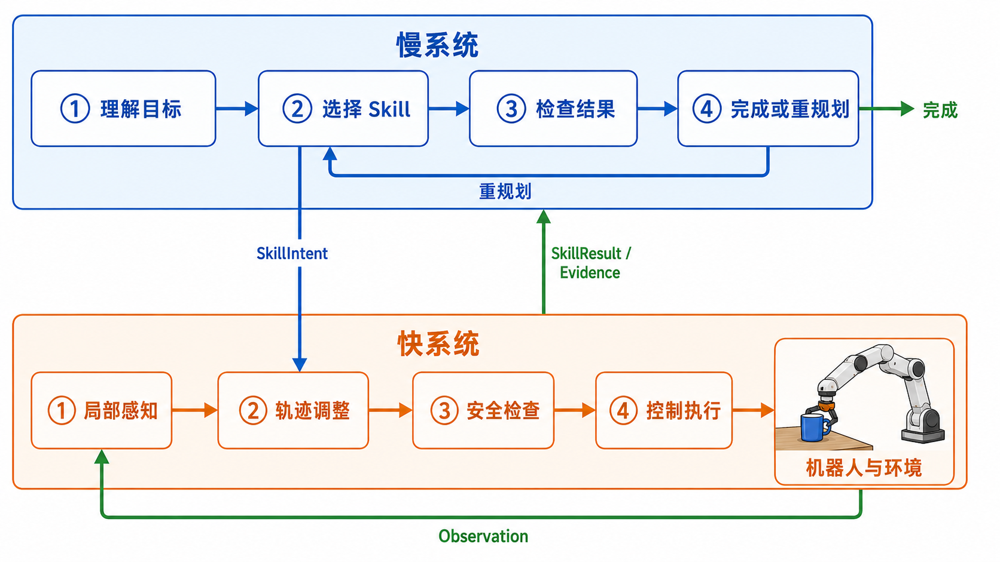

两个系统要持续协作，必须共享当前状态。机器人至少需要维护三类信息：

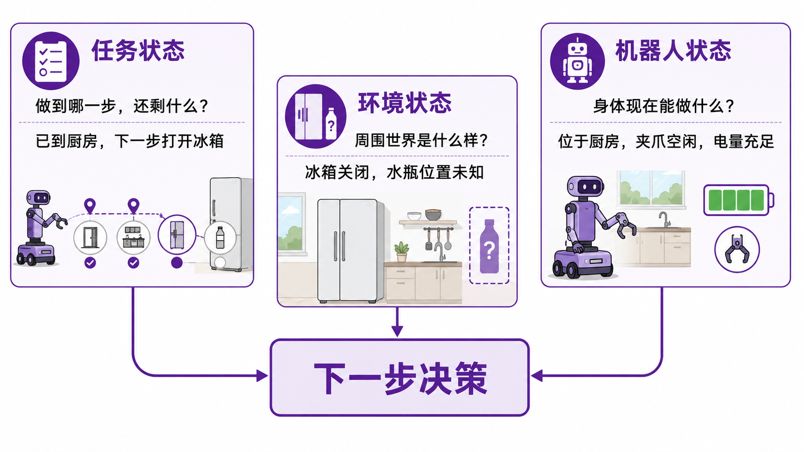

| 状态 | 要回答的问题 | 冰箱取水示例 |
|---|---|---|
| **任务状态** | 做到哪一步，还剩什么？ | 已到厨房，下一步需要开冰箱 |
| **机器人状态** | 身体现在能做什么？ | 位于厨房，夹爪空闲，电量充足 |
| **环境状态** | 周围世界是什么样？ | 冰箱关闭，水瓶位置未知 |

一种简化的状态记录可以写成：

```json
{
  "task_state": {
    "goal": "把水瓶放到客厅茶几上",
    "current_step": "open_fridge",
    "completed": ["navigate_to_kitchen"]
  },
  "robot_state": {
    "location": "kitchen",
    "gripper": "open",
    "battery": 0.82
  },
  "world_state": {
    "fridge": "closed",
    "water_bottle": "unknown"
  }
}
```

这三类状态不会自动出现，它们来自不同的传感器和软件模块：

```text
相机、深度相机、麦克风、力传感器、关节编码器
                         ↓
                 感知与状态估计
                         ↓
              Agent 可读取的 Observation
```

**Observation（观察结果）**不是把所有原始数据一股脑塞给 LLM，而是把当前任务需要的信息整理成结构化结果。例如，深度相机和物体检测模块可以共同返回：

```json
{
  "object": "water_bottle",
  "visible": true,
  "position": [0.42, -0.15, 0.81],
  "reachable": false,
  "reason": "blocked_by_container"
}
```

Agent 不需要亲自从数百万个像素中计算距离，只需要理解：水瓶已经找到，但现在够不到。接下来它可以选择移动身体、调整视角或先移开障碍物。

空间信息还会随动作变化。机器人打开冰箱后，门的角度变了；碰倒水瓶后，水瓶的位置也变了。因此，Embodied Agent 的 Memory 不是静态笔记，而是一个需要不断更新的任务与世界状态。

### 17.3.3 目标怎样逐层变成机器人动作？

向下传递的信息会越来越具体：

```text
用户目标
→ TaskContract（任务合同）：任务目标和可检查的成功条件
→ SkillIntent：Agent 希望调用哪个 Skill
→ Skill：组织一次完整的机器人能力
→ RobotAction：控制器能够执行的动作
→ 电机和执行器
```

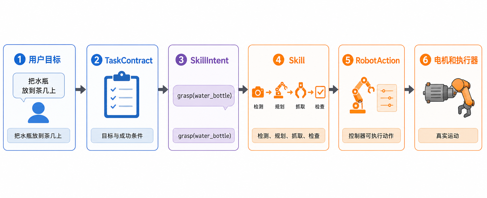

例如，Agent 不应该直接构造机械臂关节角，而是提出：

```json
{
  "skill": "grasp",
  "objective": "拿起水瓶",
  "arguments": {"object_id": "water_bottle"}
}
```

Harness 收到这个 **SkillIntent（技能意图）**后，会检查 Skill 是否存在、参数是否完整、机器人是否在线以及当前是否允许运动。只有通过检查的请求才会进入 Skill 层。

例如，抓取 Skill 内部可能包含：

```text
检测水瓶
→ 估计抓取位置
→ 检查是否可达
→ 规划机械臂轨迹
→ 闭合夹爪
→ 根据夹爪宽度和力传感器检查结果
```

VLA 很适合承担其中需要视觉理解和灵巧动作的部分，传统运动规划器和控制器则擅长精确几何、安全轨迹和实时控制。它们不是相互替代，而是可以成为同一个 Skill 的不同实现。

这里最重要的边界是：

> Agent 决定“做什么”，Skill 组织“怎样完成这一件事”，控制器保证“硬件怎样稳定运动”。

### 17.3.4 物理结果怎样逐层变成 Evidence？

机器人执行后，信息沿相反方向返回：

```text
传感器原始数据
→ Observation：系统整理出的当前观察
→ SkillResult：本次 Skill 是否正常结束
→ Evidence：与任务成功条件直接相关的证据
→ Evaluator：判断任务已完成还是仍需继续
```

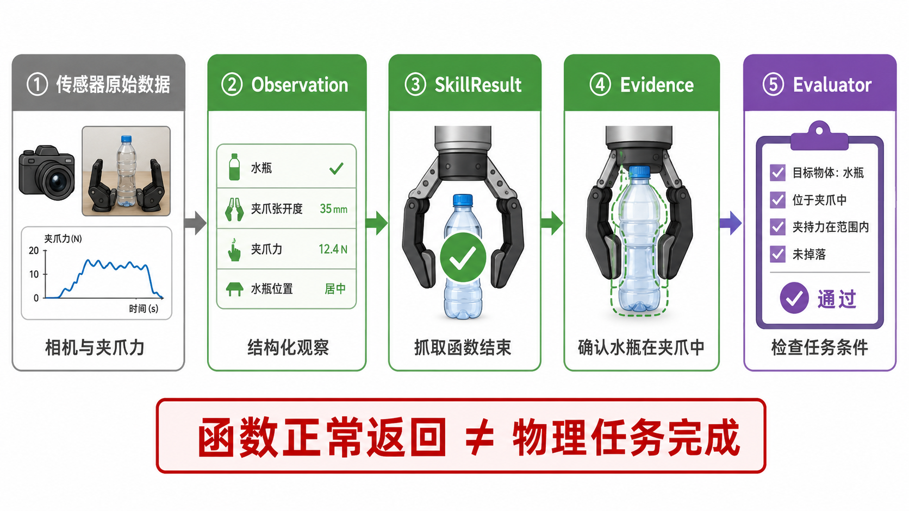

这四个概念不能混为一谈。相机拍到水瓶属于 Observation；`grasp` 没有报错属于 SkillResult；相机和夹爪传感器共同确认“水瓶被机器人持有”才属于 Evidence。

当 Agent Loop 开始控制机器人时，还需要加入物理结果验证和状态更新，因此可以展开为六步：

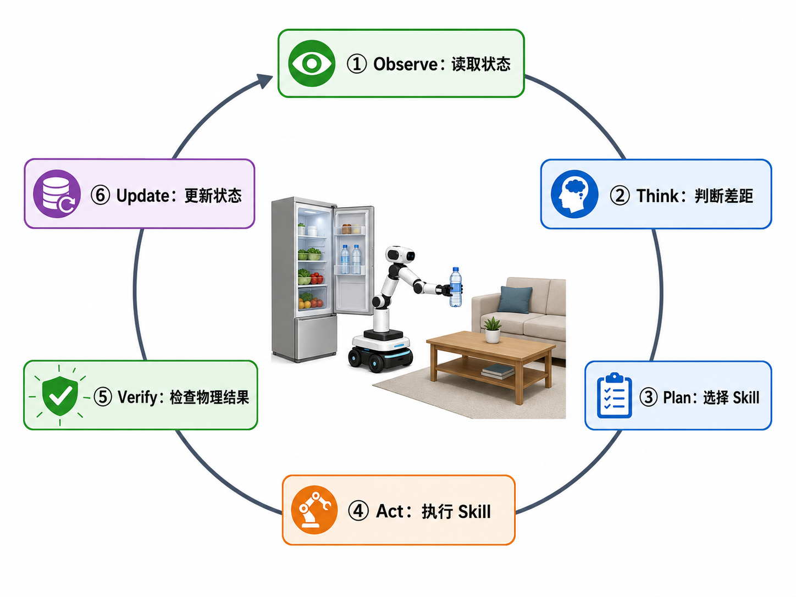

```text
Observe：读取任务状态、机器人状态和环境状态
Think：判断当前情况与目标之间的差距
Plan：选择或更新下一步 Skill
Act：执行 Skill
Verify：用传感器证据检查物理结果
Update：更新状态，然后继续、重试、重规划或求助
```

现在让机器人真正开始冰箱取水任务。

**第一轮：前往厨房**

```text
Observe：机器人位于客厅，厨房位置已知
Plan：navigate_to("kitchen")
Act：导航 Skill 开始执行
Verify：定位系统确认机器人已到达厨房入口
Update：完成“前往厨房”，下一步是打开冰箱
```

**第二轮：冰箱里没有水**

```text
Observe：冰箱已经打开，但没有检测到水瓶
Think：原计划的前提不成立
Plan：先去储物间寻找水瓶
Update：修改剩余任务，而不是继续抓取不存在的目标
```

这叫 **Replanning（重规划）**：任务目标没有改变，但通往目标的路径改变了。

**第三轮：第一次抓取夹空**

```text
Act：grasp("water_bottle")
Verify：夹爪已闭合，但力传感器和相机都没有确认水瓶在夹爪中
Update：记录 grasp_missed，将水瓶位置向右修正 3 厘米
Plan：允许自动重试一次
```

如果第二次仍然失败，Harness 可以停止自动重试并请求人工帮助。这样做是为了避免机器人在错误状态下无限重复动作。

Evaluator 在这个循环里扮演“验收员”。它不负责抓水瓶，而是检查 Evidence 是否满足 TaskContract。只有函数正常返回，没有物理证据，不能宣布成功。

### 17.3.5 安全边界应该放在哪里？

“请安全地移动机械臂”只是一句语言要求，不能代替确定性检查。安全至少分布在三处：

```text
Harness：权限、参数、超时、重试预算和人工审批
控制器：速度、力、关节范围、工作空间和碰撞检查
硬件：急停、限位开关和物理保护装置
```


例如，在 SkillIntent 被接受前，Harness 可以检查机器人是否在线、电量是否足够、所需资源是否空闲；RobotAction 到达驱动器前，控制器还要检查急停、碰撞标志、动作维度和数值边界。

```text
LLM 提议动作
≠ 动作一定会执行

只有通过每一层安全检查
→ RobotAction 才能到达执行器
```

至此，一条完整的执行链可以写成：

```text
TaskContract
→ Agent 提出 SkillIntent
→ Harness 验证与调度
→ Skill / VLA / 运动规划器
→ Robot Runtime 与安全控制
→ Observation / SkillResult / Evidence
→ Evaluator
→ 继续、重试、重规划、求助或完成
```

## 17.4 跟着代码运行一个 Embodied Agent

先运行一个只依赖 Python 标准库的最小程序。它不调用真实 LLM，也不连接机器人，只展示 TaskContract、Skill、安全门、Evidence 和 Evaluator 怎样协作。

代码位于：

```text
code/lecture17/simulation/task_contract_demo.py
```

在仓库根目录运行：

```bash
python code/lecture17/simulation/task_contract_demo.py
```

程序会依次运行四个场景。先不要急着阅读全部代码，从第一个对象开始。


### 17.4.1 第一步：把目标写成 TaskContract

“把水瓶放到茶几上”只描述了目标，没有告诉系统怎样验收。程序使用 TaskContract 同时保存 Objective（任务目标）和 Success Criterion（成功条件）：

```python
task = TaskContract(
    "put the water bottle on the coffee table",
    (SuccessCriterion("water_bottle", "at", "coffee_table"),),
)
```

成功条件被写成三元关系：

```text
subject          predicate   object
water_bottle     at          coffee_table
```

这种写法比“把水放好”更容易检查。相机、位姿估计或仿真环境只要能产生同样关系的 Evidence，Evaluator 就可以判断条件是否满足。

尝试删除 `success_criteria` 中的内容再次运行。程序会拒绝创建任务，因为一个没有验收条件的长程目标无法可靠地宣布完成。

### 17.4.2 第二步：查看机器人真正拥有的 Skill

示例程序只注册三个 Skill：

| Skill | 必需参数 | 用途 |
|---|---|---|
| `inspect_scene` | `question` | 获取新的环境观察 |
| `pick` | `object_id` | 拿起指定物体 |
| `place` | `object_id`、`target_id` | 把物体放到目标区域 |

Agent 只能从 Skill Catalog（技能目录）中选择能力。如果它请求 `open_fridge`，Gateway 会返回 `unknown_skill`，而不是让系统临时编造一个函数。

可以在脚本底部临时加入下面一行，观察拒绝结果：

```python
print(SkillGateway.validate("open_fridge", {}, RobotStatus()))
```

### 17.4.3 第三步：用 SkillContract 描述能力边界

Skill 名称只说明“它大概能做什么”。程序还为每个 Skill 保存一份 SkillContract：

```python
"pick": SkillContract(
    name="pick",
    required_arguments=("object_id",),
    preconditions=(
        "object_visible",
        "object_reachable",
        "gripper_empty",
    ),
    success_criteria=("object is held by robot",),
    failure_modes=(
        "object_not_found",
        "grasp_missed",
        "force_limit",
    ),
    safety_level="motion",
)
```

这些字段分别回答：

- 调用时必须提供哪些参数？
- 执行前要满足哪些条件？
- 什么结果表示这项能力成功？
- 可能出现哪些结构化失败？
- 它是否属于需要额外检查的运动能力？

局部重试和全局预算不必使用同一个数字。抓取 Skill 可以在内部调整位置后重试一次，而 Harness 还要限制整个任务最多调用多少次 Skill，防止机器人无限循环。

### 17.4.4 第四步：让 SkillIntent 先经过 SkillGateway（技能闸门）

在第一个场景中，Agent 提出：

```text
request_skill(
    "place",
    {"object_id": "water_bottle", "target_id": "coffee_table"}
)
```

这只是 SkillIntent，不是电机指令。SkillGateway 会依次检查：

```text
Skill 是否存在？
→ 必需参数是否齐全？
→ 机器人是否在线？
→ 急停或碰撞标志是否激活？
→ 电量是否允许执行运动？
```

通过后可以看到：

```text
SkillGateway：允许=是，原因=通过（accepted）
```

尝试把 `target_id` 从参数中删除，结果会变成 `missing_arguments:target_id`。这说明 Structured Output 不只是方便读取，也让系统可以在动作到达机器人以前拒绝不完整的请求。

### 17.4.5 第五步：比较“Skill 成功”和“任务完成”

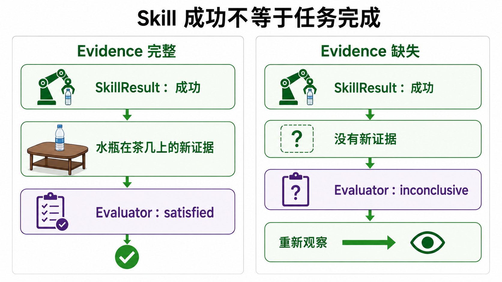

只运行第一个场景：

```bash
python code/lecture17/simulation/task_contract_demo.py success
```

输出中最重要的两行是：

```text
SkillResult：成功=是
Evaluator：状态=已满足（satisfied），缺失条件=0
```

`place` 正常结束，并返回了下面这条 Evidence：

```text
water_bottle  at  coffee_table
```

它与 TaskContract 中的成功条件完全匹配，所以任务完成。

接着运行证据缺失场景：

```bash
python code/lecture17/simulation/task_contract_demo.py missing-evidence
```

这一次 `place` 仍返回成功，但没有 Evidence：

```text
SkillResult：成功=是，Evidence 数量=0
Evaluator：状态=证据不足（inconclusive），缺失条件=1
更新计划：request_observation('水瓶真的在茶几上吗？')
```

Evaluator 不读取“动作看起来执行完了”这样的自然语言总结，只检查成功条件是否有新鲜证据。`inconclusive` 表示证据不足，此时 Agent 应重新观察，而不是宣布任务完成。

### 17.4.6 第六步：观察确定性安全门

运行低电量场景：

```bash
python code/lecture17/simulation/task_contract_demo.py low-battery
```

输出为：

```text
SkillGateway：允许=否，原因=电量过低，禁止运动
Robot Runtime：没有收到 RobotAction，机器人不会运动
```

这里没有再次询问模型“低电量还能不能抓取”。`pick` 被标记为运动能力，电量低于确定性阈值时，Gateway 直接拒绝请求。

继续修改 `scenario_low_battery()`：

```python
RobotStatus(emergency_stop=True)
RobotStatus(collision_detected=True)
RobotStatus(online=False)
```

分别运行并记录拒绝原因。无论模型多么确信动作可行，这些状态都不能被 Prompt 覆盖。

### 17.4.7 第七步：用预算阻止无限循环

运行最后一个场景：

```bash
python code/lecture17/simulation/task_contract_demo.py budget
```

机器人连续三次搜索一个不存在的目标，每次 Evaluator 都返回 `inconclusive`。达到 `max_deliberations` 后，系统停止搜索并请求人类帮助。

预算可以包含：

```text
最多进行多少次推理
最多调用多少次 Skill
同一个动作最多重复多少次
整个任务最多运行多长时间
```

失败恢复的目标不是“永不停止”，而是在可控成本内重试，在证据长期没有增加时及时停机或求助。


### 17.4.8 第八步：自己增加一个失败场景

选择下面一项修改脚本：

1. Agent 请求一个不存在的 Skill，确认 Gateway 返回 `unknown_skill`。
2. 调用 `place` 时删除 `target_id`，确认动作不会到达机器人。
3. 构造一条超过 `max_age_sec` 的旧 Evidence，确认 Evaluator 不接受过期证据。
4. 为 `pick` 增加一次 `grasp_missed`，让 Agent 重新观察后再决定是否重试。

修改后记录完整的：

```text
TaskContract
→ SkillIntent
→ Gateway Decision
→ SkillResult
→ Evidence
→ Evaluation
→ 下一步动作
```

如果日志中缺少其中一项，就很难判断失败发生在规划、验证、执行还是评测阶段。

### 17.4.9 完成实验后的 Harness 检查表

| 检查项 | 要回答的问题 |
|---|---|
| 目标 | 用户到底要什么？成功标准是否可以测量？ |
| 状态 | 已完成什么、正在做什么、还剩什么？ |
| 身体 | 机器人位置、夹爪、电量和故障状态是否可读？ |
| 环境 | 关键物体、障碍物和空间关系是否被更新？ |
| Skill | Agent 能调用哪些真实存在的能力？ |
| 观察 | 每次执行后能获得哪些结构化反馈？ |
| 评测 | 谁判断动作成功，使用什么传感器证据？ |
| 恢复 | 哪些错误可以重试，最多重试几次？ |
| 权限 | 哪些动作需要人工确认？ |
| 安全 | 哪些规则永远不能由模型修改？ |
| 记录 | 是否保存计划、调用、状态变化和失败轨迹？ |

## 17.5 现在的 Embodied Agent 能做到什么？

面对“整理餐桌，但不要收走别人还在使用的餐具”这样的任务，机器人不仅要会抓取，还要理解限制条件、观察当前场景，并在用户说“那个不是垃圾”时立即调整。下面的案例分别展示了这条任务链中的不同部分。

### 17.5.1 高层 Agent 怎样组织低层动作？

#### Hi Robot：把复杂要求翻译成当前一步

Hi Robot 使用两个不同频率运行的模型：高层 VLM 读取相机画面、开放式指令和用户反馈，输出一个较简单的语言子命令；低层 VLA 再把子命令变成机器人 Action。


> 图源：Shi et al., *Hi Robot: Open-Ended Instruction Following with Hierarchical Vision-Language-Action Models*, 2025, Figure 2。

读图时可以沿着两条信息流来看：高层 VLM 接收开放式指令和相机图像，输出当前的低层语言命令，也可以向用户作出语言回应；低层 VLA 同时读取这条命令、相机图像和机器人关节状态，再输出连续动作。高层决定“现在做什么”，低层负责“怎样把当前一步做出来”。

```text
用户：“做一个素食三明治，不要放番茄。”
                    ↓
高层 VLM：“拿起一片面包”
                    ↓
低层 VLA：输出连续机器人动作
```

Hi Robot 的高层 VLM 并不是直接接入的通用 Chatbot。研究者使用真实机器人轨迹和合成的具身交互数据训练它，使它知道低层 VLA 能理解哪些原子命令。高层推理以较低频率运行；在原型系统中，每隔一秒或收到新的用户反馈时重新计算子命令。

Hi Robot 在单臂、双臂和可移动双臂机器人上测试了餐桌清理、制作三明治和购买杂货等任务。它的主要贡献不是让低层动作突然变得更灵巧，而是让机器人能够处理复杂限制、中途纠正和新的 Skill 组合。

它也留下了一个问题：高层应该多久接管一次？固定每秒重新推理虽然简单，但未必适合所有机器人和任务。

#### What Matters in Orchestrating Robot Policies：分层以后，接口怎样设计？

把一个强 VLM 放在一个强 VLA 上面，并不自动得到可靠系统。这项研究系统比较了高层 VLM、低层 VLA、Observation 表示、Memory 和控制权切换方式。

研究得到的几条结论很适合指导系统设计：

- 高层模型是否具备推理能力，比单纯增大模型尺寸更重要。
- 低层 VLA 必须能稳定理解高层给出的不同语言子目标。
- Skill 结束后何时把控制权交回高层，会直接影响长程任务表现。
- 使用成功检测作为结束条件，通常比提前猜测 Skill 要执行多久更可靠。
- 原始图像不一定是高层最容易使用的 Observation；加入物体框或结构化描述可能更有效。
- 简单堆积当前 Episode 的原始历史没有明显帮助，从过去 Episode 中总结出的可执行经验更有价值。

这说明 Orchestration（编排）不是模型之间接一根线，而是要设计清楚：高层看什么、低层做多久、谁判断成功、哪些历史值得保留。

当机器人进入家庭或办公室后，编排系统还要处理移动的人、不断变化的物体、异步传感器和网络延迟。高层多久重新规划一次，也需要根据任务和环境动态调整。

#### HoloAgent-0：把计划变成受监控的 Skill Graph

HoloAgent-0 把 Embodied Agent 拆成三个相互连接的部分：

```text
Embodied AgentOS：规划、调度、监控与恢复
3D Spatial Memory：保存位置、物体和空间关系
Embodied Skills：执行导航、操作和机器人动作
```

AgentOS 将自然语言任务转成 **Skill Graph（技能图）**，为机器人资源安排执行顺序，并持续读取 Runtime Feedback。出现失败时，系统可以请求澄清或重新规划；执行过程也会更新 3D Spatial Memory。

HoloAgent-0 展示了长程导航、物体搜索、跨机器人协作和移动操作等真机任务。它补上了 Hi Robot 较少涉及的空间记忆和系统级资源调度。

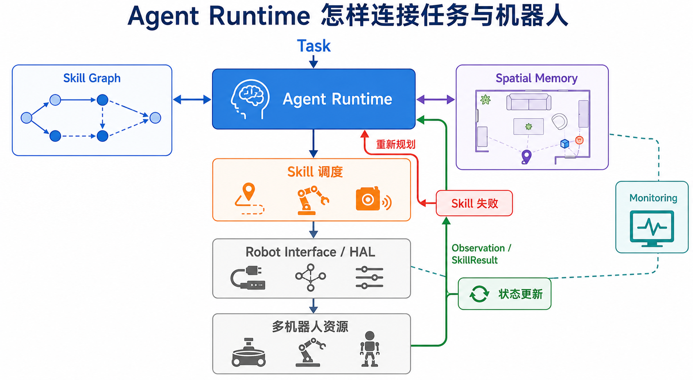

### 17.5.2 开源 Runtime 怎样连接 Agent 与机器人？

#### Dimos：用 Module、Blueprint 和 Skill 组成机器人系统

Dimos 将感知、导航、Memory、Agent 和机器人连接分别实现成 **Module（模块）**，Module 通过带类型的数据流交换相机、点云和控制信息。多个 Module 再通过 **Blueprint（蓝图）**组合成可以运行的机器人系统。

一个方法只有使用 `@skill` 注册后，才会作为 Tool 暴露给 Agent。MCP Server 汇总这些 Skill，MCP Client 获取 Tool 列表并驱动 Agent 调用。例如：

```text
dimos mcp list-tools
dimos mcp call move --arg x=0.5 --arg duration=2.0
```

Dimos 当前提供四足机器人、G1 人形机器人、机械臂和无人机相关 Blueprint，也提供 Replay、MuJoCo 仿真和部分真机运行入口。Spatial Memory 包含时空检索、物体定位和物体持续存在信息。

阅读 Dimos 时，最值得寻找的是下面这条代码路径：

```text
传感器数据流
→ 感知与 Spatial Memory Module
→ Agent 读取状态
→ MCP 调用 Skill
→ Skill 调用导航或机器人 Module
```

`@skill` 和 MCP 解决的是“怎样让 Agent 调用机器人能力”。动作是否真的成功，仍需由传感器和 Evaluator 检查；速度、力和工作空间限制仍由机器人控制器负责。

#### OpenMind OM1：同一个 Agent 怎样适配不同身体？

OM1 是模块化多模态 Agent Runtime。它把相机、麦克风、LiDAR 等信息作为 Input，把语音、移动和导航等能力作为 Action，并通过插件连接 ROS 2、Zenoh、CycloneDDS、串口或 WebSocket。

OM1 的重点不是重新实现每一种机器人控制算法，而是假设机器人已经提供较高层的 **HAL（Hardware Abstraction Layer，硬件抽象层）**：

```text
move(0.37, 0, 0)
run()
pick_up("red apple")
smile()
```

Agent Runtime 在 HAL 之上组合 Input、模型和 Action。这样，更换四足机器人、人形机器人或仿真平台时，高层 Agent 不必理解每个电机和关节的细节。

OM1 还提供 Prometheus 和 Grafana 监控 LLM、语音识别等流水线延迟，这体现了 Runtime 不只负责“调用成功”，还要让开发者看到系统怎样运行。

如果机器人没有可用的 HAL，开发者仍需使用传统控制、RL、VLA 或仿真训练补齐底层能力。OM1 负责连接多模态输入、模型和 Action；电池、温度、传感器标定和物理安全仍主要由 HAL 与机器人控制器负责。

### 17.5.3 产业系统怎样把认知接到机器人身体？

#### COSA：认知、Skill 与全身控制的三层系统

逐际动力将 COSA 展开为 **Cognitive OS of Agents**。在公开的系统图中，认知、VLA 和全身运动被组织成三个相互反馈的层次：

```text
系统 2：具身智能体 OS——人机交互、Memory、World Model、思考与推理
        指挥调度向下 / 数据反馈向上
系统 1：人形机器人 VLA——把调度指令变成与环境相关的机器人能力
        运动生成向下 / 数据反馈向上
系统 0：全身运动控制——稳定、精确地生成身体运动
```


> 图源：逐际动力 COSA 公开资料。图中的“指挥调度”向下传递任务，“数据反馈”向上更新认知和模型。

官方演示中的 Oli 可以接收长程任务，并在中途收到新任务后调整优先级；系统还展示了对人物、物体和交互历史的语义记忆，以及通过主动观察补充信息的能力。认知层决定任务优先级，VLA 层连接感知与机器人能力，全身运控层保证机器人站得稳、走得到并能完成操作。

COSA 最值得学习的地方是：机器人运动不是 Agent 最后的一个普通 API，而是认知系统必须持续考虑的身体基础。高层可以改变任务，身体执行结果也必须沿反馈通道返回高层，形成持续运行的闭环。

#### Vbot：消费产品中的“无需遥控”意味着什么？

Vbot 将产品定位为无需遥控的智能机器狗和“物理空间 Agent”。它配有双目深度视觉、360°激光雷达、麦克风阵列和本地算力，软件侧包含空间基座模型、智能探路、智能跟随、语言模型和 VLA 视觉行为模型。

传统机器狗通常等待用户按键或遥控：

```text
用户给出具体方向
→ 机器人移动
```

Vbot 试图把交互改成：

```text
用户表达目标
→ 机器人感知空间
→ 自主移动、跟随或记录
→ 通过动作和屏幕继续反馈
```

Vbot 还采用接触保护、防夹限位和圆角结构，并需要处理续航与 OTA。这些设计提醒我们，消费级 Embodied Agent 除了模型能力，还必须处理人在附近时的安全、功耗、交互反馈和长期升级。它目前主要展示移动、感知和自然交互；如果要进一步完成取物、整理等任务，还需要机械臂、操作 Skill 和结果验证机制。

### 17.5.4 VLA 正在吸收哪些 Agent 能力？

π0.7 仍然是一种 VLA，但它的运行系统已经不再只接收“拿起杯子”这样的一句指令。模型使用 MEM 风格的视觉历史编码器，还可以接收语义子任务、执行策略和质量等 Episode Metadata，以及描述近期目标状态的 Subgoal Image（子目标图像）。

```text
高层语义策略：生成当前子任务
轻量 World Model：生成希望接下来看到的子目标图像
π0.7：结合历史、子任务和子目标图像输出动作
```

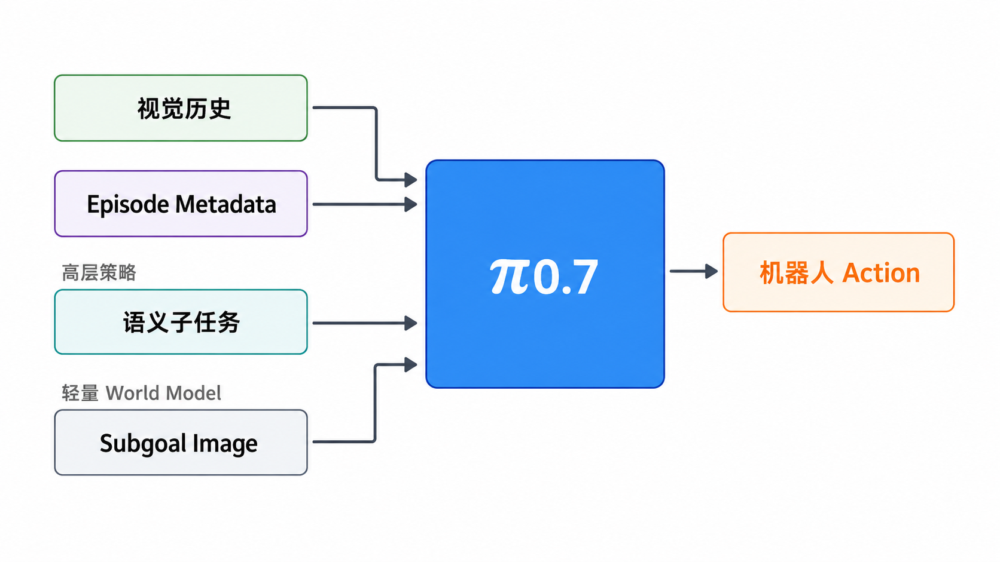

子目标图像可以弥补语言描述的不足。“打开冰箱”没有说明手应该怎样接近把手，一张期望的近未来画面则能同时表达物体、手臂和夹爪的目标状态。

π0.7 还利用不同质量的机器人轨迹、失败 Episode、自主执行数据、人类视频和互联网数据。训练时用 Metadata 标明速度、质量、是否出现错误和控制方式，避免模型把好策略与坏策略简单混在一起。

π0.7 展示了多阶段厨房任务、Memory 任务、复杂语言指令和跨本体迁移等能力。它的组合能力让机器人可以把已经学会的局部行为重新组织起来，完成新的任务流程。

因此，更准确的说法是：

> π0.7 展示了 VLA 怎样吸收历史、语义子任务、World Model 子目标和失败经验，但它仍不等于包含权限、Tool 注册、独立 Evaluator 和安全 Harness 的完整 Embodied Agent。

### 17.5.5 把这些案例放回系统图

八个案例关注的层次不同，把它们放回同一条执行链后，关系会更清楚：

```text
用户给出开放目标
        ↓
高层任务推理与策略编排
Hi Robot / What Matters
        ↓
任务状态、Skill Graph 与空间记忆
HoloAgent-0 / Dimos
        ↓
Agent Runtime 与机器人能力接口
Dimos / OpenMind OM1
        ↓
VLA、运动规划和全身控制
π0.7 / COSA
        ↓
机器人在真实环境中行动
COSA / Vbot
        ↓
Observation、结果检查与重新规划
```

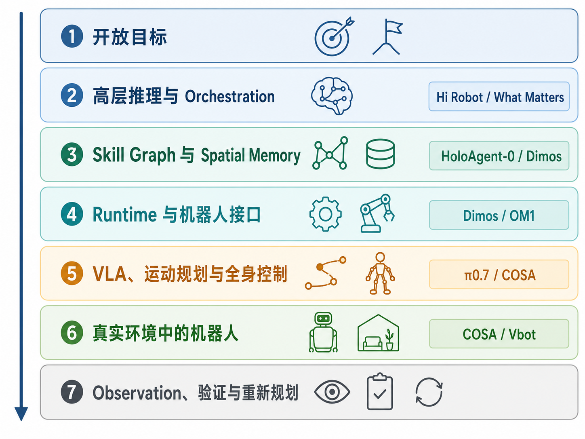

- Hi Robot 和 What Matters 解释高层与低层怎样分工和交换控制权。
- HoloAgent-0、Dimos 和 OM1 展示 Memory、Skill 与 Runtime 怎样连接。
- COSA 展示认知、Skill 与全身控制怎样组成连续系统。
- Vbot 展示 Embodied Agent 进入消费产品后需要面对的交互、安全和续航问题。
- π0.7 展示历史、语义子任务和 World Model 子目标怎样进入 VLA。

不同系统可以采用不同模型和接口，但一条完整的 Embodied Agent 执行链通常都要回答：目标怎样拆解、状态保存在哪里、Skill 怎样执行、结果由谁检查，以及危险动作由谁阻止。

## 17.6 有硬件版 Demo

**Demo 名称**：Embodied Agent 长程取放任务

**硬件平台**：xLeRobot / SO101 / Unitree G1，根据课程现场硬件选择其一。

**任务描述**：输入一句自然语言任务，让高层 Agent 生成 Skill 计划，并通过真机完成导航、识别、抓取、放置和状态检查。

**流程**：

```text
输入任务 → 生成计划 → 调用 navigate_to → detect_object → grasp → place → check_success → 记录失败与重规划
```

真机实验不追求一次完成复杂家务，而是验证三个关键闭环：

1. 高层计划能否转成真实存在的 Skill。
2. Skill 执行结果能否结构化返回给 Agent。
3. 安全层能否在越界、碰撞风险或多次失败时停止任务。

建议先把速度和工作空间限制在保守范围内，并为每个运动 Skill 设置超时。第一次实验可以只做桌面范围内的“检测 → 抓取 → 放置”，导航部分用人工移动或仿真替代。

## 17.7 无硬件仿真版 Demo

**Demo 名称**：ROS2 mock + 仿真 Skill 调度

**可选平台**：ROS2 mock / ManiSkill / RoboCasa / MuJoCo。

**流程**：

```text
加载模拟场景 → 注册 Skill → Agent 生成计划 → 仿真执行 → 输出计划日志和状态变化
```

**与有硬件版的对应关系**：仿真版保留同一套 Skill 接口和日志格式，只替换底层执行器，便于后续迁移到真机。

本仓库提供两个不需要大模型 API、也不需要机器人硬件的最小示例。先运行架构实验，观察 TaskContract、Gateway、Evidence 和 Evaluator：

```bash
cd code/lecture17
python simulation/task_contract_demo.py
```

再运行 Agent Loop 示例。它把计划写成 Skill 列表，第一次抓取故意失败，然后让 Agent 插入恢复步骤：

```bash
python simulation/agent_skills.py
```

你会看到类似日志：

```text
think: call grasp("water bottle")
act: grasp
observe: fail - first grasp attempt missed water bottle
update: add retry_grasp before continuing

think: call retry_grasp("water bottle")
observe: ok - water bottle secured after adjusted grasp
```

两个 Demo 合起来包含目标合同、Skill 请求、安全验证、计划、观察、Evidence、状态更新和失败恢复。把规则决策替换为 LLM，把 mock Skill 替换为 ROS2、ManiSkill 或真机接口，分层边界仍然可以保持不变。

## 17.8 实验步骤

1. 运行 `python simulation/task_contract_demo.py`，比较四个场景的输出。
2. 删除 `place` 返回的 Evidence，解释 Skill 成功后任务为什么仍未完成。
3. 修改机器人电量、急停和碰撞状态，记录 Gateway 的拒绝原因。
4. 修改 `max_deliberations`，观察搜索任务在什么时候停止。
5. 按照四层架构，把“拿一瓶水放到茶几上”拆成 5–8 个 Skill。
6. 为其中一个 Skill 写清输入、前提、成功条件、失败模式和 Evidence 输出。
7. 运行 `python simulation/agent_skills.py`，解释第一次抓取失败后计划怎样更新。
8. 有硬件条件时，将同一套 Skill 接口接入真机，但保留独立安全检查和人工急停。

## 17.9 作业交付

1. 一份 Embodied Agent 高层流程图。
2. 一段仿真或真机演示视频。
3. 一份计划日志，包含每一步的 `think / act / observe`。
4. 一个失败复盘案例，说明失败现象、可能原因和下一轮修正方案。
5. 一张 Harness 检查表，标出任务状态、Evaluator、权限和安全边界分别由谁负责。

## 17.10 常见失败与复盘

### 常见失败

- **计划不可执行**：Agent 生成了不存在的 Skill 或参数不合法，需要 JSON Schema 校验。
- **感知误判**：VLM 识别到目标但定位不准，需要结合深度、位姿估计或二次确认。
- **抓取失败**：夹爪闭合但未抓住物体，需要增加 `check_grasp` 和重试策略。
- **路径阻挡**：导航 Skill 返回失败，需要 Agent 选择绕行、清障或请求人工介入。
- **错误地宣布成功**：函数正常返回不等于物理任务成功，需要独立 Evaluator 提供视觉、位姿或传感器证据。
- **上下文越来越长**：Agent 把所有历史日志都塞进 prompt，导致目标信息被淹没，需要把完整轨迹保存到外部，只取回当前步骤需要的内容。
- **重复失败仍不停机**：恢复流程没有重试上限，需要在 Harness 中设置次数、超时和人工接管条件。
- **安全边界触发**：超过工作空间、力限制或急停条件时，必须停止执行并记录原因。

### 复盘问题

- 这次失败发生在规划层、Skill 层、执行层还是感知层？
- Agent 是否拿到了足够清晰的错误信息？
- Evaluator 依据什么证据判断成功？它有没有可能误判？
- 这次改进应该修改模型、Skill，还是 Harness 工作流？
- 哪些规则应固化为安全边界，而不是交给模型判断？

## 本讲小结：六个核心结论

1. **Chatbot 负责回答，Agent 负责围绕目标持续行动。**
2. **Planning、Memory 和 Tool Use 描述 Agent 的能力，Harness 负责把这些能力组织、检查并约束起来。**
3. **Embodied Agent 沿用了数字 Agent 的循环，但工具另一端变成了传感器、电机和真实物理世界。**
4. **Embodied Agent 的关键不是让 LLM 直接输出电机指令，而是让高层规划、Skill、执行器、Evaluator 和安全层各司其职。**
5. **失败 Episode 是改进资产。很多可靠性问题可以先通过增加检查、调整工作流和完善恢复策略解决。**
6. **外部 Agent 与 Agentic VLA 正在汇合，但权限、评测和安全 Harness 仍应独立存在。**

## 17.11 参考资料

本讲涉及的论文、博客、开源项目和产业系统链接，统一维护在 [Lecture 17 — Embodied Agent](../../references/links.md#lecture-17)。

## 关联代码

- [`code/lecture17/`](../../code/lecture17/)
