# 第 17 讲：Robot Agent、任务规划与技能调用

> **所属部分**：第六部分 · Agent、世界模型与前沿进展
> **Part 负责人**：雨浩 · 协同：富平（Agent）
> **前置依赖**：第 8–16 讲端到端策略与强化学习基础
> **阶段项目**：语言指令驱动的移动 + 操作综合任务
> **代码**：[`code/lecture17/`](../../code/lecture17/)

## 17.1 本讲目标

学完这一讲，你应该能回答四个问题：

1. 什么是 LLM-based Agent？它和普通 Chatbot 有什么区别？
2. 为什么只会回答问题的 LLM 还不能直接完成长程任务？
3. Embodied Agent 是怎样从 LLM-based Agent 扩展到机器人场景的？
4. 为什么机器人 Agent 需要 skill、状态反馈和安全边界？

先不用记住所有框架名字，可以先抓住一条主线：

```text
Chatbot 只回答问题；
LLM-based Agent 会使用工具推进任务；
Embodied Agent 把这种任务执行能力接到机器人身体和真实环境上。
```

---

本讲内容以 **Embodied Agent** 为主线，解释 Robot Agent 如何把通用 LLM-based Agent 的规划、记忆和工具调用机制接入机器人身体。

## 17.2 核心知识点：Agent 介绍

在进入机器人场景之前，本节先讲清楚一个基础问题：什么是 LLM-based Agent？它是怎样从"只会聊天"一步步发展到"能自主做事的"？

### 17.2.1 Agent 的定义：从 Chatbot 到 Autonomous Task Executor

**最简单的 Chatbot 是什么样？**

```text
用户问一句 -> 模型答一句
```

比如你问"什么是具身智能？"，模型回答"具身智能是指能够在物理世界中感知、行动和学习的智能系统……"。问什么答什么，对话结束就结束了。

**为什么 Chatbot 不够用？**

很多现实任务不是"回答一句话"就能搞定的。想一想这些例子：

```text
"帮我把电脑上这学期的 20 份课件按课程和日期分类整理好。"
"帮我在网上搜一下最新的具身智能论文，做个中文摘要。"
```

这些任务有一个共同特点：**不是一次回答能完成的**。它们需要：

- 读取信息（打开文件、搜索网络）
- 拆解步骤（先做什么、后做什么）
- 调用工具（搜索信息、操作文件、调用外部服务）
- 检查结果（这步做对了吗？要不要重来？）
- 根据反馈调整（此路不通，换条路）

**所以什么是 LLM-based Agent？**

根据 Lilian Weng 在 "LLM Powered Autonomous Agents" 中的定义，一个 LLM-based Agent 系统以 LLM 作为核心"大脑"，配合三个关键组件：

```text
LLM-based Agent = LLM（大脑） + Planning（规划） + Memory（记忆） + Tool Use（工具使用）
```

三个组件通俗地讲：

- **Planning（规划）**：面对一个复杂任务，先把它拆成一个个小步骤，然后一步一步做；如果某一步做错了，能自己发现并换个方法再来。就像你接到一个"整理宿舍"的任务——你不会直接动手乱收，而是先想：先收书桌、再扫地、最后倒垃圾。这就是规划。
- **Memory（记忆）**：有两个层次。第一个层次是"别走神"——做任务过程中，记住刚才做了什么、现在该做什么。第二个层次是"积累经验"——上次做类似任务时踩了什么坑、这次别再犯。技术上，简单的记忆靠当前对话的上下文，长久的记忆靠外部存储（想象成 Agent 的"笔记本"，它可以把重要信息记下来，需要时翻出来看）。
- **Tool Use（工具使用）**：Agent 光靠"想"是不够的，它需要"动手"——比如搜网页、读文件、发邮件、操作机器人。这些外部能力就是工具。Agent 要学会判断"什么时候该用哪个工具、怎么用"。


> 上图来自 Lilian Weng 的博客 "LLM Powered Autonomous Agents"（2023）。LLM 位于中心，作为 Agent 的"大脑"，外围是 Planning、Memory、Tool Use 三个关键组件。这张图是理解 Agent 架构最经典的入门图。

这条公式回答的是"Agent 由哪些认知零件组成"——从内向外看，把 Agent 拆成可理解的认知模块。

**换个角度：Agent 的工程边界**

Agent 领域在 2023–2026 年迭代极快。到 2025–2026 年，Agent 工程社区逐渐形成了另一个共识公式：

```text
Agent = Model（模型） + Harness（约束框架）
```

这里的 **Model** 指的是 LLM、VLM、VLA 等基础模型。它们像一匹马——有力气、能跑，但也会脱缰：产生幻觉、胡说八道、输出格式不受控制。**Harness** 的本意就是"马具"——缰绳、笼头、肚带，把马的力量约束到可驾驭的方向上。在 Agent 中，Harness 就是这套"缰绳"：它告诉模型当前有哪些工具可以用（不能凭空瞎编），帮模型记住任务做到哪了（不会迷失目标），把每一步的结果和错误记下来（出了岔子能回看），确保模型不能越权做危险操作（缰绳拉紧），任务结束后交出一份完整的执行轨迹。没有 Harness，模型就像一匹没有缰绳的野马——有力量，但你不知道它下一秒会跑向哪里。

把两条公式放在一起看，能看出领域认知的演进：

```text
2023（Weng）：           LLM-based Agent = LLM + Planning + Memory + Tool Use
                              ↑ 从内向外看：Agent 需要哪些认知零件？

2025–2026（社区共识）：    Agent = Model + Harness
                              ↑ 从外向里看：模型的推理能力和约束框架的边界该画在哪？
```

两条公式并不矛盾。Weng 公式定义了一个 Agent 需要什么"能力"（认知零件清单）；Harness 公式定义了这些能力"由谁负责"（模型只管推理，其余交给 Harness 去约束和协调）。简单说：**Weng 告诉你 Agent 有哪些零件，Harness 告诉你这些零件怎么被管住。**

这个认知演进本身就是一个缩影——Agent 领域在 2–3 年内，不只是多出几个框架，连"怎么看 Agent"的基本框架都在变。读完九个阶段再回头看，你会发现 Model 和 Harness 之间的边界正是在这个过程中逐步清晰的。

所以 LLM-based Agent 不是"问一句答一句"，而是**围绕一个目标，持续地思考和行动**。就像一个助理，你交代一个任务，它会自己想办法一步步完成，中间遇到问题也会尝试解决。

**用类比来理解**：

- **Chatbot** 像一个知识丰富的图书管理员：你问什么，他根据自己知道的内容回答你。但他不会帮你去找书、不会帮你整理书架、不会帮你录入新书。
- **Agent** 像一个有执行能力的助理：你跟他说"帮我把这些新书分类上架"，他先**规划**（怎么分类、按什么顺序）、靠**记忆**（分类规则记住了、上次的摆放位置也记得）、用**工具**（查库存系统、用推车搬运）、然后告诉你做完了。中间如果发现某本书分类不明确，他会来问你。

所以从 Chatbot 到 Agent 的本质变化是：**从"被动回答"到"主动做事"**。

**Agent 的基本循环（Planning 的执行机制）**：

上述三个组件中，Planning 是"发动机"——它驱动 Agent 不断向前推进任务。那 Planning 具体怎么工作呢？最经典的机制是一个四步循环：

```text
Think（思考）-> Act（行动）-> Observe（观察）-> Update（更新状态）
```

- **Think**：根据任务目标，想想下一步该做什么。
- **Act**：调用一个工具，或者向用户提问。
- **Observe**：看看工具返回了什么结果（成功了？失败了？拿到了什么信息？）。
- **Update**：根据结果更新自己的认知，然后回到 Think，继续循环。

把这个循环展开来看，Agent 内部实际上在重复做四件事：

1. **Think（思考）**：Agent 看一眼当前情况——"我的任务是什么？我已经做了哪些？上一步结果怎么样？"——然后决定下一步该做什么。这个"下一步"可能是选一个工具、也可能是觉得任务已经完成、也可能是判断自己搞不定了该向人求助。
2. **Act（行动）**：Agent 真正去调用工具。比如去搜索、去读文件、去操作机器人——但注意，Agent 本身不执行，它只是发出"请执行 XX 工具，参数是 YY"的请求，由外面的程序替它执行。
3. **Observe（观察）**：工具执行完了，Agent 收到结果——成功了还是失败了？返回了什么信息？
4. **Update（更新）**：Agent 把刚才的结果记下来——这一步做完了吗？做成功了还是失败了？——然后回到第 1 步，重新思考。

这四步不断重复，像一个"边做边想、错了就改"的人。Agent 不会一口气把所有步骤都定死，而是走一步看一步，每轮都根据最新情况做判断。

为了防止 Agent 在一个问题上反复兜圈子，通常还会设一个**最大步数**。到了上限还没完成，Agent 就停下来汇报"超时未完成"，而不是无限运行下去。

**关键点**：模型本身**不直接执行**工具——它只是"说我需要调用某某工具"。真正执行的是应用程序，应用程序会检查工具是否存在、参数是否合法、有没有权限。这层控制非常重要，因为模型可能会"幻觉"出一个不存在的工具名。

用前面"搜论文做摘要"的例子来感受一下这个循环：

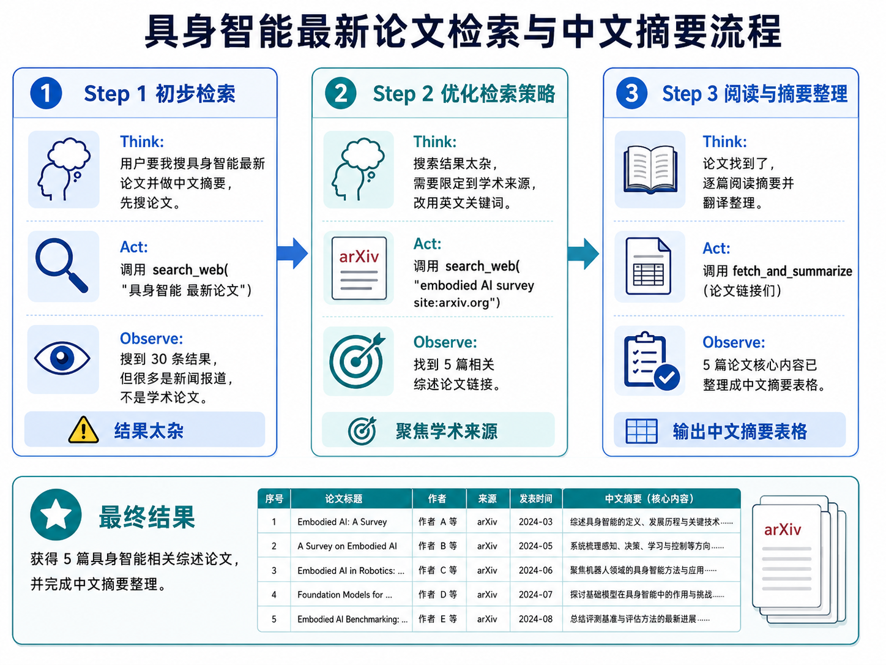

如果是 Chatbot，它被问到"最近有哪些具身智能论文"，只能凭训练时见过的信息回答（可能已经过时了）。Agent 则是真的去搜索、筛选、读摘要、整理成表格——**做了事，不只是说了话**。

> 把这个例子的工具换一下：`search_web` 换成 `navigate_to("厨房")`，`fetch_and_summarize` 换成 `grasp("杯子")`，循环结构完全一样。具身 Agent 和代码 Agent 的区别不在循环本身，而在工具的"另一端"——从服务器变成了电机。

**Agent 循环的几个工程要点**：

理解了基本循环之后，还有几个实际工程中需要注意的点：

- **步数上限**：必须给 Agent 设置最大执行步数，否则它可能在一个问题上反复尝试、陷入死循环。达到上限后应给出"超时未完成"的明确状态。以开源框架 nanobot 为例，默认上限设为 200 步——绝大部分任务十几轮就完成了，200 只是防止极端情况下无限消耗 token 的安全网。
- **工具校验**：模型可能"幻觉"出不存在的工具名或不合法的参数。应用层在真正执行前必须校验——工具是否存在？参数类型对不对？必填参数齐不齐？
- **错误要喂回去**：工具失败时，不要把错误信息吞掉，要结构化地返回给模型。模型需要知道"为什么失败"才能调整下一步策略。如果只返回一个"失败"，模型只能瞎猜。
- **能主动停止**：Agent 不是只能被步数上限截断。它自己应该有能力判断"任务已经完成"或"现有信息不足以继续，需要问人"，并主动终止循环。

**为什么不能把 Chatbot 直接当 Agent 用？**

一个自然的问题是：Chatbot 不是也能回答"你可以先运行测试，然后看报错信息……"吗？让它多回答几轮不就行了？

区别在于两个词：**"建议"和"执行"**。

Chatbot 给出的是建议——"你可以这样做"。听不听、做不做、做完之后怎么办，全部由人决定。Agent 是自己做——它真正调用了 run_test，真正读到了报错信息，真正根据报错定位了代码。人在这个过程中可以完全不参与执行细节。

Chatbot 的模式是"人驱动、AI 辅助思考"；Agent 的模式是"人定目标、AI 驱动执行"。这是两者最根本的架构差异。

**你可能在想**：

> *"这个 Think-Act-Observe 循环，和我在编程课上学过的 while 循环有什么区别？"*

好问题。编程课上的 `while` 循环是**写死在代码里的规则**——每轮做什么是程序员预先决定的。Agent 的循环是**模型自己决定每轮做什么**——程序员只提供了工具列表，但什么时候用哪个工具、传什么参数，是模型根据任务情况动态判断的。这就是 Agent "智能"的来源。

> *"模型怎么知道有哪些工具？怎么知道每个工具能干嘛？"*

这是开发者提前告诉它的。开发者把每个工具的名字、功能描述、需要什么参数，以结构化的方式写在系统 prompt 里（可以理解成"说明书"）。

**本节一句话回顾**：Chatbot 只管"说"，Agent 会"做"。Agent 的核心是 LLM 大脑 + 规划 + 记忆 + 工具使用，而规划的执行机制是一个 Think-Act-Observe 循环。


### 17.2.2 模型层演进：LLM、VLM、VLA

搞清楚了 Agent 的基本概念之后，一个自然的问题是：Agent 的"大脑"用什么模型？这些模型各自擅长什么？

你可能已经用过 ChatGPT——这背后的模型就是一种 LLM（大语言模型）。它能看懂文字、写出回答，但如果你给它一张照片，让它告诉你"桌子上有什么"，它就做不到了——因为 LLM 只能处理文字。

所以，为了让 Agent 能在真实世界中工作（尤其是机器人场景），我们需要不同类型的模型来分工。模型层按处理的信息类型，大致分成三类：

**LLM（Large Language Model，大语言模型）**

- 吃什么：纯文本
- 吐出什么：纯文本、计划、工具调用请求
- 擅长什么：理解文字指令、拆解任务、逻辑推理、写代码
- 不擅长什么：看不懂图片，不知道物理世界长什么样
- 在 Agent 里的角色：**规划者**——"我们要做什么、按什么顺序做"

你可以把 LLM 想象成一个**"只读过书、没见过真实世界"的军师**。他很会分析局势、制定计划，但他自己看不见战场。

代表模型：GPT-4o、Claude 等。在 Agent 场景中，选择 LLM 时需要特别关注它的 **function-calling 能力**（能否准确选择工具并生成参数）和**长上下文能力**（能否在几十轮对话中保持目标不丢失）。

**VLM（Vision-Language Model，视觉语言模型）**

- 吃什么：图片 + 文字
- 吐出什么：图片里的东西是什么、在什么位置、什么状态
- 擅长什么："看懂"场景——识别物体、理解空间关系、判断状态（门是开还是关）
- 不擅长什么：不直接输出机器人的动作
- 在 Agent 里的角色：**观察者**——"现在周围是什么情况"

VLM 就像**军师派出去侦察的斥候**——"报告！桌上有两个杯子，红色的在左边，蓝色的在右边。抽屉是关着的。"

**VLA（Vision-Language-Action，视觉语言动作模型）**

- 吃什么：图片 + 文字指令 + 机器人当前状态
- 吐出什么：机器人动作——手臂往哪移、夹爪开还是合
- 擅长什么：把"抓那个杯子"变成精确的电机指令，完成局部操作
- 不擅长什么：长程规划、复杂条件判断、错误恢复
- 在 Agent 里的角色：**执行者**——"把这一步具体做出来"

VLA 就像**训练有素的士兵**——他不需要知道整场战役的计划，只需要精确执行"现在攻下这个山头"。

**这三个模型怎么配合？**

```text
用户说："帮我把桌上的红杯子递给我"

LLM（规划者）：好，我要：1.看场景 2.找红杯子 3.抓 4.递

VLM（观察者）：[看照片] 桌上有一个红杯子，在键盘右边大概一拳的位置，旁边没有障碍

LLM：那就抓。

VLA（执行者）：[收到"抓杯子"指令] 移动手臂到预抓取位 → 降下 → 闭合夹爪 → 感受到力 → 提起
```

**关键认知**：不是让某一个模型包揽所有事情，而是**让不同模型各司其职**，组织成一个可以协作的系统。

### 17.2.3 Agent 发展阶段

LLM-based Agent 不是一夜之间冒出来的。它经历了从简单到复杂的逐步演进，每个阶段解决一个核心问题。

先把九个阶段画成一张地图，方便你在阅读时知道自己走到哪了：

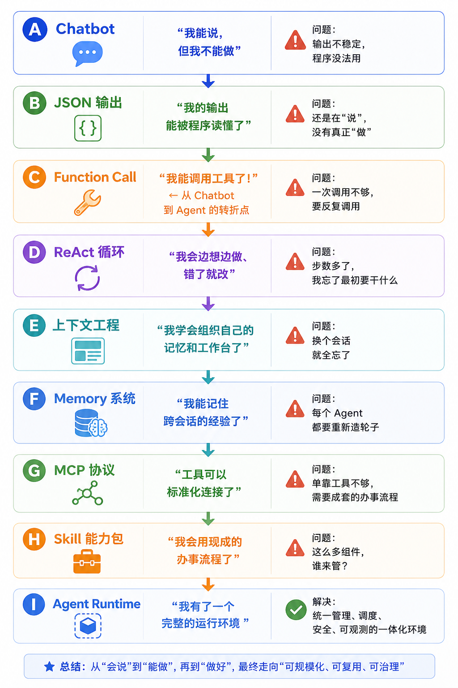

> 这张地图现在看不懂没关系。读完这一节再回来看，你会发现每一步都是"被问题推着走的"。

下面逐个展开。

#### 阶段 A：Prompt-only / Chatbot

这是最早、最简单的形态。用户输入一段文字，模型返回一段文字。一次对话就是一轮问答。

这一阶段的问题是三个"不"：

- **输出不可控**：模型可能回答一大段、也可能只回一句话；格式不固定。
- **程序不可解析**：如果程序想从回答中提取一条"可执行的指令"，需要写正则表达式去猜，非常脆弱。
- **不能调用外部能力**：模型不能说"我先查一下数据库"——它只能凭训练时记住的知识回答。

一句话总结这个阶段：**模型"能说"，但"不能做"**。

#### 阶段 B：JSON / Structured Output

为了让模型的输出能被程序可靠地读取，人们开始要求模型输出结构化的 JSON，而不是自由文本。

这一阶段有两个层次：

- **JSON mode**：保证输出是合法 JSON 字符串，但不保证字段名和字段类型对。比如模型可能把 `"confidence": "high"`（字符串）而不是 `"confidence": 0.95`（数字）。
- **Structured Outputs**：要求模型严格按照给定的 JSON Schema 输出，字段名、类型、必填/可选全部保证。这是真正可被程序消费的。（可以把 JSON Schema 理解成一份"数据格式说明书"——它定义了每个字段叫什么、是数字还是文字、能不能为空。程序拿到数据后，先对照说明书验一遍，验不过就拒收。）

一个例子：

```json
// 想让模型分析用户意图，程序需要稳定的 JSON：
{
  "intent": "read_file",
  "args": {
    "path": "/home/user/notes.md"
  },
  "confidence": 0.92
}
```

这个阶段的关键词是三个"可"：**可解析**（程序能自动读）、**可校验**（能检查对不对）、**可接入业务系统**（能直接喂给下游程序）。

但结构化输出只解决了"输出格式"的问题——模型输出的还是"我想读文件"，而不是真正去读了文件。

#### 阶段 C：Function Call / Tool Call

这是 **从 Chatbot 到 Agent 的关键转折点**。Function calling 让模型不只是"说应该做什么"，而是"请求调用某个工具"。

**工作原理**：

1. 开发者把能用什么工具、各自有什么参数，以 JSON Schema 的形式提前告诉模型。
2. 模型在对话中自己判断：我该不该用工具？用哪个？传什么参数？
3. 应用层收到模型的调用请求后，**真正执行**工具，拿到结果。
4. 应用层把工具结果传回给模型，模型根据结果继续思考。

工具描述的例子（这是开发者写好的，提前给模型）：

```json
{
  "name": "search_web",
  "description": "在互联网上搜索信息。当需要查最新资讯或不知道的事情时使用。",
  "parameters": {
    "query": {
      "type": "string",
      "description": "搜索关键词"
    },
    "num_results": {
      "type": "integer",
      "default": 5,
      "description": "返回几条结果"
    }
  }
}
```

一个类比：Function calling 就像给图书管理员配了一个**真正的借阅系统**。以前你问"有这本书吗"，管理员只能说"我记得好像有"；现在管理员可以在系统里真的查一下库存、帮你预约、帮你续借——他有了做事的"手"，而不仅是说话的"嘴"。

> 注意：工具可以是数字的（搜网页、读文件、调 API），也可以是物理的（抓取、移动、推）。Function call 的机制完全一样——模型选择工具、生成参数、等结果——区别只在于执行端：数字工具的执行端是服务器，物理工具的执行端是电机。这个统一性是 LLM-based Agent 能直接延伸到 Embodied Agent 的关键。

**工具调用的常见模式**：

在实际 Agent 中，工具调用不只是"一次调一个"这么简单。常见的有几种模式：

| 模式 | 说明 | 例子 |
|------|------|------|
| 单次调用 | 一个工具调用拿到答案，任务结束 | "今天天气怎么样" → search_weather() |
| 顺序调用 | A 的结果是 B 的输入，必须按顺序 | read_file() → summarize() → save() |
| 并行调用 | A 和 B 互不依赖，可以同时调 | 同时查三个城市的人口数据 |
| 条件调用 | 根据前面结果决定要不要调下一步 | "如果北京人口 > 上海人口，就画图" |
| 重试调用 | 工具失败了，修改参数或换策略重来 | 网络超时 → 等 3 秒 → 重试 |

一个好的 Agent 需要能根据任务需求在这些模式之间自由切换。

#### 阶段 D：ReAct / Plan-Act-Observe Loop

Function calling 解决了"调用工具"的问题，但很多任务需要反复调用、根据反馈调整。

上一节介绍过一个 Think-Act-Observe 四步循环——那是 Agent 执行任务的基本节奏。这个循环模式有一个正式的学术名称：**ReAct**（Reasoning + Acting，推理 + 行动）。

ReAct 的核心思想是：**让语言模型交替生成"思考轨迹"和"任务动作"，动作的结果（观察）再喂回模型，影响下一步思考。**

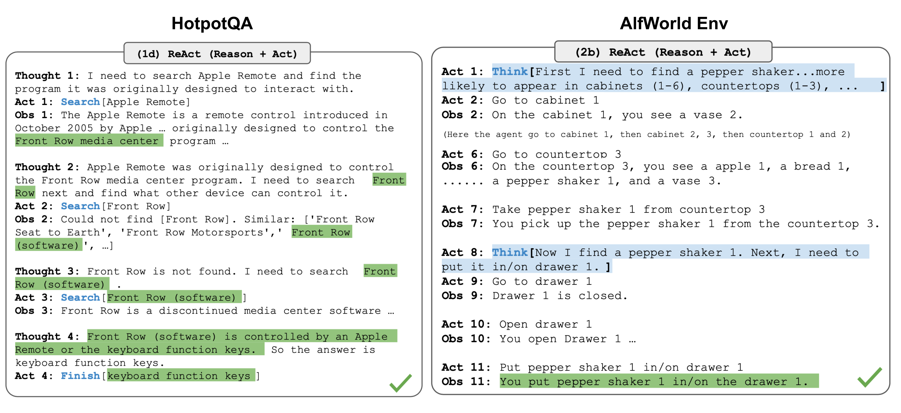

> 上图来自 ReAct 原始论文，展示了在不同类型任务中，模型交替生成 Thought（思考）、Action（行动）、Observation（观察）的完整轨迹。左侧是知识密集型的问答任务（HotpotQA），右侧是决策型的交互任务（AlfWorld）。

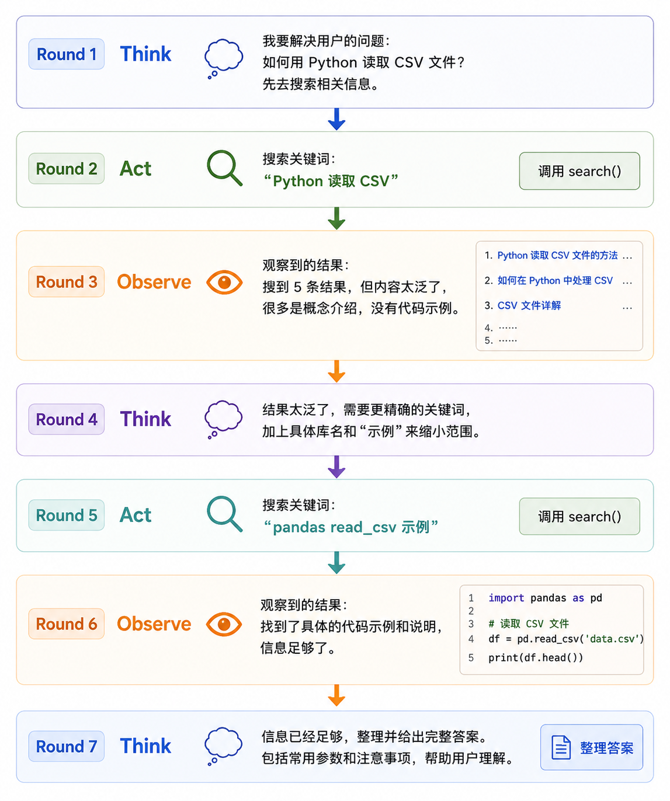

ReAct 的一个很好的特性是**可解释性**——每一步的思考、行动、观察都被记录下来了。出了问题时，你能清楚地看到 Agent 在哪一步想错了、做错了。这对于调试和建立信任都很关键。

**一个更完整的例子**：假设用户说"帮我查一下北京和上海的常住人口，如果北京人口更多就画一个柱状图"。

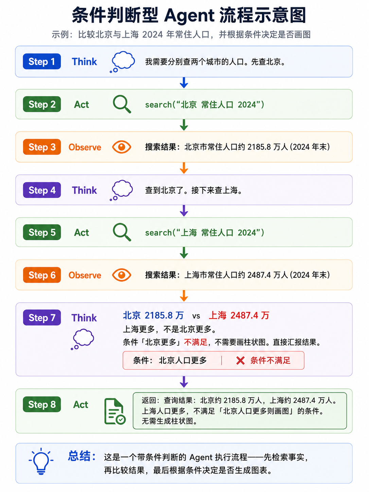

这个例子体现了一个关键点：Agent 不是机械地执行"查询→画图"的固定流程，而是在拿到数据后做了**条件判断**——发现条件不满足，就跳过了画图步骤。这种"根据中间结果动态调整后续步骤"的能力，是 ReAct 循环的核心价值。

ReAct 的局限：当步数多了，模型容易"忘记"远在最开始的目标。这就是下一步要解决的问题。

> 这套 Think-Act-Observe 循环在具身 Agent 中结构完全一样，只是 Act 从"调 API"变成了"调电机"。ReAct 论文的实验在纯文本领域，但这个循环模式是后来 Embodied Agent 设计的思想模板——Embodied Agent 的每一轮同样是"LLM 推理 → 调用 Skill → 观察传感器反馈 → 更新计划"。


#### 阶段 E：RAG / Context Engineering

RAG（Retrieval-Augmented Generation，检索增强生成）最开始解决一个简单问题：模型的训练数据有过期日，它不知道训练之后发生的事情；也访问不到公司的内部文档。

**标准 RAG 流程**：

```text
用户提问
→ 把问题转成向量（embedding）
→ 在向量数据库里找"和这个问题最像"的文档片段
→ 把找到的文档片段塞进 prompt
→ 模型读着这些参考资料来回答
```

> **"向量"是什么？** 你可以先简单理解成：把一段文字变成一串数字，使得"意思相近"的文字在数字上也相近。比如"苹果"和"水果"在数字空间里离得很近，但和"汽车"离得很远。这样计算机就能通过比较数字来找"和这个问题最相关的内容"。不用深入了解数学原理，知道它能做什么就够了。

但在 Agent 场景中，问题比 RAG 更广。Agent 每一轮"思考"时，面对的是**上下文怎么组织**的问题：什么东西该放进 prompt、什么不该放？

可能放进上下文的"原料"包括：

```text
- 用户最初的目标是什么（不能忘！）
- 已经做完了哪些事、还剩哪些
- 刚才几次工具调用的结果
- 目前有哪些工具可以用
- 哪些工具失败过、为什么
- 有什么约束（时间限制、权限限制……）
```

**上下文组织不好，Agent 会出现什么问题？**

- **目标漂移**：做了 15 步之后，模型忘了最初用户要干什么，开始跑偏。
- **重复踩坑**：同一个工具用同样的错误参数连续失败 5 次，没意识到要换个办法。
- **幻觉工具**：模型"发明"了一个不存在的工具名——因为它记混了有哪些工具可用。

**上下文工程牵涉的技术组件**：

- **Embedding**（嵌入）：把文本转成向量，用于"找和这个意思相近的内容"。
- **Reranker**（重排序模型）：第一次检索可能找回 50 条文档，reranker 把它们按和问题的相关度重新精确排序。
- **Vector DB**（向量数据库）：专门存向量并支持"相似度搜索"的数据库，如 Chroma、Pinecone、Milvus。
- **Knowledge Graph**（知识图谱）：把知识表示为"实体 + 关系 + 实体"的图结构（如"北京 — 是...的首都 → 中国"），适合需要精确事实查询的场景。
- **Document Parser**（文档解析器）：把 PDF、Word、网页等不同格式的文档转成干净的纯文本。


#### 阶段 F：Memory

Memory 不只是"把聊天记录存下来"。好的记忆系统要回答三个问题：**记什么、怎么查、怎么用**。

**记忆可以拆成五类**：

| 记忆类型 | 记的是什么 | 有什么用 |
|----------|-----------|----------|
| Working memory | 当前这次任务的状态——正在做什么、刚才工具返回了什么 | 让你别走神 |
| Episodic memory | 以前做过的任务的完整过程 | 复盘、积累经验 |
| Semantic memory | 用户偏好、事实知识（如"用户讨厌等待""北京是中国的首都"） | 个性化、知识补充 |
| Procedural memory | 可复用的流程、代码套路、操作模板 | 遇到类似任务直接用 |
| Reflective memory | 失败教训、自我反思、以后该怎么避免 | 别再踩同一个坑 |

这五类的划分来源于 Generative Agents 及后续的记忆系统研究。

> 具身 Agent 在五类记忆之上还有一种特殊需求：**空间记忆（spatial memory）**——记住物体在哪、这个柜子能不能打开、上次从这个角度够不到。这是数字 Agent（跟文件、数据库打交道）不需要但 Embodied Agent 必需的记忆维度。

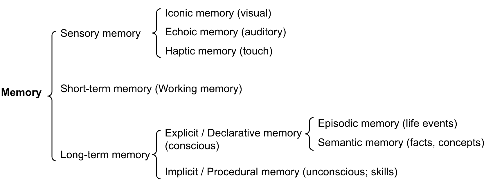

> 上图来自 Lilian Weng 的博客（2023），展示了人类认知中的记忆分类：Sensory Memory（感觉记忆，几秒）、Short-Term Memory（短期记忆，20-30 秒）、Long-Term Memory（长期记忆，可存几十年）。Agent 的记忆系统设计深受这个认知模型的启发——Working Memory 对应 STM，Episodic/Semantic/Procedural Memory 对应 LTM 的不同子类。

**两个值得了解的代表性工作**：

- **Generative Agents**：这是比较早期但非常经典的 Agent 架构。它提出了 memory stream（按时间排列的事件流）+ reflection（定期反思——从一堆具体事件中抽象出更高级的认知）+ planning（根据记忆和反思做计划）的完整方案。论文中的 25 个虚拟角色能自主地在虚拟小镇中生活、社交、做计划。

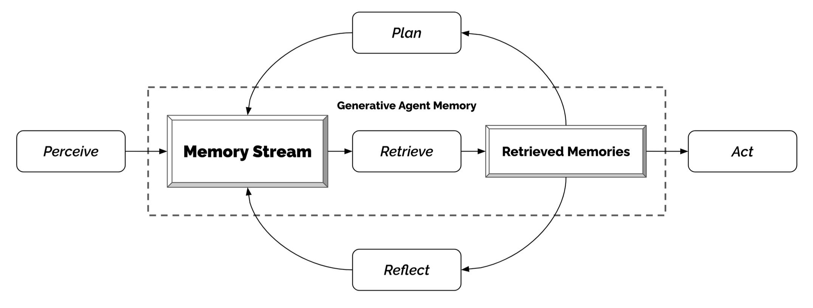

> 上图来自 Generative Agents 原始论文。从图中可以看到：Agent 的每一次经历都存入 Memory Stream（记忆流），系统定期从记忆中做 Reflection（反思），形成更高层次的认知；Planning（规划）再基于记忆和反思生成后续行为。这个"感知→记忆→反思→规划→行动"的架构是许多现代 Agent 系统的思想源头。

- **Mem0**：目前 Agent 记忆领域广泛使用的工程方案。它用向量数据库 + 知识图谱 + 键值数据库的混合存储架构，实现了用户级、会话级、Agent 级记忆的分层管理，已集成 LangGraph、CrewAI 等主流 Agent 框架。

#### 阶段 G：MCP（Model Context Protocol）

MCP 是 Anthropic 提出的一个**开放协议**，用于标准化 AI 应用和外部工具之间的连接方式。

**为什么需要 MCP？想象一个场景**：

你写了一个 Agent，让它能读文件、搜代码、查数据库。为此你给每个工具写了一段连接代码。但换了一个 Agent 框架后，所有连接代码都要重写——因为每种框架定义工具的方式不一样。如果有 100 个 Agent 应用、50 种工具，就有 5000 个"连接代码"需要维护。这显然不可持续。

MCP 的目标就是：**定义一种通用接口，让你写好一次工具（作为 MCP Server），就可以被任何支持 MCP 的 Agent 使用。**

**MCP 的核心概念**：

- **Server**：提供工具/数据/提示词的一方。比如一个"文件系统 Server"，声明自己能做 read_file、write_file、list_dir 这些事。
- **Client**：使用工具的一方，通常是 Agent runtime。
- **能力类型**：Server 可以提供三种东西——**Resources**（数据，如文件内容）、**Prompts**（预定义的提示词模板）、**Tools**（可执行的函数）。

**MCP 不是 Function Call 的替代品**：

这是容易搞混的地方。Function calling 解决的是"模型怎样表达'我想调用某某函数'"；MCP 解决的是"Agent runtime 怎样发现、连接和管理外部工具"。两者在不同层面工作，可以配合使用。

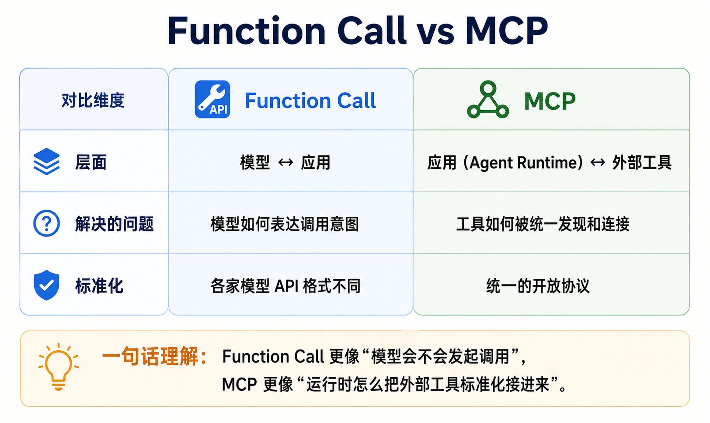

> MCP 规范由 Anthropic 于 2024 年底开源发布。

#### 阶段 H：Skill

Tool 是一个函数——有名字、有入参、有出参。但很多真实能力不能简化成单个函数。

**Tool vs Skill**：

Tool 就像工具箱里的一把螺丝刀——它做一件事，很清楚。Skill 则像一份"工作指南"——它不仅告诉你"用螺丝刀"，还告诉你"什么情况下该拧这颗螺丝、拧多紧、拧完检查什么"。

根据 Anthropic 的 Agent Skills 规范和 OpenAI Codex Skills 的设计，一个 Skill 通常是一个目录，中心是一份 `SKILL.md` 文件：

```text
Skill 目录结构（示意）：
skill_name/
  ├── SKILL.md        # 核心：何时使用、怎么做、注意什么、什么情况禁用
  ├── scripts/        # 配套执行脚本
  ├── templates/      # 输出模板
  └── references/     # 参考资料
```

**Skill 和 Procedural Memory 的关系**：

在阶段 F 中，Procedural memory 存的是"怎么做事"的知识。Skill 就是这种记忆的**工程化形态**——它把"经验流程"封装成了可发现、可调用、可维护的模块。

**Tool、Skill、Plugin 的区分**：

- **Tool**：可调用的 typed function。模型直接调用，拿回结构化结果。
- **Skill**：加载到 prompt 中的 `SKILL.md` 指令包。它不是被"调用"的，而是通过注入指令来影响 Agent 的行为和决策。
- **Plugin**：比 Skill 更重，扩展的是运行时能力——比如添加新的工具类型、新的消息通道、新的模型提供商。

> 在具身场景中，Skill 就是对机器人操作单元的工程封装——`navigate_to`、`grasp`、`place`——每个 Skill 不只是"一个函数"，而是封装了感知→规划→执行→验证的完整闭环。

#### 阶段 I：Agent Runtime / Framework

当工具越来越多、记忆层越来越厚、Skill 越来越复杂时，靠手工写 Python 脚本来管理一切就不现实了。这时需要 **Agent Runtime 或 Orchestration Framework** 来统一组织执行流程。

注意区分：**JSON mode、MCP、Skill 这些都是"能力组件"，而 LangChain、LangGraph 这类框架是"运行这些组件的外壳"**——也就是 runtime/framework。

**Runtime / Framework 通常管什么？**

- 状态管理：Agent 当前做到哪了
- 工具注册与发现：有哪些工具可用
- 执行循环：Think-Act-Observe 的主流程
- 上下文组装：每一轮往 prompt 里塞什么
- 轨迹记录：每一步干了啥，方便后面查问题
- 多 Agent 协调：几个 Agent 互相配合

**代表性框架**：

- **LangChain / LangGraph**：LangChain 提供工具调用、记忆管理等 Agent 基础能力；LangGraph 在此基础上用有向图编排执行流程，支持分支、循环、并行。两者同属一家公司，LangGraph 依赖 LangChain，可以看作一套渐进式的 Agent 开发体系——从简单链条到复杂状态图，按需选用。

**本节小结**：

本节用了很大篇幅讲了通用 LLM-based Agent——从 Chatbot 到 ReAct 循环，从 Function Call 到 Agent Runtime，从 Weng 的三组件到社区共识的 Harness 公式。这九阶段本质上回答了一个问题：**怎样让语言模型从一个"只会说话的脑子"变成一个"能持续做事的系统"？**

但这个"做事"到目前为止都发生在数字世界——读文件、调 API、搜网页。下一节要回答的问题是：**如果把这个已经证明有效的 Agent 框架搬到机器人身体里，哪些部分复用，哪些部分重做？** 答案不是"重起炉灶"，而是"框架复用 + 物理化改造"——把通用 Agent 的每个组件逐一"物理化"。

---

## 17.3 课堂任务 / 引入案例

**本讲任务**：给机器人输入“从冰箱里拿一瓶水，放到客厅茶几上”，设计一个 Robot Agent 方案，要求能拆解长程任务、调用导航/抓取/放置 skill，并在失败时基于状态反馈重规划。

**为什么选这个任务**：它同时覆盖语言理解、长程规划、移动导航、物体抓取、状态检查和失败恢复，比单次抓取更能体现 Robot Agent 相对纯 VLA 的价值。

上一节讲的是"通用 Agent"——它们活在数字世界里：读文件、搜网页、调 API。从这里开始，我们把 Agent 放到机器人身体里。

**先回答一个自然的问题：17.1 的两条公式在具身场景下还成立吗？**

答案是：**框架通用，但每个组件都被"物理化"了**。把两条公式分别套进具身场景看一下：

Weng 公式的具身版：

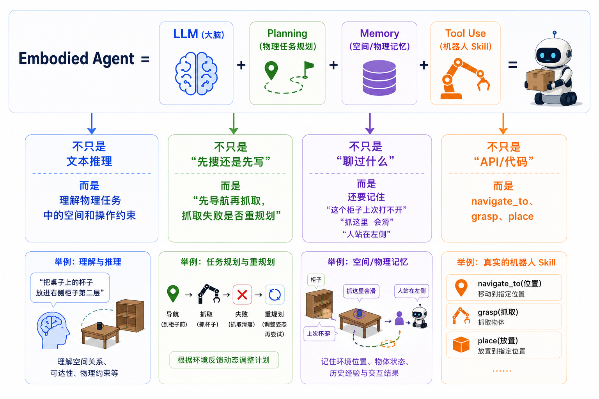

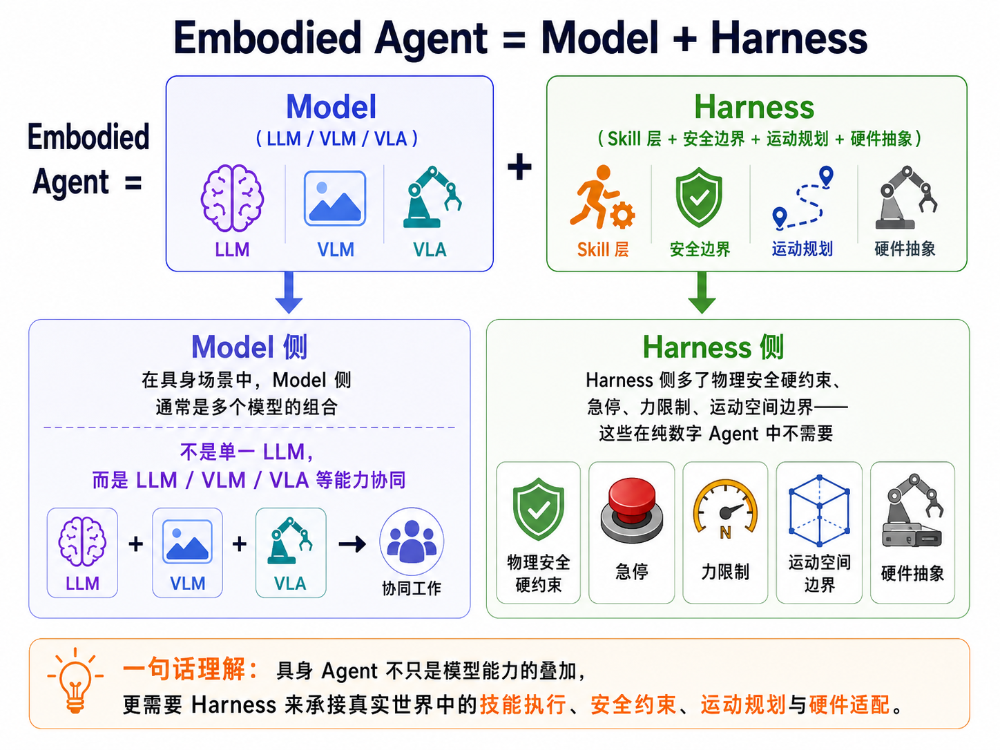

也就是说，两条公式给出的**结构框架是通用的**——无论是读文件还是抓杯子，Agent 都需要规划、记忆、工具，都需要区分"模型推理"和"基础设施"。但具身场景给每个组件加了一个维度：**物理后果**。数字 Agent 失败最多是报错；具身 Agent 失败可能撞到人、夹坏物体。

这就是为什么本节要专门讨论 Embodied Agent——不是重新发明一套理论，而是在通用 Agent 框架之上，逐一解决"物理化"带来的新问题。

本节聚焦四个核心问题：

1. **VLA 在长程任务上有什么局限？**
2. **Embodied Agent 的分层框架如何系统性地解决问题？**
3. **Embodied Agent 自身有什么局限？**
4. **社区如何尝试让 VLA 更"agentic"？**

### 17.3.1 VLA 在长程任务中的局限

回忆一下上一节介绍的 VLA（视觉语言动作模型）：它的工作方式是**看图 + 看文字指令 → 直接输出机器人动作**。训练方法是给它看大量人类操作机器人的演示录像，让它学着"看到类似场景时做出类似动作"。

**先肯定 VLA 做得好的地方**：

在短程操作任务上，VLA 非常成功。什么叫"短程"？就是几步之内就能完成的任务：

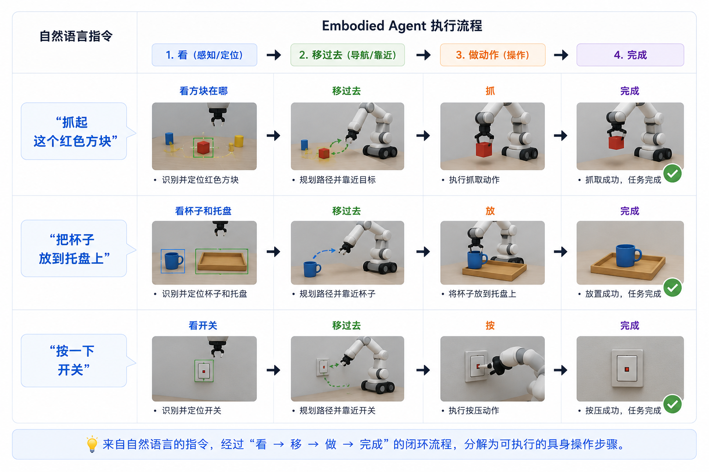

这些任务的共同特点是：**目标明确、步骤少、不需要"如果 A 不行就换 B"的条件判断**。对这类任务，VLA 已经能做到很高的成功率。

但如果任务变成长程的呢？比如"去厨房看看有没有水果，有的话洗好端到客厅"——这个任务需要几十步甚至上百步动作，而且中间充满了"如果有/如果没有/如果打不开/如果够不到"的条件分支。这时 VLA 就遇到了结构性问题。

**局限一：记不住全局**

VLA 模型看的是"最近几帧图像 + 短期历史"。当任务跑到第 80 步时，模型已经"忘记"了第 5 步看到的事情。它没有一个显式的记忆槽来保存"目标是什么、做过什么、还剩什么"。

打个比方：VLA 像一个只能看到眼前三步路的短跑选手——每一步的跑姿都很标准，但跑了一百米后可能已经偏到了隔壁赛道。

**局限二：不会"先想再做"**

VLA 做的是"条件反射"式的映射——看到场景 A，输出动作 B。这是从大量演示数据中"模仿"出来的，中间没有显式的规划步骤。

条件反射对于"抓杯子"足够了。但对于"如果杯子在洗碗机里，先打开洗碗机再拿；如果在橱柜里，直接拿；如果找不到，去客厅看看"——这种需要分情况判断的多段逻辑，端到端的条件反射就很难泛化了。你不可能为每种"如果……就……"的组合都录制演示数据。

**局限三：失败后不知道怎么恢复**

VLA 夹空了。然后呢？模型不知道该：

- 换个角度再试一次？
- 放弃这个子任务去拿别的？
- 求助人类？

因为训练数据几乎全是"成功的演示"——谁会把失败的过程也录下来？所以 VLA 没见过"夹空后应该怎么办"的例子。

**局限四：学不会安全硬规则**

机器人有一些绝对不能违反的规则——机械臂的力不能超过多少、某些区域绝对不能进。这些规则涉及罕见的危险边界场景，训练数据中极难覆盖。而端到端模型的输出永远是概率性的"软"决策，做不到"绝对不能"这种硬约束。

**用一个具体长程任务来感受差异**：

假设任务是"从冰箱里拿一瓶水，放到客厅茶几上"。我们看看纯 VLA 方案和 Embodied Agent 方案分别会怎么处理：

| 执行阶段 | 纯 VLA 会怎么做 | Embodied Agent 会怎么做 |
|----------|----------------|---------------------|
| 任务开始 | 收到指令，开始输出动作序列 | LLM Agent 先把任务拆成：导航到厨房 → 开冰箱 → 找水瓶 → 抓取 → 关冰箱 → 导航到客厅 → 放茶几 |
| 导航到厨房 | 一步一步输出移动指令，但没有"厨房"的全局坐标概念 | 调用 navigate_to("厨房") Skill，Skill 内部用 SLAM（同步定位与建图，即一边走一边认路）确定当前位置 + 路径规划算法找最优路线 |
| 开冰箱 | 需要训练数据中有"开冰箱"的演示，且冰箱型号不能差太多 | 调用 open_fridge() Skill，Skill 内有抓把手、检测门角度的逻辑 |
| 发现冰箱里没水 | 继续按训练数据的模式输出动作——可能去抓一瓶不存在的"水" | Agent 调用 perceive()，VLM 报告"冰箱里没有水瓶"，Agent 判断需要重规划——去储物间拿 |
| 重规划 | 没有这个机制 | Agent 更新计划："先去储物间找水" |
| 整个过程 | 依赖一个巨大的端到端模型从头到尾输出动作。中间任何一步超出训练分布就会失败。 | 高层 Agent 管规划和异常处理，底层 Skill 管具体执行。每步有感知-执行-验证的闭环。 |

这个对比的核心信息是：**不是 VLA 不好，而是它适合的"操作半径"有限**。Embodied Agent 不替代 VLA，而是在 VLA 之上加了一层"会思考"的规划器。


### 17.3.2 Embodied Agent 的分层框架

正是因为 VLA 不会"想"，Embodied Agent 的思路是：**给灵巧的手配一个会思考的大脑**。

**Embodied Agent 的分层思路**：

```text
┌──────────────────────────────────────────┐
│  高层（LLM/VLM Agent）：                   │
│  理解任务 → 做计划 → 根据反馈调整         │
│  "我们现在要去厨房找杯子"                  │
└──────────────┬───────────────────────────┘
               │ 调用 Skill
┌──────────────▼───────────────────────────┐
│  中层（Skill 层）：                        │
│  每个 Skill 是一个完整的操作单元            │
│  navigate_to("厨房")、grasp("杯子")        │
└──────────────┬───────────────────────────┘
               │ 调用执行
┌──────────────▼───────────────────────────┐
│  底层（VLA / 传统控制器）：                 │
│  做好"当前这一步"的精确动作                 │
│  把"抓杯子"变成关节角度和夹爪指令           │
└──────────────┬───────────────────────────┘
               │ 驱动
┌──────────────▼───────────────────────────┐
│  硬件层（电机、传感器）                     │
└──────────────────────────────────────────┘
```

**Embodied Agent 尝试解决的具体问题**：

1. **长程任务分解**：把"收拾客厅"这种模糊指令拆成"找到散落的物品 → 分类（衣服/书/杂物）→ 逐一归位 → 检查"。这需要常识和语言理解，正是 LLM 擅长的。

2. **动态重规划**：执行中某一步失败了，Agent 判断要不要重新规划。比如"抓取失败，因为杯子倒了 → 先扶正杯子，再抓"。

3. **多模态感知融合**：同时利用相机（VLM 场景理解）、力传感（"夹住了吗？"）、语音（人给的新指令）。

4. **安全边界硬约束**：在 Agent 规划和执行之间，加入不依赖 AI 判断的安全检查——急停、力限制、工作空间边界——这些是硬编码的，不经过 LLM。

**现有的 Embodied Agent 框架与项目**：

| 项目 | 核心定位 |
|------|---------|
| **Dimos** | Agent-Native 机器人 OS，Python 原生，空间记忆（RAG）、MCP 协议、多 Agent 调度 |
| **ABot-Claw** | OpenClaw 具身扩展，统一具身接口、视觉多模态记忆、critic 反馈闭环 |
| **RoboCrew** | 多 Agent 机器人框架，CrewAI 风格的易用接口 |
| **HomeBot** | 面向家庭场景的具身 Agent 框架 |
| **Hey Robot** | 原生 Embodied Agent 框架，快慢双系统、Skill/Tool 分离、仿真到真机 |
| **Vector OS Nano** | 开源机器人操作系统，Skill 管理、工具调用、硬件抽象 |

**Embodied Agent 与纯 VLA 的对比**：

| 维度 | 纯 VLA | Embodied Agent（分层） |
|------|--------|---------------------|
| 任务范围 | 短程、单步操作 | 长程、多步任务 |
| 规划方式 | 端到端映射，无显式规划 | 高层 Agent 显式规划 |
| 错误恢复 | 依赖训练数据覆盖 | Agent 可根据错误信息推理和重规划 |
| 记忆 | 隐式（神经网络权重中） | 显式（结构化的 working/episodic memory） |
| 安全约束 | 依赖训练数据 | 独立的安全检查层（硬约束） |
| 可解释性 | 低（端到端的黑盒） | 高（每步有 Think-Act-Observe 记录） |

### 17.3.3 Embodied Agent 自身的局限性

在讨论了 Embodied Agent 的优势之后，也必须诚实面对它当前做不到的事情。

**局限一：LLM "看"不见三维世界**

LLM 处理的是文字，它对空间关系（远近、前后、碰撞、遮挡）的理解是"从书上看来的"，不是"算出来的"。举个具体的例子：

```text
场景：桌上紧密排列着三个物体——杯子、水瓶、盘子。杯子在水瓶后面。

Agent 问："杯子在桌上吗？"
VLM 答："在。"
Agent："抓杯子。"

问题来了——VLM 说"杯子在桌上"是对的，但它没告诉 Agent "杯子在水瓶后面，直接抓会撞到水瓶"。LLM Agent 看不到三维空间，它不知道"杯子在桌上"和"能直接够到杯子"之间的差距。
```

目前的办法：把空间推理交给运动规划器（它会精确计算路径和碰撞），LLM 只做语义层面的决策（"去抓杯子"而不是"把关节 2 转 15.3 度"）。运动规划器会告诉 Agent"这个位置够不到/会碰撞"，Agent 再据此调整计划（"先移开水瓶"）。

**局限二：VLM 的描述不够精确**

VLM 擅长说"这是什么"，不擅长说"这离我多远、我能不能够到"。就像侦察兵回来报告"前方有敌人"——但没说多少人、多远、有没有掩体。指挥官（LLM Agent）只能猜。

实际场景中，VLM 常见的精度问题包括：
- 物体定位偏移 1-2 厘米（对抓取来说可能是"能抓住"和"碰倒"的差距）
- 遮挡情况下漏检（"杯子被书挡住了"→ VLM 报告"桌上没有杯子"）
- 状态误判（"抽屉关着但没关严"→ VLM 说"抽屉是关的"）

这些精度问题在有精确定位的工业机器人中不太会出现（因为它们依赖固定的夹具和传送带位置），但在开放环境（家庭、办公室）中，VLM 的感知精度是 Embodied Agent 的主要瓶颈之一。

**局限三：成功率连乘衰减**

这是一个简单的数学问题：如果任务要 50 步，每步成功率 95%，总成功率是多少？

```text
0.95^50 ≈ 0.077 = 7.7%
```

在机器人领域，95% 的单步成功率已经是不错的水平了，但 50 步下来只有 7.7% 的总成功率。任何一步的失败都可能导致前功尽弃。

**为什么要特别关心这个问题？** 假设一个 Embodied Agent 执行"收拾书桌"任务，需要 30 个操作步骤（找书→抓书→放到书架→找笔→抓笔→放笔筒→……）。即使用最好的 VLA 模型，每一步的"纯动作成功率"能做到 90%，30 步后的总成功率也只有 0.90^30 ≈ 4.2%。这意味着执行 25 次才能成功 1 次——在真实机器人上这是不可接受的。

缓解方向：让每个 Skill 自带简单的错误恢复（提高有效单步成功率，比如从 90% 提到 98%）；在关键步骤后加验证（抓完后拍照确认物体确实在夹爪中，而不是继续执行下一步才发现夹空了）；让任务能从中间步骤恢复而不是必须从头来（比如抓书失败了只重试"抓书"，不需要重新从"找书"开始）。

**局限四：仿真和真机不一样（Sim-to-Real Gap）**

很多 Embodied Agent 先在仿真里开发——仿真里随便试，摔不坏。但仿真环境的图像太"干净"（没有真实光照变化、阴影、灰尘），物理也不够真（摩擦力、碰撞都是近似的）。

在仿真里练得再好的 Agent，上真机时往往会遇到各种"没想到"的问题。就像玩赛车游戏很好的人，第一次上真赛车——方向盘的手感、刹车的力度、车身的震动，都和游戏里不一样。缓解这个差距的常用手段：在仿真训练中故意加光照变化、纹理扰动和物理参数抖动，让模型在仿真里就见过足够多的"不完美"情况，上真机时不至于被真实世界的复杂性打得措手不及。

**局限五：通用和可靠很难兼得**

一个什么都能做的通用 Agent，在某个特定任务（比如"给这个型号的手机拧螺丝"）上，通常不如专门为这个任务编写的传统自动化程序可靠。Embodied Agent 的价值在**灵活性**——处理没有被预先编程过的任务。但在工厂这类对可靠性要求极高的场景，灵活性不一定比稳定性重要。

分层架构（通用的头脑 + 专用的手脚 + 硬的安全约束）是当前调和这个矛盾的主要思路，但远未完全解决。

**本节小结**：Embodied Agent 通过给 VLA 这双"巧手"配上 LLM 这个"大脑"，解决了一部分长程任务的问题。但它也带来了新的挑战——VLM 看得不够准、LLM 三维理解不够好、成功率连乘衰减、仿真到真机的鸿沟。这些挑战是本课程后续会继续讨论的问题。

### 17.3.4 走向 Agentic VLA

17.2.1 讨论了 VLA 的结构性局限——记不住全局、不会先想再做、失败后不知道怎么恢复。这些问题不是换个更大的模型就能解决的，因为它们根植于"端到端映射"这个设计本身。社区近两年做了不少探索，试图让 VLA 变得更"agentic"——能推理、能分层、能在线调整。下面三项工作代表了三条不同的路径。

**π0.7：把 Agentic 能力嵌入 VLA 内部**

2026 年的 π0.7 是目前通用 VLA 模型的代表作。它能开箱即用地完成复杂的灵巧操作——用咖啡机做 espresso、叠衣服、处理垃圾袋、削蔬菜——不需要针对具体任务做微调。更关键的是，π0.7 展现了此前 VLA 难以做到的组合泛化：把训练中学到的不同技能按新的方式组合起来，解决从未见过的任务。

但 π0.7 不是简单地把 VLA 做大。它的架构基于 π0.6-**MEM**（MEM = Multi-scale Embodied Memory，多尺度具身记忆），这意味着它**内置了显式的记忆模块**——不是把历史信息压缩到网络权重里，而是有一个专门的记忆编码器来存和取关键信息。

更值得关注的是，π0.7 在运行时使用了**三层 agentic 结构**：

1. **高层语言策略**：一个高层策略模型把复杂任务拆成子任务文本（如"打开冰箱门"→"找到水瓶"→"抓取水瓶"）
2. **轻量世界模型**：接收当前观测 + 子任务文本，**生成子目标图像**——"这一步做完后画面应该是什么样"。这个 world model 利用互联网规模的图像/视频预训练，能对没见过的新任务也能生成合理的视觉子目标
3. **VLA 执行**：以子目标图像为条件，输出动作序列来逼近这个子目标。子目标定期刷新——当语义意图变化或每隔若干秒

也就是说，π0.7 的"规划"不是 LLM Agent 在外面调用 VLA，而是**把记忆、世界模型、分层规划全塞进了模型架构里**，让 VLA 自己成为一个"会记、会想、会做"的系统。这与 Hi Robot 的分层思路形成有趣的对照：Hi Robot 是"外面加一个大脑"，π0.7 是"在模型里长出一个大脑"。

不过 π0.7 仍有局限。它的安全约束还是依赖训练数据（没有独立的安全检查层），记忆和规划都在模型内部，出问题时不容易定位是"记错了"还是"想错了"还是"做错了"。

**Hi Robot：给 VLA 加一个"会思考"的上层**

Hi Robot 走的是分层路线。它的架构分两层：高层是一个 VLM，负责理解复杂的自然语言指令和用户反馈，决定"现在该做哪一步"；低层是一个 VLA，负责把高层决定的子任务（比如"抓起那个杯子"）变成具体的机械臂动作。

这个设计的灵感来自认知科学中"系统 1 / 系统 2"的区分——系统 1 是快速、自动的反应（对应低层 VLA），系统 2 是缓慢、需要思考的推理（对应高层 VLM）。单纯叫机器人"拿起杯子"只需要系统 1，但如果用户说"帮我做一个素食三明治，不要番茄，如果有火腿的话另外做一个给朋友"，就需要系统 2 来理解和拆解。

Hi Robot 能控制单臂、双臂、移动双臂三种机器人，处理的都是真实的家务——收拾桌子、做三明治、采购杂货。这种分层架构在处理十步以上的复杂任务时，比纯 VLA 靠谱得多。

Hi Robot 给我们的关键启示是：**把"理解任务"和"执行动作"分开，让不同模型各司其职**，比用一个巨大模型硬扛所有事情更有效。这也是前面讲的 Embodied Agent 框架的核心思想。

**Agentic-VLA：让 VLA 在部署后继续学习**

Agentic-VLA 解决的是另一个层面的问题：VLA 训练完了就固定了，部署到新环境后如果遇到不熟悉的情况就会失败。它的思路是让 VLA 到了新环境后能**一边执行一边自己微调**——不需要人工重新标注数据，模型自己通过尝试和反馈就能适应。简单说，就是让 VLA 不再"出厂设定、用到报废"，而是越用越顺手。

在长程任务测试中，这种在线自适应比标准 VLA 好不少，而且只需要在新环境里跑一次就能看到明显提升。

**三条路径的共同指向**

把三项工作放在一起看，它们其实在讲同一件事的不同侧面：

| 工作 | 核心思路 | 回应了 VLA 的哪个局限 |
|------|---------|---------------------|
| π0.7 | 模型内部集成记忆（MEM）+ 世界模型 + 分层规划 | 不会"记"、不会"先想再做"→ 在 VLA 内部嵌入 agentic 能力 |
| Hi Robot | 分层架构，VLM 推理 + VLA 执行 | 不会"先想再做"→ 在 VLA 外面加一个思考层 |
| Agentic-VLA | 在线自适应，部署后持续学习 | "训练完就固定"→ 让模型在执行中持续进化 |

三条路径代表了三种不同的"让 VLA 变 agentic"策略：π0.7 把能力嵌入模型内部，Hi Robot 在外面包一层 Agent，Agentic-VLA 让模型到了新环境继续学。它们并不互斥——未来的方向很可能是一个兼具内部记忆与规划、外部分层推理和在线自适应能力的系统。前两节已经讨论了 Embodied Agent 的分层框架和当前局限，这三项工作可以看作学术界在"让具身系统更 agentic"方向上的前沿探索。

## 17.4 方法框架：Robot Agent 分层与安全边界

本讲把 Robot Agent 拆成五层，后续做仿真或真机时都按这个框架检查：

1. **任务层**：LLM/VLM 负责理解自然语言目标，拆成可执行子任务。
2. **工具层**：MCP、Function Call 或本地 runtime 暴露可调用能力。
3. **Skill 层**：`navigate_to`、`detect_object`、`grasp`、`place`、`check_success` 等可复用操作单元。
4. **执行层**：VLA、运动规划器或传统控制器把 skill 变成轨迹、关节角和夹爪指令。
5. **安全层**：运动空间限制、力/速度限制、急停防护和人工接管，不依赖 LLM 自行判断。

## 17.5 有硬件版 Demo

**Demo 名称**：Robot Agent 长程取放任务

**硬件平台**：xLeRobot / SO101 / Unitree G1，根据课程现场硬件选择其一。

**任务描述**：输入一句自然语言任务，让高层 Agent 生成 skill 计划，并通过真机完成导航、识别、抓取、放置和状态检查。

**流程**：

```text
输入任务 → 生成计划 → 调用 navigate_to → detect_object → grasp → place → check_success → 记录失败与重规划
```

## 17.6 无硬件仿真版 Demo

**Demo 名称**：ROS2 mock + 仿真 Skill 调度

**可选平台**：ROS2 mock / ManiSkill / RoboCasa / MuJoCo。

**流程**：

```text
加载模拟场景 → 注册 skill 工具 → Agent 生成计划 → 仿真执行 → 输出计划日志和状态变化
```

**与有硬件版的对应关系**：仿真版保留同一套 skill 接口和日志格式，只替换底层执行器，便于后续迁移到真机。

## 17.7 实验步骤

1. 阅读本讲 Agent 分层框架，列出任务需要的 skill。
2. 在 `code/lecture17/` 中补全或检查 skill 接口定义。
3. 运行无硬件仿真版，保存 Agent 计划日志。
4. 设计一个失败场景，例如抓取失败、目标不存在或路径被阻挡。
5. 记录 Agent 如何观察失败、更新状态并重规划。
6. 有硬件条件时，将同一套 skill 接口接入真机执行。

## 17.8 作业交付

1. 一份 Robot Agent 高层流程图。
2. 一段仿真或真机演示视频。
3. 一份计划日志，包含每一步的 `think / act / observe`。
4. 一个失败复盘案例，说明失败现象、可能原因和下一轮修正方案。

## 17.9 常见失败与复盘

### 常见失败

- **计划不可执行**：Agent 生成了不存在的 skill 或参数不合法，需要工具 schema 校验。
- **感知误判**：VLM 识别到目标但定位不准，需要结合深度、位姿估计或二次确认。
- **抓取失败**：夹爪闭合但未抓住物体，需要增加 `check_grasp` 和重试策略。
- **路径阻挡**：导航 skill 返回失败，需要 Agent 选择绕行、清障或请求人工介入。
- **安全边界触发**：超过工作空间、力限制或急停条件时，必须停止执行并记录原因。

### 复盘问题

- 这次失败发生在规划层、skill 层、执行层还是感知层？
- Agent 是否拿到了足够清晰的错误信息？
- 哪些规则应固化为安全边界，而不是交给模型判断？

## 17.10 参考开源项目与论文

完整外链同步维护在 [`references/links.md`](../../references/links.md#lecture-17)。

### LLM-based Agent 核心参考

- **LLM Powered Autonomous Agents**, Lilian Weng (2023): <https://lilianweng.github.io/posts/2023-06-23-agent/>
- **ReAct**: Yao et al., "Synergizing Reasoning and Acting in Language Models", ICLR 2023: <https://arxiv.org/abs/2210.03629>
- **Generative Agents**: Park et al., "Interactive Simulacra of Human Behavior", UIST 2023: <https://arxiv.org/abs/2304.03442>
- **Mem0**: Mem0 Team, "Mem0: Building Production-Ready AI Agents with Scalable Long-Term Memory", 2025: <https://arxiv.org/abs/2504.19413>
- LangChain: <https://python.langchain.com/docs/introduction/>
- LangGraph: <https://langchain-ai.github.io/langgraph/>
- nanobot: <https://github.com/HKUDS/nanobot>

### Agent Harness / Tool Use

- **Building Effective Agents**, Anthropic (2024): <https://www.anthropic.com/engineering/building-effective-agents>
- **Effective Harnesses for Long-Running Agents**, Anthropic (2024): <https://www.anthropic.com/engineering/effective-harnesses-for-long-running-agents>
- **Equipping Agents for the Real World with Agent Skills**, Anthropic (2024): <https://www.anthropic.com/engineering/equipping-agents-for-the-real-world-with-agent-skills>
- **MCP Specification**, Anthropic (2024): <https://modelcontextprotocol.io/>

### Embodied Agent

- **π0.7**: Physical Intelligence, "π0.7: A Steerable Generalist Robotic Foundation Model", 2026: <https://arxiv.org/abs/2604.15483>
- **MEM**: Torne et al., "MEM: Multi-scale Embodied Memory for Vision Language Action Models", 2026: <https://arxiv.org/abs/2603.03596>
- **Agentic-VLA**: Jin & Zhang, "Agentic-VLA: Efficient Online Adaptation for Vision-Language-Action Models", 2025: <https://arxiv.org/abs/2605.22896>
- **Hi Robot**: Zhang et al., "Open-Ended Instruction Following with Hierarchical Vision-Language-Action Models", 2025: <https://arxiv.org/abs/2502.19417>
- **ABot-Claw**: Xu et al., "ABot-Claw: A Foundation for Persistent, Cooperative, and Self-Evolving Robotic Agents", 2026: <https://arxiv.org/abs/2604.10096>
- Dimos: <https://github.com/dimensionalOS/dimos>
- RoboCrew: <https://github.com/Grigorij-Dudnik/RoboCrew>
- HomeBot: <https://github.com/choco-robot/HomeBot>
- Vector OS Nano: <https://github.com/VectorRobotics/vector-os-nano>
- Hey Robot: <https://github.com/Xbotics-Embodied-AI-club/Xbotics-Hey-Robot>

## 关联代码

- [`code/lecture17/`](../../code/lecture17/)

## 配图

| 编号 | 文件名 | 内容 |
|------|--------|------|
| 图 17-1 | `fig-17-1-agent-overview.png` | Agent 系统总览 |
| 图 17-2 | `fig-17-2-agent-loop-example.png` | Agent 循环示例 |
| 图 17-3 | `fig-17-3-agent-evolution-map.png` | Agent 发展阶段 |
| 图 17-4 | `fig-17-4-react-loop.png` | ReAct 循环 |
| 图 17-5 | `fig-17-5-react-loop-example.png` | ReAct 示例 |
| 图 17-6 | `fig-17-6-react-condition-example.png` | ReAct 条件判断 |
| 图 17-7 | `fig-17-7-memory-types.png` | 记忆类型 |
| 图 17-8 | `fig-17-8-generative-agents-arch.png` | Generative Agents 架构 |
| 图 17-9 | `fig-17-9-function-call-vs-mcp.png` | Function Call 与 MCP |
| 图 17-10 | `fig-17-10-weng-embodied-formula.png` | Weng 公式的具身版 |
| 图 17-11 | `fig-17-11-embodied-agent-formula.png` | Embodied Agent 公式 |
| 图 17-12 | `fig-17-12-vla-short-horizon-tasks.png` | VLA 短程任务 |
