# 第 19 讲：Embodied Agent

## 19.1 本讲目标

学完这一讲，你应该能回答四个问题：

1. LLM-based Agent 和普通 Chatbot 有什么区别？它怎样通过工具和反馈循环持续做事？
2. LLM-based Agent 的规划、记忆和工具调用，接到机器人身体后分别变成了什么？
3. 机器人执行一个 Skill 后，怎样判断成功、处理失败并保证安全？
4. 为什么一个强模型还不等于可靠的 Agent？Harness 需要负责什么？

先不用记住所有框架名字，可以先抓住一条主线：

```text
Chatbot 只回答问题；
LLM-based Agent 会使用工具推进任务；
Harness 让模型能够持续、可检查、受约束地工作；
Embodied Agent 再把这套任务执行能力接到机器人身体和真实环境上。
```

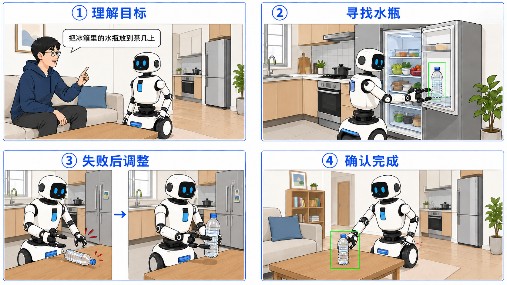

---

要让机器人完成“去厨房拿一瓶水，再送到客厅”这样的长程任务，仅仅会移动和抓取还不够。它还需要记住目标、拆解步骤、调用不同能力，并根据执行结果不断调整。LLM-based Agent 已经在数字世界中展示了这套任务执行方式，也是 Embodied Agent 的重要基础。

## 19.2 核心知识点：Agent 介绍

一个模型从“只会聊天”变成“能自主做事”，中间究竟多了什么？答案不是一句更复杂的 prompt，而是一套持续规划、调用工具、观察结果和更新状态的执行机制。

### 19.2.1 Agent 的定义：从 Chatbot 到自主任务执行器

最简单的 Chatbot 接收一段文字，再返回一段文字。即使它能给出很好的建议，真正搜索网页、读取文件、执行程序和检查结果的仍然是人。

Agent 面对的则是一个需要持续推进的目标。例如，“查找最近的具身智能论文并整理成中文摘要”至少需要搜索、筛选、读取、写作和验收。**LLM-based Agent** 会让模型在应用程序提供的能力范围内选择下一步，并根据执行结果继续调整。


两者的区别不是有没有对话界面，而是谁拥有执行循环：

| 交互方式 | 谁执行下一步 | 工具结果怎样影响后续 |
|---|---|---|
| Chatbot | 人阅读建议后手动操作 | 人把结果重新告诉模型 |
| Agent | 应用程序执行模型提出的 Tool 请求 | 结果自动返回 Agent Loop |

例如，面对“整理本学期的课件”，Chatbot 可以建议分类方法；Agent 则可能真正经历下面的过程：

```text
列出文件
→ 读取课程名和日期
→ 生成分类计划
→ 移动文件
→ 检查是否有遗漏
→ 发现无法识别的文件时向用户提问
```

这里的自主性是有限的：用户给出目标，开发者提供 Tool 和权限，Agent 只在这些边界内选择下一步。它不是能够任意访问计算机或机器人的独立程序。

Lilian Weng 在 2023 年的 *LLM Powered Autonomous Agents* 中给出了一张很有代表性的 Agent 系统图：Agent 位于中心，通过 **Planning、Memory、Tools 和 Action** 形成从思考、保存状态到使用外部能力和影响环境的完整链路。

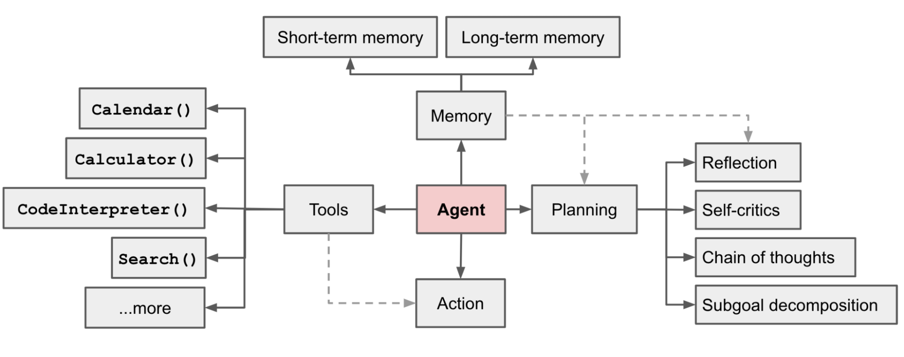

> 图源：Lilian Weng，*LLM Powered Autonomous Agents*，2023。图中 Agent 与 Memory、Planning、Tools 和 Action 直接相连；Memory 又分为短期与长期记忆，Planning 包含反思、自我批评、思维链和子目标分解，Tools 则连接搜索、代码解释器等外部能力。

把图中的能力关系写成一个便于记忆的公式：

```text
Agent = LLM + Memory（记忆） + Tools（工具） + Planning（规划） + Action（行动）
```

- **Memory（记忆）**：保存当前任务状态，也可以保存跨任务经验。
- **Tools（工具）**：Agent 光靠“想”是不够的，它需要借助外部能力搜网页、读文件、发送消息或操作机器人。工具决定了 Agent 实际能接触和改变什么。
- **Planning（规划）**：把目标拆成步骤，并根据执行结果更新计划。
- **Action（行动）**：把计划真正执行出来。模型提出工具调用或机器人 Skill 请求，外部程序负责执行，执行结果再返回给模型。

上面的公式是一张能力清单，不是数学等式。模型理解目标，Planning 选择步骤，Tools 提供外部能力，Action 触发执行，Memory 保存过程状态。它们通过 **Agent Loop（Agent 的运行循环）**持续协作：

```text
Think（思考）-> Act（行动）-> Observe（观察）-> Update（更新状态）
```

例如机器人抓杯子时：

```text
Think：杯子在桌面右侧，下一步尝试抓取
Act：调用 grasp("cup")
Observe：夹爪闭合，但杯子仍在桌面
Update：记录抓取失败，改为重新定位后再抓
```


把 `search_web` 换成 `navigate_to("厨房")`，把 `read_file` 换成 `grasp("杯子")`，循环结构并没有改变；变化的是 Tool 的另一端从数字系统变成了机器人和环境。

Agent Loop 和普通 `while` 循环也不完全相同。`while` 循环的判断和下一步通常由程序员预先写死；Agent Loop 的外层流程仍由程序控制，但模型会根据目标和最新 Observation，在允许的 Tool 中动态选择下一步。

```python
while not task_finished:
    intent = model.choose_next_action(state, available_tools)
    result = runtime.validate_and_execute(intent)
    state = update_state(state, result)
```

这段伪代码中特别重要的是 `validate_and_execute`：模型选择动作，不代表动作一定执行。Runtime 仍要验证 Tool 是否存在、参数是否合法、调用是否有权限。

Agent Loop 要可靠运行，至少需要四条工程边界：

- **步数上限**：必须给 Agent 设置最大执行步数，否则它可能在一个问题上反复尝试、陷入死循环。达到上限后应给出“超时未完成”的明确状态。具体上限应根据任务长度和工具成本设置，机器人任务还要同时设置执行时间与重试次数上限。
- **工具校验**：模型可能"幻觉"出不存在的工具名或不合法的参数。应用层在真正执行前必须校验——工具是否存在？参数类型对不对？必填参数齐不齐？
- **错误要喂回去**：工具失败时，不要把错误信息吞掉，要结构化地返回给模型。模型需要知道"为什么失败"才能调整下一步策略。如果只返回一个"失败"，模型只能瞎猜。
- **能主动停止**：Agent 不是只能被步数上限截断。它自己应该有能力判断"任务已经完成"或"现有信息不足以继续，需要问人"，并主动终止循环。

模型只负责提出调用意图，真正执行 Tool 的是外部应用程序。即使模型已经会规划、记忆和调用工具，仍有一组问题没有答案：

```text
模型请求了不存在的 Tool，谁拒绝？
同一个错误连续发生，谁停止循环？
模型说“已经完成”，谁检查最终结果？
动作可能删除数据或伤害设备，谁要求人工确认？
```

工具注册、参数校验、任务状态、结果验收和权限控制都不能只依靠模型。Weng 在 2026 年的 *Harness Engineering for Self-Improvement* 中把关注点进一步转向模型外围的 Workflow、Evaluation、Permission Control 和 Persistent State。这套负责运行、检查和约束的系统称为 **Harness（运行与约束系统）**：

```text
Agent 系统 ≈ Model（模型） + Harness（运行与约束系统）
```

因此，从 Chatbot 到 Agent 的关键变化不是“多回答几轮”，而是模型进入了一个有能力目录、执行反馈、持久状态和停止条件的运行系统。

### 19.2.2 模型层演进：LLM、VLM、VLA

Agent 可以使用不同模态和输出空间的模型。LLM、VLM 和 VLA 描述的是不同类型的模型能力。实际系统既可以让多个模型分工，也可以让一个多模态模型承担其中多种能力：

| 模型 | 典型输入 | 典型输出 | 在 Agent 中常承担的角色 |
|---|---|---|---|
| **LLM**（Large Language Model，大语言模型） | 文本与结构化状态 | 文本、计划、Tool 调用请求 | 理解目标、拆解任务和选择能力 |
| **VLM**（Vision-Language Model，视觉语言模型） | 图像或视频、文本 | 场景描述、视觉问答结果、位置或状态判断 | 观察环境、语义推理和结果检查 |
| **VLA**（Vision-Language-Action，视觉语言动作模型） | 视觉、语言指令、机器人状态 | 末端位姿、关节位置、离散动作或 Action Chunk | 把当前指令转成机器人 Action |

VLA 输出的是机器人 Action，不等同于直接控制电机。Robot Runtime 和控制器仍要负责实时控制、数值边界与安全检查。

以“把桌上的红杯子递给用户”为例，一种分层实现可能是：

```text
高层模型：把目标拆成“找到红杯子 → 抓取 → 移动到用户附近 → 递交”
VLM：根据相机图像确认红杯子的位置、遮挡和当前状态
VLA：根据“抓取红杯子”指令与机器人状态生成一段 Action
控制器：检查轨迹、速度和碰撞条件，再驱动执行器
Evaluator：根据视觉和夹爪状态判断杯子是否真的被拿起
```

这不是唯一组合方式。例如，VLM 可以直接承担高层规划，VLA 也可能接收较长的任务描述；传统物体检测器、运动规划器和控制器仍可与学习模型共同工作。选择架构时不应只问“用了哪个模型”，还要问“这个模型输入了什么、输出到哪一层、失败以后谁接管”。

能力更强的多模态模型可能同时承担几种角色，但系统仍需明确三个边界：

- **时间尺度**：长程任务决策和实时控制是否由同一模块承担？
- **状态所有权**：任务进度、机器人状态和环境状态保存在哪里？
- **执行权限**：模型输出能否直接到达硬件，还是必须经过 Harness 与控制器？

### 19.2.3 从模型输出到可靠执行：五个工程问题

Structured Output、Tool Calling、Memory、Skill 和 Harness 可以同时存在于现代 Agent 中，分别解决输出、行动、状态、能力连接和系统运行问题：

```text
自由文本难以被程序读取
→ Structured Output
模型只能提出建议
→ Tool Calling 与 Agent Loop
长任务会遗忘和跑偏
→ Context、State 与 Memory
能力越来越多，接口各不相同
→ MCP 与 Skill
组件齐全但没人统一运行和验收
→ Runtime、Harness 与 Evaluator
```


#### 19.2.3.1 Structured Output：让程序读懂模型输出

自由文本适合人与人交流，却不适合直接连接程序。模型可能改变字段名称、遗漏参数，或者在结果前后加入解释。**Structured Output（结构化输出）**要求模型按照预先定义的 JSON Schema 返回数据。

```json
{
  "intent": "read_file",
  "args": {"path": "/home/user/notes.md"}
}
```

JSON mode 通常只保证结果是合法 JSON；支持 Schema 约束的 Structured Output 还可以限制字段、类型和必填项。即使结构完全合法，`path` 是否存在、目标是否可达、动作是否安全仍需由应用程序检查。**结构合法不等于语义正确，更不等于允许执行。**

同样的边界也适用于机器人。下面的请求在结构上完全合法，但 `object_id` 可能不存在，机器人也可能看不到或够不到目标：

```json
{"skill": "pick", "arguments": {"object_id": "red_cup"}}
```

因此，Schema 验证之后还需要环境验证和权限验证。Structured Output 解决“程序能否读懂”，不解决“请求是否合理”。

#### 19.2.3.2 Tool Calling 与 Agent Loop：让模型根据反馈行动

Structured Output 表达的是数据；**Function Calling（函数调用机制）**让模型生成结构化的函数调用请求，包括函数名和参数，应用程序再验证并执行该请求。**Tool Calling（工具调用机制）**是更宽泛的概念：Tool 可以是自定义函数，也可以是搜索、代码执行或 MCP 等外部能力。

1. 开发者把能用什么工具、各自有什么参数，以 JSON Schema 的形式提前告诉模型。
2. 模型选择 Tool 并生成参数。
3. 应用层验证请求，真正执行 Tool。
4. 应用层把工具结果传回给模型，模型根据结果继续思考。

```json
{
  "name": "search_web",
  "description": "搜索公开网页",
  "parameters": {
    "query": {"type": "string"}
  }
}
```

一次 Tool 调用解决不了长任务，应用程序还要把调用结果放回 Agent Loop。Tool 可以按不同关系组织：

| 模式 | 说明 | 例子 |
|------|------|------|
| 单次调用 | 一个工具调用拿到答案，任务结束 | "今天天气怎么样" → search_weather() |
| 顺序调用 | A 的结果是 B 的输入，必须按顺序 | read_file() → summarize() → save() |
| 并行调用 | A 和 B 互不依赖，可以同时调 | 同时查三个城市的人口数据 |
| 条件调用 | 根据前面结果决定要不要调下一步 | "如果北京人口 > 上海人口，就画图" |
| 重试调用 | 失败后修改参数或策略 | 网络超时 → 在预算内重试 |

**ReAct**（Reasoning + Acting，推理与行动）展示了 Thought、Action 和 Observation 交替影响后续决策的方式，是 Agent Loop 的代表性工作。

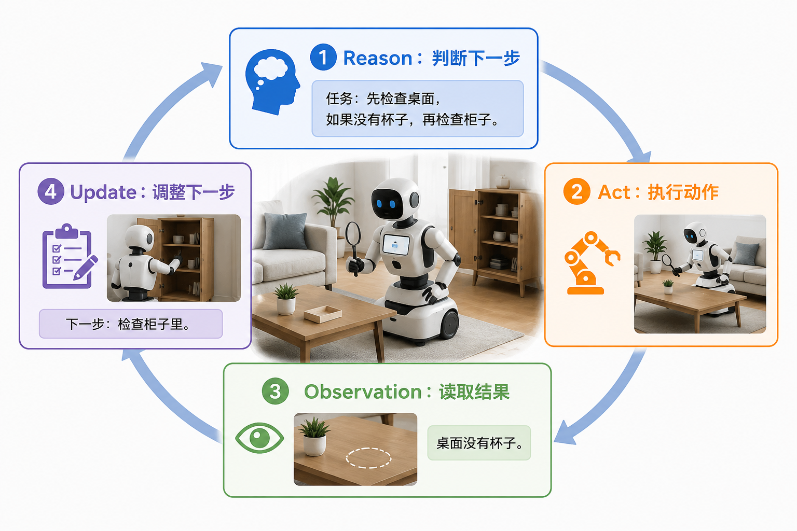

记录 Tool 请求、Action 和 Observation 可以提高系统的可追踪性，帮助定位失败发生在哪一步；模型生成的推理文字并不等于可靠、完整的内部解释。ReAct 原始实验位于文本环境，把它迁移到机器人时，还必须加入物理结果验证和安全检查。

例如，`grasp("cup")` 返回“调用完成”只能说明程序没有异常退出。如果相机仍看到杯子在桌面，Agent Loop 应把“抓取未产生预期物理变化”作为 Observation 返回模型，再决定调整视角、重新定位或停止，而不是仅根据函数返回值宣布成功。

#### 19.2.3.3 Context、State 与 Memory：让长任务不遗忘

Tool 调用次数增加以后，把全部历史都塞进模型并不能保证任务稳定。**Context Engineering（上下文工程）**关注每一轮应该把什么交给模型；**State（状态）**保存任务当前的确定事实；**Memory（记忆）**保存可以在之后取回的经历与知识。

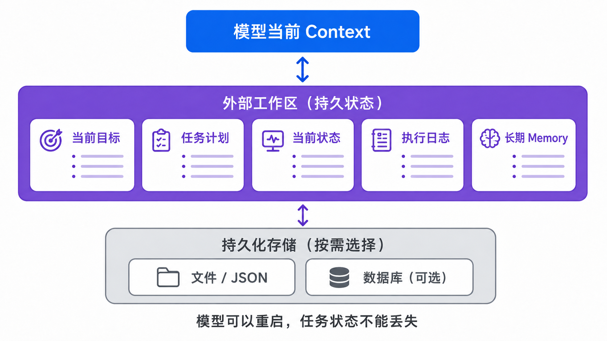

三者的职责不同：

| 组件 | 主要问题 | 例子 |
|---|---|---|
| Context | 模型这一轮需要看到什么？ | 当前目标、最近 Observation、可用 Tool |
| State | 系统现在确定处于什么状态？ | 已完成步骤、机器人位置、执行预算 |
| Memory | 哪些过去信息以后可能有用？ | 失败 Episode、物体位置、可复用流程 |

RAG（Retrieval-Augmented Generation，检索增强生成）是从外部资料中检索相关片段并放入 Context 的一种方法，不等于完整 Memory。机器人还可能使用地图、物体数据库和 Episode 日志保存空间与执行经验。

为了分析不同信息在系统中的用途，可以把常见 Memory 分为以下五类。不同研究和工程系统可能采用不同分类方式：

| 记忆类型 | 记的是什么 | 有什么用 |
|----------|-----------|----------|
| Working memory | 当前这次任务的状态——正在做什么、刚才工具返回了什么 | 让你别走神 |
| Episodic memory | 以前做过的任务的完整过程 | 复盘、积累经验 |
| Semantic memory | 用户偏好、事实知识（如"用户讨厌等待""北京是中国的首都"） | 个性化、知识补充 |
| Procedural memory | 可复用的流程、代码套路、操作模板 | 遇到类似任务直接用 |
| Reflective memory | 失败教训、自我反思、以后该怎么避免 | 别再踩同一个坑 |

Embodied Agent 还特别依赖 **Spatial Memory（空间记忆）**，例如物体位置、房间关系、可达区域和曾经失败的观察角度。所有 Memory 都需要生命周期：信息何时写入、怎样检索、何时更新或失效。错误状态如果长期保留，反而会误导 Agent。

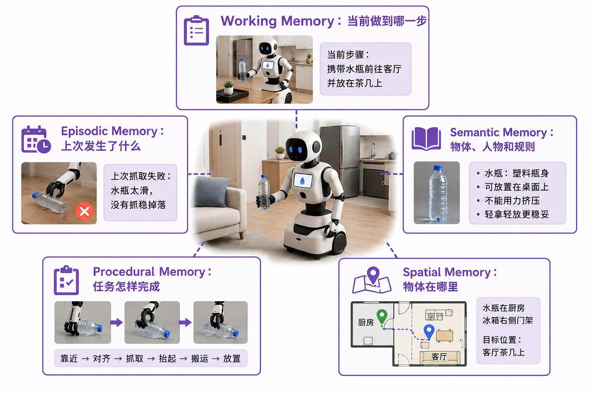

Generative Agents 使用 Memory Stream、Reflection 和 Planning 组织虚拟角色的经历；Mem0 等工程方案则把长期记忆保存在当前对话之外。无论采用哪种方式，保存日志都不等于形成有效 Memory。只有经过筛选、更新并能在正确时机取回的信息，才会帮助后续决策。


以“上次从正面抓取水瓶失败”为例，系统可以保存不同层次的信息：

```text
Episode 日志：相机图像、目标位姿、抓取 Action 和失败结果
可复用经验：水瓶被托盘遮挡时，先改变观察角度
当前 State：水瓶尚未抓取，剩余重试预算仍可用
本轮 Context：当前图像、失败原因和可选择的恢复 Skill
```

如果系统只把整段 Episode 原样塞进 Context，模型未必能提取出有效经验；如果只保留一句“抓取失败”，又可能丢失恢复所需的信息。Memory 设计的重点是把完整记录、稳定状态和可复用经验分开管理。

#### 19.2.3.4 MCP 与 Skill：让能力可以被发现和复用

MCP 最初由 Anthropic 于 2024 年底开源提出。它是一种**上下文与能力交换协议**，用于标准化 AI 应用与外部系统之间的连接。

如果每个 Agent 都为文件、数据库和机器人能力编写一套私有连接代码，接口会越来越难维护。MCP 定义共同的通信规则，使支持它的 Host 能以一致方式发现和连接 Server；能否真正调用仍取决于能力协商、认证和权限。

MCP 采用 Host–Client–Server 架构：

```text
Host（AI 应用）
├── Client A ── Server A（文件系统）
├── Client B ── Server B（数据库）
└── Client C ── Server C（机器人 Skill）
```

- **Host**：管理模型、连接、Context、用户授权和安全策略的 AI 应用。
- **Client**：Host 内部的连接组件。通常一个 Client 维护与一个 Server 的独立连接。
- **Server**：提供专门上下文或能力的本地/远程程序，例如文件系统 Server、数据库 Server 或机器人 Skill Server。

| 类型 | 作用 | 例子 |
|---|---|---|
| **Tools** | 可以执行的操作 | 写文件、查询数据库、调用 `grasp()` |
| **Resources** | 提供给应用的上下文数据 | 文件内容、机器人状态、任务日志 |
| **Prompts** | 可复用的交互模板 | 代码审查模板、机器人任务规划模板 |

```text
Function Calling：模型怎样表达“我想调用某个函数”
MCP：Host 怎样发现、连接并管理外部上下文和能力
```

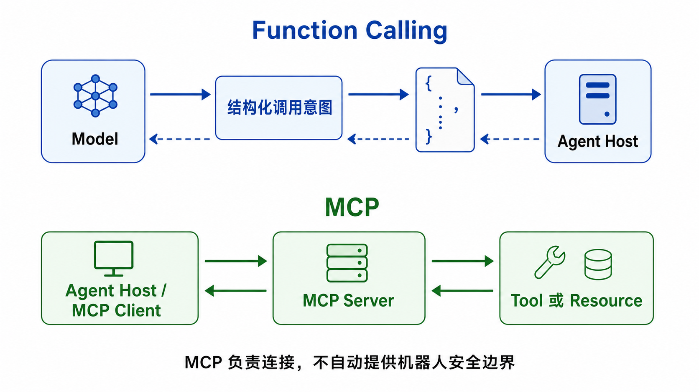

二者组合时，一次调用可能经过下面的链路：

```text
模型生成 Function Calling 请求
→ Host 验证请求并选择 MCP Client
→ Client 把请求发送给对应 Server
→ Server 返回结果
→ Host 把结果写回 Agent Loop
```

MCP 规定怎样交换消息，不会自动保证 Tool 安全。即使 Server 暴露了 `move_arm()`，Host/Harness 与控制器仍要检查参数、权限、工作空间、速度、力和急停状态。

在机器人领域，**Skill** 通常指可调用的行为单元，例如 `navigate_to`、`grasp` 和 `place`。一个 Skill 不只是函数名字，还应声明输入、前置条件、成功标准、失败模式和安全级别，并在内部组织感知、规划、执行与局部验证。

```text
Skill：grasp
输入：object_id
前置条件：目标可见、可达、夹爪为空
成功条件：视觉和夹爪状态共同确认目标被持有
失败模式：目标丢失、抓空、碰撞或力限制
安全级别：需要运动权限
```

LLM Agent 社区也会把一组可复用的指令、脚本和资料称为 Agent Skill，例如以 `SKILL.md` 为中心的目录。它通过加载操作说明影响 Agent 行为，与机器人领域“可执行行为单元”的含义不同。除非特别说明，下文的 Skill 均指可执行的机器人行为单元。


#### 19.2.3.5 Runtime、Harness 与 Evaluator：让系统持续、可检查地运行

当工具越来越多、Memory 越来越长、Skill 越来越复杂时，谁来真正运行 Agent Loop、执行 Tool 并保存任务状态？这部分程序称为 **Agent Runtime**。

但“能运行”还不等于“可靠运行”。系统还需要组织 Context、记录中间产物、检查结果、控制权限并处理失败。包含 Runtime 在内的这套完整运行与约束系统，就是 **Harness**。

- 工作流管理：当前做到哪了，下一步继续、重试还是结束
- 工具注册与发现：有哪些工具可用，参数和返回值是什么
- 上下文组装：这一轮真正需要给模型哪些信息
- 持久状态：把计划、中间结果、错误和产物保存在上下文之外
- 轨迹与评测：记录每一步，并用测试或检查器判断结果
- 权限控制：限制高风险操作，在关键节点请求人工确认
- 并发与后台任务：管理耗时工具或多个子任务

把能力视角和工程视角放在一起，就能看到两条公式的区别：

```text
能力视角：    Agent = LLM + Memory + Tools + Planning + Action
                              ↑ Agent 需要哪些能力？

工程视角：    Agent 系统 ≈ Model + Harness
                                ↑ 这些能力怎样被组织、检查和约束？
```

第一条是能力清单，第二条是运行系统。迁移到机器人时，对象发生了变化：

| 数字 Agent | Embodied Agent |
|---|---|
| 读取代码、文件和网页 | 读取图像、位姿、力和机器人状态 |
| 调用 Shell、搜索、编辑工具 | 调用导航、检测、抓取、放置 Skill |
| 运行测试判断代码是否正确 | 调用 `check_grasp`、`check_success` 判断动作是否成功 |
| 文件、任务清单和运行日志 | Episode、空间记忆、任务状态和失败视频 |
| 沙箱、命令白名单、人工审批 | 速度/力限制、工作空间、急停和人工接管 |

**Episode（一次完整任务记录）**通常包含任务过程中的 Observation、Action、状态、时间戳和结果。Harness 可以保存失败 Episode，并通过修改工作流提高可靠性。例如，抓取后增加检查与恢复分支：

```text
原流程：grasp → place

改进后：grasp → check_grasp
                  ├─ 成功 → place
                  └─ 失败 → change_view → retry
```

系统变得更可靠，不一定每次都要重新训练模型。增加检查步骤、保存失败轨迹和调整 Skill 顺序也是改进 Agent。**Evaluator（评测器）**、权限和安全边界必须位于这种改进循环之外：Agent 可以提出恢复策略，却不能自行关闭碰撞检测、提高速度上限或绕过真机审批。

Evaluator 与模型的职责也不同。模型可以根据上下文判断“下一步看起来应该做什么”，Evaluator 则应根据预先定义的成功条件检查证据：

```text
模型判断：“放置动作已经执行，可以结束。”
Evaluator 检查：相机是否确认杯子位于目标区域？
                证据是否来自本次执行之后？
                是否还有未满足的任务条件？
```

如果证据不足，Evaluator 应返回 `inconclusive`，Harness 再决定补充 Observation、重试或向人求助。这样，任务是否完成不会只由执行动作的同一个模型自行宣布。

---

## 19.3 Embodied Agent 的通用架构

一个模型能够听懂指令，并不意味着机器人已经能够完成任务。它还需要保存状态、选择 Skill、控制身体、检查结果，并在失败后调整计划。

假设你对机器人说：

> 从冰箱里拿一瓶水，放到客厅茶几上。

人听到这句话，会自然地想到“先去厨房，再开冰箱”。机器人却必须把每一步都变成可以执行、可以检查的过程：冰箱在哪里？门是否已经打开？水瓶能不能够到？抓取后怎样确认没有夹空？

这正是 Embodied Agent 要解决的问题。它沿用数字 Agent 的 Planning、Memory、Tools 和 Agent Loop，但必须增加连接认知与身体的系统结构。


### 19.3.1 为什么不能让 LLM 直接控制机器人？

假设 LLM 直接输出“把机械臂向前移动 20 厘米”。执行前至少还有几个问题没有回答：目标是否仍在原位？前方有没有人？机械臂能否到达？移动后怎样确认没有碰倒水瓶？

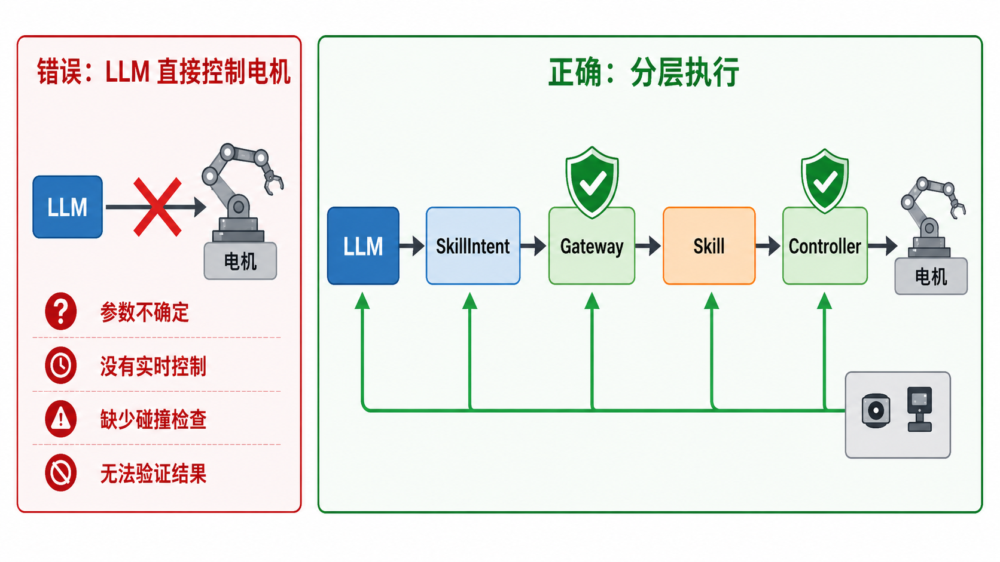

LLM 适合理解目标和选择下一步，却不适合承担毫秒级控制、确定性安全检查和物理结果验证。因此，一个 Embodied Agent 通常采用四层架构：

四层分别回答不同的问题：

| 层次 | 主要职责 | 不应该承担的职责 |
|---|---|---|
| Agent / Cognition | 理解目标、拆解任务、选择 Skill | 直接生成电机控制量 |
| Harness / Runtime | 保存状态、验证请求、调度、评测和恢复 | 替代底层控制器 |
| Skill / Model | 完成一次感知、导航、抓取或放置 | 决定整个长程任务目标 |
| Robot Runtime / Controller | 驱动硬件并执行确定性安全检查 | 理解开放式自然语言任务 |

分层不是为了把系统画得更复杂，而是为了让模型、Skill 和机器人分别演进，并让危险动作始终经过确定性的执行边界。


### 19.3.2 慢系统与快系统怎样协作？

四层架构说明“谁负责什么”，快慢系统说明“不同决策在多长时间内发生”。

例如，慢系统决定“先拿水，再去客厅”；快系统在抓取过程中持续调整轨迹、限制速度并检查夹爪状态。这里的“快”描述决策时间尺度，不代表某个 VLA 模型的推理延迟一定很短。


两个系统要持续协作，必须共享当前状态。机器人至少需要维护三类信息：


| 状态 | 要回答的问题 | 冰箱取水示例 |
|---|---|---|
| **任务状态** | 做到哪一步，还剩什么？ | 已到厨房，下一步需要开冰箱 |
| **机器人状态** | 身体现在能做什么？ | 位于厨房，夹爪空闲，电量充足 |
| **环境状态** | 周围世界是什么样？ | 冰箱关闭，水瓶位置未知 |

一种简化的状态记录可以写成：

```json
{
  "task_state": {
    "goal": "把水瓶放到客厅茶几上",
    "current_step": "open_fridge",
    "completed": ["navigate_to_kitchen"]
  },
  "robot_state": {
    "location": "kitchen",
    "gripper": "open",
    "battery": 0.82
  },
  "world_state": {
    "fridge": "closed",
    "water_bottle": "unknown"
  }
}
```

这三类状态来自传感器、感知模块、控制器和任务程序。**Observation（观察结果）**不是把所有原始数据一股脑塞给 LLM，而是把当前任务需要的信息整理成结构化结果。例如，深度相机和物体检测模块可以共同返回：

```json
{
  "object": "water_bottle",
  "visible": true,
  "position": [0.42, -0.15, 0.81],
  "reachable": false,
  "reason": "blocked_by_container"
}
```

Agent 不需要亲自从数百万个像素中计算距离，只需要理解：水瓶已经找到，但现在够不到。接下来它可以选择移动身体、调整视角或先移开障碍物。

空间信息还会随动作变化。机器人打开冰箱后，门的角度变了；碰倒水瓶后，水瓶的位置也变了。因此，Embodied Agent 的 Memory 不是静态笔记，而是一个需要不断更新的任务与世界状态。

### 19.3.3 目标怎样逐层变成机器人动作？

向下传递的信息会越来越具体：系统先保存任务目标和成功条件，Agent 再提出一条 Skill 请求。Skill 组织局部能力，机器人控制层最后把动作交给控制器和执行器。

例如，Agent 不应该直接构造机械臂关节角，而是提出：

```json
{
  "skill": "grasp",
  "objective": "拿起水瓶",
  "arguments": {"object_id": "water_bottle"}
}
```

Harness 收到这条 Skill 请求后，会检查 Skill 是否存在、参数是否完整、机器人是否在线以及当前是否允许运动。只有通过检查的请求才会进入 Skill 层。

例如，抓取 Skill 内部可能包含：

```text
检测水瓶
→ 估计抓取位置
→ 检查是否可达
→ 规划机械臂轨迹
→ 闭合夹爪
→ 根据夹爪宽度和力传感器检查结果
```

VLA 很适合承担其中需要视觉理解和灵巧动作的部分，传统运动规划器和控制器则擅长精确几何、安全轨迹和实时控制。它们不是相互替代，而是可以成为同一个 Skill 的不同实现。

这里最重要的边界是：

> Agent 决定“做什么”，Skill 组织“怎样完成这一件事”，控制器保证“硬件怎样稳定运动”。

### 19.3.4 物理结果怎样逐层变成 Evidence？

机器人执行后，信息沿相反方向返回：原始传感器数据被整理为 Observation，Skill 返回执行结果，系统从 Observation 中提取与成功条件相关的 Evidence，Evaluator 再判断任务是否完成。


这四个概念不能混为一谈。相机拍到水瓶属于 Observation；`grasp` 没有报错只表示 Skill 正常结束；相机和夹爪传感器共同确认“水瓶被机器人持有”才属于 Evidence。

当 Agent Loop 开始控制机器人时，还需要加入物理结果验证和状态更新，因此可以展开为六步：


```text
Observe：读取任务状态、机器人状态和环境状态
Think：判断当前情况与目标之间的差距
Plan：选择或更新下一步 Skill
Act：执行 Skill
Verify：用传感器证据检查物理结果
Update：更新状态，然后继续、重试、重规划或求助
```

现在让机器人真正开始冰箱取水任务。

**第一轮：前往厨房**

```text
Observe：机器人位于客厅，厨房位置已知
Plan：navigate_to("kitchen")
Act：导航 Skill 开始执行
Verify：定位系统确认机器人已到达厨房入口
Update：完成“前往厨房”，下一步是打开冰箱
```

**第二轮：冰箱里没有水**

```text
Observe：冰箱已经打开，但没有检测到水瓶
Think：原计划的前提不成立
Plan：先去储物间寻找水瓶
Update：修改剩余任务，而不是继续抓取不存在的目标
```

这叫 **Replanning（重规划）**：任务目标没有改变，但通往目标的路径改变了。

**第三轮：第一次抓取夹空**

```text
Act：grasp("water_bottle")
Verify：夹爪已闭合，但力传感器和相机都没有确认水瓶在夹爪中
Update：记录 grasp_missed，并根据新的感知结果修正目标位置
Plan：在预设重试预算内再次尝试
```

这里的修正方向和重试次数只是示意，真实系统应根据感知置信度、任务风险与执行预算决定。如果 Evidence 一直没有增加，Harness 应停止自动重试并请求人工帮助。

Evaluator 在这个循环里扮演“验收员”。它不负责抓水瓶，而是检查 Evidence 是否满足任务成功条件。只有函数正常返回，没有物理证据，不能宣布成功。

### 19.3.5 安全边界应该放在哪里？

“请安全地移动机械臂”只是一句语言要求，不能代替确定性检查。安全至少分布在三处：

```text
Harness：权限、参数、超时、重试预算和人工审批
控制器：速度、力、关节范围、工作空间和碰撞检查
硬件：急停、限位开关和物理保护装置
```

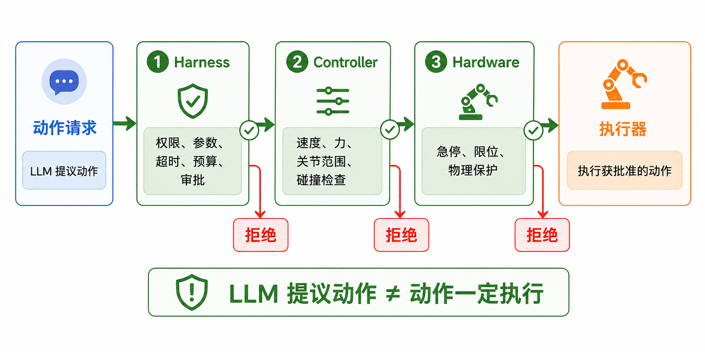

例如，在 Skill 请求被接受前，Harness 可以检查机器人是否在线、电量是否足够、所需资源是否空闲；动作到达驱动器前，控制器还要检查急停、碰撞标志、动作维度和数值边界。

```text
LLM 提议动作
≠ 动作一定会执行

只有通过每一层安全检查
→ 动作才能到达执行器
```

至此，一条完整的执行链可以写成：

```text
任务目标与成功条件
→ Agent 提出 Skill 请求
→ Harness 验证与调度
→ Skill / VLA / 运动规划器
→ 机器人控制层与安全控制
→ Observation / 执行结果 / Evidence
→ Evaluator
→ 继续、重试、重规划、求助或完成
```

## 19.4 跟着代码运行一个 Embodied Agent

先运行一个只依赖 Python 标准库的最小程序。它不调用真实 LLM，也不连接机器人，只展示任务目标、Skill 请求、安全检查、Evidence 和 Evaluator 怎样协作。

为了把职责写进代码，示例程序使用了下面这些类名：

| 通用概念 | 示例代码名称 |
|---|---|
| 任务目标与成功条件 | `TaskContract` |
| Skill 的接口和能力边界 | `SkillContract` |
| Agent 提出的 Skill 请求 | `SkillIntent` |
| 请求验证与安全检查 | `SkillGateway` |
| Skill 执行结果 | `SkillResult` |
| 交给机器人控制层的动作 | `RobotAction` |

这些名称属于本章示例程序，不是实现 Embodied Agent 时必须采用的标准命名。


代码位于：

```text
code/lecture19/simulation/task_contract_demo.py
```

在仓库根目录运行。Linux 和 macOS 通常使用 `python3`；Windows 如果没有该命令，可以将其替换为 `py`：

```bash
python3 code/lecture19/simulation/task_contract_demo.py
```

程序会依次运行四个场景。先不要急着阅读全部代码，从第一个对象开始。

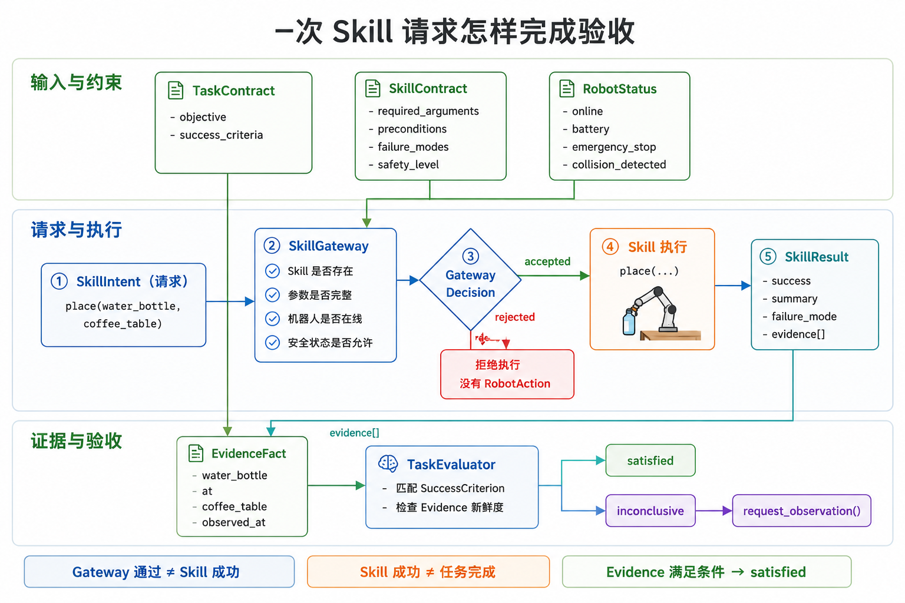

### 19.4.1 第一步：阅读 TaskContract 与 SkillContract

“把水瓶放到茶几上”只描述了目标，没有告诉系统怎样验收。程序使用 TaskContract 同时保存 Objective（任务目标）和 Success Criterion（成功条件）：

```python
task = TaskContract(
    "put the water bottle on the coffee table",
    (SuccessCriterion("water_bottle", "at", "coffee_table"),),
)
```

```text
subject          predicate   object
water_bottle     at          coffee_table
```

这种写法比“把水放好”更容易检查。相机、位姿估计或仿真环境只要能产生同样关系的 Evidence，Evaluator 就可以判断条件是否满足。

TaskContract 描述整个任务，SkillContract 描述局部能力。示例程序注册了三个 Skill：

| Skill | 必需参数 | 用途 |
|---|---|---|
| `inspect_scene` | `question` | 获取新的环境观察 |
| `pick` | `object_id` | 拿起指定物体 |
| `place` | `object_id`、`target_id` | 把物体放到目标区域 |

Agent 只能从 Skill Catalog（技能目录）中选择能力。Skill 名称只说明“它大概能做什么”，SkillContract 则声明参数、前置条件、成功标准、失败模式和安全级别：

```python
"pick": SkillContract(
    name="pick",
    required_arguments=("object_id",),
    preconditions=(
        "object_visible",
        "object_reachable",
        "gripper_empty",
    ),
    success_criteria=("object is held by robot",),
    failure_modes=(
        "object_not_found",
        "grasp_missed",
        "force_limit",
    ),
    safety_level="motion",
)
```

尝试清空 TaskContract 的 `success_criteria`，程序会拒绝创建无法验收的任务。也可以请求一个未注册的 `open_fridge`，确认 Gateway 返回 `unknown_skill`。局部 Skill 恢复与全局任务预算应分别管理，避免机器人无限循环。

### 19.4.2 第二步：让 SkillIntent 经过 SkillGateway

在第一个场景中，Agent 提出：

```text
request_skill(
    "place",
    {"object_id": "water_bottle", "target_id": "coffee_table"}
)
```

这只是 SkillIntent，不是电机指令。SkillGateway 会依次检查：

```text
Skill 是否存在？
→ 必需参数是否齐全？
→ 机器人是否在线？
→ 急停或碰撞标志是否激活？
→ 电量是否允许执行运动？
```

通过后可以看到：

```text
SkillGateway：允许=是，原因=通过（accepted）
```

尝试把 `target_id` 从参数中删除，结果会变成 `missing_arguments:target_id`。这说明 Structured Output 不只是方便读取，也让系统可以在动作到达机器人以前拒绝不完整的请求。

### 19.4.3 第三步：比较“Skill 成功”和“任务完成”


只运行第一个场景：

```bash
python3 code/lecture19/simulation/task_contract_demo.py success
```

输出中最重要的两行是：

```text
SkillResult：成功=是
Evaluator：状态=已满足（satisfied），缺失条件=0
```

`place` 正常结束，并返回了下面这条 Evidence：

```text
water_bottle  at  coffee_table
```

它与 TaskContract 中的成功条件完全匹配，所以任务完成。

接着运行证据缺失场景：

```bash
python3 code/lecture19/simulation/task_contract_demo.py missing-evidence
```

这一次 `place` 仍返回成功，但没有 Evidence：

```text
SkillResult：成功=是，Evidence 数量=0
Evaluator：状态=证据不足（inconclusive），缺失条件=1
更新计划：request_observation('水瓶真的在茶几上吗？')
```

Evaluator 不读取“动作看起来执行完了”这样的自然语言总结，只检查成功条件是否有新鲜证据。`inconclusive` 表示证据不足，此时 Agent 应重新观察，而不是宣布任务完成。

### 19.4.4 第四步：测试安全门与执行预算

运行低电量场景：

```bash
python3 code/lecture19/simulation/task_contract_demo.py low-battery
```

输出为：

```text
SkillGateway：允许=否，原因=电量过低，禁止运动
Robot Runtime：没有收到 RobotAction，机器人不会运动
```

这里没有再次询问模型“低电量还能不能抓取”。`pick` 被标记为运动能力，电量低于确定性阈值时，Gateway 直接拒绝请求。

还可以修改 `scenario_low_battery()`：

```python
RobotStatus(emergency_stop=True)
RobotStatus(collision_detected=True)
RobotStatus(online=False)
```

分别运行并记录拒绝原因。无论模型多么确信动作可行，这些状态都不能被 Prompt 覆盖。

安全门阻止单次危险动作，执行预算则阻止 Agent 无限循环。运行最后一个场景：

```bash
python3 code/lecture19/simulation/task_contract_demo.py budget
```

机器人连续三次搜索一个不存在的目标，每次 Evaluator 都返回 `inconclusive`。达到 `max_deliberations` 后，系统停止搜索并请求人类帮助。

预算可以包含：

```text
最多进行多少次推理
最多调用多少次 Skill
同一个动作最多重复多少次
整个任务最多运行多长时间
```

失败恢复的目标不是“永不停止”，而是在可控成本内重试，在证据长期没有增加时及时停机或求助。

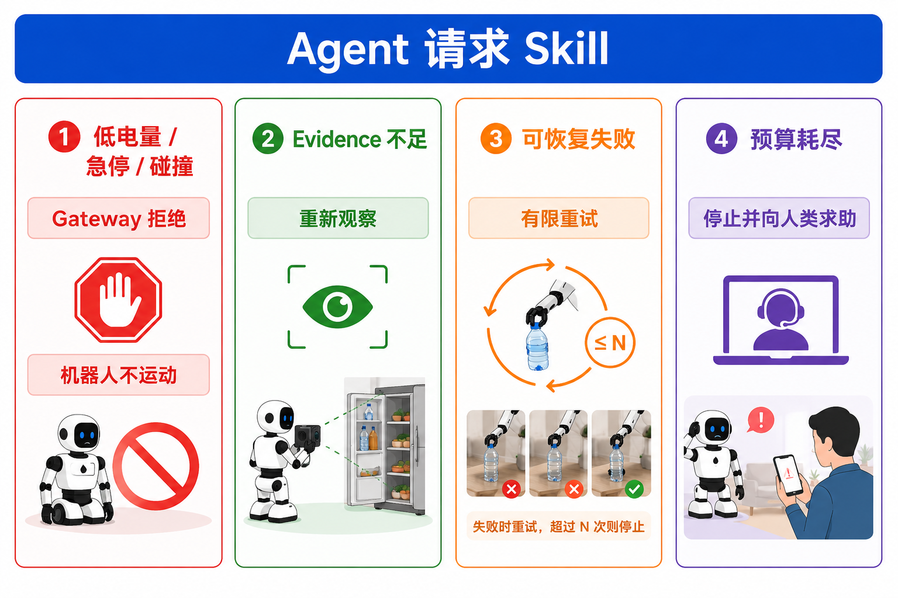

### 19.4.5 第五步：增加一个失败场景

选择下面一项修改脚本：

1. Agent 请求一个不存在的 Skill，确认 Gateway 返回 `unknown_skill`。
2. 调用 `place` 时删除 `target_id`，确认动作不会到达机器人。
3. 构造一条超过 `max_age_sec` 的旧 Evidence，确认 Evaluator 不接受过期证据。
4. 为 `pick` 增加一次 `grasp_missed`，让 Agent 重新观察后再决定是否重试。

修改后记录完整的：

```text
TaskContract
→ SkillIntent
→ Gateway Decision
→ SkillResult
→ Evidence
→ Evaluation
→ 下一步动作
```

如果日志中缺少其中一项，就很难判断失败发生在规划、验证、执行还是评测阶段。

完成修改后，可以用下面的 Harness 检查表复盘系统：

| 检查项 | 要回答的问题 |
|---|---|
| 目标 | 用户到底要什么？成功标准是否可以测量？ |
| 状态 | 已完成什么、正在做什么、还剩什么？ |
| 身体 | 机器人位置、夹爪、电量和故障状态是否可读？ |
| 环境 | 关键物体、障碍物和空间关系是否被更新？ |
| Skill | Agent 能调用哪些真实存在的能力？ |
| 观察 | 每次执行后能获得哪些结构化反馈？ |
| 评测 | 谁判断动作成功，使用什么传感器证据？ |
| 恢复 | 哪些错误可以重试，最多重试几次？ |
| 权限 | 哪些动作需要人工确认？ |
| 安全 | 哪些规则永远不能由模型修改？ |
| 记录 | 是否保存计划、调用、状态变化和失败轨迹？ |

## 19.5 现在的 Embodied Agent 能做到什么？

面对“整理餐桌，但不要收走别人还在使用的餐具”这样的任务，机器人不仅要会抓取，还要理解限制条件、观察当前场景，并在用户说“那个不是垃圾”时立即调整。

目前有两条正在汇合的技术路线：一是在 VLA 和控制器外增加 Agent / Harness，由高层系统规划、调用能力、检查结果和处理失败；二是让 VLA 自身吸收历史、子任务和子目标。两者都试图解决长程任务，但系统边界不同。

### 19.5.1 路线一：在 VLA 外部增加 Agent / Harness

外部 Agent 可以用不同形式告诉低层系统“下一步做什么”：

| 接口形式 | 高层输出 | 适合表达什么 | 需要解决的问题 |
|---|---|---|---|
| 语言子目标 | “拿起红杯子” | 开放语义和当前子任务 | 低层 VLA 能否稳定理解不同说法？ |
| 可执行代码 | 条件、循环和 API 组合 | 几何计算与复杂控制流程 | 生成代码能否安全、受限地执行？ |
| 结构化 Primitive 调用 | 受 Schema 约束的 JSON 请求 | 可检查、可记录的能力调用 | Primitive 怎样返回结果并支持恢复？ |

#### Hi Robot：把复杂要求翻译成当前一步

Hi Robot 使用两个不同频率运行的模型：高层 VLM 读取相机画面、开放式指令和用户反馈，输出一个较简单的语言子命令；低层 VLA 再把子命令变成机器人 Action。

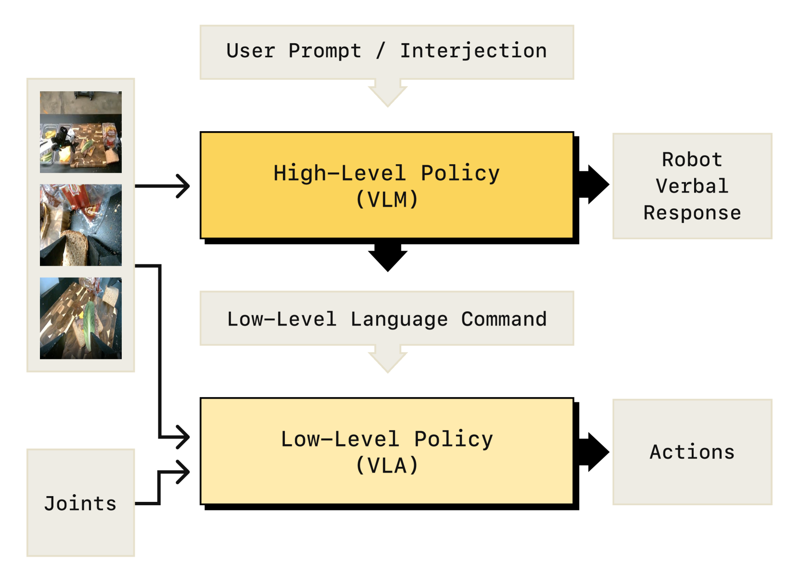

> 图源：*Hi Robot: Open-Ended Instruction Following with Hierarchical Vision-Language-Action Models*，Figure 2，2025。

读图时可以沿着两条信息流来看：高层 VLM 接收开放式指令和相机图像，输出当前的低层语言命令，也可以向用户作出语言回应；低层 VLA 同时读取这条命令、相机图像和机器人关节状态，再输出连续动作。高层决定“现在做什么”，低层负责“怎样把当前一步做出来”。

例如，面对“做一个素食三明治，不要放番茄”，高层 VLM 可以先输出“拿起一片面包”，低层 VLA 再生成连续动作。

Hi Robot 的高层 VLM 不是直接接入的通用 Chatbot。研究者使用机器人轨迹和合成的具身交互数据训练它，使它知道低层 VLA 能理解哪些原子命令。原型系统每隔一秒或收到新的用户反馈时重新计算子命令，这是一种实现选择，不是所有机器人都适用的固定频率。

它说明语言可以成为高层推理与低层动作之间的接口，但也留下了一个问题：什么时候应该结束当前子任务，把控制权交回高层？

#### Hi-VLA：分层以后，哪些组件真的重要？

*What Matters in Orchestrating Robot Policies* 对 Hi-VLA 系统进行了系统消融，比较高层 VLM、低层 VLA、Observation 表示、Memory 和控制权切换方式。结果说明，把一个强 VLM 放在一个强 VLA 上面，并不自动得到可靠系统。

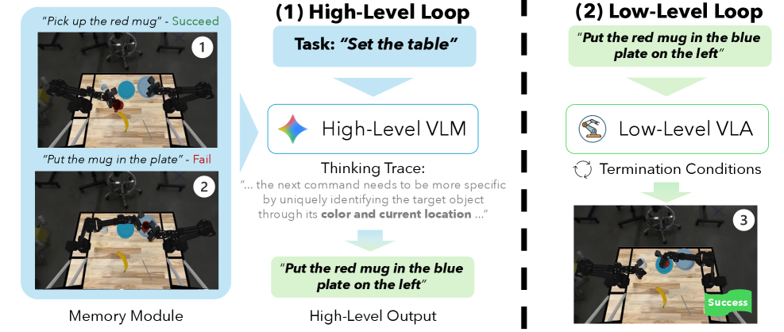

> 图源：*What Matters in Orchestrating Robot Policies*，Figure 1，2026。

图中左侧的 Memory 同时记录成功和失败的执行历史。高层 VLM 根据总任务、当前场景和这些历史，把“把杯子放进盘子”改写成包含颜色与位置的具体子目标；低层 VLA 持续执行这个子目标，直到满足 Termination Condition，再把控制权交回高层。它把 Hi-VLA 的关键接口集中在一张图中：高层怎样利用 Memory、语言子目标怎样约束低层，以及一次 Skill 何时结束。

研究得到的几条结论很适合指导系统设计：

- 在论文测试的模型系列和任务中，高层推理能力的影响比单纯增加模型尺寸更明显。
- 低层 VLA 必须能稳定理解高层给出的不同语言子目标。
- Skill 结束后何时把控制权交回高层，会直接影响长程任务表现。
- 使用成功检测作为结束条件，通常比提前猜测 Skill 要执行多久更可靠。
- 普通场景描述不一定优于原始图像；包含物体框、接触状态等任务信息的结构化 Observation 更有帮助。
- 简单堆积当前 Episode 的原始历史没有明显帮助，从过去 Episode 中总结出的可执行经验更有价值。

论文中的成功检测可以读取仿真器提供的特权状态，真机却没有完整答案。真实系统仍需从图像、位姿、夹爪和力传感器中构造 Evidence，并考虑检测器误判。Orchestration（编排）不是模型之间接一根线，而是要设计清楚：高层看什么、低层做多久、谁判断成功、哪些历史值得保留。

#### Code as Policies：让模型生成机器人程序

语言子目标不是表达计划的唯一方式。Code as Policies 让代码模型根据自然语言生成机器人程序，程序可以读取物体检测结果、完成空间计算，并组合已有的感知与控制 API：

```python
target = detect_object("red_block")
while not object_grasped():
    move_to(target)
    close_gripper()
```

这里的 Policy 主要指可执行的机器人控制程序，不是专指通过强化学习得到的策略网络。代码比一句语言子目标更容易表达循环、条件分支和几何运算，但表达能力越强，执行边界越需要明确：程序能调用哪些 API？循环运行多久？参数越界时谁来拒绝？

因此，Code as Policies 解决了“怎样生成组合流程”，却不能代替 Runtime 和安全层。生成的程序仍应运行在受限环境中，并经过 API 白名单、参数校验、预算、日志和机器人控制器检查。

#### Harness VLA：把 VLA 变成可重试的 Primitive

Harness VLA 采用了更受约束的接口。高层 Planner 不直接生成关节目标或 Action Chunk，而是从一个固定 Primitive 集合中选择结构化调用：

```json
{"action": "vla_act", "prompt": "grasp the black bowl"}
```

其中，`vla_act` 把冻结的 VLA 封装成处理抓取、受约束放置和装置操作的局部能力；`move_to`、`release`、`navigate_to` 等确定性 Primitive 负责定位、移动、调整姿态和释放。

VLA 调用失败时，Planner 不必放弃整个任务。它可以读取新的 Observation，重新定位物体，调整机器人到更合适的预接触位置，然后再次调用 `vla_act`。系统还把成功的 Primitive 序列保存为 Task Specific Memory，把跨任务可复用的成功规则和失败模式保存为 Global Memory。

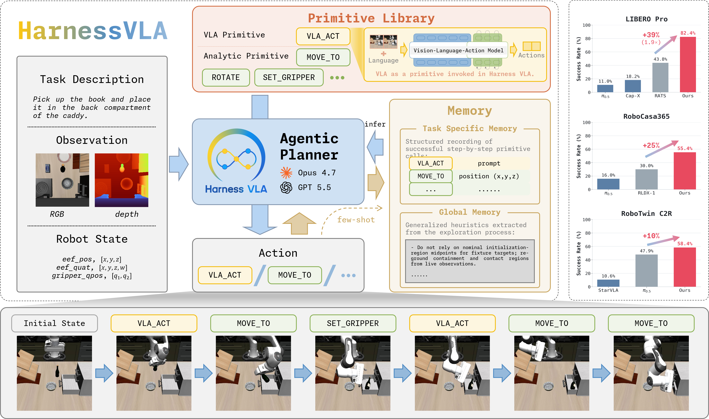

> 图源：*Harness VLA: Steering Frozen VLAs into Reliable Manipulation Primitives via Memory-Guided Agents*，Figure 1，2026。

这张图可以按“输入—规划—执行—记忆”阅读：左侧是任务、RGB-D Observation 和机器人状态；中间的 Agentic Planner 从固定 Primitive Library 中选择 `vla_act` 或解析式 Primitive；右侧两类 Memory 分别保存任务级成功序列和跨任务规则；底部 Rollout 展示两类 Primitive 怎样交替完成长程任务。右侧柱状图来自论文的仿真 benchmark，用于比较系统表现，不代表真机安全性。

每次 Primitive 执行都会返回新的 Observation，Planner 据此判断进展和失败类型，再选择继续、重新定位、重试或停止。

Harness VLA 的主要实验在仿真 benchmark 中完成，因此它支持的是“结构化接口、Memory 和重试能够改善编排”的系统结论，不能单独证明真机安全。速度、力、碰撞和急停仍需由真实机器人控制器与硬件处理。

### 19.5.2 路线二：Agent 能力逐渐进入 VLA

π0.7 仍然是一种 VLA，但它的运行系统已经不再只接收“拿起杯子”这样的一句指令。模型使用 MEM 风格的视觉历史编码器，还可以接收语义子任务、执行策略和质量等 Episode Metadata，以及描述近期目标状态的 Subgoal Image（子目标图像）。

```text
高层语义策略：生成当前子任务
轻量 World Model：生成希望接下来看到的子目标图像
π0.7：结合历史、子任务和子目标图像输出动作
```

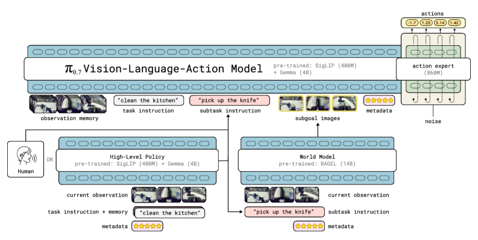

> 图源：*π₀.₇: a Steerable Generalist Robotic Foundation Model with Emergent Capabilities*，Figure 2，2026。

图的上半部分是 π0.7 主模型：Observation Memory、任务指令、语义子任务、Metadata 和 Subgoal Images 共同进入 VLA，再由 Action Expert 输出动作。下半部分说明两类 Context 可以从哪里产生：High-Level Policy 根据当前 Observation、总任务和历史子任务生成新的语义子任务，World Model 根据当前 Observation 与子任务生成 Subgoal Images；新任务中也可以由人逐步提供语义子任务。

子目标图像可以弥补语言描述的不足。“打开冰箱”没有说明手应该怎样接近把手，一张期望的近未来画面则能同时表达物体、手臂和夹爪的目标状态。

π0.7 还利用不同质量的机器人轨迹、失败 Episode、自主执行数据、人类视频和互联网数据。这里的“利用失败”发生在训练阶段：Metadata 标明 Episode 的速度、质量和错误，帮助模型区分不同策略；它不表示 Runtime 会自动复盘每一次失败。

π0.7 展示了多阶段厨房任务、Memory 任务、复杂语言指令和跨本体迁移等能力。对于完全未见过的复杂长程任务，研究者仍需要用语言逐步 coaching，再利用这些过程训练高层语义策略。它已经可以重新组合学过的局部行为，但还不能被理解为对任意开放目标都能稳定自主完成。

这个边界也反映在论文汇总的结果中：已见任务成功率往往超过 90%，未见任务或未见任务—机器人组合通常为 60%–80%。因此，“能够零样本组合已有能力”不等于“面对任意新任务都能可靠自主执行”。

因此，更准确的说法是：

> π0.7 展示了 VLA 怎样吸收历史、语义子任务、World Model 子目标和带标签的失败经验，但它仍不等于包含权限、Tool 注册、独立 Evaluator 和安全 Harness 的完整 Embodied Agent。

### 19.5.3 产业观察：COSA 怎样连接认知与身体

逐际动力将 COSA 展开为 **Cognitive OS of Agents**。在公开的系统图中，认知、VLA 和全身运动被组织成三个相互反馈的层次：

```text
系统 2：具身智能体 OS——人机交互、Memory、World Model、思考与推理
        指挥调度向下 / 数据反馈向上
系统 1：人形机器人 VLA——把调度指令变成与环境相关的机器人能力
        运动生成向下 / 数据反馈向上
系统 0：全身运动控制——稳定、精确地生成身体运动
```

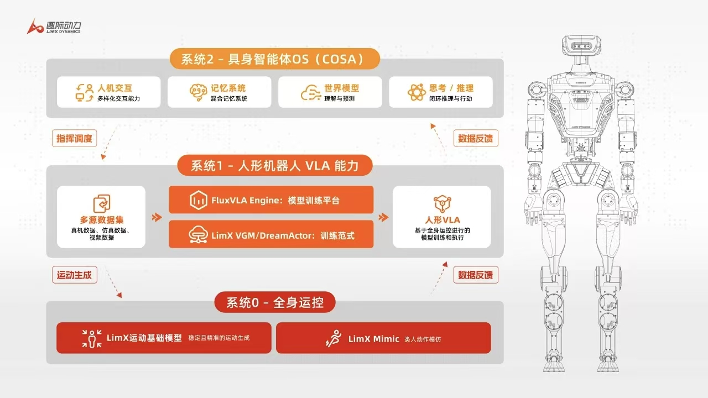

> 图源：逐际动力 COSA 公开资料。以下内容来自企业公开演示和负责人访谈，主要用于观察产业系统的架构选择，不等同于独立实验评测。

公开演示中的 Oli 可以接收长程任务，并在中途收到新任务后调整优先级；系统还展示了对人物、物体和交互历史的语义记忆，以及通过主动观察补充信息的能力。

COSA 最值得观察的不是某一个模型指标，而是认知、Skill/VLA 和全身控制的连续关系：高层改变任务，身体执行结果再沿反馈通道返回高层。机器人运动不是 Agent 最后的一个普通 API，而是认知系统必须持续考虑的身体基础。

### 19.5.4 扩展阅读：三个开源 Embodied Agent Runtime

论文回答“某个设计是否有效”，开源项目则帮助我们继续追问“这些组件怎样落到代码里”。下面三个项目关注的系统尺度不同：

| 项目 | 适合观察什么 | 建议阅读路径 |
|---|---|---|
| **Xbotics Hey Robot** | 快慢系统、任务连续性、Skill 合同、Robot Runtime 与 ModelService 边界 | 从系统架构追踪一次任务怎样经过 Agent、Skill 和 Robot Runtime |
| **PhyAgentOS** | Session-Centered Runtime、Target Adapter、执行前检查、Verifier 与失败恢复 | 沿 `SessionRunner → SkillRuntime → TargetSessionHandle` 阅读 |
| **Dimos** | Module、Blueprint、类型化数据流、MCP、Spatial Memory 与多机器人适配 | 从一个 Replay 或 Simulation Blueprint 追踪到 Agent Skill |

Hey Robot 是课程社区维护的参考实现，适合观察本章架构怎样映射到可运行代码，但不能替代论文实验或第三方系统评测。PhyAgentOS 展示怎样显式管理一次任务 Session、仿真/真机 Target 和执行验证。Dimos 展示同类思想怎样扩展到更多传感器、机器人本体和部署方式。

阅读这些项目时，不必比较功能数量，可以始终追踪五个问题：

```text
目标和任务状态由谁保存？
Agent 能看到哪些 Skill？
一次物理执行由谁拥有？
结果怎样变成新的 Observation 和 Evidence？
失败、超时或急停以后由谁决定下一步？
```

### 19.5.5 把两条路线放回系统图

外部 Agent/Harness 与 Agentic VLA 不是非此即彼。一个系统可以使用更强的 VLA，同时继续保留外部任务状态、Evaluator 和安全边界：

```text
开放目标
→ 外部 Agent / Harness
→ 语言、代码或结构化 Primitive
→ Skill / VLA
→ Robot Runtime 与环境
→ Observation、Evidence 与状态更新

同时，历史、子任务和 World Model 子目标正在进入 VLA 的 Context。
```

模型内部可以吸收更多历史和规划能力，但权限、评测和确定性安全规则仍需要清晰的系统所有者。一条完整的 Embodied Agent 执行链最终都要回答：目标怎样拆解、状态保存在哪里、能力怎样执行、结果由谁检查，以及危险动作由谁阻止。

## 19.6 有硬件版 Demo

**Demo 名称**：Embodied Agent 长程取放任务

**硬件平台**：xLeRobot / SO101 / Unitree G1，根据课程现场硬件选择其一。

**任务描述**：输入一句自然语言任务，让高层 Agent 生成 Skill 计划，并通过真机完成导航、识别、抓取、放置和状态检查。

**流程**：

```text
输入任务 → 生成计划 → 调用 navigate_to → detect_object → grasp → place → check_success → 记录失败与重规划
```

真机实验不追求一次完成复杂家务，而是验证三个关键闭环：

1. 高层计划能否转成真实存在的 Skill。
2. Skill 执行结果能否结构化返回给 Agent。
3. 安全层能否在越界、碰撞风险或多次失败时停止任务。

建议先把速度和工作空间限制在保守范围内，并为每个运动 Skill 设置超时。第一次实验可以只做桌面范围内的“检测 → 抓取 → 放置”，导航部分用人工移动或仿真替代。

## 19.7 无硬件仿真版 Demo

**Demo 名称**：ROS2 mock + 仿真 Skill 调度

**可选平台**：ROS2 mock / ManiSkill / RoboCasa / MuJoCo。

**流程**：

```text
加载模拟场景 → 注册 Skill → Agent 生成计划 → 仿真执行 → 输出计划日志和状态变化
```

**与有硬件版的对应关系**：仿真版保留同一套 Skill 接口和日志格式，只替换底层执行器，便于后续迁移到真机。

本仓库提供两个不需要大模型 API、也不需要机器人硬件的最小示例。先运行架构实验，观察 TaskContract、Gateway、Evidence 和 Evaluator：

```bash
cd code/lecture17
python simulation/task_contract_demo.py
```

再运行 Agent Loop 示例。它把计划写成 Skill 列表，第一次抓取故意失败，然后让 Agent 插入恢复步骤：

```bash
python simulation/agent_skills.py
```

你会看到类似日志：

```text
think: call grasp("water bottle")
act: grasp
observe: fail - first grasp attempt missed water bottle
update: add retry_grasp before continuing

think: call retry_grasp("water bottle")
observe: ok - water bottle secured after adjusted grasp
```

两个 Demo 合起来包含目标合同、Skill 请求、安全验证、计划、观察、Evidence、状态更新和失败恢复。把规则决策替换为 LLM，把 mock Skill 替换为 ROS2、ManiSkill 或真机接口，分层边界仍然可以保持不变。

## 19.8 实验步骤

1. 运行 `python simulation/task_contract_demo.py`，比较四个场景的输出。
2. 删除 `place` 返回的 Evidence，解释 Skill 成功后任务为什么仍未完成。
3. 修改机器人电量、急停和碰撞状态，记录 Gateway 的拒绝原因。
4. 修改 `max_deliberations`，观察搜索任务在什么时候停止。
5. 按照四层架构，把“拿一瓶水放到茶几上”拆成 5–8 个 Skill。
6. 为其中一个 Skill 写清输入、前提、成功条件、失败模式和 Evidence 输出。
7. 运行 `python simulation/agent_skills.py`，解释第一次抓取失败后计划怎样更新。
8. 有硬件条件时，将同一套 Skill 接口接入真机，但保留独立安全检查和人工急停。

## 19.9 作业交付

1. 一份 Embodied Agent 高层流程图。
2. 一段仿真或真机演示视频。
3. 一份计划日志，包含每一步的 `think / act / observe`。
4. 一个失败复盘案例，说明失败现象、可能原因和下一轮修正方案。
5. 一张 Harness 检查表，标出任务状态、Evaluator、权限和安全边界分别由谁负责。

## 19.10 常见失败与复盘

### 常见失败

- **计划不可执行**：Agent 生成了不存在的 Skill 或参数不合法，需要 JSON Schema 校验。
- **感知误判**：VLM 识别到目标但定位不准，需要结合深度、位姿估计或二次确认。
- **抓取失败**：夹爪闭合但未抓住物体，需要增加 `check_grasp` 和重试策略。
- **路径阻挡**：导航 Skill 返回失败，需要 Agent 选择绕行、清障或请求人工介入。
- **错误地宣布成功**：函数正常返回不等于物理任务成功，需要独立 Evaluator 提供视觉、位姿或传感器证据。
- **上下文越来越长**：Agent 把所有历史日志都塞进 prompt，导致目标信息被淹没，需要把完整轨迹保存到外部，只取回当前步骤需要的内容。
- **重复失败仍不停机**：恢复流程没有重试上限，需要在 Harness 中设置次数、超时和人工接管条件。
- **安全边界触发**：超过工作空间、力限制或急停条件时，必须停止执行并记录原因。

### 复盘问题

- 这次失败发生在规划层、Skill 层、执行层还是感知层？
- Agent 是否拿到了足够清晰的错误信息？
- Evaluator 依据什么证据判断成功？它有没有可能误判？
- 这次改进应该修改模型、Skill，还是 Harness 工作流？
- 哪些规则应固化为安全边界，而不是交给模型判断？

## 本讲小结：六个核心结论

1. **Chatbot 负责回答，Agent 负责围绕目标持续行动。**
2. **Planning、Memory 和 Tool Use 描述 Agent 的能力，Harness 负责把这些能力组织、检查并约束起来。**
3. **Embodied Agent 沿用了数字 Agent 的循环，但工具另一端变成了传感器、电机和真实物理世界。**
4. **Embodied Agent 的关键不是让 LLM 直接输出电机指令，而是让高层规划、Skill、执行器、Evaluator 和安全层各司其职。**
5. **失败 Episode 是改进资产。很多可靠性问题可以先通过增加检查、调整工作流和完善恢复策略解决。**
6. **外部 Agent 与 Agentic VLA 正在汇合，但权限、评测和安全 Harness 仍应独立存在。**

## 19.11 参考资料

本讲涉及的论文、博客、开源项目和产业系统链接，统一维护在 [Lecture 17 — Embodied Agent](../../references/links.md#lecture-17)。

## 关联代码

- [`code/lecture19/`](../../code/lecture19/)
