# 第 20 讲：世界模型

> **实验代码**：[Fast-WAM 官方仓库](https://github.com/yuantianyuan01/FastWAM)
> **参考资料**：[`references/links.md`](../../references/links.md#lecture-20)

> **边栏：AI 辅助深度提问**
>
> 学习世界模型时，AI 最适合用来帮你“拆问题”和“对照源码”，而不是替你背论文名。建议把下面的问题当作本讲的学习伴侣：先自己阅读正文和 repo，再把具体段落、配置文件或报错信息贴给 AI，让它帮助你解释、比较和排查。
>
> 1. **概念辨析**
>    “请用机器人抓取任务解释 VLA、动作条件世界模型、WAM、学习型仿真器和机器人视频世界建模的区别。不要只给定义，请说明它们分别回答什么问题，输入输出是什么。”
>
> 2. **公式理解**
>    “下面这个表达式 $p(o_{t+1:t+H},a_{t:t+K}\mid o_{\leq t},l)$ 如何同时覆盖未来预测和动作生成？请分别解释 policy、task-conditioned world model 和 action-conditioned world model 可以怎样从它理解。”
>
> 3. **编码器与表示**
>    “请比较 DINO 类表征型视觉编码器、VAE latent、JEPA 式 future representation 在世界模型中的作用。重点回答：哪一类更适合重建画面，哪一类更适合策略控制，哪些信息可能被丢掉？”
>
> 4. **论文路线归类**
>    “我给你一篇具身世界模型论文摘要，请按 World Model for Policy、World Model as Simulator、Robotic Video Generation 三个视角分析它。请回答：它预测什么、如何连接动作、训练和推理是否一致、最终服务什么任务。”
>
> 5. **Fast-WAM 源码阅读**
>    “请根据 `src/fastwam/models/wan22/fastwam.py` 中的 `training_loss` 和 `infer_action`，解释 Fast-WAM 为什么训练时有 video co-training，但推理时可以不显式生成未来视频。请标出 attention mask 和 KV cache 在这个过程中的作用。”
>
> 6. **三路线对照**
>    “请对照 `fastwam.py`、`fastwam_joint.py`、`fastwam_idm.py`，解释 Fast-WAM、Joint、IDM 三条路线的推理路径差异。请重点比较它们是否生成未来视频、动作 token 能看到哪些 video token、潜在延迟差异来自哪里。”
>
> 7. **实验配置检查**
>    “我准备用下面这条命令评测 Fast-WAM，请检查 checkpoint、dataset stats、task config、num_trials、num_inference_steps、visualize_future_video 这些参数是否合理，并指出哪些参数会影响速度、显存和成功率。”
>
> 8. **失败复盘**
>    “这是我的 rollout 视频现象：机械臂接近目标但夹爪闭合过早 / 动作幅度异常 / 物体被推走。请帮我按环境、checkpoint 与 stats、输入图像、多相机拼接、动作反归一化、replan 频率、模型能力这几类逐项排查。”
>
> 使用 AI 时要保留一个习惯：凡是涉及 repo 的结论，都要回到对应文件验证。AI 可以帮你定位 `training_loss`、`infer_action`、`eval_libero_single.py`、`FastWAMProcessor` 等关键位置，但最终判断必须以代码和实验输出为准。

## 20.1 为什么需要世界模型

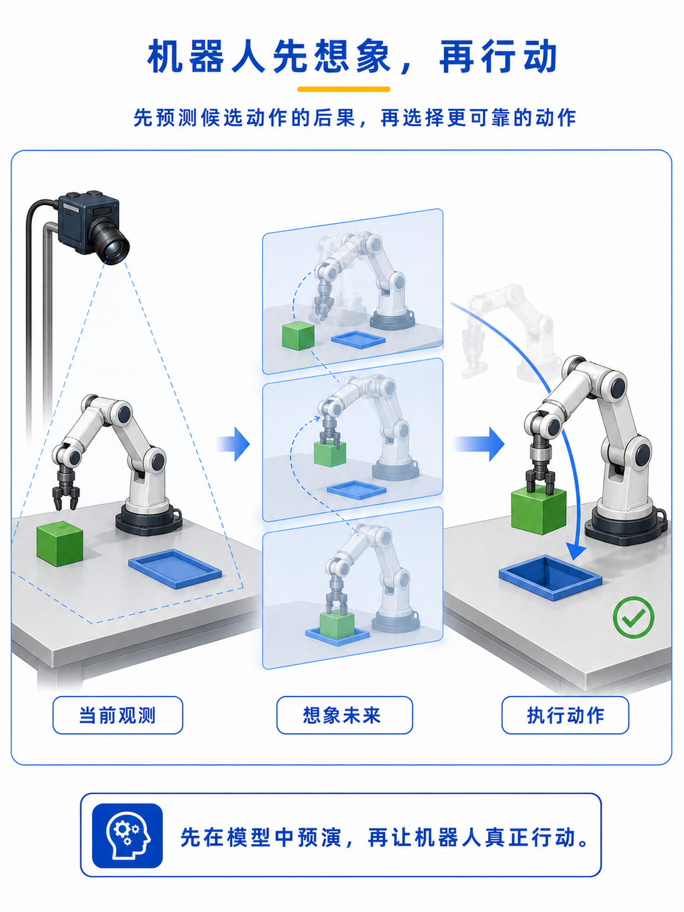{width=68%}

*图 20-1 机器人先想象，再行动：从当前观测形成未来想象，再把预测转化为真实动作。*

### 从一次抓取失败说起

假设机器人接到一条指令：“拿起桌上的杯子。”相机已经看到了杯子，VLA 根据图像、语言指令和机器人自身状态，输出一段机械臂动作。夹爪开始向杯子靠近，看起来一切正常，但真正执行时，结果可能完全不同：

- 夹爪对准杯身并及时闭合，杯子被稳定抓起；
- 夹爪位置偏低，先碰到杯壁，把杯子推离了原位；
- 杯子与桌面的摩擦较小，在夹爪闭合前发生滑动；
- 杯子暂时被抓住，却在抬升过程中因为受力不均而掉落。

这些结果可能来自非常相似的初始画面。仅仅识别出“这里有一个杯子”还不够，机器人还需要判断：夹爪继续向前移动会不会发生碰撞？现在闭合能否形成稳定接触？抬升之后杯子会留在夹爪中，还是会滑落？

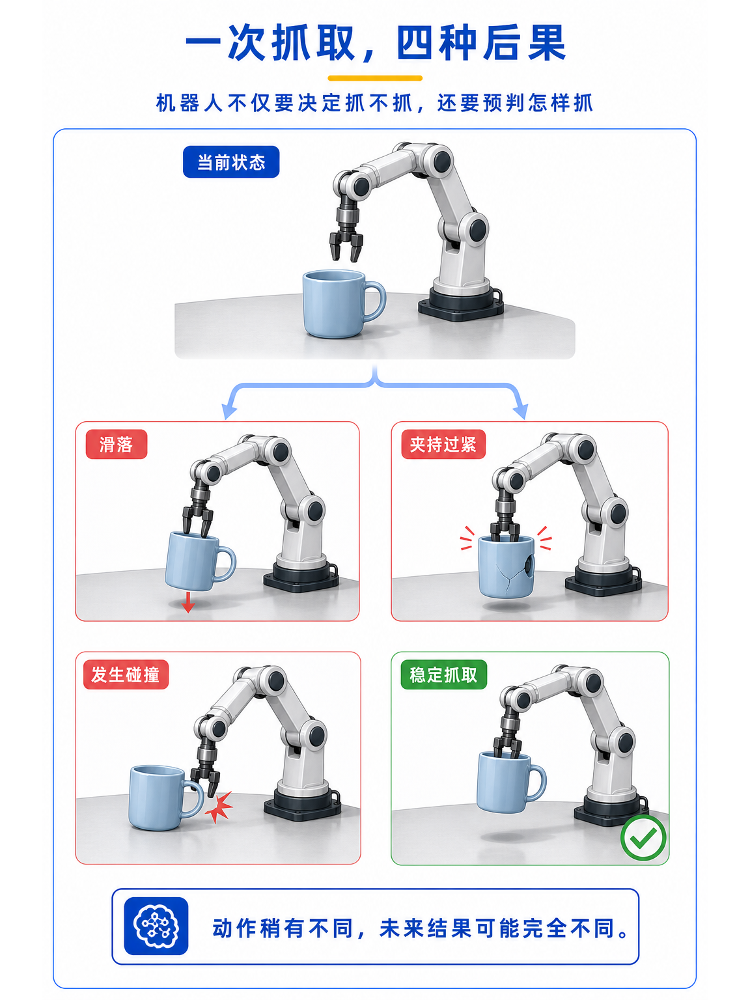{width=68%}

*图 20-2 同一动作目标可能对应成功抓取、碰撞推移、滑落等不同执行后果。*

这正是世界模型试图补上的能力：在动作真正执行之前，预测动作可能怎样改变机器人与环境的状态。

### 从动作输出到后果预测

前面介绍的 VLA，核心任务是根据观测和语言指令生成动作。用一个简化表达式表示：

$$
a_{t:t+K} \sim \pi_\theta(\cdot \mid o_{\leq t}, l),
$$

其中，$o_{\leq t}$ 表示当前及历史观测，$l$ 表示语言指令，$a_{t:t+K}$ 表示接下来要执行的一段动作。这个模型主要回答：**机器人接下来应该做什么？**

世界模型关注的是另一个条件分布：

$$
p_\phi(x_{t+1:t+H} \mid x_t, a_{t:t+H-1}, l).
$$

它表示：给定当前世界状态 $x_t$、未来一段候选动作 $a_{t:t+H-1}$ 和任务条件 $l$，预测接下来 $H$ 步世界可能怎样演化。这里的“世界状态”不一定是完整、精确的物理状态，也可以是相机图像、模型内部的潜在状态、物体位姿与接触关系，或者面向任务规划的抽象状态。不同表示方式将在 20.3 节进一步说明。

从这个表达式可以看出，世界模型最重要的输入之一是**动作**。同一个杯子处在同一个位置时，“夹爪向左移动”和“夹爪向右移动”应当对应不同的未来；“闭合夹爪”和“继续张开”也应当带来不同的接触结果。世界模型需要学习的不是场景会自然变成什么样，而是**场景在机器人动作影响下会怎样变化**。

> 需要注意，VLA 和世界模型并不是“一个只会反应、一个才会思考”的简单对立。现代 VLA 可以利用历史观测，也可能在参数中隐式学到部分动态规律。更准确的区别是：世界模型把未来状态或动作后果作为明确的建模对象，使这些预测可以被训练、检查，并进一步用于规划、学习或评估。

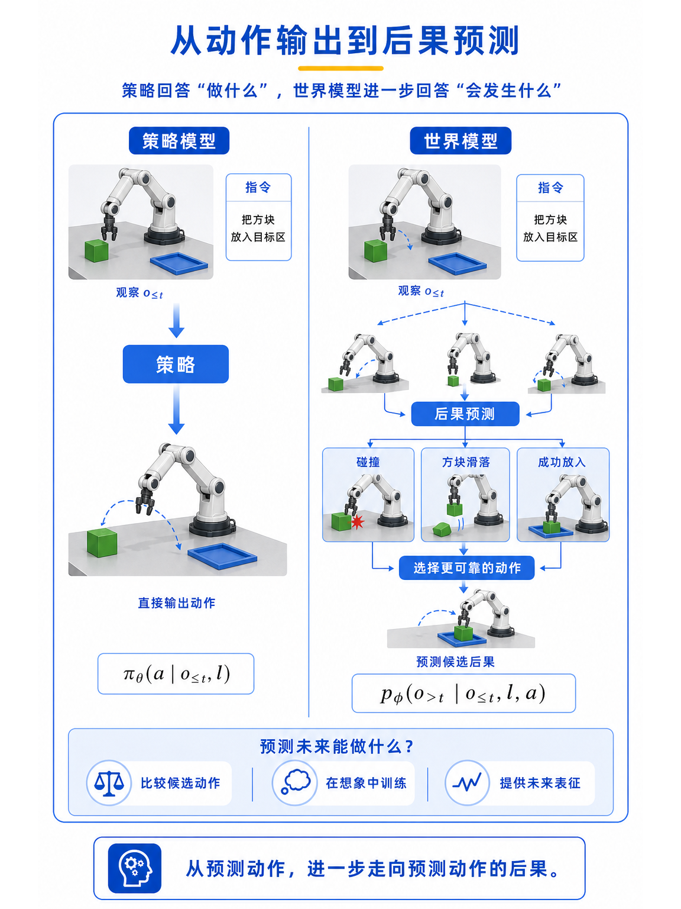{width=68%}

*图 20-3 策略回答“接下来做什么”，动作条件世界模型进一步回答“这样做会发生什么”。*

### 什么是世界模型

在本讲中，我们把具身世界模型理解为：

> 世界模型是机器人从观测、动作和交互数据中学习到的预测模型，用来描述环境在机器人动作作用下如何演化，并为后续决策提供依据。

这个定义包含三个要点。

第一，世界模型学习的是**变化规律**。它不仅要表示“杯子现在在哪里”，还要预测夹爪接触杯子之后，杯子的位置、姿态、速度或接触状态将怎样变化。

第二，世界模型预测的对象并不固定。它可以预测下一帧图像，也可以预测模型内部的 latent state、任务是否成功、未来 reward、轨迹是否终止，或者某个动作发生碰撞和失败的风险。因此，世界模型不等于视频生成模型，也不要求每次预测都解码成肉眼可见的视频。

第三，世界模型必须能够**服务行动**。一段未来视频即使看起来很真实，如果它与输入动作无关，或者无法帮助机器人选择动作、训练策略和判断风险，那么它对具身控制的价值仍然有限。

### 预测怎样帮助行动

世界模型与机器人决策大致有三种连接方式。

1. **行动前比较后果**
   策略先提出多个候选动作，世界模型分别预测它们的结果，再根据成功概率、碰撞风险或任务进度选择更合适的动作。例如，在抓杯子之前比较“从正面接近”和“从侧面接近”哪一种更可能形成稳定抓取。

2. **在想象中训练策略**
   世界模型可以生成 imagined rollout，让策略在学习到的环境中尝试动作、获得 reward 或终止反馈，从而减少昂贵且存在风险的真机试错。此时，世界模型相当于一个由数据学习得到的内部仿真器。

3. **把动态知识融入策略**
   世界预测与动作生成也可以在同一模型中联合训练。模型在训练阶段学习“动作怎样改变世界”，在推理阶段既可以显式预测未来，也可以把学到的动态表征直接用于动作输出。后面介绍的部分世界动作模型就属于这一路线。

这三种方式不要求世界模型都生成完整视频。对机器人来说，预测的价值最终取决于它能否提供与动作相关、对任务有用的未来信息。

### 小结

VLA 主要学习从观测和指令到动作的映射，世界模型则进一步建模动作条件下的未来演化。它预测的可以是图像、潜在状态、结构化状态、reward、终止信号或风险，但核心问题始终相同：

> 如果机器人这样做，接下来最可能发生什么？

一个合格的具身世界模型，不只是给出视觉上合理的未来，还要保持动作一致性和基本的物理合理性，并能够帮助机器人规划、学习或评估动作。下一节将在此基础上区分面向策略学习的世界模型、作为仿真器的世界模型和机器人视频世界建模这三种主要观察视角。

---

## 20.2 世界模型的三种视角

上一节介绍了世界模型的基本作用：根据当前状态和候选动作预测未来。但在具身智能论文中，我们还会遇到一些看起来相近的说法，例如“面向策略学习的世界模型”“世界模型作为仿真器”“机器人视频世界建模”和“世界动作模型”。如果不先区分这些说法关注的问题，很容易把所有生成未来画面的模型都称为世界模型，或者反过来把世界模型全部理解成 WAM。

本讲采用 *World Model for Robot Learning: A Comprehensive Survey* 的组织方式，从三个相互交叉的视角建立技术地图。

| 观察视角 | 核心问题 | 主要分类依据 |
|---|---|---|
| World Model for Policy（面向策略学习的世界模型） | 世界预测怎样帮助策略生成动作？ | 世界模型与策略的架构耦合方式 |
| World Model as Simulator | 世界模型怎样代替或补充真实环境？ | 用于策略训练、评估还是规划 |
| World Model for Robotic Video Generation（机器人视频世界建模） | 机器人交互的未来怎样在视觉空间中被预测？ | 想象、动作可控、结构感知与基础模型化能力 |

这三个视角使用的分类标准并不相同：第一类关注**模型架构**，第二类关注**应用方式**，第三类关注**世界建模能力**。因此，它们不是三个互斥的模型集合。同一个模型完全可能同时属于其中两类甚至三类。

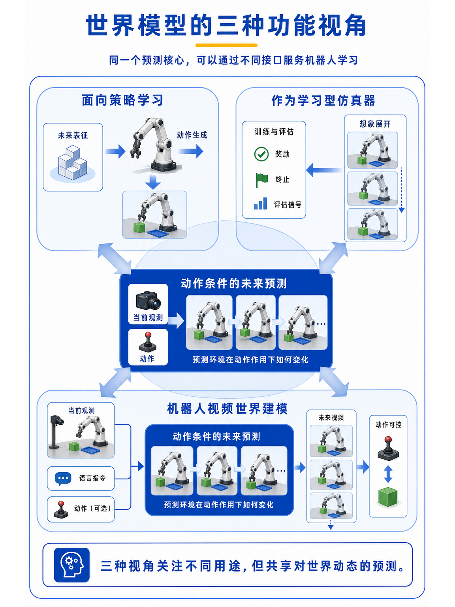{width=68%}

*图 20-4 面向策略学习、充当仿真器和机器人视频世界建模是三个相互交叉的观察视角。*

### 面向策略学习的世界模型

World Model for Policy 关注的是：世界模型怎样与动作生成模块连接，并最终改善机器人策略。

最直观的做法是“先预测，再行动”。世界模型先根据当前观测和任务目标生成一个可能的未来，策略再根据当前状态与预测结果恢复或选择动作。例如，机器人准备抓取杯子时，模型先预测“从侧面接近后，夹爪将对准杯身”，随后策略把这个未来状态转化为末端执行器轨迹。

预测模块和动作模块也可以结合得更紧。它们可以共享同一个生成骨干，也可以保留视觉、语言和动作等不同专家，通过共享注意力反复交换信息。还有一些方法不生成可见的未来画面，而是把动态规律压缩在 latent representation 中，直接用于动作生成。

因此，面向策略学习的世界模型不等于“机器人每执行一步都要先生成一段视频”。显式未来可以在推理时用于规划，也可以只在训练时提供预测监督。只要世界动态真正参与了策略学习或动作决策过程，它就属于这一观察视角。后面介绍的 WAM 主要位于这条主线上。

### 充当仿真器

World Model as Simulator 关注的是另一件事：能否让学习到的世界模型暂时站在环境的位置上，接收策略动作并返回未来状态与反馈。

在真实机器人上做强化学习，通常面临交互成本高、环境重置慢和失败可能损坏硬件等问题。如果世界模型能够根据当前观测和动作生成 imagined transition，并同时给出 reward、任务是否结束或是否发生碰撞等信号，策略就可以先在这个学习到的环境中进行 rollout 和更新。

学习型仿真器还可以用于评估。策略提出多个候选动作，世界模型分别预测它们的后果，再进行排序、拒绝或安全过滤。它也可以用来比较不同策略和 checkpoint：如果模型中的评估结果与真实成功率具有稳定相关性，就能减少大量真机测试。

不过，世界模型仿真器与传统物理仿真器并不是同一个概念。

| 对比项 | 传统物理仿真器 | 世界模型仿真器 |
|---|---|---|
| 动态来源 | 人工建立的物理方程、几何模型和接触参数 | 从观测与交互数据中学习 |
| 优势 | 变量可控、规则清晰、便于重复实验 | 能从真实数据吸收复杂视觉与交互规律 |
| 主要困难 | 建模成本高，材质、接触和传感器差异难以完全还原 | 可能产生模型偏差，长时间 rollout 容易漂移 |

两者并不需要相互替代。实践中可以用物理仿真器提供基本动力学和可控环境，再用学习模型补充视觉、接触或真实数据中的残差，也可以把几何重建、物理引擎和学习到的表示组合成数字孪生。关键不是模型是否“纯学习”，而是它能否提供足够可靠的交互反馈。

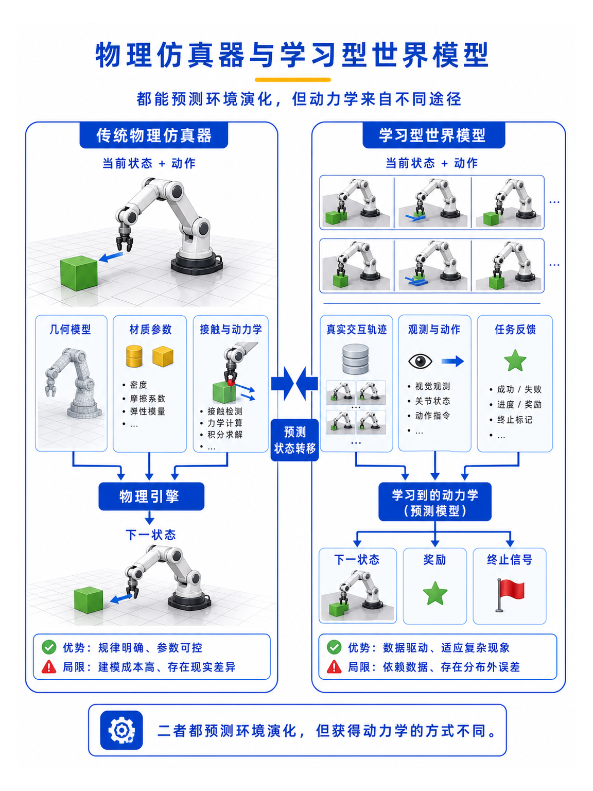{width=68%}

*图 20-5 传统物理仿真器依赖显式规则，学习型世界模型从交互数据中拟合环境响应。*

### 机器人视频世界建模

机器人视频世界建模（World Model for Robotic Video Generation）把未来直接表示成图像或视频。给定当前画面、语言任务以及可选的动作序列，模型预测机器人与环境接下来在视觉上怎样变化。

这种表示很直观。研究者可以直接检查夹爪是否接近目标、物体是否发生位移，以及多步预测从什么时候开始漂移。未来视频还可以作为视觉计划、合成训练数据、策略评估依据，或者成为学习型仿真器的视觉输出。

但是，普通视频生成模型只需要产生“看起来合理”的连续画面，机器人视频世界模型还需要满足更严格的条件：

1. **时间连贯**：机器人和物体的运动不能在相邻帧之间突然跳变。
2. **动作一致**：输入不同动作时，生成的未来必须作出对应变化。
3. **物理可信**：接触、遮挡、物体位姿和多视角关系不能明显违背物理规律。
4. **能够行动**：生成结果应当可以用于动作恢复、规划、评估或策略学习。

如果模型无论接收什么动作，都生成“夹爪成功拿起杯子”的画面，那么视频可能很流畅，却不能作为机器人世界模型使用。对具身智能来说，可控性和可执行性通常比单纯的视觉质量更重要。

### 三者如何重叠

可以继续用抓杯子的任务理解三者之间的关系。假设一个模型接收当前相机画面和候选机械臂动作，并生成未来两秒的视频：

- 从输出形式看，它是一个机器人视频世界模型；
- 如果策略根据这些视频选择更安全的抓取动作，它在服务策略；
- 如果策略能在模型中连续执行动作，并获得成功、碰撞或终止反馈，它又成为学习型仿真器。

模型本身没有因为用途变化而变成三个不同网络。变化的是我们观察它的角度。因此，阅读世界模型工作时，不应只问“它属于哪一类”，而应依次检查：

```text
它在什么空间中预测未来？
它怎样与策略连接？
它在训练和推理阶段分别被用来做什么？
```

这三个问题比记住模型名称更重要，也会成为 20.4 节分析代表工作的统一框架。

### VLA、AC-WM 与 WAM

最后再厘清三个容易混淆的概念。

| 概念 | 主要输入或训练信号 | 主要输出 | 首先回答的问题 |
|---|---|---|---|
| VLA | 当前及历史观测、语言指令、机器人状态 | 动作或动作序列 | 现在应该怎样行动？ |
| 动作条件世界模型（AC-WM） | 当前状态、给定的候选动作、可选任务条件 | 未来观测、状态或任务反馈 | 执行这个动作后会发生什么？ |
| 世界动作模型（WAM） | 当前观测、语言目标；训练阶段使用视频与动作序列 | 未来与动作的联合表示，或直接动作 | 怎样把世界动态和动作生成联合起来？ |

AC-WM 的动作通常已经给定，模型的任务是预测该动作的后果。WAM 则进一步把未来世界变化和动作生成放进同一个学习过程。它可以显式联合生成未来与动作，也可以在训练阶段学习视频动态，在推理阶段只保留快速动作输出。

因此，WAM 不是具身世界模型的总称，也不是所有世界模型的必然终点。它是 World Model for Policy 中一条发展迅速的技术路线，并与机器人视频世界模型存在明显交叉。世界模型还可以不直接输出动作，而是作为仿真器、评估器或规划模型发挥作用。

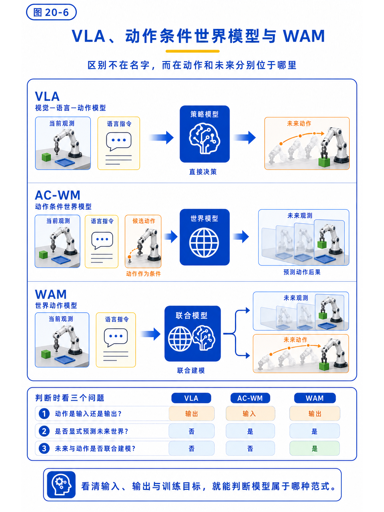{width=68%}

*图 20-6 三类模型中动作所处的位置不同：作为输出、作为条件，或与未来联合建模。*

### 小结

世界模型可以从三个角度理解：面向策略学习、充当学习型仿真器，以及开展机器人视频世界建模。这三种视角分别关注架构、用途和建模能力，彼此重叠但不能相互替代。

建立这张地图之后，后面遇到任何“世界模型”工作，都可以先判断它预测什么、怎样接入决策，以及实际服务哪一个机器人流程。下一节将进一步解释这些方法共同依赖的模型理论基础。

---

## 20.3 核心理论

前两节已经说明，具身世界模型既可以预测未来，也可以服务策略、仿真和评估。接下来需要把这些用途落到一条具体的模型计算链上：机器人怎样编码当前观测，怎样形成对未来的预测，又怎样把预测结果转换为动作。

VAE、JEPA、动作一致性等概念并不是彼此孤立的名词。放到具身世界模型里，它们可以沿一条完整的计算链理解：

```text
当前观测 / 语言指令 / 可选动作
-> 编码器
-> 世界预测骨干
-> 未来视频、未来特征或结构化运动
-> IDM、几何运动接口或动作分支
-> 可执行动作
```

这条链既能覆盖早期“先预测、再行动”的模块化方法，也能解释近期共享骨干、Mixture-of-Transformers（MoT）和 latent world modeling。不同方法会合并、替换或跳过其中某些模块，但它们处理的核心问题仍然相互对应。

### 20.3.1 主流架构

#### 从一个联合分布出发

对于面向策略学习的具身世界模型，一个常用的统一表述是：模型最终关心未来观测与未来动作的联合条件分布

$$
p(o_{t+1:t+H},a_{t:t+K}\mid o_{\leq t},l),
$$

其中，$o_{\leq t}$ 是当前及历史观测，$l$ 是语言指令或任务条件，$o_{t+1:t+H}$ 是未来观测，$a_{t:t+K}$ 是接下来要执行的动作序列。这个表达式不是在指定某一种网络，而是在说明：**世界预测和动作生成可以被看作同一个预测控制问题的两个部分。**

更严谨地说，策略模型、任务条件世界模型和动作条件世界模型，可以看成对这个理想化联合分布的不同边缘化、条件化或因子分解方式。它们不一定真的由同一个网络精确推导出来，但共享同一个问题核心：当前观测和任务条件给定后，未来状态与未来动作怎样相互约束。

$$
\begin{aligned}
\text{Policy:}\quad
&\pi_\psi(a_{t:t+K}\mid o_{\leq t},l)
\approx
\int p(o_{t+1:t+H},a_{t:t+K}\mid o_{\leq t},l)\,d o_{t+1:t+H},\\
\text{Task-Conditioned WM:}\quad
&p(o_{t+1:t+H}\mid o_{\leq t},l),\\
\text{Action-Conditioned WM:}\quad
&p(o_{t+1:t+H}\mid o_{\leq t},a_{t:t+H-1},l).
\end{aligned}
$$

其中，策略模型直接回答“下一段动作该怎么选”；任务条件世界模型回答“在当前观测和任务语境下，未来通常会怎样发展”；动作条件世界模型则回答“如果执行这段候选动作，环境后果会怎样”。第三种才真正把动作作为可干预的条件，因此更接近控制和规划中常说的 controllable world model。

在面向策略学习的视觉世界模型中，这条链经常表现为“编码器 + 世界预测骨干 + 动作接口”。其中，世界预测骨干可以采用视频生成骨干，也可以只预测 latent feature、轨迹或 3D flow，并不一定输出完整视频。动作接口可以是 Action Head、Action Expert 或 IDM；只有当模型需要产生机器人动作时，才需要这一环节。若世界模型主要充当仿真器，它通常把动作作为输入来预测后果，而不是再输出动作。

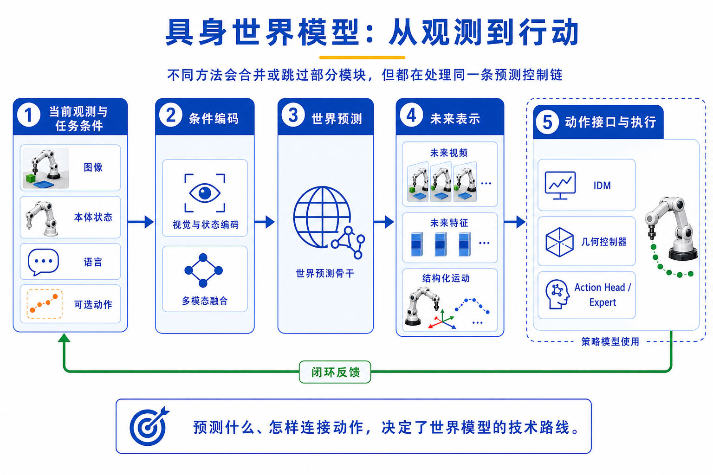{width=96%}

*图 20-7 具身世界模型从条件编码、未来预测、动作接口到真实观测回填的统一计算链。*

#### 三个共同环节

在这个范围内，多数方法都要处理三个环节。

1. **条件编码**：把当前图像、历史观测、本体状态和语言指令转换成模型可以使用的条件特征。
2. **世界预测**：根据条件特征预测任务相关的未来。预测结果可以是视频、latent feature，也可以是轨迹、对应关系或三维运动。
3. **动作接口**：把预测未来连接到机器人控制。它可以是独立 IDM、普通 Action Head、Action Expert，也可以直接包含在共享生成骨干中。

这里还要注意，“编码器”在不同论文里可能指两种功能。条件编码器负责处理当前图像、语言和本体状态；视频 VAE 一类编解码器则负责把像素视频压缩到生成骨干工作的 latent space，并在需要时解码回视频。两者可以同时存在，不能因为都叫 encoder 就把它们当成同一个模块。

这三个环节并不要求对应三个独立网络。它们描述的是功能，而不是固定的代码模块。不同策略耦合架构的主要区别，就在于“世界预测”和“动作生成”怎样连接。

| 架构 | 世界预测与动作的连接方式 | 代表工作 |
|---|---|---|
| Decoupled / staged | 世界预测与动作解码分成两个阶段；动作模块可以读取生成视频，也可以读取视频模型的中间特征 | UniPi、Vidar、VidMan、VPP |
| Single-backbone | 同一个生成骨干联合预测未来视觉与动作 | DreamZero、VideoVLA、Cosmos Policy |
| MoE / MoT | 视频专家与动作专家保留独立参数，通过共享注意力反复交互 | Motus、LingBot-VA、Fast-WAM |
| Unified VLA | 在统一 VLA 中加入未来图像、视觉预见或结构化世界目标 | GR-1、WorldVLA、DreamVLA |
| Latent world modeling | 不生成完整未来图像，直接预测未来特征并用于动作生成 | FLARE、VLA-JEPA、JEPA-VLA |

这些代表工作对应了不同的信息流向：有的先生成未来再恢复动作，有的把未来视觉与动作放入同一骨干，有的让视频专家和动作专家在中间层反复交互。理解这些连接方式，后面再比较具体路线时，就不会只是在记模型名称。

### 20.3.2 编码器与世界表示

世界预测不能直接从“物理世界本身”开始，只能从机器人得到的观测开始。设当前观测包含图像 $I_t$ 和本体状态 $p_t$，编码过程可以简写为

$$
e_t^{v}=E_{\mathrm{img}}(I_t),\qquad
e_t^{p}=E_{\mathrm{prop}}(p_t),\qquad
e^{\ell}=E_{\mathrm{text}}(\ell),\qquad
h_t=F(e_t^{v},e_t^{p},e^{\ell}),
$$

其中，$\ell$ 表示原始任务指令，$E_{\mathrm{text}}$ 表示文本分词与语言编码过程，$e^{\ell}$ 是得到的语言表示，$F$ 表示多模态信息的融合过程。若任务指令在整条轨迹中保持不变，$e^{\ell}$ 不需要时间下标；若语言条件随时间更新，则可以写成 $e_t^{\ell}$。常见视觉骨干已经能够把图像转换为特征；在世界模型中，更关键的问题是这些特征为未来预测保留了什么信息。

#### 三种世界表示

世界预测骨干最终可以在三种常见空间中工作。

| 表示空间 | 模型预测什么 | 适合观察什么 | 主要风险 |
|---|---|---|---|
| Pixel / video | 未来图像或视频帧 | 遮挡、形变、场景变化和整体运动 | 计算量大，容易把容量用于无关外观 |
| Latent | 编码器产生的未来特征 | 紧凑动态、长时预测和控制相关信息 | 难以直接判断是否遗漏接触与小位移 |
| Structured | 轨迹、对应关系、深度、位姿、3D flow 等 | 几何运动、接触对象和执行接口 | 依赖结构提取质量与任务先验 |

三者并不互斥。视频世界模型可以在压缩 latent 中完成主要计算，最后再解码成像素；也可以从预测视频中提取物体轨迹和三维运动，供后续动作恢复使用。

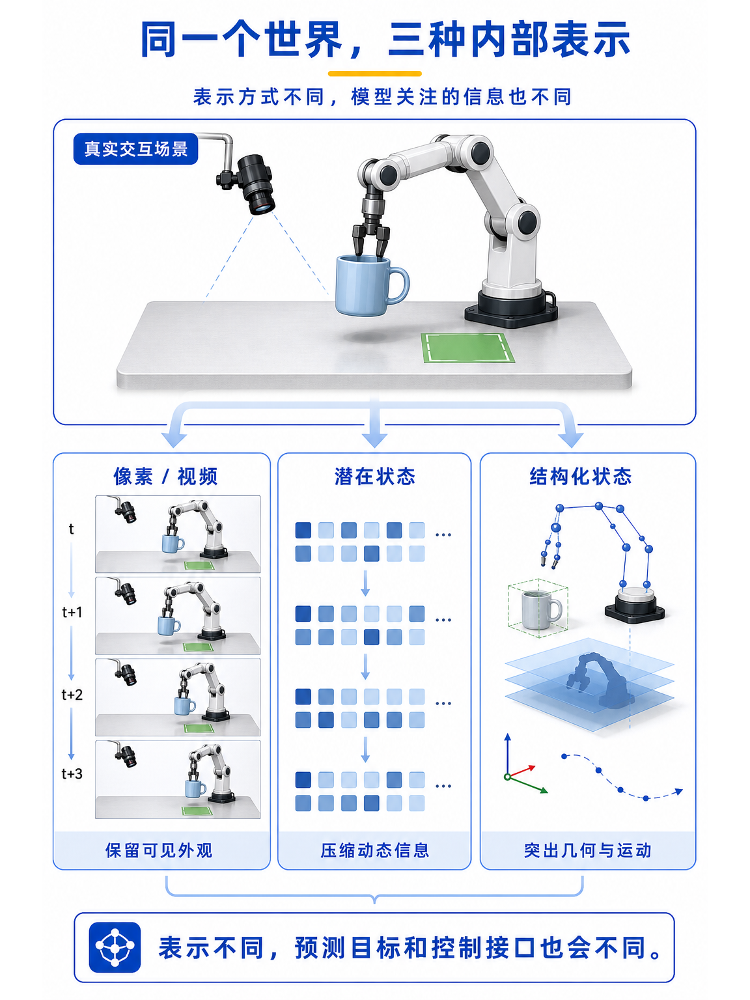{width=68%}

*图 20-8 同一机器人场景可以在像素视频、潜在状态和结构化状态中表示。*

#### 表征型视觉编码器与可重建生成式编码器

这里比较的不是“语义信息”和“视觉像素”两种输入。两类编码器通常都以 RGB 图像为输入，输出也都不是原始像素；区别主要在于表示学习的目标，以及该表示是否受到观测重建约束。DINO 一类编码器学习不以像素重建为目标的可迁移视觉特征，VAE 一类编码器则学习能够通过解码器重建观测的潜变量。

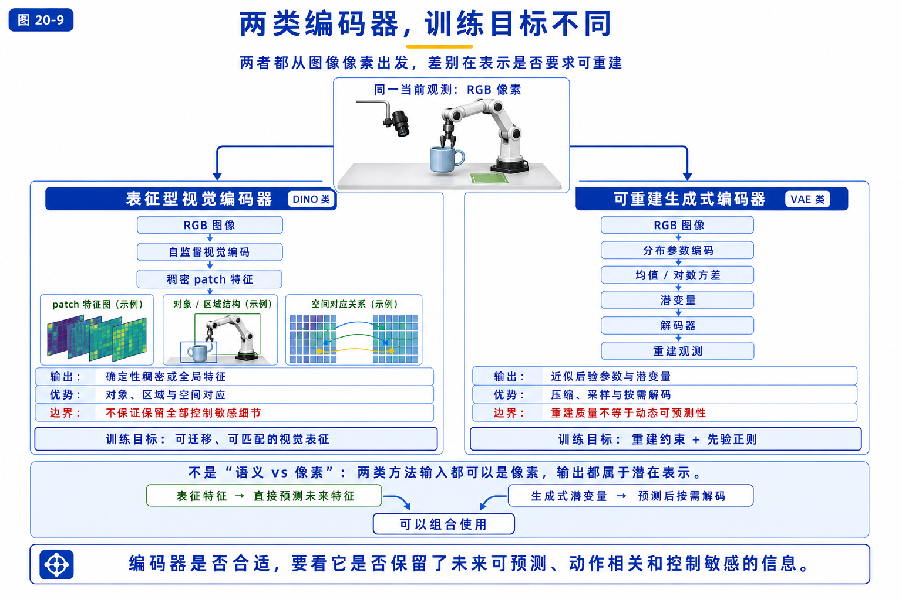{width=96%}

*图 20-9 DINO 类编码器与 VAE 类编码器的差异主要来自学习目标和输出约束，而不是“语义与像素”的简单二分。*

DINOv3 一类视觉基础模型通过大规模自监督学习获得具有迁移能力的稠密视觉特征。这些特征同时包含对象与区域信息、空间结构和稠密对应线索，可用于检测、分割、深度估计和跟踪等下游任务。把预训练编码器冻结或轻量微调，再在其特征上训练世界预测器，可以减少从头学习视觉表征的成本。

DINO-WM 将冻结的 DINOv2 空间 patch 特征作为观测表示，直接预测未来 patch 特征，而不要求世界模型重建像素。PointWorld 则把三维场景点投影到多个校准相机，在相应图像位置采样冻结的 DINOv3 多层 patch 特征，再将其与三维点的几何和原始属性融合，作为三维点流预测器的输入。DINOv3 在这里仍然是二维图像编码器，并不是直接编码原始三维点云。

这类编码器的预训练目标通常不要求从特征中完整重建输入，因此其表示不保证保留所有像素级信息。自监督训练会使特征对裁剪、颜色扰动以及同一对象的部分外观变化具有一定稳定性，但 DINO 类模型仍能保留丰富的对象结构和空间信息。对于插孔边缘、微小接触位移等控制敏感线索，是否得到充分保留，还取决于 patch 分辨率、所选网络层、特征融合方式以及下游训练目标，最终需要通过未来预测误差和机器人控制结果验证。

另一条常见路线使用可重建的生成式编码器，其中最典型的是变分自编码器（Variational Autoencoder，VAE）。理解 VAE 时，可以先把它和普通自编码器区分开。

普通自编码器把输入压缩成一个确定的瓶颈向量，再由解码器重建输入：

$$
z=E_\phi(o),\qquad
\hat{o}=D_\theta(z).
$$

这种结构适合学习压缩表示，但它只要求训练样本附近能被重建，并不保证整个潜空间连续、平滑、可采样。两个样本的编码中间位置未必对应任何合理观测；随机取一个 $z$，解码器也可能生成无意义结果。VAE 的关键改变，是把“编码成一个点”改成“编码成一个分布”。

从概率模型看，VAE 假设观测 $o$ 由潜变量 $z$ 生成：

$$
p_\theta(o,z)=p(z)p_\theta(o\mid z),
\qquad
p(z)=\mathcal{N}(0,I).
$$

理想情况下，可以根据观测反推出后验分布 $p_\theta(z\mid o)$。但后验中包含边缘似然

$$
p_\theta(o)=\int p_\theta(o\mid z)p(z)\,dz,
$$

这个积分在神经网络解码器下通常无法直接计算。因此，VAE 用一个可学习的近似后验 $q_\phi(z\mid o)$ 来替代真实后验。最常见的形式是对角高斯分布：

$$
q_\phi(z\mid o)
=\mathcal{N}\!\left(
z;\mu_\phi(o),
\operatorname{diag}(\sigma_\phi^2(o))
\right).
$$

编码器不再只输出一个向量，而是输出均值 $\mu_\phi(o)$ 和标准差 $\sigma_\phi(o)$。均值描述该观测在潜空间中的中心位置，标准差描述模型对各个潜变量维度的不确定性。训练时需要从这个分布中采样 $z$，但直接采样会阻断对编码器参数的梯度传播。VAE 因此使用重参数化技巧：

$$
\epsilon\sim\mathcal{N}(0,I),\qquad
z=\mu_\phi(o)+\sigma_\phi(o)\odot\epsilon.
$$

随机性被移到与参数无关的噪声 $\epsilon$ 上，$z$ 对均值和标准差仍然可微。解码器随后建模 $p_\theta(o\mid z)$，尝试从潜变量恢复原始观测。

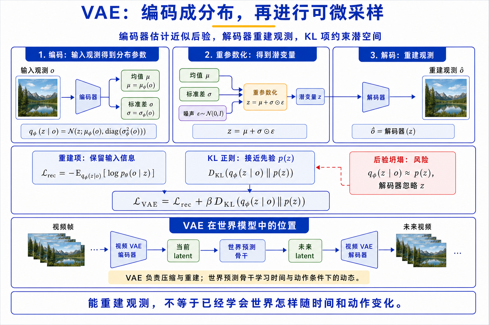{width=96%}

*图 20-10 VAE 通过近似后验、重参数化采样、重建项和 KL 正则学习可生成的潜在空间。*

VAE 的训练目标是最大化证据下界（Evidence Lower Bound，ELBO）：

$$
\log p_\theta(o)
\geq
\mathcal{L}_{\mathrm{ELBO}}(o)
=
\mathbb{E}_{q_\phi(z\mid o)}
[\log p_\theta(o\mid z)]
-D_{\mathrm{KL}}
\!\left(q_\phi(z\mid o)\,\|\,p(z)\right).
$$

第一项是重建项，要求 $z$ 保留足够信息，使解码器能够恢复观测。根据输出分布假设不同，它可以对应均方误差、交叉熵或其他重建损失。第二项是 KL 散度项，约束每个输入对应的近似后验不要离先验 $p(z)$ 太远。这个约束使潜空间更连续、更容易采样，也减少编码器把每个训练样本塞进彼此孤立位置的风险。

当 $q_\phi(z\mid o)$ 是对角高斯、$p(z)=\mathcal{N}(0,I)$ 时，KL 项有闭式形式：

$$
D_{\mathrm{KL}}
\!\left(q_\phi(z\mid o)\,\|\,p(z)\right)
=
\frac{1}{2}
\sum_i
\left(
\mu_i^2+\sigma_i^2-\log\sigma_i^2-1
\right).
$$

这个式子可以直观看出：KL 项会把均值拉向 $0$，把方差拉向 $1$。如果只有重建项，模型可能学到零散、不可采样的编码；如果 KL 项过强，编码器又可能忽略输入，把很多样本压到近似相同的分布中。训练时常写成最小化形式：

$$
\mathcal{L}_{\mathrm{VAE}}
=\mathcal{L}_{\mathrm{rec}}
+\beta D_{\mathrm{KL}}
\!\left(q_\phi(z\mid o)\,\|\,p(z)\right).
$$

$\beta$ 太小，潜空间可能变得零散，未来预测器难以在其中学习平滑变化；$\beta$ 太大，则可能出现后验坍塌：$q_\phi(z\mid o)$ 逼近先验 $p(z)$，潜变量与输入之间的信息量显著下降，解码器几乎不再依赖 $z$。后验坍塌并不等于“所有样本被编码成同一个确定点”，而是近似后验对不同输入变得难以区分，并且模型忽略潜变量。VAE 的难点就在于平衡两件事：一方面要让 $z$ 足够有信息量，能重建观测；另一方面要让潜空间足够规则，便于采样、插值和后续预测。

放到具身世界模型中，还要再强调一层：**能重建图像不等于保留了控制需要的动态。**VAE 可能准确恢复桌面纹理，却没有准确编码夹爪与杯子是否接触；也可能生成视觉上平滑的未来，却丢掉对动作恢复很关键的小位移。因此，在许多基于视频生成骨干的具身世界模型中，VAE 更像一个可训练或预训练的“视频编解码器”：先把观测帧压缩成 latent，世界预测骨干在 latent space 中建模时间变化，最后只在需要可视化未来时解码回像素：

$$
z_t=E_{\mathrm{VAE}}(o_t),\qquad
\hat{z}_{t+1:t+H}=W_\theta(z_t,e^{\ell},a_{t:t+H-1}),\qquad
\hat{o}_{t+1:t+H}=D_{\mathrm{VAE}}(\hat{z}_{t+1:t+H}).
$$

对于只根据任务描述想象目标未来的方法，可以从式中删去动作条件。VAE 本身主要解决压缩、采样与重建问题；真正学习“世界怎样随时间和动作变化”的，是中间的世界预测骨干 $W_\theta$。把两者分开，才能避免把“会重建视频”误写成“已经学会世界动态”。

| 对比项 | DINO 一类表征型视觉编码器 | VAE 一类可重建生成式编码器 |
|---|---|---|
| 主要学习目标 | 获得可迁移、可匹配的视觉特征 | 压缩观测并从潜变量重建输入 |
| 常见输出 | 确定性的稠密 patch 特征或全局特征 | 近似后验参数及其潜变量样本 |
| 优势 | 视觉表征先验强，适合对象、区域、对应和空间任务 | 潜空间可采样、可解码，便于生成建模 |
| 主要风险 | 不保证保留所有像素级和控制敏感细节 | 重建质量不等于动态可预测性 |

两类编码器不是非此即彼。一个系统可以用视觉基础模型提供稠密空间特征，再使用可学习的压缩层或预测器建模这些特征怎样随动作变化。判断编码器是否合适，不能只看静态识别或重建质量，还要看它是否保留了未来可预测、动作相关和控制敏感的信息。

### 20.3.3 世界预测骨干

编码器回答“当前观测怎样表示”，世界预测骨干则回答“这些表示接下来怎样变化”。给定当前观测编码 $h_t$ 和语言表示 $e^{\ell}$，任务条件世界模型可以写成

$$
\hat{x}_{t+1:t+H}=W_\theta(h_t,e^{\ell}),
$$

动作条件世界模型则进一步接收候选动作序列：

$$
\hat{x}_{t+1:t+H}
=W_\theta(h_t,e^{\ell},a_{t:t+H-1}).
$$

这里的 $W_\theta$ 就是世界预测骨干。$\hat{x}$ 可以表示未来视频、未来 latent feature，也可以表示结构化运动。视频生成模型是当前常见的世界预测骨干；对具身世界模型来说，更关键的问题是它预测的未来是否能服务规划、动作恢复和控制，而不是具体采用哪一种通用视频生成算法。

#### 显式预测未来视频

当 $\hat{x}$ 是未来观测时，模型直接学习

$$
p_\theta(o_{t+1:t+H}\mid o_t,l)
$$

或动作条件形式

$$
p_\theta(o_{t+1:t+H}\mid o_t,a_{t:t+H-1},l).
$$

显式视频的优势是可检查：研究者可以直接观察夹爪是否接近目标、杯子是否移动以及预测从哪一步开始漂移。它也能作为 IDM 的输入或策略的视觉计划。UniPi、Vidar 等方法在动作生成前显式产生未来视频；DreamZero、VideoVLA 等共享骨干方法则把视频与动作放进同一个生成过程。VidMan 主要利用视频扩散骨干的内部动态特征预测动作，不宜简单归入“部署时先生成完整视频”的一类。

不过，未来视频“看起来合理”并不等于它包含足够准确的控制信息。反光、背景和纹理可能很逼真，夹爪接触位置却偏了几毫米。对世界模型而言，视频质量只是中间指标，动作可恢复性和执行成功率才是最终检验。

#### 从 VAE 过渡到 JEPA 式预测

VAE 解决的是“怎样把当前观测压缩到可解码的潜空间”，其核心监督仍然是重建同一个观测。世界预测还需要把时间方向加入目标：根据当前上下文预测未来表征。

设目标编码器把未来观测编码为

$$
y_{t+H}=E_{\xi}(o_{t+H}),
$$

上下文编码器和预测器根据当前观测、任务条件以及可选动作预测该目标：

$$
c_t=E_\theta(o_{\leq t}),\qquad
\hat{y}_{t+H}=P_\psi(c_t,e^{\ell},a_{t:t+H-1}).
$$

JEPA 式目标不要求恢复未来的每个像素，而是缩小预测表征与目标表征之间的距离：

$$
\mathcal{L}_{\mathrm{latent}}
=d\!\left(
\hat{y}_{t+H},
\operatorname{sg}(y_{t+H})
\right),
$$

其中，$\operatorname{sg}(\cdot)$ 表示停止梯度，$d(\cdot,\cdot)$ 可以是均方误差、余弦距离或其他表征损失。目标编码器常通过上下文编码器参数的指数滑动平均更新，使目标变化更加平稳：

$$
\xi\leftarrow\tau\xi+(1-\tau)\theta,
\qquad 0<\tau<1.
$$

这样，真实未来帧可以只在训练阶段用于构造目标表征；推理时不再需要目标编码器，也不必把预测结果解码成完整视频。不同工作使用这一思想的方式并不相同：FLARE 把动作去噪网络的中间特征与未来观测的 latent embedding 对齐；VLA-JEPA 让只看当前观测的学生分支预测目标编码器从未来帧得到的表征，以避免未来信息泄漏；JEPA-VLA 则把 V-JEPA 2 的视频预测表征自适应地融合进现有 VLA，作为包含时序先验的视觉表示。三者都利用未来表征，但不能视为同一种网络结构。

JEPA 不是世界模型的同义词。只有当它预测的是环境随时间或动作发生的变化，并且预测表征进入规划或动作生成时，它才构成具身世界建模的一部分。

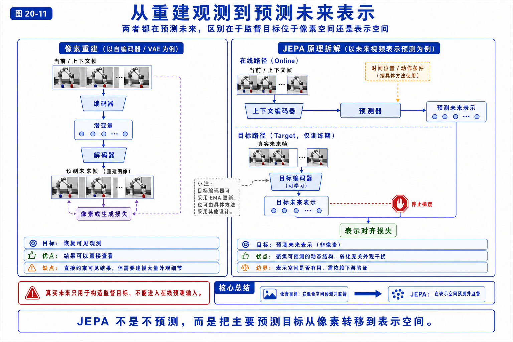{width=96%}

*图 20-11 JEPA 式训练把真实未来限制在目标路径中，在线预测路径只读取当前上下文及允许的条件。*

#### 预测结构化运动

像素和普通 latent 之间还存在一类更接近执行的中间表示，例如二维点轨迹、稠密对应、深度、物体位姿、三维运动场和 actionable 3D flow。这些表示不要求合成所有外观细节，却显式保留“什么东西往哪里移动”。

结构化运动进入控制大致有两条路径。

第一条是**先生成视频，再提取结构**。AVDC 先合成任务执行视频，再计算相邻帧的稠密对应，并结合初始深度恢复三维运动；NovaFlow 也从生成视频中提取可执行的三维物体流，再针对刚体、关节物体或变形物体选择位姿估计、轨迹优化或模型预测控制。这类方法仍保留完整视觉计划，结构化表示是视频与控制之间的接口。

第二条是**直接预测结构化未来**。Object-centric 3D Motion Field、3DFlowAction 等方法把物体三维运动场本身作为预测或动作表示，省去完整 RGB 视频的生成与解码。它们更明确地保留“哪些点将向哪里移动”，但也更依赖深度、相机标定、点跟踪、物体分割以及结构化标注的质量。

因此，AVDC 与 structured world modeling 确实有关，但二者不是同义词。前者属于“视频生成后再提取结构”的模块化链路；后者还包括直接学习轨迹、点流或三维运动场的世界预测模型。

### 20.3.4 从未来到动作

世界模型预测了“接下来应当发生什么”，机器人仍然需要知道“为了实现这个未来，现在应该执行什么动作”。从未来信息进入控制系统的方式看，可以先分成三类接口。

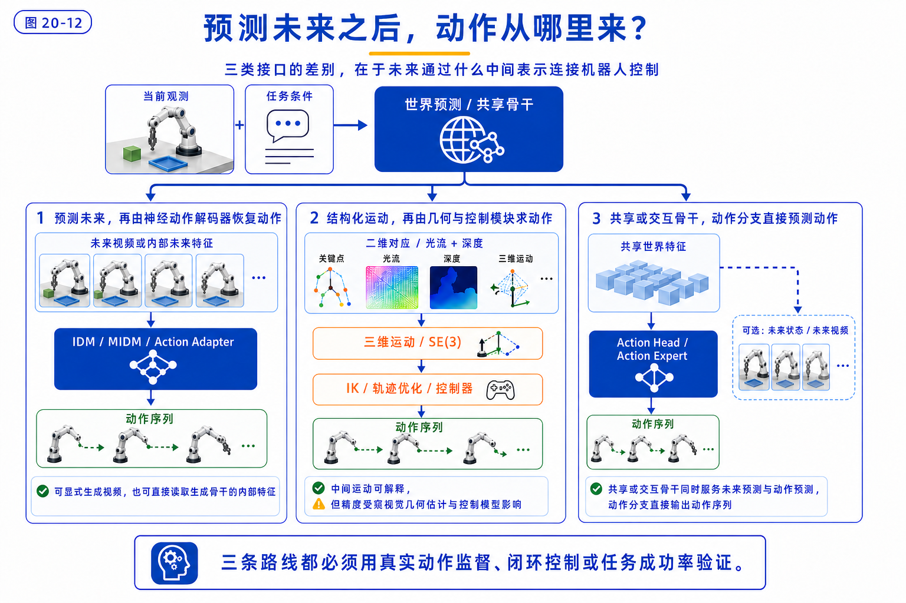{width=96%}

*图 20-12 未来视频、结构化运动和共享预测特征可以分别通过 IDM、几何控制器或动作分支连接到控制。*

| 连接方式 | 送入动作模块的预测结果 | 动作如何产生 | 代表方法 |
|---|---|---|---|
| 预测结果 + 神经动作解码器 | 当前观测与生成的未来视频，或视频模型的未来特征 | IDM、MIDM 或 action adapter 学习预测动作 | UniPi、Vidar、VidMan |
| 结构化运动 + 几何控制器 | 二维对应、光流、深度、点轨迹或三维运动场 | 先恢复三维位移、物体位姿或末端轨迹，再由 IK / 轨迹优化 / 底层控制器执行 | AVDC、NovaFlow、3DFlowAction |
| 共享骨干 / 专家中的动作分支 | 世界预测骨干的中间表示或与视觉分支交互后的特征 | Action Head / Action Expert 在同一训练图中直接生成动作 | DreamZero、Fast-WAM、Motus |

这三类接口的区别，不在于是否“用了世界模型”，而在于未来预测结果以什么形态进入动作生成：是先交给一个独立逆动力学模块，还是转成几何运动量，还是在同一个网络内部直接影响动作分支。

#### 路线一：IDM 恢复动作

这里使用的术语是逆动力学模型（Inverse Dynamics Model，IDM）。在机器学习文献中，它通常指从状态转移或观测变化反推动作的条件预测模型；它与机器人学中的解析逆运动学、解析逆动力学不是同一个求解过程。

经典逆运动学根据目标末端位姿求关节配置，经典逆动力学根据期望的关节运动以及质量、惯量等动力学参数求所需的关节力矩。具身世界模型中的 IDM 则通常是数据驱动的观测条件模型：给定当前观测与目标或预测未来，输出数据中最可能产生该状态变化的控制量。这个控制量取决于数据集定义，可能是末端位姿增量、关节位置、速度、夹爪命令或动作 chunk，并不必然是力矩。

其基本形式可以写成

$$
p_\psi(a_{t:t+K}\mid o_t,\hat{o}_{t+1:t+H},l),
$$

如果世界模型输出 latent future，则写成

$$
p_\psi(a_{t:t+K}\mid h_t,\hat{z}_{t+1:t+H},e^{\ell}).
$$

UniPi 是显式 predict-then-act 的典型例子：先根据当前图像和任务描述生成视觉计划，再由逆动力学模型把相邻计划帧转换为低层动作。Vidar 也采用“视频扩散模型 + Masked IDM”的两阶段结构，其 MIDM 学习掩码以突出生成轨迹中与动作相关的区域。VidMan 的“两阶段”含义不同：第一阶段学习未来视频扩散，第二阶段加入逐层自注意力 adapter，并借助共享的视频扩散特征预测动作；它主要利用视频模型内部的隐式动态知识，不应写成部署时一定先生成完整视频再交给外部 IDM。

模块化路线的优点是视频模型与动作解码器可以分别预训练、替换和诊断。主要风险不只有一次分布偏移：如果动作解码器用真实未来帧训练、部署时却读取生成视频，就会出现 teacher-forcing 与生成分布之间的差异；视频预测误差还会传入动作恢复，错误动作改变下一次真实观测后，又会影响后续视频预测和控制。长时闭环中可能形成“视觉预测误差 → 动作误差 → 新观测偏移 → 后续预测继续偏移”的级联。掩码、候选未来筛选、闭环重规划和用生成样本训练动作解码器，都可以减轻这种问题，但不能彻底消除。

#### 路线二：几何运动接口

不是所有方法都让神经网络直接从视频回归动作。另一条路线先把相邻帧的视觉变化转换为几何运动。

设图像位置 $(x,y)$ 在相邻两帧之间产生水平、垂直像素位移 $(u,v)$。在离散视频中，通常把相邻帧的时间间隔归一化为一个时间步，此时亮度恒常假设可以写成

$$
I(x,y,t)
\approx
I(x+u,y+v,t+1).
$$

这里的 $(u,v)$ 表示相邻帧之间的像素位移；若实际帧间隔为 $\Delta t$，对应的像素速度才是 $(u/\Delta t,v/\Delta t)$。对右侧做一阶展开并忽略高阶项，可以得到经典光流约束

$$
I_xu+I_yv+I_t=0.
$$

这个方程在每个像素处只有一个约束，却有水平位移 $u$ 和垂直位移 $v$ 两个未知量，因此不能单独得到唯一解，这就是光流估计中的孔径问题。实际方法还要利用邻域平滑、跨帧特征匹配或学习到的运动先验；光照变化、遮挡和大位移又会破坏亮度恒常等基本假设。

光流给出的是像素在图像平面上的表观运动，并不是机器人动作。单目二维光流还无法直接区分物体真实三维运动、相机运动和遮挡变化。要把它接入控制，通常还需要深度、相机内外参、目标区域和机器人约束：

```text
预测视频
-> 相邻帧光流 / dense correspondence
-> 结合深度恢复 3D 对应点
-> 估计物体或末端的 SE(3) 变换
-> 交给逆运动学或底层控制器执行
```

AVDC 就采用了这条链：先生成任务执行视频，再把相邻帧光流作为稠密对应，结合初始帧深度与刚体运动假设恢复三维轨迹或 SE(3) 变化，最后映射为环境中的离散动作或机器人命令，并在执行过程中重新规划。与黑盒 IDM 相比，几何运动接口的中间量更容易解释；但光流误差、遮挡、非刚体运动、生成视频漂移和深度误差都会进入最终动作。

还要区分两种看起来相近的用法：AVDC 是先生成视频，再从相邻帧计算光流；另一些 structured world model 则直接预测未来 optical flow、点轨迹或 3D flow。前者保留完整视觉计划，后者缩短了从世界预测到几何控制的路径。

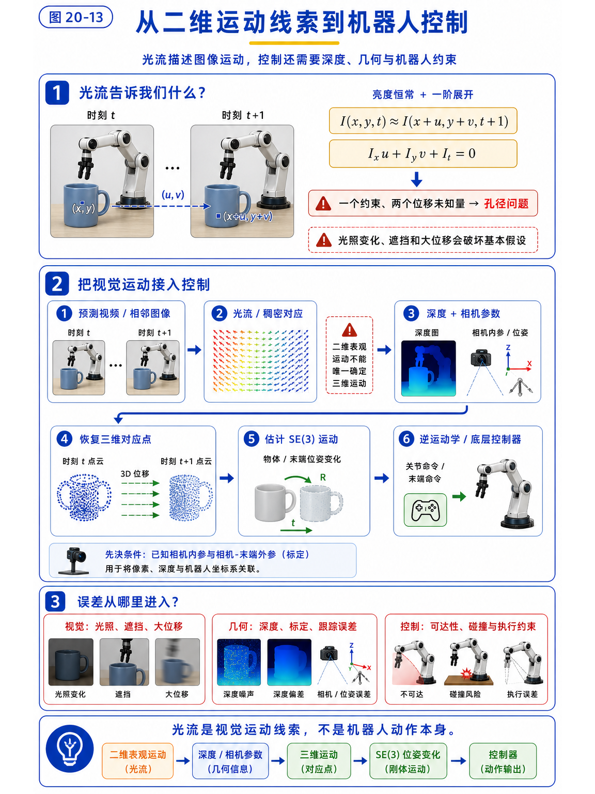{width=68%}

*图 20-13 光流只是二维表观运动线索，还需要深度、相机几何、三维运动估计和控制器才能形成机器人命令。*

#### 路线三：动作分支联合预测

有些方法不显式恢复“哪一个动作导致了这两帧变化”，而是让动作分支直接读取世界模型的预测特征：

$$
\hat{a}_{t:t+K}
=A_\psi(h_t,\hat{z}_{t+1:t+H},e^{\ell}).
$$

VPP、Video2Act 从预训练视频世界模型中提取紧凑的 predictive feature，再送入独立 Action Head。它们仍然是解耦架构，但动作接口使用的是未来 latent，而不是完整视频。

耦合更紧时，动作模块不再只是世界模型末端的一个小头。DreamZero 等 single-backbone 方法在同一骨干中联合建模未来视觉与动作；LingBot-VA、Fast-WAM 和 Motus 则保留视频专家与动作专家，通过共享注意力反复交换信息。此时，Action Expert 在多层网络中持续接收世界动态，而不是等视频全部生成完再恢复动作。

这里容易把“解耦”和“分层”混为一谈。**解耦 / 耦合描述模块怎样连接和训练**：世界预测器与动作模块是独立参数、分阶段优化，还是共享骨干并联合优化。**分层描述控制抽象和时间尺度**：上层给出目标、视觉计划或较慢的子任务，下层以更高频率把它变成轨迹和电机命令。二者是正交概念：一个“未来视频 → IDM / 控制器”的系统既可以是解耦的，也可以是高低层分工的；共享骨干模型也仍可能在输出端接分层控制器。分析模块复用和分布偏移时看解耦程度，分析长时规划、控制频率和级联误差时看分层结构。

三种接口没有绝对优劣。独立 IDM 容易检查和替换；几何运动接口具有可解释性；Action Head / Expert 更容易端到端优化并降低显式视频生成带来的延迟。选择哪一种，取决于是否需要可视化未来、是否有动作标注、控制精度以及推理速度要求。

### 20.3.5 联合训练与可控性

架构怎样连接，决定了训练目标怎样组织。这里不能列出一份所有世界模型都必须采用的损失清单，而应分别看世界预测目标和动作目标监督了什么。

#### 世界预测损失

若模型显式预测未来视频，可以使用条件负对数似然概括其目标：

$$
\mathcal{L}_{\mathrm{video}}
=-
\mathbb{E}
\left[
\log p_\theta(o_{t+1:t+H}\mid o_t,l,a_{t:t+H-1})
\right].
$$

并非所有方法都同时使用语言与动作条件，因此缺失的条件项应按具体模型删除。实际训练中，这一似然可以对应不同生成目标或重建目标；公式表达的是监督对象，而不是指定唯一实现。

若模型预测未来 latent，则监督目标是预测特征与目标编码器特征之间的距离：

$$
\mathcal{L}_{\mathrm{latent}}
=d(\hat{z}_{t+1:t+H},
\operatorname{sg}(z_{t+1:t+H})).
$$

若模型预测轨迹、光流或三维运动，可以根据表示使用端点误差、轨迹距离、位姿误差或鲁棒回归损失。它们约束的是几何运动，不等价于视频重建损失。

#### 动作损失与联合目标

独立 IDM 或 Action Head 可以通过动作条件似然训练：

$$
\mathcal{L}_{\mathrm{act}}
=-
\mathbb{E}
\left[
\log p_\psi(a_{t:t+K}\mid o_t,\tilde{x}_{t+1:t+H},l)
\right],
$$

其中，$\tilde{x}$ 表示送入动作模块的未来信息，可以是视频、latent 或 structured future。独立 IDM 训练时常使用数据中的真实未来，部署时再换成世界模型预测；联合架构则可以直接使用预测特征并让动作损失反向影响共享骨干。采用确定性动作回归时，也可以使用与动作标签之间的 $L_1$、$L_2$ 或 Huber loss；具体形式取决于策略输出分布，不能一概而论。

解耦路线分别优化世界模型和动作模块。共享骨干、MoT 和统一 VLA 通常采用多任务联合目标，常见写法是

$$
\mathcal{L}_{\mathrm{joint}}
=\lambda_{w}\mathcal{L}_{\mathrm{world}}
+\lambda_{a}\mathcal{L}_{\mathrm{act}},
$$

其中，$\mathcal{L}_{\mathrm{world}}$ 应根据模型预测像素、latent 还是结构化运动来定义。部分方法还会加入特征对齐、跨分支一致性或辅助任务，但这些不是所有具身世界模型的必备项。

联合训练也不代表推理时必须生成完整未来视频。WorldVLA 主要把未来图像预测作为训练信号；Fast-WAM 在训练阶段学习视频动态，推理时可以跳过显式视频分支。世界预测知识可以进入参数和中间特征，而不必每一步都被解码成人眼可见的画面。

#### 动作条件不等于动作可控

即使网络输入中包含动作 $a_t$，模型仍可能主要依赖当前画面猜测未来。假设训练数据里，杯子在左侧时机器人总向左移动，杯子在右侧时总向右移动，模型只看杯子位置也能取得很低的预测误差，却没有真正学会动作的效果。

动作条件模型学习的是

$$
p_\theta(x_{t+1}\mid x_t,a_t),
$$

而控制真正关心的是主动施加动作后的变化

$$
p(x_{t+1}\mid x_t,\operatorname{do}(a_t)).
$$

只有当当前状态表示充分、动作与结果的时间对齐正确，并且同类状态下有足够多样的动作覆盖时，观测到的条件分布才可能接近干预分布。单纯把动作向量接入网络并不能保证这一点。

这种现象更准确地称为**动作忽略**或**捷径学习**，不等同于模型坍缩。动作忽略时，模型仍可能生成清晰而多样的未来，只是输出对动作条件不敏感；表示坍缩是编码器把不同输入映射到近乎相同的表征；生成模型中的模式坍缩则是输出分布只覆盖少数模式。三者的诊断方法不同：动作忽略要固定初始状态并改变动作，表示坍缩要检查特征方差和有效秩，生成模式坍缩则要检查样本多样性与分布覆盖。

最直观的检验方法是 action sweep。固定同一个初始状态 $x_t$，输入多组候选动作

$$
\hat{x}_{t+1:t+H}^{(i)}
\sim
p_\theta(x_{t+1:t+H}\mid x_t,a_{t:t+H-1}^{(i)}),
\qquad i=1,\ldots,N,
$$

然后依次检查：预测是否对动作变化敏感，变化方向和尺度是否正确，接触结果是否合理，以及这种差异能否在多步预测中持续。对于 IDM 或 Action Head，还要进一步检查世界模型预测的未来是否真的能够恢复出正确动作，而不是只生成视觉上流畅的结果。

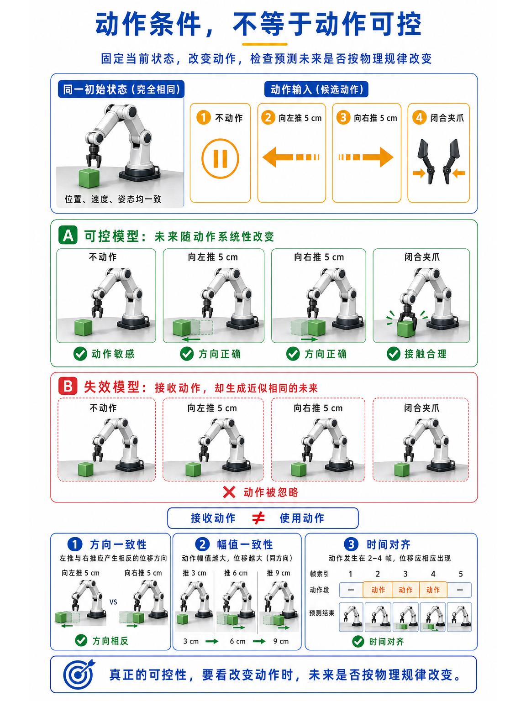{width=68%}

*图 20-14 固定初始状态并改变动作，才能检验模型是否真正学习了动作对未来的因果影响。*

### 小结

这些知识点可以沿一条完整链路串起来：

```text
Encoder 决定模型看见和保留什么
-> World Backbone 决定未来以视频、latent 还是 structured motion 表示
-> IDM / 光流几何接口 / Action Head 或 Expert 把未来连接到动作
-> World Loss 与 Action Loss 决定这些能力怎样被训练
-> Action Sweep 检查预测是否真正受动作控制
```

阅读一个新的具身世界模型时，可以依次提出五个问题：

1. 它使用什么编码器，编码结果偏向表征学习、可重建生成，还是面向未来预测？
2. 世界预测骨干输出未来视频、future latent，还是轨迹与 3D flow？
3. 预测未来怎样进入机器人控制：独立 IDM、几何运动接口、Action Head，还是深度耦合的 Action Expert？
4. 世界预测与动作生成是分阶段训练、共享骨干联合训练，还是只在训练时使用未来监督？
5. 固定当前状态并改变动作时，模型预测是否发生正确、持续且可执行的变化？

掌握这条链之后，后面分析 UniPi、DreamZero、LingBot-VA、Fast-WAM、VLA-JEPA 以及学习型仿真器时，就能看清它们究竟改动了哪一环，而不是只记住模型名称。

## 20.4 技术路线与代表工作

前面已经把世界模型拆成了编码、未来预测、动作接口和训练目标。接下来要把这些构件放回具体技术路线中。当前具身世界模型研究可以从三个观察视角展开：

```text
面向策略学习的世界模型：预测能力怎样进入动作生成？
作为仿真器的世界模型：模型怎样代替环境，被策略反复查询？
机器人视频世界建模：未来怎样在视觉空间中被生成、控制和评估？
```

这三类不是互斥集合。同一个模型可能既能生成机器人视频，又能作为策略评估器；也可能训练时利用未来视频监督，推理时只输出动作。读一篇新的世界模型论文时，可以先问四个问题：

1. 它预测什么：像素视频、latent feature、轨迹、3D flow，还是 reward / termination？
2. 它怎样连接策略：先预测再恢复动作、联合生成动作、作为仿真器评估候选动作，还是只提供训练监督？
3. 训练和推理阶段是否一致：训练时生成未来，推理时是否还显式生成未来？
4. 最终用途是什么：控制、仿真、评估、规划，还是数据增强？

### 20.4.1 经典基础：在潜在空间中想象

在进入近期 WAM 和机器人视频世界模型之前，先看 Dreamer / RSSM 这一类经典 latent world model。它们不代表当前具身世界模型的全部路线，也不是 WAM 的唯一源头；但它们把一个核心思想讲得很清楚：**世界模型可以在内部状态中滚动未来，再用想象出来的经验训练策略。**

为什么要在 latent space 中预测？因为视觉观测维度很高，像素里包含大量和控制无关的纹理、光照和背景变化。若每一步都直接预测完整图像，模型容量很容易被外观细节消耗。Dreamer 的做法是先把观测压缩成内部状态，再在内部状态中进行 rollout。

RSSM（Recurrent State-Space Model）通常把状态拆成两部分：确定性的循环状态 $h_t$ 和随机潜变量 $z_t$。可以简写为

$$
h_t=f_\theta(h_{t-1},z_{t-1},a_{t-1}),
$$

其中，$h_t$ 负责携带历史信息，$a_{t-1}$ 是上一时刻动作。模型同时学习一个 prior 和一个 posterior：

$$
p_\theta(z_t\mid h_t),
\qquad
q_\phi(z_t\mid h_t,o_t).
$$

训练时，posterior 可以看到真实观测 $o_t$，用于把当前画面编码进状态；想象未来时，模型不能看到未来真实观测，只能从 prior 中采样或取均值继续滚动。随后，预测头从 latent state 中恢复需要的监督信号：

$$
p_\theta(o_t\mid h_t,z_t),\qquad
p_\theta(r_t\mid h_t,z_t),\qquad
p_\theta(c_t\mid h_t,z_t),
$$

其中，$r_t$ 是 reward，$c_t$ 可以理解为 episode 是否继续的 continuation 信号。训练好世界模型后，Dreamer 不再每次都等待真实环境反馈，而是在 learned dynamics 中想象多步未来：

```text
当前 latent state
-> actor 给出动作
-> RSSM 预测下一 latent state
-> reward / value head 估计回报
-> actor-critic 用 imagined rollout 更新策略
```

这条路线的价值在于，它清楚展示了世界模型怎样成为“内部环境”。策略不是只从真实 rollout 学习，而是可以从模型想象的状态转移中学习。它的风险也同样清楚：如果 latent dynamics 在长程 rollout 中逐渐偏离真实环境，actor 可能学会利用模型误差，得到在想象中很好、在真实机器人上失败的动作。

Dreamer / RSSM 在本讲中的作用，是说明 latent imagination 怎样支撑 model-based RL。它提供的是一套基础机制，而不是当前具身世界模型的完整缩影。近期 WAM、学习型仿真器和机器人视频世界模型分别把“预测未来并利用未来”扩展到动作生成、环境替代、策略评估和可控视频建模等不同任务。

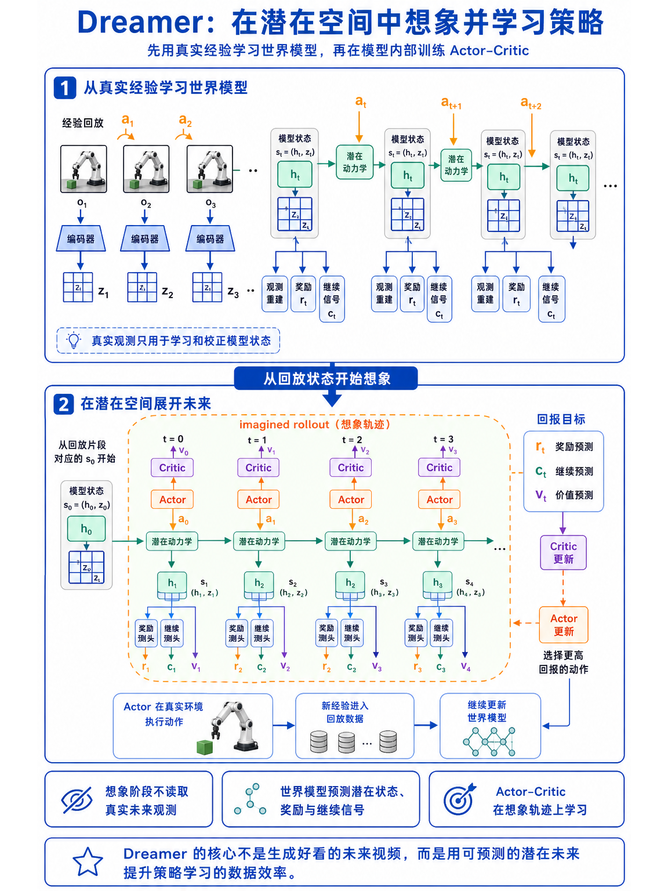{width=68%}

*图 20-15 Dreamer 通过 latent dynamics 生成 imagined rollout，再用预测的回报与价值更新 Actor-Critic。*

### 20.4.2 范式一：面向策略学习的世界模型

面向策略学习的世界模型关注一个问题：世界预测怎样进入动作生成。按照世界预测与动作模块的耦合程度，可以从松到紧分成五条路线。

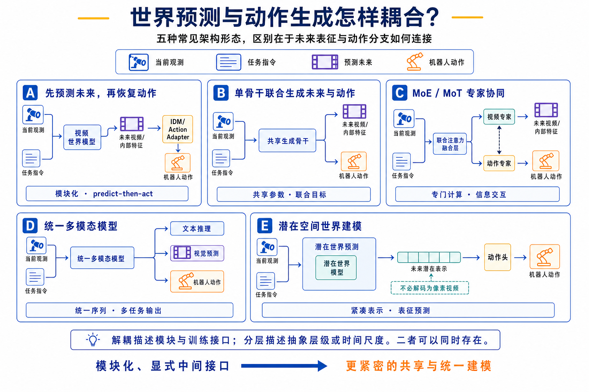{width=96%}

*图 20-16 从分阶段连接到 latent world modeling，五类架构对世界预测与动作生成采用不同耦合方式。*

#### 路线 A：先预测未来，再恢复动作

最直观的做法是把世界模型和策略拆成两个模块：

```text
当前观测 + 任务指令 -> 未来视频 / 未来表征
当前观测 + 预测未来 -> 可执行动作
```

用公式写，就是先预测未来

$$
\hat{x}_{t+1:t+H}=W_\theta(o_{\leq t},l),
$$

再由动作模块恢复动作

$$
\hat{a}_{t:t+K}=P_\psi(o_{\leq t},\hat{x}_{t+1:t+H},l).
$$

早期最容易理解的例子是 UniPi：模型先根据当前图像和任务描述生成未来视频，再用逆动力学模型从相邻视觉变化中恢复低层动作。它把“先想象任务会怎样完成，再求出导致这个未来的动作”这件事讲得很清楚。

Vidar 是更贴近当前机器人世界模型趋势的代表工作。它面向双臂操作，把流程做成两阶段：第一阶段从互联网规模视频扩散模型出发，再使用来自三种真实机器人平台的 750K 多视角轨迹进行具身连续预训练，并用统一观测空间编码机器人、相机、任务和场景上下文；第二阶段训练 masked inverse dynamics model，从生成或真实轨迹中抽取动作相关区域，再预测目标机器人的动作。这里的 mask 很关键：它不需要稠密掩码标注，而是学习哪些像素变化和动作最相关，从而减弱背景、无关物体和视角变化的干扰。

Vidar 的意义不只是“又用了视频生成”。它把 predict-then-act 路线中的三个难点放在了一起：多视角观测怎样统一，双臂动作怎样从视觉变化中恢复，跨机器人平台时动作相关区域怎样保持稳定。对于入门读者，抓住这条链就够了：

```text
多视角机器人视频预训练
-> 生成或预测任务相关未来轨迹
-> masked IDM 关注动作相关区域
-> 恢复双臂低层动作
```

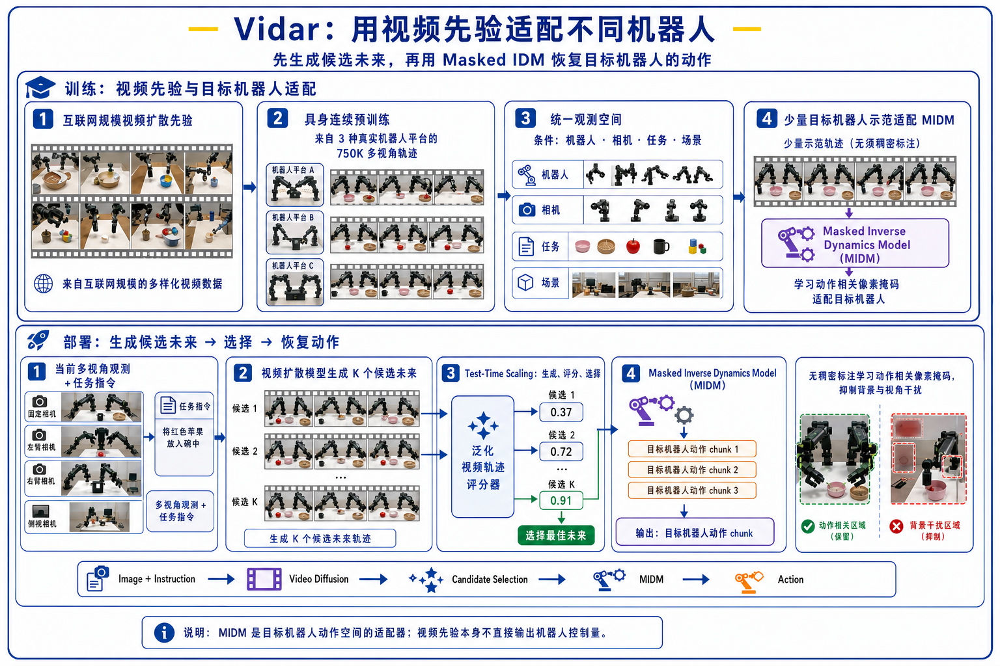{width=96%}

*图 20-17 Vidar 使用视频动态先验生成候选未来，再由 Masked IDM 从动作相关区域恢复双臂动作。*

VidMan 与 Vidar 属于同一大方向，但部署接口并不相同。VidMan 第一阶段学习未来视频扩散，第二阶段加入逐层自注意力 adapter，并利用视频扩散骨干的内部动态特征预测动作；Vidar 则显式采用“视频扩散先验 + Masked IDM”适配目标机器人动作空间。它们共同说明：视频预测的价值不只在于输出可观看的视频，也可以通过生成骨干内部特征或动作相关掩码服务动作恢复。

这类方法的优势是直观、模块清晰、未来可检查。研究者能直接看预测视频是否朝任务目标发展，也能单独替换世界模型或动作模块。问题在于误差会沿链路传递：视频预测偏一点，IDM 恢复动作可能偏更多；未来视频看起来合理，也不代表它符合机器人动作因果。

#### 路线 B：单骨干联合生成未来与动作

更紧的做法，是不再把世界模型当作策略前面的独立模块，而是让同一个生成骨干同时建模未来视觉和动作：

$$
p_\theta(o_{t+1:t+H},a_{t:t+K}\mid o_{\leq t},l).
$$

DreamZero 是这条路线的核心代表。它提出的 World Action Model（WAM）不是在 VLA 后面再接一个视频预测器，而是把未来世界状态和动作放到同一个生成过程中建模。普通 VLA 主要学习

$$
p(a_{t:t+K}\mid o_{\leq t},l),
$$

而 DreamZero 试图让模型同时学习“动作是什么”和“动作之后世界怎样变化”。视频在这里提供了密集的物理动态监督：物体是否被推动、杯子是否离开桌面、夹爪是否接触目标，都能在未来画面中表现出来。

DreamZero 的关键取舍在于，它利用预训练视频生成骨干带来的动态先验，同时又必须满足真实机器人闭环控制的速度要求。视频扩散模型通常很慢，而机器人控制需要低延迟。DreamZero 通过模型和系统层面的优化，让一个大规模视频生成式模型能够以闭环方式输出动作。这说明单骨干 WAM 的难点不仅是算法建模，还包括推理延迟、动作频率和闭环稳定性。

这条路线的一个重要启发是跨本体迁移。因为视频描述的是世界变化，而不只是一台机器人自己的动作标签，所以人类视频或其他机器人视频也可能提供有用的动态先验。DreamZero 的价值在于把“世界模型”和“策略模型”真正放到同一个生成问题里，而不是让世界模型只做策略前面的可视化模块。

单骨干路线的吸引力在于，未来预测和动作生成共享表示，训练目标可以互相约束。模型如果预测的未来与动作不一致，联合生成过程本身就会暴露冲突。它的代价是推理复杂度和延迟压力更大，尤其当模型每一步都要进行视频生成或多步去噪时，真实机器人闭环控制会变得困难。

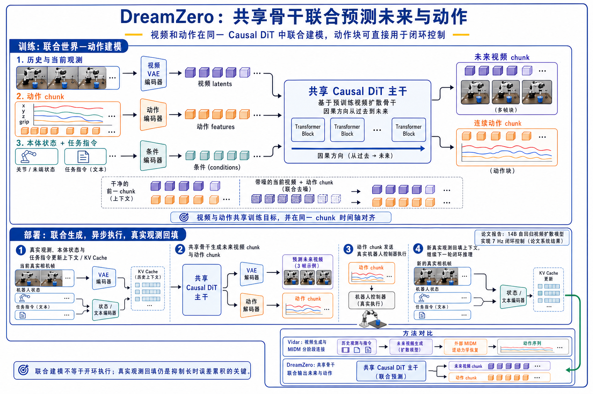{width=96%}

*图 20-18 DreamZero 在共享生成骨干中联合建模未来视觉与动作，并通过闭环观测回填持续控制。*

VideoVLA、Cosmos Policy 等工作也可以放在这个方向下理解。它们的共同点是把视频动态和动作输出放入更统一的生成框架中；区别在于是否显式生成未来视频、动作分支怎样接入、推理时是否保留完整未来预测。

#### 路线 C：MoE / MoT 专家耦合

视频预测和动作生成的优化目标并不完全相同。视频分支更关心时空连续性、视觉细节和未来一致性；动作分支更关心低延迟、控制精度和执行稳定性。MoE / MoT 路线承认这种差异：保留不同专家，但让它们通过共享注意力或跨分支交互交换信息。

这一路线中，Fast-WAM 是核心代表，因为它直接回答了一个工程上很尖锐的问题：WAM 一定要在测试时显式生成未来吗？

Fast-WAM 的设计可以拆成两句话。训练时，它保留视频 co-training，让模型通过未来预测学习世界动态；推理时，它跳过显式 future prediction，直接输出动作。也就是说，未来预测主要作为训练期的表征塑形信号，而不是每一步控制时都必须执行的推理流程：

```text
训练阶段：观测 -> 视频动态辅助目标 + 动作目标
推理阶段：观测 -> 快速动作输出
```

这个结果对理解 WAM 很重要。它说明“拥有世界模型能力”不等于“测试时每一步都要生成一段未来视频”。未来预测可以进入参数、注意力模式和中间特征，使策略获得更好的动态理解；但真正部署时，为了满足控制频率，可以只保留快速动作路径。

LingBot-VA 则更强调闭环因果世界建模。它使用共享 latent space 和 Mixture-of-Transformers 结构，同时学习帧预测和策略执行；闭环 rollout 会不断接入真实观测反馈，避免模型长时间只活在自己的预测中；异步推理让动作预测和电机执行并行，缓解世界模型带来的延迟。

Motus 进一步把理解、视频生成和动作放进一个统一的 MoT 框架中。它通过 latent action 连接视觉变化和机器人动作，并允许模型在 world model、VLA、inverse dynamics、video generation、video-action joint prediction 等不同模式之间切换。它展示的是另一种前沿方向：不是为每个功能训练一个孤立模型，而是把多种具身能力放进同一套可切换的生成框架。

这三项工作都属于面向策略学习的世界模型，但侧重点不同：Fast-WAM 强调训练期世界建模带来的快速策略，LingBot-VA 强调因果动态与闭环纠偏，Motus 强调统一多模式建模。

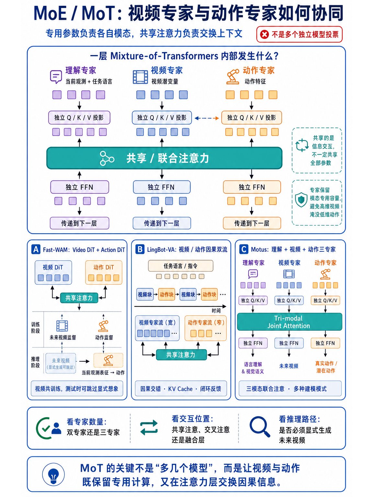{width=68%}

*图 20-19 视频专家与动作专家保留专门参数，并在多层共享注意力中反复交换动态信息。*

#### 路线 D：把未来预测内化进统一 VLA

还有一条路线并不单独训练视频世界模型，而是在统一 VLA 中加入未来预测或世界知识目标。模型仍然以视觉、语言和动作的统一策略为主体，但训练时额外预测未来图像、视觉子目标、结构化动态或 world-aware feature。

WorldVLA 是这条路线的代表。它把 VLA 模型和 world model 放进一个自回归框架中：world branch 根据图像理解、动作理解和语言条件预测未来图像；action branch 根据当前观测生成后续动作。两个分支不是简单并列，而是互相提供约束：动作模型帮助世界模型理解“哪些变化由动作导致”，世界模型又通过未来图像预测迫使动作模型学习环境动态。

WorldVLA 还暴露了自回归动作生成中的一个实际问题：如果动作序列一步步生成，前面动作的误差会影响后面动作，形成误差传播。它为 action chunk generation 设计注意力 mask，减少先前动作对当前动作生成的不良影响。这个细节把抽象的“世界模型帮助策略”落到了一个具体工程问题上：长动作序列怎样避免越生成越偏。

GR-1、DreamVLA 等也可以放在这个方向下理解。它们的共同问题不是“是否生成了漂亮未来图”，而是未来预测是否真正改善了动作生成。比如，未来图像预测可以提供比单步动作标签更密集的监督；结构化世界知识可以帮助模型理解物体关系、任务阶段和接触变化。

这条路线最容易出现的误区，是把任何辅助生成任务都称作世界模型。只有当未来预测目标确实约束了策略表征，并且对控制成功率、泛化或长程任务有帮助时，它才构成有意义的世界建模。

#### 路线 E：只在 latent space 中建模未来

最后一类方法不显式生成未来视频，而是直接预测未来特征。20.3 已经介绍过这类思想：未来帧只在训练时提供 target，推理时策略使用 predictive embedding 或 future-aware feature。

VLA-JEPA 是这条路线的核心代表。它采用 JEPA 式的 leakage-free state prediction：目标编码器从未来帧产生 latent target，而预测分支只能看到当前观测，未来信息只作为监督目标，不作为输入泄漏给模型。这样做的目的，是避免模型靠外观相似性或未来帧泄漏走捷径，而是学习更接近动作相关状态转移的未来表示。

这条路线的计算链可以概括为：

```text
未来帧 -> target encoder -> future latent target
当前观测 -> student encoder / predictor -> predicted latent
predicted latent 与 target 对齐
再接动作头做策略微调
```

它和显式视频生成路线的差异很清楚：模型不需要把未来解码成人眼可看的画面，而是把未来压缩为对控制有用的 predictive embedding。这样推理更轻，也更容易接入 VLA；但诊断更难，因为人眼无法直接判断 latent future 是否漏掉了接触、几何和动作因果。

FLARE 和 JEPA-VLA 也属于这个方向。FLARE 把动作网络的中间特征与未来观测 latent 对齐，让策略在生成动作时拥有对长期后果的隐式预期；JEPA-VLA 则强调视频预测式 embedding 对 VLA 视觉表征的重要性。它们共同说明：世界模型不一定要输出视频，预测未来表征本身也可以成为策略学习的关键监督。

这条路线与 Dreamer / RSSM 都强调 latent dynamics，但使用场景不同。Dreamer 更像 model-based RL 中的内部环境；VLA-JEPA 等近期方法更像把未来预测内化为 VLA 的表征学习目标。

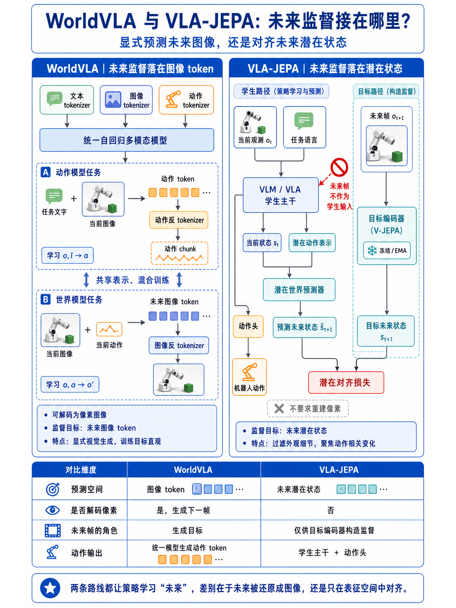{width=68%}

*图 20-20 WorldVLA 使用显式未来图像监督，VLA-JEPA 则对齐未来潜在状态；两者部署路径并不相同。*

### 20.4.3 范式二：世界模型作为仿真器

作为仿真器时，世界模型的身份发生了变化：它不一定输出动作，而是接收当前状态和候选动作，预测环境会怎样回应。可以写成

$$
(\hat{o}_{t+1},\hat{r}_t,\hat{c}_t)
=M_\theta(o_t,a_t,l),
$$

其中，$\hat{o}_{t+1}$ 是下一步观测，$\hat{r}_t$ 是奖励或任务进度，$\hat{c}_t$ 表示是否继续执行。真实系统中还可能输出失败风险、安全分数、进度 token 或语言反馈。

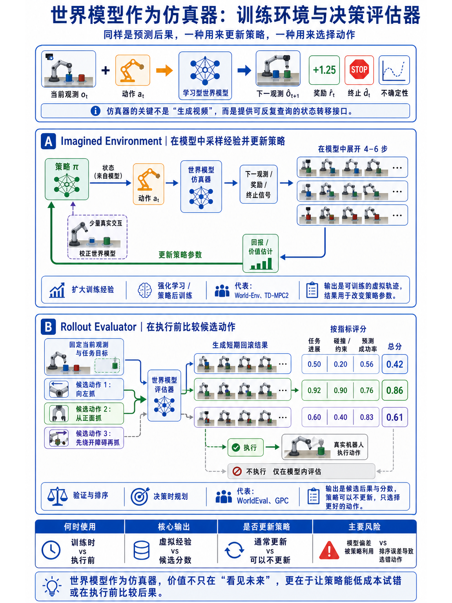{width=68%}

*图 20-21 学习型仿真器既可产生 imagined experience 更新策略，也可在执行前评估和排序候选动作。*

#### 路线 A：用于 RL 后训练

第一类用途是把世界模型当作低成本虚拟环境，让策略在 imagined rollout 中继续学习：

```text
策略给出动作
-> 世界模型预测未来观测 / reward / termination
-> 策略根据想象经验更新
```

World-Env 是这条路线的代表。它用视频世界模拟器产生时序一致的未来视觉观测，再用 VLM 引导的反馈模块提供连续 reward 和动作终止判断，从而让 VLA 在较少真实示范的情况下进行 RL 后训练。这个设计解决的是一个很现实的问题：真实机器人环境往往不可轻易 reset，失败尝试可能移动物体、造成碰撞或浪费大量人工恢复时间。

更具体地说，World-Env 不是只生成未来画面，而是把世界模型包装成一个可查询的虚拟环境。策略输出动作后，视频世界模拟器预测接下来的视觉观测；instant reflector 再根据视觉变化和任务语言给出连续奖励，并判断动作是否应该终止。这样，VLA 可以在虚拟环境里探索“如果我这样做会怎样”，再用 RL 方式更新，而不必每次都让真实机械臂试错。

这个例子适合放在仿真器范式中，因为它和 WAM 的角色不同。WAM 直接输出动作；World-Env 的世界模型则站在环境位置上，负责返回未来观测、奖励和终止信号。策略仍然是另一个模块。

这种范式的价值很清楚：减少真实交互成本，让策略能从失败和反事实轨迹中学习。风险也同样明显：如果世界模型不可靠，策略可能学到“欺骗模拟器”的动作；长程 rollout 的误差会污染 reward、termination 和 value estimate。因此，作为训练环境的世界模型，不能只看视频是否真实，还要看动作后果、任务进度和失败条件是否可信。

VLA-RFT、WMPO、World4RL 等工作也可以放在这个方向下阅读。它们共同关注的问题是：如何把世界模型产生的 imagined transition 变成可靠的策略优化信号。

#### 路线 B：用于评估、筛选与规划

第二类用途不是更新策略，而是在执行前评估候选行为。策略可以提出多个动作序列，世界模型分别预测后果，再选择更可能成功、更安全或更接近目标的方案：

$$
\hat{\tau}^{(i)}=M_\theta(o_t,a_{t:t+K}^{(i)},l),
\qquad
i=1,\ldots,N.
$$

然后用评分函数选择动作：

$$
i^\star
=
\operatorname*{arg\,max}_i S(\hat{\tau}^{(i)},l).
$$

WorldEval 展示了世界模型作为策略评估器的可能性：它不是直接控制机器人，而是用世界模型 rollout 来评估不同机器人策略或同一策略的不同 checkpoint，并作为安全检测器筛掉危险动作。dWorldEval 进一步把视觉、语言和动作映射到统一离散空间，并引入 progress token 来判断任务完成程度，使评估更接近自动化、大规模测试。

WorldEval 的关键点是把“评估策略”从真实机器人 rollout 中部分解耦出来。它用 Policy2Vec 把策略行为转成世界模型可理解的 latent action，使视频生成模型能够跟随策略动作生成未来视频。随后，评估流程不只看视频是否自然，而是看生成结果是否能可靠地区分不同策略、不同 checkpoint，以及是否能提前暴露危险动作。

dWorldEval 则进一步把视觉、语言和动作统一到离散 token 空间中，用离散扩散世界模型预测未来观测和 progress token。progress token 的作用很直接：它让模型不只生成“下一帧长什么样”，还估计任务完成进度，从而更适合大规模自动评测。

GPC 这类测试时 look-ahead 方法也属于这一类。它先训练一个生成式策略提出候选动作，再训练 action-conditioned world model 预测这些候选动作的未来，最后用在线 planner 对动作提案进行排序或优化。若把世界模型作为 latent transition model，还可以进一步做 MPC：不是从有限候选中挑一个，而是在模型内部主动优化动作序列。TD-MPC2 等方法体现的正是这种“在 learned dynamics 中规划”的思想。

作为评估器时，世界模型的核心指标不是视频画质，而是排序是否与真实成功率相关、能否识别 OOD 动作、能否发现安全风险，以及在长程 rollout 中是否保持动作一致性。一个视觉上很漂亮但会错误高估危险动作的世界模型，反而可能比没有世界模型更危险。

### 20.4.4 范式三：机器人视频世界建模

机器人视频世界建模把未来显式表示为图像或视频。它和普通视频生成最容易混淆，但目标完全不同。普通视频生成主要追求视觉真实和时序连贯；机器人视频世界模型还必须关心四件事：

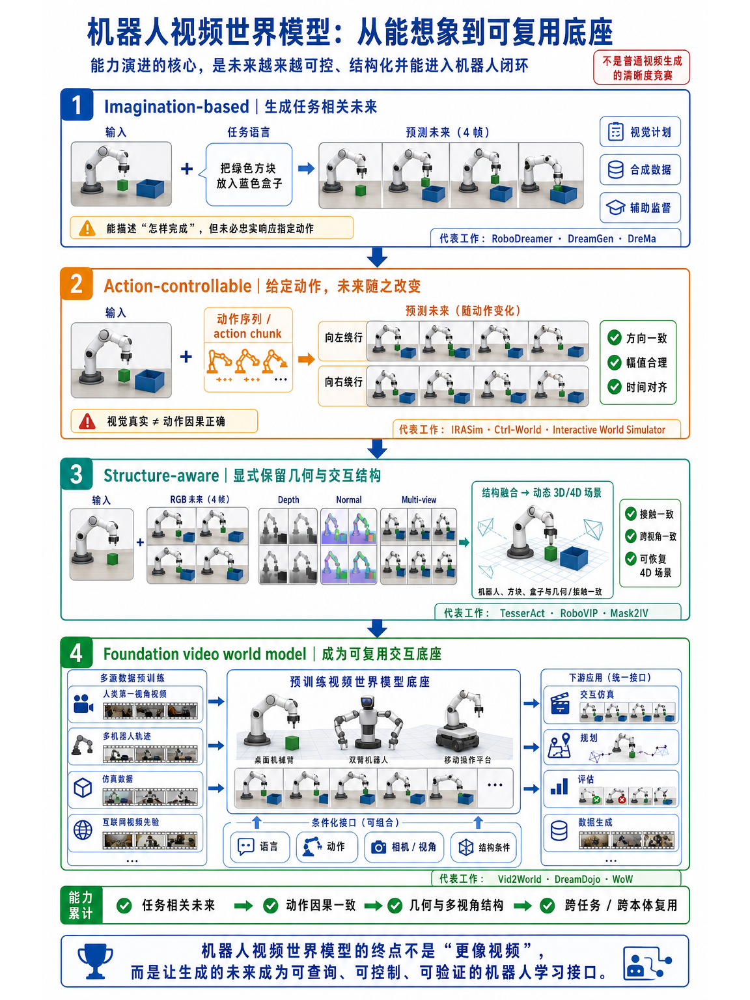{width=68%}

*图 20-22 机器人视频世界模型从任务未来想象，逐步发展到动作可控、结构感知和基础模型化。*

1. **动作一致性**：给定不同动作，未来是否发生正确差异？
2. **物理与运动学合理性**：物体、夹爪、接触和遮挡是否符合基本规律？
3. **结构一致性**：多视角、深度、轨迹和物体身份是否保持一致？
4. **下游可用性**：生成结果能否帮助训练、规划、评估或数据扩充？

按照能力演进，可以把这条路线分成四个阶段。

| 能力阶段 | 核心问题 | 代表工作 | 理解重点 |
|---|---|---|---|
| Imagination-based | 能否生成任务相关未来？ | RoboDreamer、DreamGen、DreMa | 视频作为视觉计划、监督或合成数据 |
| Action-controllable | 未来是否响应给定动作？ | IRASim、Ctrl-World、Interactive World Simulator | 视觉真实不等于动作因果正确 |
| Structure-aware | 能否保持几何、轨迹、深度或多视角结构？ | TesserAct、RoboVIP、Mask2IV | 显式结构有助于接触和空间一致性 |
| Foundation video world model | 能否成为可复用交互式世界模型底座？ | Vid2World、DreamDojo、WoW | 从视频生成走向仿真、规划和评估接口 |

第一阶段的重点是“能想象”。模型生成任务相关未来，用作视觉计划、合成训练数据或辅助监督。它可以让策略看到某个任务大致应该如何完成，但不一定保证给定动作会严格导致对应结果。

第二阶段的重点是“可控”。给定动作序列，模型应该生成相应后果。IRASim 是较早的 action simulator 代表：给定初始画面和机器人动作轨迹，生成机械臂执行该动作后的真实感视频。Ctrl-World 则进一步强调多视角、细粒度动作控制和长时一致性，使生成结果可以用于评估和改进 generalist robot policy。这里最重要的判断标准不是视频是否漂亮，而是 action faithfulness：如果夹爪向左移动，视频中的夹爪和被操作物体不应向右漂移；如果动作幅度变大，未来变化也应有合理尺度差异。

第三阶段的重点是“有结构”。仅靠像素视频很难稳定处理接触、多视角一致性和 3D 运动。TesserAct 是这一路线的代表：它不只预测 RGB，而是联合预测 RGB、Depth、Normal，让未来视频能够恢复成更一致的 4D 场景。RoboVIP 关注多视角视频的一致性，并用 visual identity prompting 保持场景身份；Mask2IV 则通过交互轨迹约束生成结果。这些方法的共同思想是：世界模型越接近机器人执行接口，就越需要显式保留几何和交互结构。

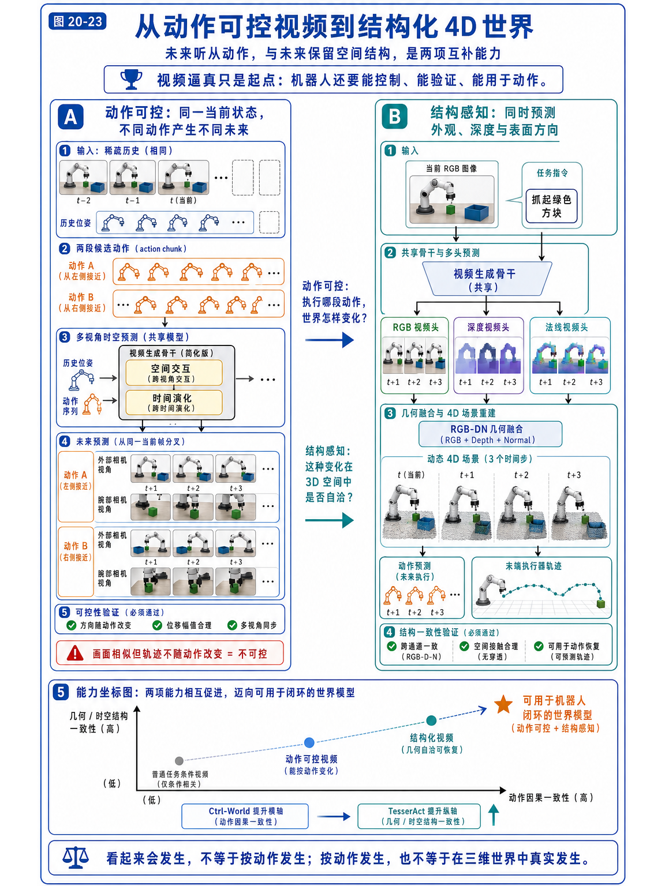{width=68%}

*图 20-23 动作条件控制未来演化，RGB、深度和法向等结构通道进一步支持一致的 4D 场景恢复。*

第四阶段的重点是“底座化”。Vid2World 试图把预训练视频扩散模型改造成可交互世界模型，通过 causalization 和 action guidance 让模型支持自回归、动作条件 rollout。DreamDojo 则更进一步，利用大规模人类第一视角视频学习通用交互动态，再用少量机器人数据对齐到目标机器人。WoW 等工作也服务于这个方向。真正困难的地方不再是生成一段好看的未来，而是让未来在长时程、多动作、多视角和真实控制闭环中仍然可信。

### 20.4.5 回到本讲的技术地图

把这些路线放在一起，可以重新理解本讲中的代表工作。

| 工作 | 主要归属 | 具体技术路线 | 阅读重点 |
|---|---|---|---|
| Dreamer / RSSM | 经典 latent world model | latent dynamics + imagination rollout | 理解基础机制 |
| Vidar | World Model for Policy | 视频预训练 + masked IDM，双臂 predict-then-act | 理解从未来视觉到动作恢复 |
| UniPi / VidMan | World Model for Policy | 视频预测预训练，再用 IDM 或 adapter 连接动作 | 区分显式视觉计划与隐式动态特征两种用法 |
| DreamZero | World Model for Policy | 单骨干 video-action 联合生成 | 理解 WAM 的单骨干路线 |
| Fast-WAM | World Model for Policy | 训练期 video co-training，推理期快速动作输出 | 理解训练期世界建模与 20.5 复现教学 |
| LingBot-VA / Motus | World Model for Policy | MoT、闭环因果建模、latent action 多模式统一 | 理解专家耦合的不同实现 |
| WorldVLA | World Model for Policy | 在统一 VLA 中联合未来图像预测和动作生成 | 理解未来预测如何内化进 VLA |
| VLA-JEPA / FLARE | World Model for Policy | latent future prediction / predictive embedding | 理解不显式生成视频的世界建模 |
| World-Env | World Model as Simulator | 用世界模型替代环境做 RL 后训练 | 理解 imagined RL 后训练 |
| WorldEval / dWorldEval | World Model as Simulator | 策略评估、checkpoint 排序、安全检测 | 理解世界模型评估器 |
| GPC / TD-MPC2 | World Model as Simulator | look-ahead 排序、优化或 latent MPC | 理解世界模型辅助规划 |
| IRASim / Ctrl-World | Robotic Video Generation | 动作可控的视频世界模型 | 理解 action faithfulness |
| TesserAct / RoboVIP | Robotic Video Generation | 结构感知、多视角或几何一致的视频世界模型 | 理解结构一致性 |
| Vid2World / DreamDojo | Robotic Video Generation | 面向交互仿真和规划的基础视频世界模型 | 理解视频世界模型底座化 |

---

## 20.5 Fast-WAM 复现教学

这一节进入本讲的复现实验。这里不再做简化版 toy world model，而是直接阅读和复现 Fast-WAM 官方代码。对于 release checkpoint 评测，完整链路是“任务配置与模型资产 → checkpoint 与 dataset stats → LIBERO 仿真环境 → 模型推理与动作反归一化 → 闭环 rollout → 结果 JSON、日志和失败视频”。只有进入训练烟测时，才需要额外准备视频—动作训练数据、文本 embedding cache、优化器状态和训练日志。把两条链分开，可以避免误以为跑评测也必须下载完整训练数据。

Fast-WAM 论文提出的问题非常适合作为本节实验主线：

> 在控制模型规模和训练设置的对照下，测试时显式生成未来，是否比“只在训练阶段进行视频协同建模”带来额外的控制收益？

很多 WAM 遵循 imagine-then-act 的思路：先生成未来视频或未来表征，再根据想象出来的未来恢复动作。这个流程直观，但视频去噪会增加测试时延迟。Fast-WAM 把两个因素拆开比较：训练时是否使用视频建模目标，以及测试时是否真的生成未来。论文在其 LIBERO、RoboTwin 2.0 和真实机器人设置中发现，移除训练期视频协同建模的影响更大，而跳过测试时未来生成仍能保持有竞争力的控制结果。这个结论应理解为该论文对照实验中的经验发现，而不是所有 WAM 都必然成立的普遍定律。

因此，本节不把“完整重训 Fast-WAM”作为课堂目标。完整训练需要较大的数据和显卡资源，不适合作为所有读者的最低门槛。本节的最低目标是：

1. 读懂官方 repo 中 Fast-WAM、Joint、IDM 三条路线的代码差异。
2. 用 release checkpoint 跑通一个 LIBERO 小任务评测。
3. 在同一评测条件下比较三种推理范式，理解“训练期 world modeling”和“推理期 future imagination”的区别。
4. 资源足够时，做一个训练烟测，观察 `loss_video`、`loss_action` 和评估视频，而不是追求论文级完整指标。

### 20.5.1 运行前检查与课程环境

本节默认使用课程组预先在地瓜云服务器上验证并保存的统一镜像，而不是让每位学生从空白系统重复安装。课程镜像至少要完成一次 `LIBERO spatial / task 0 / 1 trial` 闭环评测，确认下面四项同时成立后再创建快照：

```text
Fast-WAM 与 LIBERO 可以导入
-> release checkpoint 与 dataset_stats.json 可以加载
-> MuJoCo 场景能够 reset 并执行动作
-> 结果 JSON、终端日志和 rollout 视频能够保存
```

课程组保存镜像时，应同时记录镜像名称、Python / PyTorch / CUDA / MuJoCo 版本、Fast-WAM 代码版本、模型与 stats 路径，以及一次通过验证的完整命令。学生启动实例后先激活镜像内的 `fastwam` 环境，不要在未经确认时升级 PyTorch、CUDA、MuJoCo 或 LIBERO。正文后面的手动安装命令用于教师维护镜像和读者自行复现，不是课堂上每个人都必须重复执行的步骤。

在加载大模型前，按下面顺序检查：

1. `nvidia-smi` 能否看到预期 GPU，剩余显存是否足够？
2. `import torch`、`import fastwam`、`import libero` 是否成功？
3. LIBERO 是否能独立 reset，摄像头画面是否正常？
4. task config、checkpoint 和 `dataset_stats.json` 是否属于同一路线？
5. 双相机顺序、输入分辨率、动作维度和本体状态维度是否与 data config 一致？
6. 输出目录是否可写，磁盘是否足够保存 rollout 和日志？
7. 第一次运行是否使用单任务、`num_trials=1`、`gpu_id=0`？

这份检查清单先排除环境与资产问题，再进入模型效果分析。否则，“机械臂不动”可能只是 stats 不匹配或仿真环境没有正确启动，并不能说明策略本身失败。

### 20.5.2 实验资源与最低配置

Fast-WAM 官方实现基于 Wan2.2-5B 视频骨干，并加入 ActionDiT 动作专家。论文实现中，动作专家约 1B 参数，总模型规模约 6B 参数。它不是一个轻量小模型，因此本节必须先把资源门槛说清楚。

| 实验内容 | 最小课堂版本 | 建议资源 | 说明 |
|---|---|---|---|
| 代码阅读 | 只阅读配置、模型、数据和评测入口 | CPU，16-32GB 内存 | 不加载模型，不需要 GPU |
| 单任务评测 | LIBERO 一个 task，`num_trials=1-5`，`num_inference_steps=4-10` | 1 张 32GB GPU 作为课程验证目标 | 官方项目页报告策略在单张 RTX 5090D V2 32GB 上运行；这证明 8 卡不是推理下限，但不等于所有 24GB 设备都能直接复现 |
| 三路线对照 | 同一 task 下依次比较 Fast-WAM / Joint / IDM | 可在同一张 32GB 级 GPU 上串行运行；多卡只缩短总时长 | 需要三套匹配 checkpoint 与 stats；官方 release 只公开 Fast-WAM 主路线权重 |
| 训练烟测 | 小切片数据和极少 step，只验证前向、反向与保存 | 由课程组在地瓜云上单独验证；优先 80GB GPU 或多卡 ZeRO-1 | 完整优化器状态的资源显著高于推理，不作为课堂必做 |

官方没有给出“最低主机内存”或“24GB 显存必定可运行”的承诺，因此正文不再把 64GB 内存或 48GB 显存写成硬门槛。课程发布时应以地瓜云镜像的实测配置为准，并在镜像说明中记录峰值显存和主机内存占用。

官方 `configs/sim_libero.yaml` 把 `MULTIRUN.num_gpus` 默认设为 8，同时 manager 会把不同 task 分配给多块 GPU。这个参数控制的是**并行 worker 可见的 GPU 数量**，不会把一个模型自动切到 8 张卡上，也不会因为改成 1 而降低单个 worker 的模型显存。课程建议每张卡只启动一个 worker：

```bash
# 一张卡串行调度
MULTIRUN.num_gpus=1 MULTIRUN.max_tasks_per_gpu=1

# 两张卡并行调度
CUDA_VISIBLE_DEVICES=0,1 \
MULTIRUN.num_gpus=2 MULTIRUN.max_tasks_per_gpu=1

# N 张可见卡：把 num_gpus 改成 N
CUDA_VISIBLE_DEVICES=0,1,...,N-1 \
MULTIRUN.num_gpus=N MULTIRUN.max_tasks_per_gpu=1
```

若只验证一个 task，直接运行 `eval_libero_single.py` 并设置 `gpu_id=0`，不需要 manager。若云平台分配的是物理 GPU 3，但通过 `CUDA_VISIBLE_DEVICES=3` 只暴露这一张卡，进程内部仍应使用 `gpu_id=0`。

所有命令默认在 Fast-WAM 官方 repo 根目录下执行。下文用 `FastWAM/` 表示该目录。

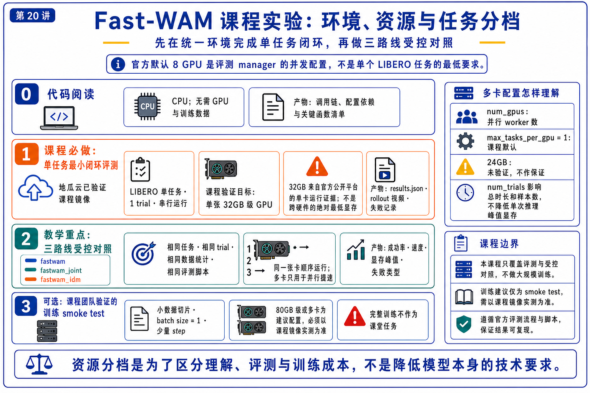{width=96%}

*图 20-24 Fast-WAM 课程实验分档与资源边界。*

### 20.5.3 先读代码地图

在真正运行命令之前，建议先打开 repo 对照阅读下面这些文件。不要一开始就试图读懂所有代码，先抓住四条线：模型线、数据线、评测线、训练线。

| 文件或目录 | 作用 | 阅读重点 |
|---|---|---|
| `configs/model/fastwam.yaml` | Fast-WAM 主模型配置 | Wan2.2 视频专家、ActionDiT 动作专家、MoT 混合注意力 |
| `configs/model/fastwam_joint.yaml` | Joint 对照模型配置 | 与 Fast-WAM 共用相近结构，但推理时联合 denoise 视频 latent 和动作 |
| `configs/model/fastwam_idm.yaml` | IDM 对照模型配置 | 先生成或条件化未来视频，再根据视频条件生成动作 |
| `configs/task/libero_uncond_2cam224_1e-4.yaml` | LIBERO Fast-WAM 训练 / 评测任务配置 | 数据、模型、batch size、学习率等 task 级覆盖 |
| `configs/data/libero_2cam.yaml` | LIBERO 数据配置 | 双相机、224 分辨率、动作维度、状态维度、视频帧和动作频率 |
| `src/fastwam/models/wan22/fastwam.py` | Fast-WAM 主体实现 | `training_loss` 与 `infer_action` |
| `src/fastwam/models/wan22/fastwam_joint.py` | Joint 变体 | 动作 token 可以 attend 到完整视频 latent |
| `src/fastwam/models/wan22/fastwam_idm.py` | IDM 变体 | 先 video，再 action 的推理结构 |
| `src/fastwam/models/wan22/mot.py` | Mixture-of-Transformers | video expert 与 action expert 如何通过 mixed attention 交互 |
| `src/fastwam/datasets/lerobot/robot_video_dataset.py` | 数据读取 | 多相机拼接、视频采样、动作与本体状态对齐 |
| `src/fastwam/datasets/lerobot/processors/fastwam_processor.py` | 数据预处理 | action / state transform、normalization、反归一化 |
| `src/fastwam/trainer.py` | 训练器 | 冻结哪些模块、训练哪些模块、保存哪些指标 |
| `experiments/libero/eval_libero_single.py` | 单任务评测入口 | 单个 task、少量 trial 的最小评测路径 |
| `experiments/libero/run_libero_manager.py` | 多任务评测入口 | 创建 task list，并行调度多个 LIBERO task |

读代码时，最重要的是把三条推理路线放在一起看：

| 路线 | 配置 | 核心函数 | 推理时是否显式生成未来 |
|---|---|---|---|
| Fast-WAM | `libero_uncond_2cam224_1e-4` | `FastWAM.infer_action` | 否 |
| Joint | `libero_joint_2cam224_1e-4` | `FastWAMJoint.infer_action` | 是，视频 latent 与动作一起 denoise |
| IDM | `libero_idm_2cam224_1e-4` | `FastWAMIDM.infer_joint` | 是，先 video，再 action |

注意，这三条路线不是三个无关模型，而是在同一套框架中实现的受控变体。它们的意义在于把两个因素拆开：训练时是否利用视频世界建模，推理时是否显式生成未来。

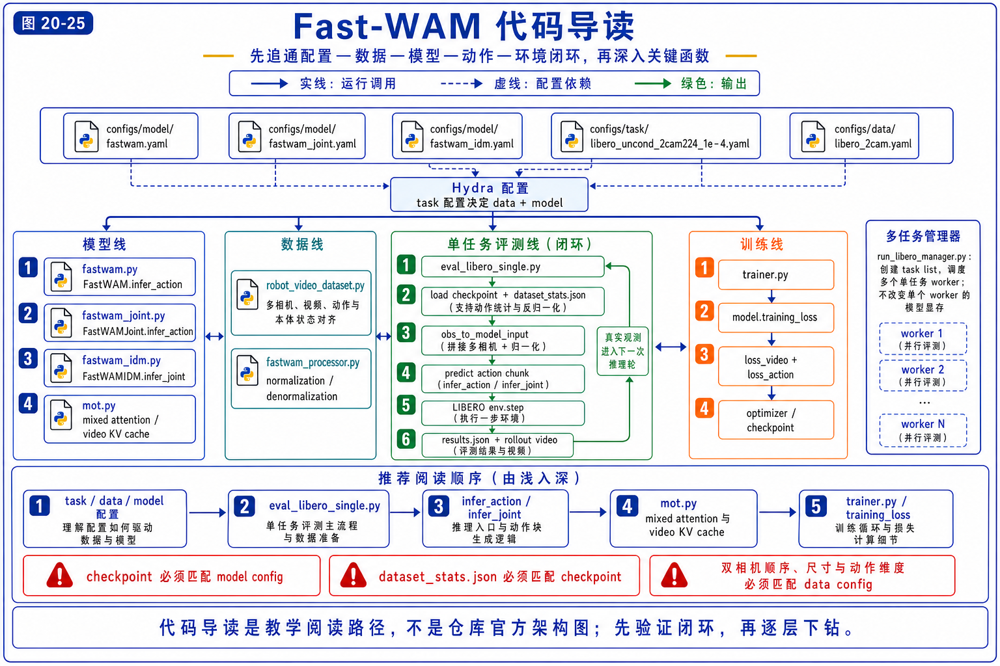{width=96%}

*图 20-25 Fast-WAM 代码导读：配置、数据、模型、训练和评测入口的教学阅读路径。*

### 20.5.4 环境与模型准备

课堂上优先从已经验证的地瓜云课程镜像启动，并运行下列命令确认环境版本：

```bash
conda activate fastwam
python -c "import torch; print(torch.__version__); print(torch.version.cuda); print(torch.cuda.get_device_name(0))"
python -c "import fastwam; import libero; import mujoco; print(mujoco.__version__)"
```

如果教师需要从空白实例制作或维护镜像，再按官方 README 创建环境。官方示例使用 Python 3.10 和 CUDA 12.8 对应的 PyTorch 版本：

```bash
conda create -n fastwam python=3.10 -y
conda activate fastwam
pip install -U pip
pip install torch==2.7.1+cu128 torchvision==0.22.1+cu128 --extra-index-url https://download.pytorch.org/whl/cu128
pip install -e .
```

如果本机 CUDA 版本不同，需要按 PyTorch 官方索引选择对应版本，不要机械复制 `cu128`。安装后可以先检查 GPU 是否可见：

```bash
python -c "import torch; print(torch.__version__); print(torch.cuda.is_available()); print(torch.cuda.get_device_name(0) if torch.cuda.is_available() else 'CPU')"
```

LIBERO 评测还需要 LIBERO 环境。Fast-WAM repo 没有把 LIBERO 完整打包进来，本地复现时需要按照 LIBERO 官方仓库完成安装。Fast-WAM README 特别提醒 MuJoCo 版本要与数据匹配，最后可以执行：

```bash
pip install mujoco==3.3.2
```

接下来准备模型与数据。

先设置 Wan 模型缓存目录。这个路径会被 DiffSynth / Wan 组件读取：

```bash
mkdir -p checkpoints
export DIFFSYNTH_MODEL_BASE_PATH="$(pwd)/checkpoints"
```

评测 release 权重时，先下载官方 release checkpoint 和对应的 dataset stats：

```bash
pip install -U huggingface_hub

huggingface-cli download yuanty/fastwam \
  libero_uncond_2cam224.pt \
  libero_uncond_2cam224_dataset_stats.json \
  --local-dir ./checkpoints/fastwam_release
```

下载后应看到：

```text
checkpoints/fastwam_release/
├── libero_uncond_2cam224.pt
└── libero_uncond_2cam224_dataset_stats.json
```

这里要特别注意：release checkpoint 必须和对应的 `dataset_stats.json` 一起使用。机器人动作在训练和评测中会经过归一化，评测时模型输出的是归一化空间中的动作，真正送入仿真的动作需要反归一化。如果 checkpoint 和 stats 不匹配，模型可能能正常运行，但动作尺度会错，rollout 会直接失败。

如果只做 release checkpoint 的 LIBERO 仿真评测，核心前置项是 LIBERO benchmark 环境、模型权重和对应的 `dataset_stats.json`；预处理后的 LeRobot 训练数据不是单任务评测的必要条件。下面的 LIBERO-fastwam 数据主要用于训练烟测、文本 embedding 预计算，以及读者进一步检查训练数据格式。

LIBERO-fastwam 数据可以从 Hugging Face 数据集下载。官方 README 中要求解压后目录结构如下：

```text
data/libero_mujoco3.3.2/
├── libero_10_no_noops_lerobot/
├── libero_goal_no_noops_lerobot/
├── libero_object_no_noops_lerobot/
└── libero_spatial_no_noops_lerobot/
```

一种常见准备方式是先下载数据集文件，再解压：

```bash
mkdir -p data/libero_mujoco3.3.2
huggingface-cli download yuanty/LIBERO-fastwam \
  --repo-type dataset \
  --local-dir ./data/libero_mujoco3.3.2_download
```

如果下载得到的是若干 `tar.gz` 文件，进入下载目录后解压：

```bash
cd data/libero_mujoco3.3.2_download
for f in *.tar.gz; do
  tar -xzf "$f" -C ../libero_mujoco3.3.2
done
cd ../..
```

解压完成后，回到 Fast-WAM 根目录，检查目录：

```bash
ls data/libero_mujoco3.3.2
```

如果要进行训练烟测，还需要预生成 ActionDiT backbone。评测 release 权重时不一定需要这一步，因为评测配置会加载 checkpoint；训练时需要：

```bash
python scripts/preprocess_action_dit_backbone.py \
  --model-config configs/model/fastwam.yaml \
  --output checkpoints/ActionDiT_linear_interp_Wan22_alphascale_1024hdim.pt \
  --device cuda \
  --dtype bfloat16
```

训练前还需要预计算文本 embedding cache：

```bash
python scripts/precompute_text_embeds.py task=libero_uncond_2cam224_1e-4
```

如果有多张 GPU，可以并行预计算：

```bash
torchrun --standalone --nproc_per_node=8 scripts/precompute_text_embeds.py task=libero_uncond_2cam224_1e-4
```

文本 cache 缺失时，数据集读取阶段会报缺少 `.pt` 文件。这不是模型问题，而是训练数据预处理没有完成。

### 20.5.5 最小评测：单任务少量 trial

第一次复现不要直接跑全量 benchmark。建议先选择一个 LIBERO task，跑 1 个 trial，确认模型、stats 和仿真环境都能接起来。

```bash
python experiments/libero/eval_libero_single.py \
  task=libero_uncond_2cam224_1e-4 \
  ckpt=./checkpoints/fastwam_release/libero_uncond_2cam224.pt \
  EVALUATION.dataset_stats_path=./checkpoints/fastwam_release/libero_uncond_2cam224_dataset_stats.json \
  EVALUATION.task_suite_name=libero_spatial \
  EVALUATION.task_id=0 \
  EVALUATION.num_trials=1 \
  EVALUATION.num_inference_steps=4 \
  EVALUATION.visualize_future_video=false \
  gpu_id=0
```

这个命令中有几个参数必须理解：

| 参数 | 含义 |
|---|---|
| `task=libero_uncond_2cam224_1e-4` | 选择 LIBERO 双相机 224 输入的 Fast-WAM 配置 |
| `ckpt=...pt` | 加载 release 权重 |
| `EVALUATION.dataset_stats_path=...json` | 指定动作反归一化统计文件 |
| `EVALUATION.task_suite_name=libero_spatial` | 选择 LIBERO suite |
| `EVALUATION.task_id=0` | 选择 suite 内的具体任务 |
| `EVALUATION.num_trials=1` | 只跑 1 次，适合检查环境 |
| `EVALUATION.num_inference_steps=4` | 减少动作 denoising 步数，降低第一次调试耗时 |
| `EVALUATION.visualize_future_video=false` | 使用正常快速动作推理路径 |

评测结束后，重点查看三个结果：

1. 终端中是否出现类似 `1/1 successes` 或 `0/1 successes` 的结果。
2. `EVALUATION.output_dir` 下是否保存了结果 JSON。
3. `videos/` 目录下是否保存了 rollout 视频。

如果 `num_trials=1` 能跑通，再把 trial 增加到 5：

```bash
python experiments/libero/eval_libero_single.py \
  task=libero_uncond_2cam224_1e-4 \
  ckpt=./checkpoints/fastwam_release/libero_uncond_2cam224.pt \
  EVALUATION.dataset_stats_path=./checkpoints/fastwam_release/libero_uncond_2cam224_dataset_stats.json \
  EVALUATION.task_suite_name=libero_spatial \
  EVALUATION.task_id=0 \
  EVALUATION.num_trials=5 \
  EVALUATION.num_inference_steps=10 \
  EVALUATION.visualize_future_video=false \
  gpu_id=0
```

这里的目标不是追求一个漂亮成功率，而是确认学生知道如何从结果视频中分析失败。一次失败可能来自视觉输入、动作尺度、replan 频率、环境初始化、接触不稳定或任务本身难度，而不一定是“模型没学会世界模型”。

如果需要多任务评测，可以使用 manager，但仍然可以单卡运行：

```bash
python experiments/libero/run_libero_manager.py \
  task=libero_uncond_2cam224_1e-4 \
  ckpt=./checkpoints/fastwam_release/libero_uncond_2cam224.pt \
  EVALUATION.dataset_stats_path=./checkpoints/fastwam_release/libero_uncond_2cam224_dataset_stats.json \
  EVALUATION.num_trials=5 \
  MULTIRUN.num_gpus=1 \
  MULTIRUN.max_tasks_per_gpu=1 \
  'MULTIRUN.task_suite_names=[libero_spatial]'
```

`run_libero_manager.py` 会创建 task list，并调用并行脚本调度多个子任务。多卡只是在更多 GPU 上并行跑不同任务，不改变单个模型加载所需的显存。

例如，两张可见 GPU 并行跑同一 suite 时，完整命令只需要在单卡 manager 命令上增加设备映射并修改两项调度参数：

```bash
CUDA_VISIBLE_DEVICES=0,1 \
python experiments/libero/run_libero_manager.py \
  task=libero_uncond_2cam224_1e-4 \
  ckpt=./checkpoints/fastwam_release/libero_uncond_2cam224.pt \
  EVALUATION.dataset_stats_path=./checkpoints/fastwam_release/libero_uncond_2cam224_dataset_stats.json \
  EVALUATION.num_trials=5 \
  MULTIRUN.num_gpus=2 \
  MULTIRUN.max_tasks_per_gpu=1 \
  'MULTIRUN.task_suite_names=[libero_spatial]'
```

这里的 worker 会分别看到逻辑设备 `gpu_id=0` 和 `gpu_id=1`。不要在单张 32GB 级 GPU 上把 `max_tasks_per_gpu` 设为 2，因为两个进程会各自加载一份模型，通常会造成显存竞争。

运行过程中可以用下面的命令观察显存：

```bash
watch -n 1 nvidia-smi
```

如果系统没有 `watch`，也可以反复执行：

```bash
nvidia-smi
```

### 20.5.6 核心代码：Fast-WAM 为什么推理更快

完成最小评测后，回到源码。Fast-WAM 的核心不是“把视频生成模型直接当策略”，而是把训练期视频建模和推理期动作生成拆开。

先看 `src/fastwam/models/wan22/fastwam.py` 中的模型构造。简化后可以理解为：

```python
video_expert = Wan2.2_Video_DiT(...)
action_expert = ActionDiT(...)

mot = MoT(
    mixtures={
        "video": video_expert,
        "action": action_expert,
    }
)

model = FastWAM(
    video_expert=video_expert,
    action_expert=action_expert,
    mot=mot,
    vae=Wan_VAE,
    text_encoder=T5_or_cached_context,
)
```

这里有三个关键组件。

第一，`video_expert` 来自 Wan2.2 视频 DiT，它负责处理视觉 latent。第二，`action_expert` 是 ActionDiT，它把动作序列看作需要去噪的 token 序列。第三，`MoT` 把两个 expert 放在一起，通过 mixed attention 交换信息。

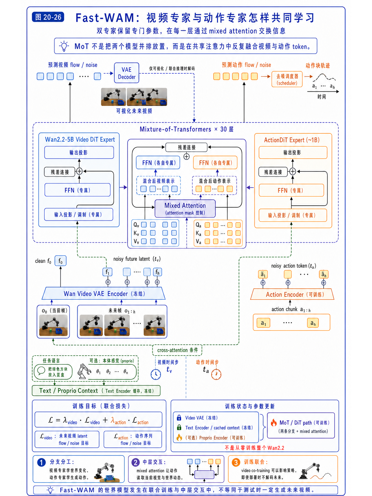{width=68%}

*图 20-26 Fast-WAM 由视频专家、动作专家和逐层混合注意力组成，并以联合视频/动作损失训练。*

训练时，Fast-WAM 同时做视频去噪和动作去噪。`training_loss` 的逻辑可以简化成：

```python
def training_loss(sample):
    video = sample["video"]
    action = sample["action"]
    context = sample["context"]

    video_latents = vae.encode(video)

    noisy_video, target_video = add_noise(video_latents)
    noisy_action, target_action = add_noise(action)

    video_tokens = video_expert.pre_dit(noisy_video, context, action)
    action_tokens = action_expert.pre_dit(noisy_action, context)

    attention_mask = build_mot_attention_mask(
        video_seq_len=len(video_tokens),
        action_seq_len=len(action_tokens),
    )

    tokens_out = mot(
        video_tokens,
        action_tokens,
        attention_mask,
    )

    pred_video = video_expert.post_dit(tokens_out["video"])
    pred_action = action_expert.post_dit(tokens_out["action"])

    loss = loss_video(pred_video, target_video) + loss_action(pred_action, target_action)
    return loss
```

这段逻辑解释了为什么 Fast-WAM 仍然是 WAM：训练阶段它确实学习未来视觉 latent 的去噪目标，视频世界建模没有被删掉。但这并不意味着推理阶段必须生成未来视频。

再看 attention mask。Fast-WAM 主模型中，动作 token 只能看见动作 token 和首帧视频 token，不能看见未来视频 token。简化成矩阵关系就是：

```text
video tokens  -> video tokens
action tokens -> action tokens
action tokens -> first-frame video tokens
action tokens -X future video tokens
```

这一步非常重要。它避免训练时未来视频信息泄漏给动作分支。否则模型可能在训练中偷看未来视频，再在评测时失效。

推理时，Fast-WAM 的 `infer_action` 不生成未来视频，而是只编码当前首帧：

```python
def infer_action(input_image, prompt, action_horizon):
    first_frame_latents = encode_input_image(input_image)
    video_tokens = video_expert.pre_dit(first_frame_latents, prompt)

    video_kv_cache = mot.prefill_video_cache(video_tokens)

    action_latents = random_noise([action_horizon, action_dim])

    for t in denoising_steps:
        pred_action_noise = mot.forward_action_with_video_cache(
            action_tokens=action_latents,
            video_kv_cache=video_kv_cache,
        )
        action_latents = scheduler.step(pred_action_noise, action_latents)

    return action_latents
```

这里的关键是 `video_kv_cache`。视频分支只根据首帧跑一次，得到每一层 attention 的 K/V cache；后续动作去噪时，动作 token 反复查询这个 cache，而不用每一步都重新生成未来视频。这就是 Fast-WAM 推理快的主要原因。

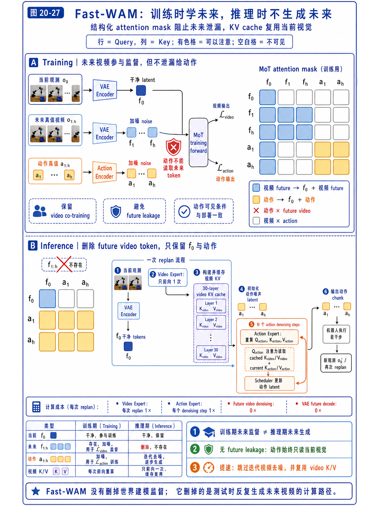{width=68%}

*图 20-27 训练时保留视频与动作协同建模；推理时缓存首帧视频 K/V，只迭代动作分支。*

对应 repo 中应重点阅读：

- `FastWAM.infer_action`
- `MoT.prefill_video_cache`
- `MoT.forward_action_with_video_cache`
- `FastWAM._build_mot_attention_mask`

读这些函数时，不必纠结每个 tensor 的维度细节，先回答四个问题：

1. 哪些 token 在训练时存在，哪些 token 在推理时被删掉？
2. 动作 token 能 attend 到哪些视频 token？
3. KV cache 是在什么时候建立的？
4. 每个 denoising step 重复计算的是动作分支，还是视频和动作都重复计算？

### 20.5.7 三路线对照：Fast-WAM、Joint、IDM

本节最重要的实验不是单独证明 Fast-WAM 能跑，而是比较三种推理范式。

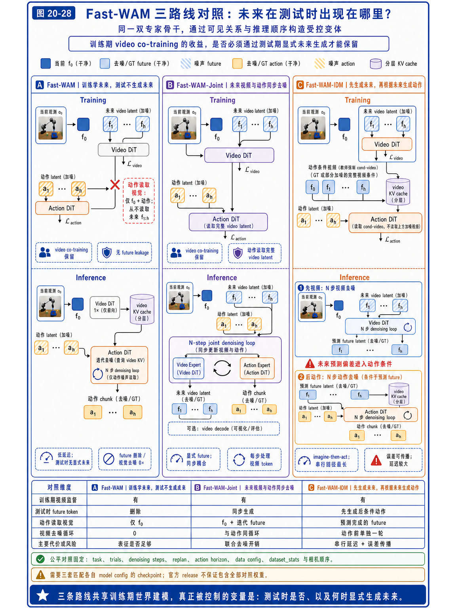{width=68%}

*图 20-28 Fast-WAM、Joint 与 IDM 在测试时是否显式生成未来、动作读取位置和推理成本上不同。*

| 路线 | 代码入口 | 推理结构 | 教学问题 |
|---|---|---|---|
| Fast-WAM | `fastwam.py::infer_action` | 首帧视频 token + action denoising | 不显式生成未来，能不能仍然输出有效动作？ |
| Joint | `fastwam_joint.py::infer_action` | 未来视频 latent 和动作一起 denoise | 联合生成未来与动作是否值得付出延迟？ |
| IDM | `fastwam_idm.py::infer_joint` | 先生成 / 条件化未来视频，再生成动作 | imagine-then-act 是否必要？ |

Joint 变体的关键差异在 `fastwam_joint.py`。它的 attention mask 允许动作 token attend 到完整视频 latent：

```text
action tokens -> full video tokens
action tokens -> action tokens
```

因此，Joint 更接近“未来视频和动作联合生成”的 WAM 路线。它可以利用完整未来 latent，但代价是推理时需要处理更多视频 token。

IDM 变体在 `fastwam_idm.py` 中。它更接近 predict-then-act：先得到未来视频条件，再用未来视频条件帮助动作生成。简化逻辑是：

```python
def infer_joint(input_image, prompt):
    future_video_latents = denoise_video_from_current_image(...)
    action_latents = denoise_action_conditioned_on_video(future_video_latents)
    return future_video, action
```

这条路线最符合“先想象未来，再恢复动作”的直觉，但也最容易受到未来视频生成成本和误差累积的影响。

如果课程提供了三套 checkpoint，可以在同一个 task 上运行三条路线。命令结构相同，只替换 `task`、`ckpt` 和 `dataset_stats_path`。

Fast-WAM：

```bash
python experiments/libero/eval_libero_single.py \
  task=libero_uncond_2cam224_1e-4 \
  ckpt=./checkpoints/fastwam_release/libero_uncond_2cam224.pt \
  EVALUATION.dataset_stats_path=./checkpoints/fastwam_release/libero_uncond_2cam224_dataset_stats.json \
  EVALUATION.task_suite_name=libero_spatial \
  EVALUATION.task_id=0 \
  EVALUATION.num_trials=5 \
  EVALUATION.num_inference_steps=10 \
  EVALUATION.visualize_future_video=false \
  gpu_id=0
```

Joint：

```bash
python experiments/libero/eval_libero_single.py \
  task=libero_joint_2cam224_1e-4 \
  ckpt=./checkpoints/course_ablation/libero_joint_2cam224.pt \
  EVALUATION.dataset_stats_path=./checkpoints/course_ablation/libero_joint_2cam224_dataset_stats.json \
  EVALUATION.task_suite_name=libero_spatial \
  EVALUATION.task_id=0 \
  EVALUATION.num_trials=5 \
  EVALUATION.num_inference_steps=10 \
  EVALUATION.visualize_future_video=false \
  gpu_id=0
```

IDM：

```bash
python experiments/libero/eval_libero_single.py \
  task=libero_idm_2cam224_1e-4 \
  ckpt=./checkpoints/course_ablation/libero_idm_2cam224.pt \
  EVALUATION.dataset_stats_path=./checkpoints/course_ablation/libero_idm_2cam224_dataset_stats.json \
  EVALUATION.task_suite_name=libero_spatial \
  EVALUATION.task_id=0 \
  EVALUATION.num_trials=5 \
  EVALUATION.num_inference_steps=10 \
  EVALUATION.visualize_future_video=false \
  gpu_id=0
```

这里用 `course_ablation/` 表示课程预置的对照 checkpoint 路径。官方 release 提供可直接评测的 Fast-WAM 主路线权重；Joint / IDM 对照权重需要课程提前准备，或者由实验室自己训练得到。不能让学生把示例路径误认为官方 release 一定包含三条路线的全部权重。

对照实验时，控制变量比单次成功率更重要。建议固定：

- 同一个 `task_suite_name`。
- 同一个 `task_id`。
- 同一个 `num_trials`。
- 同一个 `num_inference_steps`。
- 同一个 `replan_steps`。
- 匹配的 `dataset_stats.json`。

结果记录表建议如下：

| 路线 | task | trials | success rate | avg latency | peak VRAM | 典型失败 |
|---|---|---:|---:|---:|---:|---|
| Fast-WAM |  |  |  |  |  |  |
| Joint |  |  |  |  |  |  |
| IDM |  |  |  |  |  |  |

如果要粗略记录推理耗时，可以在运行时打开代码中的 timing 或在外层记录单个 episode 用时。显存峰值可通过 `nvidia-smi` 观察。更严谨的 profiler 不作为本节必需项。

对照实验要引导学生回答三件事：

1. 哪条路线更快？
2. 哪条路线更稳定？
3. 预测未来视频更显式，是否一定带来更高成功率？

这三个问题正好对应 Fast-WAM 论文的核心结论：测试时显式想象未来并不是 WAM 唯一可行的推理方式，训练期 video co-training 本身可能已经提供了关键的世界表征。

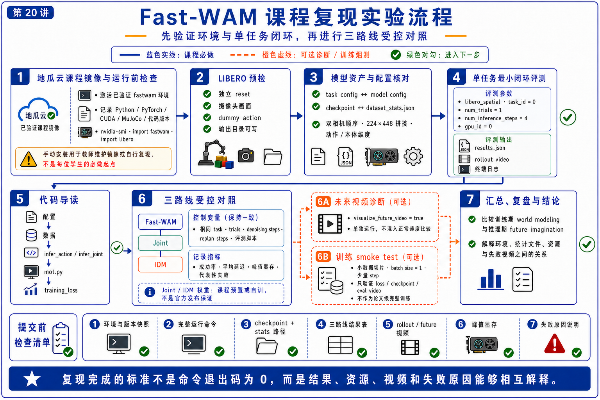{width=96%}

*图 20-29 从统一环境、资产预检到单任务评测、三路线对照和结果汇总的课程复现流程。*

### 20.5.8 可视化未来视频的用法

`eval_libero_single.py` 中有一个容易误用的参数：

```bash
EVALUATION.visualize_future_video=true
```

开启后，评测脚本会调用可以返回未来视频的路径，保存 predicted future video，并计算未来视频与真实执行帧之间的 PSNR。这个功能适合教学观察，但不应该混入 Fast-WAM 正常推理速度比较中。

可以单独跑一个可视化实验：

```bash
python experiments/libero/eval_libero_single.py \
  task=libero_uncond_2cam224_1e-4 \
  ckpt=./checkpoints/fastwam_release/libero_uncond_2cam224.pt \
  EVALUATION.dataset_stats_path=./checkpoints/fastwam_release/libero_uncond_2cam224_dataset_stats.json \
  EVALUATION.task_suite_name=libero_spatial \
  EVALUATION.task_id=0 \
  EVALUATION.num_trials=1 \
  EVALUATION.num_inference_steps=10 \
  EVALUATION.visualize_future_video=true \
  gpu_id=0
```

观察 predicted future video 时，不要只看画面是否“像真的”。更重要的是：

- 夹爪运动方向是否与动作一致？
- 物体是否跟随接触合理移动？
- 遮挡发生时，物体身份是否保持一致？
- 预测未来看起来不错时，真实动作是否也成功？
- 预测未来模糊或错误时，动作是否一定失败？

如果未来视频质量和动作成功率不一致，这反而是很好的讨论材料。它说明“生成未来”和“控制成功”之间不是简单等号。

### 20.5.9 可选训练烟测

如果有足够资源，可以做一个训练烟测。训练烟测的目的不是复现论文指标，而是确认训练链路能跑通，并让学生观察训练日志中的两个损失。

先预处理 ActionDiT backbone：

```bash
python scripts/preprocess_action_dit_backbone.py \
  --model-config configs/model/fastwam.yaml \
  --output checkpoints/ActionDiT_linear_interp_Wan22_alphascale_1024hdim.pt \
  --device cuda \
  --dtype bfloat16
```

再预计算文本 embedding：

```bash
python scripts/precompute_text_embeds.py task=libero_uncond_2cam224_1e-4
```

烟测训练命令可以写成：

```bash
bash scripts/train_zero1.sh 1 \
  task=libero_uncond_2cam224_1e-4 \
  max_steps=50 \
  batch_size=1 \
  num_workers=2 \
  eval_every=25 \
  save_every=50
```

这个命令能否在单卡上跑通取决于显存，不能把它当作所有设备的保证配置。如果显存不足，课程中可以直接提供一份训练日志和 `eval/` 视频，让学生分析而不是现场训练。

训练器在 `src/fastwam/trainer.py` 中。最值得读的不是优化器细节，而是它冻结了哪些模块。简化逻辑是：

```python
model.eval()
model.requires_grad_(False)

model.dit.train()
model.dit.requires_grad_(True)

if model has proprio_encoder:
    proprio_encoder.train()
    proprio_encoder.requires_grad_(True)
```

也就是说，官方训练并不是从零训练整个 Wan2.2 视频大模型，而是主要训练 MoT / DiT 路径和可选 proprio encoder。这个设计让训练更可行，也让视频大模型的预训练能力得以保留。

训练日志中重点看：

| 指标 | 含义 | 观察方式 |
|---|---|---|
| `loss_video` | 视频 latent 去噪损失 | 反映训练期世界建模监督 |
| `loss_action` | 动作去噪损失 | 反映动作生成监督 |
| `psnr_rg` / `ssim_rg` | rollout video 与 GT video 的相似度 | 只能辅助理解，不能单独代表控制好坏 |
| `action_l1` / `action_l2` | 反归一化后的动作误差 | 需要结合任务和动作维度解释 |
| eval video | `pred_video | VAE reconstruction | GT video` 拼接视频 | 用来判断误差来自世界模型还是 VAE 重建瓶颈 |

训练中断后，如果要继续训练，可以用 `resume`。这里要区分两种情况：

```bash
bash scripts/train_zero1.sh 1 \
  task=libero_uncond_2cam224_1e-4 \
  resume=./runs/libero_uncond_2cam224_1e-4/某次运行/checkpoints/state/step_000050
```

`resume` 指向 state 目录时，会恢复 optimizer、scheduler、step 和 dataloader 进度。若只指向 `.pt` 权重，则只加载模型参数，不等价于完整续训。

### 20.5.10 常见失败与复盘

Fast-WAM 复现中，很多失败不是算法本身造成的，而是环境、数据、归一化或配置没有对齐。下面这些问题最常见。

| 现象 | 可能原因 | 验证方式 |
|---|---|---|
| 模型能加载，但机械臂动作幅度异常 | `dataset_stats.json` 与 checkpoint 不匹配 | 检查 checkpoint 和 stats 是否来自同一训练或 release |
| 数据加载时报缺少 `.pt` 文本缓存 | 没有运行 `precompute_text_embeds.py` | 检查 `data/text_embeds_cache/` 下是否有缓存文件 |
| 输入尺寸报错 | 分辨率或多相机拼接与配置不一致 | 检查 `configs/data/libero_2cam.yaml` 中 `video_size` 和 camera key |
| LIBERO 环境 import 失败 | LIBERO / MuJoCo 环境未安装或版本不匹配 | 先单独运行 LIBERO 官方 demo，确认环境可用 |
| 显存不足 | 单个模型已接近设备上限、同卡启动了多个 worker，或开启了未来视频生成 / 可视化路径 | 设 `MULTIRUN.max_tasks_per_gpu=1`，关闭同卡其他进程与 `visualize_future_video`；`num_trials` 只影响总时长，通常不会降低单次推理峰值显存 |
| 视频看起来合理但动作失败 | 未来视觉质量不等于动作可执行性 | 对比动作轨迹、接触时刻和失败视频 |
| Joint / IDM 命令找不到权重 | 官方 release 不一定提供所有对照权重 | 使用课程预置 checkpoint / 日志，或只读源码进行结构对照 |

运行前检查已经放在 20.5.1。出现失败后，再按“动作输出前、接触阶段、接触后长时执行”定位发生时刻，并比较三条路线的延迟、峰值显存、成功率和典型失败。Fast-WAM 复现不是只看命令是否跑完，而是要把源码结构、推理路径、资源消耗、rollout 结果和失败视频放在一起分析。只有这样，才能真正理解“测试时不显式想象未来”的含义。

---

## 20.6 误区、复盘与小结

学到这里，读者已经见过世界模型的三种视角、关键理论组件、代表技术路线，也完成了 Fast-WAM 的复现设计。最后这一节不再引入新模型，而是把本讲中最容易混淆的地方收束起来。世界模型领域发展很快，新的论文名称会不断出现，但判断一项工作的基本问题相对稳定：它预测什么，动作怎样进入模型，预测结果怎样服务机器人。

### 常见误区

**误区一：世界模型就是视频生成模型。**

视频生成确实是世界模型的一种常见表现形式，但两者不能画等号。普通视频生成模型只要画面连续、视觉合理，就可以被认为生成质量不错；机器人世界模型还必须回答动作条件下的后果预测。给定不同动作，未来应该发生不同变化；如果输入动作向左，视频却生成向右的物体运动，那么画面再真实也不能作为可靠的具身世界模型。

更一般地说，世界模型可以预测 pixel video，也可以预测 latent state、future feature、reward、termination、碰撞风险或候选动作评分。只要预测对象能帮助机器人理解“如果这样做会发生什么”，它就可能承担世界模型的角色。

**误区二：能生成未来，就一定能控制机器人。**

未来视频和动作成功之间有一段很长的距离。未来画面可能看起来合理，但无法恢复出稳定动作；也可能短期预测还可以，接触发生后迅速漂移。机器人控制特别依赖接触、摩擦、夹爪时机、动作尺度和闭环纠偏，这些信息不一定能从视觉质量中直接看出来。

因此，评价机器人世界模型不能只看生成画质，还要看动作一致性、下游成功率、推理延迟和失败类型。Fast-WAM 复现实验中专门比较 `fastwam`、`fastwam_joint`、`fastwam_idm`，就是为了让读者看到：推理期显式生成未来并不自动等于更好的控制。

**误区三：WAM 是世界模型的总称。**

WAM 更准确地说，是 World Model for Policy 中一条把世界动态与动作生成紧密耦合的技术路线。它可以通过单骨干、MoE / MoT、Action Expert 或 latent action 等方式，把未来预测和策略学习放进同一系统。

但世界模型还可以作为学习型仿真器，用于 RL 后训练、候选动作筛选、checkpoint 评估和安全检测；也可以作为机器人视频世界模型，专注于动作可控、结构一致和可交互的视频未来。因此，WAM 是重要前沿，但不是世界模型的全部。

**误区四：输入里有动作，就说明模型学到了动作因果。**

动作作为输入只是必要条件，不是充分条件。模型可能忽略动作，只根据场景先验生成最常见的未来；也可能对动作方向、幅度和接触时机不敏感。真正的可控性需要通过 action intervention 或 action sweep 检验：保持初始观测和语言指令不变，只改变动作，观察未来预测是否发生合理变化。

如果模型对不同动作生成几乎相同的未来，它更像任务条件视频生成模型，而不是动作条件世界模型。

**误区五：预测越长越好。**

长时预测看起来更接近“想象未来”，但误差也会累积。对于机器人控制，短时、稳定、动作一致的预测往往比长时、漂亮但漂移的预测更有价值。很多系统采用 receding horizon 或 action chunk：每次只执行一小段动作，然后重新观测、重新规划。世界模型不一定要一次预测完整任务过程，而要在控制频率和任务尺度之间找到合适长度。

**误区六：仿真器范式和策略模型范式可以混着评价。**

作为策略模型时，世界模型的输出通常要直接或间接影响动作；作为仿真器时，它可能完全不输出动作，而是接收策略动作、返回 imagined transition、reward 或终止信号。两者评价重点不同：策略模型看成功率、实时性和动作稳定性；仿真器还要看 reward 是否可信、候选排序是否和真实结果相关、是否会被策略利用模型漏洞。

同一个模型可以跨越多种用途，但分析时要说清楚当前讨论的是哪一个身份。

### 读论文时的四个检查问题

以后读新的世界模型论文，可以先不要急着记模型名字，而是按四个问题拆开。

**第一，它预测什么？**

预测对象可能是未来 RGB、latent feature、物体轨迹、3D flow、reward、termination、progress token 或动作序列。预测对象决定了模型能提供什么信息，也决定了诊断方式。像素视频容易可视化，但可能被画质误导；latent prediction 计算更轻，但需要下游指标验证；structured prediction 更接近几何和接触，但通常依赖更多标注或归纳偏置。

**第二，动作怎样进入模型？**

动作可以作为条件输入，也可以作为输出目标，还可以与视频 token 在同一骨干中联合建模。动作条件世界模型关心“给定动作会怎样”；WAM 关心“未来变化和动作生成怎样一起学”；学习型仿真器关心“策略给出动作后环境如何回应”。动作的位置不同，模型身份也不同。

**第三，训练和推理是否一致？**

有些模型训练时预测未来，推理时也显式生成未来；有些模型训练时用未来作为辅助监督，推理时只输出动作；还有些模型训练时可以看到完整未来，推理时只能看到当前观测。如果不检查这一点，很容易误解模型真正部署时的计算路径和延迟。

Fast-WAM 正好说明了这个问题：训练期有 video co-training，并不意味着测试期一定要生成未来视频。读 WAM 论文时，一定要分别画出 training graph 和 inference graph。

**第四，最终服务什么任务？**

同样是世界预测，可以服务策略学习、RL 后训练、候选动作筛选、策略评估、数据生成或视频仿真。服务对象不同，指标也不同。不要用视频生成质量去替代真实控制成功率，也不要用单步 prediction loss 直接推断长程 rollout 能力。

### 实验复盘框架

世界模型实验失败时，最重要的是不要把所有问题都归因到“模型不行”。一个 rollout 失败可能来自环境、数据、动作反归一化、相机拼接、任务初始化或推理路径。可以按下面的顺序复盘。

| 检查环节 | 复盘问题 | 常见现象 |
|---|---|---|
| 环境 | 仿真器能否 reset？任务初始状态是否正确？ | 程序启动失败、物体位置异常、任务无法终止 |
| checkpoint 与 stats | 权重和 `dataset_stats.json` 是否匹配？ | 动作幅度过大、夹爪状态异常、机械臂抖动 |
| 观测输入 | 相机顺序、分辨率、多相机拼接是否符合配置？ | 模型像在看错误视角，动作方向不稳定 |
| 动作接口 | 动作维度、gripper 约定、反归一化是否正确？ | 末端执行器运动方向或夹爪开合错误 |
| 推理设置 | `num_inference_steps`、`replan_steps`、是否开启 future visualization？ | 延迟高、动作不连贯、速度比较不公平 |
| 世界预测 | 未来是否响应动作？接触后是否漂移？ | 视频合理但动作失败，或不同动作生成相似未来 |
| 下游控制 | 失败发生在接触前、接触中还是接触后？ | 接近成功但夹取失败、物体被推走、长程步骤中断 |

在 Fast-WAM 复现实验里，建议每次失败都保存三个东西：终端日志、结果 JSON、rollout 视频。只看成功率数字无法判断失败类型。比如同样是失败，动作幅度错误更可能是 stats 或动作接口问题；夹爪接近正确但闭合时机错误，更可能是策略和接触阶段问题；未来视频可视化正常但真实动作失败，则说明预测质量和控制可执行性之间仍存在差距。

### 本讲小结

机器人需要世界模型，并不是因为“会生成视频”本身值得追求，而是因为行动总会带来后果。只根据当前观测输出动作的策略，可以在熟悉分布中形成很强的反应能力；当任务要求比较候选动作、预判接触结果、评估风险或在模型中练习时，机器人还需要某种能够表示“接下来可能发生什么”的预测机制。这个未来可以是视频，也可以是 latent、轨迹、三维运动、reward 或 termination。

本讲介绍的 VAE、JEPA、IDM、光流和 Action Expert，分别解决这条链上的不同问题：怎样压缩观测、怎样预测未来、怎样把未来变成动作，以及怎样检验预测是否真的响应动作。它们不能用一个指标统一评价。像素重建得好，不代表接触信息一定保留；未来视频看起来真实，不代表能够恢复可执行动作；把动作接进网络，也不代表模型已经学到动作的因果效果。

技术路线的差别，最终可以落到几个具体选择上：世界模型预测什么，世界预测和动作生成怎样连接，未来只在训练时提供监督还是也在测试时显式生成，模型最后服务控制、规划、仿真还是评估。Dreamer / RSSM、UniPi / Vidar、DreamZero、Fast-WAM、VLA-JEPA 以及学习型仿真器给出的答案并不相同，但都可以用这几项选择来比较。

Fast-WAM 实验把这种比较方法带进了代码。读懂 `training_loss`、`infer_action`、attention mask、KV cache 和三条对照路线，比单独跑出一次成功率更重要。测试时不生成未来，并不表示训练时没有世界建模；同样，测试时生成了未来，也不能替代真实闭环中的动作、延迟、显存和失败分析。

读完本讲后，遇到一项新的“世界模型”工作，可以先追问一句：**它预测的未来，究竟在哪个环节帮助机器人做出了更可靠的行动？**
